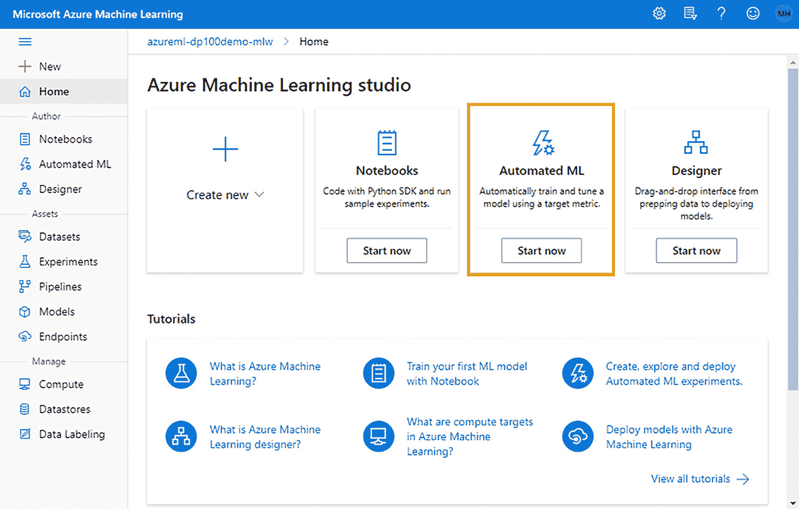
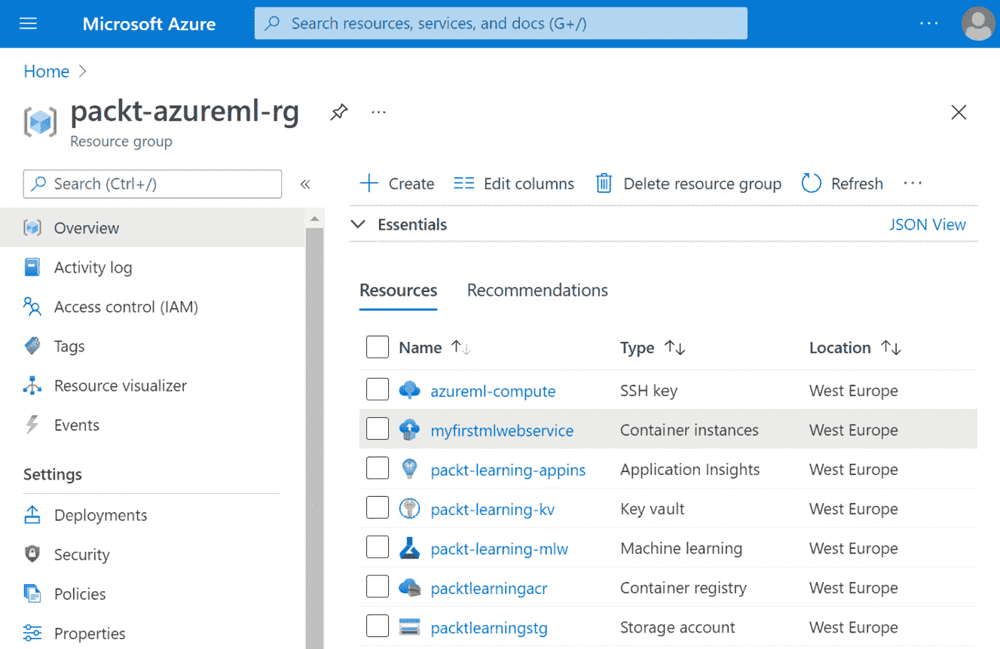

# 第五章：*第五章*：让机器来训练模型

在本章中，你将创建你的第一个 **自动化机器学习**（**自动化 ML** 或 **AutoML**）实验。AutoML 是指尝试多种建模技术并选择在你指定的训练数据集上产生最佳预测结果的模型的过程。首先，你将浏览 Azure 机器学习工作室 Web 体验中的 AutoML 向导，并了解需要配置的不同选项。然后，你将学习如何监控 AutoML 实验的进度，以及如何将最佳模型作为 Web 服务部署到 **Azure 容器实例**（**ACI**）中，从而能够进行实时推断。

通过坐在电脑前并带着这本书，你可以顺利完成本章内容。通过结合使用你的 Azure 订阅和本书，你可以开始你的 AutoML 之旅。

在本章中，我们将覆盖以下主要内容：

+   配置 AutoML 实验

+   监控实验的执行

+   将最佳模型部署为 Web 服务

# 技术要求

你需要访问 Azure 订阅。在该订阅中，你需要一个 `packt-azureml-rg`。你需要拥有 `Contributor` 或 `Owner` 权限的 `packt-learning-mlw`，如 *第二章* 中所述，*部署 Azure 机器学习工作区资源*。

# 配置 AutoML 实验

如果你被要求训练一个模型来对数据集进行预测，你需要做几件事，包括数据集的归一化、将数据集拆分为训练数据和验证数据、运行多个实验以了解哪种算法在数据集上的表现最佳，然后对最佳模型进行微调。自动化机器学习通过完全自动化耗时的迭代任务，缩短了这个过程。它允许所有用户，从普通 PC 用户到经验丰富的数据科学家，都可以针对目标数据集构建多个机器学习模型，并根据你选择的度量标准选择表现最好的模型。

该过程包括以下步骤：

1.  **准备实验**：选择你将用于训练的数据集，选择你要预测的列，并配置实验的参数。这是你将在本节中阅读到的配置阶段。

1.  **数据保护措施**：这是执行实验的第一步。它对提供的训练数据集进行基本的数据保护措施。AutoML 尝试识别数据中的潜在问题；例如，你要预测的列中所有的训练数据必须具有相同的值。

1.  **训练多个模型**：训练多种数据规范化和算法的组合，以找到最佳模型，从而优化（最大化或最小化）所需的度量标准。这个过程将一直持续，直到满足退出标准：时间限制或指定的模型性能目标。

1.  **创建集成模型**：在这里，你训练一个模型，它结合了到目前为止训练的最佳模型的结果，并生成一个可能改进的推断。

1.  **选择最佳模型**：根据你指定的度量标准，选择最佳模型。

Azure 机器学习提供了一个基于网页的向导，允许你配置这样的实验。在*第三章*中，*Azure 机器学习工作室组件*，你探讨了**Azure 机器学习工作室**网页体验。

在这一章中，你将创建一个自动化机器学习分类模型，该模型将预测一个客户是否会流失。这个模型能够预测客户是否会继续成为忠实客户，或者他们是否会终止他们的活动手机合同。你将使用来自一个虚构电信公司的虚构数据集。数据集显示了每个客户与公司合作的时长以及他们的活动订阅使用情况。让我们开始吧：

1.  要开始 AutoML 实验，你需要打开浏览器并导航到 Azure 机器学习工作室。你将进入首页，如下图所示：

    图 5.1 – Azure 机器学习工作室首页

1.  在 Azure 机器学习工作室的首页上，通过点击**自动化机器学习**下方的**立即开始**按钮，进入**作者** | **自动化机器学习**部分，如前面截图所示。这将打开**自动化机器学习**首页，如下图所示：

    图 5.2 – 自动化机器学习首页

    在这个首页上，你可以找到最近执行的自动化机器学习实验。由于这是你第一次使用这个工作区，你应该不会看到任何运行记录。

1.  通过点击**新建自动化机器学习运行**按钮，你将启动**创建新自动化机器学习**向导，如下所示：

图 5.3 – 启动自动化机器学习向导

在向导的第一步，名为**选择数据集**，你可以选择一个现有数据集或创建一个新的数据集。从这个列表中，你将能够看到在*第四章*中注册的两个数据集，*配置工作区*。你不需要这些数据集。在下一节中，你将学习如何创建一个新的数据集，以便用于即将执行的自动化机器学习实验。

## 注册数据集

在**自动化机器学习**向导的**选择数据集**步骤中，你可以注册一个新的数据集，用于 AutoML 实验。按照以下步骤注册虚构的客户流失数据集：

1.  点击屏幕顶部的**创建数据集**。

1.  从出现的下拉菜单中选择**来自网页文件**。这将启动**从网页文件创建数据集**向导，见下图。

1.  向导的第一页（`churn-dataset`）。

    c) `表格型`。这是一个无法更改的选项，因为 AutoML 目前只支持表格型数据集。

    d) `用于训练预测客户流失模型的数据集`：

    

    图 5.4 – 从网页文件创建数据集时的基本信息

1.  填写完所有内容后，点击**下一步**。下载和解析文件需要一段时间。向导将转到**设置和预览**屏幕：

    图 5.5 – 从网页文件创建数据集向导的设置和预览屏幕

1.  前面截图中显示的步骤提供了演示数据集的重要信息。样本文件的文件格式被自动检测为**Parquet**格式。如果需要，你可以修改选择。

    演示数据集包含七列：

    +   **ld**是一个顺序记录号，不属于原始 Parquet 文件。AutoML 生成此序列号，以便你验证预览窗口中看到的数据。此列将不包含在注册数据集中。

    +   **id**是一个字符串，唯一标识数据集中的每个客户。

    +   **customer_tenure**是一个整数值，告诉我们每个客户在虚构的电信公司服务了多长时间。该值表示月份。

    +   **product_tenure**是一个整数值，告诉我们客户当前活跃订阅的时长，单位为月。

    +   **activity_last_6_month**告诉我们客户在过去 6 个月里通话的小时数。

    +   **activity_last_12_month**告诉我们客户在过去 12 个月里通话的小时数。

    +   **churned**是一个标志，告诉我们客户是否续订了订阅或终止了活跃的合同。这是你将要预测的列。

        从这个虚构的数据集中，构建你所尝试的分类模型的最相关特征是**customer_tenure**、**product_tenure**、**activity_last_6_month**和**activity_last_12_month**。**churned**列是你试图构建的模型的**目标**。**id**列允许你将模型的预测结果与可能流失的实际客户关联。

1.  点击`Date`作为列的类型，你可以选择此列是否为时间戳，这将使数据集标记为时间序列数据集。将`Date`作为列的类型后，你可以定义用于解析特定列的日期模式。例如，你可以使用`%Y-%m-%d`来指定日期的存储格式为年-月-日。

1.  完成探索向导的**模式**屏幕后，按下**下一步**。向导的**确认详情**页面提供了你想要在工作区中注册的新数据集的概览，如下所示：

    图 5.7 – 确认详情页面

    此页面总结了你在*第四章* *配置工作区*节中阅读的数据集信息。如果你选择了**创建后配置此数据集**复选框，你可以选择一个计算目标来生成新创建的数据集的配置文件。由于该数据集仅有 6,720 行，Azure ML 会自动为你提供完整的配置文件，因此无需手动生成。

1.  点击**创建**按钮以完成向导。

现在你已经注册了`churn-dataset`，可以继续进行 AutoML 向导，在此步骤中，你将选择新注册的数据集、配置实验参数并启动 AutoML 过程，这将在下一节进行。

## 返回到 AutoML 向导

现在你已经创建了`churn-dataset`，可以继续进行 AutoML 向导。向导包含三个步骤，如下图所示：

图 5.8 – AutoML 向导步骤

让我们开始步骤吧！

1.  首先，选择在上一节*注册数据集*中创建的`churn-dataset`，然后点击**下一步**，如图所示：

    图 5.9 – 创建新自动化 ML 运行向导的选择数据集步骤

1.  在`churn-automl-experiment`中，选择`churned`列。根据目标列的类型，向导将自动选择该列的最佳任务，如你将在下一个向导步骤中看到的。

1.  这里是`gpu-cluster`，你在*第四章* *配置工作区*节中创建的集群。如果你在工作区中没有注册集群，可以使用计算实例，或者通过点击`gpu-cluster`启动专用向导。默认情况下，免费试用订阅不允许配置 GPU 计算资源。对于此实验，你可以选择基于 CPU 的集群，而非基于 GPU 的集群。

1.  配置运行详情后，点击**下一步**按钮。

1.  向导的下一页是**选择任务和设置**页面，如下图所示：

    图 5.11 – 创建新的自动化机器学习运行向导 – 选择任务类型

    在此步骤中，你可以配置以下内容：

    a) **选择任务类型**：AutoML 当前支持三种类型的任务：

    +   **分类**：生成的模型可以预测记录所属的类别。类别可以是任何东西，例如是或否的**布尔**值，或者蓝色、绿色或黄色的颜色值。在我们的例子中，你正在尝试预测客户是否会流失，这个问题可以通过“是”或“否”来回答。

    +   **回归**：当你想预测一个数值时，比如公寓的价格或糖尿病的疾病水平，可以使用回归模型。我们将在*第八章*，*使用 Python 代码进行实验*中详细讨论。

    +   **时间序列预测**：通常使用这种类型的模型来预测时间序列值，比如股票的价格，同时考虑值随时间的变化。这种类型的模型是回归模型的一个专项扩展。这意味着所有回归模型都可以使用，但也有一些更专业的算法，比如 Facebook 的**Prophet**算法或**自回归积分滑动平均**（**ARIMA**）技术。

    根据你选择的目标列，向导将自动猜测你要执行的任务。在我们的例子中，它选择了**分类**。

    b) **查看额外的配置设置**：根据你选择的任务类型，你可以配置各种设置，包括用于评估模型的目标指标以及终止模型搜索的退出标准。根据任务类型的不同，向导页面上的选项会有所变化。你可以在下图中看到一些选项。你将在*步骤 5*中访问这一部分：

    

    图 5.12 – 根据选择的任务类型配置设置

    c) **查看特征化设置**：这允许你配置与模型预测相关的特征操作。在此部分，你可以排除一些特征，比如行唯一 ID 或无关信息，以加快训练过程并减小最终模型的大小。你还可以指定每个特征的类型和插补函数，后者负责处理数据集中的缺失值。你将在*步骤 6*中访问此部分。

1.  除非有理由修改，否则通常可以点击`auto`。默认情况下，如果行数少于 1,000，则使用 10 折交叉验证；如果行数在 1,000 和 20,000 之间，则使用 3 折交叉验证；如果行数超过 20,000，则数据集会被划分为 90%的训练数据和 10%的验证数据。

1.  `0.5`，即半小时或 30 分钟。你可以保留其余选项不变，如前面的截图所示。点击**保存**，返回到你在*步骤 4*中看到的**选择任务类型**页面。

1.  点击**查看特征化设置**，将打开**特征化**屏幕，如下所示：

    图 5.14 – 创建 AutoML 向导中的特征化视图

    在此屏幕上，你可以定义影响训练过程数据准备阶段的操作。可以配置以下选项：

    +   **包含**：你可以排除不应被算法考虑的列。目标列无法排除。

    +   **特征类型**：默认情况下，选择了**自动**值，它会自动检测数据集中每一列的类型。类型可以是以下之一：**数值型**、**日期时间型**、**类别型**、**类别哈希型**或**文本型**。如果你愿意，也可以手动配置某一列为可用的类型之一。

    +   **使用填充**：如果数据集中有缺失值，该选项将根据所选方法进行就地填充。你可以选择的选项有**自动**（默认选项）、**最常见值**和**填充常数**。特别是对于**数值型**特征，你还可以使用**均值**或**中位数**填充策略。

        重要提示

        假设你有一个产品 ID 特征，明确说明每个客户注册的订阅产品。该特征将具有诸如 1,055 和 1,060 之类的数值。即使该特征实际上是类别型的，它可能会被错误地标记为数值型特征。如果训练数据集中缺少某些值，自动方法可能会用平均产品 ID 填充缺失值，这显然没有意义。AutoML 足够智能，能够理解如果一个数值型特征只有几个唯一值重复出现，则该特征可能是类别型的，但你可以通过将其标记为**类别型**来明确协助机器学习模型进行**特征类型**配置。

1.  在这个向导页面上，你应该排除**id**特征。**id**特征提供了有关实际客户的信息，但它与分类问题无关，因此应该排除，以节省计算资源。点击**保存**，返回到你在*步骤 4*中看到的**选择任务类型**页面。

通过点击**完成**，如*图 5.11*所示，你可以完成 AutoML 实验的配置，运行将自动开始。浏览器将重定向到 AutoML 运行执行页面，你可以在该页面监控 AutoML 训练过程并查看训练结果。在下一节中，你将探讨该页面。

# 监控实验执行

在前一节中，*配置自动化 ML 实验*，你提交了一个 AutoML 实验以在远程计算集群上执行。一旦你提交了作业，浏览器应该会将你重定向到一个类似于以下的页面：

图 5.15 – 自运行完成以来第一次运行新的自动化 ML 实验

在页面顶部，实验运行的名称是自动生成的。在前面的截图中，名称是`AutoML_05558d1d-c8ab-48a5-b652-4d47dc102d29`。点击铅笔图标，你可以编辑此名称并将其更改为更易记的名称。将名称更改为`my-first-experiment-run`。在运行名称下方，你可以点击以下命令之一：

+   **刷新**：这将刷新页面上提供的信息。在运行实验时，你可以获得最新的、最准确的信息。

+   **生成笔记本**：这将创建一个包含所有所需 Python 代码的笔记本，用于使用 Azure ML SDK 运行相同的实验。你将在*第八章*《使用 Python 代码实验》中了解更多关于运行 AutoML 实验所需代码的内容。

+   **取消**：这将取消当前的运行。仅当实验仍在运行时，此选项才可用。

    重要提示

    当你取消运行时，可能需要一段时间才能完成取消操作。你可以点击**刷新**按钮，查看取消过程的进度。

+   **删除**：这将删除所选的运行记录。仅在运行已取消或已完成执行时才可启用。

运行实验页面提供了关于整个过程的大量信息，并通过标签进行结构化。默认情况下，你将从名为**详细信息**的标签开始。在此标签中，你将找到以下重要信息：

+   在前面截图左侧的**属性**框中，最重要的信息位于以下字段：

    a) **状态**，描述当前运行的状态。可以是正在运行、已取消、出错或已完成。

    b) **计算目标**是运行所在的计算位置。

    c) **原始 JSON** 是一个链接，允许你以机器可读格式查看当前运行的所有配置信息。

+   在右侧的**运行摘要**框中，您将找到**任务类型**，即您正在训练的模型类型。点击**查看配置设置**，您可以查看当前实验的配置参数摘要。

+   **描述**框允许您记录当前实验中正在评估的假设。点击铅笔图标，您可以添加实验运行的描述信息，这些信息将帮助您回忆在此实验中要寻找的内容以及结果。

运行页面的第二个选项卡名为**数据防护**。此选项卡提供关于您在实验中使用的数据集的详细定性和定量信息。根据任务类型，您将执行不同类型的验证。如果一切正常，则每个验证的状态为**已通过**；如果数据集存在需要解决的问题，则为**已失败**；如果 AutoML 发现数据集问题并已为您修复，则为**已完成**。在**已完成**的情况下，您可以通过点击**+查看详细信息**按钮查看 AutoML 修复数据集时的附加信息。

第三个选项卡称为**模型**，其中包含 AutoML 迄今为止训练的所有模型列表，如*图 5.16*所示。具有最佳指标分数的模型将列在顶部。表格显示**算法名称**、特定模型的解释结果（如果有）（**已解释**）、模型的分数（此处为**准确率**）、用于训练模型的数据百分比（**采样**）、以及模型训练的时间和持续时间信息（**创建**和**持续时间**列）。如果您从列表中选择一个模型，将启用以下三个命令：

+   **部署**启动选定模型的部署，您将在下一节了解有关部署的内容。

+   `model.pkl`，其中包含实际训练的模型和执行推理所需的所有支持文件。

+   **解释模型**启动**解释**向导，在该向导中，您需要选择一个**计算集群**来计算特定模型的解释。默认情况下，AutoML 将解释最佳模型，但您可能希望解释额外的模型以进行比较。一旦计算出解释，您可以通过点击**查看解释**在**已解释**列中查看它们。这将打开所选模型的**解释**选项卡，其中会显示报告。您将通过*第十章*《理解模型结果》进一步了解模型可解释性。

主页面上的第四个标签页，称为**输出 + 日志**，以简单的文件浏览器显示特定运行的输出和日志。这些日志是整个 AutoML 过程的日志。如果你想查看特定模型训练过程的日志，你需要从**模型**标签页中选择该模型，然后访问该子运行的**输出 + 日志**部分。该标签页中的文件浏览器允许你浏览左侧的文件夹结构。如果选择了一个文件，其内容将在右侧显示。

到目前为止，你已经成功训练了一些模型，并查看了最佳模型来预测客户是否会流失。在下一节中，你将学习如何仅通过几个点击操作将此模型投入使用。

# 将最佳模型作为 Web 服务进行部署

在上一节中，你浏览了运行实验页面，回顾了与运行执行相关的信息以及探索结果，即经过训练的模型。在本节中，我们将重新访问**模型**标签页，并开始将最佳模型作为 Web 服务进行部署，以便进行实时推理。导航到运行的详情页面，如*图 5.15*所示。让我们开始吧：

1.  点击**模型**标签页。你应该会看到类似于这里显示的页面：

    图 5.16 – 模型标签页作为部署模型的起点

1.  在此列表中，你可以选择任何你想要部署的模型。选择包含最佳模型的行，如前面的截图所示。点击列表顶部的**部署**命令。将出现**部署模型**对话框，如此处所示：

    图 5.17 – 部署模型对话框

1.  在`myfirstmlwebservice`中。

1.  **计算类型**：你可以选择两种类型：

    +   **Azure Kubernetes 集群**（**AKS**）：当你想为生产工作负载部署模型并且处理多个并行请求时，应该选择此选项。该选项支持基于密钥和基于令牌的身份验证，如果你想保护端点，可以使用它。如果你希望更快地进行模型推理，它还支持使用**现场可编程门阵列**（**FPGAs**）。在这种情况下，你还需要指定要部署模型的 AKS 集群的**计算名称**属性。该列表应包含你在*第四章* *配置工作区*中可能注册的所有推理集群。

    +   **Azure 容器实例**：如果你计划进行功能测试，或者想在开发环境中部署模型，你可以将 Web 服务作为单一的 Azure 容器实例进行部署。这种计算类型较为便宜，但不支持扩展，并且只支持基于密钥的认证。对于本书内容，你可以选择这种类型来部署模型。

1.  通过点击**部署**，你可以开始部署模型。

    在浏览器的右上角，将会出现一个弹出窗口，如下图所示，告知你模型已开始部署：

    

    图 5.18 – 端点部署窗口 – 部署进行中

1.  弹出窗口会迅速消失，但你可以通过点击右上角的通知**铃铛**图标重新查看，如下图所示：

    图 5.19 – Azure 机器学习工作室右上角的任务栏

1.  模型部署需要几分钟时间。你可以查看通知来检查部署进度。如果通知变为绿色，如下图所示，则表示部署已完成：

    图 5.20 – 端点部署窗口 – 部署完成

1.  通过点击通知中的**部署详情**链接，浏览器将会把你重定向到已部署模型的端点页面，如下图所示：

    图 5.21 – 已部署模型的端点页面

    重要提示

    有多种方法可以访问模型的端点页面。例如，你可以通过进入 Azure ML Studio 中的 **资产** | **端点** 菜单来查看所有已发布的端点列表。要到达相同的页面，请选择你要检查的端点。

    已部署模型的端点页面与实验运行页面类似，采用基于标签的结构。第一个标签叫做 **详情**，提供有关模型部署的信息。其中，最重要的信息位于前面截图中的 **属性** 区域，具体如下：

    +   **服务 ID** 是你在部署向导的 *步骤 3* 中指定的服务名称。

    +   **部署状态** 显示已部署或待部署模型的状态。端点可以处于五种状态。你可以在本章的 *进一步阅读* 部分找到更多关于状态及潜在问题的信息。

    +   **REST 端点**是你可以复制到应用程序代码中的链接，用来通过 REST API 调用已部署的模型。

1.  第二个标签页叫做**测试**，允许你测试已部署的模型。默认情况下，你会看到**字段**模式，这是一个表单，包含模型期望的所有输入，如下所示：

    图 5.22 – 已部署模型的端点页面

1.  如果你想执行小批量推理，即一次发送多个记录，你可以从右上角切换到**CSV**模式。在此模式下，你可以将 CSV 文件的内容复制到将出现的文本框中，然后点击**测试**按钮。

    在任意模式下，一旦你点击**测试**按钮，输入数据将被提交到 REST API，并且会返回结果。

1.  端点页面的第三个标签页叫做`swagger.json`，它是自动生成的，位于端点中。这个文件描述了 REST API 的预期输入和输出，通常由 web 开发人员使用来提供有关他们生产的 REST 端点的文档。

1.  最后，**部署日志**标签页展示了模型部署的详细日志。你可以使用这个标签页来排查潜在的部署问题。

恭喜你 – 你已经成功部署了自己的实时端点，用于推断客户是否会流失！在下一节中，你将了解模型部署时创建的工件。

## 理解模型的部署

在上一节中，你将模型作为 REST 端点进行部署。在这一节中，你将了解幕后发生了什么，并发现部署过程中生成的工件。

你从 AutoML 训练出的模型列表开始。在这个列表中，你选择了一个模型并点击了**部署**命令。通过这样做，你将选定的模型注册到了 Azure ML 工作区，并且一旦完成，过程就继续进行，部署端点，正如下图所示：

图 5.23 – 从 AutoML 模型列表到端点部署

模型注册在 Azure ML 工作区内创建了一个版本化记录，允许你跟踪用于训练特定模型的数据集以及该模型部署的位置。你将在*第十二章*，“*用代码实现模型运作*”中了解更多有关模型注册的信息。让我们来看看：

1.  要查看这个模型注册，在 Azure ML Studio 中，导航至**资产** | **模型**。你将进入**模型列表**页面，如下所示：

    图 5.24 – 模型列表页面

    **模型列表**页面列出了 Azure ML 工作区中所有注册的模型。这些是由工作区跟踪的模型。每个模型都有一个唯一名称。您可以拥有同一模型的多个版本，当您尝试注册具有相同名称的模型时，这将自动发生。模型列表允许您选择一个模型并对其执行各种操作，如删除和部署它。

    重要提示

    只有当注册的模型没有被任何端点使用时，您才能删除它。

1.  点击模型的**名称**属性后，您将进入所选注册模型的详细信息页面，如下所示：

    图 5.25 – 注册模型详细信息页面

    在这里，您可以获取有关模型的一般信息，比如是哪个运行训练了特定模型，使用了什么框架，以及该运行注册的实验名称。请注意，由于该模型是使用 AutoML 训练的，因此其框架是通用的 AutoML 框架。在*第十二章*，《通过代码实现模型运营》中，您将能够注册自己的模型，并指定您用来训练模型的框架。

    在**工件**标签中，您将找到**model.pkl**文件，其中包含训练好的模型。在**解释**和**公平性**标签中，如果已经为特定模型生成了解释性结果，您可以查看这些结果。您将在*第十章*，《理解模型结果》中深入了解模型解释性。在**数据集**标签中，您可以看到用于配置 AutoML 实验时使用的特定版本数据集的引用。这使得您可以在训练数据集与已部署的模型之间建立传承关系。

1.  一旦模型被注册，部署向导将创建一个端点。返回到 Azure ML Studio，点击**资产** | **端点**菜单项。这将带您进入如下所示的**端点**页面：

    图 5.26 – 端点页面

    该列表显示了您从此 Azure ML 工作区部署的所有实时端点。您会注意到**myfirstmlwebservice**端点，这是您在上一节中部署的。点击其名称，您将进入端点页面，这个页面您在*图 5.21*中已经看过。

1.  在幕后，这个端点是一个部署在`packt-azureml-rg`中的容器实例，紧邻您的 Azure ML 工作区资源。导航至 Azure 门户并打开`packt-azureml-rg`。您应该能看到与这里展示的资源类似的内容：

    图 5.27 – Azure 门户中 packt-azureml-rg 资源组的资源

1.  在这里，你将看到一个名为**myfirstmllwebservice-<random id>**的**容器实例**已被部署，这是你在*图 5.26*中看到的端点的名称。这是托管你在上一节中部署的 REST API 的引擎。

    重要说明

    切勿直接从资源组删除 Azure ML 工作区的工件。这将导致工作区中出现孤立的注册项，如指向已删除容器实例的端点。

在本节中，你了解了从 AutoML 部署模型时发生的幕后过程。在下一节中，你将删除已部署的端点，以避免为不需要的实时端点支付费用。

## 清理模型部署

在本节中，你将清理已部署的模型。你应该删除那些不打算使用的模型部署。否则，你将为未使用的已配置资源付费。

导航到 Azure ML Studio。点击`myfirstmlwebservice`端点并点击**删除**命令。在弹出的窗口中点击**删除**以确认你要删除该端点：

图 5.28 – 删除实时端点弹窗

在确认后，你在 Azure 门户中看到的端点和容器实例将被删除。如果你愿意，可以通过访问`packt-azureml-rg` **资源组**来验证此操作。

# 总结

在本章中，你学习了如何配置 AutoML 过程，以发现能够预测客户是否会流失的最佳模型。首先，你使用 Azure 机器学习工作室的 AutoML 向导来配置实验。然后，你在工作室界面的**实验**部分监控运行的执行。一旦训练完成，你查看了训练好的模型，并查看了存储的关于最佳模型的信息。接着，你在 Azure 容器实例中部署了该机器学习模型，并测试了实时端点是否能够执行所请求的推断。最后，你删除了部署，以避免在 Azure 订阅中产生费用。

在下一章中，你将继续探索 Azure 机器学习工作室体验中的无代码/低代码部分，通过查看设计器，设计器允许你图形化地设计训练管道并实现生成的模型。

# 问题

你需要训练一个分类模型，但在 AutoML 过程中只考虑线性模型。以下哪项可以让你在 Azure 机器学习工作室体验中实现这一点？

a) 将所有非线性算法添加到阻止算法列表中。

b) 将退出标准选项设置为度量得分阈值。

c) 禁用自动特征化选项。

d) 在分类任务中禁用深度学习选项。

# 进一步阅读

本节提供了作为有用的网络资源的额外内容：

+   关于 AutoML 的基本概念：

+   [`docs.microsoft.com/azure/machine-learning/concept-automated-ml`](https://docs.microsoft.com/en-us/azure/machine-learning/concept-automated-ml)。

+   深入了解如何使用 AutoML：[`docs.microsoft.com/azure/machine-learning/how-to-use-automated-ml-for-ml-models`](https://docs.microsoft.com/en-us/azure/machine-learning/how-to-use-automated-ml-for-ml-models)。

+   sklearn 中的交叉验证：[`scikit-learn.org/stable/modules/cross_validation.html`](https://scikit-learn.org/stable/modules/cross_validation.html)。

+   了解端点的服务状态：[`docs.microsoft.com/azure/machine-learning/how-to-deploy-and-where?tabs=azcli#understanding-service-state`](https://docs.microsoft.com/en-us/azure/machine-learning/how-to-deploy-and-where?tabs=azcli#understanding-service-state)。

+   从`swagger.json`文件生成客户端 SDK：[`swagger.io/tools/swagger-codegen/`](https://swagger.io/tools/swagger-codegen/)。
