# 第六章：*第六章*：可视化模型训练与发布

**Azure 机器学习**（**AzureML**）Studio 提供了一个设计器体验，帮助你在开发模型时通过拖放和配置训练与推理管道。在本章中，你将概览设计器。随后，你将创建一个训练过程。在了解设计器使用的整体流程后，本章将通过创建一个推理管道并将训练好的模型工件发布为服务端点来结束。

在本章中，我们将覆盖以下主题：

+   设计器概述

+   设计训练过程

+   创建批量和实时推理管道

+   部署实时推理管道

# 技术要求

你需要拥有 Azure 订阅。在该订阅中，你需要一个`packt-azureml-rg`。此外，你需要有`Contributor`或`Owner`角色的`packt-learning-mlw`，具体如在*第二章*中所述，*部署 Azure 机器学习工作区资源*。

你还需要在你的工作区中注册`churn-dataset`，该工作区是在*第五章*中创建的，*让机器来进行模型训练*。

# 设计器概述

AzureML Studio 提供了一个图形化设计器，可以让你以可视化方式创建管道。根据定义，管道是一个可以独立执行的子任务流，描述了一个机器学习任务。在设计器中，你可以创建三种类型的管道：

+   **训练管道**：这些管道用于训练模型。

+   **批量推理管道**：这些管道用于将预训练模型用于批量预测。

+   **实时推理管道**：这些管道用于暴露一个 REST API，允许第三方应用程序使用预训练模型进行实时预测。

要创建批量和实时管道，你需要先编写一个训练管道。在接下来的部分中，你将学习如何创建训练管道，然后在此基础上生成批量和实时管道。在*第十一章*中，*与管道协作*，你将学习如何通过代码编写类似的管道。

要开始编写管道，你需要访问**设计器**主页。点击**设计器**菜单项，导航到主页，如下图所示：

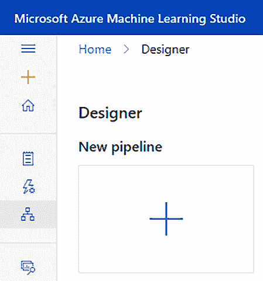

图 6.1 – 设计器主页

在**新建管道 +** 按钮旁边，你将看到几个其他按钮，带有不同的现成示例管道。稍后请熟悉这些示例。为了展示设计器的最新功能，这些示例会定期更新，且它们是一个很好的入门资源。

在本章中，我们将从零开始创建一个新的管道。点击**+**按钮将带你进入创作视图/屏幕，我们将在下一节中探索这个视图。

## 创作视图

使用设计器构建管道的主页面如下所示：

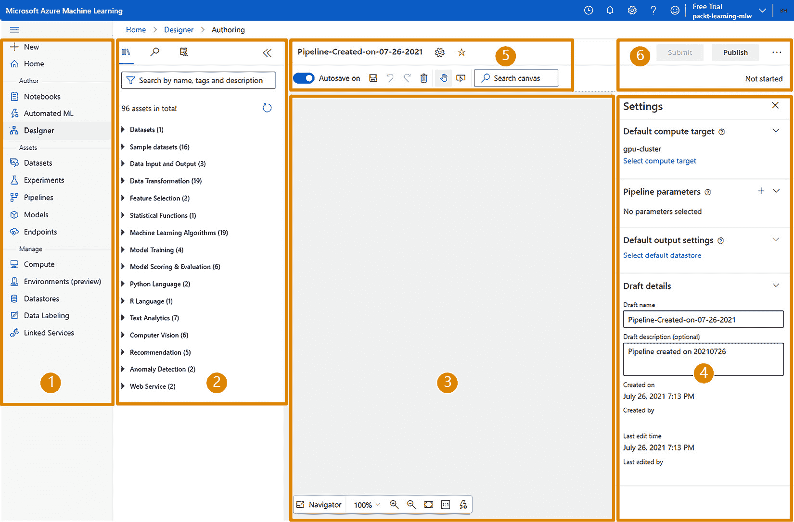

图 6.2 – AzureML 设计器创作视图

我们将在这里描述主页面的用户界面，前面的截图作为参考：

+   通过点击左上角的汉堡菜单图标 (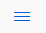)，你可以隐藏或显示前面截图中标记为**1**的 AzureML 主菜单。从现在起，我们假设该区域已被隐藏。

+   在标记为**2**的区域，你可以找到所有可以拖放到画布上的资产，这些资产在前面的截图中被标记为**3**。通过将不同的资产拖放到画布上，你可以构建一个管道。你将在本章的*了解资产库*部分深入了解该区域。

+   在右侧标记为**4**的区域，你将找到设置。这个区域也被称为详情页。此视图会根据你在画布中选择的内容而变化。如果你在画布区域中没有选择任何资产，你将看到你正在构建的管道的设置，并且可以选择一个**默认计算目标**来执行每个管道步骤。如果你选择了一个资产，你将找到该资产的各种配置选项。

+   区域`test-pipeline`。

+   在区域**5**，你还会找到**设置**按钮 (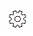)。通过该按钮，你可以隐藏/显示前面截图中标记为**4**的**设置**区域。在同一区域，你还可以找到其他图标，用于保存或删除管道，以及在画布上进行**撤销、重做和搜索**操作。**选择**工具 () 是画布上的标准光标。稍后，在我们构建管道时，我们将切换到**手型**工具 () 来移动画布上选中的部分。点击**设置**以隐藏区域**4**，并扩大画布区域。

+   最后一个区域，在前面截图中标记为**6**，提供了**提交、发布和克隆**管道的功能，我们将在*创建批处理和实时推理管道*部分中讨论。

在继续下一节之前，你需要配置管道用于执行所有步骤的**默认计算目标**属性。打开管道设置，并选择你在*第五章*中使用的计算集群，*让机器进行模型训练*。

在下一部分，你将探索标记为**2**的区域，也被称为*资产库*。

## 了解资产库

要构建管道，你需要将不同的资产拼接在一起。在本节中，你将查看设计器的资产库中可用的不同资产。在*图 6.2*中，我们有 96 个可用的资产。这个数字取决于你在 AzureML 工作区中注册了多少数据集，并且在 AzureML 的未来版本中，你甚至可能能够创建自己的编码资产。下图显示了资产库中可用的类别以及它们包含的资产类型（也称为模块）的简要说明：

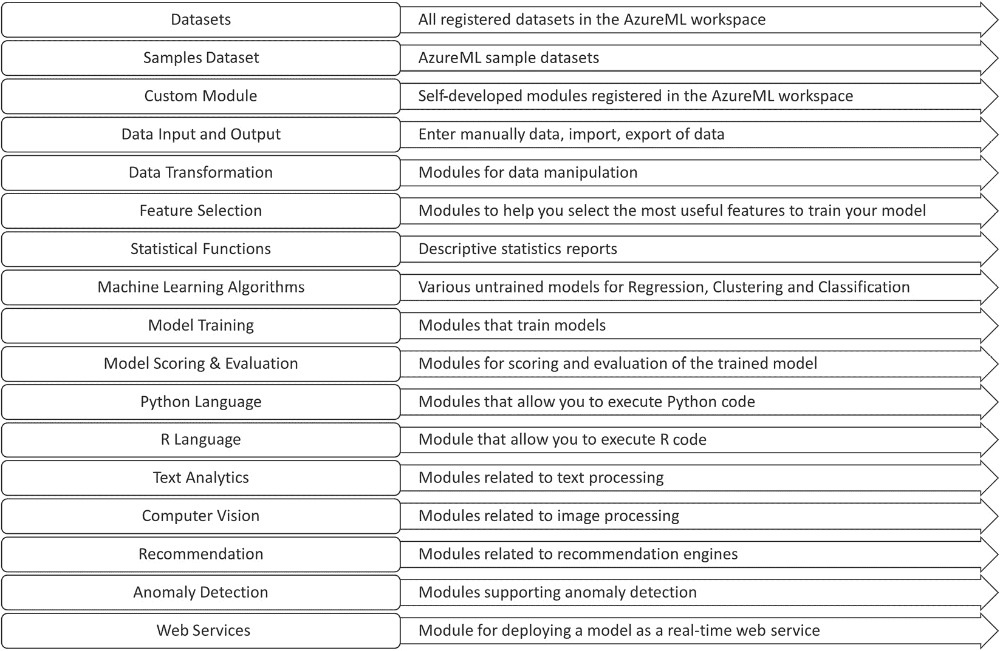

图 6.3 – AzureML 设计器资产库中的类别

这个库中有三种类型的资产：

+   数据集和手动输入的模块

+   未训练的模型

+   执行某些数据操作的模块

在你构建第一个端到端机器学习训练管道时，你将从这个资产库中拖放组件。在接下来的章节中，你将看到每个资产的外观以及如何在它们之间连接不同的资产。

## 探索资产的输入和输出

我们从资产库中拖放的每个资产都是我们正在构建的管道中的一个模块。一个模块看起来类似于以下截图中显示的示例模块：

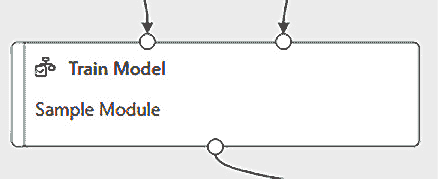

图 6.4 – 一个具有两个输入和一个输出的示例模块

让我们从上到下描述这个模块：

+   顶部有零个、一个或多个输入端口：在前面的截图中，示例模块接受两个输入。你可以将另一个模块的输出连接到下一个模块的输入。

+   在模块的中间，模块名称描述了该模块的功能。我们的示例是一个**训练模型**模块，它会使用右侧输入端口给定的数据训练一个从左侧输入端口传入的未训练模型。

+   如果你在画布中选择模块，模块的详情页面将出现在*图 6.2*中标记为**4**的区域。这一页面对于每个模块都是不同的。你可以配置各种选项，如短描述或将执行该特定模块的计算目标。

+   在模块名称下方，你可以看到该模块的描述文本。你可以通过选择模块并编辑模块详情页面上的文本来修改该描述。在我们的示例中，模块描述显示的是**示例模块**的文本。

+   在模块的底部，有一个或多个**输出端口**，你可以将它们拖动并连接到下一个模块。

在本节中，你已经探索了 AzureML Studio 设计器的各个方面。在下一节中，你将开始编写你的第一个训练管道。

# 使用设计器构建管道

在本节中，我们将创建一个训练管道，用于训练在上一章中使用的**客户流失**数据集的机器学习模型。

当你开始设计训练流程时，我们建议采用如下图所示的*7 步机器学习*方法，它包含了创建机器学习模型所需的所有步骤：

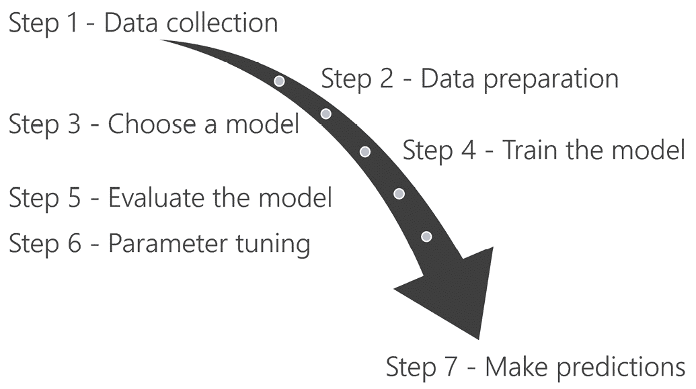

图 6.5 – 7 步机器学习

这 7 步的旅程是现实场景中的宝贵清单，可以确保你不会遗漏任何步骤。在这个过程中，你将需要各种组件、转换和模型，这些都可以在资产库中找到。为了简化流程，我们将跳过一些你设计的流程中的步骤。在这一节中，你将从准备数据集开始，准备好训练模型。然后，你将评估模型并存储它。在下一节中，你将使用该模型创建批处理和实时流水线，利用模型进行预测。

让我们从获取将用于训练模型的数据开始，这将在下一节中进行。

## 获取数据

第一步是选择你将用于训练模型的数据集：

1.  在资产库中，点击**数据集**类别旁的箭头展开。你应该可以看到你在*第五章*中创建的**流失数据集**，*让机器进行模型训练*：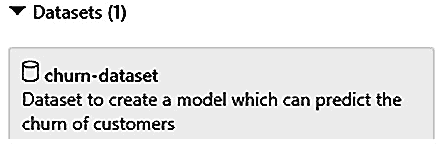

    图 6.6 – 数据集类别下的流失数据集

1.  将**流失数据集**拖动到画布上：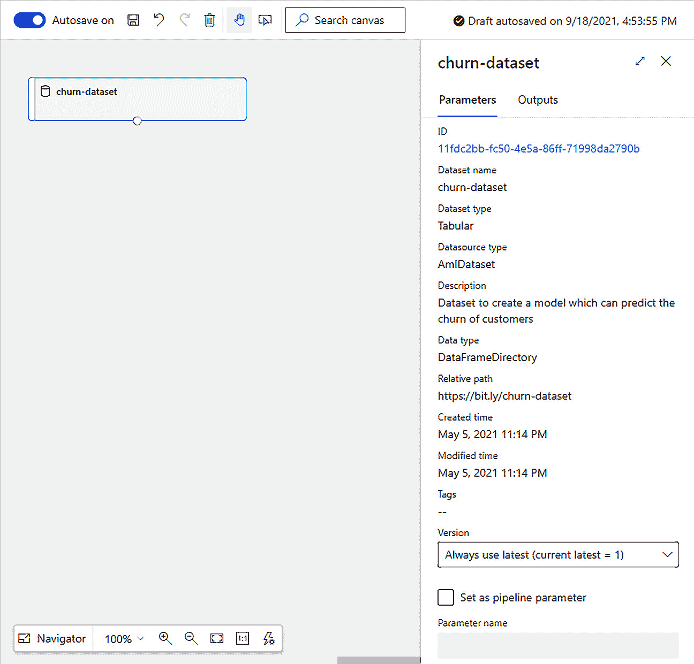

    图 6.7 – 带有流失数据集的画布

    到此，你已经完成了**数据收集**步骤，意味着你可以进入*7 步机器学习*的第二步。

1.  下一步是**数据准备**。通过拖动**选择数据集中的列**模块，将其添加到流程中，该模块可以在资产库中的**数据转换**类别下找到。

1.  现在，你需要在数据集和模块之间创建流程。你可以通过从数据集的**输出端口**（数据集底部的小圆圈）拖动到**选择数据集中的列**模块的**输入端口**（模块顶部的小圆圈）来完成，如下图所示：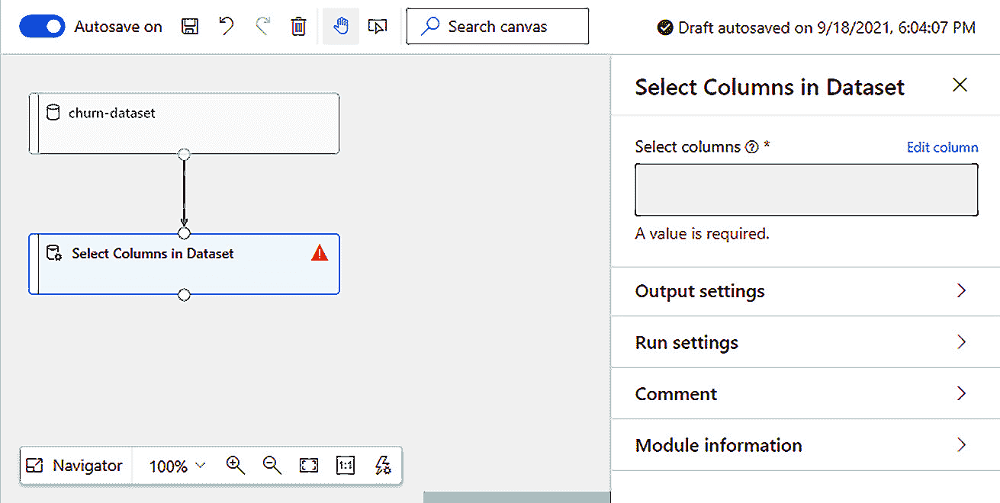

    图 6.8 – 在数据集和处理模块之间创建流程

1.  下一步是配置**选择数据集中的列**模块。选择画布上的模块后，点击画布右侧详细信息窗格中的**编辑列**链接，如上图所示。**选择列**对话框将会出现。参见以下截图，了解该弹出窗口的最终配置。

1.  在该弹出窗口中，从下拉菜单中选择**所有列**。

1.  点击**+**按钮添加第二行。

1.  从下拉菜单中选择**排除**。

1.  从第二个下拉框中选择**列名称**。

1.  从最后一个下拉框中选择**id**列。

    对话框页面应该如下所示：

    ![图 6.9 – 选择列对话框]

    ](img/B16777_06_009.jpg)

    图 6.9 – 选择列对话框

1.  点击**保存**以关闭弹出窗口。

到目前为止，你已经选择了将用于训练模型的数据集，并通过移除**id**列（在训练过程中不需要此列）准备了数据。在下一节中，你将通过添加未训练的模型、训练模型的模块以及用于评分和评估训练模型的模块来完善你的训练流程。

## 准备数据并训练模型

现在，你将选择你将要训练的模型。在*第五章*中，*让机器进行模型训练*，你确定了**投票集成**是给定数据的最佳表现模型。这种类型的模型是不同模型的组合，包括**随机森林**。为了简化示例，你将使用一个类似于**随机森林**的**两类决策森林**模型。我们开始吧：

1.  在资产库中导航到**机器学习算法**类别。你会注意到几个子类别，其中包括**分类**。从该子类别中，拖动并将**两类决策森林**模块拖放到画布上。

1.  对于模型训练，你将需要两个额外的模块：**拆分数据**模块，可以在资产库的**数据转换**类别中找到，以及**训练模型**模块，可以在**模型训练**类别中找到。将这两个模块拖放到画布上。

1.  你需要扩展你在上一节中创建的数据流，将数据传递通过新的模块。从**数据集中的选择列**模块拉取一个**输出端口**到**拆分数据**模块的**输入端口**。

1.  你需要在模块的详细信息面板中配置**拆分数据**模块，如下图所示。将**第一个输出数据集中的行比例**设置为**0.7**。这样，70%的数据将通过**左输出端口**区域传送，用于训练模型，30%的数据将通过**右输出端口**区域传送，用于测试。

1.  **训练模型**模块接受两个输入。在**左输入端口**区域，你需要传递一个未训练的模型，该模型将使用**右输入端口**区域提供的数据进行训练。从**两类决策森林**模块拉取一个**输出端口**到**训练模型**模块的**左输入端口**区域。

1.  将**拆分数据**模块的**左输出端口**区域拖动到**训练模型**模块的**右输入端口**区域。你的画布应该如下所示：![图 6.10 – 训练模型模块缺少一些配置]

    ](img/B16777_06_010.jpg)

    图 6.10 – 训练模型模块缺少一些配置

1.  在前面的截图中，**训练模型**模块中有一个橙色的感叹号。这个标记表示该模块的某些配置错误。到目前为止，你已经配置了训练模型和使用哪些数据进行训练，但你还没有定义模型要预测哪一列。这个列被称为**标签列**。要配置**标签列**，选择画布中的模块，然后点击**编辑列**链接。这将打开如下截图所示的**标签列**对话框。从下拉列表中选择**churned**列，然后点击**保存**：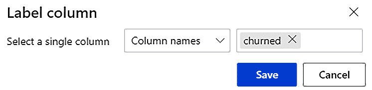

    图 6.11 – 选择模型将要预测的列

    到目前为止，训练管道已完成了*机器学习的 7 个步骤*中的前四个步骤。接下来的步骤是评估模型。

1.  将**评分模型**模块拖放到画布上，该模块可以在资产库中的**模型评分与评估**类别下找到。该模块接受训练好的模型作为**左输入端口**区域的数据，以及作为**右输入端口**区域的数据集。该模块的输出是一个包含模型对输入数据集进行推理结果的数据集。

1.  将**分割数据**模块的**右输出端口**区域连接到**评分模型**模块的**右输入端口**区域。这将创建一个数据流，将原始数据的 30%部分传递到**评分模型**模块。

1.  将**输出端口**区域连接到**训练模型**模块的**左输入端口**区域。**评分模型**模块将使用训练好的模型对输入数据进行推理。

1.  将**评估模型**模块拖放到画布上，该模块可以在资产库中的**模型评分与评估**类别下找到。该模块将比较模型所做的预测与**churned**列中存储的值。

1.  将**评分模型**模块的**输出端口**区域连接到**评估模型**模块的**左输入端口**区域。

    如果你已经按照步骤操作，画布应该如下所示：

    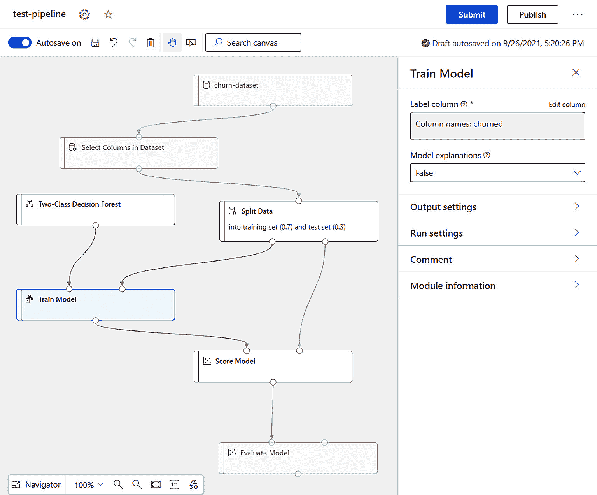

图 6.12 – 完整的训练管道

到目前为止，你已经编写了一个训练管道，完成了以下操作：

+   从数据集中移除**id**列。

+   将数据分为训练数据集和验证数据集。训练数据集包含原始数据的 70%。验证数据集包含剩余的 30%。

+   使用训练数据集训练**二类决策森林**。

+   使用训练好的模型对验证数据集进行评分。

+   通过检查评分数据集中的结果来评估模型的性能。您将能够在**评估模型**模块中查看训练模型的度量。

在下一节中，您将执行此管道来训练模型。

## 执行训练管道

在上一节中，您创建了一个完整的训练管道，接下来您将通过创建一个新的管道运行来执行它。让我们开始吧：

1.  点击右上角的**提交**按钮，**设置管道运行**对话框将打开，如下图所示。

1.  您需要创建一个新的实验并命名为**test-pipeline**。选择**创建新实验**单选按钮，然后输入该名称。

1.  请注意，管道将在您在*作者界面/视图*部分中选择的默认**计算目标**上执行。点击**提交**按钮开始执行训练管道：

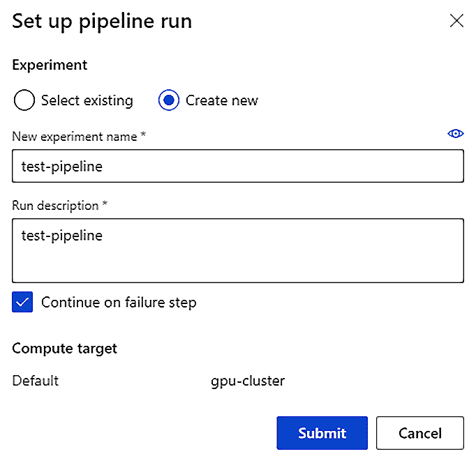

图 6.13 – 准备执行训练管道

一旦管道执行完成，设计器将类似于以下界面：

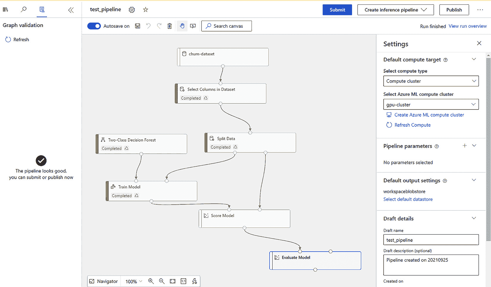

图 6.14 – 成功运行管道

至此，您已成功完成了第一个管道的开发和训练。当管道执行完成后，**创建推理管道**按钮将出现。以下部分将描述在创建推理管道时可选的不同选项。

# 创建批量和实时推理管道

本节将讨论从设计器部署推理管道的两种选项：**批量**和**实时**：

+   使用批量预测，您可以异步地对大型数据集进行评分。

+   使用实时预测，您可以实时地对一个小数据集或一行数据进行评分。

当您创建一个推理管道时，无论是批量的还是实时的，AzureML 会处理以下事项：

+   AzureML 将训练好的模型和所有训练数据处理模块作为资产，存储在**数据集**类别下的资产库中。

+   它会自动删除不必要的模块，如**训练模型**和**拆分数据**。

+   它将训练好的模型添加到管道中。

特别是对于实时推理管道，AzureML 将在最终管道中添加**Web 服务输入**和**Web 服务输出**。

让我们从创建一个批量管道开始，这将是您在下一节中要做的事情。

## 创建批量管道

在本节中，您将创建一个批量推理管道。让我们开始吧：

1.  点击**创建推理管道**下拉菜单，位于**提交**按钮旁边，并选择**批量推理管道**。此操作将创建**批量推理管道**标签页，如下图所示：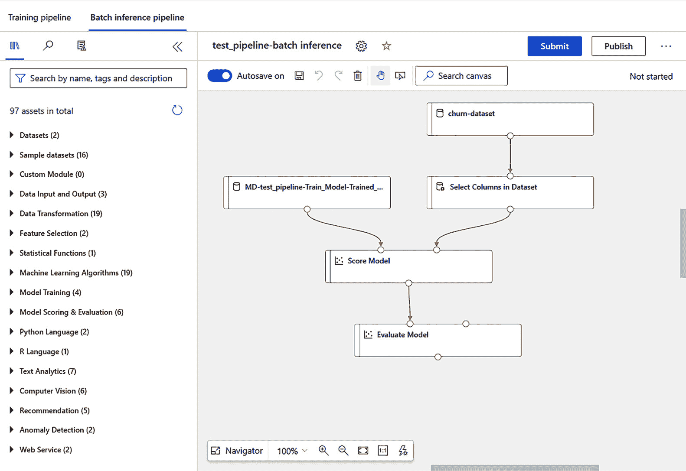

    图 6.15 – 显示默认生成管道的批量推理管道选项卡

1.  通过添加管道参数，你将能够在运行时更改管道的行为。在我们的案例中，我们希望参数化用于预测的数据集。要参数化输入数据集，点击**churn-dataset**，然后在右侧详细信息窗格中勾选**设置为管道参数**复选框。

1.  将**参数名称**文本框中的默认参数名称更改为**batchfile**。

1.  点击**发布**按钮，弹出**设置已发布管道**对话框，如以下截图所示。

1.  选择**创建新**单选按钮，以定义新的管道端点。此端点用于触发即将发布的管道。

1.  保持**新管道端点名称**字段的默认值不变。它应该显示为**test-pipeline-batch inference**。

1.  你可以通过填写**管道端点描述（可选）**字段，向已发布的端点添加描述。在该字段中写入**批量管道参数名称 batchfile 的测试**。

1.  保持所有其他设置不变。完成后的对话框页面应该如下所示：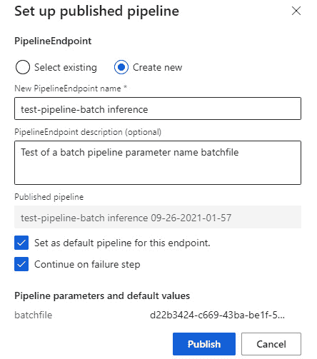

    图 6.16 – 已发布管道对话框页面

1.  点击**发布**按钮。

    一旦管道的端点成功发布，设计器中将显示如下截图中的消息。**test-pipeline-batch inference**链接将引导你到已发布的管道：

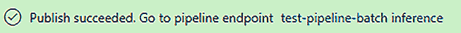

图 6.17 – 发布成功

现在你已经发布了一个批量推理管道，你可以通过 AzureML Studio 界面触发它。在*第十一章*，*与管道一起工作*的*将管道发布为端点*部分，你将学习更多关于这些管道以及如何将它们与第三方应用程序集成的内容。

在下一节中，我们将基于训练管道创建实时管道。

## 创建实时管道

在本节中，你将创建一个实时推理管道。让我们开始吧：

1.  在设计器中选择**训练管道**选项卡，该选项卡位于*图 6.15*的左上角。

1.  点击**提交**按钮旁边的**创建推理管道**下拉菜单，并选择**实时推理管道**。这将生成默认的**实时推理管道**，如以下截图所示：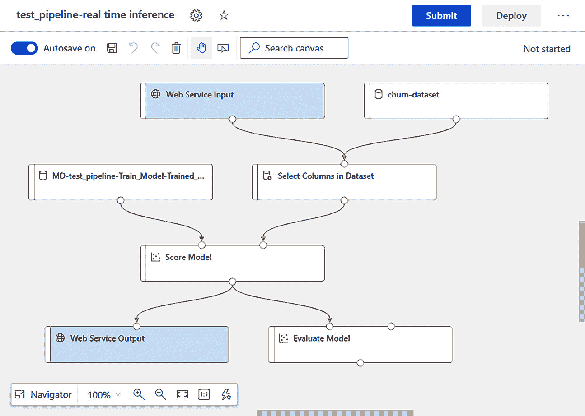

    图 6.18 – 默认实时推理管道

    在我们部署此管道之前，需要进行一些更改。

1.  点击**选择数据集中的列**模块，并点击右侧详细信息窗格中的**编辑列**链接。

1.  点击加号（**+**）图标，在**选择列**对话框中添加新行。

1.  从相应的下拉菜单中选择**排除**和**列名**，并输入**churned**作为要排除的列名。对话框页面应如下所示：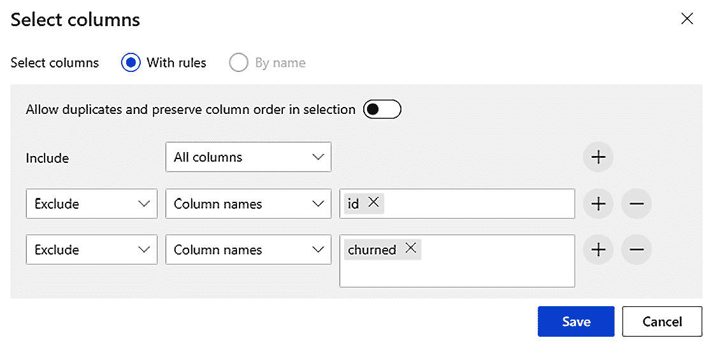

    图 6.19 – 从传入数据集中排除 id 和 churned 列

1.  从资产库中的**数据转换**类别中，将**应用 SQL 转换**模块拖到画布上。将其放置在**Web 服务输出**模块的上方。

1.  将**评分模型**模块的**输出端口**区域连接到**应用 SQL 转换**模块的**左输入端口**区域。

1.  删除**评分模型**模块与**Web 服务输出**模块之间的连接。为此，点击连接两者模块之间的连接线。选中后，点击垃圾桶图标或按键盘上的*删除*按钮。连接器应被移除。

1.  删除画布中的**评估模型**模块。

1.  将**应用 SQL 转换**模块的**输出端口**区域连接到**Web 服务输出**模块的**输入端口**区域。

1.  选择**应用 SQL 转换**模块。

1.  点击**应用 SQL 转换**详细面板中的**编辑代码**链接，并用以下查询替换默认查询：

    ```py
    select [Scored Labels] from t1
    ```

    此 SQL 转换仅选择预测值，该值存储在**评分标签**列中。

1.  按**保存**按钮。修改后的管道应如下图所示。

1.  为了确保您设计的管道正确执行，您需要使用**提交**按钮运行一次。将弹出**设置已发布的管道**对话框。

1.  您需要在实验中执行管道。选择**创建新**单选按钮。

1.  使用**test-pipeline-real-time-inference**作为**新实验名称**。

1.  保持其他字段的默认值不变，点击**提交**。

    您的管道应该可以执行，且画布应如下所示：

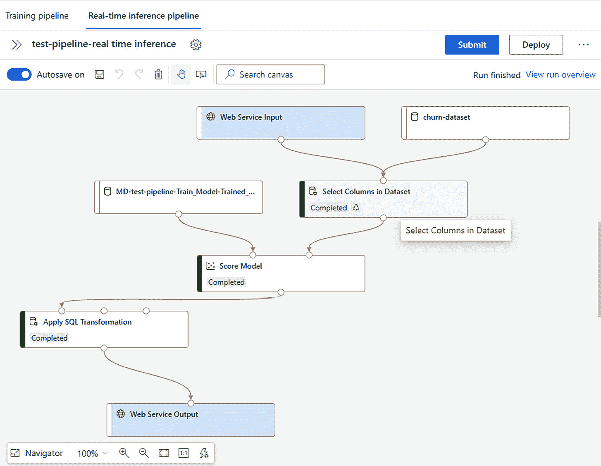

图 6.20 – 修改后的实时推断管道

在验证管道可以正常执行后，您可以将其部署为实时端点。关于将托管实时端点的基础设施，您有两种选择。您可以选择将其部署到**Azure 容器实例**（**ACI**）或**Azure Kubernetes 服务**（**AKS**）集群中。**ACI**基础设施适用于测试目的，而**AKS**基础设施则支持更好的生产环境。在我们的案例中，我们将部署到**ACI**，您将在下一部分了解有关内容。

# 部署实时推断管道

在本节中，您将部署在**实时推断管道**设计器标签中创建的示例实时推断管道。让我们开始吧：

1.  点击**部署**按钮。这将弹出**设置实时端点**的弹窗，如下图所示。

1.  在**设置实时端点**弹窗中，选择**部署新实时端点**单选按钮选项。

1.  在**名称**文本框中，输入**first-real-time-endpoint**。

1.  在**描述**文本框中，输入**第一个实时管道的容器部署**。

1.  点击**计算类型**下拉列表，选择**Azure 容器实例**。

1.  你无需修改**高级**设置。完成的弹窗应如下所示：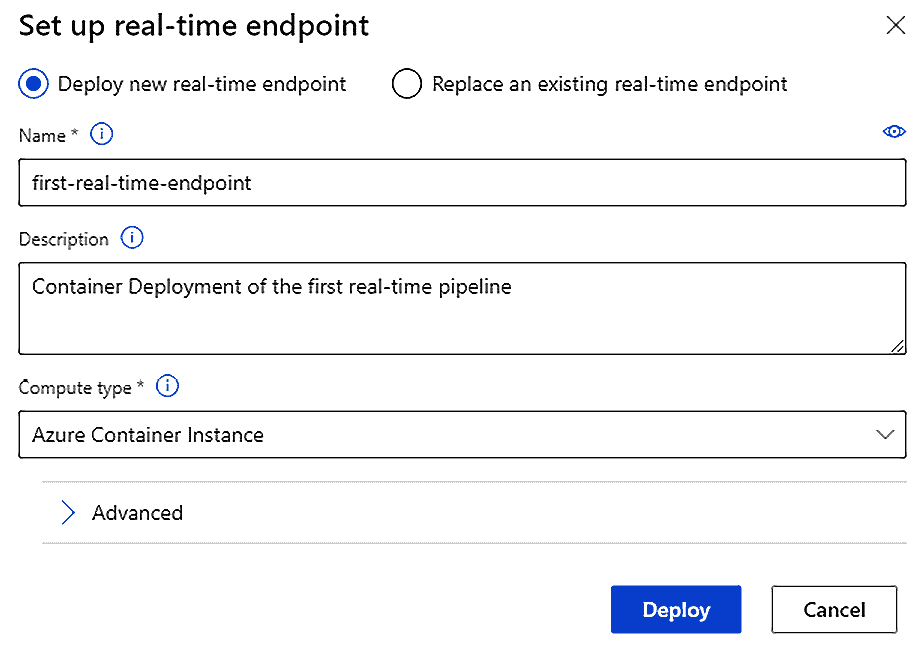

    图 6.21 – 设置实时端点弹窗

1.  点击**部署**按钮以配置你的实时端点。这将需要几分钟时间。

成功部署管道后，你将在 AzureML Studio 的**资产** | **端点**中找到新部署的管道。你刚部署的端点与在*第五章*中部署的端点相同，*让机器进行模型训练*。你可以通过网页界面进行测试。你将在*第十二章*中深入了解如何使用类似的端点，*通过代码使模型操作化*。在继续之前，你应当删除实时端点，以免产生费用。请参照*第五章*中的*清理模型部署*部分，删除你刚刚部署的端点。

# 总结

本章介绍了管道设计器，它允许我们通过拖放方式创建 AzureML 管道。你基于客户流失数据集和**二分类决策森林**模型构建了你的第一个训练管道。我们讨论了三种管道类型，编写了训练管道，创建了批量管道，并开发和部署了实时管道。

本章总结了 AzureML 提供的无代码、低代码功能。在下一章，你将开始使用 AzureML Python SDK。AzureML Python SDK 允许你通过代码训练模型并创建机器学习管道，这对于 DP-100 考试至关重要。

# 问题

部署实时管道有哪些选项？

+   **Azure 容器实例**仅适用

+   **Azure 容器实例**和**Azure Kubernetes 服务**

+   **Azure 容器实例**和**Azure 虚拟机**

+   **Azure 虚拟机**仅适用

# 进一步阅读

本节提供了一些有用的网络资源，帮助你扩展 AzureML 设计器的知识：

+   配置数据拆分和交叉验证的自动化机器学习：[`docs.microsoft.com/azure/machine-learning/how-to-configure-cross-validation-data-splits`](https://docs.microsoft.com/azure/machine-learning/how-to-configure-cross-validation-data-splits%0D)

+   使用 AzureML 设计器运行批量预测：[`github.com/MicrosoftDocs/azure-docs/blob/master/articles/machine-learning/how-to-run-batch-predictions-designer.md`](https://github.com/MicrosoftDocs/azure-docs/blob/master/articles/machine-learning/how-to-run-batch-predictions-designer.md%0D)

+   教程：设计器 – 部署机器学习模型：[`docs.microsoft.com/azure/machine-learning/tutorial-designer-automobile-price-deploy`](https://docs.microsoft.com/azure/machine-learning/tutorial-designer-automobile-price-deploy%0D)

+   什么是 AzureML 设计器？[`docs.microsoft.com/azure/machine-learning/concept-designer`](https://docs.microsoft.com/azure/machine-learning/concept-designer%0D)

+   教程：设计器 – 训练一个无代码回归模型：[`docs.microsoft.com/azure/machine-learning/tutorial-designer-automobile-price-train-score`](https://docs.microsoft.com/azure/machine-learning/tutorial-designer-automobile-price-train-score%20)

+   教程：设计器 – 部署机器学习模型：[ttps://docs.microsoft.com/azure/machine-learning/tutorial-designer-automobile-price-deploy](https://ttps://docs.microsoft.com/azure/machine-learning/tutorial-designer-automobile-price-deploy)
