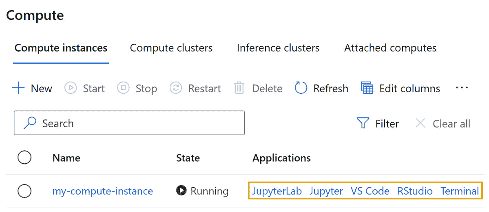

# 第七章：*第七章*：AzureML Python SDK

本章中，你将了解 AzureML Python **软件开发工具包**（**SDK**）的结构，以及如何使用它，这对 DP-100 考试至关重要。你将学习如何使用内建于 AzureML Studio 网页门户中的**笔记本**功能，这是一个提高编码生产力的工具。使用笔记本编辑器，你将编写一些 Python 代码，更好地理解如何管理工作区中注册的计算目标、数据存储和数据集。最后，你将重新访问在 *第二章*中讨论过的 Azure CLI， *部署 Azure 机器学习工作区资源*，通过 AzureML 扩展来执行工作区管理操作。这将允许你编写脚本并自动化工作区管理活动。

本章将涵盖以下主要主题：

+   Python SDK 概述

+   使用 AzureML 笔记本

+   使用 AzureML SDK 的基础编码

+   使用 AzureML CLI 扩展

# 技术要求

你需要访问一个 Azure 订阅。在该订阅中，你需要一个`packt-azureml-rg`。你还需要拥有`Contributor`或`Owner`权限的`packt-learning-mlw`，如 *第二章*中所述， *部署 Azure 机器学习工作区资源*。

你还需要具备基础的**Python**语言知识。本章中的代码片段适用于 Python 3.6 或更高版本。你应该了解 Jupyter 笔记本的基本工作原理，以及你在某个单元中定义的变量如何在其他单元的执行上下文中存在。

你可以在 GitHub 上找到本章的所有笔记本和代码片段，链接为[`bit.ly/dp100-ch07`](http://bit.ly/dp100-ch07)。

# Python SDK 概述

AzureML **SDK**是一个 Python 库，可以让你与 AzureML 服务进行交互。它还为你提供了数据科学模块，帮助你在机器学习过程中取得进展。AzureML SDK 通过一个 Python 与 R 的互操作包在 R 编程语言中也可用。

SDK 由多个包组成，这些包将不同类型的模块组织在一起，你可以将这些模块导入到代码中。所有 Microsoft 支持的模块都位于以`azureml`开头的包中，如`azureml.core`和`azureml.train.hyperdrive`。下图提供了 AzureML SDK 中最常用包的广泛概览，以及你将在本书和考试中看到的关键模块：


图 7.1 – AzureML SDK 模块和重要类

请注意，`azureml.core`包中所有的关键类也可以从相应的子模块导入。例如，`Experiment`类可以通过以下两种方式导入：

```py
from azureml.core import Experiment
from azureml.core.experiment import Experiment
```

这两个代码片段将加载相同的类，您只需要使用其中一个。第一个从 `azureml.core` 软件包加载类，而第二个从 `experiment` 模块（一个名为 `experiment.py` 的文件）加载类，该模块是 `azureml.core` 软件包的一部分。如果您在阅读各种代码示例时注意到这种类型的差异，请不要感到惊讶。

重要提示

在考试中，您无需记住这些软件包，但您需要从下拉列表中选择合适的一个。例如，您可能会被要求完成一些引用 `AutoMLConfig` 的代码，而您可能需要在 `azureml.automl` 软件包和 `azureml.pipeline` 软件包之间进行选择，这个选择在阅读完接下来的几章后会变得更加明显。书中的所有代码示例都会在脚本的顶部导入所有所需的软件包，帮助您熟悉类的位置。

在本章中，您将重点学习 SDK 类，这些类允许您控制 AzureML 工作区，以及在工作区中部署的计算资源、数据存储区和您可以在工作区中注册的数据集。

在接下来的部分，您将学习如何利用 AzureML Studio 内置的 **笔记本** 体验来编写 Python 脚本。

# 在 AzureML 笔记本中工作

AzureML Studio 提供与多个代码编辑器的集成，允许您编辑笔记本和 Python 脚本。这些编辑器由您在 *第四章* 中配置的**计算实例**提供支持，*配置工作区*。如果您为了节省费用停止了该计算实例，请导航至 **管理** | **计算** 并启动它。从此视图，您可以打开所有与 AzureML Studio 集成的第三方代码编辑器，如下图所示：



图 7.2 – Azure Studio 集成的第三方代码编辑器列表

最广为人知的开源数据科学编辑器是 Jupyter Notebook 及其更新版本 JupyterLab。您可以通过点击前面截图中显示的相应链接打开这些编辑环境。这将打开一个新的浏览器标签页，如下图所示：


图 7.3 – 计算实例提供的 JupyterLab 和 Jupyter 编辑体验

除了这些第三方代码编辑体验外，AzureML Studio 还提供了一个内置的增强型笔记本编辑器，允许你在 Studio 界面内编辑、共享和协作，如下图所示。这个编辑器建立在 Jupyter Notebook 服务之上，但提供了更改进的代码编辑体验，比如内联错误高亮、自动代码补全、弹出窗口显示即将调用的方法的参数信息等其他功能，这些功能统称为**IntelliSense**：


图 7.4 – 内置于 AzureML Studio 中的增强型笔记本体验

笔记本编辑器带有一个嵌入式示例库，其中包含最新的笔记本目录，展示了最新 AzureML SDK 几乎所有的功能。一旦你找到相关的笔记本，你可以查看其内容，如果你想修改它，可以将其克隆到你的工作区，这个操作会复制 Jupyter 笔记本及与该笔记本相关的脚本和数据，如下图所示：


图 7.5 – 帮助你快速掌握 AzureML SDK 功能的示例笔记本

重要提示

这些笔记本已更新为最新版本的 AzureML SDK。这些笔记本所在的代码库可以在 GitHub 上找到，网址为[`github.com/Azure/MachineLearningNotebooks/`](https://github.com/Azure/MachineLearningNotebooks/)。你可以使用 GitHub 提交问题或通过 GitHub 的搜索功能查找代码片段。

每个 AzureML 工作区都配有一个存储帐户，正如在*第二章*中提到的，*部署 Azure 机器学习工作区资源*。此存储帐户包含一个以**code-**为前缀的**文件共享**，该共享托管工作区内所有可用的笔记本和脚本，如下图所示。你在 Studio 体验中看到的文件，就是存储在该文件共享位置中的文件，在**Files**选项卡中：


图 7.6 – Azure 门户视图，显示托管所有 AzureML 工作区代码文件的文件共享

每个用户在**Users**文件夹下都有一个单独的文件夹，用于组织他们的文件。所有具有特定 AzureML 工作区访问权限的用户都可以访问这些文件。这使得代码共享变得非常容易。你可以通过在浏览器中打开文件，将其指向具有 AzureML 工作区访问权限的某个人；然后，你可以分享浏览器导航栏中的 URL。

在本节中，您将创建一个笔记本，在其中编写和执行本章中的代码片段。要处理您的文件，请导航到`chapter07`，然后创建一个名为`chapter07.ipynb`的笔记本。

点击用户名旁边的三个点，如下截图所示。从那里，您可以创建文件夹结构并从本地计算机上传文件。点击**创建新文件夹**选项，如下截图所示：


图 7.7 – 在 AzureML Studio 的 Notebooks 体验区域中创建新文件夹选项

填写弹出的对话框以创建名为`chapter07`的文件夹。选择该文件夹，然后点击三个点。然后，选择`Users/<username>/chapter07`，这意味着该文件将放置在新创建的文件夹中。关于`chapter07.ipynb`并点击**Create**按钮，如下截图所示：


图 7.8 – 创建笔记本以编写和执行本章 Python 脚本

这将在您的文件夹中创建两个文件：笔记本文件，将在编辑器窗格中打开，以及一个`.amlignore`文件，您将在*第八章*，*使用 Python 代码进行实验*中详细了解该文件：


图 7.9 – 在 AzureML Studio 中编辑笔记本

从前述截图的左侧开始，Notebooks 体验提供以下内容：

1.  **文件**资源管理器，您可以在其中创建或上传新文件，并删除、下载、重命名或移动您或您的同事在此工作区中创建的现有文件。

1.  正在打开文件的名称。请注意，如果您在名称旁边看到一个星号 – 例如，*** chapter07.ipynb** – 这意味着该文件尚未保存。您可以使用 Windows 和 Linux 的*Ctrl* + *S*快捷键或 macOS 的*Cmd* + *S*快捷键保存该文件。或者，您可以从**文件选项**菜单中选择**保存**选项，您将在下面阅读到。

1.  **文件选项**菜单，提供保存操作和**焦点模式**等选项，焦点模式会将编辑器面板扩展到浏览器标签的大部分空间。这是一个动态菜单，取决于你当前正在编辑的文件类型。在前面的截图中，打开的是一个笔记本，菜单提供了其他操作，如清除输出、重启 Python 内核或查看当前加载的 Python 内核中的变量。你还可以通过点击菜单图标（即四个垂直线的图标）并从**编辑器**选项中选择相应的编辑器来在 Jupyter 或 JupyterLab 中编辑同一文件。特别是对于 VS Code，一个非常流行的跨平台免费代码编辑器，主栏中提供了**在 VS Code 中编辑**的选项。

1.  管理当前正在编辑特定文件的计算实例的能力。在此部分，你可以快速创建一个新的计算实例或启动/停止现有的实例。

1.  选择执行笔记本的环境的能力。默认情况下，选择的是 AzureML Python 内核，这是已安装 AzureML SDK 的环境。如果你正在编辑 R 文件，可以将内核更改为 R 内核，或者如果你想自定义工作环境，也可以创建自己的内核。

1.  主编辑器面板。这是你可以修改选定文件的地方。

    在你的情况下，编辑器面板将为空，且只会显示一个空单元格，如下图所示。每个单元格可以包含**Markdown**格式的文本或 Python 代码。你可以通过点击弹出菜单并选择**M****↓**图标来将单元格转换为代码单元：

    

    图 7.10 – 一个空的代码单元格

1.  点击**M****↓**图标，然后点击**编辑**图标，在单元格中添加以下 Markdown 文本：

    ```py
    # Chapter 07 code snippets
    This notebook contains all code snippets from chapter 7.
    ```

1.  按*Shift* + *Enter*键完成编辑，执行单元格，这将在本例中渲染格式化的文本，并将光标移到下一个单元格。默认情况下，下一个单元格将是代码单元。将以下 Python 代码添加到该单元格中：

    ```py
    print('Hello world')
    ```

    请注意，当你开始输入时，会出现一个弹出窗口，其中包含代码建议，你可以使用箭头键选择。你可以通过按下键盘上的*Enter*键来确认选择。这个列表是智能的，它会显示与你输入的内容匹配的类名，并且还会显示一些常用类，可能是因为你拼写错误或者忘记输入某些字母。例如，以下截图显示了`PermissionError`类，因为你可能忘记输入`print`语句并且不完整，当代码中的部分存在语法错误时，会有波浪下划线标记。要执行代码单元，可以按*Shift* + *Enter*组合键，或者点击单元格左侧的圆形按钮：


图 7.11 – IntelliSense 提示适合当前脚本范围的方法和类

如果在执行代码单元时发生错误，错误信息将显示在单元格的底部，Traceback 信息将出现在单元格的输出部分，如下图所示。你可以更新单元格的内容并重新运行单元格以修复此错误：


图 7.12 – 笔记本单元执行期间的脚本错误

在本节中，你学习了如何使用内置的笔记本体验来编写 Python 脚本。在下一节中，你将开始编写利用 AzureML SDK 的代码片段。

# 使用 AzureML SDK 进行基础编码

你将要使用的第一个类是 AzureML 的 `Workspace` 类，这个类允许你访问工作区内的所有资源。要创建对工作区的引用，你需要以下信息：

+   `ab05ab05-ab05-ab05-ab05-ab05ab05ab05`。你可以在 Azure 门户中的 **属性** 标签下找到该订阅的 ID。

+   **资源组名称**：包含 AzureML 工作区组件的资源组。

+   **工作区名称**：AzureML 工作区的名称。

你可以通过运行以下赋值语句将这些信息存储在变量中：

```py
subscription_id = '<Subscription Id>'
resource_group = 'packt-azureml-rg'
workspace_name = 'packt-learning-mlw'
```

创建工作区引用的第一种方法是实例化 `Workspace` 类，如以下代码片段所示。

```py
from azureml.core import Workspace
ws = Workspace(subscription_id, resource_group, workspace_name)
```

这是你在 *第四章* 中看到的代码片段，*配置工作区*，当你创建数据集并探索该数据集的 **消费** 标签时。

重要说明

本书假设你将在上一节中创建的笔记本中编写代码，并通过执行 `pip install azureml-sdk` 命令使用 `azureml-sdk` 包编辑笔记本。在这种情况下，你将被提示使用交互式认证来验证设备，这一点你将在下一节中阅读到。

创建对 AzureML 工作区引用的另一种方法是使用 `Workspace` 类的 `get()` 方法，如以下代码片段所示：

```py
from azureml.core import Workspace
ws = Workspace.get(name=workspace_name,
                   subscription_id=subscription_id,
                   resource_group=resource_group)
```

在这里，关于 `ws` 变量，你分配了一个引用，它指向与本节开始时在 `workspace_name`、`subscription_id` 和 `resource_group` 变量中指定的 `name`、`subscription_id` 和 `resource_group` 值相匹配的 AzureML 工作区。

重要说明

在 Python 中，你可以通过按名称或位置传递参数来调用函数。在之前的示例中，我们通过按名称传递参数来调用 `Workspace.get()`——也就是说，我们明确指定了对于 `name` 参数，我们传递的是 `workspace_name` 变量的值。使用这种方法时，参数的顺序并不重要。而在前一个示例中，我们通过按位置传递参数来实例化 `Workspace` 类。你没有使用 `workspace_name=workspace_name` 这种赋值方式。这意味着你是根据 `Workspace` 类构造函数声明参数的顺序来赋值的。本书以及考试中，你将看到这两种赋值方式。

前面提到的两种获取 AzureML 工作区引用的方式是相同的。然而，主要问题在于它们将工作区硬编码在了脚本中。假设你想和朋友分享一个笔记本，但你在笔记本中硬编码了订阅 ID、资源名称和工作区名称。你的朋友就必须手动去编辑那个单元格。这个问题在你想写一个能够在多个环境中运行的脚本时变得尤为明显，比如开发环境、质量保证环境和生产环境。

`Workspace` 类提供了 `from_config()` 方法来解决这个问题。该方法会搜索文件夹树结构中的 `config.json` 文件，文件格式如下，并包含本节开始时提到的所有信息：

```py
{
  "subscription_id": "<Subscription Id>",
  "resource_group": "packt-azureml-rg",
  "workspace_name": "packt-learning-mlw"
}
```

对于计算实例来说，这个文件位于根文件夹（`/config.json`）中，并且当你在 AzureML 工作区中配置计算实例时会自动创建该文件。如果你想从本地计算机运行相同的脚本，可以创建一个类似的文件，将其放置在正在编辑的 Python 脚本旁边，然后编写以下代码来获取 AzureML 工作区的引用：

```py
from azureml.core import Workspace
ws = Workspace.from_config()
print(f"Connected to workspace {ws.name}")
```

如果你想创建一个新的 AzureML 工作区，可以使用 `Workspace.create()` 方法来进行配置。以下代码片段将在西欧地区创建一个 AzureML 工作区：

```py
from azureml.core import Workspace
new_ws = Workspace.create(
                   name='packt-azureml-sdk-mlw',
                   subscription_id=subscription_id,
                   resource_group='packt-azureml-sdk-rg',
                   create_resource_group=True,
                   location='westeurope')
```

这个代码片段将在指定 `subscription_id` 变量的订阅中创建一个名为 `packt-azureml-sdk-mlw` 的 AzureML 工作区。此资源将部署在 `packt-azureml-sdk-rg` 资源组中，如果该资源组不存在，将自动创建。

重要提示

```py
Contributor role at the resource group level to be able to deploy the AzureML workspace with the SDK.
```

要删除你刚刚部署的工作区，可以使用以下代码片段：

```py
new_ws.delete(delete_dependent_resources=True)
```

这段代码会删除由 `new_ws` 变量引用的工作区，并移除依赖资源，包括与 AzureML 工作区一起部署的存储账户、密钥库和应用洞察资源。

在本节中，您学习了如何通过 Python 代码引用和操作工作区资源。本节假定您一直在使用内置的笔记本编辑器，因此无需进行身份验证。如果您希望在自己的计算机上运行相同的代码，您需要进行身份验证以访问资源，这是我们将在下一节讨论的内容。

## 从您的设备进行身份验证

在 AzureML Studio 中的**Notebooks**体验需要您对计算实例进行身份验证。这是一个只需执行一次的过程，就像点击在 Notebooks 体验中可见的**Authenticate**按钮一样简单。如果您从本地计算机运行相同的代码，或者尝试在计算实例的终端中首次执行 Python 脚本，则必须运行 AzureML SDK 命令。一个提示将要求您进行身份验证，如下面的截图所示：


图 7.13 – 在第一个命令执行期间请求的交互式身份验证

如果您看到此消息，请转到提供的链接，您将被要求输入提示中显示的请求代码。在这种情况下，代码是**MYRNDCODE**。此代码是使用您计算机位置的身份进行登录请求的唯一标识符。选择您计划用于访问各种 Azure 资源（包括 AzureML 工作区）的帐户。下图显示了整个交互式身份验证流程：


图 7.14 – 在计算实例中使用交互式登录进行身份验证

重要提示

请求代码是短暂的，有效期为 15 分钟。如果您未能在该时间段内完成过程，将会出现错误，您将需要重新开始。

如果您的帐户可以访问多个**Azure Active Directories**（**AADs**），例如来自试用订阅的个人 AAD 和公司的 AAD，您可能需要手动指定要进行身份验证的 AAD 租户。这可以通过使用以下片段手动调用交互式身份验证过程来完成：

```py
from azureml.core.authentication import \ 
                             InteractiveLoginAuthentication
InteractiveLoginAuthentication(tenant_id="<AAD tenant id>")
```

此代码启动了设备身份验证流程，如前面的图所示。`<AAD tenant id>`是您可以从 Azure 门户中获取的 GUID，访问 AAD 资源时会显示。

在这一部分，你学习了交互式身份验证，它允许你从任何设备访问你的 AzureML 工作区。当你尝试在远程计算机上执行脚本，或者尝试执行 Azure CLI 命令时，应该使用这种身份验证方法。一旦身份验证完成，令牌将存储在你执行`InteractiveLoginAuthentication`的计算机上，直到令牌过期之前，你将无需再次登录。

在下一部分，你将开始使用已认证的工作区引用来部署计算目标，以便远程执行脚本。

## 使用计算目标

正如我们在*第四章*中提到的，*配置工作区*部分的*配置计算资源*一节所述，计算资源是允许你远程执行脚本的机器。AzureML SDK 允许你列出工作区中现有的计算目标，或者在需要时配置新的目标。

若要列出你已配置或附加到工作区的计算目标，你可以使用分配给`ws`变量的 AzureML 工作区引用，方法是使用`ws = Workspace.from_config()`。工作区对象有一个名为`compute_targets`的属性。它是一个 Python 字典，所有计算实例的名称作为键，而该计算实例的引用作为值。要列出并打印出此列表，你可以使用以下代码：

```py
for compute_name in ws.compute_targets:
    compute = ws.compute_targets[compute_name]
    print(f"Compute {compute.name} is a {type(compute)}")
```

输出应至少列出你正在执行脚本的`ComputeInstance`区域，以及你在*第四章*中创建的`AmlCompute`集群，*配置工作区*。你会注意到所有的计算类型都在`azureml.core.compute`包的模块中定义。

重要提示

这段代码假设你已经初始化了`ws`变量，这是你在笔记本中按照*使用 AzureML SDK 进行基础编码*部分的指示进行的操作。如果你关闭计算实例，内核将停止，并且你通过执行笔记本单元定义的所有变量将会丢失。如果你想继续在笔记本上工作，最简单的做法是重新运行所有单元，这将确保你已初始化所有变量。

获取计算目标引用的另一种方法是使用`ComputeTarget`构造函数。你需要传入`Workspace`引用和你要查找的计算目标的名称。如果目标不存在，将引发`ComputeTargetException`异常，你必须在代码中处理该异常，如以下脚本所示：

```py
from azureml.core import ComputeTarget
from azureml.exceptions import ComputeTargetException
compute_name = 'gpu-cluster'
compute = None
try:
    compute = ComputeTarget(workspace=ws, name=compute_name)
    print(f"Found {compute_name} which is {type(compute)}")
except ComputeTargetException as e:
    print(f"Failed to get compute {compute_name}. Error: {e}")
```

`ComputeTarget`类提供了`create()`方法，允许你配置各种计算目标，包括计算实例（`ComputeInstance`类）、计算集群（`AmlCompute`类）和 Azure Kubernetes 服务（`AKSCompute`类）目标。

重要提示

每当您通过 AzureML Studio Web UI、Azure CLI 或 SDK 部署计算实例或计算集群时，计算目标将被配置在与您的机器学习工作区相同的资源组和 Azure 区域内。

要配置计算目标，您需要创建一个继承自 `ComputeTargetProvisioningConfiguration` 抽象类的配置对象。在以下示例中，脚本尝试定位名为 `cpu-sm-cluster` 的计算集群。如果集群存在，则将集群的引用分配给 `cluster` 变量。如果集群不存在，脚本将创建 `AmlComputeProvisioningConfiguration` 类的实例，并将其分配给 `config` 变量。这个实例是通过 `AmlCompute` 类的 `provisioning_configuration()` 方法创建的。此 `config` 用于创建集群并等待工作区中的注册完成，显示创建日志：

```py
from azureml.core.compute import ComputeTarget, AmlCompute
compute_name = 'cpu-sm-cluster'
cluster = None
if compute_name in ws.compute_targets:
    print('Getting reference to compute cluster')
    cluster = ws.compute_targets[compute_name]
else:
    print('Creating compute cluster')
    config = AmlCompute.provisioning_configuration(
                           vm_size='Standard_D1', 
                           max_nodes=2)
    cluster = ComputeTarget.create(ws, compute_name, config)
    cluster.wait_for_completion(show_output=True)
print(f"Got reference to cluster {cluster.name}") 
```

该脚本指定了虚拟机的大小（`vm_size` 参数）。虚拟机将设置为 `Standard_D1`，这是 `Standard_NC6`、`Standard_NV24s_v3` 和 `Standard_ND40rs_v2`。注意所有的大小都以 **N** 开头。

该脚本仅指定计算集群的最大节点数（`max_nodes` 参数）。如果未指定最小节点数（`min_nodes` 参数），则该参数的默认值为 0。默认情况下，集群将缩减到 0 个节点，在没有作业运行时不会产生计算成本。您可以在微软官方 Python SDK 参考页面上找到 `provisioning_configuration()` 方法的所有参数的默认值，如以下截图所示，或者通过执行 `help(AmlCompute.provisioning_configuration)` 使用 Python `help` 命令：


图 7.15 – AmlCompute 类的 provisioning_configuration 方法文档

将计算集群的最小节点数设置为 0 的一个缺点是，您必须等待计算节点分配后，您提交的作业才会执行。为了节省这段空闲时间，通常在工作日将集群的最小节点数甚至最大节点数扩大，然后在非工作时间调整这些值以节省成本。要更改计算集群的节点数，您可以使用 AzureML Studio Web UI、Azure CLI，甚至使用以下代码更新计算集群的 `min_nodes` 属性：

```py
from azureml.core.compute import AmlCompute
for ct_name, ct in ws.compute_targets.items():
    if (isinstance(ct, AmlCompute)):
        print(f"Scalling down cluster {ct.name}")
        ct.update(min_nodes=0)
```

重要说明

通过 AzureML Studio Web 门户、CLI、SDK 和 ARM 模板，可以更改计算集群的最小节点数和最大节点数。在 2020 年 10 月之前，您还可以通过 Azure 门户更改节点数，但该功能已被移除。

在本节中，你了解了如何创建或获取计算目标的引用，以便你可以用它来执行脚本。在下一节中，你将学习如何通过 SDK 连接到各种数据源。

## 定义数据存储

如我们在*第四章*中提到的，*配置工作区*部分，在*连接到数据存储*小节中，数据存储是存放你数据的引擎，并为授权的人员提供访问权限。AzureML SDK 允许你附加现有的数据存储以访问底层数据。

在本节中，你将把存储帐户的 Blob 容器附加到你的工作区。假设你有一个名为**mydatastg**的存储帐户。这个存储帐户有一个名为**existing-container**的 Blob 容器，里面包含你想要分析并训练模型的 CSV 文件，如下图所示：


图 7.16 – 在 Azure 门户中看到的 mydatastg 存储帐户中的容器

重要提示

从 Azure 门户配置新的存储帐户并添加容器是一项简单的任务，超出了本考试的范围。请注意，存储帐户有唯一的名称。这意味着你可能无法创建名为**mydatastg**的存储帐户，因为它属于其他人。你可以使用随 AzureML 工作区一起配置的现有存储帐户来执行这些步骤。你可以通过 Azure 门户将**existing-container**容器添加到该存储帐户中，或者你也可以使用已经存在的**azureml**容器。

要将此容器注册为你的 AzureML 工作区中的新数据存储，你需要按照以下步骤操作：

1.  在进入你的笔记本之前，你需要获取存储帐户的名称和帐户密钥。这些信息位于 Azure 门户中的**设置**|**访问密钥**选项卡下，存储帐户资源中，如下图所示：

    图 7.17 – 连接存储帐户所需的存储帐户名称和密钥

1.  打开你的`chapter07.ipynb`笔记本，在一个新的代码单元中，将这些信息赋值给以下 Python 变量：

    ```py
    storage_name = 'mydatastg'
    storage_key = '<storagekey>'
    storage_container = 'existing-container'
    ```

1.  要将 Blob 容器注册为一个名为`my_data_store`的新数据存储，你可以使用`Datastore`类的`register_azure_blob_container()`方法，如下所示：

    ```py
    from azureml.core import Datastore
    dstore = Datastore.register_azure_blob_container(
        workspace=ws,
        datastore_name="my_data_store",
        container_name=storage_container,
        account_name=storage_name,
        account_key=storage_key,
        create_if_not_exists=False
    )
    ```

    正如预期的那样，该方法需要将`Workspace`区域的引用作为参数传递，新的数据存储将在该区域创建。另外，请注意，`create_if_not_exists`参数设置为`False`，这将导致方法在 Blob 容器不存在时抛出`AzureMissingResourceHttpError`异常，并带有`ContainerNotFound`的错误代码。

    与 Blob 容器类似，您可以通过 AzureML SDK 的 `Datastore` 类注册所有支持的数据存储类型，如以下屏幕截图所示。例如，您可以使用 `register_azure_data_lake_gen2()` 方法连接到 Azure 数据湖第二代数据存储，或者使用 `register_azure_sql_database()` 方法连接到 Azure SQL 数据库：

    

    图 7.18 – 来自官方文档页面的支持的数据存储服务类型

1.  要获取连接的数据存储的引用，您可以使用 `Datastore` 类的构造函数，如以下代码片段所示：

    ```py
    from azureml.core import Datastore
    dstore = Datastore.get(ws,"my_data_store")
    ```

1.  在*第四章*《配置工作区》中，在数据存储列表中，您将学习如何将注册的数据存储设置为 AzureML 工作区的默认数据存储。`Workspace` 类提供了一种快捷方式，可以通过 `get_default_datastore()` 方法引用该数据存储：

    ```py
    dstore = ws.get_default_datastore()
    ```

    本书的其余部分，您将使用默认的数据存储来存储数据。

1.  引用 Azure Blob 容器（`AzureBlobDatastore` 类）或 Azure 文件共享（`AzureFileDatastore` 类）的数据存储可以通过 SDK 上传和下载文件。以下代码片段加载 `DataFrame`，然后将其存储为本地 CSV 文件。文件存储后，脚本获取 `Workspace` 区域的默认数据存储的引用，该引用在 `ws` 变量中，并使用 `upload()` 方法将该文件上传到`/samples/diabetes/v1/rawdata.csv`：

    ```py
    from sklearn.datasets import load_diabetes
    import pandas as pd
    features, target = load_diabetes(return_X_y=True)
    diabetes_df = pd.DataFrame(features)
    diabetes_df['target']= target
    diabetes_df.to_csv('rawdata.csv', index=False)
    dstore = ws.get_default_datastore()
    dstore.upload_files(
                files=['rawdata.csv'],
                target_path="/samples/diabetes/v1", 
                overwrite=True,
                show_progress=True)
    ```

1.  该文件将出现在与您的 AzureML 工作区一起创建的存储帐户中。您可以通过 Azure 门户找到它，方法是导航到存储帐户，选择名称以**azureml-blobstore-**开头的 Blob 容器，然后导航到**samples / diabetes / v1**文件夹，如以下屏幕截图所示：


图 7.19 – 已上传的数据存储在注册为默认数据存储的 Blob 容器中

在本节中，您学习了如何将现有的 Azure Blob 容器附加到 AzureML 工作区中的新数据存储。您还学习了如何轻松获取工作区默认数据存储的引用，然后将 CSV 文件上传到该数据存储。在下一节中，您将学习如何定义数据集，这一构建可以帮助您独立于数据存储位置进行数据操作。

## 使用数据集

正如我们在*第四章*，《配置工作区》一节中提到的，在《使用数据集》部分中，数据集是你在训练和推理过程中使用的一个抽象层。它们包含对物理数据位置的引用，并提供一系列元数据，帮助你理解数据的形状和统计特性。数据集*不会复制*存储在数据存储中的数据。AzureML 提供了两种类型的数据集：

+   `FileDataset`允许你引用一个或多个文件，存储在一个或多个数据存储中。`FileDataset`的一个常见例子是用于训练计算机视觉模型的图像。

+   `TabularDataset`允许你引用存储在一个文件或多个文件中的表格结构数据，这些文件可能存储在数据存储中，或者直接存储在像 SQL 服务器这样的关系型数据存储中。你在上一节中加载的糖尿病`DataFrame`就是一个典型的表格数据集。你可以通过解析各种文件（包括 CSV、TSV、Parquet 和 JSON 文件）来创建`TabularDataset`。如果你的数据包含一个带有时间戳的列/特征，或者文件存储在包含日期模式的文件夹结构中，比如`/<year>/<month>/file.csv`，你可以启用`TabularDataset`的时间序列特性，这样可以进行基于时间的数据集筛选。

为了获得一些实际操作经验，你可以定义一个`FileDataset`，它引用了你在上一节中上传的默认数据存储中的 CSV 文件。虽然 CSV 表示表格数据，但它也可以是一个文件，`FileDataset`可以引用这样的文件。

1.  在你的笔记本中新建一个单元格，输入以下代码：

    ```py
    from azureml.core import Dataset
    dstore = ws.get_default_datastore()
    file_paths = [
        (dstore, "/samples/diabetes/v1")
    ]
    file_ds = Dataset.File.from_files(
        path = file_paths, validate=True
    )
    print("Files in FileDataset:")
    print(file_ds.to_path())
    ```

    在这段代码中，引用了工作站的默认数据存储。

1.  现在，你可以创建一个包含`Datastore`及其相对路径的元组数组。每个元组引用一个特定`Datastore`中的文件或文件夹。在这种情况下，你引用的是默认`Datastore`中的`samples/diabetes/v1`文件夹。如果你愿意，可以使用通配符字符`*`来加载多个子文件夹或部分文件名。例如，以下元组数组加载了 2021 年所有月份的天气数据 CSV 文件，这些文件存储在`/weather/<year>/<month>/<day>.csv`路径下：

    ```py
    file_paths = [
        (dstore, "/weather/2021/*/*.csv")
    ]
    ```

1.  如果你只想显式加载 1 月（`01.csv`）、2 月（`02`）、和 3 月（`03`）的第一天数据，你可以使用以下元组数组：

    ```py
    file_paths = [
        (dstore, "/weather/2021/01/01.csv"),
        (dstore, "/weather/2021/02/01.csv"),
        (dstore, "/weather/2021/03/01.csv")
    ]
    ```

    出于性能考虑，建议每个数据集的数组大小不要超过 100 个数据路径引用。

1.  返回到本节开头的代码片段，现在您可以使用`from_files()`方法创建一个未注册的`FileDataset`。在此处，您必须将数据路径数组作为参数传递。您还必须验证数据是否可以通过该方法加载。如果文件夹不存在或数据存储由于私有端点受保护，不可直接从执行代码的计算资源访问，则会收到`DatasetValidationError`。`validate`参数的默认值为`True`，您可以通过在该参数中传递`False`来禁用该验证。

1.  创建了`FileDataset`之后，您可以通过调用`to_path()`方法获取被引用的文件列表。这两个打印的输出应如下所示：

    图 7.20 – 未注册的 FileDataset 引用单个 CSV 文件

1.  对于 CSV 文件，更好的方法是定义一个`TabularDataset`，它可以解析文件并为我们提供 pandas `DataFrame`。为此，请将以下代码复制到一个新单元格中：

    ```py
    tabular_dataset = Dataset.Tabular.from_delimited_files(
        path=file_paths, validate=False)
    df = tabular_dataset.to_pandas_dataframe()
    print(len(df))
    ```

    在此片段中，您正在重用创建`FileDataset`时使用的`file_paths`属性。这次，您正在使用`from_delimited_files()`方法创建一个未注册的`TabularDataset`。还请注意，您明确跳过验证，以便可以从当前计算资源加载数据（`validate=False`），加快声明过程。

    `DataFrame`，并在调用`to_pandas_dataframe()`方法时将其分配给`df`变量。调用`len()`方法时，您可以获取`DataFrame`的行数。

1.  到目前为止，您创建的数据集都是未注册的，这意味着它们未在 AzureML 工作区中注册，也未在`register()`方法中列出：

    ```py
    tabular_dataset.register(
        workspace=ws,
        name="diabetes",
        description="The sklearn diabetes dataset")
    ```

    重要提示

    如果您已经注册了同名的数据集，则无法重新运行此单元格。要注册数据集的新版本，必须使用以下方式使用`create_new_version`参数：`tabular_dataset.register(workspace=ws, name="diabetes", create_new_version=True)`

    此方法要求您指定要注册`TabularDataset`的工作区以及注册的名称。可选地，您可以传递描述、标签以及是否要使用已在工作区中注册的特定名称创建数据集的新版本。数据集注册后，您可以在 Studio Web UI 中查看注册信息，如下截图所示：

    

    图 7.21 – 注册在工作区中的表格数据集

1.  如果您有一个 pandas `DataFrame` 而不是`TabularDataset`，并且想要注册它，可以使用`register_pandas_dataframe()`方法，如下面的代码片段所示：

    ```py
    Dataset.Tabular.register_pandas_dataframe(
        dataframe=df,
        target=(dstore,"/samples/diabetes"),
        name="diabetes",
        description="The sklearn diabetes dataset")
    ```

    请注意，在这个代码片段中，你传递了 `df` pandas `DataFrame` 引用，并且请求将该 `DataFrame` 存储在由 `dstore` 变量引用的默认数据存储中，存储路径为 `/samples/diabetes` 文件夹。此方法将创建一个具有 GUID 名称的新文件夹，并将数据以 Parquet 文件格式存储。由于数据集已经注册并指向不同的路径，该命令将创建数据集的新版本。在 Studio 界面中，你会看到 **版本 2** 的数据集已被注册。这个版本有一个不同的 **相对路径**，如下面所示：

    

    图 7.22 – 从 pandas DataFrame 直接注册的新版本糖尿病数据集

    请注意，Parquet 文件格式是一种压缩格式，与用于数据集第一版的 CSV 文件相比，它的文件体积更小。

1.  注册数据集后，无论是 `FileDataset` 还是 `TabularDataset`，你都可以使用 `Dataset` 类的 `get_by_name()` 方法来检索它，使用如下代码片段：

    ```py
    from azureml.core import Dataset
    diabetes_dataset = Dataset.get_by_name(
        workspace=ws,
        name='diabetes')
    ```

    可选地，你可以指定 `version` 参数，默认值为 `latest`。

1.  上面的代码片段返回一个 `TabularDataset` 类的实例，但数据尚未加载。你可以通过 `TabularDataset` 类的各种方法部分加载数据集，如下所示的代码片段所示：

    ```py
    partial_dataset = diabetes_dataset \
            .skip(10) \
            .take(2) \
            .keep_columns(['0','target'])
    ```

1.  `partial_dataset` 是从 `diabetes_dataset` 创建的 `TabularDataset` 实例。该数据集跳过了 `diabetes_dataset` 的前 10 行，保留了两行，并删除了所有列，除了名为 `0` 和 `target` 的列。在执行此多行语句时没有加载任何数据。定义了这个未注册的 `partial_dataset` 数据集后，你可以使用以下代码将数据加载到 pandas `DataFrame` 中：

    ```py
    df = partial_dataset.to_pandas_dataframe()
    df.head()
    ```

    这将显示一个由两行两列组成的小型表格，如下所示的屏幕截图所示：


图 7.23 – 从切片表格数据集加载的小型 DataFrame

AzureML 数据集类的惰性加载功能让你可以灵活地对庞大的数据集进行切片和操作，而无需将其加载到内存中。

到目前为止，你已经学习了如何使用 Python SDK 部署计算目标、定义数据存储和创建数据集。在下一节中，你将学习如何使用在*第二章*中看到的 Azure CLI 工具执行类似操作，*部署 Azure 机器学习工作区资源*，该章节位于 *使用 Azure CLI* 部分。

# 使用 AzureML CLI 扩展

在*第二章*《*部署 Azure 机器学习工作区资源*》中，你学习了如何使用 Azure CLI，以及如何安装`azure-cli-ml`扩展。这个扩展使用你在本章看到的 Python SDK 执行各种操作。要使用 Azure CLI，你可以选择以下任一方法：

1.  打开 Azure 门户中的云终端，就像你在*第二章*《*部署 Azure 机器学习工作区资源*》中所做的那样。

1.  打开你在本章中使用的计算实例的终端。

1.  使用 Jupyter 笔记本的 shell 分配功能，允许你通过使用感叹号（**!**），也叫做**bang**，执行底层 shell 命令。

在本节中，你将使用笔记本，这将帮助你存储步骤，并在未来需要时重复这些步骤：

1.  首先，你需要在你当前正在使用的计算实例的 Azure CLI 中安装`azure-cli-ml`扩展。创建一个新的代码单元格，并添加以下代码：

    ```py
    ! az extension add -n azure-cli-ml
    ```

    请注意，在*第二章*《*部署 Azure 机器学习工作区资源*》中，你执行了相同的命令，但没有感叹号前缀。此命令的输出应类似于以下内容：

    

    图 7.24 – 安装 AzureML 扩展

1.  然后，你需要使用`az login`命令登录。此命令将触发设备认证过程，类似于你在本章开始时尝试通过 SDK 连接到工作区时使用的认证方式。运行以下命令：

    ```py
    ! az login
    ```

1.  如果你有多个 Azure 订阅的访问权限，你需要使用以下代码片段选择你正在使用的订阅：

    ```py
    ! az account set --subscription "<subscription id>"
    ```

    从现在开始，你可以使用 AzureML CLI 对工作区执行操作。

    重要提示

    如果你在订阅中有多个 AzureML 工作区，你需要指定每个 AzureML CLI 命令的目标工作区和资源组。为此，你需要使用`-g`和`-w`参数，我们在*第二章*《*部署 Azure 机器学习工作区资源*》中已经介绍过。

1.  要列出工作区中的所有计算目标，可以使用以下代码片段：

    ```py
    ! az ml computetarget list -g packt-azureml-rg -w packt-learning-mlw -o table
    ```

1.  然后，你可以使用以下命令更新`cpu-sm-cluster`，使其具有 0 个最小节点：

    ```py
    ! az ml computetarget update amlcompute --name cpu-sm-cluster --min-nodes 0 -g packt-azureml-rg -w packt-learning-mlw
    ```

1.  要获取在工作区中注册的默认数据存储，可以使用以下命令：

    ```py
    ! az ml datastore show-default -g packt-azureml-rg -w packt-learning-mlw
    ```

1.  最后，你可以使用以下代码列出工作区中注册的数据集：

    ```py
    ! az ml dataset list -g packt-azureml-rg -w packt-learning-mlw -o table
    ```

    该命令的结果应类似于以下内容：


图 7.25 – AzureML CLI 中数据集列表的表格格式输出

AzureML CLI 提供对 SDK 选项的完全访问权限，包括创建和分离计算目标、数据存储，甚至定义数据集的能力。对于考试，您不需要记住命令，只要您理解 CLI 在后台使用 SDK，并且大多数您可以用 SDK 做的事情都有对应的 CLI 命令即可。

# 总结

在本章中，您学习了 AzureML Python SDK 的结构。您还发现了 AzureML 笔记本编辑器，允许您编写 Python 脚本。接着，您使用了 SDK，并开始通过管理附加到 AzureML 工作区的计算目标来启动编码旅程。然后，您附加了新的数据存储并获取了现有数据存储的引用，包括工作区的默认数据存储。接下来，您处理了各种文件和基于表格的数据集，并学习了如何通过将它们注册到工作区中来重用这些数据集。

最后，您已经使用了 AzureML CLI 扩展，这是一个客户端，利用了您在本章中探索的 Python SDK。

在下一章中，您将基于这些知识进一步学习如何在数据科学实验阶段使用 AzureML SDK。您还将学习如何跟踪数据科学实验中的指标，并了解如何通过在计算集群中运行脚本来将训练扩展到更大的计算资源。

# 问题

请回答以下问题，以检查您对本章所讨论的主题的理解：

1.  AzureML 计算集群的默认最小节点数是多少？

    a. 0

    b. 1

    c. 等于最大节点数

1.  您将一个包含信用卡交易详情的 CSV 文件上传到默认数据存储库。您应该使用以下哪种方法来创建数据集引用？

    a. `Dataset.File.from_files()`

    b. `Dataset.Tabular.from_delimited_files()`

    c. `Workspace.from_csv_files()`

    d. `Datastore.from_csv_files()`

1.  如何在注册 Azure Blob 存储数据存储库的过程中强制创建 Blob 容器？

    a. 将 `force_create=True` 参数传递给 `Datastore.register_azure_blob_container()` 方法。

    b. 将 `create_if_not_exists=True` 参数传递给 `Datastore.register_azure_blob_container()` 方法。

    c. 将 `force_create=True` 参数传递给 `Datastore.register_container()` 方法。

    b. 将 `create_if_not_exists=True` 参数传递给 `Datastore.register_container()` 方法。

# 进一步阅读

本节提供了一些有用的网络资源，这些资源将帮助您增强对 AzureML SDK 及本章中使用的各种第三方库的知识：

+   AzureML 中支持的数据存储服务类型：[`docs.microsoft.com/en-us/azure/machine-learning/how-to-access-data#supported-data-storage-service-types`](https://docs.microsoft.com/en-us/azure/machine-learning/how-to-access-data#supported-data-storage-service-types)

+   `DataFrame` API 参考：[`pandas.pydata.org/pandas-docs/stable/reference/api/pandas.DataFrame.html`](https://pandas.pydata.org/pandas-docs/stable/reference/api/pandas.DataFrame.html)

+   参考从 scikit-learn 库加载的糖尿病数据集：[`scikit-learn.org/stable/modules/generated/sklearn.datasets.load_diabetes.html`](https://scikit-learn.org/stable/modules/generated/sklearn.datasets.load_diabetes.html)

+   AzureML SDK Python API 浏览器，列出了所有包、类和方法：[`docs.microsoft.com/en-us/Python/api/?view=azure-ml-py`](https://docs.microsoft.com/en-us/Python/api/?view=azure-ml-py)

+   AzureML CLI 扩展参考：[`docs.microsoft.com/cli/azure/ml(v1)?view=azure-cli-latest`](https://docs.microsoft.com/cli/azure/ml(v1)?view=azure-cli-latest)

+   免费电子书——《学习 Python 编程（第二版）》：[`www.packtpub.com/free-ebook/learn-Python-programming-second-edition/9781788996662`](https://www.packtpub.com/free-ebook/learn-Python-programming-second-edition/9781788996662)
