# 第八章：*第八章*：使用 Python 代码进行实验

在本章中，你将了解如何训练 `scikit-learn` 库，它通常被称为 `sklearn`。你将了解如何使用**Azure** **机器学习**（**AzureML**）**SDK** 和 **MLflow** 来跟踪训练指标。接着，你将看到如何在计算集群中扩展训练过程。

本章将涵盖以下主题：

+   在笔记本中训练一个简单的 `sklearn` 模型

+   在实验中跟踪指标

+   扩展训练过程与计算集群

# 技术要求

你需要有一个 Azure 订阅。在该订阅下，你需要有一个 `packt-azureml-rg`。你还需要有 `Contributor` 或 `Owner` 权限的 `packt-learning-mlw`。如果你按照*第二章*《部署 Azure 机器学习工作区资源》中的说明进行操作，这些资源应该已经为你准备好了。

你还需要具备 Python 语言的基础知识。本章中的代码片段适用于 Python 3.6 或更高版本。你还应熟悉在 AzureML Studio 中使用笔记本的操作体验，这部分内容已在上一章中讲解过。

本章假设你已经在 AzureML 工作区中注册了 `scikit-learn` 的 `diabetes` 数据集，并且已经创建了一个名为 `cpu-sm-cluster` 的计算集群，正如在*第七章*《AzureML Python SDK》中的 *定义数据存储*、*处理数据集* 和 *使用计算目标* 部分所描述的那样。

你可以在 GitHub 上找到本章的所有笔记本和代码片段，链接：[`bit.ly/dp100-ch08`](http://bit.ly/dp100-ch08)。

# 在笔记本中训练一个简单的 sklearn 模型

本节的目标是创建一个 Python 脚本，在你在*第七章*中注册的`diabetes`数据集上，训练出一个简单的模型，*《AzureML Python SDK》*。该模型将获取数字输入，并预测一个数字输出。为了创建这个模型，你需要准备数据、训练模型、评估训练模型的表现，然后将其存储，以便未来可以重用，正如在*图 8.1*中所示：

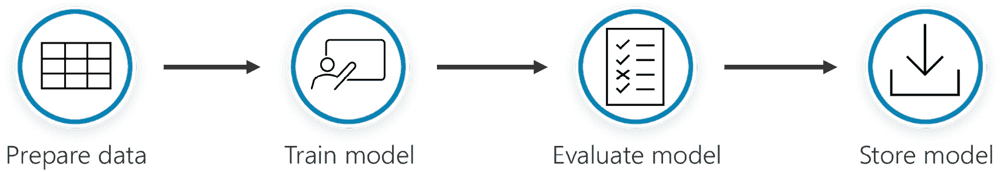

图 8.1 - 生成糖尿病预测模型的过程

让我们从了解你将要使用的数据集开始。`diabetes` 数据集包含 442 名`diabetes`患者的数据。每一行代表一个患者。每一行包含 10 个特征（`target`，是记录特征后 1 年糖尿病病情发展的定量指标）。

你可以在 AzureML Studio 界面中进一步探索数据集，正如在*图 8.2*中所示：

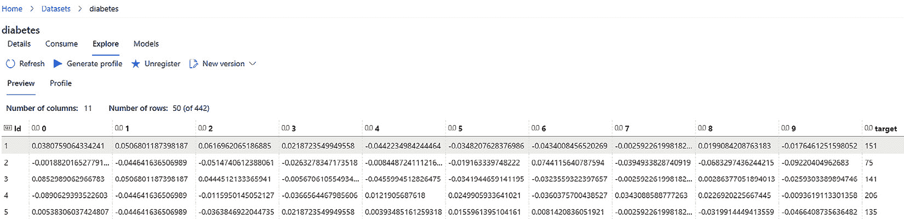

图 8.2 – 已注册的糖尿病数据集

通常在准备阶段，您会加载原始数据，处理缺失值的行，规范化特征值，然后将数据集分为训练数据和验证数据。由于数据已经预处理，您只需加载数据并将其拆分为两个部分：

1.  导航到`chapter08`，然后创建一个名为`chapter08.ipynb`的笔记本：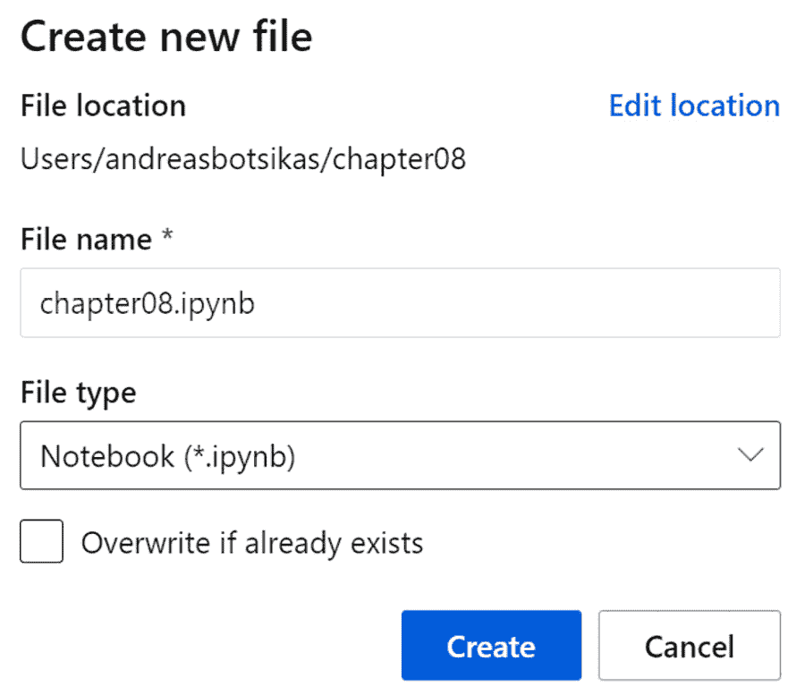

    图 8.3 – 创建您将要使用的 chapter08 笔记本

1.  在笔记本的第一个单元格中，添加以下代码：

    ```py
    from azureml.core import Workspace
    ws = Workspace.from_config()
    diabetes_ds = ws.datasets['diabetes']
    training_data, validation_data =\
    diabetes_ds.random_split(percentage = 0.8)
    X_train =\
    training_data.drop_columns('target').to_pandas_dataframe()
    y_train =\
    training_data.keep_columns('target').to_pandas_dataframe()
    X_validate =\
    validation_data.drop_columns('target').to_pandas_dataframe()
    y_validate =\
    validation_data.keep_columns('target').to_pandas_dataframe()
    ```

    在此代码片段中，您获取工作区的引用并检索名为`diabetes`的数据集。然后，您使用`random_split()`方法将其拆分为两个`TabularDataset`。第一个数据集是`training_data`，它包含 80%的数据，而`validation_data`数据集引用其余 20%的数据。这些数据集包含您要预测的特征和标签。使用`TabularDataset`的`drop_columns()`和`keep_columns()`方法，您可以将特征与`label`列分开。然后，您通过`TabularDataset`的`to_pandas_dataframe()`方法将数据加载到内存中。最终，您将得到四个 pandas 数据框：

    +   `X_train`：包含 80%的行，每行有 10 列（`0`到`9`）。

    +   `y_train`：包含 80%的行，每行有 1 列（`target`）。

    +   `X_validate`：包含 20%的行，每行有 10 列（`0`到`9`）。

    +   `y_validate`：包含 20%的行，每行有 1 列（`target`）。

    `diabetes`数据集在科学文献中非常流行。它被用作训练*回归*模型的示例。`scikit-learn`库提供了一个名为`sklearn.linear_model`的专用模块，包含许多线性回归模型可供我们使用。现在您已经准备好了数据，接下来的任务是训练模型。

1.  在此步骤中，您将训练一个`LassoLars`模型，它是`LassoLars`类的缩写，该类接受一个名为`alpha`的浮动参数，该参数被称为*正则化参数*或*惩罚项*。它的主要目的是保护模型免受训练数据集的过拟合。由于该参数控制训练过程，因此被称为*超参数*。一旦模型训练完成，这个参数不能再更改。在这个代码块中，您正在实例化一个未训练的模型，并将`alpha`参数设置为`0.1`。在下一章，*第九章*，*优化机器学习模型*，您将调整此参数，并尝试为您的数据集找到最佳值。

    然后，您将使用`X_train`和`y_train`数据框来 fit()模型，这意味着您正在用训练数据集训练模型。经过这个过程后，`model`变量引用一个已训练的模型，您可以使用该模型进行预测。

1.  接下来的任务是基于某个指标评估你所生成的模型。评估回归模型时最常用的指标如下：

    +   平均或中位数绝对误差。

    +   均方误差或对数误差。该指标的另一种常见变体是`sklearn.metrics`包中的`mean_squared_error`方法。该指标的常见问题是，当模型在具有更大值范围的数据上训练时，相比于在较小值范围的数据上训练的同一模型，其误差率更高。你将使用一种称为*指标归一化*的技术，该技术基本上是将指标除以数据的范围。计算得到的指标被称为`X_validate`数据框。你通过将预测结果与存储在`y_validate`数据框中的真实值进行比较，来计算 RMSE。接着，你使用`ptp()`方法计算值的范围（最大值减去最小值），得到`0.2`。

        最后一步是将训练好的模型存储起来，以便将来能够重用。你将创建一个名为`outputs`的文件夹，并将模型持久化到一个文件中。Python 对象的持久化通过`joblib`库的`dump()`方法完成。

        在新的笔记本单元格中，输入以下源代码：

        ```py
        import os
        import joblib
        os.makedirs('./outputs', exist_ok=True)
        model_file_name = f'model_{nrmse:.4f}_{alpha:.4f}.pkl'
        joblib.dump(value=model,
                filename=os.path.join('./outputs/',model_file_name))
        ```

        如果`outputs`文件夹不存在，你需要先创建它。然后，将模型存储在包含`model_`前缀的文件名中，后跟在*步骤 4*中计算的 NRMSE 指标，再加上一个`_`，然后是用于实例化模型的`alpha`参数。你应该能够在文件资源管理器中看到序列化的模型，如*图 8.4*所示：

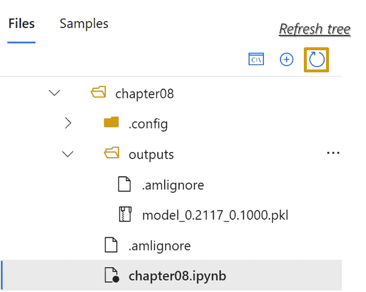

图 8.4 – 序列化模型存储在输出文件夹中

你在*步骤 5*中使用的命名规范帮助你跟踪模型的表现，以及记录你在本次运行中使用的参数。AzureML SDK 提供了多种方法来监控、组织和管理你的训练过程，这些内容你将在下一节中探讨。

# 在实验中跟踪指标

当你训练一个模型时，你是在进行一个试验，并且你正在记录该过程的各个方面，包括你需要比较模型表现的 NRMSE 等指标。AzureML 工作区提供了**实验**的概念——即用于将这些试验/运行归类的容器。

要创建一个新的实验，只需要指定你将使用的工作区，并提供一个包含最多 36 个字母、数字、下划线和破折号的名称。如果实验已经存在，你将获得对它的引用。在你的`chapter08.ipynb`笔记本中添加一个单元格，并添加以下代码：

```py
from azureml.core import Workspace, Experiment
ws = Workspace.from_config()
exp = Experiment(workspace=ws, name="chapter08")
```

你首先获取现有 AzureML 工作区的引用，然后创建`chapter08`实验（如果它还不存在的话）。如果你导航到 Studio 界面中的**资产** | **实验**部分，你会注意到列表中会出现一个空的实验，如*图 8.5*所示：

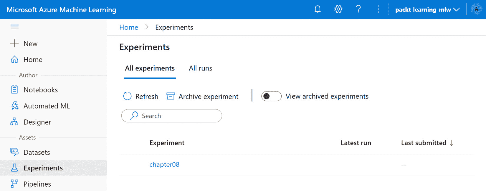

图 8.5 – 使用 SDK 创建的空实验

要在`chapter08`实验下创建一个`run`，你可以在新的单元格中添加以下代码：

```py
run = exp.start_logging()
print(run.get_details())
```

`run`变量允许你访问 AzureML SDK 的`Run`类实例，该实例代表实验的单个试验。每个`run`实例都有一个唯一的 ID，用于标识工作区中特定的运行。

重要提示

在*扩展训练过程与计算集群*部分中，你将使用`Run`类的`get_context`方法来获取当前执行 Python 脚本的`run`实例的引用。通常，当你提交脚本在实验下执行时，`run`会自动创建。`start_logging`方法较少使用，仅在你需要手动创建一个`run`并记录度量时使用。最常见的情况是你使用笔记本单元格来训练模型，或者在远程计算环境（如本地计算机或**Databricks**工作区）上训练模型时。

`run`类提供了丰富的日志记录 API。最常用的方法是通用的`log()`方法，它允许你通过以下代码记录度量：

```py
run.log("nrmse", 0.01)
run.log(name="nrmse", value=0.015, description="2nd measure")
```

在这段代码中，你记录了`nrmse`度量的值`0.01`，然后记录了同一度量的值`0.015`，并传递了可选的`description`参数。

如果你进入`chapter08`实验，你会注意到目前有一个正在运行的`run`，并且当你切换到**Metrics**标签时，你会看到**nrmse**度量的两个测量值，以图表或表格的形式呈现，正如*图 8.6*所示：

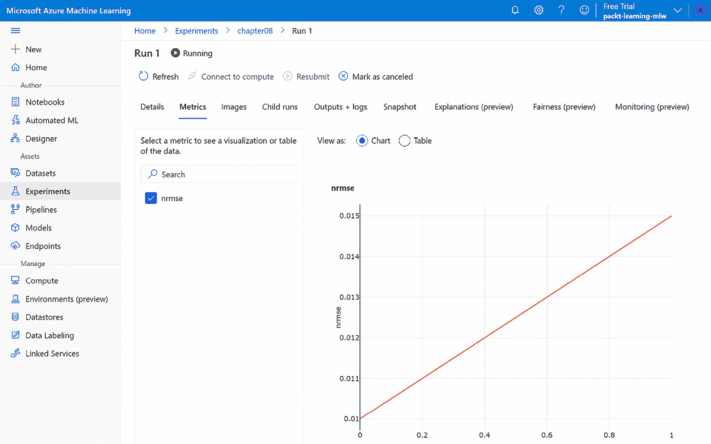

图 8.6 – 在 Studio 体验中看到的 nrmse 的两个测量值

`Run`类提供了丰富的日志记录方法，包括以下几种：

+   `log_list`方法允许你为特定度量记录一系列值。该方法的示例如下代码：

    ```py
    run.log_list("accuracies", [0.5, 0.57, 0.62])
    ```

    这段代码将在`run`的*Metrics*部分生成*图 8.7*：

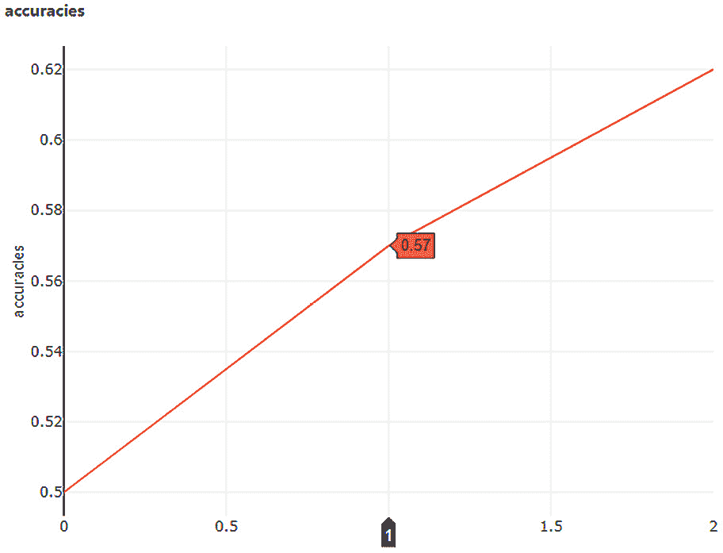

图 8.7 – 使用 log_list 方法记录的三个值的图表

+   `log_table`和`log_row`方法允许你记录表格数据。请注意，使用此方法时，你可以指定与`log_list`方法不同的*X*轴标签：

    ```py
    run.log_table("table", {"x":[1, 2], "y":[0.1, 0.2]})
    run.log_row("table", x=3, y=0.3)
    ```

    这段代码片段将在`run`的*Metrics*部分生成*图 8.8*：

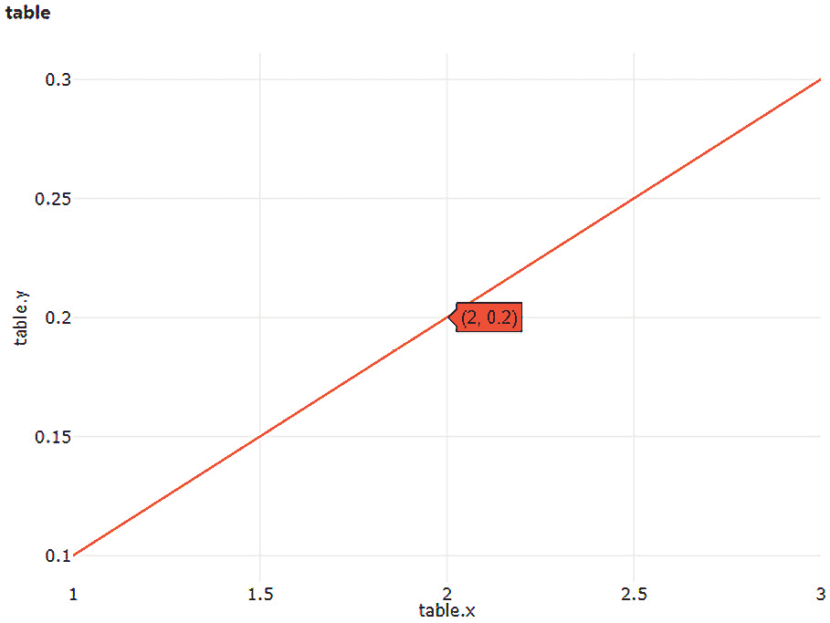

图 8.8 – 使用 log_table 和 log_row 方法记录的表格度量

+   专门的方法如`log_accuracy_table`、`log_confusion_matrix`、`log_predictions`和`log_residuals`提供了日志数据的自定义呈现。

+   `log_image`方法允许你从著名的`matplotlib` Python 库或其他绘图库记录图形或图像。

+   `upload_file`、`upload_files`和`upload_folder`方法允许你上传实验残留文件并将其与当前运行关联。这些方法通常用于上传在`run`执行过程中生成的各种二进制工件，例如由开源库如`plotly`创建的交互式 HTML 图形。

你可以选择创建子运行以隔离试验的一个子部分。子运行记录它们自己的度量指标，你也可以选择登录到父运行。例如，以下代码段创建一个子运行，记录一个名为`child_metric`的度量（该度量仅在该运行中可见），然后在父运行的度量中记录`metric_from_child`：

```py
child_run = run.child_run()
child_run.log("child_metric", 0.01)
child_run.parent.log("metric_from_child", 0.02)
```

一旦你完成了运行，你需要更改其**运行中**状态。你可以使用以下方法之一：

+   `complete`方法表示运行已成功完成。此方法还会将`outputs`文件夹（如果存在）上传到`runs`工件中，而无需显式调用`Run`类的`upload_folder`方法。

+   `cancel`方法表示作业已被取消。你会注意到在 AutoML 实验中运行被取消，因为超出了超时限制。

+   已弃用的`fail`方法表示发生了错误。

以下代码段取消了子运行并完成了根运行，打印状态，应该显示**已完成**：

```py
child_run.cancel()
run.complete()
print(run.get_status())
```

在这一部分，你了解了 AzureML 的日志记录功能。在下一部分，你将重构你在*在笔记本中训练简单的 sklearn 模型*部分编写的代码，并添加日志记录功能。

## 跟踪模型演化

在前面的部分，你可能已经注意到，当你执行`complete`方法时，本章*在笔记本中训练简单的 sklearn 模型*部分中创建的`outputs`文件夹会自动上传到运行中。为了避免上传那些过时的工件，你需要删除`outputs`文件夹：

1.  在你的`chapter08.ipynb`笔记本中添加一个单元格，并使用以下代码段删除`outputs`文件夹：

    ```py
    import shutil
    try:
      shutil.rmtree("./outputs")
    except FileNotFoundError: 
      pass
    ```

1.  下一步，你将把训练和评估的代码重构为一个单独的方法，传入`alpha`参数以及`training`和`validation`数据集：

    ```py
    from sklearn.linear_model import LassoLars
    from sklearn.metrics import mean_squared_error
    def train_and_evaluate(alpha, X_t, y_t, X_v, y_v):
      model = LassoLars(alpha=alpha)
      model.fit(X_t, y_t)
      predictions = model.predict(X_v)
      rmse = mean_squared_error(predictions, y_v, squared = False)
      range_y_validate = y_v.to_numpy().ptp()
      nrmse = rmse/range_y_validate
      print(f"NRMSE: {nrmse}")
      return model, nrmse
    trained_model, model_nrmse = train_and_evaluate(0.1, 
                            X_train, y_train,
                            X_validate, y_validate) 
    ```

    这段代码与你在*在笔记本中训练简单的 sklearn 模型*部分编写的代码完全相同。现在，你可以通过使用`train_and_evaluate`并传入不同的`alpha`参数值来训练多个模型，这个过程被称为*超参数调优*。在这段代码的最后一行，你将获得训练好的模型及其 NRMSE 度量的引用。

    重要提示

    如果你遇到以下错误：`NameError: name 'X_train' is not defined`，你需要重新运行你定义了`X_train`、`y_train`、`X_validate`和`y_validate`变量的单元格。这表示 Python 内核已经重启，所有变量都已从内存中丢失。

    到目前为止，你已经重构了现有代码并保持了相同的功能。为了启用通过前一部分中探索的`Run`类进行日志记录，你需要将当前运行实例的引用传递给`train_and_evaluate`方法。

1.  在一个新的单元格中，添加以下代码片段，它将覆盖现有的`train_and_evaluate`方法声明：

    ```py
    def train_and_evaluate(log and log_row methods to log the NRMSE metric of the trained model.Important noteIf you cannot type the *α* letter shown in the preceding example, you can use the *a* character instead.
    ```

1.  拥有这个`train_and_evaluate`方法后，你可以进行超参数调优，并为多个`α`（`alpha`）参数值训练多个模型，使用以下代码：

    ```py
    from azureml.core import Workspace, Experiment
    ws = Workspace.from_config()
    exp = Experiment(workspace=ws, name="chapter08")
    with exp.start_logging() as run:
        print(run.get_portal_url())
        for a in [0.001, 0.01, 0.1, 0.25, 0.5]:
            train_and_evaluate(run, a, 
                                X_train, y_train,
                                X_validate, y_validate)
    ```

    注意，我们没有调用`complete`方法，而是使用了`with .. as`的 Python 设计模式。随着`run`变量超出作用域，它会自动标记为已完成。

1.  在*步骤 4*中使用`get_portal_url`，你打印了指向工作室的`log`方法调用的链接，而`α`（`alpha`）参数是你使用`log_row`方法记录的内容。你应该看到类似于*图 8.9*所示的图表：

![图 8.9 – 糖尿病模型的 nrmse 指标演变]

](img/B16777_08_009.jpg)

图 8.9 – 糖尿病模型的 nrmse 指标演变

重要提示

在本节中，你仅仅将指标存储在`Run`实例中，而不是实际的训练模型。你本可以通过生成`.pkl`文件并使用`upload_file`方法将其上传到运行的工件中来存储生成的模型。在*第十二章*，*使用代码实现模型操作*，你将学习 AzureML SDK 的模型注册功能，它提供了一种更优的体验来跟踪实际模型。

在本节中，你看到了如何使用 AzureML SDK 启用指标日志记录。在跟踪实验指标方面，数据科学界使用了一个流行的开源框架——MLflow。在下一节中，你将学习如何使用该库在 AzureML 工作区中跟踪指标。

## 使用 MLflow 跟踪实验

MLflow 库是一个流行的开源库，用于管理数据科学实验的生命周期。该库允许你将工件和指标存储在本地或服务器上。AzureML 工作区提供了一个 MLflow 服务器，你可以用它来做以下事情：

+   通过**MLflow** **跟踪**组件跟踪和记录实验指标。

+   通过**MLflow** **项目**组件在 AzureML 计算集群上协调代码执行（类似于你将在*第十一章*中看到的管道，*与管道合作*）。

+   在 AzureML 模型注册表中管理模型，你将在*第十二章*《用代码实现模型运营化》中看到该内容。

本节将重点介绍 MLflow Tracking 组件，用于跟踪度量。以下代码片段使用`MLflow`库跟踪你在前一节中创建的`diabetes`模型的参数和度量，实验名称为`chapter08-mlflow`：

```py
import mlflow
def train_and_evaluate(alpha, X_t, y_t, X_v, y_v):
  model = LassoLars(alpha=alpha)
  model.fit(X_t, y_t)
  predictions = model.predict(X_v)
  rmse = mean_squared_error(predictions, y_v, squared = False)
  range_y_validate = y_v.to_numpy().ptp()
  nrmse = rmse/range_y_validate
  mlflow.log_metric("nrmse", nrmse)
  return model, nrmse
mlflow.set_experiment("chapter08-mlflow")
with mlflow.start_run():
    mlflow.sklearn.autolog()
    trained_model, model_nrmse = train_and_evaluate(0.1, 
                                    X_train, y_train,
                                    X_validate, y_validate)
```

MLflow Tracking 组件最著名的特点之一是其提供的自动日志记录功能。在训练代码之前调用`mlflow.sklearn.autolog()`方法，可以自动记录`sklearn`的度量、参数和生成的模型。类似于`sklearn`特定的`autolog`方法，常见训练框架（如 PyTorch、fast.ai、Spark 等）也有对应的包。

使用`log_metric`方法，你显式地要求 MLflow 库记录一个度量。在此示例中，你记录了 NRMSE 度量，该度量不会通过自动日志记录功能自动捕获。

正如*图 8.10*所示，MLflow Tracking 组件将所有工件和训练模型以文件夹结构记录在`mlruns`文件夹中，紧邻笔记本文件。

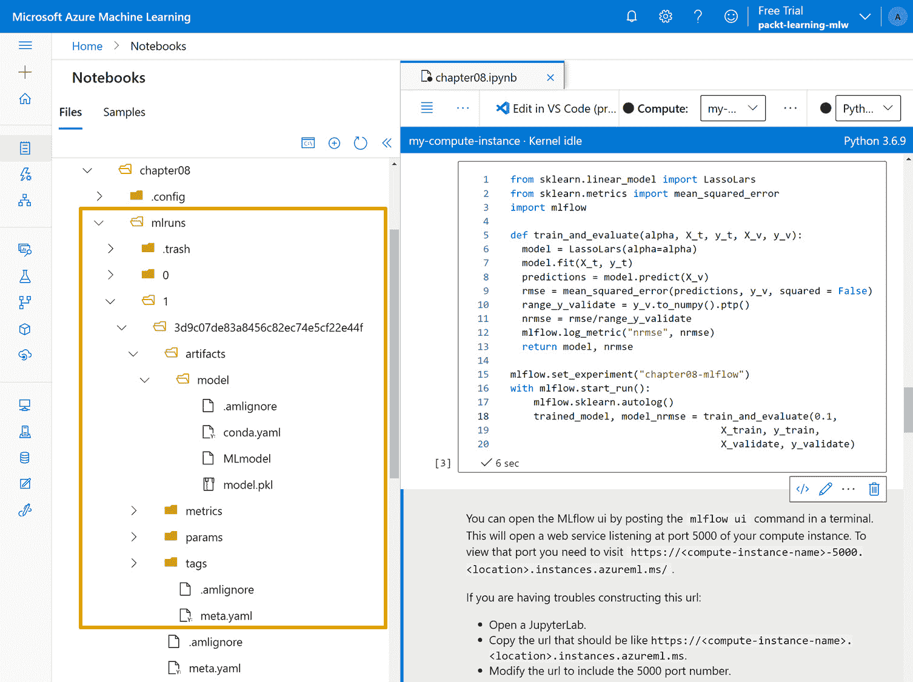

图 8.10 – 使用 MLflow Tracking 组件的本地 FileStore 模式跟踪度量

这是默认设置，称为`本地 FileStore`。你可以将 AzureML 工作区用作*远程跟踪服务器*。为此，你需要使用`mlflow.set_tracking_uri()`方法连接到一个跟踪 URI。

要启用 MLflow 与 AzureML 的集成，你需要确保环境中安装了`azureml-mlflow` Python 库。该库已包含在 AzureML 计算实例中。如果你在 Databricks 工作区中工作，则需要通过`pip install azureml-mlflow`命令手动安装。

要获取跟踪**URI**并使用 AzureML 作为远程跟踪服务器运行相同的实验，请使用以下代码片段：

```py
import mlflow
from azureml.core import Workspace
ws = Workspace.from_config()
mlflow.set_tracking_uri(ws.get_mlflow_tracking_uri())
mlflow.set_experiment("chapter08-mlflow")
with mlflow.start_run():
    mlflow.sklearn.autolog()
    trained_model, model_nrmse = train_and_evaluate(0.1, 
                                    X_train, y_train,
                                    X_validate, y_validate)
```

`Workspace`类的`get_mlflow_tracking_uri`方法返回一个有效期为 1 小时的 URL。如果你的实验超过一小时仍未完成，你将需要生成新的 URI，并使用`set_tracking_uri`方法将其分配，如前面代码片段所示。

你应该能够在 Studio 界面中看到运行情况和已跟踪的度量，如*图 8.11*所示：

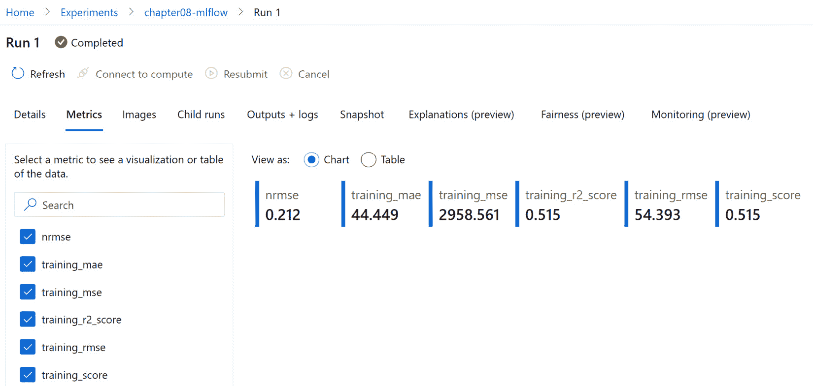

图 8.11 – 使用 MLflow 库并将 AzureML 用作远程跟踪服务器时记录的度量

到目前为止，你一直在使用 AzureML 工作区中的计算实例，并且你是在**Notebook**内核中训练 ML 模型。对于小型模型或在示例数据上快速原型开发，这种方法效果很好。但在某些时候，你将需要处理更高负载的工作负载，这可能涉及更大的内存要求，甚至是在多个计算节点上进行分布式训练。你可以通过将训练过程委托给在*第四章*中创建的计算集群来实现这一目标，*配置工作区*。在下一节中，你将学习如何在 AzureML 计算集群中执行 Python 脚本。

# 使用计算集群扩展训练过程

在*第七章*，*AzureML Python SDK*中，你创建了一个名为`cpu-sm-cluster`的计算集群。在这一节中，你将提交一个训练任务以在该集群上执行。为此，你需要创建一个将在远程计算目标上执行的 Python 脚本。

导航到你迄今为止正在使用的`chapter08`文件夹中的`greeter-job`。添加一个名为`greeter.py`的 Python 文件：

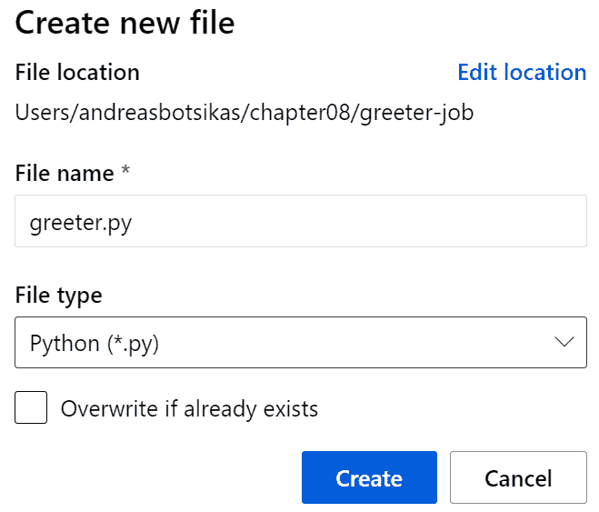

图 8.12 – 向远程计算集群添加简单的 Python 脚本以执行

打开该文件并添加以下代码：

```py
import argparse
parser = argparse.ArgumentParser()
parser.add_argument('--greet-name', type=str, 
                    dest='name', help='The name to greet')
args = parser.parse_args()
name = args.name
print(f"Hello {name}!")
```

该脚本使用`argparse`模块中的`ArgumentParser`类来解析传递给脚本的参数。它试图查找一个`--greet-name`参数，并将找到的值分配给它返回的对象的`name`属性（`args.name`）。然后，它会打印出给定名称的问候消息。要尝试这个脚本，请打开终端并输入以下命令：

```py
python greeter.py --greet-name packt
```

这个命令将产生如下所示的输出，如*图 8.13*所示：

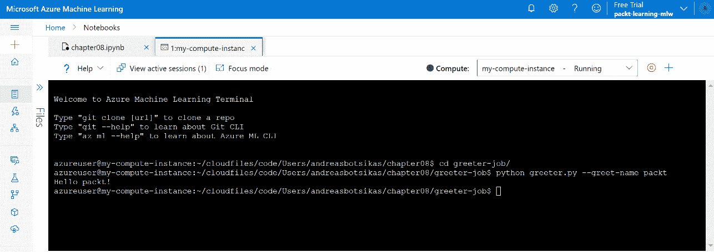

图 8.13 – 测试你将在远程计算机上执行的简单脚本

为了在远程计算集群上执行这个简单的 Python 脚本，请返回到`chapter08.ipynb`笔记本，添加一个新单元，并输入以下代码：

```py
from azureml.core import Workspace, Experiment
from azureml.core import ScriptRunConfig
ws = Workspace.from_config()
target = ws.compute_targets['cpu-sm-cluster']
script = ScriptRunConfig(
    source_directory='greeter-job',
    script='greeter.py',
    compute_target=target,
    arguments=['--greet-name', 'packt']
)
exp = Experiment(ws, 'greet-packt')
run = exp.submit(script)
print(run.get_portal_url())
run.wait_for_completion(show_output=True)
```

在这段代码中，你正在执行以下操作：

1.  获取工作区的引用，然后将`target`变量分配给`cpu-sm-cluster`集群的引用。

1.  创建一个`ScriptRunConfig`，以执行位于`greeter-job`文件夹中的`greeter.py`脚本。该脚本将在`target`计算机上执行，并传递`--greet-name`和`packt`参数，它们将通过空格连接起来。

1.  创建一个名为`greet-packt`的实验，并将脚本配置提交以在该实验下执行。`submit`方法创建了一个新的`Run`实例。

1.  你可以使用`get_portal_url`方法获取特定`Run`实例的门户 URL。然后调用`wait_for_completion`方法，将`show_output`参数设置为`True`。为了等待运行完成，开启详细日志记录，并在单元格的输出中打印日志。

    重要说明

    在 AzureML SDK 的第一个版本中，你会使用`Estimator`类，而不是`ScriptRunConfig`，但该类已被弃用。此外，还有一些针对特定框架的已弃用专用`Estimator`类，例如`TensorFlow`类，它提供了一种运行特定于 TensorFlow 的代码的方式。这种方法已经被弃用，取而代之的是你将在下面的*理解执行环境*部分中阅读到的环境。然而，这些已弃用类的语法和参数与`ScriptRunConfig`非常相似。你应该能够毫无问题地阅读这些已弃用的代码。如果在认证考试中看到关于这些已弃用类的旧问题，记得这一点。

你已经成功完成了远程执行的运行。在下一部分，你将探索刚刚完成的运行日志，更好地理解 AzureML 的机制。

## 探索运行的输出和日志

在这一部分，你将探索在*使用计算集群扩展训练过程*部分中执行的远程执行输出。这将帮助你深入了解 AzureML 平台的工作原理，并帮助你排查在开发训练脚本时可能遇到的潜在错误。

使用`get_portal_url`方法打开你在前一部分中打印的链接，或者导航到`greet-packt`实验并打开**Run 1**。进入该运行的**Outputs + logs**标签页：

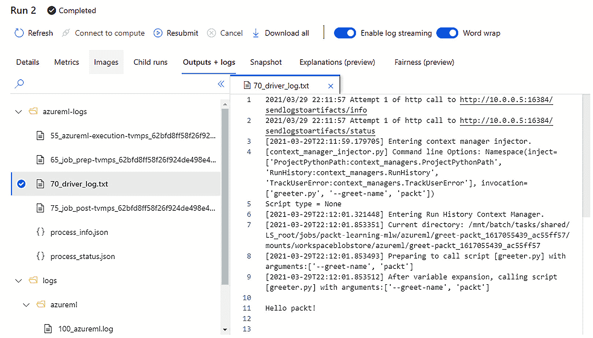

图 8.14 – 实验运行的 Outputs + logs 标签页

这些输出对于排查潜在的脚本错误非常有帮助。`azureml-logs`文件夹包含平台日志。这些文件大部分是底层引擎的日志。包含你脚本标准输出的日志是`70_driver_log.txt`。这是你需要首先查看的日志文件，用于排查潜在的脚本执行失败。如果你有多个进程，你会看到多个带有数字后缀的文件，如`70_driver_log_x.txt`。

`logs`文件夹是你可以在脚本中使用的特殊文件夹，用于输出日志。脚本写入该文件夹的所有内容会自动上传到你在*实验中跟踪指标*部分中看到的运行`outputs`文件夹。AzureML 还会在该文件夹下的`azureml`文件夹中输出系统日志，如*图 8.14*所示。

导航到`ScriptRunConfig`。该目录可以包含最多 300MB 的内容和最多 2,000 个文件。如果需要更多脚本文件，你可以使用数据存储。如果你在`.py`脚本中编辑了脚本文件以及一个`.amltmp`文件，这是由笔记本编辑器使用的临时文件：

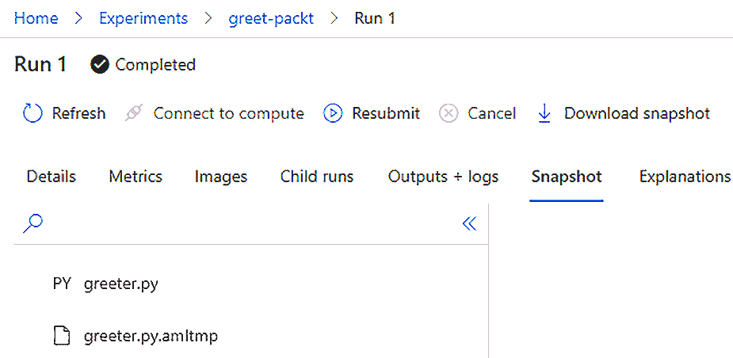

图 8.15 – 临时文件上传至快照中

为了避免创建不需要的文件快照，你可以在脚本旁边的文件夹中添加`.gitignore`或`.amlignore`文件，并排除符合特定模式的文件。导航到`greeter-job`文件夹中的`.amlignore`文件，如果在创建文件夹时尚未添加该文件，如*图 8.16*所示：


图 8.16 – 添加`.amlignore`文件以排除临时文件被添加到快照中

打开`.amlignore`文件，并在其中添加以下行，以排除所有具有`.amltmp`文件扩展名的文件以及你正在编辑的`.amlignore`文件：

```py
*.amltmp
.amlignore
```

打开`chapter08.ipynb`笔记本，添加一个单元，并添加以下代码以重新提交脚本：

```py
from azureml.widgets import RunDetails
run = exp.submit(script)
RunDetails(run).show()
```

你正在重新提交之前步骤中创建的`ScriptRunConfig`的现有实例。如果你再次重启`exp`和`script`变量。

这次，你正在使用 AzureML SDK 提供的`RunDetails`小部件。这是一个**Jupyter** **Notebook**小部件，用于查看脚本执行的进度。这个小部件是异步的，会在运行完成前不断更新。

如果你想打印运行状态，包括日志文件的内容，可以使用以下代码片段：

```py
run.get_details_with_logs()
```

一旦运行完成，导航到该运行的**Snapshot**标签页。你会注意到临时文件已经消失。

注意，这次运行的执行时间显著减少。导航到运行的日志。注意，这次日志中没有出现`20_image_build_log.txt`文件，如*图 8.17*所示：

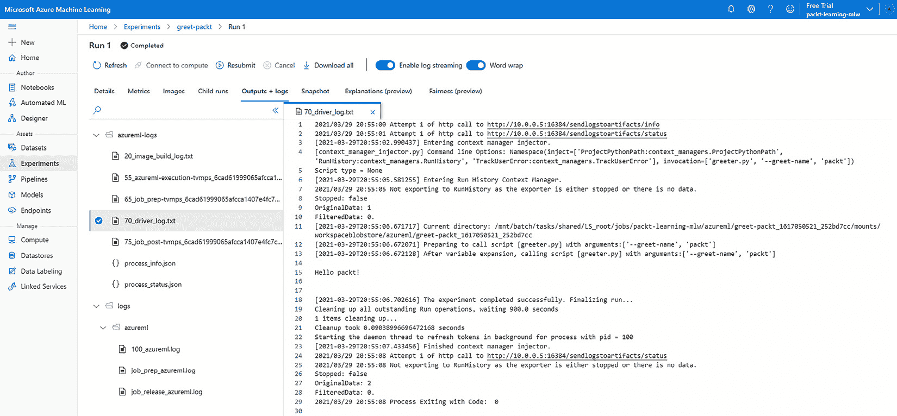

图 8.17 – 更快的运行执行和缺失的 20_image_build_log.txt 文件

这是用于执行脚本的环境的**Docker**镜像构建日志。这个过程非常耗时。这些镜像被构建并存储在与您的 AzureML 工作区一起部署的容器注册表中。由于你没有修改执行环境，AzureML 在后续的运行中重新使用了之前创建的镜像。在接下来的部分，你将更好地理解什么是环境以及如何修改它。

## 理解执行环境

在 AzureML 工作区的术语中，**环境**意味着执行脚本所需的软件要求列表。这些软件要求包括以下内容：

+   你的代码需要安装的 Python 包

+   可能需要的环境变量

+   你可能需要的各种辅助软件，如 GPU 驱动程序或 **Spark** 引擎，以确保你的代码能够正常运行。

环境是*管理*和*版本化*的实体，它们可以在不同的计算目标之间实现可重复、可审计和可移植的机器学习工作流。

AzureML 提供了一个 `AzureML-Minimal` 精选环境列表，包含仅用于启用运行跟踪所需的最小 Python 包，你在*跟踪模型演变*部分看到过。另一方面，`AzureML-AutoML` 环境是一个更大的精选环境，提供了运行 AutoML 实验所需的 Python 包。

重要提示

AzureML 服务正在不断更新，旧的环境已经被淘汰，取而代之的是更新的环境。即使在 AzureML Studio 的网页界面中看不到 `AzureML-Minimal` 和 `AzureML-AutoML` 环境，它们仍然可以供你使用。如果遇到任何错误，请从本章的 GitHub 仓库下载最新的代码。

在*图 8.18*中，你可以看到与简化版的 `AzureML-Minimal` 环境相比，`AzureML-AutoML` 环境提供了多少额外的软件包：

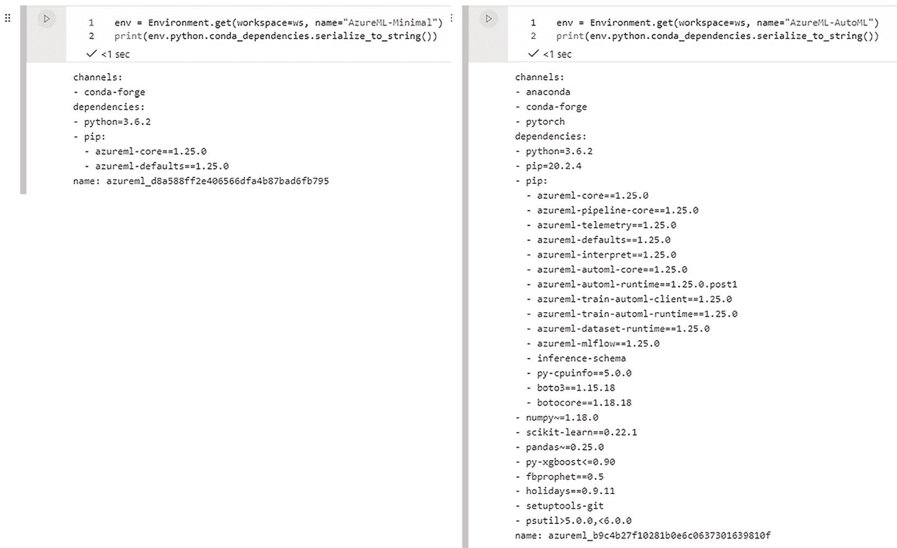

图 8.18 - AzureML-Minimal 和 AzureML-AutoML 环境之间的 Python 包差异

*图 8.18* 显示了 `AzureML-Minimal` 环境 *版本 46* 与 `AzureML-AutoML` 环境 *版本 61* 的 `Conda` 环境定义。`Conda` 使用这个 YAML 文件来安装 Python *版本 3.6.2* 和在 `- pip:` 标记下列出的 `pip` 依赖包。如你所见，所有 `pip` 包都定义了特定的版本，使用 `==x.x.x` 的标记。这意味着每次使用该 YAML 文件时，都会安装相同的 Python 包，这有助于保持稳定的环境，从而确保实验的可重复性。

创建环境时安装软件包是一个耗时的过程。这时你在前一部分看到的 Docker 技术就派上用场了。Docker 是一个开源项目，旨在自动化将应用程序部署为便携式、自给自足的容器。这意味着，与你每次想要运行脚本时都创建一个新环境不同，你可以创建一个 Docker 容器镜像，也称为 Docker 镜像，在这个镜像中，所有的 Python 依赖都*已经内嵌*到镜像中。此后，你可以重复使用该镜像来启动容器并执行脚本。事实上，所有 AzureML 精选环境都可以作为 Docker 镜像，在 `viennaglobal.azurecr.io` 容器注册表中找到。

重要提示

尽管创建 Docker 镜像用于环境的配置是常见的做法，但并非总是必需的。如果你在本地计算机或 AzureML 计算实例上运行实验，你可以使用现有的 `Conda` 环境，而无需使用 Docker 镜像。如果你打算使用远程计算，例如 AzureML 计算集群，则需要使用 Docker 镜像，因为否则你无法确保所提供的机器会具备你的代码执行所需的所有软件组件。

为了更好地理解到目前为止你所阅读的内容，你将重新运行之前的 `greeter.py` 脚本，并使用 `AzureML-Minimal` 环境：

1.  在你的笔记本中，添加一个新单元并加入以下代码：

    ```py
    from azureml.core import Environment
    minimal_env =\
    Environment.get(ws, name="AzureML-Minimal")
    print(minimal_env.name, minimal_env.version)
    print(minimal_env.Python.conda_dependencies.serialize_to_string())
    ```

    这段代码检索了 `AzureML-Minimal` 环境，该环境在之前在笔记本中初始化的 `ws` 变量所引用的 AzureML 工作区中定义。然后，它打印环境的名称和版本，以及你在 *图 8.18* 中看到的 `Conda` 环境 YAML 定义。

1.  添加一个新单元，并输入以下内容：

    ```py
    from azureml.core import Experiment, ScriptRunConfig
    target = ws.compute_targets['cpu-sm-cluster']
    script = ScriptRunConfig(
        source_directory='greeter-job',
        script='greeter.py',
        environment argument in the ScriptRunConfig constructor.
    ```

查看运行执行的输出。如果你仔细观察，你将看到以下这一行：

```py
Status: Downloaded newer image for viennaglobal.azurecr.io/azureml/azureml_<something>:latest
```

这一行是 `azureml-logs` 中 `55_azureml-execution-something.txt` 文件的一部分。该行告知你它正在从 **Microsoft** 所拥有的 `viennaglobal` 容器注册表中拉取 Docker 镜像。与此相对，上一节中，在没有指定策划环境的运行中，镜像是从你自己的容器注册表中拉取的——即与你的 AzureML 工作区关联的容器注册表，如 *图 8.19* 所示：

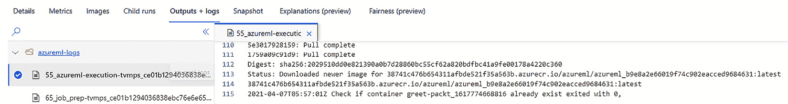

图 8.19 – 在没有使用策划环境的情况下，从你自己的容器注册表中拉取的镜像

这个观察结果引出了下一个类型的 AzureML 支持的环境——系统管理环境——你将在下一节中进行探索。

### 定义系统管理环境

`Conda` 环境定义或简单的 `pip` `requirements.txt` 文件。在上一节中，你没有在 `ScriptRunConfig` 构造函数中定义 `environment` 参数，因此使用了默认的 `Conda` 环境定义文件来创建存储在与 AzureML 工作区关联的 **Azure** **容器注册表** 中的系统管理环境。现在，让我们显式地创建一个系统管理环境来与代码一起使用：

1.  导航到你 AzureML 工作区的 **笔记本** 部分以及 **文件** 树视图。

1.  点击 `greeter-job` 文件夹的三个点以打开上下文菜单（或者直接右击文件夹名称），然后选择 `greeter-banner-job`，如下面的截图所示：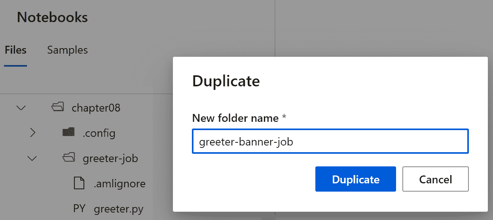

    图 8.20 – 将 greeter-job 文件夹复制为一个名为 greeter-banner-job 的新文件夹

1.  打开新文件夹中的 `greeter.py` 文件，并将代码更改为以下内容：

    ```py
    import argparse
    Banner method from the asciistuff open source Python package. This method is used in the last print. This will output a fancy os module, which allows you to read the environment variables using the os.environ.get() method. The code tries to read the environment variable named GREET_HEADER, and if it is not defined, the default value, Message:, is assigned to the greet_header variable, which is printed before the banner message.Important noteIf you try to execute the modified `greeter.py` in a terminal within your AzureML *compute instance*, it will fail because you don't have the `asciistuff` package installed. To install it in your compute instance, you can use the `pip install asciistuff` command.
    ```

1.  `asciistuff` 包是一个 `pip` 包，你需要在执行环境中安装它，以确保代码能够正常运行。为了定义这个代码依赖，你将创建一个 `Conda` 环境定义文件。在 `chapter08` 文件夹中，添加一个名为 `greeter-banner-job.yml` 的新文件，并在其中添加以下内容：

    ```py
    name: banner-env
    dependencies:
    - python=3.6.2
    - pip:
      - asciistuff==1.2.1 
    ```

    这个 YAML 文件定义了一个新的 `Conda` 环境，名为 `banner-env`，该环境基于 Python *版本 3.6.2*，并安装了 `asciistuff` 的 *1.2.1* 版本的 `pip` 包。

1.  若要基于你刚定义的 `Conda` 环境创建一个 AzureML 环境，你需要进入 `chapter08.ipynb` 笔记本，添加一个单元格，并输入以下代码：

    ```py
    from azureml.core import Environment
    banner_env = Environment.from_conda_specification(
                     name = "banner-env",
                     file_path = "greeter-banner-job.yml")
    banner_env.environment_variables["GREET_HEADER"] = \
                                     "Env. var. header:"
    ```

    这段代码创建了一个名为 `banner-env` 的 AzureML 环境，使用了 `Environment` 类的 `from_conda_specification()` 方法。`banner_env` 变量包含了新定义的环境。在随后的代码行中，你定义了 `GREET_HEADER` 环境变量，并为其赋值为 `Env. var. header:`。该环境未在工作区中注册，使用时不需要注册。如果你确实想要将它保存到工作区，以便像引用策划环境一样引用它，并希望保持版本记录，可以使用 `register()` 方法，使用 `banner_env.register(ws)` 代码，其中你传入一个指向工作区的变量，该工作区将是该环境的注册位置。

    重要说明

    如果你计划先在本地计算机上工作，然后再扩展到更强大的计算集群上，你应考虑创建并注册一个系统管理的环境，包含你所需的所有 Python 包。这样，你可以在本地和远程执行时都重复使用它。

1.  若要使用这个新定义的环境，请在笔记本中添加一个新单元格，并输入以下代码：

    ```py
    script = ScriptRunConfig(
        source_directory='ScriptRunConfig::*   The source directory has changed to point to the `greeter-banner-job` folder, which contains the updated script.*   The environment argument is specified, passing your very own defined `banner_env` environment. 
    ```

该实验的输出应与 *图 8.21* 中所示相似：

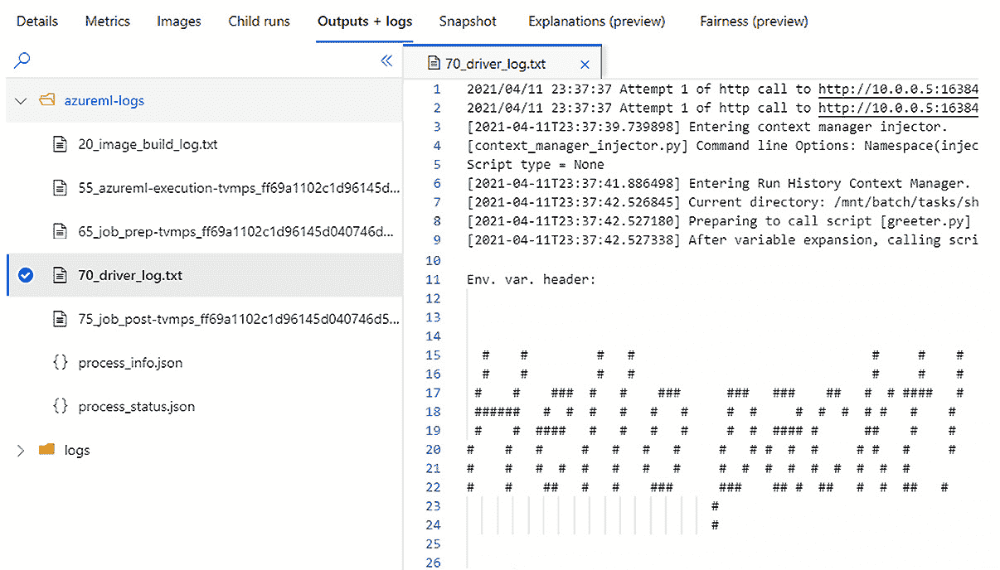

图 8.21 – 从环境变量读取的头部文本和基于横幅的问候语

正如你注意到的，在你刚刚创建的系统管理环境中，你没有指定任何关于基础操作系统的信息（例如，是否已在基础系统中安装了`Conda`）。你只是指定了已安装的`Conda`依赖项。如果你想要更大的灵活性，你可以显式配置环境并手动安装所有的软件要求。这些环境被称为**用户管理**环境。通常，这些用户管理环境是自定义的 Docker 镜像，封装了所有必需的依赖项。例如，你可能需要 PyTorch 框架的自定义构建，或者甚至是 Python 的自定义构建版本。在这些情况下，你需要负责安装 Python 包并配置整个环境。在本书中，你将使用经过精心策划或由系统管理的环境。

到目前为止，你已经探索了如何在远程计算机上执行一个简单的问候程序 Python 应用。在接下来的部分，你将继续训练你的`diabetes`模型，并了解如何在远程计算集群上训练该模型。

## 在计算集群上训练糖尿病模型

在前面的部分中，你了解了如何通过在笔记本中调用`exp.submit(script)`方法在远程计算集群上运行脚本，如*图 8.22*所示：

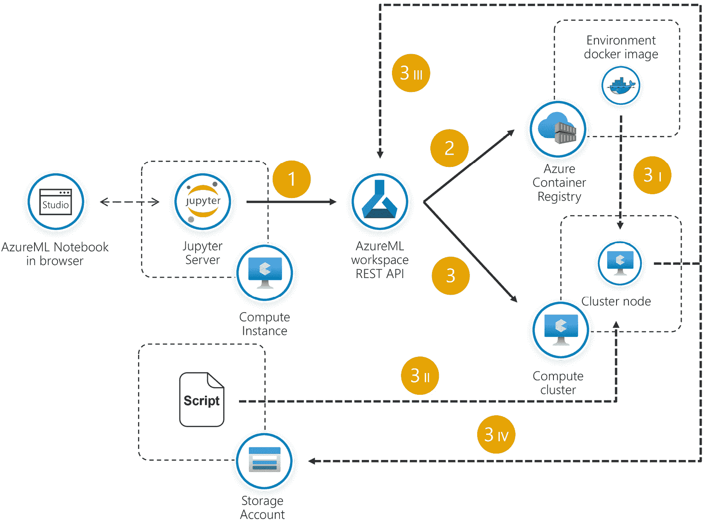

图 8.22 – 在计算集群上执行脚本

当你调用`submit`方法时，后台发生了以下操作：

1.  AzureML SDK 执行了一个 `ScriptRunConfig`。

1.  AzureML 工作区检查是否已经存在`Environment`的 Docker 镜像。如果没有，它会在 Azure 容器注册表中创建。

1.  任务被提交到计算集群，集群会扩展以分配一个计算节点。在新分配的计算节点中执行以下操作：

1.  带有环境的 Docker 镜像被拉取到计算节点上。

1.  由`ScriptRunConfig`引用的脚本被加载到正在运行的 Docker 实例中。

1.  指标和元数据存储在 AzureML 工作区中。

1.  输出将存储回存储帐户。

在*使用笔记本训练简单的 sklearn 模型*部分中，你在 `chapter08.ipynb` 笔记本中创建了一个训练脚本。训练发生在 Jupyter 服务器的进程中，位于你的计算实例内部。要在计算集群上运行相同的训练，你需要执行以下操作：

1.  将代码移动到 Python 脚本文件中。

1.  创建一个 AzureML 环境来运行训练。

1.  在实验中提交`ScriptRunConfig`。

在接下来的部分中，你将看到如何将你在*跟踪模型演变*部分中使用的脚本转换，以便能够在远程计算集群上执行它。

### 将代码移动到 Python 脚本文件中

如果你查看你在*跟踪模型演变*部分创建的脚本，在进行训练的代码中，你使用了`run`变量来记录指标。这个变量引用了你在调用`exp.start_logging()`时获得的`Run`对象。在前一部分中，你了解了`ScriptRunConfig`，它在 Experiment 中提交并返回了一个`Run`类的实例。这个实例是在计算实例的笔记本中创建的。那么，如何让执行在远程集群上的脚本文件访问相同的`Run`对象呢？

AzureML 的`Run`类提供了一个叫做`get_context()`的方法，它返回当前服务执行上下文。对于`ScriptRunConfig`，这个执行上下文就是在调用`exp.submit(script)`时创建的相同`Run`对象：

```py
from azureml.core.run import Run
run = Run.get_context()
```

除了`run`变量，在训练脚本中，你还使用了`ws`变量，它是指向 AzureML 工作区的引用。你使用该变量来访问`diabetes`数据集。你通过调用`from_config`方法来获取工作区的引用。这个方法的问题在于，当你第一次调用时，你需要手动进行身份验证并授权计算资源代表你访问工作区。这样的方法在远程计算环境中是不可行的。

`run`变量通过在 Experiment 属性中导航，再到该 Experiment 的工作区属性，为你提供了访问对应工作区的方式：

```py
ws = run.experiment.workspace
```

然而，这些代码行有一个警告。你的代码假设 Python 脚本是通过`ScriptRunConfig`提交的。如果你在终端本地运行 Python 脚本，使用以下命令行，你将会遇到错误：

```py
python training.py --alpha 0.1
```

`get_context()`方法将返回一个`_OfflineRun`类的对象，该类继承自`Run`类。这个类提供了你在*实验中跟踪指标*部分看到的所有日志功能，但它并不会将指标或工件上传到工作区，而是直接在终端中打印尝试结果。显然，这个`run`没有关联任何 Experiment，这会导致脚本抛出错误。因此，你需要使用你一直在使用的`from_config()`方法来检索工作区引用。由于终端是计算实例的一部分，脚本将在不提示身份验证的情况下执行，并且会传递你的凭据，正如你稍后在本节中看到的那样。如果你在本地计算机上运行这段代码，你将需要进行设备身份验证，正如你在*第七章*的*从设备进行身份验证*部分中所看到的，*AzureML Python SDK*。

允许你在终端离线运行并在计算集群中提交的完整代码如下：

```py
from azureml.core import Workspace
from azureml.core.run import Run, _OfflineRun
run = Run.get_context()
ws = None
if type(run) == _OfflineRun:
    ws = Workspace.from_config()
else:
    ws = run.experiment.workspace
```

这些就是你需要对脚本做出的唯一修改，目的是为了提交到远程执行并利用 AzureML SDK 的功能。

重要提示

Python 开发者通常会在他们想标记为内部的类、属性或方法前加一个`_`前缀。这意味着标记的代码是供`SDK`库中的类使用，外部开发者不应该使用这些代码。标记的代码可能在未来发生变化而不会提前通知。通常不推荐使用以`_`开头的类，然而，`_OfflineRun`类在 AzureML SDK 的公共示例中被广泛使用，使用它是安全的。

让我们在工作区中进行这些更改。在文件树中，在`chapter08`下创建一个名为`diabetes-training`的文件夹，并在其中添加一个`training.py`文件，正如*图 8.23*所示：

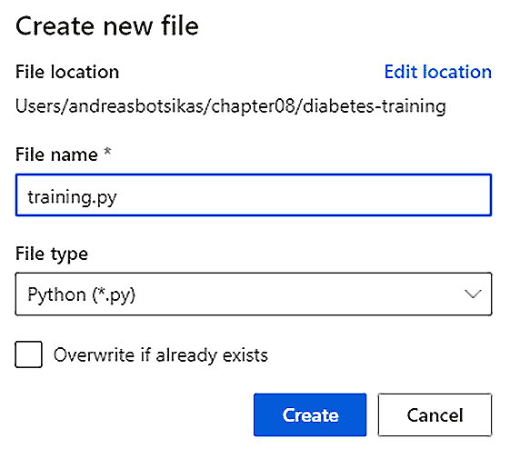

图 8.23 – 为远程糖尿病模型训练创建训练脚本

在`training.py`脚本中添加以下代码块。你可以直接从本章*技术要求*部分提到的 GitHub 仓库中下载这些代码，而不需要手动输入：

```py
from sklearn.linear_model import LassoLars
from sklearn.metrics import mean_squared_error
from azureml.core import Workspace
from azureml.core.run import Run, _OfflineRun
import argparse
import os
import joblib
```

这些是脚本文件中所需的所有导入。将所有`import`语句放在脚本文件顶部是一种良好的编程习惯，这样可以方便地发现代码执行所需的模块。如果你使用`flake8`来检查代码，它会提醒你如果没有遵循这一最佳实践：

```py
parser = argparse.ArgumentParser()
parser.add_argument('--alpha', type=float, 
                  dest='alpha', help='The alpha parameter')
args = parser.parse_args()
```

这个脚本文件需要传入`--alpha`参数。在这个代码块中，使用你在*使用计算集群扩展训练过程*部分看到的`argparse`模块解析这个参数，并将`float`类型的值赋给`args.alpha`变量，正如在`dest`参数中指定的那样。如果你传递了未定义的参数给脚本，`parse_args`方法将会抛出错误。有些人更喜欢使用`args, unknown_args = parser.parse_known_args()`，代替代码块的第四行，这样即使脚本收到比预期更多的参数，也能执行，并将未知参数赋值给`unknown_args`变量：

```py
run = Run.get_context()
ws = None
if type(run) == _OfflineRun:
    ws = Workspace.from_config()
else:
    ws = run.experiment.workspace
```

在这个代码块中，你通过开头部分看到的代码片段获取到`Run`对象和`Workspace`的引用。一旦获得`Workspace`的引用，你就可以加载`diabetes`数据集，正如下一个脚本块所示：

```py
diabetes_ds = ws.datasets['diabetes']
training_data, validation_data = \
               diabetes_ds.random_split(
                            percentage = 0.8, seed=1337)
X_train = training_data.drop_columns('target') \
                       .to_pandas_dataframe()
y_train = training_data.keep_columns('target') \
                       .to_pandas_dataframe()
X_validate = validation_data.drop_columns('target') \
                            .to_pandas_dataframe()
y_validate = validation_data.keep_columns('target') \
                            .to_pandas_dataframe()
```

在这个代码块中，您获得 `diabetes` 数据集的引用，并将其拆分为所需的 `X_train`、`y_train`、`X_validate` 和 `y_validate` pandas 数据框，这些数据框您在本章的 *在笔记本中训练简单的 sklearn 模型* 部分中看到过。请注意，您在 `random_split` 方法中指定了 `seed` 参数。这个 `seed` 参数用于初始化 `split` 方法背后使用的随机函数的状态，以便从数据集中随机选择行。这样，每次调用该随机函数时，它都会生成相同的随机数。这意味着 `training_data` 和 `validation_data` 每次运行脚本时都会保持一致。拥有相同的训练和验证数据集有助于正确比较在不同 `alpha` 参数下执行相同脚本的多次结果：

```py
def train_and_evaluate(run, alpha, X_t, y_t, X_v, y_v):
  model = LassoLars(alpha=alpha)
  model.fit(X_t, y_t)
  predictions = model.predict(X_v)
  rmse = mean_squared_error(predictions,y_v,squared=False)
  range_y_validate = y_v.to_numpy().ptp()
  nrmse = rmse/range_y_validate
  run.log("nrmse", nrmse)
  run.log_row("nrmse over α", α=alpha, nrmse=nrmse)
  return model, nrmse
```

在此代码块中，您定义了 `train_and_evaluate` 方法，这与本章 *追踪模型演变* 部分中使用的方法相同：

```py
model, nrmse = train_and_evaluate(run, args.alpha,
                  X_train, y_train, X_validate, y_validate)
```

在定义方法后，您调用训练过程并传递所有必需的参数：

```py
os.makedirs('./outputs', exist_ok=True)
model_file_name = 'model.pkl'
joblib.dump(value=model, filename=
           os.path.join('./outputs/',model_file_name))
```

最后一个代码块将模型存储在 `outputs` 文件夹中，该文件夹位于脚本的同一位置。

您可以在本地计算实例上运行脚本，您会注意到模型按预期进行训练，指标会记录在终端中，如 *图 8.24* 所示。这是您之前阅读过的 `_OfflineRun` 类的预期行为：

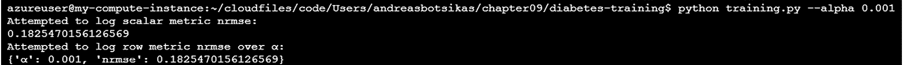

图 8.24 – 在本地运行训练脚本

到目前为止，您已经创建了训练脚本。在下一部分中，您将创建 AzureML 环境，该环境将包含执行该脚本所需的所有依赖项，以便在远程计算上运行。

### 创建用于运行训练脚本的 AzureML 环境

在*追踪模型演变*部分中创建的训练脚本使用了 `scikit-learn` 库，也称为 `sklearn`。您在笔记本体验中使用的 Jupyter 内核已经安装了 `sklearn` 库。要查看当前在内核中安装的版本，请转到 `chapter08.ipynb` 笔记本，并在新的单元格中添加以下代码片段：

```py
!pip show scikit-learn
```

该命令将使用 Python 的 `pip` 包管理器显示当前安装的 `scikit-learn` 包的详细信息，如 *图 8.25* 所示：

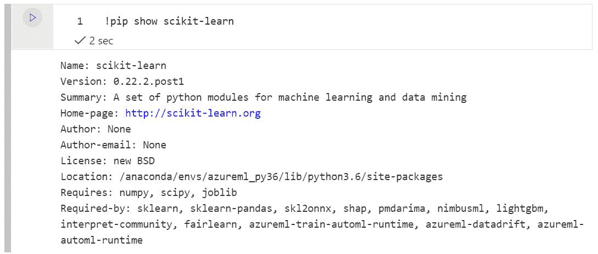

图 8.25 – 安装的 scikit-learn 库的包信息

重要提示

如果您不确定库的名称，可以使用 `pip freeze` 命令来获取当前 Python 环境中已安装包的完整列表。

您还可以通过在 Python 脚本中使用 `sklearn.__version__` 属性（注意两个下划线）来查找已安装库的版本。在新的笔记本单元格中，添加以下 Python 代码行：

```py
import sklearn
print(sklearn.__version__)
```

你应该能够在输出中看到完全相同的版本。大多数 Python SDK 和库都有这个`__version__`属性，比如 PyTorch 和 TensorFlow 框架。

有两种方法可以安装`scikit-learn`包：作为`Conda`包或作为`pip`包。`Conda`提供了一个精选的 Python 包列表，并且这是推荐的方式。在*理解执行环境*部分，你看到了如何使用`Conda`规范文件创建环境。在本部分，你将学习一种不同的方法，在 Python 代码中创建环境。在`chapter08.ipynb`笔记本中添加一个新单元格，并输入以下内容：

```py
from azureml.core import Environment
from azureml.core.conda_dependencies import CondaDependencies 
import sklearn
diabetes_env = Environment(name="diabetes-training-env")
diabetes_env.Python.conda_dependencies = CondaDependencies()
diabetes_env.Python.conda_dependencies.add_conda_package(
                   f"scikit-learn=={sklearn.__version__}")
diabetes_env.python.conda_dependencies.add_pip_package("azureml-dataprep[pandas]")
```

在前面的代码片段中，你创建了一个新的系统管理环境，然后使用`add_conda_package`添加了特定版本的`scikit-learn`。你还使用`add_pip_package`添加了`azureml-dataprep[pandas]`包，这是为了在`training.py`脚本中使用`to_pandas_dataframe`方法所必需的。你本可以像之前安装的`asciistuff`包一样，添加其他的 pip 包。你可以通过使用`CondaDependencies`类的`create`方法来一次性添加多个包，如下面的代码片段所示：

```py
diabetes_env.Python.conda_dependencies = \
CondaDependencies.create(
      conda_packages=[
                   f"scikit-learn=={sklearn.__version__}"],
      pip_packages=["azureml-defaults", "azureml-dataprep[pandas]"])
```

你可以通过将包添加到`conda_packages`和`pip_packages`数组中来要求环境中包含多个包。请注意，由于你没有将包附加到默认的`CondaDependencies`中，因此需要手动添加`azureml-defaults`包，以便`training.py`脚本能够访问`azureml.core`模块。

你可能会问，为什么我们没有在 Python 依赖项中定义`joblib`。`scikit-learn`包依赖于`joblib`包，它会自动安装在环境中。如果你愿意，可以通过以下代码显式地在依赖项列表中指定它：

```py
import joblib
diabetes_env.Python.conda_dependencies.add_pip_package(f"joblib=={joblib.__version__}")
```

重要说明

虽然不是强制要求指定你要添加到环境中的包的版本，但这是一个好的做法。如果你写了`add_conda_package("scikit-learn")`，没有指定包的版本，AzureML 会假定你指的是最新版本。当你第一次在 AzureML 中使用环境时，Docker 镜像会被创建，安装当时最新版本的`scikit-learn`包。那个版本可能比你用于创建脚本的版本更新，且可能与您编写的代码不兼容。虽然次要版本的差异可能不会影响你的代码，但主要版本的变化可能会引入破坏性更改，就像 TensorFlow 从*版本 1*升级到*版本 2*时所做的那样。

如果你不想创建一个包含代码依赖的全新环境，可以使用其中一个由 AzureML 精心策划的环境。你可以选择高度专业化的基于 GPU 的`AzureML-Scikit-learn0.24-Cuda11-OpenMpi4.1.0-py36`环境，或者使用更通用的`AzureML-Tutorial`策划环境，该环境包含了如`scikit-learn`、`MLflow`和`matplotlib`等最常用的数据科学库。

到目前为止，你已经编写了训练脚本并定义了包含所需`sklearn`库的 AzureML 环境。在下一节中，你将启动计算集群上的训练。

### 在 Experiment 中提交`ScriptRunConfig`

一旦你有了脚本和 AzureML 环境定义，你就可以提交`ScriptRunConfig`以在远程计算集群上执行。在`chapter08.ipynb`笔记本的新单元中，添加以下代码：

```py
from azureml.core import Workspace, Experiment
from azureml.core import ScriptRunConfig
ws = Workspace.from_config()
target = ws.compute_targets['cpu-sm-cluster']
script = ScriptRunConfig(
    source_directory='diabetes-training',
    script='training.py',
    environment=diabetes_env,
    compute_target=target,
    arguments=['--alpha', 0.01]
)
exp = Experiment(ws, 'chapter08-diabetes')
run = exp.submit(script)
run.wait_for_completion(show_output=True)
```

这段代码与之前章节中提交`greeter.py`脚本的代码相同。你获得了对 AzureML 工作区和你将要执行作业的计算集群的引用。你定义了一个`ScriptRunConfig`对象，在其中定义了要执行的脚本位置、你在前一节中定义的环境和目标计算资源。你还将`alpha`参数传递给了脚本。在代码的最后一部分，你创建了一个 Experiment 并提交了`ScriptRunConfig`以执行。

通过这段代码，你触发了本章中*第 8.22 图*的流程，该流程出现在*在计算集群上训练糖尿病模型*一节中。

一旦训练完成，你就可以进入 Experiment，选择运行任务，并查看从训练过程中收集的指标，如*第 8.26 图*所示：

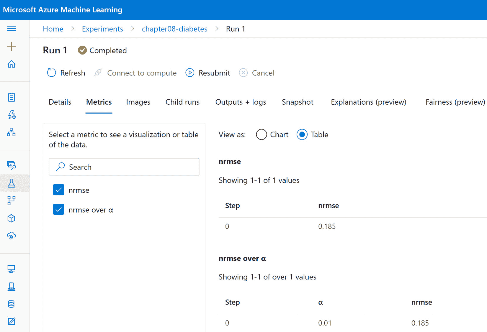

图 8.26 – 来自远程计算集群上运行脚本的记录指标

到目前为止，你已经成功地在远程计算集群的单个节点上执行了`diabetes`模型训练脚本，并且已经在 AzureML Experiment 的运行记录中记录了指标和训练后的模型。

在下一节中，你将发现不同的方式来扩展你的计算工作，并充分利用计算集群中不止一个节点。

## 在模型训练过程中利用多个计算节点

正如你在*第四章*的*配置工作区*部分看到的那样，集群可以从 0 个计算节点扩展到你需要的任意数量。你需要在模型训练阶段使用多个节点而不仅仅是一个节点的原因有几个，具体如下：

+   **不相关的模型训练实例的并行执行**：当你在团队中工作时，通常会有多个 Experiment 并行运行。每个作业可以在单个节点上运行，就像你在前一节中所做的那样。

+   **单一模型的并行训练，也称为分布式训练**：这是一个高级场景，您正在使用如**Apache** **Horovod**的分布式深度学习训练框架，该框架被 PyTorch 和 TensorFlow 所使用。分布式训练有两种类型：

    +   **数据并行性**：将训练数据分割成与计算节点数量相等的分区。每个节点对分配的数据执行一批模型训练，然后所有节点在进入下一批之前同步更新的模型参数。

    +   **模型并行性**：在不同的计算节点上训练模型的不同部分。每个节点只负责训练整个模型的一小段，并且在每次需要传播步骤时，节点之间会进行同步。

+   您在前一节中训练的`LassoLars`模型的`alpha`参数。您可能希望探索这些参数的多个值，以选择在训练数据集上表现最好的模型。这是一个称为超参数调优的过程，您将在*第九章*中了解更多关于它的内容，*优化 ML 模型*。

+   **并行训练多个模型以选择最佳备选方案**：这是您在*第五章*中已经发现的 AutoML 过程，*让机器做模型训练*。您还将在*第九章*中再次看到这种方法，*优化 ML 模型*，在*使用代码运行 AutoML 实验*部分。

在本节中，您学习了利用计算集群中多个节点的不同方法。您将在*第九章*中深入探讨最后两种方法，*优化 ML 模型*。

# 总结

在本章中，您概览了在 AzureML 工作区中创建 ML 模型的各种方式。您从一个简单的回归模型开始，该模型在 Jupyter notebook 的内核进程中进行训练。您学习了如何跟踪您训练的模型的指标。然后，您将训练过程扩展到在*第七章*中创建的`cpu-sm-cluster`计算集群中，*AzureML Python SDK*。在扩展到远程计算集群时，您了解了 AzureML 环境是什么，以及如何通过查看日志来排除远程执行的问题。

在下一章中，您将基于这些知识，使用多个计算节点执行并行的*超参数调优*过程，从而找到适合您模型的最佳参数。您还将学习如何使用 AzureML SDK 的 AutoML 功能，完全自动化模型选择、训练和调优。

# 问题

在每一章中，您会发现几个问题来检查您对讨论主题的理解：

1.  你想记录你将在脚本中使用的验证行数。你将使用`Run`类中的哪个方法？

    a. `log_table`

    b. `log_row`

    c. `log`

1.  你想运行一个使用`scikit-learn`的 Python 脚本。你将如何配置 AzureML 环境？

    a. 添加 `scikit-learn Conda 依赖项。`

    b. 添加 `sklearn Conda 依赖项。`

    使用 AzureML 的`Azure-Minimal`环境，该环境已经包含所需的依赖项。

1.  你需要使用 `MLflow` 跟踪实验中生成的指标，并将其存储在你的 AzureML 工作区中。你需要在 Conda 环境中安装哪两个 pip 包？

    a. `mlflow`

    b. `azureml-mlflow`

    c. `sklearn`

    d. `logger`

1.  你需要使用 `MLflow` 来跟踪 `training_rate` 指标的值 `0.1`。以下哪段代码可以实现此要求？假设所有类已在脚本顶部正确导入：

    a. `mlflow.log_metric('training_rate', 0.1)`

    b. `run.log('training_rate', 0.1)`

    c. `logger.log('training_rate', 0.1)`

# 深入阅读

本节提供了一些网络资源列表，帮助你扩展对 AzureML SDK 和本章中使用的各种代码片段的知识：

+   糖尿病数据集来源：[`www4.stat.ncsu.edu/~boos/var.select/diabetes.html`](https://www4.stat.ncsu.edu/~boos/var.select/diabetes.html)

+   *LassoLars* 模型文档，位于 *scikit-learn* 网站：[`scikit-learn.org/stable/modules/linear_model.html#lars-lasso`](https://scikit-learn.org/stable/modules/linear_model.html#lars-lasso)

+   *plotly*开源图形库：[`github.com/plotly/plotly.py`](https://github.com/plotly/plotly.py)

+   MLflow 跟踪 API 参考：[`mlflow.org/docs/latest/quickstart.html#using-the-tracking-api`](https://mlflow.org/docs/latest/quickstart.html#using-the-tracking-api)

+   `.amlignore` 和 `.gitignore` 文件的语法：[`git-scm.com/docs/gitignore`](https://git-scm.com/docs/gitignore)

+   **Flake8** 用于代码检查：[`flake8.pycqa.org`](https://flake8.pycqa.org)
