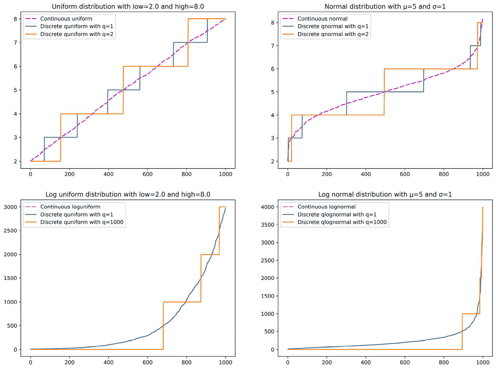
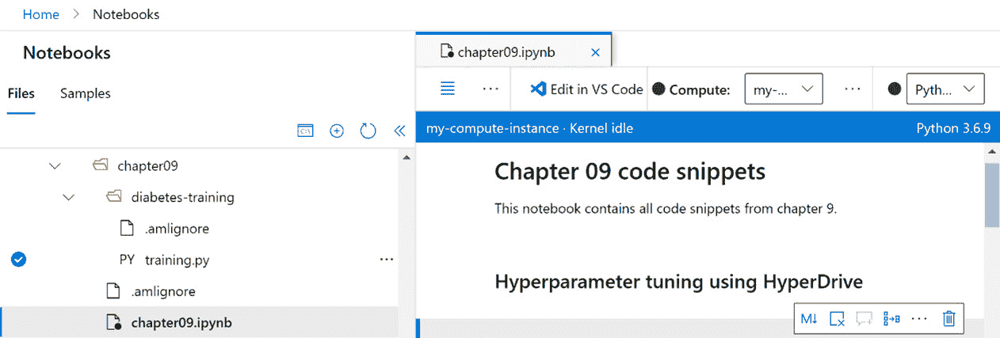
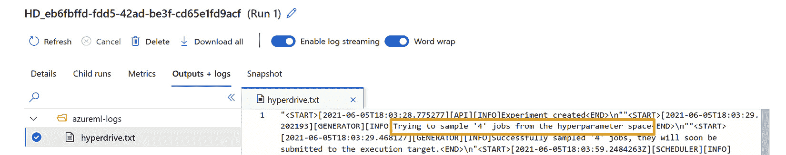
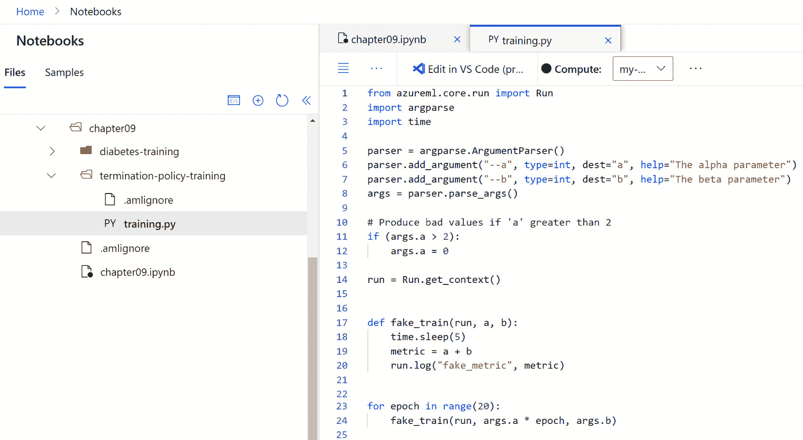
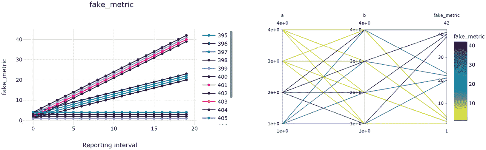
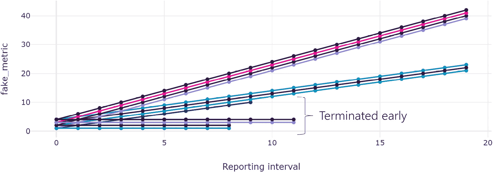
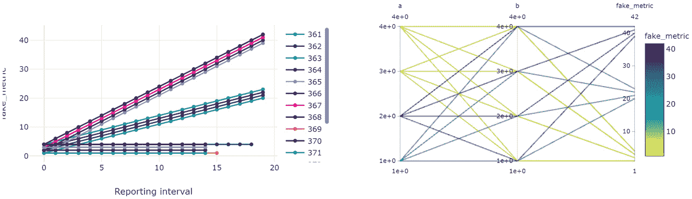
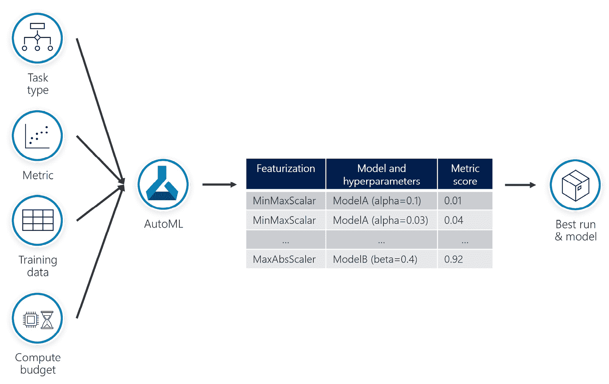
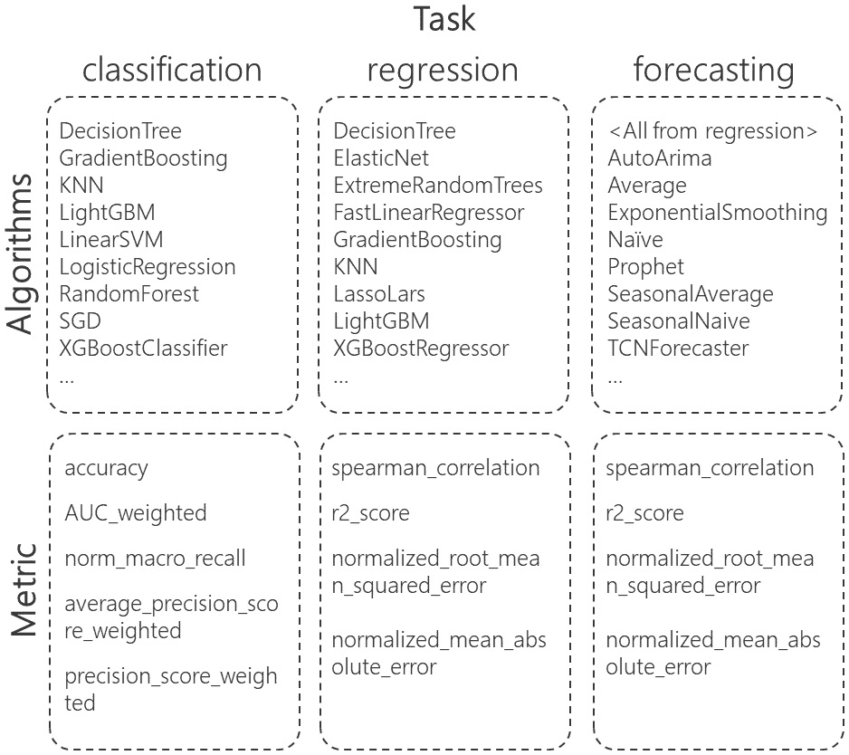

# 第九章：*第九章*：优化机器学习模型

在本章中，你将学习两种可以帮助你发现数据集最佳模型的技术。你将首先探索**HyperDrive**包，这是 AzureML SDK 的一部分。这个包允许你通过调整其暴露的参数来优化模型的性能，这个过程也被称为**超参数调优**。接下来，你将探索**自动化机器学习**（**AutoML**）包，这是 AzureML SDK 的一部分，它允许你通过代码自动化模型选择、训练和优化过程。

在本章中，我们将涵盖以下主要内容：

+   使用 HyperDrive 进行超参数调优

+   使用代码运行 AutoML 实验

# 技术要求

你需要有 Azure 订阅权限。在该订阅中，你需要有一个名为`packt-azureml-rg`的资源组。你还需要拥有`Contributor`或`Owner`权限的`packt-learning-mlw`，如*第二章*《部署 Azure 机器学习工作区资源》中所述。

你还需要对**Python**语言有基本的了解。本章中的代码片段适用于 Python 3.6 或更高版本。你还应当熟悉在 AzureML Studio 中的 Notebook 体验，这在*第八章*《使用 Python 代码实验》中有讲解。

本章假设你已经在 AzureML 工作区中注册了**scikit-learn**糖尿病数据集，并且已经创建了一个名为**cpu-sm-cluster**的计算集群，具体内容请参见*第七章*《AzureML Python SDK》中的*定义数据存储*、*处理数据集*和*处理计算目标*部分。

你可以在 GitHub 的[`bit.ly/dp100-ch09`](http://bit.ly/dp100-ch09)网址找到本章的所有笔记本和代码片段。

# 超参数调优使用 HyperDrive

在*第八章*《使用 Python 代码实验》中，你训练了一个`LassoLars`模型，该模型接受`alpha`参数。为了避免过拟合训练数据集，`LassoLars`模型使用了一种技术，`alpha`参数指定了惩罚项的重要性，这直接影响训练结果。影响训练过程的参数被称为`DecisionTreeClassifier`类，该类位于`scikit-learn`库中。你可以通过`max_depth`来定义树的最大深度，`max_depth`是一个整数。在同一个模型中，你还可以通过为`max_leaf_nodes`**超参数**指定一个数值来控制叶节点的最大数量。

这些超参数控制决策树的大小，如*图 9.1*所示：

![图 9.1 – 决策树超参数]

](img/B16777_09_001.jpg)

图 9.1 – 决策树超参数

**超参数调整**是找到产生最佳性能模型的**超参数**的最佳值的过程，用于对训练数据进行评估。要评估每个**超参数**组合的性能，必须训练模型并评估性能度量。在糖尿病模型的情况下，在*第八章*中，*使用 Python 代码进行实验*，您使用**标准化根均方误差**（**NRMSE**）度量评估模型。

AzureML SDK 提供了`HyperDriveConfig`类，允许您执行`HyperDriveConfig`是您在*第八章*中使用的`ScriptRunConfig`类的包装器，*使用 Python 代码进行实验*。这意味着您需要在`run_config`参数中传递您要用于训练模型的`ScriptRunConfig`。您还需要指定代码正在记录的度量标准以及该度量标准的目标。在糖尿病案例中，您试图最小化在*第八章*中看到的`submit`方法，*使用 Python 代码进行实验*。显示端到端过程的伪代码，其中`script`变量是定义要使用的训练脚本的`ScriptRunConfig`对象，如下所示：

```py
hd_config = HyperDriveConfig(
             run_config=script,
             primary_metric_name="nrmse",
             primary_metric_goal=PrimaryMetricGoal.MINIMIZE
             ,…)
experiment = Experiment(ws, "chapter09-hyperdrive")
hyperdrive_run = experiment.submit(hd_config)
```

除了`ScriptRunConfig`，您还需要传递`HyperDriveConfig`将使用。**超参数**可以接受离散或连续值：

+   典型的离散值示例是整数或字符串值。例如，在`activation`中，`selu`用于`relu`的**修正线性单元**（**ReLU**）。

+   典型的连续值示例是浮点数值。您一直在训练的`LassoLars`模型中的`alpha`参数是接受浮点值的**超参数**。

当您探索可能的`azureml.train.hyperdrive.parameter_expressions`模块时。

在离散`choice`函数的情况下，您可以使用以下脚本指定`activation` **超参数**的选项列表，这是您之前看到的典型示例：

```py
choice('selu','relu')
```

此脚本将尝试使用`selu`和`relu`激活函数来寻找最佳模型。

重要提示

如果您对神经网络工作感兴趣，可能需要更好地理解这些激活函数。有一些很棒的书籍可以帮助您开始神经网络设计。对于 DP-100 考试，您不需要这些知识。

注意，即使在连续的`alpha` `LassoLars`模型的情况下，您仍然可以使用`choice`方法来定义要探索的离散值。例如，以下`choice`的使用等同于您在*第八章*中*跟踪模型演变*部分所做的：

```py
choice(0.001, 0.01, 0.1, 0.25, 0.5)
```

您还可以定义在探索搜索空间时将获得的样本的概率分布。例如，如果您想为所有值提供相等的机会，您将使用均匀分布。另一方面，您可以使用正态分布将搜索区域集中在搜索空间的中心。AzureML SDK 提供了一些方法，您可以使用它们，如`uniform(low, high)`、`loguniform(low, high)`、`normal(μ, σ)`和`lognormal(μ, σ)`。对于离散值，您可以使用以`q`为前缀的等效方法，如`quniform(low, high, q)`、`qloguniform(low, high, q)`、`qnormal(μ, σ, q)`和`qlognormal(μ, σ, q)`，其中`q`参数是量化因子，用于将连续值转换为离散值。

在本书的 GitHub 页面上，您可以找到用于绘制生成 1,000 个样本并使用这些函数分布的代码。结果可以在*图 9.2*中看到：



](img/B16777_09_002.jpg)

图 9.2 – 高级离散和连续超参数值分布。样本值已排序。x 轴显示排序值的索引号

重要提示

在*图 9.2*中，在`loguniform`和`lognormal`的图表中，量化因子为 1 的离散函数的线与连续函数的线重合。因此，您只能看到两条线。

定义了搜索空间之后，您需要指定将用于选择每个`azureml.train.hyperdrive`模块的采样策略：

+   您在上面看到的`choice`方法。Azure ML SDK 将搜索这些离散值的所有可能**超参数**组合。假设您希望探索以下四种参数组合：

    +   a=0.01，b=10

    +   a=0.01，b=100

    +   a=0.5，b=10

    +   a=0.5，b=100

    以下代码片段定义了这四种组合的搜索空间：

    ```py
    from azureml.train.hyperdrive import GridParameterSampling
    from azureml.train.hyperdrive import choice
    param_sampling = GridParameterSampling( {
            "a": choice(0.01, 0.5),
            "b": choice(10, 100)
        }
    )
    ```

+   `RandomParameterSampling`类。它允许您从可用选项中随机选择**超参数**值。它支持离散和连续的**超参数**。

+   `max_total_runs`您将会在后面了解。它支持离散和连续的**超参数**。

让我们把到目前为止学到的所有知识付诸实践：

1.  转到 AzureML Studio 网页界面的**作者**|**笔记本**部分。

1.  创建一个名为`chapter09`的文件夹。

1.  您需要在`training.py`脚本中创建一个名为`diabetes-training`的文件夹。该脚本与*第八章*中《使用 Python 代码实验》一节中*将代码移至 Python 脚本文件*部分使用的脚本相同。您可以从那里复制内容。最终的**文件**结构图见*图 9.3*。

1.  在 **chapter09** 文件夹中创建一个名为 **chapter09.ipynb** 的笔记本。*图 9.3* 显示了最终 **文件** 树的结构：

    图 9.3 – 包含代码和 chapter09 笔记本的文件树结构

1.  在第一个单元格中添加以下初始化代码：

    ```py
    from azureml.core import (
        Workspace, Environment
    )
    from azureml.core.conda_dependencies import \
         CondaDependencies 
    import sklearn
    ws = Workspace.from_config()
    diabetes_env = Environment(name=»diabetes-training-env»)
    diabetes_env.python.conda_dependencies = \
         CondaDependencies.create(
          conda_packages=[
              f"scikit-learn=={sklearn.__version__}"],
          pip_packages=["azureml-defaults",
                        "azureml-dataprep[pandas]"])
    target = ws.compute_targets['cpu-sm-cluster'] 
    ```

    这段代码与你在《第八章》 *使用 Python 代码进行实验* 部分中使用的代码类似。唯一的区别是你使用了 `create` 方法，而不是逐个添加包。

1.  在新单元格中，定义将执行 `training.py` 脚本的 `ScriptRunConfig` 对象：

    ```py
    from azureml.core import ScriptRunConfig
    script = ScriptRunConfig(
        source_directory='diabetes-training',
        script='training.py',
        environment=diabetes_env,
        compute_target=target
    )
    ```

    这个 `ScriptRunConfig` 对象与你在《第八章》 *使用 Python 代码进行实验* 部分中创建的几乎相同。唯一的区别是你没有传递 `arguments` 参数，特别是你没有指定 `--alpha` 参数。这个参数将由你在下一步配置的 `HyperDriveConfig` 对象自动附加。

1.  在一个新单元格中添加并执行以下代码：

    ```py
    from azureml.train.hyperdrive import HyperDriveConfig
    from azureml.train.hyperdrive import (
       RandomParameterSampling, uniform, PrimaryMetricGoal
    )
    param_sampling = RandomParameterSampling({
            'alpha': uniform(0.00001, 0.1),
        }
    )
    hd_config = HyperDriveConfig(
                   run_config=script,                          
                   hyperparameter_sampling=param_sampling,
                   primary_metric_name="nrmse", 
                   primary_metric_goal=                   
                              PrimaryMetricGoal.MINIMIZE,
                   max_total_runs=20,
                   max_concurrent_runs=4)
    ```

    在这段代码中，你定义了一个 `RandomParameterSampling` 方法，用来探索均匀分布的值，范围从 0.00001 到 0.1，用于传递给你在 *第 3 步* 中创建的训练脚本的 `alpha` 参数。这个训练脚本接受 `--alpha` 参数，随后该参数传递给 `alpha` `LassoLars` 模型。

    将此 `RandomParameterSampling` 配置分配给 `HyperDriveConfig` 的 `hyperparameter_sampling` 参数。

    你还已配置 `HyperDriveConfig` 的 `run_config` 属性，以使用你在*第 6 步*中定义的 `ScriptRunConfig` 对象。注意，`RandomParameterSampling` 类将传递脚本所需的 `alpha` 参数。

    然后，定义使用 `primary_metric_name` 参数评估生成的模型。你还指定了要最小化该值（`primary_metric_goal` 参数），因为它是你希望最小化的误差。

    最后的两个参数，`max_total_runs` 和 `max_concurrent_runs`，控制你愿意投入到寻找最佳模型的资源。`max_total_runs` 参数控制实验的最大运行次数，可以在 1 到 1,000 次之间。这是一个必填参数。`max_concurrent_runs` 是一个可选参数，控制并发运行的最大次数。在这种情况下，你定义了 *4*，这意味着在 `ScriptRunConfig` 中将仅配置四个节点。这意味着集群仍然会有一个未配置的节点，因为它能扩展到的最大节点数是五个，正如你在*第七章* *与计算目标的工作*部分中定义的那样，*AzureML Python SDK*。还有一个可选参数可以用来限制搜索最佳模型的时间，`max_duration_minutes` 参数，你在上面的示例中没有指定，它定义了执行 **超参数调优** 过程的最大时长（分钟）。超过该时长后，所有后续调度的运行将自动取消。

1.  在一个新单元格中，添加以下代码：

    ```py
    from azureml.core import Experiment
    experiment = Experiment(ws, "chapter09-hyperdrive")
    hyperdrive_run = experiment.submit(hd_config)
    hyperdrive_run.wait_for_completion(show_output=True)
    ```

    在此代码中，你提交 `HyperDriveConfig` 以在 `hyperdrive_run` 变量下执行，该变量是 `HyperDriveRun` 的实例，继承自正常的 `Run` 类。

1.  你可以在 Studio Web UI 中查看该过程的结果。导航到 `alpha` 超参数。你可以通过视觉化探索 `alpha` 参数的不同值对 `HyperDriveRun` (**Run 1**) 的 `alpha` 值的影响。

    重要提示

    在你的执行中，运行编号可能不同。每次你执行单元格时，都会创建一个新的运行编号，接着上一个编号。因此，如果你执行一个包含 20 个子运行的超参数调优运行，那么最后一个子运行将是第 21 号运行。下次执行相同代码时，超参数调优运行将从第 22 号开始，最后一个子运行将是第 42 号。此节中提到的运行编号是各个图示中显示的编号，观察到差异是正常的，尤其是在你需要重新运行某些单元格时。

1.  导航到已完成的 **Run 1** 运行的 **输出 + 日志** 标签。你会注意到，在 **azureml-logs** 文件夹下有一个名为 **hyperdrive.txt** 的文件，如 *图 9.5* 所示：

    图 9.5 – HyperDriveRun 中的日志文件，选取将并行执行的超参数空间中的前四个作业

    该文件包含所有为完成超参数调优过程而计划的作业。实际的运行日志和存储的模型都保存在子运行中。如果你需要调试代码问题，你需要打开其中一个子运行查看脚本错误。

1.  你还可以获取最佳模型的运行情况，并且相应的 `get_best_run_by_primary_metric` 方法可以检索 `hyperdrive_run` 变量所引用的 `HyperDriveRun` 的最佳运行结果。从那里，你可以读取 `Run` 对象的 `get_metrics` 方法，进而使用 `get_details` 方法获取执行详情。在这些详情中，有一个 `runDefinition` 对象，它包含一个 `arguments` 列表，如 *图 9.6* 所示：

![图 9.6 – 揭开最佳运行.get_details()['runDefinition']['arguments'] 代码的神秘面纱

](img/B16777_09_006.jpg)

图 9.6 – 揭开最佳运行.get_details()['runDefinition']['arguments'] 代码的神秘面纱

在这一节中，你看到了如何运行 **超参数调优** 过程来找到模型 **超参数** 的最佳值。在下一节中，你将看到如何通过使用提前终止策略来优化寻找最佳值的时间。

## 使用提前终止策略

`HyperDriveConfig` 构造函数的参数之一是 `policy`。该参数接受一个 `EarlyTerminationPolicy` 对象，定义了可以提前终止运行的策略。默认情况下，这个参数的值为 `None`，意味着会使用 `NoTerminationPolicy` 类，允许每次运行执行直到完成。

要能够使用提前终止策略，你的脚本必须在每次运行中执行多个迭代。

在 **Files** 视图中，添加一个名为 **termination-policy-training** 的文件夹，并在其中添加一个 **training.py** 文件，如 *图 9.7* 所示：



图 9.7 – 添加一个执行多个纪元的训练脚本

在训练脚本中添加以下代码：

```py
from azureml.core.run import Run
import argparse
import time
parser = argparse.ArgumentParser()
parser.add_argument("--a", type=int, dest="a", help="The alpha parameter")
parser.add_argument("--b", type=int, dest="b", help="The beta parameter")
args = parser.parse_args()
if (args.a > 2):
    args.a = 0
run = Run.get_context()
def fake_train(run, a, b):
    time.sleep(5)
    metric = a + b
    run.log("fake_metric", metric)
for epoch in range(20):
    fake_train(run, args.a * epoch, args.b)
```

该脚本获取两个参数，`a` 和 `b`，然后调用 `fake_train` 方法 20 次。在数据科学文献中，人们将这 20 次称为 20 个 **纪元**，它们是整个训练数据集上的训练周期。

在每个纪元中，`a` 参数会乘以迭代次数，该次数是从 *0* 一直到 *19* 的整数值，然后调用 `fake_train` 方法。`fake_train` 方法会暂停 5 秒钟以模拟训练过程，然后将修改后的 `a` 值加到 `b` 参数上。结果会记录在 `fake_metric` 指标中。

此外，在 *第 8 行*，代码检查传递给脚本的 `a` 参数。如果它大于 *2*，它会变为 *0*。这意味着你正在训练的虚拟模型在 `a` 值增加到 *2* 时表现更好，然后它的性能会下降，如 *图 9.8* 所示。

请注意，你不需要读取任何数据集，因此不需要引用`Workspace`。这就是为什么上面代码中的*第 10 行*不需要检查它是否是`_OfflineRun`对象，就像你在*第八章*中的*将代码移到 Python 脚本文件*部分所做的那样，*使用 Python 代码进行实验*。

如果你运行`HyperDriveConfig`，并在所有从*1*到*4*之间的值上进行网格搜索，观察`fake_metric`在每个时期的演化。在图的右侧，你可以看到`fake_metric`是如何受到不同`a`和`b`值的影响的，`a`表现得比使用`a`参数*3*和*4*训练的模型更好，关于`fake_metric`：



](img/B16777_09_008.jpg)

图 9.8 – 没有早期终止策略的超参数调优

理想情况下，你希望减少等待所有运行完成的时间。`EarlyTerminationPolicy` 允许你监控正在运行的任务，如果它们的表现比其他任务差，则提前取消它们。最终的输出将像*图 9.9*中所示，你可以看到有些任务在到达第二十个报告的间隔之前就被终止了（图表从 0 开始计数），节省了时间和计算资源：



](img/B16777_09_009.jpg)

图 9.9 – 使用激进的早期终止策略进行超参数调优

AzureML SDK 提供了一些内置的`EarlyTerminationPolicy`实现，位于`azureml.train.hyperdrive`模块中：

+   `NoTerminationPolicy`：这是默认的停止策略，允许所有运行完成。

+   `MedianStoppingPolicy`：中位数停止策略计算所有运行的运行平均值。然后，它会取消那些最佳表现差于运行平均值中位数的运行。你可以将此策略看作是将每次运行的表现与前面运行的平均表现进行比较。这个策略的优点在于它考虑了到目前为止所有的运行，而不仅仅是将当前的运行与迄今为止最好的运行进行比较。这一特点使得中位数停止策略能够避免陷入局部最优值。

+   `BanditPolicy`：Bandit 策略计算当前运行和表现最佳的运行之间的距离，然后根据某些容差标准终止当前运行。你可以定义绝对距离（`slack_amount`参数）或与表现最佳的运行的最大允许比率（`slack_factor`参数）。

+   `TruncationSelectionPolicy`：截断选择策略是最激进的策略，它取消某个百分比（由 `truncation_percentage` 参数定义）的运行，这些运行在主要指标上的表现排在最后。当对一个相对较新的运行进行排名时，在早期的迭代中，该策略会将其与较老运行在同一迭代的表现进行比较。因此，这个策略力图通过考虑随着训练时间推移模型表现的提升来实现排名的公平性。

所有策略都接受两个可选参数：

+   `evaluation_interval`：应用策略的频率。

+   `delay_evaluation`：这将延迟第一次策略评估，直到指定的间隔次数，给予年轻运行足够的时间以达到成熟状态。

让我们使用最推荐的策略 `MedianStoppingPolicy`，对你上面创建的脚本进行超参数调整：

1.  转到将在超参数调整过程中使用的 `ScriptRunConfig` 对象。

1.  在一个新单元格中，添加以下代码：

    ```py
    from azureml.train.hyperdrive import (
        GridParameterSampling,    
        choice,
        MedianStoppingPolicy,
        HyperDriveConfig,
        PrimaryMetricGoal
    )
    param_sampling = GridParameterSampling(
        {
            "a": choice(1, 2, 3, 4),
            "b": choice(1, 2, 3, 4),
        }
    )
    early_termination_policy = MedianStoppingPolicy(
        evaluation_interval=1, delay_evaluation=5
    )
    hd_config = HyperDriveConfig(
        policy=early_termination_policy,
        run_config=script,
        hyperparameter_sampling=param_sampling,
        primary_metric_name="fake_metric",
        primary_metric_goal=PrimaryMetricGoal.MAXIMIZE,
        max_total_runs=50,
        max_concurrent_runs=4
    )
    ```

    这个 `HyperDriveConfig` 对象使用 `MedianStoppingPolicy` 作为其策略参数，在第一次 *5* 次迭代后评估所有运行，并在每次迭代中将它们的结果与当前的运行平均值的中位数进行比较。

1.  在一个新单元格中，添加以下代码以开始执行你在 *步骤 2* 中定义的 `HyperDriveConfig` 对象：

    ```py
    experiment = Experiment(ws, "chapter09-hyperdrive")
    hyperdrive_run = experiment.submit(hd_config)
    hyperdrive_run.wait_for_completion(show_output=True)
    ```

    *图 9.10* 显示了此 `HyperDriveRun` 运行的结果，其中 16 个作业中只有 8 个提前终止：



图 9.10 – 使用中位数停止早期终止策略的超参数调整

重要提示

在上面的代码中，`max_total_runs` 参数的值为 50。这是潜在的子运行次数的上限。在这个示例中，你只有 16 种组合。这意味着实验将只运行 16 次，然后停止，因为整个搜索区域已经被搜索完毕。如果你希望 `max_total_runs` 参数生效，应指定一个小于 16 的值。

到目前为止，你已经看到了如何针对你拥有的数据优化特定的模型。在下一部分，你将看到如何通过 SDK 搜索最佳模型来运行 AutoML 实验，类似于你在*第五章*中所做的，*让机器进行模型训练*，通过 Studio 用户界面进行的操作。

# 使用代码运行 AutoML 实验

到目前为止，在本章中，你一直在微调一个 `LassoLars` 模型，执行超参数调整过程，以根据训练数据识别 `alpha` 参数的最佳值。在这一部分，你将使用 **AutoML** 和 AzureML SDK，自动选择最佳的数据预处理、模型和超参数设置，来匹配你的训练数据集。

要配置一个 `AutoMLConfig` 对象，你需要定义 **任务类型**、**指标**、**训练数据** 和 **计算预算**。该过程的输出是一个模型列表，你可以从中选择最佳的运行和与该运行相关的最佳模型，如*图 9.11*所示：



图 9.11 – AutoML 过程

根据你要建模的问题类型，你必须选择 `task` 参数，选择 `classification`、`regression` 或 `forecasting`，如*图 9.12*所示：



图 9.12 – AutoML 任务类型、算法和支持的指标

*图 9.12* 显示了 AzureML SDK 支持的部分算法。`azureml.train.automl.constants.SupportedModels` 包含 `classification`、`regression` 和 `forecasting` 类，这些类列出了所有作为属性的支持算法。由于预测只是回归的一个更专门化的版本，因此回归的所有算法都可以使用。AutoML 支持一些额外的、更专门的预测算法，例如非常流行的 **ARIMA** 技术或 Facebook 的 **Prophet** 算法。

`primary_metric` 参数决定了模型训练过程中用于优化的指标。回归和预测的指标相同。分类算法使用不同的指标，如*图 9.12*所示。

训练数据可以通过 `training_data` 参数提供，可以是 pandas `Dataset` 对象的格式。训练数据是表格格式，并包括 `target` 列。你定义你希望预测的列名，传递 `label_column_name` 参数。默认情况下，AutoML 会使用该数据集进行训练和验证。如果数据集超过 20,000 行，则会进行数据集拆分，保留 10% 用于验证。如果数据集小于 20,000 行，则使用交叉验证。如果你想指定从 `training_data` 创建多少个折叠，你可以使用 `n_cross_validations` 参数。另一种方法是提供 `validation_size` 参数，指定从训练数据中保留并用作验证的百分比（值为 *0.0* 到 *1.0*）。如果你想手动将数据分割为训练数据和验证数据，你可以将验证数据分配给 `validation_data` 参数，如本节后面所述。

**计算预算** 是你愿意为找到最佳机器学习模型而投入的金钱。它由三部分组成：

+   **计算集群的节点类型**：计算集群的类型具有的能力越多，运行 AutoML 作业时每秒的成本就越高。这是你在创建计算集群时配置的设置，除非你创建一个新集群，否则在此时无法更改。

+   `max_concurrent_iterations`参数允许使用最多计算集群中的节点数。这将允许你运行并行迭代，但会增加成本。默认情况下，这个参数是*1*，意味着一次只允许进行一个迭代。

+   `experiment_timeout_hours`参数，或者你可以定义`experiment_exit_score`参数，定义达到某个分数后停止进一步探索。限制计算支出的另一种方法是限制要探索的不同算法和参数组合的数量。默认情况下，AutoML 会探索 1,000 种组合，你可以通过指定`iterations`参数来限制这个数量。

现在你已经探索了所有需要在`AutoMLConfig`对象中配置的选项，导航到你的`chapter09.ipynb`笔记本，添加一个新的单元格，并输入以下代码：

```py
from azureml.core import Workspace, Dataset
from azureml.train.automl import AutoMLConfig
ws = Workspace.from_config()
compute_target = ws.compute_targets["cpu-sm-cluster"]
diabetes_dataset = Dataset.get_by_name(workspace=ws, name='diabetes')
train_ds,validate_ds = diabetes_dataset.random_split(percentage=0.8, seed=1337)
experiment_config = AutoMLConfig(
    task = "regression",
    primary_metric = 'normalized_root_mean_squared_error',
    training_data = train_ds,
    label_column_name = "target",
    validation_data = validate_ds,
    compute_target = compute_target,
    experiment_timeout_hours = 0.25,
    iterations = 4
)
```

在这段代码中，你获取了工作空间、计算集群的引用以及`diabetes`数据集，你将其分为训练集和验证集。然后你创建了一个`AutoMLConfig`对象，用于处理`target`列。你还指定了`validation_data`参数。

重要提示

如果不想分割数据集，你可以将整个数据集传递给`training_data`参数，并跳过`validation_data`参数。由于数据集仅包含 442 行，AutoML 会将训练数据集分为 10 个折叠，用于执行交叉验证技术。

然后，你定义了用于此训练的`compute_target`实验，并通过允许实验运行一个小时四分之一（`experiment_timeout_hours`参数），即 15 分钟，并仅探索 4 种模型和参数组合（`iterations`参数），来确定你的计算预算。在你的案例中，`iterations`参数可能会是终止**AutoML**实验的原因。

重要提示

对于预测，你需要指定`forecasting_parameters`，除了你之前定义的回归参数外。`ForecastingParameters`类包含以下常用参数：

1) `time_column_name`：表示时间序列时间维度的列。

2) `max_horizon`：所需的预测时间范围，以时间序列的频率为单位。默认值为*1*，这意味着你的模型将能够预测未来的一个时间点。这个时间点是你的数据集所使用的频率。如果你的数据集每小时有 1 行，并且你想预测 7 天的时间范围，则`max_horizon`需要设置为 7 天×24 个时间点/天=168。

到目前为止，您已经创建了`experiment_config`，它包含了您即将执行的**AutoML**实验的配置。添加一个新单元格，并输入以下代码来启动 AutoML 训练过程：

```py
from azureml.core.experiment import Experiment
my_experiment = Experiment(ws, 'chapter09-automl-experiment')
run = my_experiment.submit(experiment_config, 
                           show_output=True)
```

`run`变量包含对通过`submit`方法创建的`AutoMLRun`对象的引用。几分钟后，过程将完成。要获取当前最佳的运行和最佳模型，您可以使用`get_output()`方法，如以下代码片段所示：

```py
best_run, best_model = run.get_output()
```

或者，您也可以直接通过相应的`Tuple`索引访问最佳运行和最佳模型，如以下代码片段所示：

```py
best_run = run.get_output()[0]
best_model = run.get_output()[1]
```

在每个自动化机器学习实验中，您的数据会自动进行缩放或归一化，以帮助算法表现得更好。这一数据转换将成为训练模型的一部分。这意味着您的数据首先通过数据转换器，然后模型将使用新的特征名称进行训练，这些特征名称对您不可见。您将在*第十章*《理解模型结果》中看到`sklearn.composeColumnTransformer`的示例。要查看嵌入在 AutoML 模型中的实际步骤，您可以使用生成的模型的`steps`属性：

```py
best_model.steps
```

第一步名为`datatransformer`，包含了用于我们的`diabetes`数据集的插补器。无论是回归任务还是分类任务，这一步骤都被命名为`datatransformer`。对于预测任务，这一步骤命名为`timeseriestransformer`，并包含了额外的基于日期的转换。要获取转换列表和工程特征的名称，您可以使用以下代码片段：

```py
print(best_model.named_steps['datatransformer'] \
                 .get_featurization_summary())
feature_names=best_model.named_steps['datatransformer'] \
                 .get_engineered_feature_names()
print("Engineered feature names:")
print(feature_names)
```

在本节中，您通过**AutoML**寻找了针对糖尿病回归问题的最佳模型。这也总结了您可以根据特定数据集优化机器学习模型的最常用方法。

# 总结

在本章中，您探讨了优化特定模型以在数据集上表现良好的最常用方法，以及如何自动化模型选择过程。您首先通过执行并行化的`HyperDriveConfig`类来优化`LassoLars`模型的`alpha`参数，您正在该参数下训练`diabetes`数据集。接着，您自动化了模型选择，使用 AutoML 来检测最佳的算法和参数组合，从而预测`diabetes`数据集的`target`列。

在下一章中，您将以此为基础，学习如何使用 AzureML SDK 来解释模型结果。

# 问题

1.  您想通过`model = run.get_output()[0]`获取最佳模型。

    b. `model = run.get_output()[1]`

    c. `model = run.get_outputs()[0]`

    d. `model = run.get_outputs()[1]`

1.  您想运行一个预测的`ForecastingParameters`类吗？

    a. *forecast_horizon = 5 * 1*

    b. *forecast_horizon = 5 * 24*

    c. *forecast_horizon = 5 * 12*

# 进一步阅读

本节提供了一些有用的网络资源列表，帮助您增加对 AzureML SDK 和本章中使用的各种代码片段的了解：

+   `HyperDriveConfig` 类：[`docs.microsoft.com/zh-cn/python/api/azureml-train-core/azureml.train.hyperdrive.hyperdriveconfig?view=azure-ml-py`](https://docs.microsoft.com/zh-cn/python/api/azureml-train-core/azureml.train.hyperdrive.hyperdriveconfig?view=azure-ml-py)

+   `AutoMLConfig` 类：[`docs.microsoft.com/zh-cn/Python/api/azureml-train-automl-client/azureml.train.automl.automlconfig.automlconfig`](https://docs.microsoft.com/zh-cn/Python/api/azureml-train-automl-client/azureml.train.automl.automlconfig.automlconfig)

+   自动化机器学习中的数据特征化：[`docs.microsoft.com/zh-cn/azure/machine-learning/how-to-configure-auto-features`](https://docs.microsoft.com/zh-cn/azure/machine-learning/how-to-configure-auto-features)

+   自动训练预测模型：[`docs.microsoft.com/zh-cn/azure/machine-learning/how-to-auto-train-forecast`](https://docs.microsoft.com/zh-cn/azure/machine-learning/how-to-auto-train-forecast)

+   从 scikit-learn 库加载的糖尿病数据集参考：[`scikit-learn.org/stable/modules/generated/sklearn.datasets.load_diabetes.html`](https://scikit-learn.org/stable/modules/generated/sklearn.datasets.load_diabetes.html)
