# 第十章：*第十章*：理解模型结果

在本章中，你将学习如何分析机器学习模型的结果，以理解模型为何做出该推断。理解模型为何预测某个值是避免黑箱模型部署的关键，并且能够理解模型可能存在的局限性。在本章中，你将学习 Azure 机器学习的可用解释功能，并可视化模型解释结果。你还将学习如何分析潜在的模型错误，检测模型表现不佳的群体。最后，你将探索一些工具，帮助你评估模型的公平性，并让你能够缓解潜在问题。

本章将涵盖以下主题：

+   创建负责任的机器学习模型

+   解释模型的预测

+   分析模型错误

+   检测潜在的模型公平性问题

# 技术要求

你需要拥有一个 Azure 订阅。在该订阅中，你需要有一个名为`packt-azureml-rg`的资源组。你还需要有`Contributor`或`Owner`权限的`packt-learning-mlw`。如果你按照*第二章* *部署 Azure 机器学习工作区资源*中的指引操作，这些资源应该可以获得。

你还需要对**Python**语言有基本了解。本章中的代码片段针对 Python 3.6 或更高版本。你还应该熟悉在 Azure 机器学习工作室中的 Notebook 体验，这部分内容已在之前的章节中介绍。

本章假设你已经创建了一个名为`cpu-sm-cluster`的计算集群，如*第七章* *使用 AzureML Python SDK*中“与计算目标协作”部分所述。

你可以在本书的仓库中找到本章的所有 Notebook 和代码片段，链接为[`bit.ly/dp100-ch10`](http://bit.ly/dp100-ch10)。

# 创建负责任的机器学习模型

机器学习使你能够创建可以影响决策并塑造未来的模型。拥有强大的能力意味着肩负巨大的责任，这也是 AI 治理成为必需的原因，通常被称为负责任的 AI 原则与实践。Azure 机器学习提供了支持负责任 AI 创建的工具，具体体现在以下三个支柱上：

+   **理解**：在发布任何机器学习模型之前，你需要能够解释和说明模型的行为。此外，你还需要评估并缓解针对特定群体的潜在模型不公平性。本章重点介绍那些帮助你理解模型的工具。

+   **保护**：在这里，你部署了保护个人及其数据的机制。在训练模型时，使用的是来自真实人的数据。例如，在*第八章*《实验 Python 代码》中，你在糖尿病患者的医疗数据上训练了一个模型。尽管具体的训练数据集没有包含任何**个人可识别信息**（**PII**），原始数据集却包含了这些敏感信息。有一些开源库，如**SmartNoise**，提供了基本的构建模块，能够利用经过验证和成熟的差分隐私研究技术来实现数据处理机制。

    例如，使用 SmartNoise 构建的查询引擎可以让数据科学家在敏感数据上执行聚合查询，并在结果中添加统计*噪声*，以防止意外识别数据集中某一行的单个数据。其他开源库，如**presidio**，提供了一种不同的数据保护方法，允许你快速识别并匿名化私密信息，如信用卡号、姓名、地点、财务数据等。这些库更多地关注原始文本输入，这是你在构建**自然语言处理**（**NLP**）模型时通常使用的输入。它们提供了可以用来匿名化数据的模块，便于在训练模型之前处理数据。另一种保护个人及其数据的方法是加密数据，并使用加密数据集进行整个模型训练过程，而无需解密。这可以通过**同态加密**（**HE**）实现，这是一种加密技术，允许在加密数据上执行某些数学操作，而无需访问私有（解密）密钥。计算结果是加密的，只有私钥的持有者才能揭示。这意味着，使用**HE**，你可以将两个加密值**A**和**B**相加，得到一个值**C**，这个值只能通过加密值**A**和**B**的私钥解密，如下图所示：

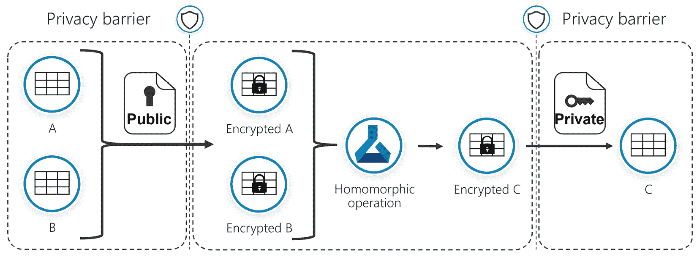

图 10.1 – 使用 HE 在加密数据上执行操作

+   **控制**：控制和记录端到端过程是所有软件工程活动中的一个基本原则。DevOps 实践通常用于确保端到端过程的自动化和治理。DevOps 中的一个关键实践是记录每个步骤中的关键信息，让你在每个阶段做出负责任的决策。Azure 机器学习工作区允许你为你在端到端机器学习过程中的各种工件添加标签和描述。下图展示了你如何为在 *第九章* 中执行的 **AutoML** 运行添加描述，*优化机器学习模型*：

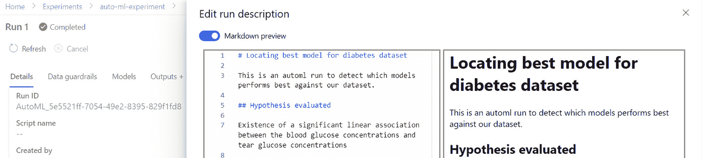

图 10.2 – 为运行添加描述以进行文档记录

类似于为运行添加描述，你可以为你生产的各种工件（如模型）添加标签。标签是键/值对，例如 `PyTorch` 是 `Framework` 标签键的值。你可能希望将以下信息作为模型 **数据表** 的一部分进行记录：

+   模型的预期用途

+   模型架构，包括使用的框架

+   使用的训练和评估数据

+   训练模型性能指标

+   公平性信息，你将在本章中阅读到

这些信息可以作为标签的一部分，而 **数据表** 可以是一个通过这些标签自动生成的 Markdown 文档。

本节中，你对帮助创建负责任 AI 的工具和技术进行了概述。所有三个支柱同等重要，但对于 DP100 考试，你将专注于理解类别中的工具，从模型可解释性开始，你将在下一节中深入了解。

# 解释模型的预测结果

能够解释模型的预测结果有助于数据科学家、审计员和商业领袖通过查看驱动模型预测的主要因素来理解模型行为。它还使他们能够进行假设分析，以验证特征对预测的影响。Azure 机器学习工作区与 **InterpretML** 集成，提供这些功能。

InterpretML 是一个开源社区，提供用于执行模型可解释性的工具。社区包含几个项目，其中最著名的如下：

+   **Interpret** 和 **Interpret-Community** 仓库，专注于解释使用表格数据的模型，例如你在本书中所使用的糖尿病数据集。你将在本节中使用 interpret-community 仓库。

+   **interpret-text** 扩展了解释工作到文本分类模型。

+   **多样化反事实解释**（**DiCE**）用于机器学习，可以帮助你检测在数据行中需要进行的最少修改，以改变模型的输出。例如，假设你有一个贷款审批模型，它刚刚拒绝了一笔贷款申请。客户问有什么可以做的来让贷款获得批准。**DiCE**可以提供批准贷款的最少修改，例如减少信用卡数量或将年薪提高 1%。

解释机器学习模型时有两种方法：

+   `DecisionTreeClassifier` 提供了 `feature_importances_` 属性，允许你理解特征如何影响模型的预测。**InterpretML** 社区提供了几种更先进的**玻璃盒**模型实现。这些模型一旦训练完成，允许你获取解释器并查看哪些特征驱动了什么结果，这也被称为**可解释性结果**。这些模型的解释器是无损的，意味着它们准确地解释了每个特征的重要性。

+   **黑盒解释**：如果你训练的模型没有内置的解释器，你可以创建一个黑盒解释器来解释模型的结果。你需要提供训练好的模型和一个测试数据集，解释器会观察特征值的变化如何影响模型的预测。例如，在贷款审批模型中，这可能会调整一个被拒绝记录的年龄和收入，观察这些变化是否会改变预测结果。通过这些实验获取的信息可以用来生成特征重要性的解释。这项技术可以应用于任何机器学习模型，因此被认为是与模型无关的。由于它们的性质，这些解释器是有损的，意味着它们可能无法准确表示每个特征的重要性。在科学文献中，有一些著名的黑盒技术，例如**Shapley 加法解释**（**SHAP**）、**局部可解释模型无关解释**（**LIME**）、**部分依赖**（**PD**）、**置换特征重要性**（**PFI**）、**特征交互**和**莫里斯敏感性分析**。黑盒解释器的一个子类别是**灰盒解释器**，它利用模型结构的相关信息来获得更好、更快的解释。例如，有专门针对树模型（**树解释器**）、线性模型（**线性解释器**）甚至深度神经网络（**深度解释器**）的解释器。

模型解释器可以提供两种类型的解释：

+   **局部**或**实例级特征重要性**侧重于特征对特定预测的贡献。例如，它可以帮助回答为什么模型拒绝了某个特定客户的贷款申请。并非所有技术都支持局部解释。例如，基于**PFI**的方法不支持实例级特征重要性。

+   **全局** 或 **聚合级特征重要性** 解释了模型整体的表现，考虑到模型所做的所有预测。例如，它可以回答哪个特征对于贷款批准来说最为重要。

现在，你已经了解了模型解释的基本理论，是时候获得一些实践经验了。你将从训练一个简单的 **sklearn** 模型开始。

## 训练贷款批准模型

在本节中，你将对一个你将生成的贷款批准数据集训练一个分类模型。你将在接下来的章节中使用该模型分析其结果。让我们开始吧：

1.  导航到 `chapter10`，然后创建一个名为 `chapter10.ipynb` 的笔记本，如下所示：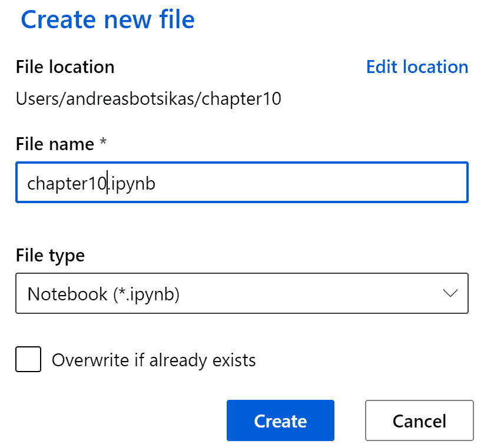

    图 10.3 – 在 chapter10 文件夹中创建 chapter10 笔记本

1.  你需要安装 `interpret-community` 库的最新包、微软的负责任 AI 小部件，以及 `#` 或删除该单元格：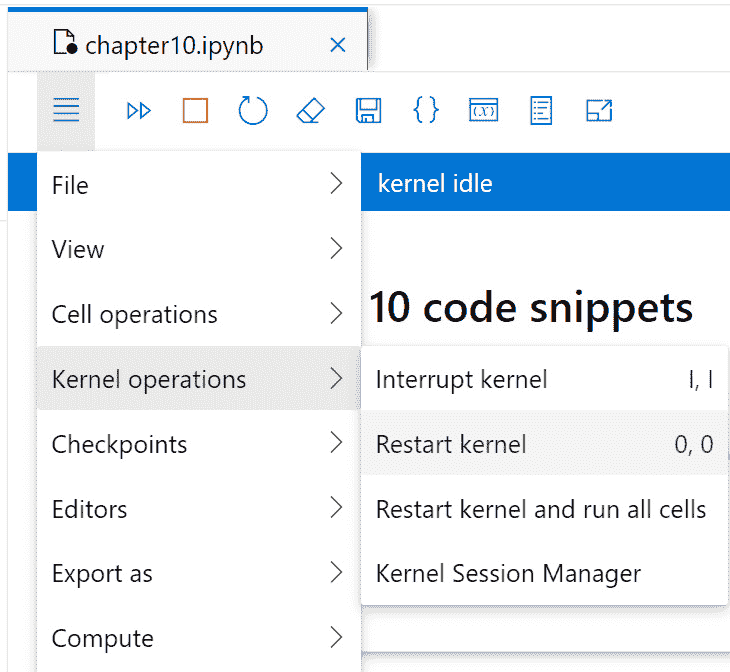

    图 10.4 – 在安装必要的包后重新启动 Jupyter 内核

1.  在重新启动内核后，在笔记本中添加一个新单元格。使用以下代码生成一个贷款数据集：

    ```py
    from sklearn.datasets import make_classification
    import pandas as pd
    import numpy as np
    features, target = make_classification(
        n_samples=500, n_features=3, n_redundant=1, shift=0,
        scale=1,weights=[0.7, 0.3], random_state=1337)
    def fix_series(series, min_val, max_val):
        series = series - min(series)
        series = series / max(series)
        series = series * (max_val - min_val) + min_val
        return series.round(0)
    features[:,0] = fix_series(features[:,0], 0, 10000)
    features[:,1] = fix_series(features[:,1], 0, 10)
    features[:,2] = fix_series(features[:,2], 18, 85)
    classsification_df = pd.DataFrame(features, dtype='int')
    classsification_df.set_axis(
       ['income','credit_cards', 'age'],
       axis=1, inplace=True)
    classsification_df['approved_loan'] = target
    classsification_df.head()
    ```

    这段代码将生成一个包含以下正态分布特征的数据集：

    +   `income` 的最小值为 `0`，最大值为 `10000`。

    +   `credit_cards` 的最小值为 `0`，最大值为 `10`。

    +   `age` 的最小值为 `18`，最大值为 `85`。

    你将预测的标签是 `approved_loan`，这是一个布尔值，且在 500 个样本（`n_samples`）中，只有 30%（`weights`）是批准的贷款。

1.  在本章后面，你将针对这个数据集运行一个 **AutoML** 实验。注册数据集，正如你在 *第七章* 中看到的，*AzureML Python SDK*。在你的笔记本中添加以下代码：

    ```py
    from azureml.core import Workspace, Dataset
    ws = Workspace.from_config()
    dstore = ws.get_default_datastore()
    loans_dataset = \
    Dataset.Tabular.register_pandas_dataframe(
        dataframe=classsification_df,
        target=(dstore,"/samples/loans"),
        name="loans",
        description="A genarated dataset for loans")
    ```

    如果你访问注册的数据集，可以查看数据集的简介，如下所示：

    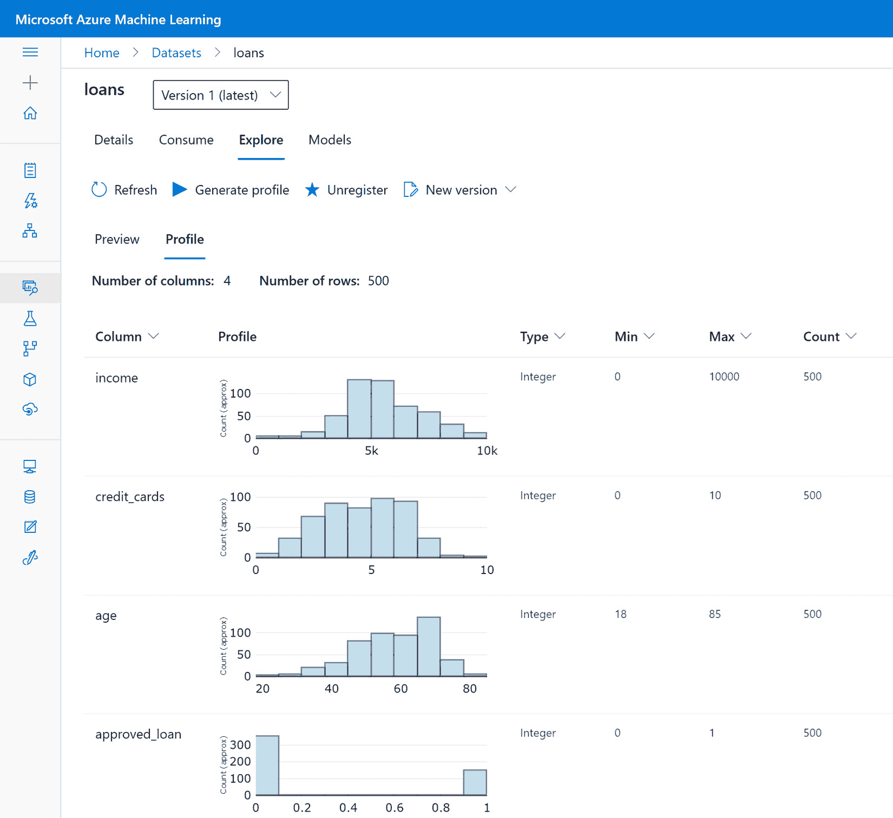

    图 10.5 – 生成的数据集简介

1.  为了能够训练和评估模型，你需要将数据集分割成训练集和测试集。使用以下代码来完成此操作：

    ```py
    from sklearn.model_selection import train_test_split
    X = classsification_df[['income','credit_cards', 'age']]
    y = classsification_df['approved_loan'].values
    x_train, x_test, y_train, y_test = \
            train_test_split(X, y, 
                           test_size=0.2, random_state=42)
    ```

    首先，将数据集分成两部分，一部分包含特征，另一部分包含你要预测的标签。然后，使用 `train_test_split` 方法将 500 个样本的数据分割成包含 500 * 0.2 = 100 个测试记录的数据集，以及包含剩余 400 个样本的训练集。

1.  下一步是初始化模型，并将其拟合到训练数据集。在*第九章*《优化 ML 模型》中，你学习了 Azure 机器学习的`datatransformer`步骤是一个`ColumnTransformer`，它对所有特征应用`MinMaxScaler`。这个转换器会缩放每个特征的值。

1.  `model`步骤是你正在训练的实际模型，即`RandomForestClassifier`。

然后，你必须调用已实例化的管道的`fit`方法，将其训练与训练数据集对齐。

重要提示

你不需要使用`Pipeline`来受益于本章讨论的可解释性特性。你可以直接通过将模型赋值给`model_pipeline`变量来使用该模型，例如`model_pipeline=RandomForestClassifier()`。添加`datatransformer`步骤是为了帮助你理解 AutoML 是如何构建管道的。使用`MinMaxScaler`还提高了结果模型的准确性。你可以随意尝试不同的缩放器，以观察结果模型的差异。

1.  现在你已经有了一个训练好的模型，可以进行测试。让我们测试三个虚构的客户：

    +   一位 45 岁、有两张信用卡、月收入为`2000`的人。

    +   一位 45 岁、有九张信用卡、月收入为`2000`的人。

    +   一位 45 岁、有两张信用卡、月收入为`10000`的人。

    要做到这一点，请在新的笔记本单元格中使用以下代码：

    ```py
    test_df = pd.DataFrame(data=[
        [2000, 2, 45],
        [2000, 9, 45],
        [10000, 2, 45]
    ], columns= ['income','credit_cards', 'age'])
    test_pred = model_pipeline.predict(test_df)
    print(test_pred)
    ```

    打印结果是`[0 1 1]`，这意味着第一个客户的贷款将被拒绝，而第二个和第三个客户的贷款将被批准。这表明`income`和`credit_cards`特征可能在模型预测中起着重要作用。

1.  由于训练后的模型是一个决策树，属于玻璃盒模型类别，你可以获取在训练过程中计算出的特征重要性。使用以下代码在新的笔记本单元格中：

    ```py
    model_pipeline.named_steps['model'].feature_importances_
    ```

    这段代码获取实际的`RandomForestClassifier`实例，并调用`feature_importances_`。其输出类似于`array([0.66935129, 0.11090936, 0.21973935])`，这显示`income`（第一个值）是最重要的特征，但与我们在*步骤 7*中观察到的情况相比，`age`（第三个值）似乎比`credit_cards`（第二个值）更为重要。

    重要提示

    模型的训练过程是非确定性的，这意味着你的结果与书中示例中的结果会有所不同。数值应该相似，但不完全相同。

在本节中，你训练了一个简单的`feature_importances_`属性。在下一节中，你将使用一种更高级的技术，允许你解释任何模型。

## 使用表格解释器

到目前为止，你已经使用**sklearn**库的功能来训练并理解模型的结果。从现在开始，你将使用解释社区的包来更准确地解释你训练好的模型。你将使用**SHAP**，这是一种黑箱技术，可以告诉你哪些特征在将预测从**拒绝**转为**批准**（或反之）的过程中发挥了什么作用。让我们开始吧：

1.  在一个新的笔记本单元格中，添加以下代码：

    ```py
    from interpret.ext.blackbox import TabularExplainer
    explainer = TabularExplainer(
                  model_pipeline.named_steps['model'],
                  initialization_examples=x_train, 
                  features= x_train.columns,
                  classes=["Reject", "Approve"],
                  transformations=
                    model_pipeline.named_steps['datatransformer']) 
    ```

    这段代码创建了一个`TabularExplainer`，它是 SHAP 解释技术的一个封装类。这意味着该对象会根据传入的模型选择最合适的 SHAP 解释方法。在这种情况下，由于模型是基于树的，它将选择**树解释器**（tree explainer）。

1.  使用这个解释器，你将获得**局部**或**实例级别的特征重要性**，以便更深入地理解模型在*训练贷款批准模型*部分的*步骤 7*中为什么会给出这样的结果。在一个新的笔记本单元格中，添加以下代码：

    ```py
    local_explanation = explainer.explain_local(test_df)
    sorted_local_values = \
        local_explanation.get_ranked_local_values()
    sorted_local_names = \
        local_explanation.get_ranked_local_names()
    for sample_index in range(0,test_df.shape[0]):
        print(f"Test sample number {sample_index+1}")
        print("\t", test_df.iloc[[sample_index]]
                             .to_dict(orient='list'))
        prediction = test_pred[sample_index]
        print("\t", f"The prediction was {prediction}")
        importance_values = \
            sorted_local_values[prediction][sample_index]
        importance_names = \
            sorted_local_names[prediction][sample_index]
        local_importance = dict(zip(importance_names,
                                    importance_values))
        print("\t", "Local feature importance")
        print("\t", local_importance)
    ```

    这段代码生成了以下截图所示的结果。如果你关注**测试样本 2**，你会注意到它显示**信用卡数**（**credit_cards**）是该特定样本被预测为**批准**（**预测值为 1**）的最重要原因（见**0.33**的值）。同样样本中**收入**（其值大约为**-0.12**）的负值表明该特征推动模型**拒绝**贷款：

    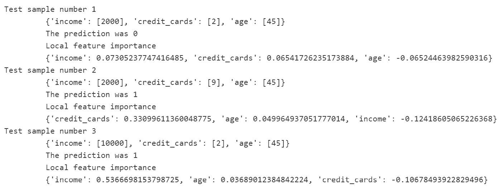

    图 10.6 – 局部重要性特征展示了每个特征对每个测试样本的重要性

1.  你还可以看到`收入`（`income`）、`年龄`（`age`）以及`信用卡数`（`credit_cards`），它们对应的重要性值分别约为`0.28`、`0.09`和`0.06`（实际值可能与你的执行结果有所不同）。请注意，这些值与*训练贷款批准模型*部分的*步骤 8*中获得的值不同，尽管顺序保持一致。这是正常现象，因为`使用方法：shap.tree`，这表明`TabularExplainer`使用**树解释器**对模型进行了解释，如本节*步骤 1*所提到的。

1.  最后，你必须渲染解释仪表板，以查看你在*步骤 3*中生成的`global_explanation`结果。在笔记本中添加以下代码：

    ```py
    from raiwidgets import ExplanationDashboard
    ExplanationDashboard(global_explanation, model_pipeline, dataset=x_test, true_y=y_test)
    ```

    这将渲染一个交互式小部件，你可以用它来理解模型对你提供的测试数据集的预测。点击**特征重要性汇总**（**Aggregate feature importance**）标签，你应该会看到在*步骤 3*中看到的相同结果：

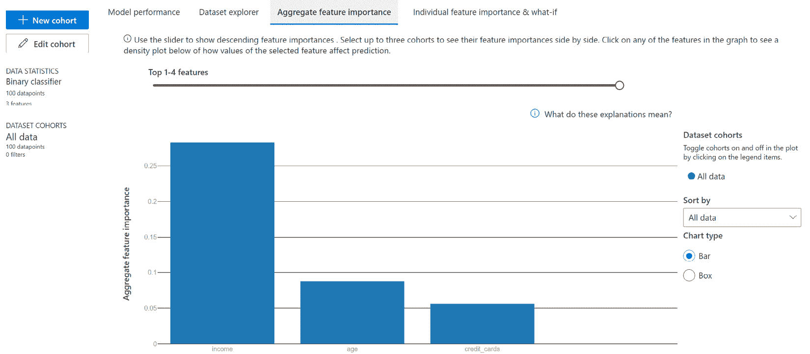

图 10.7 – 解释社区提供的解释仪表板

你将在*查看解释结果*部分更详细地探索这个仪表板。

到目前为止，你已经训练了一个模型，并使用 **SHAP** 解释技术解释了模型预测的特征重要性，无论是在全局还是局部层面上进行特定推理。接下来的部分，你将了解 Interpret-Community 包中可用的其他解释技术。

## 理解表格数据的解释技术

在上一节中，你使用了表格解释器自动选择了一个可用的 **SHAP** 技术。目前，解释社区支持以下 **SHAP** 解释器：

+   **Tree explainer** 用于解释决策树模型。

+   **Linear explainer** 解释线性模型，并且也可以解释特征间的相关性。

+   **Deep explainer** 为深度学习模型提供近似解释。

+   **Kernel explainer** 是最通用且最慢的解释器。它可以解释任何函数的输出，使其适用于任何模型。

**SHAP** 解释技术的替代方法是构建一个更容易解释的代理模型，例如解释社区提供的**玻璃盒子**模型，来重现给定黑盒的输出，并解释该代理模型。这个技术被**Mimic** 解释器使用，你需要提供以下的一个玻璃盒子模型：

+   **LGBMExplainableModel**，这是一个 **LightGBM**（一个基于决策树的快速高效框架）可解释模型

+   **LinearExplainableModel**，这是一个线性可解释模型

+   **SGDExplainableModel**，这是一个随机梯度下降可解释模型

+   **DecisionTreeExplainableModel**，这是一个决策树可解释模型

如果你想在上一节的*步骤 1* 中使用 Mimic 解释器，代码会像这样：

```py
from interpret.ext.glassbox import (
    LGBMExplainableModel,
    LinearExplainableModel,
    SGDExplainableModel,
    DecisionTreeExplainableModel
)
from interpret.ext.blackbox import MimicExplainer
mimic_explainer = MimicExplainer(
           model=model_pipeline, 
           initialization_examples=x_train,
           explainable_model= DecisionTreeExplainableModel,
           augment_data=True, 
           max_num_of_augmentations=10,
           features=x_train.columns,
           classes=["Reject", "Approve"], 
           model_task='classification')
```

你可以从*第 1 行*中的 `import` 语句中选择任何代理模型。在这个示例中，你使用的是 `DecisionTreeExplainableModel`。要获取全局解释，代码与在*步骤 3* 中编写的代码相同，像这样：

```py
mimic_global_explanation = \
       mimic_explainer.explain_global(x_test)
print("Feature names:", 
       mimic_global_explanation.get_ranked_global_names())
print("Feature importances:",
       mimic_global_explanation.get_ranked_global_values())
print(f"Method used: {mimic_explainer._method}")
```

尽管特征重要性的顺序相同，但计算出来的特征重要性值是不同的，如下所示：

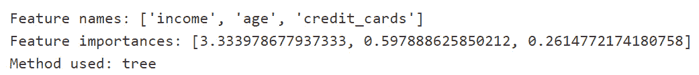

图 10.8 – 使用决策树玻璃盒子模型计算的 Mimic 解释器特征重要性

类似于 `mimic_explainer` 使用相同的代码来计算**局部**或**实例级别的特征重要性**，就像在上一节的*步骤 2* 中所做的那样。解释可以在以下屏幕截图中看到：

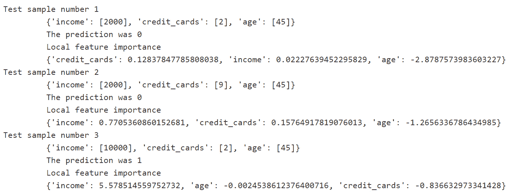

图 10.9 – 使用 Mimic 解释器的决策树玻璃盒子模型计算的局部特征重要性

Interpret-Community 提供的最后一个解释技术是基于**PFI**的技术。该技术会通过改变每个特征的值，观察模型预测的变化。要创建一个 PFI 解释器来解释你的模型，你需要以下代码：

```py
from interpret.ext.blackbox import PFIExplainer
pfi_explainer = PFIExplainer(model_pipeline,
                             features=x_train.columns,
                             classes=["Reject", "Approve"])
```

获取全局解释需要传入`true_labels`参数，这是数据集的真实标签，即实际值：

```py
pfi_global_explanation = \
        pfi_explainer.explain_global(x_test, 
                                     true_labels=y_test)
print("Feature names:", 
        pfi_global_explanation.get_ranked_global_names())
print("Feature importances:",
        pfi_global_explanation.get_ranked_global_values())
print(f"Method used: {pfi_explainer._method}")
```

此代码的结果可以在此处查看。由于`credit_cards`和`age`特征的重要性值非常相似，结果中它们的顺序可能会互换：

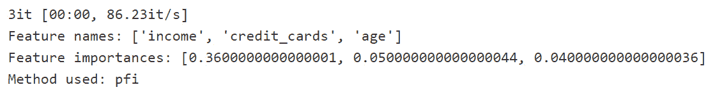

图 10.10 – 通过 PFI 解释器计算的全局特征重要性

重要提示

由于**PFI** 解释器的性质，你*不能*使用它来创建**局部**或**实例级特征重要性**。如果在考试中被问到该技术是否能提供局部解释，记住这一点。

在本节中，你了解了 Interpret-Community 包支持的所有解释技术。在下一节中，你将探索解释仪表板所提供的功能，以及该仪表板如何嵌入到 Azure 机器学习工作室中。

## 审查解释结果

Azure 机器学习与 Interpret-Community 的工作有着丰富的集成点。其中一个集成点是解释仪表板，它嵌入在每个运行中。你可以使用来自`azureml.interpret`包的`ExplanationClient`上传和下载模型解释到工作区。如果你使用`TabularExplainer`在*使用表格解释器*一节中创建了全局解释，导航至`chapter10.ipynb`笔记本，在文件末尾添加一个新单元格，并输入以下代码：

```py
from azureml.core import Workspace, Experiment
from azureml.interpret import ExplanationClient
ws = Workspace.from_config()
exp = Experiment(workspace=ws, name="chapter10")
run = exp.start_logging()
client = ExplanationClient.from_run(run)
client.upload_model_explanation(
    global_explanation, true_ys= y_test,
    comment='global explanation: TabularExplainer')
run.complete()
print(run.get_portal_url())
```

这段代码在`chapter10`实验中启动一个新的运行。通过该运行，你创建一个`ExplanationClient`，用来上传你生成的模型解释和真实标签（`true_ys`），这些有助于仪表板评估模型的表现。

如果你访问此代码输出的门户链接，你将进入一个运行页面，在**解释**标签中，你需要选择左侧的**解释 ID**，然后访问**聚合特征重要性**标签以查看解释仪表板，如下所示：

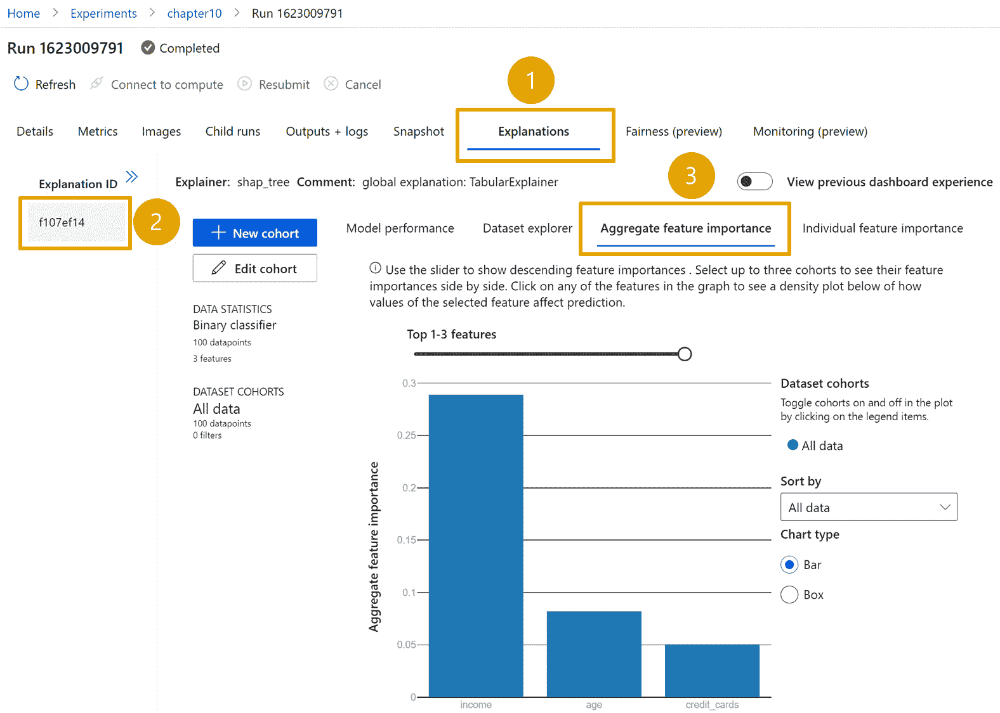

图 10.11 – 审查存储在 Azure 机器学习工作区中的全局解释

`ExplanationClient`由 Azure 机器学习的`chapter10.ipynb`笔记本使用，并在新单元格中添加以下代码块：

```py
from azureml.core import Workspace, Dataset, Experiment
from azureml.train.automl import AutoMLConfig
ws = Workspace.from_config()
compute_target = ws.compute_targets["cpu-sm-cluster"]
loans_dataset = Dataset.get_by_name(
                            workspace=ws, name='loans')
train_ds,validate_ds = loans_dataset.random_split(
                             percentage=0.8, seed=1337)
```

这段代码看起来非常类似于你在*第九章*中使用的代码，*优化机器学习模型*，位于*使用代码运行 AutoML 实验*部分。在这段代码中，你正在获取 Azure 机器学习工作区的引用，以及`loans`数据集，然后将数据集分割为训练集和验证集。

在相同或新建的单元格中，添加以下代码块：

```py
experiment_config = AutoMLConfig(
    task = "classification",
    primary_metric = 'accuracy',
    training_data = train_ds,
    label_column_name = "approved_loan",
    validation_data = validate_ds,
    compute_target = compute_target,
    experiment_timeout_hours = 0.25,
    iterations = 4,
    model_explainability = True)
automl_experiment = Experiment(ws, 'loans-automl')
automl_run = automl_experiment.submit(experiment_config)
automl_run.wait_for_completion(show_output=True)
```

在这段代码中，你正在启动`model_explainability`（默认值为`True`）。这个选项会在**AutoML**过程完成后安排最佳模型的说明。一旦运行完成，转到该运行的 UI，并打开**模型**标签，如下图所示：

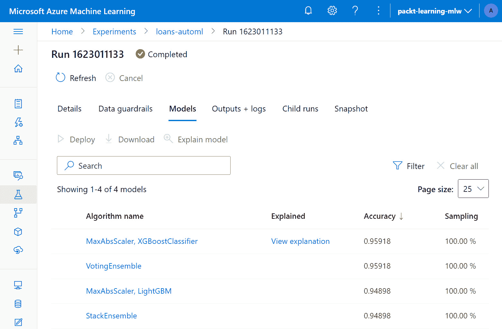

图 10.12 – AutoML 运行中最佳模型的说明已可用

点击最佳模型的**查看说明**链接，进入训练该特定模型的子运行的**说明**标签。当你进入**说明**标签时，你会注意到**AutoML**存储了两个全局说明：一个是原始特征的说明，另一个是工程特征的说明。你可以通过选择屏幕左侧的适当 ID，在这两个说明之间切换，如下图所示。原始特征是来自原始数据集的特征。工程特征是经过预处理后得到的特征。这些工程特征是模型的内部输入。如果你选择较低的**说明 ID**并查看**聚合特征重要性**区域，你会注意到**AutoML**已将信用卡号转换为分类特征。此外，与模型训练中产生的三个特征相比，模型的输入是 12 个特征。

你可以在这里查看这些特征及其相应的特征重要性：

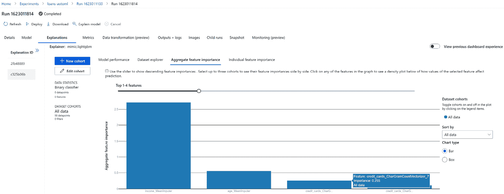

图 10.13 – 工程特征的全局说明

由于工程特征较难理解，请转到顶部的**说明 ID**，这是你目前为止使用的三个原始特征所在的位置。点击**数据集浏览器**标签，如下图所示：

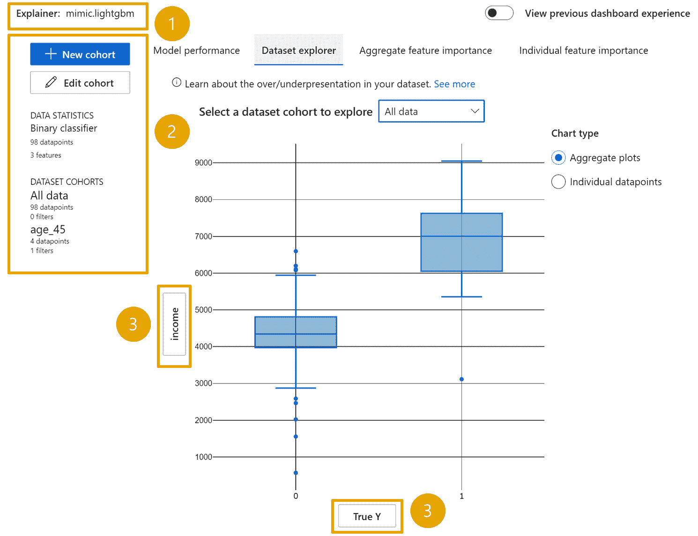

图 10.14 – 数据集浏览器中的原始特征说明

在这里，我们可以看到以下内容：

1.  **Mimic**解释器用于解释特定的模型（这是一个**XGBoostClassifier**，如*图 10.12*所示）。作为替代模型的**glassbox**模型是一个**LGBMExplainableModel**，如前面截图的左上角所示。

1.  您可以编辑队列或定义新的队列，以便通过从 **选择要探索的数据集队列** 下拉菜单中选择它们来专注于特定的子组。要定义一个新的队列，您需要指定要应用的数据集过滤条件。例如，在前述截图中，我们定义了一个名为 **年龄 _45** 的队列，它有一个单一的过滤器（年龄 == 45）。在测试数据集中有 **4 个数据点** 由此解释仪表板使用。

1.  您可以通过点击前述截图中标记为 **3** 的高亮区域来修改 *x* 轴和 *y* 轴字段。这使您可以改变视图并获得关于特征与预测值或基本事实之间相关性的见解，特征之间的相关性以及对您的模型理解分析有意义的任何其他视图。

在**聚合特征重要性**选项卡中，如所示，您可以查看您定义的所有数据或特定队列的特征重要性：

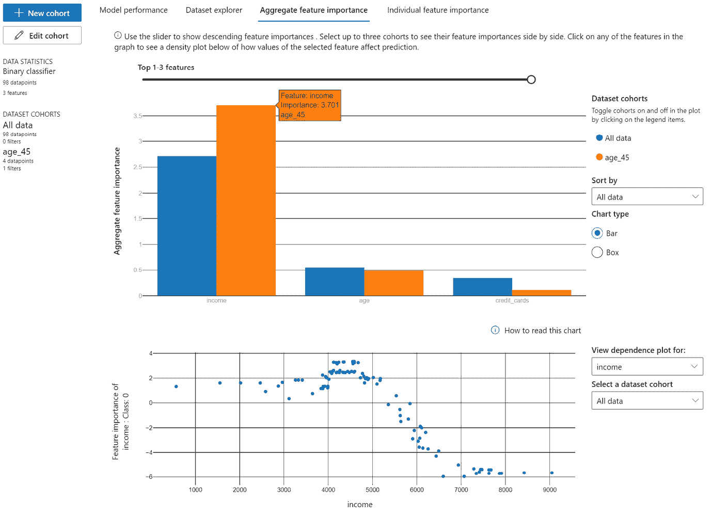

图 10.15 – 根据收入的原始特征与队列和依赖关系的聚合特征重要性

在本例中，**收入** 特征对于 **年龄 _45** 队列比一般公众更重要，由 **所有数据** 表示。如果您点击特征重要性条，下面的图表会更新，显示这个特征如何影响模型决定拒绝贷款请求（**类别 0**）。在这个例子中，您可以看到从 0 到略高于 5,000 的收入*推动*模型拒绝贷款，而从 6,000 开始的收入则产生负面影响，这意味着它们试图*推动*模型批准贷款。

解释仪表板中有大量的功能，而且随着对解释社区的贡献，新功能会不断出现。在本节中，您回顾了仪表板的最重要功能，这些功能帮助您理解模型为什么会做出预测以及如何可能调试性能不佳的边缘案例。

在下一节中，您将学习错误分析，这是微软整体负责人工智能小部件包的一部分。这个工具允许您了解模型的盲点，即模型表现不佳的情况。

# 分析模型错误

**错误分析** 是一种模型评估/调试工具，可以帮助你更深入地了解机器学习模型的错误。错误分析帮助你识别数据集中错误率高于其他记录的群体。你可以更密切地观察被错误分类和有误的数据点，查看是否能发现任何系统性模式，例如是否某些群体没有数据可用。错误分析也是描述当前系统缺陷并与其他利益相关者和审计人员沟通的有效方式。

该工具由多个可视化组件组成，可以帮助你了解错误出现的位置。

导航到 `chapter10.ipynb` 笔记本。在 **菜单** 中，点击 **编辑器** 子菜单下的 **在 Jupyter 中编辑**，以便在 Jupyter 中打开相同的笔记本并继续编辑，如下所示：

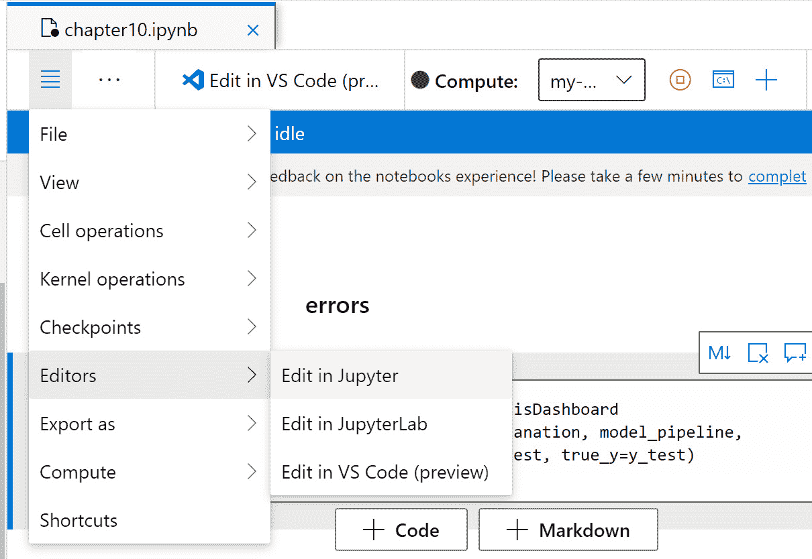

图 10.16 – 在 Jupyter 中编辑笔记本以更好地与小部件兼容

重要说明

在编写本书时，由于笔记本体验的安全限制，错误分析面板无法在笔记本环境中运行，这些限制会妨碍某些功能的正常工作。如果你尝试在笔记本中运行，它不会生成必要的可视化效果。因此，你需要在 Jupyter 中打开笔记本，而这一步在你阅读本书时可能不再需要。

在 Jupyter 环境中，在文件末尾添加一个新的单元格并输入以下代码：

```py
from raiwidgets import ErrorAnalysisDashboard
ErrorAnalysisDashboard(global_explanation, model_pipeline, 
                       dataset=x_test, true_y=y_test)
```

请注意，这段代码与你用来触发解释面板的代码非常相似。

重要说明

确保你关闭所有其他编辑环境中的笔记本，比如在 Azure 机器学习工作室中的笔记本体验。如果笔记本被其他编辑器意外修改，你可能会丢失部分代码。

该工具以全局视图打开，如下所示：

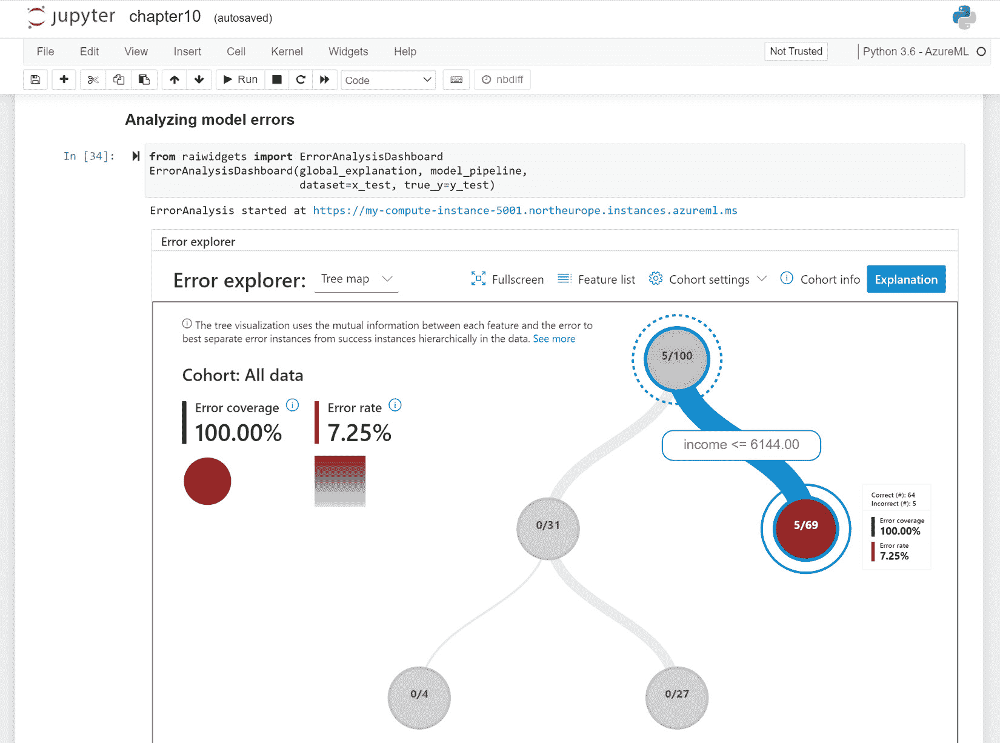

图 10.17 – 错误分析面板在 Jupyter 环境中的加载情况

在此视图中，你可以查看模型在整个数据集上的错误率。在这个视图中，你可以看到一棵二叉树，描述了在可解释子群体之间的数据分区，这些子群体具有出乎意料的高或低错误率。在我们的示例中，模型的所有错误都发生在收入小于或等于 **6144** 的数据中，这占 **7.25%** 的错误率，意味着 **7.25%** 的月收入小于 **6144** 的贷款被错误分类。错误覆盖率是所有错误中落入此节点的部分，在这种情况下，所有错误都位于该节点中（**100%**）。节点中的数字表示数据的分布情况。这里，**69** 条记录中有 **5** 条是错误的，它们属于这个节点。

一旦你选择了**树图**中的某个节点，你可以点击**群体设置**或**群体信息**，并将这些记录保存为一个感兴趣的群体。这个群体可以用于解释仪表板。在点击**解释**按钮后，你将进入**数据探索器**视图，如下所示：

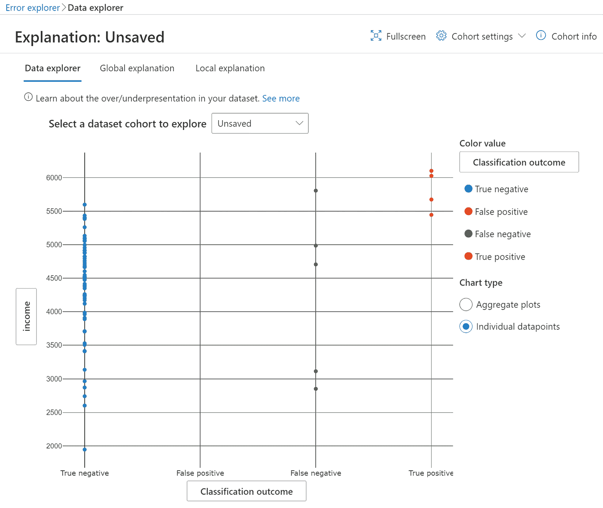

图 10.18 – 针对树图中选择的特定群体的数据探索器

此视图已经预选了节点的群体。它具有类似于解释仪表板的功能，比如查看影响所选群体整体模型预测的特征重要性。此视图还提供了**局部解释**标签，允许你理解个别错误记录，甚至进行假设分析，了解模型何时会正确分类该记录。

通过点击小部件左上角的**错误探索器**链接，你将返回**树图**视图。在**错误探索器：**下拉菜单中，选择**热力图**，而不是当前选中的**树图**。这将引导你到错误热力图视图，如下所示：

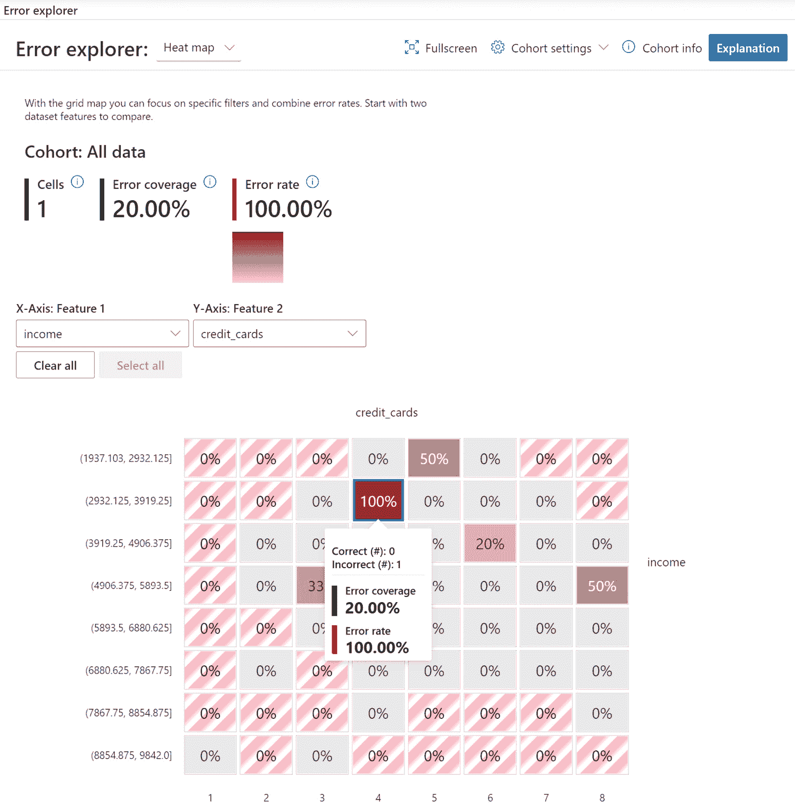

图 10.19 – 错误热力图视图

此视图根据左上角选定的特征，以一维或二维的方式对数据进行切分。热力图通过较深的红色来可视化具有较高错误的单元格，以引起用户对高错误差异区域的注意。带有条纹的单元格表示没有评估样本，这可能表明存在隐藏的错误区域。

在本节中，我们提供了错误分析仪表板的功能概述，并展示了它如何帮助你理解模型的错误发生位置。该工具可以帮助你识别这些错误区域，并通过设计新特征、收集更好的数据、舍弃部分当前的训练数据，或进行更好的超参数调整来减轻它们。

在接下来的部分，你将了解 Fairlearn，这是一种工具，能帮助你评估模型的公平性并缓解任何观察到的不公平问题。

# 检测潜在的模型公平性问题

机器学习模型可能由于多种原因表现不公平：

+   社会中的历史偏见可能会反映在用于训练模型的数据中。

+   模型开发者所做的决策可能存在偏差。

+   用于训练模型的数据缺乏代表性。例如，某一特定人群的数据点可能太少。

由于很难确定导致模型表现不公平的实际原因，因此定义模型不公平行为的标准是根据它对人们的影响来判断的。模型可能造成的两种显著伤害类型是：

+   **资源分配损害**：这是指模型拒绝为某个群体提供机会、资源或信息。例如，在招聘过程中或我们迄今为止处理的贷款贷款示例中，某些群体可能没有被聘用或获得贷款的机会。

+   **服务质量损害**：这是指系统未能为每个人提供相同的服务质量。例如，面部识别在某些人群中的准确度较低。

基于此，很明显，模型公平性问题不能通过自动化解决，因为没有数学公式。**Fairlearn**是一个工具包，提供帮助评估和缓解分类和回归模型预测公平性的问题的工具。

在我们的案例中，如果将年龄分组视为一个敏感特征，我们可以使用以下代码分析模型基于准确率的行为：

```py
from fairlearn.metrics import MetricFrame
from sklearn.metrics import accuracy_score
y_pred = model_pipeline.predict(x_test)
age = x_test['age']
model_metrics = MetricFrame(accuracy_score, y_test, 
                             y_pred, sensitive_features=age)
print(model_metrics.overall)
print(model_metrics.by_group[model_metrics.by_group < 1])
```

这段代码获取了你在*训练贷款批准模型*部分中训练的模型的预测结果，并为`x_test`数据集生成预测结果。然后，它将`x_test['age']`特征的所有值分配给`age`变量。接着，使用`MetricFrame`，我们可以计算模型的`accuracy_score`指标，既可以计算整个测试数据集的准确率（存储在`overall`属性中），也可以按组计算准确率（存储在`by_group`属性中）。这段代码会打印整体准确率和分组准确率，后者的值小于 1。结果显示在下面的截图中：

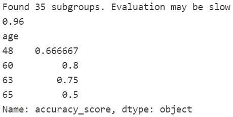

图 10.20 – 该模型的准确率为 0.96，但对于 65 岁的人群，其准确率为 0.5

尽管数据集已经生成，但你可以看到该模型对 65 岁的人群的准确率只有 50%。请注意，尽管该模型是在 18 至 85 岁之间的年龄段进行训练的，但数据集中只检测到 35 个子组，这表明我们可能没有对其进行准确测试。

与`ExplanationDashboard`和`ErrorAnalysisDashboard`类似，负责任的 AI 小部件（`raiwidgets`）包提供了一个`FairnessDashboard`，可以用来分析模型结果的公平性。

重要提示

在编写本书时，`FairnessDashboard`在 Jupyter 中工作。在 Notebook 体验中，存在一些技术问题。为了获得最佳体验，请在 Jupyter 中打开你的 Notebook。

在一个新单元格中，添加以下代码以调用公平性仪表板，使用你在前面的代码中定义的年龄敏感特征：

```py
from raiwidgets import FairnessDashboard
FairnessDashboard(sensitive_features=age, 
                  y_true=y_test, y_pred=y_pred)
```

启动后，该小部件将引导你完成公平性评估过程，在此过程中你需要定义以下内容：

+   **敏感特征**：在这里，你必须配置敏感特征。敏感特征用于将数据分组，正如我们之前看到的那样。在这种情况下，它将提示你为年龄组创建五个区间（18-29 岁、30-40 岁、41-52 岁、53-64 岁和 64-75 岁），你可以修改分箱过程，甚至选择提供的**视为分类变量**选项，以让每个年龄单独处理。

+   **性能指标**：性能指标用于评估模型在总体和每个组中的质量。在这种情况下，你可以选择准确度，就像我们之前所做的那样。即使向导完成后，你也可以更改这个选项。

+   **公平性指标**：公平性指标表示性能指标的极端值之间的差异或比率，或者仅仅是任何组的最差值。此类指标的一个示例是**准确度比率**，它是任何两个组之间的最小准确度比率。即使向导完成后，你也可以更改这个选项。

生成的仪表板允许你深入了解模型对各子组的影响。它由两个区域组成——总结表格和可视化区域——你可以在这里选择不同的图形表示方式，如下所示：

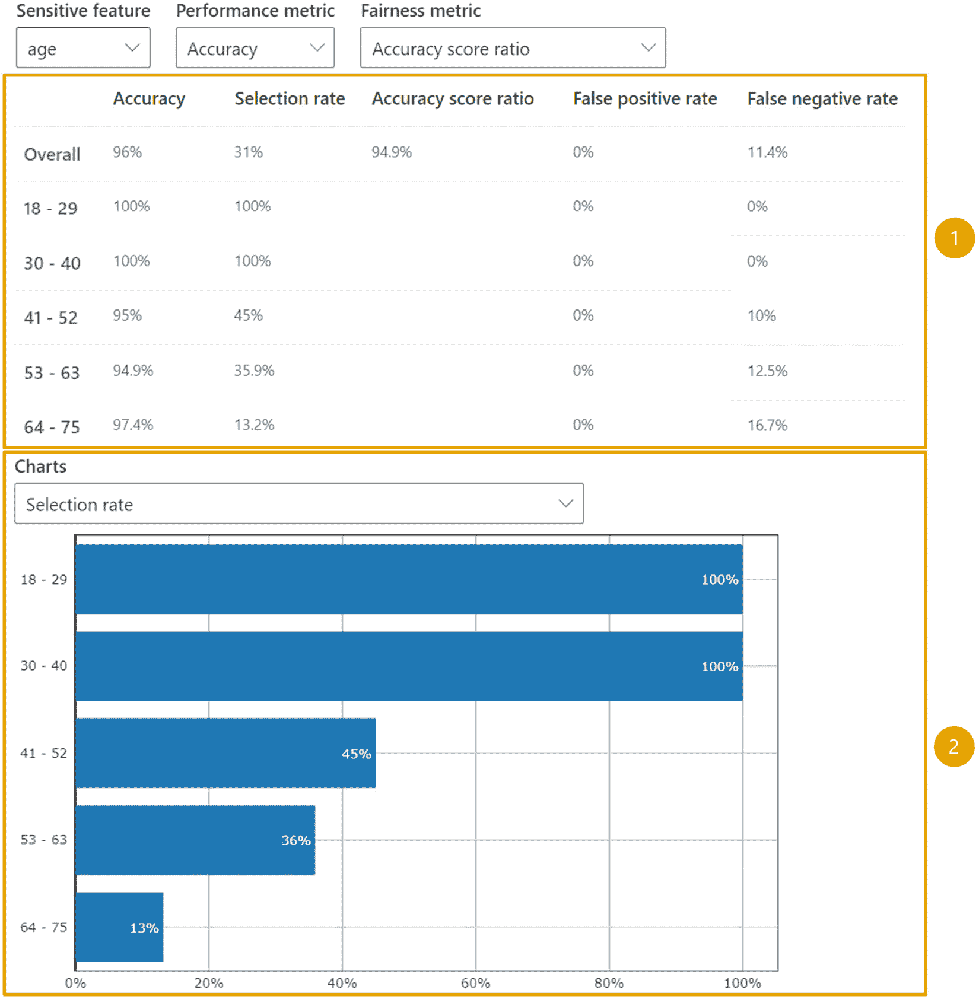

图 10.21 – 展示不同年龄组中模型准确度的公平性仪表板

一旦你确定了模型中的公平性问题，你可以使用**Fairlearn**库来缓解这些问题。**Fairlearn**库提供了两种方法：

+   `ThresholdOptimizer`，调整底层模型的输出以实现显式约束，比如均衡赔率的约束。在我们的二元分类模型中，均衡赔率意味着在各组之间，真正例和假正例的比率应该匹配。

+   `sample_weight` 参数是 `fit` **sklearn** 方法接受的。

使用这些技术，你可以通过牺牲一些模型的性能来平衡模型的公平性，以满足你的业务需求。

**Fairlearn**包正在不断发展，已经集成到 Azure 机器学习 SDK 和 Studio Web 体验中，允许数据科学家将模型公平性洞察上传到 Azure 机器学习运行历史记录中，并在 Azure 机器学习 Studio 中查看**Fairlearn**仪表板。

在本节中，你学习了如何检测模型可能存在的潜在不公平行为。你还了解了可以在**Fairlearn**包中实现的潜在缓解技术。这总结了由 Azure 机器学习工作区和开源社区提供的工具，它们帮助你理解模型并协助你创建人工智能。

# 总结

本章为你概述了几种可以帮助你理解模型的工具。你首先了解了 Interpret-Community 包，它能够帮助你理解模型做出预测的原因。你学习了各种解释技术，并探索了解释仪表板，其中提供了诸如特征重要性等视图。接着，你看到了错误分析仪表板，它能够帮助你确定模型表现不佳的地方。最后，你学习了公平性评估技术、相应的仪表板，能够让你探索潜在的不公平结果，并了解如何采取措施来缓解潜在的公平性问题。

在下一章，你将学习关于 Azure 机器学习管道的内容，管道可以让你以可重复的方式编排模型训练和模型结果的解释。

# 问题

在每一章中，你会发现一些问题，帮助你对每章讨论的主题进行知识检查：

1.  你正在使用 `TabularExplainer` 来解释 `DecisionTreeClassifier`。将使用哪种底层的 SHAP 解释器？

    a. `DecisionTreeExplainer`

    b. `TreeExplainer`

    c. `KernelExplainer`

    d. `LinearExplainer`

1.  你想使用 `MimicExplainer` 来解释 `DecisionTreeClassifier`。你可以使用以下哪种模型作为 `explainable_model` 参数？

    a. `LGBMExplainableModel`

    b. `LinearExplainableModel`

    c. `SGDExplainableModel`

    d. `DecisionTreeExplainableModel`

    e. 上述所有选项

1.  你能使用 `PFIExplainer` 来生成局部特征重要性值吗？

    a. 是的

    b. 否

# 进一步阅读

本节提供了一些有用的网络资源，帮助你增强对 Azure 机器学习 SDK 以及本章中使用的各种代码片段的理解：

+   **SmartNoise** 库，用于差分隐私：[`github.com/opendp/smartnoise-core`](https://github.com/opendp/smartnoise-core)

+   同态加密资源：[`www.microsoft.com/en-us/research/project/homomorphic-encryption/`](https://www.microsoft.com/en-us/research/project/homomorphic-encryption/)

+   部署加密推理 Web 服务：[`docs.microsoft.com/en-us/azure/machine-learning/how-to-homomorphic-encryption-seal`](https://docs.microsoft.com/en-us/azure/machine-learning/how-to-homomorphic-encryption-seal)

+   **Presidio**，数据保护和匿名化 API：[`github.com/Microsoft/presidio`](https://github.com/Microsoft/presidio)

+   用于数据科学项目中 aDevOps 过程的示例代码库，也称为**MLOps**：[`aka.ms/mlOps`](https://aka.ms/mlOps)

+   **模型报告的模型卡**：[`arxiv.org/pdf/1810.03993.pdf`](https://arxiv.org/pdf/1810.03993.pdf)

+   **InterpretML** 网站，提供了社区的 GitHub 仓库链接：[`interpret.ml/`](https://interpret.ml/)

+   **错误分析**主页，包括如何使用工具包的指南：[`erroranalysis.ai/`](https://erroranalysis.ai/)

+   **Fairlearn**主页：[`fairlearn.org/`](https://fairlearn.org/)
