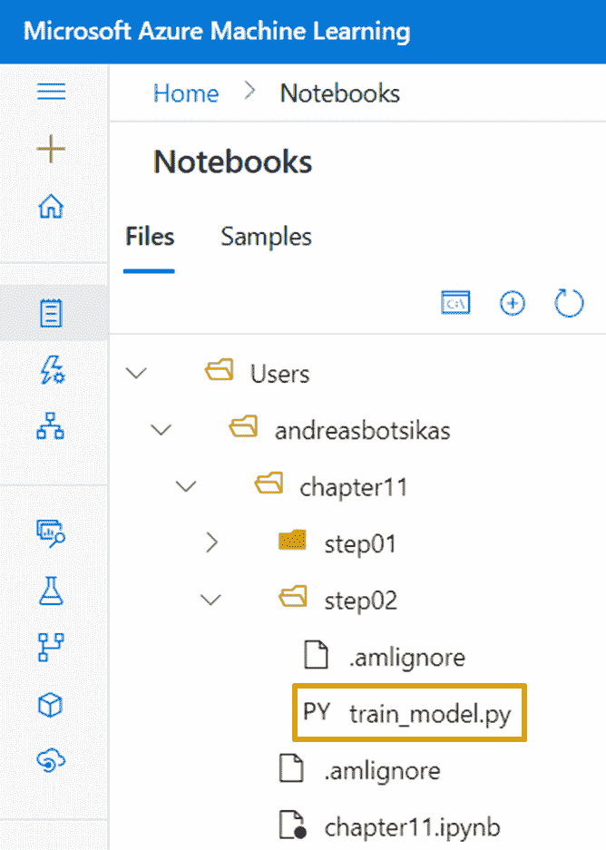

# 第十一章：*第十一章*：使用管道

在本章中，您将学习如何创建可重复使用的过程，定义由多个步骤组成的管道。您可以使用这些管道来创建训练管道，转换数据并训练模型，或者使用它们执行批量推断，使用预训练的模型。一旦注册了这些管道，您可以通过 HTTP 端点或 SDK 调用它们，甚至可以将其配置为按计划执行。掌握这些知识后，您将能够通过使用 **Azure 机器学习**（**AzureML**）SDK 来实现和使用管道。

在本章中，我们将涵盖以下主要主题：

+   了解 AzureML 管道

+   创建管道

+   发布管道以将其暴露为端点

+   安排定期执行管道

# 技术要求

您需要拥有一个 Azure 订阅。在该订阅中，您需要一个 `packt-azureml-rg`。您需要拥有 `Contributor` 或 `Owner` 角色的 `packt-learning-mlw`，如在 *第二章* 中的 *部署 Azure 机器学习工作区资源* 所描述的。

您还需要具备 **Python** 语言的基本知识。代码片段针对的是 Python 3.6 或更高版本。您还应该熟悉在 AzureML studio 中使用笔记本体验，这一点在 *第八章* 中的 *Python 代码实验* 部分有涉及。

本章假设您已经注册了在 *第十章* 中生成的 **loans** 数据集，*理解模型结果*。同时假设您已经创建了名为 **cpu-sm-cluster** 的计算集群，如在 *第七章* 中的 *使用计算目标* 部分所描述的那样，*AzureML Python SDK*。

您可以在 GitHub 上找到本章的所有笔记本和代码片段，网址如下：[`bit.ly/dp100-ch11`](http://bit.ly/dp100-ch11)。

# 了解 AzureML 管道

在 *第六章* 中，*可视化模型训练与发布*，您已经看到如何使用构建块设计训练过程。类似于这些工作流，AzureML SDK 允许您创建 `Pipelines` 来协调多个步骤。例如，在本章中，您将创建一个由两步组成的 `Pipeline`。第一步对 `Environment` 进行预处理。

重要提示

不要将 `Pipelines` 与您在 *第十章* 中阅读的 `Pipelines` 混淆，*理解模型结果*。`Pipelines` 是围绕您要训练并用于推断的实际模型类的包装器。

AzureML SDK 提供了许多构建模块，你可以使用它们来构建`Pipeline`。*图 11.1*包含了你可能在考试和实际代码中遇到的最常用的类：


图 11.1 – 用于编写管道的 AzureML SDK 中的可用类

**Pipeline**是定义工作流的核心类，它将多个步骤串联在一起。你可以通过使用**PipelineParameter**类来定义管道参数，并将它们传递给管道。这些参数可以在**Pipeline**中的一个或多个步骤中引用。一旦定义了管道，你可以将其发布以将其注册到 AzureML 工作区，作为一个版本化对象，并可以通过**PublishedPipeline**类进行引用。此已发布的管道具有一个端点，你可以使用它来触发其执行。如果需要，你可以定义一个**Schedule**，并让这个**PublishedPipeline**类在特定时间间隔触发执行。**PipelineData**定义了临时存储，允许一个步骤将一些文件放入其中，供下一个步骤使用。这两个步骤之间的数据依赖关系在**Pipeline**中创建了一个隐式执行顺序，意味着依赖步骤将在第一个步骤完成后等待执行。你将在本章中使用所有这些类。

在**azureml.pipeline.steps**模块中，你将找到所有可用的步骤。最常用的步骤如下：

+   **PythonScriptStep**：此步骤允许你执行 Python 脚本。你将在本章中使用此步骤。

+   你在*第九章*中看到的`AutoMLConfig`对象，*优化机器学习模型*。

+   你在*第九章*中看到的`HyperDriveConfig`参数，*优化机器学习模型*。

+   **DataTransferStep**：这是一个**Pipeline**步骤，允许你在 AzureML 支持的存储选项之间传输数据。

+   **DatabricksStep**：此步骤允许你在附加的 DataBricks 集群中执行 DataBricks 笔记本、Python 脚本或 JAR 文件。

+   `Estimator`类代表一个通用的训练脚本。一些框架特定的估算器从这个通用的`Estimator`类继承，例如`TensorFlow`和`PyTorch`。要将这些估算器之一纳入你的管道中，你会使用`EstimatorStep`。整个`Estimator`类及其派生类已被弃用，取而代之的是`ScriptRunConfig`，你在前几章中已使用过。如果在考试中看到一个已弃用的`EstimatorStep`引用，你可以将其视为`PythonScriptStep`。

**Pipeline**的最后一个重要组成部分是流经其中的数据。

+   `(dstore,"/samples/diabetes")` 元组用于指示在调用 `register_pandas_dataframe` 方法时想要存储数据的位置，方法适用于 `TabularDataset`。你也可以使用等效的 `DataPath(datastore=dstore, path_on_datastore="/samples/diabetes")` 来代替这个元组。

+   `outputs` 文件夹会自动上传到 `Run` 执行中。与该文件夹类似，你可以定义额外的本地文件夹，这些文件夹会自动上传到目标数据存储区中的目标路径。在本章中，你将使用这个类将生成的模型存储在默认 Blob 存储帐户中的特定位置。

+   **DataReference** 表示数据存储区中的路径，并可用于描述如何以及在哪里在运行时提供数据。它不再是 AzureML 中推荐的数据引用方法。如果你在过时的考试问题中遇到它，你可以将其视为 **DataPath** 对象。

在这一节中，你了解了可以用来构建 AzureML **Pipeline** 的构建模块。在下一节中，你将亲自体验使用这些类。

# 创建管道

假设你需要创建一个可重复的工作流，其中包含两个步骤：

1.  它从已注册的数据集中加载数据，并将其拆分为训练数据集和测试数据集。这些数据集被转换成 `step01` 所需的特殊结构。

1.  它加载预处理过的数据，并训练存储在 AzureML 工作区的默认数据存储区 `/models/loans/` 文件夹中的模型。你将在名为 `step02` 的文件夹中编写此步骤的代码。

    每个步骤将是一个单独的 Python 文件，接受一些参数来指定从哪里读取数据以及将数据写入何处。这些脚本将利用你在 *第八章* 中编写的相同机制，*使用 Python 代码进行实验*。本章不同之处在于，你不会单独调用每个 Python 脚本，而是会创建一个 `Pipeline`，依次调用这些步骤。在 *图 11.2* 中，你可以看到每个脚本将具有的整体输入和输出，以及你需要为每个步骤配置的参数，以便执行：


图 11.2 – 每个管道步骤的输入和输出

根据*图 11.2*，对于每个步骤，你需要定义用于执行特定 Python 脚本的计算目标和`Environment`。虽然每个步骤可以指定一个单独的计算目标和单独的`Environment`，但为了简化代码，你将使用相同的`Environment`和相同的计算目标来运行这两个步骤。你将使用现成的`Environment`，它包含了标准的数据科学包，包括你的脚本所需的**LightGBM**库。你将在你在*第七章*中创建的**cpu-sm-cluster**集群上执行这些步骤，*AzureML Python SDK*。

你将首先编写`Pipeline`，然后编写每个步骤所需的实际 Python 脚本。导航到`chapter11`，然后创建一个名为`chapter11.ipynb`的笔记本，如*图 11.3*所示：


图 11.3 – 将 chapter11 笔记本添加到你的工作文件中

打开新创建的笔记本，按照步骤使用 AzureML SDK 编写 AzureML 流水线：

1.  你将从获取对工作区的引用开始。然后，你将获取对`loans`数据集和`cpu-sm-cluster`的引用。在你的笔记本中的一个单元格里添加以下代码：

    ```py
    from azureml.core import Workspace
    ws = Workspace.from_config()
    loans_ds = ws.datasets['loans']
    compute_target = ws.compute_targets['cpu-sm-cluster']
    ```

    如果你在理解这段代码时遇到困难，请回顾*第七章*，*AzureML Python SDK*。

1.  你需要创建一个配置对象，它将在每个步骤执行时决定使用哪个`Environment`。为此，你需要使用以下代码创建一个`RunConfiguration`：

    ```py
    from azureml.core import RunConfiguration
    runconfig = RunConfiguration()
    runconfig.environment = ws.environments['RunConfiguration object, and you assign the predefined Environment to its environment attribute. To help you understand how this RunConfiguration object relates to the work you have been doing in *Chapter 8*, *Experimenting with Python Code*, the ScriptRunConfig you have been using in that chapter had an optional run_config parameter where you could have passed this RunConfiguration object you defined in this cell.
    ```

1.  接下来，你需要定义一个临时存储文件夹，用于存放第一个步骤的输出文件。你将使用`PipelineData`类，采用以下代码：

    ```py
    from azureml.pipeline.core import PipelineData
    step01_output = PipelineData(
        "training_data",
        datastore= ws.get_default_datastore(),
        is_directory=True) 
    ```

    在这段代码中，你正在创建一个名为`training_data`的中间数据位置，它被存储为一个文件夹，位于你 AzureML 工作区中注册的默认数据存储中。你不需要关心这个临时数据的实际路径，但如果你感兴趣的话，那个文件夹在默认存储容器中的实际路径类似于`azureml/{step01_run_id}/training_data`。

1.  现在你已经为流水线的第一步准备好所有的前提条件，是时候定义它了。在一个新的单元格中，添加以下代码：

    ```py
    from azureml.pipeline.steps import PythonScriptStep
    step_01 = PythonScriptStep(
       'prepare_data.py', 
        source_directory='step01',
        arguments = [
            "--dataset", loans_ds.as_named_input('loans'), 
            "--output-path", step01_output],
        name='Prepare data',
        runconfig=runconfig,
        compute_target=compute_target,
        outputs=[step01_output],
        allow_reuse=True
    )
    ```

    这段代码定义了一个`PythonScriptStep`，它将使用`step01`文件夹中的源代码。它将执行名为`prepare_data.py`的脚本，并传递以下参数：

    +   `--dataset`: 此参数将`loans_ds`数据集 ID 传递给该变量。此数据集 ID 是一个唯一的`as_named_input`方法。此方法在`FileDataset`和`TabularDataset`中均可用，并且仅适用于在 AzureML 工作区内执行`Run`时。要调用该方法，必须提供一个名称，本例中为`loans`，这个名称可以在脚本内部用于检索数据集。AzureML SDK 将在`prepare_data.py`脚本中的`run`对象的`input_datasets`字典中提供`TabularDataset`对象的引用。在`prepare_data.py`脚本中，您可以使用以下代码获取对该数据集的引用：

        ```py
        run = Run.get_context()
        loans_dataset = run.input_datasets["loans"]
        ```

    +   `--output-path`: 此参数传递了您在*步骤 3*中创建的`PipelineData`对象。该参数将是一个表示脚本可以存储其输出文件的路径字符串。数据存储位置挂载到即将执行特定步骤的计算节点的本地存储上。这个挂载路径被传递给脚本，使您的脚本能够直接将输出透明地写入数据存储。

        回到您传递给`PythonScriptStep`初始化的参数，您定义了一个名称，该名称将在*图 11.6*中可见的管道的可视表示中显示。在`runconfig`参数中，您传递了在*步骤 2*中定义的`RunConfiguration`对象。在`compute_target`参数中，您传递了指向您在*步骤 1*中获取的`cpu-sm-cluster`群集的引用。

        在`outputs`参数中，您传递了一个输出数组，该数组将用于此步骤将要发布的数据。这是一个非常重要的参数，用于定义管道中步骤的正确执行顺序。尽管您将`PipelineData`对象作为参数传递给脚本，但 AzureML SDK 不知道您的脚本是否将从该位置写入或读取数据。通过显式将`PipelineData`对象添加到`outputs`参数中，您将此步骤标记为数据存储在`PipelineData`对象中的生产者。因此，任何在相应`inputs`参数中引用相同对象的人都需要在此`PythonScriptStep`之后执行。

        `allow_reuse`布尔参数允许你在脚本的输入和`step01`文件夹中的源代码自上次执行管道以来没有更改的情况下重用此`PythonScriptStep`的输出。由于此步骤的唯一输入是特定版本的`TabularDataset`，它是不能更改的。尽管你在引用`TabularDataset`时未指定特定版本，但系统会自动选择最新版本。此版本在管道创建时被固定到管道定义中。即使你创建了`TabularDataset`的新版本，管道也会继续在固定的版本上执行。此外，由于`allow_reuse`参数设置为`True`，此步骤将只执行一次，从那时起，结果将自动重用。在本节的末尾，你将看到这如何影响重新运行相同管道时的管道执行时间。

        重要提示

        如果你想强制管道读取`loans_ds`变量的最新版本，它将引用`TabularDataset`的最新版本。在本节的末尾，你还将学习如何将训练数据集作为`PipelineParameter`传递。

1.  现在你已经定义了`PythonScriptStep`，是时候将缺失的 Python 脚本添加到你的文件中了。在你当前工作的`chapter11`文件夹下，与你的笔记本并列，添加一个名为`step01`的新文件夹。在该文件夹内，添加一个名为`prepare_data.py`的新 Python 脚本文件。最终的文件夹结构应类似于*图 11.4*所示：

    图 11.4 – 准备数据脚本 prepare_data.py 的文件夹结构，该脚本将在你的管道中执行

1.  在`prepare_data.py`文件中添加以下代码块。你可以直接从本章的*技术要求*部分提到的 GitHub 仓库下载这些代码，而无需手动输入所有代码：

    ```py
    import argparse
    from azureml.core.run import Run
    from sklearn.model_selection import train_test_split
    import lightgbm as lgb
    import os
    ```

    这些是你在脚本文件中需要的所有导入。你将使用`train_test_split`方法为`lightgbm`库（使用`lgb`作为短别名）创建训练和测试数据集：

    ```py
    parser = argparse.ArgumentParser()
    parser.add_argument("--dataset", type=str, dest="dataset")
    parser.add_argument("--output-path", type=str, 
        dest="output_path",
        help="Directory to store datasets")
    args = parser.parse_args()
    ```

    该脚本创建了一个`ArgumentParser`，用于解析你在*步骤 4*中定义`PythonScriptStep`时传递的参数。提醒一下，`--dataset`参数将包含脚本需要处理的数据集 ID，而`--output-path`参数将是脚本应该写入转换后的数据集的本地路径位置：

    ```py
    run = Run.get_context()
    loans_dataset = run.input_datasets["loans"]
    ```

    在解析完参数后，你会获得对`Run`上下文的引用。之后，你会得到对`loans`数据集的引用，这一点是因为你调用了`as_named_input`方法，正如*第 4 步*中所讨论的那样。在本节后续部分，你将了解如何重写这段代码，以便能够在没有`Run`上下文的本地计算机上运行相同的脚本：

    ```py
    print(f"Dataset id: {loans_dataset.id}")
    ```

    这段代码打印了你的代码选择为参考的数据集的 ID。如果你打印传递给`--dataset`参数的 ID，并且它存储在`args.dataset`变量中，你会注意到这两个值是相同的：

    ```py
    loans_df = loans_dataset.to_pandas_dataframe()
    x = loans_df[["income", "credit_cards", "age"]]
    y = loans_df["approved_loan"].values
    feature_names = x.columns.to_list()
    x_train, x_test, y_train, y_test = train_test_split(
        x, y, test_size=0.2, random_state=42, stratify=y
    )
    ```

    在这段代码中，你将数据集加载到内存中，并使用`train_test_split`方法将数据集拆分为训练和测试特征（`x_train`和`x_test`）以及训练和测试标签（`y_train`和`y_test`）：

    ```py
    train_data = lgb.Dataset(x_train, label=y_train, feature_name=feature_names)
    test_data = lgb.Dataset(x_test, label=y_test, reference=train_data)
    ```

    特征和标签随后被转换为`train_data`和`test_data`，它们是`Dataset`对象。用于训练和验证的`Dataset`格式。请注意，存储在`test_data`变量中的验证数据集需要引用训练数据集（`train_data`）。这是由`output_path`文件夹嵌入的一个安全机制，如果文件夹不存在，它会先创建，然后使用`Dataset`的原生`save_binary`方法将数据集序列化为二进制文件，优化用于存储和加载。

    与在*第八章*中创建的脚本不同，*使用 Python 代码实验*，`prepare_data.py`文件无法作为`_OfflineRun`在本地计算机上执行。这是因为你依赖于`input_datasets`字典，而这个字典只有在`Run`在 AzureML 工作区内执行时才可用。如果你想在将该文件用于`Pipeline`之前在本地测试它，你可以使用以下代码代替：

    ```py
    run = Run.get_context()
    loans_dataset = None
    if type(run) == _OfflineRun:
        from azureml.core import Workspace, Dataset
        ws = Workspace.from_config()
        if args.dataset in ws.datasets:
            loans_dataset = ws.datasets[args.dataset]
        else:
            loans_dataset = Dataset.get_by_id(ws, args.dataset)
    else:
        loans_dataset = run.input_datasets["loans"]
    ```

    这段代码检查是否是离线运行。如果是，它首先获取对工作区的引用，正如你在*第八章*中所看到的那样，*使用 Python 代码实验*，然后检查存储在`args.dataset`变量中的`--dataset`参数是否是数据集名称。如果是，最新版本的数据集会被分配给`loans_dataset`变量。如果不是名称，脚本会认为它是 GUID，这应该表示特定数据集版本的 ID。在这种情况下，脚本会尝试使用`get_by_id`方法来检索特定数据集，或者如果传递的值不是已知的数据集 ID，则抛出错误。如果是在线运行，你仍然可以使用`input_datasets`字典来检索数据集引用。

1.  回到你的笔记本，你将开始定义第二步的前提条件，即`Pipeline`的模型训练阶段。在*图 11.2*中，你看到此步骤需要一个名为`learning_rate`的参数。你将不再将`PipelineParameter`的学习率超参数硬编码到代码中，而是将在`Pipeline`级别定义此参数，并将其作为参数传递给训练脚本，正如你在*步骤 9*中将看到的那样。要创建这样的参数，请使用以下代码：

    ```py
    from azureml.pipeline.core import PipelineParameter
    learning_rate_param = PipelineParameter( name="learning_rate", default_value=0.05)
    ```

    这段代码定义了一个名为`learning_rate`的新`PipelineParameter`。默认值为`0.05`，这意味着在执行管道时可以省略传递此参数，系统将使用默认值。稍后在*步骤 13*中，你将看到如何执行`Pipeline`并指定一个不同于默认值的值。

1.  你将把训练好的模型存储在附加到 AzureML 工作区的默认数据存储的`/models/loans/`文件夹中。要指定你希望存储文件的确切位置，你将使用`OutputFileDatasetConfig`类。在一个新的笔记本单元格中，添加以下代码：

    ```py
    from azureml.data import OutputFileDatasetConfig
    datastore = ws.get_default_datastore()
    step02_output = OutputFileDatasetConfig(
        name = "model_store",
        destination = (datastore, '/models/loans/'))
    ```

    在此脚本中，你首先获取对默认数据存储的引用。然后，创建一个`OutputFileDatasetConfig`对象，并将一个元组传递给`destination`参数。这个元组包含了你选择的数据存储和该数据存储中的路径。你本可以选择任何已附加到 AzureML 工作区的数据存储。这个`OutputFileDatasetConfig`对象定义了输出的目标位置。如果你没有指定`destination`参数，系统将使用默认的`/dataset/{run-id}/{output-name}`值。请注意，`destination`允许在定义路径时使用占位符。默认值使用了`{run-id}`和`{output-name}`两个当前支持的占位符。到适当的时刻，这些占位符将被相应的值替换。

1.  现在你已经定义了所有前提条件，可以定义`Pipeline`的第二步了。在笔记本的新单元格中，添加以下代码：

    ```py
    step_02 = PythonScriptStep(
       'train_model.py', 
        source_directory='step02',
        arguments = [
            "--learning-rate", learning_rate_param,
            "--input-path", step01_output,
            "--output-path", step02_output],
        name='Train model',
        runconfig=runconfig,
        compute_target=compute_target,
        inputs=[step01_output],
        outputs=[step02_output]
    )
    ```

    类似于你在*步骤 4*中创建的`step_01`文件夹；这段代码定义了一个`PythonScriptStep`，它将调用位于`step02`文件夹中的`train_model.py`脚本。它将使用你在*步骤 7*中定义的`PipelineParameter`传递的值来填充`--learning-rate`参数。它还会将`step_01`的输出传递给`--input-path`参数。请注意，`step01_output`也被添加到此`PythonScriptStep`的输入列表中。这意味着`step_02`必须等待`step_01`完成，以便消费存储在`step01_output`中的数据。最后一个脚本参数是`--output-path`，你将在这里传递你在上一步创建的`OutputFileDatasetConfig`对象。此对象也被添加到此`PythonScriptStep`的输出列表中。

1.  让我们创建一个 Python 脚本，该脚本将在`step_02`中执行。在你的笔记本旁边，在你当前工作的`chapter11`文件夹下，创建一个名为`step02`的新文件夹。在该文件夹内，创建一个名为`train_model.py`的 Python 脚本文件。最终的文件夹结构应该类似于*图 11.5*所示：

    图 11.5 – 将在管道的 step02 文件夹中执行的训练脚本

1.  打开`train_model.py`文件并添加以下代码块。你可以直接从本章*技术要求*部分提到的 GitHub 仓库下载这些代码，而不是手动输入。

    ```py
    import argparse
    import os
    import lightgbm as lgb
    import joblib
    parser = argparse.ArgumentParser()
    ```

    这段代码导入了文件中需要的所有模块，并创建了一个`ArgumentParser`来读取你将传递给该脚本的参数。如果你愿意，你也可以使用另一个著名的库来解析脚本参数，称为`learning_rate`参数。请注意，这是一个浮动值，默认值与你在*步骤 7*中定义的值不同，这表明这两个默认值不需要相同。在执行管道时，`PipelineParameter`将定义实际值：

    ```py
    parser.add_argument(
        "--input-path",
        type=str,
        dest="input_path",
        help="Directory containing the datasets",
        default="../data",
    )
    parser.add_argument(
        "--output-path",
        type=str,
        dest="output_path",
        help="Directory to store model",
        default="./model",
    )
    args = parser.parse_args()
    ```

    然后你解析`input_path`和`output_path`，它们是指向执行此脚本的计算机上本地文件夹的字符串值。最后一行解析传入的参数，并将结果分配给`args`变量：

    ```py
    print(f"Loading data from {args.input_path}")
    train_data = lgb.Dataset(os.path.join(args.input_path, "train_dataset.bin"))
    validation_data = lgb.Dataset(os.path.join(args.input_path, "validation_dataset.bin"))
    ```

    解析脚本参数后，训练和验证数据集被加载：

    ```py
    param = {
        "task": "train",
        "objective": "binary",
        "metric": "auc",
        "num_leaves": 5,
        "learning_rate": args.learning_rate
    }
    model = lgb.train(
        param,
        train_set = train_data,
        valid_sets = validation_data,
        early_stopping_rounds = 5
    )
    ```

    在这段代码块中，配置了一个二分类训练过程，它将使用`auc`指标来评估训练进度。`early_stopping_rounds`参数：

    ```py
    output_path = args.output_path
    if not os.path.exists(output_path):
        os.makedirs(output_path)
    joblib.dump(value=model, filename=os.path.join(output_path, "model.joblib"))
    ```

    训练完成后，模型会使用`joblib`库进行序列化，并存储在`output_path`文件夹中。

1.  回到笔记本，是时候定义你目前为止构建的实际`Pipeline`了。在一个新的单元格中，添加以下代码：

    ```py
    from azureml.pipeline.core import Pipeline
    pipeline = Pipeline(workspace=ws, steps=[step_01, step_02])
    ```

    你定义一个新的`Pipeline`对象，传入包含你要包括的所有步骤的列表。请注意，步骤的顺序并不重要，因为实际的执行顺序是由你在这两个步骤之间指定的`step01_output` `PipelineData`依赖关系定义的。

1.  要执行管道，你需要将其提交到`Experiment`中。在一个新的笔记本单元格中，添加以下代码：

    ```py
    from azureml.core import Experiment
    experiment = Experiment(ws, "chapter-11-runs")
    pipeline_run = experiment.submit(
        pipeline,
        pipeline_parameters= {
            "learning_rate" : 0.5
        }
    )
    pipeline_run.wait_for_completion()
    ```

    这段代码定义了一个新的`Experiment`，名为`chapter-11-runs`，并提交管道运行，将`0.5`的值传递给你在*步骤 7*中定义的`learning_rate`参数。

    管道执行的第一个输出之一是指向 AzureML 门户的链接。点击该链接将进入管道执行运行页面，如*图 11.6*所示：


图 11.6 – 本节中你所编写的管道的图形表示

假设你尝试通过第二次执行你在*第 13 步*中编写的代码来重新运行管道。在这种情况下，你会注意到执行几乎是即时的（相比第一次执行需要的几分钟，这次只需要几秒钟）。管道检测到没有输入发生变化，并重新使用了先前执行步骤的输出。这展示了*第 4 步*中`allow_reuse=True`的作用，并且证明了即使我们在*第 9 步*中没有指定该参数，默认值为`True`。这意味着，默认情况下，如果输入和代码文件与之前的执行相同，所有步骤都会重用先前的执行结果。如果你想强制重新训练，即使传递给管道的`learning_rate`变量相同，你可以在*第 9 步*中指定`allow_reuse=False`。

重要提示

如果你想将训练数据集作为`PipelineParameter`传递，你需要使用以下代码：

`from azureml.data.dataset_consumption_config import DatasetConsumptionConfig`

`ds_pipeline_param = PipelineParameter(name="dataset ", default_value=loans_ds)`

`dataset_consumption = DatasetConsumptionConfig("loans", ds_pipeline_param)`

使用此代码，并在*第 4 步*中传递`dataset_consumption`对象，而不是`loans_ds.as_named_input('loans')`，将允许你在提交管道执行时选择输入数据集及其版本。

到目前为止，你已经定义了一个执行两个 Python 脚本的管道。`step_01`预处理训练数据并将其存储在一个中间数据存储中，供`step_02`使用。之后，第二步将在附加到 AzureML 工作区的默认数据存储的`/models/loans/`文件夹中训练模型。如果你准确地按照步骤操作，管道应该会成功完成。然而，在实际操作中，编码问题常常会出现，管道可能会未能完成。在下一节中，你将学习如何排查潜在的管道运行时问题。

## 排查代码问题

到目前为止，你的代码运行得非常顺利。如果某个脚本出现了编码问题或缺少依赖项怎么办？在这种情况下，管道将会失败。在你在*图 11.6*中看到的图形表示中，你将能够识别出失败的步骤。如果你想获取特定子步骤的详细信息，你必须首先使用`pipeline_run`对象中的`find_step_run`来定位它。你可以在笔记本中的新单元格中添加以下代码：

```py
train_step_run = pipeline_run.find_step_run("Train model")[0]
train_step_run.get_details_with_logs()
```

这段代码查找所有名称为 `0` 索引的步骤。这将检索一个 `StepRun` 对象，该对象用于你在上一节中定义的 `step_02` 文件夹。`StepRun` 继承自基类 `Run`，暴露了 `get_details_with_logs` 方法，该方法也可在你在 *第八章* 中使用的 `ScriptRun` 类中找到，*使用 Python 代码进行实验*。这个方法在排查依赖关系或脚本代码的潜在问题时非常有用。它提供了关于脚本执行的很多有用信息，包括日志文件。

如果你更喜欢 AzureML Studio Web 体验，可以导航到 `Pipeline` 运行。在管道的图形表示中，选择你想查看日志的步骤。在 **输出 + 日志** 标签页中查看日志，如 *图 11.7* 所示：


图 11.7 – 在 Web 门户中查看训练模型步骤的日志

到目前为止，你已经学习了如何编写 `Pipeline` 和如何排查潜在的运行时错误。你创建的 `Pipeline` 尚未在工作区中注册，接下来你将在下一节进行注册。

# 将管道发布为端点

到目前为止，你已经使用 AzureML SDK 定义了一个管道。如果你需要重新启动 Jupyter notebook 的内核，你将失去对已定义管道的引用，并且你需要重新运行所有单元格以重新创建管道对象。AzureML SDK 允许你发布管道，从而有效地将其注册为工作区内的版本化对象。一旦管道被发布，就可以在不需要构建它的 Python 代码的情况下提交该管道。

在 notebook 中的新单元格中，添加以下代码：

```py
published_pipeline = pipeline.publish(
    "Loans training pipeline", 
    description="A pipeline to train a LightGBM model")
```

这段代码发布管道并返回一个 `PublishedPipeline` 对象，即在工作区中注册的版本化对象。该对象最有趣的属性是 `endpoint`，它返回用于触发特定管道执行的 REST 端点 URL。

要调用已发布的管道，你将需要一个认证头。要获取此安全头，你可以使用 `InteractiveLoginAuthentication` 类，如以下代码片段所示：

```py
from azureml.core.authentication import InteractiveLoginAuthentication
auth = InteractiveLoginAuthentication()
aad_token = auth.get_authentication_header()
```

然后，你可以使用 Python `requests` 包向特定端点发出 `POST` 请求，使用以下代码：

```py
import requests
response = requests.post(published_pipeline.endpoint, 
            headers=aad_token, 
            json={"ExperimentName": "chapter-11-runs",
            "ParameterAssignments": {"learning_rate" : 0.02}})
print(f"Made a POST request to {published_pipeline.endpoint} and got {response.status_code}.")
print(f"The portal url for the run is {response.json()['RunUrl']}")
```

这段代码只需要 URL，而不需要实际的管道代码。如果你丢失了端点 URL，可以通过 `PublishedPipeline` 类的 `list` 方法恢复它，该方法列举了工作区中所有已发布的管道。前面的脚本使用 HTTP POST 方法调用 `REST` 端点，并传递值 `0.02` 作为 `learning_rate` 参数。

重要说明

如果你不熟悉 `POST` 方法（也称为动词），可以在 *进一步阅读* 部分了解更多信息。

这个 HTTP 请求的结果对象包含有关管道执行的信息，包括`RunUrl`，它允许你访问 AzureML Studio 门户以监控管道执行。

当你发布管道时，注册的对象会在 AzureML Studio 门户中可用。如果你导航到**终端** | **管道终端**，你将看到所有已发布管道终端的列表，如*图 11.8*所示：


图 11.8 – 已发布管道的终端

一旦你选择了一个管道，你可以通过图形向导来触发它，向导允许你指定管道参数和管道将要执行的实验。

在本节中，你了解了如何发布管道，以便在不需要管道定义代码的情况下重用它。你看到了如何通过`REST`终端触发已注册的管道。在下一节中，你将学习如何调度管道以进行每月的再训练。

# 调度一个重复的管道

通过已发布的`REST`终端调用管道是非常棒的，尤其是在你有第三方系统需要在特定事件发生后触发训练过程时。例如，假设你正在使用**Azure Data Factory**从本地数据库复制数据。你可以使用**Machine Learning Execute Pipeline**活动，触发一个已发布的管道，如*图 11.9*所示：


图 11.9 – 示例 Azure Data Factory 管道触发一个跟随复制活动的 AzureML 已发布管道

如果你想调度管道按月触发，你需要像前一节那样发布管道，获取已发布管道的 ID，创建一个`ScheduleRecurrence`，然后创建`Schedule`。返回到你的笔记本，在那里你已经有了`published_pipeline`的引用。添加一个新单元格，并输入以下代码：

```py
from azureml.pipeline.core.schedule import ScheduleRecurrence, Schedule
from datetime import datetime
recurrence = ScheduleRecurrence(frequency="Month", 
                                interval=1, 
                                start_time = datetime.now())
schedule = Schedule.create(workspace=ws,
                  name="chapter-11-schedule",
                  pipeline_id=published_pipeline.id, 
                  experiment_name="chapter-11-scheduled-run",
                  recurrence=recurrence,
                  wait_for_provisioning=True,
                  description="Schedule to retrain model")
print("Created schedule with id: {}".format(schedule.id))
```

在这段代码中，你定义了一个具有每月频率的`ScheduleRecurrence`。通过指定`start_time = datetime.now()`，你防止了管道的立即执行，这是创建新`Schedule`时的默认行为。一旦你设置了想要的重复模式，可以通过调用`Schedule`类的`create`方法来调度管道执行。你将传入你想触发的`published_pipeline`的 ID，并指定每次执行时所使用的实验名称。

重要提示

安排特定流水线的执行没有任何意义，因为由于两个步骤都设置了 `allow_reuse=True`，将不会发生任何额外的训练。如果你希望每个月都重新训练，你可能希望将这个设置改为 `False`，并强制在触发流水线调度时执行两个步骤。此外，在一个定期执行的流水线中，通常第一个步骤会从附加到 AzureML 工作区的多个来源获取新数据，然后转换数据并训练模型。

如果你想禁用定期执行，你可以使用 `Schedule` 类的 `disable` 方法。以下代码会禁用工作区中的所有定期流水线：

```py
from azureml.pipeline.core.schedule import Schedule
schedules = Schedule.list(ws, active_only=True) 
print("Your workspace has the following schedules set up:")
for schedule in schedules:
    print(f"Disabling {schedule.id} (Published pipeline: {schedule.pipeline_id}")
    schedule.disable(wait_for_provisioning=True)
```

这段代码列出了工作区中所有活动的调度，并逐个禁用它们。确保你不会意外禁用本应在工作区中定期执行的流水线。

# 总结

在本章中，你学习了如何使用 AzureML SDK 定义 AzureML 流水线。这些流水线允许你以可重复的方式协调各种步骤。你首先定义了一个包含两个步骤的训练流水线。接着你学习了如何触发流水线以及如何排查潜在的代码问题。然后你将流水线发布到 AzureML 工作区注册，并获取了一个 HTTP 端点，第三方软件系统可以用来触发流水线执行。在最后一节中，你学习了如何安排已发布流水线的定期执行。

在下一章中，你将学习如何将你迄今为止在书中训练的模型投入生产。你将利用本章所学的知识编写批量推理流水线，这些流水线可以发布并通过 HTTP 触发，或者像本章所学的那样安排执行。

# 问题

在每一章中，你将找到一些问题来验证你对本章讨论主题的理解。

1.  什么因素会影响流水线步骤的执行顺序？

    a. 在构建 `Pipeline` 对象时定义步骤的顺序。

    b. 步骤之间的数据依赖关系。

    c. 所有步骤并行执行，且你无法影响执行顺序。

1.  判断对错：流水线中的所有步骤都需要在同一个计算目标和 `Environment` 中执行。

1.  判断对错：`PythonScriptStep` 默认情况下会重新使用之前执行的结果，如果参数或代码文件没有发生变化。

1.  你正在尝试调试一个子任务运行执行问题。你应该在 `StepRun` 对象中调用以下哪个方法？

    a. `get_file_names`

    b. `get_details_with_logs`

    c. `get_metrics`

    d. `get_details`

1.  你刚刚在 Python 代码中定义了一个流水线。你需要做哪些步骤来安排该流水线的每日执行？

# 深入阅读

本节提供了一些有用的网络资源，以帮助你扩展对 AzureML SDK 和本章中使用的各种代码片段的知识。

+   本章节中使用的**LightGBM**框架的文档：[`lightgbm.readthedocs.io`](https://lightgbm.readthedocs.io)

+   HTTP 请求方法：[`www.w3schools.com/tags/ref_httpmethods.asp`](https://www.w3schools.com/tags/ref_httpmethods.asp%0D)

+   用于发起 HTTP 请求的 Requests Python 库：[`docs.Python-requests.org`](https://docs.Python-requests.org)

+   通过**Azure Data Factory**执行 AzureML 管道：[`docs.microsoft.com/en-us/azure/data-factory/transform-data-machine-learning-service`](https://docs.microsoft.com/en-us/azure/data-factory/transform-data-machine-learning-service)

+   用于脚本参数解析和创建**命令行界面**（**CLI**）应用程序的**click** Python 库：[`click.palletsprojects.com/`](https://click.palletsprojects.com/)
