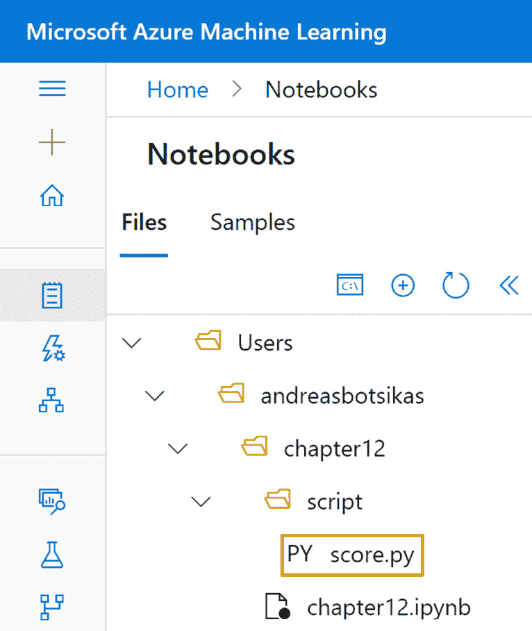
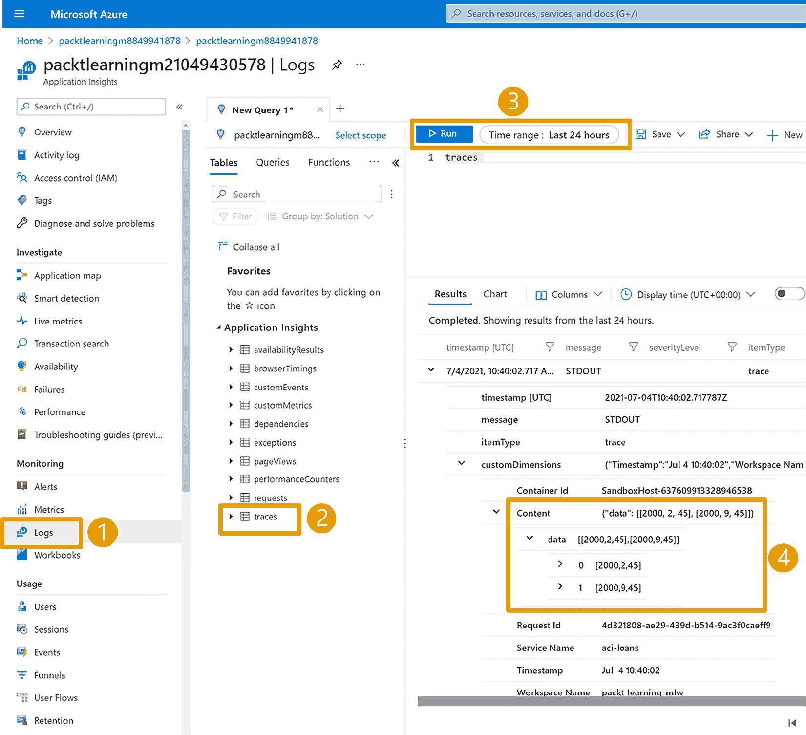

# 第十二章：*第十二章*：使用代码将模型操作化

在本章中，您将学习如何将您到目前为止在本书中训练的机器学习模型进行操作化。您将探索两种方法：通过托管 REST API 暴露实时端点，您可以用它进行推理；并扩展您的管道编写知识，以高效地在大数据上进行并行推理。您将首先在工作区中注册一个模型以跟踪该工件。然后，您将发布一个 REST API；这将使您的模型能够与第三方应用程序（如**Power BI**）集成。接下来，您将编写一个管道，以非常具成本效益的方式在几分钟内处理五十万条记录。

在本章中，我们将涵盖以下主题：

+   了解各种部署选项

+   在工作区注册模型

+   部署实时端点

+   创建批量推理管道

# 技术要求

您需要访问 Azure 订阅。在该订阅中，您需要一个`packt-azureml-rg`。您还需要有`Contributor`或`Owner`权限的`packt-learning-mlw`。如果您按照*第二章*，*部署 Azure 机器学习工作区资源*的说明进行操作，这些资源应该已经为您准备好。

此外，您需要具备基本的**Python**语言知识。本章中的代码片段适用于 Python 3.6 及更高版本。您还应当熟悉在 AzureML Studio 中使用笔记本的操作；这部分内容在*第七章*，*The AzureML Python SDK*中已有介绍。

本章假设您已在*第十章*，*理解模型结果*中生成并注册了**loans**数据集。同时也假设您已按照*第七章*，*The AzureML Python SDK*中的“与计算目标协作”部分的说明，创建了一个名为**cpu-sm-cluster**的计算集群。

重要提示

AzureML 不断更新。如果您在使用本书中的代码示例时遇到任何问题，请尝试通过在新笔记本单元格中添加以下代码来升级 AzureML SDK：

`!pip install --upgrade azureml-core azureml-sdk[notebooks]`

然后，重新启动 Jupyter 内核，如*第十章*，*理解模型结果*中“训练贷款审批模型”部分所述。此外，尝试从本书的 GitHub 页面下载最新版本的笔记本。如果问题仍然存在，可以在本书的 GitHub 页面上打开问题。

您可以在 GitHub 上的[`bit.ly/dp100-ch12`](http://bit.ly/dp100-ch12)找到本章所有的笔记本和代码片段。

# 了解各种部署选项

从*第八章*开始，我们一直在使用 Python 代码，*实验 Python 代码*。到目前为止，你已经训练了各种模型，基于指标对其进行了评估，并使用**joblib**库的`dump`方法保存了训练好的模型。AzureML 工作区允许你通过将它们注册到模型注册表中来存储和管理这些工件，正如我们在*第五章*中讨论的，*让机器进行模型训练*。注册模型允许你为保存的模型和与特定模型相关的元数据（如根据各种指标评估的性能）版本化。你将通过 SDK 学习如何在*工作区中注册模型*部分注册模型。

一旦模型被注册，你需要决定如何操作化模型，是通过部署实时端点还是创建批处理过程，如*图 12.1*所示：


图 12.1 – 从训练到操作化的路径

在模型处理传入数据的方式上，主要有两种类别：

+   你训练的分类器的`predict_proba`方法。你将在本章的*实时端点部署*部分深入了解这一场景。

+   **批量推理**：在*第五章*中，*让机器进行模型训练*，你训练了一个 AutoML 模型来预测客户流失。该模型使用了消费者过去 6 到 12 个月的活动等特征。假设你想评估所有客户并为可能流失的客户开展市场营销活动。你需要执行一次性处理过程，读取所有客户信息，计算所需特征，然后调用模型为每个客户生成预测结果。结果可以存储在 CSV 文件中，供营销部门使用。在这种方法中，你只需要模型短暂的使用时间，即仅在进行预测时。你不需要实时端点，如在*第五章*中部署的端点，因为你不需要模型进行临时推理。你可以在本章的*创建批量推理管道*部分了解更多关于这个场景的信息。

所有模型都可以用于实时推理或批处理推理。你可以决定是否需要临时的模型推理，或是一个定期生成并存储推理结果的过程。批处理模式下的模型运营化通常更具成本效益，因为你可以使用低优先级计算集群来进行推理。在这种情况下，你不需要支付实时端点基础设施的费用以等待进行实时推理。

在下一节中，你将通过训练和注册模型，开始迈向模型运营化的道路，该模型将贯穿本章的其余部分。

# 在工作区中注册模型

注册模型可以让你保留不同版本的训练模型。每个模型版本都包含工件和元数据。在这些元数据中，你可以保留对实验运行和数据集的引用。这使你能够追踪训练模型所使用的数据、训练该模型的运行 ID，以及模型工件本身的谱系，如 *图 12.2* 所示：


图 12.2 – 从训练数据集到已注册模型的谱系构建

在本节中，你将训练一个模型并将其注册到你的 AzureML 工作区中。请执行以下步骤：

1.  进入你的 AzureML Studio Web 界面中的**Notebooks**部分。

1.  创建一个名为 `chapter12` 的文件夹，然后创建一个名为 `chapter12.ipynb` 的笔记本，如 *图 12.3* 所示：

    图 12.3 – 将 chapter12 笔记本添加到你的工作文件中

1.  在单独的笔记本单元格中添加并执行以下代码片段。你将从获取工作区资源的引用开始：

    ```py
    from azureml.core import Workspace, Experiment
    ws = Workspace.from_config()
    loans_ds = ws.datasets['loans']
    experiment = Experiment(ws, "chapter-12-train")
    ```

    在前面的代码中，你获取了工作区的引用，即 `chapter-12-train`。

1.  使用以下代码将数据集拆分为训练集和验证集：

    ```py
    training_data, validation_data = loans_ds.random_split(
                           percentage = 0.8, seed=42)
    X_train = training_data.drop_columns('approved_loan') \
                .to_pandas_dataframe()
    y_train = training_data.keep_columns('approved_loan') \
                .to_pandas_dataframe().values.ravel()
    X_validate = validation_data.drop_columns('approved_loan') \
                    .to_pandas_dataframe()
    y_validate = validation_data.keep_columns('approved_loan') \
                    .to_pandas_dataframe().values.ravel()
    ```

    代码将数据集拆分为 80% 的训练数据和 20% 的验证数据。`seed` 参数初始化 `random_split` 方法的内部随机状态，允许你硬编码数据拆分，并确保每次调用此代码时生成相同的 `training_data` 和 `validation_data`。

    在这里，`X_train` 是一个 `pandas` `DataFrame`，包含 `income`、`credit_cards` 和 `age` 特征（即除 `approved_loan` 外的所有列）。

    相比之下，`y_train`包含的是你想要预测的值。首先，你加载一个只包含`approved_loan`列的`pandas` `DataFrame`。然后，你将该`DataFrame`转换为`values`属性。这个数组对每一行都有一个单一元素数组。例如，*[[0],[1]]*表示两个记录：一个未批准的贷款值为*0*，一个已批准的贷款值为*1*。接着，你调用`ravel`方法来扁平化这个数组，这样给定的例子就变成了*[0, 1]*。尽管你本可以直接使用`pandas` `DataFrame`来训练模型，但系统会发出警告消息，提示你已进行自动转换，并建议你使用`ravel`方法，正如在这个单元中所看到的那样。

    对于将用于评估模型性能的`X_validate` `DataFrame`和`y_validate`数组，重复相同的过程。

1.  使用以下代码训练一个模型并记录得到的准确性：

    ```py
    from sklearn.linear_model import LogisticRegression
    from sklearn.metrics import accuracy_score
    run = experiment.start_logging()
    sk_model = LogisticRegression()
    sk_model.fit(X_train, y_train)
    y_predicted = sk_model.predict(X_validate)
    accuracy = accuracy_score(y_validate, y_predicted)
    print(accuracy)
    run.log("accuracy", accuracy)
    run.complete()
    ```

    在这里，你从实验中的一次运行开始，如*步骤 3*所定义。你将使用这次运行来注册模型训练过程中的指标、日志和工件。然后，你训练一个`LogisticRegression`模型，并使用`accuracy_score`函数来计算训练后模型的准确性。接着，你打印出计算得到的准确性，并将其作为指标记录到运行中。最后，你`complete`该运行，以结束其执行。

1.  现在你有一个由`sk_model`变量引用的训练模型，你将使用以下代码将其保存：

    ```py
    import os
    import joblib
    os.makedirs('./model', exist_ok=True)
    joblib.dump(value=sk_model,
                filename=
                  os.path.join('./model/','model.joblib'))
    ```

    首先，你创建一个名为`model`的文件夹。文件夹的名称不重要。在该文件夹中，你使用`joblib`库将训练好的模型`dump`到一个名为`model.joblib`的文件中。

    重要提示

    `.joblib`文件扩展名不是标准的，你可以根据自己的需要使用任何名称，只要保持一致即可。有些人使用`.pkl`作为文件扩展名，这在过去是因为我们使用 Python 的内置`pickle`模块序列化 Python 对象结构。如今，**scikit-learn**推荐使用`joblib`库，因为它在序列化大型 NumPy 数组时更加高效，而这在训练模型时非常常见。

1.  现在你已经准备好工件，可以使用以下代码注册模型：

    ```py
    from sklearn import __version__ as sk_version
    from azureml.core import Model
    run.upload_folder("model", "./model")
    model = run.register_model(
            model_name="chapter12-loans",
            model_path="./model/",
            tags={ "accuracy": accuracy},
            properties={ "accuracy": accuracy},
            model_framework= Model.Framework.SCIKITLEARN,
            model_framework_version= sk_version,
            datasets=[("training", loans_ds)]
    )
    ```

    在第一行，你导入`sklearn`包的`__version__`变量，它是一个字符串，表示当前环境中加载的版本。然后，你为该变量创建一个别名（使用`as`语句），并在代码中将其作为`sk_version`引用。这就是你用来训练模型的`sklearn`库的版本。此外，你还从 AzureML SDK 导入`Model`类，以便在后续的代码中使用它作为参考。

    导入引用之后，您上传本地`./model`文件夹的内容，该文件夹在*Step 6*中创建，到运行的输出中，位于名为`model`的文件夹下。这样 AzureML 可以访问您即将注册的工件；否则，您将收到`ModelPathNotFoundException`错误。

    准备好所有先决条件后，您可以注册模型。模型将以`chapter12-loans`（`model_name` 参数）命名，使用刚刚上传到运行输出的`model`文件夹中的工件（`model_path` 参数）。您将精度指定为模型的标签（`tags` 参数）和属性（`properties` 参数）。您指示使用`SCIKITLEARN`框架（`model_framework` 参数）训练模型，并指定您使用的框架版本（`model_framework_version` 参数）。在最后一行，您指定使用`loans_ds`数据集作为`training`数据集（`datasets` 参数）。

    重要说明

    如果尝试重新运行相同单元格，则会发生*Resource Conflict*错误，因为无法覆盖已存在于运行输出文件夹中的文件。如果使用`#`作为行前缀注释掉`upload_folder`行并重新运行单元格，则会注册同一模型的新版本，使用已存在于特定运行中的工件。

1.  导航至`Model.Framework.SCIKITLEARN`。这种部署类型被认为是无代码部署，这是 AzureML 为支持的框架提供的能力。否则，您需要指定一个评分文件；这是我们将在*Deploying real-time endpoints*部分中涵盖的内容。

1.  如果要注册从互联网下载的预训练模型，则没有`Run`对象来调用`register_model`方法。您可以使用`Model`类的`register`方法，如下面的代码片段所示：

    ```py
    from azureml.core import Model
    offline_model = Model.register(
            ws,
            model_name="chapter12-pre-trained-loans",
            model_path="./model/",
            properties={"accuracy": 0.828},
            model_framework= "ScikitLearn",
            model_framework_version= "0.22.2.post1"
    ) 
    ```

    在上述代码中，在 AzureML 工作区（`ws`变量）中注册位于*local* `model`文件夹内部的工件（`model_path` 参数）作为名为`chapter12-pre-trained-loans`的模型（`model_name` 参数）。这是使用`sklearn`库的版本`0.22.2.post1`（`model_framework_version` 参数）训练的模型。另外，其精度为`0.828`，存储为模型属性。

1.  如果有一个训练新模型的流程，例如您在*Chapter 11*中创建的计划管道，您需要验证新训练的模型是否比已注册的模型具有更好的指标。如果更好，则继续注册模型。为此，您可以使用类似以下代码的代码：

    ```py
    from sklearn.linear_model import RidgeClassifier
    new_model = RidgeClassifier(solver='svd')
    new_model.fit(X_train, y_train)
    y_predicted = new_model.predict(X_validate)
    accuracy = accuracy_score(y_validate, y_predicted)
    registered_model = Model(ws, name="chapter12-loans")
    r_version = registered_model.version
    r_acc = float(registered_model.properties['accuracy'])
    if accuracy > r_acc:
        print(f"New model has better accuracy {accuracy}")
    else:
        print(f"Registered model with version {r_version}" \
               " has better accuracy {r_acc}")
    ```

    在前面的代码中，你训练了一个基于 `RidgeClassifier` 的模型，使用的是你在 *第 7 步* 中注册的 `chapter12-loans`。`registered_model` 变量与 *第 7 步* 中获得的 `model` 变量具有相同的引用；不过，这次你是通过 `Model` 类创建该引用，而不是通过注册模型来创建。你从该模型中读取 `version` 属性和 `accuracy` 属性。你可以从模型的 `tags` 字典中检索准确度，而不是从 `properties` 字典中。由于标签和属性以字符串形式存储值，因此你需要将准确度值转换为浮动类型。接下来，你将新模型的准确度与已注册模型的准确度进行比较（已注册模型的准确度存储在 `r_acc` 变量中）。如果新模型优于已注册的模型，则会打印一条消息。在这种情况下，你需要重复 *第 6 步* 和 *第 7 步* 来存储模型，并注册新版本的改进模型。

    重要提示

    要注册一个新版本的模型，你只需使用相同的名称注册新模型。通过使用相同的名称注册新模型，AzureML 会自动为你创建一个新版本。

1.  可选地，作为最后一步，使用以下代码删除本地存储的模型：

    ```py
    import shutil
    shutil.rmtree('./model',ignore_errors=True)
    ```

    这段代码会删除你在 *第 6 步* 中创建的 `model` 文件夹，包括你不再需要的序列化模型。`ignore_errors` 参数允许你即使文件夹不存在也能运行此单元，而不会引发错误。

在本节中，你在 Jupyter 内核中训练了一个模型。然后，你在工作区内注册了该模型。你本可以在 `train_model.py` 脚本中使用相同的注册代码，这个脚本是你在*第十一章*中的 *创建管道* 部分的 *第 11 步* 中编写的，*与管道一起工作*，用来注册 `run=Run.get_context()` 方法，然后你需要上传序列化的模型并注册模型，就像你在 *第 7 步* 中所做的那样。作为额外的活动，尝试修改 `train_model.py` 脚本和 `chapter11.ipynb`，创建一个管道，将正在训练的模型在管道中进行注册。此活动的潜在解决方案可以在 `train_model_and_register.py` 脚本中找到，位于 GitHub 仓库的 `step02` 文件夹中，链接为：[`bit.ly/dp100-ch11`](http://bit.ly/dp100-ch11)。

在下一节中，你将开始将本节中注册的模型转化为可操作的模型，通过将其部署为一个 Web 服务来提供实时推断服务。

# 部署实时端点

假设你有一个电子银行解决方案，其中包含一个让客户申请贷款的流程。你希望适当地设定客户的预期，并为可能的拒绝做准备。当客户提交贷款申请表时，你希望调用你在*在工作区注册模型*部分中注册的模型，即名为**chapter12-loans**的模型，并传入客户在申请表上填写的信息。如果模型预测贷款将不会被批准，贷款请求的确认页面将出现一条消息，提醒客户贷款请求可能会被拒绝。

*图 12.5*展示了一个过于简化的架构，用以描绘从客户到模型实时端点的请求流向：


图 12.5 – 一个过于简化的电子银行架构，展示了从客户到模型的请求流向

部署模型最简单的方法是通过 AzureML 提供的无代码部署方式，适用于特定的机器学习框架，包括你在上一部分中使用的`sklearn`库。请按照以下步骤操作：

1.  转到`chapter12.ipynb`笔记本，添加以下代码以获取对你在上一部分中创建的**chapter12-loans**模型的最新版本的引用：

    ```py
    from azureml.core import Workspace, Model
    ws = Workspace.from_config()
    model = Model(ws, name="chapter12-loans")
    ```

1.  要部署实时端点，请使用以下代码：

    ```py
    no_code_service = Model.deploy(ws, "no-code-loans",
                                   [model])
    no_code_service.wait_for_deployment(show_output=True)
    ```

    该代码部署一个名为`no-code-loans`的新实时端点服务，然后等待部署完成。

1.  要获取新部署的端点的评分 URI，请使用以下代码：

    ```py
    print(no_code_service.scoring_uri)
    ```

    这是一个格式为[`guid.region.azurecontainer.io/score`](http://guid.region.azurecontainer.io/score)的 URL，接受带有**JSON**负载的**POST**请求，如下所示：

    ```py
    {"data": [[2000,2,45]]}
    ```

    该负载将触发一个推理请求，针对一位月收入 2000 美元、拥有 2 张信用卡并且 45 岁的客户。你可以使用**Postman**或**curl**等工具来构造这样的 HTTP 请求，并调用端点。

1.  与其使用如`curl`之类的工具发起 HTTP 请求，你还可以使用`no_code_service`引用，并通过传入通常会发送给服务的 JSON 负载来调用`run`方法：

    ```py
    import json
    input_payload = json.dumps({
        'data': [[2000, 2, 45], [2000, 9, 45]],
        'method': 'predict'
    })
    output = no_code_service.run(input_payload)
    print(output)
    ```

    上述代码导入了`json`库，它帮助你将对象序列化为 JSON 字符串。你使用`dumps`方法创建负载。请注意，这个负载与*步骤 3*中你看到的简单版本略有不同。在这个示例中，你传递了两个客户的信息：一个是之前传递的客户，另一个拥有*9*张信用卡，而不是*2*张。此外，你还指定了要调用的方法。默认情况下，模型的方法名是`predict`，这是你在前几章中用来进行推理的方法。最后，你打印输出，应该看到类似以下的结果：

    ```py
    {'predict': [0, 1]}
    ```

    上述结果显示，第一个贷款将被拒绝，而第二个贷款将被批准。

    大多数分类模型提供了另一种方法，叫做`predict_proba`，它返回一个包含每个标签概率的数组。在`loans`审批的情况下，这个数组只包含两个概率，且总和为 1，也就是贷款被批准的概率和贷款被拒绝的概率。如果你将方法名从`predict`更改为`predict_proba`并重新执行单元格，你将得到以下结果：

    ```py
    {'predict_proba': [[0.998, 0.002], [0.173, 0.827]]}
    ```

    上述结果显示，模型 99.8%确定第一个贷款将被拒绝，82.7%确定第二个贷款将被批准。

1.  可选地，导航到`chapter12-demanding-loans`。你指定它需要`1`个 CPU 和`1.5`GB 的 RAM。请注意，如果你在*步骤 11*中的*在工作区注册模型*部分删除了`model`文件夹，那么这段代码将无法注册新模型，因为它找不到模型文件。

1.  为了节省成本，你应该使用以下代码删除服务：

    ```py
    no_code_service.delete()
    ```

到目前为止，你已经使用无代码方法部署了一个实时端点，这种方法将模型作为容器实例进行部署。只有当模型使用特定的支持模型进行训练时，这种方法才可行。在下一部分，你将学习如何使用更高级的选项来部署模型。

## 理解模型部署选项

在前面的部分，你使用无代码的方法部署了一个模型。在幕后，AzureML 使用了一个包含所有必需模型依赖项的`environment`，在我们的例子中是`sklearn`，生成了一个 Python 脚本，用于加载模型并在数据到达端点时进行推理，并使用`AciServiceDeploymentConfiguration`类发布了一个 ACI 服务。

如果你有一个使用不支持的框架训练的模型，或者你想更好地控制部署模型，你可以使用 AzureML SDK 类来部署模型，如*图 12.7*所示：


图 12.7 – 实时端点部署所需的组件

这里，**InferenceConfig**类指定了模型的依赖项。它需要一个入口脚本，该脚本将加载模型并处理传入的请求，以及一个脚本执行环境。该环境包含模型加载和进行推断所需的所有依赖项。

入口脚本应包含以下两个方法：

+   `Init`：在此步骤中，脚本将训练好的模型加载到内存中。根据您将模型的状态存储到磁盘的方式，您可以使用相应的方法将模型反序列化。例如，如果您使用`joblib`库序列化了模型，则可以使用相同库的`load`方法将其加载到内存中。一些模型提供自己的序列化和反序列化方法，但过程保持一致；训练好的模型的状态保存在一个或多个文件中，您可以稍后使用这些文件将模型加载到内存中。根据模型的大小，初始化阶段可能需要相当长的时间。较小的`sklearn`模型通常在几毫秒内加载到内存中，而较大的神经网络可能需要几秒钟的时间来加载。

+   `run`：这是实时端点接收数据集以进行推断时调用的方法。在此方法中，您必须使用`init`代码中加载的模型，调用它提供的预测方法，对传入的数据进行推断。如前所述，大多数模型提供`predict`方法，您可以调用并将要进行推断的数据传入。大多数分类模型还提供一个附加方法，称为`predict_proba`，它返回每个类别的概率。AutoML 预测模型提供`forecast`方法，而不是`predict`方法。在神经网络中，进行预测的方法有所不同。例如，在 TensorFlow 的第一个版本中，您必须通过`session.run()`方法调用来进行预测。

一旦配置了模型依赖项，您需要决定将模型部署到何处。AzureML SDK 提供了三种类：`LocalWebserviceDeploymentConfiguration`、`AciServiceDeploymentConfiguration`和`AksServiceDeploymentConfiguration`。这些类允许您将模型部署到本地机器、ACI 或**Azure Kubernetes 服务**（**AKS**），如*图 12.8*所示：


图 12.8 – 为您的模型选择合适的计算目标

正如您可能已经理解的那样，在*图 12.8*中，您可以通过指定您希望服务监听的端口来部署到本地计算机。这是一种很好的方法，可以调试模型加载的潜在问题，或验证与本地计算机上其他系统的集成。下一个选项是使用 ACI，它用于测试环境或小规模的生产环境。在`AciServiceDeploymentConfiguration`类中，您只能使用 CPU，而不能使用 GPU。您可以通过将`auth_enabled`参数设置为`True`来使用基于密钥的认证保护端点。此认证方法要求您将静态密钥作为**Authorization**头部传递到 HTTP 请求中。

另一方面，`AksServiceDeploymentConfiguration`将在 AKS 集群内部署服务。这使得您可以使用 GPU，前提是您的模型能够利用 GPU，并且您要部署的集群有支持 GPU 的节点。该部署配置允许您选择基于密钥的认证或基于令牌的认证。基于令牌的认证要求最终用户从保护 AzureML 工作区的**Azure Active Directory**获取访问令牌，这样就可以访问部署在其中的端点。与基于密钥的认证不同，基于令牌的认证令牌生命周期较短，并隐藏了调用者的身份，而基于密钥的认证是 ACI 中唯一可用的选项。AKS 部署的另一个生产就绪特性是能够根据传入请求数量的波动动态扩展和缩减。在当前的电子银行场景中，客户倾向于在工作时间访问电子银行解决方案，而在夜间系统几乎处于空闲状态。此外，在月底，传入流量会达到峰值。在这种工作负载下，您希望能够根据需要扩展端点，以适应流量的增加。当流量显著增加时，AKS 可以自动启动多个模型容器，并在它们之间进行负载均衡。当流量恢复正常时，它可以仅保留一个容器作为潜在流量的热备份。

现在，您对部署选项有了更好的理解，接下来您将使用在*图 12.7*中看到的类，在 ACI 中部署相同的模型：

1.  首先，您需要创建的是入口脚本。在**chapter12**文件夹下，创建一个名为**script**的新文件夹，并将一个**score.py**文件放入其中，如*图 12.9*所示：

    图 12.9 – 为实时端点添加 score.py 文件

1.  在`init`方法中，你通过`AZUREML_MODEL_DIR`环境变量获取序列化模型的路径。当 AzureML 启动用于提供模型的 Docker 镜像时，该变量指向模型所在的文件夹；例如，`/tmp/azureml_umso8bpm/chapter12-loans/1`可能是你找到`chapter12-loans`模型第一版的地方。在该文件夹中，实际的文件`model.joblib`位于你在*部署实时端点*部分的*步骤 5*中上传的`model`文件夹中。你使用`os.path.join`来获取模型的最终路径，然后将模型加载到名为`model`的`global`变量中。如果你想使用 AzureML SDK 来获取模型的位置，你可以使用`model_path = Model.get_model_path(model_name, version=version)`，该方法在底层使用相同的环境变量。然而，请注意，你需要在环境中安装 AzureML SDK，以便能够导入其中的`Model`类；而前面的代码不需要这么做。

    重要说明

    请注意，你正在使用`print`将模型路径和传入的`raw_data`写入控制台。你将在*通过应用程序洞察进行监控*部分学习如何查看这些消息。

    在`run`方法中，你使用`try` `except`块来捕捉在尝试读取请求输入时可能发生的错误。如果发生这样的错误，异常会被序列化为字符串（使用`str()`方法），并返回给最终用户。请注意，将异常返回给调用者是一种安全反模式，因为你可能会不小心向潜在的攻击者暴露有价值的信息，但在调试时这非常有用。你可以使用`print`语句或者更高级的库来代替返回错误消息，例如`try`块，在该块中，你会反序列化传入的 JSON 负载，如*部署实时端点*部分的*步骤 3*所示。然后，你调用通过`init`方法加载到内存中的`model`对象的`predict`方法。接着，你将模型结果作为一个列表返回，并将其序列化为数组。

    重要说明

    你永远不会直接调用`init`方法或`run`方法。AzureML 会在最终的 Docker 镜像中放入另一段代码，那就是 HTTP 推理服务器。该服务器负责在服务器启动时调用你的`init`方法，并将传入的 HTTP 数据传递到`run`方法中。此外，你在`run`方法中返回的结果将被序列化为**JSON**并返回给调用者。

1.  接下来你需要的是一个包含所有必要依赖项的`Environment`，用于运行你创建的`score.py`脚本。打开你的`chapter12.ipynb`笔记本并在新单元格中添加以下代码：

    ```py
    from azureml.core import Environment
    from azureml.core.conda_dependencies import CondaDependencies 
    import sklearn
    myEnv= Environment(name="sklearn-inference")
    myEnv.Python.conda_dependencies = CondaDependencies()
    myEnv.Python.conda_dependencies.add_conda_package(
                   f"scikit-learn=={sklearn.__version__}")
    myEnv.Python.conda_dependencies.add_pip_package(
                   "azureml-defaults>=1.0.45")
    ```

    在前面的代码中，你创建了一个`Environment`，如在*第八章*中演示的，*使用 Python 代码进行实验*。你添加了`scikit-learn`、`azureml-defaults`、`pip`包，这些包包含了将模型作为 Web 服务托管所需的功能。由于你正在构建自己的`Environment`，因此需要添加此包，并至少使用 1.0.45 版本。这是运行评分脚本时你可以使用的最低环境。此外，AzureML 还提供了一个已策划的环境，例如`AzureML-sklearn-0.24.1-ubuntu18.04-py37-cpu-inference`，它包含了使用训练过的`sklearn`模型（版本 0.24.1）进行推理请求所需的一切。

1.  你已经定义了`InferenceConfig`类所需的一切。添加一个新的单元格，并输入以下代码以将所有内容组合起来：

    ```py
    from azureml.core.model import InferenceConfig
    inference_config = InferenceConfig(
                          source_directory= "./script",
                          entry_script='score.py', 
                          environment=myEnv)
    ```

    这段代码创建了你在模型推理时所需要的配置。它使用位于`script`文件夹中的`score.py`文件，并在*步骤 3*中定义的`myEnv`环境中执行该文件。

1.  现在你已经完成了*图 12.7*中所示的三个组件中的两个。在此步骤中，你将创建一个`AciServiceDeploymentConfiguration`类，并将模型部署到 ACI。在新单元格中，添加以下代码：

    ```py
    from azureml.core.webservice import AciWebservice
    deployment_config = AciWebservice.deploy_configuration(
                        cpu_cores=1, memory_gb=1)
    service = Model.deploy(ws, "aci-loans", [model], 
                    inference_config, deployment_config)
    service.wait_for_deployment(show_output=True)
    ```

    在这里，我们使用`AciWebservice`类来获取你想要部署的容器实例的部署配置。在前面的代码中，你指定了需要 1 个 CPU 核心和 1GB 的内存。然后，你将模型部署到一个名为`aci-loans`的新服务中，并等待部署完成。

    重要提示

    如果在尝试部署容器时遇到问题，你可以查看打印输出中的错误信息，或使用`service.get_logs()`方法。很可能是`score.py`脚本中的代码库出现了问题。你可以通过安装`azureml-inference-server-http` pip 包并运行以下命令来在本地测试代码：

    `5001`。调试这种情况的另一种方法是使用`LocalWebservice`，稍后我们将讨论。如果你的代码没有问题，那么可能是内存问题。这应该可以在服务日志中看到。在这种情况下，请参阅下一节，了解如何对模型进行分析，以确定其资源需求。

1.  要测试已部署的服务，你可以使用以下代码，这与前一节中使用的代码类似：

    ```py
    import json
    input_payload = json.dumps({
        'data': [[2000, 2, 45]]
    })
    output = service.run(input_payload)
    print(output)
    ```

    请注意，负载中的`method`属性（你在*步骤 4*中使用的*部署实时端点*部分）不会对这次部署产生任何影响，并且会从负载中省略。如果你想支持此属性，则需要在`score.py`文件的`run`方法中编写代码来读取该属性并调用模型的相应方法。

1.  为了节省成本，在完成测试后使用以下代码删除服务：

    ```py
    service.delete()
    ```

1.  如果你想在本地计算机上部署相同的服务，可以使用以下代码：

    ```py
    from azureml.core.webservice import LocalWebservice
    deployment_config = LocalWebservice.deploy_configuration(port=1337)
    service = Model.deploy(ws, "local-loans", [model], inference_config, deployment_config)
    service.wait_for_deployment()
    ```

    你不再使用`AciWebservice`类，而是使用`LocalWebservice`来创建一个监听端口`1337`的本地服务。如果你在本地计算机上运行笔记本，你需要访问`http://localhost:1337`并查看服务端点的健康状况。现在，在 AzureML 笔记本中运行了这段代码，本地计算机就是你正在使用的计算实例。要查看名为`service.delete()`的计算实例的端口`1337`，请参见*步骤 7*。

类似于`AciWebservice`和`LocalWebservice`，你还可以使用`AksWebservice`来创建`AksServiceDeploymentConfiguration`。在部署时，你需要在`Model.deploy`方法中指定一个额外的参数，即`deployment_target`参数。这个参数允许你指定想要将模型部署到的`AksCompute`推理集群。

除了你之前看到的本地计算机、ACI 和 AKS 部署选项，AzureML 还提供了多种其他部署选项。例如，**Azure Functions**允许你在无服务器架构中运行模型，**Azure App Services**将模型托管为传统的 Web 应用程序，随时准备处理传入的请求。另一方面，你可以使用**IoT Edge**，它允许你将服务部署到边缘设备，如树莓派或基于 GPU 的 Jetson Nano。最后，你甚至可以将模型打包到 Docker 容器镜像中，这可以在隔离的空气间数据中心内运行。

在本节中，你已部署了一个 ACI 实时推理端点，要求 1 个 CPU 核心和 1 GB 的内存。在接下来的章节中，你将探讨如何通过对模型性能的分析来优化资源需求。

## 对模型资源需求的分析

在将某些东西投入生产之前，执行压力测试是非常常见的做法。本质上，这种测试会向实时端点发送大量请求，并衡量该端点的响应能力和性能。你可以对模型进行类似的操作，了解它们在预期的性能下需要什么类型的资源。例如，你可能需要确保所有推理都在 200 毫秒内完成。

在本节中，你将创建一个测试数据集，该数据集将用于压力测试实时端点并观察其性能。数据集中的每一行将包含一个单独的推理请求。

打开你的`chapter12.ipynb`笔记本，并执行以下步骤：

1.  在一个新单元格中，添加以下代码：

    ```py
    loans_ds = ws.datasets['loans']
    prof_df = loans_ds.drop_columns('approved_loan') \
                            .to_pandas_dataframe()
    prof_df['sample_request'] = \
        "{'data':[[" + prof_df['income'].map(str) \
      + ","+ prof_df['credit_cards'].map(str) \
      + "," + prof_df['age'].map(str) + "]]}"
    prof_df = prof_df[['sample_request']]
    prof_df.head()
    ```

    这段代码加载`loans`数据集，删除我们不需要的`approved_loan`列，并将其加载到`pandas`的`DataFrame`中。接着，你创建一个名为`sample_request`的新列，将各个列连接起来，生成如下字符串：

    ```py
    {"data": [[2000,2,45]]}
    ```

    然后，你只保留该列并打印前五行，以验证请求是否符合预期。请注意，数据是否为我们用来训练模型的数据并不重要。它甚至可以是随机记录。我们关心的仅仅是将要发出的请求数量，而不是推断结果的样子。

1.  使用以下代码将新创建的数据集存储在工作区中：

    ```py
    from azureml.core import Dataset
    dstore = ws.get_default_datastore()
    loan_req_ds = Dataset.Tabular.register_pandas_dataframe(
        dataframe=prof_df,
        target=(dstore,"/samples/loans-requests"),
        name="loans-requests",
        description="Sample requests for the loans model")
    ```

    上述代码将 DataFrame 注册为`loans-requests`数据集。数据存储在默认数据存储中的`/samples/loans-requests`目录下。`loans_req_ds`变量引用了新注册的`tabular`数据集。

1.  现在你已经拥有了必要的数据，可以使用以下代码开始模型分析过程：

    ```py
    profile = Model.profile(ws,
                  'chapter12-loan',
                  [model], inference_config,
                  input_dataset=loan_req_ds,
                  cpu=2, memory_in_gb=1)
    profile.wait_for_completion(True)
    print(profile.get_details())
    ```

    请注意，profile 方法需要在前一部分模型部署时使用的`model`和`inference_config`。此外，你还需要指定用于分析的 ACI 大小。在前面的代码中，你请求了 2 个 CPU 和 1 GB 的 RAM。分析可能需要较长时间，有时超过 20 分钟。分析完成后，你将查看结果，包括作为`recommendedCpu`的 1 个 CPU 和作为`recommendedMemoryInGB`值的 0.5 GB RAM。

    重要说明

    模型分析的名称在工作区内应是唯一的。如果你在不更改名称的情况下重新运行*步骤 3*的代码，将会发生错误。

在后台，执行了一个名为`ModelProfile`的实验，它会部署一个带有模型的 ACI 服务。服务启动并运行后，过程会发送你在**loan_req_ds**数据集中指定的 500 个请求，并记录模型的响应时间，同时监控已部署容器实例的 CPU 和内存使用情况。根据这些统计数据，AzureML 可以建议你为实时端点配置的推荐 CPU 和内存。

在下一部分，你将使用这些值来部署 ACI 服务。随后，你将探讨如何在部署后监控其性能，并使用**Application Insights**记录传入的数据。

## 使用 Application Insights 进行监控

正如你在*第二章*中学到的，*部署 Azure 机器学习工作区资源*，当你部署 AzureML 工作区时，会在同一资源组中部署一个名为`packtlearningm<random_number>`的应用程序洞察账户。这个 Azure 资源使你能够监控应用程序的性能。特别是对于像你正在部署的实时端点这样的 Web 应用程序，应用程序洞察可以让你监控请求和响应时间、端点的失败率、代码中可能引发的任何异常，甚至是你希望从代码库中输出的日志痕迹。

在前面的*理解模型部署选项*部分中，你创建了一个包含几个`print`语句的`score.py`文件。这些信息被写入端点的控制台中，可以通过调用`service.get_logs()`方法或者导航到**部署日志**标签页来查看，如*图 12.10*所示：


图 12.10 – 容器实例控制台中记录的模型路径和传入的原始数据

这种方法的问题在于日志不会持久化。如果你重新部署容器实例，日志将会丢失。而且，如果你部署了多个模型，你将需要一个集中式的地方来监控它们。应用程序洞察为你的解决方案带来了这些及更多的好处。

返回你的`chapter12.ipynb`笔记本，重新部署 ACI 容器并为其启用应用程序洞察。在一个新的单元格中，添加以下代码：

```py
from azureml.core.webservice import AciWebservice
deployment_config = AciWebservice.deploy_configuration(
   cpu_cores=1, memory_gb=0.5, enable_app_insights= True)
service = Model.deploy(ws, "aci-loans", [model], inference_config, deployment_config)
service.wait_for_deployment(show_output=True) 
```

注意，你正在使用在*分析模型资源需求*部分中推荐的`1`个 CPU 核心和`0.5`GB 的内存。另外，注意你正在通过传递`enable_app_insights=True`参数来在部署配置中启用应用程序洞察。如果你已经部署了服务并希望启用应用程序洞察，你可以使用以下代码更新其配置：

```py
service.update(enable_app_insights=True)
```

让我们向服务发送几个请求，以便更好地理解应用程序洞察能为你做些什么。在一个新的单元格中，添加以下代码：

```py
import json
input_payload = json.dumps({'data': [[2000, 2, 45], [2000, 9, 45]]})
for x in range(10):
   print(service.run(input_payload))
```

这段代码向服务发送了*10*个相同的请求，一个接一个地生成一些人工流量，这些流量应该会被记录在应用程序洞察中。找到指向 Azure 门户并直接进入应用程序洞察资源的 URL 的最简单方法是访问端点的信息页面，如*图 12.11*所示：


图 12.11 – 与你的 AzureML 工作区关联的应用程序洞察 URL

请注意，这个**应用程序洞察 URL**链接并不是针对**aci-loans**部署的特定链接。这个链接对于你所有的实时端点都是相同的，允许你集中监控所有的实时端点。点击这个链接将带你进入应用程序洞察，如*图 12.12*所示：


图 12.12 – 应用程序洞察显示你用最后一段代码发送的 10 个请求

在此仪表板上，你可以点击图表并深入查看信号详情；或者你可以查看控制台中应用程序写入的所有追踪。要查看它们，请导航到**监视** | **日志**，点击**追踪**，选择你想调查的时间范围，然后点击**运行**按钮。你应该能在结果中看到所有**STDOUT**消息，并可以深入查看详细信息，如*图 12.13*所示：



图 12.13 – 阅读你模型实时端点在应用程序洞察中发出的所有追踪

你可以在**日志**部分使用一种强大的类似 SQL 的语言——**Kusto**，来创建复杂的查询。你甚至可以根据这些查询创建自动化警报，例如，当过去 30 分钟内你的贷款拒绝次数超过 100 次时，系统会通知你。

重要提示

应用程序洞察支持每次最多 64 KB 的小负载日志。如果你计划记录超过 64 KB 的数据，例如，一个包含超过 64 KB 数据的小批量输入，你应该考虑使用 AzureML SDK 中的`DataCollector`类。该类允许你将数据直接记录到存储帐户中；但是，只有在 AKS 中部署时，才可使用此类。

在进入下一部分之前，请不要忘记删除已部署的服务，以防止 ACI 服务产生意外的费用。你可以在工作室体验中的**资产** | **端点**列表中删除该服务，或者通过以下代码行删除服务：

```py
service.delete()
```

在本节中，你学习了如何在将实时端点部署到生产环境后进行监控。在*图 12.12*中，你可能注意到有几个`swagger`文件。在下一部分中，你将学习如何修复那些失败的请求，并实现与希望消费你模型结果的第三方应用程序的丰富集成。

## 与第三方应用程序集成

到目前为止，你已经部署了一个接受数组数组作为输入的 Web 服务。这是一个晦涩的输入，你需要向任何想要使用你实时端点的人解释它。在*第五章*《让机器进行模型训练》中，你了解了可以用来生成代码以自动消费你的端点的`swagger`文件。为了生成这样的文件，你可以使用开源的`inference-schema`包，并用元数据装饰你的代码，从而驱动`swagger.json`文件的生成。

为了使你的模型更容易被第三方应用程序消费，你应该接受以下有效负载：

```py
{"data":[{"income": 2000, "credit_cards": 2, "age": 45}]}
```

在这里，你需要创建一个新的评分文件版本。与其克隆并编辑现有的评分文件，不如直接从 GitHub 页面下载修改后的`score_v2.py`版本，正如*技术要求*部分所提到的那样。在**Notebooks**部分，右键点击位于**script**文件夹中的**score.py**文件，选择**Duplicate**命令，复制该文件，如*图 12.14*所示：


图 12.14 – 创建入口脚本的 v2 文件

将克隆文件命名为`score_v2.py`，并修改代码，使其如下所示：

```py
import os
import joblib
from inference_schema.schema_decorators import input_schema, output_schema
import pandas as pd
from inference_schema.parameter_types.pandas_parameter_type import PandasParameterType
import numpy as np
from inference_schema.parameter_types.numpy_parameter_type import NumpyParameterType
```

在脚本文件的开始部分，你导入了额外的辅助类，这些类稍后会在代码中使用。请注意，你不再需要`json`模块：

```py
def init():
    global model
    model_path = os.path.join(os.getenv(\
"AZUREML_MODEL_DIR"), "model/model.joblib")
    model = joblib.load(model_path)
```

你不会修改`init`方法：

```py
data_sample = pd.DataFrame(
    {
        "income": pd.Series([2000.0], dtype="float64"),
        "credit_cards": pd.Series([1], dtype="int"),
        "age": pd.Series([25], dtype="int")
    }
)
output_sample = np.array([0])
```

在前面的代码块中，你创建了一个`pandas` `DataFrame`，它将作为传入请求的`data`属性中包含的对象的示例。这个`data_sample`对象有一个`income`特征，它是`float64`类型，以及`credit_cards`和`age`特征，它们是整数类型。类似地，对于输出，你将`output_sample`定义为一个 NumPy 数组或数值。你可以在以下代码块的装饰器中使用`data_sample`和`output_sample`对象：

```py
@input_schema("data", PandasParameterType(data_sample))
@output_schema(NumpyParameterType(output_sample))
def run(data):
    try:
        result = model.predict(data)
        return result.tolist()
    except Exception as e:
        error = str(e)
        return error
```

在这里，你使用`data_sample`对象和`@input_schema`装饰器。此外，你使用`PandasParameterType`，这表示紧随其后的名为`pandas` `DataFrame`的参数遵循由`data_sample`示例定义的模式。你使用`@output_schema`装饰器指定你的服务返回一个 NumPy 数组作为输出，类似于`output_sample`。一旦你配置了这些模式，你会注意到在`run`方法中不需要再反序列化传入的有效负载。`data`对象已经是一个反序列化后的`pandas` `DataFrame`。

如果你想处理二进制文件而不是表格数据，例如处理图像，你可以使用`@rawhttp`指令，它会将原始的 HTTP 请求传递给你的`run`方法。使用纯 HTTP 请求可以给你更大的灵活性，包括设置响应头；这是配置诸如**跨域资源共享**（**CORS**）等安全功能时所必需的。你可以在本章的*进一步阅读*部分找到更多关于这些高级场景的资源。

现在你已经准备好`score_v2.py`脚本文件的代码，你需要发布实时端点。要为新的评分功能创建实时端点，请在笔记本中的一个单元格内添加以下代码：

```py
from azureml.core.model import InferenceConfig
from azureml.core.webservice import AciWebservice
myEnv.Python.conda_dependencies.add_pip_package("inference_schema[pandas-support]>=1.1.0")
inference_config = InferenceConfig(source_directory= "./script", entry_script='score_v2.py', environment=myEnv)
deployment_config = AciWebservice.deploy_configuration( cpu_cores=1, memory_gb=0.5)
service = Model.deploy(ws, "aci-loans", [model], inference_config, deployment_config)
service.wait_for_deployment(show_output=True)
```

在前面的代码中，你将`inference_schema` pip 包附加到你在*理解模型部署选项*部分中定义的`myEnv`依赖项中。请注意，你安装该包时使用了`pandas-support`扩展，这会包括`pandas`包。你的`score_v2.py`文件依赖的`numpy`依赖项会由 pip 自动安装，因为它是`pandas`包的依赖项。

接下来，你需要指定使用`score_v2.py`入口脚本并部署新服务。新服务将提供一个`swagger.json`文件，供第三方应用程序（如 Power BI）读取并自动了解如何调用你的模型。你可以在端点页面上获取指向该文件的 Swagger URI，如*图 12.11*所示。在端点页面上，你应该注意到**测试**选项卡已增强，指导你提供调用模型所需的字段。在代码方面，你可以使用以下负载调用模型：

```py
import json
service = ws.webservices['aci-loans']
input_payload = json.dumps({"data":[
    {"income": 2000,"credit_cards": 2,"age": 45},
    {"income": 2000, "credit_cards": 9,"age": 45}
]})
print(service.run(input_payload))
input_payload = json.dumps({'data': [
    [2000, 2, 45], [2000, 9, 45]
]})
print(service.run(input_payload))
```

在进入下一节之前，确保使用以下代码删除你刚刚部署的 ACI 服务：

```py
service.delete()
```

到目前为止，你一直在部署能够通过 REST API 处理临时推理请求的实时推理端点。在下一节中，你将学习如何部署一个批量推理管道，它能够使用`ParallelRunStep`并行处理大数据。

# 创建批量推理管道

在*第十一章*《使用管道》中，你学会了如何创建多个步骤的管道并进行编排。这些管道可以通过 REST API 进行调用，类似于你在上一节中创建的实时端点。一个关键的区别是，在实时端点中，基础设施是持续开启的，等待请求到达，而在发布的管道中，集群仅在管道被触发后才会启动。

您可以使用这些管道来协调位于数据集中的数据的批处理推理。例如，假设您刚刚训练了本章中使用的`loans`模型。您希望对所有待处理的贷款请求运行该模型，并存储结果；这是为了便于您实施一个电子邮件营销活动，针对那些可能会被拒绝贷款的客户。最简单的方法是创建一个单独的`PythonScriptStep`，按顺序处理每条记录并将结果存储在输出文件夹中，正如您在*第十一章*中学到的那样，*工作与管道*。但是，您也可以将数据集拆分为多个批次，然后让它们在您的集群中每个节点内部的多个进程中并行处理，如*图 12.15*所示：


图 12.15 – 通过将大数据集拆分成较小的批次并并行处理它们来进行并行处理

在本节中，您将创建一个批处理处理管道，该管道将使用您在本章中训练的`chapter12-loans`模型进行推理。您已经有一个名为`loans`的数据集，但它太小，无法展示`ParallelRunStep`如何通过并行化推理来加速处理。您将通过重复复制相同的 DataFrame 生成一个新的数据集，大小是原来的 1,024 倍。然后，您将创建一个类似于在*第十一章*中创建的管道，*工作与管道*。这一次，您将使用`ParallelRunConfig`和`ParallelRunStep`类来并行化数据集的处理。配置类需要一个入口脚本，类似于您在上一节中看到的入口脚本。此外，您还需要定义以下两个方法：

+   `init()`: 此方法加载模型并为即将到来的批次准备处理过程。此方法不期望有任何输出。

+   `run(mini_batch)`: 此方法执行实际的数据处理。此方法将被多次调用，每次传递不同的`mini_batch`参数。您必须返回一个数组，其中包含每个成功处理的项目的行。例如，如果`mini_batch`参数包含 100 行，而您返回了 98 项数据，则表示您未能处理其中 2 条记录。如果您处理的是`TabularDataset`，则`mini_batch`参数可以是一个`pandas` `DataFrame`，如果您处理的是`FileDataset`，则可以是包含您需要处理的文件路径的数组。

导航到您的`chapter12.ipynb`笔记本，并执行以下步骤：

1.  从获取对工作区、数据集和您将用于管道的计算集群的引用开始：

    ```py
    from azureml.core import Workspace
    ws = Workspace.from_config()
    loans_ds = ws.datasets['loans']
    compute_target = ws.compute_targets['cpu-sm-cluster']
    ```

    代码应该是自解释的，因为您已经在*第十一章*《与管道一起工作》中使用过它。

1.  基于`loans`数据集创建一个新的、更大的数据集：

    ```py
    from azureml.core import Dataset
    loans_df = loans_ds.drop_columns('approved_loan') \  
                       .to_pandas_dataframe()
    for x in range(10):
        loans_df = loans_df.append(loans_df)
    dstore = ws.get_default_datastore()
    pending_loans_ds =\
    Dataset.Tabular.register_pandas_dataframe(
        dataframe=loans_df,
        target=(dstore,"/samples/pending-loans"),
        name="pending-loans",
        description="Pending loans to be processed")
    ```

    在前面的代码中，您正在将`loans`的`DataFrame`加载到内存中，但不包含`approved_loan`列。这个数据集只有 500 行。然后，您将数据集追加到自身 10 次。这将创建一个包含 512,000 行的更大数据集，您将其注册为`pending-loans`。

1.  现在，是时候创建处理该数据集的脚本了。在`chapter12`文件夹中，添加一个`pipeline_step`文件夹，然后添加一个名为`tabular_batch.py`的文件，内容如下：

    ```py
    from azureml.core import Model
    import joblib
    def init():
        global model
        model_path = Model.get_model_path("chapter12-loans")
        model = joblib.load(model_path)
    def run(mini_batch):
        print(mini_batch.info())
        mini_batch["approved"] = model.predict(mini_batch)
        return mini_batch.values.tolist()
    ```

    这个脚本有两个方法，如前所述。在`init`方法中，您使用`Model`类的`get_model_path`方法来获取您至今使用的模型的路径。从脚本的角度来看，模型将存储在脚本运行的同一台计算机的文件夹中。然后，您使用`joblib`将模型加载到名为`model`的`global`变量中。在`run`方法中，您打印传入 DataFrame 的大小，然后创建一个名为*approved*的新列，存储所有模型推断的结果。您返回一个包含每行处理记录的四元素数组的列表，类似于以下记录：

    ```py
    [7298, 2, 35, 1]
    [4698, 7, 70, 0]
    ```

    如果您处理的是`FileDataset`而不是本节中处理的`TabularDataset`，那么相应的`file_batch.py`文件会如下所示：

    ```py
    def init():
        print('Load model here')
    def run(mini_batch):
        output = []
        for file_path in mini_batch:
            output.append([file_path, 0])
        return output
    ```

    您像往常一样在`init`方法中加载模型，例如一个用于实现图像分类的神经网络。在`run`方法中，`mini_batch`参数是一个包含您需要处理的文件路径的数组。您可以遍历这些文件并使用模型进行推断。作为输出，您返回文件名和模型的结果，示例如下：

    ```py
    ['/path/sample_cat.jpg', 0]
    ['/path/sample_dog.jpg', 1]
    ```

    在*步骤 5*中，您将观察到，这些结果将聚合成一个在`ParallelRunConfig`中定义的单一文件。

1.  您需要创建一个环境来执行管道步骤。将以下代码添加到一个单元格中：

    ```py
    from azureml.core import Environment
    from azureml.core.conda_dependencies import CondaDependencies 
    import sklearn
    pEnv= Environment(name="sklearn-parallel")
    pEnv.Python.conda_dependencies = CondaDependencies()
    pEnv.Python.conda_dependencies.add_conda_package(f"scikit-learn=={sklearn.__version__}")
    pEnv.Python.conda_dependencies.add_pip_package("azureml-core")
    pEnv.Python.conda_dependencies.add_pip_package("azureml-dataset-runtime[pandas,fuse]")
    ```

    您需要安装`scikit-learn`的 conda 包，就像之前一样。为了使`ParallelRunConfig`正常工作，您还需要包括`azureml-core`和`azureml-dataset-runtime[pandas,fuse]`的`pip`包。

1.  接下来，创建`ParallelRunConfig`类，配置如何拆分工作负载以及使用哪个脚本进行数据处理。将以下代码添加到新的笔记本单元中：

    ```py
    from azureml.pipeline.steps import ParallelRunConfig
    parallel_run_config = ParallelRunConfig(
        source_directory='pipeline_step',
        entry_script='tabular_batch.py',
        mini_batch_size='100Kb',
        error_threshold=-1,
        output_action='append_row',
        append_row_file_name="loans_outputs.txt",
        environment=pEnv,
        compute_target=compute_target, 
        node_count=1,
        process_count_per_node=2
    )
    ```

    在这里，您将运行位于`pipeline_step`文件夹中的`tabular_batch.py`脚本。您将把数据集拆分成大约 100 KB 的小批次。如果处理的是`FileDataset`，则需要指定每个批次中包含的文件数量。这里，`error_threshold`指定在处理数据时应该忽略的记录或文件失败的数量。`-1`表示您可以接受任何数量的处理错误。`output_action`参数接受`append_row`值或`summary_only`值。使用`append_row`值，您可以要求将所有`run`方法调用的输出附加到一个名为`parallel_run_step.txt`的单一输出文件中，除非通过`append_row_file_name`参数覆盖该文件名，正如前面的示例所演示的那样。由于记录是并行处理的，因此文件中的记录顺序无法保证。通常，您会返回客户 ID 或贷款申请 ID，以及模型的推断结果。通过该 ID，您可以将原始记录与模型的预测结果关联。在当前示例中，我们没有任何 ID；因此，我们返回整个行，就像在*步骤 3*中的`tabular_batch.py`脚本一样。

    接下来，您需要指定执行此流水线步骤的环境和集群。最后，您需要指定此流水线步骤将在单个节点上运行，并且每个参与节点将启动*两个*进程。如果使用两个节点，则会有四个进程并行运行。在当前示例中，两个并行进程足以在几分钟内完成处理。

    如果您的处理脚本需要超过 60 秒来处理您指定的`mini_batch_size`参数，您可以通过设置`run_invocation_timeout`参数来增加超时值。

1.  下一步，您将定义之前指定的`append_row_file_name`的输出位置：

    ```py
    from azureml.data import OutputFileDatasetConfig
    datastore = ws.get_default_datastore()
    step_output = OutputFileDatasetConfig(
        name= "results_store",
        destination=(datastore, '/inferences/loans/'))
    ```

    您将把该聚合文件存储在默认数据存储区下的`/inferences/loans/`文件夹中。

1.  现在是时候创建流水线的第一个也是唯一的步骤——`ParallelRunStep`：

    ```py
    from azureml.pipeline.steps import ParallelRunStep
    parallel_step = ParallelRunStep(
        name='chapter12-parallel-loans',
        inputs=[pending_loans_ds.as_named_input('loans')],
        output=step_output,
        parallel_run_config=parallel_run_config,
        allow_reuse=False
    )
    ```

    将此步骤命名为`chapter12-parallel-loans`，并传递您在*步骤 2*中注册的`pending_loans_ds`数据集。输出存储在您在*步骤 6*中创建的`OutputFileDatasetConfig`中。指定此步骤不应被重用（`allow_reuse`）；这允许您多次触发流水线，每次都获取数据集中的最新数据以及最新注册的模型。

1.  使用以下代码创建并执行流水线：

    ```py
    from azureml.core import Experiment
    from azureml.pipeline.core import Pipeline
    pipeline = Pipeline(workspace=ws, steps=[parallel_step])
    pipeline_run = Experiment(ws, 'chapter12-parallel-run').submit(pipeline)
    ```

1.  您可以使用以下代码通过`RunDetails`小部件查看执行日志：

    ```py
    from azureml.widgets import RunDetails
    RunDetails(pipeline_run).show()
    ```

    或者，您可以使用以下代码等待执行完成：

    ```py
    pipeline_run.wait_for_completion(show_output=True)
    ```

1.  从那时起，你可以根据*第十一章*，*使用管道*，发布甚至安排流水线。

您可以访问 AzureML 工作室中的管道，观察它生成的输出和日志，如*图 12.16*所示。请注意，您将找到一个单节点和两个进程。每个进程都有多个`run`方法调用。每次调用`run`方法时，都会传入一个占用 117.3 KB 内存的 DataFrame，这接近您在*步骤 5*中请求的 100 KB：


图 12.16 – 并行执行日志显示 mini_batch DataFrame 信息

在这一节中，您学习了如何创建一个可以并行处理大量数据的批处理流水线。这些是您在考试中需要了解的操作选项，涵盖实时和批处理模式。

# 摘要

在本章中，您探索了在本书中训练的机器学习模型的各种使用方式。您可以进行实时推断，也可以以经济高效的方式批处理大量记录。您开始注册用于推断的模型。从那里，您可以为测试部署 ACI 中的实时端点，或者为需要高可用性和自动扩展的生产工作负载部署到 AKS 中。您探索了如何配置您的模型以确定托管实时端点所需的推荐容器大小。接着，您发现了应用程序洞察，它允许您监视生产端点并识别潜在的生产问题。通过应用程序洞察，您注意到您生成的实时端点未公开一个`swagger.json`文件，这是第三方应用程序（如 Power BI）自动消费您的端点所需的。您修改了评分函数，以包含有关您的模型输入和输出的元数据，从而完成了本章的实时推断部分。

然后，您转向批处理推断部分，您在那里编写了一个可以并行处理 50 万条记录的流水线，仅用几分钟。将此并行化与低优先级计算结合使用时，处理更大数据量时能实现很大的成本节省。

恭喜！您已完成发现 AzureML 工作区基本功能的旅程。现在，您可以在工作区中进行机器学习实验，并可以根据适合解决业务问题的选项将生成的模型进行操作化。掌握了这些知识，您应该能够以优异的成绩通过*DP-100*考试，*在 Azure 上设计和实施数据科学解决方案*。

# 问题

在每一章中，您将找到一系列问题来验证您对已讨论主题的理解：

1.  您想要部署一个实时端点，处理来自一个在线博彩网站的交易。该网站的流量在比赛期间会有激增，夜间则非常低。您应该使用以下哪个计算目标？

    a. ACI

    b. 计算实例

    c. 计算集群

    d. AKS

1.  您想要监控部署在 AKS 中的实时端点，并确定服务的平均响应时间。您应该使用哪个监控解决方案？

    a. ACI

    b. Azure 容器注册表

    c. 应用程序洞察

1.  您有一个计算机视觉模型，并且想要并行处理 100 张图片。您编写了一个包含并行步骤的管道，您希望每次处理 10 张图片。您应该设置以下哪个 `ParallelRunConfig` 参数？

    a. `mini_batch_size=10`

    b. `error_threshold=10`

    c. `node_count=10`

    d. `process_count_per_node=10`

# 进一步阅读

本节提供了一些有用的网络资源列表，帮助您增强对 AzureML SDK 及本章中使用的各种代码片段的了解：

+   来自 scikit-learn 的模型持久化指导：[`scikit-learn.org/stable/modules/model_persistence.html`](https://scikit-learn.org/stable/modules/model_persistence.html)

+   使用 Postman 测试 REST API：[`www.postman.com/product/api-client/`](https://www.postman.com/product/api-client/)

+   **curl** 命令行工具，用于发起网页请求：[`curl.se/`](https://curl.se/%0D)

+   使用 OpenCensus 监控 Python 应用程序：[`docs.microsoft.com/azure/azure-monitor/app/opencensus-python`](https://docs.microsoft.com/azure/azure-monitor/app/opencensus-python)

+   如何使用推理服务器在本地测试您的入口脚本：[`docs.microsoft.com/azure/machine-learning/how-to-inference-server-http`](https://docs.microsoft.com/azure/machine-learning/how-to-inference-server-http)

+   将模型打包到自治 Docker 容器中：[`docs.microsoft.com/azure/machine-learning/how-to-deploy-package-models`](https://docs.microsoft.com/azure/machine-learning/how-to-deploy-package-models)

+   用于存储可以在多个平台加载的模型的 ONNX 机器学习格式：[`docs.microsoft.com/azure/machine-learning/concept-onnx`](https://docs.microsoft.com/azure/machine-learning/concept-onnx)

+   应用程序洞察简介：[`docs.microsoft.com/azure/azure-monitor/app/app-insights-overview`](https://docs.microsoft.com/azure/azure-monitor/app/app-insights-overview)

+   Kusto 查询语言简介：[`docs.microsoft.com/azure/data-explorer/kusto/concepts/`](https://docs.microsoft.com/azure/data-explorer/kusto/concepts/)

+   高级实时端点入口脚本编写指南：[`docs.microsoft.com/azure/machine-learning/how-to-deploy-advanced-entry-script`](https://docs.microsoft.com/azure/machine-learning/how-to-deploy-advanced-entry-script)

+   在 Power BI 中集成 AzureML 模型：[`docs.microsoft.com/power-bi/transform-model/dataflows/dataflows-machine-learning-integration#azure-machine-learning-integration-in-power-bi`](https://docs.microsoft.com/power-bi/transform-model/dataflows/dataflows-machine-learning-integration#azure-machine-learning-integration-in-power-bi)

+   使用 `ParallelRunStep` 类训练数百个模型：[`github.com/microsoft/solution-accelerator-many-models`](https://github.com/microsoft/solution-accelerator-many-models)
