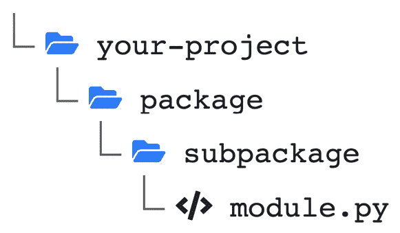

# 第二章：Python 编程特性

Python 语言的设计重点是强调代码的可读性。因此，它提供了语法和结构，使开发者能够用几行易读的代码快速表达复杂的概念。这使得它与其他编程语言有很大的不同。

本章的目标是让你熟悉 Python 的特性，但我们希望你已经具备一定的编程经验。我们将首先介绍 Python 的基础知识、标准类型和流程控制语法。你还将了解列表推导式和生成器的概念，这些是处理和转换数据序列的非常强大的方法。你还会看到，Python 可以作为面向对象语言来使用，依然通过非常轻量且强大的语法。我们在继续之前，还将回顾类型提示和异步 I/O 的概念，这在 Python 中相对较新，但它们是 **FastAPI** 框架的核心。

在本章中，我们将覆盖以下主要内容：

+   Python 编程基础

+   列表推导式和生成器

+   类和对象

+   使用 mypy 进行类型提示和类型检查

+   异步 I/O

# 技术要求

你需要一个 Python 虚拟环境，正如我们在*第一章*中设置的那样，*Python 开发* *环境设置*。

你可以在本书的 GitHub 仓库中找到本章的所有代码示例：[`github.com/PacktPublishing/Building-Data-Science-Applications-with-FastAPI-Second-Edition/tree/main/chapter02`](https://github.com/PacktPublishing/Building-Data-Science-Applications-with-FastAPI-Second-Edition/tree/main/chapter02)。

# Python 编程基础

首先，让我们回顾一下 Python 的一些关键特点：

+   它是一种**解释型语言**。与 C 或 Java 等语言不同，Python 不需要编译，这使得我们可以交互式地运行 Python 代码。

+   它是**动态类型**的。值的类型是在运行时确定的。

+   它支持多种**编程范式**：过程化编程、面向对象编程和函数式编程。

这使得 Python 成为一种非常多用途的语言，从简单的自动化脚本到复杂的数据科学项目。

现在，让我们编写并运行一些 Python 代码吧！

## 运行 Python 脚本

正如我们所说，Python 是一种解释型语言。因此，运行一些 Python 代码最简单和最快的方法就是启动一个交互式 shell。只需运行以下命令启动一个会话：

```py

$ pythonPython 3.10.8 (main, Nov    8 2022, 08:55:03) [Clang 14.0.0 (clang-1400.0.29.202)] on darwin
Type "help", "copyright", "credits" or "license" for more information.
>>>
```

这个 shell 使得运行一些简单语句并进行实验变得非常容易：

```py

>>> 1 + 12
>>> x = 100
>>> x * 2
200
```

要退出 shell，请使用 *Ctrl* + *D* 键盘快捷键。

显然，当你开始有更多语句，或者仅仅是希望保留你的工作以便以后重用时，这会变得繁琐。Python 脚本保存为 `.py` 扩展名的文件。让我们在项目目录中创建一个名为 `chapter2_basics_01.py` 的文件，并添加以下代码：

chapter02_basics_01.py

```py

print("Hello world!")x = 100
print(f"Double of {x} is {x * 2}")
```

[`github.com/PacktPublishing/Building-Data-Science-Applications-with-FastAPI-Second-Edition/blob/main/chapter02/chapter02_basics_01.py`](https://github.com/PacktPublishing/Building-Data-Science-Applications-with-FastAPI-Second-Edition/blob/main/chapter02/chapter02_basics_01.py)

简单来说，这个脚本在控制台打印 `Hello world`，将值 `100` 赋给名为 `x` 的变量，并打印一个包含 `x` 和其双倍值的字符串。要运行它，只需将脚本的路径作为参数传递给 Python 命令：

```py

$ python chapter2_basics_01.pyHello world!
Double of 100 is 200
```

f-strings

你可能已经注意到字符串以 `f` 开头。这个语法被称为 *f-strings*，是一种非常方便且简洁的字符串插值方式。在其中，你可以简单地将变量插入大括号中，它们会自动转换为字符串来构建最终的字符串。我们将在示例中经常使用它。

就这样！你现在已经能够编写并运行简单的 Python 脚本。接下来，让我们深入了解 Python 的语法。

## 缩进很重要

Python 最具标志性的特点之一是代码块不是像许多其他编程语言那样通过大括号来定义，而是通过 **空格缩进** 来区分。这听起来可能有些奇怪，但它是 Python 可读性哲学的核心。让我们看看如何编写一个脚本来查找列表中的偶数：

chapter02_basics_02.py

```py

numbers = [1, 2, 3, 4, 5, 6, 7, 8, 9, 10]even = []
for number in numbers:
        if number % 2 == 0:
                even.append(number)
print(even)    # [2, 4, 6, 8, 10]
```

[`github.com/PacktPublishing/Building-Data-Science-Applications-with-FastAPI-Second-Edition/blob/main/chapter02/chapter02_basics_02.py`](https://github.com/PacktPublishing/Building-Data-Science-Applications-with-FastAPI-Second-Edition/blob/main/chapter02/chapter02_basics_02.py)

在这个脚本中，我们定义了 `numbers`，一个从 1 到 10 的数字列表，和 `even`，一个空列表，用于存储偶数。

接下来，我们定义了一个 `for` 循环语句来遍历 `numbers` 中的每个元素。正如你所看到的，我们使用冒号 `:` 打开一个块，换行并开始在下一行写入语句，缩进一个级别。

下一行是一个条件语句，用来检查当前数字的奇偶性。我们再次使用冒号 `:` 来打开一个代码块，并在下一行添加一个额外的缩进级别。这个语句将偶数添加到偶数列表中。

之后，接下来的语句没有缩进。这意味着我们已经退出了 `for` 循环块；这些语句应该在迭代完成后执行。

让我们来运行一下：

```py

$ python chapter02_basics_02.py[2, 4, 6, 8, 10]
```

缩进风格和大小

你可以选择你喜欢的缩进风格（制表符或空格）和大小（2、4、6 等），唯一的约束是你应该在一个代码块内保持一致性 *within*。然而，根据惯例，Python 开发者通常使用 *四个空格的缩进*。

Python 的这一特性可能听起来有些奇怪，但经过一些练习后，你会发现它能强制执行清晰的格式，并大大提高脚本的可读性。

现在我们将回顾一下内置类型和数据结构。

## 使用内置类型

Python 在标量类型方面相当传统。它有六种标量类型：

+   `int`，用于存储`x = 1`

+   `float`，表示`x =` `1.5`

+   `complex`，表示`x = 1 +` `2j`

+   `bool`，表示`True`或`False`

+   `str`，表示`x = "``abc"`

+   `NoneType`，表示`x =` `None`

值得注意的是，Python 中的`int`值和`str`值相加会引发错误，正如你在下面的示例中所看到的：

```py

>>> 1 + "abc"Traceback (most recent call last):
    File "<stdin>", line 1, in <module>
TypeError: unsupported operand type(s) for +: 'int' and 'str'
```

但仍然，添加一个`int`值和一个`float`值会自动将结果向上转型为`float`：

```py

>>> 1 + 1.52.5
```

正如你可能已经注意到的，Python 在这些标准类型方面相当传统。现在，让我们看看基本数据结构是如何处理的。

## 处理数据结构——列表、元组、字典和集合

除了标量类型，Python 还提供了方便的数据结构：一种数组结构，当然在 Python 中称为*列表*，但也有*元组*、*字典*和*集合*，这些在很多情况下都非常方便。我们从列表开始。

### 列表

列表在 Python 中等同于经典的数组结构。定义一个列表非常简单：

```py

>>> l = [1, 2, 3, 4, 5]
```

正如你所见，将一组元素包裹在**方括号**中表示一个列表。你当然可以通过索引访问单个元素：

```py

>>> l[0]1
>>> l[2]
3
```

它还支持`-1`索引表示最后一个元素，`-2`表示倒数第二个元素，以此类推：

```py

>>> l[-1]5
>>> l[-4]
2
```

另一个有用的语法是切片，它可以快速地让你获取一个子列表：

```py

>>> l[1:3][2, 3]
```

第一个数字是起始索引（包含），第二个是结束索引（不包含），用冒号分隔。你可以省略第一个数字；在这种情况下，默认是`0`：

```py

>>> l[:3][1, 2, 3]
```

你也可以省略第二个数字；在这种情况下，默认使用列表的长度：

```py

>>> l[1:][2, 3, 4, 5]
```

最后，这种语法还支持一个第三个参数来指定步长。它可以用于选择列表中的每第二个元素：

```py

>>> l[::2][1, 3, 5]
```

使用这种语法的一个有用技巧是使用`-1`来反转列表：

```py

>>> l[::-1][5, 4, 3, 2, 1]
```

列表是**可变的**。这意味着你可以重新赋值元素或添加新的元素：

```py

>>> l[1] = 10>>> l
[1, 10, 3, 4, 5]
>>> l.append(6)
[1, 10, 3, 4, 5, 6]
```

这与它们的“表亲”元组不同，元组是**不可变的**。

### 元组

元组与列表非常相似。它们不是用方括号定义，而是使用圆括号：

```py

>>> t = (1, 2, 3, 4, 5)
```

它们支持与列表相同的语法来访问元素或切片：

```py

>>> t[2]3
>>> t[1:3]
(2, 3)
>>> t[::-1]
(5, 4, 3, 2, 1)
```

然而，元组是不可变的。你不能重新赋值元素或添加新的元素。尝试这样做会引发错误：

```py

>>> t[1] = 10Traceback (most recent call last):
    File "<stdin>", line 1, in <module>
TypeError: 'tuple' object does not support item assignment
>>> t.append(6)
Traceback (most recent call last):
    File "<stdin>", line 1, in <module>
AttributeError: 'tuple' object has no attribute 'append'
```

一个常见的用法是将其用于返回多个值的函数。在下面的示例中，我们定义了一个函数来计算并返回欧几里得除法的商和余数：

chapter02_basics_03.py

```py

def euclidean_division(dividend, divisor):        quotient = dividend // divisor
        remainder = dividend % divisor
        return (quotient, remainder)
```

[`github.com/PacktPublishing/Building-Data-Science-Applications-with-FastAPI-Second-Edition/blob/main/chapter02/chapter02_basics_03.py`](https://github.com/PacktPublishing/Building-Data-Science-Applications-with-FastAPI-Second-Edition/blob/main/chapter02/chapter02_basics_03.py)

这个函数简单地返回商和余数，它们被包裹在一个元组中。现在我们来计算`3`和`2`的欧几里得除法：

chapter02_basics_03.py

```py

t = euclidean_division(3, 2)print(t[0])    # 1
print(t[1])    # 1
```

[`github.com/PacktPublishing/Building-Data-Science-Applications-with-FastAPI-Second-Edition/blob/main/chapter02/chapter02_basics_03.py`](https://github.com/PacktPublishing/Building-Data-Science-Applications-with-FastAPI-Second-Edition/blob/main/chapter02/chapter02_basics_03.py)

在这种情况下，我们将结果赋值给一个名为`t`的元组，并通过索引*来提取商和余数*。然而，我们可以做得更好。让我们计算 `42` 和 `4` 的欧几里得除法：

chapter02_basics_03.py

```py

q, r = euclidean_division(42, 4)print(q)    # 10
print(r)    # 2
```

[`github.com/PacktPublishing/Building-Data-Science-Applications-with-FastAPI-Second-Edition/blob/main/chapter02/chapter02_basics_03.py`](https://github.com/PacktPublishing/Building-Data-Science-Applications-with-FastAPI-Second-Edition/blob/main/chapter02/chapter02_basics_03.py)

你可以看到我们直接将商和余数分别赋值给`q`和`r`变量。这种语法称为` t `是一个元组，它是不可变的，所以你不能重新赋值。而 `q` 和 `r` 是新的变量，因此是可变的。

### 字典

字典是 Python 中也广泛使用的数据结构，用于将键映射到值。它是通过花括号定义的，其中键和值由冒号分隔：

```py

>>> d = {"a": 1, "b": 2, "c": 3}
```

元素可以通过键访问：

```py

>>> d["a"]1
```

字典是可变的，因此你可以在映射中重新赋值或添加元素：

```py

>>> d["a"] = 10>>> d
{'a': 10, 'b': 2, 'c': 3}
>>> d["d"] = 4
>>> d
{'a': 10, 'b': 2, 'c': 3, 'd': 4}
```

### 集合

集合是一个便捷的数据结构，用于存储唯一项的集合。它是通过花括号定义的：

```py

>>> s = {1, 2, 3, 4, 5}
```

元素可以添加到集合中，但结构确保元素只出现一次：

```py

>>> s.add(1)>>> s
{1, 2, 3, 4, 5}
>>> s.add(6)
{1, 2, 3, 4, 5, 6}
```

也提供了方便的方法来执行集合之间的并集或交集等操作：

```py

>>> s.union({4, 5, 6}){1, 2, 3, 4, 5, 6}
>>> s.intersection({4, 5, 6})
{4, 5}
```

这就是本节对 Python 数据结构的概述。你在程序中可能会频繁使用它们，所以花些时间熟悉它们。显然，我们没有涵盖它们的所有方法和特性，但你可以查看官方的 Python 文档以获取详尽的信息：[`docs.python.org/3/library/stdtypes.html`](https://docs.python.org/3/library/stdtypes.html)。

现在让我们来谈谈 Python 中可用的不同类型的运算符，这些运算符允许我们对这些数据进行一些逻辑操作。

## 执行布尔逻辑及其他几个运算符

可预测地，Python 提供了运算符来执行布尔逻辑。然而，我们也会看到一些不太常见但使得 Python 在工作中非常高效的运算符。

### 执行布尔逻辑

布尔逻辑通过`and`、`or`和`not`关键字来执行。让我们回顾一些简单的例子：

```py

>>> x = 10>>> x > 0 and x < 100
True
>>> x > 0 or (x % 2 == 0)
True
>>> not (x > 0)
False
```

你可能会在程序中经常使用它们，尤其是在条件语句块中。现在让我们回顾一下身份运算符。

### 检查两个变量是否相同

`is` 和 `is not` 身份运算符检查两个变量是否 *指向* 同一个对象。这与比较运算符 `==` 和 `!=` 不同，后者检查的是两个变量是否具有相同的 *值*。

在 Python 内部，变量是通过指针存储的。身份运算符的目标就是检查两个变量是否实际上指向内存中的同一个对象。让我们来看一些例子：

```py

>>> a = [1, 2, 3]>>> b = [1, 2, 3]
>>> a is b
False
```

即使 `a` 和 `b` 列表是相同的，它们在内存中并不是同一个对象，因此 `a is b` 为假。但是，`a == b` 为真。让我们看看如果将 `a` 赋值给 `b` 会发生什么：

```py

>>> a = [1, 2, 3]>>> b = a
>>> a is b
True
```

在这种情况下，`b` 变量将指向与 `a` 相同的对象，也就是内存中的同一列表。因此，身份运算符的结果为真。

“is None” 还是 “== None”？

要检查一个变量是否为 null，你可以写 `a == None`。虽然大多数时候它能工作，但通常建议写 `a is None`。

为什么？在 Python 中，类可以实现自定义的比较运算符，因此 `a == None` 的结果在某些情况下可能是不可预测的，因为类可以选择为 `None` 值附加特殊含义。

现在我们来回顾一下成员运算符。

### 检查数据结构中是否存在某个值

成员运算符，`in` 和 `not in`，对于检查元素是否存在于诸如列表或字典等数据结构中非常有用。它们在 Python 中是惯用的，使得该操作非常高效且易于编写。让我们来看一些例子：

```py

>>> l = [1, 2, 3]>>> 2 in l
True
>>> 5 not in l
True
```

使用成员运算符，我们可以通过一个语句检查元素是否存在于列表中。它也适用于元组和集合：

```py

>>> t = (1, 2, 3)>>> 2 in t
True
>>> s = {1, 2, 3}
>>> 2 in s
True
```

最后，它同样适用于字典。在这种情况下，成员运算符检查的是 *键* 是否存在，而不是值：

```py

>>> d = {"a": 1, "b": 2, "c": 3}>>> "b" in d
True
>>> 3 in d
False
```

我们现在已经清楚了这些常见的操作。接下来，我们将通过条件语句来实际应用它们。

## 控制程序的流程

没有控制流语句，一个编程语言就不算是一个编程语言了。再次提醒你，Python 在这方面与其他语言有所不同。我们从条件语句开始。

### 有条件地执行操作 – if, elif 和 else

传统上，这些语句用于根据布尔条件执行一些逻辑。在下面的例子中，我们将考虑一个包含电子商务网站订单信息的字典。我们将编写一个函数，基于当前状态将订单状态更新为下一个步骤：

chapter02_basics_04.py

```py

def forward_order_status(order):        if order["status"] == "NEW":
                order["status"] = "IN_PROGRESS"
        elif order["status"] == "IN_PROGRESS":
                order["status"] = "SHIPPED"
        else:
                order["status"] = "DONE"
        return order
```

[`github.com/PacktPublishing/Building-Data-Science-Applications-with-FastAPI-Second-Edition/blob/main/chapter02/chapter02_basics_04.py`](https://github.com/PacktPublishing/Building-Data-Science-Applications-with-FastAPI-Second-Edition/blob/main/chapter02/chapter02_basics_04.py)

第一个条件用 `if` 来表示，后跟一个布尔条件。然后我们打开一个缩进块，正如我们在本章的 *缩进很重要* 部分所解释的那样。

替代条件被标记为`elif`（而不是`else if`），回退块被标记为`else`。当然，如果你不需要替代条件或回退条件，这些都是*可选*的。

另外值得注意的是，与许多其他语言不同，Python 没有提供`switch`语句。

### 在一个迭代器上重复操作——`for`循环语句

现在我们将讨论另一个经典的控制流语句：`for`循环。你可以使用`for`循环语句在一个序列上重复操作。

我们已经在本章的*缩进很重要*部分看到了`for`循环的示例。如你所理解的，这条语句对于重复执行代码块非常有用。

你可能也已经注意到它的工作方式与其他语言有些不同。通常，编程语言会像这样定义`for`循环：`for (i = 0; i <= 10; i++)`。它们让你负责定义和控制用于迭代的变量。

Python 不是这样工作的。相反，它希望你将一个`for`循环提供给循环体。让我们看几个例子：

```py

>>> for i in [1,2,3]:...         print(i)
...
1
2
3
>>> for k in {"a": 1, "b": 2, "c": 3}:
...         print(k)
...
a
b
c
```

但是如果你只想迭代某个特定次数怎么办？幸运的是，Python 内置了生成一些有用迭代器的函数。最著名的就是`range`，它精确地创建了一个数字序列。让我们看看它是如何工作的：

```py

>>> for i in range(3):...         print(i)
...
0
1
2
```

`range`将根据你在第一个参数中提供的大小生成一个序列，从零开始。

你也可以通过指定两个参数来更精确地控制：起始索引（包含）和最后索引（不包含）：

```py

>>> for i in range(1, 3):...         print(i)
...
1
2
```

最后，你甚至可以提供一个步长作为第三个参数：

```py

>>> for i in range(0, 5, 2):...         print(i)
...
0
2
4
```

请注意，这种语法与我们之前在本章中*列表*和*元组*部分看到的切片语法非常相似。

`range`输出不是一个列表

一个常见的误解是认为`range`返回一个*列表*。实际上，它是一个`Sequence`对象，仅存储*开始*、*结束*和*步长*参数。这就是为什么你可以写`range(1000000000)`而不会让你的系统内存崩溃：数十亿个元素并不会一次性分配到内存中。

正如你所见，Python 中的`for`循环语法相当简单易懂，并且强调可读性。接下来我们将讨论它的“亲戚”——`while`循环。

### 重复操作直到满足条件——`while`循环语句

经典的`while`循环在 Python 中也可以使用。冒昧地说，这个语句并没有什么特别的地方。传统上，这个语句允许你重复执行指令直到满足条件。我们将回顾一个示例，其中我们使用`while`循环来获取分页元素直到我们到达结束：

chapter02_basics_05.py

```py

def retrieve_page(page):        if page > 3:
                return {"next_page": None, "items": []}
        return {"next_page": page + 1, "items": ["A", "B", "C"]}
items = []
page = 1
while page is not None:
        page_result = retrieve_page(page)
        items += page_result["items"]
        page = page_result["next_page"]
print(items)    # ["A", "B", "C", "A", "B", "C", "A", "B", "C"]
```

[`github.com/PacktPublishing/Building-Data-Science-Applications-with-FastAPI-Second-Edition/blob/main/chapter02/chapter02_basics_05.py`](https://github.com/PacktPublishing/Building-Data-Science-Applications-with-FastAPI-Second-Edition/blob/main/chapter02/chapter02_basics_05.py)

`retrieve_page`函数是一个虚拟函数，它返回一个字典，其中包含传递给它的页面的项目以及下一页的页码，或者如果到达最后一页则返回`None`。*A priori*，我们并不知道有多少页。因此，我们反复调用`retrieve_page`，直到页面是`None`。在每次迭代中，我们将当前页面的项目保存到累加器`items`中。

当你处理第三方 REST API 并希望检索所有可用项目时，这种使用场景非常常见，`while` 循环对此非常有帮助。

最后，有一些情况下你希望提前结束循环或跳过某次迭代。为了解决这个问题，Python 实现了经典的`break`和`continue`语句。

## 定义函数

现在我们知道如何使用常见的运算符并控制程序的流程，让我们将它放入可重用的逻辑中。正如你可能已经猜到的，我们将学习**函数**以及如何定义它们。我们在之前的一些例子中已经看到了它们，但让我们更正式地介绍它们。

在 Python 中，函数是通过`def`关键字定义的，后面跟着函数的名称。然后，你会看到在括号中列出支持的参数，在冒号后面是函数体的开始。我们来看一个简单的例子：

```py

>>> def f(a):...         return a
...
>>> f(2)
2
```

就是这样！Python 也支持为参数设置默认值：

```py

>>> def f(a, b = 1):...         return a, b
...
>>> f(2)
(2, 1)
>>> f(2, 3)
(2, 3)
```

调用函数时，你可以通过参数的名称指定参数的值：

```py

>>> f(a=2, b=3)(2, 3)
```

这些参数被称为*关键字参数*。如果你有多个默认参数，但只希望设置其中一个，它们特别有用：

```py

>>> def f(a = 1, b = 2, c = 3):...         return a, b, c
...
>>> f(c=1)
(1, 2, 1)
```

函数命名

按约定，函数应该使用`my_wonderful_function`这种格式命名，而不是`MyWonderfulFunction`。

但不仅如此！实际上，你可以定义接受动态数量参数的函数。

### 动态接受参数的*args 和**kwargs

有时，你可能需要一个支持动态数量参数的函数。这些参数会在运行时在你的函数逻辑中处理。为了做到这一点，你必须使用`*args`和`**kwargs`语法。让我们定义一个使用这种语法的函数，并打印这些参数的值：

```py

>>> def f(*args, **kwargs):...         print("args", args)
...         print("kwargs", kwargs)
...
>>> f(1, 2, 3, a=4, b=5)
args (1, 2, 3)
kwargs {'a': 4, 'b': 5}
```

正如你所看到的，标准参数被放置在一个*元组*中，顺序与它们被调用时的顺序相同。另一方面，关键字参数被放置在一个*字典*中，键是参数的名称。然后由你来使用这些数据来执行你的逻辑！

有趣的是，你可以将这两种方法混合使用，以便同时拥有硬编码参数和动态参数：

```py

>>> def f(a, *args):...         print("a", a)
...         print("arg", args)
...
>>> f(1, 2, 3)
a 1
arg (2, 3)
```

做得好！你已经学会了如何在 Python 中编写函数来组织程序的逻辑。接下来的步骤是将这些函数组织到模块中，并将它们导入到其他模块中以便使用！

## 编写和使用包与模块

你可能已经知道，除了小脚本之外，你的源代码不应该存放在一个包含成千上万行的大文件中。相反，你应该将它拆分成逻辑上合理且易于维护的块。这正是包和模块的用途！我们将看看它们是如何工作的，以及你如何定义自己的模块。

首先，Python 提供了一组自己的模块——标准库，这些模块可以直接在程序中导入：

```py

>>> import datetime>>> datetime.date.today()
datetime.date(2022, 12, 1)
```

仅使用`import`关键字，你就可以使用`datetime`模块，并通过引用其命名空间`datetime.date`来访问其所有内容，`datetime.date`是用于处理日期的内置类。然而，你有时可能希望显式地导入该模块的一部分：

```py

>>> from datetime import date>>> date.today()
datetime.date(2022, 12, 1)
```

在这里，我们显式地导入了`date`类以直接使用它。相同的原则也适用于通过`pip`安装的第三方包，例如 FastAPI。

使用现有的包和模块很方便，但编写自己的模块更好。在 Python 中，**模块**是一个包含声明的单个文件，但也可以包含在首次导入模块时执行的指令。你可以在以下示例中找到一个非常简单模块的定义：

chapter02_basics_module.py

```py

def module_function():        return "Hello world"
print("Module is loaded")
```

[`github.com/PacktPublishing/Building-Data-Science-Applications-with-FastAPI-Second-Edition/blob/main/chapter02/chapter02_basics_module.py`](https://github.com/PacktPublishing/Building-Data-Science-Applications-with-FastAPI-Second-Edition/blob/main/chapter02/chapter02_basics_module.py)

这个模块只包含一个函数`module_function`和一个`print`语句。在你的项目根目录下创建一个包含该代码的文件，并将其命名为`module.py`。然后，打开一个 Python 解释器并运行以下命令：

```py

>>> import moduleModule is loaded
```

请注意，`print`语句在导入时已经执行。现在你可以使用该函数了：

```py

>>> module.module_function()'Hello world'
```

恭喜！你刚刚编写了你的第一个 Python 模块！

现在，让我们来看一下如何构建一个**包**。包是将模块组织在层次结构中的一种方式，你可以通过它们的命名空间导入这些模块。

在你的项目根目录下，创建一个名为`package`的目录。在其中，再创建一个名为`subpackage`的目录，并将`module.py`移入该目录。你的项目结构应该像*图 2.1*所示：



图 2.1 – Python 包示例层次结构

然后，你可以使用完整的命名空间导入你的模块：

```py

>>> import package.subpackage.moduleModule is loaded
```

它有效！然而，为了定义一个合适的 Python 包，*强烈推荐*在每个包和子包的根目录下创建一个空的`__init__.py`文件。在旧版本的 Python 中，必须创建该文件才能让解释器识别一个包。在较新的版本中，这已变为可选项，但带有`__init__.py`文件的包（一个包）和没有该文件的包（一个**命名空间包**）之间实际上存在一些微妙的区别。我们在本书中不会进一步解释这个问题，但如果你希望了解更多细节，可以查阅关于命名空间包的文档：[`packaging.python.org/en/latest/guides/packaging-namespace-packages/`](https://packaging.python.org/en/latest/guides/packaging-namespace-packages/)。

因此，你通常应该始终创建`__init__.py`文件。在我们的示例中，最终的项目结构应该如下所示：


图 2.2 – 带有`__init__.py`文件的 Python 包层次结构

值得注意的是，即使是空的`__init__.py`文件也是完全可以的，实际上你也可以在其中编写一些代码。在这种情况下，当你第一次导入该包或其子模块时，这些代码会被执行。这对于执行一些包的初始化逻辑非常有用。现在你已经对如何编写一些 Python 代码有了很好的概览。可以自由编写一些小脚本来熟悉它独特的语法。接下来我们将探讨一些关于语言的高级话题，这些将对我们在 FastAPI 之旅中的学习大有裨益。

# 在序列上操作 – 列表推导式和生成器

在本节中，我们将介绍可能是 Python 中最具典型性的构造：列表推导式和生成器。你将看到，它们对于用最简洁的语法读取和转换数据序列非常有用。

## 列表推导式

在编程中，一个非常常见的任务是将一个序列（比如说，*列表*）转换成另一个序列，例如，过滤或转换元素。通常，你会像我们在本章之前的示例中那样编写这样的操作：

chapter02_basics_02.py

```py

numbers = [1, 2, 3, 4, 5, 6, 7, 8, 9, 10]even = []
for number in numbers:
        if number % 2 == 0:
                even.append(number)
print(even)    # [2, 4, 6, 8, 10]
```

[`github.com/PacktPublishing/Building-Data-Science-Applications-with-FastAPI-Second-Edition/blob/main/chapter02/chapter02_basics_02.py`](https://github.com/PacktPublishing/Building-Data-Science-Applications-with-FastAPI-Second-Edition/blob/main/chapter02/chapter02_basics_02.py)

使用这种方法，我们简单地遍历每个元素，检查条件，并在元素满足条件时将其添加到累加器中。

为了进一步提升可读性，Python 支持一种简洁的语法，使得只用一句话就能执行这个操作：**列表推导式**。让我们看看之前的示例在这种语法下的样子：

chapter02_list_comprehensions_01.py

```py

numbers = [1, 2, 3, 4, 5, 6, 7, 8, 9, 10]even = [number for number in numbers if number % 2 == 0]
print(even)    # [2, 4, 6, 8, 10]
```

[`github.com/PacktPublishing/Building-Data-Science-Applications-with-FastAPI-Second-Edition/blob/main/chapter02/chapter02_list_comprehensions_01.py`](https://github.com/PacktPublishing/Building-Data-Science-Applications-with-FastAPI-Second-Edition/blob/main/chapter02/chapter02_list_comprehensions_01.py)

就这样！基本上，列表推导式通过*打包*一个`for`循环并将其用方括号包裹来工作。要添加到结果列表的元素出现在前面，然后是迭代。我们可以选择性地添加一个条件，就像这里一样，用来筛选列表输入中的一些元素。

实际上，结果元素可以是任何有效的 Python 表达式。在下面的示例中，我们使用`random`标准模块的`randint`函数生成一个随机整数列表：

chapter02_list_comprehensions_02.py

```py

from random import randint, seedseed(10)    # Set random seed to make examples reproducible
random_elements = [randint(1, 10) for I in range(5)]
print(random_elements)    # [10, 1, 7, 8, 10]
```

[`github.com/PacktPublishing/Building-Data-Science-Applications-with-FastAPI-Second-Edition/blob/main/chapter02/chapter02_list_comprehensions_02.py`](https://github.com/PacktPublishing/Building-Data-Science-Applications-with-FastAPI-Second-Edition/blob/main/chapter02/chapter02_list_comprehensions_02.py)

这种语法在 Python 程序员中被广泛使用，你可能会非常喜欢它。这个语法的好处在于它也适用于*集合*和*字典*。很简单，只需将方括号替换为大括号即可生成集合：

chapter02_list_comprehensions_03.py

```py

from random import randint, seedseed(10)    # Set random seed to make examples reproducible
random_unique_elements = {randint(1, 10) for i in range(5)}
print(random_unique_elements)    # {8, 1, 10, 7}
```

[`github.com/PacktPublishing/Building-Data-Science-Applications-with-FastAPI-Second-Edition/blob/main/chapter02/chapter02_list_comprehensions_03.py`](https://github.com/PacktPublishing/Building-Data-Science-Applications-with-FastAPI-Second-Edition/blob/main/chapter02/chapter02_list_comprehensions_03.py)

要创建一个字典，指定键和值，并用冒号分隔：

chapter02_list_comprehensions_04.py

```py

from random import randint, seedseed(10)    # Set random seed to make examples reproducible
random_dictionary = {i: randint(1, 10) for i in range(5)}
print(random_dictionary)    # {0: 10, 1: 1, 2: 7, 3: 8, 4: 10}
```

[`github.com/PacktPublishing/Building-Data-Science-Applications-with-FastAPI-Second-Edition/blob/main/chapter02/chapter02_list_comprehensions_04.py`](https://github.com/PacktPublishing/Building-Data-Science-Applications-with-FastAPI-Second-Edition/blob/main/chapter02/chapter02_list_comprehensions_04.py)eee

## 生成器

你可能认为，如果用圆括号替换方括号，你可以得到一个元组。实际上，你会得到一个**生成器**对象。生成器和列表推导式之间的主要区别在于，生成器的元素是*按需生成*的，而不是一次性计算并存储在内存中的。你可以把生成器看作是生成值的食谱。

正如我们所说，生成器可以通过使用与列表推导式相同的语法，并加上圆括号来定义：

chapter02_list_comprehensions_05.py

```py

numbers = [1, 2, 3, 4, 5, 6, 7, 8, 9, 10]even_generator = (number for number in numbers if number % 2 == 0)
even = list(even_generator)
even_bis = list(even_generator)
print(even)    # [2, 4, 6, 8, 10]
print(even_bis)    # []
```

[`github.com/PacktPublishing/Building-Data-Science-Applications-with-FastAPI-Second-Edition/blob/main/chapter02/chapter02_list_comprehensions_05.py`](https://github.com/PacktPublishing/Building-Data-Science-Applications-with-FastAPI-Second-Edition/blob/main/chapter02/chapter02_list_comprehensions_05.py)

在这个例子中，我们定义了`even_generator`来输出`numbers`列表中的偶数。然后，我们使用这个生成器调用`list`构造函数，并将其赋值给名为`even`的变量。这个构造函数会耗尽传入参数的迭代器，并构建一个正确的列表。我们再执行一次，并将其赋值给`even_bis`。

正如你所看到的，`even`是一个包含所有偶数的列表。然而，`even_bis`是一个*空*列表。这个简单的例子是为了向你展示生成器只能*使用一次*。一旦所有值都生成完毕，生成器就结束了。

这非常有用，因为你可以开始迭代生成器，暂停去做其他事情，然后再继续迭代。

创建生成器的另一种方式是通过定义`2`作为传入参数的限制：

chapter02_list_comprehensions_06.py

```py

def even_numbers(max):        for i in range(2, max + 1):
                if i % 2 == 0:
                        yield i
even = list(even_numbers(10))
print(even)    # [2, 4, 6, 8, 10]
```

[`github.com/PacktPublishing/Building-Data-Science-Applications-with-FastAPI-Second-Edition/blob/main/chapter02/chapter02_list_comprehensions_06.py`](https://github.com/PacktPublishing/Building-Data-Science-Applications-with-FastAPI-Second-Edition/blob/main/chapter02/chapter02_list_comprehensions_06.py)

正如你在这个函数中看到的，我们使用了`yield`关键字代替了`return`。当解释器执行到这个语句时，它会*暂停*函数的执行，并将值*传递*给生成器的消费者。当主程序请求另一个值时，函数会恢复执行以便再次生成值。

这使我们能够实现复杂的生成器，甚至是那些在生成过程中会输出不同类型值的生成器。生成器函数的另一个有趣的特性是，它们允许我们在生成完所有值之后执行一些指令。让我们在刚刚复习过的函数末尾添加一个`print`语句：

chapter02_list_comprehensions_07.py

```py

def even_numbers(max):        for i in range(2, max + 1):
                if i % 2 == 0:
                        yield i
        print("Generator exhausted")
even = list(even_numbers(10))
print(even)
```

[`github.com/PacktPublishing/Building-Data-Science-Applications-with-FastAPI-Second-Edition/blob/main/chapter02/chapter02_list_comprehensions_07.py`](https://github.com/PacktPublishing/Building-Data-Science-Applications-with-FastAPI-Second-Edition/blob/main/chapter02/chapter02_list_comprehensions_07.py)

如果你在 Python 解释器中执行它，你将得到以下输出：

```py

$ python chapter02_list_comprehensions_07.pyGenerator exhausted
[2, 4, 6, 8, 10]
```

我们在输出中看到`Generator exhausted`，这意味着我们的代码在最后一个`yield`语句之后已经正确执行。

这特别有用，当你想在生成器耗尽后执行一些*清理操作*时：关闭连接、删除临时文件等等。

# 编写面向对象的程序

正如我们在本章的第一部分所说，Python 是一种多范式语言，其中一个范式是 **面向对象编程**。在这一部分，我们将回顾如何定义类，以及如何实例化和使用对象。你会发现 Python 的语法再次是非常简洁的。

## 定义类

在 Python 中定义一个类非常简单：使用 `class` 关键字，输入类名，然后开始一个新块。你可以像定义普通函数一样在其下定义方法。让我们来看一个例子：

chapter02_classes_objects_01.py

```py

class Greetings:        def greet(self, name):
                return f"Hello, {name}"
c = Greetings()
print(c.greet("John"))    # "Hello, John"
```

[`github.com/PacktPublishing/Building-Data-Science-Applications-with-FastAPI-Second-Edition/blob/main/chapter02/chapter02_classes_objects_01.py`](https://github.com/PacktPublishing/Building-Data-Science-Applications-with-FastAPI-Second-Edition/blob/main/chapter02/chapter02_classes_objects_01.py)

请注意，每个方法的第一个参数必须是 `self`，它是当前对象实例的引用（相当于其他语言中的 `this`）。

要实例化一个类，只需像调用函数一样调用类，并将其赋值给一个变量。然后，你可以通过点表示法访问方法。

类和方法命名

按照惯例，类名应使用 `MyWonderfulClass` 而不是 `my_wonderful_class`。方法名应使用蛇形命名法，就像普通函数一样。

显然，你也可以设置 `__init__` 方法，其目标是初始化值：

chapter02_classes_objects_02.py

```py

class Greetings:        def __init__(self, default_name):
                self.default_name = default_name
        def greet(self, name=None):
                return f"Hello, {name if name else self.default_name}"
c = Greetings("Alan")
print(c.default_name)    # "Alan"
print(c.greet())    # "Hello, Alan"
print(c.greet("John"))    # "Hello, John"
```

[`github.com/PacktPublishing/Building-Data-Science-Applications-with-FastAPI-Second-Edition/blob/main/chapter02/chapter02_classes_objects_02.py`](https://github.com/PacktPublishing/Building-Data-Science-Applications-with-FastAPI-Second-Edition/blob/main/chapter02/chapter02_classes_objects_02.py)

在这个例子中，`__init__` 允许我们设置一个 `default_name` 属性，如果在参数中没有提供名称，`greet` 方法将使用该属性。如你所见，你可以通过点表示法轻松访问这个属性。

不过要小心：`__init__` 并不是构造函数。在典型的面向对象语言中，构造函数是用于实际在内存中创建对象的方法。在 Python 中，当 `__init__` 被调用时，对象已经在内存中创建（请注意我们可以访问 `self` 实例）。实际上，确实有一个方法用于定义构造函数，`__new__`，但在常见的 Python 程序中它很少被使用。

私有方法和属性

在 Python 中，并不存在 *私有* 方法或属性的概念。一切都可以从外部访问。然而，按照惯例，你可以通过在私有方法和属性前加下划线来 *表示* 它们应该被视为私有：`_private_method`。

现在你已经掌握了 Python 中面向对象编程的基础！接下来我们将重点讲解魔法方法，它们可以让我们对对象做一些巧妙的操作。

## 实现魔法方法

魔法方法是一组在语言中具有特殊意义的预定义方法。它们很容易识别，因为它们的名称前后都有两个下划线。事实上，我们已经见过其中一个魔法方法：`__init__`！这些方法不是直接调用的，而是由解释器在使用其他构造函数，如标准函数或操作符时调用。

为了理解它们的作用，我们将回顾最常用的方法。我们从`__repr__`和`__str__`开始。

### 对象表示 —— __repr__ 和 __str__

当你定义一个类时，通常需要能够获得一个实例的可读且清晰的字符串表示。为此，Python 提供了两个魔法方法：`__repr__`和`__str__`。让我们看看它们如何在表示摄氏度或华氏度温度的类中工作：

chapter02_classes_objects_03.py

```py

class Temperature:        def __init__(self, value, scale):
                self.value = value
                self.scale = scale
        def __repr__(self):
                return f"Temperature({self.value}, {self.scale!r})"
        def __str__(self):
                return f"Temperature is {self.value} °{self.scale}"
t = Temperature(25, "C")
print(repr(t))    # "Temperature(25, 'C')"
print(str(t))    # "Temperature is 25 °C"
print(t)
```

[`github.com/PacktPublishing/Building-Data-Science-Applications-with-FastAPI-Second-Edition/blob/main/chapter02/chapter02_classes_objects_03.py`](https://github.com/PacktPublishing/Building-Data-Science-Applications-with-FastAPI-Second-Edition/blob/main/chapter02/chapter02_classes_objects_03.py)

如果你运行这个示例，你会注意到`print(t)`和`print(str(t))`打印的内容是一样的。通过`print`，解释器调用了`__str__`方法来获取我们对象的字符串表示。这就是`__str__`的作用：提供一个*优雅的字符串表示*，供最终用户使用。

另一方面，你会看到，尽管它们非常相似，我们实现了`__repr__`的方式却有所不同。这个方法的目的是给出对象的*内部表示*，并且它是唯一明确的。按照约定，这应该给出一个准确的语句，允许我们重建出完全相同的对象。

现在我们已经可以用我们的类来表示温度，那么如果我们尝试比较它们，会发生什么呢？

### 比较方法 —— __eq__、__gt__、__lt__，等等

当然，比较不同单位的温度会导致意外的结果。幸运的是，魔法方法允许我们重载默认的操作符，以便进行有意义的比较。让我们扩展一下之前的例子：

chapter02_classes_objects_04.py

```py

class Temperature:        def __init__(self, value, scale):
                self.value = value
                self.scale = scale
                if scale == "C":
                        self.value_kelvin = value + 273.15
                elif scale == "F":
                        self.value_kelvin = (value–- 32) * 5 / 9 + 273.15
```

[`github.com/PacktPublishing/Building-Data-Science-Applications-with-FastAPI-Second-Edition/blob/main/chapter02/chapter02_classes_objects_04.py`](https://github.com/PacktPublishing/Building-Data-Science-Applications-with-FastAPI-Second-Edition/blob/main/chapter02/chapter02_classes_objects_04.py)

在`__init__`方法中，我们根据当前的单位将温度值转换为开尔文温标。这将帮助我们进行比较。接下来，我们定义`__eq__`和`__lt__`：

chapter02_classes_objects_04.py

```py

        def __eq__(self, other):                return self.value_kelvin == other.value_kelvin
        def __lt__(self, other):
                return self.value_kelvin < other.value_kelvin
```

[`github.com/PacktPublishing/Building-Data-Science-Applications-with-FastAPI-Second-Edition/blob/main/chapter02/chapter02_classes_objects_04.py`](https://github.com/PacktPublishing/Building-Data-Science-Applications-with-FastAPI-Second-Edition/blob/main/chapter02/chapter02_classes_objects_04.py)

如你所见，这些方法只是接受另一个参数，即要与之比较的另一个对象实例。然后我们只需要执行比较逻辑。通过这样做，我们可以像处理任何变量一样进行比较：

chapter02_classes_objects_04.py

```py

tc = Temperature(25, "C")tf = Temperature(77, "F")
tf2 = Temperature(100, "F")
print(tc == tf)    # True
print(tc < tf2)    # True
```

[`github.com/PacktPublishing/Building-Data-Science-Applications-with-FastAPI-Second-Edition/blob/main/chapter02/chapter02_classes_objects_04.py`](https://github.com/PacktPublishing/Building-Data-Science-Applications-with-FastAPI-Second-Edition/blob/main/chapter02/chapter02_classes_objects_04.py)

就是这样！如果你希望所有比较操作符都可用，你还应该实现所有其他的比较魔法方法：`__le__`、`__gt__` 和 `__ge__`。

另一个实例的类型无法保证

在这个例子中，我们假设 `other` 变量也是一个 `Temperature` 对象。然而，在现实中，这并不能保证，开发者可能会尝试将 `Temperature` 与另一个对象进行比较，这可能导致错误或异常行为。为避免这种情况，你应该使用 `isinstance` 检查 `other` 变量的类型，确保我们处理的是 `Temperature`，否则抛出适当的异常。

### 操作符 – __add__、__sub__、__mul__ 等等

类似地，你还可以定义当尝试对两个 `Temperature` 对象进行加法或乘法操作时会发生什么。我们在这里不会详细讨论，因为它的工作方式与比较操作符完全相同。

### 可调用对象 – __call__

我们要回顾的最后一个魔法方法是 `__call__`。这个方法有些特殊，因为它使你能够像调用 *普通函数* 一样调用你的对象实例。让我们看一个例子：

chapter02_classes_objects_05.py

```py

class Counter:        def __init__(self):
                self.counter = 0
        def __call__(self, inc=1):
                self.counter += inc
c = Counter()
print(c.counter)    # 0
c()
print(c.counter)    # 1
c(10)
print(c.counter)    # 11
```

[`github.com/PacktPublishing/Building-Data-Science-Applications-with-FastAPI-Second-Edition/blob/main/chapter02/chapter02_classes_objects_05.py`](https://github.com/PacktPublishing/Building-Data-Science-Applications-with-FastAPI-Second-Edition/blob/main/chapter02/chapter02_classes_objects_05.py)

`__call__` 方法可以像定义其他方法一样定义，接受你希望的任何参数。唯一的区别是如何调用它：你只需要像调用普通函数那样，直接在对象实例变量上传递参数。

如果你想定义一个保持某种局部状态的函数，就像我们在这个例子中所做的那样，或者在需要提供 **可调用** 对象并设置一些参数的情况下，这种模式会很有用。实际上，这正是我们在为 FastAPI 定义类依赖时会遇到的用例。

如我们所见，魔法方法是实现自定义类操作的一个绝佳方式，使它们能够以纯面向对象的方式易于使用。我们并没有涵盖所有可用的魔法方法，但你可以在官方文档中找到完整的列表：[`docs.python.org/3/reference/datamodel.html#special-method-names`](https://docs.python.org/3/reference/datamodel.html#special-method-names)。

现在我们将重点讨论面向对象编程的另一个重要特性：继承。

## 通过继承重用逻辑，避免重复代码

继承是面向对象编程的核心概念之一：它允许你从现有的类派生出一个新类，从而重用一些逻辑，并重载对这个新类特有的部分。当然，Python 也支持这种方式。我们将通过非常简单的例子来理解其底层机制。

首先，让我们来看一个非常简单的继承示例：

chapter02_classes_objects_06.py

```py

class A:        def f(self):
                return "A"
class Child(A):
        pass
```

[`github.com/PacktPublishing/Building-Data-Science-Applications-with-FastAPI-Second-Edition/blob/main/chapter02/chapter02_classes_objects_06.py`](https://github.com/PacktPublishing/Building-Data-Science-Applications-with-FastAPI-Second-Edition/blob/main/chapter02/chapter02_classes_objects_06.py)

`Child` 类继承自 `A` 类。语法很简单：我们想继承的类通过括号写在子类名后面。

pass 语句

`pass` 是一个*什么也不做*的语句。由于 Python 仅依赖缩进来表示代码块，它是一个有用的语句，可以用来创建一个*空的代码块*，就像在其他编程语言中使用大括号一样。

在这个示例中，我们不想给 `Child` 类添加任何逻辑，所以我们只写了 `pass`。

另一种方法是在类定义下方添加文档字符串（docstring）。

如果你希望重载一个方法，但仍然想获得父类方法的结果，可以调用 `super` 函数：

chapter02_classes_objects_07.py

```py

class A:        def f(self):
                return "A"
class Child(A):
        def f(self):
                parent_result = super().f()
                return f"Child {parent_result}"
```

[`github.com/PacktPublishing/Building-Data-Science-Applications-with-FastAPI-Second-Edition/blob/main/chapter02/chapter02_classes_objects_07.py`](https://github.com/PacktPublishing/Building-Data-Science-Applications-with-FastAPI-Second-Edition/blob/main/chapter02/chapter02_classes_objects_07.py)

现在你知道如何在 Python 中使用基本的继承了。但还有更多：我们还可以使用多重继承！

### 多重继承

正如其名称所示，多重继承允许你从多个类派生一个子类。这样，你可以将多个类的逻辑组合成一个。我们来看一个例子：

chapter02_classes_objects_08.py

```py

class A:        def f(self):
                return "A"
class B:
        def g(self):
                return "B"
class Child(A, B):
        pass
```

[`github.com/PacktPublishing/Building-Data-Science-Applications-with-FastAPI-Second-Edition/blob/main/chapter02/chapter02_classes_objects_08.py`](https://github.com/PacktPublishing/Building-Data-Science-Applications-with-FastAPI-Second-Edition/blob/main/chapter02/chapter02_classes_objects_08.py)

再次强调，语法非常简单：只需用逗号列出所有父类。现在，`Child` 类可以调用 `f` 和 `g` 两个方法。

Mixins

Mixins 是 Python 中常见的设计模式，利用了多重继承特性。基本上，mixins 是包含单一功能的简短类，通常用于重用。然后，你可以通过组合这些 mixins 来构建具体的类。

但是，如果 `A` 和 `B` 两个类都实现了名为 `f` 的方法，会发生什么呢？我们来试试看：

chapter02_classes_objects_09.py

```py

class A:        def f(self):
                return "A"
class B:
        def f(self):
                return "B"
class Child(A, B):
        pass
```

[`github.com/PacktPublishing/Building-Data-Science-Applications-with-FastAPI-Second-Edition/blob/main/chapter02/chapter02_classes_objects_09.py`](https://github.com/PacktPublishing/Building-Data-Science-Applications-with-FastAPI-Second-Edition/blob/main/chapter02/chapter02_classes_objects_09.py)

如果你调用 `Child` 类的 `f` 方法，你将得到值 `"A"`。在这个简单的例子中，Python 会根据父类的顺序考虑第一个匹配的方法。然而，对于更复杂的继承结构，解析可能就不那么明显了：这就是 **方法解析顺序**（**MRO**）算法的目的。我们在这里不会深入讨论，但你可以查看 Python 官方文档，了解该算法的实现：[`www.python.org/download/releases/2.3/mro/`](https://www.python.org/download/releases/2.3/mro/)。

如果你对类的 MRO（方法解析顺序）感到困惑，可以在类上调用 `mro` 方法来获取按顺序考虑的类列表：

```py

>>> Child.mro()[<class 'chapter2_classes_objects_09.Child'>, <class 'chapter2_classes_objects_09.A'>, <class 'chapter2_classes_objects_09.B'>, <class 'object'>]
```

做得好！现在你对 Python 的面向对象编程有了一个很好的概览。这些概念在定义 FastAPI 中的依赖关系时会非常有帮助。

接下来，我们将回顾一些 Python 中最新和最流行的特性，FastAPI 在这些特性上有很大的依赖。我们将从 **类型提示** 开始。

# 使用 mypy 进行类型提示和类型检查

在本章的第一部分，我们提到 Python 是一种动态类型语言：解释器不会在编译时检查类型，而是在运行时进行检查。这使得语言更加灵活，开发者也更加高效。然而，如果你对这种语言类型有经验，你可能知道在这种上下文中很容易产生错误和漏洞：忘记参数、类型不匹配等问题。

这就是 Python 从 *3.5 版本* 开始引入类型提示的原因。目的是提供一种语法，用于通过 `mypy` 注解源代码，`mypy` 在这个领域被广泛使用。

## 入门

为了理解类型注解如何工作，我们将回顾一个简单的注解函数：

chapter02_type_hints_01.py

```py

def greeting(name: str) -> str:        return f"Hello, {name}"
```

[`github.com/PacktPublishing/Building-Data-Science-Applications-with-FastAPI-Second-Edition/blob/main/chapter02/chapter02_type_hints_01.py`](https://github.com/PacktPublishing/Building-Data-Science-Applications-with-FastAPI-Second-Edition/blob/main/chapter02/chapter02_type_hints_01.py)

正如你所看到的，我们在冒号后简单地添加了`name`参数的类型。我们还指定了`str`或`int`，我们可以简单地将它们用作类型注解。稍后在本节中，我们将看到如何注解更复杂的类型，如列表或字典。

现在我们将安装`mypy`来对这个文件进行类型检查。这可以像其他任何 Python 包一样完成：

```py

$ pip install mypy
```

然后，你可以对你的源文件运行类型检查：

```py

$ mypy chapter02_type_hints_01.pySuccess: no issues found in 1 source file
```

正如你所看到的，`mypy`告诉我们我们的类型没有问题。让我们尝试稍微修改一下代码，触发一个类型错误：

```py

def greeting(name: str) -> int:        return f"Hello, {name}"
```

很简单，我们只是说我们的函数的返回类型现在是`int`，但我们仍然返回一个字符串。如果你运行这段代码，它会完美执行：正如我们所说，解释器会忽略类型注解。然而，让我们看看`mypy`会给我们什么反馈：

```py

$ mypy chapter02_type_hints_01.pychapter02_type_hints_01.py:2: error: Incompatible return value type (got "str", expected "int")    [return-value]
Found 1 error in 1 file (checked 1 source file)
```

这次，它发出了警告。它清楚地告诉我们这里出了什么问题：返回值是字符串，而预期的是整数！

代码编辑器和 IDE 集成

有类型检查是好的，但手动在命令行上运行`mypy`可能有点繁琐。幸运的是，它与最流行的代码编辑器和 IDE 集成得很好。一旦配置完成，它将在你输入时执行类型检查，并直接在错误的行上显示错误。类型注解还帮助 IDE 执行一些聪明的操作，例如*自动补全*。

你可以在`mypy`的官方文档中查看如何为你最喜欢的编辑器进行配置：[`github.com/python/mypy#integrations`](https://github.com/python/mypy#integrations)。

你已经理解了 Python 中类型提示的基础知识。接下来，我们将回顾更高级的例子，特别是涉及非标量类型的情况。

## 类型数据结构

到目前为止，我们已经看到了如何为标量类型（如`str`或`int`）注解变量。但我们也看到了像列表和字典这样的数据结构，它们在 Python 中被广泛使用。在下面的例子中，我们将展示如何为 Python 中的基本数据结构添加类型提示：

chapter02_type_hints_02.py

```py

l: list[int] = [1, 2, 3, 4, 5]t: tuple[int, str, float] = (1, "hello", 3.14)
s: set[int] = {1, 2, 3, 4, 5}
d: dict[str, int] = {"a": 1, "b": 2, "c": 3}
```

[`github.com/PacktPublishing/Building-Data-Science-Applications-with-FastAPI-Second-Edition/blob/main/chapter02/chapter02_type_hints_02.py`](https://github.com/PacktPublishing/Building-Data-Science-Applications-with-FastAPI-Second-Edition/blob/main/chapter02/chapter02_type_hints_02.py)

你可以看到，这里我们可以使用`list`、`tuple`、`set`和`dict`这些标准类作为类型提示。然而，它们要求你提供构成结构的值的类型。这就是面向对象编程中广为人知的**泛型**概念。在 Python 中，它们是通过方括号定义的。

当然，还有更复杂的用例。例如，在 Python 中，拥有一个包含不同类型元素的列表是完全有效的。为了让类型检查器正常工作，我们可以简单地使用`|`符号来指定多个允许的类型：

chapter02_type_hints_03.py

```py

l: list[int | float] = [1, 2.5, 3.14, 5]
```

[`github.com/PacktPublishing/Building-Data-Science-Applications-with-FastAPI-Second-Edition/blob/main/chapter02/chapter02_type_hints_03.py`](https://github.com/PacktPublishing/Building-Data-Science-Applications-with-FastAPI-Second-Edition/blob/main/chapter02/chapter02_type_hints_03.py)

在这种情况下，我们的列表将接受整数或浮点数。当然，如果你尝试向列表中添加一个既不是 `int` 也不是 `float` 类型的元素，`mypy` 会报错。

还有一种情况也非常有用：你会经常遇到这样的函数参数或返回类型，它们要么返回一个值，要么返回 `None`。因此，你可以写类似这样：

chapter02_type_hints_04.py

```py

def greeting(name: str | None = None) -> str:        return f"Hello, {name if name else 'Anonymous'}"
```

[`github.com/PacktPublishing/Building-Data-Science-Applications-with-FastAPI-Second-Edition/blob/main/chapter02/chapter02_type_hints_04.py`](https://github.com/PacktPublishing/Building-Data-Science-Applications-with-FastAPI-Second-Edition/blob/main/chapter02/chapter02_type_hints_04.py)

允许的值是字符串或 `None`。

在 Python 3.9 之前，类型注解有所不同

在 Python 3.9 之前，无法使用标准类对列表、元组、集合和字典进行注解。我们需要从 `typing` 模块中导入特殊类：`l: List[int] = [1, 2, 3,` `4, 5]`。

`|` 符号也不可用。我们需要使用 `typing` 模块中的特殊 `Union` 类：`l: List[Union[int, float]] = [1, 2.5,` `3.14, 5]`

这种注解方式现在已经被弃用，但你仍然可能会在旧的代码库中找到它。

处理复杂类型时，*别名* 和复用它们可能会很有用，这样你就无需每次都重写它们。为此，你只需像为任何变量赋值一样进行赋值：

chapter02_type_hints_05.py

```py

IntStringFloatTuple = tuple[int, str, float]t: IntStringFloatTuple = (1, "hello", 3.14)
```

[`github.com/PacktPublishing/Building-Data-Science-Applications-with-FastAPI-Second-Edition/blob/main/chapter02/chapter02_type_hints_05.py`](https://github.com/PacktPublishing/Building-Data-Science-Applications-with-FastAPI-Second-Edition/blob/main/chapter02/chapter02_type_hints_05.py)

按照惯例，类型应该使用驼峰命名法，就像类名一样。说到类，我们来看看类型提示在类中的应用：

chapter02_type_hints_06.py

```py

class Post:        def __init__(self, title: str) -> None:
                self.title = title
        def __str__(self) -> str:
                return self.title
posts: list[Post] = [Post("Post A"), Post("Post B")]
```

https://github.com/PacktPublishing/Building-Data-Science-Applications-with-FastAPI-Second-Edition/blob/main/chapter02/chapter02_type_hints_06.py

实际上，类的类型提示并没有什么特别的。你只需像对待普通函数一样注解类的方法。如果你需要在注解中使用类，例如这里的帖子列表，你只需要使用类名。

有时，你需要编写一个接受另一个函数作为参数的函数或方法。在这种情况下，你需要提供该函数的 **类型签名**。

## 使用 Callable 标注类型函数签名

一个更高级的使用场景是能够为函数签名指定类型。例如，当你需要将函数作为其他函数的参数时，这会非常有用。为此，我们可以使用 `Callable` 类，它在 `collections.abc` 模块中可用。在以下示例中，我们将实现一个名为 `filter_list` 的函数，期望接受一个整数列表和一个给定整数返回布尔值的函数作为参数：

chapter02_type_hints_07.py

```py

from collections.abc import CallableConditionFunction = Callable[[int], bool]
def filter_list(l: list[int], condition: ConditionFunction) -> list[int]:
        return [i for i in l if condition(i)]
```

[`github.com/PacktPublishing/Building-Data-Science-Applications-with-FastAPI-Second-Edition/blob/main/chapter02/chapter02_type_hints_07.py`](https://github.com/PacktPublishing/Building-Data-Science-Applications-with-FastAPI-Second-Edition/blob/main/chapter02/chapter02_type_hints_07.py)

什么是 `collections.abc` 模块？

`collections.abc` 是 Python 标准库中的一个模块，提供了常用对象的抽象基类，这些对象在 Python 中日常使用：迭代器、生成器、可调用对象、集合、映射等。它们主要用于高级用例，在这些用例中，我们需要实现新的自定义对象，这些对象应该像迭代器、生成器等一样工作。在这里，我们仅将它们作为类型提示使用。

你可以看到这里我们通过 `Callable` 定义了一个类型别名 `ConditionFunction`。再次强调，这是一个泛型类，期望两个参数：首先是参数类型的列表，其次是返回类型。在这里，我们期望一个整数类型的参数，返回类型是布尔类型。

然后，我们可以在 `filter_list` 函数的注解中使用这种类型。`mypy` 会确保传递给参数的条件函数符合此签名。例如，我们可以编写一个简单的函数来检查整数的奇偶性，如下所示：

chapter02_type_hints_07.py

```py

def is_even(i: int) -> bool:        return i % 2 == 0
filter_list([1, 2, 3, 4, 5], is_even)
```

[`github.com/PacktPublishing/Building-Data-Science-Applications-with-FastAPI-Second-Edition/blob/main/chapter02/chapter02_type_hints_07.py`](https://github.com/PacktPublishing/Building-Data-Science-Applications-with-FastAPI-Second-Edition/blob/main/chapter02/chapter02_type_hints_07.py)

然而，值得注意的是，Python 中没有语法来指示可选或关键字参数。在这种情况下，你可以写 `Callable[..., bool]`，其中的省略号（`...`）表示*任意数量*的*参数*。

## `Any` 和 `cast`

在某些情况下，代码非常动态或复杂，无法正确地进行注解，或者类型检查器可能无法正确推断类型。为此，我们可以使用 `Any` 和 `cast`。它们可在 `typing` 模块中找到，该模块是 Python 引入的，旨在帮助处理类型提示方面的更具体的用例和构造。

`Any` 是一种类型注解，告诉类型检查器变量或参数可以是任何类型。在这种情况下，类型检查器将接受任何类型的值：

chapter02_type_hints_08.py

```py

from typing import Anydef f(x: Any) -> Any:
        return x
f("a")
f(10)
f([1, 2, 3])
```

[`github.com/PacktPublishing/Building-Data-Science-Applications-with-FastAPI-Second-Edition/blob/main/chapter02/chapter02_type_hints_08.py`](https://github.com/PacktPublishing/Building-Data-Science-Applications-with-FastAPI-Second-Edition/blob/main/chapter02/chapter02_type_hints_08.py)

第二个方法，`cast`，是一个让你覆盖类型检查器推断的类型的函数。它会强制类型检查器考虑你指定的类型：

chapter02_type_hints_09.py

```py

from typing import Any, castdef f(x: Any) -> Any:
        return x
a = f("a")    # inferred type is "Any"
a = cast(str, f("a"))    # forced type to be "str"
```

[`github.com/PacktPublishing/Building-Data-Science-Applications-with-FastAPI-Second-Edition/blob/main/chapter02/chapter02_type_hints_09.py`](https://github.com/PacktPublishing/Building-Data-Science-Applications-with-FastAPI-Second-Edition/blob/main/chapter02/chapter02_type_hints_09.py)

但要小心：`cast` 函数对类型检查器才有意义。对于其他类型的注解，解释器会完全忽略它，并且 *不会* 执行真正的类型转换。

尽管很方便，但尽量不要过于频繁地使用这些工具。如果一切都是 `Any` 或强制转换为其他类型，你将完全失去静态类型检查的好处。

正如我们所看到的，类型提示和类型检查在减少开发和维护高质量代码时非常有帮助。但这还不是全部。实际上，Python 允许你在运行时获取类型注解，并基于此执行一些逻辑。这使得你能够做一些聪明的事情，比如 **依赖注入**：只需在函数中为参数添加类型提示，库就能自动解析并在运行时注入相应的值。这一概念是 FastAPI 的核心。

FastAPI 中的另一个关键方法是 **异步 I/O**。这是我们在本章中要讲解的最后一个主题。

# 与异步 I/O 一起工作

如果你已经使用过 JavaScript 和 Node.js，你可能已经接触过 *promise* 和 `async`/`await` 关键字，这些都是异步 I/O 范式的特点。基本上，这是使 I/O 操作非阻塞的方式，并允许程序在读取或写入操作进行时执行其他任务。这样做的主要原因是 I/O 操作是 *慢* 的：从磁盘读取、网络请求的速度比从 RAM 中读取或处理指令慢 *百万* 倍。在下面的示例中，我们有一个简单的脚本，它读取磁盘上的文件：

chapter02_asyncio_01.py

```py

with open(__file__) as f:        data = f.read()
# The program will block here until the data has been read
print(data)
```

[`github.com/PacktPublishing/Building-Data-Science-Applications-with-FastAPI-Second-Edition/blob/main/chapter02/chapter02_asyncio_01.py`](https://github.com/PacktPublishing/Building-Data-Science-Applications-with-FastAPI-Second-Edition/blob/main/chapter02/chapter02_asyncio_01.py)

我们可以看到，脚本会被阻塞，直到从磁盘中检索到数据，正如我们所说，这可能需要很长时间。程序 99%的执行时间都花费在等待磁盘上。对于像这样的简单脚本来说，这通常不是问题，因为你可能不需要在此期间执行其他操作。

然而，在其他情况下，这可能是执行其他任务的机会。本书中非常关注的典型案例是 Web 服务器。假设我们有一个用户发出请求，该请求需要执行一个持续 10 秒钟的数据库查询才能返回响应。如果此时第二个用户发出了请求，他们必须等到第一个响应完成后，才能收到自己的答复。

为了解决这个问题，传统的基于**Web 服务器网关接口**（**WSGI**）的 Python Web 服务器（如 Flask 或 Django）会生成多个**工作进程**。这些是 Web 服务器的子进程，都能够处理请求。如果其中一个忙于处理一个长时间的请求，其他进程可以处理新的请求。

使用异步 I/O 时，单个进程在处理一个长时间 I/O 操作的请求时不会被阻塞。它在等待此操作完成的同时，可以处理其他请求。当 I/O 操作完成时，它会恢复请求逻辑，并最终返回响应。

从技术上讲，这是通过`select`和`poll`调用实现的，正是通过它们来请求操作系统级别的 I/O 操作事件。你可以在 Julia Evans 的文章《Async IO on Linux: select, poll, and epoll》中阅读到非常有趣的细节：[`jvns.ca/blog/2017/06/03/async-io-on-linux--select--poll--and-epoll`](https://jvns.ca/blog/2017/06/03/async-io-on-linux--select--poll--and-epoll)。

Python 在 3.4 版本中首次实现了异步 I/O，之后它得到了极大的发展，特别是在 3.6 版本中引入了 `async`/`await` 关键字。所有用于管理这种编程范式的工具都可以通过标准的 `asyncio` 模块获得。不久之后，异步启用 Web 服务器的 WSGI 的精神继任者——**异步服务器网关接口**（**ASGI**）被引入。FastAPI 就是基于这一点，这也是它展示出如此*卓越性能*的原因之一。

我们现在来回顾一下 Python 中异步编程的基础知识。下面的示例是一个使用`asyncio`的简单*Hello world*脚本：

chapter02_asyncio_02.py

```py

import asyncioasync def main():
        print("Hello ...")
        await asyncio.sleep(1)
        print("... World!")
asyncio.run(main())
```

[`github.com/PacktPublishing/Building-Data-Science-Applications-with-FastAPI-Second-Edition/blob/main/chapter02/chapter02_asyncio_02.py`](https://github.com/PacktPublishing/Building-Data-Science-Applications-with-FastAPI-Second-Edition/blob/main/chapter02/chapter02_asyncio_02.py)

当你想定义一个异步函数时，只需要在`def`前面添加`async`关键字。这允许你在函数内部使用`await`关键字。这种异步函数被称为**协程**。

在其中，我们首先调用`print`函数，然后调用`asyncio.sleep`协程。这是`async`版的`time.sleep`，它会让程序阻塞指定的秒数。请注意，我们在调用前加上了`await`关键字。这意味着我们希望等待这个协程完成后再继续。这就是`async`/`await`关键字的主要好处：编写*看起来像*同步代码的代码。如果我们省略了`await`，协程对象会被创建，但永远不会执行。

最后，注意我们使用了`asyncio.run`函数。这是会创建一个新的事件循环，执行你的协程并返回其结果的机制。它应该是你`async`程序的主要入口点。

这个示例不错，但从异步的角度来看并不太有趣：因为我们只等待一个操作，所以这并不令人印象深刻。让我们看一个同时执行两个协程的例子：

chapter02_asyncio_03.py

```py

import asyncioasync def printer(name: str, times: int) -> None:
        for i in range(times):
                print(name)
                await asyncio.sleep(1)
async def main():
        await asyncio.gather(
                printer("A", 3),
                printer("B", 3),
        )
asyncio.run(main())
```

[`github.com/PacktPublishing/Building-Data-Science-Applications-with-FastAPI-Second-Edition/blob/main/chapter02/chapter02_asyncio_03.py`](https://github.com/PacktPublishing/Building-Data-Science-Applications-with-FastAPI-Second-Edition/blob/main/chapter02/chapter02_asyncio_03.py)

这里，我们有一个`printer`协程，它会打印自己的名字指定次数。每次打印之间，它会睡眠 1 秒。

然后，我们的主协程使用了`asyncio.gather`工具，它将多个协程调度为并发执行。如果你运行这个脚本，你将得到以下结果：

```py

$ python chapter02_asyncio_03.pyA
B
A
B
A
B
```

我们得到了一连串的`A`和`B`。这意味着我们的协程是并发执行的，并且我们没有等第一个协程完成才开始第二个协程。

你可能会想知道为什么我们在这个例子中添加了`asyncio.sleep`调用。实际上，如果我们去掉它，我们会得到如下结果：

```py

AA
A
B
B
B
```

这看起来并不太并发，实际上确实不是。这是`asyncio`的主要陷阱之一：在协程中编写代码*不一定意味着*它不会阻塞。像计算这样的常规操作*是*阻塞的，并且*会*阻塞事件循环。通常这不是问题，因为这些操作很快。唯一不会阻塞的操作是设计为异步执行的 I/O 操作。这与**多进程**不同，后者的操作是在子进程中执行的，天生不会阻塞主进程。

因此，在选择与数据库、API 等交互的第三方库时，你必须小心。有些库已经适配为异步工作，有些则与标准库并行开发。我们将在接下来的章节中看到其中一些，尤其是在与数据库交互时。

我们将在此结束对异步 I/O 的简要介绍。虽然还有一些更深层次的细节，但一般来说，我们在这里学到的基础知识已经足够让你利用 `asyncio` 与 FastAPI 一起工作。

# 总结

恭喜！在本章中，你了解了 Python 语言的基础，它是一种非常简洁高效的编程语言。你接触到了更高级的概念——列表推导式和生成器，它们是处理数据序列的惯用方法。Python 也是一种多范式语言，你还学会了如何利用面向对象的语法。

最后，你了解了语言的一些最新特性：类型提示，它允许静态类型检查，从而减少错误并加速开发；以及异步 I/O，这是一组新的工具和语法，可以在执行 I/O 密集型操作时最大化性能并支持并发。

你现在已经准备好开始你的 FastAPI 之旅！你将会发现该框架充分利用了所有这些 Python 特性，提供了快速且愉悦的开发体验。在下一章中，你将学会如何使用 FastAPI 编写你的第一个 REST API。
