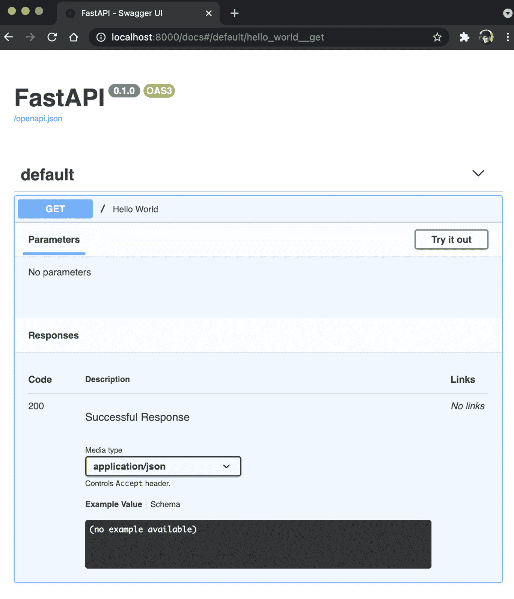
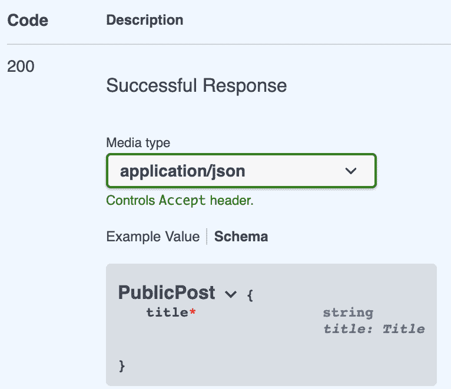
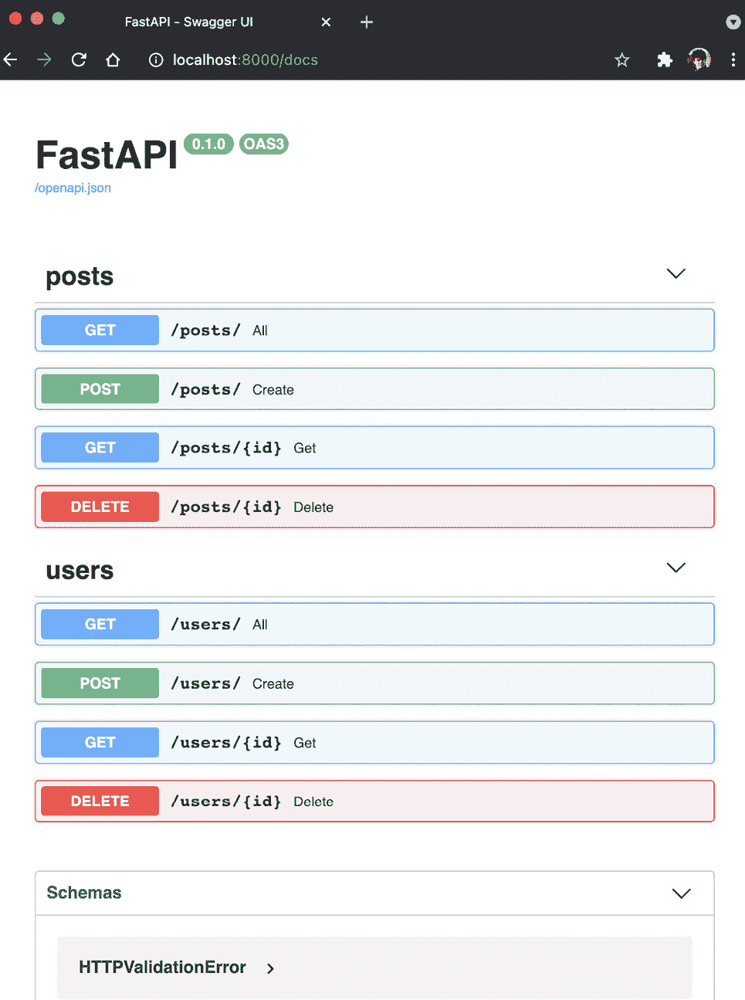

# 第三章：使用 FastAPI 开发 RESTful API

现在是时候开始学习**FastAPI**了！在这一章中，我们将介绍 FastAPI 的基础知识。我们将通过非常简单且集中的示例来演示 FastAPI 的不同特性。每个示例都将通向一个可用的 API 端点，你可以使用 HTTPie 进行测试。在本章的最后一部分，我们将展示一个更复杂的 FastAPI 项目，其中的路由分布在多个文件中。它将为你提供一个如何构建自己应用程序的概览。

到了本章结束时，你将知道如何启动 FastAPI 应用程序以及如何编写 API 端点。你还将能够处理请求数据，并根据自己的逻辑构建响应。最后，你将学会一种将 FastAPI 项目结构化为多个模块的方法，这样长期来看，项目更容易维护和操作。

在这一章中，我们将涵盖以下主要内容：

+   创建第一个端点并在本地运行

+   处理请求参数

+   自定义响应

+   使用多个路由器构建更大的项目

# 技术要求

你将需要一个 Python 虚拟环境，就像我们在*第一章*中设置的那样，*Python 开发* *环境设置*。

你可以在这个专门的 GitHub 仓库中找到本章的所有代码示例：[`github.com/PacktPublishing/Building-Data-Science-Applications-with-FastAPI-Second-Edition/tree/main/chapter03`](https://github.com/PacktPublishing/Building-Data-Science-Applications-with-FastAPI-Second-Edition/tree/main/chapter03)。

# 创建第一个端点并在本地运行

FastAPI 是一个易于使用且快速编写的框架。在接下来的示例中，你会发现这不仅仅是一个承诺。事实上，创建一个 API 端点只需要几行代码：

chapter03_first_endpoint_01.py

```py

from fastapi import FastAPIapp = FastAPI()
@app.get("/")
async def hello_world():
    return {"hello": "world"}
```

[`github.com/PacktPublishing/Building-Data-Science-Applications-with-FastAPI-Second-Edition/tree/main/chapter03/chapter03_first_endpoint_01.py`](https://github.com/PacktPublishing/Building-Data-Science-Applications-with-FastAPI-Second-Edition/tree/main/chapter03/chapter03_first_endpoint_01.py)

在这个例子中，我们在根路径上定义了一个`GET`端点，它总是返回`{"hello": "world"}`的 JSON 响应。为了做到这一点，我们首先实例化一个 FastAPI 对象，`app`。它将是主应用对象，负责管理所有 API 路由。

然后，我们简单地定义一个协程，包含我们的路由逻辑，即**路径操作函数**。其返回值会被 FastAPI 自动处理，生成一个包含 JSON 负载的正确 HTTP 响应。

在这里，这段代码中最重要的部分可能是以`@`开头的那一行，可以在协程定义之上找到，`app.get("/")(hello_world)`。

FastAPI 为每个 HTTP 方法提供*一个装饰器*，用来向应用程序添加新路由。这里展示的装饰器添加了一个以**路径**作为第一个参数的`GET`端点。

现在，让我们运行这个 API。将示例代码复制到项目的根目录，并运行以下命令：

```py

$ uvicorn chapter03_first_endpoint_01:appINFO:     Started server process [21654]
INFO:     Waiting for application startup.
INFO:     Application startup complete.
INFO:     Uvicorn running on http://127.0.0.1:8000 (Press CTRL+C to quit)
```

正如我们在 *第二章*中提到的，*Python 编程特性*部分的 *异步 I/O* 小节中，FastAPI 会暴露一个 `:`，最后是你的 ASGI 应用实例的变量名（在我们的示例中是 `app`）。之后，它会负责实例化应用并在你的本地机器上暴露它。

让我们尝试用 HTTPie 来测试我们的端点。打开另一个终端并运行以下命令：

```py

$ http http://localhost:8000HTTP/1.1 200 OK
content-length: 17
content-type: application/json
date: Thu, 10 Nov 2022 07:52:36 GMT
server: uvicorn
{
    "hello": "world"
}
```

它有效！正如你所见，我们确实得到了一个带有我们所需负载的 JSON 响应，只用了几行 Python 代码和一个命令！

FastAPI 最受欢迎的功能之一是 *自动交互式文档*。如果你在浏览器中打开 `http://localhost:8000/docs` URL，你应该能看到一个类似于以下截图的网页界面：



图 3.1 – FastAPI 自动交互式文档

FastAPI 会自动列出你所有定义的端点，并提供关于期望输入和输出的文档。你甚至可以直接在这个网页界面中尝试每个端点。在背后，它依赖于 OpenAPI 规范和来自 Swagger 的相关工具。你可以在其官方网站 [`swagger.io/`](https://swagger.io/) 阅读更多关于这方面的信息。

就这样！你已经用 FastAPI 创建了你的第一个 API。当然，这只是一个非常简单的示例，但接下来你将学习如何处理输入数据，并开始做一些有意义的事情！

巨人的肩膀

值得注意的是，FastAPI 基于两个主要的 Python 库构建：Starlette，一个低级 ASGI Web 框架（[`www.starlette.io/`](https://www.starlette.io/)），以及 Pydantic，一个基于类型提示的数据验证库（[`pydantic-docs.helpmanual.io/`](https://pydantic-docs.helpmanual.io/)）。

# 处理请求参数

**表现状态转移**（**REST**）API 的主要目标是提供一种结构化的方式来与数据交互。因此，最终用户必须发送一些信息来定制他们需要的响应，例如路径参数、查询参数、请求体负载、头部等。

Web 框架通常要求你操作一个请求对象来获取你感兴趣的部分，并手动应用验证来处理它们。然而，FastAPI 不需要这样做！实际上，它允许你声明性地定义所有参数。然后，它会自动在请求中获取它们，并根据类型提示应用验证。这就是为什么我们在 *第二章*中介绍了类型提示：FastAPI 就是用它来执行数据验证的！

接下来，我们将探索如何利用这个功能来从请求的不同部分获取和验证输入数据。

## 路径参数

API 路径是最终用户将与之交互的主要位置。因此，它是动态参数的好地方。一个典型的例子是将我们想要检索的对象的唯一标识符放在路径中，例如 `/users/123`。让我们看看如何在 FastAPI 中定义这个：

chapter03_path_parameters_01.py

```py

from fastapi import FastAPIapp = FastAPI()
@app.get("/users/{id}")
async def get_user(id: int):
    return {"id": id}
```

[`github.com/PacktPublishing/Building-Data-Science-Applications-with-FastAPI-Second-Edition/tree/main/chapter03/chapter03_path_parameters_01.py`](https://github.com/PacktPublishing/Building-Data-Science-Applications-with-FastAPI-Second-Edition/tree/main/chapter03/chapter03_path_parameters_01.py)

在这个示例中，我们定义了一个 API，它期望在其路径的最后部分传递一个整数。我们通过将参数名称放在花括号中定义路径来做到这一点。然后，我们将这个参数作为路径操作函数的参数进行了定义。请注意，我们添加了一个类型提示来指定参数是整数。

让我们运行这个示例。你可以参考之前的 *创建第一个端点并在本地运行* 部分，了解如何使用 Uvicorn 运行 FastAPI 应用程序。

首先，我们将尝试发起一个省略路径参数的请求：

```py

$ http http://localhost:8000/usersHTTP/1.1 404 Not Found
content-length: 22
content-type: application/json
date: Thu, 10 Nov 2022 08:20:51 GMT
server: uvicorn
{
    "detail": "Not Found"
}
```

我们得到了一个 `404` 状态的响应。这是预期的：我们的路由在 `/users` 后面期待一个参数，如果我们省略它，它就不会匹配任何模式。

现在让我们尝试使用一个正确的整数参数：

```py

http http://localhost:8000/users/123HTTP/1.1 200 OK
content-length: 10
content-type: application/json
date: Thu, 10 Nov 2022 08:21:27 GMT
server: uvicorn
{
    "id": 123
}
```

它运行成功了！我们得到了 `200` 状态，并且响应确实包含了我们传递的整数。请注意，它已经被正确地 *转换* 成了整数。

如果传递的值不是有效的整数会发生什么？让我们来看看：

```py

$ http http://localhost:8000/users/abcHTTP/1.1 422 Unprocessable Entity
content-length: 99
content-type: application/json
date: Thu, 10 Nov 2022 08:22:35 GMT
server: uvicorn
{
    "detail": [
        {
            "loc": [
                "path",
                "id"
            ],
            "msg": "value is not a valid integer",
            "type": "type_error.integer"
        }
    ]
}
```

我们得到了一个 `422` 状态的响应！由于 `abc` 不是有效的整数，验证失败并输出了错误。请注意，我们有一个非常详细和结构化的错误响应，准确告诉我们哪个元素导致了错误以及原因。我们触发这种验证的唯一要求就是 *类型提示* 我们的参数！

当然，你不仅仅限于一个路径参数。你可以有任意多个路径参数，类型可以各不相同。在以下示例中，我们添加了一个字符串类型的 `type` 参数：

chapter03_path_parameters_02.py

```py

from fastapi import FastAPIapp = FastAPI()
@app.get("/users/{type}/{id}")
async def get_user(type: str, id: int):
    return {"type": type, "id": id}
```

[`github.com/PacktPublishing/Building-Data-Science-Applications-with-FastAPI-Second-Edition/tree/main/chapter03/chapter03_path_parameters_02.py`](https://github.com/PacktPublishing/Building-Data-Science-Applications-with-FastAPI-Second-Edition/tree/main/chapter03/chapter03_path_parameters_02.py)

这个方法很有效，但是端点将接受任何字符串作为 `type` 参数。

### 限制允许的值

如果我们只想接受一组有限的值怎么办？再次，我们将依赖类型提示。Python 中有一个非常有用的类：`Enum`。枚举是列出特定类型数据所有有效值的一种方式。让我们定义一个 `Enum` 类来列出不同类型的用户：

chapter03_path_parameters_03.py

```py

class UserType(str, Enum):    STANDARD = "standard"
    ADMIN = "admin"
```

[`github.com/PacktPublishing/Building-Data-Science-Applications-with-FastAPI-Second-Edition/tree/main/chapter03/chapter03_path_parameters_03.py`](https://github.com/PacktPublishing/Building-Data-Science-Applications-with-FastAPI-Second-Edition/tree/main/chapter03/chapter03_path_parameters_03.py)

要定义一个字符串枚举，我们需要同时继承 `str` 类型和 `Enum` 类。然后，我们简单地将允许的值列出为类属性：属性名称及其实际字符串值。最后，我们只需要为 `type` 参数指定此类的类型提示：

chapter03_path_parameters_03.py

```py

@app.get("/users/{type}/{id}")async def get_user(type: UserType, id: int):
    return {"type": type, "id": id}
```

[`github.com/PacktPublishing/Building-Data-Science-Applications-with-FastAPI-Second-Edition/tree/main/chapter03/chapter03_path_parameters_03.py`](https://github.com/PacktPublishing/Building-Data-Science-Applications-with-FastAPI-Second-Edition/tree/main/chapter03/chapter03_path_parameters_03.py)

如果你运行此示例，并调用一个类型不在枚举中的端点，你将得到以下响应：

```py

$ http http://localhost:8000/users/hello/123HTTP/1.1 422 Unprocessable Entity
content-length: 184
content-type: application/json
date: Thu, 10 Nov 2022 08:33:36 GMT
server: uvicorn
{
    "detail": [
        {
            "ctx": {
                "enum_values": [
                    "standard",
                    "admin"
                ]
            },
            "loc": [
                "path",
                "type"
            ],
            "msg": "value is not a valid enumeration member; permitted: 'standard', 'admin'",
            "type": "type_error.enum"
        }
    ]
}
```

如你所见，你可以获得一个非常好的验证错误，显示此参数允许的值！

### 高级验证

我们可以进一步通过定义更高级的验证规则，特别是对于数字和字符串。在这种情况下，类型提示已经不再足够。我们将依赖 FastAPI 提供的函数，允许我们为每个参数设置一些选项。对于路径参数，这个函数叫做 `Path`。在以下示例中，我们只允许一个大于或等于 `1` 的 `id` 参数：

chapter03_path_parameters_04.py

```py

from fastapi import FastAPI, Pathapp = FastAPI()
@app.get("/users/{id}")
async def get_user(id: int = Path(..., ge=1)):
    return {"id": id}
```

[`github.com/PacktPublishing/Building-Data-Science-Applications-with-FastAPI-Second-Edition/tree/main/chapter03/chapter03_path_parameters_04.py`](https://github.com/PacktPublishing/Building-Data-Science-Applications-with-FastAPI-Second-Edition/tree/main/chapter03/chapter03_path_parameters_04.py)

这里有几个需要注意的事项：`Path` 的结果作为路径操作函数中 `id` 参数的*默认值*。

此外，你可以看到我们使用了 `Path`。事实上，它期望参数的默认值作为第一个参数。在这种情况下，我们不想要默认值：该参数是必需的。因此，省略号用来告诉 FastAPI 我们不希望有默认值。

省略号在 Python 中并不总是意味着这个

使用省略号符号来指定参数是必需的，如我们这里展示的，这是 FastAPI 特有的：这是 FastAPI 创建者的选择，决定使用这种方式。在其他 Python 程序中，这个符号可能有不同的含义。

然后，我们可以添加我们感兴趣的关键字参数。在我们的示例中，我们使用 `ge`，大于或等于，以及其关联的值。以下是验证数字时可用的关键字列表：

+   `gt`: 大于

+   `ge`: 大于或等于

+   `lt`: 小于

+   `le`: 小于或等于

还有针对字符串值的验证选项，这些选项基于*长度*和*正则表达式*。在以下示例中，我们想定义一个路径参数，用来接受以 AB-123-CD（法国车牌）的形式出现的车牌号。一种方法是强制字符串的长度为 `9`（即两个字母，一个连字符，三个数字，一个连字符，再加上两个字母）：

chapter03_path_parameters_05.py

```py

@app.get("/license-plates/{license}")async def get_license_plate(license: str = Path(..., min_length=9, max_length=9)):
    return {"license": license}
```

[`github.com/PacktPublishing/Building-Data-Science-Applications-with-FastAPI-Second-Edition/tree/main/chapter03/chapter03_path_parameters_05.py`](https://github.com/PacktPublishing/Building-Data-Science-Applications-with-FastAPI-Second-Edition/tree/main/chapter03/chapter03_path_parameters_05.py)

现在我们只需定义 `min_length` 和 `max_length` 关键字参数，就像我们为数字验证所做的一样。当然，针对这种用例的更好解决方案是使用正则表达式来验证车牌号码：

chapter03_path_parameters_06.py

```py

@app.get("/license-plates/{license}")async def get_license_plate(license: str = Path(..., regex=r"^\w{2}-\d{3}-\w{2}$")):
    return {"license": license}
```

[`github.com/PacktPublishing/Building-Data-Science-Applications-with-FastAPI-Second-Edition/tree/main/chapter03/chapter03_path_parameters_06.py`](https://github.com/PacktPublishing/Building-Data-Science-Applications-with-FastAPI-Second-Edition/tree/main/chapter03/chapter03_path_parameters_06.py)

多亏了这个正则表达式，我们只接受与车牌格式完全匹配的字符串。请注意，正则表达式前面有一个 `r`。就像 `f-strings` 一样，这是 Python 语法，用于表示接下来的字符串应被视为正则表达式。

参数元数据

数据验证并不是参数函数唯一接受的选项。你还可以设置其他选项，用于在自动生成的文档中添加关于参数的信息，例如 `title`、`description` 和 `deprecated`。

现在你应该能够定义路径参数并对其应用一些验证。另一个有用的参数是**查询参数**。我们接下来将讨论它们。

## 查询参数

查询参数是一种常见的向 URL 添加动态参数的方式。你可以在 URL 末尾找到它们，形式如下：`?param1=foo&param2=bar`。在 REST API 中，它们通常用于读取端点，以应用分页、过滤器、排序顺序或选择字段。

你会发现，使用 FastAPI 定义它们是相当简单的。实际上，它们使用与路径参数完全相同的语法：

chapter03_query_parameters_01.py

```py

@app.get("/users")async def get_user(page: int = 1, size: int = 10):
    return {"page": page, "size": size}
```

[`github.com/PacktPublishing/Building-Data-Science-Applications-with-FastAPI-Second-Edition/tree/main/chapter03/chapter03_query_parameters_01.py`](https://github.com/PacktPublishing/Building-Data-Science-Applications-with-FastAPI-Second-Edition/tree/main/chapter03/chapter03_query_parameters_01.py)

你只需要将它们声明为路径操作函数的参数。如果它们没有出现在路径模式中，就像路径参数那样，FastAPI 会自动将它们视为查询参数。让我们试试看：

```py

$ http "http://localhost:8000/users?page=5&size=50"HTTP/1.1 200 OK
content-length: 20
content-type: application/json
date: Thu, 10 Nov 2022 09:35:05 GMT
server: uvicorn
{
    "page": 5,
    "size": 50
}
```

在这里，你可以看到我们为这些参数定义了默认值，这意味着它们在调用 API 时是 *可选的*。当然，如果你希望定义一个 *必填的* 查询参数，只需省略默认值：

chapter03_query_parameters_02.py

```py

from enum import Enumfrom fastapi import FastAPI
class UsersFormat(str, Enum):
    SHORT = "short"
    FULL = "full"
app = FastAPI()
@app.get("/users")
async def get_user(format: UsersFormat):
    return {"format": format}
```

[`github.com/PacktPublishing/Building-Data-Science-Applications-with-FastAPI-Second-Edition/tree/main/chapter03/chapter03_query_parameters_02.py`](https://github.com/PacktPublishing/Building-Data-Science-Applications-with-FastAPI-Second-Edition/tree/main/chapter03/chapter03_query_parameters_02.py)

现在，如果你在 URL 中省略了 `format` 参数，你会收到 422 错误响应。另外，注意在这个例子中，我们定义了一个 `UsersFormat` 枚举来限制此参数允许的值数量；这正是我们在前一节中对路径参数所做的事情。

我们还可以通过 `Query` 函数访问更高级的验证功能。它的工作方式与我们在 *路径* *参数* 部分演示的相同：

chapter03_query_parameters_03.py

```py

from fastapi import FastAPI, Queryapp = FastAPI()
@app.get("/users")
async def get_user(page: int = Query(1, gt=0), size: int = Query(10, 
le=100)):
    return {"page": page, "size": size}
```

[`github.com/PacktPublishing/Building-Data-Science-Applications-with-FastAPI-Second-Edition/tree/main/chapter03/chapter03_query_parameters_03.py`](https://github.com/PacktPublishing/Building-Data-Science-Applications-with-FastAPI-Second-Edition/tree/main/chapter03/chapter03_query_parameters_03.py)

在这里，我们强制页面参数值为 *大于 0* 且大小 *小于或等于 100*。注意，默认的参数值是 `Query` 函数的第一个参数。

自然地，在发送请求数据时，最直观的方式是使用请求体。让我们看看它是如何工作的。

## 请求体

请求体是 HTTP 请求的一部分，包含表示文档、文件或表单提交的原始数据。在 REST API 中，它通常以 JSON 编码，用于在数据库中创建结构化对象。

对于最简单的情况，从请求体中获取数据的方式与查询参数完全相同。唯一的区别是你必须始终使用 `Body` 函数；否则，FastAPI 会默认在查询参数中查找它。让我们探索一个简单的例子，我们想要发布一些用户数据：

chapter03_request_body_01.py

```py

@app.post("/users")async def create_user(name: str = Body(...), age: int = Body(...)):
    return {"name": name, "age": age}
```

[`github.com/PacktPublishing/Building-Data-Science-Applications-with-FastAPI-Second-Edition/tree/main/chapter03/chapter03_request_body_01.py`](https://github.com/PacktPublishing/Building-Data-Science-Applications-with-FastAPI-Second-Edition/tree/main/chapter03/chapter03_request_body_01.py)

与查询参数的方式相同，我们为每个参数定义类型提示，并使用 `Body` 函数且不提供默认值来使其成为必填项。让我们尝试以下端点：

```py

$ http -v POST http://localhost:8000/users name="John" age=30POST /users HTTP/1.1
Accept: application/json, */*;q=0.5
Accept-Encoding: gzip, deflate
Connection: keep-alive
Content-Length: 29
Content-Type: application/json
Host: localhost:8000
User-Agent: HTTPie/3.2.1
{
    "age": "30",
    "name": "John"
}
HTTP/1.1 200 OK
content-length: 24
content-type: application/json
date: Thu, 10 Nov 2022 09:42:24 GMT
server: uvicorn
{
    "age": 30,
    "name": "John"
}
```

这里，我们使用了 HTTPie 的`-v`选项，以便您可以清楚地看到我们发送的 JSON 有效负载。FastAPI 成功地从有效负载中检索每个字段的数据。如果您发送的请求缺少或无效字段，则会收到`422`状态错误响应。

通过`Body`函数，您还可以进行更高级的验证。它的工作方式与我们在*Path* *parameters*部分演示的方式相同。

然而，定义此类有效负载验证也有一些主要缺点。首先，它非常冗长，使得路径操作函数原型巨大，尤其是对于更大的模型。其次，通常情况下，您需要在其他端点或应用程序的其他部分重用数据结构。

这就是为什么 FastAPI 使用`Path`、`Query`和`Body`函数，我们迄今所学的都使用 Pydantic 作为其基础！

通过定义自己的 Pydantic 模型并在路径参数中使用它们作为类型提示，FastAPI 将自动实例化模型实例并验证数据。让我们使用这种方法重写我们之前的例子：

chapter03_request_body_02.py

```py

from fastapi import FastAPIfrom pydantic import BaseModel
class User(BaseModel):
    name: str
    age: int
app = FastAPI()
@app.post("/users")
async def create_user(user: User):
    return user
```

[`github.com/PacktPublishing/Building-Data-Science-Applications-with-FastAPI-Second-Edition/tree/main/chapter03/chapter03_request_body_02.py`](https://github.com/PacktPublishing/Building-Data-Science-Applications-with-FastAPI-Second-Edition/tree/main/chapter03/chapter03_request_body_02.py)

首先，我们从`pydantic`导入`BaseModel`。这是每个模型都应该继承的基类。然后，我们定义我们的`User`类，并将所有属性列为*类属性*。每个属性都应具有适当的类型提示：这是 Pydantic 将能够验证字段类型的方式。

最后，我们只需将`user`声明为路径操作函数的一个参数，并使用`User`类作为类型提示。FastAPI 会自动理解用户数据可以在请求负载中找到。在函数内部，您可以访问一个适当的`user`对象实例，只需使用点表示法访问单个属性，例如`user.name`。

请注意，如果只返回对象，FastAPI 足够智能，会自动将其转换为 JSON 以生成 HTTP 响应。

在接下来的章节中，*第四章*，*在 FastAPI 中管理 Pydantic 数据模型*，我们将更详细地探讨 Pydantic 的可能性，特别是在验证方面。

### 多个对象

有时，您可能希望一次性发送同一有效负载中的多个对象。例如，`user`和`company`。在这种情况下，您可以简单地添加几个由 Pydantic 模型类型提示的参数，FastAPI 将自动理解存在多个对象。在这种配置中，它将期望包含每个对象*以其* *参数名称* *索引*：

chapter03_request_body_03.py

```py

@app.post("/users")async def create_user(user: User, company: Company):
    return {"user": user, "company": company}
```

[`github.com/PacktPublishing/Building-Data-Science-Applications-with-FastAPI-Second-Edition/tree/main/chapter03/chapter03_request_body_03.py`](https://github.com/PacktPublishing/Building-Data-Science-Applications-with-FastAPI-Second-Edition/tree/main/chapter03/chapter03_request_body_03.py)

这里，`Company` 是一个简单的 Pydantic 模型，只有一个字符串类型的 `name` 属性。在这种配置下，FastAPI 期望接收一个看起来类似于以下内容的有效载荷：

```py

{    "user": {
        "name": "John",
        "age": 30
    },
    "company": {
        "name": "ACME"
    }
}
```

对于更复杂的 JSON 结构，建议你将格式化后的 JSON 通过管道传输给 HTTPie，而不是使用参数。让我们按如下方式尝试：

```py

$ echo '{"user": {"name": "John", "age": 30}, "company": {"name": "ACME"}}' | http POST http://localhost:8000/usersHTTP/1.1 200 OK
content-length: 59
content-type: application/json
date: Thu, 10 Nov 2022 09:52:12 GMT
server: uvicorn
{
    "company": {
        "name": "ACME"
    },
    "user": {
        "age": 30,
        "name": "John"
    }
}
```

就这样！

你甚至可以添加 `Body` 函数，就像我们在本节开始时看到的那样。如果你希望有一个不属于任何模型的单一属性，这会很有用：

chapter03_request_body_04.py

```py

@app.post("/users")async def create_user(user: User, priority: int = Body(..., ge=1, le=3)):
    return {"user": user, "priority": priority}
```

[`github.com/PacktPublishing/Building-Data-Science-Applications-with-FastAPI-Second-Edition/tree/main/chapter03/chapter03_request_body_04.py`](https://github.com/PacktPublishing/Building-Data-Science-Applications-with-FastAPI-Second-Edition/tree/main/chapter03/chapter03_request_body_04.py)

`priority` 属性是一个介于 1 和 3 之间的整数，预计在 `user` 对象 *旁边*：

```py

$ echo '{"user": {"name": "John", "age": 30}, "priority": 1}' | http POST http://localhost:8000/usersHTTP/1.1 200 OK
content-length: 46
content-type: application/json
date: Thu, 10 Nov 2022 09:53:51 GMT
server: uvicorn
{
    "priority": 1,
    "user": {
        "age": 30,
        "name": "John"
    }
}
```

现在你已经很好地了解了如何处理 JSON 有效载荷数据。然而，有时你会发现需要接受更传统的表单数据，甚至是文件上传。接下来我们来看看如何做！

## 表单数据和文件上传

即使 REST API 大多数时候使用 JSON，偶尔你可能需要处理表单编码的数据或文件上传，这些数据要么被编码为 `application/x-www-form-urlencoded`，要么为 `multipart/form-data`。

再次强调，FastAPI 使得实现这一需求变得非常简单。然而，你需要一个额外的 Python 依赖项 `python-multipart` 来处理这种数据。和往常一样，你可以通过 `pip` 安装它：

```py

$ pip install python-multipart
```

然后，你可以使用 FastAPI 提供的专门处理表单数据的功能。首先，让我们看看如何处理简单的表单数据。

### 表单数据

获取表单数据字段的方法类似于我们在 *请求体* 部分讨论的获取单个 JSON 属性的方法。以下示例与在那里探索的示例大致相同。不过，这个示例期望接收的是表单编码的数据，而不是 JSON：

chapter03_form_data_01.py

```py

@app.post("/users")async def create_user(name: str = Form(...), age: int = Form(...)):
    return {"name": name, "age": age}
```

[`github.com/PacktPublishing/Building-Data-Science-Applications-with-FastAPI-Second-Edition/tree/main/chapter03/chapter03_form_data_01.py`](https://github.com/PacktPublishing/Building-Data-Science-Applications-with-FastAPI-Second-Edition/tree/main/chapter03/chapter03_form_data_01.py)

唯一的不同之处是，我们使用 `Form` 函数代替 `Body`。你可以使用 HTTPie 和 `--form` 选项来尝试这个端点，以强制数据进行表单编码：

```py

$ http -v --form POST http://localhost:8000/users name=John age=30POST /users HTTP/1.1
Accept: */*
Accept-Encoding: gzip, deflate
Connection: keep-alive
Content-Length: 16
Content-Type: application/x-www-form-urlencoded; charset=utf-8
Host: localhost:8000
User-Agent: HTTPie/3.2.1
name=John&age=30
HTTP/1.1 200 OK
content-length: 24
content-type: application/json
date: Thu, 10 Nov 2022 09:56:28 GMT
server: uvicorn

{
    "age": 30,
    "name": "John"
}
```

注意请求中`Content-Type`头和正文数据表示方式的变化。你还可以看到，响应依旧以 JSON 格式提供。除非另有说明，FastAPI 默认总是输出 JSON 响应，无论输入数据的形式如何。

当然，我们之前看到的`Path`、`Query`和`Body`的验证选项仍然可用。你可以在*路径* *参数*部分找到它们的描述。

值得注意的是，与 JSON 有效负载不同，FastAPI 不允许你定义 Pydantic 模型来验证表单数据。相反，你必须手动为路径操作函数定义每个字段作为参数。

现在，让我们继续讨论如何处理文件上传。

### 文件上传

上传文件是 Web 应用程序中的常见需求，无论是图片还是文档，FastAPI 提供了一个参数函数`File`来实现这一功能。

让我们看一个简单的例子，你可以直接将文件作为`bytes`对象来获取：

chapter03_file_uploads_01.py

```py

from fastapi import FastAPI, Fileapp = FastAPI()
@app.post("/files")
async def upload_file(file: bytes = File(...)):
    return {"file_size": len(file)}
```

[`github.com/PacktPublishing/Building-Data-Science-Applications-with-FastAPI-Second-Edition/tree/main/chapter03/chapter03_file_uploads_01.py`](https://github.com/PacktPublishing/Building-Data-Science-Applications-with-FastAPI-Second-Edition/tree/main/chapter03/chapter03_file_uploads_01.py)

再次可以看到，这种方法依然是相同的：我们为路径操作函数定义一个参数`file`，并添加类型提示`bytes`，然后我们将`File`函数作为该参数的默认值。通过这种方式，FastAPI 明白它需要从请求体中名为`file`的部分获取原始数据，并将其作为`bytes`返回。

我们仅通过调用`len`函数来返回该`bytes`对象的文件大小。

在代码示例仓库中，你应该能找到一张猫的图片：[`github.com/PacktPublishing/Building-Data-Science-Applications-with-FastAPI-Second-Edition/blob/main/assets/cat.jpg`](https://github.com/PacktPublishing/Building-Data-Science-Applications-with-FastAPI-Second-Edition/blob/main/assets/cat.jpg)。

让我们使用 HTTPie 将其上传到我们的端点。上传文件时，输入文件上传字段的名称（这里是`file`），后面跟上`@`和你要上传的文件路径。别忘了设置`--form`选项：

```py

$ http --form POST http://localhost:8000/files file@./assets/cat.jpgHTTP/1.1 200 OK
content-length: 19
content-type: application/json
date: Thu, 10 Nov 2022 10:00:38 GMT
server: uvicorn
{
    "file_size": 71457
}
```

成功了！我们正确地获取了文件的字节大小。

这种方法的一个缺点是，上传的文件完全存储在*内存中*。因此，尽管它适用于小文件，但对于较大的文件，很可能会遇到问题。而且，操作`bytes`对象在文件处理上并不总是方便的。

为了解决这个问题，FastAPI 提供了一个 `UploadFile` 类。该类会将数据存储在内存中，直到达到某个阈值，之后它会自动将数据存储到 *磁盘* 的临时位置。这使得你可以接受更大的文件，而不会耗尽内存。此外，暴露的对象实例还提供了有用的元数据，比如内容类型，以及一个 **类文件** 接口。这意味着你可以像处理普通文件一样在 Python 中操作它，并将其传递给任何期望文件的函数。

使用它时，你只需将其指定为类型提示，而不是 `bytes`：

chapter03_file_uploads_02.py

```py

from fastapi import FastAPI, File, UploadFileapp = FastAPI()
@app.post("/files")
async def upload_file(file: UploadFile = File(...)):
    return {"file_name": file.filename, "content_type": file.content_type}
```

[`github.com/PacktPublishing/Building-Data-Science-Applications-with-FastAPI-Second-Edition/tree/main/chapter03/chapter03_file_uploads_02.py`](https://github.com/PacktPublishing/Building-Data-Science-Applications-with-FastAPI-Second-Edition/tree/main/chapter03/chapter03_file_uploads_02.py)

请注意，在这里，我们返回了 `filename` 和 `content_type` 属性。内容类型对于 *检查文件类型* 特别有用，如果上传的文件类型不是你预期的类型，可以考虑拒绝它。

这是使用 HTTPie 的结果：

```py

$ http --form POST http://localhost:8000/files file@./assets/cat.jpgHTTP/1.1 200 OK
content-length: 51
content-type: application/json
date: Thu, 10 Nov 2022 10:04:22 GMT
server: uvicorn
{
    "content_type": "image/jpeg",
    "file_name": "cat.jpg"
}
```

你甚至可以通过将参数类型提示为 `UploadFile` 的列表来接受多个文件：

chapter03_file_uploads_03.py

```py

@app.post("/files")async def upload_multiple_files(files: list[UploadFile] = File(...)):
    return [
        {"file_name": file.filename, "content_type": file.content_type}
        for file in files
    ]
```

[`github.com/PacktPublishing/Building-Data-Science-Applications-with-FastAPI-Second-Edition/tree/main/chapter03/chapter03_file_uploads_03.py`](https://github.com/PacktPublishing/Building-Data-Science-Applications-with-FastAPI-Second-Edition/tree/main/chapter03/chapter03_file_uploads_03.py)

要使用 HTTPie 上传多个文件，只需重复该参数。它应该如下所示：

```py

$ http --form POST http://localhost:8000/files files@./assets/cat.jpg files@./assets/cat.jpgHTTP/1.1 200 OK
content-length: 105
content-type: application/json
date: Thu, 10 Nov 2022 10:06:09 GMT
server: uvicorn
[
    {
        "content_type": "image/jpeg",
        "file_name": "cat.jpg"
    },
    {
        "content_type": "image/jpeg",
        "file_name": "cat.jpg"
    }
]
```

现在，你应该能够在 FastAPI 应用程序中处理表单数据和文件上传了。到目前为止，你已经学会了如何管理用户交互的数据。然而，还有一些不太显眼但非常有趣的信息：**headers**。接下来我们将探讨它们。

## Headers 和 cookies

除了 URL 和主体，HTTP 请求的另一个重要部分是 headers。它们包含各种元数据，当处理请求时非常有用。常见的用法是将它们用于身份验证，例如通过著名的 **cookies**。

再次强调，在 FastAPI 中获取它们只需要一个类型提示和一个参数函数。让我们来看一个简单的例子，我们想要检索名为 `Hello` 的 header：

chapter03_headers_cookies_01.py

```py

@app.get("/")async def get_header(hello: str = Header(...)):
    return {"hello": hello}
```

[`github.com/PacktPublishing/Building-Data-Science-Applications-with-FastAPI-Second-Edition/tree/main/chapter03/chapter03_headers_cookies_01.py`](https://github.com/PacktPublishing/Building-Data-Science-Applications-with-FastAPI-Second-Edition/tree/main/chapter03/chapter03_headers_cookies_01.py)

在这里，你可以看到我们只需使用 `Header` 函数作为 `hello` 参数的默认值。参数的名称决定了我们想要检索的 *header 的 key*。让我们看看这个如何实现：

```py

$ http GET http://localhost:8000 'Hello: World'HTTP/1.1 200 OK
content-length: 17
content-type: application/json
date: Thu, 10 Nov 2022 10:10:12 GMT
server: uvicorn
{
    "hello": "World"
}
```

FastAPI 能够成功获取头部值。由于没有指定默认值（我们放置了省略号），因此该头部是必需的。如果缺失，将再次返回 `422` 状态错误响应。

此外，请注意，FastAPI 会自动将头部名称转换为 *小写字母*。除此之外，由于头部名称通常由短横线 `-` 分隔，它还会自动将其转换为蛇形命名法。因此，它开箱即用，能够适配任何有效的 Python 变量名。以下示例展示了这种行为，通过获取 `User-Agent` 头部来实现：

chapter03_headers_cookies_02.py

```py

@app.get("/")async def get_header(user_agent: str = Header(...)):
    return {"user_agent": user_agent}
```

[`github.com/PacktPublishing/Building-Data-Science-Applications-with-FastAPI-Second-Edition/tree/main/chapter03/chapter03_headers_cookies_02.py`](https://github.com/PacktPublishing/Building-Data-Science-Applications-with-FastAPI-Second-Edition/tree/main/chapter03/chapter03_headers_cookies_02.py)

现在，让我们发出一个非常简单的请求。我们将保持 HTTPie 的默认用户代理来看看会发生什么：

```py

$ http -v GET http://localhost:8000GET / HTTP/1.1
Accept: */*
Accept-Encoding: gzip, deflate
Connection: keep-alive
Host: localhost:8000
User-Agent: HTTPie/3.2.1
HTTP/1.1 200 OK
content-length: 29
content-type: application/json
date: Thu, 10 Nov 2022 10:12:17 GMT
server: uvicorn
{
    "user_agent": "HTTPie/3.2.1"
}
```

什么是用户代理？

用户代理是大多数 HTTP 客户端（如 HTTPie 或 cURL 和网页浏览器）自动添加的 HTTP 头部。它是服务器识别请求来源应用程序的一种方式。在某些情况下，Web 服务器可以利用这些信息来调整响应。

头部的一个非常特殊的案例是 cookies。你可以通过自己解析 `Cookie` 头部来获取它们，但那会有点繁琐。FastAPI 提供了另一个参数函数，它可以自动为你处理这些。

以下示例简单地获取一个名为 `hello` 的 cookie：

chapter03_headers_cookies_03.py

```py

@app.get("/")async def get_cookie(hello: str | None = Cookie(None)):
    return {"hello": hello}
```

[`github.com/PacktPublishing/Building-Data-Science-Applications-with-FastAPI-Second-Edition/tree/main/chapter03/chapter03_headers_cookies_03.py`](https://github.com/PacktPublishing/Building-Data-Science-Applications-with-FastAPI-Second-Edition/tree/main/chapter03/chapter03_headers_cookies_03.py)

请注意，我们为参数添加了类型提示 `str | None`，并为 `Cookie` 函数设置了默认值 `None`。这样，即使请求中没有设置 cookie，FastAPI 仍会继续处理，并且不会生成 `422` 状态错误响应。

头部和 cookies 可以成为实现身份验证功能的非常有用的工具。在 *第七章*，*在 FastAPI 中管理身份验证和安全性*，你将了解到一些内置的安全函数，它们能帮助你实现常见的身份验证方案。

## 请求对象

有时，你可能会发现需要访问一个包含所有相关数据的原始请求对象。那是完全可以做到的。只需在路径操作函数中声明一个以 `Request` 类为类型提示的参数：

chapter03_request_object_01.py

```py

from fastapi import FastAPI, Requestapp = FastAPI()
@app.get("/")
async def get_request_object(request: Request):
    return {"path": request.url.path}
```

[`github.com/PacktPublishing/Building-Data-Science-Applications-with-FastAPI-Second-Edition/tree/main/chapter03/chapter03_request_object_01.py`](https://github.com/PacktPublishing/Building-Data-Science-Applications-with-FastAPI-Second-Edition/tree/main/chapter03/chapter03_request_object_01.py)

在底层，这是来自 Starlette 的`Request`对象，Starlette 是一个为 FastAPI 提供所有核心服务器逻辑的库。你可以在 Starlette 的官方文档中查看这个对象的完整方法和属性描述（[`www.starlette.io/requests/`](https://www.starlette.io/requests/))。

恭喜！你现在已经学习了有关如何在 FastAPI 中处理请求数据的所有基础知识。如你所学，无论你想查看 HTTP 请求的哪个部分，逻辑都是相同的。只需命名你想要获取的参数，添加类型提示，并使用参数函数告诉 FastAPI 它应该在哪里查找。你甚至可以添加一些验证逻辑！

在接下来的部分，我们将探讨 REST API 任务的另一面：返回响应。

# 自定义响应

在之前的部分中，你已经学到，直接在路径操作函数中返回字典或 Pydantic 对象就足够让 FastAPI 返回一个 JSON 响应。

大多数情况下，你会想进一步自定义这个响应；例如，通过更改状态码、抛出验证错误和设置 cookies。FastAPI 提供了不同的方式来实现这一点，从最简单的情况到最复杂的情况。首先，我们将学习如何通过使用路径操作参数来声明性地自定义响应。

## 路径操作参数

在*创建第一个端点并在本地运行*部分中，你学到了为了创建新的端点，你必须在路径操作函数上方放置一个装饰器。这个装饰器接受许多选项，包括自定义响应的选项。

### 状态码

在 HTTP 响应中最明显的自定义项是当路径操作函数执行顺利时的`200`状态码。

有时，改变这个状态可能很有用。例如，在 REST API 中，返回`201 Created`状态码是一种良好的实践，当端点执行结果是创建了一个新对象时。

要设置此项，只需在路径装饰器中指定`status_code`参数：

chapter03_response_path_parameters_01.py

```py

from fastapi import FastAPI, statusfrom pydantic import BaseModel
class Post(BaseModel):
    title: str
app = FastAPI()
@app.post("/posts", status_code=status.HTTP_201_CREATED)
async def create_post(post: Post):
    return post
```

[`github.com/PacktPublishing/Building-Data-Science-Applications-with-FastAPI-Second-Edition/tree/main/chapter03/chapter03_response_path_parameters_01.py`](https://github.com/PacktPublishing/Building-Data-Science-Applications-with-FastAPI-Second-Edition/tree/main/chapter03/chapter03_response_path_parameters_01.py)

装饰器的参数紧跟路径作为关键字参数。`status_code` 选项简单地接受一个整数，表示状态码。我们本可以写成 `status_code=201`，但是 FastAPI 在 `status` 子模块中提供了一个有用的列表，可以提高代码的可读性，正如你在这里看到的。

我们可以尝试这个端点，以获得结果状态码：

```py

$ http POST http://localhost:8000/posts title="Hello"HTTP/1.1 201 Created
content-length: 17
content-type: application/json
date: Thu, 10 Nov 2022 10:24:24 GMT
server: uvicorn
{
    "title": "Hello"
}
```

我们得到了 `201` 状态码。

重要的是要理解，这个覆盖状态码的选项只有在*一切顺利时*才有用。如果你的输入数据无效，你仍然会收到 `422` 状态错误响应。

另一个有趣的场景是当你没有任何内容可返回时，比如在删除一个对象时。在这种情况下，`204 No content` 状态码非常适合。以下示例中，我们实现了一个简单的 `delete` 端点，设置了这个响应状态码：

chapter03_response_path_parameters_02.py

```py

# Dummy databaseposts = {
    1: Post(title="Hello", nb_views=100),
}
@app.delete("/posts/{id}", status_code=status.HTTP_204_NO_CONTENT)
async def delete_post(id: int):
    posts.pop(id, None)
    return None
```

[`github.com/PacktPublishing/Building-Data-Science-Applications-with-FastAPI-Second-Edition/tree/main/chapter03/chapter03_response_path_parameters_02.py`](https://github.com/PacktPublishing/Building-Data-Science-Applications-with-FastAPI-Second-Edition/tree/main/chapter03/chapter03_response_path_parameters_02.py)

注意，你完全可以在路径操作函数中返回 `None`。FastAPI 会处理它，并返回一个空正文的响应。

在*动态设置状态码*一节中，你将学习如何在路径操作逻辑中动态定制状态码。

### 响应模型

在 FastAPI 中，主要的用例是直接返回一个 Pydantic 模型，它会自动转换成格式正确的 JSON。然而，往往你会发现输入数据、数据库中存储的数据和你希望展示给最终用户的数据之间会有一些差异。例如，某些字段可能是私密的或仅供内部使用，或者某些字段可能只在创建过程中有用，之后就会被丢弃。

现在，让我们考虑一个简单的例子。假设你有一个包含博客文章的数据库。这些博客文章有几个属性，比如标题、内容或创建日期。此外，你还会存储每篇文章的浏览量，但你不希望最终用户看到这些数据。

你可以按以下标准方法进行操作：

chapter03_response_path_parameters_03.py

```py

from fastapi import FastAPIfrom pydantic import BaseModel
class Post(BaseModel):
    title: str
    nb_views: int
app = FastAPI()
# Dummy database
posts = {
    1: Post(title="Hello", nb_views=100),
}
@app.get("/posts/{id}")
async def get_post(id: int):
    return posts[id]
```

[`github.com/PacktPublishing/Building-Data-Science-Applications-with-FastAPI-Second-Edition/tree/main/chapter03/chapter03_response_path_parameters_03.py`](https://github.com/PacktPublishing/Building-Data-Science-Applications-with-FastAPI-Second-Edition/tree/main/chapter03/chapter03_response_path_parameters_03.py)

然后调用这个端点：

```py

$ http GET http://localhost:8000/posts/1HTTP/1.1 200 OK
content-length: 32
content-type: application/json
date: Thu, 10 Nov 2022 10:29:33 GMT
server: uvicorn
{
    "nb_views": 100,
    "title": "Hello"
}
```

`nb_views` 属性出现在输出中。然而，我们并不希望这样。`response_model` 选项正是为了这个目的，它指定了另一个只输出我们需要的属性的模型。首先，让我们定义一个只有 `title` 属性的 Pydantic 模型：

chapter03_response_path_parameters_04.py

```py

class PublicPost(BaseModel):    title: str
```

[`github.com/PacktPublishing/Building-Data-Science-Applications-with-FastAPI-Second-Edition/tree/main/chapter03/chapter03_response_path_parameters_04.py`](https://github.com/PacktPublishing/Building-Data-Science-Applications-with-FastAPI-Second-Edition/tree/main/chapter03/chapter03_response_path_parameters_04.py)

然后，唯一的变化是将 `response_model` 选项作为关键字参数添加到路径装饰器中：

chapter03_response_path_parameters_04.py

```py

@app.get("/posts/{id}", response_model=PublicPost)async def get_post(id: int):
    return posts[id]
```

[`github.com/PacktPublishing/Building-Data-Science-Applications-with-FastAPI-Second-Edition/tree/main/chapter03/chapter03_response_path_parameters_04.py`](https://github.com/PacktPublishing/Building-Data-Science-Applications-with-FastAPI-Second-Edition/tree/main/chapter03/chapter03_response_path_parameters_04.py)

现在，让我们尝试调用这个端点：

```py

$ http GET http://localhost:8000/posts/1HTTP/1.1 200 OK
content-length: 17
content-type: application/json
date: Thu, 10 Nov 2022 10:31:43 GMT
server: uvicorn
{
    "title": "Hello"
}
```

`nb_views` 属性不再存在！多亏了 `response_model` 选项，FastAPI 在序列化之前自动将我们的 `Post` 实例转换为 `PublicPost` 实例。现在我们的私密数据是安全的！

好消息是，这个选项也被交互式文档考虑在内，文档会向最终用户展示正确的输出架构，正如您在 *图 3.2* 中看到的那样：



图 3.2 – 交互式文档中的响应模型架构

到目前为止，您已经了解了可以帮助您快速定制 FastAPI 生成的响应的选项。现在，我们将介绍另一种方法，它将开启更多的可能性。

## 响应参数

HTTP 响应中不仅仅有主体和状态码才是有趣的部分。有时，返回一些自定义头部或设置 cookies 也可能是有用的。这可以通过 FastAPI 直接在路径操作逻辑中动态完成。怎么做呢？通过将 `Response` 对象作为路径操作函数的一个参数进行注入。

### 设置头部

和往常一样，这仅涉及为参数设置正确的类型提示。以下示例向您展示了如何设置自定义头部：

chapter03_response_parameter_01.py

```py

from fastapi import FastAPI, Responseapp = FastAPI()
@app.get("/")
async def custom_header(response: Response):
    response.headers["Custom-Header"] = "Custom-Header-Value"
    return {"hello": "world"}
```

[`github.com/PacktPublishing/Building-Data-Science-Applications-with-FastAPI-Second-Edition/tree/main/chapter03/chapter03_response_parameter_01.py`](https://github.com/PacktPublishing/Building-Data-Science-Applications-with-FastAPI-Second-Edition/tree/main/chapter03/chapter03_response_parameter_01.py)

`Response`对象提供了一组属性，包括`headers`。它是一个简单的字典，键是头部名称，值是其关联的值。因此，设置自定义头部相对简单。

此外，请注意你*不需要返回*`Response`对象。你仍然可以返回可编码为 JSON 的数据，FastAPI 会处理形成正确的响应，包括你设置的头部。因此，我们在*路径操作参数*部分讨论的`response_model`和`status_code`选项仍然有效。

让我们查看结果：

```py

$ http GET http://localhost:8000HTTP/1.1 200 OK
content-length: 17
content-type: application/json
custom-header: Custom-Header-Value
date: Thu, 10 Nov 2022 10:35:11 GMT
server: uvicorn
{
    "hello": "world"
}
```

我们的自定义头部是响应的一部分。

如我们之前提到的，这种方法的好处是它在你的路径操作逻辑中。这意味着你可以根据业务逻辑的变化动态地设置头部。

### 设置 cookie

当你希望在每次访问之间保持用户在浏览器中的状态时，cookie 也特别有用。

如果你想让浏览器在响应中保存一些 cookie，当然可以自己构建`Set-Cookie`头部并将其设置在`headers`字典中，就像我们在前面的命令块中看到的那样。然而，由于这样做可能相当复杂，`Response`对象提供了一个方便的`set_cookie`方法：

chapter03_response_parameter_02.py

```py

@app.get("/")async def custom_cookie(response: Response):
    response.set_cookie("cookie-name", "cookie-value", max_age=86400)
    return {"hello": "world"}
```

[`github.com/PacktPublishing/Building-Data-Science-Applications-with-FastAPI-Second-Edition/tree/main/chapter03/chapter03_response_parameter_02.py`](https://github.com/PacktPublishing/Building-Data-Science-Applications-with-FastAPI-Second-Edition/tree/main/chapter03/chapter03_response_parameter_02.py)

在这里，我们简单地设置了一个名为`cookie-name`的 cookie，值为`cookie-value`。它将在浏览器删除之前有效 86,400 秒。

让我们试试看：

```py

$ http GET http://localhost:8000HTTP/1.1 200 OK
content-length: 17
content-type: application/json
date: Thu, 10 Nov 2022 10:37:47 GMT
server: uvicorn
Set-Cookie: cookie-name=cookie-value; Max-Age=86400; Path=/; SameSite=lax
{
    "hello": "world"
}
```

在这里，你可以看到我们有一个很好的`Set-Cookie`头部，包含了我们 cookie 的所有属性。

正如你所知道的，cookie 的选项比我们这里展示的要多；例如，路径、域和仅限 HTTP。`set_cookie`方法支持所有这些选项。你可以在官方的 Starlette 文档中查看完整的选项列表（因为`Response`也是从 Starlette 借来的），链接为[`www.starlette.io/responses/#set-cookie`](https://www.starlette.io/responses/#set-cookie)。

如果你不熟悉`Set-Cookie`头部，我们还建议你参考*MDN Web Docs*，可以通过[`developer.mozilla.org/en-US/docs/Web/HTTP/Headers/Set-Cookie`](https://developer.mozilla.org/en-US/docs/Web/HTTP/Headers/Set-Cookie)访问。

当然，如果你需要设置多个 cookie，可以多次调用这个方法。

### 动态设置状态码

在*路径操作参数*部分，我们讨论了如何声明性地设置响应的状态码。这个方法的缺点是，无论内部发生什么，它总是相同的。

假设我们有一个端点，可以在数据库中更新对象，或者如果对象不存在，则创建它。一种好的方法是在对象已经存在时返回`200 OK`状态，而当对象需要被创建时返回`201 Created`状态。

要做到这一点，你可以简单地在`Response`对象上设置`status_code`属性：

chapter03_response_parameter_03.py

```py

# Dummy databaseposts = {
    1: Post(title="Hello"),
}
@app.put("/posts/{id}")
async def update_or_create_post(id: int, post: Post, response: Response):
    if id not in posts:
        response.status_code = status.HTTP_201_CREATED
    posts[id] = post
    return posts[id]
```

[`github.com/PacktPublishing/Building-Data-Science-Applications-with-FastAPI-Second-Edition/tree/main/chapter03/chapter03_response_parameter_03.py`](https://github.com/PacktPublishing/Building-Data-Science-Applications-with-FastAPI-Second-Edition/tree/main/chapter03/chapter03_response_parameter_03.py)

首先，我们检查路径中的 ID 是否在数据库中存在。如果不存在，我们将状态码更改为`201`。然后，我们简单地将帖子分配给数据库中的这个 ID。

让我们先尝试一个已有的帖子：

```py

$ http PUT http://localhost:8000/posts/1 title="Updated title"HTTP/1.1 200 OK
content-length: 25
content-type: application/json
date: Thu, 10 Nov 2022 10:41:47 GMT
server: uvicorn
{
    "title": "Updated title"
}
```

ID 为`1`的帖子已经存在，因此我们得到了`200`状态码。现在，让我们尝试一个不存在的 ID：

```py

$ http PUT http://localhost:8000/posts/2 title="New title"HTTP/1.1 201 Created
content-length: 21
content-type: application/json
date: Thu, 10 Nov 2022 10:42:20 GMT
server: uvicorn
{
    "title": "New title"
}
```

我们得到了`201`状态码！

现在，你已经有了一种在逻辑中动态设置状态码的方法。但请记住，它们*不会被自动文档检测到*。因此，它们不会出现在文档中的可能响应状态码中。

你可能会想使用这种方法设置*错误状态码*，例如`400 Bad Request`或`404 Not Found`。实际上，你*不应该这么做*。FastAPI 提供了一种专门的方法来处理这个问题：`HTTPException`。

## 引发 HTTP 错误

在调用 REST API 时，很多时候你会发现事情不太顺利；你可能会遇到错误的参数、无效的有效载荷，或者对象已经不再存在了。错误可能有很多原因。

这就是为什么检测这些错误并向最终用户抛出清晰、明确的错误信息如此重要，让他们能够纠正自己的错误。在 REST API 中，有两个非常重要的东西可以用来返回信息：状态码和有效载荷。

状态码可以为你提供关于错误性质的宝贵线索。由于 HTTP 协议提供了各种各样的错误状态码，最终用户甚至可能不需要读取有效载荷就能理解问题所在。

当然，同时提供一个清晰的错误信息总是更好的，以便提供更多的细节并增加一些有用的信息，告诉最终用户如何解决问题。

错误状态码至关重要

一些 API 选择始终返回`200`状态码，并在有效载荷中包含一个属性，指明请求是否成功，例如`{"success": false}`。不要这么做。RESTful 哲学鼓励你使用 HTTP 语义来赋予数据含义。必须解析输出并寻找一个属性来判断调用是否成功，是一种糟糕的设计。

要在 FastAPI 中抛出 HTTP 错误，你需要抛出一个 Python 异常 `HTTPException`。这个异常类允许我们设置状态码和错误信息。它会被 FastAPI 的错误处理程序捕获，后者负责形成正确的 HTTP 响应。

在下面的示例中，如果 `password` 和 `password_confirm` 的负载属性不匹配，我们将抛出一个 `400 Bad Request` 错误：

chapter03_raise_errors_01.py

```py

@app.post("/password")async def check_password(password: str = Body(...), password_confirm: str = Body(...)):
    if password != password_confirm:
        raise HTTPException(
            status.HTTP_400_BAD_REQUEST,
            detail="Passwords don't match.",
        )
    return {"message": "Passwords match."}
```

[`github.com/PacktPublishing/Building-Data-Science-Applications-with-FastAPI-Second-Edition/tree/main/chapter03/chapter03_raise_errors_01.py`](https://github.com/PacktPublishing/Building-Data-Science-Applications-with-FastAPI-Second-Edition/tree/main/chapter03/chapter03_raise_errors_01.py)

正如你所看到的，如果密码不匹配，我们直接抛出 `HTTPException`。第一个参数是状态码，而 `detail` 关键字参数让我们编写错误信息。

让我们来看看它是如何工作的：

```py

$ http POST http://localhost:8000/password password="aa" password_confirm="bb"HTTP/1.1 400 Bad Request
content-length: 35
content-type: application/json
date: Thu, 10 Nov 2022 10:46:36 GMT
server: uvicorn
{
    "detail": "Passwords don't match."
}
```

在这里，我们确实收到了 `400` 状态码，并且我们的错误信息已经很好地包装在一个带有 `detail` 键的 JSON 对象中。这就是 FastAPI 默认处理错误的方式。

实际上，你不仅仅可以用一个简单的字符串作为错误信息：你可以返回一个字典或列表，以便获得结构化的错误信息。例如，看看下面的代码片段：

chapter03_raise_errors_02.py

```py

        raise HTTPException(            status.HTTP_400_BAD_REQUEST,
            detail={
                "message": "Passwords don't match.",
                "hints": [
                    "Check the caps lock on your keyboard",
                    "Try to make the password visible by clicking on the eye icon to check your typing",
                ],
            },
        )
```

[`github.com/PacktPublishing/Building-Data-Science-Applications-with-FastAPI-Second-Edition/tree/main/chapter03/chapter03_raise_errors_02.py`](https://github.com/PacktPublishing/Building-Data-Science-Applications-with-FastAPI-Second-Edition/tree/main/chapter03/chapter03_raise_errors_02.py)

就这样！现在你已经能够抛出错误并向最终用户提供有意义的错误信息。

到目前为止，你所看到的方法应该涵盖了开发 API 时大多数情况下会遇到的情况。然而，有时你会遇到需要自己构建完整 HTTP 响应的场景。这是下一节的内容。

## 构建自定义响应

大多数情况下，你只需向 FastAPI 提供一些数据以进行序列化，FastAPI 就会自动处理构建 HTTP 响应。FastAPI 底层使用了 `Response` 的一个子类 `JSONResponse`。很容易预见，这个响应类负责将一些数据序列化为 JSON 并添加正确的 `Content-Type` 头部。

然而，还有其他一些响应类可以处理常见的情况：

+   `HTMLResponse`：可以用来返回一个 HTML 响应

+   `PlainTextResponse`：可以用来返回原始文本

+   `RedirectResponse`：可以用来执行重定向

+   `StreamingResponse`：可以用来流式传输字节流

+   `FileResponse`：可以用来根据本地磁盘中文件的路径自动构建正确的文件响应

你有两种使用它们的方法：要么在路径装饰器上设置 `response_class` 参数，要么直接返回一个响应实例。

### 使用`response_class`参数  

这是返回自定义响应最简单直接的方式。实际上，做到这一点，你甚至不需要创建类实例：你只需要像标准 JSON 响应那样返回数据。  

这非常适合`HTMLResponse`和`PlainTextResponse`：  

chapter03_custom_response_01.py  

```py

from fastapi import FastAPIfrom fastapi.responses import HTMLResponse, PlainTextResponse
app = FastAPI()
@app.get("/html", response_class=HTMLResponse)
async def get_html():
    return """
        <html>
            <head>
                <title>Hello world!</title>
            </head>
            <body>
                <h1>Hello world!</h1>
            </body>
        </html>
    """
@app.get("/text", response_class=PlainTextResponse)
async def text():
    return "Hello world!"
```

[`github.com/PacktPublishing/Building-Data-Science-Applications-with-FastAPI-Second-Edition/tree/main/chapter03/chapter03_custom_response_01.py`](https://github.com/PacktPublishing/Building-Data-Science-Applications-with-FastAPI-Second-Edition/tree/main/chapter03/chapter03_custom_response_01.py)  

通过在装饰器上设置`response_class`参数，你可以更改 FastAPI 用于构建响应的类。然后，你可以简单地返回这种类型响应的有效数据。请注意，响应类是通过`fastapi.responses`模块导入的。  

这点很棒，因为你可以将这个选项与我们在*路径操作参数*部分看到的选项结合使用。使用我们在*响应参数*部分描述的`Response`参数也能完美工作！

然而，对于其他响应类，你必须自己构建实例，然后返回它。  

### 实现重定向  

如前所述，`RedirectResponse`是一个帮助你构建 HTTP 重定向的类，它仅仅是一个带有`Location`头指向新 URL 并且状态码在*3xx 范围*内的 HTTP 响应。它只需要你希望重定向到的 URL 作为第一个参数：  

chapter03_custom_response_02.py  

```py

@app.get("/redirect")async def redirect():
    return RedirectResponse("/new-url")
```

[`github.com/PacktPublishing/Building-Data-Science-Applications-with-FastAPI-Second-Edition/tree/main/chapter03/chapter03_custom_response_02.py`](https://github.com/PacktPublishing/Building-Data-Science-Applications-with-FastAPI-Second-Edition/tree/main/chapter03/chapter03_custom_response_02.py)  

默认情况下，它将使用`307 Temporary Redirect`状态码，但你可以通过`status_code`参数进行更改：  

chapter03_custom_response_03.py  

```py

@app.get("/redirect")async def redirect():
    return RedirectResponse("/new-url", status_code=status.HTTP_301_MOVED_PERMANENTLY)
```

[`github.com/PacktPublishing/Building-Data-Science-Applications-with-FastAPI-Second-Edition/tree/main/chapter03/chapter03_custom_response_03.py`](https://github.com/PacktPublishing/Building-Data-Science-Applications-with-FastAPI-Second-Edition/tree/main/chapter03/chapter03_custom_response_03.py)  

### 提供文件  

现在，让我们来看看`FileResponse`是如何工作的。如果你希望提供一些文件供下载，这是非常有用的。这个响应类将自动负责打开磁盘上的文件并流式传输字节数据，同时附带正确的 HTTP 头。  

让我们来看一下如何使用一个端点下载一张猫的图片。你可以在代码示例库中找到它，地址是[`github.com/PacktPublishing/Building-Data-Science-Applications-with-FastAPI-Second-Edition/blob/main/assets/cat.jpg`](https://github.com/PacktPublishing/Building-Data-Science-Applications-with-FastAPI-Second-Edition/blob/main/assets/cat.jpg)。

我们只需要返回一个`FileResponse`实例，并将我们希望提供的文件路径作为第一个参数：

chapter03_custom_response_04.py

```py

@app.get("/cat")async def get_cat():
    root_directory = Path(__file__).parent.parent
    picture_path = root_directory / "assets" / "cat.jpg"
    return FileResponse(picture_path)
```

[`github.com/PacktPublishing/Building-Data-Science-Applications-with-FastAPI-Second-Edition/tree/main/chapter03/chapter03_custom_response_04.py`](https://github.com/PacktPublishing/Building-Data-Science-Applications-with-FastAPI-Second-Edition/tree/main/chapter03/chapter03_custom_response_04.py)

pathlib 模块

Python 提供了一个模块来帮助你处理文件路径，`pathlib`。它是推荐的路径操作方式，因为它根据你运行的操作系统，自动正确地处理路径。你可以在官方文档中阅读这个模块的函数：[`docs.python.org/3/library/pathlib.html`](https://docs.python.org/3/library/pathlib.html)。

让我们检查一下 HTTP 响应的样子：

```py

$ http GET http://localhost:8000/catHTTP/1.1 200 OK
content-length: 71457
content-type: image/jpeg
date: Thu, 10 Nov 2022 11:00:10 GMT
etag: c69cf2514977e3f18251f1bcf1433d0a
last-modified: Fri, 16 Jul 2021 07:08:42 GMT
server: uvicorn
+-----------------------------------------+
| NOTE: binary data not shown in terminal |
+-----------------------------------------+
```

如你所见，我们的图片已经有了正确的`Content-Length`和`Content-Type`头部。响应甚至设置了`Etag`和`Last-Modified`头部，以便浏览器能够正确缓存该资源。HTTPie 不会显示正文中的二进制数据；不过，如果你在浏览器中打开该端点，你将看到猫的图片出现！

### 自定义响应

最后，如果你确实有一个没有被提供的类覆盖的情况，你总是可以选择使用`Response`类来构建你需要的内容。使用这个类，你可以设置一切，包括正文内容和头部信息。

以下示例向你展示如何返回一个 XML 响应：

chapter03_custom_response_05.py

```py

@app.get("/xml")async def get_xml():
    content = """<?xml version="1.0" encoding="UTF-8"?>
        <Hello>World</Hello>
    """
    return Response(content=content, media_type="application/xml")
```

[`github.com/PacktPublishing/Building-Data-Science-Applications-with-FastAPI-Second-Edition/tree/main/chapter03/chapter03_custom_response_05.py`](https://github.com/PacktPublishing/Building-Data-Science-Applications-with-FastAPI-Second-Edition/tree/main/chapter03/chapter03_custom_response_05.py)

你可以在 Starlette 文档中查看完整的参数列表：[`www.starlette.io/responses/#response`](https://www.starlette.io/responses/#response)。

路径操作参数和响应参数不会有任何效果

请记住，当你直接返回一个`Response`类（或它的子类）时，你在装饰器上设置的参数或者在注入的`Response`对象上进行的操作将不起作用。它们会被你返回的`Response`对象完全覆盖。如果你需要自定义状态码或头部信息，则在实例化类时使用`status_code`和`headers`参数。

做得好！现在，你已经掌握了创建 REST API 响应所需的所有知识。你已经了解到，FastAPI 提供了合理的默认设置，帮助你迅速创建适当的 JSON 响应。同时，它还为你提供了更多高级对象和选项，让你能够制作自定义响应。

到目前为止，我们所查看的所有示例都非常简短和简单。然而，当你在开发一个真实的应用程序时，你可能会有几十个端点和模型。在本章的最后一部分，我们将探讨如何组织这样的项目，使其更加模块化和易于维护。

# 组织一个更大的项目，包含多个路由器

在构建一个现实世界的 Web 应用程序时，你可能会有很多代码和逻辑：数据模型、API 端点和服务。当然，所有这些不能都放在一个文件中；我们必须以易于维护和发展的方式组织项目。

FastAPI 支持**路由器**的概念。它们是你 API 的“子部分”，通常专注于单一类型的对象，如用户或帖子，这些对象在各自的文件中定义。你可以将它们包含到你的主 FastAPI 应用程序中，以便它能够进行相应的路由。

在这一部分中，我们将探索如何使用路由器，以及如何结构化 FastAPI 项目。虽然这种结构是一种做法，并且效果很好，但它并不是一条金科玉律，可以根据你的需求进行调整。

在代码示例的仓库中，有一个名为`chapter03_project`的文件夹，里面包含了一个示例项目，具有以下结构：[`github.com/PacktPublishing/Building-Data-Science-Applications-with-FastAPI-Second-Edition/tree/main/chapter03_project`](https://github.com/PacktPublishing/Building-Data-Science-Applications-with-FastAPI-Second-Edition/tree/main/chapter03_project)

这是项目结构：

```py

.└── chapter03_project/
    ├── schemas/
    │   ├── __init__.py
    │   ├── post.py
    │   └── user.py
    ├── routers/
    │   ├── __init__.py
    │   ├── posts.py
    │   └── users.py
    ├── __init__.py
    ├── app.py
    └── db.py
```

在这里，你可以看到我们选择了将包含 Pydantic 模型的包放在一边，将路由器放在另一边。在项目的根目录下，我们有一个名为`app.py`的文件，`它`将暴露主要的 FastAPI 应用程序。`db.py` 文件定义了一个虚拟数据库，供示例使用。

`__init__.py` 文件用于正确地将我们的目录定义为 Python 包。你可以在*第二章*，“*Python 编程特性*”章节的“*包、模块与导入*”部分阅读更多细节。

首先，让我们看看 FastAPI 路由器的样子：

users.py

```py

from fastapi import APIRouter, HTTPException, statusfrom chapter03_project.db import db
from chapter03_project.schemas.user import User, UserCreate
router = APIRouter()
@router.get("/")
async def all() -> list[User]:
    return list(db.users.values())
```

[`github.com/PacktPublishing/Building-Data-Science-Applications-with-FastAPI-Second-Edition/tree/main/chapter03_project/routers/users.py`](https://github.com/PacktPublishing/Building-Data-Science-Applications-with-FastAPI-Second-Edition/tree/main/chapter03_project/routers/users.py)

如你所见，在这里，你不是实例化 `FastAPI` 类，而是实例化 `APIRouter` 类。然后，你可以用相同的方式装饰你的路径操作函数。

同时，注意我们从 `schemas` 包中的相关模块导入了 Pydantic 模型。

我们不会详细讨论端点的逻辑，但我们邀请你阅读相关内容。它使用了我们到目前为止探索的所有 FastAPI 特性。

现在，让我们看看如何导入这个路由器并将其包含在 FastAPI 应用中：

app.py

```py

from fastapi import FastAPIfrom chapter03_project.routers.posts import router as posts_router
from chapter03_project.routers.users import router as users_router
app = FastAPI()
app.include_router(posts_router, prefix="/posts", tags=["posts"])
app.include_router(users_router, prefix="/users", tags=["users"])
```

[`github.com/PacktPublishing/Building-Data-Science-Applications-with-FastAPI-Second-Edition/tree/main/chapter03_project/routers/app.py`](https://github.com/PacktPublishing/Building-Data-Science-Applications-with-FastAPI-Second-Edition/tree/main/chapter03_project/routers/app.py)

和往常一样，我们实例化了 `FastAPI` 类。然后，我们使用 `include_router` 方法添加子路由器。你可以看到，我们只是从相关模块中导入了路由器，并将其作为 `include_router` 的第一个参数。注意，我们在导入时使用了 `as` 语法。由于 `users` 和 `posts` 路由器在它们的模块中命名相同，这种语法让我们可以给它们取别名，从而避免了**命名冲突**。

此外，你还可以看到我们设置了 `prefix` 关键字参数。这使我们能够为该路由器的所有端点路径添加前缀。这样，你就不需要将其硬编码到路由器逻辑中，并且可以轻松地为整个路由器更改它。它还可以用来为你的 API 提供版本化路径，比如 `/v1`。

最后，`tags` 参数帮助你在交互式文档中对端点进行分组，以便更好地提高可读性。通过这样做，`posts` 和 `users` 端点将在文档中清晰分开。

这就是你需要做的所有事情！你可以像往常一样使用 Uvicorn 运行整个应用：

```py

$ uvicorn chapter03_project.app:app
```

如果你打开 `http://localhost:8000/docs` 的交互式文档，你会看到所有的路由都在其中，并且按我们在包含路由器时指定的标签进行分组：



图 3.3 – 交互式文档中的标记路由器

再次说明，你可以看到 FastAPI 功能强大且非常轻量化。路由器的一个好处是你可以将它们嵌套，甚至将子路由器包含在包含其他路由器的路由器中。因此，你可以在很少的努力下构建一个相当复杂的路由层次结构。

# 总结

干得好！你现在已经熟悉了 FastAPI 的所有基础功能。在本章中，你学习了如何创建和运行 API 端点，验证和获取 HTTP 请求的各个部分的数据：路径、查询、参数、头部，当然还有正文。你还学习了如何根据需求定制 HTTP 响应，无论是简单的 JSON 响应、错误信息还是文件下载。最后，你了解了如何定义独立的 API 路由器，并将它们包含到你的主应用中，以保持清晰且易于维护的项目结构。

现在你已经掌握了足够的知识，可以开始使用 FastAPI 构建你自己的 API。在接下来的章节中，我们将重点讲解 Pydantic 模型。你现在知道它们是 FastAPI 数据验证功能的核心，因此彻底理解它们的工作原理以及如何高效地操作它们至关重要。
