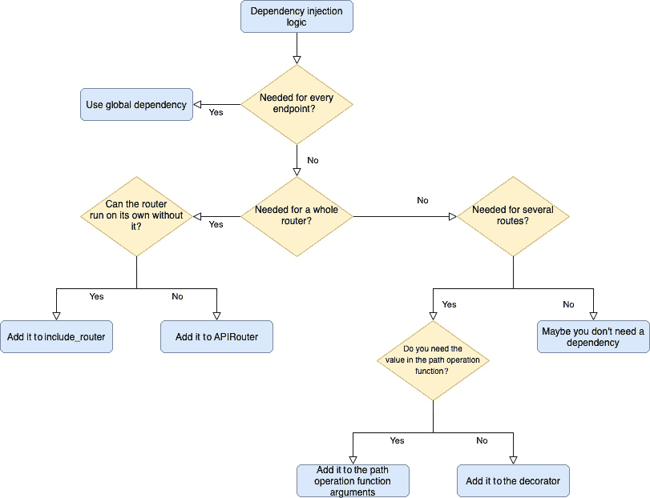

# 第五章：FastAPI 中的依赖注入

在本章中，我们将重点讨论 FastAPI 最有趣的部分之一：**依赖注入**。你将会看到，它是一种强大且易于阅读的方式，用于在项目中重用逻辑。事实上，它将允许你为项目创建复杂的构建模块，这些模块可以在整个逻辑中重复使用。认证系统、查询参数验证器或速率限制器是依赖项的典型用例。在 FastAPI 中，依赖注入甚至可以递归调用另一个依赖项，从而允许你从基础功能构建高级模块。到本章结束时，你将能够为 FastAPI 创建自己的依赖项，并在项目的多个层次上使用它们。

在本章中，我们将涵盖以下主要主题：

+   什么是依赖注入？

+   创建和使用函数依赖项

+   使用类创建和使用带参数的依赖项

+   在路径、路由器和全局级别使用依赖项

# 技术要求

要运行代码示例，你需要一个 Python 虚拟环境，我们在*第一章*中设置了该环境，*Python 开发* *环境设置*。

你可以在专门的 GitHub 仓库中找到本章的所有代码示例：[`github.com/PacktPublishing/Building-Data-Science-Applications-with-FastAPI-Second-Edition/tree/main/chapter05`](https://github.com/PacktPublishing/Building-Data-Science-Applications-with-FastAPI-Second-Edition/tree/main/chapter05)。

# 什么是依赖注入？

一般来说，**依赖注入**是一种自动实例化对象及其依赖项的系统。开发者的责任是仅提供对象创建的声明，让系统在运行时解析所有的依赖链并创建实际的对象。

FastAPI 允许你通过在路径操作函数的参数中声明它们，仅声明你希望使用的对象和变量。事实上，我们在前几章中已经使用了依赖注入。在以下示例中，我们使用 `Header` 函数来检索 `user-agent` 头信息：

chapter05_what_is_dependency_injection_01.py

```py

from fastapi import FastAPI, Headerapp = FastAPI()
@app.get("/")
async def header(user_agent: str = Header(...)):
    return {"user_agent": user_agent}
```

[`github.com/PacktPublishing/Building-Data-Science-Applications-with-FastAPI-Second-Edition/tree/main/chapter05/chapter05_what_is_dependency_injection_01.py`](https://github.com/PacktPublishing/Building-Data-Science-Applications-with-FastAPI-Second-Edition/tree/main/chapter05/chapter05_what_is_dependency_injection_01.py)

内部来说，`Header` 函数具有一些逻辑，可以自动获取 `request` 对象，检查是否存在所需的头信息，返回其值，或者在不存在时抛出错误。然而，从开发者的角度来看，我们并不知道它是如何处理所需的对象的：我们只需要获取我们所需的值。*这就是* *依赖注入*。

诚然，你可以通过在 `request` 对象的 `headers` 字典中选取 `user-agent` 属性来在函数体中轻松地重现这个示例。然而，依赖注入方法相比之下有许多优势：

+   *意图明确*：你可以在不阅读函数代码的情况下，知道端点在请求数据中期望什么。

+   你有一个*明确的关注点分离*：端点的逻辑和更通用的逻辑之间的头部检索及其关联的错误处理不会污染其他逻辑；它在依赖函数中自包含。此外，它可以轻松地在其他端点中重用。

+   在 FastAPI 中，它被用来*生成 OpenAPI 架构*，以便自动生成的文档可以清楚地显示此端点所需的参数。

换句话说，每当你需要一些工具逻辑来检索或验证数据、进行安全检查，或调用你在应用中多次需要的外部逻辑时，依赖是一个理想的选择。

FastAPI 很大程度上依赖于这个依赖注入系统，并鼓励开发者使用它来实现他们的构建模块。如果你来自其他 Web 框架，比如 Flask 或 Express，可能会有些困惑，但你肯定会很快被它的强大和相关性所说服。

为了说服你，我们现在将看到如何创建和使用你自己的依赖，首先从函数形式开始。

# 创建并使用一个函数依赖

在 FastAPI 中，依赖可以被定义为一个函数或一个可调用的类。在本节中，我们将重点关注函数，因为它们是你最可能经常使用的。

正如我们所说，依赖是将一些逻辑封装起来的方式，这些逻辑会获取一些子值或子对象，处理它们，并最终返回一个将被注入到调用端点中的值。

让我们来看第一个示例，我们定义一个函数依赖来获取分页查询参数 `skip` 和 `limit`：

chapter05_function_dependency_01.py

```py

async def pagination(skip: int = 0, limit: int = 10) -> tuple[int, int]:    return (skip, limit)
@app.get("/items")
async def list_items(p: tuple[int, int] = Depends(pagination)):
    skip, limit = p
    return {"skip": skip, "limit": limit}
```

[`github.com/PacktPublishing/Building-Data-Science-Applications-with-FastAPI-Second-Edition/tree/main/chapter05/chapter05_function_dependency_01.py`](https://github.com/PacktPublishing/Building-Data-Science-Applications-with-FastAPI-Second-Edition/tree/main/chapter05/chapter05_function_dependency_01.py)

这个示例有两个部分：

+   首先，我们有依赖定义，带有 `pagination` 函数。你会看到我们定义了两个参数，`skip` 和 `limit`，它们是具有默认值的整数。这些将是我们端点的查询参数。我们定义它们的方式与在路径操作函数中定义的方式完全相同。这就是这种方法的美妙之处：FastAPI 会递归地处理依赖中的参数，并根据需要与请求数据（如查询参数或头部）进行匹配。

我们只需将这些值作为一个元组返回。

+   第二，我们有路径操作函数 `list_items`，它使用了 `pagination` 依赖。你可以看到，使用方法与我们为头部或正文值所做的非常相似：我们定义了结果参数的名称，并使用函数结果作为默认值。对于依赖，我们使用 `Depends` 函数。它的作用是将函数作为参数传递，并在调用端点时执行它。子依赖会被自动发现并执行。

在该端点中，我们将分页直接作为一个元组返回。

让我们使用以下命令运行这个示例：

```py

$ uvicorn chapter05_function_dependency_01:app
```

现在，我们将尝试调用 `/items` 端点，看看它是否能够获取查询参数。你可以使用以下 HTTPie 命令来尝试：

```py

$ http "http://localhost:8000/items?limit=5&skip=10"HTTP/1.1 200 OK
content-length: 21
content-type: application/json
date: Tue, 15 Nov 2022 08:33:46 GMT
server: uvicorn
{
    "limit": 5,
    "skip": 10
}
```

`limit` 和 `skip` 查询参数已经通过我们的函数依赖正确地获取。你也可以尝试不带查询参数调用该端点，并注意它会返回默认值。

依赖返回值的类型提示

你可能已经注意到，我们在路径操作的参数中必须对依赖的结果进行类型提示，即使我们已经为依赖函数本身进行了类型提示。不幸的是，这是 FastAPI 及其 `Depends` 函数的一个限制，`Depends` 函数无法传递依赖函数的类型。因此，我们必须手动对结果进行类型提示，就像我们在这里所做的那样。

就这样！如你所见，在 FastAPI 中创建和使用依赖非常简单直接。当然，你现在可以在多个端点中随意重用它，正如你在其余示例中所看到的那样。

chapter05_function_dependency_01.py

```py

@app.get("/things")async def list_things(p: tuple[int, int] = Depends(pagination)):
    skip, limit = p
    return {"skip": skip, "limit": limit}
```

[`github.com/PacktPublishing/Building-Data-Science-Applications-with-FastAPI-Second-Edition/tree/main/chapter05/chapter05_function_dependency_01.py`](https://github.com/PacktPublishing/Building-Data-Science-Applications-with-FastAPI-Second-Edition/tree/main/chapter05/chapter05_function_dependency_01.py)

在这些依赖中，我们可以做更复杂的事情，就像在常规路径操作函数中一样。在以下示例中，我们为这些分页参数添加了一些验证，并将 `limit` 限制为 `100`：

chapter05_function_dependency_02.py

```py

async def pagination(    skip: int = Query(0, ge=0),
    limit: int = Query(10, ge=0),
) -> tuple[int, int]:
    capped_limit = min(100, limit)
    return (skip, capped_limit)
```

[`github.com/PacktPublishing/Building-Data-Science-Applications-with-FastAPI-Second-Edition/tree/main/chapter05/chapter05_function_dependency_02.py`](https://github.com/PacktPublishing/Building-Data-Science-Applications-with-FastAPI-Second-Edition/tree/main/chapter05/chapter05_function_dependency_02.py)

如你所见，我们的依赖开始变得更加复杂：

+   我们在参数中添加了 `Query` 函数来增加验证约束；现在，如果 `skip` 或 `limit` 是负整数，系统将抛出 `422` 错误。

+   我们确保 `limit` 最多为 `100`。

我们的路径操作函数中的代码不需要修改；我们清楚地将端点的逻辑与分页参数的更通用逻辑分开。

让我们来看另一个典型的依赖项使用场景：获取一个对象或引发`404`错误。

## 获取对象或引发 404 错误

在 REST API 中，你通常会有端点用于根据路径中的标识符获取、更新和删除单个对象。在每个端点中，你很可能会有相同的逻辑：尝试从数据库中检索这个对象，或者如果它不存在，就引发一个`404`错误。这是一个非常适合使用依赖项的场景！在以下示例中，你将看到如何实现它：

chapter05_function_dependency_03.py

```py

async def get_post_or_404(id: int) -> Post:    try:
        return db.posts[id]
    except KeyError:
        raise HTTPException(status_code=status.HTTP_404_NOT_FOUND)
```

[`github.com/PacktPublishing/Building-Data-Science-Applications-with-FastAPI-Second-Edition/tree/main/chapter05/chapter05_function_dependency_03.py`](https://github.com/PacktPublishing/Building-Data-Science-Applications-with-FastAPI-Second-Edition/tree/main/chapter05/chapter05_function_dependency_03.py)

依赖项的定义很简单：它接受一个参数，即我们想要获取的帖子的 ID。它将从相应的路径参数中提取。然后，我们检查它是否存在于我们的虚拟字典数据库中：如果存在，我们返回它；否则，我们会引发一个`404`状态码的 HTTP 异常。

这是这个示例的关键要点：*你可以在依赖项中引发错误*。在执行端点逻辑之前，检查某些前置条件是非常有用的。另一个典型的例子是身份验证：如果端点需要用户认证，我们可以通过检查令牌或 cookie，在依赖项中引发`401`错误。

现在，我们可以在每个 API 端点中使用这个依赖项，如下例所示：

chapter05_function_dependency_03.py

```py

@app.get("/posts/{id}")async def get(post: Post = Depends(get_post_or_404)):
    return post
@app.patch("/posts/{id}")
async def update(post_update: PostUpdate, post: Post = Depends(get_post_or_404)):
    updated_post = post.copy(update=post_update.dict())
    db.posts[post.id] = updated_post
    return updated_post
@app.delete("/posts/{id}", status_code=status.HTTP_204_NO_CONTENT)
async def delete(post: Post = Depends(get_post_or_404)):
    db.posts.pop(post.id)
```

[`github.com/PacktPublishing/Building-Data-Science-Applications-with-FastAPI-Second-Edition/tree/main/chapter05/chapter05_function_dependency_03.py`](https://github.com/PacktPublishing/Building-Data-Science-Applications-with-FastAPI-Second-Edition/tree/main/chapter05/chapter05_function_dependency_03.py)

如你所见，我们只需要定义`post`参数并在`get_post_or_404`依赖项上使用`Depends`函数。然后，在路径操作逻辑中，我们可以确保手头有`post`对象，我们可以集中处理核心逻辑，现在变得非常简洁。例如，`get`端点只需要返回该对象。

在这种情况下，唯一需要注意的是不要忘记这些端点路径中的 ID 参数。根据 FastAPI 的规则，如果你在路径中没有设置这个参数，它会自动被视为查询参数，这不是我们想要的。你可以在*第三章*，*使用 FastAPI 开发 RESTful API*的*路径参数*部分找到更多详细信息。

这就是函数依赖项的全部内容。正如我们所说，它们是 FastAPI 项目的主要构建块。然而，在某些情况下，你可能需要在这些依赖项中设置一些参数——例如，来自环境变量的值。为此，我们可以定义类依赖项。

# 使用类创建和使用带参数的依赖项

在前一部分中，我们将依赖项定义为常规函数，这在大多数情况下效果良好。然而，你可能需要为依赖项设置一些参数，以便精细调整其行为。由于函数的参数是由依赖注入系统设置的，我们无法向函数添加额外的参数。

在分页示例中，我们添加了一些逻辑将限制值设定为 `100`。如果我们想要动态设置这个最大限制值，该如何操作呢？

解决方案是创建一个作为依赖项使用的类。这样，我们可以通过 `__init__` 方法等设置类属性，并在依赖项的逻辑中使用它们。这些逻辑将会在类的 `__call__` 方法中定义。如果你还记得我们在*第二章*的*可调用对象*部分中学到的内容，你会知道它使对象可调用，也就是说，它可以像常规函数一样被调用。事实上，这就是 `Depends` 对依赖项的所有要求：可调用。我们将利用这一特性，通过类来创建一个带参数的依赖项。

在下面的示例中，我们使用类重新实现了分页示例，这使得我们可以动态设置最大限制：

chapter05_class_dependency_01.py

```py

class Pagination:    def __init__(self, maximum_limit: int = 100):
        self.maximum_limit = maximum_limit
    async def __call__(
        self,
        skip: int = Query(0, ge=0),
        limit: int = Query(10, ge=0),
    ) -> tuple[int, int]:
        capped_limit = min(self.maximum_limit, limit)
        return (skip, capped_limit)
```

[`github.com/PacktPublishing/Building-Data-Science-Applications-with-FastAPI-Second-Edition/tree/main/chapter05/chapter05_class_dependency_01.py`](https://github.com/PacktPublishing/Building-Data-Science-Applications-with-FastAPI-Second-Edition/tree/main/chapter05/chapter05_class_dependency_01.py)

正如你所看到的，`__call__` 方法中的逻辑与我们在前一个示例中定义的函数相同。唯一的区别是，我们可以从类的属性中获取最大限制值，这些属性可以在对象初始化时设置。

然后，你可以简单地创建该类的实例，并在路径操作函数中使用 `Depends` 作为依赖项，就像你在以下代码块中看到的那样：

chapter05_class_dependency_01.py

```py

pagination = Pagination(maximum_limit=50)@app.get("/items")
async def list_items(p: tuple[int, int] = Depends(pagination)):
    skip, limit = p
    return {"skip": skip, "limit": limit}
```

[`github.com/PacktPublishing/Building-Data-Science-Applications-with-FastAPI-Second-Edition/tree/main/chapter05/chapter05_class_dependency_01.py`](https://github.com/PacktPublishing/Building-Data-Science-Applications-with-FastAPI-Second-Edition/tree/main/chapter05/chapter05_class_dependency_01.py)

在这里，我们硬编码了 `50` 的值，但我们完全可以从配置文件或环境变量中获取这个值。

类依赖的另一个优点是它可以在内存中保持局部值。如果我们需要进行一些繁重的初始化逻辑，例如加载一个机器学习模型，我们希望在启动时只做一次。然后，可调用的部分只需调用已加载的模型来进行预测，这应该是非常快速的。

## 使用类方法作为依赖项

即使`__call__`方法是实现类依赖的最直接方式，你也可以直接将方法传递给`Depends`。实际上，正如我们所说，它只需要一个可调用对象作为参数，而类方法是一个完全有效的可调用对象！

如果你有一些公共参数或逻辑需要在稍微不同的情况下重用，这种方法非常有用。例如，你可以有一个使用 scikit-learn 训练的预训练机器学习模型。在应用决策函数之前，你可能想根据输入数据应用不同的预处理步骤。

要做到这一点，只需将你的逻辑写入一个类方法，并通过点符号将其传递给`Depends`函数。

你可以在以下示例中看到这一点，我们为分页依赖项实现了另一种样式，使用`page`和`size`参数，而不是`skip`和`limit`：

chapter05_class_dependency_02.py

```py

class Pagination:    def __init__(self, maximum_limit: int = 100):
        self.maximum_limit = maximum_limit
    async def skip_limit(
        self,
        skip: int = Query(0, ge=0),
        limit: int = Query(10, ge=0),
    ) -> tuple[int, int]:
        capped_limit = min(self.maximum_limit, limit)
        return (skip, capped_limit)
    async def page_size(
        self,
        page: int = Query(1, ge=1),
        size: int = Query(10, ge=0),
    ) -> tuple[int, int]:
        capped_size = min(self.maximum_limit, size)
        return (page, capped_size)
```

[`github.com/PacktPublishing/Building-Data-Science-Applications-with-FastAPI-Second-Edition/tree/main/chapter05/chapter05_class_dependency_02.py`](https://github.com/PacktPublishing/Building-Data-Science-Applications-with-FastAPI-Second-Edition/tree/main/chapter05/chapter05_class_dependency_02.py)

这两种方法的逻辑非常相似。我们只是在查看不同的查询参数。然后，在我们的路径操作函数中，我们将`/items`端点设置为使用`skip`/`limit`样式，而`/things`端点将使用`page`/`size`样式：

chapter05_class_dependency_02.py

```py

pagination = Pagination(maximum_limit=50)@app.get("/items")
async def list_items(p: tuple[int, int] = Depends(pagination.skip_limit)):
    skip, limit = p
    return {"skip": skip, "limit": limit}
@app.get("/things")
async def list_things(p: tuple[int, int] = Depends(pagination.page_size)):
    page, size = p
    return {"page": page, "size": size}
```

[`github.com/PacktPublishing/Building-Data-Science-Applications-with-FastAPI-Second-Edition/tree/main/chapter05/chapter05_class_dependency_02.py`](https://github.com/PacktPublishing/Building-Data-Science-Applications-with-FastAPI-Second-Edition/tree/main/chapter05/chapter05_class_dependency_02.py)

正如你所看到的，我们只需通过点符号将所需的方法传递给`pagination`对象。

总结来说，类依赖方法比函数依赖方法更为先进，但在需要动态设置参数、执行繁重的初始化逻辑或在多个依赖项之间重用公共逻辑时非常有用。

到目前为止，我们假设我们关心依赖项的返回值。虽然大多数情况下确实如此，但你可能偶尔需要调用依赖项以检查某些条件，但并不需要返回值。FastAPI 允许这种用例，接下来我们将看到这个功能。

# 在路径、路由器和全局级别使用依赖项

如我们所说，依赖项是创建 FastAPI 项目构建模块的推荐方式，它允许你在多个端点间重用逻辑，同时保持代码的最大可读性。到目前为止，我们已将依赖项应用于单个端点，但我们能否将这种方法扩展到整个路由器？甚至是整个 FastAPI 应用程序？事实上，我们可以！

这样做的主要动机是能够在多个路由上应用一些全局请求验证或执行副作用逻辑，而无需在每个端点上都添加依赖项。通常，身份验证方法或速率限制器可能是这个用例的很好的候选者。

为了向你展示它是如何工作的，我们将实现一个简单的依赖项，并在以下所有示例中使用它。你可以在以下示例中看到它：

chapter05_path_dependency_01.py

```py

def secret_header(secret_header: str | None = Header(None)) -> None:    if not secret_header or secret_header != "SECRET_VALUE":
        raise HTTPException(status.HTTP_403_FORBIDDEN)
```

[`github.com/PacktPublishing/Building-Data-Science-Applications-with-FastAPI-Second-Edition/tree/main/chapter05/chapter05_path_dependency_01.py`](https://github.com/PacktPublishing/Building-Data-Science-Applications-with-FastAPI-Second-Edition/tree/main/chapter05/chapter05_path_dependency_01.py)

这个依赖项将简单地查找请求中名为 `Secret-Header` 的头部。如果它缺失或不等于 `SECRET_VALUE`，它将引发 `403` 错误。请注意，这种方法仅用于示例；有更好的方式来保护你的 API，我们将在*第七章*中讨论，*在 FastAPI 中管理身份验证和安全性*。

## 在路径装饰器上使用依赖项

直到现在，我们一直假设我们总是对依赖项的返回值感兴趣。正如我们的 `secret_header` 依赖项在这里清楚地显示的那样，这并非总是如此。这就是为什么你可以将依赖项添加到路径操作装饰器上，而不是传递参数。你可以在以下示例中看到如何操作：

chapter05_path_dependency_01.py

```py

@app.get("/protected-route", dependencies=[Depends(secret_header)])async def protected_route():
    return {"hello": "world"}
```

[`github.com/PacktPublishing/Building-Data-Science-Applications-with-FastAPI-Second-Edition/tree/main/chapter05/chapter05_path_dependency_01.py`](https://github.com/PacktPublishing/Building-Data-Science-Applications-with-FastAPI-Second-Edition/tree/main/chapter05/chapter05_path_dependency_01.py)

路径操作装饰器接受一个参数 `dependencies`，该参数期望一个依赖项列表。你会发现，就像为依赖项传递参数一样，你需要用 `Depends` 函数包装你的函数（或可调用对象）。

现在，每当调用 `/protected-route` 路由时，依赖项将被调用并检查所需的头部信息。

如你所料，由于 `dependencies` 是一个列表，你可以根据需要添加任意数量的依赖项。

这很有趣，但如果我们想保护一整组端点呢？手动为每个端点添加可能会有点繁琐且容易出错。幸运的是，FastAPI 提供了一种方法来实现这一点。

## 在整个路由器上使用依赖项

如果你记得在 *第三章*中的 *使用多个路由器结构化一个更大的项目* 部分，*使用 FastAPI 开发 RESTful API*，你就知道你可以在项目中创建多个路由器，以清晰地拆分 API 的不同部分，并将它们“连接”到你的主 FastAPI 应用程序。这是通过 `APIRouter` 类和 `FastAPI` 类的 `include_router` 方法来完成的。

使用这种方法，将一个依赖项注入整个路由器是很有趣的，这样它会在该路由器的每个路由上被调用。你有两种方法可以做到这一点：

+   在 `APIRouter` 类上设置 `dependencies` 参数，正如以下示例所示：

chapter05_router_dependency_01.py

```py

router = APIRouter(dependencies=[Depends(secret_header)])@router.get("/route1")
async def router_route1():
    return {"route": "route1"}
@router.get("/route2")
async def router_route2():
    return {"route": "route2"}
app = FastAPI()
app.include_router(router, prefix="/router")
```

[`github.com/PacktPublishing/Building-Data-Science-Applications-with-FastAPI-Second-Edition/tree/main/chapter05/chapter05_router_dependency_01.py`](https://github.com/PacktPublishing/Building-Data-Science-Applications-with-FastAPI-Second-Edition/tree/main/chapter05/chapter05_router_dependency_01.py)

+   在 `include_router` 方法上设置 `dependencies` 参数，正如以下示例所示：

chapter05_router_dependency_02.py

```py

router = APIRouter()@router.get("/route1")
async def router_route1():
    return {"route": "route1"}
@router.get("/route2")
async def router_route2():
    return {"route": "route2"}
app = FastAPI()
app.include_router(router, prefix="/router", dependencies=[Depends(secret_header)])
```

[`github.com/PacktPublishing/Building-Data-Science-Applications-with-FastAPI-Second-Edition/tree/main/chapter05/chapter05_router_dependency_02.py`](https://github.com/PacktPublishing/Building-Data-Science-Applications-with-FastAPI-Second-Edition/tree/main/chapter05/chapter05_router_dependency_02.py)

在这两种情况下，`dependencies` 参数都期望一个依赖项的列表。你可以看到，就像传递依赖项作为参数一样，你需要用 `Depends` 函数将你的函数（或可调用对象）包装起来。当然，由于它是一个列表，如果需要，你可以添加多个依赖项。

现在，如何选择这两种方法呢？在这两种情况下，效果完全相同，所以我们可以说其实并不重要。从哲学角度来看，我们可以说，如果依赖项在这个路由器的上下文中是必要的，我们应该在 `APIRouter` 类上声明依赖项。换句话说，我们可以问自己这个问题，*如果我们独立运行这个路由器，是否没有这个依赖项就无法工作*？如果这个问题的答案是*否*，那么你可能应该在 `APIRouter` 类上设置依赖项。否则，在 `include_router` 方法中声明它可能更有意义。但再说一次，这只是一个思想选择，它不会改变你 API 的功能，因此你可以选择你更舒适的方式。

现在，我们能够为整个路由器设置依赖项。在某些情况下，为整个应用程序声明依赖项也可能很有趣！

## 在整个应用程序中使用依赖项

如果你有一个实现了某些日志记录或限流功能的依赖项，例如，将其应用到你 API 的每个端点可能会很有意义。幸运的是，FastAPI 允许这样做，正如以下示例所示：

chapter05_global_dependency_01.py

```py

app = FastAPI(dependencies=[Depends(secret_header)])@app.get("/route1")
async def route1():
    return {"route": "route1"}
@app.get("/route2")
async def route2():
    return {"route": "route2"}
```

[`github.com/PacktPublishing/Building-Data-Science-Applications-with-FastAPI-Second-Edition/tree/main/chapter05/chapter05_global_dependency_01.py`](https://github.com/PacktPublishing/Building-Data-Science-Applications-with-FastAPI-Second-Edition/tree/main/chapter05/chapter05_global_dependency_01.py)

再次强调，你只需直接在主 `FastAPI` 类上设置 `dependencies` 参数。现在，依赖项应用于你 API 中的每个端点！

在 *图 5**.1* 中，我们提出了一个简单的决策树，用于确定你应该在哪个级别注入依赖项：



图 5.1 – 我应该在哪个级别注入我的依赖项？

# 摘要

恭喜！现在你应该已经熟悉了 FastAPI 最具标志性的特性之一：依赖注入。通过实现自己的依赖项，你可以将希望在整个 API 中重用的常见逻辑与端点的逻辑分开。这样可以使你的项目清晰可维护，同时保持最大的可读性；只需将依赖项声明为路径操作函数的参数即可，这将帮助你理解意图，而无需阅读函数体。

这些依赖项可以是简单的包装器，用于检索和验证请求参数，也可以是执行机器学习任务的复杂服务。多亏了基于类的方法，你确实可以设置动态参数或为最复杂的任务保持局部状态。

最后，这些依赖项还可以在路由器或全局级别上使用，允许你对一组路由或整个应用程序执行常见逻辑或检查。

这就是本书第一部分的结束！你现在已经熟悉了 FastAPI 的主要特性，并且应该能够使用这个框架编写干净且高性能的 REST API。

在下一部分中，我们将带你的知识提升到新的高度，并展示如何实现和部署一个强大、安全且经过测试的 Web 后端。第一章将专注于数据库，大多数 API 都需要能够读取和写入数据。
