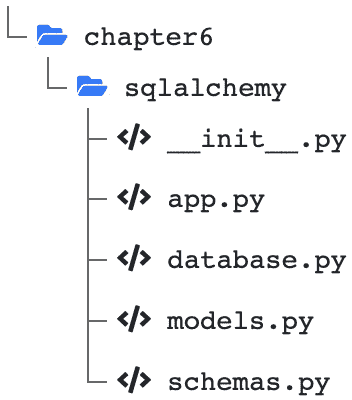

# 第六章：数据库和异步 ORM

REST API 的主要目标当然是读写数据。到目前为止，我们只使用了 Python 和 FastAPI 提供的工具，允许我们构建可靠的端点来处理和响应请求。然而，我们尚未能够有效地检索和持久化这些信息：我们还没有 **数据库**。

本章的目标是展示你如何在 FastAPI 中与不同类型的数据库及相关库进行交互。值得注意的是，FastAPI 对数据库是完全无关的：你可以使用任何你想要的系统，并且集成工作由你负责。这就是为什么我们将回顾两种不同的数据库集成方式：使用 **对象关系映射**（**ORM**）系统连接 SQL 数据库，以及使用 NoSQL 数据库。

本章我们将讨论以下主要主题：

+   关系型数据库和 NoSQL 数据库概述

+   使用 SQLAlchemy ORM 与 SQL 数据库进行通信

+   使用 Motor 与 MongoDB 数据库进行通信

# 技术要求

对于本章，你将需要一个 Python 虚拟环境，正如我们在 *第一章* 中设置的，*Python 开发* *环境设置*。

对于 *使用 Motor 与 MongoDB 数据库进行通信* 部分，你需要在本地计算机上运行 MongoDB 服务器。最简单的方法是将其作为 Docker 容器运行。如果你以前从未使用过 Docker，我们建议你参考官方文档中的 *入门教程*，链接为 [`docs.docker.com/get-started/`](https://docs.docker.com/get-started/)。完成这些步骤后，你将能够使用以下简单命令运行 MongoDB 服务器：

```py

$ docker run -d --name fastapi-mongo -p 27017:27017 mongo:6.0
```

MongoDB 服务器实例将通过端口 `27017` 在你的本地计算机上提供。

你可以在本书专门的 GitHub 仓库中找到本章的所有代码示例，地址为 [`github.com/PacktPublishing/Building-Data-Science-Applications-with-FastAPI-Second-Edition/tree/main/chapter06`](https://github.com/PacktPublishing/Building-Data-Science-Applications-with-FastAPI-Second-Edition/tree/main/chapter06)。

# 关系型数据库和 NoSQL 数据库概述

数据库的作用是以结构化的方式存储数据，保持数据的完整性，并提供查询语言，使你在应用程序需要时能够检索这些数据。

如今，选择适合你网站项目的数据库时，你有两个主要选择：**关系型数据库**，及其相关的 SQL 查询语言，和 **NoSQL 数据库**，它们与第一类数据库相对立。

选择适合你项目的技术由你来决定，因为这在很大程度上取决于你的需求和要求。在本节中，我们将概述这两类数据库的主要特点和功能，并尝试为你提供一些选择适合项目的数据库的见解。

## 关系型数据库

关系型数据库自 1970 年代以来就存在，并且随着时间的推移证明了它们的高效性和可靠性。它们几乎与 SQL 不可分离，SQL 已成为查询此类数据库的事实标准。即使不同数据库引擎之间有一些差异，大多数语法是通用的，简单易懂，足够灵活，可以表达复杂的查询。

关系型数据库实现了关系模型：应用的每个实体或对象都存储在**表**中。例如，如果我们考虑一个博客应用，我们可以有表示*用户*、*帖子*和*评论*的表。

每个表都会有多个**列**，表示实体的属性。如果我们考虑帖子，可能会有一个*标题*、*发布日期*和*内容*。在这些表中，会有多行，每行表示这种类型的一个实体；每篇帖子将有自己的行。

关系型数据库的一个关键点是，如其名称所示，*关系*。每个表可以与其他表建立关系，表中的行可以引用其他表中的行。在我们的示例中，一篇帖子可以与写它的用户相关联。类似地，一条评论可以与其相关的帖子关联。

这样做的主要动机是*避免重复*。事实上，如果我们在每篇帖子上都重复用户的姓名或邮箱，这并不是很高效。如果需要修改某个信息，我们就得通过每篇帖子修改，这容易出错并危及数据一致性。因此，我们更倾向于在帖子中*引用*用户。那么，我们该如何实现这一点呢？

通常，关系型数据库中的每一行都有一个标识符，称为**主键**。这个键在表中是唯一的，允许你唯一标识这一行。因此，可以在另一个表中使用这个键来引用它。我们称之为**外键**：外键之所以叫做外，是因为它引用了另一个表。

*图 6.1*展示了使用实体-关系图表示这种数据库模式的方式。请注意，每个表都有自己的主键，名为`id`。`Post`表通过`user_id`外键引用一个用户。类似地，`Comment`表通过`user_id`和`post_id`外键分别引用一个用户和一篇帖子：


图 6.1 – 博客应用的关系型数据库模式示例

在一个应用中，你可能希望检索一篇帖子，以及与之相关的评论和用户。为了实现这一点，我们可以执行一个**连接查询**，根据外键返回所有相关记录。关系型数据库旨在高效地执行此类任务；然而，如果模式更加复杂，这些操作可能会变得昂贵。这就是为什么在设计关系型模式及其查询时需要小心谨慎的原因。

## NoSQL 数据库

所有非关系型的数据库引擎都属于 NoSQL 范畴。这是一个相当模糊的术语，涵盖了不同类型的数据库：键值存储，例如 Redis；图数据库，例如 Neo4j；以及面向文档的数据库，例如 MongoDB。也就是说，当我们谈论“NoSQL 数据库”时，通常是指面向文档的数据库。它们是我们关注的对象。

面向文档的数据库摒弃了关系型架构，试图将给定对象的所有信息存储在一个**文档**中。因此，执行联接查询的情况非常少见，通常也更为困难。

这些文档存储在**集合**中。与关系型数据库不同，集合中的文档可能没有相同的属性：关系型数据库中的表有定义好的模式，而集合可以接受任何类型的文档。

*图 6.2* 显示了我们之前博客示例的表示，已经调整为面向文档的数据库结构。在这种配置中，我们选择了一个集合用于用户，另一个集合用于帖子。然而，请注意，评论现在是帖子的组成部分，直接作为一个列表包含在内：


图 6.2 — 博客应用的面向文档的架构示例

要检索一篇帖子及其所有评论，你不需要执行联接查询：所有数据只需一个查询即可获取。这是开发面向文档数据库的主要动机：通过减少查看多个集合的需求来提高查询性能。特别是，它们在处理具有巨大数据规模和较少结构化数据的应用（如社交网络）时表现出了极大的价值。

## 你应该选择哪一个？

正如我们在本节引言中提到的，你选择数据库引擎很大程度上取决于你的应用和需求。关系型数据库和面向文档的数据库之间的详细比较超出了本书的范围，但我们可以看一下你需要考虑的一些要素。

关系型数据库非常适合存储结构化数据，且实体之间存在大量关系。此外，它们在任何情况下都会维护数据的一致性，即使在发生错误或硬件故障时也不例外。然而，你必须精确定义模式，并考虑迁移系统，以便在需求变化时更新你的模式。

另一方面，面向文档的数据库不需要你定义模式：它们接受任何文档结构，因此如果你的数据高度可变或你的项目尚未成熟，它们会很方便。其缺点是，它们在数据一致性方面要求较低，可能导致数据丢失或不一致。

对于小型和中型应用程序，选择并不太重要：关系型数据库和面向文档的数据库都经过了高度优化，在这些规模下都会提供出色的性能。

接下来，我们将展示如何使用 FastAPI 处理这些不同类型的数据库。当我们在*第二章*中介绍异步 I/O 时，*Python 编程特性*，我们提到过选择你用来执行 I/O 操作的库是很重要的。当然，在这种情况下，数据库尤为重要！

尽管在 FastAPI 中使用经典的非异步库是完全可行的，但你可能会错过框架的一个关键方面，无法达到它所能提供的最佳性能。因此，在本章中，我们将只专注于异步库。

# 使用 SQLAlchemy ORM 与 SQL 数据库进行通信

首先，我们将讨论如何使用 SQLAlchemy 库处理关系型数据库。SQLAlchemy 已经存在多年，并且是 Python 中处理 SQL 数据库时最受欢迎的库。从版本 1.4 开始，它也原生支持异步。

理解这个库的关键点是，它由两个部分组成：

+   **SQLAlchemy Core**，提供了读取和写入 SQL 数据库数据的所有基本功能

+   **SQLAlchemy ORM**，提供对 SQL 概念的强大抽象

虽然你可以选择只使用 SQLAlchemy Core，但通常使用 ORM 更为方便。ORM 的目标是抽象出表和列的 SQL 概念，这样你只需要处理 Python 对象。ORM 的作用是将这些对象*映射*到它们所属的表和列，并自动生成相应的 SQL 查询。

第一步是安装这个库：

```py

(venv) $ pip install "sqlalchemy[asyncio,mypy]"
```

请注意，我们添加了两个可选依赖项：`asyncio`和`mypy`。第一个确保安装了异步支持所需的工具。

第二个是一个为 mypy 提供特殊支持的插件，专门用于 SQLAlchemy。ORM 在后台做了很多“魔法”事情，这些对于类型检查器来说很难理解。有了这个插件，mypy 能够学会识别这些构造。

正如我们在介绍中所说，存在许多 SQL 引擎。你可能听说过 PostgreSQL 和 MySQL，它们是最受欢迎的引擎之一。另一个有趣的选择是 SQLite，它是一个小型引擎，所有数据都存储在你电脑上的单个文件中，不需要复杂的服务器软件。它非常适合用于测试和实验。为了让 SQLAlchemy 能够与这些引擎进行通信，你需要安装相应的**驱动程序**。根据你的引擎，这里是你需要安装的异步驱动程序：

+   PostgreSQL：

    ```py

    (venv) $ pip install asyncpg
    ```

+   MySQL：

    ```py

    (venv) $ pip install aiomysql
    ```

+   SQLite：

    ```py

    (venv) $ pip install aiosqlite
    ```

在本节的其余部分，我们将使用 SQLite 数据库。我们将一步步展示如何设置完整的数据库交互。*图 6.4*展示了项目的结构：



图 6.3 – FastAPI 和 SQLAlchemy 项目结构

## 创建 ORM 模型

首先，您需要定义您的 ORM 模型。每个模型是一个 Python 类，其属性代表表中的列。数据库中的实际实体将是该类的实例，您可以像访问任何其他对象一样访问其数据。在幕后，SQLAlchemy ORM 的作用是将 Python 对象与数据库中的行链接起来。让我们来看一下我们博客文章模型的定义：

models.py

```py

from datetime import datetimefrom sqlalchemy import DateTime, Integer, String, Text
from sqlalchemy.orm import DeclarativeBase, Mapped, mapped_column
class Base(DeclarativeBase):
    pass
class Post(Base):
    __tablename__ = "posts"
    id: Mapped[int] = mapped_column(Integer, primary_key=True, autoincrement=True)
    publication_date: Mapped[datetime] = mapped_column(
        DateTime, nullable=False, default=datetime.now
    )
    title: Mapped[str] = mapped_column(String(255), nullable=False)
    content: Mapped[str] = mapped_column(Text, nullable=False)
```

[`github.com/PacktPublishing/Building-Data-Science-Applications-with-FastAPI-Second-Edition/tree/main/chapter06/sqlalchemy/models.py`](https://github.com/PacktPublishing/Building-Data-Science-Applications-with-FastAPI-Second-Edition/tree/main/chapter06/sqlalchemy/models.py)

第一步是创建一个继承自 `DeclarativeBase` 的 `Base` 类。*我们所有的模型都将继承自这个类*。在内部，SQLAlchemy 使用它来将所有有关数据库模式的信息集中在一起。这就是为什么在整个项目中只需要创建一次，并始终使用相同的 `Base` 类。

接下来，我们必须定义我们的 `Post` 类。再次注意，它是如何从 `Base` 类继承的。在这个类中，我们可以以类属性的形式定义每一列。它们是通过 `mapped_column` 函数来赋值的，这个函数帮助我们定义列的类型及其相关属性。例如，我们将 `id` 列定义为一个自增的整数主键，这在 SQL 数据库中非常常见。

请注意，我们不会详细介绍 SQLAlchemy 提供的所有类型和选项。只需知道它们与 SQL 数据库通常提供的类型非常相似。您可以在官方文档中查看完整的列表，如下所示：

+   您可以在 [`docs.sqlalchemy.org/en/20/core/type_basics.html#generic-camelcase-types`](https://docs.sqlalchemy.org/en/20/core/type_basics.html#generic-camelcase-types) 找到类型的列表。

+   您可以在 [`docs.sqlalchemy.org/en/20/orm/mapping_api.html#sqlalchemy.orm.mapped_column`](https://docs.sqlalchemy.org/en/20/orm/mapping_api.html#sqlalchemy.orm.mapped_column) 找到 `mapped_column` 参数的列表。

这里另一个值得注意的有趣点是，我们为每个属性添加了类型提示，这些类型与我们列的 Python 类型对应。这将极大地帮助我们在开发过程中：例如，如果我们尝试获取帖子对象的 `title` 属性，类型检查器会知道它是一个字符串。为了使这一点生效，请注意，我们将每个类型都包裹在 `Mapped` 类中。这是 SQLAlchemy 提供的一个特殊类，类型检查器可以通过它了解数据的底层类型，当我们将一个 `MappedColumn` 对象分配给它时。

这是在 SQLAlchemy 2.0 中声明模型的方式

我们将在本节中展示的声明模型的方式是 SQLAlchemy 2.0 中引入的最新方式。

如果你查看网上较老的教程或文档，你可能会看到一种略有不同的方法，其中我们将属性分配给`Column`对象。虽然这种旧风格在 SQLAlchemy 2.0 中仍然有效，但它应该被视为过时的。

现在我们有了一个帮助我们读写数据库中帖子数据的模型。然而，正如你现在所知道的，使用 FastAPI 时，我们还需要 Pydantic 模型，以便验证输入数据并在 API 中输出正确的表示。如果你需要复习这部分内容，可以查看*第三章*，*使用 FastAPI 开发 RESTful API*。

## 定义 Pydantic 模型

正如我们所说的，如果我们想正确验证进出 FastAPI 应用的数据，我们需要使用 Pydantic 模型。在 ORM 上下文中，它们将帮助我们*在 ORM 模型之间来回转换*。这一节的关键要点是：我们将使用 Pydantic 模型来验证和序列化数据，但数据库通信将通过 ORM 模型完成。

为了避免混淆，我们现在将 Pydantic 模型称为**模式**。当我们谈论模型时，我们指的是 ORM 模型。

这就是为什么那些模式的定义被放置在`schemas.py`模块中的原因，如下所示：

schemas.py

```py

from datetime import datetimefrom pydantic import BaseModel, Field
class PostBase(BaseModel):
    title: str
    content: str
    publication_date: datetime = Field(default_factory=datetime.now)
    class Config:
        orm_mode = True
class PostPartialUpdate(BaseModel):
    title: str | None = None
    content: str | None = None
class PostCreate(PostBase):
    pass
class PostRead(PostBase):
    id: int
```

[`github.com/PacktPublishing/Building-Data-Science-Applications-with-FastAPI-Second-Edition/tree/main/chapter06/sqlalchemy/schemas.py`](https://github.com/PacktPublishing/Building-Data-Science-Applications-with-FastAPI-Second-Edition/tree/main/chapter06/sqlalchemy/schemas.py%0D)

上面的代码对应我们在*第四章*中解释的模式，*在 FastAPI 中管理 Pydantic 数据模型*。

但有一个新内容：你可能已经注意到`Config`子类，它是在`PostBase`中定义的。这是为 Pydantic 模式添加一些配置选项的一种方式。在这里，我们将`orm_mode`选项设置为`True`。顾名思义，这是一个使 Pydantic 与 ORM 更好配合的选项。在标准设置下，Pydantic 被设计用来解析字典中的数据：如果它想解析`title`属性，它会使用`d["title"]`。然而，在 ORM 中，我们通过点号表示法（`o.title`）来像访问对象一样访问属性。启用 ORM 模式后，Pydantic 就能使用这种风格。

## 连接到数据库

现在我们的模型和模式已经准备好了，我们必须设置 FastAPI 应用和数据库引擎之间的连接。为此，我们将创建一个`database.py`模块，并在其中放置我们需要的对象：

database.py

```py

from collections.abc import AsyncGeneratorfrom sqlalchemy.ext.asyncio import AsyncSession, async_sessionmaker, create_async_engine
from chapter06.sqlalchemy.models import Base
DATABASE_URL = "sqlite+aiosqlite:///chapter06_sqlalchemy.db"
engine = create_async_engine(DATABASE_URL)
async_session_maker = async_sessionmaker(engine, expire_on_commit=False)
```

[`github.com/PacktPublishing/Building-Data-Science-Applications-with-FastAPI-Second-Edition/tree/main/chapter06/sqlalchemy/database.py`](https://github.com/PacktPublishing/Building-Data-Science-Applications-with-FastAPI-Second-Edition/tree/main/chapter06/sqlalchemy/database.py%0D)

在这里，你可以看到我们已经将连接字符串设置在`DATABASE_URL`变量中。通常，它由以下几个部分组成：

+   数据库引擎。在这里，我们使用`sqlite`。

+   可选的驱动程序，后面带有加号。这里，我们设置为`aiosqlite`。在异步环境中，必须指定我们想要使用的异步驱动程序。否则，SQLAlchemy 会回退到标准的同步驱动程序。

+   可选的身份验证信息。

+   数据库服务器的主机名。在 SQLite 的情况下，我们只需指定将存储所有数据的文件路径。

你可以在官方 SQLAlchemy 文档中找到该格式的概述：[`docs.sqlalchemy.org/en/20/core/engines.html#database-urls`](https://docs.sqlalchemy.org/en/20/core/engines.html#database-urls)。

然后，我们使用`create_async_engine`函数和这个 URL 创建引擎。引擎是一个对象，SQLAlchemy 将在其中管理与数据库的连接。此时，重要的是要理解，尚未建立任何连接：我们只是声明了相关内容。

然后，我们有一个更为复杂的代码行来定义`async_session_maker`变量。我们不会深入讨论`async_sessionmaker`函数的细节。只需知道它返回一个函数，允许我们生成与数据库引擎绑定的**会话**。

什么是会话？它是由 ORM 定义的概念。会话将与数据库建立实际连接，并代表一个*区域*，在该区域中它将存储你从数据库中读取的所有对象以及你定义的所有将在数据库中写入的对象。它是 ORM 概念和基础 SQL 查询之间的代理。

在构建 HTTP 服务器时，我们通常在请求开始时*打开一个新的会话*，并在响应请求时*关闭它*。因此，每个 HTTP 请求代表与数据库的一个工作单元。这就是为什么我们必须定义一个 FastAPI 依赖项，其作用是提供一个新的会话给我们：

database.py

```py

async def get_async_session() -> AsyncGenerator[AsyncSession, None]:    async with async_session_maker() as session:
        yield session
```

[`github.com/PacktPublishing/Building-Data-Science-Applications-with-FastAPI-Second-Edition/tree/main/chapter06/sqlalchemy/database.py`](https://github.com/PacktPublishing/Building-Data-Science-Applications-with-FastAPI-Second-Edition/tree/main/chapter06/sqlalchemy/database.py)

将它作为依赖项将大大帮助我们在实现路径操作函数时。

到目前为止，我们还没有机会讨论`with`语法。在 Python 中，这被称为`with`块，对象会自动执行设置逻辑。当你*退出*该块时，它会执行拆解逻辑。你可以在 Python 文档中阅读更多关于上下文管理器的信息：[`docs.python.org/3/reference/datamodel.html#with-statement-context-managers`](https://docs.python.org/3/reference/datamodel.html#with-statement-context-managers)。

在我们的案例中，`async_session_maker`作为上下文管理器工作。它负责打开与数据库的连接等操作。

注意，我们在这里通过使用`yield`定义了一个生成器。这一点很重要，因为它确保了*会话在请求结束前保持打开状态*。如果我们使用一个简单的`return`语句，上下文管理器会立即关闭。使用`yield`时，我们确保只有在请求和端点逻辑被 FastAPI 完全处理后，才会退出上下文管理器。

使用依赖注入来获取数据库实例

你可能会想，为什么我们不直接在路径操作函数中调用`async_session_maker`，而是使用依赖注入。这是可行的，但当我们尝试实现单元测试时会非常困难。实际上，将这个实例替换为模拟对象或测试数据库将变得非常困难。通过使用依赖注入，FastAPI 使得我们可以轻松地将其替换为另一个函数。我们将在*第九章*，*使用 pytest 和 HTTPX 异步测试 API*中详细了解这一点。

在这个模块中我们必须定义的最后一个函数是`create_all_tables`。它的目标是创建数据库中的表模式。如果我们不这么做，数据库将是空的，无法保存或检索数据。像这样创建模式是一种简单的做法，只适用于简单的示例和实验。在实际应用中，你应该有一个合适的迁移系统，确保你的数据库模式保持同步。我们将在本章稍后学习如何为 SQLAlchemy 设置迁移系统。

为了确保在应用启动时创建我们的模式，我们必须在`app.py`模块中调用这个函数：

app.py

```py

@contextlib.asynccontextmanagerasync def lifespan(app: FastAPI):
    await create_all_tables()
    yield
```

[`github.com/PacktPublishing/Building-Data-Science-Applications-with-FastAPI-Second-Edition/tree/main/chapter06/sqlalchemy/app.py`](https://github.com/PacktPublishing/Building-Data-Science-Applications-with-FastAPI-Second-Edition/tree/main/chapter06/sqlalchemy/app.py)

## 创建对象

让我们从向数据库中插入新对象开始。主要的挑战是接受 Pydantic 模式作为输入，将其转换为 SQLAlchemy 模型，并将其保存到数据库中。让我们回顾一下这个过程，如下例所示：

app.py

```py

@app.post(    "/posts", response_model=schemas.PostRead, status_code=status.HTTP_201_CREATED
)
async def create_post(
    post_create: schemas.PostCreate, session: AsyncSession = Depends(get_async_session)
) -> Post:
    post = Post(**post_create.dict())
    session.add(post)
    await session.commit()
    return post
```

[`github.com/PacktPublishing/Building-Data-Science-Applications-with-FastAPI-Second-Edition/tree/main/chapter06/sqlalchemy/app.py`](https://github.com/PacktPublishing/Building-Data-Science-Applications-with-FastAPI-Second-Edition/tree/main/chapter06/sqlalchemy/app.py)

在这里，我们有一个`POST`端点，接受我们的`PostCreate`模式。注意，我们通过`get_async_session`依赖注入了一个新的 SQLAlchemy 会话。核心逻辑包括两个操作。

首先，我们将`post_create`转换为完整的`Post`模型对象。为此，我们可以简单地调用 Pydantic 的`dict`方法，并用`**`解包它，直接赋值给属性。此时，文章还没有保存到数据库中：我们需要告诉会话有关它的信息。

第一步是通过`add`方法*将其添加到会话中*。现在，post 已经进入会话内存，但尚未存储在数据库中。通过调用`commit`方法，我们告诉会话生成适当的 SQL 查询并在数据库上执行它们。正如我们所预料的那样，我们发现需要*await*此方法：我们对数据库进行了 I/O 操作，因此它是异步操作。

最后，我们可以直接返回`post`对象。你可能会惊讶于我们直接返回了一个 SQLAlchemy ORM 对象，而不是 Pydantic 模式。FastAPI 如何正确地序列化它并保留我们指定的属性呢？如果你留心一下，你会看到我们在路径操作装饰器中设置了`response_model`属性。正如你可能从 *第三章*的*响应模型*部分回想起来的那样，*使用 FastAPI 开发 RESTful API*，你就能理解发生了什么：FastAPI 会自动处理将 ORM 对象转化为指定模式的过程。正因为如此，我们需要启用 Pydantic 的`orm_mode`，正如前面一节所示！

从这里，你可以看到实现过程非常直接。现在，让我们来检索这些数据吧！

## 获取和筛选对象

通常，REST API 提供两种类型的端点来读取数据：一种用于列出对象，另一种用于获取特定对象。这正是我们接下来要回顾的内容！

在下面的示例中，你可以看到我们如何实现列出对象的端点：

app.py

```py

@app.get("/posts", response_model=list[schemas.PostRead])async def list_posts(
    pagination: tuple[int, int] = Depends(pagination),
    session: AsyncSession = Depends(get_async_session),
) -> Sequence[Post]:
    skip, limit = pagination
    select_query = select(Post).offset(skip).limit(limit)
    result = await session.execute(select_query)
    return result.scalars().all()
```

[`github.com/PacktPublishing/Building-Data-Science-Applications-with-FastAPI-Second-Edition/tree/main/chapter06/sqlalchemy/app.py`](https://github.com/PacktPublishing/Building-Data-Science-Applications-with-FastAPI-Second-Edition/tree/main/chapter06/sqlalchemy/app.py)

该操作分为两步执行。首先，我们构建一个查询。SQLAlchemy 的`select`函数允许我们开始定义查询。方便的是，我们可以直接将`model`类传递给它：它会自动理解我们所谈论的表格。接下来，我们可以应用各种方法和筛选条件，这些与纯 SQL 中的操作是相似的。在这里，我们能够通过`offset`和`limit`应用我们的分页参数。

然后，我们使用一个新的会话对象的`execute`方法执行此查询（该会话对象再次通过我们的依赖注入）。由于我们是从数据库中读取数据，这是一项异步操作。

由此，我们得到一个`result`对象。这个对象是 SQLAlchemy 的`Result`类的实例。它不是我们直接的帖子列表，而是表示 SQL 查询结果的一个集合。这就是为什么我们需要调用`scalars`和`all`。第一个方法会确保我们获得实际的`Post`对象，而第二个方法会将它们作为一个序列返回。

再次说明，我们可以直接返回这些 SQLAlchemy ORM 对象：感谢`response_model`设置，FastAPI 会将它们转化为正确的模式。

现在，让我们看看如何通过 ID 获取单个 post：

app.py

```py

@app.get("/posts/{id}", response_model=schemas.PostRead)async def get_post(post: Post = Depends(get_post_or_404)) -> Post:
    return post
```

[`github.com/PacktPublishing/Building-Data-Science-Applications-with-FastAPI-Second-Edition/tree/main/chapter06/sqlalchemy/app.py`](https://github.com/PacktPublishing/Building-Data-Science-Applications-with-FastAPI-Second-Edition/tree/main/chapter06/sqlalchemy/app.py)

这是一个简单的`GET`端点，期望在路径参数中提供帖子的 ID。实现非常简单：我们只是返回帖子。大部分逻辑在`get_post_or_404`依赖项中，我们将在应用程序中经常重复使用它。以下是它的实现：

app.py

```py

async def get_post_or_404(    id: int, session: AsyncSession = Depends(get_async_session)
) -> Post:
    select_query = select(Post).where(Post.id == id)
    result = await session.execute(select_query)
    post = result.scalar_one_or_none()
    if post is None:
        raise HTTPException(status_code=status.HTTP_404_NOT_FOUND)
    return post
```

[`github.com/PacktPublishing/Building-Data-Science-Applications-with-FastAPI-Second-Edition/tree/main/chapter06/sqlalchemy/app.py`](https://github.com/PacktPublishing/Building-Data-Science-Applications-with-FastAPI-Second-Edition/tree/main/chapter06/sqlalchemy/app.py)

如你所见，这与我们在列表端点看到的内容非常相似。我们同样从构建一个选择查询开始，但这次，我们添加了一个`where`子句，以便只检索与所需 ID 匹配的帖子。这个子句本身可能看起来有些奇怪。

首先，我们必须设置我们想要比较的实际列。事实上，当你直接访问`model`类的属性时，比如`Post.id`，SQLAlchemy 会自动理解你在引用列。

然后，我们使用等号运算符来比较列与我们实际的`id`变量。它看起来像是一个标准的比较，会产生一个布尔值，而不是一个 SQL 语句！在一般的 Python 环境中，确实是这样。然而，SQLAlchemy 的开发者在这里做了一些聪明的事情：他们重载了标准运算符，使其产生 SQL 表达式而不是比较对象。这正是我们在*第二章*的*Python* *编程特性*中看到的内容。

现在，我们可以简单地执行查询并在结果集上调用`scalar_one_or_none`。这是一个方便的快捷方式，告诉 SQLAlchemy 如果存在单个对象则返回它，否则返回`None`。

如果结果是`None`，我们可以抛出一个`404`错误：没有帖子匹配这个 ID。否则，我们可以简单地返回帖子。

## 更新和删除对象

最后，我们将展示如何更新和删除现有对象。你会发现这只是操作 ORM 对象并在`session`上调用正确方法的事情。

检查以下代码，并审查`update`端点的实现：

app.py

```py

@app.patch("/posts/{id}", response_model=schemas.PostRead)async def update_post(
    post_update: schemas.PostPartialUpdate,
    post: Post = Depends(get_post_or_404),
    session: AsyncSession = Depends(get_async_session),
) -> Post:
    post_update_dict = post_update.dict(exclude_unset=True)
    for key, value in post_update_dict.items():
        setattr(post, key, value)
    session.add(post)
    await session.commit()
    return post
```

[`github.com/PacktPublishing/Building-Data-Science-Applications-with-FastAPI-Second-Edition/tree/main/chapter06/sqlalchemy/app.py`](https://github.com/PacktPublishing/Building-Data-Science-Applications-with-FastAPI-Second-Edition/tree/main/chapter06/sqlalchemy/app.py)

这里，主要需要注意的是，我们将直接操作我们想要修改的帖子。这是使用 ORM 时的一个关键点：实体是可以按需修改的对象。当你对数据满意时，可以将其持久化到数据库中。这正是我们在这里所做的：我们通过`get_post_or_404`获取帖子的最新表示。然后，我们将`post_update`架构转换为字典，并遍历这些属性，将它们设置到我们的 ORM 对象上。最后，我们可以将其保存在会话中并提交到数据库，就像我们在创建时所做的那样。

当你想删除一个对象时，同样的概念也适用：当你拥有一个实例时，可以将其传递给`session`的`delete`方法，从而安排它的删除。你可以通过以下示例查看这一过程：

app.py

```py

@app.delete("/posts/{id}", status_code=status.HTTP_204_NO_CONTENT)async def delete_post(
    post: Post = Depends(get_post_or_404),
    session: AsyncSession = Depends(get_async_session),
):
    await session.delete(post)
    await session.commit()
```

[`github.com/PacktPublishing/Building-Data-Science-Applications-with-FastAPI-Second-Edition/tree/main/chapter06/sqlalchemy/app.py`](https://github.com/PacktPublishing/Building-Data-Science-Applications-with-FastAPI-Second-Edition/tree/main/chapter06/sqlalchemy/app.py)

在这些示例中，你看到我们总是在写操作后调用`commit`：你的更改必须被写入数据库，否则它们将仅停留在会话内存中并丢失。

## 添加关系

正如我们在本章开头提到的，关系型数据库关心的是数据及其关系。你经常需要创建与其他实体相关联的实体。例如，在一个博客应用中，评论是与其相关的帖子关联的。在这一部分，我们将讨论如何使用 SQLAlchemy ORM 设置这种关系。

首先，我们需要为评论定义一个新模型。这个新模型必须放在`Post`模型之上。稍后我们会解释为什么这很重要。你可以在以下示例中查看它的定义：

models.py

```py

class Comment(Base):    __tablename__ = "comments"
    id: Mapped[int] = mapped_column(Integer, primary_key=True, autoincrement=True)
    post_id: Mapped[int] = mapped_column(ForeignKey("posts.id"), nullable=False)
    publication_date: Mapped[datetime] = mapped_column(
        DateTime, nullable=False, default=datetime.now
    )
    content: Mapped[str] = mapped_column(Text, nullable=False)
    post: Mapped["Post"] = relationship("Post", back_populates="comments")
```

[`github.com/PacktPublishing/Building-Data-Science-Applications-with-FastAPI-Second-Edition/tree/main/chapter06/sqlalchemy_relationship/models.py`](https://github.com/PacktPublishing/Building-Data-Science-Applications-with-FastAPI-Second-Edition/tree/main/chapter06/sqlalchemy_relationship/models.py)

这里的重要点是`post_id`列，它是`ForeignKey`类型。这是一个特殊类型，告诉 SQLAlchemy 自动处理该列的类型和相关约束。我们只需要提供它所指向的表和列名。

但这只是定义中的 SQL 部分。现在我们需要告诉 ORM 我们的`Comment`对象与`Post`对象之间存在关系。这就是`post`属性的目的，它被分配给`relationship`函数。它是 SQLAlchemy ORM 暴露的一个特殊函数，用来*定义模型之间的关系*。它不会在 SQL 定义中创建一个新列——这是`ForeignKey`列的作用——但它允许我们通过`comment.post`直接获取与评论相关联的`Post`对象。你还可以看到我们定义了`back_populates`参数。它允许我们执行相反的操作——也就是说，从一个`post`获取评论列表。这个选项的名称决定了我们用来访问评论的属性名。这里，它是`post.comments`。

前向引用类型提示

如果你查看`post`属性的类型提示，你会看到我们正确地将其设置为`Post`类。然而，我们将其放在了引号中：`post: "Post" = …`。

这就是所谓的`Post`在`Comment`之后定义。如果我们忘记了引号，Python 会抱怨，因为我们试图访问一个尚未存在的东西。为了解决这个问题，我们可以将其放在引号中。类型检查器足够智能，可以理解你指的是什么。

现在，如果你查看以下`Post`模型，你会看到我们添加了一个内容：

models.py

```py

class Post(Base):    __tablename__ = "posts"
    id: Mapped[int] = mapped_column(Integer, primary_key=True, autoincrement=True)
    publication_date: Mapped[datetime] = mapped_column(
        DateTime, nullable=False, default=datetime.now
    )
    title: Mapped[str] = mapped_column(String(255), nullable=False)
    content: Mapped[str] = mapped_column(Text, nullable=False)
    comments: Mapped[list[Comment]] = relationship("Comment", cascade="all, delete")
```

[`github.com/PacktPublishing/Building-Data-Science-Applications-with-FastAPI-Second-Edition/tree/main/chapter06/sqlalchemy_relationship/models.py`](https://github.com/PacktPublishing/Building-Data-Science-Applications-with-FastAPI-Second-Edition/tree/main/chapter06/sqlalchemy_relationship/models.py)

我们还定义了镜像关系，并注意*以我们为`back_populates`选择的相同名称命名*。这次，我们还设置了`cascade`参数，它允许我们定义 ORM 在删除帖子时的行为：我们是应该隐式删除评论，还是将它们保留为孤立的？在这个例子中，我们选择了删除它们。请注意，这与 SQL 的`CASCADE DELETE`构造*不完全相同*：它具有相同的效果，但将由 ORM 在 Python 代码中处理，而不是由 SQL 数据库处理。

关于关系有很多选项，所有这些选项都可以在官方文档中找到：[`docs.sqlalchemy.org/en/20/orm/relationship_api.html#sqlalchemy.orm.relationship.`](https://docs.sqlalchemy.org/en/20/orm/relationship_api.html#sqlalchemy.orm.relationship%0D)

再次强调，添加这个`comments`属性并不会改变 SQL 定义：它只是为 ORM 在 Python 端做的连接。

现在，我们可以为评论实体定义 Pydantic 模式。它们非常直接，因此我们不会深入讨论细节。但请注意我们是如何将`comments`属性添加到`PostRead`模式中的：

schemas.py

```py

class PostRead(PostBase):    id: int
    comments: list[CommentRead]
```

[`github.com/PacktPublishing/Building-Data-Science-Applications-with-FastAPI-Second-Edition/tree/main/chapter06/sqlalchemy_relationship/schemas.py`](https://github.com/PacktPublishing/Building-Data-Science-Applications-with-FastAPI-Second-Edition/tree/main/chapter06/sqlalchemy_relationship/schemas.py)

确实，在 REST API 中，有些情况下自动检索实体的相关对象是有意义的。在这里，能够在一次请求中获取帖子的评论会很方便。这个架构将允许我们*序列化评论以及*帖子数据*。

现在，我们将实现一个端点来创建新的评论。以下示例展示了这一点：

app.py

```py

@app.post(    "/posts/{id}/comments",
    response_model=schemas.CommentRead,
    status_code=status.HTTP_201_CREATED,
)
async def create_comment(
    comment_create: schemas.CommentCreate,
    post: Post = Depends(get_post_or_404),
    session: AsyncSession = Depends(get_async_session),
) -> Comment:
    comment = Comment(**comment_create.dict(), post=post)
    session.add(comment)
    await session.commit()
    return comment
```

[`github.com/PacktPublishing/Building-Data-Science-Applications-with-FastAPI-Second-Edition/tree/main/chapter06/sqlalchemy_relationship/app.py`](https://github.com/PacktPublishing/Building-Data-Science-Applications-with-FastAPI-Second-Edition/tree/main/chapter06/sqlalchemy_relationship/app.py)

这个端点已定义，因此我们需要直接在路径中设置帖子 ID。它允许我们重用`get_post_or_404`依赖项，并且如果尝试向不存在的帖子添加评论时，会自动触发`404`错误。

除此之外，它与本章中*创建对象*部分的内容非常相似。这里唯一需要注意的是，我们手动设置了这个新`comment`对象的`post`属性。由于关系定义的存在，我们可以直接分配`post`对象，ORM 将自动在`post_id`列中设置正确的值。

之前我们提到过，我们希望同时检索帖子及其评论。为了实现这一点，我们在获取帖子时需要稍微调整一下查询。以下示例展示了我们为`get_post_or_404`函数所做的调整，但对列表端点也是一样的：

app.py

```py

async def get_post_or_404(    id: int, session: AsyncSession = Depends(get_async_session)
) -> Post:
    select_query = (
        select(Post).options(selectinload(Post.comments)).where(Post.id == id)
    )
    result = await session.execute(select_query)
    post = result.scalar_one_or_none()
    if post is None:
        raise HTTPException(status_code=status.HTTP_404_NOT_FOUND)
    return post
```

[`github.com/PacktPublishing/Building-Data-Science-Applications-with-FastAPI-Second-Edition/tree/main/chapter06/sqlalchemy_relationship/app.py`](https://github.com/PacktPublishing/Building-Data-Science-Applications-with-FastAPI-Second-Edition/tree/main/chapter06/sqlalchemy_relationship/app.py)

如你所见，我们添加了对`options`的调用，并使用了`selectinload`构造。这是告诉 ORM 在执行查询时自动检索帖子的相关评论的一种方式。如果我们不这么做，就会出错。为什么？因为我们的查询是异步的。但我们从头开始讲。

在经典的同步 ORM 上下文中，你可以这样做：

```py

comments = post.comments
```

如果`comments`在第一次请求时没有被加载，同步 ORM 将隐式地对 SQL 数据库执行一个新查询。这对用户是不可见的，但实际上会进行 I/O 操作。这被称为**懒加载**，它是 SQLAlchemy 中关系的默认行为。

然而，在异步上下文中，I/O 操作不能隐式执行：我们必须显式地*等待（await）*它们。这就是为什么如果你忘记在第一次查询时显式加载关系，系统会报错的原因。当 Pydantic 尝试序列化`PostRead`模式时，它将尝试访问`post.comments`，但是 SQLAlchemy 无法执行这个隐式查询。

因此，在使用异步（async）时，你需要在关系上执行**预加载（eager loading）**，以便直接从 ORM 对象访问。诚然，这比同步版本不太方便。然而，它有一个巨大的优势：你可以*精确控制执行的查询*。事实上，使用同步 ORM 时，某些端点可能因为代码执行了数十个隐式查询而导致性能不佳。而使用异步 ORM 时，你可以确保所有内容都在单个或少数几个查询中加载。这是一种权衡，但从长远来看，它可能会带来好处。

可以在关系中配置预加载（eager loading）

如果你确定无论上下文如何，你始终需要加载实体的相关对象，你可以直接在`relationship`函数中定义预加载策略。这样，你就无需在每个查询中设置它。你可以在官方文档中阅读更多关于此的信息：[`docs.sqlalchemy.org/en/20/orm/relationship_api.html#sqlalchemy.orm.relationship.params.lazy`](https://docs.sqlalchemy.org/en/20/orm/relationship_api.html#sqlalchemy.orm.relationship.params.lazy)。

本质上，处理 SQLAlchemy ORM 中的关系就是这些。你已经看到，关键在于正确定义关系，以便 ORM 可以理解对象之间是如何关联的。

## 使用 Alembic 设置数据库迁移系统

在开发应用程序时，你很可能会对数据库模式进行更改，添加新表、新列或修改现有的列。当然，如果你的应用程序已经投入生产，你不希望删除所有数据并重新创建数据库模式：你希望它能迁移到新的模式。为此任务开发了相关工具，本节将学习如何设置*Alembic*，它是 SQLAlchemy 的创作者所开发的库。让我们来安装这个库：

```py

(venv) $ pip install alembic
```

完成此操作后，你将能够使用`alembic`命令来管理此迁移系统。在开始一个新项目时，首先需要初始化迁移环境，该环境包括一组文件和目录，Alembic 将在其中存储其配置和迁移文件。在项目的根目录下，运行以下命令：

```py

(venv) $ alembic init alembic
```

这将会在项目的根目录下创建一个名为`alembic`的目录。你可以在*图 6.4*所示的示例仓库中查看该命令的执行结果：


图 6.4 – Alembic 迁移环境结构

这个文件夹将包含所有迁移的配置以及迁移脚本本身。它应该与代码一起提交，以便你有这些文件版本的记录。

另外，请注意，它创建了一个`alembic.ini`文件，其中包含了 Alembic 的所有配置选项。我们将在此文件中查看一个重要的设置：`sqlalchemy.url`。你可以在以下代码中看到：

alembic.ini

```py

sqlalchemy.url = sqlite:///chapter06_sqlalchemy_relationship.db
```

[`github.com/PacktPublishing/Building-Data-Science-Applications-with-FastAPI-Second-Edition/tree/main/chapter06/sqlalchemy_relationship/alembic.ini`](https://github.com/PacktPublishing/Building-Data-Science-Applications-with-FastAPI-Second-Edition/tree/main/chapter06/sqlalchemy_relationship/alembic.ini)

可以预见的是，这是你数据库的连接字符串，它将接收迁移查询。它遵循我们之前看到的相同约定。在这里，我们设置了 SQLite 数据库。但是，请注意，我们没有设置`aiosqlite`驱动程序：Alembic 只能与同步驱动程序一起使用。这并不是什么大问题，因为它仅在执行迁移的专用脚本中运行。

接下来，我们将重点关注`env.py`文件。它是一个包含 Alembic 初始化迁移引擎和执行迁移的所有逻辑的 Python 脚本。作为 Python 脚本，它允许我们精细定制 Alembic 的执行。暂时我们保持默认配置，除了一个小改动：我们会导入我们的`Base`对象。你可以通过以下示例查看：

env.py

```py

from chapter06.sqlalchemy_relationship.models import Base# this is the Alembic Config object, which provides
# access to the values within the .ini file in use.
config = context.config
# Interpret the config file for Python logging.
# This line sets up loggers basically.
if config.config_file_name is not None:
    fileConfig(config.config_file_name)
# add your model's MetaData object here
# for 'autogenerate' support
# from myapp import mymodel
# target_metadata = mymodel.Base.metadata
target_metadata = Base.metadata
```

[`github.com/PacktPublishing/Building-Data-Science-Applications-with-FastAPI-Second-Edition/tree/main/chapter06/sqlalchemy_relationship/alembic/env.py`](https://github.com/PacktPublishing/Building-Data-Science-Applications-with-FastAPI-Second-Edition/tree/main/chapter06/sqlalchemy_relationship/alembic/env.py)

默认情况下，该文件定义了一个名为`target_metadata`的变量，初始值为`None`。在这里，我们将其修改为指向从`models`模块导入的`Base.metadata`对象。但为什么要这么做呢？回想一下，`Base`是一个 SQLAlchemy 对象，包含了数据库架构的所有信息。通过将它提供给 Alembic，迁移系统将能够*自动生成迁移脚本*，只需查看你的架构！这样，你就不必从头编写迁移脚本了。

一旦你对数据库架构进行了更改，可以运行以下命令生成新的迁移脚本：

```py

(venv) $ alembic revision --autogenerate -m "Initial migration"
```

这将根据你的架构更改创建一个新的脚本文件，并将命令反映到`versions`目录中。该文件定义了两个函数：`upgrade`和`downgrade`。你可以在以下代码片段中查看`upgrade`：

eabd3f9c5b64_initial_migration.py

```py

def upgrade() -> None:    # ### commands auto generated by Alembic - please adjust! ###
    op.create_table(
        "posts",
        sa.Column("id", sa.Integer(), autoincrement=True, nullable=False),
        sa.Column("publication_date", sa.DateTime(), nullable=False),
        sa.Column("title", sa.String(length=255), nullable=False),
        sa.Column("content", sa.Text(), nullable=False),
        sa.PrimaryKeyConstraint("id"),
    )
    op.create_table(
        "comments",
        sa.Column("id", sa.Integer(), autoincrement=True, nullable=False),
        sa.Column("post_id", sa.Integer(), nullable=False),
        sa.Column("publication_date", sa.DateTime(), nullable=False),
        sa.Column("content", sa.Text(), nullable=False),
        sa.ForeignKeyConstraint(
            ["post_id"],
            ["posts.id"],
        ),
        sa.PrimaryKeyConstraint("id"),
    )
    # ### end Alembic commands ###
```

[`github.com/PacktPublishing/Building-Data-Science-Applications-with-FastAPI-Second-Edition/tree/main/chapter06/sqlalchemy_relationship/alembic/versions/eabd3f9c5b64_initial_migration.py`](https://github.com/PacktPublishing/Building-Data-Science-Applications-with-FastAPI-Second-Edition/tree/main/chapter06/sqlalchemy_relationship/alembic/versions/eabd3f9c5b64_initial_migration.py)

这个函数在我们*应用迁移*时执行。它描述了创建 `posts` 和 `comments` 表所需的操作，包括所有列和约束。

现在，让我们来看一下这个文件中的另一个函数，`downgrade`：

eabd3f9c5b64_initial_migration.py

```py

def downgrade() -> None:    # ### commands auto generated by Alembic - please adjust! ###
    op.drop_table("comments")
    op.drop_table("posts")
    # ### end Alembic commands ###
```

[`github.com/PacktPublishing/Building-Data-Science-Applications-with-FastAPI-Second-Edition/tree/main/chapter06/sqlalchemy_relationship/alembic/versions/eabd3f9c5b64_initial_migration.py`](https://github.com/PacktPublishing/Building-Data-Science-Applications-with-FastAPI-Second-Edition/tree/main/chapter06/sqlalchemy_relationship/alembic/versions/eabd3f9c5b64_initial_migration.py)

这个函数描述了*回滚迁移*的操作，以便数据库恢复到之前的状态。这一点非常重要，因为如果迁移过程中出现问题，或者你需要恢复到应用程序的旧版本，你可以在不破坏数据的情况下做到这一点。

自动生成并不能检测到所有问题

请记住，尽管自动生成非常有帮助，但它并不总是准确的，有时它无法检测到模糊的变化。例如，如果你重命名了一个列，它会删除旧列并创建一个新的列。因此，该列中的数据将丢失！这就是为什么你应该始终仔细审查迁移脚本，并为类似这种极端情况做出必要的修改。

最后，你可以使用以下命令将迁移应用到数据库：

```py

(venv) $ alembic upgrade head
```

这将运行所有尚未应用到数据库中的迁移，直到最新的版本。值得注意的是，在这个过程中，Alembic 会在数据库中创建一个表，以便它可以记住所有已应用的迁移：这就是它如何检测需要运行的脚本。

一般来说，当你在数据库上运行此类命令时，应该*极其小心*，特别是在生产环境中。如果犯了错误，可能会发生非常糟糕的事情，甚至丢失宝贵的数据。在在生产数据库上运行迁移之前，你应该始终在测试环境中进行测试，并确保有最新且有效的备份。

这只是对 Alembic 及其强大迁移系统的简短介绍。我们强烈建议你阅读它的文档，以了解所有机制，特别是关于迁移脚本的操作。请参考 [`alembic.sqlalchemy.org/en/latest/index.html`](https://alembic.sqlalchemy.org/en/latest/index.html)。

这就是本章 SQLAlchemy 部分的内容！它是一个复杂但强大的库，用于处理 SQL 数据库。接下来，我们将离开关系型数据库的世界，探索如何与文档导向型数据库 MongoDB 进行交互。

# 使用 Motor 与 MongoDB 数据库进行通信

正如我们在本章开头提到的，使用文档导向型数据库（例如 MongoDB）与使用关系型数据库有很大的不同。首先，你不需要提前配置模式：它遵循你插入到其中的数据结构。在 FastAPI 中，这使得我们的工作稍微轻松一些，因为我们只需处理 Pydantic 模型。然而，关于文档标识符，还有一些细节需要我们注意。接下来我们将讨论这一点。

首先，我们将安装 Motor，这是一个用于与 MongoDB 异步通信的库，并且是 MongoDB 官方支持的。运行以下命令：

```py

(venv) $ pip install motor
```

完成这部分工作后，我们可以开始实际操作了！

## 创建与 MongoDB ID 兼容的模型

正如我们在本节介绍中提到的，MongoDB 用于存储文档的标识符存在一些困难。事实上，默认情况下，MongoDB 会为每个文档分配一个 `_id` 属性，作为集合中的唯一标识符。这导致了两个问题：

+   在 Pydantic 模型中，如果一个属性以下划线开头，则被认为是私有的，因此不会作为数据字段使用。

+   `_id` 被编码为一个二进制对象，称为 `ObjectId`，而不是简单的整数或字符串。它通常以类似 `608d1ee317c3f035100873dc` 的字符串形式表示。Pydantic 或 FastAPI 默认不支持这种类型的对象。

这就是为什么我们需要一些样板代码来确保这些标识符能够与 Pydantic 和 FastAPI 一起工作。首先，在下面的示例中，我们创建了一个 `MongoBaseModel` 基类，用来处理定义 `id` 字段：

models.py

```py

class MongoBaseModel(BaseModel):    id: PyObjectId = Field(default_factory=PyObjectId, alias="_id")
    class Config:
        json_encoders = {ObjectId: str}
```

[`github.com/PacktPublishing/Building-Data-Science-Applications-with-FastAPI-Second-Edition/tree/main/chapter06/mongodb/models.py`](https://github.com/PacktPublishing/Building-Data-Science-Applications-with-FastAPI-Second-Edition/tree/main/chapter06/mongodb/models.py)

首先，我们需要定义一个 `id` 字段，类型为 `PyObjectId`。这是一个在前面代码中定义的自定义类型。我们不会深入讨论它的实现细节，但只需知道它是一个类，使得 `ObjectId` 成为 Pydantic 兼容的类型。我们将此类定义为该字段的默认工厂。有趣的是，这种标识符允许我们在客户端生成它们，这与传统的关系型数据库中自动递增的整数不同，在某些情况下可能非常有用。

最有趣的参数是 `alias`。这是 Pydantic 的一个选项，允许我们*在序列化过程中更改字段的名称*。在这个例子中，当我们在 `MongoBaseModel` 的实例上调用 `dict` 方法时，标识符将被设置为 `_id` 键，这也是 MongoDB 所期望的名称。这解决了第一个问题。

接着，我们添加了 `Config` 子类并设置了 `json_encoders` 选项。默认情况下，Pydantic 完全不了解我们的 `PyObjectId` 类型，因此无法正确地将其序列化为 JSON。这个选项允许我们*使用一个函数映射自定义类型，以便在序列化时调用它们*。在这里，我们只是将其转换为字符串（因为 `ObjectId` 实现了 `__str__` 魔法方法）。这解决了 Pydantic 的第二个问题。

我们的 Pydantic 基础模型已经完成！现在，我们可以将其作为 `base` 类，而不是 `BaseModel`，来创建我们实际的数据模型。然而请注意，`PostPartialUpdate` 并没有继承它。实际上，我们不希望这个模型中有 `id` 字段；否则，`PATCH` 请求可能会替换文档的 ID，进而导致奇怪的问题。

## 连接到数据库

现在我们的模型已经准备好，我们可以设置与 MongoDB 服务器的连接。这非常简单，仅涉及类的实例化，代码示例如下所示，在 `database.py` 模块中：

database.py

```py

from motor.motor_asyncio import AsyncIOMotorClient, AsyncIOMotorDatabase# Connection to the whole server
motor_client = AsyncIOMotorClient("mongodb://localhost:27017")
# Single database instance
database = motor_client["chapter06_mongo"]
def get_database() -> AsyncIOMotorDatabase:
    return database
```

[`github.com/PacktPublishing/Building-Data-Science-Applications-with-FastAPI-Second-Edition/tree/main/chapter06/mongodb/database.py`](https://github.com/PacktPublishing/Building-Data-Science-Applications-with-FastAPI-Second-Edition/tree/main/chapter06/mongodb/database.py)

在这里，你可以看到 `AsyncIOMotorClient` 仅仅需要一个连接字符串来连接到你的数据库。通常，它由协议、后面的身份验证信息和数据库服务器的主机名组成。你可以在官方的 MongoDB 文档中查看这个格式的概述：[`docs.mongodb.com/manual/reference/connection-string/`](https://docs.mongodb.com/manual/reference/connection-string/)。

然而，要小心。与我们迄今讨论的库不同，这里实例化的客户端并没有绑定到任何数据库——也就是说，它只是一个与整个服务器的连接。因此，我们需要第二行代码：通过访问 `chapter06_mongo` 键，我们得到了一个数据库实例。值得注意的是，MongoDB 并不要求你提前创建数据库：如果数据库不存在，它会自动创建。

接着，我们创建一个简单的函数来返回这个数据库实例。我们将把这个函数作为依赖项，在路径操作函数中获取这个实例。我们在*使用 SQLAlchemy 与 SQL 数据库通信* *ORM* 部分中解释了这种模式的好处。

就这样！我们现在可以对数据库执行查询了！

## 插入文档

我们将首先演示如何实现一个端点来创建帖子。本质上，我们只需要将转换后的 Pydantic 模型插入字典中：

app.py

```py

@app.post("/posts", response_model=Post, status_code=status.HTTP_201_CREATED)async def create_post(
    post_create: PostCreate, database: AsyncIOMotorDatabase = Depends(get_database)
) -> Post:
    post = Post(**post_create.dict())
    await database["posts"].insert_one(post.dict(by_alias=True))
    post = await get_post_or_404(post.id, database)
    return post
```

[`github.com/PacktPublishing/Building-Data-Science-Applications-with-FastAPI-Second-Edition/tree/main/chapter06/mongodb/app.py`](https://github.com/PacktPublishing/Building-Data-Science-Applications-with-FastAPI-Second-Edition/tree/main/chapter06/mongodb/app.py)

传统上，这是一个接受 `PostCreate` 模型格式负载的 `POST` 端点。此外，我们通过之前编写的依赖项注入数据库实例。

在路径操作本身中，你可以看到我们从 `PostCreate` 数据实例化了一个 `Post`。如果你有字段只在 `Post` 中出现并且需要初始化，这通常是一个好做法。

然后，我们有了查询。为了从我们的 MongoDB 数据库中检索一个集合，我们只需要通过名称像访问字典一样获取它。再次强调，如果该集合不存在，MongoDB 会自动创建它。如你所见，面向文档的数据库在架构方面比关系型数据库更加轻量！在这个集合中，我们可以调用 `insert_one` 方法插入单个文档。它期望一个字典来将字段映射到它们的值。因此，Pydantic 对象的 `dict` 方法再次成为我们的好朋友。然而，在这里，我们看到了一些新东西：我们用 `by_alias` 参数设置为 `True` 来调用它。默认情况下，Pydantic 会使用真实的字段名序列化对象，而不是别名。但是，我们确实需要 MongoDB 数据库中的 `_id` 标识符。使用这个选项，Pydantic 将使用别名作为字典中的键。

为了确保我们在字典中有一个真实且最新的文档表示，我们可以通过我们的 `get_post_or_404` 函数从数据库中检索一个。我们将在下一部分中查看这一点是如何工作的。

依赖关系就像函数

在这一部分中，我们使用 `get_post_or_404` 作为常规函数来检索我们新创建的博客帖子。这完全没问题：依赖项内部没有隐藏或魔法逻辑，因此你可以随意重用它们。唯一需要记住的是，由于你不在依赖注入的上下文中，因此必须手动提供每个参数。

## 获取文档

当然，从数据库中检索数据是 REST API 工作的重要部分。在这一部分中，我们将演示如何实现两个经典的端点——即列出帖子和获取单个帖子。让我们从第一个开始，看看它的实现：

app.py

```py

@app.get("/posts", response_model=list[Post])async def list_posts(
    pagination: tuple[int, int] = Depends(pagination),
    database: AsyncIOMotorDatabase = Depends(get_database),
) -> list[Post]:
    skip, limit = pagination
    query = database["posts"].find({}, skip=skip, limit=limit)
    results = [Post(**raw_post) async for raw_post in query]
    return results
```

[`github.com/PacktPublishing/Building-Data-Science-Applications-with-FastAPI-Second-Edition/tree/main/chapter06/mongodb/app.py`](https://github.com/PacktPublishing/Building-Data-Science-Applications-with-FastAPI-Second-Edition/tree/main/chapter06/mongodb/app.py)

最有趣的部分是第二行，我们在这里定义了查询。在获取`posts`集合后，我们调用了`find`方法。第一个参数应该是过滤查询，遵循 MongoDB 语法。由于我们想要获取所有文档，所以将其留空。然后，我们有一些关键字参数，允许我们应用分页参数。

MongoDB 返回的是一个字典列表形式的结果，将字段映射到它们的值。这就是为什么我们添加了一个列表推导式结构来将它们转回`Post`实例——以便 FastAPI 能够正确序列化它们。

你可能注意到这里有些令人惊讶的地方：与我们通常做法不同，我们并没有直接等待查询。相反，我们在列表推导式中加入了`async`关键字。确实，在这种情况下，Motor 返回了`async`关键字，我们在遍历时必须加上它。

现在，让我们看一下获取单个帖子的端点。下面的示例展示了它的实现：

app.py

```py

@app.get("/posts/{id}", response_model=Post)async def get_post(post: Post = Depends(get_post_or_404)) -> Post:
    return post
```

[`github.com/PacktPublishing/Building-Data-Science-Applications-with-FastAPI-Second-Edition/tree/main/chapter06/mongodb/app.py`](https://github.com/PacktPublishing/Building-Data-Science-Applications-with-FastAPI-Second-Edition/tree/main/chapter06/mongodb/app.py)

如你所见，这是一个简单的`GET`端点，它接受`id`作为路径参数。大部分逻辑的实现都在可复用的`get_post_or_404`依赖中。你可以在这里查看它的实现：

app.py

```py

async def get_post_or_404(    id: ObjectId = Depends(get_object_id),
    database: AsyncIOMotorDatabase = Depends(get_database),
) -> Post:
    raw_post = await database["posts"].find_one({"_id": id})
    if raw_post is None:
        raise HTTPException(status_code=status.HTTP_404_NOT_FOUND)
    return Post(**raw_post)
```

[`github.com/PacktPublishing/Building-Data-Science-Applications-with-FastAPI-Second-Edition/tree/main/chapter06/mongodb/app.py`](https://github.com/PacktPublishing/Building-Data-Science-Applications-with-FastAPI-Second-Edition/tree/main/chapter06/mongodb/app.py)

逻辑与我们在列表端点中看到的非常相似。然而，这次我们调用了`find_one`方法，并使用查询来匹配帖子标识符：键是我们要过滤的文档属性的名称，值是我们正在寻找的值。

这个方法返回一个字典形式的文档，若不存在则返回`None`。在这种情况下，我们抛出一个适当的`404`错误。

最后，我们在返回之前将其转换回`Post`模型。

你可能已经注意到，我们是通过依赖`get_object_id`获取`id`的。实际上，FastAPI 会从路径参数中返回一个字符串。如果我们尝试用字符串形式的`id`进行查询，MongoDB 将无法与实际的二进制 ID 匹配。这就是为什么我们使用另一个依赖来将作为字符串表示的标识符（例如`608d1ee317c3f035100873dc`）转换为合适的`ObjectId`。

顺便提一下，这里有一个非常好的*嵌套依赖*的例子：端点使用`get_post_or_404`依赖，它本身从`get_object_id`获取一个值。你可以在下面的示例中查看这个依赖的实现：

app.py

```py

async def get_object_id(id: str) -> ObjectId:    try:
        return ObjectId(id)
    except (errors.InvalidId, TypeError):
        raise HTTPException(status_code=status.HTTP_404_NOT_FOUND)
```

[`github.com/PacktPublishing/Building-Data-Science-Applications-with-FastAPI-Second-Edition/tree/main/chapter06/mongodb/app.py`](https://github.com/PacktPublishing/Building-Data-Science-Applications-with-FastAPI-Second-Edition/tree/main/chapter06/mongodb/app.py)

在这里，我们只是从路径参数中提取`id`字符串，并尝试将其重新实例化为`ObjectId`。如果它不是一个有效值，我们会捕获相应的错误，并将其视为`404`错误。

这样，我们就解决了 MongoDB 标识符格式带来的所有挑战。现在，让我们讨论如何更新和删除文档。

## 更新和删除文档

现在我们将回顾更新和删除文档的端点。逻辑还是一样，只需要从请求负载构建适当的查询。

让我们从`PATCH`端点开始，您可以在以下示例中查看：

app.py

```py

@app.patch("/posts/{id}", response_model=Post)async def update_post(
    post_update: PostPartialUpdate,
    post: Post = Depends(get_post_or_404),
    database: AsyncIOMotorDatabase = Depends(get_database),
) -> Post:
    await database["posts"].update_one(
        {"_id": post.id}, {"$set": post_update.dict(exclude_unset=True)}
    )
    post = await get_post_or_404(post.id, database)
    return post
```

[`github.com/PacktPublishing/Building-Data-Science-Applications-with-FastAPI-Second-Edition/tree/main/chapter06/mongodb/app.py`](https://github.com/PacktPublishing/Building-Data-Science-Applications-with-FastAPI-Second-Edition/tree/main/chapter06/mongodb/app.py)

在这里，我们使用`update_one`方法来更新一条文档。第一个参数是过滤查询，第二个参数是要应用于文档的实际操作。同样，它遵循 MongoDB 的语法：`$set`操作允许我们通过传递`update`字典，仅修改我们希望更改的字段。

`DELETE`端点更简单；它只是一个查询，您可以在以下示例中看到：

app.py

```py

@app.delete("/posts/{id}", status_code=status.HTTP_204_NO_CONTENT)async def delete_post(
    post: Post = Depends(get_post_or_404),
    database: AsyncIOMotorDatabase = Depends(get_database),
):
    await database["posts"].delete_one({"_id": post.id})
```

[`github.com/PacktPublishing/Building-Data-Science-Applications-with-FastAPI-Second-Edition/tree/main/chapter06/mongodb/app.py`](https://github.com/PacktPublishing/Building-Data-Science-Applications-with-FastAPI-Second-Edition/tree/main/chapter06/mongodb/app.py)

`delete_one`方法期望过滤查询作为第一个参数。

就是这样！当然，这里我们只是演示了最简单的查询类型，但 MongoDB 有一个非常强大的查询语言，允许你执行更复杂的操作。如果你不熟悉这个，我们建议你阅读官方文档中的精彩介绍：[`docs.mongodb.com/manual/crud`](https://docs.mongodb.com/manual/crud)。

## 嵌套文档

在本章开始时，我们提到过，与关系型数据库不同，基于文档的数据库旨在将与实体相关的所有数据存储在一个文档中。在我们当前的示例中，如果我们希望将评论与帖子一起存储，我们只需要添加一个列表，每个项目就是评论数据。

在本节中，我们将实现这一行为。你会看到 MongoDB 的工作方式使得这变得非常简单。

我们将从向`Post`模型添加一个新的`comments`属性开始。您可以在以下示例中查看：

models.py

```py

class Post(PostBase):    comments: list[Comment] = Field(default_factory=list)
```

[`github.com/PacktPublishing/Building-Data-Science-Applications-with-FastAPI-Second-Edition/tree/main/chapter06/mongodb_relationship/models.py`](https://github.com/PacktPublishing/Building-Data-Science-Applications-with-FastAPI-Second-Edition/tree/main/chapter06/mongodb_relationship/models.py)

这个字段只是一个`Comment`的列表。我们不会深入讨论评论模型，因为它们非常简单。请注意，我们使用`list`函数作为此属性的默认工厂。当我们创建一个没有设置评论的`Post`时，默认会实例化一个空列表。

现在我们已经有了模型，我们可以实现一个端点来创建新的评论。你可以在下面的示例中查看：

app.py

```py

@app.post(    "/posts/{id}/comments", response_model=Post, status_code=status.HTTP_201_CREATED
)
async def create_comment(
    comment: CommentCreate,
    post: Post = Depends(get_post_or_404),
    database: AsyncIOMotorDatabase = Depends(get_database),
) -> Post:
    await database["posts"].update_one(
        {"_id": post.id}, {"$push": {"comments": comment.dict()}}
    )
    post = await get_post_or_404(post.id, database)
    return post
```

[`github.com/PacktPublishing/Building-Data-Science-Applications-with-FastAPI-Second-Edition/tree/main/chapter06/mongodb_relationship/app.py`](https://github.com/PacktPublishing/Building-Data-Science-Applications-with-FastAPI-Second-Edition/tree/main/chapter06/mongodb_relationship/app.py)

正如我们之前所做的，我们将端点嵌套在单个帖子的路径下。因此，如果该帖子存在，我们可以重新使用`get_post_or_404`来检索我们要添加评论的帖子。

然后，我们触发一个`update_one`查询：这次，使用`$push`操作符。这个操作符对于向列表属性添加元素非常有用。也有可用的操作符用于从列表中移除元素。你可以在官方文档中找到每个`update`操作符的描述：[`docs.mongodb.com/manual/reference/operator/update/`](https://docs.mongodb.com/manual/reference/operator/update/)。

就这样！我们甚至不需要修改其余的代码。因为评论已经包含在整个文档中，当我们在数据库中查询帖子时，我们总是能够检索到它们。此外，我们的`Post`模型现在期待一个`comments`属性，所以 Pydantic 会自动处理它们的序列化。

这部分关于 MongoDB 的内容到此结束。你已经看到，它可以非常快速地集成到 FastAPI 应用中，特别是由于其非常灵活的架构。

# 总结

恭喜！你已经达到了掌握如何使用 FastAPI 构建 REST API 的另一个重要里程碑。正如你所知道的，数据库是每个系统中不可或缺的一部分；它们允许你以结构化的方式保存数据，并通过强大的查询语言精确而可靠地检索数据。现在，无论是关系型数据库还是文档导向型数据库，你都能在 FastAPI 中充分利用它们的强大功能。

现在可以进行更严肃的操作了；用户可以向你的系统发送和检索数据。然而，这也带来了一个新的挑战：这些数据需要受到保护，以确保它们能够保持私密和安全。这正是我们在下一章将讨论的内容：如何认证用户并为 FastAPI 配置最大安全性。
