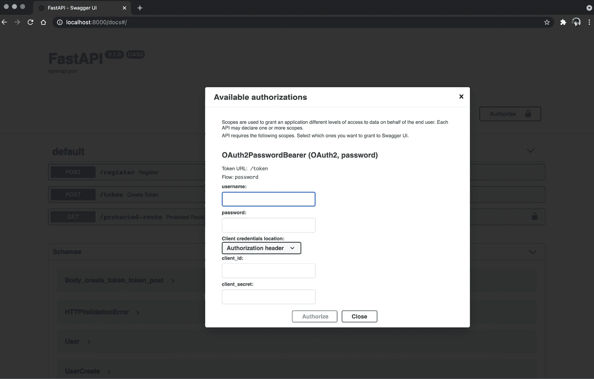

# 第七章：在 FastAPI 中管理身份验证和安全性

大多数时候，你不希望互联网上的每个人都能访问你的 API，而不对他们能创建或读取的数据设置任何限制。这就是为什么你至少需要用私有令牌保护你的应用程序，或者拥有一个合适的身份验证系统来管理授予每个用户的权限。在本章中，我们将看到 FastAPI 如何提供安全依赖，帮助我们通过遵循不同的标准来检索凭证，这些标准直接集成到自动文档中。我们还将构建一个基本的用户注册和身份验证系统来保护我们的 API 端点。

最后，我们将讨论当你想从浏览器中的 Web 应用程序调用 API 时需要解决的安全挑战——特别是 CORS 和 CSRF 攻击的风险。

在本章中，我们将讨论以下主要内容：

+   FastAPI 中的安全依赖

+   获取用户并生成访问令牌

+   为经过身份验证的用户保护 API 端点

+   使用访问令牌保护端点

+   配置 CORS 并防止 CSRF 攻击

# 技术要求

对于本章内容，你将需要一个 Python 虚拟环境，正如我们在*第一章*中设置的那样，*Python 开发* *环境设置*。

你可以在专门的 GitHub 仓库中找到本章的所有代码示例，地址是[`github.com/PacktPublishing/Building-Data-Science-Applications-with-FastAPI-Second-Edition/tree/main/chapter07`](https://github.com/PacktPublishing/Building-Data-Science-Applications-with-FastAPI-Second-Edition/tree/main/chapter07)。

# FastAPI 中的安全依赖

为了保护 REST API，以及更广泛的 HTTP 端点，已经提出了许多标准。以下是最常见的一些标准的非详尽列表：

+   `Authorization`。该值由`Basic`关键字组成，后跟以`Base64`编码的用户凭证。这是一种非常简单的方案，但并不太安全，因为密码会出现在每个请求中。

+   **Cookies**：Cookies 是一个在客户端（通常是在 Web 浏览器上）存储静态数据的有用方式，这些数据会在每次请求时发送到服务器。通常，一个 cookie 包含一个会话令牌，服务器可以验证并将其与特定用户关联。

+   `Authorization`头：在 REST API 上下文中，可能是最常用的头部，它仅仅是通过 HTTP `Authorization`头发送一个令牌。该令牌通常以方法关键字（如`Bearer`）为前缀。在服务器端，可以验证这个令牌并将其与特定用户关联。

每个标准都有其优缺点，并适用于特定的使用场景。

如你所知，FastAPI 主要是关于依赖注入和可调用项，它们会在运行时被自动检测并调用。身份验证方法也不例外：FastAPI 默认提供了大部分的安全依赖。

首先，让我们学习如何从任意头部检索访问令牌。为此，我们可以使用`ApiKeyHeader`依赖项，如下例所示：

chapter07_api_key_header.py

```py

from fastapi import Depends, FastAPI, HTTPException, statusfrom fastapi.security import APIKeyHeader
API_TOKEN = "SECRET_API_TOKEN"
app = FastAPI()
api_key_header = APIKeyHeader(name="Token")
@app.get("/protected-route")
async def protected_route(token: str = Depends(api_key_header)):
    if token != API_TOKEN:
        raise HTTPException(status_code=status.HTTP_403_FORBIDDEN)
    return {"hello": "world"}
```

[`github.com/PacktPublishing/Building-Data-Science-Applications-with-FastAPI-Second-Edition/tree/main/chapter07/chapter07_api_key_header.py`](https://github.com/PacktPublishing/Building-Data-Science-Applications-with-FastAPI-Second-Edition/tree/main/chapter07/chapter07_api_key_header.py)

在这个简单的示例中，我们硬编码了一个令牌`API_TOKEN`，并检查头部传递的令牌是否等于这个令牌，之后才授权调用端点。为了做到这一点，我们使用了`APIKeyHeader`安全依赖项，它专门用于从头部检索值。它是一个类依赖项，可以通过参数实例化。特别地，它接受`name`参数，该参数保存它将要查找的头部名称。

然后，在我们的端点中，我们注入了这个依赖项来获取令牌的值。如果它等于我们的令牌常量，我们就继续执行端点逻辑。否则，我们抛出`403`错误。

我们在《第五章》中的*路径、路由器和全局依赖项*部分的示例，*FastAPI 中的依赖注入*，与这个示例并没有太大不同。我们只是从一个任意的头部中检索值并进行等式检查。那么，为什么要使用专门的依赖项呢？有两个原因：

+   首先，检查头部是否存在并检索其值的逻辑包含在`APIKeyHeader`中。当你到达端点时，可以确定已检索到令牌值；否则，将抛出`403`错误。

+   第二个，可能也是最重要的，事情是它被 OpenAPI 架构检测到，并包含在其交互式文档中。这意味着使用此依赖项的端点将显示一个锁定图标，表示这是一个受保护的端点。此外，你将能够访问一个界面来输入你的令牌，如下图所示。令牌将自动包含在你从文档发出的请求中：


图 7.1 – 在交互式文档中的令牌授权

当然，你可以将检查令牌值的逻辑封装在自己的依赖项中，以便在各个端点之间重用，如下例所示：

chapter07_api_key_header_dependency.py

```py

async def api_token(token: str = Depends(APIKeyHeader(name="Token"))):    if token != API_TOKEN:
        raise HTTPException(status_code=status.HTTP_403_FORBIDDEN)
@app.get("/protected-route", dependencies=[Depends(api_token)])
async def protected_route():
    return {"hello": "world"}
```

[`github.com/PacktPublishing/Building-Data-Science-Applications-with-FastAPI-Second-Edition/tree/main/chapter07/chapter07_api_key_header.py`](https://github.com/PacktPublishing/Building-Data-Science-Applications-with-FastAPI-Second-Edition/tree/main/chapter07/chapter07_api_key_header.py)

这种依赖关系非常适合用作路由器或全局依赖项，以保护一组路由，正如我们在*第五章*《FastAPI 中的依赖注入》中看到的那样。

这是为你的 API 添加授权的一个非常基本的示例。在这个示例中，我们没有用户管理；我们只是检查令牌是否与一个常量值对应。虽然它对于不打算由最终用户调用的私有微服务来说可能有用，但这种方法不应被认为非常安全。

首先，确保你的 API 始终通过 HTTPS 提供服务，以确保令牌不会在头部暴露。然后，如果这是一个私有微服务，你还应该考虑不要公开暴露它到互联网上，并确保只有受信任的服务器才能调用它。由于你不需要用户向这个服务发起请求，因此它比一个简单的令牌密钥要安全得多，因为后者可能会被盗取。

当然，大多数情况下，你会希望通过用户自己的个人访问令牌来验证真实用户，从而让他们访问自己的数据。你可能已经使用过实现这种典型模式的服务：

+   首先，你必须在该服务上注册一个账户，通常是通过提供你的电子邮件地址和密码。

+   接下来，你可以使用相同的电子邮件地址和密码登录该服务。该服务会检查电子邮件地址是否存在以及密码是否有效。

+   作为交换，服务会为你提供一个会话令牌，可以在后续请求中使用它来验证身份。这样，你就不需要在每次请求时都提供电子邮件地址和密码，这样既麻烦又危险。通常，这种会话令牌有一个有限的生命周期，这意味着一段时间后你需要重新登录。这可以减少会话令牌被盗时的安全风险。

在下一部分，你将学习如何实现这样的系统。

# 将用户及其密码安全地存储在数据库中

将用户实体存储在数据库中与存储任何其他实体并没有区别，你可以像在*第六章*《数据库和异步 ORM》中一样实现它。你必须特别小心的唯一事项就是密码存储。你绝不能将密码以明文形式存储在数据库中。为什么？如果不幸地，某个恶意的人成功进入了你的数据库，他们将能够获取所有用户的密码。由于许多人会在多个地方使用相同的密码，他们在其他应用程序和网站上的账户安全将受到严重威胁。

为了避免这种灾难，我们可以对密码应用**加密哈希函数**。这些函数的目标是将密码字符串转换为哈希值。设计这个的目的是让从哈希值中恢复原始数据几乎不可能。因此，即使你的数据库被入侵，密码依然安全。

当用户尝试登录时，我们只需计算他们输入的密码的哈希值，并将其与我们数据库中的哈希值进行比较。如果匹配，则意味着密码正确。

现在，让我们学习如何使用 FastAPI 和 SQLAlchemy ORM 来实现这样的系统。

## 创建模型

我们从为用户创建 SQLAlchemy ORM 模型开始，如下所示：

models.py

```py

class User(Base):    __tablename__ = "users"
    id: Mapped[int] = mapped_column(Integer, primary_key=True, autoincrement=True)
    email: Mapped[str] = mapped_column(
        String(1024), index=True, unique=True, nullable=False
    )
    hashed_password: Mapped[str] = mapped_column(String(1024), nullable=False)
```

[`github.com/PacktPublishing/Building-Data-Science-Applications-with-FastAPI-Second-Edition/tree/main/chapter07/authentication/models.py`](https://github.com/PacktPublishing/Building-Data-Science-Applications-with-FastAPI-Second-Edition/tree/main/chapter07/authentication/models.py)

为了简化这个示例，我们在模型中仅考虑了 ID、电子邮件地址和密码。请注意，我们对 `email` 列添加了唯一约束，以确保数据库中不会有重复的电子邮件。

接下来，我们可以实现相应的 Pydantic 模式：

schemas.py

```py

class UserBase(BaseModel):    email: EmailStr
    class Config:
        orm_mode = True
class UserCreate(UserBase):
    password: str
class User(UserBase):
    id: int
    hashed_password: str
class UserRead(UserBase):
    id: int
```

[`github.com/PacktPublishing/Building-Data-Science-Applications-with-FastAPI-Second-Edition/tree/main/chapter07/authentication/schemas.py`](https://github.com/PacktPublishing/Building-Data-Science-Applications-with-FastAPI-Second-Edition/tree/main/chapter07/authentication/schemas.py)

如你所见，`UserCreate` 和 `User` 之间有一个主要区别：前者接受我们在注册时会进行哈希处理的明文密码，而后者仅会在数据库中保留哈希后的密码。我们还会确保在 `UserRead` 中不包含 `hashed_password`，因此哈希值不会出现在 API 响应中。尽管哈希数据应当是不可解读的，但一般不建议泄露这些数据。

## 哈希密码

在我们查看注册端点之前，让我们先实现一些用于哈希密码的重要工具函数。幸运的是，已有一些库提供了最安全、最高效的算法来完成这项任务。在这里，我们将使用 `passlib`。你可以安装它以及 `argon2_cffi`，这是写作时最安全的哈希函数之一：

```py

(venv) $ pip install passlib argon2_cffi
```

现在，我们只需要实例化 `passlib` 类，并封装它们的一些函数，以简化我们的工作：

password.py

```py

from passlib.context import CryptContextpwd_context = CryptContext(schemes=["argon2"], deprecated="auto")
def get_password_hash(password: str) -> str:
    return pwd_context.hash(password)
```

[`github.com/PacktPublishing/Building-Data-Science-Applications-with-FastAPI-Second-Edition/tree/main/chapter07/authentication/password.py`](https://github.com/PacktPublishing/Building-Data-Science-Applications-with-FastAPI-Second-Edition/tree/main/chapter07/authentication/password.py)

`CryptContext` 是一个非常有用的类，因为它允许我们使用不同的哈希算法。如果有一天，出现比 `argon2` 更好的算法，我们只需将其添加到我们的允许的模式中。新密码将使用新算法进行哈希，但现有密码仍然可以识别（并可选择升级为新算法）。

## 实现注册路由

现在，我们具备了创建合适注册路由的所有要素。再次强调，它将与我们之前看到的非常相似。唯一需要记住的是，在将密码插入到数据库之前，我们必须先对其进行哈希处理。

让我们看一下实现：

app.py

```py

@app.post(    "/register", status_code=status.HTTP_201_CREATED, response_model=schemas.UserRead
)
async def register(
    user_create: schemas.UserCreate, session: AsyncSession = Depends(get_async_session)
) -> User:
    hashed_password = get_password_hash(user_create.password)
    user = User(
        *user_create.dict(exclude={"password"}), hashed_password=hashed_password
    )
    try:
        session.add(user)
        await session.commit()
    except exc.IntegrityError:
        raise HTTPException(
            status_code=status.HTTP_400_BAD_REQUEST, detail="Email already exists"
        )
    return user
```

[`github.com/PacktPublishing/Building-Data-Science-Applications-with-FastAPI-Second-Edition/tree/main/chapter07/authentication/app.py`](https://github.com/PacktPublishing/Building-Data-Science-Applications-with-FastAPI-Second-Edition/tree/main/chapter07/authentication/app.py)

如你所见，我们在将用户插入数据库之前，对输入的密码调用了`get_password_hash`。请注意，我们捕获了可能出现的`exc.IntegrityError`异常，这意味着我们正在尝试插入一个已存在的电子邮件。

此外，请注意我们设置了`response_model`为`UserRead`。通过这样做，我们确保`hashed_password`不会出现在输出中。

太棒了！我们现在有了一个合适的用户模型，用户可以通过我们的 API 创建新账户。下一步是允许用户登录并为其提供访问令牌。

# 获取用户并生成访问令牌

在成功注册后，下一步是能够登录：用户将发送其凭证并接收一个身份验证令牌，以访问 API。在这一部分，我们将实现允许此操作的端点。基本上，我们将从请求有效载荷中获取凭证，使用给定的电子邮件检索用户并验证其密码。如果用户存在且密码有效，我们将生成一个访问令牌并将其返回在响应中。

## 实现数据库访问令牌

首先，让我们思考一下这个访问令牌的性质。它应该是一个数据字符串，能够唯一标识一个用户，并且无法被恶意第三方伪造。在这个示例中，我们将采用一种简单但可靠的方法：我们将生成一个随机字符串，并将其存储在数据库中的专用表中，同时设置外键引用到用户。

这样，当一个经过身份验证的请求到达时，我们只需检查令牌是否存在于数据库中，并寻找相应的用户。这个方法的优势是令牌是集中管理的，如果它们被泄露，可以轻松作废；我们只需要从数据库中删除它们。

第一步是为这个新实体实现 SQLAlchemy ORM 模型：

models.py

```py

class AccessToken(Base):    __tablename__ = "access_tokens"
    access_token: Mapped[str] = mapped_column(
        String(1024), primary_key=True, default=generate_token
    )
    user_id: Mapped[int] = mapped_column(ForeignKey("users.id"), nullable=False)
    expiration_date: Mapped[datetime] = mapped_column(
        DateTime, nullable=False, default=get_expiration_date
    )
    user: Mapped[User] = relationship("User", lazy="joined")
```

[`github.com/PacktPublishing/Building-Data-Science-Applications-with-FastAPI-Second-Edition/tree/main/chapter07/authentication/models.py`](https://github.com/PacktPublishing/Building-Data-Science-Applications-with-FastAPI-Second-Edition/tree/main/chapter07/authentication/models.py)

我们定义了三个列：

+   `access_token`：这是将在请求中传递以进行身份验证的字符串。请注意，我们将`generate_token`函数定义为默认工厂；它是一个简单的先前定义的函数，用于生成随机安全密码。在底层，它依赖于标准的`secrets`模块。

+   `user_id`：指向`users`表的外键，用于标识与此令牌对应的用户。

+   `expiration_date`：访问令牌将到期并且不再有效的日期和时间。为访问令牌设置到期日期总是一个好主意，以减轻其被盗的风险。在这里，`get_expiration_date`工厂设置了默认的有效期为 24 小时。

我们还不要忘记定义关系，这样我们可以直接从访问令牌对象访问用户实体。请注意，我们默认设置了一种急加载策略，因此在查询访问令牌时始终检索用户。如果需要其背后的原理，请参阅*第六章**，数据库和异步 ORM*中的*添加关系*部分。

在这里我们不需要 Pydantic 模式，因为访问令牌将通过特定方法创建和序列化。

## 实现登录端点

现在，让我们考虑登录端点。其目标是接收请求有效载荷中的凭据，检索相应的用户，检查密码并生成新的访问令牌。除了一个事项外，它的实现非常直接：用于处理请求的模型。通过下面的示例你将明白为什么：

app.py

```py

@app.post("/token")async def create_token(
    form_data: OAuth2PasswordRequestForm = Depends(OAuth2PasswordRequestForm),
    session: AsyncSession = Depends(get_async_session),
):
    email = form_data.username
    password = form_data.password
    user = await authenticate(email, password, session)
    if not user:
        raise HTTPException(status_code=status.HTTP_401_UNAUTHORIZED)
    token = await create_access_token(user, session)
    return {"access_token": token.access_token, "token_type": "bearer"}
```

[`github.com/PacktPublishing/Building-Data-Science-Applications-with-FastAPI-Second-Edition/tree/main/chapter07/authentication/app.py`](https://github.com/PacktPublishing/Building-Data-Science-Applications-with-FastAPI-Second-Edition/tree/main/chapter07/authentication/app.py)

正如您所见，我们通过 FastAPI 的安全模块中提供的`OAuth2PasswordRequestForm`模块检索请求数据。它期望在表单编码中有几个字段，特别是`username`和`password`，而不是 JSON。

为什么我们要使用这个类？使用这个类的主要好处是它完全集成到 OpenAPI 模式中。这意味着交互式文档能够自动检测到它，并在**授权**按钮后显示适当的身份验证表单，如下面的截图所示：



图 7.2 – 交互式文档中的 OAuth2 授权

但这还不是全部：它还能自动获取返回的访问令牌，并在后续请求中设置正确的授权头。身份验证过程由交互式文档透明处理。

这个类遵循 OAuth2 协议，这意味着你还需要包含客户端 ID 和密钥字段。我们不会在这里学习如何实现完整的 OAuth2 协议，但请注意，FastAPI 提供了所有正确实现它所需的工具。对于我们的项目，我们将只使用用户名和密码。请注意，根据协议，字段被命名为*用户名*，无论我们是使用电子邮件地址来识别用户与否。这不是大问题，我们只需在获取它时记住这一点。

剩下的路径操作函数相当简单：首先，我们尝试根据电子邮件和密码获取用户。如果没有找到相应的用户，我们将抛出`401`错误。否则，我们会在返回之前生成一个新的访问令牌。请注意，响应结构中还包括`token_type`属性。这使得交互式文档能够自动设置授权头。

在下面的示例中，我们将查看`authenticate`和`create_access_token`函数的实现。我们不会深入细节，因为它们非常简单：

authentication.py

```py

async def authenticate(email: str, password: str, session: AsyncSession) -> User | None:    query = select(User).where(User.email == email)
    result = await session.execute(query)
    user: User | None = result.scalar_one_or_none()
    if user is None:
        return None
    if not verify_password(password, user.hashed_password):
        return None
    return user
async def create_access_token(user: User, session: AsyncSession) -> AccessToken:
    access_token = AccessToken(user=user)
    session.add(access_token)
    await session.commit()
    return access_token
```

[`github.com/PacktPublishing/Building-Data-Science-Applications-with-FastAPI-Second-Edition/tree/main/chapter07/authentication/authentication.py`](https://github.com/PacktPublishing/Building-Data-Science-Applications-with-FastAPI-Second-Edition/tree/main/chapter07/authentication/authentication.py)

请注意，我们定义了一个名为`verify_password`的函数来检查密码的有效性。再一次，它在后台使用`passlib`，该库负责比较密码的哈希值。

密码哈希升级

为了简化示例，我们实现了一个简单的密码比较。通常，最好在这个阶段实现一个机制来升级密码哈希。假设引入了一个新的、更强大的哈希算法。我们可以借此机会使用这个新算法对密码进行哈希处理并将其存储在数据库中。`passlib`包含一个函数，可以在一次操作中验证和升级哈希。你可以通过以下文档了解更多内容：[`passlib.readthedocs.io/en/stable/narr/context-tutorial.html#integrating-hash-migration`](https://passlib.readthedocs.io/en/stable/narr/context-tutorial.html#integrating-hash-migration)。

我们几乎达成了目标！用户现在可以登录并获取新的访问令牌。接下来，我们只需要实现一个依赖项来检索`Authorization`头并验证这个令牌！

# 使用访问令牌保护端点

之前，我们学习了如何实现一个简单的依赖项来保护带有头部的端点。在这里，我们也会从请求头中获取令牌，但接下来，我们需要检查数据库，看看它是否有效。如果有效，我们将返回相应的用户。

让我们看看我们的依赖项是什么样子的：

app.py

```py

async def get_current_user(    token: str = Depends(OAuth2PasswordBearer(tokenUrl="/token")),
    session: AsyncSession = Depends(get_async_session),
) -> User:
    query = select(AccessToken).where(
        AccessToken.access_token == token,
        AccessToken.expiration_date >= datetime.now(tz=timezone.utc),
    )
    result = await session.execute(query)
    access_token: AccessToken | None = result.scalar_one_or_none()
    if access_token is None:
        raise HTTPException(status_code=status.HTTP_401_UNAUTHORIZED)
    return access_token.user
```

[`github.com/PacktPublishing/Building-Data-Science-Applications-with-FastAPI-Second-Edition/tree/main/chapter07/authentication/app.py`](https://github.com/PacktPublishing/Building-Data-Science-Applications-with-FastAPI-Second-Edition/tree/main/chapter07/authentication/app.py)

首先需要注意的是，我们使用了来自 FastAPI 的 `OAuth2PasswordBearer` 依赖项。它与我们在前一节中看到的 `OAuth2PasswordRequestForm` 配合使用。它不仅检查 `Authorization` 头中的访问令牌，还告知 OpenAPI 架构获取新令牌的端点是 `/token`。这就是 `tokenUrl` 参数的目的。通过这一点，自动化文档可以自动调用我们之前看到的登录表单中的访问令牌端点。

然后我们使用 SQLAlchemy 执行了数据库查询。我们应用了两个条件：一个用于匹配我们获得的令牌，另一个确保过期时间是在未来。如果在数据库中找不到相应的记录，我们会抛出一个 `401` 错误。否则，我们会返回与访问令牌相关的用户。

就这样！我们的整个身份验证系统完成了。现在，我们可以通过简单地注入这个依赖项来保护我们的端点。我们甚至可以访问用户数据，从而根据当前用户量身定制响应。你可以在以下示例中看到这一点：

app.py

```py

@app.get("/protected-route", response_model=schemas.UserRead)async def protected_route(user: User = Depends(get_current_user)):
    return user
```

[`github.com/PacktPublishing/Building-Data-Science-Applications-with-FastAPI-Second-Edition/tree/main/chapter07/authentication/app.py`](https://github.com/PacktPublishing/Building-Data-Science-Applications-with-FastAPI-Second-Edition/tree/main/chapter07/authentication/app.py)

至此，你已经学会了如何从头开始实现完整的注册和身份验证系统。我们故意保持其简单，以便专注于最重要的点，但这为你扩展提供了一个良好的基础。

我们在这里展示的模式是适合 REST API 的良好范例，这些 API 是由其他客户端程序外部调用的。然而，你可能希望通过一个非常常见的软件来调用你的 API：浏览器。在这种情况下，有一些额外的安全考虑需要处理。

# 配置 CORS 并防止 CSRF 攻击

如今，许多软件都被设计为通过使用 HTML、CSS 和 JavaScript 构建的界面在浏览器中使用。传统上，Web 服务器负责处理浏览器请求并返回 HTML 响应，以供用户查看。这是 Django 等框架的常见用例。

近年来，随着 JavaScript 框架如 Angular、React 和 Vue 的出现，这一模式正在发生变化。我们现在往往会看到前端和后端的明确分离，前端是一个由 JavaScript 驱动的高度互动的用户界面，后端则负责数据存储、检索以及执行业务逻辑。这是 REST API 擅长的任务！从 JavaScript 代码中，用户界面可以向你的 API 发送请求并处理结果进行展示。

然而，我们仍然需要处理身份验证：我们希望用户能够登录前端应用，并向 API 发送经过身份验证的请求。虽然如我们到目前为止看到的`Authorization`头可以工作，但在浏览器中处理身份验证有一个更好的方法：**Cookies**！

Cookies（浏览器 Cookie）旨在将用户信息存储在浏览器内存中，并在每次请求发送到你的服务器时自动发送。多年来它们得到了支持，浏览器也集成了很多机制来确保它们的安全和可靠。

然而，这也带来了一些安全挑战。网站是黑客的常见攻击目标，多年来已经出现了很多攻击方式。

最典型的攻击方式之一是**跨站请求伪造**（**CSRF**）。在这种情况下，攻击者会在另一个网站上尝试欺骗当前已在你的应用程序中认证的用户，向你的服务器发起请求。由于浏览器通常会在每次请求时发送 Cookie，你的服务器无法识别出请求实际上是伪造的。由于这些恶意请求是用户自己无意中发起的，因此这类攻击并不旨在窃取数据，而是执行改变应用状态的操作，比如更改电子邮件地址或进行转账。

显然，我们应该为这些风险做好准备，并采取措施来减轻它们。

## 理解 CORS 并在 FastAPI 中进行配置

当你有一个明确分离的前端应用和 REST API 后端时，它们通常不会来自同一个子域。例如，前端可能来自[www.myapplication.com](http://www.myapplication.com)，而 REST API 来自`api.myapplication.com`。正如我们在介绍中提到的，我们希望从前端应用程序通过 JavaScript 向该 API 发起请求。

然而，浏览器不允许**跨域****资源共享（CORS）**的**HTTP 请求**，即域 A 无法向域 B 发起请求。这遵循了所谓的**同源策略**。一般来说，这是一个好事，因为它是防止 CSRF 攻击的第一道屏障。

为了体验这种行为，我们将运行一个简单的例子。在我们的示例仓库中，`chapter07/cors` 文件夹包含一个名为 `app_without_cors.py` 的 FastAPI 应用程序和一个简单的 HTML 文件 `index.html`，该文件包含一些用于执行 HTTP 请求的 JavaScript。

首先，让我们使用通常的 `uvicorn` 命令运行 FastAPI 应用程序：

```py

(venv) $ uvicorn chapter07.cors.app_without_cors:app
```

这将默认启动 FastAPI 应用程序，端口为 `8000`。在另一个终端中，我们将使用内置的 Python HTTP 服务器提供 HTML 文件。它是一个简单的服务器，但非常适合快速提供静态文件。我们可以通过以下命令在端口 `9000` 启动它：

```py

(venv) $ python -m http.server --directory chapter07/cors 9000
```

启动多个终端

在 Linux 和 macOS 上，你可以通过创建一个新的窗口或标签页来启动一个新的终端。在 Windows 和 WSL 上，如果你使用 Windows 终端应用程序，也可以有多个标签页：[`apps.microsoft.com/store/detail/windows-terminal/9N0DX20HK701`](https://apps.microsoft.com/store/detail/windows-terminal/9N0DX20HK701)。

否则，你可以简单地点击 **开始** 菜单中的 Ubuntu 快捷方式来启动另一个终端。

现在我们有两个正在运行的服务器——一个在 `localhost:8000`，另一个在 `localhost:9000`。严格来说，由于它们在不同的端口上，它们属于不同的源；因此，这是一个很好的设置，可以尝试跨源 HTTP 请求。

在你的浏览器中，访问 `http://localhost:9000`。你会看到在 `index.html` 中实现的简单应用程序，如下图所示：


图 7.3 – 尝试 CORS 策略的简单应用

有两个按钮，可以向我们的 FastAPI 应用程序发起 GET 和 POST 请求，端口为 `8000`。如果点击其中任意一个按钮，你会在错误区域看到一条消息，显示 **获取失败**。如果你查看开发者工具中的浏览器控制台，你会发现请求失败的原因是没有 CORS 策略，正如下图所示。这正是我们想要的——默认情况下，浏览器会阻止跨源 HTTP 请求：


图 7.4 – 浏览器控制台中的 CORS 错误

但是，如果你查看正在运行 FastAPI 应用程序的终端，你会看到类似下面的输出：


图 7.5 – 执行简单请求时的 Uvicorn 输出

显然，`GET` 和 `POST` 请求已经接收并处理：我们甚至返回了 `200` 状态。那么，这意味着什么呢？在这种情况下，浏览器确实会将请求发送到服务器。缺乏 CORS 策略只会禁止它读取响应；请求仍然会执行。

这是浏览器认为是 `GET`、`POST` 或 `HEAD` 方法的请求，它们不设置自定义头部或不使用不常见的内容类型的情况。你可以通过访问以下 MDN 页面了解更多关于简单请求及其条件的信息：[`developer.mozilla.org/en-US/docs/Web/HTTP/CORS#simple_requests`](https://developer.mozilla.org/en-US/docs/Web/HTTP/CORS#simple_requests)。

这意味着，对于简单请求来说，相同来源策略不足以保护我们免受 CSRF 攻击。

你可能已经注意到，我们的简单 Web 应用再次提供了 `GET` 和 `POST` 请求的切换功能。在你的 FastAPI 终端中，应该会看到类似于以下的输出：


图 7.6 – Uvicorn 在接收到预检请求时的输出

如你所见，我们的服务器接收到了两个奇怪的 `OPTIONS` 请求。这是我们所说的具有 `application/json` 值的 `Content-Type` 头部，这违反了简单请求的条件。

通过执行这个预检请求，浏览器期望服务器提供有关它可以和不可以执行的跨源 HTTP 请求的信息。由于我们这里没有实现任何内容，我们的服务器无法对这个预检请求作出响应。因此，浏览器在这里停止，并且不会继续执行实际请求。

这基本上就是 CORS：服务器用一组 HTTP 头部响应预检请求，提供关于浏览器是否可以发起请求的信息。从这个意义上说，CORS 并不会让你的应用更安全，恰恰相反：它放宽了一些规则，使得前端应用可以向另一个域上的后端发起请求。因此，正确配置 CORS 至关重要，以免暴露于危险的攻击之下。

幸运的是，使用 FastAPI 这非常简单。我们需要做的就是导入并添加由 Starlette 提供的 `CORSMiddleware` 类。你可以在以下示例中看到它的实现：

app_with_cors.py

```py

app.add_middleware(    CORSMiddleware,
    allow_origins=["http://localhost:9000"],
    allow_credentials=True,
    allow_methods=["*"],
    allow_headers=["*"],
    max_age=-1,  # Only for the sake of the example. Remove this in your own project.
)
```

[`github.com/PacktPublishing/Building-Data-Science-Applications-with-FastAPI-Second-Edition/tree/main/chapter07/cors/app_with_cors.py`](https://github.com/PacktPublishing/Building-Data-Science-Applications-with-FastAPI-Second-Edition/tree/main/chapter07/cors/app_with_cors.py)

中间件是一种特殊的类，它将全局逻辑添加到 `add_middleware` 方法中，将这种中间件集成到你的应用中。

在这里，`CORSMiddleware` 会捕获浏览器发送的预检请求，并返回带有与你配置相对应的 CORS 头部的适当响应。你可以看到，有选项可以精细调整 CORS 策略以满足你的需求。

最重要的可能是 `allow_origins`，它是允许向你的 API 发起请求的源列表。由于我们的 HTML 应用是从 `http://localhost:9000` 提供的，因此我们在此参数中填写该地址。如果浏览器尝试从任何其他源发出请求，它将被阻止，因为 CORS 头部不允许。

另一个有趣的参数是 `allow_credentials`。默认情况下，浏览器不会为跨域 HTTP 请求发送 cookies。如果我们希望向 API 发出认证请求，需要通过此选项来允许此操作。

我们还可以精细调节请求中允许的 HTTP 方法和头部。你可以在官方 Starlette 文档中找到此中间件的完整参数列表：[`www.starlette.io/middleware/#corsmiddleware`](https://www.starlette.io/middleware/#corsmiddleware)。

让我们简要讨论一下 `max_age` 参数。此参数允许你控制 CORS 响应的缓存时长。在实际请求之前执行预检请求是一个昂贵的操作。为了提高性能，浏览器可以缓存响应，以避免每次都执行此操作。在此，我们将缓存禁用，设置值为 `-1`，以确保你在这个示例中看到浏览器的行为。在你的项目中，可以删除此参数，以便设置适当的缓存值。

现在，让我们看看启用了 CORS 的应用程序如何在我们的 Web 应用中表现。停止之前的 FastAPI 应用，并使用常规命令运行此应用：

```py

(venv) $ uvicorn chapter07.cors.app_with_cors:app
```

现在，如果你尝试从 HTML 应用执行请求，你应该会在每种情况下看到有效的响应，无论是否使用 JSON 内容类型。如果你查看 FastAPI 的终端，你应该会看到类似于以下内容的输出：


图 7.7 – 启用 CORS 头的 Uvicorn 输出

前两个请求是“简单请求”，根据浏览器规则，这些请求无需预检请求。接着，我们可以看到启用了 JSON 内容类型的请求。在 `GET` 和 `POST` 请求之前，执行了一个 `OPTIONS` 请求：即预检请求！

多亏了这个配置，你现在可以在前端应用和位于另一个源的后端之间进行跨域 HTTP 请求。再次强调，这并不能提升应用的安全性，但它允许你在确保应用其余部分安全的同时，使这个特定场景得以正常运行。

即便这些策略可以作为抵御 CSRF 的第一道防线，但并不能完全消除风险。事实上，“简单请求”仍然是一个问题：`POST` 请求是允许的，尽管响应不能被读取，但实际上它是在服务器上执行的。

现在，让我们学习如何实现一种模式，以确保我们完全避免此类攻击：**双重提交 Cookie**。

## 实现双重提交 Cookie 以防止 CSRF 攻击

如前所述，当依赖 Cookies 存储用户凭据时，我们容易遭受 CSRF 攻击，因为浏览器会自动将 Cookie 发送到你的服务器。这对于浏览器认为的“简单请求”尤其如此，因为在请求执行之前不会强制执行 CORS 策略。还有其他攻击向量，例如传统的 HTML 表单提交，甚至是图片标签的 `src` 属性。

由于这些原因，我们需要额外的安全层来缓解这种风险。再次强调，这仅在你计划通过浏览器应用使用 API 并使用 Cookies 进行身份验证时才是必要的。

为了帮助你理解这一点，我们构建了一个新的示例应用程序，使用 Cookie 存储用户访问令牌。它与我们在本章开头看到的应用非常相似；我们只是修改了它，使其从 Cookie 中获取访问令牌，而不是从请求头中获取。

为了使这个示例生效，你需要安装 `starlette-csrf` 库。我们稍后会解释它的作用。现在，只需运行以下命令：

```py

(venv) $ pip install starlette-csrf
```

在以下示例中，你可以看到设置了包含访问令牌值的 Cookie 的登录端点：

app.py

```py

@app.post("/login")async def login(
    response: Response,
    email: str = Form(...),
    password: str = Form(...),
    session: AsyncSession = Depends(get_async_session),
):
    user = await authenticate(email, password, session)
    if not user:
        raise HTTPException(status_code=status.HTTP_401_UNAUTHORIZED)
    token = await create_access_token(user, session)
    response.set_cookie(
        TOKEN_COOKIE_NAME,
        token.access_token,
        max_age=token.max_age(),
        secure=True,
        httponly=True,
        samesite="lax",
    )
```

[`github.com/PacktPublishing/Building-Data-Science-Applications-with-FastAPI-Second-Edition/tree/main/chapter07/csrf/app.py`](https://github.com/PacktPublishing/Building-Data-Science-Applications-with-FastAPI-Second-Edition/tree/main/chapter07/csrf/app.py)

请注意，我们为生成的 Cookie 使用了 `Secure` 和 `HttpOnly` 标志。这确保了该 Cookie 仅通过 HTTPS 发送，并且其值不能通过 JavaScript 读取。虽然这不足以防止所有类型的攻击，但对于这种敏感信息来说至关重要。

除此之外，我们还将 `SameSite` 标志设置为 `lax`。这是一个相对较新的标志，允许我们控制 Cookie 在跨源上下文中如何发送。`lax` 是大多数浏览器中的默认值，它允许将 Cookie 发送到 Cookie 域的子域名，但不允许发送到其他站点。从某种意义上讲，它是为防范 CSRF 攻击设计的标准内置保护。然而，目前仍然需要其他 CSRF 缓解技术，比如我们将在此实现的技术。实际上，仍有一些旧版浏览器不兼容 `SameSite` 标志，依然存在漏洞。

现在，当检查已认证用户时，我们只需从请求中发送的 Cookie 中提取令牌。再次强调，FastAPI 提供了一个安全依赖项，帮助实现这一功能，名为 `APIKeyCookie`。你可以在以下示例中看到它：

app.py

```py

async def get_current_user(    token: str = Depends(APIKeyCookie(name=TOKEN_COOKIE_NAME)),
    session: AsyncSession = Depends(get_async_session),
) -> User:
    query = select(AccessToken).where(
        AccessToken.access_token == token,
        AccessToken.expiration_date >= datetime.now(tz=timezone.utc),
    )
    result = await session.execute(query)
    access_token: AccessToken | None = result.scalar_one_or_none()
    if access_token is None:
        raise HTTPException(status_code=status.HTTP_401_UNAUTHORIZED)
    return access_token.user
```

[`github.com/PacktPublishing/Building-Data-Science-Applications-with-FastAPI-Second-Edition/tree/main/chapter07/csrf/app.py`](https://github.com/PacktPublishing/Building-Data-Science-Applications-with-FastAPI-Second-Edition/tree/main/chapter07/csrf/app.py)

基本上就是这样！其余的代码保持不变。现在，让我们实现一个端点，允许我们更新经过身份验证的用户的电子邮件地址。您可以在以下示例中看到：

app.py

```py

@app.post("/me", response_model=schemas.UserRead)async def update_me(
    user_update: schemas.UserUpdate,
    user: User = Depends(get_current_user),
    session: AsyncSession = Depends(get_async_session),
):
    user_update_dict = user_update.dict(exclude_unset=True)
    for key, value in user_update_dict.items():
        setattr(user, key, value)
    session.add(user)
    await session.commit()
    return user
```

[`github.com/PacktPublishing/Building-Data-Science-Applications-with-FastAPI-Second-Edition/tree/main/chapter07/csrf/app.py`](https://github.com/PacktPublishing/Building-Data-Science-Applications-with-FastAPI-Second-Edition/tree/main/chapter07/csrf/app.py)

这个实现并不令人惊讶，遵循了我们到目前为止所见的方式。然而，它使我们暴露于 CSRF 威胁中。如您所见，它使用了`POST`方法。如果我们在浏览器中向该端点发出没有任何特殊头部的请求，它会将其视为普通请求并执行。因此，攻击者可能会更改当前已验证用户的电子邮件地址，这是一个重大威胁。

这正是我们在这里需要 CSRF 保护的原因。在 REST API 的上下文中，最直接的技术是双重提交 cookie 模式。其工作原理如下：

1.  用户首先发出一个被认为是安全的方法的请求，通常是一个`GET`请求。

1.  在响应中，它接收一个包含随机秘密值的 cookie——即 CSRF 令牌。

1.  当发出不安全请求时，例如`POST`，用户会从 cookie 中读取 CSRF 令牌，并将相同的值放入请求头中。由于浏览器还会发送内存中存储的 cookie，请求将同时在 cookie 和请求头中包含该令牌。这就是为什么称之为**双重提交**。

1.  在处理请求之前，服务器将比较请求头中提供的 CSRF 令牌与 cookie 中存在的令牌。如果匹配，它将继续处理请求。否则，它将抛出一个错误。

这是安全的，原因有二：

+   针对第三方网站的攻击者无法读取他们没有所有权的域名的 cookie。因此，他们无法检索到 CSRF 令牌的值。

+   添加自定义头部违反了“简单请求”的条件。因此，浏览器在发送请求之前必须进行预检请求，从而强制执行 CORS 策略。

这是一个广泛使用的模式，在防止此类风险方面效果良好。这也是为什么我们在本节开始时安装了`starlette-csrf`：它提供了一个中间件来实现这一点。

我们可以像使用其他中间件一样使用它，以下示例演示了这一点：

app.py

```py

app.add_middleware(    CSRFMiddleware,
    secret=CSRF_TOKEN_SECRET,
    sensitive_cookies={TOKEN_COOKIE_NAME},
    cookie_domain="localhost",
)
```

[`github.com/PacktPublishing/Building-Data-Science-Applications-with-FastAPI-Second-Edition/tree/main/chapter07/csrf/app.py`](https://github.com/PacktPublishing/Building-Data-Science-Applications-with-FastAPI-Second-Edition/tree/main/chapter07/csrf/app.py)

我们在这里设置了几个重要的参数。首先，我们有一个密钥，它应该是一个强密码，用于签名 CSRF 令牌。然后，我们有`sensitive_cookies`，这是一个包含应该触发 CSRF 保护的 cookie 名称的集合。如果没有 cookie，或者提供的 cookie 不是关键性的，我们可以绕过 CSRF 检查。如果你有其他的认证方法（如不依赖于 cookie 的授权头），这也很有用，因为这些方法不容易受到 CSRF 攻击。最后，设置 cookie 域名将允许你在不同的子域上获取包含 CSRF 令牌的 cookie；这在跨源情况下是必要的。

这就是你需要准备的必要保护。为了简化获取新 CSRF 令牌的过程，我们实现了一个最小的 GET 端点，叫做`/csrf`。它的唯一目的是提供一个简单的方式来设置 CSRF 令牌的 cookie。我们可以在加载前端应用时直接调用它。

现在，让我们在我们的环境中试试。正如我们在上一节中所做的那样，我们将会在两个不同的端口上运行 FastAPI 应用程序和简单的 HTML 应用程序。为此，只需运行以下命令：

```py

(venv) $ uvicorn chapter07.csrf.app:app
```

这将会在`8000`端口上运行 FastAPI 应用程序。现在，运行以下命令：

```py

(venv) $ python -m http.server --directory chapter07/csrf 9000
```

前端应用程序现在可以在`http://localhost:9000`访问。打开它在浏览器中，你应该看到一个类似于以下界面的界面：


图 7.8 – 尝试 CSRF 保护 API 的简单应用

在这里，我们添加了表单来与 API 端点交互：注册、登录获取认证用户，以及更新端点。如果你尝试这些，它们应该没有问题。如果你查看发送的请求，可以看到`x-csrftoken`中包含了 CSRF 令牌。

在顶部，有一个开关可以防止应用程序在头部发送 CSRF 令牌。如果你禁用它，你会看到所有的`POST`操作都会导致错误。

太好了！我们现在已经防止了 CSRF 攻击！这里的大部分工作是由中间件完成的，但理解它是如何在后台工作的，以及它如何保护你的应用程序，是很有意思的。然而，请记住，它有一个缺点：它会破坏交互式文档。实际上，它并没有设计成从 cookie 中检索 CSRF 令牌并将其放入每个请求的头部。除非你计划以其他方式进行认证（例如通过头部中的令牌），否则你将无法在文档中直接调用你的端点。

# 总结

本章内容就到这里，主要介绍了 FastAPI 中的认证和安全性。我们看到，借助 FastAPI 提供的工具，实现一个基本的认证系统是相当简单的。我们展示了一种实现方法，但还有许多其他不错的模式可以用来解决这个问题。然而，在处理这些问题时，始终要牢记安全性，并确保不会将应用程序和用户数据暴露于危险的威胁之中。特别地，我们已经看到，在设计将在浏览器应用中使用的 REST API 时，必须考虑防止 CSRF 攻击。理解 Web 应用程序中所有安全风险的一个好资源是 OWASP Cheat Sheet 系列：[`cheatsheetseries.owasp.org`](https://cheatsheetseries.owasp.org)。

至此，我们已经涵盖了关于 FastAPI 应用开发的大部分重要主题。在下一章中，我们将学习如何使用与 FastAPI 集成的最新技术——WebSockets，它允许客户端和服务器之间进行实时、双向通信。
