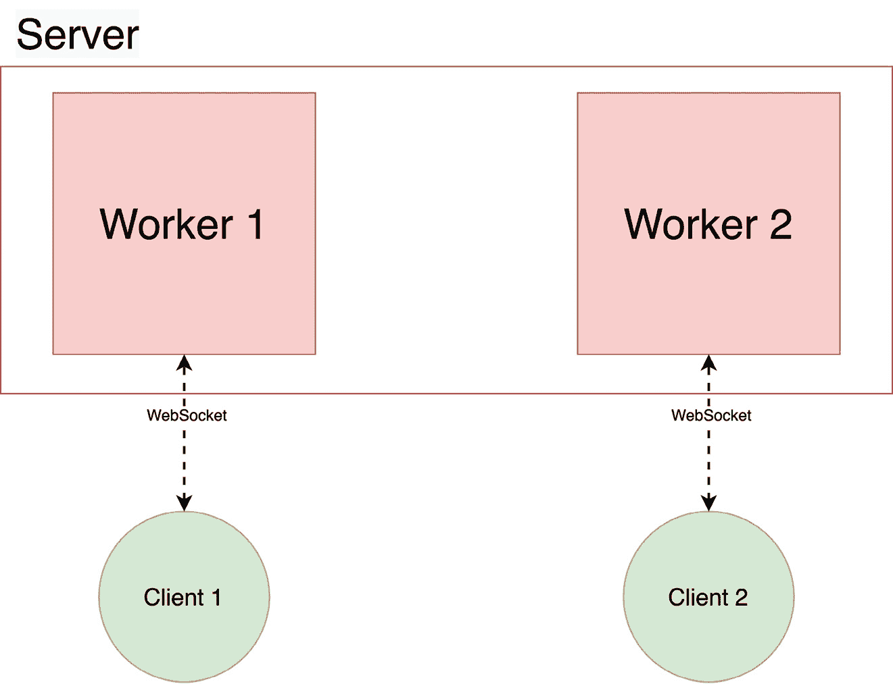

# 第八章：在 FastAPI 中定义 WebSocket 以实现双向交互通信

HTTP 是一种简单而强大的技术，用于从服务器发送数据以及接收数据。如我们所见，请求和响应的原理是该协议的核心：在开发 API 时，我们的目标是处理传入的请求，并为客户端构建响应。因此，为了从服务器获取数据，客户端总是需要先发起请求。然而，在某些情况下，这可能不是很方便。想象一下一个典型的聊天应用程序：当用户收到新消息时，我们希望他们能够立即通过服务器收到通知。如果仅使用 HTTP，我们必须每秒发出请求，检查是否有新消息到达，这会浪费大量资源。这就是为什么一种新协议应运而生：**WebSocket**。该协议的目标是打开一个客户端和服务器之间的通信通道，以便它们可以实时地双向交换数据。

在本章中，我们将涵盖以下主要主题：

+   理解 WebSocket 双向通信的原理

+   使用 FastAPI 创建 WebSocket

+   处理多个 WebSocket 连接和广播消息

# 技术要求

本章你需要一个 Python 虚拟环境，正如我们在*第一章*中所设置的那样，*Python 开发* *环境配置*。

在*处理多个 WebSocket 连接和广播消息*这一部分，你需要在本地计算机上运行一个 Redis 服务器。最简单的方法是将其作为 Docker 容器运行。如果你之前从未使用过 Docker，建议你阅读官方文档中的*入门*教程，链接为[`docs.docker.com/get-started/`](https://docs.docker.com/get-started/)。完成后，你就可以通过以下简单命令启动一个 Redis 服务器：

```py

$ docker run -d --name fastapi-redis -p 6379:6379 redis
```

你可以在专门的 GitHub 仓库中找到本章的所有代码示例，链接地址为[`github.com/PacktPublishing/Building-Data-Science-Applications-with-FastAPI-Second-Edition/tree/main/chapter08`](https://github.com/PacktPublishing/Building-Data-Science-Applications-with-FastAPI-Second-Edition/tree/main/chapter08)。

# 理解 WebSocket 双向通信的原理

你可能已经注意到，WebSocket 这个名字直接指代的是 Unix 系统中传统的**套接字**概念。虽然从技术上看它们没有直接关系，但它们达成了同样的目标：为两个应用程序之间开启一个*通信通道*。正如我们在介绍中所说，HTTP 仅基于请求-响应原理，这使得需要客户端与服务器之间实时通信的应用程序的实现既困难又低效。

WebSocket 试图通过打开一个全双工通信通道来解决这个问题，这意味着消息可以在两个方向上同时发送。通道一旦打开，服务器就可以向客户端发送消息，而无需等待客户端的请求。

即使 HTTP 和 WebSocket 是不同的协议，WebSocket 的设计仍然是为了与 HTTP 配合使用。实际上，在打开 WebSocket 时，连接首先通过 HTTP 请求发起，然后升级为 WebSocket 通道。这使得它能够直接兼容传统的端口`80`和`443`，这非常方便，因为我们可以轻松地将这个功能添加到现有的 Web 服务器中，而无需额外的进程。

WebSocket 与 HTTP 还有另一个相似之处：URI。与 HTTP 一样，WebSocket 通过经典的 URI 进行标识，包括主机、路径和查询参数。此外，我们还有两种方案：`ws`（WebSocket）用于不安全的连接，`wss`（WebSocket Secure）用于 SSL/TLS 加密连接。

最后，这个协议现在在浏览器中得到了很好的支持，打开与服务器的连接只需要几行 JavaScript 代码，正如我们将在本章中看到的那样。

然而，处理这个双向通信通道与处理传统的 HTTP 请求是完全不同的。由于事情是实时发生的，并且是双向的，我们将看到，我们必须以不同于常规的方式进行思考。在 FastAPI 中，WebSocket 的异步特性将大大帮助我们在这方面找到方向。

# 使用 FastAPI 创建 WebSocket

多亏了 Starlette，FastAPI 内置了对 WebSocket 的支持。正如我们将看到的，定义 WebSocket 端点非常快速且简单，我们可以在几分钟内开始使用。不过，随着我们尝试为端点逻辑添加更多功能，事情会变得更加复杂。我们从简单的开始，创建一个等待消息并将其简单回显的 WebSocket。

在下面的示例中，你将看到这样一个简单案例的实现：

app.py

```py

from fastapi import FastAPI, WebSocketfrom starlette.websockets import WebSocketDisconnect
app = FastAPI()
@app.websocket("/ws")
async def websocket_endpoint(websocket: WebSocket):
    await websocket.accept()
    try:
        while True:
            data = await websocket.receive_text()
            await websocket.send_text(f"Message text was: {data}")
    except WebSocketDisconnect:
        pass
```

[`github.com/PacktPublishing/Building-Data-Science-Applications-with-FastAPI-Second-Edition/blob/main/chapter08/echo/app.py`](https://github.com/PacktPublishing/Building-Data-Science-Applications-with-FastAPI-Second-Edition/blob/main/chapter08/echo/app.py)

这段代码本身非常易于理解，但让我们关注一些与经典 HTTP 端点不同的重要部分。

首先，你会看到 FastAPI 提供了一个特殊的`websocket`装饰器来创建 WebSocket 端点。与常规端点一样，它需要作为参数提供其可用的路径。然而，其他在此上下文中没有意义的参数，例如状态码或响应模型，是不可用的。

然后，在路径操作函数中，我们可以注入一个`WebSocket`对象，它将提供所有与 WebSocket 交互的方法，正如我们将看到的那样。

我们在实现中调用的第一个方法是`accept`。这个方法应该首先被调用，因为它告诉客户端我们同意打开隧道。

之后，你可以看到我们启动了一个无限循环。这是与 HTTP 端点的主要区别：因为我们正在打开一个通信通道，它将保持打开状态，直到客户端或服务器决定关闭它。在通道打开期间，它们可以交换尽可能多的消息；因此，无限循环的作用是保持通道开放并重复逻辑，直到隧道关闭。

在循环内部，我们首先调用`receive_text`方法。正如你可能猜到的，它会返回客户端发送的纯文本数据。这里需要理解的是，*该方法会阻塞，直到从客户端接收到数据*。在这个事件发生之前，我们不会继续执行剩余的逻辑。

我们可以在这里看到异步输入/输出的重要性，正如我们在*第二章*《Python 编程特性》中展示的那样。通过创建一个无限循环来等待传入的数据，如果采用传统的阻塞模式，整个服务器进程可能会被阻塞。在这里，得益于事件循环，进程能够在等待当前数据时，响应其他客户端的请求。

当接收到数据时，方法会返回文本数据，我们可以继续执行下一行代码。这里，我们只是通过`send_text`方法将消息返回给客户端。一旦完成，我们将回到循环的开始，等待另一个消息。

你可能注意到，整个循环被包裹在一个 `try...except` 语句中。这是为了*处理客户端断开连接*。实际上，大多数时候，我们的服务器会在`receive_text`那一行被阻塞，等待客户端数据。如果客户端决定断开连接，隧道将被关闭，`receive_text` 调用将失败，并抛出 `WebSocketDisconnect` 异常。因此，捕捉该异常非常重要，以便能够跳出循环并正确结束函数。

来试试吧！你可以像往常一样通过 Uvicorn 服务器运行 FastAPI 应用程序。你需要的命令如下：

```py

(venv) $ uvicorn chapter08.echo.app:app
```

我们的客户端将是一个简单的 HTML 页面，包含一些与 WebSocket 交互的 JavaScript 代码。演示之后，我们将快速介绍这段代码。要运行它，我们可以像下面这样通过内置的 Python 服务器提供服务：

```py

(venv) $ python -m http.server --directory chapter08/echo 9000
```

启动多个终端

在 Linux 和 macOS 上，你应该能够通过创建一个新窗口或标签页来简单地启动一个新的终端。在 Windows 和 WSL 上，如果你使用的是 Windows 终端应用程序，你也可以有多个标签页：[`apps.microsoft.com/store/detail/windows-terminal/9N0DX20HK701`](https://apps.microsoft.com/store/detail/windows-terminal/9N0DX20HK701)。

否则，你也可以简单地点击 **开始** 菜单中的 Ubuntu 快捷方式来启动另一个终端。

这将在你本地机器的 `9000` 端口上提供我们的 HTML 页面。如果你打开 `http://localhost:9000` 地址，你将看到一个像这里展示的简单界面：


图 8.1 – 尝试 WebSocket 的简单应用

你有一个简单的输入表单，允许你通过 WebSocket 向服务器发送消息。它们会以绿色显示在列表中，如截图所示。服务器会回显你的消息，这些消息会以黄色显示在列表中。

你可以通过打开浏览器开发者工具中的**网络**标签页，查看背后发生了什么。重新加载页面以强制 WebSocket 重新连接。此时你应该能看到 WebSocket 连接的行。如果点击该行，你会看到一个**消息**标签页，在那里可以查看通过 WebSocket 传输的所有消息。你可以在*图 8.2*中看到这个界面。


图 8.2 – 浏览器开发者工具中的 WebSocket 消息可视化

在下面的示例中，你将看到用于打开 WebSocket 连接并发送和接收消息的 JavaScript 代码：

script.js

```py

  const socket = new WebSocket('ws://localhost:8000/ws');  // Connection opened
  socket.addEventListener('open', function (event) {
    // Send message on form submission
    document.getElementById('form').addEventListener('submit', (event) => {
      event.preventDefault();
      const message = document.getElementById('message').value;
      addMessage(message, 'client');
      socket.send(message);
      event.target.reset();
    });
  });
  // Listen for messages
  socket.addEventListener('message', function (event) {
    addMessage(event.data, 'server');
  });
```

[`github.com/PacktPublishing/Building-Data-Science-Applications-with-FastAPI-Second-Edition/blob/main/chapter08/echo/script.js`](https://github.com/PacktPublishing/Building-Data-Science-Applications-with-FastAPI-Second-Edition/blob/main/chapter08/echo/script.js)

如你所见，现代浏览器提供了一个非常简单的 API 来与 WebSocket 进行交互。你只需使用你端点的 URL 实例化一个新的 `WebSocket` 对象，并为一些事件添加监听器：当连接就绪时监听 `open`，当从服务器接收到数据时监听 `message`。最后，`send` 方法允许你向服务器发送数据。你可以在 MDN 文档中查看 WebSocket API 的更多细节：

[`developer.mozilla.org/en-US/docs/Web/API/WebSockets_API`](https://developer.mozilla.org/en-US/docs/Web/API/WebSockets_API)。

## 处理并发

在前面的示例中，我们假设客户端总是先发送消息：我们在发送回消息之前会等待客户端的消息。再次强调，是客户端在对话中采取主动。

然而，在通常的场景中，服务器可以在不主动的情况下向客户端发送数据。在聊天应用中，另一位用户通常会发送一个或多个消息，我们希望立即转发给第一个用户。在这种情况下，我们在前一个示例中展示的 `receive_text` 阻塞调用就是一个问题：在我们等待时，服务器可能已经有消息需要转发给客户端。

为了解决这个问题，我们将依赖`asyncio`模块中的更高级工具。事实上，它提供了允许我们并发调度多个协程并等待其中一个完成的函数。在我们的上下文中，我们可以有一个协程等待客户端消息，另一个协程在消息到达时将数据发送给它。第一个完成的协程会“胜出”，我们可以再次开始另一个循环迭代。

为了让这个更清晰，我们来构建另一个示例，在这个示例中，服务器将再次回显客户端的消息。除此之外，它还将定期向客户端发送当前时间。你可以在下面的代码片段中看到实现：

app.py

```py

async def echo_message(websocket: WebSocket):    data = await websocket.receive_text()
    await websocket.send_text(f"Message text was: {data}")
async def send_time(websocket: WebSocket):
    await asyncio.sleep(10)
    await websocket.send_text(f"It is: {datetime.utcnow().isoformat()}")
@app.websocket("/ws")
async def websocket_endpoint(websocket: WebSocket):
    await websocket.accept()
    try:
        while True:
            echo_message_task = asyncio.create_task(echo_message(websocket))
            send_time_task = asyncio.create_task(send_time(websocket))
            done, pending = await asyncio.wait(
                {echo_message_task, send_time_task},
                return_when=asyncio.FIRST_COMPLETED,
            )
            for task in pending:
                task.cancel()
            for task in done:
                task.result()
    except WebSocketDisconnect:
        await websocket.close()
```

[`github.com/PacktPublishing/Building-Data-Science-Applications-with-FastAPI-Second-Edition/blob/main/chapter08/concurrency/app.py`](https://github.com/PacktPublishing/Building-Data-Science-Applications-with-FastAPI-Second-Edition/blob/main/chapter08/concurrency/app.py)

如你所见，我们定义了两个协程：第一个，`echo_message`，等待客户端的文本消息并将其发送回去；第二个，`send_time`，等待 10 秒钟后将当前时间发送给客户端。它们都期望在参数中传入一个 WebSocket 实例。

最有趣的部分出现在无限循环下面：如你所见，我们调用了我们的两个函数，并通过`asyncio`的`create_task`函数将它们包装起来。这将协程转变为`task`对象。从底层实现来看，任务就是事件循环管理协程执行的方式。简单来说，它使我们完全控制协程的执行——我们可以检索它的结果，甚至取消它。

这些`task`对象对于使用`asyncio.wait`是必要的。这个函数对于并发运行任务特别有用。它期望第一个参数是一个要运行的任务集合。默认情况下，这个函数会阻塞，直到所有给定的任务完成。然而，我们可以通过`return_when`参数来控制这一点：在我们的例子中，我们希望它阻塞直到其中一个任务完成，这对应于`FIRST_COMPLETED`值。其效果如下：我们的服务器将并发启动协程，第一个将阻塞等待客户端消息，而另一个将阻塞 10 秒。如果客户端在 10 秒内发送消息，它会把消息返回并完成。否则，`send_time`协程会发送当前时间并完成。

在这一点上，`asyncio.wait`将返回我们两个集合：第一个，`done`，包含已完成任务的集合；另一个，`pending`，包含尚未完成任务的集合。

我们现在想回到循环的起始点重新开始。然而，我们需要先取消所有未完成的任务；否则，它们会在每次迭代时堆积，因此我们需要迭代`pending`集合并取消那些任务。

最后，我们还对`done`任务进行了迭代，并调用了它们的`result`方法。此方法返回协程的结果，同时还会重新引发可能在内部抛出的异常。这对于再次处理客户端断开连接尤其有用：当等待客户端数据时，如果隧道关闭，将引发异常。因此，我们的`try...except`语句可以捕获它，以便正确地终止函数。

如果你像我们之前一样尝试这个示例，你会看到服务器会定期向你发送当前时间，同时也能回显你发送的消息。

这个`send_time`示例展示了如何实现一个过程，在服务器上发生事件时将数据发送给客户端：例如数据库中有新数据，外部进程完成了长时间的计算等等。在下一部分，我们将看到如何正确处理多个客户端向服务器发送消息的情况，然后服务器将其广播到所有客户端。

这基本上就是你如何使用`asyncio`的工具来处理并发。到目前为止，每个人都可以毫无任何限制地连接到这些 WebSocket 端点。当然，像经典的 HTTP 端点一样，你可能需要在打开连接之前进行用户认证。

## 使用依赖项

就像常规端点一样，你可以在 WebSocket 端点中使用依赖项。它们的工作方式基本相同，因为 FastAPI 能够根据 WebSocket 上下文调整其行为。

唯一的缺点是无法使用安全依赖项，正如我们在*第七章*中展示的那样，*在 FastAPI 中管理认证和安全性*。事实上，在底层，大多数安全依赖项是通过注入`Request`对象来工作的，而该对象仅适用于 HTTP 请求（我们看到 WebSocket 是通过`WebSocket`对象注入的）。在 WebSocket 上下文中尝试注入这些依赖项会导致错误。

然而，像`Query`、`Header`或`Cookie`这样的基本依赖项可以透明地工作。让我们在下一个示例中尝试它们。在这个例子中，我们将注入两个依赖项，如下所示：

+   一个`username`查询参数，我们将用它来在连接时向用户打招呼。

+   一个`token` Cookie，我们将与静态值进行比较，以保持示例的简洁性。当然，一个合适的策略是进行适当的用户查找，正如我们在*第七章*中实现的那样，*在 FastAPI 中管理认证和安全性*。如果该 Cookie 没有所需的值，我们将抛出一个错误。

让我们看看下面示例中的实现：

app.py

```py

@app.websocket("/ws")async def websocket_endpoint(
    websocket: WebSocket, username: str = "Anonymous", token: str = Cookie(...)
):
    if token != API_TOKEN:
        raise WebSocketException(status.WS_1008_POLICY_VIOLATION)
    await websocket.accept()
    await websocket.send_text(f"Hello, {username}!")
    try:
        while True:
            data = await websocket.receive_text()
            await websocket.send_text(f"Message text was: {data}")
    except WebSocketDisconnect:
        pass
```

[`github.com/PacktPublishing/Building-Data-Science-Applications-with-FastAPI-Second-Edition/blob/main/chapter08/dependencies/app.py`](https://github.com/PacktPublishing/Building-Data-Science-Applications-with-FastAPI-Second-Edition/blob/main/chapter08/dependencies/app.py)

如你所见，注入依赖项与标准的 HTTP 端点没有区别。

然后，我们可以有我们的虚拟身份验证逻辑。如果验证失败，我们可以抛出一个 `WebSocketException`。它是 WebSocket 版本的 `HTTPException`，我们在前面的章节中见过。在后台，FastAPI 会通过关闭 WebSocket 并使用指定的状态码来处理这个异常。WebSocket 有自己的一套状态码。你可以在这个 MDN 文档页面查看完整的列表：[`developer.mozilla.org/fr/docs/Web/API/CloseEvent`](https://developer.mozilla.org/fr/docs/Web/API/CloseEvent)。出现错误时最常见的状态码是 `1008`。

如果验证通过，我们可以启动经典的回声服务器。请注意，我们可以在逻辑中随意使用 `username` 值。在这里，我们在连接时发送第一条消息来问候用户。如果你在 HTML 应用程序中尝试这一操作，你将首先看到此消息，如下图所示：


图 8.3 – 连接时的问候消息

使用浏览器的 WebSocket API，可以将查询参数传递到 URL 中，浏览器会自动转发 cookies。然而，*无法传递自定义头部*。这意味着，如果你依赖头部进行身份验证，你将不得不通过 cookies 添加一个头部，或者在 WebSocket 逻辑中实现一个身份验证消息机制。然而，如果你不打算将 WebSocket 与浏览器一起使用，你仍然可以依赖头部，因为大多数 WebSocket 客户端都支持它们。

现在，你已经对如何将 WebSocket 添加到 FastAPI 应用程序中有了一个很好的概览。如我们所说，它们在涉及多个用户并需要实时广播消息的情况下非常有用。接下来的章节中，我们将看到如何可靠地实现这一模式。

# 处理多个 WebSocket 连接并广播消息

正如我们在本章介绍中所说，WebSocket 的一个典型用例是实现多个客户端之间的实时通信，例如聊天应用程序。在这种配置中，多个客户端与服务器保持一个开放的 WebSocket 通道。因此，服务器的作用是*管理所有客户端连接并广播消息到所有客户端*：当一个用户发送消息时，服务器必须将该消息发送到所有其他客户端的 WebSocket 中。我们在这里展示了这一原理的示意图：


图 8.4 – 通过 WebSocket 连接多个客户端到服务器

一种初步的做法可能是简单地保持所有 WebSocket 连接的列表，并通过它们遍历来广播消息。这是可行的，但在生产环境中会迅速变得问题重重。实际上，大多数情况下，服务器进程在部署时会运行多个工作进程。这意味着我们不仅仅有一个进程来处理请求，我们可以有多个进程来并发地响应更多的请求。我们也可以考虑将其部署在多个数据中心的多个服务器上。

因此，不能保证两个客户端打开 WebSocket 时会由同一个进程提供服务。在这种配置下，我们的简单方法将会失败：由于连接保存在进程内存中，接收消息的进程将无法将消息广播给由其他进程提供服务的客户端。我们在下面的图表中示意了这个问题：



图 8.5 – 没有消息代理的多个服务器工作进程

为了解决这个问题，我们通常依赖于**消息代理**。消息代理是一个软件组件，其作用是接收由第一个程序发布的消息，并将其广播给订阅该消息的程序。通常，这种**发布-订阅**（**pub-sub**）模式被组织成不同的频道，以便根据主题或用途清晰地组织消息。一些最著名的消息代理软件包括 Apache Kafka、RabbitMQ，以及来自**亚马逊网络服务**（**AWS**）、**谷歌云平台**（**GCP**）和微软 Azure 的云实现：分别是 Amazon MQ、Cloud Pub/Sub 和 Service Bus。

因此，我们的消息代理将在我们的架构中是唯一的，多个服务器进程将连接到它，进行消息的发布或订阅。这个架构在下面的图表中进行了示意：


图 8.6 – 带有消息代理的多个服务器工作进程

在本章中，我们将看到如何使用来自 Encode（Starlette 的创建者）和 *Redis* 的 `broadcaster` 库来搭建一个简单的系统，Redis 将充当消息代理。

关于 Redis

本质上，Redis 是一个旨在实现最大性能的数据存储。它在行业中广泛用于存储我们希望快速访问的临时数据，比如缓存或分布式锁。它还支持基本的发布/订阅（**pub/sub**）范式，使其成为作为消息代理使用的良好候选者。你可以在其官方网站了解更多信息：[`redis.io`](https://redis.io)。

首先，让我们通过以下命令安装这个库：

```py

(venv) $ pip install "broadcaster[redis]"
```

这个库将为我们抽象掉发布和订阅 Redis 的所有复杂性。

让我们来看看实现的细节。在下面的示例中，你将看到 `Broadcaster` 对象的实例化：

app.py

```py

broadcast = Broadcast("redis://localhost:6379")CHANNEL = "CHAT"
```

[`github.com/PacktPublishing/Building-Data-Science-Applications-with-FastAPI-Second-Edition/blob/main/chapter08/broadcast/app.py`](https://github.com/PacktPublishing/Building-Data-Science-Applications-with-FastAPI-Second-Edition/blob/main/chapter08/broadcast/app.py)

如你所见，它只需要一个 Redis 服务器的 URL。还要注意，我们定义了一个 `CHANNEL` 常量，这将是发布和订阅消息的频道名称。我们在这里选择了一个静态值作为示例，但在实际应用中，你可以使用动态的频道名称——例如支持多个聊天室。

然后，我们定义了两个函数：一个用于订阅新消息并将其发送给客户端，另一个用于发布在 WebSocket 中接收到的消息。你可以在以下示例中看到这些函数：

app.py

```py

class MessageEvent(BaseModel):    username: str
    message: str
async def receive_message(websocket: WebSocket, username: str):
    async with broadcast.subscribe(channel=CHANNEL) as subscriber:
        async for event in subscriber:
            message_event = MessageEvent.parse_raw(event.message)
            # Discard user's own messages
            if message_event.username != username:
                await websocket.send_json(message_event.dict())
async def send_message(websocket: WebSocket, username: str):
    data = await websocket.receive_text()
    event = MessageEvent(username=username, message=data)
    await broadcast.publish(channel=CHANNEL, message=event.json())
```

[`github.com/PacktPublishing/Building-Data-Science-Applications-with-FastAPI-Second-Edition/blob/main/chapter08/broadcast/app.py`](https://github.com/PacktPublishing/Building-Data-Science-Applications-with-FastAPI-Second-Edition/blob/main/chapter08/broadcast/app.py)

首先，请注意，我们定义了一个 Pydantic 模型 `MessageEvent`，以帮助我们构建消息中包含的数据。我们不再像之前那样只是传递原始字符串，而是有一个对象，其中包含消息和用户名。

第一个函数 `receive_message` 订阅广播频道并等待名为 `event` 的消息。消息数据包含已序列化的 JSON，我们将其反序列化以实例化一个 `MessageEvent` 对象。请注意，我们使用了 Pydantic 模型的 `parse_raw` 方法，这使得我们可以通过一次操作将 JSON 字符串解析为对象。

然后，我们检查消息中的用户名是否与当前用户名不同。事实上，由于所有用户都订阅了该频道，他们也会收到自己发送的消息。这就是为什么我们基于用户名丢弃这些消息以避免这种情况。当然，在实际应用中，你可能更希望依赖一个唯一的用户 ID，而不是简单的用户名。

最后，我们可以通过 `send_json` 方法通过 WebSocket 发送消息，该方法会自动处理字典的序列化。

第二个函数 `send_message` 用于将消息发布到消息代理。简单来说，它等待套接字中的新数据，将其结构化为 `MessageEvent` 对象，然后发布该消息。

这就是 `broadcaster` 部分的全部内容。接下来是 WebSocket 的实现，实际上与我们在之前的章节中看到的非常相似。你可以在以下示例中看到它：

app.py

```py

@app.websocket("/ws")async def websocket_endpoint(websocket: WebSocket, username: str = "Anonymous"):
    await websocket.accept()
    try:
        while True:
            receive_message_task = asyncio.create_task(
                receive_message(websocket, username)
            )
            send_message_task = asyncio.create_task(send_message(websocket, username))
            done, pending = await asyncio.wait(
                {receive_message_task, send_message_task},
                return_when=asyncio.FIRST_COMPLETED,
            )
            for task in pending:
                task.cancel()
            for task in done:
                task.result()
    except WebSocketDisconnect:
        pass
```

[`github.com/PacktPublishing/Building-Data-Science-Applications-with-FastAPI-Second-Edition/blob/main/chapter08/broadcast/app.py`](https://github.com/PacktPublishing/Building-Data-Science-Applications-with-FastAPI-Second-Edition/blob/main/chapter08/broadcast/app.py)

最后，我们需要告诉 FastAPI 在启动应用程序时打开与中介的连接，并在退出时关闭它，如下所示：

app.py

```py

@contextlib.asynccontextmanagerasync def lifespan(app: FastAPI):
    await broadcast.connect()
    yield
    await broadcast.disconnect()
app = FastAPI(lifespan=lifespan)
```

[`github.com/PacktPublishing/Building-Data-Science-Applications-with-FastAPI-Second-Edition/blob/main/chapter08/broadcast/app.py`](https://github.com/PacktPublishing/Building-Data-Science-Applications-with-FastAPI-Second-Edition/blob/main/chapter08/broadcast/app.py)

现在让我们尝试一下这个应用程序！首先，我们将运行 Uvicorn 服务器。启动之前，请确保你的 Redis 容器正在运行，正如我们在*技术要求*部分中所解释的那样。以下是你需要的命令：

```py

(venv) $ uvicorn chapter08.broadcast.app:app
```

我们还在示例中提供了一个简单的 HTML 客户端。要运行它，我们可以通过内置的 Python 服务器提供服务，方法如下：

```py

(venv) $ python -m http.server --directory chapter08/broadcast 9000
```

现在你可以通过`http://localhost:9000`访问它。如果你在浏览器中分别打开两个窗口，你可以看到广播是否正常工作。在第一个窗口中输入一个用户名并点击**连接**。在第二个窗口中做相同的操作，使用不同的用户名。你现在可以发送消息，并看到它们被广播到另一个客户端，如下图所示：


图 8.7 – 多个 WebSocket 客户端广播消息

这只是一个非常简要的概述，介绍了如何实现涉及消息中介的广播系统。当然，我们这里只覆盖了基础内容，使用这些强大技术可以做更多复杂的事情。再次强调，FastAPI 为我们提供了强大的构建模块，而不会将我们锁定在特定的技术或模式中：我们可以轻松地引入新的库来扩展我们的可能性。

# 概述

在本章中，你学习了如何使用最新的 Web 技术之一：WebSocket。你现在能够在客户端和服务器之间打开一个双向通信通道，从而实现具有实时约束的应用程序。如你所见，FastAPI 让我们非常容易地添加这样的端点。尽管如此，WebSocket 的思维方式与传统的 HTTP 端点完全不同：管理无限循环并同时处理多个任务是全新的挑战。幸运的是，框架的异步特性让我们在这方面的工作更加轻松，帮助我们编写易于理解的并发代码。

最后，我们还简要概述了处理多个客户端共享消息时需要解决的挑战。你已经看到，像 Redis 这样的消息中介软件是使此用例在多个服务器进程间可靠工作的必要条件。

你现在已经了解了 FastAPI 的所有特性。到目前为止，我们展示了专注于某一特定点的非常简单的示例。然而，在现实世界中，你很可能会开发出能够做很多事情的大型应用程序，并且随着时间的推移，它们会不断增长。为了使这些应用程序可靠、可维护，并保持高质量的代码，进行测试是必要的，这样可以确保它们按预期运行，并且在添加新功能时不会引入漏洞。

在下一章，你将看到如何为 FastAPI 设置一个高效的测试环境。
