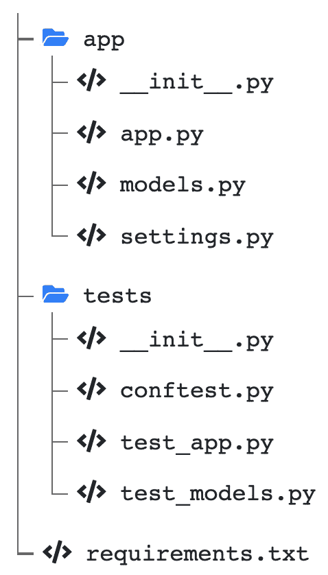

# 第九章：使用 pytest 和 HTTPX 异步测试 API

在软件开发中，开发者的工作中很大一部分应当专注于编写测试。一开始，你可能会倾向于通过手动运行应用程序，发起一些请求，并随意决定“所有功能都正常”，来测试你的应用程序。然而，这种做法是有缺陷的，无法保证程序在各种情况下都能正常工作，并且无法确保你在开发过程中没有引入新问题。

正因如此，软件测试领域出现了多个分支：单元测试、集成测试、端到端测试、验收测试等。这些技术旨在从微观层面验证软件的功能，在单元测试中我们验证单个函数的正确性；而在宏观层面，我们验证能够为用户提供价值的整体功能（如验收测试）。在本章中，我们将聚焦于第一个层次：单元测试。

单元测试是用于验证我们编写的代码在每种情况下都能按预期行为运行的简短程序。你可能会认为编写测试非常耗时，并且它们对软件没有附加价值，但从长远来看，它将节省你的时间：首先，测试可以自动在几秒钟内运行，确保你的所有软件功能正常，而不需要你手动逐个检查每个功能。其次，当你引入新功能或重构代码时，确保不会向现有功能中引入错误。总之，测试和程序本身一样重要，它们帮助你交付可靠且高质量的软件。

在本章中，你将学习如何为你的 FastAPI 应用程序编写测试，包括 HTTP 端点和 WebSockets。为此，你将学习如何配置 pytest，一个知名的 Python 测试框架，以及 HTTPX，一个用于 Python 的异步 HTTP 客户端。

在本章中，我们将涵盖以下主要主题：

+   使用 pytest 进行单元测试简介

+   为 FastAPI 设置 HTTPX 测试工具

+   为 REST API 端点编写测试

+   为 WebSocket 端点编写测试

# 技术要求

对于本章内容，你需要一个 Python 虚拟环境，正如我们在*第一章*中设置的那样，*Python 开发环境设置*。

对于*使用 Motor 与 MongoDB 数据库通信*部分，你需要在本地计算机上运行一个 MongoDB 服务器。最简单的方式是通过 Docker 容器来运行。如果你从未使用过 Docker，建议参考官方文档中的*入门教程*，网址为[`docs.docker.com/get-started/`](https://docs.docker.com/get-started/)。完成这一步后，你可以使用以下简单命令来运行 MongoDB 服务器：

```py

$ docker run -d --name fastapi-mongo -p 27017:27017 mongo:6.0
```

MongoDB 服务器实例将通过本地计算机上的端口`27017`提供服务。

你可以在本章节专用的 GitHub 仓库中找到所有代码示例，地址为 [`github.com/PacktPublishing/Building-Data-Science-Applications-with-FastAPI-Second-Edition/tree/main/chapter09`](https://github.com/PacktPublishing/Building-Data-Science-Applications-with-FastAPI-Second-Edition/tree/main/chapter09)。

# 使用 pytest 进行单元测试简介

正如我们在介绍中提到的，编写单元测试是软件开发中的一项重要任务，旨在交付高质量的软件。为了提高我们的工作效率，许多库提供了专门用于测试的工具和快捷方式。在 Python 标准库中，有一个用于单元测试的模块，叫做`unittest`。尽管它在 Python 代码库中非常常见，但许多 Python 开发者倾向于使用 pytest，因为它提供了更轻量的语法和强大的高级工具。

在接下来的示例中，我们将为一个名为`add`的函数编写单元测试，分别使用`unittest`和 pytest，以便你能比较它们在基本用例中的表现。首先，我们来安装 pytest：

```py

(venv) $ pip install pytest
```

现在，让我们来看一下我们的简单`add`函数，它只是执行加法操作：

chapter09_introduction.py

```py

def add(a: int, b: int) -> int:    return a + b
```

[`github.com/PacktPublishing/Building-Data-Science-Applications-with-FastAPI-Second-Edition/tree/main/chapter09/chapter09_introduction.py`](https://github.com/PacktPublishing/Building-Data-Science-Applications-with-FastAPI-Second-Edition/tree/main/chapter09/chapter09_introduction.py)

现在，让我们用`unittest`实现一个测试，检查*2 + 3*是否确实等于*5*：

chapter09_introduction_unittest.py

```py

import unittestfrom chapter09.chapter09_introduction import add
class TestChapter09Introduction(unittest.TestCase):
    def test_add(self):
        self.assertEqual(add(2, 3), 5)
```

[`github.com/PacktPublishing/Building-Data-Science-Applications-with-FastAPI-Second-Edition/tree/main/chapter09/chapter09_introduction_unittest.py`](https://github.com/PacktPublishing/Building-Data-Science-Applications-with-FastAPI-Second-Edition/tree/main/chapter09/chapter09_introduction_unittest.py)

正如你所看到的，`unittest`要求我们定义一个继承自`TestCase`的类。然后，每个测试都在自己的方法中。要断言两个值是否相等，我们必须使用`assertEqual`方法。

要运行这个测试，我们可以从命令行调用`unittest`模块，并通过点路径传递给我们的测试模块：

```py

(venv) $ python -m unittest chapter09.chapter09_introduction_unittest.
----------------------------------------------------------------------
Ran 1 test in 0.000s
OK
```

在输出中，每个成功的测试由一个点表示。如果一个或多个测试没有成功，你将收到每个测试的详细错误报告，突出显示失败的断言。你可以通过更改测试中的断言来尝试修复问题。

现在，让我们用 pytest 来编写相同的测试：

chapter09_introduction_pytest.py

```py

from chapter09.chapter09_introduction import adddef test_add():
    assert add(2, 3) == 5
```

[`github.com/PacktPublishing/Building-Data-Science-Applications-with-FastAPI-Second-Edition/tree/main/chapter09/chapter09_introduction_pytest.py`](https://github.com/PacktPublishing/Building-Data-Science-Applications-with-FastAPI-Second-Edition/tree/main/chapter09/chapter09_introduction_pytest.py)

正如你所看到的，这样简短多了！事实上，在 pytest 中，你不一定需要定义一个类：一个简单的函数就足够了。唯一的约束是函数名称必须以 `test_` 开头。这样，pytest 就可以自动发现测试函数。其次，它依赖于内置的 `assert` 语句，而不是特定的方法，这让你能够更自然地编写比较。

要运行这个测试，我们只需调用 `pytest` 可执行文件并指定测试文件的路径：

```py

(venv) $ pytest chapter09/chapter09_introduction_pytest.py=============== test session starts ===============
platform darwin -- Python 3.10.8, pytest-7.2.0, pluggy-1.0.0
rootdir: /Users/fvoron/Development/Building-Data-Science-Applications-with-FastAPI-Second-Edition, configfile: pyproject.toml
plugins: asyncio-0.20.2, cov-4.0.0, anyio-3.6.2
asyncio: mode=strict
collected 1 item
chapter09/chapter09_introduction_pytest.py .                      [100%]
================ 1 passed in 0.01s ===============
```

再次强调，输出使用一个点表示每个成功的测试。当然，如果你修改了测试使其失败，你将获得失败断言的详细错误信息。

值得注意的是，如果你在没有任何参数的情况下运行 pytest，它将自动发现你项目中所有的测试，只要它们的名称以 `test_` 开头。

在这里，我们对 `unittest` 和 pytest 做了一个小的比较。在本章的剩余部分，我们将继续使用 pytest，它应该能为你提供更高效的测试体验。

在专注于 FastAPI 测试之前，让我们复习一下 pytest 的两个最强大的功能：`parametrize` 和 fixtures。

## 使用 parametrize 生成测试

在我们之前的例子中，使用 `add` 函数时，我们只测试了一个加法测试，*2 + 3*。大多数时候，我们会希望检查更多的情况，以确保我们的函数在各种情况下都能正常工作。我们第一步的做法可能是向测试中添加更多断言，例如：

```py

def test_add():    assert add(2, 3) == 5
    assert add(0, 0) == 0
    assert add(100, 0) == 100
    assert add(1, 1) == 2
```

在实际工作中，这种方法有两个缺点：首先，写下多次相同的断言可能有些繁琐，尤其是只有一些参数发生变化的情况下。在这个例子中不算太糟，但测试可能会变得更复杂，正如我们在 FastAPI 中将看到的那样。其次，我们仍然只有一个测试：第一个失败的断言会停止测试，之后的断言将不会被执行。因此，只有在我们先修复失败的断言并重新运行测试后，我们才会知道结果。

为了帮助完成这一特定任务，pytest 提供了 `parametrize` 标记。在 pytest 中，**标记** 是一种特殊的装饰器，用来轻松地将元数据传递给测试。然后，根据测试所使用的标记，可以实现特殊的行为。

在这里，`parametrize` 允许我们定义多个变量集，这些变量将作为参数传递给测试函数。在运行时，每个变量集都会生成一个新的独立测试。为了更好地理解这一点，我们来看看如何使用这个标记为我们的 `add` 函数生成多个测试：

chapter09_introduction_pytest_parametrize.py

```py

import pytestfrom chapter09.chapter09_introduction import add
@pytest.mark.parametrize("a,b,result", [(2, 3, 5), (0, 0, 0), (100, 0, 100), (1, 1, 2)])
def test_add(a, b, result):
    assert add(a, b) == result
```

[`github.com/PacktPublishing/Building-Data-Science-Applications-with-FastAPI-Second-Edition/tree/main/chapter09/chapter09_introduction_pytest_parametrize.py`](https://github.com/PacktPublishing/Building-Data-Science-Applications-with-FastAPI-Second-Edition/tree/main/chapter09/chapter09_introduction_pytest_parametrize.py)

在这里，您可以看到我们只是简单地用`parametrize`标记装饰了我们的测试函数。基本用法如下：第一个参数是一个字符串，其中包含每个参数的名称，用逗号分隔。然后，第二个参数是一个元组列表。每个元组按顺序包含参数的值。

我们的测试函数以参数的形式接收这些参数，每个参数的名称与您之前指定的方式相同。因此，您可以在测试逻辑中随意使用它们。正如您所见，这里的巨大好处在于我们只需要一次编写`assert`语句。此外，添加新的测试用例非常快速：我们只需在`parametrize`标记中添加另一个元组。

现在，让我们运行这个测试，看看使用以下命令会发生什么：

```py

(venv) $ pytest chapter09/chapter09_introduction_pytest_parametrize.py================ test session starts ================
platform darwin -- Python 3.10.8, pytest-7.2.0, pluggy-1.0.0
rootdir: /Users/fvoron/Development/Building-Data-Science-Applications-with-FastAPI-Second-Edition, configfile: pyproject.toml
plugins: asyncio-0.20.2, cov-4.0.0, anyio-3.6.2
asyncio: mode=strict
collected 4 items
chapter09/chapter09_introduction_pytest_parametrize.py ....   [100%]
================ 4 passed in 0.01s ================
```

正如你所见，pytest 执行了*四个测试而不是一个*！这意味着它生成了四个独立的测试，以及它们自己的参数集。如果有几个测试失败，我们将得到通知，并且输出将告诉我们哪组参数导致了错误。

总结一下，`parametrize` 是一种非常便捷的方式，当给定不同的参数集时，测试不同的结果。

在编写单元测试时，通常需要在测试中多次使用变量和对象，比如应用程序实例、虚假数据等等。为了避免在测试中反复重复相同的事物，pytest 提出了一个有趣的特性：夹具。

## 通过创建夹具来重用测试逻辑

在测试大型应用程序时，测试往往会变得非常重复：在实际断言之前，许多测试将共享相同的样板代码。考虑以下代表人物及其邮政地址的 Pydantic 模型：

chapter09_introduction_fixtures.py

```py

from datetime import datefrom enum import Enum
from pydantic import BaseModel
class Gender(str, Enum):
    MALE = "MALE"
    FEMALE = "FEMALE"
    NON_BINARY = "NON_BINARY"
class Address(BaseModel):
    street_address: str
    postal_code: str
    city: str
    country: str
class Person(BaseModel):
    first_name: str
    last_name: str
    gender: Gender
    birthdate: date
    interests: list[str]
    address: Address
```

[`github.com/PacktPublishing/Building-Data-Science-Applications-with-FastAPI-Second-Edition/tree/main/chapter09/chapter09_introduction_fixtures.py`](https://github.com/PacktPublishing/Building-Data-Science-Applications-with-FastAPI-Second-Edition/tree/main/chapter09/chapter09_introduction_fixtures.py)

这个例子可能看起来很熟悉：它来自*第四章*，*在 FastAPI 中管理 Pydantic 数据模型*。现在，假设我们希望使用这些模型的一些实例编写测试。显然，在每个测试中实例化它们并填充虚假数据会有点烦人。

幸运的是，夹具使我们能够一劳永逸地编写它们。以下示例展示了如何使用它们：

chapter09_introduction_fixtures_test.py

```py

import pytestfrom chapter09.chapter09_introduction_fixtures import Address, Gender, Person
@pytest.fixture
def address():
    return Address(
        street_address="12 Squirell Street",
        postal_code="424242",
        city="Woodtown",
        country="US",
    )
@pytest.fixture
def person(address):
    return Person(
        first_name="John",
        last_name="Doe",
        gender=Gender.MALE,
        birthdate="1991-01-01",
        interests=["travel", "sports"],
        address=address,
    )
def test_address_country(address):
    assert address.country == "US"
def test_person_first_name(person):
    assert person.first_name == "John"
def test_person_address_city(person):
    assert person.address.city == "Woodtown"
```

[`github.com/PacktPublishing/Building-Data-Science-Applications-with-FastAPI-Second-Edition/tree/main/chapter09/chapter09_introduction_fixtures_test.py`](https://github.com/PacktPublishing/Building-Data-Science-Applications-with-FastAPI-Second-Edition/tree/main/chapter09/chapter09_introduction_fixtures_test.py)

再次感谢 pytest 的简便性：夹具是*简单的函数*，并且*使用夹具装饰器*进行装饰。在这些函数内部，你可以编写任何逻辑，并返回你在测试中需要的对象。在`address`中，我们用虚拟数据实例化了一个`Address`对象并返回它。

现在，我们如何使用这个夹具呢？如果你查看`test_address_country`测试，你会看到一些魔法：通过在测试函数中设置`address`参数，pytest 会自动检测到它对应于`address`夹具，执行它并传递其返回值。在测试中，我们的`Address`对象已经准备好使用了。pytest 称之为*请求* *一个夹具*。

你可能已经注意到，我们还定义了另一个夹具`person`。再一次，我们用虚拟数据实例化了一个`Person`模型。然而，值得注意的是，我们实际上请求了`address`夹具并在其中使用了它！这就是这个系统如此强大的原因：夹具可以依赖于其他夹具，而这些夹具也可以依赖于其他夹具，依此类推。从某种意义上来说，它与我们在*第五章*中讨论的*依赖注入*非常相似，*FastAPI 中的依赖注入*。

至此，我们对 pytest 的简短介绍已经结束。当然，还有很多内容可以讨论，但这些内容足以让你开始。如果你想深入了解这个话题，可以阅读官方的 pytest 文档，其中包含大量示例，展示了你如何从其所有功能中受益：[`docs.pytest.org/en/latest/`](https://docs.pytest.org/en/latest/)。

现在，让我们把重点放在 FastAPI 上。我们将从设置测试工具开始。

# 使用 HTTPX 为 FastAPI 设置测试工具

如果你查看 FastAPI 文档中关于测试的部分，你会看到它推荐使用 Starlette 提供的`TestClient`。在本书中，我们将向你展示一种不同的方法，它涉及一个名为 HTTPX 的 HTTP 客户端。

为什么？默认的`TestClient`实现方式使其完全同步，这意味着你可以在测试中写代码而不必担心`async`和`await`。这听起来可能不错，但我们发现它在实际中会引发一些问题：由于你的 FastAPI 应用是设计为异步工作的，因此你很可能会有许多异步工作的服务，比如我们在*第六章*中讨论的*数据库和异步 ORM*。因此，在你的测试中，你很可能需要对这些异步服务执行一些操作，比如用虚拟数据填充数据库，这样即使测试本身是异步的。将两种方法混合往往会导致一些难以调试的奇怪错误。

幸运的是，HTTPX 是由与 Starlette 同一团队创建的一个 HTTP 客户端，它使我们能够拥有一个纯异步的 HTTP 客户端，可以向我们的 FastAPI 应用发送请求。为了使这种方法奏效，我们需要三个库：

+   `HTTPX`，执行 HTTP 请求的客户端

+   `asgi-lifespan`，一个用于以编程方式管理 FastAPI 应用程序生命周期事件的库

+   `pytest-asyncio`，一个为 pytest 扩展的库，允许我们编写异步测试

让我们使用以下命令安装这些库：

```py

(venv) $ pip install httpx asgi-lifespan pytest-asyncio
```

太好了！现在，让我们编写一些夹具，以便我们可以轻松地为 FastAPI 应用程序获取 HTTP 测试客户端。这样，在编写测试时，我们只需请求该夹具，就能立即进行请求。

在以下示例中，我们考虑了一个简单的 FastAPI 应用程序，我们希望对其进行测试：

chapter09_app.py

```py

import contextlibfrom fastapi import FastAPI
@contextlib.asynccontextmanager
async def lifespan(app: FastAPI):
    print("Startup")
    yield
    print("Shutdown")
app = FastAPI(lifespan=lifespan)
@app.get("/")
async def hello_world():
    return {"hello": "world"}
```

[`github.com/PacktPublishing/Building-Data-Science-Applications-with-FastAPI-Second-Edition/tree/main/chapter09/chapter09_app.py`](https://github.com/PacktPublishing/Building-Data-Science-Applications-with-FastAPI-Second-Edition/tree/main/chapter09/chapter09_app.py)

在一个单独的测试文件中，我们将实现两个夹具（fixtures）。

第一个，`event_loop`，将确保我们始终使用相同的事件循环实例。它会在执行异步测试之前由`pytest-asyncio`自动请求。你可以在以下示例中看到它的实现：

chapter09_app_test.py

```py

@pytest.fixture(scope="session")def event_loop():
    loop = asyncio.new_event_loop()
    yield loop
    loop.close()
```

[`github.com/PacktPublishing/Building-Data-Science-Applications-with-FastAPI-Second-Edition/tree/main/chapter09/chapter09_app_test.py`](https://github.com/PacktPublishing/Building-Data-Science-Applications-with-FastAPI-Second-Edition/tree/main/chapter09/chapter09_app_test.py)

在这里，你可以看到我们仅仅在*生成*它之前创建了一个新的事件循环。正如我们在*第二章*中讨论的那样，*Python 编程的特殊性*，使用生成器允许我们“暂停”函数的执行并返回到调用者的执行。当调用者完成时，我们可以执行清理操作，比如关闭循环。pytest 足够聪明，能够正确地处理夹具中的这一点，所以这是设置测试数据、使用它并在之后销毁它的一个非常常见的模式。我们在 FastAPI 的生命周期函数中也使用相同的方法。

当然，这个函数被`fixture`装饰器修饰，使其成为 pytest 的夹具。你可能已经注意到我们设置了一个名为`scope`的参数，值为`session`。这个参数控制夹具应该在哪个层级进行实例化。默认情况下，它会在*每个单独的测试函数开始时*重新创建。`session`值是最高的层级，意味着该夹具只会在整个测试运行开始时创建一次，这对于我们的事件循环是很重要的。你可以在官方文档中了解更多关于这个更高级功能的信息：[`docs.pytest.org/en/latest/how-to/fixtures.html#scope-sharing-fixtures-across-classes-modules-packages-or-session`](https://docs.pytest.org/en/latest/how-to/fixtures.html#scope-sharing-fixtures-across-classes-modules-packages-or-session)。

接下来，我们将实现我们的`test_client`固定装置，它将为我们的 FastAPI 应用程序创建一个 HTTPX 实例。我们还必须记住使用`asgi-lifespan`触发应用程序事件。您可以在以下示例中看到它的外观：

chapter09_app_test.py

```py

@pytest_asyncio.fixtureasync def test_client():
    async with LifespanManager(app):
        async with httpx.AsyncClient(app=app, base_url="http://app.io") as test_client:
            yield test_client
```

[`github.com/PacktPublishing/Building-Data-Science-Applications-with-FastAPI-Second-Edition/tree/main/chapter09/chapter09_app_test.py`](https://github.com/PacktPublishing/Building-Data-Science-Applications-with-FastAPI-Second-Edition/tree/main/chapter09/chapter09_app_test.py)

只需要三行。到目前为止，与我们所见过的固定装置的第一个不同之处在于这是一个异步函数。在这种情况下，请注意，我们使用了`@pytest_asyncio.fixture`装饰器，而不是`@pytest.fixture`。这是由`pytest-asyncio`提供的此装饰器的异步对应项，因此可以正确处理异步固定装置。在以前的版本中，使用标准装饰器曾经有效，但现在不鼓励使用。

接下来，我们有两个上下文管理器：`LifespanManager`和`httpx.AsyncClient`。第一个确保启动和关闭事件被执行，而第二个确保 HTTP 会话已准备就绪。在这两者上，我们设置了`app`变量：这是我们从其模块`chapter09.chapter09_app`中导入的 FastAPI 应用程序实例。

请注意，在这里我们再次使用了一个生成器，使用了`yield`。这很重要，因为即使我们在其后没有更多的代码，*我们需要在使用客户端后关闭上下文管理器*。如果我们使用`return`，Python 会立即关闭它们，我们最终会得到一个无法使用的客户端。

在项目中组织测试和全局固定装置

在更大的项目中，您可能会有几个测试文件来组织您的测试。通常，这些文件放置在项目根目录的`tests`文件夹中。如果您的测试文件以`test_`前缀，它们将被 pytest 自动发现。*图 9**.1*显示了一个示例。

此外，您将需要在所有测试中使用我们在本节中定义的固定装置。与其在所有测试文件中一遍又一遍地重复定义它们，pytest 允许您在名为`conftest.py`的文件中编写全局固定装置。将其放置在您的`tests`文件夹中后，它将自动被导入，允许您请求您在其中定义的所有固定装置。您可以在官方文档的 https://docs.pytest.org/en/latest/reference/fixtures.html#conftest-py-sharing-fixtures-across-multiple-files 中了解更多信息。

如前所述，*图 9**.1*显示了位于`tests`文件夹中的测试文件：



图 9**.1 – 项目带有测试的结构

就是这样！现在我们已经准备好为我们的 REST API 端点编写测试所需的所有固定装置。这将是我们在下一节要做的事情。

# 为 REST API 端点编写测试

测试 FastAPI 应用程序所需的所有工具现在都已准备好。所有这些测试都归结为执行一个 HTTP 请求并检查响应，看看它是否符合我们的预期。

让我们从对 `hello_world` 路径操作函数进行简单的测试开始。你可以在以下代码中看到它：

chapter09_app_test.py

```py

@pytest.mark.asyncioasync def test_hello_world(test_client: httpx.AsyncClient):
    response = await test_client.get("/")
    assert response.status_code == status.HTTP_200_OK
    json = response.json()
    assert json == {"hello": "world"}
```

[`github.com/PacktPublishing/Building-Data-Science-Applications-with-FastAPI-Second-Edition/tree/main/chapter09/chapter09_app_test.py`](https://github.com/PacktPublishing/Building-Data-Science-Applications-with-FastAPI-Second-Edition/tree/main/chapter09/chapter09_app_test.py)

首先，注意测试函数被定义为异步函数。如前所述，为了让它与 pytest 一起工作，我们需要安装 `pytest-asyncio`。这个扩展提供了 `asyncio` 标记：每个异步测试都应使用此标记进行装饰，以确保它能正常工作。

接下来，我们请求我们之前定义的 `test_client` 固件。它为我们提供了一个准备好向 FastAPI 应用程序发起请求的 HTTPX 客户端实例。注意，我们手动给这个固件加上了类型提示。虽然这不是严格要求的，但如果你使用像 Visual Studio Code 这样的 IDE，类型提示会大大帮助你，提供方便的自动完成功能。

然后，在我们测试的主体中，我们执行请求。在这里，它是一个简单的对 `/` 路径的 GET 请求。它返回一个 HTTPX `Response` 对象（*与 FastAPI 的 `Response` 类不同*），包含 HTTP 响应的所有数据：状态码、头信息和正文。

最后，我们基于这些数据做出断言。如你所见，我们验证了状态码确实是 `200`。我们还检查了正文的内容，它是一个简单的 JSON 对象。注意，`Response` 对象有一个方便的方法 `json`，可以自动解析 JSON 内容。

太棒了！我们写出了第一个 FastAPI 测试！当然，你可能会有更复杂的测试，通常是针对 POST 端点的测试。

## 编写 POST 端点的测试

测试 POST 端点与我们之前看到的并没有太大不同。不同之处在于，我们可能会有更多的用例来检查数据验证是否有效。在下面的例子中，我们实现了一个 POST 端点，该端点接受请求体中的 `Person` 模型：

chapter09_app_post.py

```py

class Person(BaseModel):    first_name: str
    last_name: str
    age: int
@app.post("/persons", status_code=status.HTTP_201_CREATED)
async def create_person(person: Person):
    return person
```

[`github.com/PacktPublishing/Building-Data-Science-Applications-with-FastAPI-Second-Edition/tree/main/chapter09/chapter09_app_post.py`](https://github.com/PacktPublishing/Building-Data-Science-Applications-with-FastAPI-Second-Edition/tree/main/chapter09/chapter09_app_post.py)

一个有趣的测试可能是确保如果请求负载中缺少某些字段，系统会引发错误。在以下提取中，我们编写了两个测试—一个使用无效负载，另一个使用有效负载：

chapter09_app_post_test.py

```py

@pytest.mark.asyncioclass TestCreatePerson:
    async def test_invalid(self, test_client: httpx.AsyncClient):
        payload = {"first_name": "John", "last_name": "Doe"}
        response = await test_client.post("/persons", json=payload)
        assert response.status_code == status.HTTP_422_UNPROCESSABLE_ENTITY
    async def test_valid(self, test_client: httpx.AsyncClient):
        payload = {"first_name": "John", "last_name": "Doe", "age": 30}
        response = await test_client.post("/persons", json=payload)
        assert response.status_code == status.HTTP_201_CREATED
        json = response.json()
        assert json == payload
```

[`github.com/PacktPublishing/Building-Data-Science-Applications-with-FastAPI-Second-Edition/tree/main/chapter09/chapter09_app_post_test.py`](https://github.com/PacktPublishing/Building-Data-Science-Applications-with-FastAPI-Second-Edition/tree/main/chapter09/chapter09_app_post_test.py)

你可能首先注意到的是，我们将两个测试包装在了一个类里面。虽然在 pytest 中这不是必须的，但它可以帮助你组织测试——例如，重新组合与单个端点相关的测试。请注意，在这种情况下，我们只需要用`asyncio`标记装饰类，它会自动应用到单个测试上。另外，确保为每个测试添加`self`参数：因为我们现在在一个类中，它们变成了方法。

这些测试与我们的第一个例子没有太大不同。正如你所看到的，HTTPX 客户端使得执行带有 JSON 负载的 POST 请求变得非常简单：你只需将字典传递给`json`参数。

当然，HTTPX 帮助你构建各种各样的 HTTP 请求，包括带有头部、查询参数等等。务必查看它的官方文档，以了解更多使用方法：[`www.python-httpx.org/quickstart/`](https://www.python-httpx.org/quickstart/)。

## 使用数据库进行测试

你的应用程序可能会有一个数据库连接，用来读取和存储数据。在这种情况下，你需要在每次运行时都使用一个新的测试数据库，以便拥有一组干净且可预测的数据来编写测试。

为此，我们将使用两样东西。第一个是`dependency_overrides`，它是 FastAPI 的一个特性，允许我们在运行时替换一些依赖项。例如，我们可以用返回测试数据库实例的依赖项替换返回数据库实例的依赖项。第二个是再次使用 fixtures，它将帮助我们在运行测试之前向测试数据库添加假数据。

为了给你展示一个工作示例，我们将考虑我们在《第六章》中构建的*与 MongoDB 数据库进行通信*部分中的相同示例，*数据库和异步 ORM*。在那个示例中，我们构建了用于管理博客文章的 REST 端点。你可能还记得，我们有一个返回数据库实例的`get_database`依赖项。为了提醒，你可以在这里再次看到它：

database.py

```py

from motor.motor_asyncio import AsyncIOMotorClient, AsyncIOMotorDatabase# Connection to the whole server
motor_client = AsyncIOMotorClient("mongodb://localhost:27017")
# Single database instance
database = motor_client["chapter6_mongo"]
def get_database() -> AsyncIOMotorDatabase:
    return database
```

[`github.com/PacktPublishing/Building-Data-Science-Applications-with-FastAPI-Second-Edition/tree/main/chapter6/mongodb/database.py`](https://github.com/PacktPublishing/Building-Data-Science-Applications-with-FastAPI-Second-Edition/tree/main/chapter6/mongodb/database.py)

路径操作函数和其他依赖项将使用这个依赖项来获取数据库实例。

对于我们的测试，我们将创建一个新的`AsyncIOMotorDatabase`实例，它指向另一个数据库。然后，我们将在测试文件中直接创建一个新依赖项，返回这个实例。你可以在以下示例中看到这一点：

chapter09_db_test.py

```py

motor_client = AsyncIOMotorClient(    os.getenv("MONGODB_CONNECTION_STRING", "mongodb://localhost:27017")
)
database_test = motor_client["chapter09_db_test"]
def get_test_database():
    return database_test
```

[`github.com/PacktPublishing/Building-Data-Science-Applications-with-FastAPI-Second-Edition/tree/main/chapter09/chapter09_db_test.py`](https://github.com/PacktPublishing/Building-Data-Science-Applications-with-FastAPI-Second-Edition/tree/main/chapter09/chapter09_db_test.py)

然后，在我们的 `test_client` fixture 中，我们将通过使用当前的 `get_test_database` 依赖项来覆盖默认的 `get_database` 依赖项。以下示例展示了如何实现这一点：

chapter09_db_test.py

```py

@pytest_asyncio.fixtureasync def test_client():
    app.dependency_overrides[get_database] = get_test_database
    async with LifespanManager(app):
        async with httpx.AsyncClient(app=app, base_url="http://app.io") as test_client:
            yield test_client
```

[`github.com/PacktPublishing/Building-Data-Science-Applications-with-FastAPI-Second-Edition/tree/main/chapter09/chapter09_db_test.py`](https://github.com/PacktPublishing/Building-Data-Science-Applications-with-FastAPI-Second-Edition/tree/main/chapter09/chapter09_db_test.py)

FastAPI 提供了一个名为 `dependency_overrides` 的属性，这是一个字典，用于将原始依赖函数与替代函数进行映射。在这里，我们直接使用 `get_database` 函数作为键。其余的 fixture 不需要改变。现在，每当 `get_database` 依赖项被注入到应用程序代码中时，FastAPI 会自动将其替换为 `get_test_database`。因此，我们的端点现在将使用测试数据库实例。

app 和 dependency_overrides 是全局的

由于我们是直接从模块中导入 `app`，因此它只会在整个测试运行中实例化一次。这意味着 `dependency_overrides` 对每个测试都是通用的。如果有一天你想为单个测试覆盖某个依赖项，记住一旦设置，它将应用于剩余的执行过程。在这种情况下，你可以通过使用 `app.dependency_overrides = {}` 来重置 `dependency_overrides`。

为了测试一些行为，例如获取单个帖子，通常需要在我们的测试数据库中准备一些基础数据。为此，我们将创建一个新的 fixture，它将实例化虚拟的 `PostDB` 对象并将其插入到测试数据库中。你可以在以下示例中看到这一点：

chapter09_db_test.py

```py

@pytest_asyncio.fixture(autouse=True, scope="module")async def initial_posts():
    initial_posts = [
        Post(title="Post 1", content="Content 1"),
        Post(title="Post 2", content="Content 2"),
        Post(title="Post 3", content="Content 3"),
    ]
    await database_test["posts"].insert_many(
        [post.dict(by_alias=True) for post in initial_posts]
    )
    yield initial_posts
    await motor_client.drop_database("chapter09_db_test")
```

[`github.com/PacktPublishing/Building-Data-Science-Applications-with-FastAPI-Second-Edition/tree/main/chapter09/chapter09_db_test.py`](https://github.com/PacktPublishing/Building-Data-Science-Applications-with-FastAPI-Second-Edition/tree/main/chapter09/chapter09_db_test.py)

在这里，你可以看到我们只需要向 MongoDB 数据库发出一个 `insert_many` 请求来创建帖子。

请注意，我们使用了`fixture`装饰器的`autouse`和`scope`参数。第一个参数告诉 pytest 自动调用此测试夹具，*即使在任何测试中都没有请求它*。在这种情况下，它很方便，因为我们将始终确保数据已在数据库中创建，而不会有忘记在测试中请求它的风险。另一个参数`scope`，如前所述，允许我们在每个测试开始时不运行此测试夹具。使用`module`值时，测试夹具只会在此特定测试文件的开始时创建对象一次。它有助于提高测试速度，因为在这种情况下，重新创建帖子在每个测试之前是没有意义的。

再次，我们*使用生成器*来生成帖子，而不是直接返回它们。这个模式使得我们在测试运行后能够删除测试数据库。通过这样做，我们确保每次运行测试时，数据库都是全新的。

完成了！现在我们可以在完全了解数据库中的内容的情况下编写测试。在下面的示例中，您可以看到用于验证获取单个帖子端点行为的测试：

chapter09_db_test.py

```py

@pytest.mark.asyncioclass TestGetPost:
    async def test_not_existing(self, test_client: httpx.AsyncClient):
        response = await test_client.get("/posts/abc")
        assert response.status_code == status.HTTP_404_NOT_FOUND
    async def test_existing(
        self, test_client: httpx.AsyncClient, initial_posts: list[Post]
    ):
        response = await test_client.get(f"/posts/{initial_posts[0].id}")
        assert response.status_code == status.HTTP_200_OK
        json = response.json()
        assert json["_id"] == str(initial_posts[0].id)
```

[`github.com/PacktPublishing/Building-Data-Science-Applications-with-FastAPI-Second-Edition/tree/main/chapter09/chapter09_db_test.py`](https://github.com/PacktPublishing/Building-Data-Science-Applications-with-FastAPI-Second-Edition/tree/main/chapter09/chapter09_db_test.py)

请注意，在第二个测试中，我们请求了`initial_posts`测试夹具，以获取数据库中真实存在的帖子的标识符。

当然，我们也可以通过创建数据并检查它是否正确插入到数据库中来测试我们的端点。您可以在以下示例中看到这一点：

chapter09_db_test.py

```py

@pytest.mark.asyncioclass TestCreatePost:
    async def test_invalid_payload(self, test_client: httpx.AsyncClient):
        payload = {"title": "New post"}
        response = await test_client.post("/posts", json=payload)
        assert response.status_code == status.HTTP_422_UNPROCESSABLE_ENTITY
    async def test_valid_payload(self, test_client: httpx.AsyncClient):
        payload = {"title": "New post", "content": "New post content"}
        response = await test_client.post("/posts", json=payload)
        assert response.status_code == status.HTTP_201_CREATED
        json = response.json()
        post_id = ObjectId(json["_id"])
        post_db = await database_test["posts"].find_one({"_id": post_id})
        assert post_db is not None
```

[`github.com/PacktPublishing/Building-Data-Science-Applications-with-FastAPI-Second-Edition/tree/main/chapter09/chapter09_db_test.py`](https://github.com/PacktPublishing/Building-Data-Science-Applications-with-FastAPI-Second-Edition/tree/main/chapter09/chapter09_db_test.py)

在第二个测试中，我们使用了`database_test`实例来执行请求，并检查对象是否正确插入。这展示了使用异步测试的好处：我们可以在测试中使用相同的库和工具。

这就是关于`dependency_overrides`的所有内容。这个功能在你需要为涉及外部服务的逻辑编写测试时非常有用，例如外部 API。与其在测试期间向这些外部服务发送真实请求（可能会导致问题或产生费用），你可以将它们替换为另一个伪造请求的依赖项。为了理解这一点，我们构建了另一个示例应用程序，其中有一个端点用于从外部 API 获取数据：

chapter09_app_external_api.py

```py

class ExternalAPI:    def __init__(self) -> None:
        self.client = httpx.AsyncClient(base_url="https://dummyjson.com")
    async def __call__(self) -> dict[str, Any]:
        async with self.client as client:
            response = await client.get("/products")
            return response.json()
external_api = ExternalAPI()
@app.get("/products")
async def external_products(products: dict[str, Any] = Depends(external_api)):
    return products
```

[`github.com/PacktPublishing/Building-Data-Science-Applications-with-FastAPI-Second-Edition/tree/main/chapter09/chapter09_app_external_api.py`](https://github.com/PacktPublishing/Building-Data-Science-Applications-with-FastAPI-Second-Edition/tree/main/chapter09/chapter09_app_external_api.py)

为了调用我们的外部 API，我们构建了一个类依赖，就像我们在 *第五章*的 *在 FastAPI 中创建并使用带参数化的依赖类* 一节中所看到的那样。我们使用 HTTPX 作为 HTTP 客户端向外部 API 发出请求并获取数据。这个外部 API 是一个虚拟 API，包含假的数据——非常适合像这样的实验：[`dummyjson.com`](https://dummyjson.com)。

`/products` 端点只是通过依赖注入来获取依赖并直接返回外部 API 提供的数据。

当然，为了测试这个端点，我们不希望向外部 API 发出真实请求：这样可能会耗费时间，而且可能会受到速率限制。此外，你可能希望测试一些在真实 API 中不容易复现的行为，比如错误。

由于有了 `dependency_overrides`，我们可以很容易地用返回静态数据的另一个类替换我们的 `ExternalAPI` 依赖类。在以下示例中，你可以看到我们是如何实现这种测试的：

chapter09_app_external_api_test.py

```py

class MockExternalAPI:    mock_data = {
        "products": [
            {
                "id": 1,
                "title": "iPhone 9",
                "description": "An apple mobile which is nothing like apple",
                "thumbnail": "https://i.dummyjson.com/data/products/1/thumbnail.jpg",
            },
        ],
        "total": 1,
        "skip": 0,
        "limit": 30,
    }
    async def __call__(self) -> dict[str, Any]:
        return MockExternalAPI.mock_data
@pytest_asyncio.fixture
async def test_client():
    app.dependency_overrides[external_api] = MockExternalAPI()
    async with LifespanManager(app):
        async with httpx.AsyncClient(app=app, base_url="http://app.io") as test_client:
            yield test_client
```

[`github.com/PacktPublishing/Building-Data-Science-Applications-with-FastAPI-Second-Edition/tree/main/chapter09/chapter09_app_external_api_test.py`](https://github.com/PacktPublishing/Building-Data-Science-Applications-with-FastAPI-Second-Edition/tree/main/chapter09/chapter09_app_external_api_test.py)

在这里，你可以看到我们编写了一个简单的名为 `MockExternalAPI` 的类，它返回硬编码的数据。接下来我们只需要用这个类覆盖原有的依赖。在测试过程中，外部 API 将不会被调用；我们只会使用静态数据。

根据我们目前所看到的指南，你现在可以为 FastAPI 应用中的任何 HTTP 端点编写测试。然而，还有另一种行为不同的端点：WebSocket。正如我们将在下一节中看到的，WebSocket 的单元测试与我们为 REST 端点描述的方式非常不同。

# 为 WebSocket 端点编写测试

在 *第八章* *在 FastAPI 中定义双向交互通信的 WebSocket* 一节中，我们解释了 WebSocket 是如何工作的以及如何在 FastAPI 中实现这样的端点。正如你可能已经猜到的那样，为 WebSocket 端点编写单元测试与我们之前所看到的方式有很大不同。

对于这个任务，我们需要稍微调整一下 `test_client` 固件。实际上，HTTPX 并没有内置支持与 WebSocket 通信。因此，我们需要使用一个插件：HTTPX WS。我们可以通过以下命令来安装它：

```py

(venv) $ pip install httpx-ws
```

为了在测试客户端启用对 WebSocket 的支持，我们将这样修改它：

chapter09_websocket_test.py

```py

from httpx_ws.transport import ASGIWebSocketTransport@pytest_asyncio.fixture
async def test_client():
    async with LifespanManager(app):
        async with httpx.AsyncClient(
            transport=ASGIWebSocketTransport(app), base_url="http://app.io"
        ) as test_client:
            yield test_client
```

[`github.com/PacktPublishing/Building-Data-Science-Applications-with-FastAPI-Second-Edition/tree/main/chapter09/chapter09_websocket_test.py`](https://github.com/PacktPublishing/Building-Data-Science-Applications-with-FastAPI-Second-Edition/tree/main/chapter09/chapter09_websocket_test.py)

你可以看到，我们没有直接设置 `app` 参数，而是使用 HTTPX WS 提供的类设置了 `transport`。这个类提供了对带 WebSocket 端点的应用程序进行测试的支持。除此之外，其他没有变化。值得注意的是，测试标准的 HTTP 端点仍然能够正常工作，因此你可以使用这个测试客户端进行所有的测试。

现在，让我们考虑一个简单的 WebSocket 端点示例：

chapter09_websocket.py

```py

@app.websocket("/ws")async def websocket_endpoint(websocket: WebSocket):
    await websocket.accept()
    try:
        while True:
            data = await websocket.receive_text()
            await websocket.send_text(f"Message text was: {data}")
    except WebSocketDisconnect:
        await websocket.close()
```

[`github.com/PacktPublishing/Building-Data-Science-Applications-with-FastAPI-Second-Edition/tree/main/chapter09/chapter09_websocket.py`](https://github.com/PacktPublishing/Building-Data-Science-Applications-with-FastAPI-Second-Edition/tree/main/chapter09/chapter09_websocket.py)

你可能已经认出“回声”示例来自 *第八章*，*在 FastAPI 中定义 WebSockets 进行双向交互通信*。

现在，让我们使用测试客户端为我们的 WebSocket 编写一个测试：

Chapter09_websocket_test.py

```py

from httpx_ws import aconnect_ws@pytest.mark.asyncio
async def test_websocket_echo(test_client: httpx.AsyncClient):
    async with aconnect_ws("/ws", test_client) as websocket:
        await websocket.send_text("Hello")
        message = await websocket.receive_text()
        assert message == "Message text was: Hello"
```

[`github.com/PacktPublishing/Building-Data-Science-Applications-with-FastAPI-Second-Edition/tree/main/chapter09/chapter09_websocket_test.py`](https://github.com/PacktPublishing/Building-Data-Science-Applications-with-FastAPI-Second-Edition/tree/main/chapter09/chapter09_websocket_test.py)

正如你所看到的，HTTPX WS 提供了 `aconnect_ws` 函数来打开到 WebSocket 端点的连接。它需要 WebSocket 端点的路径以及有效的 HTTPX 客户端作为参数。通过使用 `test_client`，我们可以直接向 FastAPI 应用程序发起请求。

它打开了一个上下文管理器，给你一个 `websocket` 变量。它是一个对象，暴露了多个方法，用于发送或接收数据。每个方法都会阻塞，直到发送或接收到消息为止。

在这里，为了测试我们的“回声”服务器，我们通过 `send_text` 方法发送一条消息。然后，我们使用 `receive_text` 获取消息，并断言它符合我们的预期。也有等效的方法可以直接发送和接收 JSON 数据：`send_json` 和 `receive_json`。

这就是 WebSocket 测试有点特别的地方：你需要考虑发送和接收消息的顺序，并以编程方式实现这些顺序，以测试 WebSocket 的行为。

除此之外，我们迄今为止看到的所有关于测试的内容都适用，尤其是当你需要使用测试数据库时的`dependency_overrides`。

# 总结

恭喜你！你现在已经准备好构建高质量的、经过充分测试的 FastAPI 应用程序。在这一章中，你学习了如何使用 pytest，这是一款强大且高效的 Python 测试框架。得益于 pytest 固件，你了解了如何为 FastAPI 应用程序创建一个可以异步工作的可重用测试客户端。使用这个客户端，你学习了如何发出 HTTP 请求，以断言你的 REST API 的行为。最后，我们回顾了如何测试 WebSocket 端点，这涉及到一种完全不同的思维方式。

现在你已经能够构建一个可靠且高效的 FastAPI 应用程序，是时候将它带给全世界了！在下一章中，我们将回顾一些最佳实践和模式，以准备 FastAPI 应用程序让它面向全球，然后再研究几种部署方法。
