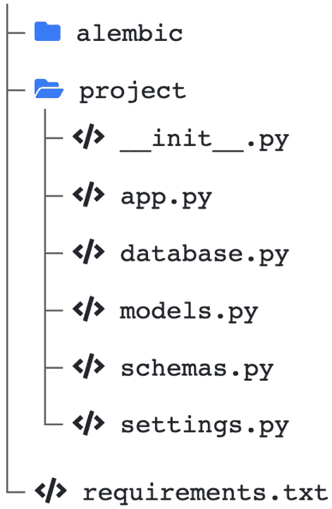

# 第十章：部署 FastAPI 项目

构建一个优秀的应用程序很好，但如果客户能够享受它就更好了。在这一章中，你将学习如何通过使用环境变量设置所需的配置选项以及通过使用 `pip` 正确管理你的依赖项来结构化你的项目，以便为部署做好准备。一旦完成，我们将展示三种部署应用程序的方式：使用无服务器云平台、使用 Docker 容器以及使用传统的 Linux 服务器。

在这一章中，我们将涵盖以下主要主题：

+   设置和使用环境变量

+   管理 Python 依赖项

+   在无服务器平台上部署 FastAPI 应用程序

+   使用 Docker 部署 FastAPI 应用程序

+   在传统服务器上部署 FastAPI 应用程序

# 技术要求

对于这一章，你需要一个 Python 虚拟环境，就像我们在*第一章*，*Python 开发环境设置*中设置的那样。

你可以在专门的 GitHub 代码库中找到本章的所有代码示例，地址为 https://github.com/PacktPublishing/Building-Data-Science-Applications-with-FastAPI-Second-Edition/tree/main/chapter10。

# 设置和使用环境变量

在深入讨论不同的部署技术之前，我们需要结构化我们的应用程序，以实现可靠、快速和安全的部署。在这个过程中的一个关键点是处理配置变量：数据库 URL、外部 API 令牌、调试标志等等。在处理这些变量时，需要动态处理而不是将它们硬编码到源代码中。为什么呢？

首先，这些变量在本地环境和生产环境中可能会不同。通常情况下，你的数据库 URL 在开发时可能指向本地计算机上的数据库，但在生产环境中可能会指向一个正式的生产数据库。如果你还有其他环境，比如 staging 或预生产环境，这一点就更加重要了。此外，如果我们需要更改其中一个值，我们必须修改代码、提交并重新部署。因此，我们需要一个方便的机制来设置这些值。

其次，在代码中写入这些值是不安全的。例如数据库连接字符串或 API 令牌等敏感信息。如果它们出现在你的代码中，它们很可能会被提交到你的代码库中：这些信息可以被任何有访问权限的人读取，这会带来明显的安全问题。

为了解决这个问题，我们通常使用**环境变量**。环境变量是程序本身没有设置的值，而是设置在整个操作系统中的值。大多数编程语言都有必要的函数来从系统中读取这些变量。你可以在 Unix 命令行中很容易地尝试这个：

```py

$ export MY_ENVIRONMENT_VARIABLE="Hello" # Set a temporary variable on the system$ python
>>> import os
>>> os.getenv("MY_ENVIRONMENT_VARIABLE")  # Get it in Python
'Hello'
```

在 Python 源代码中，我们可以从系统中动态获取值。在部署时，我们只需要确保在服务器上设置正确的环境变量。这样，我们就可以在不重新部署代码的情况下轻松更改值，并且可以让多个不同配置的部署共享相同的源代码。然而，请注意，如果不小心，已经设置为环境变量的敏感值仍然可能会泄露——例如，在日志文件或错误堆栈跟踪中。

为了帮助我们完成这项任务，我们将使用 Pydantic 的一个非常方便的特性：设置管理。这样，我们就可以像使用其他数据模型一样结构化和使用我们的配置变量。它甚至会自动从环境变量中检索这些值！

本章剩余部分，我们将使用一个你可以在`chapter10/project`中找到的应用程序。它是一个简单的 FastAPI 应用，使用 SQLAlchemy，与我们在*第六章*中的*与 SQL 数据库的通信，使用 SQLAlchemy ORM*部分中回顾的非常相似，*数据库和* *异步 ORM*。

从项目目录运行命令

如果你克隆了示例仓库，确保从`project`目录运行本章中显示的命令。在命令行中，直接输入`cd chapter10/project`。

要结构化一个设置模型，你只需要创建一个继承自`pydantic.BaseSettings`的类。下面的示例展示了一个包含调试标志、环境名称和数据库 URL 的配置类：

settings.py

```py

from pydantic import BaseSettingsclass Settings(BaseSettings):
    debug: bool = False
    environment: str
    database_url: str
    class Config:
        env_file = ".env"
settings = Settings()
```

[`github.com/PacktPublishing/Building-Data-Science-Applications-with-FastAPI-Second-Edition/tree/main/chapter10/project/project/settings.py`](https://github.com/PacktPublishing/Building-Data-Science-Applications-with-FastAPI-Second-Edition/tree/main/chapter10/project/project/settings.py)

如你所见，创建这个类与创建标准的 Pydantic 模型非常相似。我们甚至可以像为`debug`做的那样定义默认值。

要使用它，我们只需要创建该类的一个实例。然后，我们可以在项目中的任何地方导入它。例如，下面是如何获取数据库 URL 来创建我们的 SQLAlchemy 引擎：

database.py

```py

from project.settings import settingsengine = create_async_engine(settings.database_url)
```

[`github.com/PacktPublishing/Building-Data-Science-Applications-with-FastAPI-Second-Edition/tree/main/chapter10/project/project/database.py`](https://github.com/PacktPublishing/Building-Data-Science-Applications-with-FastAPI-Second-Edition/tree/main/chapter10/project/project/database.py)

我们还使用`debug`标志在启动时的`lifespan`事件中打印所有设置：

app.py

```py

@contextlib.asynccontextmanagerasync def lifespan(app: FastAPI):
    if settings.debug:
        print(settings)
    yield
```

[`github.com/PacktPublishing/Building-Data-Science-Applications-with-FastAPI-Second-Edition/tree/main/chapter10/project/project/app.py`](https://github.com/PacktPublishing/Building-Data-Science-Applications-with-FastAPI-Second-Edition/tree/main/chapter10/project/project/app.py)

由于我们的应用程序是为了与 SQLAlchemy 一起使用的，我们还处理了使用 Alembic 初始化数据库迁移环境的工作，就像我们在 *第六章*中展示的那样，*数据库与异步 ORM*。这里的区别是，我们使用 `settings` 对象动态配置数据库 URL；我们不再在`alembic.ini`中硬编码它，而是可以从 `env.py` 中的设置来配置它，正如你在这里看到的：

env.py

```py

config.set_main_option(    "sqlalchemy.url", settings.database_url.replace("+aiosqlite", "")
)
```

[`github.com/PacktPublishing/Building-Data-Science-Applications-with-FastAPI-Second-Edition/tree/main/chapter10/project/alembic/env.py`](https://github.com/PacktPublishing/Building-Data-Science-Applications-with-FastAPI-Second-Edition/tree/main/chapter10/project/alembic/env.py)

注意，我们手动移除了 URL 中的`aiosqlite`驱动部分。实际上，正如我们之前提到的，Alembic 被设计为同步工作，因此我们需要传递一个标准的 URL。现在，我们可以从开发数据库生成迁移，并在生产环境中应用这些迁移，而无需更改 Alembic 配置！

使用这个 `Settings` 模型的好处在于，它像任何其他 Pydantic 模型一样工作：它会自动解析在环境变量中找到的值，如果某个值在环境中缺失，它会抛出错误。通过这种方式，你可以确保应用程序启动时不会遗漏任何值。你可以通过运行应用程序来测试这种行为：

```py

(venv) $ uvicorn project.app:apppydantic.error_wrappers.ValidationError: 2 validation errors for Settings
environment
  field required (type=value_error.missing)
database_url
  field required (type=value_error.missing)
```

我们已经清楚列出了缺失的变量。让我们将这些变量设置到环境中，并重新尝试：

```py

(venv) $ export DEBUG="true" ENVIRONMENT="development" DATABASE_URL="sqlite+aiosqlite:///chapter10_project.db"(venv) $ uvicorn project.app:app
INFO:     Started server process [34880]
INFO:     Waiting for application startup.
debug=True environment='development' database_url='sqlite+aiosqlite:///chapter10_project.db'
INFO:     Application startup complete.
INFO:     Uvicorn running on http://127.0.0.1:8000 (Press CTRL+C to quit)
```

应用程序已启动！你甚至可以看到我们的生命周期处理器打印了我们的设置值。注意，当检索环境变量时，Pydantic 默认是不区分大小写的。按照惯例，环境变量通常在系统中以大写字母设置。

## 使用 .env 文件

在本地开发中，手动设置环境变量有点麻烦，特别是当你同时在机器上处理多个项目时。为了解决这个问题，Pydantic 允许你从 `.env` 文件中读取值。该文件包含一个简单的环境变量及其关联值的列表，通常在开发过程中更容易编辑和操作。

为了实现这一点，我们需要一个新的库`python-dotenv`，它的任务是解析这些 `.env` 文件。你可以像往常一样通过以下命令安装它：

```py

(venv) $ pip install python-dotenv
```

为了启用这个功能，请注意我们是如何添加具有`env_file`属性的`Config`子类的：

settings.py

```py

class Settings(BaseSettings):    debug: bool = False
    environment: str
    database_url: str
    class Config:
        env_file = ".env"
```

[`github.com/PacktPublishing/Building-Data-Science-Applications-with-FastAPI-Second-Edition/tree/main/chapter10/project/project/settings.py`](https://github.com/PacktPublishing/Building-Data-Science-Applications-with-FastAPI-Second-Edition/tree/main/chapter10/project/project/settings.py)

通过这样做，我们只是简单地告诉 Pydantic 查找名为 `.env` 的文件中的环境变量，如果该文件存在的话。

最后，你可以在项目的根目录创建你的 `.env` 文件，内容如下：

```py

DEBUG=trueENVIRONMENT=development
DATABASE_URL=sqlite+aiosqlite:///chapter10_project.db
```

就这样！这些值现在将从 `.env` 文件中读取。如果文件丢失，`Settings` 将像往常一样尝试从环境变量中读取。当然，这只是为了开发时的方便：这个文件*不应该被提交*，你应该依赖于*生产环境中正确设置的环境变量*。为了确保你不会不小心提交此文件，通常建议将其添加到你的 `.gitignore` 文件中。

创建像 `.env` 文件这样的隐藏文件

在 Unix 系统中，以点（`.`）开头的文件，如 `.env`，被视为隐藏文件。如果你尝试从操作系统的文件浏览器创建它们，可能会显示警告，甚至阻止你这么做。因此，通常更方便通过你的 IDE（如 Visual Studio Code）或者通过命令行执行以下命令来创建它们：`touch .env`。

太棒了！我们的应用程序现在支持动态配置变量，这些变量现在可以很容易地在部署平台上设置和更改。另一个需要注意的重要事项是依赖项：到目前为止我们已经安装了相当多的依赖项，但必须确保在部署过程中它们能被正确安装！

# 管理 Python 依赖项

在本书中，我们使用 `pip` 安装了库，以便为我们的应用程序添加一些有用的功能：当然是 FastAPI，还有 SQLAlchemy、pytest 等等。当将项目部署到新环境中时，比如生产服务器，我们必须确保所有这些依赖项已经安装，以确保应用程序能正常工作。如果你的同事也需要在项目上工作，他们也需要知道他们需要在自己的机器上安装哪些依赖项。

幸运的是，`pip` 提供了一个解决方案，帮助我们不需要记住所有这些内容。事实上，大多数 Python 项目会定义一个 `requirements.txt` 文件，其中包含所有 Python 依赖项的列表。这个文件通常位于项目的根目录。`pip` 有一个专门的选项来读取此文件并安装所有需要的依赖项。

当你已经有一个工作环境时，比如我们从本书开始就使用的环境，通常推荐你运行以下命令：

```py

(venv) $ pip freezeaiosqlite==0.17.0
alembic==1.8.1
anyio==3.6.2
argon2-cffi==21.3.0
argon2-cffi-bindings==21.2.0
asgi-lifespan==2.0.0
asyncio-redis==0.16.0
attrs==22.1.0
...
```

`pip freeze` 的结果是一个*列出当前在环境中安装的每个 Python 包*，以及它们相应的版本。这个列表可以直接用在 `requirements.txt` 文件中。

这种方法的问题在于，它列出了每个包，包括你安装的库的子依赖。换句话说，在这个列表中，你会看到一些你并未直接使用的包，但它们是你安装的包所需要的。如果因为某些原因，你决定不再使用某个库，你是可以将其移除的，但很难猜出它安装了哪些子依赖。从长远来看，你的`requirements.txt`文件会变得越来越大，包含许多在项目中没用的依赖。

为了解决这个问题，有些人建议你*手动维护你的*`requirements.txt` *文件*。采用这种方法时，你需要自己列出所有使用的库以及它们的版本。在安装时，`pip`会负责安装子依赖，但它们不会出现在`requirements.txt`中。通过这种方式，当你删除某个依赖时，你可以确保不会保留任何不必要的包。

在下面的示例中，你可以看到我们在本章中所做项目的`requirements.txt`文件：

requirements.txt

```py

aiosqlite==0.17.0alembic==1.8.1
fastapi==0.88.0
sqlalchemy[asyncio]==1.4.44
uvicorn[standard]==0.20.0
gunicorn==20.1.0
```

[`github.com/PacktPublishing/Building-Data-Science-Applications-with-FastAPI-Second-Edition/tree/main/chapter10/project/requirements.txt`](https://github.com/PacktPublishing/Building-Data-Science-Applications-with-FastAPI-Second-Edition/tree/main/chapter10/project/requirements.txt)

如你所见，列表变得简短多了！现在，每当我们安装一个新依赖时，我们的责任就是手动将其添加到`requirements.txt`中。

关于替代包管理器，如 Poetry、Pipenv 和 Conda

在探索 Python 社区时，你可能会听说过替代的包管理器，如 Poetry、Pipenv 和 Conda。这些管理器是为了解决`pip`带来的一些问题，特别是在子依赖管理方面。虽然它们是非常好的工具，但许多云平台期望使用传统的`requirements.txt`文件来指定依赖，而不是那些更现代的工具。因此，它们可能不是 FastAPI 应用程序的最佳选择。

`requirements.txt`文件应该与源代码一起提交。当你需要在新电脑或服务器上安装依赖时，你只需要运行以下命令：

```py

(venv) $ pip install -r requirements.txt
```

当然，在进行此操作时，请确保你正在正确的虚拟环境中工作，就像我们在*第一章*中描述的那样，*Python 开发* *环境设置*。

你可能已经注意到在`requirements.txt`中有`gunicorn`的依赖。让我们来看看它是什么以及为什么需要它。

## 将 Gunicorn 添加为部署时的服务器进程

在*第二章*《Python 编程特性》中，我们简要介绍了 WSGI 和 ASGI 协议。它们定义了在 Python 中构建 Web 服务器的规范和数据结构。传统的 Python Web 框架，如 Django 和 Flask，依赖于 WSGI 协议。ASGI 是最近出现的，并被视为 WSGI 的“精神继承者”，为开发运行异步的 Web 服务器提供协议。这个协议是 FastAPI 和 Starlette 的核心。

正如我们在*第三章*《使用 FastAPI 开发 RESTful API》中提到的，我们使用 *Uvicorn* 来运行 FastAPI 应用：它的作用是接受 HTTP 请求，将其按照 ASGI 协议转换，并传递给 FastAPI 应用，后者返回一个符合 ASGI 协议的响应对象。然后，Uvicorn 可以从该对象形成适当的 HTTP 响应。

在 WSGI 的世界中，最广泛使用的服务器是 *Gunicorn*。在 Django 或 Flask 应用的上下文中，它扮演着相同的角色。那么，我们为什么要讨论它呢？Gunicorn 有许多优化和特性，使得它在生产环境中比 Uvicorn 更加稳健和可靠。然而，Gunicorn 设计时是针对 WSGI 应用的。那么，我们该怎么办呢？

实际上，我们可以同时使用这两个：Gunicorn 将作为我们的生产服务器的强大进程管理器。然而，我们会指定 Uvicorn 提供的特殊工作类，这将允许我们运行 ASGI 应用程序，如 FastAPI。这是官方 Uvicorn 文档中推荐的部署方式：[`www.uvicorn.org/deployment/#using-a-process-manager`](https://www.uvicorn.org/deployment/#using-a-process-manager)。

所以，让我们通过以下命令将 Gunicorn 安装到我们的依赖中（记得将它添加到 `requirements.txt` 文件中）：

```py

(venv) $ pip install gunicorn
```

如果你愿意，可以尝试使用以下命令，通过 Gunicorn 运行我们的 FastAPI 项目：

```py

(venv) $ gunicorn -w 4 -k uvicorn.workers.UvicornWorker project.app:app
```

它的使用方式与 Uvicorn 十分类似，不同之处在于我们告诉它使用 Uvicorn 工作类。同样，这是为了使其与 ASGI 应用兼容。此外，请注意 `-w` 选项。它允许我们设置为服务器启动的工作进程数。在这里，我们启动了四个实例的应用。然后，Gunicorn 会负责在每个工作进程之间负载均衡传入的请求。这就是 Gunicorn 更加稳健的原因：如果由于某种原因，你的应用因同步操作而阻塞了事件循环，其他工作进程仍然可以处理其他请求。

现在，我们已经准备好部署 FastAPI 应用程序了！在下一节中，你将学习如何在无服务器平台上部署一个。

# 在无服务器平台上部署 FastAPI 应用

近年来，无服务器平台得到了广泛的应用，并成为部署 Web 应用程序的常见方式。这些平台完全隐藏了设置和管理服务器的复杂性，提供了自动构建和部署应用程序的工具，通常只需要几分钟。Google App Engine、Heroku 和 Azure App Service 是其中最受欢迎的。尽管它们各自有特定的要求，但所有这些无服务器平台都遵循相同的原理。因此，在本节中，我们将概述您应该遵循的通用步骤。

通常，无服务器平台要求您以 GitHub 仓库的形式提供源代码，您可以直接将其推送到他们的服务器，或者他们会自动从 GitHub 拉取代码。在这里，我们假设您有一个 GitHub 仓库，源代码结构如下：



图 10.1 – 无服务器部署的项目结构

以下是您应该遵循的在这种平台上部署项目的一般步骤：

1.  在您选择的云平台上创建一个帐户。在开始任何工作之前，您必须完成这一步。值得注意的是，大多数云平台在您入门时会提供免费积分，让您可以免费试用它们的服务。

1.  安装必要的命令行工具。大多数云服务提供商提供完整的 CLI 来管理他们的服务。通常，这对于部署您的应用程序是必需的。以下是一些最受欢迎的云服务提供商的相关文档页面：

    +   Google Cloud: [`cloud.google.com/sdk/gcloud`](https://cloud.google.com/sdk/gcloud)

    +   Microsoft Azure: [`docs.microsoft.com/en-us/cli/azure/install-azure-cli`](https://docs.microsoft.com/en-us/cli/azure/install-azure-cli)

    +   Heroku: https://devcenter.heroku.com/articles/heroku-cli

1.  设置应用程序配置。根据平台的不同，您需要创建配置文件，或者使用命令行工具或网页界面来完成此操作。以下是一些最受欢迎的云服务提供商的相关文档页面：

    +   Google App Engine（配置文件）：[`cloud.google.com/appengine/docs/standard/python3/configuring-your-app-with-app-yaml`](https://cloud.google.com/appengine/docs/standard/python3/configuring-your-app-with-app-yaml)

    +   Azure App Service（网页界面和 CLI）：[`docs.microsoft.com/en-us/azure/app-service/quickstart-python`](https://docs.microsoft.com/en-us/azure/app-service/quickstart-python) 和 [`docs.microsoft.com/en-us/azure/app-service/configure-language-python`](https://docs.microsoft.com/en-us/azure/app-service/configure-language-python)

    +   Heroku（配置文件）：[`devcenter.heroku.com/articles/getting-started-with-python#define-a-procfile`](https://devcenter.heroku.com/articles/getting-started-with-python#define-a-procfile)

这一过程中的关键是正确地*设置启动命令*。正如我们在上一节看到的，使用`gunicorn`命令设置 Uvicorn 工作进程类并设置正确的应用路径是至关重要的。

1.  设置环境变量。根据不同的云服务提供商，你应该能够在配置或部署过程中完成这项操作。请记住，环境变量对你的应用程序正常运行至关重要。以下是一些流行的云服务提供商的相关文档页面：

    +   Google App Engine（配置文件）：[`cloud.google.com/appengine/docs/standard/python/config/appref`](https://cloud.google.com/appengine/docs/standard/python/config/appref)

    +   Azure 应用服务（网页界面）：[`docs.microsoft.com/en-us/azure/app-service/configure-common#configure-app-settings`](https://docs.microsoft.com/en-us/azure/app-service/configure-common#configure-app-settings)

    +   Heroku（CLI 或网页界面）：[`devcenter.heroku.com/articles/config-vars`](https://devcenter.heroku.com/articles/config-vars)

1.  部署应用程序。一些平台在检测到托管仓库（例如 GitHub）上的更改时会自动部署。其他平台则要求你从命令行工具启动部署。以下是一些流行的云服务提供商的相关文档页面：

    +   Google App Engine（CLI）：[`cloud.google.com/appengine/docs/standard/python3/testing-and-deploying-your-app#deploying_your_application`](https://cloud.google.com/appengine/docs/standard/python3/testing-and-deploying-your-app#deploying_your_application)

    +   Azure 应用服务（持续部署或手动 Git 部署）：[`docs.microsoft.com/en-us/azure/app-service/deploy-continuous-deployment?tabs=github`](https://docs.microsoft.com/en-us/azure/app-service/deploy-continuous-deployment?tabs=github) 和 [`docs.microsoft.com/en-us/azure/app-service/deploy-local-git?tabs=cli`](https://docs.microsoft.com/en-us/azure/app-service/deploy-local-git?tabs=cli%0D)

    +   Heroku（CLI）：[`devcenter.heroku.com/articles/getting-started-with-python#deploy-the-app`](https://devcenter.heroku.com/articles/getting-started-with-python#deploy-the-app)

你的应用程序现在应该已经在平台上运行了。实际上，大多数云平台会在后台自动构建和部署 Docker 容器，同时遵循你提供的配置。

它们会在一个通用的子域名上提供你的应用程序，如`myapplication.herokuapp.com`。当然，它们也提供将其绑定到你自己的域名或子域名的机制。以下是一些流行的云服务提供商的相关文档页面：

+   Google App Engine：[`cloud.google.com/appengine/docs/standard/python3/mapping-custom-domains`](https://cloud.google.com/appengine/docs/standard/python3/mapping-custom-domains)

+   Azure 应用服务: [`docs.microsoft.com/en-us/azure/app-service/manage-custom-dns-migrate-domain`](https://docs.microsoft.com/en-us/azure/app-service/manage-custom-dns-migrate-domain%0D)

+   Heroku: [`devcenter.heroku.com/articles/custom-domains`](https://devcenter.heroku.com/articles/custom-domains)

## 添加数据库服务器

大多数情况下，您的应用将由数据库引擎提供支持，例如 PostgreSQL。幸运的是，云服务提供商提供了完全托管的数据库，按所需的计算能力、内存和存储收费。一旦创建，您将获得一个连接字符串，用于连接到数据库实例。之后，您只需将其设置为应用程序的环境变量即可。以下是开始使用最流行云服务提供商的托管数据库的相关文档页面：

+   Google Cloud SQL: [`cloud.google.com/sql/docs/postgres/create-instance`](https://cloud.google.com/sql/docs/postgres/create-instance)

+   Azure PostgreSQL 数据库: [`docs.microsoft.com/en-us/azure/postgresql/quickstart-create-server-database-portal`](https://docs.microsoft.com/en-us/azure/postgresql/quickstart-create-server-database-portal)

+   亚马逊 RDS: [`docs.aws.amazon.com/AmazonRDS/latest/UserGuide/CHAP_GettingStarted.html`](https://docs.aws.amazon.com/AmazonRDS/latest/UserGuide/CHAP_GettingStarted.html)

+   Heroku Postgres: [`devcenter.heroku.com/articles/heroku-postgresql`](https://devcenter.heroku.com/articles/heroku-postgresql%0D)

正如我们所看到的，无服务器平台是部署 FastAPI 应用最快、最简便的方式。然而，在某些情况下，您可能希望对部署方式有更多控制，或者可能需要一些在无服务器平台上不可用的系统包。在这种情况下，使用 Docker 容器可能是值得的。

# 使用 Docker 部署 FastAPI 应用

Docker 是一种广泛使用的容器化技术。**容器**是运行在计算机上的小型、自包含的系统。每个容器包含运行单一应用程序所需的所有文件和配置：如 Web 服务器、数据库引擎、数据处理应用等。其主要目标是能够在不担心依赖关系和版本冲突的情况下运行这些应用，这些问题在尝试在系统上安装和配置应用时经常发生。

此外，Docker 容器被设计为 *便携和可复现的*：要创建一个 Docker 容器，你只需编写一个 **Dockerfile**，其中包含所有必要的指令来构建这个小系统，以及你所需的所有文件和配置。这些指令会在 **构建** 过程中执行，最终生成一个 Docker **镜像**。这个镜像是一个包含你小系统的包，准备好使用，你可以通过 **镜像仓库** 在互联网上轻松分享。任何拥有工作 Docker 安装的开发人员，都可以下载这个镜像，并在他们的系统中通过容器运行它。

Docker 被开发人员迅速采纳，因为它大大简化了复杂开发环境的设置，使他们能够拥有多个项目，并且每个项目使用不同版本的系统包，而不需要担心它们在本地机器上的安装问题。

然而，Docker 不仅仅是为了本地开发：它也广泛用于将应用程序部署到生产环境。由于构建是可复现的，我们可以确保本地和生产环境保持一致，这样在部署到生产环境时能够减少问题。

在本节中，我们将学习如何为 FastAPI 应用编写 Dockerfile，如何构建镜像，以及如何将其部署到云平台。

## 编写 Dockerfile

正如我们在本节介绍中提到的，Dockerfile 是一组构建 Docker 镜像的指令，它是一个包含运行应用程序所需的所有组件的自包含系统。首先，所有 Dockerfile 都是从一个基础镜像衍生出来的；通常，这个基础镜像是一个标准的 Linux 安装，如 Debian 或 Ubuntu。基于这个基础镜像，我们可以将文件从本地机器复制到镜像中（通常是应用程序的源代码），并执行 Unix 命令——例如，安装软件包或执行脚本。

在我们的案例中，FastAPI 的创建者已经创建了一个基础的 Docker 镜像，包含了运行 FastAPI 应用所需的所有工具！我们要做的就是从这个镜像开始，复制我们的源文件，并安装我们的依赖项！让我们来学习如何做！

首先，你需要在你的机器上安装 Docker。请按照官方的 *入门指南*，该指南将引导你完成安装过程：[`docs.docker.com/get-started/`](https://docs.docker.com/get-started/)。

要创建一个 Docker 镜像，我们只需要在项目根目录下创建一个名为 `Dockerfile` 的文件。以下示例展示了我们当前项目中该文件的内容：

Dockerfile

```py

FROM tiangolo/uvicorn-gunicorn-fastapi:python3.10ENV APP_MODULE project.app:app
COPY requirements.txt /app
RUN pip install --upgrade pip && \
    pip install -r /app/requirements.txt
COPY ./ /app
```

[`github.com/PacktPublishing/Building-Data-Science-Applications-with-FastAPI-Second-Edition/tree/main/chapter10/project/Dockerfile`](https://github.com/PacktPublishing/Building-Data-Science-Applications-with-FastAPI-Second-Edition/tree/main/chapter10/project/Dockerfile)

让我们逐条讲解每个指令。第一条指令是`FROM`，它指定了我们所基于的基础镜像。在这里，我们使用了`uvicorn-gunicorn-fastapi`镜像，这是 FastAPI 的创建者制作的。Docker 镜像有标签，可以用来选择镜像的特定版本。在这里，我们选择了 Python 3.10 版本。该镜像有许多变种，包括其他版本的 Python。你可以在官方的 README 文件中查看它们：[`github.com/tiangolo/uvicorn-gunicorn-fastapi-docker`](https://github.com/tiangolo/uvicorn-gunicorn-fastapi-docker)。

接着，我们通过`ENV`指令设置了`APP_MODULE`环境变量。在 Docker 镜像中，环境变量可以在构建时设置，就像我们在这里做的那样，也可以在运行时设置。`APP_MODULE`是由基础镜像定义的一个环境变量。它应该指向你的 FastAPI 应用的路径：它是我们在 Uvicorn 和 Gunicorn 命令的末尾用来启动应用的相同参数。你可以在官方的 README 文件中找到基础镜像接受的所有环境变量列表。

接下来，我们有了第一个`COPY`语句。正如你可能已经猜到的，这条指令会将一个文件从本地系统复制到镜像中。在这里，我们只复制了`requirements.txt`文件。稍后我们会解释原因。请注意，我们将文件复制到了镜像中的`/app`目录；这是由基础镜像定义的主要工作目录。

然后我们有一个`RUN`语句。这条指令用于执行 Unix 命令。在我们的案例中，我们运行了`pip`来安装我们依赖的包，依据的是我们刚刚复制的`requirements.txt`文件。这是确保所有 Python 依赖包都已安装的关键步骤。

最后，我们将剩余的源代码文件复制到了`/app`目录。现在，让我们来解释为什么我们单独复制了`requirements.txt`。要理解的关键点是，Docker 镜像是通过层构建的：每个指令都会在构建系统中创建一个新层。为了提高性能，Docker 尽量重用已经构建的层。因此，如果它检测到与上次构建没有变化，它将重用内存中已有的层，而不是重新构建它们。

通过仅复制`requirements.txt`文件并在源代码的其他部分之前安装 Python 依赖项，我们允许 Docker 重用已安装依赖项的层。如果我们修改了源代码但没有修改`requirements.txt`，Docker 构建将只会执行最后一条`COPY`指令，重用所有先前的层。因此，镜像将在几秒钟内构建完成，而不是几分钟。

大多数时候，Dockerfile 会以`CMD`指令结束，这条指令定义了容器启动时要执行的命令。在我们的案例中，我们会使用在*添加 Gunicorn 作为服务器*部分中看到的 Gunicorn 命令。然而，在我们的情况下，基础镜像已经为我们处理了这个问题。

## 添加预启动脚本

在部署应用程序时，通常会在应用程序启动之前运行几个命令。最典型的情况是执行数据库迁移，以确保我们的生产数据库具有正确的表和列。为了帮助我们，基础的 Docker 镜像允许我们创建一个名为`prestart.sh`的 bash 脚本。如果该文件存在，它将在 FastAPI 应用程序启动之前自动运行。

在我们的例子中，我们只需要运行 Alembic 命令来执行迁移：

prestart.sh

```py

#! /usr/bin/env bash# Let the DB start
sleep 10;
# Run migrations
alembic upgrade head
```

[`github.com/PacktPublishing/Building-Data-Science-Applications-with-FastAPI-Second-Edition/tree/main/chapter10/project/prestart.sh`](https://github.com/PacktPublishing/Building-Data-Science-Applications-with-FastAPI-Second-Edition/tree/main/chapter10/project/prestart.sh)

请记住，这只是`tiangolo/uvicorn-gunicorn-fastapi`镜像提供的一个方便机制。如果你从一个更基础的镜像开始，你将需要自己想出一种解决方案来运行预启动脚本。

## 构建 Docker 镜像

现在我们可以构建 Docker 镜像了！只需在项目的根目录下运行以下命令：

```py

$ docker build -t fastapi-app  .
```

点号（`.`）表示构建镜像的根上下文路径——在这种情况下是当前目录。`-t`选项用于标记镜像并为其指定一个实际的名称。

Docker 将开始构建。你会看到它下载基础镜像，并依次执行你的指令。这应该需要几分钟。如果你再次运行该命令，你将体验到我们之前提到的关于镜像层的内容：如果没有变化，镜像层会被重用，构建仅需几秒钟。

## 本地运行 Docker 镜像

在将其部署到生产环境之前，你可以尝试在本地运行镜像。为此，运行以下命令：

```py

$ docker run -p 8000:80 -e ENVIRONMENT=production -e DATABASE_URL=sqlite+aiosqlite:///app.db fastapi-app
```

在这里，我们使用了`run`命令并指定了我们刚刚构建的镜像名称。当然，这里有一些选项：

+   `-p`允许你在本地机器上发布端口。默认情况下，Docker 容器在本地机器上是不可访问的。如果你发布端口，它们将通过`localhost`提供。在容器端，FastAPI 应用程序在`80`端口运行。我们将它发布到本地机器的`8000`端口，也就是`8000:80`。

+   `-e`用于设置环境变量。如我们在*设置和使用环境变量*部分中提到的，我们需要这些变量来配置我们的应用程序。Docker 允许我们在运行时轻松且动态地设置它们。请注意，我们为测试目的设置了一个简单的 SQLite 数据库。然而，在生产环境中，它应该指向一个合适的数据库。

+   你可以在官方 Docker 文档中查看此命令的众多选项：[`docs.docker.com/engine/reference/commandline/run/#options`](https://docs.docker.com/engine/reference/commandline/run/#options)。

该命令将运行你的应用程序，应用程序将通过`http://localhost:8000`访问。Docker 将在终端中显示日志。

## 部署 Docker 镜像

现在你有了一个可用的 Docker 镜像，你可以在几乎任何运行 Docker 的机器上部署它。这可以是你自己的服务器，也可以是专用平台。许多无服务器平台已经出现，帮助你自动部署容器镜像：Google Cloud Run、Amazon Elastic Container Service 和 Microsoft Azure Container Instances 仅是其中的几个。

通常，你需要做的是将你的镜像上传（在 Docker 术语中是**推送**）到一个注册中心。默认情况下，Docker 从 Docker Hub（官方 Docker 注册中心）拉取和推送镜像，但许多服务和平台提供了自己的注册中心。通常，为了在该平台上部署，必须使用云平台提供的私有云注册中心。以下是与最流行的云服务提供商的私有注册中心入门相关的文档页面：

+   Google Artifact Registry: [`cloud.google.com/artifact-registry/docs/docker/store-docker-container-images`](https://cloud.google.com/artifact-registry/docs/docker/store-docker-container-images)

+   Amazon ECR: [`docs.aws.amazon.com/AmazonECR/latest/userguide/getting-started-console.html`](https://docs.aws.amazon.com/AmazonECR/latest/userguide/getting-started-console.html)

+   Microsoft Azure Container Registry: [`docs.microsoft.com/en-us/azure/container-registry/container-registry-get-started-docker-cli?tabs=azure-cli`](https://docs.microsoft.com/en-us/azure/container-registry/container-registry-get-started-docker-cli?tabs=azure-cli)

如果你按照相关的说明操作，你应该已经有了一个私有注册中心来存储 Docker 镜像。说明中可能会教你如何用本地的 Docker 命令行进行身份验证，以及如何推送你的第一个镜像。基本上，你需要做的就是为你构建的镜像打上标签，并指向你的私有注册中心路径：

```py

$ docker tag fastapi-app aws_account_id.dkr.ecr.region.amazonaws.com/fastapi-app
```

然后，你需要将其推送到注册中心：

```py

$ docker push fastapi-app aws_account_id.dkr.ecr.region.amazonaws.com/fastapi-app
```

你的镜像现在已安全存储在云平台注册中心。你现在可以使用无服务器容器平台自动部署它。以下是与最流行的云服务提供商的私有注册中心入门相关的文档页面：

+   Google Cloud Run: [`cloud.google.com/run/docs/quickstarts/build-and-deploy/python`](https://cloud.google.com/run/docs/quickstarts/build-and-deploy/python)

+   Amazon Elastic Container Service: [`docs.aws.amazon.com/AmazonECS/latest/developerguide/getting-started-ecs-ec2.html`](https://docs.aws.amazon.com/AmazonECS/latest/developerguide/getting-started-ecs-ec2.html)

+   Microsoft Azure Container Instances: [`docs.microsoft.com/en-us/azure/container-instances/container-instances-tutorial-deploy-app`](https://docs.microsoft.com/en-us/azure/container-instances/container-instances-tutorial-deploy-app%0D)

当然，你可以像为完全托管的应用程序一样设置环境变量。这些环境还提供了许多选项，用于调整容器的可扩展性，包括垂直扩展（使用更强大的实例）和水平扩展（启动更多实例）。

完成后，你的应用程序应该已经可以在网络上访问了！与自动化的无服务器平台相比，部署 Docker 镜像的一个好处是，你不受平台支持功能的限制：你可以部署任何东西，甚至是需要大量特殊包的复杂应用，而不必担心兼容性问题。

到这时，我们已经看到了部署 FastAPI 应用程序的最简单和最有效的方法。然而，你可能希望使用传统方法部署，并手动设置服务器。在接下来的章节中，我们将提供一些实施指南。

# 在传统服务器上部署 FastAPI 应用程序

在某些情况下，你可能没有机会使用无服务器平台来部署应用程序。一些安全或合规政策可能迫使你在具有特定配置的物理服务器上进行部署。在这种情况下，了解一些基本知识会非常有用，帮助你在传统服务器上部署应用程序。

在本节中，我们假设你正在使用 Linux 服务器：

1.  首先，确保在服务器上安装了*最新版本的 Python*，理想情况下是与开发中使用的版本相匹配。设置 `pyenv` 是实现这一点的最简单方法，就像我们在 *第一章* *Python 开发环境设置*中看到的那样。

1.  为了获取源代码并与最新开发同步，你可以*克隆你的 Git 仓库*到服务器上。这样，你只需拉取更改并重启服务器进程，就能部署新版本。

1.  设置一个*Python 虚拟环境*，正如我们在 *第一章* *Python 开发环境设置*中所解释的那样。你可以通过 `requirements.txt` 文件使用 `pip` 安装依赖。

1.  到那时，你应该能够运行 Gunicorn 并开始为 FastAPI 应用程序提供服务。然而，强烈建议进行一些改进。

1.  *使用进程管理器*来确保 Gunicorn 进程始终运行，并在服务器重启时自动重启。一个不错的选择是*Supervisor*。Gunicorn 文档提供了很好的指南：[`docs.gunicorn.org/en/stable/deploy.html#supervisor`](https://docs.gunicorn.org/en/stable/deploy.html#supervisor)。

1.  还建议*将 Gunicorn 放在 HTTP 代理后面*，而不是直接将其暴露在前端。其作用是处理 SSL 连接、执行负载均衡，并提供静态文件，如图片或文档。Gunicorn 文档建议使用 nginx 来完成此任务，并提供了基本的配置：[`docs.gunicorn.org/en/stable/deploy.html#nginx-configuration`](https://docs.gunicorn.org/en/stable/deploy.html#nginx-configuration)。

正如你所见，在这种情况下，你需要做出许多关于服务器配置的决定。当然，你还应该注意安全，确保你的服务器能够有效防范常见攻击。在以下的 DigitalOcean 教程中，你将找到一些保护服务器安全的指导原则：[`www.digitalocean.com/community/tutorials/recommended-security-measures-to-protect-your-servers`](https://www.digitalocean.com/community/tutorials/recommended-security-measures-to-protect-your-servers)。

如果你不是经验丰富的系统管理员，我们建议你优先选择无服务器平台；专业团队会为你处理安全性、系统更新和服务器可扩展性，让你可以专注于最重要的事情：开发出色的应用程序！

# 总结

你的应用程序现在已经上线！在本章中，我们介绍了在将应用程序部署到生产环境之前应该应用的最佳实践：使用环境变量设置配置选项，如数据库 URL，并通过 `requirements.txt` 文件管理 Python 依赖。然后，我们展示了如何将应用程序部署到无服务器平台，这个平台会为你处理一切，包括获取源代码、打包依赖项并将其提供给用户。接下来，你学习了如何使用 FastAPI 的创建者提供的基础镜像构建 Docker 镜像。正如你所看到的，这样可以灵活配置系统，但你依然可以在几分钟内通过支持容器的无服务器平台完成部署。最后，我们为你提供了一些在传统 Linux 服务器上手动部署的指导原则。

这标志着本书第二部分的结束。现在你应该对编写高效、可靠的 FastAPI 应用程序充满信心，并能够将其部署到互联网上。

在下一章中，我们将开始一些数据科学任务，并将它们高效地集成到 FastAPI 项目中。
