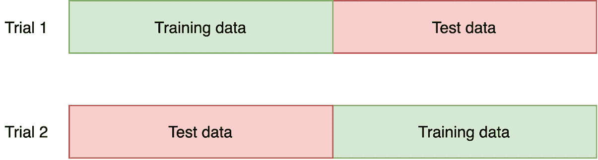
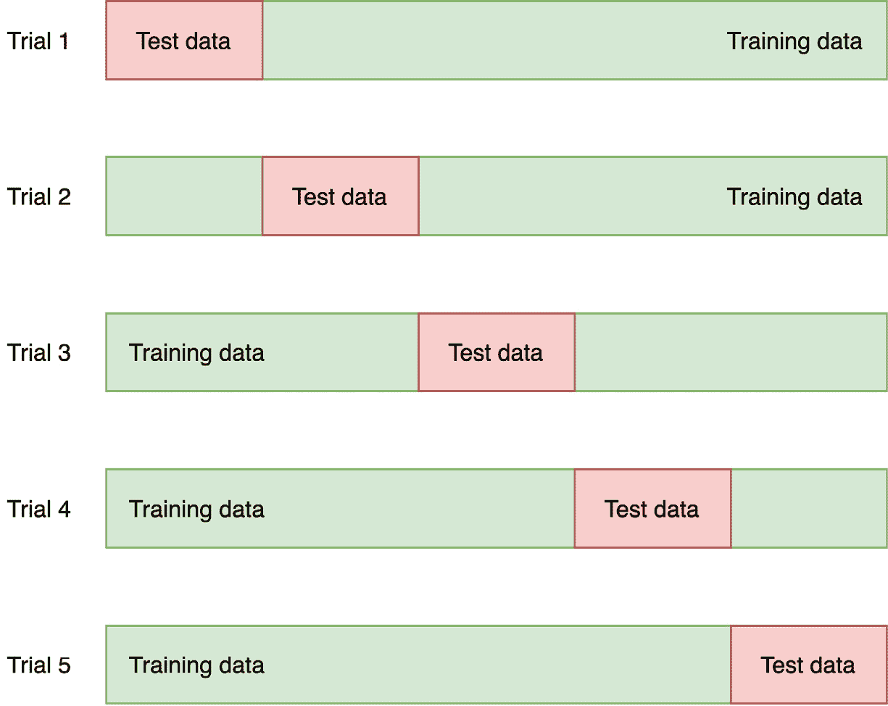
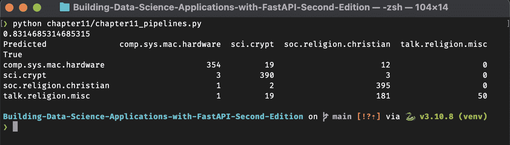

# 第十一章：Python 数据科学入门

近年来，Python 在数据科学领域获得了广泛的关注。其高效且易读的语法使得该语言成为科学研究的一个非常好的选择，同时仍然适用于生产工作负载；它非常容易将研究项目部署到能为用户带来价值的实际应用中。由于这种日益增长的兴趣，许多专门的 Python 库应运而生，并且现在已经成为行业标准。在本章中，我们将介绍机器学习的基本概念，然后再深入了解数据科学家日常使用的 Python 库。

本章我们将涵盖以下主要内容：

+   理解机器学习的基本概念

+   创建和操作 NumPy 数组和 pandas 数据集

+   使用 scikit-learn 训练和评估机器学习模型

# 技术要求

对于本章，你将需要一个 Python 虚拟环境，正如我们在*第一章*中所设置的，*Python 开发* *环境设置*。

你可以在本章的专用 GitHub 仓库中找到所有代码示例，网址为[`github.com/PacktPublishing/Building-Data-Science-Applications-with-FastAPI-Second-Edition/tree/main/chapter11`](https://github.com/PacktPublishing/Building-Data-Science-Applications-with-FastAPI-Second-Edition/tree/main/chapter11)。

# 什么是机器学习？

**机器学习**（**ML**）通常被视为人工智能的一个子领域。虽然这种分类仍然存在争议，但由于机器学习在垃圾邮件过滤、自然语言处理和图像生成等广泛而显著的应用领域中得到了广泛应用，近年来它的曝光率非常高。

机器学习是一个从现有数据中构建数学模型的领域，使得机器能够自行理解这些数据。机器是“学习”的，因为开发者不需要为复杂任务编写逐步算法，来解决问题，这是不可能的。一旦模型在现有数据上“训练”完成，它就可以用来预测新数据或理解新的观察结果。

以垃圾邮件过滤器为例：如果我们有一个足够大的电子邮件集合，手动标记为“垃圾邮件”或“非垃圾邮件”，我们可以使用机器学习技术构建一个模型，来判断新收到的电子邮件是否为垃圾邮件。

在本节中，我们将回顾机器学习的最基本概念。

## 监督学习与非监督学习

机器学习技术可以分为两大类：**监督学习**和**非监督学习**。

在监督学习中，现有的数据集已经标记好，这意味着我们既有输入（观察的特征），称为**特征**，也有输出。如果我们以垃圾邮件过滤器为例，特征可以是每个单词的频率，而**标签**则是类别——也就是说，“垃圾邮件”或“非垃圾邮件”。监督学习分为两个组：

+   **分类问题**，将数据分类到有限的类别中——例如，垃圾邮件过滤器。

+   **回归问题**，预测连续的数值——例如，根据星期几、天气和位置预测租用的电动滑板车数量。

无监督学习，另一方面，是在没有标签参考的数据上进行操作。其目标是从特征本身发现有趣的模式。无监督学习试图解决的两个主要问题如下：

+   **聚类**，我们想要找到一组相似的数据点——例如，一个推荐系统，根据其他类似你的人喜欢的商品来推荐你可能喜欢的商品。

+   **降维**，目标是找到更紧凑的数据集表示，这些数据集包含了很多不同的特征。通过这样做，我们可以只保留最有意义和最具辨别力的特征，同时在较小的数据集维度下工作。

## 模型验证

机器学习的一个关键方面是评估模型是否表现良好。我们如何确定模型在新观察到的数据上也会表现良好？在构建模型时，如何判断一个算法是否优于另一个算法？所有这些问题都可以并且应该通过模型验证技术来回答。

正如我们之前提到的，机器学习方法是从一个现有的数据集开始的，我们将用它来训练模型。

直观地，我们可能想要使用所有可用的数据来训练我们的模型。一旦完成，如何测试模型呢？我们可以将模型应用到相同的数据上，看看输出是否正确……结果可能会非常好！在这里，我们用相同的训练数据来测试模型。显然，由于模型已经见过这些数据，它在这些数据上的表现会特别好。正如你可能猜到的，这并不是一个可靠的衡量模型准确性的方法。

验证模型的正确方法是将数据分成两部分：一部分用于训练数据，另一部分用于测试数据。这被称为**保留集**。通过这种方式，我们将在模型从未见过的数据上进行测试，并将模型预测的结果与真实值进行比较。因此，我们测量的准确性要更加合理。

这种技术效果很好；然而，它也带来一个问题：通过保留一些数据，我们丧失了本可以帮助我们构建更好模型的宝贵信息。如果我们的初始数据集较小，这一点尤其明显。为了解决这个问题，我们可以使用**交叉验证**。通过这种方法，我们再次将数据分成两个集合。这一次，我们训练模型两次，分别使用每个集合作为训练集和测试集。你可以在下图中看到这一操作的示意图：



图 11.1 – 二折交叉验证

在操作结束时，我们得到两个准确度指标，这将使我们更好地了解模型在整个数据集上的表现。这项技术可以帮助我们在较小的测试集上进行更多的试验，如下图所示：



图 11.2 – 五折交叉验证

关于机器学习的这个简短介绍我们就讲到这里。我们仅仅触及了表面：机器学习是一个庞大而复杂的领域，专门讨论这一主题的书籍有很多。不过，这些信息足以帮助你理解我们在本章其余部分展示的基本概念。

# 使用 NumPy 和 pandas 操作数组

如我们在介绍中所说，许多 Python 库已经被开发出来，以帮助处理常见的数据科学任务。最基础的库可能是 NumPy 和 pandas。它们的目标是提供一套工具，用高效的方式操作大量数据，远远超过我们使用标准 Python 所能实现的功能，我们将在这一部分展示如何做到以及为什么要这样做。NumPy 和 pandas 是大多数 Python 数据科学应用的核心；因此，了解它们是你进入 Python 数据科学领域的第一步。

在开始使用它们之前，让我们解释一下为什么需要这些库。在*第二章*，《Python 编程特性》中，我们提到过 Python 是一种动态类型语言。这意味着解释器在运行时自动检测变量的类型，而且这个类型甚至可以在程序中发生变化。例如，你可以在 Python 中做如下操作：

```py

$ python>>> x = 1
>>> type(x)
<class 'int'>
>>> x = "hello"
>>> type(x)
<class 'str'>
```

解释器能够在每次赋值时确定`x`的类型。

在幕后，Python 的标准实现——CPython，是用 C 语言编写的。C 语言是一种编译型且静态类型的语言。这意味着变量的类型在编译时就已经确定，并且在执行过程中不能改变。因此，在 Python 实现中，变量不仅仅包含它的值：它实际上是一个结构体，包含有关变量的信息，包括类型、大小以及它的值。

多亏了这一点，我们可以在 Python 中非常动态地操作变量。然而，这也有代价：每个变量的内存占用会显著更大，因为它需要存储所有的元数据，而不仅仅是简单的值。

这对于数据结构尤其适用。假设我们考虑一个简单的列表，例如：

```py

$ python>>> l = [1, 2, 3, 4, 5]
```

列表中的每个项都是一个 Python 整数，并带有所有相关的元数据。在像 C 这样的静态类型语言中，相同的列表只会是内存中一组共享相同类型的值。

现在让我们想象一下一个大型数据集，比如我们在数据科学中经常遇到的那种：将其存储在内存中的成本将是巨大的。这正是 NumPy 的目的：提供一个强大且高效的数组结构来处理大型数据集。在底层，它使用固定类型的数组，这意味着结构中的所有元素都是相同类型的，这使得 NumPy 能够摆脱每个元素的昂贵元数据。此外，常见的算术操作，例如加法或乘法，也会更快。在*使用 NumPy 操作数组 – 计算、聚合和比较*这一部分中，我们将进行速度比较，以展示与标准 Python 列表的差异。

## 开始使用 NumPy

让我们来看看 NumPy 是如何工作的！首先需要使用以下命令安装它：

```py

(venv) $ pip install numpy
```

在 Python 解释器中，我们现在可以导入该库：

```py

(venv) $ python>>> import numpy as np
```

注意，按照惯例，*NumPy 通常以别名* `np` 导入。现在让我们来发现它的基本功能！

### 创建数组

要使用 NumPy 创建数组，我们可以简单地使用`array`函数，并传入一个 Python 列表：

```py

>>> np.array([1, 2, 3, 4, 5])array([1, 2, 3, 4, 5])
```

NumPy 会自动检测 Python 列表的类型。然而，我们可以通过使用`dtype`参数来强制指定结果类型：

```py

>>> np.array([1, 2, 3, 4, 5], dtype=np.float64)array([1., 2., 3., 4., 5.])
```

所有元素都被提升为指定的类型。关键是要记住，*NumPy 数组是固定类型的*。这意味着每个元素将具有相同的类型，NumPy 会默默地将值转换为`array`类型。例如，假设我们有一个整数列表，想要插入一个浮动点值：

```py

>>> l = np.array([1, 2, 3, 4, 5])>>> l[0] = 13.37
>>> l
array([13,  2,  3,  4,  5])
```

`13.37`的值已经被截断以适应整数类型。

如果无法将值转换为数组类型，则会引发错误。例如，让我们尝试用一个字符串改变第一个元素：

```py

>>> l[0] = "a"Traceback (most recent call last):
  File "<stdin>", line 1, in <module>
ValueError: invalid literal for int() with base 10: 'a'
```

正如我们在本节介绍中所说，Python 列表对于大型数据集效率较低。这就是为什么通常使用 NumPy 函数创建数组更为高效。最常用的函数通常是以下几种：

+   `np.zeros`，用于创建一个填充了 0 的数组

+   `np.ones`，用于创建一个填充了 1 的数组

+   `np.empty`，用于创建一个空的数组，指定内存中的大小，但不初始化值

+   `np.arange`，用于创建一个包含一系列元素的数组

让我们看看它们如何工作：

```py

>>> np.zeros(5)array([0., 0., 0., 0., 0.])
>>> np.ones(5)
array([1., 1., 1., 1., 1.])
>>> np.empty(5)
array([1., 1., 1., 1., 1.])
>>> np.arange(5)
array([0, 1, 2, 3, 4])
```

请注意，`np.empty` 的结果可能会有所不同：由于数组中的值未初始化，*它们会采用当前内存块中的任何值*。这个函数的主要动机是速度，它允许你快速分配内存，但不要忘记在后续填充每个元素。

默认情况下，NumPy 创建的数组使用浮点类型（`float64`）。同样，使用 `dtype` 参数，你可以强制使用其他类型：

```py

>>> np.ones(5, dtype=np.int32)array([1, 1, 1, 1, 1], dtype=int32)
```

NumPy 提供了广泛的类型选择，通过为数据选择合适的类型，你可以精细地优化程序的内存消耗。你可以在官方文档中找到 NumPy 支持的所有类型列表：[`numpy.org/doc/stable/reference/arrays.scalars.html#sized-aliases`](https://numpy.org/doc/stable/reference/arrays.scalars.html#sized-aliases)。

NumPy 还提供了一个创建随机值数组的函数：

```py

>>> np.random.seed(0)  # Set the random seed to make examples reproducible>>> np.random.randint(10, size=5)
array([5, 0, 3, 3, 7])
```

第一个参数是随机值的最大范围，`size` 参数设置生成的值的数量。

到目前为止，我们展示了如何创建一维数组。然而，NumPy 的强大之处在于它原生支持多维数组！例如，创建一个 *3 x* *4* 矩阵：

```py

>>> m = np.ones((3,4))>>> m
array([[1., 1., 1., 1.],
       [1., 1., 1., 1.],
       [1., 1., 1., 1.]])
```

NumPy 确实创建了一个三行四列的数组！我们所做的只是将一个元组传递给 NumPy 函数来指定我们的维度。拥有这样的数组时，NumPy 为我们提供了访问数组属性的方法，用于了解数组的维度数、形状和大小：

```py

>>> m.ndim2
>>> m.shape
(3, 4)
>>> m.size
12
```

### 访问元素和子数组

NumPy 数组紧密遵循标准 Python 语法来操作列表。因此，要访问一维数组中的元素，只需执行以下操作：

```py

>>> l = np.arange(5)>>> l[2]
2
```

对于多维数组，我们只需再添加一个索引：

```py

>>> np.random.seed(0)>>> m = np.random.randint(10, size=(3,4))
>>> m
array([[5, 0, 3, 3],
       [7, 9, 3, 5],
       [2, 4, 7, 6]])
>>> m[1][2]
3
```

当然，这也可以用来重新赋值元素：

```py

>>> m[1][2] = 42>>> m
array([[ 5,  0,  3,  3],
       [ 7,  9, 42,  5],
       [ 2,  4,  7,  6]])
```

但这还不是全部。得益于切片语法，我们可以通过起始索引、结束索引，甚至步长来访问子数组。例如，在一维数组中，我们可以做如下操作：

```py

>>> l = np.arange(5)>>> l
array([0, 1, 2, 3, 4])
>>> l[1:4]  # From index 1 (inclusive) to 4 (exclusive)
array([1, 2, 3])
>>> l[::2]  # Every second element
array([0, 2, 4])
```

这正是我们在 *第二章* 中看到的标准 Python 列表操作，*Python 编程特性*。当然，这同样适用于多维数组，每个维度都用一个切片表示：

```py

>>> np.random.seed(0)>>> m = np.random.randint(10, size=(3,4))
>>> m
array([[5, 0, 3, 3],
       [7, 9, 3, 5],
       [2, 4, 7, 6]])
>>> m[1:, 0:2]  # From row 1 to end and column 0 to 2
array([[7, 9],
       [2, 4]])
>>> m[::, 3:]  # Every row, only last column
array([[3],
       [5],
       [6]])
```

你可以将这些子数组赋值给变量。然而，出于性能考虑，NumPy 默认不会复制值：它仅仅是一个 **视图**（或浅拷贝），即现有数据的表示。记住这一点很重要，因为如果你在视图中更改了某个值，它也会更改原始数组中的值：

```py

>>> v = m[::, 3:]>>> v[0][0] = 42
>>> v
array([[42],
       [ 5],
       [ 6]])
>>> m
array([[ 5,  0,  3, 42],
       [ 7,  9,  3,  5],
       [ 2,  4,  7,  6]])
```

如果你需要对数组进行真正的 `copy` 操作：

```py

>>> m2 = m[::, 3:].copy()
```

`m2` 现在是 `m` 的一个独立副本，`m2` 中的值变化不会影响 `m` 中的值。

现在你已经掌握了使用 NumPy 处理数组的基础知识。正如我们所见，语法与标准 Python 非常相似。使用 NumPy 时需要记住的关键点如下：

+   NumPy 数组具有固定类型，这意味着数组中的所有项都是相同的类型

+   NumPy 原生支持多维数组，并允许我们使用标准切片符号对其进行子集化

当然，NumPy 能做的远不止这些：实际上，它可以以非常高效的方式对这些数组执行常见的计算。

## 使用 NumPy 操作数组——计算、聚合和比较

如我们所说，NumPy 的核心是操作大型数组，并提供出色的性能和可控的内存消耗。假设我们想要计算一个大数组中每个元素的双倍。在下面的示例中，你可以看到使用标准 Python 循环实现此功能的代码：

chapter11_compare_operations.py

```py

import numpy as npnp.random.seed(0)  # Set the random seed to make examples reproducible
m = np.random.randint(10, size=1000000)  # An array with a million of elements
def standard_double(array):
    output = np.empty(array.size)
    for i in range(array.size):
        output[i] = array[i] * 2
    return output
```

[`github.com/PacktPublishing/Building-Data-Science-Applications-with-FastAPI-Second-Edition/tree/main/chapter11/chapter11_compare_operations.py`](https://github.com/PacktPublishing/Building-Data-Science-Applications-with-FastAPI-Second-Edition/tree/main/chapter11/chapter11_compare_operations.py)

我们实例化了一个包含百万个随机整数的数组。然后，我们的函数创建了一个包含每个元素双倍值的数组。基本上，我们首先实例化一个大小相同的空数组，然后遍历每个元素，设置其双倍值。

让我们来衡量这个函数的性能。在 Python 中，有一个标准模块 `timeit`，专门用于此目的。我们可以直接从命令行使用它，并传入我们想要测量性能的有效 Python 语句。以下命令将测量我们的大数组上 `standard_double` 函数的性能：

```py

python -m timeit "from chapter11.chapter11_compare_operations import m, standard_double; standard_double(m)"1 loop, best of 5: 146 msec per loop
```

结果会根据你的机器有所不同，但规模应该是相同的。`timeit` 的作用是重复执行你的代码若干次，并测量其执行时间。在这里，我们的函数计算每个数组元素的双倍花费了大约 150 毫秒。对于现代计算机上这样简单的计算来说，这并不算特别令人印象深刻。

让我们将此操作与使用 NumPy 语法的等效操作进行比较。你可以在下一个示例中看到：

chapter11_compare_operations.py

```py

def numpy_double(array):     return array * 2
```

[`github.com/PacktPublishing/Building-Data-Science-Applications-with-FastAPI-Second-Edition/tree/main/chapter11/chapter11_compare_operations.py`](https://github.com/PacktPublishing/Building-Data-Science-Applications-with-FastAPI-Second-Edition/tree/main/chapter11/chapter11_compare_operations.py)

代码要短得多！NumPy 实现了基本的算术运算，并可以将它们应用到数组的每个元素上。通过直接将数组乘以一个值，我们实际上是在告诉 NumPy 将每个元素乘以这个值。让我们使用`timeit`来衡量性能：

```py

python -m timeit "from chapter11.chapter11_compare_operations import m, numpy_double; numpy_double(m)"500 loops, best of 5: 611 usec per loop
```

在这里，最佳循环在 600 微秒内完成了计算！这比以前的函数快了 250 倍！我们如何解释这样的变化？在标准循环中，Python（因为其动态性质）必须在每次迭代时检查值的类型以应用正确的函数，这增加了显著的开销。而使用 NumPy，操作被延迟到一个优化和编译的循环中，在这里类型是预先知道的，这节省了大量无用的检查。

在处理大型数据集时，NumPy 数组比标准列表有更多的优势：它本地实现操作以帮助您快速进行计算。

### 添加和乘以数组

正如您在前面的例子中看到的那样，NumPy 支持算术运算符以在数组上执行操作。

这意味着您可以直接操作两个具有相同维度的数组：

```py

>>> np.array([1, 2, 3]) + np.array([4, 5, 6])array([5, 7, 9])
```

在这种情况下，NumPy 逐元素地应用操作。但在某些情况下，如果操作数之一不是相同的形状，它也可以工作：

```py

>>> np.array([1, 2, 3]) * 2array([2, 4, 6])
```

NumPy 自动理解它应该将每个元素乘以两倍。这被称为**广播**：NumPy“扩展”较小的数组以匹配较大数组的形状。前面的例子等同于这个例子：

```py

>>> np.array([1, 2, 3]) * np.array([2, 2, 2])array([2, 4, 6])
```

注意，即使这两个例子在概念上是等效的，第一个例子在内存和计算上更加高效：NumPy 足够智能，只使用一个`2`值，而不需要创建一个完整的`2`数组。

更一般地说，如果数组的最右维度大小相同或其中一个是`1`，广播就会起作用。例如，我们可以将*4 x 3*维度的数组添加到*1* *x 3*维度的数组中：

```py

>>> a1 = np.ones((4, 3))>>> a1
array([[1., 1., 1.],
       [1., 1., 1.],
       [1., 1., 1.],
       [1., 1., 1.]])
>>> a2 = np.ones((1, 3))
>>> a2
array([[1., 1., 1.]])
>>> a1 + a2
array([[2., 2., 2.],
       [2., 2., 2.],
       [2., 2., 2.],
       [2., 2., 2.]])
```

然而，将*4 x 3*维度的数组添加到*1 x 4*维度的数组中是不可能的：

```py

>>> a3 = np.ones((1, 4))>>> a3
array([[1., 1., 1., 1.]])
>>> a1 + a3
Traceback (most recent call last):
  File "<stdin>", line 1, in <module>
ValueError: operands could not be broadcast together with shapes (4,3) (1,4)
```

如果这听起来复杂或令人困惑，那是正常的；在概念上理解它需要时间，特别是在三维或更高维度中。要详细了解这个概念，请花时间阅读官方文档中相关文章的详细解释：[`numpy.org/doc/stable/user/basics.broadcasting.html`](https://numpy.org/doc/stable/user/basics.broadcasting.html)。

### 聚合数组 - 求和、最小值、最大值、均值等等

在处理数组时，我们经常需要汇总数据以提取一些有意义的统计信息：均值、最小值、最大值等。幸运的是，NumPy 也提供了这些操作的本地支持。简单来说，它们被提供为您可以直接从数组调用的方法：

```py

>>> np.arange(10).mean()4.5
>>> np.ones((4,4)).sum()
16.0
```

您可以在官方文档中找到所有聚合操作的完整列表：[`numpy.org/doc/stable/reference/arrays.ndarray.html#calculation`](https://numpy.org/doc/stable/reference/arrays.ndarray.html#calculation)。

### 比较数组

NumPy 也实现了标准的比较运算符来比较数组。与我们在*加法和乘法*数组部分看到的算术运算符一样，广播规则适用。这意味着你可以将数组与单个值进行比较：

```py

>>> l = np.array([1, 2, 3, 4])>>> l < 3
array([ True,  True, False, False])
```

你还可以将数组与数组进行比较，前提是它们在广播规则的基础上兼容：

```py

>>> m = np.array(    [[1., 5., 9., 13.],
    [2., 6., 10., 14.],
    [3., 7., 11., 15.],
    [4., 8., 12., 16.]]
)
>>> m <= np.array([1, 5, 9, 13])
array([[ True,  True,  True,  True],
       [False, False, False, False],
       [False, False, False, False],
       [False, False, False, False]])
```

结果数组会填充每个元素的布尔比较结果。

这就是对 NumPy 的简短介绍。这个库有很多内容值得学习和探索，因此我们强烈建议你阅读官方用户指南：[`numpy.org/doc/stable/user/index.html`](https://numpy.org/doc/stable/user/index.html)。

对于本书的其余部分，这些内容应该足以帮助你理解未来的示例。现在，让我们来看看一个与 NumPy 一起常被引用和使用的库：pandas。

## 开始使用 pandas

在上一节中，我们介绍了 NumPy 及其高效存储和处理大量数据的能力。接下来，我们将介绍另一个在数据科学中广泛使用的库：pandas。这个库是建立在 NumPy 之上的，提供了方便的数据结构，能够高效存储带有*标签的行和列*的大型数据集。这当然在处理大多数代表现实世界数据的数据集时非常有用，尤其是在数据科学项目中进行分析和使用时。

为了开始使用，当然，我们需要通过常见的命令安装这个库：

```py

(venv) $ pip install pandas
```

安装完成后，我们可以开始在 Python 解释器中使用它：

```py

(venv) $ python>>> import pandas as pd
```

就像我们将 `numpy` 别名为 `np` 一样，导入 `pandas` 时的约定是将其别名为 `pd`。

### 使用 pandas Series 处理一维数据

我们将介绍的第一个 pandas 数据结构是 `Series`。这个数据结构在行为上与 NumPy 中的一维数组非常相似。要创建一个，我们只需用一个值的列表进行初始化：

```py

>>> s = pd.Series([1, 2, 3, 4, 5])>>> s
0    1
1    2
2    3
3    4
4    5
dtype: int64
```

在底层，pandas 创建了一个 NumPy 数组。因此，它使用相同的数据类型来存储数据。你可以通过访问 `Series` 对象的 `values` 属性并检查其类型来验证这一点：

```py

>>> type(s.values)<class 'numpy.ndarray'>
```

索引和切片的工作方式与 NumPy 完全相同：

```py

>>> s[0]1
>>> s[1:3]
1    2
2    3
dtype: int64
```

到目前为止，这与常规的 NumPy 数组没有太大区别。如我们所说，pandas 的主要目的是*标注数据*。为了实现这一点，pandas 数据结构维护一个索引来实现数据标注。可以通过 `index` 属性来访问：

```py

>>> s.indexRangeIndex(start=0, stop=5, step=1)
```

在这里，我们使用了一个简单的整数范围索引，但实际上我们可以使用任何自定义索引。在下一个示例中，我们创建了相同的 series，并用字母标注每个值：

```py

>>> s = pd.Series([1, 2, 3, 4, 5], index=["a", "b", "c", "d", "e"])>>> s
a    1
b    2
c    3
d    4
e    5
```

`Series` 初始化器中的 `index` 参数允许我们设置标签列表。现在我们可以使用这些标签来访问相应的值：

```py

>>> s["c"]3
```

惊人的是，甚至切片符号也可以与这些标签一起使用：

```py

>>> s["b":"d"]b    2
c    3
d    4
dtype: int64
```

在底层，pandas 保留了索引的顺序，以便进行这样的有用标记。然而，请注意，在这种符号中，*最后一个索引是包括在内的*（`d` 包含在结果中），这与标准的索引符号不同，后者的最后一个索引是排除在外的：

```py

>>> s[1:3]b    2
c    3
dtype: int64
```

为了避免这两种风格的混淆，pandas 提供了两种特殊符号，明确表示你希望使用的索引风格：`loc`（标签符号，最后一个索引包括在内）和 `iloc`（标准索引符号）。你可以在官方文档中阅读更多内容：[`pandas.pydata.org/docs/user_guide/indexing.html#different-choices-for-indexing`](https://pandas.pydata.org/docs/user_guide/indexing.html#different-choices-for-indexing)。

`Series` 也可以直接通过字典来实例化：

```py

>>> s = pd.Series({"a": 1, "b": 2, "c": 3, "d": 4, "e": 5})>>> s
a    1
b    2
c    3
d    4
e    5
dtype: int64
```

在这种情况下，字典的键用作标签。

当然，在实际工作中，你更可能需要处理二维（或更多！）数据集。这正是 DataFrame 的用途！

### 使用 pandas DataFrame 处理多维数据

大多数时候，数据集由二维数据组成，其中每一行有多个列，就像经典的电子表格应用程序一样。在 Pandas 中，DataFrame 是专为处理这类数据设计的。至于 `Series`，它可以处理由行和列都标注的大量数据集。

以下示例将使用一个小型数据集，表示 2018 年法国博物馆发放的票务数量（包括付费票和免费票）。假设我们有以下以两个字典形式存储的数据：

```py

>>> paid = {"Louvre Museum": 5988065, "Orsay Museum": 1850092, "Pompidou Centre": 2620481, "National Natural History Museum": 404497}>>> free = {"Louvre Museum": 4117897, "Orsay Museum": 1436132, "Pompidou Centre": 1070337, "National Natural History Museum": 344572}
```

这些字典中的每个键都是行的标签。我们可以直接从这两个字典构建一个 DataFrame，方法如下：

```py

>>> museums = pd.DataFrame({"paid": paid, "free": free})>>> museums
                                    paid     free
Louvre Museum                    5988065  4117897
Orsay Museum                     1850092  1436132
Pompidou Centre                  2620481  1070337
National Natural History Museum   404497   344572
```

`DataFrame` 初始化器接受一个字典的字典，其中键表示列的标签。

我们可以查看 `index` 属性，它存储了行的索引，以及 `columns` 属性，它存储了列的索引：

```py

>>> museums.indexIndex(['Louvre Museum', 'Orsay Museum', 'Pompidou Centre',
       'National Natural History Museum'],
      dtype='object')
>>> museums.columns
Index(['paid', 'free'], dtype='object')
```

我们可以再次使用索引和切片符号来获取列或行的子集：

```py

>>> museums["free"]Louvre Museum                      4117897
Orsay Museum                       1436132
Pompidou Centre                    1070337
National Natural History Museum     344572
Name: free, dtype: int64
>>> museums["Louvre Museum":"Orsay Museum"]
                  paid     free
Louvre Museum  5988065  4117897
Orsay Museum   1850092  1436132
>>> museums["Louvre Museum":"Orsay Museum"]["paid"]
Louvre Museum    5988065
Orsay Museum     1850092
Name: paid, dtype: int64
```

更强大的功能是：你可以在括号内写一个布尔条件来匹配某些数据。这种操作称为 **掩码操作**：

```py

>>> museums[museums["paid"] > 2000000]                    paid     free
Louvre Museum    5988065  4117897
Pompidou Centre  2620481  1070337
```

最后，你可以通过相同的索引符号轻松设置新的列：

```py

>>> museums["total"] = museums["paid"] + museums["free"]>>> museums
                                    paid     free     total
Louvre Museum                    5988065  4117897  10105962
Orsay Museum                     1850092  1436132   3286224
Pompidou Centre                  2620481  1070337   3690818
National Natural History Museum   404497   344572    749069
```

如你所见，就像 NumPy 数组一样，pandas 完全支持在两个 DataFrame 上执行算术运算。

当然，所有基本的聚合操作都被支持，包括 `mean` 和 `sum`：

```py

>>> museums["total"].sum()17832073
>>> museums["total"].mean()
4458018.25
```

你可以在官方文档中找到所有可用操作的完整列表：[`pandas.pydata.org/pandas-docs/stable/user_guide/basics.html#descriptive-statistics`](https://pandas.pydata.org/pandas-docs/stable/user_guide/basics.html#descriptive-statistics)。

### 导入和导出 CSV 数据

分享数据集的一种非常常见的方式是通过 CSV 文件。这个格式非常方便，因为它只是一个简单的文本文件，每一行代表一行数据，每一列由逗号分隔。我们的简单 *museums* 数据集作为 CSV 文件在示例库中提供，你可以在下一个示例中看到：

museums.csv

```py

name,paid,freeLouvre Museum,5988065,4117897
Orsay Museum,1850092,1436132
Pompidou Centre,2620481,1070337
National Natural History Museum,404497,344572
```

[`github.com/PacktPublishing/Building-Data-Science-Applications-with-FastAPI-Second-Edition/tree/main/chapter11/museums.csv`](https://github.com/PacktPublishing/Building-Data-Science-Applications-with-FastAPI-Second-Edition/tree/main/chapter11/museums.csv)

导入 CSV 文件是如此常见，以至于 pandas 提供了一个函数，可以直接将 CSV 文件加载到 DataFrame 中：

```py

>>> museums = pd.read_csv("./chapter11/museums.csv", index_col=0)>>> museums
                                    paid     free
name
Louvre Museum                    5988065  4117897
Orsay Museum                     1850092  1436132
Pompidou Centre                  2620481  1070337
National Natural History Museum   404497   344572
```

该函数仅仅需要 CSV 文件的路径。提供了多个参数，可以精细控制操作：在这里，我们使用了 `index_col` 来指定应作为行标签的列的索引。你可以在官方文档中找到所有参数的列表：[`pandas.pydata.org/pandas-docs/stable/reference/api/pandas.read_csv.html`](https://pandas.pydata.org/pandas-docs/stable/reference/api/pandas.read_csv.html)。

当然，存在相反的操作来将 DataFrame 导出为 CSV 文件：

```py

>>> museums["total"] = museums["paid"] + museums["free"]>>> museums.to_csv("museums_with_total.csv")
```

我们将在这里结束对 pandas 的简短介绍。当然，我们仅仅触及了冰山一角，我们建议你通过官方用户指南了解更多：[`pandas.pydata.org/pandas-docs/stable/user_guide/index.html`](https://pandas.pydata.org/pandas-docs/stable/user_guide/index.html)。

尽管如此，你现在应该能够执行基本操作，并在大型数据集上高效地操作。在下一节中，我们将介绍 scikit-learn，它是数据科学中一个基本的 Python 工具包，你将看到它在很大程度上依赖于 NumPy 和 pandas。

# 使用 scikit-learn 训练模型

scikit-learn 是最广泛使用的 Python 数据科学库之一。它实现了数十种经典的机器学习模型，还提供了许多在训练过程中帮助你的工具，比如预处理方法和交叉验证。如今，你可能会听到更多现代方法的讨论，比如 PyTorch，但 scikit-learn 仍然是许多用例中一个可靠的工具。

开始之前，首先需要在你的 Python 环境中安装它：

```py

(venv) $ pip install scikit-learn
```

现在我们可以开始我们的 scikit-learn 之旅！

## 训练模型与预测

在 scikit-learn 中，机器学习模型和算法被称为 `fit`，用于训练模型，以及 `predict`，用于在新数据上运行训练好的模型。

要尝试这个，我们将加载一个示例数据集。scikit-learn 附带了一些非常有用的玩具数据集，适合用于实验。你可以在官方文档中了解更多信息：[`scikit-learn.org/stable/datasets.html`](https://scikit-learn.org/stable/datasets.html)。

在这里，我们将使用*digits*数据集，这是一个包含表示手写数字的像素矩阵的集合。正如你可能已经猜到的，这个数据集的目标是训练一个模型来自动识别手写数字。以下示例展示了如何加载这个数据集：

chapter11_load_digits.py

```py

from sklearn.datasets import load_digitsdigits = load_digits()
data = digits.data
targets = digits.target
print(data[0].reshape((8, 8)))  # First handwritten digit 8 x 8 matrix
print(targets[0])  # Label of first handwritten digit
```

[`github.com/PacktPublishing/Building-Data-Science-Applications-with-FastAPI-Second-Edition/tree/main/chapter11/chapter11_load_digits.py`](https://github.com/PacktPublishing/Building-Data-Science-Applications-with-FastAPI-Second-Edition/tree/main/chapter11/chapter11_load_digits.py)

请注意，这个玩具数据集的函数是从 scikit-learn 的`datasets`包中导入的。`load_digits`函数返回一个包含数据和一些元数据的对象。

这个对象最有趣的部分是`data`，它包含了手写数字的像素矩阵，以及`targets`，它包含了这些数字的对应标签。两者都是 NumPy 数组。

为了了解这是什么样子，我们将数据中的第一个数字提取出来，并将其重新塑造成一个 8 x 8 的矩阵；这是源图像的大小。每个值表示一个灰度像素，从 0 到 16。

然后，我们打印出第一个数字的标签，即`0`。如果你运行这段代码，你将得到以下输出：

```py

[[ 0.  0.  5\. 13.  9.  1.  0.  0.] [ 0.  0\. 13\. 15\. 10\. 15.  5.  0.]
 [ 0.  3\. 15.  2.  0\. 11.  8.  0.]
 [ 0.  4\. 12.  0.  0.  8.  8.  0.]
 [ 0.  5.  8.  0.  0.  9.  8.  0.]
 [ 0.  4\. 11.  0.  1\. 12.  7.  0.]
 [ 0.  2\. 14.  5\. 10\. 12.  0.  0.]
 [ 0.  0.  6\. 13\. 10.  0.  0.  0.]]
0
```

通过矩阵，我们可以在某种程度上猜测出零的形状。

现在，让我们尝试构建一个识别手写数字的模型。为了简单起见，我们将使用高斯朴素贝叶斯模型，这是一种经典且易于使用的算法，能够快速得到不错的结果。以下示例展示了整个过程：

chapter11_fit_predict.py

```py

from sklearn.datasets import load_digitsfrom sklearn.metrics import accuracy_score
from sklearn.model_selection import train_test_split
from sklearn.naive_bayes import GaussianNB
digits = load_digits()
data = digits.data
targets = digits.target
# Split into training and testing sets
training_data, testing_data, training_targets, testing_targets = train_test_split(
     data, targets, random_state=0
)
# Train the model
model = GaussianNB()
model.fit(training_data, training_targets)
# Run prediction with the testing set
predicted_targets = model.predict(testing_data)
# Compute the accuracy
accuracy = accuracy_score(testing_targets, predicted_targets)
print(accuracy)
```

[`github.com/PacktPublishing/Building-Data-Science-Applications-with-FastAPI-Second-Edition/tree/main/chapter11/chapter11_fit_predict.py`](https://github.com/PacktPublishing/Building-Data-Science-Applications-with-FastAPI-Second-Edition/tree/main/chapter11/chapter11_fit_predict.py)

现在我们已经加载了数据集，你可以看到我们已将其拆分为训练集和测试集。正如我们在*模型验证*部分提到的，这对于计算有意义的准确性评分是必不可少的，以检查我们的模型表现如何。

为此，我们可以依赖`model_selection`包中的`train_test_split`函数。它从我们的数据集中随机选择实例来形成这两个数据集。默认情况下，它将 25%的数据保留为测试集，但这可以自定义。`random_state`参数允许我们设置随机种子，以使示例具有可复现性。你可以在官方文档中了解更多关于此函数的信息：[`scikit-learn.org/stable/modules/generated/sklearn.model_selection.train_test_split.html#sklearn-model-selection-train-test-split`](https://scikit-learn.org/stable/modules/generated/sklearn.model_selection.train_test_split.html#sklearn-model-selection-train-test-split)。

然后，我们必须实例化`GaussianNB`类。这个类是 scikit-learn 中许多机器学习估计器之一。每个估计器都有自己的一组参数，用于精细调节算法的行为。然而，scikit-learn 设计时已经为所有估计器提供了合理的默认值，因此通常建议在进行调试之前先使用默认值。

之后，我们必须调用`fit`方法来训练我们的模型。它需要一个参数和两个数组：第一个是实际数据，包含所有特征，第二个是相应的标签。就这样！你已经训练好了你的第一个机器学习模型！

现在，让我们看看它的表现：我们将用测试集调用模型的`predict`方法，以便它自动分类测试集中的数字。结果将是一个包含预测标签的新数组。

现在我们需要做的就是将其与测试集的实际标签进行比较。再次，scikit-learn 通过在`metrics`包中提供`accuracy_score`函数来提供帮助。第一个参数是实际标签，第二个是预测标签。

如果你运行这段代码，你将得到大约 83%的准确率。作为初步的尝试，这已经相当不错了！正如你所见，使用 scikit-learn 训练和运行机器学习模型的预测非常简单。

在实践中，我们常常需要在将数据输入估计器之前，先对数据进行预处理。为了避免手动按顺序执行这些步骤，scikit-learn 提出了一个便捷的功能，可以自动化这个过程：**管道**。

## 使用管道链式连接预处理器和估计器

很多时候，你需要对数据进行预处理，以便它可以被你希望使用的估计器所使用。通常，你会希望将图像转换为像素值的数组，或者正如我们在下一个例子中看到的那样，将原始文本转换为数值，以便我们可以对其进行数学处理。

为了避免手动编写这些步骤，scikit-learn 提供了一个功能，可以自动链式连接预处理器和估计器：管道。一旦创建，它们会暴露出与任何其他估计器相同的接口，允许你在一次操作中进行训练和预测。

为了展示这是什么样的，我们来看一个经典数据集的例子——*20 newsgroups*文本数据集。它包含 18,000 篇新闻组文章，分类为 20 个主题。这个数据集的目标是构建一个模型，自动将文章归类到其中一个主题。

以下示例展示了我们如何利用`fetch_20newsgroups`函数加载该数据：

chapter11_pipelines.py

```py

import pandas as pdfrom sklearn.datasets import fetch_20newsgroups
from sklearn.feature_extraction.text import TfidfVectorizer
from sklearn.metrics import accuracy_score, confusion_matrix
from sklearn.naive_bayes import MultinomialNB
from sklearn.pipeline import make_pipeline
# Load some categories of newsgroups dataset
categories = [
     "soc.religion.christian",
     "talk.religion.misc",
     "comp.sys.mac.hardware",
     "sci.crypt",
]
newsgroups_training = fetch_20newsgroups(
     subset="train", categories=categories, random_state=0
)
newsgroups_testing = fetch_20newsgroups(
     subset="test", categories=categories, random_state=0
)
```

[`github.com/PacktPublishing/Building-Data-Science-Applications-with-FastAPI-Second-Edition/tree/main/chapter11/chapter11_pipelines.py`](https://github.com/PacktPublishing/Building-Data-Science-Applications-with-FastAPI-Second-Edition/tree/main/chapter11/chapter11_pipelines.py)

由于数据集相当大，我们只加载一部分类别。此外，请注意，数据集已经被拆分为训练集和测试集，因此我们只需通过相应的参数加载它们。你可以在官方文档中了解更多关于此数据集的功能：[`scikit-learn.org/stable/datasets/real_world.html#the-20-newsgroups-text-dataset`](https://scikit-learn.org/stable/datasets/real_world.html#the-20-newsgroups-text-dataset)。

在继续之前，理解底层数据非常重要。实际上，这些是文章的原始文本。你可以通过打印数据中的一个样本来检查这一点：

```py

>>> newsgroups_training.data[0]"From: sandvik@newton.apple.com (Kent Sandvik)\nSubject: Re: Ignorance is BLISS, was Is it good that Jesus died?\nOrganization: Cookamunga Tourist Bureau\nLines: 17\n\nIn article <f1682Ap@quack.kfu.com>, pharvey@quack.kfu.com (Paul Harvey)\nwrote:\n> In article <sandvik-170493104859@sandvik-kent.apple.com> \n> sandvik@newton.apple.com (Kent Sandvik) writes:\n> >Ignorance is not bliss!\n \n> Ignorance is STRENGTH!\n> Help spread the TRUTH of IGNORANCE!\n\nHuh, if ignorance is strength, then I won't distribute this piece\nof information if I want to follow your advice (contradiction above).\n\n\nCheers,\nKent\n---\nsandvik@newton.apple.com. ALink: KSAND -- Private activities on the net.\n"
```

因此，在将文本输入到估算器之前，我们需要从中提取一些特征。当处理文本数据时，常用的一种方法是使用**词频-逆文档频率（TF-IDF）**。不深入细节，这项技术将计算每个单词在所有文档中的出现次数（词频），并根据该单词在每个文档中的重要性加权（逆文档频率）。其目的是赋予较少出现的单词更高的权重，这些单词比“the”这类常见单词更有意义。你可以在 scikit-learn 文档中了解更多相关信息：[`scikit-learn.org/dev/modules/feature_extraction.html#tfidf-term-weighting`](https://scikit-learn.org/dev/modules/feature_extraction.html#tfidf-term-weighting)。

这个操作包括将文本样本中的每个单词分开并进行计数。通常，我们会应用许多技术来精细化这个过程，例如移除 `TfidfVectorizer`。

这个预处理器可以接收一个文本数组，对每个单词进行分词，并计算每个单词的 TF-IDF。提供了很多选项来精细调整其行为，但默认设置对于英文文本来说已经是一个不错的起点。以下示例展示了如何在管道中将其与估算器一起使用：

chapter11_pipelines.py

```py

# Make the pipelinemodel = make_pipeline(
     TfidfVectorizer(),
     MultinomialNB(),
)
```

[`github.com/PacktPublishing/Building-Data-Science-Applications-with-FastAPI-Second-Edition/tree/main/chapter11/chapter11_pipelines.py`](https://github.com/PacktPublishing/Building-Data-Science-Applications-with-FastAPI-Second-Edition/tree/main/chapter11/chapter11_pipelines.py)

`make_pipeline` 函数接受任意数量的预处理器和一个估算器作为参数。在这里，我们使用的是多项式朴素贝叶斯分类器，这适用于表示频率的特征。

然后，我们可以像之前那样简单地训练我们的模型并运行预测来检查其准确性。你可以在以下示例中看到这一点：

chapter11_pipelines.py

```py

# Train the modelmodel.fit(newsgroups_training.data, newsgroups_training.target)
# Run prediction with the testing set
predicted_targets = model.predict(newsgroups_testing.data)
# Compute the accuracy
accuracy = accuracy_score(newsgroups_testing.target, predicted_targets)
print(accuracy)
# Show the confusion matrix
confusion = confusion_matrix(newsgroups_testing.target, predicted_targets)
confusion_df = pd.DataFrame(
     confusion,
     index=pd.Index(newsgroups_testing.target_names, name="True"),
     columns=pd.Index(newsgroups_testing.target_names, name="Predicted"),
)
print(confusion_df)
```

[`github.com/PacktPublishing/Building-Data-Science-Applications-with-FastAPI-Second-Edition/tree/main/chapter11/chapter11_pipelines.py`](https://github.com/PacktPublishing/Building-Data-Science-Applications-with-FastAPI-Second-Edition/tree/main/chapter11/chapter11_pipelines.py)

请注意，我们还打印了一个混淆矩阵，这是一个非常方便的全局结果表示。scikit-learn 有一个专门的函数叫做`confusion_matrix`。然后，我们将结果包装在 pandas DataFrame 中，以便可以设置轴标签以提高可读性。如果你运行这个例子，你将获得类似于以下截图的输出。根据你的机器和系统，可能需要几分钟时间才能完成：



图 11.3 – 20 个新闻组数据集的混淆矩阵

在这里，你可以看到我们第一次尝试的结果并不差。请注意，`soc.religion.christian`和`talk.religion.misc`类别之间存在一个较大的混淆区域，这并不令人意外，考虑到它们的相似性。

如你所见，构建一个带有预处理器的流水线非常简单。这样做的好处是，它不仅会自动应用于训练数据，也会在你预测结果时使用。

在继续之前，让我们来看一下 scikit-learn 的另一个重要功能：交叉验证。

## 使用交叉验证验证模型

在*模型验证*部分，我们介绍了交叉验证技术，它允许我们在训练集或测试集中使用数据。正如你可能猜到的，这项技术非常常见，scikit-learn 本身就实现了它！

让我们再看一个手写数字的例子，并应用交叉验证：

chapter11_cross_validation.py

```py

from sklearn.datasets import load_digitsfrom sklearn.model_selection import cross_val_score
from sklearn.naive_bayes import GaussianNB
digits = load_digits()
data = digits.data
targets = digits.target
# Create the model
model = GaussianNB()
# Run cross-validation
score = cross_val_score(model, data, targets)
print(score)
print(score.mean())
```

[`github.com/PacktPublishing/Building-Data-Science-Applications-with-FastAPI-Second-Edition/tree/main/chapter11/chapter11_cross_validation.py`](https://github.com/PacktPublishing/Building-Data-Science-Applications-with-FastAPI-Second-Edition/tree/main/chapter11/chapter11_cross_validation.py)

这次，我们不需要自己拆分数据：`cross_val_score`函数会自动执行折叠。在参数中，它期望接收估算器、`data`（包含手写数字的像素矩阵）和`targets`（包含这些数字的对应标签）。默认情况下，它会执行五次折叠。

这个操作的结果是一个数组，提供了五次折叠的准确度分数。为了获取这些结果的整体概览，我们可以取平均值。例如，如果你运行这个例子，你将获得以下输出：

```py

python chapter11/chapter11_cross_validation.py[0.78055556 0.78333333 0.79387187 0.8718663  0.80501393]
0.8069281956050759
```

如你所见，我们的平均准确率大约是 80%，比我们使用单一训练集和测试集时获得的 83%稍低。这就是交叉验证的主要好处：我们能获得更为统计准确的模型性能指标。

通过这些，你已经学习了使用 scikit-learn 的基础知识。显然，这是对这个庞大框架的一个快速介绍，但它将为你提供训练和评估第一个机器学习模型的钥匙。

# 总结

恭喜！你已经掌握了机器学习的基本概念，并用数据科学家的基础工具包进行了第一次实验。现在，你应该能够在 Python 中探索你的第一个数据科学问题。当然，这绝不是一节完整的机器学习课程：这个领域广阔，还有大量的算法和技术等待探索。不过，我希望这已经激发了你的好奇心，并且你会深入学习这个领域的知识。

现在，是时候回到 FastAPI 了！借助我们手头的新 ML 工具，我们将能够利用 FastAPI 的强大功能来服务我们的估算器，并为用户提供一个可靠高效的预测 API。
