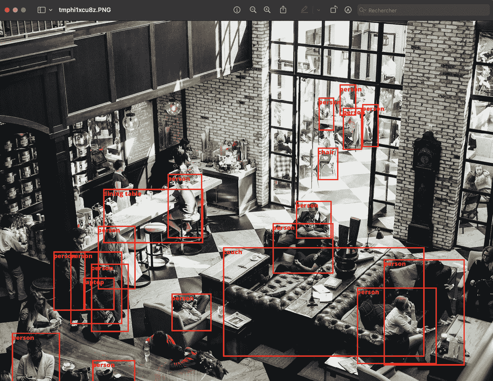
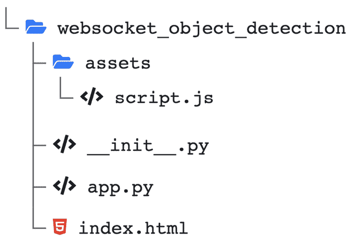
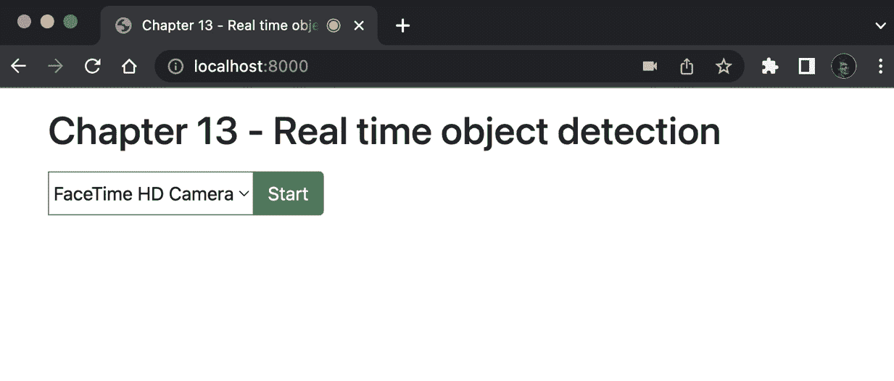
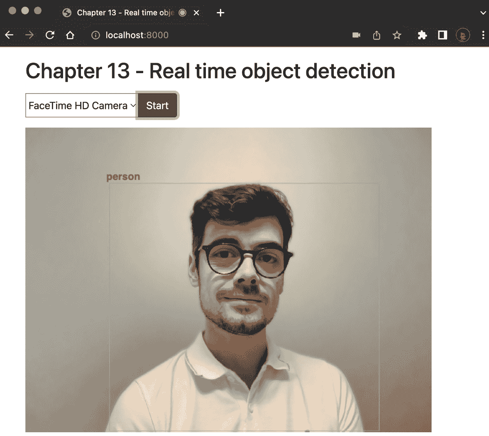

# 第十三章：使用 WebSockets 和 FastAPI 实现实时物体检测系统

在上一章中，你学习了如何创建高效的 REST API 端点，用于通过训练好的机器学习模型进行预测。这种方法涵盖了很多使用场景，假设我们有一个单一的观测值需要处理。然而，在某些情况下，我们可能需要持续对一系列输入进行预测——例如，一个实时处理视频输入的物体检测系统。这正是我们将在本章中构建的内容。怎么做？如果你还记得，除了 HTTP 端点，FastAPI 还具备处理 WebSockets 端点的能力，这让我们能够发送和接收数据流。在这种情况下，浏览器会通过 WebSocket 发送来自摄像头的图像流，我们的应用程序会运行物体检测算法，并返回图像中每个检测到的物体的坐标和标签。为此任务，我们将依赖于**Hugging Face**，它既是一组工具，也是一个预训练 AI 模型的库。

本章我们将涵盖以下主要内容：

+   使用 Hugging Face 库的计算机视觉模型

+   实现一个 HTTP 端点，执行单张图像的物体检测

+   在 WebSocket 中从浏览器发送图像流

+   在浏览器中显示物体检测结果

# 技术要求

本章你将需要一个 Python 虚拟环境，就像我们在*第一章*中所设置的那样，*Python 开发* *环境设置*。

你可以在这个专门的 GitHub 仓库中找到本章的所有代码示例：[`github.com/PacktPublishing/Building-Data-Science-Applications-with-FastAPI-Second-Edition/tree/main/chapter13`](https://github.com/PacktPublishing/Building-Data-Science-Applications-with-FastAPI-Second-Edition/tree/main/chapter13)。

# 使用 Hugging Face 库的计算机视觉模型

计算机视觉是一个研究和技术领域，致力于使计算机能够从数字图像或视频中提取有意义的信息，从而模拟人类视觉能力。它涉及基于统计方法或机器学习开发算法，使机器能够理解、分析和解释视觉数据。计算机视觉的一个典型应用是物体检测：一个能够在图像中检测和识别物体的系统。这正是我们将在本章中构建的系统。

为了帮助我们完成这个任务，我们将使用 Hugging Face 提供的一组工具。Hugging Face 是一家旨在让开发者能够快速、轻松地使用最新、最强大的 AI 模型的公司。为此，它构建了两个工具：

+   一套基于机器学习库（如 PyTorch 和 TensorFlow）构建的开源 Python 工具集。我们将在本章中使用其中的一些工具。

+   一个在线库，用于分享和下载各种机器学习任务的预训练模型，例如计算机视觉或图像生成。

你可以在其官方网站上了解更多它的功能：[`huggingface.co/`](https://huggingface.co/)。

你会看到，这将极大地帮助我们在短时间内构建一个强大且精确的目标检测系统！首先，我们将安装项目所需的所有库：

```py

(venv) $ pip install "transformers[torch]" Pillow
```

Hugging Face 的 `transformers` 库将允许我们下载并运行预训练的机器学习模型。请注意，我们通过可选的 `torch` 依赖项来安装它。Hugging Face 工具可以与 PyTorch 或 TensorFlow 一起使用，这两者都是非常强大的机器学习框架。在这里，我们选择使用 PyTorch。Pillow 是一个广泛使用的 Python 库，用于处理图像。稍后我们会看到为什么需要它。

在开始使用 FastAPI 之前，让我们先实现一个简单的脚本来运行一个目标检测算法。它包括四个主要步骤：

1.  使用 Pillow 从磁盘加载图像。

1.  加载一个预训练的目标检测模型。

1.  在我们的图像上运行模型。

1.  通过在检测到的物体周围绘制矩形来显示结果。

我们将一步一步地进行实现：

chapter13_object_detection.py

```py

from pathlib import Pathimport torch
from PIL import Image, ImageDraw, ImageFont
from transformers import YolosForObjectDetection, YolosImageProcessor
root_directory = Path(__file__).parent.parent
picture_path = root_directory / "assets" / "coffee-shop.jpg"
image = Image.open(picture_path)
```

[`github.com/PacktPublishing/Building-Data-Science-Applications-with-FastAPI-Second-Edition/tree/main/chapter13/chapter13_object_detection.py`](https://github.com/PacktPublishing/Building-Data-Science-Applications-with-FastAPI-Second-Edition/tree/main/chapter13/chapter13_object_detection.py)

如你所见，第一步是从磁盘加载我们的图像。在这个示例中，我们使用名为 `coffee-shop.jpg` 的图像，该图像可以在我们的示例仓库中找到，地址是 [`github.com/PacktPublishing/Building-Data-Science-Applications-with-FastAPI-Second-Edition/blob/main/assets/coffee-shop.jpg`](https://github.com/PacktPublishing/Building-Data-Science-Applications-with-FastAPI-Second-Edition/blob/main/assets/coffee-shop.jpg)：

chapter13_object_detection.py

```py

image_processor = YolosImageProcessor.from_pretrained("hustvl/yolos-tiny")model = YolosForObjectDetection.from_pretrained("hustvl/yolos-tiny")
```

[`github.com/PacktPublishing/Building-Data-Science-Applications-with-FastAPI-Second-Edition/tree/main/chapter13/chapter13_object_detection.py`](https://github.com/PacktPublishing/Building-Data-Science-Applications-with-FastAPI-Second-Edition/tree/main/chapter13/chapter13_object_detection.py)

接下来，我们从 Hugging Face 加载一个模型。在这个示例中，我们选择了 YOLOS 模型。它是一种先进的目标检测方法，已在 118K 个带注释的图像上进行训练。你可以在以下 Hugging Face 文章中了解更多关于该技术的方法：[`huggingface.co/docs/transformers/model_doc/yolos`](https://huggingface.co/docs/transformers/model_doc/yolos)。为了限制下载大小并节省计算机磁盘空间，我们选择使用精简版，这是原始模型的一个更轻量化版本，可以在普通机器上运行，同时保持良好的精度。这个版本在 Hugging Face 上有详细描述：[`huggingface.co/hustvl/yolos-tiny`](https://huggingface.co/hustvl/yolos-tiny)。

请注意，我们实例化了两个东西：**图像处理器**和**模型**。如果你还记得我们在*第十一章*《Python 中的数据科学入门》中提到的内容，你会知道我们需要一组特征来供我们的机器学习算法使用。因此，图像处理器的作用是将原始图像转换为对模型有意义的一组特征。

这正是我们在接下来的代码行中所做的：我们通过调用`image_processor`处理图像，创建一个`inputs`变量。请注意，`return_tensors`参数被设置为`pt`，因为我们选择了 PyTorch 作为我们的底层机器学习框架。然后，我们可以将这个`inputs`变量输入到模型中以获得`outputs`：

chapter13_object_detection.py

```py

inputs = image_processor(images=image, return_tensors="pt")outputs = model(**inputs)
```

[`github.com/PacktPublishing/Building-Data-Science-Applications-with-FastAPI-Second-Edition/tree/main/chapter13/chapter13_object_detection.py`](https://github.com/PacktPublishing/Building-Data-Science-Applications-with-FastAPI-Second-Edition/tree/main/chapter13/chapter13_object_detection.py)

你可能会认为这就是预测阶段的全部内容，我们现在可以展示结果了。然而，事实并非如此。此类算法的结果是一组多维矩阵，著名的`post_process_object_detection`操作由`image_processor`提供：

chapter13_object_detection.py

```py

target_sizes = torch.tensor([image.size[::-1]])results = image_processor.post_process_object_detection(
    outputs, target_sizes=target_sizes
)[0]
```

[`github.com/PacktPublishing/Building-Data-Science-Applications-with-FastAPI-Second-Edition/tree/main/chapter13/chapter13_object_detection.py`](https://github.com/PacktPublishing/Building-Data-Science-Applications-with-FastAPI-Second-Edition/tree/main/chapter13/chapter13_object_detection.py)

这个操作的结果是一个字典，包含以下内容：

+   `labels`：每个检测到的物体的标签列表

+   `boxes`：每个检测到的物体的边界框坐标

+   `scores`：算法对于每个检测到的物体的置信度分数

我们需要做的就是遍历这些对象，以便利用 Pillow 绘制矩形和相应的标签。最后，我们只展示处理后的图像。请注意，我们只考虑那些得分大于`0.7`的物体，以减少假阳性的数量：

chapter13_object_detection.py

```py

draw = ImageDraw.Draw(image)font_path = root_directory / "assets" / "OpenSans-ExtraBold.ttf"
font = ImageFont.truetype(str(font_path), 24)
for score, label, box in zip(results["scores"], results["labels"], results["boxes"]):
    if score > 0.7:
        box_values = box.tolist()
        label = model.config.id2label[label.item()]
        draw.rectangle(box_values, outline="red", width=5)
        draw.text(box_values[0:2], label, fill="red", font=font)
image.show()
```

[`github.com/PacktPublishing/Building-Data-Science-Applications-with-FastAPI-Second-Edition/tree/main/chapter13/chapter13_object_detection.py`](https://github.com/PacktPublishing/Building-Data-Science-Applications-with-FastAPI-Second-Edition/tree/main/chapter13/chapter13_object_detection.py)

多亏了 Pillow，我们能够绘制矩形并在检测到的物体上方添加标签。请注意，我们加载了一个自定义字体——Open Sans，它是一个可以在网上获得的开源字体：[`fonts.google.com/specimen/Open+Sans`](https://fonts.google.com/specimen/Open+Sans)。让我们尝试运行这个脚本，看看结果：

```py

(venv) $ python chapter13/chapter13_object_detection.py
```

首次运行时，你会看到模型被下载。根据你的计算机性能，预测过程可能需要几秒钟。完成后，生成的图像应该会自动打开，如*图 13.1*所示。



图 13.1 – 在示例图像上的目标检测结果

你可以看到，模型检测到图像中的几个人物，以及各种物体，如沙发和椅子。就这样！不到 30 行代码就能实现一个可运行的目标检测脚本！Hugging Face 使我们能够高效地利用最新 AI 技术的强大功能。

当然，我们在这一章的目标是将所有这些智能功能部署到远程服务器上，以便能够为成千上万的用户提供这一体验。再次强调，FastAPI 将是我们在这里的得力助手。

# 实现一个 REST 端点，用于在单张图像上执行目标检测

在使用 WebSockets 之前，我们先从简单开始，利用 FastAPI 实现一个经典的 HTTP 端点，接受图像上传并对其进行目标检测。正如你所看到的，与之前的示例的主要区别在于我们如何获取图像：不是从磁盘读取，而是通过文件上传获取，之后需要将其转换为 Pillow 图像对象。

此外，我们还将使用我们在*第十二章*中看到的完全相同的模式，*使用 FastAPI 创建高效的预测 API 端点*——也就是为我们的预测模型创建一个专门的类，该类将在生命周期处理程序中加载。

在此实现中，我们做的第一件事是定义 Pydantic 模型，以便正确地结构化我们预测模型的输出。你可以看到如下所示：

chapter13_api.py

```py

class Object(BaseModel):    box: tuple[float, float, float, float]
    label: str
class Objects(BaseModel):
    objects: list[Object]
```

[`github.com/PacktPublishing/Building-Data-Science-Applications-with-FastAPI-Second-Edition/tree/main/chapter13/chapter13_api.py`](https://github.com/PacktPublishing/Building-Data-Science-Applications-with-FastAPI-Second-Edition/tree/main/chapter13/chapter13_api.py)

我们有一个表示单个检测到的目标的模型，它包括`box`，一个包含四个数字的元组，描述边界框的坐标，以及`label`，表示检测到的物体类型。`Objects`模型是一个简单的结构，包含物体列表。

我们不会详细介绍模型预测类，因为它与我们在上一章和上一节中看到的非常相似。相反，我们直接关注 FastAPI 端点的实现：

chapter13_api.py

```py

object_detection = ObjectDetection()@contextlib.asynccontextmanager
async def lifespan(app: FastAPI):
    object_detection.load_model()
    yield
app = FastAPI(lifespan=lifespan)
@app.post("/object-detection", response_model=Objects)
async def post_object_detection(image: UploadFile = File(...)) -> Objects:
    image_object = Image.open(image.file)
    return object_detection.predict(image_object)
```

[`github.com/PacktPublishing/Building-Data-Science-Applications-with-FastAPI-Second-Edition/tree/main/chapter13/chapter13_api.py`](https://github.com/PacktPublishing/Building-Data-Science-Applications-with-FastAPI-Second-Edition/tree/main/chapter13/chapter13_api.py)

这里没有什么特别令人惊讶的！需要关注的重点是正确使用`UploadFile`和`File`依赖项，以便获取上传的文件。如果你需要复习这一部分内容，可以查看*第三章*中关于*表单数据和文件上传*的章节，*快速开发 RESTful API 使用 FastAPI*。然后，我们只需将其实例化为合适的 Pillow 图像对象，并调用我们的预测模型。

如我们所说，别忘了在生命周期处理程序中加载模型。

你可以使用常规的 Uvicorn 命令来运行这个示例：

```py

(venv) $ uvicorn chapter13.chapter13_api:app
```

我们将使用上一节中看到的相同的咖啡店图片。让我们用 HTTPie 上传它到我们的端点：

```py

$ http --form POST http://localhost:8000/object-detection image@./assets/coffee-shop.jpg{
    "objects": [
        {
            "box": [659.8709716796875, 592.8882446289062, 792.0460815429688, 840.2132568359375],
            "label": "person"
        },
        {
            "box": [873.5499267578125, 875.7918090820312, 1649.1378173828125, 1296.362548828125],
            "label": "couch"
        }
    ]
}
```

我们正确地得到了检测到的对象列表，每个对象都有它的边界框和标签。太棒了！我们的目标检测系统现在已经作为一个 Web 服务器可用。然而，我们的目标仍然是创建一个实时系统：借助 WebSockets，我们将能够处理图像流。

# 实现 WebSocket 以对图像流进行目标检测

WebSockets 的主要优势之一，正如我们在*第八章*中看到的，*在 FastAPI 中定义用于双向交互通信的 WebSockets*，是它在客户端和服务器之间打开了一个全双工通信通道。一旦连接建立，消息可以快速传递，而不需要经过 HTTP 协议的所有步骤。因此，它更适合实时传输大量数据。

这里的关键是实现一个 WebSocket 端点，能够接收图像数据并进行目标检测。这里的主要挑战是处理一个被称为**背压**的现象。简单来说，我们将从浏览器接收到的图像比服务器能够处理的要多，因为运行检测算法需要一定的时间。因此，我们必须使用一个有限大小的队列（或缓冲区），并在处理流时丢弃一些图像，以便接近实时地处理。

我们将逐步讲解实现过程：

app.py

```py

async def receive(websocket: WebSocket, queue: asyncio.Queue):    while True:
        bytes = await websocket.receive_bytes()
        try:
            queue.put_nowait(bytes)
        except asyncio.QueueFull:
            pass
async def detect(websocket: WebSocket, queue: asyncio.Queue):
    while True:
        bytes = await queue.get()
        image = Image.open(io.BytesIO(bytes))
        objects = object_detection.predict(image)
        await websocket.send_json(objects.dict())
```

[`github.com/PacktPublishing/Building-Data-Science-Applications-with-FastAPI-Second-Edition/tree/main/chapter13/websocket_object_detection/app.py`](https://github.com/PacktPublishing/Building-Data-Science-Applications-with-FastAPI-Second-Edition/tree/main/chapter13/websocket_object_detection/app.py)

我们定义了两个任务：`receive` 和 `detect`。第一个任务是等待从 WebSocket 接收原始字节，而第二个任务则执行检测并发送结果，正如我们在上一节中看到的那样。

这里的关键是使用`asyncio.Queue`对象。这是一个便捷的结构，允许我们在内存中排队一些数据，并以**先进先出**（**FIFO**）策略来检索它。我们可以设置存储在队列中的元素数量限制：这就是我们限制处理图像数量的方式。

`receive` 函数接收数据并将其放入队列末尾。在使用 `asyncio.Queue` 时，我们有两个方法可以将新元素放入队列：`put` 和 `put_nowait`。如果队列已满，第一个方法会等待直到队列有空间。这不是我们在这里想要的：我们希望丢弃那些无法及时处理的图像。使用 `put_nowait` 时，如果队列已满，会抛出 `QueueFull` 异常。在这种情况下，我们只需跳过并丢弃数据。

另一方面，`detect` 函数从队列中提取第一个消息，并在发送结果之前运行检测。请注意，由于我们直接获取的是原始图像字节，我们需要用 `io.BytesIO` 将它们包装起来，才能让 Pillow 处理。

WebSocket 的实现本身类似于我们在*第八章*中看到的内容，*在 FastAPI 中定义 WebSocket 进行双向交互通信*。我们正在调度这两个任务并等待其中一个任务停止。由于它们都运行一个无限循环，因此当 WebSocket 断开连接时，这个情况会发生：

app.py

```py

@app.websocket("/object-detection")async def ws_object_detection(websocket: WebSocket):
    await websocket.accept()
    queue: asyncio.Queue = asyncio.Queue(maxsize=1)
    receive_task = asyncio.create_task(receive(websocket, queue))
    detect_task = asyncio.create_task(detect(websocket, queue))
    try:
        done, pending = await asyncio.wait(
            {receive_task, detect_task},
            return_when=asyncio.FIRST_COMPLETED,
        )
        for task in pending:
            task.cancel()
        for task in done:
            task.result()
    except WebSocketDisconnect:
        pass
```

[`github.com/PacktPublishing/Building-Data-Science-Applications-with-FastAPI-Second-Edition/tree/main/chapter13/websocket_object_detection/app.py`](https://github.com/PacktPublishing/Building-Data-Science-Applications-with-FastAPI-Second-Edition/tree/main/chapter13/websocket_object_detection/app.py)

提供静态文件

如果你查看前面示例的完整实现，你会注意到我们在服务器中定义了另外两个东西：一个 `index` 端点，它仅返回 `index.html` 文件，以及一个 `StaticFiles` 应用，它被挂载在 `/assets` 路径下。这两个功能的存在是为了让我们的 FastAPI 应用直接提供 HTML 和 JavaScript 代码。这样，浏览器就能够在同一个服务器上查询这些文件。

这部分的关键点是，尽管 FastAPI 是为构建 REST API 设计的，但它同样可以完美地提供 HTML 和静态文件。

我们的后端现在已经准备好！接下来，让我们看看如何在浏览器中使用它的功能。

# 通过 WebSocket 从浏览器发送图像流

在本节中，我们将展示如何在浏览器中捕捉来自摄像头的图像并通过 WebSocket 发送。由于这主要涉及 JavaScript 代码，坦率来说，它有点超出了本书的范围，但它对于让应用程序正常工作是必要的。

第一步是在浏览器中启用摄像头输入，打开 WebSocket 连接，捕捉摄像头图像并通过 WebSocket 发送。基本上，它会像这样工作：通过 `MediaDevices` 浏览器 API，我们将能够列出设备上所有可用的摄像头输入。借此，我们将构建一个选择表单，供用户选择他们想要使用的摄像头。你可以在以下代码中看到具体的 JavaScript 实现：

script.js

```py

window.addEventListener('DOMContentLoaded', (event) => {  const video = document.getElementById('video');
  const canvas = document.getElementById('canvas');
  const cameraSelect = document.getElementById('camera-select');
  let socket;
  // List available cameras and fill select
  navigator.mediaDevices.getUserMedia({ audio: true, video: true }).then(() => {
    navigator.mediaDevices.enumerateDevices().then((devices) => {
      for (const device of devices) {
        if (device.kind === 'videoinput' && device.deviceId) {
          const deviceOption = document.createElement('option');
          deviceOption.value = device.deviceId;
          deviceOption.innerText = device.label;
          cameraSelect.appendChild(deviceOption);
        }
      }
    });
  });
```

[`github.com/PacktPublishing/Building-Data-Science-Applications-with-FastAPI-Second-Edition/tree/main/chapter13/websocket_object_detection/assets/script.js`](https://github.com/PacktPublishing/Building-Data-Science-Applications-with-FastAPI-Second-Edition/tree/main/chapter13/websocket_object_detection/assets/script.js)

一旦用户提交表单，我们会调用一个`startObjectDetection`函数，并传入选定的摄像头。大部分实际的检测逻辑是在这个函数中实现的：

script.js

```py

  // Start object detection on the selected camera on submit  document.getElementById('form-connect').addEventListener('submit', (event) => {
    event.preventDefault();
    // Close previous socket is there is one
    if (socket) {
      socket.close();
    }
    const deviceId = cameraSelect.selectedOptions[0].value;
    socket = startObjectDetection(video, canvas, deviceId);
  });
});
```

[`github.com/PacktPublishing/Building-Data-Science-Applications-with-FastAPI-Second-Edition/tree/main/chapter13/websocket_object_detection/assets/script.js`](https://github.com/PacktPublishing/Building-Data-Science-Applications-with-FastAPI-Second-Edition/tree/main/chapter13/websocket_object_detection/assets/script.js)

让我们看一下下面代码块中的`startObjectDetection`函数。首先，我们与 WebSocket 建立连接。连接打开后，我们可以开始从选定的摄像头获取图像流。为此，我们使用`MediaDevices` API 来启动视频捕获，并将输出显示在一个 HTML 的`<video>`元素中。你可以在 MDN 文档中阅读有关`MediaDevices` API 的所有细节：[`developer.mozilla.org/en-US/docs/Web/API/MediaDevices`](https://developer.mozilla.org/en-US/docs/Web/API/MediaDevices)：

script.js

```py

const startObjectDetection = (video, canvas, deviceId) => {  const socket = new WebSocket(`ws://${location.host}/object-detection`);
  let intervalId;
  // Connection opened
  socket.addEventListener('open', function () {
    // Start reading video from device
    navigator.mediaDevices.getUserMedia({
      audio: false,
      video: {
        deviceId,
        width: { max: 640 },
        height: { max: 480 },
      },
    }).then(function (stream) {
      video.srcObject = stream;
      video.play().then(() => {
        // Adapt overlay canvas size to the video size
        canvas.width = video.videoWidth;
        canvas.height = video.videoHeight;
```

[`github.com/PacktPublishing/Building-Data-Science-Applications-with-FastAPI-Second-Edition/tree/main/chapter13/websocket_object_detection/assets/script.js`](https://github.com/PacktPublishing/Building-Data-Science-Applications-with-FastAPI-Second-Edition/tree/main/chapter13/websocket_object_detection/assets/script.js)

然后，正如下一个代码块所示，我们启动一个重复的任务，捕获来自视频输入的图像并将其发送到服务器。为了实现这一点，我们必须使用一个`<canvas>`元素，这是一个专门用于图形绘制的 HTML 标签。它提供了完整的 JavaScript API，允许我们以编程方式在其中绘制图像。在这里，我们可以绘制当前的视频图像，并将其转换为有效的 JPEG 字节。如果你想了解更多关于这个内容，MDN 提供了一个非常详细的`<canvas>`教程：[`developer.mozilla.org/en-US/docs/Web/API/Canvas_API/Tutorial`](https://developer.mozilla.org/en-US/docs/Web/API/Canvas_API/Tutorial)：

script.js

```py

        // Send an image in the WebSocket every 42 ms        intervalId = setInterval(() => {
          // Create a virtual canvas to draw current video image
          const canvas = document.createElement('canvas');
          const ctx = canvas.getContext('2d');
          canvas.width = video.videoWidth;
          canvas.height = video.videoHeight;
          ctx.drawImage(video, 0, 0);
          // Convert it to JPEG and send it to the WebSocket
          canvas.toBlob((blob) => socket.send(blob), 'image/jpeg');
        }, IMAGE_INTERVAL_MS);
      });
    });
  });
```

[`github.com/PacktPublishing/Building-Data-Science-Applications-with-FastAPI-Second-Edition/tree/main/chapter13/websocket_object_detection/assets/script.js`](https://github.com/PacktPublishing/Building-Data-Science-Applications-with-FastAPI-Second-Edition/tree/main/chapter13/websocket_object_detection/assets/script.js)

请注意，我们将视频输入的大小限制为 640x480 像素，以防止上传过大的图像使服务器崩溃。此外，我们将间隔设置为每 42 毫秒执行一次（该值在`IMAGE_INTERVAL_MS`常量中设置），大约相当于每秒 24 帧图像。

最后，我们将事件监听器连接起来，以处理从 WebSocket 接收到的消息。它调用了`drawObjects`函数，我们将在下一节中详细介绍：

script.js

```py

  // Listen for messages  socket.addEventListener('message', function (event) {
    drawObjects(video, canvas, JSON.parse(event.data));
  });
  // Stop the interval and video reading on close
  socket.addEventListener('close', function () {
    window.clearInterval(intervalId);
    video.pause();
  });
  return socket;
};
```

[`github.com/PacktPublishing/Building-Data-Science-Applications-with-FastAPI-Second-Edition/tree/main/chapter13/websocket_object_detection/assets/script.js`](https://github.com/PacktPublishing/Building-Data-Science-Applications-with-FastAPI-Second-Edition/tree/main/chapter13/websocket_object_detection/assets/script.js)

# 在浏览器中展示物体检测结果

现在我们能够将输入图像发送到服务器，我们需要在浏览器中展示检测结果。与我们在*使用 Hugging Face 计算机视觉模型*部分中展示的类似，我们将围绕检测到的对象绘制一个绿色矩形，并标注它们的标签。因此，我们需要找到一种方式，将服务器发送的矩形坐标在浏览器中绘制出来。

为了实现这一点，我们将再次使用`<canvas>`元素。这次，它将对用户可见，我们将使用它来绘制矩形。关键是使用 CSS 使这个元素覆盖视频：这样，矩形就会直接显示在视频和对应对象的上方。你可以在这里看到 HTML 代码：

index.html

```py

<body>  <div class="container">
    <h1 class="my-3">Chapter 13 - Real time object detection</h1>
    <form id="form-connect">
      <div class="input-group mb-3">
        <select id="camera-select"></select>
        <button class="btn btn-success" type="submit" id="button-start">Start</button>
      </div>
    </form>
    <div class="position-relative" style="width: 640px; height: 480px;">
      <video id="video"></video>
      <canvas id="canvas" class="position-absolute top-0 start-0"></canvas>
    </div>
  </div>
  <script src="img/script.js"></script>
</body>
```

[`github.com/PacktPublishing/Building-Data-Science-Applications-with-FastAPI-Second-Edition/tree/main/chapter13/websocket_object_detection/index.html`](https://github.com/PacktPublishing/Building-Data-Science-Applications-with-FastAPI-Second-Edition/tree/main/chapter13/websocket_object_detection/index.html)

我们使用了来自 Bootstrap 的 CSS 类，Bootstrap 是一个非常常见的 CSS 库，提供了很多类似这样的辅助工具。基本上，我们通过绝对定位设置了 canvas，并将其放置在左上角，这样它就能覆盖视频元素。

关键在于使用 Canvas API 根据接收到的坐标绘制矩形。这正是`drawObjects`函数的目的，下面的示例代码块展示了这一点：

script.js

```py

const drawObjects = (video, canvas, objects) => {  const ctx = canvas.getContext('2d');
  ctx.width = video.videoWidth;
  ctx.height = video.videoHeight;
  ctx.beginPath();
  ctx.clearRect(0, 0, ctx.width, ctx.height);
  for (const object of objects.objects) {
    const [x1, y1, x2, y2] = object.box;
    const label = object.label;
    ctx.strokeStyle = '#49fb35';
    ctx.beginPath();
    ctx.rect(x1, y1, x2 - x1, y2 - y1);
    ctx.stroke();
    ctx.font = 'bold 16px sans-serif';
    ctx.fillStyle = '#ff0000';
    ctx.fillText(label, x1 - 5 , y1 - 5);
  }
};
```

[`github.com/PacktPublishing/Building-Data-Science-Applications-with-FastAPI-Second-Edition/tree/main/chapter13/websocket_object_detection/assets/script.js`](https://github.com/PacktPublishing/Building-Data-Science-Applications-with-FastAPI-Second-Edition/tree/main/chapter13/websocket_object_detection/assets/script.js)

使用`<canvas>`元素，我们可以使用 2D 上下文在对象中绘制内容。请注意，我们首先清除所有内容，以移除上次检测的矩形。然后，我们遍历所有检测到的对象，并使用给定的坐标`x1`、`y1`、`x2`和`y2`绘制一个矩形。最后，我们会在矩形上方稍微绘制标签。

我们的系统现在完成了！*图 13.2* 给出了我们实现的文件结构概览。



图 13.2 – 对象检测应用结构

现在是时候尝试一下了！我们可以使用常见的 Uvicorn 命令启动它：

```py

(venv) $ uvicorn chapter13.websocket_object_detection.app:app
```

您可以通过地址`http://localhost:8000`在浏览器中访问应用程序。正如我们在前一部分所说，`index`端点将被调用并返回我们的`index.html`文件。

您将看到一个界面，邀请您选择要使用的摄像头，如*图 13.3*所示：



图 13.3 – 用于对象检测网页应用的摄像头选择

选择您想要使用的摄像头并点击**开始**。视频输出将显示出来，通过 WebSocket 开始对象检测，并且绿色矩形将会围绕检测到的对象绘制。我们在*图 13.4*中展示了这一过程：



图 13.4 – 运行对象检测网页应用

它成功了！我们将我们 Python 系统的智能带到了用户的网页浏览器中。这只是使用 WebSockets 和机器学习算法可以实现的一种示例，但它绝对可以让您为用户创建接近实时的体验。

# 总结

在本章中，我们展示了 WebSockets 如何帮助我们为用户带来更具互动性的体验。得益于 Hugging Face 社区提供的预训练模型，我们能够迅速实现一个对象检测系统。接着，在 FastAPI 的帮助下，我们将其集成到一个 WebSocket 端点。最后，通过使用现代 JavaScript API，我们直接在浏览器中发送视频输入并显示算法结果。总的来说，像这样的项目乍一看可能显得很复杂，但我们看到强大的工具，如 FastAPI，能够让我们在非常短的时间内并且通过易于理解的源代码实现结果。

到目前为止，在我们的不同示例和项目中，我们假设我们使用的机器学习模型足够快，可以直接在 API 端点或 WebSocket 任务中运行。然而，情况并非总是如此。在某些情况下，算法如此复杂，以至于运行需要几分钟。如果我们直接在 API 端点内部运行这种算法，用户将不得不等待很长时间才能得到响应。这不仅会让用户感到困惑，还会迅速堵塞整个服务器，阻止其他用户使用 API。为了解决这个问题，我们需要为 API 服务器配备一个助手：一个工作者。

在下一章中，我们将研究这个挑战的一个具体例子：我们将构建我们自己的 AI 系统，从文本提示生成图像！
