# 第十五章：监控数据科学系统的健康状况和性能

在本章中，我们将深入探讨，以便你能够构建稳健、适用于生产的系统。实现这一目标的最重要方面之一是拥有所有必要的数据，以确保系统正确运行，并尽早检测到问题，以便采取纠正措施。在本章中，我们将展示如何设置适当的日志设施，以及如何实时监控我们软件的性能和健康状况。

我们即将结束 FastAPI 数据科学之旅。到目前为止，我们主要关注的是我们实现的程序的功能。然而，还有一个方面常常被开发者忽视，但实际上非常重要：*评估系统是否在生产环境中正确且可靠地运行*，并在系统出现问题时尽早收到警告。

为此，存在许多工具和技术，我们可以收集尽可能多的数据，了解我们的程序如何运行。这就是我们在本章中要回顾的内容。

我们将涵盖以下主要主题：

+   配置并使用 Loguru 日志设施

+   配置 Prometheus 指标并在 Grafana 中监控它们

+   配置 Sentry 用于报告错误

# 技术要求

对于本章，你将需要一个 Python 虚拟环境，就像我们在*第一章*中设置的那样，*Python 开发环境设置*。

要运行 Dramatiq 工作程序，你需要在本地计算机上运行 Redis 服务器。最简单的方式是将其作为 Docker 容器运行。如果你以前从未使用过 Docker，我们建议你阅读官方文档中的*入门教程*，[`docs.docker.com/get-started/`](https://docs.docker.com/get-started/)。完成后，你可以通过以下简单命令运行 Redis 服务器：

```py

$ docker run -d --name worker-redis -p 6379:6379 redis
```

你可以在专门的 GitHub 仓库中找到本章的所有代码示例：[`github.com/PacktPublishing/Building-Data-Science-Applications-with-FastAPI-Second-Edition/tree/main/chapter15`](https://github.com/PacktPublishing/Building-Data-Science-Applications-with-FastAPI-Second-Edition/tree/main/chapter15)。

关于截图的说明

在本章中，我们将展示一些截图，特别是 Grafana 界面的截图。它们的目的是帮助你了解界面的整体布局，帮助你识别不同的部分。如果你在阅读实际内容时遇到困难，不用担心：周围的解释将帮助你找到需要关注的地方并了解该与哪些部分交互。

# 配置并使用 Loguru 日志设施

在软件开发中，日志可能是控制系统行为最简单但最强大的方式。它们通常由程序中特定位置打印的纯文本行组成。通过按时间顺序阅读这些日志，我们可以追踪程序的行为，确保一切顺利进行。实际上，在本书中我们已经看到过日志行。当你使用 Uvicorn 运行 FastAPI 应用并发出一些请求时，你会在控制台输出中看到这些日志行：

```py

INFO:     Started server process [94918]INFO:     Waiting for application startup.
INFO:     Application startup complete.
INFO:     Uvicorn running on http://127.0.0.1:8000 (Press CTRL+C to quit)
INFO:     127.0.0.1:60736 - "POST /generated-images HTTP/1.1" 201 Created
```

这些是 Uvicorn 生成的日志，告诉我们它何时启动，以及何时处理了一个请求。正如你所见，日志可以帮助我们了解程序发生了什么以及执行了哪些操作。它们还可以告诉我们何时出现问题，这可能是一个需要解决的 bug。

## 理解日志级别

请注意，在每个日志行之前，我们都有`INFO`关键字。这就是我们所说的**日志级别**。它是分类日志重要性的方式。一般来说，定义了以下几种级别：

+   `DEBUG`

+   `INFO`

+   `WARNING`

+   `ERROR`

你可以将其视为*重要性等级*：`DEBUG`是关于程序执行的非常具体的信息，这有助于调试代码，而`ERROR`意味着程序中发生了问题，可能需要你采取行动。关于这些级别的好处是，我们可以*配置日志记录器应输出的最小级别*。即使日志函数调用仍然存在于代码中，如果它不符合最小级别，日志记录器也会忽略它。

通常，我们可以在本地开发中设置`DEBUG`级别，这样可以获取所有信息以帮助我们开发和修复程序。另一方面，我们可以在生产环境中将级别设置为`INFO`或`WARNING`，以便只获取最重要的消息。

## 使用 Loguru 添加日志

使用标准库中提供的`logging`模块，向 Python 程序添加日志非常容易。你可以像这样做：

```py

>>> import logging>>> logging.warning("This is my log")
WARNING:root:This is my log
```

如你所见，这只是一个带有字符串参数的函数调用。通常，日志模块将不同的级别作为方法暴露，就像这里的`warning`一样。

标准的`logging`模块非常强大，允许你精细定制日志的处理、打印和格式。如果你浏览官方文档中的日志教程，[`docs.python.org/3/howto/logging.html`](https://docs.python.org/3/howto/logging.html)，你会发现它很快会变得非常复杂，甚至对于简单的情况也是如此。

这就是为什么 Python 开发者通常使用封装了`logging`模块并提供更友好函数和接口的库。在本章中，我们将回顾如何使用和配置**Loguru**，一种现代而简单的日志处理方法。

和往常一样，首先需要在我们的 Python 环境中安装它：

```py

(venv) $ pip install loguru
```

我们可以立即在 Python shell 中尝试：

```py

>>> from loguru import logger>>> logger.debug("This is my log!")
2023-02-21 08:44:00.168 | DEBUG    | __main__:<module>:1 - This is my log!
```

你可能会认为这与我们使用标准的 `logging` 模块没什么不同。然而，注意到生成的日志已经包含了时间戳、级别以及函数调用的位置。这就是 Loguru 的主要优势之一：它自带合理的默认设置，开箱即用。

让我们在一个更完整的脚本中看看它的实际效果。我们将定义一个简单的函数，检查一个整数 `n` 是否为奇数。我们将添加一行调试日志，让我们知道函数开始执行逻辑。然后，在计算结果之前，我们将首先检查 `n` 是否确实是一个整数，如果不是，就记录一个错误。这个函数的实现如下：

chapter15_logs_01.py

```py

from loguru import loggerdef is_even(n) -> bool:
    logger.debug("Check if {n} is even", n=n)
    if not isinstance(n, int):
        logger.error("{n} is not an integer", n=n)
        raise TypeError()
    return n % 2 == 0
if __name__ == "__main__":
    is_even(2)
    is_even("hello")
```

[`github.com/PacktPublishing/Building-Data-Science-Applications-with-FastAPI-Second-Edition/tree/main/chapter15/chapter15_logs_01.py`](https://github.com/PacktPublishing/Building-Data-Science-Applications-with-FastAPI-Second-Edition/tree/main/chapter15/chapter15_logs_01.py)

如你所见，它的使用非常简单：我们只需要导入 `logger` 并在需要记录日志的地方调用它。还注意到我们如何可以添加变量来格式化字符串：只需要在字符串中添加大括号内的占位符，然后通过关键字参数将每个占位符映射到其值。这个语法实际上类似于标准的 `str.format` 方法。你可以在官方的 Python 文档中了解更多内容：[`docs.python.org/fr/3/library/stdtypes.html#str.format`](https://docs.python.org/fr/3/library/stdtypes.html#str.format)。

如果我们运行这个简单的脚本，我们将在控制台输出中看到我们的日志行：

```py

(venv) $ python chapter15/chapter15_logs_01.py2023-03-03 08:16:40.145 | DEBUG    | __main__:is_even:5 - Check if 2 is even
2023-03-03 08:16:40.145 | DEBUG    | __main__:is_even:5 - Check if hello is even
2023-03-03 08:16:40.145 | ERROR    | __main__:is_even:7 - hello is not an integer
Traceback (most recent call last):
  File "/Users/fvoron/Development/Building-Data-Science-Applications-with-FastAPI-Second-Edition/chapter15/chapter15_logs_01.py", line 14, in <module>
    is_even("hello")
  File "/Users/fvoron/Development/Building-Data-Science-Applications-with-FastAPI-Second-Edition/chapter15/chapter15_logs_01.py", line 8, in is_even
    raise TypeError()
TypeError
```

我们的日志行在实际抛出异常之前已经正确添加到输出中。注意，Loguru 能够准确告诉我们日志调用来自代码的哪个位置：我们有函数名和行号。

## 理解和配置 sinks

我们已经看到，默认情况下，日志会添加到控制台输出。默认情况下，Loguru 定义了一个指向标准错误的**sink**。Sink 是 Loguru 引入的一个概念，用于定义日志行应该如何由日志记录器处理。我们不限于控制台输出：我们还可以将它们保存到文件、数据库，甚至发送到 Web 服务！

好的一点是，你并不只限于使用一个 sink；你可以根据需要使用多个！然后，每个日志调用都会通过每个 sink 进行处理。你可以在*图 15.1*中看到这种方法的示意图。

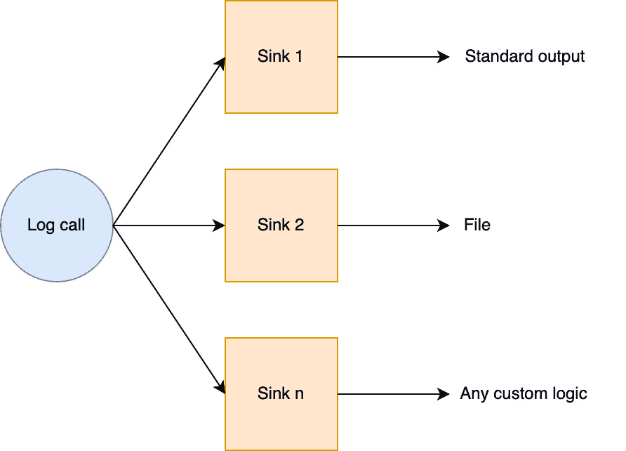

图 15.1 – Loguru sinks 架构

每个*sink 都与* *一个日志级别* *相关联*。这意味着我们可以根据 sink 使用不同的日志级别。例如，我们可以选择将所有日志输出到文件中，并且只在控制台保留最重要的警告和错误日志。我们再次以之前的示例为例，使用这种方式配置 Loguru：

chapter15_logs_02.py

```py

logger.remove()logger.add(sys.stdout, level="WARNING")
logger.add("file.log", level="DEBUG", rotation="1 day")
```

[`github.com/PacktPublishing/Building-Data-Science-Applications-with-FastAPI-Second-Edition/tree/main/chapter15/chapter15_logs_02.py`](https://github.com/PacktPublishing/Building-Data-Science-Applications-with-FastAPI-Second-Edition/tree/main/chapter15/chapter15_logs_02.py)

`logger`的`remove`方法有助于删除先前定义的接收器。当这样调用时，没有参数传递，所有定义的接收器都会被移除。通过这样做，我们可以从没有默认接收器的全新状态开始。

接着，我们调用`add`来定义新的接收器。第一个参数，像`sys.stdout`或这里的`file.log`，定义了日志调用应该如何处理。这个参数可以是很多东西，比如一个可调用的函数，但为了方便，Loguru 允许我们直接传递类似文件的对象，如`sys.stdout`，或被解释为文件名的字符串。接收器的所有方面都可以通过多个参数进行定制，尤其是日志级别。

正如我们所说，标准输出接收器只会记录至少为`WARNING`级别的消息，而文件接收器会记录所有消息。

请注意，我们为文件接收器添加了`rotation`参数。由于日志会不断附加到文件中，文件大小会在应用程序生命周期内迅速增长。因此，我们提供了一些选项供您选择：

+   **“轮换”文件**：这意味着当前文件将被重命名，并且新的日志会添加到一个新文件中。此操作可以配置为在一段时间后发生（例如每天，如我们的示例）或当文件达到一定大小时。

+   **删除旧文件**：经过一段时间后，保留占用磁盘空间的旧日志可能就不太有用了。

您可以在 Loguru 的官方文档中阅读有关这些功能的所有详细信息：[`loguru.readthedocs.io/en/stable/api/logger.html#file`](https://loguru.readthedocs.io/en/stable/api/logger.html#file)。

现在，如果我们运行这个示例，我们将在控制台输出中看到以下内容：

```py

(venv) $ python chapter15/chapter15_logs_02.py2023-03-03 08:15:16.804 | ERROR    | __main__:is_even:12 - hello is not an integer
Traceback (most recent call last):
  File "/Users/fvoron/Development/Building-Data-Science-Applications-with-FastAPI-Second-Edition/chapter15/chapter15_logs_02.py", line 19, in <module>
    is_even("hello")
  File "/Users/fvoron/Development/Building-Data-Science-Applications-with-FastAPI-Second-Edition/chapter15/chapter15_logs_02.py", line 13, in is_even
    raise TypeError()
TypeError
```

`DEBUG`级别的日志不再出现了。然而，如果我们读取`file.log`文件，我们将看到两者：

```py

$ cat file.log2023-03-03 08:15:16.803 | DEBUG    | __main__:is_even:10 - Check if 2 is even
2023-03-03 08:15:16.804 | DEBUG    | __main__:is_even:10 - Check if hello is even
2023-03-03 08:15:16.804 | ERROR    | __main__:is_even:12 - hello is not an integer
```

就这样！接收器非常有用，可以根据日志的性质或重要性，将日志路由到不同的位置。

## 日志结构化和添加上下文

在最简单的形式下，日志由自由格式的文本组成。虽然这样很方便，但我们已经看到，通常需要记录变量值，以便更好地理解发生了什么。仅用字符串时，通常会导致多个连接值拼接成的混乱字符串。

更好的处理方式是采用**结构化日志记录**。目标是为每个日志行提供清晰且适当的结构，这样我们就可以在不牺牲可读性的前提下嵌入所有需要的信息。Loguru 本身通过上下文支持这种方法。下一个示例展示了如何使用它：

chapter15_logs_03.py

```py

def is_even(n) -> bool:    logger_context = logger.bind(n=n)
    logger_context.debug("Check if even")
    if not isinstance(n, int):
        logger_context.error("Not an integer")
        raise TypeError()
    return n % 2 == 0
```

[`github.com/PacktPublishing/Building-Data-Science-Applications-with-FastAPI-Second-Edition/tree/main/chapter15/chapter15_logs_03.py`](https://github.com/PacktPublishing/Building-Data-Science-Applications-with-FastAPI-Second-Edition/tree/main/chapter15/chapter15_logs_03.py)

我们再次使用之前的相同示例。如你所见，我们使用了 logger 的 `bind` 方法来保留额外信息。在这里，我们设置了 `n` 变量。这个方法返回一个新的 logger 实例，并附加了这些属性。然后，我们可以正常使用这个实例来记录日志。我们不需要在格式化字符串中再添加 `n` 了。

然而，如果你直接运行这个示例，你将不会在日志中看到 `n` 的值。这是正常的：默认情况下，Loguru 不会将上下文信息添加到格式化的日志行中。我们需要自定义它！让我们看看如何操作：

chapter15_logs_04.py

```py

logger.add(    sys.stdout,
    level="DEBUG",
    format="<green>{time:YYYY-MM-DD HH:mm:ss.SSS}</green> | "
    "<level>{level: <8}</level> | "
    "<cyan>{name}</cyan>:<cyan>{function}</cyan>:<cyan>{line}</cyan> - <level>{message}</level>"
    " - {extra}",
)
```

[`github.com/PacktPublishing/Building-Data-Science-Applications-with-FastAPI-Second-Edition/tree/main/chapter15/chapter15_logs_04.py`](https://github.com/PacktPublishing/Building-Data-Science-Applications-with-FastAPI-Second-Edition/tree/main/chapter15/chapter15_logs_04.py)

要格式化日志输出，我们必须在配置 sink 时使用 `format` 参数。它期望一个模板字符串。在这里，我们复制并粘贴了默认的 Loguru 格式，并添加了一个包含 `extra` 变量的部分。`extra` 是一个字典，Loguru 在其中存储所有你在上下文中添加的值。在这里，我们只是直接输出它，这样我们就能看到所有变量。

格式语法和可用变量

你可以在 Loguru 文档中找到所有可用的变量，这些变量可以在格式字符串中输出，如 `extra` 或 `level`，网址为：[`loguru.readthedocs.io/en/stable/api/logger.html#record`](https://loguru.readthedocs.io/en/stable/api/logger.html#record)。

格式字符串支持标准的格式化指令，这些指令对于提取值、格式化数字、填充字符串等非常有用。你可以在 Python 文档中阅读更多相关内容：[`docs.python.org/3/library/string.html#format-string-syntax`](https://docs.python.org/3/library/string.html#format-string-syntax)。

此外，Loguru 还添加了特殊的标记语法，你可以用它来为输出着色。你可以在这里了解更多内容：[`loguru.readthedocs.io/en/stable/api/logger.html#color`](https://loguru.readthedocs.io/en/stable/api/logger.html#color)。

这次，如果你运行这个示例，你会看到额外的上下文信息已经被添加到日志行中：

```py

(venv) $ python chapter15/chapter15_logs_04.py2023-03-03 08:30:10.905 | DEBUG    | __main__:is_even:18 - Check if even - {'n': 2}
2023-03-03 08:30:10.905 | DEBUG    | __main__:is_even:18 - Check if even - {'n': 'hello'}
2023-03-03 08:30:10.905 | ERROR    | __main__:is_even:20 - Not an integer - {'n': 'hello'}
```

这种方法非常方便且强大：如果你想在日志中追踪一个你关心的值，只需添加一次。

以 JSON 对象形式记录日志

另一种结构化日志的方法是将日志的所有数据序列化为一个 JSON 对象。通过在配置 sink 时设置 `serialize=True`，可以轻松启用此功能。如果你计划使用日志摄取服务，如 Logstash 或 Datadog，这种方法可能会很有用：它们能够解析 JSON 数据并使其可供查询。

现在你已经掌握了使用 Loguru 添加和配置日志的基本知识。接下来，让我们看看如何在 FastAPI 应用中利用它们。

## 配置 Loguru 作为中央日志记录器

向你的 FastAPI 应用添加日志非常有用，它能帮助你了解不同路由和依赖项中发生了什么。

让我们来看一个来自 *第五章* 的例子，我们在其中添加了一个全局依赖项，用于检查应该在头部设置的密钥值。在这个新版本中，我们将添加一个调试日志，以跟踪 `secret_header` 依赖项何时被调用，并添加一个警告日志，告知我们此密钥缺失或无效：

chapter15_logs_05.py

```py

from loguru import loggerdef secret_header(secret_header: str | None = Header(None)) -> None:
    logger.debug("Check secret header")
    if not secret_header or secret_header != "SECRET_VALUE":
        logger.warning("Invalid or missing secret header")
        raise HTTPException(status.HTTP_403_FORBIDDEN)
```

[`github.com/PacktPublishing/Building-Data-Science-Applications-with-FastAPI-Second-Edition/tree/main/chapter15/chapter15_logs_05.py`](https://github.com/PacktPublishing/Building-Data-Science-Applications-with-FastAPI-Second-Edition/tree/main/chapter15/chapter15_logs_05.py)

如果你一直跟随我们的教程，到这里应该没有什么令人惊讶的！现在，让我们用 Uvicorn 运行这个应用，并发出一个带有无效头部的请求：

```py

INFO:     Started server process [47073]INFO:     Waiting for application startup.
INFO:     Application startup complete.
INFO:     Uvicorn running on http://127.0.0.1:8000 (Press CTRL+C to quit)
2023-03-03 09:00:47.324 | DEBUG    | chapter15.chapter15_logs_05:secret_header:6 - Check secret header
2023-03-03 09:00:47.324 | WARNING  | chapter15.chapter15_logs_05:secret_header:8 - Invalid or missing secret header
INFO:     127.0.0.1:58190 - "GET /route1 HTTP/1.1" 403 Forbidden
```

我们自己的日志在这里，但有一个问题：Uvicorn 也添加了它自己的日志，但是它没有遵循我们的格式！实际上，这是可以预料的：其他库，比如 Uvicorn，可能有自己的日志和设置。因此，它们不会遵循我们用 Loguru 定义的格式。这有点让人烦恼，因为如果我们有一个复杂且经过深思熟虑的设置，我们希望每个日志都能遵循它。幸运的是，还是有一些方法可以配置它。

首先，我们将创建一个名为 `logger.py` 的模块，在其中放置所有的日志配置。在你的项目中创建这个模块是一个很好的做法，这样你的配置就能集中在一个地方。我们在这个文件中做的第一件事是配置 Loguru：

logger.py

```py

LOG_LEVEL = "DEBUG"logger.remove()
logger.add(
    sys.stdout,
    level=LOG_LEVEL,
    format="<green>{time:YYYY-MM-DD HH:mm:ss.SSS}</green> | "
    "<level>{level: <8}</level> | "
    "<cyan>{name}</cyan>:<cyan>{function}</cyan>:<cyan>{line}</cyan> - <level>{message}</level>"
    " - {extra}",
)
```

[`github.com/PacktPublishing/Building-Data-Science-Applications-with-FastAPI-Second-Edition/tree/main/chapter15/logger.py`](https://github.com/PacktPublishing/Building-Data-Science-Applications-with-FastAPI-Second-Edition/tree/main/chapter15/logger.py)

就像我们在上一节中所做的那样，我们移除了默认的处理器并定义了我们自己的。注意，我们通过一个名为 `LOG_LEVEL` 的常量来设置级别。我们在这里硬编码了它，但更好的做法是从 `Settings` 对象中获取这个值，就像我们在 *第十章* 中所示的那样。这样，我们可以直接从环境变量中设置级别！

之后，我们在名为 `InterceptHandler` 的类中有一段相当复杂的代码。它是一个自定义处理器，针对标准日志模块，会将每个标准日志调用转发到 Loguru。这段代码直接取自 Loguru 文档。我们不会深入讲解它的工作原理，但只需要知道它会获取日志级别并遍历调用栈来获取原始调用者，然后将这些信息转发给 Loguru。

然而，最重要的部分是我们如何使用这个类。让我们在这里看看：

logger.py

```py

logging.basicConfig(handlers=[InterceptHandler()], level=0, force=True)for uvicorn_logger_name in ["uvicorn.error", "uvicorn.access"]:
    uvicorn_logger = logging.getLogger(uvicorn_logger_name)
    uvicorn_logger.propagate = False
    uvicorn_logger.handlers = [InterceptHandler()]
```

[`github.com/PacktPublishing/Building-Data-Science-Applications-with-FastAPI-Second-Edition/tree/main/chapter15/logger.py`](https://github.com/PacktPublishing/Building-Data-Science-Applications-with-FastAPI-Second-Edition/tree/main/chapter15/logger.py)

这里的技巧是调用标准日志模块中的`basicConfig`方法来设置我们的自定义拦截处理程序。这样，通过根日志记录器发出的每个日志调用，即使是来自外部库的，也会通过它并由 Loguru 处理。

然而，在某些情况下，这种配置是不够的。一些库定义了自己的日志记录器和处理程序，因此它们不会使用根配置。这对于 Uvicorn 来说就是这样，它定义了两个主要的日志记录器：`uvicorn.error`和`uvicorn.access`。通过获取这些日志记录器并更改其处理程序，我们强制它们也通过 Loguru。

如果你使用其他像 Uvicorn 一样定义自己日志记录器的库，你可能需要应用相同的技巧。你需要做的就是确定它们日志记录器的名称，这应该很容易在库的源代码中找到。

它与 Dramatiq 开箱即用

如果你实现了一个 Dramatiq 工作程序，正如我们在*第十四章*中展示的那样，你会看到，如果你使用`logger`模块，Dramatiq 的默认日志将会被 Loguru 正确处理。

最后，我们在模块的末尾处理设置`__all__`变量：

logger.py

```py

__all__ = ["logger"]
```

[`github.com/PacktPublishing/Building-Data-Science-Applications-with-FastAPI-Second-Edition/tree/main/chapter15/logger.py`](https://github.com/PacktPublishing/Building-Data-Science-Applications-with-FastAPI-Second-Edition/tree/main/chapter15/logger.py)

`__all__`是一个特殊变量，告诉 Python 在导入此模块时应该公开哪些变量。在这里，我们将暴露 Loguru 中的`logger`，以便在项目中任何需要的地方都能轻松导入它。

请记住，使用`__all__`并不是严格必要的：我们完全可以在没有它的情况下导入`logger`，但它是一种干净的方式来隐藏我们希望保持私有的其他内容，例如`InterceptHandler`。

最后，我们可以像之前在代码中看到的那样使用它：

logger.py

```py

from chapter15.logger import loggerdef secret_header(secret_header: str | None = Header(None))    None:
    logger.debug("Check secret header")
    if not secret_header or secret_header != "SECRET_VALUE":
        logger.warning("Invalid or missing secret header")
        raise HTTPException(status.HTTP_403_FORBIDDEN)
```

[`github.com/PacktPublishing/Building-Data-Science-Applications-with-FastAPI-Second-Edition/tree/main/chapter15/logger.py`](https://github.com/PacktPublishing/Building-Data-Science-Applications-with-FastAPI-Second-Edition/tree/main/chapter15/logger.py)

如果我们用 Uvicorn 运行它，你会发现我们所有的日志现在都以相同的格式显示：

```py

2023-03-03 09:06:16.196 | INFO     | uvicorn.server:serve:75 - Started server process [47534] - {}2023-03-03 09:06:16.196 | INFO     | uvicorn.lifespan.on:startup:47 - Waiting for application startup. - {}
2023-03-03 09:06:16.196 | INFO     | uvicorn.lifespan.on:startup:61 - Application startup complete. - {}
2023-03-03 09:06:16.196 | INFO     | uvicorn.server:_log_started_message:209 - Uvicorn running on http://127.0.0.1:8000 (Press CTRL+C to quit) - {}
2023-03-03 09:06:18.500 | DEBUG    | chapter15.chapter15_logs_06:secret_header:7 - Check secret header - {}
2023-03-03 09:06:18.500 | WARNING  | chapter15.chapter15_logs_06:secret_header:9 - Invalid or missing secret header - {}
2023-03-03 09:06:18.500 | INFO     | uvicorn.protocols.http.httptools_impl:send:489 - 127.0.0.1:59542 - "GET /route1 HTTP/1.1" 403 - {}
```

太好了！现在，每当你需要在应用程序中添加日志时，所要做的就是从`logger`模块中导入`logger`。

现在，你已经掌握了将日志添加到应用程序的基本知识，并有许多选项可以微调如何以及在哪里输出日志。日志对于监控你的应用程序在微观层面上的行为非常有用，逐操作地了解它在做什么。监控的另一个重要方面是获取更一般层面的信息，以便获取大的数据图并快速发现问题。这就是我们现在要通过指标来实现的目标。

# 添加 Prometheus 指标

在上一节中，我们看到日志如何帮助我们通过精细地追踪程序随时间执行的操作，来理解程序的行为。然而，大多数时候，你不能整天盯着日志看：它们对于理解和调试特定情况非常有用，但对于获取全球性洞察力、在出现问题时发出警报却要差得多。

为了解决这个问题，我们将在本节中学习如何将**指标**添加到我们的应用程序中。它们的作用是衡量程序执行中重要的事项：发出的请求数量、响应时间、工作队列中待处理任务的数量、机器学习预测的准确性……任何我们可以轻松地随时间监控的事情——通常通过图表和图形——这样我们就能轻松监控系统的健康状况。我们称之为**为应用程序添加监控**。

为了完成这个任务，我们将使用两种在行业中广泛使用的技术：Prometheus 和 Grafana。

## 理解 Prometheus 和不同的指标

Prometheus 是一种帮助你为应用程序添加监控的技术。它由三部分组成：

+   各种编程语言的库，包括 Python，用于向应用程序添加指标

+   一个服务器，用于聚合并存储这些指标随时间变化的值

+   一种查询语言 PromQL，用于将这些指标中的数据提取到可视化工具中

Prometheus 对如何定义指标有非常精确的指南和约定。实际上，它定义了四种不同类型的指标。

### 计数器指标

计数器指标是一种衡量*随着时间推移上升的值*的方法。例如，这可以是已答复的请求数量或完成的预测数量。它不能用于可以下降的值。对于这种情况，有仪表指标。


图 15.2 – 计数器的可能表示

### 仪表指标

**仪表**指标是一种衡量*随着时间的推移可以上升或下降的值*的方法。例如，这可以是当前的内存使用量或工作队列中待处理任务的数量。

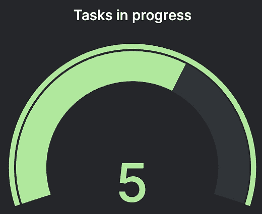

图 15.3 – 仪表的可能表示

### 直方图指标

与计数器和仪表不同，直方图将*测量值并将其计入桶中*。通常，如果我们想测量 API 的响应时间，我们可以统计处理时间少于 10 毫秒、少于 100 毫秒和少于 1 秒的请求数量。例如，做这个比仅获取一个简单的平均值或中位数要有洞察力得多。

使用直方图时，我们有责任定义所需的桶以及它们的值阈值。

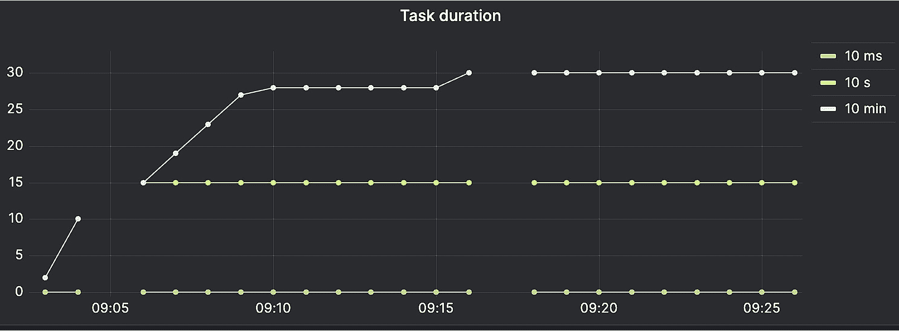

图 15.4 – 直方图的可能表示

Prometheus 定义了第四种类型的指标——摘要。它与直方图指标非常相似，但它使用滑动分位数而不是定义的桶。由于在 Python 中支持有限，我们不会详细介绍。此外，在本章的 Grafana 部分，我们将看到能够使用直方图指标计算分位数。

您可以在官方 Prometheus 文档中阅读有关这些指标的更多详细信息：

[`prometheus.io/docs/concepts/metric_types/`](https://prometheus.io/docs/concepts/metric_types/)

## 测量和暴露指标

一旦定义了指标，我们就可以开始在程序生命周期中进行测量。与我们记录日志的方式类似，指标暴露了方法，使我们能够在应用程序执行期间存储值。然后，Prometheus 会将这些值保存在内存中，以便构建指标。

那么，我们如何访问这些指标以便实际分析和监控呢？很简单，使用 Prometheus 的应用程序通常会暴露一个名为 `/metrics` 的 HTTP 端点，返回所有指标的当前值，格式是特定的。您可以在*图 15.5*中查看它的样子。

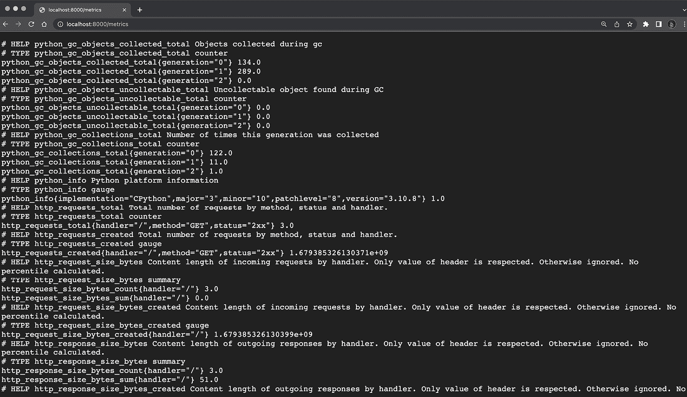

图 15.5 – Prometheus 指标端点的输出

该端点可以由 Prometheus 服务器定期轮询，Prometheus 会随着时间推移存储这些指标，并通过 PromQL 提供访问。

当您的应用程序重启时，指标会被重置。

值得注意的是，每次重启应用程序时（如 FastAPI 服务器），指标值都会丢失，并且从零开始。这可能有些令人惊讶，但理解指标值仅保存在应用程序的内存中是非常重要的。永久保存它们的责任属于 Prometheus 服务器。

现在我们已经对它们的工作原理有了一个大致了解，接下来让我们看看如何将指标添加到 FastAPI 和 Dramatiq 应用程序中。

## 将 Prometheus 指标添加到 FastAPI

正如我们所说，Prometheus 为各种语言（包括 Python）维护了官方库。

我们完全可以单独使用它，并手动定义各种指标来监控我们的 FastAPI 应用。我们还需要编写一些逻辑，将其挂钩到 FastAPI 请求处理程序中，以便我们可以衡量诸如请求计数、响应时间、负载大小等指标。

虽然完全可以实现，但我们将采取捷径，再次依赖开源社区，它提供了一个现成的库，用于将 Prometheus 集成到 FastAPI 项目中：`/metrics` 端点。

首先，当然需要通过 `pip` 安装它。运行以下命令：

```py

(venv) $ pip install prometheus_fastapi_instrumentator
```

在下面的示例中，我们实现了一个非常简单的 FastAPI 应用，并启用了仪表监控器：

chapter15_metrics_01.py

```py

from fastapi import FastAPIfrom prometheus_fastapi_instrumentator import Instrumentator, metrics
app = FastAPI()
@app.get("/")
async def hello():
    return {"hello": "world"}
instrumentator = Instrumentator()
instrumentator.add(metrics.default())
instrumentator.instrument(app).expose(app)
```

[`github.com/PacktPublishing/Building-Data-Science-Applications-with-FastAPI-Second-Edition/tree/main/chapter15/chapter15_metrics_01.py`](https://github.com/PacktPublishing/Building-Data-Science-Applications-with-FastAPI-Second-Edition/tree/main/chapter15/chapter15_metrics_01.py)

启用仪表监控器只需要三行代码：

1.  实例化 `Instrumentator` 类。

1.  启用库中提供的默认指标。

1.  将其与我们的 FastAPI `app` 连接并暴露 `/metrics` 端点。

就这样！FastAPI 已经集成了 Prometheus！

让我们用 Uvicorn 运行这个应用并访问 `hello` 端点。内部，Prometheus 将会测量有关这个请求的一些信息。现在让我们访问 `/metrics` 来查看结果。如果你滚动查看这个长长的指标列表，你应该能看到以下几行：

```py

# HELP http_requests_total Total number of requests by method, status and handler.# TYPE http_requests_total counter
http_requests_total{handler="/",method="GET",status="2xx"} 1.0
```

这是计数请求数量的指标。我们看到总共有一个请求，这对应于我们对`hello`的调用。请注意，仪表监控工具足够智能，可以根据路径、方法，甚至状态码为指标打上标签。这非常方便，因为它使我们能够根据请求的特征提取有趣的数据。

### 添加自定义指标

内置的指标是一个不错的开始，但我们可能需要根据我们应用的特定需求来定义自己的指标。

假设我们想要实现一个掷骰子的函数，骰子有六个面，并通过 REST API 暴露它。我们希望定义一个指标，允许我们计算每个面出现的次数。对于这个任务，计数器是一个很好的选择。让我们看看如何在代码中声明它：

chapter15_metrics_02.py

```py

DICE_COUNTER = Counter(    "app_dice_rolls_total",
    "Total number of dice rolls labelled per face",
    labelnames=["face"],
)
```

[`github.com/PacktPublishing/Building-Data-Science-Applications-with-FastAPI-Second-Edition/tree/main/chapter15/chapter15_metrics_02.py`](https://github.com/PacktPublishing/Building-Data-Science-Applications-with-FastAPI-Second-Edition/tree/main/chapter15/chapter15_metrics_02.py)

我们必须实例化一个 `Counter` 对象。前两个参数分别是指标的名称和描述。名称将由 Prometheus 用来唯一标识这个指标。因为我们想要统计每个面出现的次数，所以我们还添加了一个名为 `face` 的标签。每次我们统计骰子的投掷次数时，都需要将此标签设置为相应的面值。

度量命名规范

Prometheus 为度量命名定义了非常精确的规范。特别是，它应该以度量所属的领域开始，例如 `http_` 或 `app_`，并且如果仅是一个值计数，则应该以单位结尾，例如 `_seconds`、`_bytes` 或 `_total`。我们强烈建议您阅读 Prometheus 的命名规范：[`prometheus.io/docs/practices/naming/`](https://prometheus.io/docs/practices/naming/)。

现在我们可以在代码中使用这个度量了。在下面的代码片段中，您将看到 `roll_dice` 函数的实现：

chapter15_metrics_02.py

```py

def roll_dice() -> int:    result = random.randint(1, 6)
    DICE_COUNTER.labels(result).inc()
    return result
```

[`github.com/PacktPublishing/Building-Data-Science-Applications-with-FastAPI-Second-Edition/tree/main/chapter15/chapter15_metrics_02.py`](https://github.com/PacktPublishing/Building-Data-Science-Applications-with-FastAPI-Second-Edition/tree/main/chapter15/chapter15_metrics_02.py)

您可以看到，我们直接使用度量实例 `DICE_COUNTER`，首先调用 `labels` 方法来设置骰子面数，然后调用 `inc` 来实际增加计数器。

这就是我们需要做的：我们的度量已经自动注册到 Prometheus 客户端，并将通过 `/metrics` 端点开始暴露。在 *图 15.6* 中，您可以看到此度量在 Grafana 中的可能可视化。

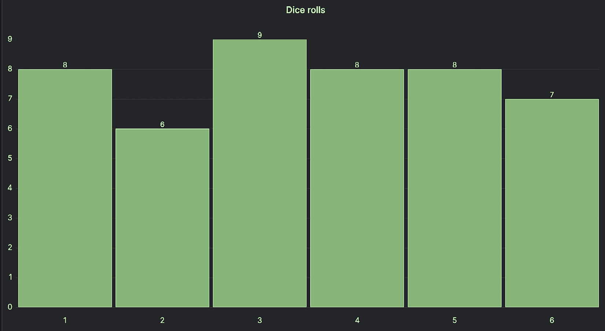

图 15.6 – 在 Grafana 中表示骰子投掷度量

如您所见，声明和使用新度量是非常简单的：我们只需在想要监控的代码中直接调用它。

### 处理多个进程

在*第十章*中，我们在 *为部署添加 Gunicorn 作为服务器进程* 部分提到过，在生产部署中，FastAPI 应用程序通常会使用多个工作进程运行。基本上，它会启动多个相同应用程序的进程，并在它们之间平衡传入的请求。这使得我们可以并发处理更多请求，避免因某个操作阻塞进程而导致的阻塞。

不要混淆 Gunicorn 工作进程和 Dramatiq 工作进程

当我们谈论 Gunicorn 部署中的工作进程时，我们指的是通过启动多个进程来并发处理 API 请求的方式。我们不是指 Dramatiq 中的工作进程，这些进程是在后台处理任务。

对于同一应用程序，拥有多个进程在 Prometheus 度量方面是有点问题的。事实上，正如我们之前提到的，这些度量仅存储在内存中，并通过 `/``metrics` 端点暴露。

如果我们有多个进程来处理请求，每个进程都会有自己的一组度量值。然后，当 Prometheus 服务器请求 `/metrics` 时，我们将获得响应我们请求的进程的度量值，而不是其他进程的度量值。这些值在下次轮询时可能会发生变化！显然，这将完全破坏我们最初的目标。

为了绕过这个问题，Prometheus 客户端有一个特殊的多进程模式。基本上，它不会将值存储在内存中，而是将它们存储在专用文件夹中的文件里。当调用 `/metrics` 时，它会负责加载所有文件并将所有进程的值进行合并。

启用此模式需要我们设置一个名为 `PROMETHEUS_MULTIPROC_DIR` 的环境变量。它应该指向文件系统中一个有效的文件夹，存储指标文件。以下是如何设置这个变量并启动带有四个工作进程的 Gunicorn 的命令示例：

```py

(venv) $ PROMETHEUS_MULTIPROC_DIR=./prometheus-tmp gunicorn -w 4 -k uvicorn.workers.UvicornWorker chapter15.chapter15_metrics_01:app
```

当然，在生产环境部署时，你应该在平台上全局设置环境变量，正如我们在*第十章*中所解释的那样。

如果你尝试这个命令，你会看到 Prometheus 会开始在文件夹内存储一些 `.db` 文件，每个文件对应一个指标和一个进程。副作用是，*在重启进程时，指标不会被清除*。如果你更改了指标定义，或者运行了完全不同的应用程序，可能会导致意外的行为。确保为每个应用选择一个专用的文件夹，并在运行新版本时清理该文件夹。

我们现在能够精确地对 FastAPI 应用进行监控。然而，正如我们在前一章中所看到的，数据科学应用可能包含一个独立的工作进程，其中运行着大量的逻辑和智能。因此，对应用的这一部分进行监控也至关重要。

## 向 Dramatiq 添加 Prometheus 指标

在*第十四章*中，我们实现了一个复杂的应用，包含一个独立的工作进程，该进程负责加载并执行 Stable Diffusion 模型来生成图像。因此，架构中的这一部分非常关键，需要进行监控，以确保一切顺利。

在这一部分，我们将学习如何向 Dramatiq 工作进程添加 Prometheus 指标。好消息是，Dramatiq 已经内置了指标，并且默认暴露了 `/metrics` 端点。实际上，几乎不需要做什么！

让我们来看一个非常基础的 Dramatiq 工作进程的例子，里面包含一个虚拟任务：

chapter15_metrics_03.py

```py

import timeimport dramatiq
from dramatiq.brokers.redis import RedisBroker
redis_broker = RedisBroker(host="localhost")
dramatiq.set_broker(redis_broker)
@dramatiq.actor()
def addition_task(a: int, b: int):
    time.sleep(2)
    print(a + b)
```

[`github.com/PacktPublishing/Building-Data-Science-Applications-with-FastAPI-Second-Edition/tree/main/chapter15/chapter15_metrics_03.py`](https://github.com/PacktPublishing/Building-Data-Science-Applications-with-FastAPI-Second-Edition/tree/main/chapter15/chapter15_metrics_03.py)

正如你现在可能已经理解的，Dramatiq 本质上是一个多进程程序：它会启动多个工作进程来并发处理任务。因此，我们需要确保 Prometheus 处于多进程模式，正如我们在*处理多个进程*部分中提到的那样。因此，我们需要设置`PROMETHEUS_MULTIPROC_DIR`环境变量，正如我们之前解释的那样，还需要设置`dramatiq_prom_db`。事实上，Dramatiq 实现了自己的机制来启用 Prometheus 的多进程模式，这应该是开箱即用的，但根据我们的经验，明确指出这一点会更好。

以下命令展示了如何启动带有`PROMETHEUS_MULTIPROC_DIR`和`dramatiq_prom_db`设置的工作进程：

```py

(venv) $ PROMETHEUS_MULTIPROC_DIR=./prometheus-tmp-dramatiq dramatiq_prom_db=./prometheus-tmp-dramatiq dramatiq chapter15.chapter15_metrics_03
```

为了让你能轻松在这个工作进程中调度任务，我们添加了一个小的`__name__ == "__main__"`指令。在另一个终端中，运行以下命令：

```py

(venv) $ python -m chapter15.chapter15_metrics_03
```

它将在工作进程中调度一个任务。你可能会在工作进程日志中看到它的执行情况。

现在，尝试在浏览器中打开以下 URL：`http://localhost:9191/metrics`。你将看到类似于我们在*图 15.7*中展示的结果。

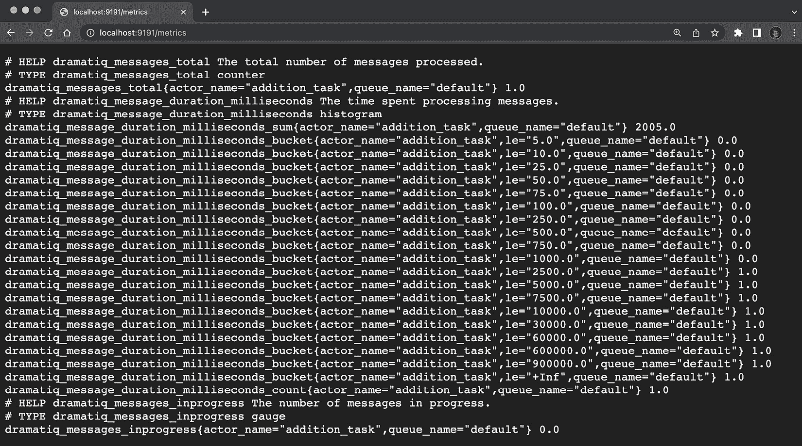

图 15.7 – Dramatiq Prometheus 度量端点的输出

我们已经看到几个度量指标，包括一个用于统计 Dramatiq 处理的消息总数的计数器，一个用于测量任务执行时间的直方图，以及一个用于衡量当前正在进行的任务数量的仪表。你可以在 Dramatiq 的官方文档中查看完整的度量指标列表：[`dramatiq.io/advanced.html#prometheus-metrics`](https://dramatiq.io/advanced.html#prometheus-metrics)。

### 添加自定义指标

当然，对于 FastAPI，我们可能也希望向 Dramatiq 工作进程添加我们自己的指标。事实上，这与我们在上一节中看到的非常相似。让我们再次以掷骰子为例：

chapter15_metrics_04.py

```py

DICE_COUNTER = Counter(    "worker_dice_rolls_total",
    "Total number of dice rolls labelled per face",
    labelnames=["face"],
)
@dramatiq.actor()
def roll_dice_task():
    result = random.randint(1, 6)
    time.sleep(2)
    DICE_COUNTER.labels(result).inc()
    print(result)
```

[`github.com/PacktPublishing/Building-Data-Science-Applications-with-FastAPI-Second-Edition/tree/main/chapter15/chapter15_metrics_04.py`](https://github.com/PacktPublishing/Building-Data-Science-Applications-with-FastAPI-Second-Edition/tree/main/chapter15/chapter15_metrics_04.py)

我们所需要做的只是创建我们的`Counter`对象，正如我们之前所做的那样，并在任务中使用它。如果你尝试运行工作进程并请求`/metrics`端点，你会看到这个新指标出现。

我们现在可以对我们的 FastAPI 和 Dramatiq 应用进行指标收集。正如我们之前多次提到的那样，我们现在需要将这些指标汇总到 Prometheus 服务器中，并在 Grafana 中进行可视化。这就是我们将在下一节中讨论的内容。

# 在 Grafana 中监控指标

拥有度量指标固然不错，但能够可视化它们更好！在本节中，我们将看到如何收集 Prometheus 度量指标，将它们发送到 Grafana，并创建仪表板来监控它们。

Grafana 是一个开源的 Web 应用程序，用于数据可视化和分析。它能够连接到各种数据源，比如时间序列数据库，当然也包括 Prometheus。其强大的查询和图形构建器使我们能够创建详细的仪表板，在其中实时监控我们的数据。

## 配置 Grafana 收集指标

由于它是开源的，你可以在自己的机器或服务器上运行它。详细的安装说明可以在官方文档中找到：[`grafana.com/docs/grafana/latest/setup-grafana/installation/`](https://grafana.com/docs/grafana/latest/setup-grafana/installation/)。不过，为了加快进程并快速开始，我们这里依赖的是 Grafana Cloud，这是一个官方托管平台。它提供了一个免费的计划，足以让你开始使用。你可以在这里创建账户：[`grafana.com/auth/sign-up/create-user`](https://grafana.com/auth/sign-up/create-user)。完成后，你将被要求创建自己的实例，即一个“Grafana Stack”，通过选择子域名和数据中心区域，如*图 15**.8* 所示。请选择一个靠近你地理位置的区域。

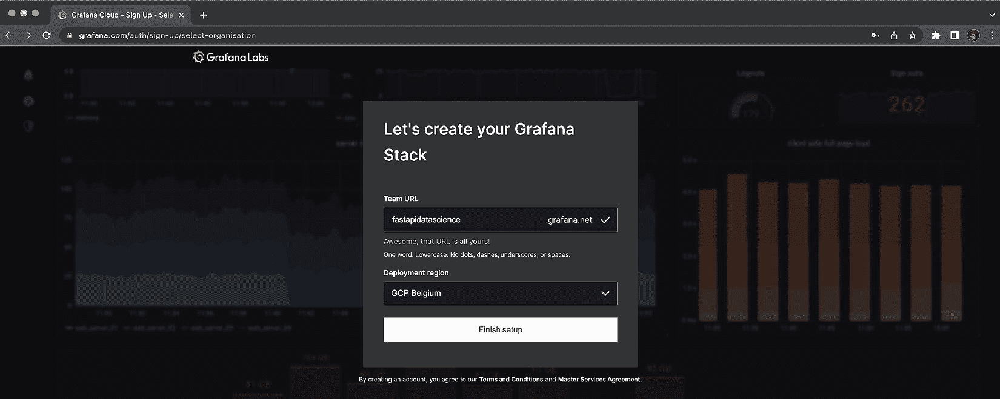

图 15.8 – 在 Grafana Cloud 上创建实例

然后，你将看到一组常见的操作，帮助你开始使用 Grafana。我们要做的第一件事是添加 Prometheus 指标。点击**扩展和集中现有数据**，然后选择**托管 Prometheus 指标**。你将进入一个配置 Prometheus 指标收集的页面。在顶部点击名为**配置详情**的选项卡。页面将呈现如*图 15**.9*所示。

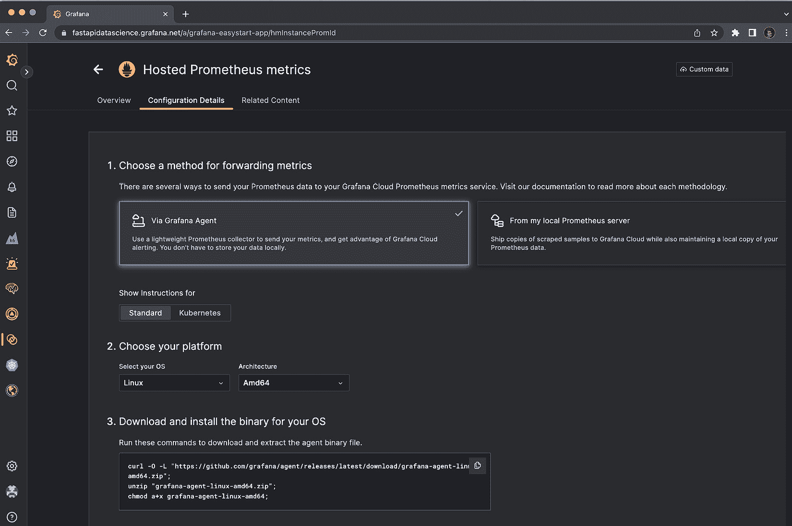

图 15.9 – 在 Grafana 上配置托管 Prometheus 指标

你可以看到，我们有两种方式来转发指标：通过 Grafana Agent 或通过 Prometheus 服务器。

如前所述，Prometheus 服务器负责收集我们所有应用程序的指标，并将数据存储在数据库中。这是标准的做法。你可以在官方文档中找到如何安装它的说明：[`prometheus.io/docs/prometheus/latest/installation/`](https://prometheus.io/docs/prometheus/latest/installation/)。不过，请注意，它是一个专用的应用服务器，需要适当的备份，因为它会存储所有的指标数据。

最直接的方式是使用 Grafana Agent。它由一个小型命令行程序和一个配置文件组成。当它运行时，它会轮询每个应用程序的指标，并将数据发送到 Grafana Cloud。所有数据都会存储在 Grafana Cloud 上，因此即使停止或删除代理，数据也不会丢失。这就是我们在这里使用的方法。

Grafana 会在页面上显示下载、解压并执行 Grafana Agent 程序的命令。执行这些命令，以便将其放在项目的根目录中。

然后，在最后一步，你需要创建一个 API 令牌，以便 Grafana Agent 可以将数据发送到你的实例。给它起个名字，然后点击**创建 API 令牌**。一个新的文本区域将出现，显示一个新的命令，用于创建代理的配置文件，正如你在*图 15.10*中看到的那样。

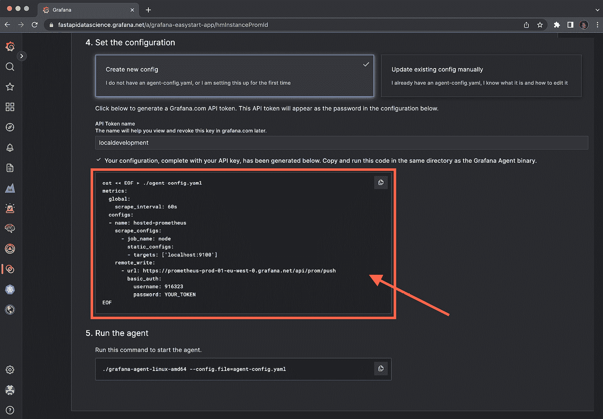

图 15.10 – 创建 Grafana Agent 配置的命令

执行 `./grafana-agent-linux-amd64 –config.file=agent-config.yaml` 命令。一个名为 `agent-config.yaml` 的文件将被创建在你的项目中。我们现在需要编辑它，以便配置我们的实际 FastAPI 和 Dramatiq 应用程序。你可以在以下代码片段中看到结果：

agent-config.yaml

```py

metrics:  global:
    scrape_interval: 60s
  configs:
  - name: hosted-prometheus
    scrape_configs:
      - job_name: app
        static_configs:
        - targets: ['localhost:8000']
      - job_name: worker
        static_configs:
        - targets: ['localhost:9191']
    remote_write:
      - url: https://prometheus-prod-01-eu-west-0.grafana.net/api/prom/push
        basic_auth:
          username: 811873
          password: __YOUR_API_TOKEN__
```

[`github.com/PacktPublishing/Building-Data-Science-Applications-with-FastAPI-Second-Edition/tree/main/chapter15/agent-config.yaml`](https://github.com/PacktPublishing/Building-Data-Science-Applications-with-FastAPI-Second-Edition/tree/main/chapter15/agent-config.yaml)

这是一个 YAML 配置文件，我们可以在其中设置 Grafana Agent 的各种选项。最重要的部分是 `scrape_configs` 键。如你所见，我们可以定义所有要收集指标的应用程序列表，并指定它们的主机名，对于 FastAPI 应用程序是“目标”：`localhost:8000`，而 Dramatiq worker 是 `localhost:9191`。当然，这个配置适用于本地开发，但在生产环境中，你需要根据实际应用程序的主机名进行调整。

我们现在准备启动 Grafana Agent 并收集指标数据了！确保你的 FastAPI 和 Dramatiq 应用程序正在运行，然后启动 Grafana Agent。根据你的系统，执行文件的名称会有所不同，但大致如下所示：

```py

$ ./grafana-agent-linux-amd64 --config.file=agent-config.yaml
```

Grafana Agent 将启动并定期收集指标数据，然后将其发送到 Grafana。我们现在可以开始绘制一些数据了！

## 在 Grafana 中可视化指标

我们的指标数据现在已发送到 Grafana。我们准备好查询它并构建一些图表了。第一步是创建一个新的**仪表板**，这是一个可以创建和组织多个图表的地方。点击右上角的加号按钮，然后选择**新建仪表板**。

一个新的空白仪表板将出现，正如你在*图 15.11*中看到的那样。

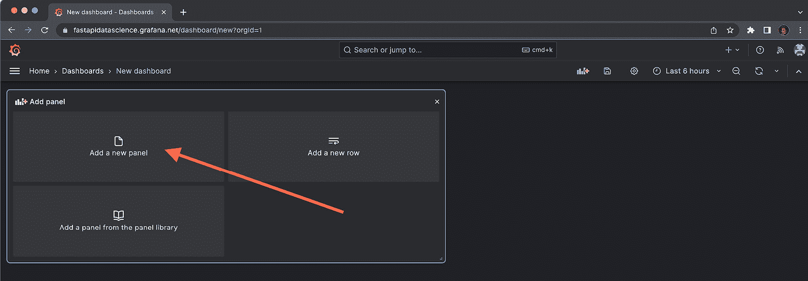

图 15.11 – 在 Grafana 中创建新仪表板

点击**添加新面板**。将会出现一个用于构建新图表的界面。主要有三个部分：

+   左上角的图表预览。在开始时，它是空的。

+   左下角的查询构建器。这是我们查询指标数据的地方。

+   右侧的图表设置。这是我们选择图表类型并精细配置其外观和感觉的地方，类似于电子表格软件中的操作。

让我们尝试为我们 FastAPI 应用中的 HTTP 请求时长创建一个图表。在名为**指标**的选择菜单中，你将能访问到我们应用所报告的所有 Prometheus 指标。选择**http_request_duration_seconds_bucket**。这是 Prometheus FastAPI Instrumentator 默认定义的直方图指标，用于衡量我们端点的响应时间。

然后，点击**运行查询**。在后台，Grafana 会构建并执行 PromQL 查询来检索数据。

在图表的右上角，我们选择一个较短的时间跨度，比如**过去 15 分钟**。由于我们还没有太多数据，如果只看几分钟的数据，而不是几小时的数据，图表会更加清晰。你应该会看到一个类似*图 15.12*的图表。

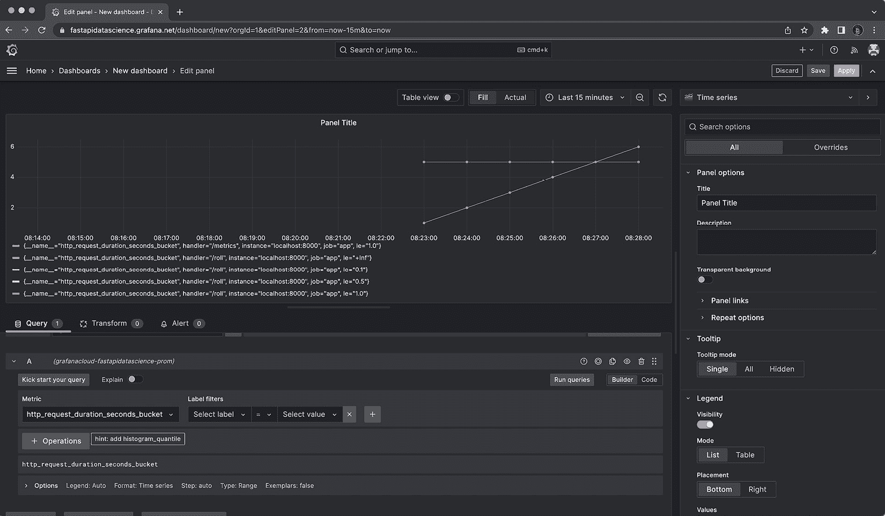

图 15.12 – Grafana 中直方图指标的基本图

Grafana 已绘制出多个系列：对于每个`handler`（对应于端点模式），我们有多个桶，`le`。每条线大致代表了*我们在少于“**le**”秒内处理`handler`请求的次数*。

这是指标的原始表示。然而，你可能会发现它不太方便阅读和分析。如果我们能以另一种方式查看这些数据，按分位数排列的响应时间，可能会更好。

幸运的是，PromQL 包含一些数学运算，这样我们就可以对原始数据进行处理。在**指标**菜单下方的部分允许我们添加这些运算。我们甚至可以看到 Grafana 建议我们使用**添加 histogram_quantile**。如果点击这个蓝色按钮，Grafana 会自动添加三种操作：*速率*、*按 le 求和*，最后是*直方图分位数*，默认设置为*0.95*。

通过这样做，我们现在可以看到响应时间的变化情况：95%的时间，我们的响应时间少于*x*秒。

默认的*y*轴单位不太方便。由于我们知道我们使用的是秒，接下来在图表选项中选择这个单位。在右侧，找到**标准选项**部分，然后在**单位**菜单中，在**时间**组下选择**秒（s）**。现在你的图表应该像*图 15.13*一样。

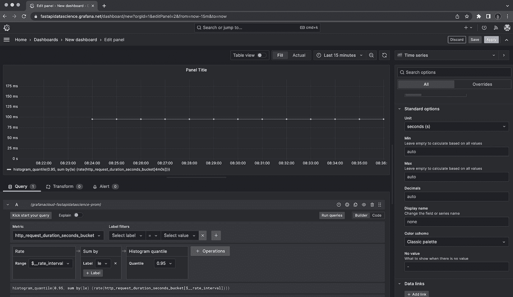

图 15.13 – Grafana 中直方图指标的分位数表示

现在情况更具洞察力了：我们可以看到，我们几乎处理了所有的请求（95%）都在 100 毫秒以内。如果我们的服务器开始变慢，我们会立即在图表中看到上升，这能提醒我们系统出现了问题。

如果我们希望在同一个图表上显示其他分位数，可以通过点击**复制**按钮（位于**运行查询**上方）来复制这个查询。然后，我们只需要选择另一个分位数。我们展示了*0.95*、*0.90*和*0.50*分位数的结果，见*图 15.14*。

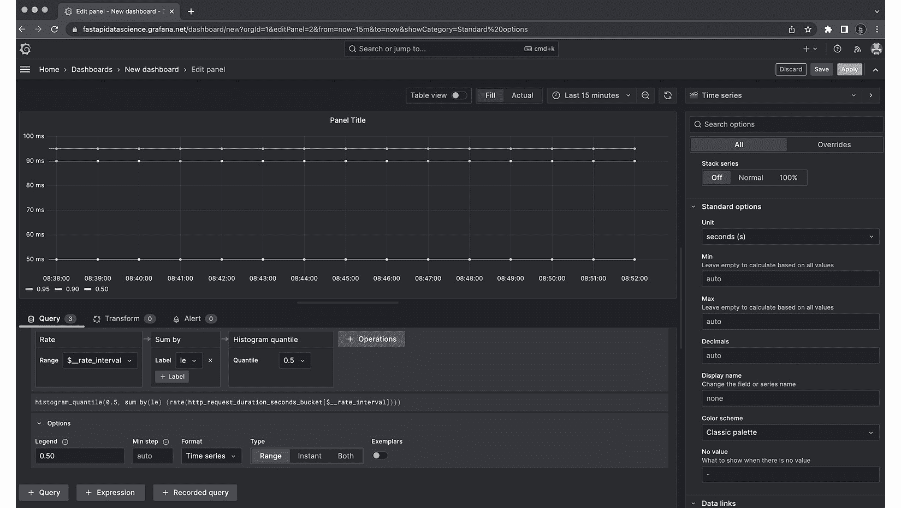

图 15.14 – Grafana 中同一图表上的多个分位数

图例可以自定义

注意，图例中的系列名称是可以自定义的。在每个查询的**选项**部分，你可以根据需要进行自定义。你甚至可以包含来自查询的动态值，例如指标标签。

最后，我们可以通过在右侧列中设置**面板标题**来给我们的图表命名。现在我们对图表感到满意，可以点击右上角的**应用**按钮，将其添加到我们的仪表板中，如*图 15.15*所示。

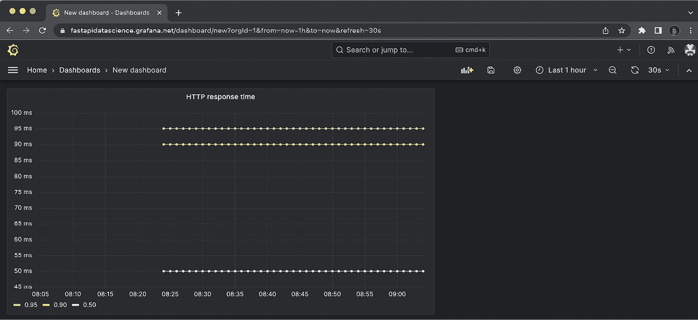

图 15.15 – Grafana 仪表板

就这样！我们可以开始监控我们的应用程序了。你可以随意调整每个面板的大小和位置。你还可以设置想要查看的查询时间范围，甚至启用自动刷新功能，这样数据就能实时更新！别忘了点击**保存**按钮来保存你的仪表板。

我们可以使用完全相同的配置，构建一个类似的图表，用于监控执行 Dramatiq 任务所需的时间，这要感谢名为`dramatiq_message_duration_milliseconds_bucket`的指标。注意，这个指标是以毫秒为单位表示的，而不是秒，所以在选择图表单位时需要特别小心。我们在这里看到了 Prometheus 指标命名约定的一个优点！

### 添加柱状图

Grafana 提供了许多不同类型的图表。例如，我们可以将骰子投掷指标绘制成柱状图，其中每根柱子表示某一面出现的次数。让我们来试试：添加一个新面板并选择`app_dice_rolls_total`指标。你会看到类似*图 15.6*所示的内容。

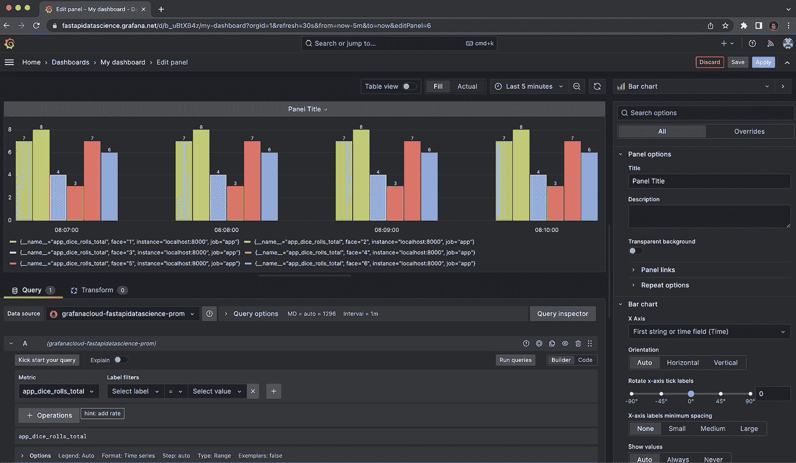

图 15.16 – Grafana 中计数器指标的默认表示方式（柱状图）

确实，我们为每个面都有一个柱子，但有一个奇怪的地方：每个时间点都有一根柱子。这是理解 Prometheus 指标和 PromQL 的关键：所有指标都作为*时间序列*存储。这使我们能够回溯时间，查看指标随时间的演变。

然而，对于某些表示方式，像这里显示的这种，实际上并不具备很高的洞察力。对于这种情况，最好是展示我们选择的时间范围内的最新值。我们可以通过将指标面板中的**类型**设置为**即时**来实现这一点。我们会看到现在我们有一个单一的图表，显示一个时间点的数据，如*图 15.17*所示。

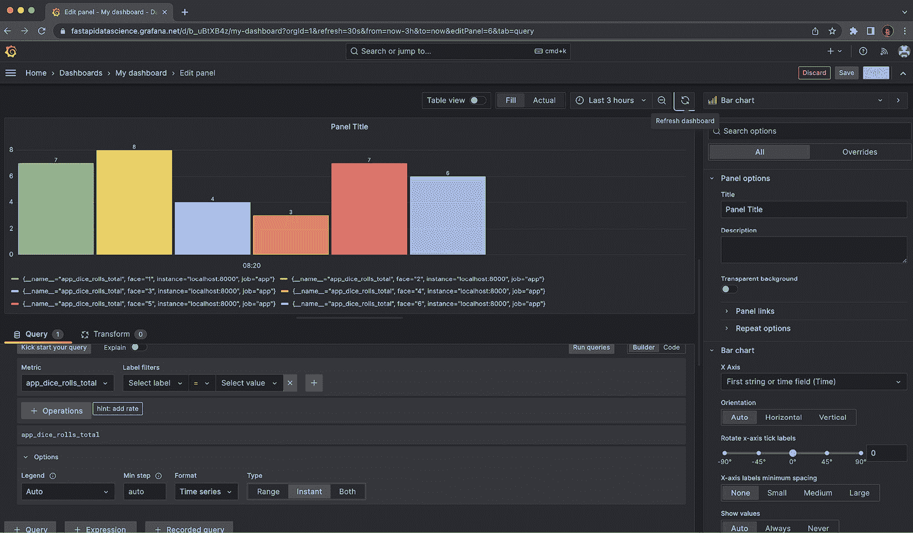

图 15.17 – 在 Grafana 中将计数器指标配置为即时类型

这样已经更好了，但我们可以更进一步。通常，我们希望 *x* 轴显示面孔标签，而不是时间点。首先，让我们用 `{{face}}` 自定义图例。现在图例将只显示 `face` 标签。

现在，我们将数据转换，使得 *x* 轴为 `face` 标签。点击 **Transform** 标签。你会看到一系列可以在可视化之前应用到数据的函数。在我们这里，我们将选择 **Reduce**。这个函数的作用是取每个序列，从中提取一个特定的值并将其绘制在 *x* 轴上。默认情况下，Grafana 会取最大值 **Max**，但也有其他选项，如 **Last**、**Mean** 或 **StdDev**。在这种情况下，它们没有区别，因为我们已经查询了即时值。

就是这样！我们的图表现在显示了我们看到面孔的次数。这就是我们在*第 15.6 图*中展示的内容。

# 总结

恭喜！现在你可以在 Grafana 中报告指标，并构建自己的仪表盘来监控你的数据科学应用程序。随着时间的推移，如果你发现一些盲点，不要犹豫添加新的指标或完善你的仪表盘：目标是能够一目了然地监控每个重要部分，从而快速采取纠正措施。这些指标也可以用来推动你工作的演进：通过监控你的机器学习模型的性能和准确性，你可以跟踪你所做的改动的效果，看看自己是否走在正确的道路上。

本书的内容和我们的 FastAPI 之旅到此结束。我们真诚希望你喜欢本书，并且在这段旅程中学到了很多。我们覆盖了许多主题，有时只是稍微触及表面，但现在你应该已经准备好使用 FastAPI 构建自己的项目，并提供智能数据科学算法。一定要查看我们在旅程中提到的所有外部资源，它们将为你提供掌握这些技能所需的所有见解。

近年来，Python 在数据科学社区中获得了极大的关注，尽管 FastAPI 框架仍然非常年轻，但它已经是一个改变游戏规则的工具，并且已经看到了前所未有的采用率。它很可能会成为未来几年许多数据科学系统的核心……而当你读完这本书时，你可能就是这些系统背后的开发者之一。干杯！
