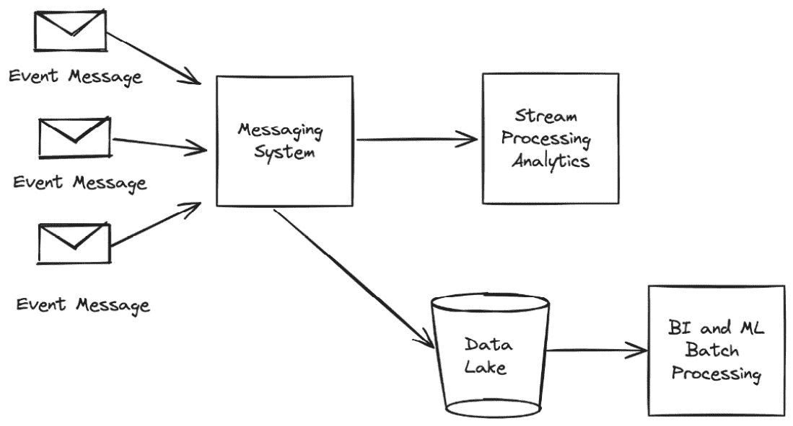
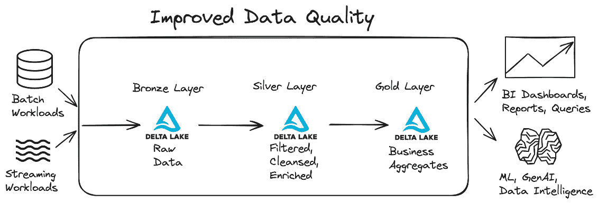
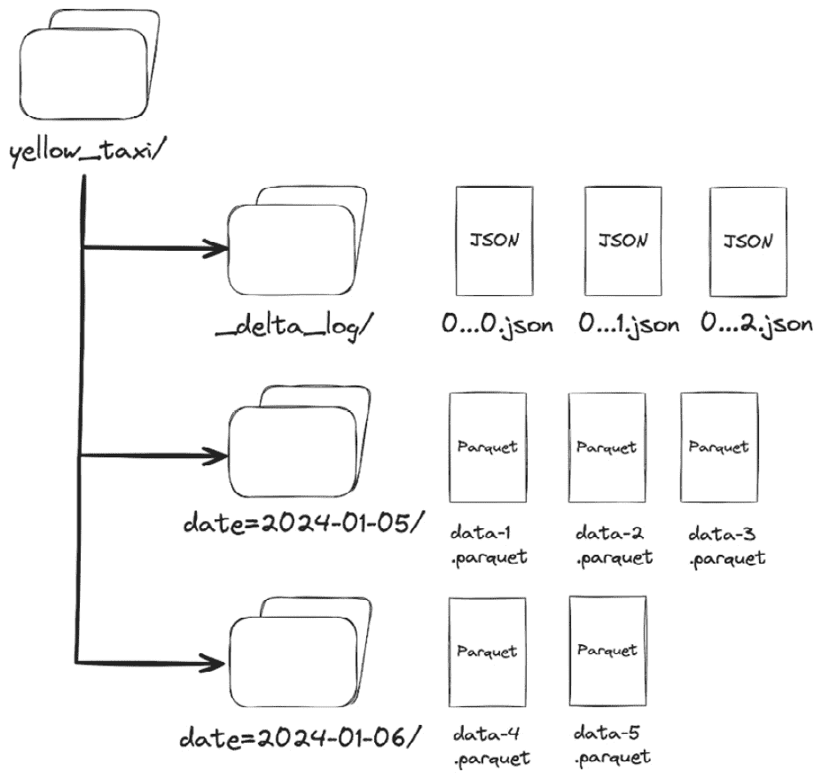
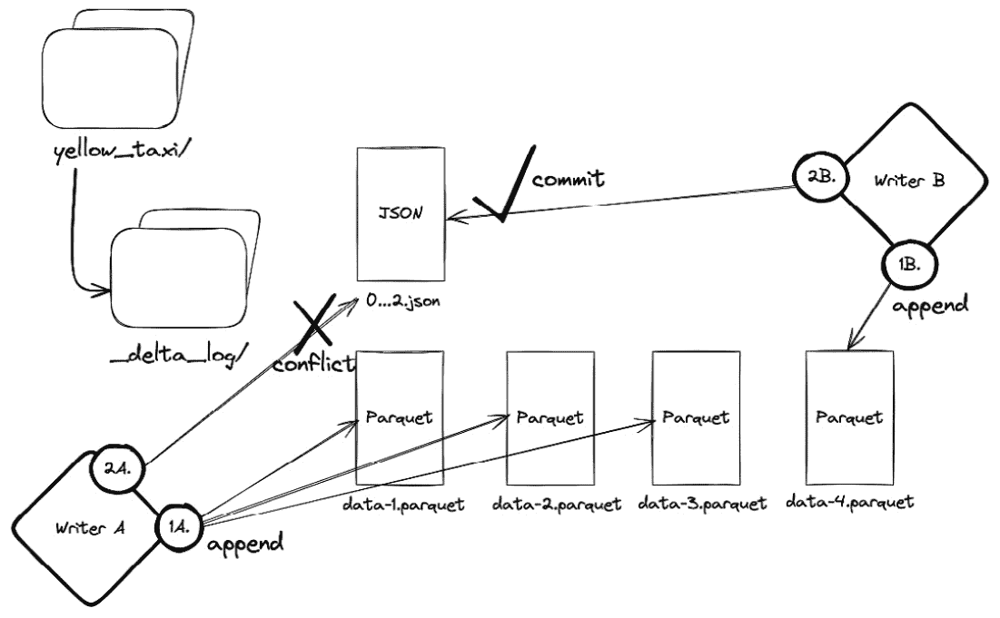
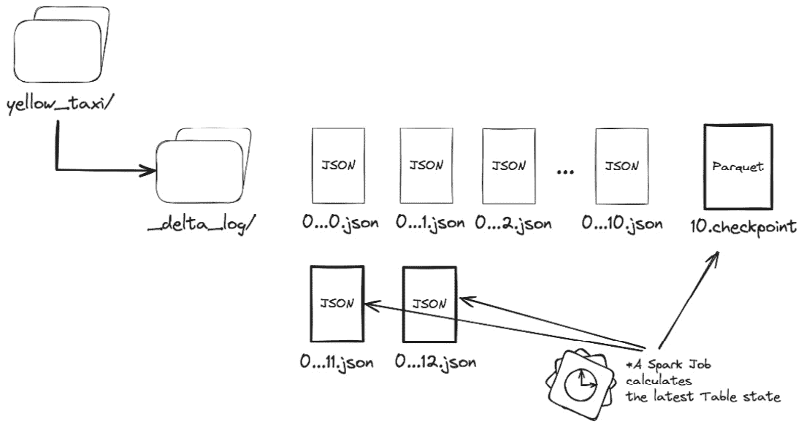
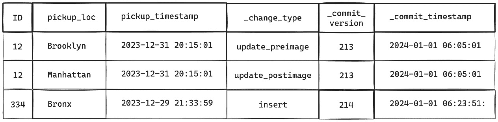
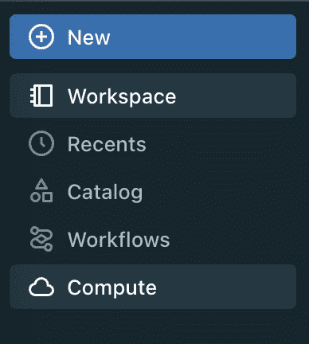
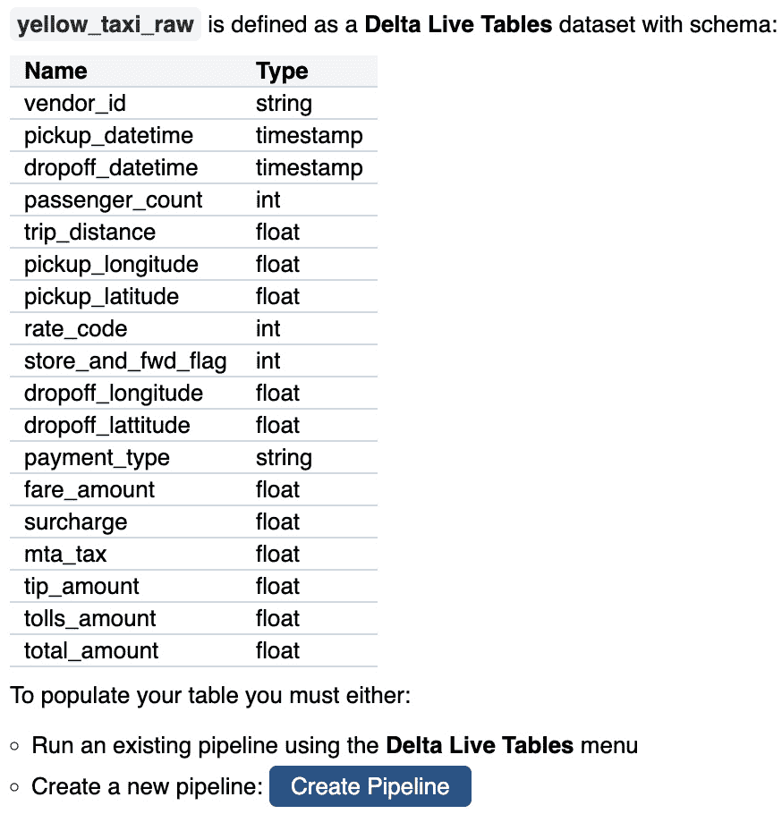
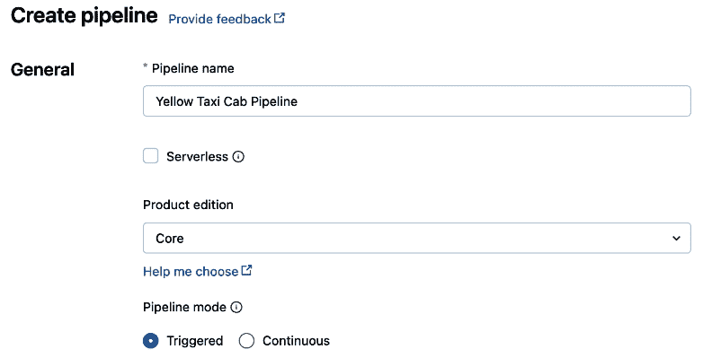
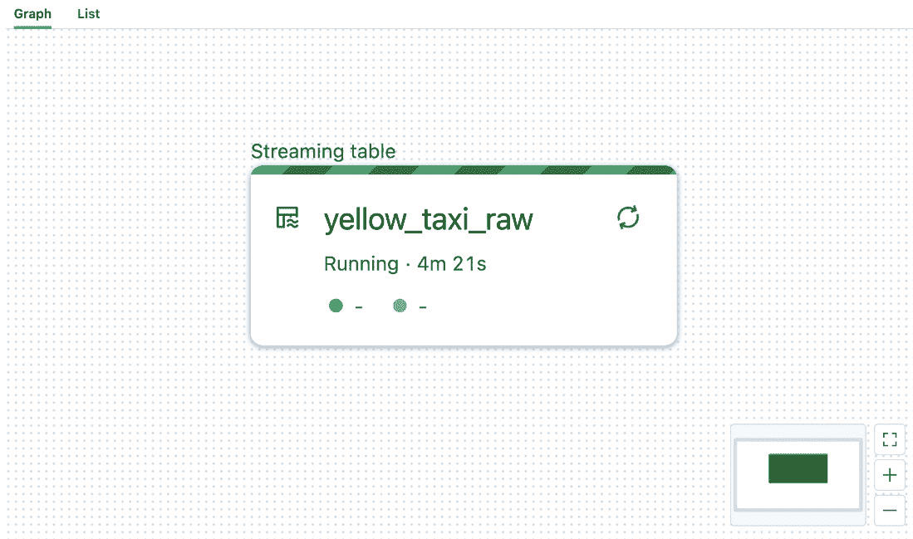

# 第一章：Delta Live Tables 简介

在本章中，我们将探讨过去几十年来数据行业如何发展。我们还将讨论为何实时数据处理与企业如何应对数据中的最新信号有着密切关系。我们将说明为什么从零开始构建自己的流处理解决方案可能无法持续，并且为什么维护随着时间推移并不容易扩展。到本章结束时，你应该完全理解 **Delta Live Tables**（**DLT**）框架解决的问题类型，以及该框架为数据工程团队带来的价值。

本章我们将覆盖以下主要主题：

+   湖仓的出现

+   实时数据在湖仓中的重要性

+   流应用程序的维护困境

+   什么是 Delta Live Tables 框架？

+   Delta Live Tables 与 Delta Lake 有何关系？

+   Delta Live Tables 概念介绍

+   Delta Lake 快速入门

+   实战示例 – 创建你的第一个 Delta Live Tables 管道

# 技术要求

推荐访问 Databricks 高级工作区，以便跟随章节末尾的代码示例进行操作。还建议具有 Databricks 工作区权限，能够创建通用集群和使用集群策略创建 DLT 管道。用户将创建并将笔记本附加到集群，并执行笔记本单元格。所有代码示例可以从本章的 GitHub 仓库下载，地址为 [`github.com/PacktPublishing/Building-Modern-Data-Applications-Using-Databricks-Lakehouse/tree/main/chapter01`](https://github.com/PacktPublishing/Building-Modern-Data-Applications-Using-Databricks-Lakehouse/tree/main/chapter01)。本章将使用核心产品版本创建并运行一个新的 DLT 管道。因此，预计该管道将消耗约 5–10 **Databricks** **单位** (**DBU**)。

# 湖仓的出现

在 1980 年代初期，数据仓库是处理结构化数据的好工具。结合适当的索引方法，数据仓库使我们能够以极快的速度提供**商业智能**（**BI**）报告。然而，进入 21 世纪后，数据仓库无法跟上像 JSON 这样的新数据格式，以及音频和视频等新型数据模态。简单来说，数据仓库在处理大多数企业使用的半结构化和非结构化数据时遇到困难。此外，数据仓库在处理数百万或数十亿行数据时也力不从心，这在 2000 年代初期的信息时代变得越来越普遍。突然之间，批处理数据处理任务很快与在早晨商业工作时段安排刷新的 BI 报告发生冲突。

与此同时，云计算成为组织中的流行选择，因为它提供了一种弹性计算能力，可以根据当前的计算需求快速扩展或收缩，而无需处理预配和安装额外的硬件设备在本地。

现代**抽取、转换和加载**（**ETL**）处理引擎，如 Apache Hadoop 和 Apache Spark™，解决了处理大数据 ETL 流水线的性能问题，引入了一个新概念，即**数据湖**。然而，数据湖在为 BI 报告提供服务方面表现不佳，并且通常会为许多并发用户会话提供性能下降的体验。此外，数据湖的数据治理也很差。它们容易出现松散的数据整理模式，导致多个昂贵的数据副本，这些副本经常偏离数据真相。因此，这些数据湖很快就被称为*数据沼泽*。大数据行业需要变革。湖屋模式正是这种变革，旨在结合两者的优势 – 云中结构化、半结构化和非结构化数据的快速 BI 报告和快速 ETL 处理。

## Lambda 架构模式

在 2010 年代初期，数据流处理在数据行业占据了一席之地，许多企业需要一种方法来支持批量 ETL 处理和仅附加数据流。此外，具有许多并发 ETL 进程的数据架构需要同时读取和更改底层数据。组织经常遇到频繁的冲突写入失败，导致数据损坏甚至数据丢失。因此，在许多早期数据架构中，构建了两叉 Lambda 架构，以在这些过程之间提供一层隔离。



图 1.1 – Lambda 架构经常被创建以支持实时流式工作负载和批处理过程，例如 BI 报告

使用 Lambda 架构，下游过程（例如 BI 报告或**机器学习**（**ML**）模型训练）可以在数据快照上执行计算，而流处理过程可以单独应用几乎实时的数据更改。然而，这些 Lambda 架构会复制数据以支持并发的批处理和流式工作负载，导致不一致的数据更改，需要在每个工作日结束时进行调解。

## 引入勋章架构

为了清理数据湖并防止不良数据操作，数据湖架构师需要一种能够满足现代 ETL 处理高需求的数据处理模式。此外，组织还需要一种简化的架构，来处理批量和流式工作负载，支持数据回滚、良好的数据审计以及强大的数据隔离，并能够扩展到每天处理数 TB 甚至 PB 级的数据。

结果，Lakehouse 中出现了一种设计模式，通常称为徽章架构。该数据处理模式通过在连续的数据跳跃中应用业务级转换，物理隔离数据处理并提高数据质量，这些跳跃也被称为**数据层**。



图 1.2 – Lakehouse 徽章架构

一种典型的组织 Lakehouse 内部数据的设计模式（如 *图 1.2* 所示）包括三个不同的数据层——青铜层、银层和最后的金层：

+   青铜层作为原始未处理数据的登陆区。

+   经过过滤、清理和增强的数据，具有定义的结构和强制执行的模式，将存储在银层中。

+   最后，经过精炼的金层，将提供洁净的业务级聚合，准备供下游 BI 和 ML 系统使用。

此外，这种简化的数据架构通过将数据集存储在支持并发批量和流式数据操作的大数据格式中，统一了批量和流式工作负载。

## Databricks Lakehouse

Databricks Lakehouse 将一种新的高性能处理引擎——光子引擎的处理能力与 Apache Spark 的增强功能相结合。结合开源数据格式进行数据存储，并支持广泛的数据类型，包括结构化数据、半结构化数据和非结构化数据，光子引擎可以使用数据的单一一致性快照，处理各种工作负载，同时采用廉价且具备弹性的云存储。此外，Databricks Lakehouse 通过统一批处理和流处理，使用单一 API——Spark DataFrame API，简化了数据架构。最后，Databricks Lakehouse 考虑到数据治理和数据安全，允许组织集中定义数据访问模式，并在整个业务中一致地应用这些模式。

在本书中，我们将讨论 Databricks Lakehouse 的三个主要特性：

+   Delta Lake 格式

+   光子引擎

+   Unity Catalog

虽然 Delta Lake 可以同时处理批量和流式工作负载，但大多数数据团队选择使用批量执行模型来实现他们的 ETL 管道，主要是出于简便考虑。让我们看看为什么会是这样。

# 流式应用程序的维护困境

Spark Structured Streaming 提供近实时流处理，具备容错性，并通过使用几乎与 Spark 批处理相同的 DataFrame API 保证精确一次的处理。因此，由于 DataFrame API 的统一，数据工程团队可以以最小的努力将现有的批处理 Spark 工作负载转换为流处理。然而，随着数据量的增加以及摄取源和数据管道数量的自然增长，数据工程团队面临着增加现有数据管道的负担，以跟上新的数据转换或变化的业务逻辑。此外，Spark Streaming 还需要额外的配置维护，如更新检查点位置、管理水印和触发器，甚至在发生重大数据变化或数据更正时回填表格。高级数据工程团队甚至可能需要构建数据验证和系统监控能力，为了维护更多的自定义管道功能。随着时间的推移，数据管道的复杂性会增加，数据工程团队会花费大部分时间来维护生产环境中数据管道的运行，而不是从企业数据中提取洞察。显然，需要一个框架，使数据工程师能够快速声明数据转换、管理数据质量，并快速将变更部署到生产环境中，在 UI 或其他通知系统中监控管道操作。

# 什么是 DLT 框架？

DLT 是一个声明式框架，旨在通过抽象掉许多模板复杂性，简化数据管道的开发和维护操作。例如，数据工程师可以声明要对新到达的数据应用哪些转换，而不是声明如何转换、丰富和验证数据。此外，DLT 还支持强制执行数据质量，防止数据湖变成数据沼泽。DLT 使数据团队能够选择如何处理低质量数据，无论是将警告信息打印到系统日志、丢弃无效数据，还是完全失败数据管道的运行。最后，DLT 自动处理日常的数据工程任务，如维护底层表的优化数据文件大小，以及清理 Delta 事务日志中不再存在的过时数据文件（**优化**和**清理**操作将在后面的*Delta Lake 快速入门*部分介绍）。DLT 旨在减轻数据工程团队的维护和运营负担，让他们能够将时间集中在从存储在湖仓中的数据中发现业务价值，而不是花时间管理运营复杂性。

# DLT 与 Delta Lake 有什么关系？

DLT 框架在每一步中都严重依赖 Delta Lake 格式来逐步处理数据。例如，在 DLT 管道中定义的流式表和物化视图是由 Delta 表支持的。使 Delta Lake 成为流式管道理想存储格式的功能包括支持**原子性、一致性、隔离性和持久性**（**ACID**）事务，因此可以将并发的数据修改（如插入、更新和删除）逐步应用到流式表中。此外，Delta Lake 具有可扩展的元数据处理能力，允许 Delta Lake 容易扩展到 PB 级别及更大。如果数据计算有误，Delta Lake 提供时间旅行——恢复表的某个历史快照的功能。最后，Delta Lake 本身会跟踪每个表的事务日志中的审计信息。诸如修改表的操作类型、操作的集群、操作的用户和具体的时间戳等溯源信息，都与数据文件一起被捕获。让我们来看看 DLT 如何利用 Delta 表快速高效地定义随时间扩展的数据管道。

# 介绍 DLT 概念

DLT 框架自动管理任务调度、集群创建和异常处理，使数据工程师能够专注于定义转换、数据丰富和数据验证逻辑。数据工程师将使用一个或多个数据集类型定义数据管道。在幕后，DLT 系统会确定如何保持这些数据集的最新状态。使用 DLT 框架的数据管道由流式表、物化视图和视图数据集类型组成，我们将在接下来的部分详细讨论这些内容。我们还将简要讨论如何可视化管道，查看其触发方式，并从鸟瞰图查看整个管道数据流。我们还将简要了解不同类型的 Databricks 计算和运行时，以及 Unity Catalog。让我们开始吧。

## 流式表

流式表利用 Delta Lake 和 Spark Structured Streaming 的优势，逐步处理到达的新数据。此数据集类型在需要高吞吐量和低延迟地摄取、转换或丰富数据时非常有用。流式表专为仅追加新数据且不包括数据修改（如更新或删除）的数据源设计。因此，这种数据集类型可以扩展到大数据量，因为它可以在新数据到达时逐步应用数据转换，并且在管道更新时不需要重新计算整个表的历史记录。

## 物化视图

物化视图利用 Delta Lake 计算数据集的最新变更，并将结果物化存储在云存储中。当数据源包含如更新和删除等数据修改，或必须执行数据聚合时，这种数据集类型非常适合。在后台，DLT 框架将执行计算，重新计算数据集的最新数据变更，使用整个表的历史记录。该计算的输出存储在云存储中，以便未来的查询可以引用预计算的结果，而不是每次查询表时重新执行完整的计算。因此，每次物化视图更新时，这种类型的数据集将产生额外的存储和计算成本。此外，物化视图可以发布到 Unity Catalog 中，这样结果就可以在 DLT 数据管道之外进行查询。这在你需要跨多个数据管道共享查询结果时非常有用。

## 视图

视图也会重新计算特定查询的最新结果，但不会将结果物化到云存储中，从而帮助节省存储成本。这种数据集类型非常适合当你想快速检查数据管道中数据转换的中间结果或执行其他临时数据验证时。此外，这种数据集类型的结果不能发布到 Unity Catalog，仅在数据管道上下文中可用。

下表总结了 DLT 框架中不同数据集类型的差异，以及在何时使用某种数据集类型比其他类型更合适：

| **数据集类型** | **何时使用** |
| --- | --- |
| 流表 | 数据摄取工作负载，当你需要以高吞吐量和低延迟不断将新数据追加到目标表时。 |
| 物化视图 | 包含数据修改的操作，如更新和删除，或者你需要对整个表的历史记录执行聚合。 |
| 视图 | 当你需要查询中间数据但不将结果发布到 Unity Catalog 时（例如，执行中间转换的数据质量检查） |

表 1.1 – DLT 中的每种数据集类型都有不同的用途

## 管道

DLT 管道是一个或多个流表、物化视图或视图的逻辑数据处理图。DLT 框架将使用 Python API 或 SQL API 进行数据集声明，并推断每个数据集之间的依赖关系。一旦管道更新运行，DLT 框架将使用依赖图按正确的顺序更新数据集，这个依赖图被称为**数据流图**。

## 管道触发器

管道将根据某些触发事件执行。DLT 提供三种类型的触发器——手动触发、定时触发和连续触发。一旦触发，管道将初始化并执行数据流图，更新每个数据集的状态。

## 工作流

Databricks 工作流是**Databricks 数据智能平台**的一个托管编排功能，允许数据工程师将一个或多个相互依赖的数据处理任务串联起来。对于更复杂的数据处理用例，可能需要使用多个嵌套的 DLT 管道来构建数据管道。在这些用例中，Databricks 工作流可以简化这些数据处理任务的编排。

## Databricks 计算类型

Databricks 数据智能平台为用户提供四种类型的计算资源。

### 作业计算

作业计算是一个包含安装有**Databricks Runtime**（**DBR**）的短期虚拟机（**VMs**）的集合，这些虚拟机会根据计划作业的时间动态配置。作业完成后，虚拟机会立即释放回云服务提供商。由于作业集群不使用 Databricks 数据智能平台的 UI 组件（例如，笔记本和查询编辑器），作业集群在执行期间会评估较低的**Databricks 单位**（**DBU**）。

### 通用计算

通用计算是一个包含安装有 DBR 的短期虚拟机的集合，用户可以通过点击 Databricks 用户界面上的按钮，或通过 Databricks REST API（例如使用**/api/2.0/clusters/create** 端点）动态创建它们，且虚拟机会一直运行，直到用户或自动终止计时器终止该集群。终止后，虚拟机会返回给云服务提供商，Databricks 停止评估额外的 DBU。

### 实例池

实例池是 Databricks 的一个功能，帮助减少配置额外虚拟机并安装 DBR 所需的时间。实例池会从云服务提供商预先配置虚拟机，并将它们保存在一个逻辑容器中，类似于代客停车场中的代客停车员保持您的汽车运转。

对于某些云服务提供商，提供额外的虚拟机可能需要 15 分钟或更长时间，这会导致更长的故障排除周期或临时开发任务，例如在开发新特性时检查日志或重新运行失败的笔记本单元格。

此外，当许多作业计划紧密或重叠执行时，实例池可以提高效率。例如，当一个作业完成时，虚拟机不会释放回云服务提供商，而是可以将虚拟机放入实例池，以供下一个作业重复使用。

在将虚拟机返回到实例池之前，安装在虚拟机上的 Databricks 容器会被销毁，并且当下一个计划作业请求虚拟机时，安装有 DBR 的新容器会被安装到虚拟机上。

重要说明

当虚拟机（VM）正在运行时，Databricks 不会额外评估 DBU。然而，云服务提供商会继续收取虚拟机在实例池中的费用。

为了帮助控制成本，实例池提供了一个自动扩展功能，允许池的大小根据需求自动增长或缩小。例如，在高峰时段，实例池可能会增长到 10 个虚拟机，但在处理需求低谷时，池的大小会缩小到 1 或 2 个虚拟机。

### Databricks SQL 仓库

Databricks 数据智能平台中的最后一种计算资源是 **Databricks SQL** (**DBSQL**) 仓库。DBSQL 仓库旨在运行 SQL 工作负载，如查询、报告和仪表板。此外，DBSQL 仓库是预配置的计算资源，旨在限制数据分析师或 SQL 分析师在临时数据探索和查询执行中需要优化的配置。DBSQL 仓库预先配置了最新的 DBR，利用 Databricks Photon 引擎，并具有预配置的高级 Spark 配置设置以优化性能。DBSQL 仓库还包括其他性能特性，如结果缓存和磁盘缓存，这可以通过将数据更靠近执行查询计算的硬件来加速工作负载。结合 Photon 引擎的处理速度，DBSQL 仓库实现了 Apache Spark 曾经难以达到的云仓库速度。

## Databricks Runtime

Databricks Runtime 是一组在集群初始化期间预先安装在集群的驱动节点和工作节点上的库。这些库包括流行的 Java、R 和 Python 库，帮助最终用户进行临时数据整理或其他开发任务。这些库包含与 Databricks 后端服务接口的核心组件，支持丰富的平台功能，如协作笔记本、工作流和集群指标。此外，DBR 还包括其他性能特性，如数据文件缓存（称为磁盘缓存）、用于加速 Spark 处理的 Databricks Photon 引擎，以及其他计算加速功能。DBR 有两种版本，Standard 和 ML，分别针对不同的工作负载进行优化，依据最终用户的角色来调整。例如，适用于 ML 的 DBR 会预先安装流行的 Python 库，如 TensorFlow 和 scikit-learn，以帮助最终用户进行 ML 模型训练、特征工程和其他 ML 开发任务。

## Unity Catalog

顾名思义，Unity Catalog 是一个集中式治理存储，旨在跨多个 Databricks 工作区进行管理。与其在每个 Databricks 工作区中重复定义用户和组的数据治理策略，Unity Catalog 允许数据管理员在一个集中位置定义访问策略。结果，Unity Catalog 成为数据治理的单一真实来源。

除了数据访问策略外，Unity Catalog 还具有数据审计、数据血统、数据发现和数据共享功能，这些内容将在*第五章*、*第六章* 和*第七章*中介绍。

Unity Catalog 紧密集成到 Databricks Lakehouse 中，使得构建具备强大数据安全性的近实时数据管道变得简单，使用 Delta Lake 等开放的 Lakehouse 存储格式。

# 快速了解 Delta Lake

Delta Lake 是一种大数据文件协议，围绕多版本事务日志构建，提供诸如 ACID 事务、模式强制、时间旅行、数据文件管理等性能特性，基于现有的 Lakehouse 数据文件。

最初，大数据架构有许多并发的进程，这些进程既读取又修改数据，导致数据损坏甚至丢失。如前所述，创建了一个双管齐下的 Lambda 架构，在对数据进行流式更新的进程与需要一致数据快照的下游进程（如生成每日报告或刷新仪表盘的 BI 工作负载）之间提供了一个隔离层。然而，这些 Lambda 架构重复了数据，以支持这些批处理和流式工作负载，导致了不一致的数据变化，需要在每个工作日结束时进行调和。

幸运的是，Delta Lake 格式提供了一个共同的存储层，能够跨不同工作负载统一批处理和流式工作负载。因此，Delta 表成为 Delta Live 表的基础。在后台，Delta Live 表由一个 Delta 表支持，该表被添加到数据流图中，并且每当 DLT 管道更新执行时，DLT 系统会更新其状态。

## Delta 表的架构

Delta 事务日志是该大数据格式架构的关键部分。每个 Delta 表都包含一个事务日志，这是一个目录名为**_delta_log**，位于表的根目录下。事务日志是一个多版本的记录系统，用于跟踪表在一段线性时间内的状态。



图 1.3 – Delta 事务日志与分区目录和数据文件一起，存储在一个名为 _delta_log 的单独目录中

事务日志通知 Delta Lake 引擎读取哪些数据文件来回答特定的查询。

在每个事务日志目录中，将存储一个或多个 JSON 格式的文件，以及其他元数据，帮助快速有效地计算 Delta 表的状态（将在下一节中介绍）。

随着新数据的附加、更新或甚至删除，这些变化会被记录或提交到该目录作为元数据，以原子 JSON 文件的形式存储。JSON 文件的命名使用有序整数，从**00…0.json**开始，每次成功提交事务后递增一个。

如果 Delta 表是分区的，则表的根目录中将包含一个或多个子目录，存储分区列信息。Hive 风格的表分区是一种常见的性能优化技术，可以通过将相似数据存储在同一目录中来加速查询。数据按特定列的值（例如，**"date=2024-01-05"**）进行聚集。根据表分区的列数，分区目录中甚至可能包含更多嵌套的子目录。

在这些分区子目录中包含一个或多个数据文件，数据文件采用 Apache Parquet 格式存储。Apache Parquet 是一种流行的列式存储格式，具有高效的数据压缩和编码方案，能够快速存储和检索大数据工作负载的数据。因此，选择这种开放格式作为存储 Delta 表数据文件的基础。

## 事务提交的内容

如前所述，事务日志是 Delta 表的唯一真实来源。每个已提交的事务（**_delta_log** 目录下的 JSON 文件）将包含关于操作或应用于特定 Delta 表的操作的元数据信息。这些 JSON 文件可以视为一组操作。虽然可以有多个并发事务，但事务提交历史会被表读取器按线性顺序回放，结果就是 Delta 表的最新状态。

每个 JSON 文件可能包含以下 Delta Lake 协议中列出的操作：

+   **更改元数据**：此类型的操作用于更新表的名称、模式或分区信息。

+   **添加文件**：可能是最常见的操作，此操作将一个新的数据文件添加到表中，并附带有关 Delta 表前 32 列的统计信息。

+   **移除文件**：此操作将逻辑删除特定数据文件。请注意，物理数据文件将在此事务提交后仍保留在云存储中（有关此主题的更多内容，请参见 *墓碑数据* *文件* 部分）。

+   **添加变更数据捕获（CDC）信息**：此操作用于添加一个 CDC 文件，该文件将包含由于特定表操作而发生变化的所有数据。

+   **事务标识符**：此操作用于结构化流式工作负载，将包含特定流的唯一标识符，以及最近提交的结构化流微批次的纪元标识符。

+   **协议演进**：提供向后兼容性，确保旧版 Delta Lake 表读取器能够读取事务日志中的元数据。

+   **提交溯源信息**：这种操作将包含关于将特定数据事务提交到表的过程的信息。这将包括时间戳、操作类型、集群标识符和用户信息等信息。

+   **领域元数据**：这种操作为特定领域设置配置。领域元数据有两种类型——系统领域和用户控制领域。

+   **侧车文件信息**：这种操作会将一个单独的元数据文件提交到事务日志，其中包含有关创建的检查点文件的汇总信息（检查点将在接下来的部分中讲解）。

## 支持并发的表格读取与写入

存储系统中有两种并发控制方法——悲观并发控制和乐观并发控制。悲观并发控制通过锁定整个表，直到当前事务完成，来防止可能的表冲突。相反，乐观并发控制不会锁定表格，而是允许潜在的事务冲突发生。

Delta Lake 协议的作者选择使用乐观并发控制来实现 Delta Lake 格式。做出这一设计选择的原因是，大多数大数据工作负载会将新数据附加到现有表中，而不是修改现有数据。

作为示例，让我们看看 Delta Lake 如何处理两个表写入者之间的并发写入冲突——表写入者 A 和表写入者 B：



图 1.4 – Delta Lake 实现了乐观并发控制方案来处理并发写入冲突

假设两个表的写入者修改了相同的数据文件，并尝试提交彼此冲突的数据更改。我们来看看 Delta Lake 是如何处理这种情况的。

1.  写入者 A 首先会记录它尝试提交到事务日志的事务的起始版本标识符。

1.  写入者 A 随后将写入所有它希望提交的事务数据文件。

1.  接下来，写入者 A 将尝试将事务提交到 Delta 事务日志。

1.  与此同时，写入者 B 已经使用相同的表版本标识符提交了他们的事务。

1.  写入者 A 检测到写入者 B 的提交，并重放提交信息，以确定底层数据文件是否发生了变化（例如，数据是否已被更新）。

1.  如果没有数据发生变化（例如，写入者 A 和写入者 B 都只是将附加操作提交到事务日志），那么写入者 A 会将版本标识符加 1，并尝试重新提交该事务到事务日志。

1.  如果数据发生变化，那么写入者 A 将需要从头开始重新计算事务，递增版本标识符，并尝试重新提交事务。

## 删除数据文件

当对 Delta 表应用更新，且需要更新文件中的数据时，将使用**AddFile**操作创建一个新文件。同样，包含过时数据的文件将通过**RemoveFile**操作逻辑删除。然后，这两个操作将提交到事务日志中。

默认情况下，Delta Lake 会保留表元数据（事务日志数据）30 天，之后会自动从云存储中删除。当某个数据文件从 Delta 事务日志中删除时，通常称之为**已删除文件**。

为了帮助控制云存储成本，这些已删除的文件，或者那些不再是最新 Delta 表状态的一部分并且不再在事务日志中被引用的文件，可以从云存储中彻底删除。一个独立的 Delta Lake 文件管理工具，称为**Vacuum**命令，可以作为独立进程运行，识别所有已删除的数据文件并将其移除。

此外，**Vacuum**命令是可配置的，可以通过可选的输入参数指定删除表文件的时间长度。例如，以下代码片段将对 Delta 表**yellow_taxi**执行**Vacuum**命令，移除表历史中最后 14 天的数据文件：

```py
%sql
-- Vacuums the Delta table `yellow_taxi`
-- and retains 14 days of table history
VACUUM yellow_taxi RETAIN 336 HOURS
```

正如我们将在接下来的章节中看到的那样，这个过程会自动运行并管理 DLT 管道。

## 计算 Delta 表状态

如前一节所提到的，Delta Lake 会自动在事务日志中压缩元数据。正如你可以想象的那样，在拥有成千上万甚至数百万个每日事务的大数据工作负载中，Delta 表的大小会迅速增长。同样，事务日志中的提交信息也会相应增长。

对于每第 10 次提交，Delta Lake 将创建一个检查点文件，使用 Apache Parquet 格式，包含最新的表状态信息。



图 1.5 – 对于每第 10 次提交，Delta Lake 将写入一个检查点文件

在底层，Delta Lake 读取器会创建一个独立的 Apache Spark 作业来高效读取 Delta 表的提交日志。例如，要计算最新的表状态，Delta Lake 读取器将首先读取最新的检查点文件，并应用在文件创建之后可能发生的事务提交。

将表状态信息存储在与数据文件一起的检查点文件中，这是 Delta Lake 格式的另一个关键设计选择。通过这种方法，计算表的状态比其他方法（例如使用 Hive Metastore 提供表元数据）能够更好地扩展。当许多大型、活跃度高的表同时查询时，传统的大数据元数据存储（如 Hive Metastore）在检索表元数据以回答查询时难以扩展。

为了进一步加快查询速度，Delta Lake 读者还将表状态缓存到本地内存中；这样，表读取器可以更快地计算哪些数据文件能回答特定的表查询。

## 时间旅行

Delta Lake 中的另一个文件管理工具是时间旅行功能，它允许最终用户查询表的先前版本状态。时间旅行提供了两种方法来指定表的状态——使用事务日志中分配的表版本号或使用时间戳。

用户可以使用 SQL 语法直接查询先前的 Delta 表状态：

```py
%sql
SELECT *
  FROM yellow_taxi
  TIMESTAMP AS OF '2023-12-31'
```

同样，Databricks 数据智能平台上的 Python 用户可以使用 Python API：

```py
%py
display(
    (spark.read
        .format("delta")
        .option("timestampAsOf", "2023-12-31")
        .load("s3a://my-data-lake/yellow_taxi/"))
)
```

需要注意的是，默认情况下，**Vacuum** 工具将删除特定 Delta 表中过去七天的所有数据文件。

因此，如果运行 **Vacuum** 命令并且用户尝试查询超过最后七天的表历史记录，最终用户将收到运行时异常，说明事务日志中引用的数据不再存在。

此外，Delta Lake 的时间旅行功能是为修复近期数据问题而设计的，因此不应用于长期数据存储要求，例如实现跨越数年的审计系统。

## 使用变更数据馈送跟踪表的更改

Delta Lake 的 **变更数据馈送**（**CDF**）功能跟踪已对 Delta 表进行的行级更改，以及有关这些更改的元数据。例如，CDF 会捕获有关操作类型、确认更改发生的时间戳以及其他来源信息（如集群标识和用户信息）。

对于更新操作，CDF 会捕获更新前行的快照，以及更新应用后行的快照。



图 1.6 – CDF 捕获操作类型、提交版本和时间戳

此功能默认未启用，但可以通过更新 Delta 表的属性进行配置。例如，可以通过修改表格并使用 SQL **ALTER** 语句来启用 CDF：

```py
%sql
ALTER TABLE yellow_taxi
SET TBLPROPERTIES (delta.enableChangeDataFeed = true)
```

同样，在创建表时，也可以通过将表属性包含在 **CREATE** **TABLE** 语句中来启用 CDF：

```py
%sql
CREATE TABLE IF NOT EXISTS yellow_taxi
TBLPROPERTIES (delta.enableChangeDataFeed = true)
```

正如我们将在下一章中看到的那样，这个功能在 DLT 如何高效地将源表的变更应用到下游数据集并实现**慢变化维度**（**SCDs**）方面非常重要。

# 动手示例 – 创建您的第一个 Delta Live Tables 数据管道

在本节中，我们将使用 NYC 出租车示例数据集来声明一个数据管道，使用 DLT 框架，并应用基本的转换来丰富数据。

重要提示

为了从本节中获得最大的价值，建议具有 Databricks 工作区权限，允许创建一个通用集群和 DLT 数据管道，使用集群策略。在本节中，您将把笔记本连接到集群，执行笔记本单元格，并创建和运行一个新的 DLT 数据管道。

让我们从创建一个新的通用集群开始。通过从左侧导航栏选择 **计算** 按钮，导航到 Databricks 计算 UI。



图 1.7 – 从左侧边栏导航到计算 UI

点击右上角的 **创建计算** 按钮。接下来，为集群提供一个名称。在此练习中，集群可以是一个小型单节点集群。选择 **单节点** 单选按钮作为集群类型。在运行时下拉菜单中选择最新的 DBR。接受默认设置后，再次点击 **创建计算** 按钮。

现在我们已经启动了一个集群，可以开始开发我们的第一个数据管道。

让我们首先在您的工作区主页目录下创建一个新的 Databricks 笔记本。通过点击左侧边栏的 **工作区** 按钮，点击 **添加** 下拉菜单并选择 **笔记本**，创建一个新的笔记本。给笔记本起一个有意义的名字，例如 **我的第一个 DLT 数据管道**。这个新笔记本将用于声明构成我们 Delta Live Table 数据管道的数据集和依赖关系。

所有 Databricks 工作区都附带一组示例数据集，位于 Databricks 文件系统中的**/databricks-datasets**。您可以通过列出目录内容，使用 Databricks 文件系统工具浏览可用的数据集列表：

```py
%py
display(
    dbutils.fs.ls('/databricks-datasets')
)
```

接下来，我们需要导入 **dlt** Python 模块。**dlt** 模块包含函数装饰器，这些装饰器将指示 DLT 系统如何构建我们的数据管道、依赖关系以及一个名为数据流图的内部数据处理图。

将以下内容添加到一个新的笔记本单元格中：

```py
import dlt
```

DLT 基于 PySpark 构建，因此我们可以利用 Spark DataFrames 来定义如何从云存储中摄取数据以及如何应用数据转换。我们从定义一个函数开始，该函数将使用 Spark 从 **/** **databricks-datasets** 目录读取 NYC 出租车示例数据集：

```py
def yellow_taxi_raw():
    path = "/databricks-datasets/nyctaxi/tripdata/yellow"
    return (spark.readStream
        .schema(schema)
        .format("csv")
        .option("header", True)
        .load(path))
```

在这个例子中，我们声明了一个有意义名称的简单函数，当调用时，该函数将使用 Spark 读取存储在黄出租车数据集中的原始数据，并将其作为流式 DataFrame 返回。

现在，我们需要告诉 DLT 框架，我们应该将此声明的函数作为数据管道的一部分使用。我们可以通过添加 **@dlt.table()** 函数装饰器来实现。这个函数装饰器将从函数创建一个 Delta Live Table，并将其添加到管道的数据流图中。让我们还向这个函数装饰器的可选 **comment** 参数添加一些描述性文本：

```py
@dlt.table(
    comment="The raw NYC taxi cab trip dataset located in `/databricks-datasets/`"
)
def yellow_taxi_raw():
    path = "/databricks-datasets/nyctaxi/tripdata/yellow"
    return (spark.readStream
        .schema(schema)
        .format("csv")
        .option("header", True)
        .load(path))
```

执行笔记本单元格后，Databricks 数据智能平台将检测到一个 DLT 表，打印输出架构，并提示您创建一个新的 DLT 管道。



图 1.8 – Databricks 将解析 DLT 表声明并打印输出架构

让我们点击 **创建管道** 按钮以生成一个新的 DLT 管道。为数据管道指定一个有意义的名称，例如 **黄出租车管道**。选择 **Core** 作为产品版本，并将 **触发式** 作为管道执行模式。



图 1.9 – 使用 Core 产品版本创建一个新的 DLT 管道

接下来，在 **目标位置** 设置中，选择 Unity Catalog 单选按钮，并指定您希望存储数据集的目标目录和模式。在 **计算** 设置下，将 **最小工作节点数** 设置为 **1**，将 **最大工作节点数** 设置为 **1**。然后，点击 **创建** 按钮接受默认设置。最后，点击 **启动** 按钮执行数据管道。您将看到数据流图的可视化表示。



图 1.10 – 数据流图将包含我们在笔记本中声明的流式表

如您所见，我们的数据流图由一个单一的流式表组成，这是一个新的数据集，将从 Databricks 文件系统中的 **/databricks-datasets/** 位置获取原始纽约市出租车旅行数据。虽然这是一个简单的示例，但它展示了 DLT 框架的声明式特性，以及我们如何快速使用熟悉的 PySpark API 声明数据管道。此外，您现在应该对如何从 DLT UI 监控和查看我们数据管道的最新状态有了一个基本的了解。

# 摘要

在本章中，我们探讨了数据行业为何以及如何选择湖仓架构，这种架构旨在将 ETL 处理的可扩展性与 BI 工作负载下的数据仓库速度融合到一个统一的架构中。我们了解了实时数据处理如何成为从最新数据中发掘价值的关键，但随着时间的推移，实时数据管道的复杂性增加可能会影响数据工程团队的生产力。最后，我们学习了 Delta Live Tables 框架的核心概念，以及如何通过几行 PySpark 代码和函数装饰器，快速声明一个能够高效且低延迟地增量处理数据的实时数据管道。

在下一章中，我们将深入探讨 Delta Live Tables 管道的高级设置，以及该框架如何为我们优化底层数据集。然后，我们将通过一个实际的案例来开发数据管道，学习更复杂的数据转换。
