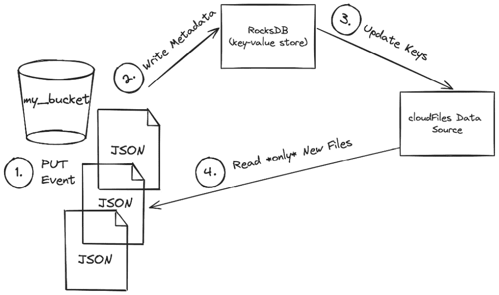
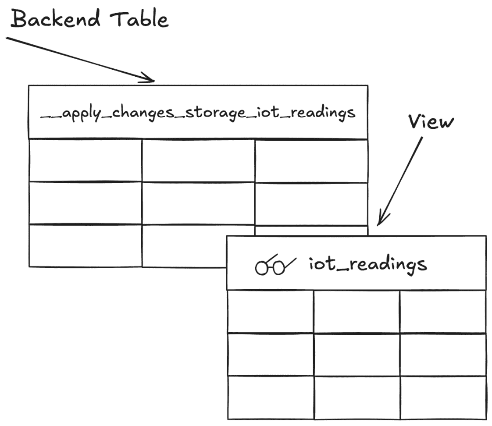
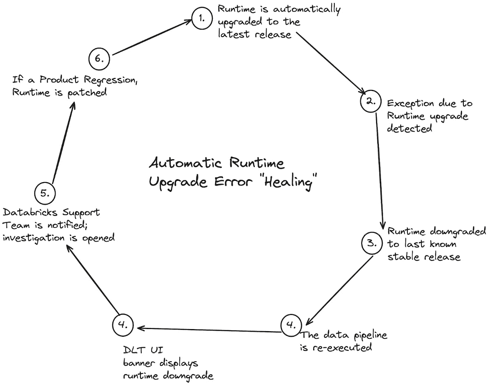
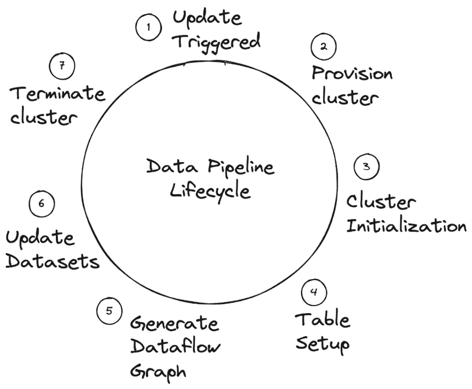
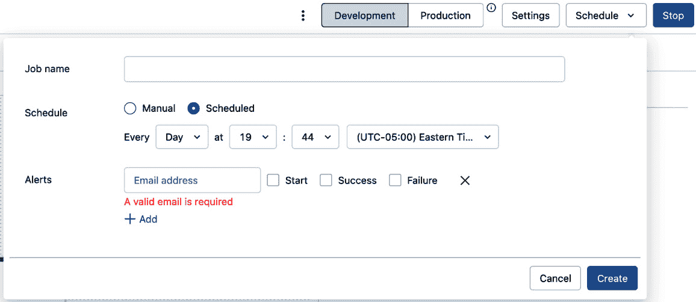
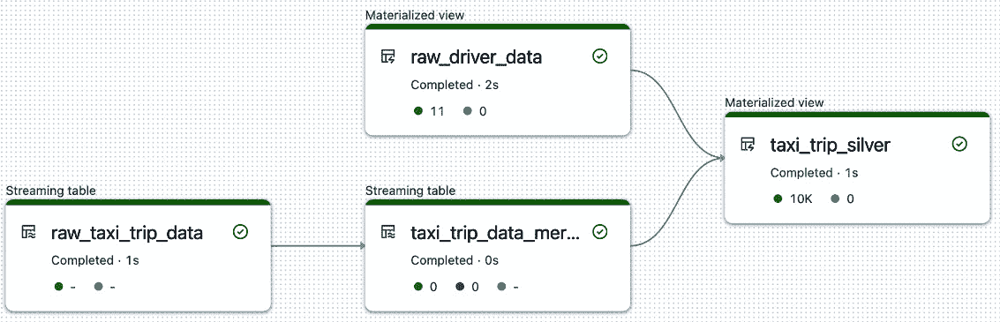

# 第二章：使用 Delta Live Tables 应用数据转换

在本章中，我们将深入探讨 **Delta Live Tables**（**DLT**）如何简化从各种输入源获取数据的过程，无论是落在云存储中的文件，还是连接到外部存储系统，如**关系数据库管理系统**（**RDBMS**）。接着，我们将探讨如何使用**APPLY CHANGES**命令高效且准确地将输入数据源的更改应用到下游数据集。最后，本章将以深入了解高级数据流水线设置作为结尾。

总结一下，在本章中，我们将涵盖以下主要内容：

+   从输入源获取数据

+   应用下游表的更改

+   将数据集发布到 Unity Catalog

+   数据流水线设置

+   实践操作——应用 SCD 类型 2 更改

# 技术要求

为了跟随本章内容，建议拥有 Databricks 工作区权限，以创建通用集群和 DLT 流水线，并使用集群策略。还建议拥有 Unity Catalog 权限，以创建和使用目录、模式和表。所有代码示例可以从本章的 GitHub 仓库下载，网址为 https://github.com/PacktPublishing/Building-Modern-Data-Applications-Using-Databricks-Lakehouse/tree/main/chapter02。本章将使用**Core**产品版本创建并运行多个新的笔记本和 DLT 流水线。预计这些流水线将消耗约 10–15 **Databricks** **Units**（**DBUs**）。

# 从输入源获取数据

DLT 简化了从各种输入源获取数据的过程。例如，DLT 可以高效处理全天候落入云存储位置的新文件，通过连接到外部存储系统（如关系数据库）摄取结构化数据，或读取可以缓存到内存中的静态参考表。让我们看看如何使用 DLT 持续摄取云存储位置中到达的新数据。

## 使用 Databricks Auto Loader 获取数据

Databricks 数据智能平台的一个关键特性是名为**Auto Loader**的功能，它是一个简单而强大的数据摄取机制，用于高效地从云存储中读取输入文件。可以通过使用**cloudFiles**数据源，在 DataFrame 定义中引用 Auto Loader。例如，以下代码片段将使用 Databricks Auto Loader 功能，从存储容器中获取新到的 JSON 文件：

```py
df = (spark.readStream
      .format("cloudFiles")
      .option("cloudFiles.format", "json")
      .option("cloudFiles.schemaLocation", schema_path)
      .load(raw_data_path))
```

自动加载器可以扩展到高效处理云存储中的数十亿文件。Databricks 自动加载器支持摄取存储在 CSV、JSON、XML、Apache Parquet、Apache Avro 和 Apache Orc 文件格式中的文件，以及文本和二进制文件。此外，在前面的代码片段中您可能注意到的一点是，并没有为输入流指定模式定义，而是指定了目标模式位置。这是因为自动加载器将自动推断数据源模式，并在单独的存储位置跟踪模式定义的更改。在幕后，自动加载器将对最多前 1000 个云文件对象进行采样，以推断云文件源的模式结构。对于诸如 JSON 这样的半结构化格式，其中模式可以随时间变化，这可以通过不需要维护最新模式定义的数据工程团队来减轻巨大负担。

## 结构化流中的可扩展性挑战

传统上，使用 Spark 结构化流来摄取新文件的数据管道，在数据量增长到 GB 甚至 TB 时很难扩展。当新文件被写入云存储容器时，结构化流将执行目录列表。对于大型数据集（即由数百万个或更多文件组成的数据集），仅目录列表过程就将耗费大量时间。此外，云提供商还会对这些目录列表调用评估 API 费用，增加总体云提供商费用。对于已经处理过的文件，这种目录列表既昂贵又低效。

Databricks 自动加载器支持两种云文件检测模式 – 通知模式和传统目录列表模式。在通知模式下，自动加载器通过在幕后自动部署更可扩展的架构完全避开了这种昂贵的目录列表过程。仅需几行 Python 代码，Databricks 预先配置了后端云服务，这些服务将自动跟踪新落地在云存储中的文件，以及已经处理过的文件。



图 2.1 – 在通知模式下，Databricks 自动加载器使用事件流来跟踪云存储中新的未处理文件

让我们通过一个示例来演示自动加载器功能的工作方式，配置为通知模式，它将有效地一起处理新到达的云文件对象：

1.  过程始于 Databricks 自动加载器监听特定云存储路径，以获取新文件对象创建事件，也称为**PUT**事件，名称源自用于创建对象的 HTTP 动词。

1.  当创建一个新文件对象时，关于该新文件的元数据将持久化到键值存储中，该存储作为检查点位置，以防系统故障。

1.  接下来，关于文件对象的信息将发布到事件流，**cloudFiles**数据源将从中读取。

1.  在从事件流读取时，Databricks 中的 Auto Loader 进程将仅获取与云存储中新未处理文件对象相关的数据。

1.  最后，Auto Loader 进程将更新键值存储，标记新文件在系统中已被处理。

这种基于通知的文件处理实现避免了昂贵且低效的目录列出过程，确保该过程能够从故障中恢复，并且文件被精确处理一次。

## 在 DLT 中使用 Auto Loader

Databricks Auto Loader 可用于在 DLT 管道中创建流式表。现在我们了解了幕后发生的事情，构建一个能够扩展到数十亿个文件的强大且可扩展的流式表，只需要几行 Python 代码。事实上，对于那些向云存储中追加新文件的数据源，建议始终使用 Auto Loader 来摄取数据。让我们从前面部分获取一个流式 DataFrame 定义，并将其与 DLT 数据集注解结合起来，在我们的管道中定义一个新的数据流：

```py
@dlt.table(
    comment="Raw cloud files stream of completed taxi trips"
)
def yellow_taxi_events_raw():
    return (spark.readStream
            .format("cloudFiles")
            .option("cloudFiles.format", "json")
            .option("cloudFiles.path", schema_path)
            .load(raw_landing_zone_path))
```

需要注意的是，在前面的代码片段中，我们提供了两个云存储路径。第一个存储路径，**schema_path**，指的是云存储路径，在该路径中将写入架构信息和键值存储。第二个存储路径，**raw_landing_zone_path**，指向外部数据源将写入的新未处理文件的位置。

重要说明

推荐使用由 Unity Catalog 管理的外部位置，以便在 Databricks 工作区内的不同用户和组之间强制执行精细的数据访问控制。

现在我们有了一个可靠高效的方式从云存储输入源中摄取原始数据，我们需要将数据进行转换，并将输出应用到数据管道中的下游数据集。让我们看看 DLT 框架如何使得应用下游变更变得简单直接。

# 将变更应用到下游表

传统上，Delta Lake 提供了一个**MERGE INTO**命令，允许变更数据捕获通过在特定条件下匹配来合并到目标表中。然而，如果新数据恰好是无序的，合并后的变更会导致错误的结果，进而产生不准确和误导的输出。为了解决这个问题，数据工程团队需要构建复杂的对账过程来处理无序数据，这为数据管道增加了额外的管理和维护层。

## APPLY CHANGES 命令

DLT 提供了一个新的 API，可以自动将变更应用到下游表格，甚至可以基于一个或多个序列列处理乱序数据。**慢变维**（**SCDs**）是传统数据仓库中的维度，允许追踪数据的当前和历史快照。DLT 使数据工程团队能够在数据管道中更新下游数据集，以反映上游数据源中的变更。例如，DLT 允许用户捕获 SCD 类型 1（不保留先前行历史）和 SCD 类型 2（保留行的历史版本）。

DLT 提供了 Python API 和 SQL 语法来应用变更数据捕获：

+   **APPLY CHANGES** – 用于使用 SQL 语法编写的数据管道

+   **apply_changes()** – 用于使用 Python 编写的数据管道

假设我们有一个表格，用来记录来自智能温控器的室内温度，且需要保留温度更新的历史记录。以下代码片段将使用 **apply_changes()** API 将 SCD 类型 2 变更应用到我们的数据管道输出表格：

```py
import dlt 
import pyspark.sql.functions as F
dlt.create_streaming_table("iot_device_temperatures")
dlt.apply_changes(
    target = "iot_device_temperatures",
    source = "smart_thermostats",
    keys = ["device_id"],
    sequence_by = F.col("sequence_num"),
    apply_as_deletes = F.expr("operation = 'DELETE'"),
    except_column_list = ["operation", "sequence_num"],
    stored_as_scd_type = "2"
)
```

此外，DLT 将捕捉在完成 **apply_changes()** 命令时应用的数据变更的高级操作指标。例如，DLT 系统将跟踪每次执行 **apply_changes()** 命令时更新、插入或删除的行数。

## DLT 对账过程

在后台，DLT 将创建两个数据集对象，以便准确地将表格变更应用到数据管道数据集中。第一个数据对象是一个隐藏的、后端的 Delta 表，它包含了所有变更的完整历史记录。这个数据集用于执行一个对已处理的乱序行更新能够进行处理的对账过程。此外，这个后端表的名称将使用 **APPLY CHANGES** 或 **apply_changes()** 函数调用中提供的名称参数，并与 **__apply_changes_storage_** 字符串进行连接。

例如，如果表格的名称是 **iot_readings**，则会创建一个名为 **__apply_changes_storage_iot_readings** 的后端表。

这个特定的表只有在 DLT 管道将数据集发布到传统的 Hive Metastore 时才会可见。然而，Unity Catalog 会将这些低级细节抽象化，最终用户无法通过 Catalog Explorer UI 查看该数据集。不过，该表可以通过笔记本或在 SQL 仓库上执行的查询进行 *查询*。

其次，DLT 系统将使用 **apply_changes()** 函数提供的名称创建另一个数据集 – 视图。该视图将包含应用所有变更后表格的最新快照。视图将使用表键指定的列或列组合来唯一标识后端表格中的每一行。然后，DLT 使用 **apply_changes()** 函数中 **sequence_by** 参数指定的列或列序列来为每个唯一行排序表格变更，选择出最新的行变更以计算视图的结果集。



图 2.2 – DLT 创建后端表格来应用表格变更，并创建一个视图来查询最新数据。

正如您所看到的，DLT 使得在源中发生的数据更改保持与下游数据源一致非常简单。只需进行几个参数更改，您就可以使用强大的 **apply_changes()** API 来应用 SCD 数据。

现在我们了解了如何利用 DLT 框架来定义数据转换并将更改应用于下游表格，让我们把注意力转向如何在我们的管道数据集上加强数据治理。

# 将数据集发布到 Unity Catalog

DLT 提供两种存储数据集的方法在 Databricks 数据智能平台上 – 传统的 Hive Metastore 和 Unity Catalog。

如 *第一章* 所述，Unity Catalog 是一个集中式管理存储库，跨所有特定全球区域内的您的 Databricks 工作区。因此，数据访问策略可以在一个集中位置定义一次，并且将一致地应用于整个组织。

然而，在 DLT 管道的上下文中，这两种存储输出数据集的方法是彼此互斥的 – 也就是说，特定的 DLT 管道不能将某些数据集存储在 Unity Catalog 中，而将其他数据集存储在 Hive Metastore 中。您必须为整个数据管道输出选择单一的元数据存储位置。

## 为什么要将数据集存储在 Unity Catalog 中？

Unity Catalog 是在湖屋中存储数据和查询数据集的新的最佳方法。您可能会选择在数据管道中将数据着陆到 Unity Catalog 而不是 Hive Metastore，原因包括以下几点：

+   数据默认受到保护。

+   有一套与定义数据访问策略的组和用户相一致的访问策略的一致定义，而不是为每个单独的工作区定义数据访问策略。

+   开源技术，无供应商锁定风险。

此外，Unity Catalog 提供了与 Hive 兼容的 API，允许第三方工具与 Unity Catalog 元数据存储集成，就像它是 Hive Metastore 一样。

## 创建一个新的目录

Unity Catalog 和 Hive Metastore 之间的一个主要区别在于，前者在定义表时引入了三层命名空间。父命名空间将指向目录对象。目录是一个逻辑容器，用于存储一个或多个模式，或数据库。

构建新的 DLT 流水线的第一步是定义一个集中的位置来存储输出数据集。在 Unity Catalog 中创建一个新的目录非常简单。可以通过多种方式完成，例如通过 Catalog Explorer UI、使用在笔记本中执行的 SQL 语句，或者使用 Databricks REST API。

我们将使用 Databricks Catalog Explorer UI 来创建一个新的目录：

1.  首先，通过点击导航侧边栏中的 **Catalog Explorer** 标签，导航到 Catalog Explorer。

1.  接下来，点击 **创建** **目录** 按钮。

1.  给目录起个有意义的名字。

1.  选择 **标准** 作为目录类型。

1.  最后，点击 **创建** 按钮来创建新的目录。

## 分配目录权限

如前所述，使用 Unity Catalog 的一个好处是，默认情况下你的数据是受到保护的。换句话说，除非明确允许，否则默认情况下拒绝访问存储在 Unity Catalog 中的数据。要在新创建的目录中创建新表，我们需要授予创建和操作新表的权限。

重要提示

如果你是目标目录和模式对象的创建者和所有者，并且是 DLT 流水线的创建者和所有者，那么你不需要执行以下 **GRANT** 语句。**GRANT** 语句旨在展示在典型的 Unity Catalog 元存储中跨多个小组和用户共享数据资产时所需的权限类型。

首先，让我们授予使用目录的权限。在一个新的笔记本中，执行以下 SQL 语法来授予使用新创建的目录的权限，其中 **my_user** 是 Databricks 用户的名字，**chp2_transforming_data** 是在前面的示例中创建的目录名称：

```py
%sql
GRANT USE CATALOG, CREATE SCHEMA ON CATALOG `chp2_transforming_data` TO `my_user`;
```

接下来，我们需要创建一个模式，用来存储来自 DLT 流水线的输出数据集。在相同的笔记本中，执行以下 SQL 语句来创建一个新的模式：

```py
%sql
USE CATALOG `chp2_transforming_data`;
CREATE SCHEMA IF NOT EXISTS `ride_hailing`;
USE SCHEMA `ride_hailing`;
```

执行以下语句来授予在新创建的模式中创建物化视图的权限：

```py
%sql
GRANT USE SCHEMA, CREATE TABLE, CREATE MATERIALIZED VIEW ON SCHEMA `ride_hailing` TO `my_user`;
```

到现在为止，你应该能够看到 Unity Catalog 如何简单而强大地将一致的数据安全性应用到你的数据流水线数据集，提供数据管理员多种选项来强制执行组织内的数据集权限。接下来，让我们关注如何配置 DLT 流水线的一些高级功能和设置。

# 数据流水线设置

到目前为止，我们只讨论了如何使用 DLT 框架声明表、视图和对到达数据的转换。然而，执行特定数据流水线的计算资源在将最新数据加载到湖仓中也起着重要作用。

本节将讨论不同的数据管道设置，以及如何在运行时控制计算资源，例如集群。

以下管道设置可以通过 DLT UI 或 Databricks REST API 直接配置。

## DLT 产品版本

数据管道产品版本告诉 DLT 框架你的数据管道将使用哪些功能集。更高版本的产品包含更多功能，因此，Databricks 会评估更高的价格（以 DBU 计费）。

Databricks 为 DLT 管道提供了三种类型的产品版本，按功能集的多少从少到多排列：

1.  **基础版**：**基础版**是最基本的产品版本。此产品版本仅适用于将新数据追加到流表的流式工作负载。数据期望（数据质量执行将在下一章讨论）和应用变更数据捕获的工具在此版本中不可用。

1.  **专业版**：**专业版**产品版本是比 Core 版本更高的版本。此产品版本专为流式工作负载设计，能够向流表中追加新数据，并使用**APPLY** **CHANGES**命令应用更新和删除操作。然而，该产品版本不提供数据质量期望。

1.  **高级版**：**高级版**产品版本是功能最为丰富的版本。此产品版本支持数据质量期望，同时支持向流表中追加新数据，并对上游数据源中发生的插入、更新和删除操作进行处理。

有时你的需求可能会随着时间的推移发生变化。例如，你可能需要严格的数据质量执行，以防止第三方**商业智能**（**BI**）报告工具在下游发生故障。在这种情况下，你可以随时更新现有 DLT 管道的产品版本，使你的数据管道能够根据功能需求和预算的变化进行调整。

## 管道执行模式

DLT 提供了一种方式，通知系统数据管道的更改是实验性的。这个功能被称为数据管道环境模式。共有两种环境模式——**开发**和**生产**。它们的主要区别在于计算资源的行为。

在开发环境模式下，如果遇到故障，数据流任务不会自动重试。这允许数据工程师在临时开发周期中干预并修正任何程序性错误。

此外，在开发模式下发生故障时，执行数据管道更新的集群将保持运行。这允许数据工程师查看集群的驱动日志和集群指标，同时防止每次管道执行时集群的重新配置和重新初始化运行时，这个过程在不同云服务商中可能需要 10 到 15 分钟才能完成。预计会有较短且迭代的开发和测试周期，通过保持集群的持续运行，帮助数据工程师更顺利地完成开发生命周期。

数据管道环境模式可以通过点击 DLT UI 中数据管道最顶部导航栏的环境模式切换开关来设置。


图 2.3 – DLT 管道执行模式可以通过 UI 中的切换开关进行设置

或者，环境模式也可以通过 Databricks REST API 来设置。在下面的代码示例中，我们将使用 Python **requests** 库发送一个 **PUT** 请求到 Databricks DLT 管道 REST API，设置 DLT 管道的开发模式。请注意，终端 URL 会根据你的 Databricks 工作区部署而有所不同，下面的代码只是一个示例：

```py
import requests
response = requests.put(
    "https://<your_databricks_workspace>/api/2.0/pipelines/1234",
    headers={"Authorization": f"Bearer {api_token}"},
    json={
        "id": "1234",
        "name": "Clickstream Pipeline",
        "storage": "/Volumes/clickstream/data",
        "clusters": [{
            "label": "default",
            "autoscale": {
                "min_workers": 1,
                "max_workers": 3,
                "mode": "ENHANCED"}
        }],
        "development": True,
        "target": "clickstream_data",
        "continuous": False
    }
)
```

## Databricks 运行时

DLT 是 Databricks 数据智能平台上的一个无版本产品功能。换句话说，Databricks 管理数据管道所使用的集群底层**Databricks 运行时**（**DBR**）。

此外，Databricks 会自动升级数据管道集群，以使用最新的稳定运行时版本。运行时升级非常重要，因为它们引入了错误修复、新的性能特性和其他增强功能。这意味着你的数据管道将执行得更快，从而节省更多时间和金钱，帮助你更高效地转换最新的数据到湖仓中。

你甚至可能迫不及待地想要测试最新的性能特性。每个 DLT 管道都有一个**通道**设置，允许数据工程师选择两种通道选项之一——**当前**和**预览**。预览通道允许数据工程师配置数据管道，使用包含新性能特性和其他增强功能的最新实验性运行时进行执行。然而，由于这是一个实验性运行时，不建议在生产环境中使用 Databricks 运行时的预览通道。相反，建议使用“当前”选项，选择 Databricks 运行时的最新稳定版本。

此外，DLT 系统将主动捕获在生产模式中部署的数据管道的运行时异常。例如，如果新的运行时版本引入了运行时错误（也称为运行时回归）或库版本冲突，DLT 将尝试将集群降级到一个已知能够成功执行数据管道的较低版本，并将重试执行管道更新。

以下图表展示了自动运行时升级异常处理。



图 2.4 – 在生产模式下，DLT 将尝试使用较低版本的 Databricks 运行时重新运行失败的数据管道执行。

## 管道集群类型

每个数据管道将有两个相关的集群——一个用于执行数据集更新，一个用于执行表维护任务。

这两种类型的集群的设置在管道的管道设置中通过 JSON 集群配置定义表达。可以在管道设置中表达三种类型的集群配置——更新集群配置、维护集群配置，以及作为默认集群配置的第三种选择，适用于更新和维护集群的通用设置。该 JSON 配置的架构与 Databricks 集群 REST API 的架构非常相似。

除了配置集群的物理属性，如工作节点数量和虚拟机实例类型外，集群配置还可以包含高级的 Spark 配置。让我们一起浏览一个示例集群配置。

以下示例包含两个独立的集群配置——一个默认集群配置，将应用于更新和维护 DLT 集群；另一个集群配置，仅应用于更新 DLT 集群。

在第一个集群配置中，我们将使用**标签**属性指定集群配置为默认集群配置。这意味着该集群配置将应用于用于更新数据集的 DLT 集群以及用于运行表维护任务的集群。接下来，我们将为 DLT 集群启用自动扩展，指定所有集群将从一个虚拟机开始部署，但随着处理需求的增加，可以扩展到最多五个虚拟机。我们还将指定使用增强版的集群自动扩展算法。

在第二组集群配置中，我们将指定集群配置应仅应用于 DLT 更新集群，仍然使用**标签**属性。接着，我们将指定为更新集群的驱动节点和工作节点配置哪些实例类型。对于负责协调任务的驱动节点，我们将指定使用 **i4i.2xlarge** EC2 实例类型，而所有工作节点将使用 **i4i.xlarge** EC2 实例类型。最后，我们还将启用 Databricks Runtime 性能特性，称为 **自动优化 Shuffle**（**AOS**）。AOS 将在运行时自动调整 Spark shuffle 分区的数量，从而在广泛的 Spark 转换操作（如连接、聚合和合并操作）期间提高性能。

重要说明

在以下示例中，我们选择使用虚拟机实例来说明 AWS 云的集群配置设置。 然而，如果您的工作空间位于不同的云服务提供商上，我们建议使用类似大小的 Delta 缓存加速 VM 实例——驱动节点为八个核心，工作节点为四个核心（[`docs.databricks.com/en/optimizations/disk-cache.html`](https://docs.databricks.com/en/optimizations/disk-cache.html)）：

```py
{
    "clusters": [{
        "label": "default",
        "autoscale": {
            "min_workers": 1,
            "max_workers": 5,
            "mode": "ENHANCED"}
    },
    {
        "label": "updates",
        "node_type_id": "i4i.xlarge",
        "driver_node_type_id": "i4i.2xlarge",
        "spark_conf": {"spark.sql.suffle.partitions": "auto"}
    }]
}
```

如您所见，集群配置是一个强大的工具，提供了数据工程师应用通用集群设置、针对特定集群设置或两者结合的能力。这是为特定工作负载调整集群并为 DLT 管道提供额外性能的绝佳方式。

## 无服务器计算与传统计算

数据管道可以使用配置了传统计算或无服务器计算的集群来执行。

传统计算为用户提供了最大的计算资源控制。然而，使用传统计算时，用户需要管理底层集群的多个方面。例如，数据工程团队需要配置集群属性，如自动扩展行为、是否使用 Photon 引擎或传统的 Catalyst 引擎在 Spark 中执行管道，以及可选的集群标签。此外，传统计算允许用户对为集群的驱动节点和工作节点选择的虚拟机实例类型拥有完全控制权。正如我们在前一部分看到的那样，可以在管道设置中通过在 JSON 配置中列出特定实例类型来指定虚拟机实例类型。例如，以下集群配置指定了 i4i.xlarge 和 i4i.2xlarge EC2 实例类型用于 DLT 管道中的所有更新集群：

```py
{
    "clusters": [{
        "label": "updates",
        "node_type_id": "i4i.xlarge",
        "driver_node_type_id": "i4i.2xlarge"
    }]
}
```

然而，配置为使用无服务器计算的 DLT 管道将会抽象掉所有底层集群设置，例如集群虚拟机实例类型、工作节点数量以及自动扩展设置。正如*无服务器计算*这一名称所示，计算资源将由 Databricks 在 Databricks 云提供商帐户中进行配置和管理。在后台，Databricks 将维持一个预配置计算资源池，以便集群配置快速完成。一旦数据管道的更新被触发，DLT 系统将在 Databricks 云提供商帐户中创建一个逻辑网络，并初始化一个集群来执行管道的数据流图。Databricks 将自动选择虚拟机实例类型、Photon 执行引擎以及自动扩展行为。

作为一层额外的安全性，逻辑网络之间或与外部互联网之间不允许通信，并且计算资源不会在无服务器工作负载之间重复使用。当数据管道处理完成并且集群已终止时，计算资源将被释放回云提供商并销毁。

你可能会选择无服务器计算来消除维护和更新多个集群策略的基础设施开销，同时也能在应对处理需求激增时，利用快速集群配置。此外，无服务器执行还可以启用其他平台功能，例如在连续处理模式下更新物化视图（处理模式将在下一节中介绍）。

## 加载外部依赖项

数据管道可能需要加载外部依赖项，如帮助工具或第三方库。因此，DLT 提供了三种方式来安装数据管道的运行时依赖项：

+   从笔记本单元格中，使用**%pip**魔法命令（[`docs.databricks.com/en/notebooks/notebooks-code.html#mix-languages`](https://docs.databricks.com/en/notebooks/notebooks-code.html#mix-languages)）

+   从工作区文件或 Databricks 仓库加载模块

+   使用集群初始化脚本

流行的 Python 包管理器 **pip** 可以通过 **%pip** Databricks 魔法命令，从数据管道源代码中的任何笔记本安装 Python 模块。**%pip** 是在数据管道中安装库依赖项的最简单方法。在运行时，DLT 系统会检测到所有包含 **%pip** 魔法命令的笔记本单元，并首先执行这些单元，然后再进行管道更新。此外，声明的数据管道源代码中的所有笔记本将共享一个虚拟环境，因此库依赖项将在一个隔离的环境中一起安装，并对数据管道源代码中的所有笔记本全局可用。相反，数据管道中的笔记本不能安装相同 Python 库的不同版本。例如，以下代码示例将使用 **pip** 包管理器安装流行的库 **numpy**、**pandas** 和 **scikit-learn**，以及来自 Databricks **Volumes** 位置的自定义 Python 库：

```py
%pip install numpy pandas scikit-learn /Volumes/tradingutils/tech-analysis-utils-v1.whl
```

最佳实践是，这些依赖项安装语句应放在笔记本的顶部，以便能够更快速地引用管道依赖项。

另外，库依赖项也可以作为 Python 模块安装。在这种情况下，库可以作为工作区文件或从 Databricks Repo 安装并加载到 DLT 管道中，前提是该模块使用 Git 提供者（如 GitHub 或 Bitbucket）进行版本控制。

最后，集群初始化脚本也可以用来安装外部依赖项。这些脚本在集群配置好虚拟机并安装好 Databricks 运行时后运行，但在数据管道开始执行之前。例如，这种类型的依赖项安装可能适用于在所有数据工程平台上需要一致安装公司范围的库的场景。

重要说明

你可能已经注意到，前面的选项仅涵盖了安装 Python 依赖项。DLT 不支持安装 JVM 库，因为它仅提供 Python 和 SQL 编程接口。

## 数据管道处理模式

数据管道处理模式决定了管道内的表和物化视图更新的频率。DLT 提供了两种管道处理模式——**触发式**处理模式和**连续**处理模式。

触发式处理模式将在管道内更新数据集一次，然后立即终止为运行管道而配置的集群，将计算资源释放回云提供商，从而终止额外的云费用产生。顾名思义，触发式处理模式可以以临时的方式运行，并会在触发事件发生时立即执行，例如用户在 DLT 用户界面上点击按钮或调用 Databricks REST API。



图 2.5 – 一个触发的数据管道将刷新每个数据集，然后立即终止集群

触发处理模式也可以通过 **cron** 调度触发运行，调度可以通过 UI 或 REST API 进行配置。如 *图 2.6* 所示，点击 DLT UI 中的 **Schedule** 下拉按钮，点击 **Add schedule** 按钮，最后选择触发管道更新的时间，即可创建一个循环调度。每天，管道中的数据集将在预定时间刷新。



图 2.6 – DLT 管道可以根据重复的计划安排来刷新数据集

相反，持续处理模式将配置计算资源来刷新管道中的数据集，但会持续执行，处理数据并在数据从源端到达时刷新表格和物化视图。持续处理管道将保持计算资源运行，并持续产生云成本，换取最小的数据陈旧性。当数据延迟优先于云计算成本时，应选择这种类型的管道模式。

幸运的是，管道处理模式和其他管道设置可以在数据管道的生命周期内进行更新，使得管道能够灵活应对处理延迟和计算成本。例如，经济衰退可能迫使一个组织优先考虑节省成本而非延迟，但之后可能又会重新强调延迟。

让我们一起使用本章所学的所有内容，构建一个 DLT 管道，将 SCD 类型 2 的变更应用到数据管道中的下游数据集。

# 实践练习 – 应用 SCD 类型 2 的变更

在本次实践练习中，我们将使用 Databricks Auto Loader 增量加载写入云存储账户原始着陆区的 JSON 文件。接下来，我们将转换下游列并连接从外部 Postgres 数据库中获取的数据。

重要提示

从远程 Postgres 数据库读取数据是可选的。此步骤旨在展示 Databricks 数据智能平台的灵活性，向你展示如何轻松地从远程关系型数据库管理系统（RDBMS）读取结构化数据，并将其与半结构化数据结合。如果你没有 Postgres 数据库，我们为你提供了一个包含出租车司机信息的静态 DataFrame。

如果你还没有这样做，你需要从本章的 GitHub 仓库克隆随附的笔记本，仓库地址是：[`github.com/PacktPublishing/Building-Modern-Data-Applications-Using-Databricks-Lakehouse/tree/main/chapter02`](https://github.com/PacktPublishing/Building-Modern-Data-Applications-Using-Databricks-Lakehouse/tree/main/chapter02)。

我们首先导入数据生成器笔记本，名为**生成模拟出租车行程数据**。该笔记本将创建一个包含虚拟出租车行程信息的模拟数据集。一旦模拟数据集生成，该笔记本会将出租车行程数据集存储为多个 JSON 文件到我们的云存储账户中，之后这些文件将由我们的 DLT 管道摄取。将出租车行程数据生成器笔记本附加到通用集群，并执行所有单元格以生成模拟数据。

接下来，让我们创建我们的 DLT 管道定义。在左侧边栏点击工作区表格，点击**添加**下拉菜单，选择**笔记本**，创建一个新的笔记本。将笔记本重命名为一个有意义的名称，例如**出租车行程 DLT 管道**。我们将在这个笔记本中声明 DLT 管道的数据集和转换。

接下来，导入 DLT Python 模块，以访问 DLT 函数装饰器来定义数据集和依赖关系，以及 PySpark 函数模块：

```py
import dlt
import pyspark.sql.functions as F
```

我们需要创建一个流式表格，来摄取已写入云存储着陆区的出租车行程 JSON 数据。我们首先定义一个新的流式表格，使用**cloudFiles**数据源监听原始着陆区中的新文件事件：

```py
# This location keeps track of schema changes
SCHEMA_LOCATION = "/tmp/chp_02/taxi_data_chkpnt"
# This location contains the raw, unprocessed trip data
RAW_DATA_LOCATION = "/tmp/chp_02/taxi_data/"
@dlt.table(
    name="raw_taxi_trip_data",
    comment="Raw taxi trip data generated by the data generator notebook"
)
def raw_taxi_trip_data():
    return (
        spark.readStream.format("cloudFiles")
        .option("cloudFiles.format", "json")
        .option("cloudFiles.schemaLocation", SCHEMA_LOCATION)
        .load(RAW_DATA_LOCATION) )
```

随着新的出租车行程数据到达，我们的 DLT 管道将通过 Auto Loader 高效加载数据，仅获取与未处理文件相关的信息。

现在我们已经摄取了原始出租车行程数据，可以开始将记录的更改应用到下游表中。让我们首先定义一个目标流式表格，用于应用由模拟出租车行程数据源报告的 SCD 类型 2 更改：

```py
# Define a new streaming table to apply SCD Type 2 changes
dlt.create_streaming_table("taxi_trip_data_merged")
```

接下来，我们将利用之前讲解过的**apply_changes()**函数来指示 DLT 系统如何应用更改，哪些列应在下游表中省略，以及使用哪种 SCD 类型。请将以下函数调用添加到笔记本中：

```py
dlt.apply_changes(
    target="taxi_trip_data_merged",
    source="raw_taxi_trip_data",
    keys = ["trip_id"],
    sequence_by = F.col("sequence_num"),
    apply_as_deletes = F.expr("op_type = 'D'"),
    except_column_list = ["op_type", "op_date", "sequence_num"],
    stored_as_scd_type = 2
)
```

在最后一步，我们将对上游表中的一些列进行转换，例如将**浮动**数据类型的列四舍五入到小数点后两位，以及将**trip_distance**列拆分为一个以英里为单位的列和另一个以千米为单位的列。接下来，我们将连接到远程 Postgres 数据库并读取最新的出租车司机信息。如果你可以访问 Postgres 数据库，你可以导入标题为**生成 Postgres 表**的笔记本并执行单元格来生成一个测试用的表格。我们的最终流式表将丰富我们的数据并连接最新的出租车司机参考数据，其外观如下所示：

```py
@dlt.table(
    name="raw_driver_data",
    comment="Dataset containing info about the taxi drivers"
)
def raw_driver_data():
    postgresdb_url = f"jdbc:postgresql://{POSTGRES_HOSTNAME}:{POSTGRES_PORT}/{POSTGRES_DB}"
    conn_props = {
        "user": POSTGRES_USERNAME,
        "password": POSTGRES_PW,
        "driver": "org.postgresql.Driver",
        "fetchsize": "1000"
    }
    return (
        spark.read
            .jdbc(postgresdb_url,
                  table=POSTGRES_TABLENAME,
                  properties=conn_props))
@dlt.table(
    name="taxi_trip_silver",
    comment="Taxi trip data with transformed columns"
)
def taxi_trip_silver():
    return (
        dlt.read("taxi_trip_data_merged")
            .withColumn("fare_amount_usd",
                        F.round(F.col("trip_amount"), 2))
            .withColumn("taxes_amount_usd",
                        F.round(F.col("trip_amount") * 0.05, 2))
            .withColumn("trip_distance_miles",
                        F.round(F.col("trip_distance"), 2))
            .withColumn("trip_distance_km",
                        F.round(F.col("trip_distance")
                        * 1.60934, 2)) # 1 mile = 1.60934 km
    ).join(
        dlt.read("raw_driver_data"),
        on="taxi_number",
        how="left"
    )
```

在最后一个函数定义中，我们使用**dlt.read()**函数来检索早期的数据集声明。在后台，DLT 框架将数据集添加到数据流图中，创建**taxi_trip_data_merged**和**taxi_trip_silver**数据集之间的依赖关系。

现在，是时候创建我们的 DLT 管道了。将前一步的笔记本附加到通用集群并执行笔记本单元格。当提示时，点击蓝色的**创建管道**按钮打开**管道**UI 页面。为管道起一个有意义的名称，比如**出租车行程数据管道**。由于我们使用了**apply_changes()**函数，因此我们需要选择**高级**产品版本。确保选择了**触发**处理模式单选按钮。为了查看由**apply_changes()**函数创建的后台表格，选择 Hive Metastore 作为存储位置，并提供一个目标模式来存储管道数据集。接受其余的默认值，然后点击**创建**按钮来创建管道。

最后，通过点击 DLT UI 中的**开始**按钮来运行新创建的管道。很快，你会看到一个数据流图，该图会从原始 JSON 数据中获取更改，丰富下游列，并将来自 Postgres 数据库的远程结构化数据进行连接。



图 2.7 – 由 DLT 系统生成的数据流图

当模拟出租车行程数据源中的数据发生变化时，DML 更改的完整历史记录会被采集并应用到目标**taxi_trip_data_merged**表。我们数据管道的输出将是一个精心策划的流式表，包含有关出租车行程、出租车司机和出租车车辆的信息。最棒的是，只需几行代码，我们就部署了一个完全可扩展、成本高效的数据管道，可以轻松处理数十亿个文件。

# 总结

在这一章中，我们探讨了 DLT 如何通过抽象化处理 Spark 中数据的许多低级细节，简化了我们的数据管道。我们看到 Databricks Auto Loader 如何解决了从云存储中流式处理文件的可扩展性问题。只需几行代码，我们就部署了一个可扩展的后端系统，能够在云存储位置有新文件出现时立即高效读取。当涉及到将数据变更应用到管道中的下游数据集时，DLT 框架再次简化了数据对账工作，特别是在数据事件发布延迟或乱序的情况下。我们还看到，只需在**apply_changes()** API 中做几个参数调整，就能应用慢变维度。最后，我们揭示了数据管道设置的细节，根据计算需求和我们在数据管道中所需的 DLT 功能集优化了管道的计算过程。我们还看到 DLT 如何自动处理管道故障，主动采取措施并尝试修复某些运行时异常。

在下一章，我们将探讨如何在分布式账本技术（DLT）中使用*期望值*来强制执行数据质量规则，确保数据在每一跳的传输过程中都符合要求，并在数据质量规则被违反时采取相应的行动。
