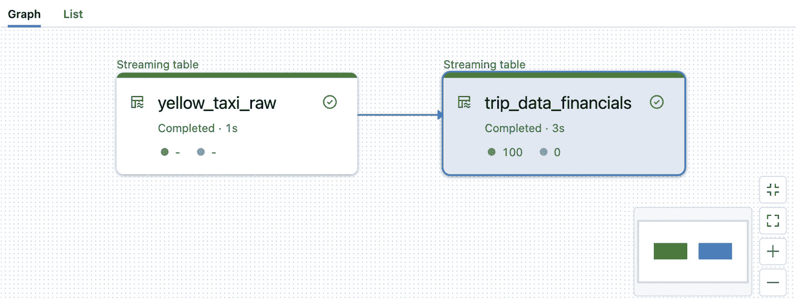
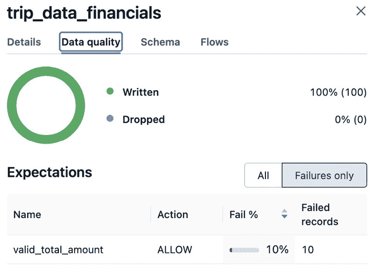

# 第三章：使用 Delta Live Tables 管理数据质量

本章介绍了几种在数据管道中管理数据集数据质量的技术。我们将介绍 **Delta Live Tables**（**DLT**）中的 **expectations**，这是一种在将数据合并到下游表之前，强制执行某些数据质量约束的方法。稍后我们将探讨一些更高级的技术，例如将不良数据隔离以供人工干预。接下来，我们还将展示如何解耦约束，以便可以由组织中非技术人员单独管理。到本章结束时，你应该能清楚地了解如何采取措施确保湖仓中数据集的数据完整性，并采取适当的行动处理不符合预期标准的数据。

本章将覆盖以下主题：

+   在 Delta Lake 中定义数据约束

+   使用临时数据集验证数据处理

+   期望介绍

+   实践练习：编写你的第一个数据质量期望

+   对失败的期望采取行动

+   应用多个数据质量期望

+   将期望与 DLT 管道解耦

+   实践练习 – 隔离低质量数据进行修正

# 技术要求

为了跟随本章的内容，建议拥有 Databricks 工作区权限，以创建通用集群和使用集群策略创建 DLT 管道。还建议拥有 Unity Catalog 权限，以创建和使用目录、模式和表。所有代码示例可以从本章的 GitHub 仓库下载，网址为 [`github.com/PacktPublishing/Building-Modern-Data-Applications-Using-Databricks-Lakehouse/tree/main/chapter03`](https://github.com/PacktPublishing/Building-Modern-Data-Applications-Using-Databricks-Lakehouse/tree/main/chapter03)。我们将使用纽约市黄出租车数据集，数据集位于 Databricks 文件系统的 **/databricks-datasets/nyctaxi/tripdata/yellow**。本章将创建并运行多个新的笔记本和 DLT 管道，使用 **Advanced** 产品版本。因此，预计这些管道将消耗约 10-20 **Databricks** **Units**（**DBUs**）。

# 在 Delta Lake 中定义数据约束

数据约束是一种有效的方式，用于定义进入 Delta 表之前必须满足的标准。约束是按列定义的，并作为额外的表元数据存储在 Delta 表中。

在 Databricks 数据智能平台中提供了四种不同类型的约束：

+   **NOT NULL**：确保表中某列的数据不为 null。**NOT NULL** 约束最初在 Apache Spark 的 **StructField** 类定义中引入。

+   **检查**：一个布尔表达式，在每一行插入之前，必须评估为**真**。检查约束允许数据工程师强制执行复杂的验证逻辑，确保特定列满足条件。

+   **主键**：确保某一列在表的所有行中具有唯一性。**主键**约束是一种特殊的约束，它仅用于说明，不会强制执行传入的数据。正如我们在接下来的示例中看到的，**非空**约束必须与**主键**约束一起使用。

+   **外键**：建立某一列与另一个表之间的关系。像**主键**约束一样，**外键**约束也是纯粹的说明性约束。

此外，只有**非空**和**检查**约束会强制执行传入的数据。

| **约束** | **强制执行** | **说明性** |
| --- | --- | --- |
| **非空** | ✔️ | ✖️ |
| **检查** | ✔️ | ✖️ |
| **主键** | ✖️ | ✔️ |
| **外键** | ✖️ | ✔️ |

表 3.1 – 数据质量约束可以在 Databricks 数据智能平台上强制执行或不强制执行

重要说明

**主键**约束和**外键**约束要求 Delta 表存储在 Unity Catalog 中，否则将抛出运行时错误。

让我们看看如何使用约束来定义湖仓中两个 Delta 表之间的层级关系。首先，在 Databricks 笔记本中创建一个新的基于 SQL 的笔记本。我们从定义一个子表开始，该表包含有关出租车司机的数据，名为**drivers**，并在**driver_id**列上定义主键。将以下代码片段添加到新的笔记本单元格中：

```py
%sql
CREATE CATALOG IF NOT EXISTS yellow_taxi_catalog;
CREATE SCHEMA IF NOT EXISTS yellow_taxi_catalog.yellow_taxi;
CREATE TABLE yellow_taxi_catalog.yellow_taxi.drivers(
    driver_id INTEGER NOT NULL,
    first_name STRING,
    last_name STRING,
    CONSTRAINT drivers_pk PRIMARY KEY(driver_id));
```

接下来，让我们定义一个父表，**rides**，为**ride_id**列定义主键，并为其添加一个引用**drivers**表的外键。将以下代码片段添加到第一个笔记本单元格下方：

```py
%sql
CREATE TABLE yellow_taxi_catalog.yellow_taxi.rides(
    ride_id INTEGER NOT NULL,
    driver_id INTEGER,
    passenger_count INTEGER,
    total_amount DOUBLE,
    CONSTRAINT rides_pk PRIMARY KEY (ride_id),
    CONSTRAINT drivers_fk FOREIGN KEY (driver_id)
    REFERENCES yellow_taxi_catalog.yellow_taxi.drivers);
```

将新创建的笔记本附加到一个多用途集群，并执行笔记本单元格，以创建父表和子表。最后，让我们在目录资源管理器中导航到新定义的表，并直接从 Databricks 数据智能平台生成**实体关系图**（**ERD**）。在 Databricks 工作区中，点击左侧边栏的**目录资源管理器**。导航到上述示例中的**yellow_taxi_catalog**目录。在 Unity Catalog 中点击定义的模式，然后点击父表。侧边栏将展开，显示有关 Delta 表的元数据。点击标题为**查看关系**的按钮，查看 ERD。


图 3.1 – 数据约束可用于定义 Delta 表之间的主键和外键关系

如前所述，主键和外键约束仅作为信息性约束，并不会强制应用于传入的数据。相反，建议实施额外的保护措施，以确保 Delta 表中主键列的数据完整性。让我们来看一些有效的策略，帮助我们维护在湖仓表中定义的主键列的完整性。

# 使用临时数据集来验证数据处理

正如我们在本节中将看到的，创建视图是一种有效的验证主键列唯一性的方法。此外，我们还可以在 Databricks 数据智能平台中定义警报，通知数据管理员潜在的数据质量问题，以便他们能够采取适当的措施来纠正数据完整性问题。

我们可以利用视图来验证主键列的唯一性。回顾前面部分我们定义的**rides**和**drivers**表。在这个例子中，我们将定义一个视图，用于验证**rides** Delta 表中主键列的唯一性。通过返回到工作区并右键点击打开对话框，创建一个新的查询。选择**新建** | **查询**，在编辑器中打开一个新的查询。接下来，给查询重新命名，起一个有意义的名字，比如**rides_pk_validation_vw**。最后，添加以下查询文本并点击**运行**按钮，验证查询是否按预期运行：

```py
CREATE VIEW yellow_taxi_catalog.yellow_taxi.rides_pk_validation_vw AS
SELECT *
FROM (
    SELECT count(*) AS num_occurrences
    FROM  yellow_taxi_catalog.yellow_taxi.rides
    GROUP BY ride_id
) WHERE num_occurrences > 1
```

结果表明，主键唯一性对 Yellow Taxi Corporation 的下游报告至关重要。让我们在 Databricks 数据智能平台中创建一个新的警报，提醒我们的数据管理员可能存在的数据损坏问题，以便他们能在插入重复主键时采取适当的措施。

首先，让我们创建一个将由警报运行的查询。从侧边栏点击**查询**按钮，再点击**创建查询**按钮，进入 Databricks 数据智能平台中的查询编辑器。将查询重命名为一个有意义的名称，如**Rides 主键唯一性**。输入以下 SQL 文本作为查询主体，点击**保存**按钮，并选择一个工作区文件夹来保存查询。点击**运行**按钮，确保查询成功运行：

```py
SELECT count(*) AS num_invalid_pks
  FROM yellow_taxi_catalog.yellow_taxi.rides_pk_validation_vw;
```

接下来，从侧边栏点击**警报**按钮，进入**警报**界面。然后，点击**创建警报**按钮，开始创建一个新的警报，并在**警报名称**文本框中输入描述性名称，如**无效的 Rides 表主键**。在**查询**下拉菜单中选择我们刚刚创建的查询。勾选**发送通知**复选框，并通过点击**创建警报**按钮接受默认设置。在实际场景中，这可以是一个发送给值班数据工程师的电子邮件链，或其他流行的通知渠道，如 Slack 或 Microsoft Teams。

这个示例在现实世界的数据管道中非常实用。然而，视图需要在每次运行管道时计算最新的表状态，还需要维护通知警报的配置。这需要大量的配置来维护，随着我们向管道中添加更多的表格，这种方式显然无法扩展。如果我们有一种更简单的方法，将数据质量声明作为我们 DLT 管道声明的一部分，会怎样呢？

# 期望介绍

期望是在 DLT 管道中与数据集定义一起定义的数据质量规则。数据质量规则是应用于每条通过特定数据集定义的记录的布尔表达式。表达式必须评估为**True**，才会标记该记录为通过，否则会导致记录失败，表明该记录未通过数据质量验证。

此外，DLT 管道将记录每一行在数据管道中处理时的数据质量指标。例如，DLT 将记录通过数据质量验证的记录数，以及未通过的记录数。

## 期望组合

每个期望由三个主要组成部分组成：描述、布尔表达式和要采取的行动。


图 3.2 – DLT 期望的主要组成部分

期望是通过 DLT 函数装饰器声明的。该函数装饰器指定当某个特定约束或一组约束评估为**False**时应该采取的操作。此外，函数装饰器接受两个输入参数：一个简短的描述，用于描述数据质量约束，以及一个布尔表达式，必须评估为**True**，才能将某一行标记为通过验证。

## 实操练习 – 编写你的第一个数据质量期望

为了熟悉 DLT 语法，让我们通过一个现实世界的例子来编写一个数据管道，模拟一个名为 Yellow Taxi Corporation 的纽约市出租车公司。我们将编写一个简单的数据管道，强制执行一个数据质量约束，适用于我们接收到的 NYC 出租车数据，并在有记录不符合我们数据质量规范时提醒我们。在这个场景中，我们希望确保接收的旅行数据中没有任何负数的总金额，因为我们的出租车司机不可能欠乘客任何钱。

### 生成出租车旅行数据

让我们从登录 Databricks 工作区开始。本练习需要使用附带的 NYC Yellow Taxi 旅行数据生成器，可以从本章的 GitHub 仓库下载。你可以将数据生成器笔记本导入到 Databricks 工作区，或者创建一个新的 Python 笔记本并使用以下代码片段。

首先，我们需要下载 **dbldatagen** Python 库，它将帮助我们随机生成新的出租车行程数据。将以下代码片段添加到您的笔记本中，该代码片段使用 **%pip** 魔法命令来下载该库：

```py
%pip install dbldatagen==0.4.0
```

现在库已经安装完成，让我们定义一个 Python 函数，根据我们的 schema 生成新的出租车行程数据。我们将指定列以记录典型的出租车行程细节，包括乘客数量、车费、行程距离等：

```py
def generate_taxi_trip_data():
    """Generates random taxi trip data"""
    import dbldatagen as dg
    from pyspark.sql.types import (
        IntegerType, StringType, FloatType, DateType
    )
    ds = (
        dg.DataGenerator(spark, name="random_taxi_trip_dataset",
                         rows=100000, partitions=8)
        .withColumn("trip_id", IntegerType(),
                    minValue=1000000, maxValue=2000000)
        .withColumn("taxi_number", IntegerType(),
                    uniqueValues=10000, random=True)
        .withColumn("passenger_count", IntegerType(),
                    minValue=1, maxValue=4)
        .withColumn("trip_amount", FloatType(), minValue=-100.0,
                    maxValue=1000.0, random=True)
        .withColumn("trip_distance", FloatType(),
                    minValue=0.1, maxValue=1000.0)
        .withColumn("trip_date", DateType(),
                    uniqueValues=300, random=True))
    return ds.build()
```

现在我们已经定义了随机生成新行程数据的方法，我们需要定义一个位置来存储这些新数据，以便 DLT 管道处理。 在新的笔记本单元中，让我们在 **Databricks 文件系统**（**DBFS**）上创建一个空目录，用于存储我们的行程数据：

```py
dbutils.fs.mkdirs("/tmp/chp_03/taxi_data")
```

最后，我们需要一种方式将所有内容连接起来。在新的笔记本单元中，添加以下 **for** 循环，该循环将调用 **generate_taxi_trip_data** 函数并将数据写入 DBFS 位置：

```py
import random
max_num_files = 100
for i in range(int(max_num_files)):
    df = generate_taxi_trip_data()
    file_name = f"/tmp/chp_03/taxi_data/taxi_data_{random.randint(1, 1000000)}.json"
    df.write.mode("append").json(file_name)
```

接下来，创建一个通用集群来执行行程数据生成器笔记本。一旦创建了通用集群，导航到新的笔记本并点击 Databricks 数据智能平台顶部导航栏中的集群下拉菜单。选择您创建的集群名称，然后选择 **Attach**，将行程数据生成器笔记本附加到集群并执行所有单元。出租车行程数据生成器将向 DBFS 位置追加几个包含随机生成的行程数据的 JSON 文件。

### 创建一个新的 DLT 管道定义

现在我们已经生成了新数据，让我们为 DLT 管道定义创建另一个新的笔记本。导航到侧边栏的工作区选项卡，深入到您用户的主目录，右键点击并选择 **添加笔记本** 来创建一个新的笔记本。

给新的笔记本起一个有意义的名字，例如 **第三章** **– 强制数据质量**。首先导入 DLT Python 模块以及 PySpark 函数：

```py
import dlt
from pyspark.sql.functions import *
```

接下来，让我们定义一个铜表，**yellow_taxi_raw**，该表将接收由我们的出租车行程数据生成器写入 DBFS 位置的出租车行程数据：

```py
@dlt.table(
    comment="The randomly generated taxi trip dataset"
)
def yellow_taxi_raw():
    path = "/tmp/chp_03/taxi_data"
    schema = "trip_id INT, taxi_number INT, passenger_count INT, trip_amount FLOAT, trip_distance FLOAT, trip_date DATE"
    return (spark.readStream
                 .schema(schema)
                 .format("json")
                 .load(path))
```

对于我们数据管道的下一层，我们的组织中的利益相关者要求我们提供一种方式，让他们的业务能够实时报告我们 incoming 行程数据的财务分析。因此，让我们添加一个银表，将传入的行程数据流进行转换，计算我们出租车公司 Yellow Taxi Corporation 的预期利润和损失。在这个示例中，我们将取乘客支付的总金额，开始计算这笔钱如何分配到资助业务的不同部分，并计算潜在的利润。

让我们定义我们的 silver 表定义，**trip_data_financials**。表定义开始就像任何普通的流式表定义一样。我们首先定义一个返回流式表的 Python 函数。接下来，我们使用 DLT 函数注解来声明此函数为流式表，并可选地为其指定名称 **trip_data_financials**，以及带有描述性文本的注释，描述此流式表。创建一个新的笔记本单元格，并为 silver 表添加以下 DLT 数据集定义：

```py
@dlt.table(name="trip_data_financials",
           comment="Financial information from incoming taxi trips.")
@dlt.expect("valid_total_amount", "trip_amount > 0.0")
def trip_data_financials():
    return (dlt.readStream("yellow_taxi_raw")
               .withColumn("driver_payment",
                           expr("trip_amount * 0.40"))
               .withColumn("vehicle_maintenance_fee",
                           expr("trip_amount * 0.05"))
               .withColumn("adminstrative_fee",
                           expr("trip_amount * 0.1"))
               .withColumn("potential_profits",
                           expr("trip_amount * 0.45")))
```

在我们的 silver 表声明中，您可能注意到一个新函数装饰器，用于强制执行数据质量约束。在这种情况下，我们希望确保报告的旅行数据总金额大于零。

当我们的数据管道触发并更新铜级和银级数据集时，DLT 系统将检查每一行处理的情况，并评估该行的布尔表达式是否为**真**，从而符合我们的数据质量约束：

```py
@dlt.expect("valid_total_amount", "trip_amount > 0.0")
```

在函数定义的主体部分，我们使用内置的 PySpark **withColumn()** 和 **expr()** 函数为铜级表的输出添加四个新列——**driver_payment**、**vehicle_maintenance_fee**、**administrative_fee** 和 **potential_profits**。这些列通过从原始的 **trip_amount** 列中提取一定比例来计算。在商业术语中，我们将从乘客收取的总金额分配为司机的支付、公司运营费用和公司潜在的利润。

在接下来的章节中，我们将探讨当期望布尔表达式的值为**假**时，DLT 系统将采取的不同类型的操作。默认情况下，DLT 系统将仅记录该行未通过特定行的布尔表达式，并将数据质量指标记录到系统日志中。在我们的 silver 表声明中，假设默认行为是记录警告消息。

### 运行数据管道

让我们从我们在笔记本中的数据集声明创建一个新的数据管道。执行笔记本单元格并确保没有语法错误。接下来，Databricks 数据智能平台将提示您创建一个新的数据管道。点击**创建管道**按钮以创建新的 DLT 数据管道。接下来，在**目标**设置中，选择一个 Unity Catalog 中的目录和模式，您希望将管道数据集存储到其中。在**计算**设置中，将**最小工作节点数**设置为**1**，**最大工作节点数**设置为**2**。点击**创建**按钮以接受默认设置。最后，点击**启动**按钮执行数据管道。您将进入数据流图的可视化表示。



图 3.3 – 我们的 NYC Yellow Taxi Corp. 管道的数据流图

在后台，DLT 系统将通过创建并初始化一个新的 Databricks 集群，开始解析我们笔记本中的数据集定义，将其转换为数据流图。如您所见，DLT 系统将从我们的 DBFS 位置获取原始旅行数据文件，导入到流式表格**yellow_taxi_raw**中。接下来，系统检测到我们的银色表格**trip_data_financials**的依赖关系，并将立即开始计算银色表格中的额外四列。在此过程中，我们的数据质量约束正在实时评估传入数据。

让我们实时查看数据质量。点击银色表格，DLT 用户界面将在右侧展开一个面板，汇总银色表格的内容。点击**数据质量**标签查看数据质量指标。注意到图表正在实时更新，因为我们的数据正在被处理。在所有已经被数据管道处理的数据中，您会注意到大约有 10%未通过**valid_total_amount**的期望——这是预期的结果。数据生成笔记本会故意将总金额为负数的记录发布到我们的云存储位置。我们可以轻松地看到有多少数据符合我们定义的数据质量标准，多少不符合。



图 3.4 – DLT 用户界面将实时汇总我们数据管道的数据质量指标。

恭喜！您已经在 Delta Live Tables 中编写了您的第一个数据质量约束。到目前为止，您应该已经看到了 DLT 框架是多么简单又强大。通过几行代码，我们能够强制执行传入数据的数据质量约束，并实时监控数据质量。这为数据工程团队提供了更多对数据管道的控制。

在下一节中，我们将看到数据工程团队如何利用 DLT 期望来应对潜在的数据质量问题，从而在数据损坏之前进行反应。

## 对失败的期望采取行动

当某个记录违反了在 DLT 数据集上定义的数据约束时，DLT 可以采取三种类型的动作：

+   **警告**：当 DLT 遇到表达式违规时，该记录将被记录为指标，并将继续写入下游目标数据集。

+   **丢弃**：当 DLT 遇到表达式违规时，该记录将被记录为指标，并被阻止进入下游目标数据集。

+   **失败**：当 DLT 遇到表达式违规时，管道更新将完全失败，直到数据工程团队成员能够调查并修正数据违规或可能的数据损坏。

你应该始终根据具体的用例选择一种动作，并根据如何处理不符合数据质量规则的数据来做出决定。例如，可能有时候数据未能满足定义的数据质量约束，但在 DLT 系统中记录违反的行并监控数据质量就能满足某个特定用例的要求。另一方面，可能会出现某些场景，其中必须满足特定的数据质量约束，否则传入的数据将破坏下游的处理流程。在这种情况下，更积极的行动，如使数据管道运行失败并回滚事务，是适当的行为。在这两种情况下，Delta Live Tables 框架为数据工程团队提供了完全的控制权，以决定违反的行应该如何处理，并定义系统应如何响应。

## 实操示例 – 由于数据质量差导致管道运行失败

在某些情况下，你可能希望立即停止数据管道更新的执行，以便干预并修正数据。例如，在这种情况下，DLT 预期值提供了一个能力，使用 **@dlt.expect_or_fail()** 函数装饰器立即使数据管道运行失败。

如果操作是表更新，事务会立即回滚，以防止污染坏数据。此外，DLT 将跟踪有关处理记录的附加元数据，以便数据工程团队能够找出数据集中的哪条记录导致了失败。

让我们看看如何更新之前的黄出租公司数据管道示例。在这种情况下，如果总金额为负数，会破坏下游的财务报告。在这种情况下，我们希望不是简单地记录违反预期的行，而是让管道运行失败，这样我们的数据工程团队可以调查数据中的潜在问题，并采取适当的措施，例如手动修正数据。

在 Delta Live Tables 框架中，调整数据管道的行为就像更新银色表定义的函数装饰器一样简单。让我们通过 **expect_or_fail** 动作来更新预期值：

```py
@dlt.expect_or_fail("valid_total_amount", "trip_amount > 0.0")
```

银色表 **trip_data_financials** 的完整数据集定义应如下所示：

```py
@dlt.table(
    name="trip_data_financials",
    comment="Financial information from completed taxi trips."
)
@dlt.expect_or_fail("valid_total_amount", "trip_amount > 0.0")
def trip_data_financials():
    return (
        dlt.readStream("yellow_taxi_raw")
           .withColumn("driver_payment",
                       expr("trip_amount*0.40"))
           .withColumn("vehicle_maintenance_fee",
                       expr("trip_amount*0.05"))
           .withColumn("adminstrative_fee",
                       expr("trip_amount*0.1"))
           .withColumn("potential_profits",
                       expr("trip_amount*0.45")))
```

接下来，让我们重新运行行程数据生成器，将附加文件追加到 Databricks 文件系统中的原始登录区。一旦行程数据生成器完成，返回到之前创建的黄出租公司数据管道，并点击 **Start** 按钮以触发数据管道的另一次执行。在本章的示例中，行程数据生成器会随机生成具有负总金额的行程数据。

你应该观察数据管道在本次运行中是否由于错误状态而导致更新失败。


图 3.5 – 当数据质量约束被违反时，数据流图将更新并显示错误。

扩展失败信息，你可以看到管道失败的原因是违反了期望约束。


图 3.6 – 数据管道日志将显示由于违反期望检查而导致的更新失败

## 应用多个数据质量期望

有时，数据集作者可能希望对数据集的每一行应用多个业务规则或数据质量约束。在这种情况下，DLT 提供了一套特殊的函数装饰器，用于指定多个数据质量约束定义。

**@dlt.expect_all()** 函数装饰器可以用于为特定数据集组合多个数据质量约束。类似地，当传入数据必须满足所有数据质量约束中的标准，否则不允许进入目标表时，可以指定 **expect_all_or_drop()**。最后，如果传入数据未满足数据质量约束集中的任何标准，**expect_all_or_fail()** 将导致数据管道运行失败。

让我们看看当出租车行程数据条目在未通过验证标准时，如何从下游数据集管道中丢弃这些无效数据：

```py
assertions = {
    "total_amount_constraint": "trip_amount > 0.0",
    "passenger_count": "passenger_count >= 1"
}
@dlt.table(
    name="yellow_taxi_validated",
    comment="A dataset containing trip data that has been validated.")
@dlt.expect_all_or_drop(assertions)
def yellow_taxi_validated():
    return (
        dlt.readStream("yellow_taxi_raw")
           .withColumn("nyc_congestion_tax",
                       expr("trip_amount * 0.05")))
```

在之前的示例中，我们使用期望函数装饰器定义了一组数据约束，并将它们集体应用到传入的数据。假设丢失一些出租车行程数据不会对下游过程造成威胁。因此，我们决定丢弃那些在我们期望声明中未通过验证步骤的记录。只需添加几行额外的配置，我们的数据管道就能在传入数据上执行数据质量约束，并自动对不符合定义标准的数据作出反应。

虽然我们仅仅是在我们的 DLT 数据管道中查看数据，但让我们看看 DLT 框架如何跨多个数据系统验证数据。

# 将期望从 DLT 管道中解耦

直到现在，我们仅仅是在表格定义中定义了数据质量约束。然而，可能会有一些场景，你希望将数据质量约束与数据管道定义解耦，这样可以让数据工程团队与数据分析团队分开工作。当一群非技术人员决定数据质量标准时，这种方法尤其有用。此外，这种设计还提供了更多的灵活性，以便随着业务的变化维护和更改业务规则。例如，一个实际的例子是验证随时间变化的季节性折扣代码。

假设我们有一组非技术业务分析人员，他们希望通过浏览器窗口中的 Web 门户与数据质量约束进行交互。在这种情况下，我们可以将数据质量约束加载并保存到一个独立的 Delta 表中，然后在运行时动态加载这些数据质量约束。

让我们从定义数据质量规则表开始。我们将引入三列：一列用于规则名称，一列定义数据质量规则表达式，另一列用于标识数据集名称——这些都是使用 DLT 创建期望所需的内容：

```py
%sql
CREATE TABLE IF NOT EXISTS<catalog_name>.<schema_name>.data_quality_rules
(rule_name STRING, rule_expression STRING, dataset_name STRING)
USING DELTA
```

让我们回顾一下之前通过 Python 字典指定多个期望的示例。在那个示例中，我们定义了一个名为**assertions**的**dict**数据结构。在这个例子中，让我们将其转换为表格格式，将条目插入到我们的 Delta 表中。接下来，在新的笔记本单元中添加以下 SQL 语句：

```py
%sql
INSERT INTO
    data_quality_rules
VALUES
    (
        'valid_total_amount',
        'trip_amount > 0.0',
        'yellow_taxi_raw'
    ),(
        'valid_passenger_count',
        'passenger_count > 0',
        'yellow_taxi_raw'
    );
```

接下来，在数据管道笔记本中，我们可以创建一个辅助函数，它将直接从我们的数据质量规则表读取，并将每一行转换为 DLT 期望可以理解的格式：

```py
def compile_data_quality_rules(rules_table_name, dataset_name):
    """A helper function that reads from the data_quality_rules table and coverts to a format interpreted by a DLT Expectation."""
    rules = spark.sql(f"""SELECT * FROM {rules_table_name} WHERE dataset_name='{dataset_name}'""").collect()
    rules_dict = {}
    # Short circuit if there are no rules found
    if len(rules) == 0:
        raise Exception(f"No rules found for dataset '{dataset_name}'")
    for rule in rules:
        rules_dict[rule.rule_name] = rule.rule_expression
    return rules_dict
```

现在我们有了一个 Delta 表，非技术数据分析人员可以通过与数据管道分离的 UI 进行更新；我们还创建了一个辅助函数，它可以从 Delta 表读取数据，并将表中的数据条目转换成 DLT 期望可以理解的格式。接下来，让我们看看这些部分如何结合在一起，创建一个新的数据集，动态加载数据质量要求：

```py
import dlt
from pyspark.sql.functions import *
RULES_TABLE = "<catalog_name>.<schema_name>.data_quality_rules"
DATASET_NAME = "yellow_taxi_raw"
@dlt.table(
    comment="Randomly generated taxi trip data."
)
def yellow_taxi_raw():
    path = "/tmp/chp_03/taxi_data"
    schema = "trip_id INT, taxi_number INT, passenger_count INT, trip_amount FLOAT, trip_distance FLOAT, trip_date DATE"
    return (spark.readStream
                 .schema(schema)
                 .format("json")
                 .load(path))
@dlt.table(
    name="yellow_taxi_validated",
    comment="A dataset containing trip data that has been validated.")
@dlt.expect_all(compile_data_quality_rules(RULES_TABLE, DATASET_NAME))
def yellow_taxi_validated():
    return (
        dlt.readStream("yellow_taxi_raw")
           .withColumn("nyc_congestion_tax",
                       expr("trip_amount * 0.05"))
    )
```

这种设计模式提供了灵活性，可以将数据质量规则与数据管道定义分开维护，以便非技术人员确定数据质量标准。但是，如果我们有一个技术团队，想要保持参与并确保流经数据管道的数据质量如何呢？而且，如果这个团队需要接收到低质量数据的通知，以便他们能够介入，甚至手动修正数据以确保下游流程的正常运作，该如何处理呢？接下来，我们将展示如何在下一个实操练习中实现这样的数据修复过程。

# 实操练习 – 隔离错误数据以便修正

在这个示例中，我们将构建一个条件数据流，用于处理不符合数据质量要求的数据。这将允许我们隔离违反数据质量规则的数据，以便稍后采取适当的措施，甚至报告违反数据质量约束的数据。

我们将使用相同的黄出租公司（Yellow Taxi Corporation）示例来说明如何构建数据隔离区的概念。我们从一个铜级表（bronze table）开始，该表从行程数据生成器写入的原始 JSON 数据中获取数据，数据存储在 DBFS 位置：

```py
%py
import dlt
from pyspark.sql.functions import *
@dlt.table(
    name="yellow_taxi_raw",
    comment="The randomly generated taxi trip dataset"
)
def yellow_taxi_raw():
    path = "/tmp/chp_03/taxi_data"
    schema = "trip_id INT, taxi_number INT, passenger_count INT, trip_amount FLOAT, trip_distance FLOAT, trip_date DATE"
    return (spark.readStream
                 .schema(schema)
                 .format("json")
                 .load(path))
```

接下来，我们开始定义一些关于传入数据的数据质量规则。我们确保发布到 DBFS 位置的行程数据是合理的。我们会确保总车费大于 **0**，并且行程至少有 **1** 名乘客，否则我们会将行程数据隔离以供进一步审核：

```py
data_quality_rules = {
    "total_amount_assertion": "trip_amount > 0.0",
    "passenger_count": "passenger_count >= 1"
}
```

现在，我们通过创建另一个带有计算列 **is_valid** 的数据集，将这两个数据质量规则应用于传入数据。该列将包含每一行数据所评估的数据质量规则结果：

```py
@dlt.table(
    name="yellow_taxi_validated",
    comment="Validation table that applies data quality rules to the incoming data"
)
def yellow_taxi_validated():
    return (
        dlt.readStream("yellow_taxi_raw")
           .withColumn("is_valid",
                when(expr(" AND ".join(data_quality_rules.values())),
                lit(True)).otherwise(lit(False)))
    )
```

最后，我们可以使用 **is_valid** 计算列将流式数据表拆分为两个数据流——一个用于所有通过数据质量断言的传入数据，另一个用于未通过数据质量断言的传入数据。

让我们在数据管道中定义一个隔离表，将数据按照评估的数据质量规则进行路由：

```py
@dlt.table(
    name="yellow_taxi_quarantine",
    comment="A quarantine table for incoming data that has not met the validation criteria"
)
def yellow_taxi_quarantine():
    return (
        dlt.readStream("yellow_taxi_validated")
           .where(expr("is_valid == False"))
    )
@dlt.table(
    name="yellow_taxi_passing"
)
def yellow_taxi_passing():
    return (
        dlt.readStream("yellow_taxi_validated")
           .where(expr("is_valid == True"))
    )
```

最后，使用新的笔记本作为源，创建一个新的 DLT 管道。为管道提供一个有意义的名称，如 **第三章** **隔离无效数据**。选择 **Core** 作为产品版本，并选择 **Triggered** 作为执行模式。接下来，在 Unity Catalog 中选择一个目标目录和模式来存储管道数据集。接受剩余的默认值，点击 **创建** 按钮以创建新的 DLT 管道。最后，点击 **开始** 按钮以触发新的管道执行。注意数据如何被分配到两个下游表——一个包含通过数据质量规则的数据行，另一个是包含未通过数据质量规则的数据行的隔离表。


图 3.7 – 未通过数据质量规则的数据被分配到隔离表中

通过实施隔离表，我们可以实时报告指标，让我们组织中的利益相关者能够及时了解传入数据的质量。此外，我们湖仓的数据管理员可以审查未通过验证逻辑的数据，甚至采取适当的措施，如手动修正无效数据。

# 小结

在本章中，我们涵盖了围绕我们数据湖中数据质量的许多主题。我们学习了如何使用**NOT NULL**和**CHECK**约束在 Delta Lake 中强制表的完整性。我们还使用**PRIMARY KEY**和**FOREIGN KEY**约束定义了我们数据湖中表之间的关系。接下来，我们看到了如何使用视图跨我们的 Delta 表强制主键唯一性，以验证我们表中的数据。我们还看到了当传入行违反数据质量约束时，如何轻松更新数据流水线行为的示例，从而允许数据工程团队对可能因低质量数据而导致下游流程中断做出反应。最后，我们看到了一个实际的示例，展示了如何使用期望在我们的管道中创建有条件的数据流，使我们的数据监护人能够隔离和纠正不符合预期数据质量的数据。

在下一章中，我们将深入探讨在生产环境中维护数据流水线的更高级主题。我们将看到如何调整数据流水线的许多不同方面，以扩展到大数据量，并满足实时流处理需求，如高吞吐量和低延迟。
