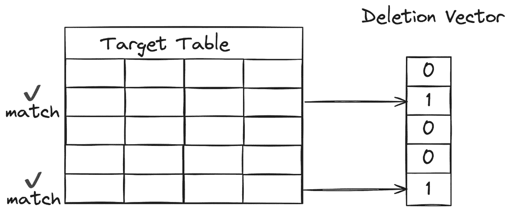

# 第四章：扩展 DLT 流水线

本章中，我们将探讨几种扩展 **Delta Live Tables** (**DLT**) 流水线的方法，以应对典型生产环境中的处理需求。我们将涵盖调优 DLT 流水线的多个方面，从优化 DLT 集群设置，使得流水线能够快速扩展以应对大量处理需求的高峰，到优化底层云存储中表格的数据布局。本章结束时，你应该已经掌握如何让 DLT 集群自动扩展以应对需求。你还应该对由 DLT 系统在后台自动运行的表格维护任务对数据流水线性能的影响有充分的理解。最后，你应当理解如何利用 Delta Lake 优化技术进一步提升 DLT 流水线的执行性能。

本章我们将涵盖以下主要主题：

+   扩展计算能力以应对需求

+   实践示例 – 使用 Databricks REST API 设置自动扩展属性

+   自动化的表格维护任务

+   为更快的表格更新优化表格布局

+   无服务器 DLT 流水线

+   介绍 Enzyme，一种性能优化层

# 技术要求

要跟随本章内容，你需要拥有 Databricks 工作区权限，能够创建并启动通用集群，以及至少拥有一个集群策略来创建新的 DLT 流水线。本章的所有代码示例可以从本章的 GitHub 仓库下载，网址为 [`github.com/PacktPublishing/Building-Modern-Data-Applications-Using-Databricks-Lakehouse/tree/main/chapter04`](https://github.com/PacktPublishing/Building-Modern-Data-Applications-Using-Databricks-Lakehouse/tree/main/chapter04)。本章将创建并运行几个新的笔记本，以及使用 **Core** 产品版本创建一个新的 DLT 流水线。因此，本章的代码示例预计将消耗大约 10-15 **Databricks** **单位** (**DBUs**)。

# 扩展计算能力以应对需求

数据流水线的不同部分可能涉及大量计算，比如进行计算时，而流水线的其他部分则不需要如此强大的处理能力。为了在优化成本的同时获得最佳性能，任何数据流水线都需要能够在需要时增加额外的处理能力，并在处理需求随时间减少时释放计算资源。幸运的是，Databricks 提供了内置的自动扩展功能，用于 DLT 流水线，因此 **虚拟机** (**VMs**) 可以根据数据流水线执行期间的处理需求，添加到流水线集群中或从中移除。

实际上，Databricks 为 DLT 数据管道提供了两种类型的集群自动扩缩模式：传统模式和增强模式。两种自动扩缩模式都会在管道运行过程中，根据处理需求的增减，自动增加或删除虚拟机。然而，虚拟机何时被添加或删除，在两种模式之间有所不同。

在传统自动扩缩模式下，当处理需求持续增加时，管道集群会增加额外的虚拟机。此外，在传统模式下，管道集群仅在虚拟机闲置一段时间且当前没有正在执行的 Spark 任务时，才会缩小规模。

另一方面，在增强自动扩缩模式下，DLT 系统只有在系统*预测*增加额外的计算资源能够加速管道更新执行时，才会增加额外的虚拟机——例如，如果 Spark 任务的执行受限于可用的 CPU 核心数量，增加 CPU 数量可以帮助并行执行大量的 Spark 任务。此外，增强型自动扩缩功能将主动寻找管道集群缩小规模的机会，通过驱逐正在运行的 Spark 任务并减少云计算成本。在驱逐过程中，增强型自动扩缩模式会确保被驱逐的 Spark 任务在剩余的运行虚拟机上成功恢复，然后再终止过度配置的虚拟机。

最后，增强型自动扩缩仅适用于用于管道更新任务的集群，而传统自动扩缩模式则由 DLT 系统用于执行维护任务。

以下表格概述了 DLT 数据管道集群上可用的两种自动扩缩模式之间的差异，以及每种自动扩缩模式适用于哪些 DLT 任务。

| **自动扩缩模式** | **预测性** **自动扩缩** | **主动** **缩小规模** | **更新任务** | **维护任务** |
| --- | --- | --- | --- | --- |
| 传统模式 | ✖️ | ✖️ | ✔️ | ✔️ |
| 增强模式 | ✔️ | ✔️ | ✔️ | ✖️ |

表 4.1 – DLT 数据管道集群中可用的自动扩缩模式之间的差异

你可以通过 DLT UI 或 Databricks REST API 配置集群的自动扩缩模式。在接下来的部分中，我们将使用 Databricks REST API 来更新现有数据管道集群的自动扩缩模式。

# 实践示例 – 使用 Databricks REST API 设置自动扩缩属性

在本节中，您需要从本章的 GitHub 仓库下载代码示例，仓库地址为 [`github.com/PacktPublishing/Building-Modern-Data-Applications-Using-Databricks-Lakehouse/tree/main/chapter04`](https://github.com/PacktPublishing/Building-Modern-Data-Applications-Using-Databricks-Lakehouse/tree/main/chapter04)。在该仓库中有一个名为 **Random Taxi Trip Data Generator.py** 的辅助笔记本，我们将使用它向云存储着陆区生成随机数据流，以模拟在生产环境中可能遇到的不可预测行为。

首先，让我们开始导入本章的数据管道定义笔记本，名为 **Taxi Trip Data Pipeline.py**，并将其打开到 Databricks 工作区中。

您会注意到，我们在数据管道中定义了两个数据集。第一个数据集使用 Databricks Auto Loader 功能来摄取新到达的 JSON 文件，这些文件存储在我们的原始着陆区。一旦数据被摄取，第二个数据集——我们的银表——将包含转换后的出租车行程数据的结果，并附加包含财务分析数据的额外列：

```py
@dlt.table(
    name="random_trip_data_raw",
    comment="The raw taxi trip data ingested from a landing zone.",
    table_properties={
        "quality": "bronze"
    }
)
def random_trip_data_raw():
    raw_trip_data_schema = StructType([
        StructField('Id', IntegerType(), True),
        StructField('driver_id', IntegerType(), True),
        StructField('Trip_Pickup_DateTime',
                    TimestampType(), True),
        StructField('Trip_Dropoff_DateTime',
                    TimestampType(), True),
        StructField('Passenger_Count', IntegerType(), True),
        StructField('Trip_Distance', DoubleType(), True),
        StructField('Start_Lon', DoubleType(), True),
        StructField('Start_Lat', DoubleType(), True),
        StructField('Rate_Code', StringType(), True),
        StructField('store_and_forward', IntegerType(), True),
        StructField('End_Lon', DoubleType(), True),
        StructField('End_Lat', DoubleType(), True),
        StructField('Payment_Type', StringType(), True),
        StructField('Fare_Amt', DoubleType(), True),
        StructField('surcharge', DoubleType(), True),
        StructField('mta_tax', StringType(), True),
        StructField('Tip_Amt', DoubleType(), True),
        StructField('Tolls_Amt', DoubleType(), True),
        StructField('Total_Amt', DoubleType(), True)
    ])
    return (spark.readStream
        .format("cloudFiles")
        .option("cloudFiles.format", "json")
        .schema(raw_trip_data_schema)
        .load(raw_landing_zone))
```

接下来，将笔记本附加到一个通用集群并执行所有笔记本单元格。确保所有笔记本单元格都成功执行。当提示时，使用 **Core** 产品版本创建一个新的 DLT 数据管道。选择 **Continuous** 处理模式作为管道执行模式。（如果需要复习，请参考本书中 *第二章* 的 *数据管道设置* 部分。）接下来，选择一个目标 Unity Catalog 存储位置来存储数据管道数据集的输出，并接受其余所有默认值。最后，记录新创建的 DLT 数据管道的管道 ID。

在本部分练习中，我们将使用一个流行的 Python 库 **requests** 来与 Databricks REST API 进行交互。在 Databricks 工作区内创建一个新的笔记本，并在笔记本的第一个单元格中开始导入 **requests** 库：

```py
import requests
```

接下来，我们将创建一个新的请求，向 Databricks REST API 更新数据管道的集群设置。在请求负载中，我们将指定自动扩展模式、数据管道集群的最小工作节点数量以及最大工作节点数量。根据公开的 Databricks 文档，我们还需要使用 **PUT** 动词来更新 DLT 数据管道的设置。将以下代码片段添加到新创建的笔记本中，并更新变量为您环境的特定值：

```py
databricks_workspace_url = "<your_databricks_workspace>"
pipeline_id = "<your_pipeline_id>"
pat_token = "<your_api_token>"
response = requests.put(
    f"{databricks_workspace_url}/api/2.0/pipelines/{pipeline_id}",
    headers={"Authentication": pat_token},
    json={
        ...
        "clusters":[{
            "autoscale": {
                "min_workers": 2,
                "max_workers": 5,
                "mode": "ENHANCED"
            }
        }]
        ...
    }
)
print(response.json())
```

或者，你可以通过从 DLT UI 进入流水线设置，将流水线的自动扩展模式更新为 **ENHANCED**。现在我们已经将 DLT 流水线更新为使用增强型自动扩展，让我们执行流水线更新。进入新创建的数据流水线的 UI，在右上角选择 **Start** 按钮触发流水线更新。

与此同时，我们也可以使用随机数据生成器来模拟处理需求的峰值。导入名为 **Random Taxi Trip Data Generator.py** 的数据生成器笔记本，该笔记本位于本章的 GitHub 仓库中。顾名思义，**Random Taxi Trip Data Generator.py** 将随机生成新的出租车行程数据，且数据的数量和频率各不相同，从而模拟生产环境中的典型工作负载。将该笔记本附加到一个多用途集群，并点击 **Run all** 按钮执行所有单元格。确保笔记本单元格都已成功完成。

接下来，切换回我们创建的 DLT 流水线的 DLT UI。我们将监控流水线的事件日志，以确保我们的 DLT 集群会自动增加工作实例的数量。


图 4.1 – 自动扩展事件将记录在 DLT UI 的事件日志中

同样，监控事件日志，以确保在额外数据流结束并且处理需求减少后，DLT 更新集群能够自动缩小规模。

到现在为止，你应该已经对如何让 DLT 集群根据处理需求的波动自动扩展和收缩有了坚实的基础。如你所见，我们的 DLT 流水线只会配置它所需的计算资源，以高效地保持我们的数据集最新，然后释放额外的计算实例以降低我们的运营成本。接下来，让我们关注一下 DLT 系统自动为我们完成的其他效率优化任务，比如 DLT 系统如何自动维护底层 Delta 表的最佳状态。

# 自动化的表格维护任务

如前章所述，每个 DLT 流水线将与两个集群相关联——一个集群用于对流水线定义中的每个数据集进行更新，另一个集群用于对每个数据集执行维护活动。这些维护任务包括对数据流水线定义中的每个 Delta 表执行 **VACUUM** 和 **OPTIMIZE** 操作。之前，数据工程师需要负责创建并维护一个单独的 Databricks 工作流，该工作流会执行每个 Delta 表的 **VACUUM** 和 **OPTIMIZE** 命令，通常安排在夜间运行。正如你所想，随着你开始向流水线中添加越来越多的表，这可能会变得相当繁琐。幸运的是，DLT 框架为我们提供了开箱即用的重负担支持。此外，每次 **VACUUM** 和 **OPTIMIZE** 维护活动都会在上次流水线执行后的 24 小时内执行。

让我们逐个查看每个操作，了解维护任务对基础数据集的总体好处。

## 为什么自动压缩很重要

在每次为特定 DLT 流水线执行新的更新时，DLT 流水线将初始化数据流图，并执行每个数据集定义中规定的基础计算。因此，新的数据会被附加到特定的 Delta 表中，或与之合并。每次写入数据时，Apache Spark 将把写操作分发到执行器，可能会生成许多小文件。随着更多更新的执行，这些小文件会在云存储中增多。当下游过程读取这些 Delta 表时，它们需要为每个唯一文件分配一个 Spark 任务，以响应特定的表查询。更多的文件意味着更多的 Spark 任务——或者更准确地说，意味着 Spark 引擎需要处理的工作量增加。这通常被称为“小文件问题”，因为那些经历大量新数据的表会生成许多小文件，从而拖慢整体查询性能。作为解决方案，最好将这些小文件合并成更大的文件，这一过程称为文件压缩。

幸运的是，作为数据工程师，我们不需要编写自己的工具来将较小的文件合并成更大的文件。事实上，Delta Lake 提供了一个非常有用的命令 **OPTIMIZE**，用于执行此类维护任务。默认情况下，Delta Lake 的 **OPTIMIZE** 命令会尝试将较小的文件合并成更大的 1 GB 文件。


图 4.2 – DLT 将自动在 Delta 表上运行 OPTIMIZE 命令，将较小的文件合并成更大的 1 GB 文件

当然，您也可以选择通过禁用 DLT 管道中表定义中的**autoOptimize**表属性来禁用自动优化功能：

```py
@dlt.table(
    name="random_trip_data_raw",
    comment="The raw taxi trip data ingested from a landing zone.",
    table_properties={
        "quality": "bronze",
        "pipelines.autoOptimize.managed": "false"
    }
)
```

在某些情况下，您可能希望覆盖默认行为，例如实现自己的表优化工作流。

每当执行**OPTIMIZE**维护活动时，它也会为每个 Delta 表生成额外的文件。为了防止云存储成本失控，我们还必须清理过时的表文件，确保作为组织，我们不会为不必要的云存储付费。

## 清理过时的表文件

**VACUUM**操作旨在移除不再在最新表快照中的 Delta 表的旧版本表文件，并且这些文件的年龄超过了保留阈值属性。默认情况下，所有 Delta 表的保留阈值为七天，这意味着**VACUUM**操作将移除比当前快照日期早于七天的过时表文件。在运行时，**VACUUM**实用程序会搜索 Delta 表的根目录以及所有子目录，从云存储中删除超过保留阈值的旧表文件。

这是平衡云存储成本与维护和查看特定 Delta 表旧快照能力的好方法。如在*第一章* 中所述，Delta Lake 的时间旅行功能依赖于表历史记录来查询 Delta 表的先前版本。然而，该功能并非为长期归档使用场景设计，而是为了较短期的表历史。因此，可以合理预期，我们不需要存储 Delta 表的所有历史记录，也不需要为此付出相应的存储费用，这可能会变得相当昂贵。

与自动优化功能类似，Delta 表的历史保留阈值是通过表属性确定的，并且可以通过在表定义中使用**deletedFileRetentionDuration**表属性来指定：

```py
@dlt.table(
    name="random_trip_data_silver",
    comment="Taxi trip data transformed with financial data.",
    table_properties={
        "quality": "silver",
        "pipelines.autoOptimize.zOrderCols": "driver_id",
        "delta.deletedFileRetentionDuration": "INTERVAL 14 days"
    }
)
```

同样，Delta 事务日志——记录每个提交的表事务细节的元数据文件（在*第一章* 中有详细介绍）——也可能导致不必要的存储成本。然而，这些日志文件在日志检查点操作时会自动删除（每十次事务提交一次）。默认情况下，Delta Lake 会保留最多 30 天的表历史记录在事务日志中。


图 4.3 – DLT 将自动对所有 Delta 表执行 VACUUM 操作

由于事务日志文件仅包含元数据，因此它们很小，只包含几兆字节的信息。然而，可以通过设置**logRetentionDuration**表属性来配置此历史记录保留：

```py
@dlt.table(
    name="random_trip_data_silver",
    comment="Taxi trip data transformed with financial data.",
    table_properties={
        "quality": "silver",
        "pipelines.autoOptimize.zOrderCols": "driver_id",
        "delta.deletedFileRetentionDuration": "INTERVAL 9 days",
        "delta.logRetentionDuration": "INTERVAL 35 days"
    }
)
```

删除过时的云文件是控制云成本并防止组织支付不必要的云存储费用的好方法。让我们来看看如何优化 DLT 管道的其他方面，以提高操作效率，同时继续降低运营成本。

## 将计算移近数据

确保数据管道高效执行的最简单方法之一是确保 DLT 管道集群在与正在处理的数据相同的全球区域内启动。这是一个古老的调优概念，即将硬件靠近数据，以减少数据处理过程中网络延迟。例如，你不会希望你的 DLT 管道集群在云服务提供商的美国西部区域执行，而数据却存储在完全不同的地理位置，比如该云服务提供商的美国东部区域。这样做会导致跨地理区域传输数据、处理数据转换或其他计算，并将结果重新存储回原始地理区域时，产生相当大的网络延迟。此外，大多数云服务提供商会评估与地理数据传输相关的数据出站和入站费用。


图 4.4 – DLT 集群和存储容器的地理位置可能引入显著的网络延迟

DLT 集群的地理区域可以通过在管道集群策略定义中定义云区域位置来设置。例如，以下代码片段定义了一个集群策略，可以用来配置 DLT 管道集群在 AWS 云服务提供商的美国东部区域启动：

```py
{
    ...
    "aws_attributes.zone_id": "us-east-1",
    "custom_tags.lob": {
        "type": "fixed",
        "value": "ad analytics team"
    }
}
```

通过确保你的 DLT 集群与组织数据位于相同的地理区域，你可以确保从管道集群中获得最佳的操作性能。同时，由于你的管道运行得更快，并且云资源的使用时间更短，这意味着你的组织可以节省开支。除了优化数据管道的计算资源外，我们还可以有效地组织表格数据，以进一步提高数据管道更新的性能。让我们看看其他一些优化表格数据布局来提高 DLT 管道处理效率的技术。

# 优化表格布局以加速表格更新

一个典型的 DLT 管道可能包括一个或多个数据集，这些数据集追加新数据并用新值更新现有数据，甚至完全删除某些行。让我们深入了解这个后者的场景，分析“引擎盖下”发生了什么，以便我们在向 DLT 表中添加新数据时优化 DLT 数据集以提高性能。

## 更新期间重写表文件

在表更新期间，DLT 引擎将执行两次扫描以识别所有符合特定更新条件的行，并相应地重写已更改的表数据。在第一次表扫描过程中，DLT 引擎将识别所有包含符合 **apply_changes()**（如果使用 SQL，则为 **APPLY CHANGES**）表达式中的谓词子句的行的表文件，例如。


图 4.5 – DLT 将通过使用匹配操作识别匹配的行，并将更改应用到目标 DLT 表

接下来，DLT 引擎将编译一个包含这些行的所有表文件的列表。使用这个表文件列表，DLT 引擎将在第二次表扫描操作中重写包含新更新行的每个文件。如你所想，随着向 DLT 表中添加更多数据，定位这些匹配行并确定要重写的文件列表的过程可能会随着时间的推移变得非常昂贵。幸运的是，Delta Lake 有一些功能可以帮助我们优化这个搜索过程，并加快匹配过程。

## 使用表分区进行数据跳过

加速这个搜索过程的一种方法是限制 DLT 引擎的搜索空间。一种技术是使用 Hive 风格的表分区。表分区将相关数据组织成物理上分开的子目录，这些子目录位于表的根存储位置内。子目录与一个或多个表列相对应。

在匹配过程中，DLT 引擎可以排除那些不符合谓词条件的整个子目录，避免扫描不必要的数据。

通过 **MERGE** 列进行表分区，这些列用于将数据更改应用到表中，可以显著提升更新过程的性能。另一方面，由于表分区会创建物理上分开的目录，因此表分区可能难以正确设置，并且修改起来非常昂贵，通常需要重写整个表以调整分区方案。

另一个挑战是识别一个表分区方案，使得分区目录中包含均衡的数据量。很容易通过 **MERGE** 列进行表分区，但这可能导致某些分区目录包含较少的数据，而其他分区目录包含大量数据。这种情况通常被称为 **数据倾斜**。尽管如此，表分区仍然是你数据管道调优工具中的一个强大工具。让我们来看看如何将表分区与另一种表优化技术结合起来，进一步提升管道性能。

## Delta Lake 在 MERGE 列上的 Z-order 排序

优化 Delta 表格布局的一种方法是组织每个表格文件中的数据，以便在文件扫描操作期间可以高效读取。这通常被称为数据聚类。幸运的是，Delta Lake 提供了一种数据聚类算法，称为 Z-order 聚类。Z-order 聚类通过将相关数据聚集在一起，形成“Z”形模式来写入表格数据。根据这种模式存储表格数据，将提高 DLT 引擎跳过表格文件中不相关数据的概率，仅读取符合更新匹配条件的数据。

传统上，在没有 Z-order 聚类的情况下，Delta Lake 将以线性模式存储数据。因此，在更新匹配过程中，Delta Lake 需要打开表格的每个文件并以线性排序顺序扫描每一行。有时，只有一行可能匹配合并条件。反过来，DLT 引擎将读取所有不匹配的多余行，最终也许只能找到 1 或 2 行匹配更新条件。

通过使用 Z-order 聚类技术将文件中的数据进行聚类，DLT 引擎可以准确定位特定文件中相关数据所在的位置，从而限制它必须扫描的数据量。对于需要大量扫描的大型表格，这可以显著提高 DLT 管道的更新过程。


图 4.6 – 表格文件中的 Z-order 聚类数据可以可视化为数据聚集形成“Z”形状

通过在数据集定义中设置适当的表格属性，可以启用 DLT 数据集上的 Z-order 聚类。让我们看看如何为我们接收大量更新的银表**yellow_taxi_transformed**配置 Z-order 聚类：

我们首先像定义 DLT 管道中的任何数据集一样定义数据集。你会注意到，我们为数据集指定了一个名称**yellow_taxi_transformed**，并添加了一个注释，提供了一些关于表格的描述性文本。然而，在 DLT 功能注释中，我们添加了更多的参数，用于设置此数据集的表格属性。在表格属性参数中，我们添加了几个描述数据集的属性。首先，我们添加了一个表格属性，描述了此数据集的质量，这是我们在金字塔架构中的银表。接下来，我们还添加了另一个表格属性，指定我们希望应用 Z-order 聚类的表格列：

```py
import dlt
@dlt.table(
    name="yellow_taxi_transformed",
    comment="Taxi cab trip data containing additional columns about the financial data.",
    table_properties={
        "quality": "silver",
        "pipelines.autoOptimize.zOrderCols": "zip_code, driver_id"
    }
)
```

在执行我们日常的维护任务时，维护任务将动态解析这些 Z-order 列，并将在该 DLT 数据集后面的基础 Delta 表上运行以下 Z-order 命令：

```py
OPTIMIZE yellow_taxi_transformed
    ZORDER BY (zip_code, driver_id)
```

那么，你应该根据哪些表列来进行 Z-order 排序，应该指定多少列呢？一个合适的范围是 1 到 3 列，最多不超过 5 列。随着你添加更多的列，会使得表文件内的数据聚类变得更复杂，从而降低可能发生的数据跳过效果。

此外，你应当尽量选择数据类型为数值型的列。原因在于，每当新数据写入 Delta 表时，Delta 引擎会捕捉前 32 列的统计信息——包括最小值、最大值和空值数量等列信息。这些统计信息将被用于更新搜索过程中，帮助有效地定位哪些行符合更新条件。对于字符串类型的数据，这些统计信息并不会提供太多有用的信息，因为例如没有一个“平均字符串”。然而，对于浮动数据类型的列，比如浮点数列，就可以计算出平均值。

此外，在**APPLY CHANGES**谓词中使用的列、连接列以及进行聚合操作的列，都是理想的 Z-order 排序候选列。最后，这些列的基数应该高于用于创建表分区方案的列。

重要提示

有时，你可能想尝试使用不同的列或不同的列集来进行 Z-order 排序。更改这个 Z-order 排序方案是非常简单的——只需更新 DLT 管道定义中的**table_properties**参数即可。然而，需要注意的是，新的 Z-order 聚类只会对写入表中的新数据生效。若要将新的 Z-order 聚类应用于现有数据，必须完全刷新整个表，以便根据聚类模式重新组织表文件。因此，你可能需要在重新写入表数据所需的时间和成本与表 Z-order 优化所带来的性能收益之间做出权衡。

正如你现在看到的，Z-order 优化是优化 DLT 表布局的一个极佳方式，可以提升数据管道的性能。拥有有效的数据布局可以提高 DLT 引擎的数据跳过能力，限制 DLT 引擎在应用更新到数据管道中目标表时需要扫描的数据量。结合 Hive 风格的表分区，这是一种确保最大化数据管道性能的好方法，从而缩短执行时间，并减少维护更新集群的时间和成本。

然而，如果你只是在特定的表文件中更新少量数据呢？这意味着你需要重写整个文件，仅仅是为了更新例如 1 或 2 行。让我们看看如何进一步优化 DLT 管道的性能，以避免这种代价高昂的操作。

## 使用删除向量提高写入性能

在表格更新期间，DLT 引擎通过将匹配的文件与新更改的行写入新目标文件来应用更新。在这种表格更新策略中，称为**写时复制**（**COW**），没有接收到任何更新的行需要按名称所示被复制到新文件中。对于需要在多个文件中仅更改少量行的表更新，这种方式效率较低。

一种更好的优化技术是将所有已更改的行跟踪到一个单独的数据结构中，并将更新后的行写入单独的文件中。然后，在查询表格时，表格客户端可以使用该数据结构来过滤掉任何已更新的行。这种技术称为**读取时合并**（**MOR**），并通过名为删除向量的功能在 Delta Lake 中实现。

**删除向量**是一种特殊的数据结构，用于跟踪在 Delta 表上的**更新**或**合并**操作中所有更新的行 ID。可以通过设置底层 Delta 表的表属性来启用删除向量。与 Delta 表列的统计信息类似，删除向量与表数据一起存储在云存储上。



图 4.7 – Delta Lake 表将跟踪每行的行 ID，并将其存储在单独的数据结构中

此外，删除向量可以默认自动启用，适用于在 Databricks 工作区中创建的所有新表。工作区管理员可以在工作区管理员设置界面的**高级**选项卡中启用或禁用此行为。


图 4.8 – 删除向量可以在 Databricks 数据智能平台中自动启用

可以通过在 DLT 表定义中设置**enableDeletionVectors**表属性，显式地为数据集设置删除向量：

```py
@dlt.table(
    name="random_trip_data_silver",
    comment="Taxi trip data transformed with financial data.",
    table_properties={
        "quality": "silver",
        "pipelines.autoOptimize.zOrderCols": "driver_id",
        "delta.enableDeletionVectors": "true"
    }
)
```

此外，删除向量在 Databricks 数据智能平台上解锁了一类新的更新性能特性，统称为**预测性 I/O**。预测性 I/O 利用深度学习和文件统计信息，准确预测与更新条件匹配的行在文件中的位置。因此，扫描匹配文件并在更新、合并和删除期间重写数据所需的时间大幅减少。

Hive 风格的表分区、Z-order 数据聚类和删除向量都是非常好的优化技术，可以高效地存储我们的表数据，并提高管道更新的速度。让我们再次将注意力转向数据管道的计算资源，并分析另一种提高生产环境中 DLT 管道性能的技术，尤其是在处理需求可能激增并变得不可预测时。

# 无服务器 DLT 管道

在 *第二章* 中，我们简要描述了无服务器 DLT 集群是什么以及它们如何快速高效地扩展计算资源以应对需求的激增，同时又能缩减规模以节省云成本。虽然我们不会再次讨论无服务器集群的架构，但我们将讨论无服务器 DLT 集群如何帮助组织在增加更多数据管道时扩展数据管道。

使用无服务器 DLT 集群时，集群的基础设施和设置由 Databricks 云服务提供商账户自动处理。这意味着无需选择虚拟机实例类型来平衡性能与成本。无服务器计算的费用是固定的、统一的定价，使得成本具有可预测性。此外，由于计算资源由 Databricks 云服务提供商账户管理，Databricks 可以通过每个云服务提供商以折扣价预留大量虚拟机实例。这些折扣价可以传递给无服务器 DLT 消费者。

此外，无服务器 DLT 集群通过减少每个数据管道所需的配置量，从而*简化数据管道维护*。配置的减少使得数据工程团队可以将精力从数据管道的维护中解放出来，更加专注于业务中的关键事项，例如修改业务逻辑、数据验证以及增加更多数据管道等。此外，随着数据管道的增长和数据集体积的不断增加，您可能需要配置更多的虚拟机实例。最终，您可能会遇到某些实例类型的云服务提供商限制，这时需要额外的流程去提高这些限制。使用无服务器 DLT 计算时，这些限制已经与云服务提供商协商过了，这意味着 DLT 无服务器消费者无需担心这一负担。

无服务器数据管道还可以帮助*减少成本*。例如，在传统的客户管理计算中，集群只能按照云服务提供商能够提供额外实例的速度，快速增加虚拟机（VM）实例，并定期运行诊断检查。而且，Databricks 运行时容器和用户库需要安装到这些额外实例上，这会消耗更多时间。这可能导致很多分钟——有时会超过 15 分钟，具体取决于云服务提供商——才能扩展 DLT 集群以应对不可预测的计算需求峰值。因此，传统计算上运行的 DLT 管道与无服务器 DLT 集群相比，执行时间会显著更长。在无服务器 DLT 集群中，虚拟机实例已经预配置好，安装并启动了最新的 Databricks 运行时容器，并且在预分配的实例池中已经启动。在处理需求激增时，DLT 管道可以在几秒钟内响应额外资源以满足需求，而非几分钟。这些额外的分钟数在多个数据管道运行和整个云计费周期中会累计起来。通过缩短扩展所需的时间并通过增强的自动扩缩能力积极地进行缩减，无服务器 DLT 管道可以大幅降低运营成本，同时提高数据湖仓中 ETL 处理的效率。

移除管理数据管道计算设置的基础设施负担以及控制云成本，是选择无服务器 DLT（数据传输层）管道而非传统的客户管理计算的主要动因之一。然而，我们也可以看看选择无服务器 DLT 集群的另一个动因，比如这种计算资源所带来的性能特性。

# 引入 Enzyme，性能优化层

在某些场景中，数据管道可能已经部署到生产环境中。然而，随着时间的推移，业务需求可能会发生重大变化，导致需要从头开始重新计算数据集。在这些场景下，重新计算这些数据集的历史数据可能会非常昂贵。

Enzyme 是一个全新的优化层，仅适用于无服务器 DLT 管道，旨在通过动态计算成本模型来保持数据集的物化结果最新，从而降低 ETL 成本。像 Spark 查询规划中的成本模型一样，Enzyme 会在多种 ETL 技术之间计算成本模型，从传统的 DLT 物化视图到 Delta 流表，再到另一个 Delta 流表，或手动 ETL 技术。例如，Enzyme 引擎可能会模拟使用物化技术刷新数据集的成本，这相当于 10 个 Spark 作业，每个作业包含 200 个 Spark 任务。这个成本模型可能会节省两次 Spark 作业，并预测另一种 ETL 技术会将整体执行时间减少五分钟，因此 Enzyme 引擎会选择第一种技术。


图 4.9 – Enzyme 优化层将使用成本模型自动选择最具成本效益的 ETL 刷新技术

Enzyme 层将在运行时动态选择最有效且具成本效益的方法，以重新计算给定数据集的结果。由于 Enzyme 是一种无服务器 DLT 特性，它默认已启用，免去了 DLT 管理员管理管道集群设置的需求。

到现在为止，您应该已经了解了无服务器 DLT 管道所带来的强大功能，例如 Enzyme 优化层，以及它的基础设施管理和节省成本的优势。

# 概述

在本章中，我们探讨了扩展数据管道以处理大规模数据并在高峰期和不可预测的处理需求下保持良好性能的各种方法。我们研究了扩展 DLT 管道的两个属性——计算和数据布局。我们考察了 Databricks 数据智能平台的增强型自动扩展特性，该特性可以自动扩展数据管道执行时的计算资源。我们还研究了优化底层表数据存储的方式，通过将相关数据聚类到表文件中，从而实现更快的表查询和更短的管道处理时间。此外，我们还探讨了定期的维护活动，以保持高性能的表查询，并防止过时数据文件导致的云存储成本膨胀。

数据安全至关重要，但常常在湖仓实施的最后阶段才被重视。然而，这可能意味着湖仓成功与否的差异，甚至可能成为新闻头条——而且并不是因为好消息。下一章中，我们将探讨如何在湖仓中有效实施强有力的数据治理，无论是在单一地理区域内，还是跨越全球不同地区的故障转移区域。

# 第二部分：使用 Unity Catalog 保护湖仓

在本部分，我们将探讨如何在 Databricks 数据智能平台中使用 Unity Catalog 实现有效的数据治理策略。我们将讨论如何在组织中的不同角色和部门之间执行细粒度的数据访问策略。最后，我们将探讨如何追溯 Unity Catalog 中数据资产的来源，确保数据来自可信的来源。

本部分包含以下章节：

+   *第五章*，*在湖仓中掌握数据治理* *与* *Unity Catalog*

+   *第六章*，*在 Unity Catalog 中管理数据位置*

+   *第七章*，*使用 Unity Catalog 查看数据血缘*
