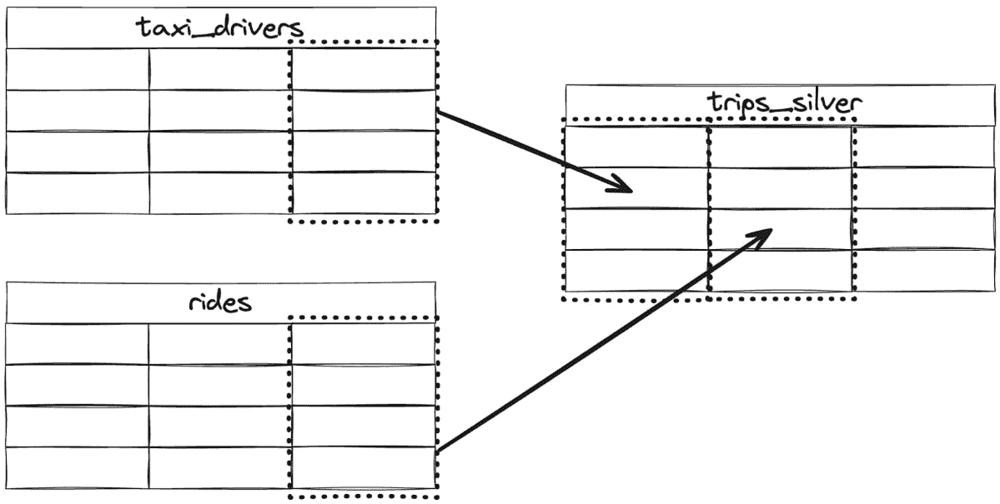
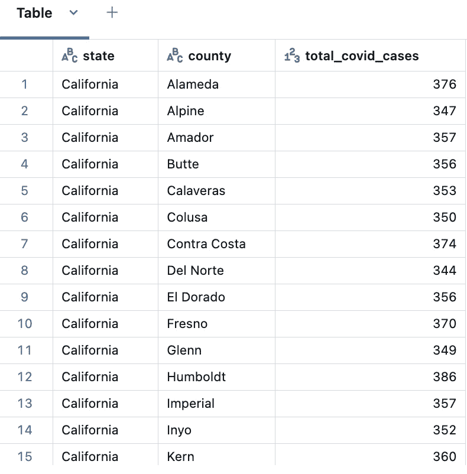

# 第五章：使用 Unity Catalog 掌握湖仓中的数据治理

在本章节中，我们将深入探讨如何使用 Unity Catalog 实施湖仓中的有效数据治理。我们将介绍如何在现有的 Databricks 工作空间启用 Unity Catalog，如何为数据发现实施数据目录管理，如何在表、行和列级别执行细粒度的数据访问控制，以及如何跟踪数据血统。到章节结束时，你将掌握数据治理的行业最佳实践，并获得提升数据安全性和合规性的真实世界经验。

在本章节中，我们将涵盖以下主要主题：

+   理解湖仓中的数据治理

+   在现有 Databricks 工作空间启用 Unity Catalog

+   Unity Catalog 中的身份联合

+   数据发现与目录管理

+   动手实验室 – 数据掩码处理医疗数据集

# 技术要求

为了跟随本章节的内容，你需要拥有 Databricks 工作空间的权限，能够创建和启动通用集群，以便执行本章节附带的笔记本。还建议将你的 Databricks 用户提升为账户管理员和元存储管理员，这样你才能部署新的 Unity Catalog 元存储并将其附加到现有的 Databricks 工作空间。所有代码示例可以从本章节的 GitHub 仓库下载，链接地址为[`github.com/PacktPublishing/Building-Modern-Data-Applications-Using-Databricks-Lakehouse/tree/main/chapter05`](https://github.com/PacktPublishing/Building-Modern-Data-Applications-Using-Databricks-Lakehouse/tree/main/chapter05)。本章节将创建并运行几个新的笔记本，预计会消耗约 5 到 10 **Databricks** **单位** (**DBU** )。

# 理解湖仓中的数据治理

湖仓实现中通常会利用多个处理引擎来应对不同的使用场景。然而，每个处理引擎都有自己独特的数据安全实现，并且这些不同的数据安全解决方案往往无法互相集成。大多数湖仓系统的不足之处在于，由于有多个安全层，实施一致的、全球性的安全政策几乎是不可能的。确保湖仓中的数据完全且一致地安全、私密，并且仅向正确的用户授予访问权限，是建设数据湖仓时最为重要的任务。因此，拥有一个简单的数据治理解决方案，能够覆盖你组织湖仓中的所有数据，对组织的成功至关重要。

## 介绍 Databricks Unity Catalog

Unity Catalog 是一个集中式的数据治理解决方案，通过将工作区对象访问策略组织到一个单一的管理“统一视图”中，简化了湖仓中数据的安全保护。除了访问策略，Unity Catalog 的设计还充分考虑了强大的审计功能，允许管理员捕捉所有用户对工作区对象的访问模式，以便管理员可以观察访问模式、工作区使用情况以及跨所有 Databricks 工作区的计费模式。此外，Unity Catalog 的设计还允许数据专业人员在组织内部发现数据集、追踪数据血缘、查看实体关系图、分享精选数据集以及监控系统健康状况。Unity Catalog 的一个重要优势是，一旦组织的数据进入 Unity Catalog，它会默认得到安全保护——无论是 Databricks 工作区内的内部过程，还是与 Databricks 数据智能平台外部数据交互的外部过程，除非数据管理员明确授予访问权限，否则任何过程都无法访问这些数据。Unity Catalog 的设计旨在跨越湖仓的边界，从工作区到工作区，并超越 Databricks 工作区，坐落在组织的数据之上，以便能够将一个单一的治理模型简单且一致地应用于所有访问组织湖仓数据的方。


图 5.1 – Unity Catalog 在组织的云数据之上提供了一个单一的统一治理层

然而，拥有一个全球范围的数据和工作区对象安全层并不总是像今天在 Unity Catalog 中那样无缝。让我们回顾一下 Databricks 以前的安全模型中的经验教训，以及 Unity Catalog 如何最终实现今天的成果。

## 一个值得解决的问题

以前，数据访问控制策略是通过一种称为表**访问控制列表**（**ACLs**）的机制在每个工作区定义的。当这些策略被正确执行时，表 ACLs 提供了强大的数据治理解决方案。管理员可以为工作区内的不同用户和组定义数据访问策略，并且在执行访问底层数据集的 Spark 代码时，Databricks 集群可以强制执行这些访问策略，这些数据集是在**Hive** **Metastore**（**HMS**）中注册的。

然而，来自表 ACL 安全模型的四个主要问题迅速浮现。第一个问题是，使用表 ACL 安全模型定义的数据访问策略需要为每个独立的 Databricks 工作区重复定义。大多数组织更倾向于为每个逻辑工作环境拥有单独的工作区——例如，一个用于开发的工作区，一个用于验收测试的工作区，最后是一个专门用于运行生产工作负载的工作区。除了重复相同的共享数据访问策略外，如果某个工作区中的数据访问策略发生变化，通常意味着所有工作区的数据访问策略也需要更改。这导致了不必要的维护开销，因为在 Databricks 数据智能平台中并没有一个单一的位置可以轻松定义这些数据访问模式。

其次，表 ACL 仅在交互式笔记本或自动化作业在启用了表 ACL 的集群上执行时，才会强制执行对底层数据的访问控制。没有启用表 ACL 安全模型的集群可以直接访问底层数据集，完全绕过安全模型！虽然集群策略（详见*第一章*）可以用来缓解这个问题，并防止任何潜在的恶意访问特权数据集，但集群策略的编写十分复杂。它们需要了解集群策略架构，并且需要有将配置表示为 JSON 的经验，这使得在整个组织中扩展变得困难。通常情况下，用户常常向组织领导抱怨，称他们需要管理员工作区访问权限，以便启动自己喜欢的集群并完成日常活动。一旦用户获得了管理员工作区访问权限，他们也能将管理员权限授予其他用户，从而形成像滚雪球一样的效应，导致一个工作区有过多的管理员。此类不当操作很容易绕过启用了表 ACL 的集群，导致数据泄露。

此外，由于在共享计算资源上运行**Java 虚拟机**（**JVM**）语言的隔离问题，启用表 ACL 的集群限制最终用户只能使用 SQL 或 Python 编程语言运行工作负载。希望使用 Scala、Java 或 R 编程语言执行工作负载的用户，需要被授予例外权限，使用未启用表 ACL 的集群，这为组织的数据治理解决方案打开了一个巨大的漏洞。

第四个出现的主要问题与 HMS 的可扩展性有关。Databricks 数据智能平台利用 HMS 在工作区中注册数据集，这使得用户可以从头开始创建新数据集，将其组织到架构中，甚至跨组织共享用户和组的访问权限。然而，随着一个工作区逐步增加数千名用户，这些用户需要同时执行临时查询，并且还需要执行数百甚至数千个定时任务。最终，HMS 很难跟上最苛刻工作区所需的并发处理能力。

很明显，需要进行一次巨大的变革，因此 Databricks 开始着手从零开始完全重新设计数据治理解决方案。

## Unity Catalog 架构概述

Unity Catalog 旨在解决的一个主要痛点是实施一个完整的端到端数据治理解决方案，覆盖组织的所有工作区，消除需要为每个 Databricks 工作区重新定义数据访问策略的冗余问题。相反，通过 Unity Catalog，数据管理员可以在一个集中位置定义数据访问控制*一次*，并且可以放心，数据访问策略将在整个组织中一致地应用，无论使用何种计算资源或处理引擎与 Unity Catalog 中的数据集交互。


图 5.2 – Unity Catalog 集中管理数据访问策略，并在多个 Databricks 工作区中一致应用这些策略

除了集中式数据治理外，Unity Catalog 还有多个其他关键驱动因素，使其成为现代湖仓环境理想的数据治理解决方案：

+   **默认安全**：用户在未使用启用 Unity Catalog 的集群（Unity Catalog 集群将在下节中介绍）且未被授予特定数据集的使用和选择权限的情况下，无法访问任何计算资源中的数据。

+   **舒适的管理员界面**：Unity Catalog 中的数据访问策略与**美国国家标准学会**（**ANSI**）SQL 紧密集成，使管理员可以在熟悉的数据库对象上表达数据访问权限，例如目录、数据库、表、函数和视图。数据访问权限还可以通过 Databricks Web 应用程序中的管理员 UI 设置，或者使用自动化部署工具，如 Terraform。

+   **数据发现**：Unity Catalog 使数据管理员可以轻松地为数据集添加描述性元数据，从而使组织中的用户能够搜索和发现可用的数据集。

+   **强大的审计功能**：Unity Catalog 会自动捕捉用户级别的访问模式和数据操作，允许管理员查看和审计用户在与湖仓数据交互时的行为。

+   **数据血缘追踪**：追踪表和列如何从上游源生成，对于确保下游数据集是通过受信任的源形成的至关重要。通过强大的数据血缘 API 和系统表，Unity Catalog 使数据和工作空间资产的追踪变得简单。

+   **可观察性**：由于 Unity Catalog 跨多个 Databricks 工作空间，因此可以将系统指标和审计事件汇总到一组集中式的只读表中，以便进行监控和系统可观察性，这些表被称为系统表（在*系统表的可观察性*部分将详细介绍）。

为了实现一种默认数据安全且没有外部访问数据的能力，用户必须通过 Unity Catalog 来访问数据，Databricks 需要根据用户角色设计不同类型的集群。让我们来看一下在启用 Unity Catalog 的工作空间中，用户可以使用的不同集群类型。

## 启用 Unity Catalog 的集群类型

启用 Unity Catalog 的工作空间有三种主要类型的集群：

+   **单用户集群**：只有单个用户或服务主体才有权限在这种集群上执行笔记本单元格或工作流。包含 Scala、Java、R、Python 和 SQL 语言的工作负载只能在这种集群上执行。注册在 Unity Catalog 中的数据集可以从这种集群中查询。

+   **共享集群**：多个用户或服务主体可以在这种集群上执行笔记本单元格或工作流。此类集群仅限于 Python、SQL 和 Scala 工作负载。注册在 Unity Catalog 中的数据集可以从这种集群中查询。

+   **独立集群**：单个用户或多个用户可以将笔记本附加到此类集群并执行笔记本单元格。然而，Unity Catalog 中注册的数据集 *无法* 被此类集群查询，若用户尝试查询 Unity Catalog 中注册的数据集，将导致运行时异常。此类集群可用于读取在遗留 HMS 中注册的数据集。

现在我们已经概述了可以用来与 Unity Catalog 中的数据互动的不同计算资源类型，接下来让我们关注一下数据和其他资产在 Unity Catalog 中是如何组织的，主要是理解 Unity Catalog 的对象模型。

## Unity Catalog 对象模型

理解 Unity Catalog 中的对象模型非常重要，它将帮助用户理解哪些类型的对象可以被 Unity Catalog 安全管理和治理。此外，它还将帮助元存储管理员设计数据访问策略。

Unity Catalog 引入的主要变化之一是三层命名空间的概念。传统上，在 HMS 中，用户与数据交互时可以通过模式（或数据库）和表名的组合来引用数据集。然而，Unity Catalog 增加了第三个逻辑容器，称为目录（catalog），它可以包含一个或多个模式。要在 Unity Catalog 中引用完全限定的数据集，数据工作者需要提供目录、模式和表的名称。


图 5.3 – Unity Catalog 包含了许多不同的可安全管理对象，不仅仅是数据集

让我们深入了解 Unity Catalog 对象模型，从组织物理数据集的相关对象开始：

+   **元存储**：Unity Catalog 的“物理”实现。一个特定的云区域最多只能包含一个元存储。

+   **目录**：Unity Catalog 中数据集的顶级容器。一个目录可以包含一个或多个模式对象的集合。

+   **模式**：作为 Unity Catalog 中的第二级对象。一个模式可以包含一个或多个表、视图、函数、模型和卷的集合。

+   **表**：表示一个包含定义模式并按行和列组织的数据集。

+   **视图**：一个计算的数据集，可能是通过联接表、筛选列或应用复杂的业务逻辑的结果。此外，视图是只读的，不能向其写入数据或通过 **数据操作语言** (**DML**) 语句更新数据。

+   **模型**：一个使用 MLflow 注册到跟踪服务器的机器学习模型。

+   **函数**：一个自定义的、用户定义的函数，通常包含复杂的业务逻辑，这些逻辑通常无法仅通过内置的 Spark 函数实现。

+   **卷**：用于存储结构化、半结构化或非结构化数据的数据存储位置（我们将在下一章中详细讲解卷，*精通 Unity Catalog 中的数据位置*）。

接下来，让我们将注意力转向 Unity Catalog 中用于与 Databricks 数据智能平台之外的数据交互的对象：

+   **连接**：表示一个只读连接，包含访问外部 **关系型数据库管理系统** (**RDBMS**) 或数据仓库中的数据所需的凭据。

+   **存储凭证**：表示访问云存储位置的身份验证凭证。

+   **外部位置**：表示 Databricks 管理的根存储位置之外的云存储位置。

最后，让我们看看 Unity Catalog 对象模型中用于通过 Delta Sharing 协议共享和接收数据集的元素：

+   **提供方**：表示数据提供方。此实体将一个或多个策划的数据集创建为一个逻辑分组，称为*共享*。数据提供方可以随时撤销对共享数据集的访问权限。

+   **共享**：一个或多个共享数据集的逻辑分组，可以与数据接收方共享。

+   **接收方**：表示数据接收方。此实体可以访问数据共享并查询其工作区中的数据集。

现在我们已经概述了 Unity Catalog 的主要构建块，接下来我们来看如何在现有的 Databricks 工作区启用 Unity Catalog，以便管理员可以开始充分利用强大的数据治理解决方案。

# 在现有的 Databricks 工作区启用 Unity Catalog

从 2023 年 11 月初开始，在**亚马逊 Web 服务**（**AWS**）或 Azure 上创建的所有新 Databricks 工作区默认启用 Unity Catalog，因此，如果您的工作区是在此日期之后在这两个云提供商上创建的，则无需额外配置。同样，在创建新的 Databricks 工作区时，将为您的工作区预配一个区域性的 Unity Catalog 元存储。该区域元存储内有一个默认目录，名称与工作区相同，并且仅绑定到该工作区（我们将在下一节讨论目录绑定）。此外，新创建的工作区的所有用户将具有对该工作区目录中名为**default**的模式的读写访问权限。

重要提示

一旦为 Databricks 工作区启用了 Unity Catalog，工作区管理员无法禁用 Unity Catalog。然而，数据集始终可以迁移回 HMS 实现，但该工作区将始终启用 Unity Catalog 元存储。

升级现有 Databricks 工作区以使用 Unity Catalog 的第一步是部署一个新的元存储。元存储是 Unity Catalog 的“物理”实现。管理员需要为每个云区域部署一个元存储。元存储可以通过多种方式进行部署，但为了简便起见，我们将介绍如何通过 Databricks UI 来部署新的元存储：

1.  首先，确保您已登录到账户控制台，网址是 [`accounts.cloud.databricks.com`](https://accounts.cloud.databricks.com)。

1.  在账户控制台中，点击侧边栏中的**目录**菜单项，然后点击**创建元存储**按钮，开始部署新的元存储。

1.  为您的元存储输入一个有意义的名称，选择适当的区域，并可选地选择一个默认存储路径，以存储托管的数据集。

1.  最后，点击**创建**按钮。几分钟后，您的新元存储将在您选择的云区域中进行配置。

注意

在 Databricks 中，像目录绑定、网络配置或用户配置等全局配置都集中在一个单一的管理控制台中，有时简称为“账户控制台”。

现在元存储已经部署，剩下的就是选择您希望将元存储链接到哪些 Databricks 工作区，从而启用 Unity Catalog：

1.  从账户控制台中，再次选择侧边栏中的**目录**菜单项。

1.  接下来，点击新创建的元存储的名称，然后点击**分配到** **工作区**按钮。

1.  最后，点击您希望启用 Unity Catalog 的工作区，并通过点击**分配**按钮确认您的选择。

恭喜！您现在已为现有的 Databricks 工作区启用了 Unity Catalog，并可以开始享受数据湖数据将由完整的数据安全解决方案进行治理的安心感。同样重要的是，一旦将 Unity Catalog 元存储附加到 Databricks 工作区，您就启用了工作区的身份联合。

# Unity Catalog 中的身份联合

无论是部署了全新的 Databricks 工作区，还是手动升级了现有工作区以使用 Unity Catalog，接下来的自然步骤是设置新用户，以便他们登录到 Databricks 工作区并利用 Unity Catalog 的优势。

在 Databricks 中，用户管理以前是通过每个工作区来管理的。Unity Catalog 将用户管理集中到一个单一的集中式治理面板——账户控制台中。与其在工作区层级管理工作区身份（如果同一个用户访问多个 Databricks 工作区，这会变得重复），不如在账户层级管理身份。这样，管理员只需定义一次用户及其权限，并可以在全局层级轻松管理身份角色和权限。

在 Unity Catalog 之前，工作区管理员需要从身份提供者（如 Okta、Ping 或 **Azure Active Directory**（**AAD**））同步组织身份。通过 Unity Catalog，身份会在账户层级通过一次性的**跨域身份管理系统**（**SCIM**）同步。然后，Unity Catalog 会自动处理身份的同步，将其分配到适当的工作区，这个过程被称为**身份联合**。这使得组织可以继续在其组织的身份提供者中管理身份，同时确保更改会自动传播到各个 Databricks 工作区。


图 5.4 – 身份在账户控制台中管理，并会自动跨多个 Databricks 工作区进行身份联合

事实上，*管理员*在 Databricks 数据智能平台中是一个负载过重的术语。我们来看一下不同的管理角色，以及每个角色在启用 Unity Catalog 的工作区中所拥有的权限级别：

+   **账户所有者**：最初创建 Databricks 账户的个人。默认情况下，该用户将有权访问账户控制台，并且将被添加为账户管理员和工作区管理员。

+   **账户管理员**：一个拥有访问账户控制台权限并能够进行账户级别更改的高级用户，例如部署新的 Unity Catalog 元存储、更改网络配置，或将用户、组和服务主体添加到工作区等。此用户有权限授予其他账户管理员和元存储管理员权限。

+   **元存储管理员**：一个具有进行元存储级别更改权限的管理员用户，例如更改目录所有权、授予用户创建或删除新目录的权限，或配置通过 Delta Sharing 协议共享的新数据集等。此用户无法访问账户控制台。

+   **工作区管理员**：一个具有进行工作区级别配置更改权限的管理员用户，包括创建集群策略和实例池、创建新集群和 DBSQL 仓库，或配置工作区外观设置等。此用户无法访问账户控制台。


图 5.5 – Databricks 数据智能平台中的管理员级别权限

要开始为新工作区用户配置环境，您需要登录到账户控制台，地址是[`accounts.cloud.databricks.com/login`](https://accounts.cloud.databricks.com/login)。然而，只有账户所有者、最初创建 Databricks 组织的个人，或账户管理员才能访问管理员控制台。

开始为新工作区用户入职的第一步是启用**单点登录**（**SSO**）功能。在账户控制台的**设置**菜单中提供您组织身份提供商的详细信息即可完成此操作。输入配置信息后，点击**测试 SSO**按钮以验证连接是否成功。


图 5.6 – SSO 需要进行身份联合，以便与您的身份提供商同步

在身份提供者集成成功验证后，下一步是将用户和组分配到相应的 Databricks 工作区。如果只有一个 Databricks 工作区，那么这只是一个简单的操作。然而，如果有多个 Databricks 工作区，则由您的组织决定谁可以访问特定工作区。您可以通过导航到帐户控制台，点击菜单中的**用户管理**选项卡，然后在用户级别或组级别将用户分配到相应的工作区。

让我们来看看如何在组织内推广安全的数据探索。

# 数据发现与目录管理

数据标签是有用的数据目录构造，允许数据管理员将描述性元数据与数据集和其他可安全访问的对象（如目录、卷或机器学习模型）关联，在 Unity Catalog 中使用。通过将描述性标签附加到数据集和其他可安全访问的对象，组织内的用户可以搜索和发现可能在日常活动中有用的数据资产。这有助于促进团队之间的协作，通过避免重复创建相似的数据资产来节省时间和资源，从而更快地完成特定活动。Unity Catalog 支持以下数据对象的标签：目录、数据库、表、卷、视图和机器学习模型。

让我们看一个例子，展示如何将描述性标签应用于我们现有的出租车行程数据集，从而使组织内的用户更容易在 Unity Catalog 中搜索、发现和使用我们发布的数据集。可以通过多种方法轻松将标签添加到 Unity Catalog 中的表。最简单的方法是通过 Databricks 数据智能平台中的 Catalog Explorer UI 直接操作。从 Catalog Explorer 开始，搜索上一章实际操作中创建的目录，该目录将我们 DLT 管道中的数据存储到**yellow_taxi_raw**数据集中。接下来，展开架构并选择**yellow_taxi_raw**数据集，查看数据集详情。最后，点击**添加标签**按钮以开始添加标签数据。


图 5.7 – 标签可以直接从 Catalog Explorer 添加到数据集中

标签作为键值对添加，其中键作为唯一标识符，例如类别，值则包含您想要分配给可安全访问对象的内容。在此案例中，我们希望添加一些标签来标记数据集的敏感性，以及一个数据集所有者的标签。添加一些您自己选择的标签，并点击**保存标签**按钮，以便将您的更改保存到数据集。


图 5.8 – 标签是帮助区分 Unity Catalog 中数据集与其他数据集的关键值对

类似地，标签数据也可以使用 SQL 语法进行添加、更改或移除。在下一个示例中，在您的 Databricks 工作区主目录中创建一个新的笔记本，并在笔记本的第一个单元格中添加以下 SQL 语句。在此示例中，我们将更新我们数据集的数据集描述标签：

```py
ALTER TABLE yellow_taxi_raw
SET TAGS ('description'='Unprocessed taxi trip data')
```

最后，标签支持更精细的粒度，并且可以添加到 Unity Catalog 中数据集的列级别。在这种情况下非常有用，当您需要区分列的数据敏感性时，可以动态地为 Unity Catalog 中的视图应用数据蒙版。


图 5.9 – 标签可以添加到 Unity Catalog 中数据集的列级别

相反，用户可以使用目录资源管理器的**搜索**文本字段中的以下语法搜索应用了标签的视图、表或列：**tag:<区分大小写的标签名称>**。

如您所见，标签在帮助促进组织中数据集的可发现性方面非常有用，并帮助用户区分 Unity Catalog 中的数据集。

除了发现组织中的数据集之外，了解数据集如何形成以及上游源是否可信也是至关重要的。数据血统是用户了解他们在 Unity Catalog 中发现的数据集确切形成方式以及各列来源的一种方法。

## 使用血统追踪跟踪数据集关系

当数据通过数据管道在您的湖屋中进行转换时，组织数据集的内容可以通过多种过程经历一系列的演变。这可能包括数据清洗、数据类型转换、列转换或数据增强等过程。可以想象，数据与最初从其源头摄取时相比，可能会有很大的偏差。对于使用您湖屋中数据的下游消费者来说，能够验证数据集的有效性非常重要。数据血统是一种验证机制，允许用户跟踪表和列的来源，从而确保您正在使用来自可信源的数据。



图 5.10 – 一个湖屋表可能是多个上游表组合的结果

数据血统可以从 Databricks 数据智能平台的多种机制中查看：

+   通过查看血统图直接从目录资源管理器获取

+   使用 Lineage Tracking REST API 检索

+   在 Unity Catalog 中查询 Lineage Tracking 系统表

让我们看看如何追踪下游表中的一些列的来源，追溯到 Databricks 中的上游数据源。如果你还没有这样做，你可以从 GitHub 仓库克隆本章的示例笔记本，地址为 [`github.com/PacktPublishing/Building-Modern-Data-Applications-Using-Databricks-Lakehouse/tree/main/chapter05`](https://github.com/PacktPublishing/Building-Modern-Data-Applications-Using-Databricks-Lakehouse/tree/main/chapter05)。首先，将名为**Data Lineage Demo.sql**的示例笔记本导入你的 Databricks 工作区。将该笔记本附加到一个正在运行的多用途集群，并执行所有笔记本单元格。该笔记本将生成两个表——一个父表和一个子表，其列是从上游父表中构建的。

一旦笔记本执行完成并且表已保存至 Unity Catalog，请通过点击左侧导航菜单中的**Catalog**菜单项进入 Catalog Explorer。在 Catalog Explorer 中，输入表名到**搜索**文本框来查找子表。点击子表以查看表的详细信息。最后，点击标有**查看 lineage 图**的蓝色按钮来生成 lineage 图。你会注意到，图中清晰地展示了两个数据资产——父表和子表之间的关系。接下来，点击子表中标为**car_description**的列。你会看到 lineage 图已更新，清晰地说明了父表中的哪些列被用来构建下游子表中的此列。


图 5.11 – 可以直接从 Catalog Explorer 查看表的 lineage 图

事实上，得益于 Unity Catalog 的统一特性，数据 lineage 可以用于追踪跨多个工作区的数据关系。此外，数据 lineage 会实时捕捉关系信息，确保用户无论使用哪个 Databricks 工作区，都能始终获得最新的数据集关系视图。

## 使用系统表进行可观察性

强大的审计和系统可观察性是 Unity Catalog 的另一大核心优势，它通过系统表在 Databricks 中实现。系统表是 Databricks 工作区中的一组只读表，用于捕捉关于活动操作的数据。此外，系统表会记录 Databricks 账户中所有工作区的数据，作为获取与 Databricks 工作区相关的操作数据的单一真实数据源。

系统表记录关于你 Databricks 工作区以下方面的可观察性信息（最新的系统表可用列表可以在 [`docs.databricks.com/en/admin/system-tables/index.html#which-system-tables-are-available`](https://docs.databricks.com/en/admin/system-tables/index.html#which-system-tables-are-available) 中找到）：

| **类别** | **服务** | **描述** |
| --- | --- | --- |
| 系统计费 | 可计费使用 | 捕获关于使用的计算资源（如仓库和集群）的计费信息 |
| 定价 | 捕获系统服务定价的历史变化（或 **库存单元**（**SKU**）） |
| 系统访问 | 系统审计 | 包含来自工作区服务的事件数据，包括作业、工作流、集群、笔记本、仓库、密钥等 |
| 表格血缘 | 捕获 Unity Catalog 中表格的读写数据 |
| 列血缘信息 | 捕获 Unity Catalog 表格中列的读写数据 |
| 计算 | 集群 | 捕获关于集群的信息——例如，随着时间推移的配置变化 |
| 节点类型信息 | 包含关于集群节点类型的硬件信息 |
| SQL 仓库事件 | 捕获对 SQL 仓库所做的更改，例如扩展事件 |
| 系统存储 | 预测优化 | 捕获在数据处理过程中发生的预测 I/O 优化 |
| 市场 | 市场漏斗事件 | 捕获市场分析信息，例如展示次数和关于数据集列表的漏斗数据 |
| 市场列表事件 | 记录关于数据集列表的市场消费者信息 |

表 5.1 – 系统表将记录 Databricks 数据智能平台各个部分的操作信息

像 Unity Catalog 中的所有表格一样，系统表默认是不可访问的。相反，元存储管理员需要授予适当用户和组对这些表的读取权限（**SELECT** 权限）。例如，为了授权部门领导在工作日跟踪他们的仓库扩展事件，元存储管理员需要明确授权给组 **dept_leads** 查询 SQL 仓库系统表的权限：

```py
GRANT SELECT ON system.compute.warehouse_events TO dept_leads
```

正如你所想象的那样，非常活跃的 Databricks 工作区将在一天中记录许多事件，随着时间的推移，这些表格可能会变得非常庞大。为了防止可观察性信息积累到产生巨大的云存储账单，系统信息将在你的 Databricks 账户中最多保留一年。

对于需要保存多年的审计信息的使用场景，你需要设置一个次要流程，将系统信息复制到长期归档系统中。例如，跟踪数据集的变化对于确保湖仓的强大可观察性至关重要。Unity Catalog 的另一个强大功能是可观察性不仅仅局限于数据集，还涵盖了所有可以在 Unity Catalog 管理下保护的对象。

## 追溯其他资产的血缘关系

如前所述，Unity Catalog 实现了一个统一的治理解决方案，涵盖了组织的数据资产，不仅仅是表格。通过 Unity Catalog，你可以追溯其他数据资产的血缘关系，比如工作流、笔记本和机器学习模型等。

让我们关注 Unity Catalog 如何通过评估给定 Databricks 用户的用户和组权限，动态生成不同的查询结果集。

## 细粒度数据访问

动态视图是 Databricks 数据智能平台中的一种特殊类型的视图，它为数据管理员提供了在数据集内控制细粒度数据访问的能力。例如，管理员可以根据用户的组成员身份指定某个特定个人可以访问哪些行和列。Databricks 数据智能平台引入了几个内置函数，用于在特定用户查询视图内容时动态评估组成员身份：

+   **current_user()** 返回查询视图的用户的电子邮件地址。

+   **is_member()** 返回一个布尔值（**True** 或 **False**），表示查询视图的用户是否是 Databricks 工作区级别组的成员。

+   **is_account_group_member()** 返回一个布尔值（**True** 或 **False**），表示查询视图的用户是否是 Databricks 账户级别组的成员（而不是工作区级别组的成员）。

重要提示

对于在 Unity Catalog 中创建的针对表和视图的动态视图，建议使用 **is_account_group_member()** 函数来评估用户是否是某个组的成员，因为它会在 Databricks 账户级别评估组成员身份。另一方面，**is_member()** 函数将评估用户是否是某个特定工作区本地组的成员，可能会提供错误或意外的结果。

此外，动态视图还允许数据管理员模糊化特定列的值，以防敏感数据被意外泄露。使用内置的 Spark SQL 函数，如 **concat()**、**regexp_extract()**，甚至是 **lit()**，是一种简单而强大的工具，用于保护 Databricks 平台上最敏感数据集的内容。

在下一部分中，我们将查看如何利用动态视图，允许数据科学团队的成员对敏感数据集进行临时数据清洗，同时保护包含**个人可识别信息**（**PII**）数据的列内容。

# 实操示例 – 数据屏蔽医疗保健数据集

在此示例中，我们将创建一个动态视图，限制对数据集中特定行和列的访问。我们将使用位于 Databricks 数据集中的 COVID 示例数据集，路径为**/databricks-datasets/COVID/covid-19-data/us-counties.csv**。该数据集包含了 2020 年全球疫情期间美国各县的 COVID-19 感染数据。由于该数据集可能包含敏感数据，我们将应用一个简单的数据屏蔽，防止将敏感数据暴露给非特权用户。

让我们首先定义一些全局变量，以及将用于存储动态视图的目录和模式：

```py
CATALOG_NAME = "building_modern_dapps"
SCHEMA_NAME = "dynamic_views_demo"
PERSISTENT_TABLE_NAME = "covid_us_counties"
COVID_DATASET_PATH = "/databricks-datasets/COVID/covid-19-data/us-counties.csv"
spark.sql(f"CREATE CATALOG IF NOT EXISTS {CATALOG_NAME}")
spark.sql(f"USE CATALOG {CATALOG_NAME}")
spark.sql(f"CREATE SCHEMA IF NOT EXISTS {SCHEMA_NAME}")
spark.sql(f"USE SCHEMA {SCHEMA_NAME}")
```

接下来，我们需要在 Unity Catalog 中定义一个持久化表对象，用于创建视图。让我们开始使用示例的美国县级 COVID 数据集创建一个新表：

```py
covid_df = (spark.read
            .option("header", True)
            .option("inferSchema", True)
            .csv(COVID_DATASET_PATH))
(covid_df.write
    .mode("overwrite")
    .saveAsTable(f"{CATALOG_NAME}.{SCHEMA_NAME}.{PERSISTENT_TABLE_NAME}"));
```

接下来，让我们查询 Unity Catalog 中新创建的表。请注意，由于我们没有指定任何筛选条件，所有列和行都将被返回：

```py
spark.table(f"{CATALOG_NAME}.{SCHEMA_NAME}.{PERSISTENT_TABLE_NAME}").display()
```

让我们创建一个视图，动态评估查询用户在 Unity Catalog 中的组成员身份。在此情况下，我们希望如果用户不是**admins**组的成员，则限制对某些列的访问。根据组成员身份，我们可以授予用户访问权限，或者限制其访问数据。

让我们还利用内置的 Spark SQL 函数，对敏感数据列应用一个简单而强大的数据屏蔽，仅允许**admins**组的特权成员查看文本：

```py
RESTRICTED_VIEW_NAME = "covid_us_counties_restricted_vw"
spark.sql(f"""
CREATE OR REPLACE VIEW {RESTRICTED_VIEW_NAME} AS
SELECT
    date,
    county,
    state,
    CASE WHEN is_account_group_member('admins')
        THEN fips
        ELSE concat('***', substring(fips, length(fips)-1,
                                     length(fips)))
    END AS fips_id,
    cases,
    CASE WHEN is_account_group_member('admins')
        THEN deaths
        ELSE 'UNKNOWN'
    END AS mortality_cases
FROM {CATALOG_NAME}.{SCHEMA_NAME}.{PERSISTENT_TABLE_NAME}
""")
```

在之前的视图定义中，我们已将数据访问限制为美国县级 COVID 数据集中某些特定列。使用动态视图，我们还可以通过查询谓词限制对特定行的访问。在最终的视图定义中，我们将根据用户是否属于**admins**组，限制用户可以查看哪些美国州：

```py
COL_AND_ROW_RESTRICTED_VIEW_NAME = "covid_us_counties_final_vw"
spark.sql(f"""
CREATE OR REPLACE VIEW {COL_AND_ROW_RESTRICTED_VIEW_NAME} AS
SELECT
    date,
    county,
    state,
    CASE WHEN is_account_group_member('admins')
        THEN fips
        ELSE concat('***', substring(fips, length(fips)-1,
                                     length(fips)))
    END AS fips_id,
    cases,
    CASE WHEN is_account_group_member('admins')
        THEN deaths
        ELSE 'UNKNOWN'
    END AS mortality_cases
FROM {CATALOG_NAME}.{SCHEMA_NAME}.{PERSISTENT_TABLE_NAME}
WHERE
    CASE WHEN is_account_group_member('admins')
        THEN 1=1
        ELSE state IN ('Alabamba', 'Colorado', 'California',
                       'Delaware', 'New York', 'Texas', 'Florida')
    END
""")
```

现在，其他组的成员可以进行临时数据探索和其他数据实验。然而，我们不会无意中暴露任何敏感的医疗保健数据。例如，假设有一个名为**data-science**的组。该组可以查询动态视图，但其结果将与**admins**组成员查询视图时的结果不同。例如，以下聚合查询将返回不同的结果集，具体取决于用户是否属于**admins**组或**data-science**组：

```py
(spark.table(COL_AND_ROW_RESTRICTED_VIEW_NAME)
    .groupBy("state", "county")
    .agg({"cases": "count"})
    .orderBy("state", "county")
).withColumnRenamed("count(cases)", "total_covid_cases").display()
```

我们得到以下结果：



图 5.12 – 动态视图可以根据组成员身份生成定制化的结果

到目前为止，你应该能够意识到 Databricks 数据智能平台中动态视图的强大功能。仅凭几个内置函数，我们就能在湖仓中实现强大的数据治理，管理不同用户和团队与组织数据的互动。

# 总结

在本章中，我们讨论了湖仓数据治理的具体挑战以及 Unity Catalog 如何解决这些挑战。我们还介绍了如何在现有的 Databricks 工作空间中启用 Unity Catalog，以及如何通过元存储管理员与外部数据源建立连接。最后，我们讲解了在湖仓中发现和编目数据资产的技术，以及如何通过元数据标签注释数据资产，从而创建一个可搜索且井井有条的数据目录。

在下一章中，我们将探讨如何使用 Unity Catalog 有效管理输入和输出数据位置。你将学习如何在组织内跨角色和部门治理数据访问，确保 Databricks 数据智能平台中的安全性和可审计性。
