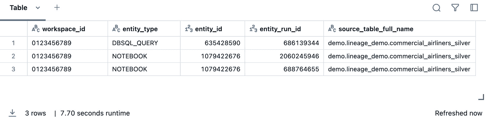

# 第七章：使用 Unity Catalog 查看数据血缘

本章中，我们将深入探讨数据血缘在 Databricks 数据智能平台中的关键作用。你将学习如何追踪数据来源、可视化数据集转换、识别上下游依赖关系，并使用 Catalog Explorer 的血缘图功能来记录血缘。到本章结束时，你将掌握确保数据来自可信来源、并在问题发生前识别出破坏性变化的技能。

本章将涵盖以下主要主题：

+   在 Unity Catalog 中引入数据血缘

+   使用数据血缘 REST API 跟踪数据来源

+   可视化上下游数据转换

+   确定依赖关系和影响

+   实操实验 – 记录整个组织的数据血缘

# 技术要求

要跟随本章提供的示例，你需要拥有 Databricks 工作区的权限，以便创建和启动一个通用集群，从而导入并执行本章配套的笔记本。所有代码示例可以从本章的 GitHub 仓库下载，地址是 [`github.com/PacktPublishing/Building-Modern-Data-Applications-Using-Databricks-Lakehouse/tree/main/chapter07`](https://github.com/PacktPublishing/Building-Modern-Data-Applications-Using-Databricks-Lakehouse/tree/main/chapter07)。本章将使用通用集群创建并运行多个新的笔记本，预计将消耗大约 5-10 **Databricks** **单位**（**DBUs**）。

# 在 Unity Catalog 中引入数据血缘

**数据血缘**是指在 **Unity Catalog**（**UC**）中追踪可安全访问对象之间关系的能力，例如表格，使用户能够查看数据资产如何从上游来源形成，并验证下游的依赖关系。


图 7.1 – 数据血缘追踪数据流动及其在内部过程中的转化

在 Databricks 中，用户可以几乎实时地追踪数据资产的血缘，这样数据管理员就能确保他们使用的是最新的资产。此外，Unity Catalog 中的数据血缘跨越多个工作区，这些工作区连接到同一个 Unity Catalog 元存储，使得数据专业人士能够获得一个*完整*的、全面的视图，了解数据集如何被转化并相互关联。

数据血缘可以跨越 Databricks 数据智能平台中的多种可安全访问对象进行追踪，以下是一些例子：

+   查询

+   表格

+   表格列

+   笔记本

+   工作流

+   机器学习模型

+   **Delta Live Tables**（**DLT**）管道

+   仪表板

就像 Databricks 数据智能平台中的许多对象一样，你可以通过多种机制追踪血缘信息，包括通过 Databricks UI 使用 Catalog Explorer，或者通过消费 Data Lineage REST API。实际上，数据血缘信息会自动由 Databricks 数据智能平台捕获并记录在系统表中（详见*第五章*）。与其他保存在 Databricks 系统表中的系统信息一样，血缘信息可能会累积不少。为了节省存储成本，默认情况下，这些信息会保留一年。对于更长期的血缘存储需求，建议建立一个替代流程，将血缘信息附加到长期归档存储中。例如，假设一个组织需要保留多年的系统审计信息，那么就需要一个长期归档的 ETL 管道，将血缘数据复制到归档存储中。

在接下来的章节中，我们将介绍在 Databricks 中查看数据资产血缘的各种方式。

# 使用 Data Lineage REST API 跟踪数据来源

像 Databricks 数据智能平台中的许多可安全访问的对象一样，存在多种方式可以检索与对象相关的详细血缘信息。Databricks 中检索某个特定对象血缘信息的一种常见方式是通过 Data Lineage REST API。目前，Data Lineage REST API 仅限于检索表血缘信息的只读视图以及列血缘信息。

| **UC 对象** | **HTTP 动词** | **端点** | **描述** |
| --- | --- | --- | --- |
| 表 | **GET** | **/** **api/2.0/lineage-tracking/table-lineage** | 给定一个 UC 表名称，检索上游和下游表连接的列表，以及它们相关的笔记本连接信息 |
| 列 | **GET** | **/** **api/2.0/lineage-tracking/column-lineage** | 给定一个 UC 表名称和列名称，检索上游和下游列连接的列表 |

表 7.1 – Data Lineage REST API 获取与 UC 表和列对象的上游和下游连接相关的信息

然而，预计 Data Lineage REST API 将随着时间的推移不断发展，增加更多的功能，使数据管理员能够检索信息，甚至操作平台内数据资产的端到端血缘信息。

让我们来看一下如何使用 Lineage Tracking API 来检索本章附带的 GitHub 仓库中，由数据集生成器笔记本创建的表的上游和下游连接信息，仓库地址为[`github.com/PacktPublishing/Building-Modern-Data-Applications-Using-Databricks-Lakehouse/tree/main/chapter07`](https://github.com/PacktPublishing/Building-Modern-Data-Applications-Using-Databricks-Lakehouse/tree/main/chapter07)。

首先，我们将在 Databricks 工作空间中创建一个全新的笔记本，并导入 **requests** Python 库。我们将专门使用 Python 的 **requests** 库来向 Databricks REST API 发送数据溯源请求，并解析来自 Databricks 控制平面的响应：

```py
import requests
```

创建并启动一个通用集群，以便将笔记本附加到该集群并运行笔记本单元格。你需要生成一个 **个人访问令牌**（**PAT**），用于与 Databricks REST 端点进行身份验证并发送数据溯源 API 请求。强烈建议将 PAT 存储在 Databricks 秘密对象中（[`docs.databricks.com/en/security/secrets/secrets.html`](https://docs.databricks.com/en/security/secrets/secrets.html)），以避免不小心泄露身份验证信息到你的 Databricks 工作空间。

重要提示

以下代码片段仅用于示范。你需要更新工作空间名称以匹配你 Databricks 工作空间的名称，并设置 API 令牌的值。

让我们使用 **requests** 库通过指定完全合格的端点，向数据溯源 API 发送请求：

```py
response = requests.get(
    f"https://{WORKSPACE_NAME}.cloud.databricks.com/api/2.0/lineage-tracking/table-lineage",
    headers={
        "Authorization": f"Bearer {API_TOKEN}"
    },
    json={
        "table_name": FULLY_QUALIFIED_TABLE_NAME,
        "include_entity_lineage": "true"
    }
)
print(response.json())
```

接下来，让我们添加一些辅助函数，用于解析来自数据溯源 API 的响应，并以易于理解的格式打印连接信息。请在你的笔记本中添加一个新的单元格，并粘贴以下辅助函数：

```py
def print_table_info(conn_type, table_info_json):
    info = table_info_json["tableInfo"]
    print(f"""
        +---------------------------------------------+
        | {conn_type.upper()} Table Connection Info
        |---------------------------------------------|
        | Table name: {info['name']}
        |---------------------------------------------|
        | Catalog name: {info['catalog_name']}
        |---------------------------------------------|
        | Table type: {info['table_type']}
        |---------------------------------------------|
        | Lineage timestamp: {info['lineage_timestamp']}
        +---------------------------------------------+
    """)
    if conn_type.upper() == "UPSTREAMS":
        print(f"""
                                |
                               \|/
        """)
def print_notebook_info(conn_type, notebook_info):
    print(f"""
        +---------------------------------------------+
        | {conn_type.upper()} Notebook Connection Info:
        |---------------------------------------------|
        | Workspace id: {str(notebook_info['workspace_id'])}
        |---------------------------------------------|
        | Notebook id: {str(notebook_info['notebook_id'])}
        |---------------------------------------------|
        | Timestamp: {notebook_info['lineage_timestamp']}
        +---------------------------------------------+
    """)
```

现在，让我们更新我们之前用于获取表格溯源信息的代码片段的响应部分，但这次我们将调用这些辅助函数：

```py
if response.status_code == 200:
    connection_flows = ["upstreams", "downstreams"]
    for flow in connection_flows:
        if flow in response.json():
            connections = response.json()[flow]
            for conn in connections:
                if "tableInfo" in conn:
                    print_table_info(flow, conn)
                elif "notebookInfos" in conn:
                    for notebook_info in conn["notebookInfos"]:
                        print_notebook_info(flow, notebook_info)
```

输出现在应该是来自我们数据溯源 API 的更加易读的响应，允许我们清晰地查看来自 Unity Catalog 中表的上游和下游表连接。


图 7.2 – 来自 Databricks Data Lineage REST API 的表格溯源响应输出

数据溯源 API 非常适合追踪 Unity Catalog 中数据集之间的连接。然而，我们还可以检索有关我们表的 *列* 的更精细的溯源信息。在下一个示例中，让我们检索有关我们表的 **description** 列的信息。我们还将定义另一个辅助函数，以便更好地显示列连接信息：

```py
def print_column_info(conn_type, column_info):
    print(f"""
        Connection flow: {conn_type.upper()}
        Column name: {column_info['name']}
        Catalog name: {column_info['catalog_name']}
        Schema name: {column_info['schema_name']}
        Table name: {column_info['table_name']}
        Table type: {column_info['table_type']}
        Lineage timestamp: {column_info['lineage_timestamp']}
    """)
column_name = "description"
response = requests.get(
    f"https://{WORKSPACE_NAME}.cloud.databricks.com/api/2.0/lineage-tracking/column-lineage",
    headers={
        "Authorization": f"Bearer {API_TOKEN}"
    },
    json={
        "table_name": FULLY_QUALIFIED_TABLE_NAME,
        "column_name": column_name
    }
)
if response.status_code == 200:
    if "upstream_cols" in response.json():
        print("| Upstream cols:")
        for column_info in response.json()['upstream_cols']:
            print_column_info("Upstream", column_info)
    if "downstream_cols" in response.json():
        print("| Downstream cols:")
        for column_info in response.json()['downstream_cols']:
            print_column_info("Downstream", column_info)
```

在这种情况下，我们表中的 **description** 列尤其引人注目，因为它是将两个不同列的文本字符串连接起来的结果。如果你使用不同的列名更新之前的列溯源请求，你会注意到上游源的数量会发生变化，以反映该列特有的连接数量。


图 7.3 – 来自 Databricks Lineage API 的列溯源响应输出

到目前为止，你应该已经能够熟练地使用 Databricks 数据血缘 API 来追踪数据集之间的连接，甚至是更精细的数据转换，如列连接。正如你所见，Data Lineage API 的请求和响应需要有处理 JSON 数据的经验。对于一些响应，我们需要创建辅助函数，将响应解析为更易读的格式。

在下一节中，我们将探讨如何使用 Databricks 用户界面来追踪数据集之间的关系，使得非技术数据管理员也能通过点击按钮轻松查看上下游数据源。

# 可视化上下游转换

在本节中，我们将利用数据集生成器笔记本，在 Unity Catalog 中创建多个数据集，以便通过 Databricks 用户界面追踪数据集血缘。如果你还没有这样做，请克隆本章附带的 GitHub 仓库，仓库地址是 [`github.com/PacktPublishing/Building-Modern-Data-Applications-Using-Databricks-Lakehouse/tree/main/chapter07`](https://github.com/PacktPublishing/Building-Modern-Data-Applications-Using-Databricks-Lakehouse/tree/main/chapter07)。接下来，启动一个现有的通用集群，或创建一个新的集群，并开始将数据生成器笔记本附加到该集群。在 Databricks 工作区的右上角点击 **Run all** 按钮，执行所有笔记本单元格，验证所有单元格都成功执行。如果遇到运行时错误，请验证你是否拥有正确的元存储权限，以在 Unity Catalog 元存储中创建新的目录、架构和表格。

重要提示

你需要获得创建新的目录和架构的权限，才能在你的 Unity Catalog 元存储中进行操作。如果无法获得此权限，可以重新使用现有的目录和架构来生成示例表格。你需要相应地更新 DDL 和 DML 语句，以匹配你自己 Databricks 工作区中的值。

数据生成器笔记本的结果应包含三张表格：**youtube_channels**、**youtube_channel_artists** 和 **combined_table**。在 Databricks 数据智能平台中，数据血缘可以通过多种方式轻松追踪。在这个示例中，让我们使用 Databricks 用户界面来追踪一个数据资产——**combined_table** 表的血缘。从你的 Databricks 工作区中，点击左侧导航菜单中的 **Catalog Explorer** 菜单选项。接下来，可以深入目录和架构以找到 **combined_table** 表，或者直接在 Catalog Explorer 顶部的搜索框中输入 **combined_table**，该框会过滤出匹配文本的所有数据资产。点击 **combined_table** 表，这将会在用户界面的右侧面板中打开数据资产的 **概览** 详情。


图 7.4 – 数据血缘可以直接从 Databricks 的 Catalog Explorer 中追溯

从 UI 面板中，点击**血缘**标签以显示表的血缘详情。导航到**血缘**标签后，你应该能看到与**combined_table**数据集相关的所有连接的摘要，清晰地标识出构建此表所使用的所有上游源，以及任何利用此表的下游依赖项。


图 7.5 – Catalog Explorer 中的血缘标签包含关于表的血缘信息

在这种情况下，应该有两行包含有关上游源的信息——**youtube_channels**父表和**youtube_channel_artists**表。由于我们刚刚使用数据生成器笔记本创建了这个表，所以不应该有任何带有下游依赖关系的行。正如你可以想象的，这个表将实时更新，列出所有以某种方式使用该数据集的对象，明确标识出数据的任何下游依赖项。

最后，让我们可视化我们的表格血缘关系。点击标有**查看血缘图**的蓝色按钮，打开血缘可视化。

现在你应该清楚地看到，两个上游表连接形成了**combined_table**表。


图 7.6 – 可以通过点击血缘图中的连接链接生成血缘连接信息

接下来，点击连接上游表和下游表**combined_table**的箭头，揭示有关血缘连接的更多详细信息。你会注意到，侧边面板会打开，显示关于血缘连接的信息，如源表和目标表，但它还会显示这些数据资产如何在 Databricks 数据智能平台的各种其他对象中被使用。例如，UI 面板将列出这些数据集当前是如何在笔记本、工作流、DLT 管道和 DBSQL 查询中被利用的。在这种情况下，我们只是通过数据生成器笔记本生成了这些表，所以它是血缘连接信息中唯一列出的对象。


图 7.7 – 可以从血缘图中查看数据集之间的连接详情

列的血缘关系也可以通过 Catalog Explorer 来追踪。在相同的血缘图中，点击 **combined_table** 表中的不同列以显示血缘信息。例如，通过点击 **description** 表列，血缘图将更新并清晰地展示 **description** 列的计算方式。在这个例子中，列是通过将一串文本与父表的类别列以及子表中的艺术家名称连接起来计算得出的。


图 7.8 – 可以通过点击列来追踪血缘关系，揭示上游血缘连接

如您所见，从 Catalog Explorer 生成血缘图提供了 Unity Catalog 中数据集之间最新关系的准确快照。这些关系可以帮助我们识别数据变更对下游依赖关系的影响，例如更改列的数据类型或删除数据集等。

在下一部分，我们将了解数据血缘如何帮助我们识别数据集之间的关系，发现利用这些数据集的依赖笔记本，并避免在整个组织中引入破坏性更改。

# 确定依赖关系和影响

在这一部分，我们将再次利用 Catalog Explorer 中的血缘图 UI，深入了解更改某一列的数据类型和数值将如何影响下游数据集和下游流程（如笔记本和工作流），并在我们的 Databricks 工作区中查看这些影响。

首先，在我们的 Databricks 工作区创建一个新的笔记本，其中包含一个新的 DLT 流水线的定义。我们 DLT 流水线中的第一个数据集将导入存储在默认**Databricks 文件系统**（**DBFS**）中的商业航空公司航班信息原始 CSV 文件，这些文件位于**/databricks-datasets**目录下。每个 Databricks 工作区都可以访问这个数据集。创建一个新的笔记本单元，并添加以下代码片段，用于在我们的数据流水线中定义一个 bronze 表：

```py
import dlt
@dlt.table(
    name="commercial_airliner_flights_bronze",
    comment="The commercial airliner flight data dataset located in `/databricks-datasets/`"
)
def commercial_airliner_flights_bronze():
    path = "/databricks-datasets/airlines/"
    return (spark.readStream
            .format("csv")
            .schema(schema)
            .option("header", True)
            .load(path))
```

我们希望通过商业喷气式飞机的信息来增强航班数据。创建一个新的笔记本单元，并添加以下代码片段，定义一个静态参考表，包含有关流行商业航空公司喷气式飞机的信息，包括制造商名称、飞机型号、原产国和燃油容量等：

```py
commercial_airliners = [
    ("Airbus A220", "Canada", 2, 2013, 2016, 287, 287, 5790),
    ("Airbus A330neo", "Multinational", 2, 2017, 2018, 123,
     123, 36744 ),
    ("Airbus A350 XWB", "Multinational", 2, 2013, 2014, 557,
     556, 44000),
    ("Antonov An-148/An-158", "Ukraine", 2, 2004, 2009, 37,
     8, 98567 ),
    ("Boeing 737", "United States", 2, 1967, 1968, 11513, 7649,
     6875),
    ("Boeing 767", "United States", 2, 1981, 1982, 1283, 764,
     23980),
    ("Boeing 777", "United States", 2, 1994, 1995, 1713, 1483,
     47890),
    ("Boeing 787 Dreamliner", "United States", 2, 2009, 2011,
     1072, 1069, 33340),
    ("Embraer E-Jet family", "Brazil", 2, 2002, 2004, 1671,
     1443, 3071),
    ("Embraer E-Jet E2 family", "Brazil", 2, 2016, 2018, 81,
     23, 3071)
]
commercial_airliners_schema = "jet_model string, Country_of_Origin string, Engines int, First_Flight int, Airline_Service_Entry int, Number_Built int, Currently_In_Service int, Fuel_Capacity int"
airliners_df = spark.createDataFrame(
    data=commercial_airpliners,
    schema=commercial_airliners_schema
)
```

接下来，我们将把航空公司喷气式飞机参考表保存到之前在 Unity Catalog 中创建的模式中：

```py
airliners_table_name = f"{catalog_name}.{schema_name}.{table_name}"
(airliners_df.write
    .format("delta")
    .mode("overwrite")
    .option("mergeSchema", True)
    .saveAsTable(airliners_table_name))
```

让我们向数据流水线添加另一个步骤，这将把我们的静态商业喷气机航空公司参考表与我们的航空航班数据流连接起来。在新的笔记本单元中，创建以下**用户定义函数**（**UDF**），它将为商业航空数据集中的每个条目生成一个尾号：

```py
from pyspark.sql.types import StringType
from pyspark.sql.functions import udf
@udf(returnType=StringType())
def generate_jet_model():
    import random
    commercial_jets = [
        "Airbus A220",
        "Airbus A320",
        "Airbus A330",
        "Airbus A330neo",
        "Airbus A350 XWB",
        "Antonov An-148/An-158",
        "Boeing 737",
        "Boeing 767",
        "Boeing 777",
        "Boeing 787 Dreamliner",
        "Comac ARJ21 Xiangfeng",
        "Comac C919",
        "Embraer E-Jet family",
        "Embraer E-Jet E2 family",
        "Ilyushin Il-96",
        "Sukhoi Superjet SSJ100",
        "Tupolev Tu-204/Tu-214"
    ]
    random_index = random.randint(0, 16)
    return commercial_jets[random_index]
```

最后，创建一个新的笔记本单元，并添加以下 DLT 数据集定义，用于我们的银表：

```py
@dlt.table(
    name="commercial_airliner_flights_silver",
    comment="The commercial airliner flight data augmented with randomly generated jet model and used fuel amount."
)
def commercial_airliner_flights_silver():
    return (dlt.read_stream(
            "commercial_airliner_flights_bronze")
            .withColumn("jet_model", generate_jet_model())
            .join(spark.table(airliners_table_name),
                  ["jet_model"], "left"))
```

当出现提示时，点击笔记本单元输出底部的蓝色按钮 **创建管道** 来创建一个新的 DLT 管道。为管道命名一个有意义的名字，例如 **商业航班管道**。选择 **触发式** 作为执行模式，并选择 **Core** 作为产品版本。接下来，选择之前代码示例中的目标目录和模式，作为我们 DLT 管道的目标数据集位置。最后，点击 **开始** 按钮以触发管道更新。


图 7.9 – 用于获取商业航班数据的 DLT 管道

假设有一个外部过程，旨在计算每个商业航班的碳足迹。在这个例子中，该过程是另一个 Databricks 笔记本，它读取我们银表的输出，并计算美国境内每个航班的二氧化碳排放量。

在您的 Databricks 工作区内创建另一个笔记本，并为笔记本起一个有意义的名字，比如 **计算商业航班碳足迹**。接下来，添加一个新的笔记本单元，读取银表并使用简单公式计算二氧化碳排放量：

*碳足迹 = 燃烧的燃料量 * 系数 / 乘客人数*

在这种情况下，我们只关心计算每架航班的碳足迹；因此，我们将避免除以乘客人数。将以下代码片段添加到新创建的笔记本中，该代码将为每个航班条目分配计算出的碳足迹：

```py
# 3.1kg of CO2 is created for every 1kg of fuel used.
# So we multiply the fuel mass above by 3.1 to estimate the CO2 emitted
# Source: https://ecotree.green/en/calculate-flight-co2
# 1 gallon of jet fuel weighs approximately 3.03907 kilograms
def calc_carbon_footprint(fuel_consumed_gallons):
    return (fuel_consumed_gallons * 3.03907) * 3.1
```

让我们再次假设我们 DLT 管道中的银表的燃料容量目前是以加仑为单位。然而，我们的欧洲业务合作伙伴希望改用升作为数据集的单位。让我们使用目录浏览器来查看银表的血缘关系图，以更好地理解将 **fuel_capacity** 列的度量单位转换为升会对数据集的使用者产生什么影响。通过点击左侧导航栏中的目录浏览器，按目录名称在搜索框中过滤，然后点击银表 **commercial_airliner_flights_silver** 来进入血缘关系图。


图 7.10 – 列的血缘关系有助于我们理解更改列将如何影响下游依赖关系 – 概览

通过生成血缘图，我们能够实时查看所有可能依赖此列的下游列。此外，我们还可以看到所有依赖此列的 Unity Catalog 对象的实时列表，例如笔记本、工作流、DLT 管道和机器学习模型。因此，实际上，我们可以快速了解更改计量单位可能对共享该数据集的组织产生的影响。

在下一节中，我们将继续这个示例，找出更新该数据集的另一种方法，以包含燃料容量、行驶距离和到达时间，使其适应欧洲标准，而不会影响任何现有的数据消费者。

# 实操实验 – 跨组织文档化数据血缘

在本节中，我们将查看 Databricks 中的系统表是如何自动记录数据集和其他数据资产之间关系随时间变化的情况。正如之前提到的，Unity Catalog 会在所有连接到同一 Unity Catalog 元存储的工作空间中保留数据血缘。这在组织需要对其数据资产进行强有力的端到端审计时尤其有用。

我们再次从在 Databricks 工作空间中创建一个新的笔记本开始，并为其设置一个有意义的标题，例如**查看文档化的数据血缘**。接下来，创建一个新的通用集群，或者将笔记本附加到一个已经运行的集群上，以开始执行笔记本单元格。

与数据血缘 API 类似，Unity Catalog 中有两个系统表提供血缘信息的只读视图——**system.access.table_lineage** 表和 **system.access.column_lineage** 表。数据血缘系统表会自动记录与 UC 表和列对象的上游和下游连接相关的信息。

| **UC 对象** | **表名** | **描述** |
| --- | --- | --- |
| 表格 | **system.access.table_lineage** | 包含上游和下游表连接的列表，以及与其相关的笔记本连接信息 |
| 列 | **system.access.column_lineage** | 包含上游和下游列连接的列表 |

表 7.2 – 数据血缘系统表捕获有关表和列的连接信息

让我们查询前面示例中的上游和下游血缘信息。在一个新的笔记本单元格中，添加以下查询并执行单元格：

```py
SELECT *
  FROM system.access.table_lineage
  WHERE source_table_name LIKE '%commercial_airliners_silver%';
```

我们得到如下输出：



图 7.11 – 可以从系统表中查询血缘信息

从输出结果可以看出，系统表自动记录了上下游数据源的连接信息。此外，系统表还会自动捕获审计信息，包括数据集创建者的信息以及对象创建事件的时间戳。这是记录、审查甚至报告组织数据集血统的绝佳方式。

# 总结

在本章中，我们介绍了在 Databricks 数据智能平台中追踪数据血统的各种方法。我们看到，Data Lineage REST API 使我们能够快速查看 Unity Catalog 中特定表格或列的上下游连接。接下来，我们展示了使用 Unity Catalog 中的 Catalog Explorer 生成血统图的简便方法。血统图对于深入了解数据集的变化如何影响下游数据消费者至关重要。最后，我们介绍了如何通过 Unity Catalog 中的系统表来记录数据资产关系的演变。

在下一章中，我们将重点介绍如何使用工具（如 Terraform）自动化部署数据管道及其所有依赖项。

# 第三部分：持续集成、持续部署与持续监控

在本书的最后部分，我们将探讨如何使用流行的自动化工具，如 **Terraform** 和 **Databricks Asset Bundles**（**DABs**），自动化管道变更的部署。我们将以如何使用 Databricks 数据智能平台中的各种工具持续监控 DLT 管道的教程作为本书的总结。

本部分包含以下章节：

+   *第八章*，*使用 Terraform 部署、维护和管理 DLT 管道*

+   *第九章*，*利用 Databricks Asset Bundles 简化数据管道的部署*

+   *第十章*，*生产环境中的数据管道监控*
