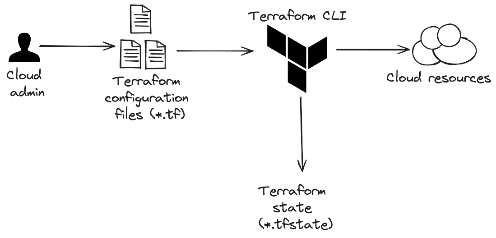
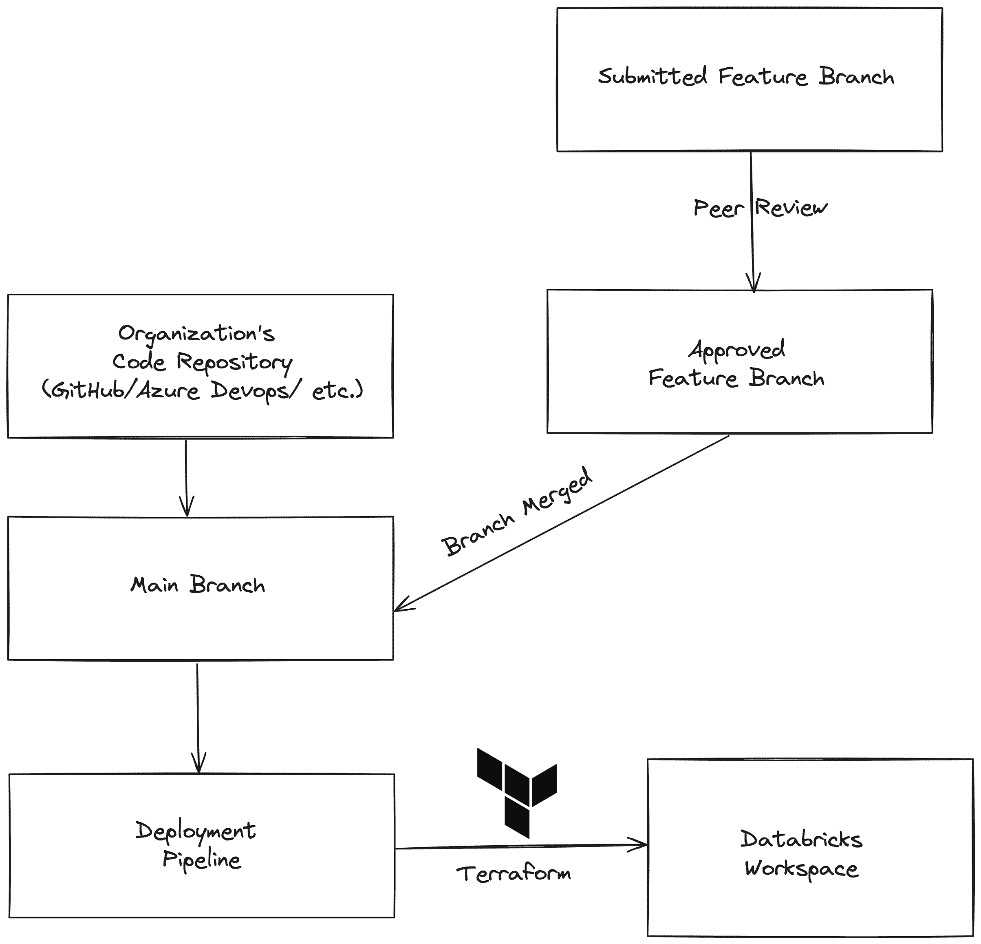
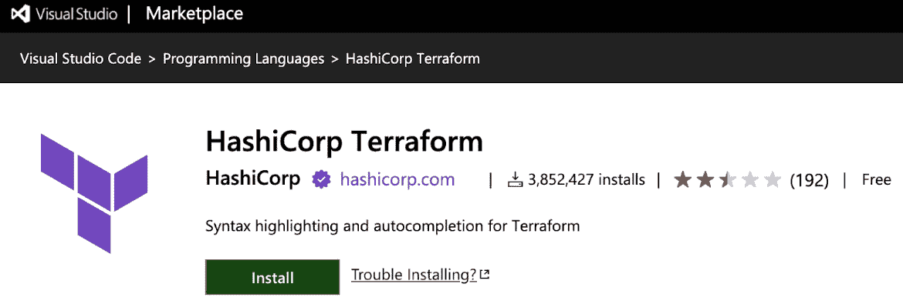
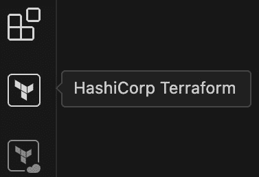
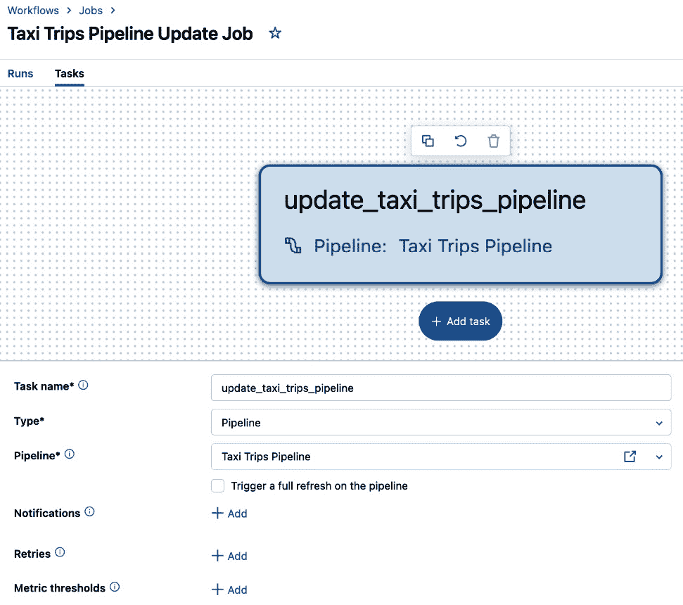

# 第八章：使用 Terraform 部署、维护和管理 DLT 数据管道

在本章中，我们将探讨如何使用像 Terraform 这样的自动化工具将数据管道以代码的形式表达，这通常被称为**基础设施即代码**（**IAC**），并应用于 Databricks。我们将学习如何使用流行的代码编辑器，如 VS Code，设置本地 Terraform 开发环境，以便我们可以尝试将不同的资源部署到 Databricks 工作区。接下来，我们将深入探讨如何使用 Terraform 表示数据管道，并如何配置 **Delta Live Tables**（**DLT**）管道的不同方面。我们还将学习如何自动化 IaC 的验证和部署到不同的 Databricks 工作区，包括生产工作区。最后，我们将讨论行业最佳实践和未来的考虑事项。

在本章中，我们将涵盖以下主要内容：

+   介绍 Terraform 的 Databricks 提供程序

+   设置本地环境

+   使用 Terraform 配置 DLT 数据管道

+   自动化 DLT 数据管道部署

+   实践操作 - 使用 VS Code 部署 DLT 数据管道

# 技术要求

为了跟随本章提供的示例，你需要拥有 Databricks 工作区权限，以创建并启动通用集群，这样你才能导入并执行本章附带的笔记本。所有的代码示例可以从本章的 GitHub 仓库下载，地址为：[`github.com/PacktPublishing/Building-Modern-Data-Applications-Using-Databricks-Lakehouse/tree/main/chapter08`](https://github.com/PacktPublishing/Building-Modern-Data-Applications-Using-Databricks-Lakehouse/tree/main/chapter08)。本章将创建并运行几个新的笔记本，还将使用产品的**高级**版运行一个新的 DLT 数据管道，预计会消耗大约 10—15 **Databricks** **Units**（**DBUs**）。

# 介绍 Terraform 的 Databricks 提供程序

Terraform 是一个开源部署自动化工具，可以用于以可重复和可预测的方式自动化部署云基础设施。Terraform 成为如此受欢迎的部署工具的原因之一是，它支持将基础设施部署到三个主要云提供商：**Amazon Web Services** (**AWS**)、**Azure** 和 **Google Cloud Platform** (**GCP**) 。Terraform 的核心概念是定义基础设施即代码（IaC），即通过代码文件表达云组件（如网络对象、虚拟机或存储容器）的配置，而不是手动部署这些组件。此外，Terraform 文件是配置驱动的。云管理员专注于通过配置表达环境之间的*变化*，而不是表达*如何*部署基础设施。最后，Terraform 维护着你的架构状态，意味着该工具将跟踪云资源的状态，并在每次执行 Terraform 配置文件时相应地更新状态。

最后，Terraform 文件可以直接从本地机器执行，允许你远程与云资源进行交互。



图 8.1 – Terraform 将通过配置文件反映环境变化

Terraform 配置文件定义了在云提供商中应用的云基础设施，基础设施状态会同步回本地环境。此外，Databricks 提供了一个 Terraform 提供者，用于将 Databricks 工作区和工作区对象部署到主要云提供商中。

Terraform 提供者是 Terraform 工具的插件，使用户能够与特定的 API 进行交互。在这个案例中，Terraform 提供者与 Databricks REST API 交互，允许工作区管理员自动化部署即便是最复杂的数据处理环境。

使用 Terraform 自动化部署组织内的数据管道有许多优势，包括以下几点：

+   在主要云提供商之间部署基础设施非常容易，使得如果需要，迁移云平台变得轻而易举。

+   通过专注于定义配置而不是手动部署和维护数据管道，轻松实现数百个数据管道的扩展。

+   管道定义简洁，允许云管理员专注于表达需要更改的内容，而不是如何部署基础设施。

让我们来看看如何轻松开始定义 Databricks 资源并将其应用于目标工作区。

# 设置本地 Terraform 环境

在开始将数据管道对象部署到 Databricks 工作区之前，我们需要安装 Terraform **命令行界面**（**CLI**）工具。如果你还没有安装，你需要下载 Terraform CLI，可以从 HashiCorp 网站免费获取（[`developer.hashicorp.com/terraform/install`](https://developer.hashicorp.com/terraform/install)）。

接下来，我们需要将 Terraform 配置文件组织到一个目录中。我们可以创建一个新的目录，命名为 **chp8_databricks_terraform**。

在新创建的目录中，我们将创建一个全新的 Terraform 配置文件，在该文件中定义我们的数据管道和其他相关的工作区对象。创建一个新文件，命名为 **main.tf**。

重要提示

Terraform 配置文件使用 Terraform 语言，并以 **.** **tf** 扩展名结尾。

## 导入 Databricks Terraform 提供程序

使用 Terraform 部署 Databricks 工作区对象的第一步是导入 Databricks Terraform 提供程序。如果你第一次使用 Terraform 提供程序，Terraform 将自动从 Terraform 注册表下载 Databricks 提供程序。Terraform 注册表是一个公共中心，用于下载第三方提供程序、模块和安全策略，帮助开发 Terraform 配置文件以部署云基础设施。

将以下代码片段添加到新创建的 Terraform 配置文件 **main.tf** 的顶部：

```py
terraform {
  required_providers {
    databricks = {
    source = "databricks/databricks"
    }
  }
}
```

这段代码将指示 Terraform CLI 工具下载并导入一个名为 **databricks** 的 Terraform 提供程序，该提供程序已经由 Databricks 组织发布到 Terraform 注册表中。

现在我们已经导入了 Databricks Terraform 提供程序，可以开始将数据管道对象部署到 Databricks 工作区。但在此之前，我们必须先与 Databricks 工作区进行身份验证，以便进行更改，例如创建新的 DLT 管道。

## 配置工作区身份验证

如果你还记得，Databricks Terraform 提供程序将在后台与 Databricks REST API 交互。因此，用于与 Databricks REST API 进行身份验证并进行工作区更改的相同身份验证机制也可以通过 Terraform 使用。

总的来说，使用 Terraform 提供程序进行 Databricks 工作区身份验证的支持方法大约有九种（最新的列表可以在此找到：[`registry.terraform.io/providers/databricks/databricks/latest/docs#authentication`](https://registry.terraform.io/providers/databricks/databricks/latest/docs#authentication)）。其中一些常见的身份验证方法包括：

+   使用工作区管理员用户名和密码

+   使用 Databricks **个人访问** **令牌**（**PAT**）

+   使用 Azure CLI 或 Google Cloud CLI

+   如果使用 Azure 云提供商，需使用服务主体或托管服务标识

+   使用 Databricks CLI（用户对机器身份验证）

重要提示

由于我们正在进行本地开发和测试，在以下示例中，我们将使用 Databricks CLI 生成一个 OAuth 令牌，并手动登录到我们的 Databricks 工作区。然而，对于生产部署，建议将工作区凭据安全地存储在像 Azure Key Vault、AWS Secrets Manager 或 HashiCorp Vault 等秘密管理器中。

有几种选项可以存储与 Terraform 一起使用的认证令牌——直接存储在 Terraform 配置文件中，作为 Databricks 提供程序导入的一部分，或者存储在本地机器中的配置文件中。我们建议选择后者，以避免在将代码文件提交到代码库时意外暴露凭证。填充此配置文件的最简单方法是使用 Databricks CLI。

Databricks CLI 支持 Windows、Linux 或 macOS 操作系统，使其成为跨平台兼容的多功能工具。如果你的本地机器使用的是 macOS 或 Linux 操作系统，你可以通过命令行提示符使用 Homebrew 包管理器下载 Databricks CLI。或者，你也可以轻松地升级现有 Databricks CLI 安装的版本。例如，以下命令将在 Mac 上使用 Homebrew 安装或升级现有的 Databricks CLI 安装：

```py
$ brew tap databricks/tap
$ brew install databricks
```

在 Windows 机器上，你可以使用流行的包管理器**winget**（[`learn.microsoft.com/windows/package-manager/winget/`](https://learn.microsoft.com/windows/package-manager/winget/)）安装 Databricks CLI。以下命令将使用 **winget** 工具下载并安装 Databricks CLI：

```py
$ winget search databricks
$ winget install Databricks.DatabricksCLI
```

下载完成后，你可以通过执行 **configure** 命令在 Databricks CLI 中配置认证：

```py
$ databricks configure
```

当将 Terraform 配置文件应用于目标环境时，Terraform CLI 会首先检查是否在配置文件中直接提供了认证信息。否则，Terraform CLI 会查找本地的 Databricks 配置文件，该文件存储在名为 **.databrickscfg** 的特殊隐藏文件中，位于用户的主文件夹下。

你还可以指定一个配置文件名称，这在你有多个 Databricks 工作区，并且需要在不同工作区之间部署基础设施组件时非常有用。使用配置文件，你可以单独存储认证信息，并在部署期间轻松引用它们。你可以在此了解更多关于创建/测试配置文件的信息：[`docs.databricks.com/dev-tools/cli/profiles.html`](https://docs.databricks.com/dev-tools/cli/profiles.html)。

## 定义 DLT 管道源笔记本

在下一个示例中，我们将定义一个笔记本，包含一个简单 DLT 管道的开始部分，并将该笔记本部署到目标 Databricks 工作区中的用户工作区目录。

要构建部署笔记本的工作区位置，我们需要获取你当前在 Databricks 中的用户。为了避免硬编码此值，我们可以使用 **databricks_current_user** 数据源，它在部署时获取当前用户的 Databricks 用户名。将以下配置块添加到 **main.tf** 文件中：

```py
data "databricks_current_user" "my_user" {}
```

接下来，我们将使用 **databricks_notebook** 资源定义一个新的 Python 笔记本，使用之前的数据源构造笔记本路径。由于笔记本相当简单，仅包含一个 DLT 数据集定义，我们将在其中内联定义笔记本内容。将以下配置块添加到 **main.tf** 文件中：

```py
resource "databricks_notebook" "dlt_pipeline_notebook" {
  path = "${data.databricks_current_user.my_user.home}/chp_8_terraform/my_simple_dlt_pipeline.py"
  language = "PYTHON"
  content_base64 = base64encode(<<-EOT
    import dlt
    @dlt.table(
        comment="The raw NYC taxi cab trip dataset located in `/databricks-datasets/`"
    )
    def yellow_taxi_raw():
        path = "/databricks-datasets/nyctaxi/tripdata/yellow"
        schema = "vendor_id string, pickup_datetime timestamp, dropoff_datetime timestamp, passenger_count integer, trip_distance float, pickup_longitude float, pickup_latitude float, rate_code integer, store_and_fwd_flag integer, dropoff_longitude float, dropoff_lattitude float, payment_type string, fare_amount float, surcharge float, mta_tax float, tip_amount float, tolls_amount float, total_amount float"
        return (spark.readStream
                    .schema(schema)
                    .format("csv")
                    .option("header", True)
                    .load(path))
    EOT
  )
}
```

最后，让我们向 **main.tf** 配置文件添加最后一个块，打印已部署笔记本的 URL：

```py
output "notebook_url" {
  value = databricks_notebook.dlt_pipeline_notebook.url
}
```

点击 **Save** 保存配置文件。在终端窗口中，导航到包含 **main.tf** 配置文件的目录。

## 应用工作区更改

应该运行的第一个命令是 **terraform init** 命令，该命令执行多个初始化步骤，以准备当前工作目录以便使用 Terraform 部署云资源。从终端窗口或 shell 提示符执行以下命令：

```py
terraform init
```

接下来，Terraform CLI 提供了一种方法，让我们在应用更改之前验证 Terraform 配置文件的效果。执行 **validate** 命令：

```py
terraform validate
```

最后，我们可以通过列出 Terraform 计划中的所有预定更改来查看拟议的基础设施更改。执行以下命令查看拟议的 Terraform 计划：

```py
terraform plan
```

你会注意到计划中将定义一个单一的资源。在这种情况下，它将是包含我们 DLT 数据集定义的新 Databricks 笔记本。

一旦我们验证计划看起来没有问题，就可以将更改应用到目标 Databricks 工作区。通过执行 **apply** 命令应用 Terraform 计划：

```py
terraform apply
```

输出将是新创建笔记本的完整 URL。复制输出的 URL 并粘贴到浏览器窗口中。验证是否有一个新的笔记本，Python 被设置为默认编程语言，且包含一个包含单一 DLT 数据集定义的笔记本单元，**yellow_taxi_raw**。

恭喜！你已经编写了第一个 Terraform 配置文件，并且在自动化部署 Databricks 资产到各个环境的道路上迈出了坚实的步伐。在下一节中，我们将基于前面的示例展开，看看 Databricks Terraform 提供者如何用于将 DLT 管道部署到工作区。

# 使用 Terraform 配置 DLT 管道

我们将使用 Databricks Terraform 提供程序中的 **databricks_pipeline** 资源，将 DLT 管道部署到目标 Databricks 工作区。**databricks_pipeline** 资源是我们 Terraform 配置文件的主要构建块。在此 Terraform 资源中，我们可以指定许多不同的配置选项，这些选项将影响 DLT 管道的部署。例如，我们可以配置 DLT 生产版、目标 Unity Catalog 位置、库依赖项、更新集群大小等。让我们深入探讨这些具体配置，以便更好地了解您对部署的 DLT 管道的控制。

有几个参数用于定义使用 Databricks 提供程序进行 Terraform 配置的 DLT 管道的配置和行为。为了更好地了解这些参数，以下部分涵盖了 Databricks 提供程序中 Terraform 的所有可用参数（最新版本可以在此找到：[`registry.terraform.io/providers/databricks/databricks/latest/docs/resources/pipeline`](https://registry.terraform.io/providers/databricks/databricks/latest/docs/resources/pipeline)）。

一般来说，**databricks_pipeline** 参数可以被看作是属于以下三类之一：

+   **运行时配置**：**名称**，**频道**，**开发**，**持续**，**版本**，**光子**，**配置**，和 **库**

+   **管道计算** **配置**：**集群**

+   **管道数据集存储配置**：**目录**，**目标**，和 **存储**

让我们更详细地了解每个参数，以更好地理解我们的 Terraform 配置对目标 DLT 管道的影响。

## name

**name** 参数为 DLT 管道分配一个字母数字名称，以便标识该管道。**name** 参数应为一个字符串，可以包含大小写字母、数字、空格和特殊字符（包括表情符号字符）。此外，管道 **name** 参数不一定需要唯一；Databricks Terraform 提供程序并不强制名称唯一。在创建 DLT 管道时，Databricks 数据智能平台会为每个管道分配一个唯一的管道标识符，因此 **name** 参数仅作为数据工程师区分其 DLT 管道与其他管道的一种方便方式。

## notification

**notification** 参数用于指定在特定管道事件期间将收到电子邮件通知的收件人列表。触发通知的 DLT 管道事件类型包括 **on-update-success**，**on-update-failure**，**on-update-fatal-failure** 和 **on-flow-failure**。

## channel

**通道**参数控制 DLT 管道更新集群应使用的 Databricks 运行时类型。只有两个选项可供选择：**CURRENT**和**PREVIEW**。**CURRENT**选择最新的稳定 Databricks 运行时版本，并且是默认选项。如果您的 DLT 管道在开发环境中运行，并且您想尝试尚未进入当前 Databricks 运行时的未来性能功能和优化，您可能希望选择**PREVIEW**。

## development

**开发**参数是一个布尔标志，用于控制是否希望以开发模式执行 DLT 管道。当设置为**true**时，Terraform 将部署一个 DLT 管道，并将管道模式设置为**开发**模式。这也会通过 DLT UI 右上角的切换按钮在 DLT UI 中显示出来。


图 8.2 – 在 DLT UI 中，开发模式可以通过切换按钮显示

同样，当该参数设置为**false**时，Terraform 将把管道模式设置为**生产**模式。如果您还记得*第二章*，我们提到过在开发模式下，DLT 在运行时异常发生时不会重试管道更新，并且还会保持更新集群的运行状态，以帮助数据工程师排查和修复错误，从而缩短调试周期。

## continuous

**持续**参数是一个布尔标志，用于控制管道更新执行的频率。当设置为**true**时，Terraform 将部署一个 DLT 管道，持续更新管道中的数据集。同样，当设置为**false**时，DLT 管道将以触发执行模式进行部署。在这种执行模式下，数据工程师需要通过点击 DLT UI 上的**开始**按钮或通过调用 Pipelines REST API 来触发管道更新的开始。

## edition

**版本**参数选择您在部署 DLT 管道时希望使用的产品版本。可以选择的选项只有三个：**CORE**，**PRO**，和**ADVANCED**。如果您还记得*第二章*，产品版本选择了您在运行 DLT 管道时希望启用的功能集。因此，管道定价反映了通过版本启用的功能数量。例如，**PRO**产品版本将允许数据工程师使用期望来强制执行数据质量，但也会产生最高的操作费用。另一方面，**CORE**产品版本可用于将传入数据追加到流表中，并将产生最少的操作费用来进行更新。

## photon

**Photon**参数是一个布尔标志，控制是否使用 Photon 处理引擎来更新 DLT 管道。当设置为**true**时，Terraform 将部署一个启用 Photon 引擎的更新集群。在数据集更新过程中，您的 DLT 管道可以利用这个快速的向量化处理引擎，使连接、聚合、窗口和排序的速度比默认集群快。设置为**false**时，DLT 将创建一个使用传统 Catalyst 引擎的更新集群。由于更快的处理速度和更好的性能，启用 Photon 执行将导致更高的 DBU 定价。

## 配置

**配置**参数允许数据工程师部署一个具有可选运行时配置的 DLT 管道。配置参数是一个可选的键值对列表。例如，可以使用该参数来填充环境变量、云存储位置或集群关闭设置等。

## 库

**库**参数可用于安装 DLT 管道更新可能依赖的集群库，以便将更新应用于管道。**库**参数还支持引用本地笔记本或任意文件依赖项，如果数据工程师希望使用本地文件而不是构建工件来包含依赖的代码文件。例如，以下**库**块可以用于包含一个在用户工作区的主目录中定义的自定义日期实用程序，作为 Python 文件：

```py
library {
  notebook {
    path = "/Users/<username>/common/utils/date_utils.py"
  }
}
```

## 集群

**集群**参数控制在更新、维护活动期间或在更新和维护任务中使用的默认集群类型。如果没有指定**集群**块，DLT 将创建一个默认集群，用于应用更新到管道的数据集。此外，**集群**参数还将包含一个**模式**参数，您可以在其中指定使用哪种类型的自动扩展。如果您还记得，在*第二章*中，我们描述了 DLT 中的两种自动扩展模式：**传统模式**和**增强模式**。例如，以下配置将创建一个更新集群，使用**增强模式**自动扩展，从最小的三台工作节点扩展到最多八个节点：

```py
cluster {
  node_type_id = "i3.xlarge"
  autoscale {
    min_workers = 3
    max_workers = 8
    mode = "ENHANCED"
  }
}
```

## 目录

**目录**参数确定用于在 Unity Catalog 中存储 DLT 管道输出数据集的目录。随着 DLT 管道执行数据集的定义，这些数据集需要指定一些目标位置。您可以指定目录和模式的组合（在下节*目标*中介绍），或者可以指定一个云存储位置——但不能同时指定两者。此参数与下一个参数**存储**参数是互斥的。或者，数据工程师可以继续将 DLT 管道的数据集存储在传统的 Hive 元数据存储中，指定以下配置：

```py
catalog {
  name = "hive_metastore"
}
```

重要提示

如果在 Terraform 配置文件中更改了 **catalog** 或 **storage** 参数，并且应用了这些更改，Terraform 将会重新创建整个 DLT 流水线并应用新的更改。这些值在原始 DLT 流水线部署后无法更新。

## target

**target** 参数指定了在 DLT 流水线中存储输出数据集的架构。这个参数与前面的 **catalog** 参数一起，指定了在 Unity Catalog 或传统 Hive Metastore 中的完全限定架构。数据工程师可以选择使用 **catalog** 和 **target** 参数中设置的值，作为查询 DLT 流水线中间数据集的便捷方式。这可以用于常见的任务，例如数据验证、调试或一般的数据整理。

## storage

**storage** 参数可用于指定一个云存储位置，用于存储 DLT 流水线的输出数据集和其他相关元数据。请注意，这个参数与前面的 **catalog** 参数互斥。**storage** 参数可以包含完全限定的存储位置路径、卷位置，或 **Databricks 文件系统**（**DBFS**）中的位置。例如，以下配置块将创建一个 DLT 流水线，其输出数据集将存储在 DBFS 中：

```py
storage {
  path = "/pipelines/my-dlt-pipeline-output/"
}
```

重要提示

**storage** 和 **catalog** 参数是互斥的。在编写 Terraform 配置文件时，您只能指定其中一个。

到目前为止，您应该已经能够自信地使用 **databricks_pipeline** 资源，通过 Terraform 的 Databricks 提供程序声明 DLT 流水线。您还应该对可用的不同类型的配置选项有更深入的理解，以便自定义目标 DLT 流水线。在接下来的部分中，我们将探讨如何使用现有的版本控制系统自动化 DLT 流水线的部署，以便最新的更改能够在发布后尽快在目标工作区中同步。

# 自动化 DLT 流水线部署

Terraform 可以与自动化的 **持续集成/持续部署**（**CI/CD**）工具结合使用，例如 GitHub Actions 或 Azure DevOps Pipelines，自动将代码更改部署到您的 Databricks 工作区。由于 Terraform 是跨平台的，目标 Databricks 工作区可以位于主要的云服务提供商之一：GCP、AWS 或 Azure。这使得您的开发团队能够在一组代码工件中维护基础设施，同时又能灵活地将相同的资源应用于其他云提供商。

让我们了解一个典型的 CI/CD 流程，该流程使用 Databricks 提供的 Terraform 提供程序将 Databricks 资源部署到目标工作区。CI/CD 流程将包含两个自动化构建流水线——一个用于验证在功能分支中所做的更改，另一个用于将已批准并合并到主代码分支的更改部署到 Databricks 工作区。

首先，一名团队成员创建一个新的功能分支，用于跟踪他们组织的基础设施即代码（IaC）代码库的更改。完成后，工程师将打开一个拉取请求，要求一个或多个团队成员审查更改，留下反馈，并批准或拒绝更改。打开拉取请求后，构建流水线将被触发运行，流水线将检出功能分支，使用 Terraform **init** 命令初始化当前工作目录，使用 Terraform **validate** 命令验证 Terraform 计划，并生成一个 Terraform 计划的输出。可选地，这个 Terraform 计划可以作为评论自动包含在拉取请求中，供团队成员审查。

当拉取请求获得团队成员的批准后，功能分支可以合并到主代码库分支——简称为**主**分支。

一旦功能分支合并到**主**分支，构建发布流水线就会被触发运行。构建发布流水线将检出最新的**主**分支副本，并使用 Terraform **apply** 命令应用更改。在应用 Terraform 计划后，组织基础设施的更新将反映在目标 Databricks 工作区中。



图 8.3 – 使用构建工具自动部署 Databricks 资源

到目前为止，你应该完全理解如何使用像 Azure DevOps 这样的工具设计自动化的 Databricks 部署，借助 Terraform 同步基础设施的更改。让我们将前面各节中学到的内容结合起来，使用典型的开发环境将我们自己的 DLT 流水线部署到目标 Databricks 工作区。

# 实践练习 – 使用 VS Code 部署 DLT 流水线

在这个动手实践中，我们将使用流行的代码编辑器 **Visual Studio Code** (**VS Code**) 来编写新的 Terraform 配置文件，部署 DLT 流水线到目标 Databricks 工作区。多年来，VS Code 因其易用性、轻便的内存占用、友好的代码导航、语法高亮和代码重构功能，以及丰富的扩展社区而获得了极大的欢迎。此外，VS Code 是围绕开源社区构建的，意味着它可以免费下载安装并使用。更重要的是，VS Code 是一个跨平台的代码编辑器，支持 Windows、macOS 和 Linux 操作系统。在这个动手实践中，我们将使用一个社区扩展——HashiCorp 编写的 Terraform 插件，用于帮助开发 Terraform 配置文件。例如，VS Code 的 Terraform 插件提供了 Terraform 语法高亮、自动补全、代码格式化、通过 VS Code 命令面板访问 Terraform 命令，并且总的来说，提供了一个轻松的体验，帮助我们导航 Terraform 配置文件，以便部署 Databricks 工作区对象。

## 设置 VS Code

VS C[ode 可以从其官方网站](https://code.visualstudio.com/download)下载，网址为 [`code.visualstudio.com/download`](https://code.visualstudio.com/download)。如果你还没有安装 VS Code，选择适合本地操作系统的安装程序下载。下载过程可能需要几分钟，具体取决于你的网络连接速度。下载完成后，解压 ZIP 文件以查看下载的内容。接下来，双击应用程序文件，**Visual Studio Code**，启动代码编辑器。或者，你也可以将应用程序文件移动到本地操作系统的 **Applications** 目录中。

接下来，让我们安装 HashiCorp 提供的 Terraform 扩展。在一个网页浏览器窗口中，访问 Visual Studio Marketplace 上的 Terraform 扩展，网址为 [`marketplace.visualstudio.com/items?itemName=HashiCorp.terraform`](https://marketplace.visualstudio.com/items?itemName=HashiCorp.terraform)。或者，你可以在 VS Code 中的 Marketplace 搜索框中搜索该扩展。点击 **安装** 按钮，下载并安装适用于 VS Code 的 Terraform 扩展。



图 8.4 – HashiCorp 提供的 Terraform 扩展可以从 Visual Studio Marketplace 安装。

你可能会被提示允许浏览器打开本地的 VS Code 应用程序。如果是这样，点击 **允许** 按钮以打开 VS Code 并安装扩展。扩展将在几分钟内下载并安装完成。安装完成后，你应该可以在 VS Code 左侧导航栏中看到 HashiCorp Terraform 的菜单项。



图 8.5 – HashiCorp Terraform 扩展将在左侧导航栏中创建新的菜单项

现在，Terraform 扩展已经成功安装，当代码编辑器检测到 Terraform 文件时，扩展会自动激活。你可以通过在打开的 Terraform 文件右下角看到 Terraform 的标志来确认扩展是否已激活。

## 创建一个新的 Terraform 项目

让我们为我们的动手练习创建一个新的目录：

```py
$ mkdir chapter_8_hands_on
$ cd chapter_8_hands_on
```

创建一个空的 Terraform 配置文件，命名为 **main.tf**，可以从命令行提示符或者使用 VS Code 创建：

```py
$ touch main.tf
```

（可选）你可以从本章的 GitHub 仓库克隆示例项目，仓库地址为 [`github.com/PacktPublishing/Building-Modern-Data-Applications-Using-Databricks-Lakehouse/tree/main/chapter08`](https://github.com/PacktPublishing/Building-Modern-Data-Applications-Using-Databricks-Lakehouse/tree/main/chapter08)。接下来，通过选择 **文件** | **打开文件夹**，并导航到目录的位置，在 VS Code 中打开该目录。

## 定义 Terraform 资源

让我们从扩展本章开始时 *设置本地 Terraform 环境* 部分的 Terraform 示例入手。你可以复制现有的 **main.tf** 文件，或者直接编辑现有 **main.tf** 配置文件的内容。

首先，让我们通过在 **databricks_notebook** 资源定义中添加第二个数据集来开始定义 DLT 流水线（出于简洁性考虑，*定义 DLT 流水线源笔记本*部分的代码在下面的代码块中已被省略）。现在我们将有一个包含两个数据集的数据流水线——一个铜层，接着是银层。请在 **main.tf** 文件中更新 **databricks_notebook** 资源定义，内容如下：

```py
resource "databricks_notebook" "dlt_pipeline_notebook" {
  path = "${data.databricks_current_user.my_user.home}/chp_8_terraform/taxi_trips_pipeline.py"
...
                    .load(path))
    @dlt.table(
        name="yellow_taxi_silver",
        comment="Financial information from incoming taxi trips."
    )
    @dlt.expect_or_fail("valid_total_amount", "total_amount > 0.0")
    def yellow_taxi_silver():
        return (dlt.readStream("yellow_taxi_bronze")
                    .withColumn("driver_payment",
                                F.expr("total_amount * 0.40"))
                    .withColumn("vehicle_maintenance_fee",
                                F.expr("total_amount * 0.05"))
                    .withColumn("adminstrative_fee",
                                F.expr("total_amount * 0.1"))
                    .withColumn("potential_profits",
                                F.expr("total_amount * 0.45")))
    EOT
  )
}
```

接下来，在我们创建新的 DLT 流水线之前，我们需要在 Unity Catalog 中定义一个位置来存储流水线数据集。请将以下目录和架构资源定义添加到 **main.tf** 文件的底部：

```py
resource "databricks_catalog" "dlt_target_catalog" {
  name = "chp8_deploying_pipelines_w_terraform"
  comment = "The target catalog for Taxi Trips DLT pipeline"
}
resource "databricks_schema" "dlt_target_schema" {
  catalog_name = databricks_catalog.dlt_target_catalog.id
  name = "terraform_demo"
  comment = "The target schema for Taxi Trips DLT pipeline"
}
```

现在我们有了包含 DLT 流水线定义的更新源笔记本，以及一个存储流水线数据集的位置，我们可以定义一个 DLT 流水线。请将以下流水线定义添加到 **main.tf** 文件：

```py
resource "databricks_pipeline" "taxi_trips_pipeline" {
  name = "Taxi Trips Pipeline"
  library {
    notebook {
      path = "${data.databricks_current_user.my_user.home}/chp_8_terraform/taxi_trips_pipeline.py"
    }
  }
  cluster {
    label = "default"
    num_workers = 2
    autoscale {
      min_workers = 2
      max_workers = 4
      mode = "ENHANCED"
    }
    driver_node_type_id = "i3.2xlarge"
    node_type_id = "i3.xlarge"
  }
  continuous = false
  development = true
  photon = false
  serverless = false
  catalog = databricks_catalog.dlt_target_catalog.name
  target = databricks_schema.dlt_target_schema.name
  edition = "ADVANCED"
  channel = "CURRENT"
}
```

您会注意到，我们已经定义了包含 DLT 管道定义的笔记本的位置、用于管道更新和维护任务的默认集群，以及其他运行时设置，如开发模式、产品版本、频道等。

接下来，我们需要协调对 DLT 管道的更新，以便我们可以在重复的时间表上触发运行，配置警报通知或设置超时阈值。将以下工作流定义添加到**main.tf**文件的底部：

```py
resource "databricks_job" "taxi_trips_pipeline_job" {
  name = "Taxi Trips Pipeline Update Job"
  description = "Databricks Workflow that executes a pipeline update of the Taxi Trips DLT pipeline."
  job_cluster {
    job_cluster_key = "taxi_trips_pipeline_update_job_cluster"
    new_cluster {
      num_workers = 2
      spark_version = "15.4.x-scala2.12"
      node_type_id  = "i3.xlarge"
      driver_node_type_id = "i3.2xlarge"
    }
  }
  task {
    task_key = "update_taxi_trips_pipeline"
    pipeline_task {
      pipeline_id = databricks_pipeline.taxi_trips_pipeline.id
    }
  }
  trigger {
    pause_status = "PAUSED"
    periodic {
      interval = "1"
      unit = "HOURS"
    }
  }
}
```

最后，我们需要输出已部署资源的工作流 URL，以便我们可以轻松地从浏览器打开工作流 UI。将以下输出定义添加到**main.tf**文件中：

```py
output "workflow_url" {
  value = databricks_job.taxi_trips_pipeline_job.url
}
```

## 部署 Terraform 项目

在我们开始部署新资源之前，第一步是初始化 Terraform 项目。在父目录中执行 Terraform 的**init**命令，可以通过 VS Code 命令面板或 Shell 提示符来完成：

```py
$ terraform init
```

接下来，通过执行 Terraform 的**plan**命令来预览 Terraform 文件中的更改，以查看拟议的基础设施更改：

```py
$ terraform plan
```

总共有五个新的资源会被创建，包括**databricks_notebook**资源，它代表了包含 DLT 管道定义的笔记本、目标 Unity Catalog 的目录、目标 Unity Catalog 架构、**databricks_pipeline**资源，它代表我们的 DLT 管道，以及**databricks_job**资源，它代表将触发管道更新的工作流。

在验证计划之后，我们现在可以将我们的 DLT 管道部署到 Databricks 工作区。接下来，执行 Terraform 的**apply**命令，将新的基础设施更改部署到我们的工作区：

```py
$ terraform apply
```

一旦所有资源更改应用完毕，您应该期待 Terraform 输出 Databricks 工作流的 URL。

将工作流 URL 复制并粘贴到浏览器窗口中，并确保该地址解析到目标工作区中新创建的工作流。您会注意到，新工作流包含一个用于更新 DLT 管道的任务。该工作流已暂停，如 Terraform 配置所示。您也可以点击蓝色的**立即运行**按钮来触发工作流的一个新的立即运行。



图 8.6 – Terraform 将输出用于更新 DLT 管道的工作流 URL

尽管将更改部署到目标 Databricks 工作区很简单，但撤销这些更改同样容易。执行以下命令以从目标 Databricks 工作区中删除所有资源更改：

```py
$ terraform destroy
```

通过输入**yes**确认该决定。完全撤销所有资源从您的 Databricks 工作区中可能需要几分钟。

正如你所看到的，通过几个按键和几次点击，使用 Databricks Terraform 提供者在 Databricks 工作区中配置和去配置资源变得既快速又简便。我们没有指示 Terraform 如何将资源部署到目标 Databricks 工作区，而是专注于通过配置做出哪些更改，让 Terraform 工具为我们处理繁重的工作。

# 总结

在本章中，我们介绍了如何使用 Databricks Terraform 提供者实现 CI/CD 过程，以便在工作区之间部署数据管道。我们看到，如何轻松设置本地开发环境来处理 Terraform 配置文件，以及在将配置应用于目标环境之前，如何轻松测试我们的 Terraform 计划。我们还从 Terraform 注册中心安装了 Databricks Terraform 提供者，并将其导入到 Terraform 配置文件中。接下来，我们深入了解了 **databricks_pipeline** 资源，它由 Databricks Terraform 提供者用于将 DLT 管道部署到目标工作区。我们检查了资源规范中的每个参数，并了解了如何控制 DLT 管道的运行时配置、计算设置，甚至管道输出数据集的位置。最后，我们看到，通过将 Terraform 配置文件存储在 GitHub 等版本控制系统中并利用 Azure DevOps Pipelines 等构建工具自动化部署，自动化配置文件变得如此简单。我们通过一个实际操作示例来结束本章，展示了如何使用 Terraform 扩展和流行的代码编辑器 VS Code 从本地开发环境部署 DLT 管道。

然而，Terraform 并不适合所有人，可能对你的用例来说，它过于复杂或难以使用。在下一章中，我们将深入探讨**Databricks 资源包**（**DABs**），这是另一个 CI/CD 工具，可以简化将 Databricks 代码工件打包并部署到数据和机器学习工作负载的过程。
