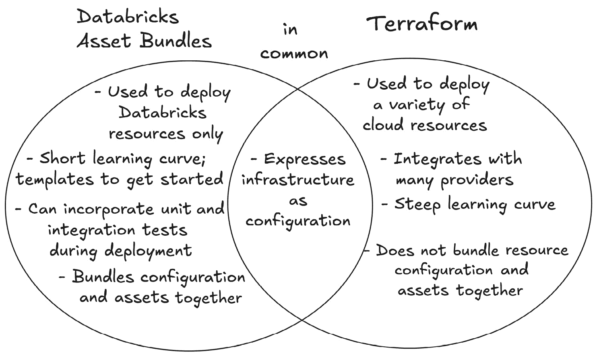
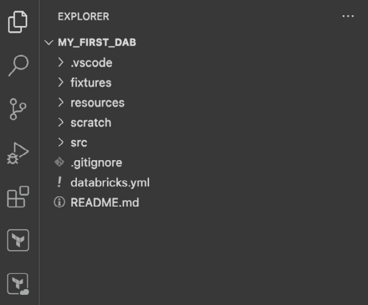

# 第九章：利用 Databricks 资产包简化数据管道部署

本章探讨了一种相对较新的 **持续集成与持续部署** (**CI/CD**) 工具，称为 **Databricks 资产包** (**DABs**)，它可以用来简化数据分析项目在不同 Databricks 工作区中的开发和部署。在本章中，我们将深入了解 **DABs** 的核心概念。我们将通过几个实践操作示例来演示 DAB 的实际应用，帮助你熟悉作为 DAB 开发下一个数据分析项目。最后，我们将介绍如何通过版本控制系统（如 GitHub）使用 DAB 来促进跨团队协作，以及 DAB 如何简化即使是最复杂的数据分析部署。

在本章中，我们将覆盖以下主要内容：

+   Databricks 资产包简介

+   Databricks 资产包的应用

+   简化跨团队协作

+   版本控制与维护

# 技术要求

为了跟随本章中的示例，建议你拥有 Databricks 工作区的管理员权限，以便能够将 DAB 部署到目标工作区。你还需要下载并安装版本为 0.218.0 或更高版本的 Databricks CLI。所有的代码示例可以从本章的 GitHub 仓库中下载，地址为 [`github.com/PacktPublishing/Building-Modern-Data-Applications-Using-Databricks-Lakehouse/tree/main/chapter09`](https://github.com/PacktPublishing/Building-Modern-Data-Applications-Using-Databricks-Lakehouse/tree/main/chapter09)。在本章中，我们将部署多个新的工作流、DLT 管道、笔记本和集群。预计这将消耗大约 5-10 **Databricks** **Units** (**DBUs**)。

# Databricks 资产包简介

DAB 提供了一种简单便捷的方式，可以与 YAML 元数据一起开发你的数据和 **人工智能** (**AI**) 项目，用于声明相关的基础设施—就像一个捆绑包。DAB 为数据工程师提供了一种程序化验证、部署和测试 Databricks 资源到目标工作区的方法。这可能包括部署工作区资产，如 **Delta Live Tables** (**DLT**) 管道、工作流、笔记本等。DAB 还提供了一种便捷的方式来开发、打包和部署机器学习工作负载，使用可重用的模板（我们将在 *使用模板初始化资产包* 部分介绍 DAB 模板），这些模板称为 MLOps 堆栈。

DAB 是围绕表达**基础设施即代码**（**IaC**）的原则设计的，利用配置来驱动数据应用程序架构组件的部署。DAB 提供了一种将 IaC 配置与数据资产（如 Python 文件、笔记本和其他依赖项）一起管理的方式。如果你觉得 Terraform（在*第八章*中有介绍）对于你组织在 Databricks 数据智能平台中的需求过于复杂，DAB 也可以作为一种替代方案。

DAB 与 Terraform 有一些相似之处，两者都是 IaC 工具，能够让用户定义云资源并以云中立的方式部署这些资源。然而，它们也有许多不同之处。让我们比较一下 DAB 和 Terraform 之间的一些相似性和差异性，以便更好地了解在组织的需求下，何时选择哪个工具：



图 9.1 – DAB 和 Terraform 都是 IaC 工具，但它们满足的是非常不同的需求

在我们开始编写第一个 DAB 之前，先花点时间了解一下构成 DAB 配置文件的主要构建块。

## DAB 配置文件的元素

DAB 的核心是一个 YAML 配置文件，名为**databricks.yml**。该配置文件为工程师提供了一个配置其项目资源部署的入口点。该文件由许多可组合的构建块组成，这些构建块告诉 Databricks 的**命令行界面**（**CLI**）将什么资源部署到目标 Databricks 工作区，并如何配置每个资源。每个构建块都接受不同的参数来配置该组件。

在本章稍后，我们将介绍如何将配置文件分解为多个 YAML 文件，但为了简单起见，我们从单个 YAML 文件开始。在这个 YAML 配置文件中，我们将声明我们的 Databricks 资源以及其他元数据。这些构建块，或**映射**，告诉 DAB 工具创建什么 Databricks 资源，更重要的是，告诉 DAB 工具操作哪个 Databricks REST API 来创建和配置 Databricks 资源。

这些映射可以是各种 Databricks 资源。例如，DAB 配置文件可以包含以下映射的任意组合：

| **映射名称** | **是否必需？** | **描述** |
| --- | --- | --- |
| **bundle** | 是 | 包含有关当前资产包的顶级信息，包括 Databricks CLI 版本、现有集群标识符和 git 设置。 |
| **variables** | 否 | 包含在 DAB 部署执行过程中将动态填充的全局变量。 |
| **workspace** | 否 | 用于指定非默认工作区位置，例如根存储、工件存储和文件路径。 |
| **permissions** | 否 | 包含有关要授予已部署资源的权限的信息。 |
| **resources** | 是 | 指定要部署的 Databricks 资源以及如何配置它们。 |
| **artifacts** | 否 | 指定部署工件，如 Python **.whl** 文件，这些文件将在部署过程中生成。 |
| **include** | 否 | 指定一个相对文件路径模式列表，以包括其他配置文件。这是将 DAB 配置文件分割成多个子配置文件的一个好方法。 |
| **sync** | 否 | 指定在部署过程中要包含或排除的相对文件路径模式列表。 |
| **targets** | 是 | 除了 Databricks 工作区外，指定有关工作流、管道和工件的上下文信息。 |

表 9.1 – databricks.yml 文件中的映射

让我们看一个简单的 DAB 配置文件，以便我们熟悉一些基本概念。以下示例将创建一个名为**Hello, World!**的新 Databricks 工作流，该工作流将运行一个打印简单而流行表达式 **Hello, World!** 的笔记本：

```py
bundle:
  name: hello_dab_world
resources:
  jobs:
    hello_dab_world_job:
      name: hello_dab_world_job
      tasks:
        - task_key: notebook_task
          existing_cluster_id: <cluster_id>
          notebook_task:
            notebook_path: ./src/hello_dab_world.py
targets:
  dev:
    default: true
    workspace:
      host: https://<workspace_name>.cloud.databricks.com
```

在这个简单的示例中，我们的 DAB 配置文件由三个主要部分组成：

+   **bundle** : 该部分包含有关当前 DAB 的高级信息——在此案例中是其名称。

+   **resources** : 这定义了一个新的 Databricks 工作流，包含一个单一的笔记本任务，应该在现有集群上运行。

+   **targets** : 这指定了有关目标 Databricks 工作区的信息，工作流和笔记本应该部署到该工作区。

现在我们已经对 DAB 配置文件的基础知识有了充分了解，接下来让我们看看如何在不同的部署场景下部署 Databricks 资源。

## 指定部署模式

DAB 配置文件中有一个可用的属性是部署模式，它允许我们在部署资源时指定操作模式。部署模式有两种类型：开发模式和生产模式。

在 *开发* 模式下，所有资源都以特殊前缀 **[dev <用户名>]** 标记，表示这些资源处于开发阶段。此外，所有可用资源在部署时都会带有 **dev** 元数据标签，进一步表明这些资源处于开发阶段。正如你可能从 *第二章* 回忆起的那样，DLT 也有一个开发模式可用。当 DLT 管道在开发模式下使用 DAB 部署时，所有已部署的 DLT 管道将在目标工作区启用开发模式的情况下进行部署。

在开发生命周期中，工程师通常需要尝试更改并快速迭代设计变更。因此，开发模式也会暂停所有 Databricks 工作流计划，并允许相同工作流的并行运行，使工程师能够直接从 Databricks CLI 以临时方式运行工作流。同样，开发模式也允许您指定一个现有的通用集群用于部署过程，您可以通过 **--** **compute-id <cluster_id>** 参数从 Databricks CLI 指定集群 ID，或者将集群 ID 添加到 YAML 配置文件的顶级 **bundle** 映射中。

让我们来看看如何指定一个目标工作区，以便将其用作开发环境，并使用默认的现有通用集群覆盖所有集群：

```py
targets:
  dev:
    default: true
    mode: development
    compute_id: <cluster_id>
    workspace:
      host: https://<workspace_name>.cloud.databricks.com
```

相反，您还可以指定生产模式。在 *生产* 模式下，资源不会添加特殊的命名前缀，也不会应用标签。然而，生产模式会在将资源部署到目标工作区之前验证这些资源。例如，它会确保所有 DLT 管道已设置为生产模式，并且指定云存储位置或工作区路径的资源不会指向用户特定的位置。

在下一节中，我们将卷起袖子，深入使用 Databricks CLI 来实验资源包，并查看它们的实际应用。

# Databricks 资源包在实际应用中的效果

DAB 完全依赖于 Databricks CLI 工具（请参阅*第八章*获取安装说明）来从模板创建新的资源包，将资源包部署到目标工作区，甚至从工作区中删除先前部署的资源包。对于本节内容，您需要使用版本 0.218.0 或更高版本的 Databricks CLI。您可以通过传递 **--** **version** 参数快速检查本地 Databricks CLI 的版本：

```py
databricks –-version
```

您应该会得到类似于以下 *图 9* *.2* 的输出：


图 9.2 - 检查已安装的 Databricks CLI 版本

一旦您成功安装了推荐版本的 Databricks CLI，您可以通过显示 **bundle** 命令的手册页来测试安装是否成功。输入以下命令，以从 CLI 显示可用的参数和说明：

```py
$ databricks bundle --help
```

我们将看到如下的手册页：


图 9.3 – Databricks CLI 中 **bundle** 命令的手册页

在开始编写 DABs 并将资源部署到 Databricks 工作区之前，我们需要先进行 Databricks 工作区的认证，以便我们可以部署资源。DABs 使用 OAuth 令牌与 Databricks 工作区进行认证。DABs 可以使用两种类型的 OAuth 认证——**用户与机器**（**U2M**）认证和**机器与机器**（**M2M**）认证。

## 用户与机器认证

U2M 认证涉及一个人在循环中生成一个 OAuth 令牌，该令牌可以在将新资源部署到目标工作区时使用。这种认证类型涉及一个用户，当 CLI 工具提示时，用户将通过 web 浏览器登录。此认证类型适用于开发场景，用户希望在非关键的开发工作区中尝试 DAB 并部署资源。

U2M 是与 Databricks 工作区认证的最简单方法，可以直接通过 Databricks CLI 完成：

```py
$ databricks auth login --host <workspace-url>
```

工作区的信息，如工作区的 URL、昵称和认证详情，都会保存在本地机器的用户目录下的隐藏文件中。例如，在 Mac 和 Linux 系统中，这些信息将被写入用户主目录下的本地 **~/.databrickscfg** 文件：


图 9.4 – 多个 Databricks 配置文件保存到本地配置文件的示例

你可以通过使用 CLI 命令传递 **--profile <profile_nickname>** 参数来快速切换不同的 Databricks 工作区。例如，以下命令将把 DAB 应用到 **TEST_ENV** 配置文件下保存的工作区：

```py
$ databricks bundle deploy –-profile TEST_ENV
```

U2M 认证严格设计用于开发目的。对于生产环境，不推荐使用这种认证类型，因为它无法自动化，且无法限制访问到最低必要权限。在这种情况下，推荐使用 M2M 认证。

让我们看看这种替代认证类型，特别是当你在生产环境中自动化 DAB 部署时。

## 机器与机器认证

M2M 认证本身并不涉及人类。这种认证类型是为完全自动化的 CI/CD 工作流设计的。此外，这种认证类型与版本控制系统如 GitHub、Bitbucket 和 Azure DevOps 配合良好。

M2M 需要使用服务主体来抽象化 OAuth 令牌的生成。此外，服务主体使自动化工具和脚本仅通过 API 访问 Databricks 资源，相较于使用用户或组，提供了更高的安全性。因此，服务主体是生产环境的理想选择。

M2M 需要 Databricks 账户管理员创建一个服务主体，并从 Databricks 账户控制台生成 OAuth 令牌。一旦 OAuth 令牌在服务主体的身份下生成，该令牌就可以用来填充环境变量，如**DATABRICKS_HOST**、**DATABRICKS_CLIENT_ID** 和 **DATABRICKS_CLIENT_SECRET**，这些环境变量用于 GitHub Actions 或 Azure DevOps 等自动化构建和部署工具。

## 使用模板初始化资产包

DAB 还提供项目模板，允许开发人员使用预定义设置快速创建新包。DAB 模板包含预定义的工件和常用的 Databricks 项目设置。例如，以下命令将初始化一个本地 DAB 项目：

```py
$ databricks bundle init
```

从 CLI 进行操作时，用户将被提示选择一个 DAB 模板：


图 9.5 – 使用 Databricks CLI 从模板初始化一个新的 DAB 项目

在撰写本文时，DAB 提供四个模板供选择：**default-python**，**default-sql**，**dbt-sql** 和 **mlops-stacks**（[`docs.databricks.com/en/dev-tools/bundles/templates.html`](https://docs.databricks.com/en/dev-tools/bundles/templates.html)）。不过，你也可以选择创建组织模板并生成可重用的项目包。

现在我们对 DAB 的基础知识有了清晰的了解，让我们将迄今为止学到的内容整合起来，并将一些资源部署到 Databricks 工作区。

# 实操练习 – 部署你的第一个 DAB

在这个实操练习中，我们将创建一个基于 Python 的资产包，并在目标工作区中部署一个简单的 Databricks 工作流，该工作流运行一个 DLT 管道。

我们从创建一个本地目录开始，稍后将在该目录中创建我们 DAB 项目的框架。例如，以下命令将在用户的主目录下创建一个新目录：

```py
$ mkdir –p ~/chapter9/dabs/
```

接下来，导航到新创建的项目目录：

```py
$ cd ~/chapter9/dabs
```

通过输入以下命令并在重定向到浏览器窗口时完成**单点登录**（**SSO**）登录，生成一个新的 OAuth 令牌，使用 U2M 认证：

```py
$ databricks auth login
```

现在我们已经创建了目录，并且与目标工作区进行了身份验证，接下来让我们使用 Databricks CLI 初始化一个空的 DAB 项目。输入以下命令以弹出选择 DAB 模板的提示：

```py
$ databricks bundle init
```

接下来，从模板选择提示中选择**default-python**。为你的项目输入一个有意义的名称，例如**my_first_dab**。当提示你选择一个笔记本模板时，选择**No**。当提示你是否包含一个示例 DLT 管道时，选择**Yes**。最后，当提示你是否添加示例 Python 库时，选择**No**。项目框架将被创建，此时你可以列出目录内容，以便查看生成的构件：

```py
$ cd ./my_first_dab  # a new dir will be created
$ ls -la             # list the project artifacts
```

为了更方便地导航到新创建的项目文件，使用你喜欢的代码编辑器（如 VS Code）打开项目目录：



图 9.6——使用 default-python 模板生成的 DAB 项目框架，从 VS Code 查看

继续探索生成的 DAB 项目的子目录。你应该会注意到几个重要的目录和文件：

+   **src**：此目录包含作为笔记本文件的 DLT 管道定义。

+   **resources**：DAB 可以被分解为多个与单个资源或资源子集相关的 YAML 文件。此目录包含 DLT 管道的资源定义以及运行管道的工作流定义，包括调度、笔记本任务定义和作业集群属性。

+   **databricks.yml**：这是我们 DAB 的主要入口点和定义。它告诉 Databricks CLI 部署哪些资源以及如何部署它们，并指定目标工作空间信息。

+   **README.md**：这是项目的 README 文件，包含有关项目不同部分的有用信息，以及如何部署或撤销资源的说明。

打开**src**目录下包含的**dlt_pipeline.ipynb**笔记本。注意，这个笔记本定义了两个数据集——一个是读取来自 NYC Taxi 数据集的原始、未处理 JSON 文件的视图，另一个是基于**fare_amount**值小于 30 的行过滤视图的表。

接下来，打开**databricks.yml**文件。你会注意到该文件有三个主要部分：**bundle**、**include**和**targets**。

为了简化，在**targets**映射下，删除所有部分，保留**dev**部分。我们将在此练习中只部署到开发环境。

最后，确保**dev**目标指向正确的开发工作空间。你的**databricks.yml**文件应该类似于下面的内容：

```py
bundle:
  name: my_first_dab
include:
  -resources/*.yml
targets:
  mode: development
  default: true
  workspace:
    host: https://<workspace_name>.cloud.databricks.com
```

保存对**databricks.yml**文件的更改，并返回到终端窗口。让我们通过从 Databricks CLI 执行**validate**命令来验证我们对 DAB 项目所做的更改：

```py
$ databricks bundle validate
```

现在我们的项目已经根据我们的需求进行了修改，是时候将 bundle 部署到我们的开发工作空间了。从你的 Databricks CLI 中执行以下命令：

```py
$ databricks bundle deploy 
```

Databricks CLI 将解析我们的 DAB 定义，并将资源部署到我们的开发目标。登录到开发工作区并验证是否已创建一个名为**[dev <username>] my_first_dab_job**的工作流，并且您的 Databricks 用户被列为所有者。

恭喜！您刚刚创建了第一个 DAB 并将其部署到开发工作区。您已经在自动化部署数据管道和其他 Databricks 资源的路上迈出了重要一步。

让我们通过执行已部署工作流的新运行来测试部署是否成功。从同一个 Databricks CLI 中，输入以下命令。这将启动新创建的工作流的执行，并触发 DLT 管道的更新：

```py
$ databricks bundle run
```

您可能会被提示选择要运行的资源。在这里，请选择**my_first_dab_job**。如果成功，您应该会看到 CLI 的确认消息，说明工作流正在运行。返回到您的 Databricks 工作区，验证确实已开始执行运行。

在某些情况下，您可能需要从目标工作区中撤销部署资源。要撤销先前创建的工作流和 DLT 管道定义，我们可以使用 Databricks CLI 中的**destroy**命令。输入以下命令以恢复在本次实践中所做的所有更改。您需要确认是否永久删除所有资源：

```py
$ databricks bundle destroy
```

到目前为止，我们已经在目标 Databricks 工作区中创建了一个简单的工作流和 DLT 管道，并在源笔记本中定义了它们。我们使用本地代码编辑器编写了 DAB 项目，并将更改从本地计算机部署出去。然而，在生产环境中，您将与组织内的团队合作，共同编写数据管道和其他 Databricks 资源，这些资源协同工作，为您的组织生成数据产品。

在下一节中，我们将探讨如何在这个简单的练习基础上进行扩展，并与团队成员一起使用自动化工具部署 Databricks 资源，如工作流、笔记本或 DLT 管道。

# 实践练习 – 使用 GitHub Actions 简化跨团队协作

通常，您将与一个由数据工程师组成的团队一起工作，部署 Databricks 资产，如 DLT 管道、通用集群或工作流等。在这些情况下，您可能会使用版本控制系统（如 GitHub、Bitbucket 或 Azure DevOps）与团队成员协作。

DAB 可以轻松地集成到您的 CI/CD 管道中。让我们看看如何使用 GitHub Actions 自动部署代码库主分支所做的更改，并将资源更改自动部署到生产 Databricks 工作区。

GitHub Actions 是 GitHub 中的一项功能，允许用户直接从 GitHub 仓库实现 CI/CD 工作流，使得基于某些触发事件（例如将功能分支合并到主分支）声明要执行的工作流变得简单。结合 DABs，我们可以实现一个强大、完全自动化的 CI/CD 管道，将对 Databricks 代码库所做的更改自动部署。这使得我们的团队能够更加灵活，尽快部署可用的更改，从而加速迭代开发周期并快速测试更改。

## 设置环境

在这个动手实践中，我们将创建一个 GitHub Action，在我们的 GitHub 仓库中分支合并后，自动将更改部署到 Databricks 工作空间。让我们回到本章早些时候的示例。如果你还没有这样做，可以从本章的 GitHub 仓库克隆示例：[`github.com/PacktPublishing/Building-Modern-Data-Applications-Using-Databricks-Lakehouse/tree/main/chapter09`](https://github.com/PacktPublishing/Building-Modern-Data-Applications-Using-Databricks-Lakehouse/tree/main/chapter09)。

首先，让我们在仓库的根目录下创建一个新的私有文件夹——即 **.github**。在此文件夹中，让我们创建另一个名为 **workflows** 的子文件夹。这个嵌套目录结构是一个特殊的模式，其存在将被 GitHub 仓库自动识别并解析为 GitHub Actions 工作流。在这个文件夹中，我们将定义 GitHub Actions 工作流，工作流同样使用 YAML 配置文件声明 CI/CD 工作流。在 **.github/workflows** 文件夹中创建一个名为 **dab_deployment_workflow.yml** 的新 YAML 文件。

接下来，我们将在我们喜欢的代码编辑器中打开工作流文件，以便更方便地操作。

## 配置 GitHub Action

我们首先通过在 GitHub Actions 工作流文件中添加基本结构来开始。我们将在 YAML 文件中为 GitHub Actions 工作流指定一个用户友好的名称，例如 **DABs in Action**。在这个文件中，我们还将指定每当一个批准的拉取请求被合并到我们的代码仓库的主分支时，CI/CD 管道就应当运行。将以下内容复制并粘贴到新创建的文件 **dab_deployment_workflow** **.yml** 中：

```py
name: "DABs in Action"
on:
  push:
    branches:
         - main
```

接下来，让我们在 GitHub Actions 的 YAML 文件中定义一个任务，该任务将克隆 GitHub 仓库、下载 Databricks CLI，并将我们的 DAB 部署到目标 Databricks 工作空间。将以下任务定义添加到工作流文件中：

```py
jobs:
  bundle-and-deploy:
    name: "DAB Deployment Job"
    runs-on: ubuntu-latest
    steps:
      - uses: actions/checkout@v3
      - uses: databricks/setup-cli@main
      - run: databricks bundle deploy --target prod
        working-directory: ./dabs
        env:
          DATABRICKS_TOKEN: ${{ secrets.DATABRICKS_SERVICE_PRINCIPAL_TOKEN }}
```

你还会注意到，我们在之前的示例中使用了相同的 Databricks CLI **bundle** 命令来部署我们的 Databricks 资源，使用本地安装来部署资源。此外，在 **working-directory** 参数下，我们指定了 DAB 配置文件将位于 GitHub 仓库根目录下的 **dabs** 文件夹中。我们还利用了 GitHub Secrets（[`docs.github.com/en/actions/security-for-github-actions/security-guides/using-secrets-in-github-actions#creating-secrets-for-a-repository`](https://docs.github.com/en/actions/security-for-github-actions/security-guides/using-secrets-in-github-actions#creating-secrets-for-a-repository)）安全地存储了用于与目标 Databricks 工作空间进行身份验证的 API 令牌，并遵循了使用服务主体的最佳实践（请参阅 *用户到机器身份验证* 部分）来自动化资源的部署。

你可能还记得，服务主体只能调用部分 API，并遵循最小权限的最佳实践，而用户账户则会提供比必要的更多权限。此外，我们的用户可能会在组织中进出，这使得诸如用户注销等维护任务变得头疼。

## 测试工作流

现在我们已经定义了何时触发 CI/CD 流水线以及负责将 DAB 部署到目标工作空间的工作流作业，我们可以测试 GitHub Actions 工作流。

让我们在现有的 GitHub Actions 工作流文件中添加一个部分，该部分将触发我们在前一个示例中创建的 **my_first_dab_job** Databricks 工作流。你还会注意到，在 **needs** 参数下，我们声明了对 **DAB Deployment Job** 的依赖关系，必须先完成该作业，才能执行 Databricks 工作流的运行。换句话说，在部署更改之前，我们不能测试这些更改。将以下作业定义添加到工作流文件中的 **bundle-and-deploy** 作业下：

```py
run-workflow:
  name: "Test the deployed pipeline workflow"
  runs-on: ubuntu-latest
  needs:
    - bundle-and-deploy
  steps:
    - uses: actions/checkout@v3
    - uses: databricks/setup-cli@main
    - run: databricks bundle run my_first_dab_job
      working-directory: ./dabs
      env:
        DATABRICKS_TOKEN: ${{ secrets.DATABRICKS_SERVICE_PRINCIPAL_TOKEN }}
```

保存 GitHub Actions 工作流文件。现在，通过在 GitHub 仓库中打开一个新的拉取请求并将其合并到主分支来测试更改。

首先，使用 **git** 创建一个新的功能分支：

```py
$ git checkout –b increaseAutoScaling
```

接下来，在代码编辑器中打开 Databricks 工作流的 DAB 配置文件。将我们的作业集群的自动缩放大小从四个工作节点更新为五个。保存文件并提交更改到分支。最后，将更改推送到远程仓库。使用 Web 浏览器导航到 GitHub 仓库并创建一个新的拉取请求。批准更改并将分支合并到主分支。确保触发 GitHub Actions 工作流，并且代码更改已部署到目标 Databricks 工作空间。你还应该看到 **my_first_dab_job** Databricks 工作流的一个新运行已由 GitHub Actions 工作流执行。

现在我们已经看到了将我们的 DABs 融入 CI/CD 管道中有多么容易，让我们扩展这个例子，看看当我们希望将我们的代码库的不同版本部署到 Databricks 工作空间时，DABs 如何帮助我们。

# 版本控制和维护

DABs 可以简化迭代地将更改部署到不同的环境。可能会有场景，您希望尝试不同的更改，并记录这些更改来自存储库的特定版本。顶级**bundle**映射允许用户指定存储库 URL 和分支名称，以注释部署到目标 Databricks 工作空间的代码库的不同版本。这是一个很好的方式来记录 bundle 部署来自特定存储库和功能分支的情况。例如，以下代码注释说明了一个资产 bundle 使用了实验性功能分支作为项目来源：

```py
bundle:
  name: new-feature-dab
  git:
    origin_url: https://github.com/<username>/<repo_name>
    branch: my_experimental_feature_br
```

以另一个例子来说，DABs 使得自动化和文档化常规维护活动变得简单，例如将 Databricks 运行时升级到最新版本。这是一个很好的方式来试验运行时的 beta 版本，并测试与现有 Databricks 工作流的兼容性。例如，如果工作流开始失败，DABs 可用于自动化手动部署和测试过程，甚至回滚更改。

# 概述

在本章中，我们介绍了如何使用 DABs 自动化部署您的 Databricks 资源。我们看到了 Databricks CLI 在从预配置模板创建新 bundle、将 CLI 工具与目标 Databricks 工作空间进行身份验证、触发 Databricks 工作流运行以及管理端到端 bundle 生命周期中的重要性。我们还看到了通过在 DAB 配置文件中使用开发模式来快速迭代设计和测试的方法。

在下一章中，我们将总结在生产环境中监控数据应用所需的技能。我们将涉及 Databricks 数据智能平台的关键特性，包括警报、查看管道事件日志以及使用 Lakehouse Monitoring 测量统计指标。
