# 第十章：生产环境中的数据管道监控

在前几章中，我们学习了如何使用 Databricks 数据智能平台构建、配置和部署数据管道。为了完善湖仓的数据管道管理，本书的最后一章将深入探讨生产环境中数据管道监控的关键任务。我们将学习如何直接利用 Databricks 数据智能平台的全面监控技术，追踪管道健康状况、管道性能和数据质量等。我们还将通过实际操作练习实现一些现实世界的示例。最后，我们将讨论确保数据管道平稳运行的最佳实践，及时检测和解决问题，并确保为您的分析和业务需求提供可靠、准确的数据。

在本章中，我们将涵盖以下主要内容：

+   数据管道监控简介

+   管道健康和性能监控

+   数据质量监控

+   生产环境故障解决的最佳实践

+   实操练习 – 设置一个 Webhook 警报，当作业运行时间超过预期时触发

# 技术要求

为了跟随本章中的示例，您需要拥有 Databricks 工作空间权限，以创建和启动通用集群，便于导入和执行本章附带的笔记本。还建议将您的 Databricks 用户提升为工作空间管理员，这样您才能创建和编辑警报目标。所有代码示例可从本章的 GitHub 仓库下载：[`github.com/PacktPublishing/Building-Modern-Data-Applications-Using-Databricks-Lakehouse/tree/main/chapter10`](https://github.com/PacktPublishing/Building-Modern-Data-Applications-Using-Databricks-Lakehouse/tree/main/chapter10)。本章将创建并运行多个新笔记本，预计消耗约 10-15 **Databricks** **Units** (**DBUs**)。

# 数据管道监控简介

随着数据团队将数据管道部署到生产环境中，能够在发生处理错误、延迟或数据质量问题时立即检测到，这对于在问题扩展到下游系统和流程之前进行捕捉和纠正，能产生巨大的影响。因此，数据团队构建和部署管道的环境应该能够监控它们，并在出现问题时发出警报。

## 探索监控数据管道的方法

数据团队可以通过 Databricks 数据智能平台在生产环境中监控数据管道。比如，数据团队可以通过以下方式手动观察数据管道的更新：

+   从 **Delta Live Tables** (**DLT**) UI 查看管道状态

+   从 DLT 事件日志中查询管道信息

尽管这些手动方式提供了一种快速查看数据管道最新状态的方式，但它们显然不是一个可扩展的解决方案，特别是当你的数据团队增加越来越多的管道时。相反，组织会转向更自动化的机制。例如，许多组织选择利用 Databricks 数据智能平台内置的通知系统。通知在平台内的许多对象中都很常见。例如，数据管理员可以在以下场景中配置通知，提醒数据团队有关特定 Databricks 资源状态的变化：

+   DLT 管道（无论是更新还是流）

+   Databricks 工作流（在最上层的作业级别）

+   Databricks 工作流任务（比前述选项更细粒度的通知）

尽管这些通知有助于在数据处理过程中提醒团队有关事件或状态变化，数据团队还需要机制来提醒彼此有关进入企业湖仓的数据内容中的问题。

## 使用 DBSQL 警报通知数据有效性

Databricks 数据智能平台可以通过平台内的 DBSQL 部分创建警报通知，称为**DBSQL 警报**。DBSQL 警报是一个有用的工具，可以提醒数据团队关于数据进入他们的企业湖仓的信息。DBSQL 警报通过指定一个特定的查询结果条件来操作，只有当条件被满足时，数据才会被认为是有效的。然而，如果警报中的某个条件被违反，比如订单金额超过某个美元阈值，那么系统就会触发通知并发送到警报目标。下图描述了一个 DBSQL 警报，当销售订单超过特定金额时通过电子邮件通知收件人——在这个例子中，金额阈值是 10,000 美元。在此示例中，查询是一个最大值聚合，触发条件是当最大值聚合超过 10,000 美元时，警报目标是一个电子邮件地址。

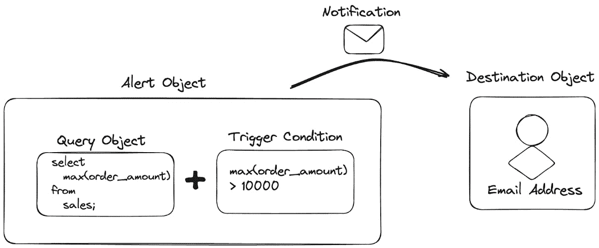

图 10.1 – 配置 DBSQL 警报通过电子邮件通知收件人

此外，DBSQL 警报可以设置为按重复计划执行，例如每小时执行一次。这是一种极好的方式，通过 Databricks 数据智能平台内置的机制，自动化进行*数据验证*检查，确保数据集内容的准确性。下图是一个示例，展示了如何使用警报在重复的时间间隔内调度数据验证查询，并在特定条件或条件集被违反时通知数据团队。

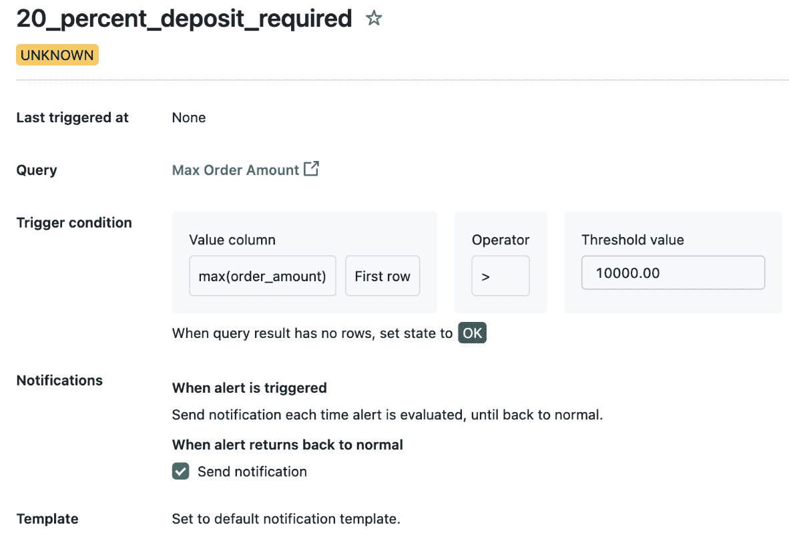

图 10.2 – 警报触发条件的配置

监控生产环境中的数据管道的另一种机制是通过工作流通知。在 Databricks 数据智能平台中，通知消息可以发送到企业消息平台，如 Slack 或 Microsoft Teams，或发送到事件管理系统，如 PagerDuty。本章稍后我们将探讨如何实现基于 HTTP Webhook 的交付目标，这在 Web 服务架构环境中非常流行。

可以从特定工作流中发送两种类型的通知——作业状态和任务状态。作业状态通知是关于特定工作流整体成功或失败的高级状态。然而，您还可以配置通知在任务级别发送到监控目标，例如，如果您希望监控工作流中的任务何时被重试。

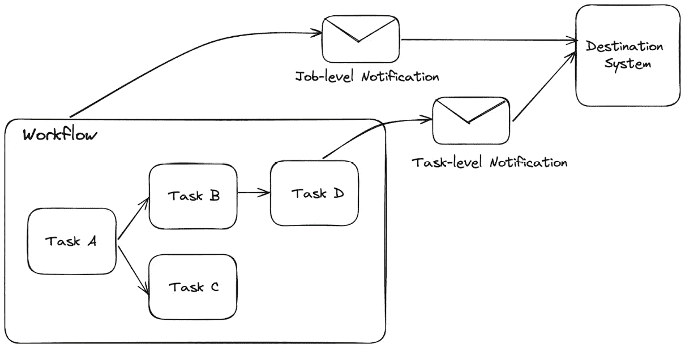

图 10.3 – 配置作业级别和任务级别的通知

虽然警报通知是自动通知团队成员处理问题的好方法，但数据团队还需要定期和临时地监控数据管道的健康状况。我们将在下一节讨论这一点。

# 管道健康状况和性能监控

Databricks 数据智能平台提供了一个供数据团队查询数据管道状态的地方，称为事件日志。事件日志包含与特定 DLT 管道相关的所有事件的历史记录。特别地，事件日志将包含一个事件流，其中列出包含以下录制元数据的事件对象：

+   发生的事件类型

+   事件的唯一标识符

+   事件发生的时间戳

+   事件的高级描述

+   关于事件的细粒度详情

+   事件级别指示（**INFO**、**WARN**、**ERROR** 或 **METRICS**）

+   事件的来源

与标量函数不同，标量函数返回单一值，**表值函数**（**TVF**）则是返回一个表作为结果的函数。对于发布到 Unity Catalog 中目录和模式的 DLT 管道，Databricks 数据智能平台提供了一种特殊的 TVF，名为 **event_log()**，用于查询有关特定 DLT 管道的全面信息。**event_log()** 函数可以接受两个参数之一作为输入：管道数据集的完全限定表名或管道 ID 作为参数。

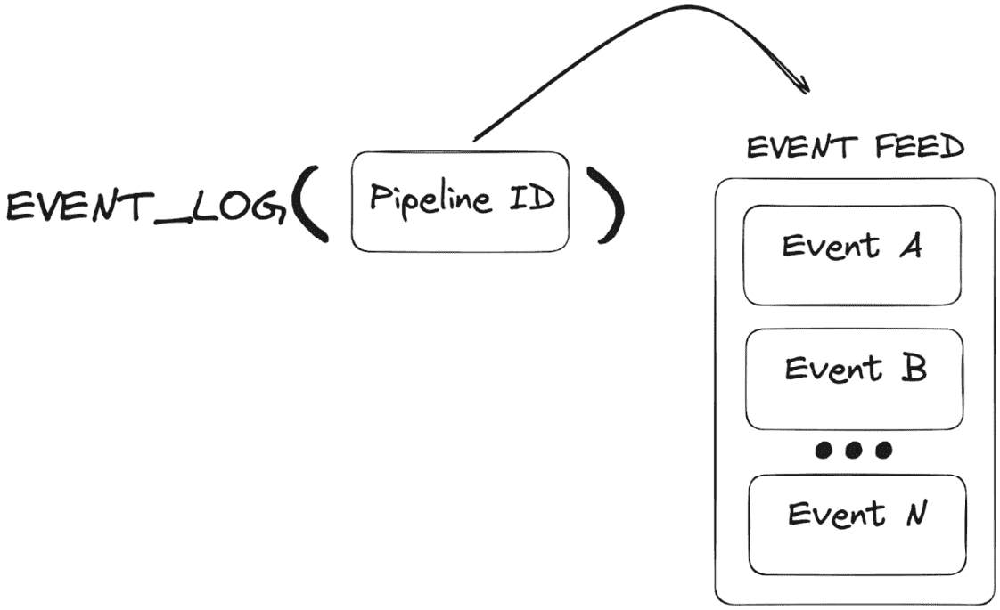

图 10.4 – **event_log()** TVF 返回发生的事件列表

**event_log()** 函数将检索有关给定 DLT 管道的信息，包括以下内容：

+   数据质量检查（预期结果）的结果

+   审计信息

+   管道更新状态

+   数据血统信息

一种常见的方法是，数据管理员可以通过注册一个视图与特定管道的数据集一起，使查询特定 DLT 管道事件变得更加容易。这允许用户在后续查询中方便地引用事件日志结果。以下 SQL **数据定义语言** (**DDL**) 语句将创建一个视图，用于检索 ID 为 **my_dlt_pipeline_id** 的 DLT 管道的事件日志：

```py
CREATE VIEW my_pipeline_event_log_vw AS
SELECT
  *
FROM
  event_log('<my_dlt_pipeline_id>');
```

有时，特定管道的事件日志可能会增长得太大，使得数据管理员很难快速总结最新的状态更新。相反，数据团队可以进一步缩小事件日志的范围，聚焦于 DLT 管道中的特定数据集。例如，数据团队可以在某个特定数据集上创建视图，通过 **table()** 函数捕获所有事件，并提供完全限定的表名作为函数的参数。以下 SQL DDL 语句将创建一个视图，用于检索名为 **my_gold_table** 的数据集的事件日志：

```py
CREATE VIEW my_gold_table_event_log_vw AS
SELECT
  *
FROM
  event_log(table(my_catalog.my_schema.my_gold_table));
```

**event_log()** TVF 函数为数据团队提供了对特定 DLT 管道和数据集上执行的操作的良好可见性，使得实现端到端的可观察性和可审计性变得更加容易。

重要提示

当前，如果一个 DLT 管道被配置为将输出数据集发布到 Unity Catalog，那么只有特定 DLT 管道的所有者可以查询这些视图。为了共享事件日志的访问权限，管道所有者必须将事件日志馈送的副本保存到 Unity Catalog 中的另一个表中，并授予其他用户或组访问权限。

让我们来看一下如何利用 **event_log()** 函数查询特定 DLT 管道的数据质量事件。

# 实践练习 – 查询数据集的数据质量事件

重要提示

对于以下练习，您需要使用共享的通用集群或 Databricks SQL 仓库来查询事件日志。此外，事件日志仅适用于查询已配置为在 Unity Catalog 中存储数据集的 DLT 管道。对于已配置为在传统 Hive Metastore 中存储数据集的 DLT 管道，将找不到事件日志。

数据质量指标作为序列化的 JSON 字符串存储在事件日志中。我们需要将 JSON 字符串解析成不同的数据结构，以便能够方便地查询事件日志中的数据质量事件。我们将使用 **from_json()** SQL 函数解析序列化的 JSON 字符串，以满足我们的数据质量预期。我们需要指定一个 schema 作为参数，指示 Spark 如何将 JSON 字符串解析为反序列化的数据结构——具体来说，是一个包含期望名称、数据集名称、通过记录数和失败记录数的结构体数组。最后，我们将使用 **explode()** SQL 函数，将期望结构体数组转换为每个期望的新行。

我们可以利用之前定义的视图来监控我们 DLT 管道中数据集的持续数据质量。让我们创建另一个与 DLT 管道数据质量相关的视图：

```py
CREATE OR REPLACE TEMPORARY VIEW taxi_trip_pipeline_data_quality_vw AS
SELECT
  timestamp,
  event_type,
  message,
  data_quality.dataset,
  data_quality.name AS expectation_name,
  data_quality.passed_records AS num_passed_records,
  data_quality.failed_records AS num_failed_records
FROM
  (
    SELECT
      event_type,
      message,
      timestamp,
      explode(
        from_json(
          details :flow_progress.data_quality.expectations,
          "ARRAY<
            STRUCT<
              name: STRING,
              dataset: STRING,
              passed_records: INT,
              failed_records: INT
            >
          >"
        )
      ) AS data_quality
    FROM
      my_table_event_log_vw
  );
```

数据团队常常提出一些常见问题，比如：“处理了多少条记录？”，“有多少条记录未通过数据质量验证？”或者“通过记录与未通过记录的比例是多少？”。让我们进一步分析前面的例子，并总结一下我们管道中每个数据集的高层数据质量指标。我们来统计一下应用了预期值的行数，以及每个数据集中通过记录与未通过记录的百分比：

```py
SELECT
  timestamp,
  dataset,
  sum(num_passed_records + num_failed_records)
    AS total_expectations_evaluated,
  avg(
    num_passed_records /
    (num_passed_records + num_failed_records)
  ) * 100 AS avg_pass_rate,
  avg(
    num_failed_records /
    (num_passed_records + num_failed_records)
  ) * 100 AS avg_fail_rate
FROM
  taxi_trip_pipeline_data_quality_vw
GROUP BY
  timestamp,
  dataset;
```

我们得到以下输出：

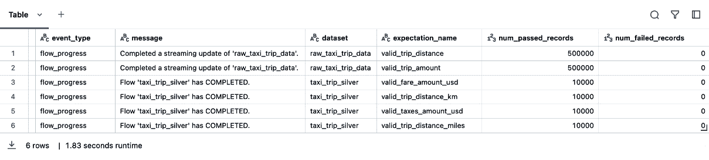

图 10.5 – DLT 事件日志中捕获的事件

如你所见，**event_log()** 函数使数据团队能够轻松查询有关给定 DLT 管道的全面信息。数据团队不仅可以查询管道更新的状态，还可以查询质量数据是否已成功地导入到湖仓。然而，数据团队仍然需要一种方式，在运行时自动通知数据质量检查失败的情况，尤其是在下游报告的数据准确性对业务至关重要时。我们将在接下来的部分中更详细地探讨这个问题。

# 数据质量监控

持续监控你湖仓中数据集的数据质量，对于成功部署到生产环境的业务关键型数据应用至关重要。例如，假设某个关联列突然注入了空值，这可能会影响到依赖于上游数据集连接的下游报告。突然间，**商业智能**（**BI**）报告可能会刷新，但数据可能显得过时或不准确。通过在问题出现时自动检测数据质量问题，数据团队可以及时收到潜在问题的警报，并立即采取措施干预，修正可能的数据损坏，甚至数据丢失。

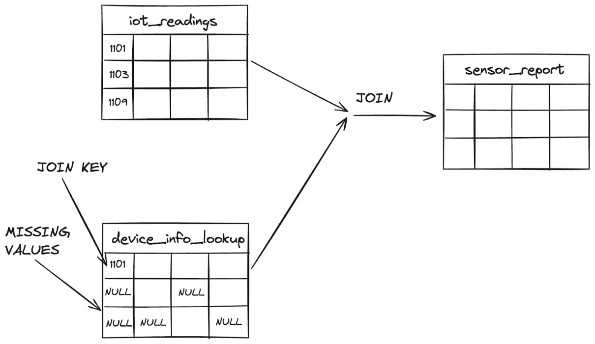

图 10.6 – 及早检测问题对确保下游流程的质量至关重要

## 引入湖仓监控

Lakehouse Monitoring，作为 Databricks 数据智能平台的一个新功能，赋予数据团队跟踪和监控湖仓中数据及其他资产数据质量的能力。数据团队可以自动测量列之间的数据统计分布、空值数量、最小值、最大值、中位数值以及其他统计属性。通过 Lakehouse Monitoring，数据团队能够自动检测数据集中的重大问题，如数据偏斜或缺失值，并提醒团队成员关注问题，以便他们采取适当措施。

湖仓监控在监控 Delta 表、视图、物化视图和流表的数据质量时最为有效。它甚至可以在**机器学习**（**ML**）管道中使用，测量数据集的统计摘要，并在检测到数据漂移时触发警报通知。此外，湖仓监控可以根据监控度量的粒度需求进行精细或粗粒度定制。

湖仓监控从创建一个监控对象开始，监控对象随后将附加到湖仓中的一个数据资产（例如 Delta 表）。在后台，监控对象将创建两个额外的表，用于捕捉对应 Delta 表或其他数据资产的统计度量。

然后，监控表将被用于驱动仪表板，数据团队和其他相关方可以使用该仪表板查看湖仓中数据质量的实时数据洞察。

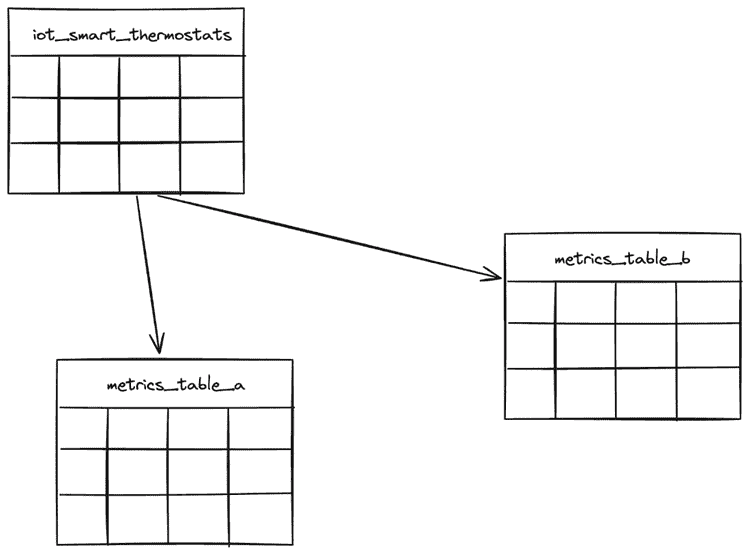

图 10.7 – 一个湖仓监控器将为监控的数据资产创建两个度量表。

湖仓监控器可以配置为衡量数据资产的不同方面，这也被称为配置文件类型。可以创建三种*监控配置文件类型*：

+   **快照**：这是一个通用但强大的监控工具。它用于监控表的数据质量和其他度量指标。

+   **时间序列**：它适用于时间序列数据集。它用于监控数据在时间段窗口内的质量变化。

+   **推断**：将机器学习模型推断的质量与输入在一段时间内的变化进行比较是非常有用的。

本章仅覆盖时间序列和快照类型。推断的讨论超出了本书的范围，但我们鼓励你探索湖仓监控如何对机器学习用例有所帮助（[`docs.databricks.com/en/lakehouse-monitoring/fairness-bias.html`](https://docs.databricks.com/en/lakehouse-monitoring/fairness-bias.html)）。

也可以创建比较表的统计指标与基准表的监控器。例如，可以用于比较智能恒温器设备本周的相对湿度与上周的湿度，或者将某个数据集的录入销售数量与上月的销售报告进行比较。

让我们来看一个实际的例子，看看如何在湖仓中使用湖仓监控器。

## 实操练习 – 创建一个湖仓监控器

在这个动手练习中，我们将创建一个 lakehouse 监控工具，用于衡量目标 Delta 表的数据质量。虽然我们的 Delta 表确实包含时间戳信息，但我们将选择一个 *快照配置文件* 来监控我们 lakehouse 中目标 Delta 表的数据质量。回想一下，快照配置文件是一个通用的 lakehouse 监控工具，正如前面所提到的，它还具有相当大的灵活性。快照分析器将允许我们衡量数据集的标准总结性指标，或者围绕数据质量插入自定义的业务计算。

就像 Databricks 数据智能平台中的许多资源一样，您可以通过多种方式创建新的 lakehouse 监控工具。例如，您可以使用 Databricks UI、Databricks REST API、Databricks CLI（详见 *第九章*），或者像 Terraform 这样的自动化工具，等等。也许最简单的创建新监控工具的方式是通过 UI。在这个动手练习中，我们将使用 Databricks UI 来创建 lakehouse 监控工具。这是开始实验 Lakehouse 监控和不同数据质量度量的绝佳方法，用于评估数据集。然而，建议在生产环境中将您的 lakehouse 监控工具迁移到自动化构建工具，如 **Databricks 资产包（DABs）**（详见 *第九章*）或 Terraform（详见 *第八章*）。

如果您还没有这样做，可以在 [`github.com/PacktPublishing/Building-Modern-Data-Applications-Using-Databricks-Lakehouse/tree/main/chapter10`](https://github.com/PacktPublishing/Building-Modern-Data-Applications-Using-Databricks-Lakehouse/tree/main/chapter10) 下载并克隆本章的相关代码资源。

第一步是生成一个目标 Delta 表，我们希望监控其数据质量。克隆或导入数据生成器笔记本，或创建一个新的笔记本并使用以下代码生成器源代码。

在笔记本的第一个单元格中，我们将利用 **%pip** 魔法命令来下载并安装 **dbldatagen** Python 库，用于生成样本数据：

```py
%pip install dbldatagen==0.4.0
```

接下来，我们将定义一个辅助函数，用于生成一个包含智能恒温器读数的合成数据集，记录随时间变化的情况：

```py
import dbldatagen as dg
from pyspark.sql.types import IntegerType, FloatType, TimestampType
def generate_smart_thermostat_readings():
    """Generates synthetics thermostat readings"""
    ds = (
        dg.DataGenerator(
            spark,
            name="smart_thermostat_dataset",
            rows=10000,
            partitions=4)
        .withColumn("device_id", IntegerType(),
                    minValue=1000000, maxValue=2000000)
        .withColumn("temperature", FloatType(),
                    minValue=10.0, maxValue=1000.0)
        .withColumn("humidity", FloatType(),
                    minValue=0.1, maxValue=1000.0)
        .withColumn("battery_level", FloatType(),
                    minValue=-50.0, maxValue=150.0)
        .withColumn("reading_ts", TimestampType(), random=False)
    )
    return ds.build()
# Generate the data using dbldatagen
df = generate_smart_thermostat_readings()
df.display()
```

最后，我们将把新创建的数据集保存为 Unity Catalog 中的 Delta 表：

```py
(df.write
    .format("delta")
    .mode("overwrite")
    .saveAsTable(FULLY_QUALIFIED_TABLE_NAME))
```

既然我们的 Delta 表已经在 lakehouse 中创建完成，让我们在 Catalog Explorer 中使用 UI 来创建一个新的监控工具。

在左侧导航栏中，点击“目录浏览器”图标。接下来，通过展开目录列表或使用**搜索**字段过滤结果，导航到为本章创建的目录。点击为本章创建的架构。最后，点击之前由我们的数据生成笔记本创建的 Delta 表。点击标题为**质量**的数据质量标签。

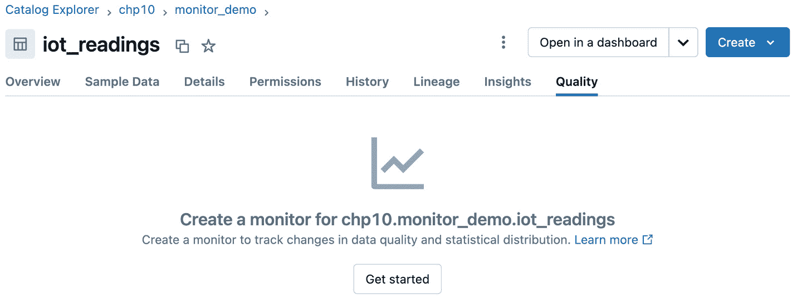

图 10.8 – 可以直接从 Databricks 用户界面创建新的监控器

接下来，点击**开始使用**按钮，开始创建新的监控器。一个弹出对话框将打开，提示您选择监控器的配置文件类型，以及一些高级配置选项，如调度、通知传递和存储生成的仪表板的工作区目录。

点击下拉菜单选择配置文件类型，并选择生成快照配置文件的选项。

接下来，点击**高级选项**部分以展开对话框表单。用户界面将允许用户捕获数据集指标，可以选择手动执行或定义一个 cron 调度来定期执行指标计算。您会注意到，该对话框提供了使用传统 cron 语法定义调度的灵活性，或者通过选择对话框表单中的日期和时间下拉菜单来定义调度。对于本次实践，我们将选择前一种方式，并通过点击按钮手动刷新监控指标。

可选地，您可以选择将关于监控指标计算成功或失败的通知通过电子邮件发送给一组电子邮件接收者。您最多可以添加五个电子邮件地址，以便通知能够送达。确保您的用户电子邮件地址列在**通知**部分，并且勾选复选框以接收关于指标收集失败的通知。

如果你还记得之前提到的，湖仓监控器将创建两个指标表。我们需要在 Unity Catalog 中提供存储这些指标表的位置。在**指标**部分，添加为本章实践创建的目录和架构名称。例如，输入**chp10.monitor_demo**。

我们需要指定的最后一项是存储生成的湖仓监控仪表板的工作区位置。默认情况下，生成的资源将存储在用户的主目录下，例如**/Users/<user_email_address>/databricks_lakehouse_monitoring**。在本次实践中，我们将接受默认位置。

我们准备好创建监控器了！点击**创建**按钮，以为我们的 Delta 表创建湖仓监控器。

由于我们尚未为湖仓监控配置调度，因此我们需要手动执行度量收集。在 Catalog Explorer 中，在我们 Delta 表的**质量**标签下，点击**刷新度量**按钮以手动触发度量收集。

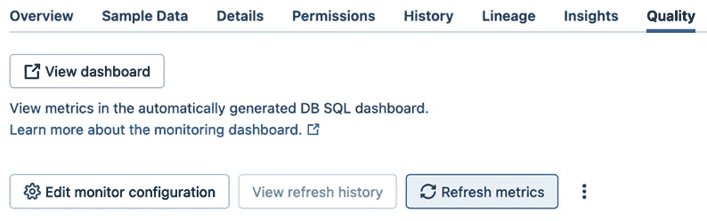

图 10.9 – 监控度量可以通过 Catalog Explorer UI 手动触发

表格度量的更新将会被触发并执行，可能需要几分钟才能完成。更新完成后，点击**查看仪表板**按钮查看捕获的度量数据。恭喜你！你已经创建了第一个湖仓监控，并且你正在稳步推进，为数据团队实现强大且自动化的数据质量可观察性。

现在我们知道了如何在生产问题出现时提醒我们的团队成员，让我们关注一些解决生产部署中失败问题的方法。

# 生产故障解决的最佳实践

DLT 框架是针对故障解决设计的。例如，DLT 会自动响应三种常见的管道故障类型：

+   Databricks Runtime 回归（详见 *第二章*）

+   更新处理失败

+   数据事务失败

让我们更详细地看一下更新失败和数据事务失败。

## 处理管道更新失败

DLT 框架是针对强大的错误处理设计的。在管道更新期间，框架会尝试将最新的更新应用到数据流图中定义的表。如果发生处理错误，框架会将错误分类为可重试错误或不可重试错误。可重试错误意味着框架将运行时错误分类为可能由当前条件集引起的问题。例如，系统错误不会被认为是可重试错误，因为它与运行时环境有关，而执行重试无法解决。然而，网络超时会被视为可重试错误，因为它可能受到临时网络环境条件的影响。默认情况下，如果检测到*可重试*错误，DLT 框架会对管道更新进行两次重试。

## 从表事务失败中恢复

由于 Delta Lake 事务日志的特性，数据集的更改是原子性的，这意味着它们只能在表事务（如**数据操作语言**（**DML**）语句）提交到事务日志时发生。因此，如果一个事务在执行过程中失败，则整个事务会被放弃，从而防止数据集进入需要数据团队介入并手动撤销数据更改的非确定性状态。

现在我们已经理解了如何处理生产环境中的管道故障，让我们通过一个真实世界的示例来巩固本章的主题。

# 实践练习 – 设置 Webhook 警报，当作业运行时间超过预期时进行通知

在这个实践练习中，我们将创建一个自定义 HTTP Webhook，当 Databricks 中的定时作业超时时，会向 HTTP 端点发送通知。

Webhook 警报是 Databricks 数据智能平台中的一种通知机制，它使数据团队能够通过自动发布特定作业执行结果，来监控其数据管道。例如，您可以收到关于作业成功运行、执行状态和运行失败的通知。

为什么我们使用工作流而不是直接使用 DLT 管道？

实际上，DLT 管道通常只是一个完整数据产品中的许多依赖项之一。Databricks 工作流是一个流行的编排工具，能够准备依赖项、运行一个或多个 DLT 管道，并执行下游任务。在本次练习中，我们将配置来自 Databricks 工作流的通知，而不是直接从 DLT 管道中获取通知，以模拟典型的生产场景。

让我们首先进入您的 Databricks 工作区并登录。接下来，创建一个新的工作流。我们可以通过点击工作区导航栏左侧的工作流图标，进入工作流 UI。为工作流命名时，可以选择一个有意义的名称，例如**生产** **监控演示**。

如果您还没有下载，可以在[`github.com/PacktPublishing/Building-Modern-Data-Applications-Using-Databricks-Lakehouse/tree/main/chapter10`](https://github.com/PacktPublishing/Building-Modern-Data-Applications-Using-Databricks-Lakehouse/tree/main/chapter10)下载本章练习的示例笔记本。我们将使用名为**04a-IoT 设备数据生成器.py**的物联网设备数据生成器笔记本和名为**04b-IoT 设备数据管道.py**的物联网设备 DLT 管道定义笔记本。

在工作流 UI 中，创建一个包含两个任务的新工作流。第一个任务将使用**04a-IoT 设备数据生成器.py**笔记本准备输入数据集；第二个任务将使用**04b-IoT 设备数据管道.py**笔记本执行读取生成数据的 DLT 管道。

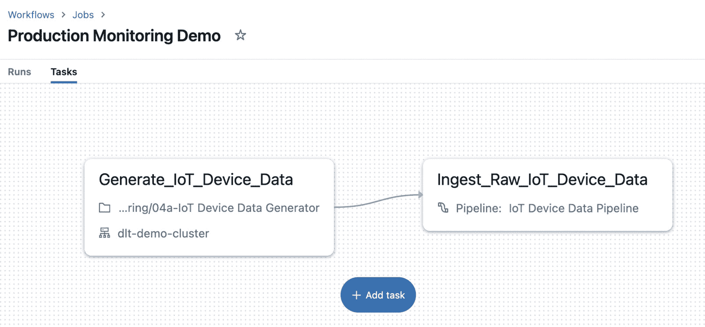

图 10.10 – 工作流将生成物联网设备数据并执行 DLT 管道更新

现在我们的工作流已经创建完成，假设我们的管道执行时间比预期的要长。若出现潜在的处理延迟，是否能及时收到通知，以便您的数据团队立即进行调查，或者防止由于处理错误导致长时间运行的任务产生巨额云计算费用，这不就非常有帮助吗？

幸运的是，Databricks 数据智能平台使得配置这种类型的通知变得简单。让我们为工作流创建一个超时阈值。这将自动通知我们的 HTTP webhook 端点，告知我们的工作流执行时间超过了预期。一旦工作流超过了这个超时阈值，当前的执行将被停止，并且该执行被标记为*失败*。我们希望在这种失败场景发生时收到通知。

在工作流 UI 中，点击新创建的工作流**生产监控演示**，以查看详细信息。在**作业通知**部分，点击**添加度量阈值**按钮，添加一个新的运行时长阈值。让我们将最大时长设置为 120 分钟，然后点击**保存**按钮。接下来，点击**+ 添加通知**按钮，添加一个新的通知。展开**目标**下拉菜单，选择**+ 添加新系统目标**。一个新的浏览器标签页将打开，显示 Databricks 工作区的工作区管理设置。在**通知**部分，点击**管理**按钮。点击**添加目标**按钮。选择**Webhook**作为目标类型，为目标提供一个有意义的名称，输入通知应发送的端点 URL，并在端点使用基本 HTTP 认证时输入用户名和密码信息。点击**创建**按钮以创建 Webhook 目标。

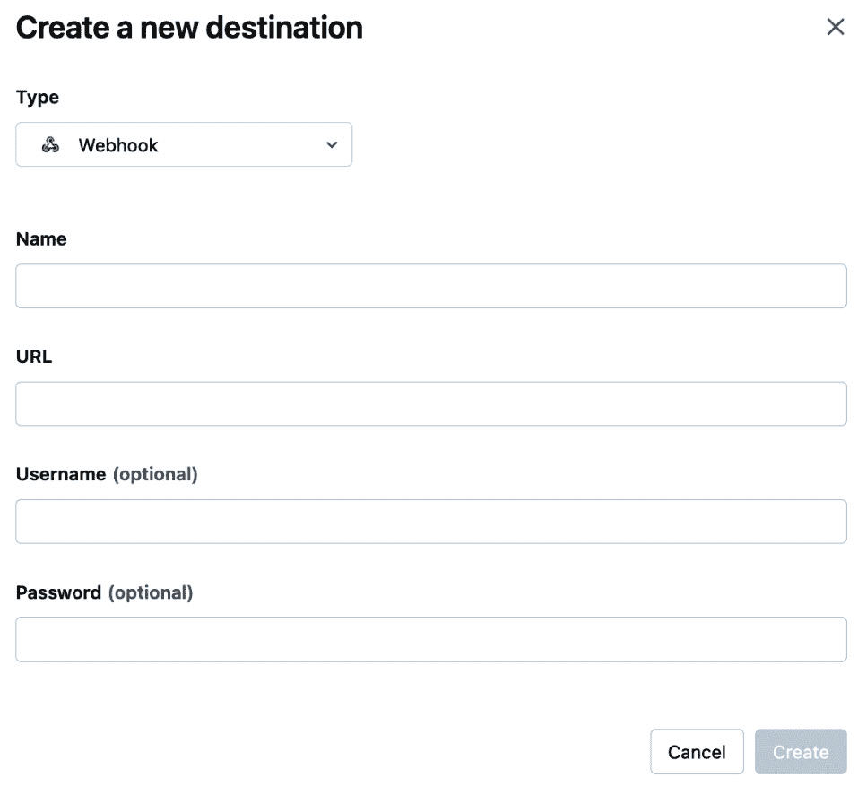

图 10.11 – 创建一个新的 Webhook 目标

最后，点击**保存**按钮以最终确定度量阈值通知。

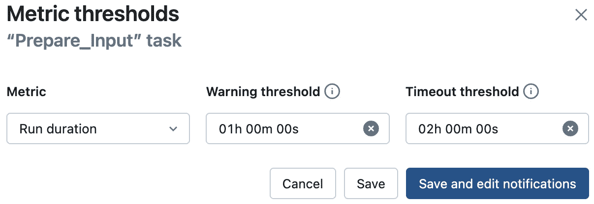

图 10.12 – 可以为工作流的任务设置执行时长阈值

现在我们已经设定了运行时长阈值，每当我们的工作流运行超过 120 分钟时，工作流将会停止，并且会向我们的 HTTP webhook 目标发送一个状态为**超时**的通知消息。

恭喜！现在你已经自动化了生产环境中数据管道的监控，当出现故障条件时，团队将会自动收到通知。这意味着你的团队可以在问题发生时立即介入并修正数据处理问题，从而最小化潜在的停机时间。

# 总结

在本章中，我们介绍了几种实现管道和数据质量可观测性的技术，以便数据团队能够在问题出现时迅速做出反应，避免下游大规模的中断。成为一个成功的数据团队的关键之一就是能够快速应对问题。我们看到了 Databricks 数据智能平台在许多方面内置了警报通知，并且我们可以配置不同类型的警报目标，以在条件不满足时发送通知。

我们介绍了 Databricks 平台内置的监控功能，例如管道事件日志，它使得管道拥有者可以轻松查询数据管道的健康状况、可审计性、性能，以及实时的数据质量。我们还看到，湖仓监控是一个强大且多功能的功能，它允许数据团队自动监控数据集的统计指标，并在阈值被突破时通知团队成员。我们还介绍了评估数据质量的技术，以确保整个管道中没有下游错误和不准确的情况。

最后，我们通过一个实际案例来结束这一章，演示了如何在遇到一个现实且非常常见的问题时，自动提醒数据团队——当一个计划任务运行超时。

恭喜你完成了本书的阅读！感谢你与我一起通过每一章进行这段旅程。我们已经涵盖了许多话题，但到目前为止，你应该为自己的成就感到骄傲。到现在为止，你应该已经建立了一个扎实的湖仓基础，接下来你可以继续在其上构建。实际上，我希望这本书能给你带来灵感，继续你的湖仓之旅，并构建出具有重大意义的现代数据应用。祝你好运，鼓励你保持学习！
