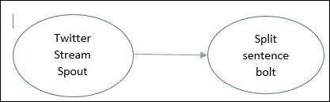

# 第二章. Storm 的解剖结构

本章详细介绍了 Storm 技术的内部结构和过程。在本章中，我们将涵盖以下主题：

+   Storm 处理过程

+   Storm 拓扑特定的术语

+   进程间通信

+   Storm 中的容错性

+   保证元组处理

+   Storm 中的并行性——扩展分布式计算

随着我们进入本章，你将详细了解 Storm 的处理过程及其在细节中的作用。在本章中，将解释各种与 Storm 相关的专业术语。你将学习 Storm 如何实现不同类型故障的容错性。我们将探讨什么是保证消息处理，最重要的是，如何配置 Storm 的并行性以实现快速和可靠的处理。

# Storm 处理过程

我们首先从 Nimbus 开始，它是 Storm 的实际入口点守护进程。为了与 Hadoop 进行比较，Nimbus 实际上是 Storm 的作业跟踪器。Nimbus 的任务是向集群中所有监督守护进程分发代码。因此，当拓扑代码提交时，它实际上会到达集群中的所有物理机器。Nimbus 还监控监督守护进程的故障。如果一个监督守护进程持续失败，那么 Nimbus 将将这些工作者的工作重新分配给不同物理机器上的其他工作者。当前版本的 Storm 只允许运行一个 Nimbus 守护进程实例。Nimbus 还负责将任务分配给监督节点。如果你丢失了 Nimbus，工作者仍然会继续计算。监督者将继续在工作者死亡时重启它们。没有 Nimbus，工作者的任务不会被重新分配到集群中的另一台机器上的工作者。

如果 Nimbus 死亡，没有其他 Storm 进程会接管，也没有任何进程会尝试重启它。然而，无需担心，因为它可以随时重启。在生产环境中，当 Nimbus 死亡时，也可以设置警报。在未来，我们可能会看到高可用性的 Nimbus。

## 监督者

一个监督者管理着相应机器上的所有工作者。由于你的集群中每台机器都有一个监督者，因此 Storm 中的分布式计算是可能的。监督者守护进程监听由 Nimbus 分配给其运行的机器的工作，并将其分配给工作者。由于任何运行时异常，工作者可以随时死亡，当没有来自死亡工作者的心跳时，监督者将重启它们。每个工作者进程执行拓扑的一部分。类似于 Hadoop 生态系统，监督者是 Storm 的任务跟踪器。它跟踪同一机器上工作者的任务。可能的最大工作者数量取决于在 `storm.yaml` 中定义的端口号数量。

## Zookeeper

除了其自身组件外，Storm 还依赖于 Zookeeper 集群（一个或多个 Zookeeper 服务器）来在 Nimbus 和 supervisors 之间执行协调工作。除了用于协调目的外，Nimbus 和 supervisors 还将它们的所有状态存储在 Zookeeper 中，而 Zookeeper 将它们存储在运行它的本地磁盘上。拥有多个 Zookeeper 守护进程可以提高系统的可靠性，因为如果一个守护进程宕机，另一个将成为领导者。

## Storm UI

Storm 还配备了基于 Web 的用户界面。它应该在运行 Nimbus 的同一台机器上启动。Storm UI 提供了整个集群的报告，例如所有活动 supervisor 机器的总和、可用的总工作器数量、分配给每个拓扑的数量以及剩余数量，以及拓扑级别的诊断，如元组统计（发出了多少元组，以及 spout 到 bolt 或 bolt 到 bolt 之间的 ACK）。Storm UI 还显示了总工作器数量，这实际上是所有 supervisor 机器上所有可用工作器的总和。

下面的截图显示了 Storm UI 的一个示例屏幕：


以下是对 Storm UI 的解释：

+   **拓扑统计**：在**拓扑统计**下，你可以点击查看过去 10 分钟、3 小时或所有时间的统计信息。

+   **Spouts（所有时间）**：此部分显示分配给此 spout 的执行者和任务数量，以及发出的元组和其他延迟统计信息。

+   **螺栓（所有时间）**：此部分显示所有螺栓的列表，以及分配的执行者/任务。在进行性能调整时，请将**容量**列保持在接近`1`的位置。在**aggregatorBolt**的前一个示例中，其值为`1.500`，因此我们不需要`200`个执行者/任务，而可以使用`300`个。**容量**列帮助我们决定正确的并行度。这个想法非常简单；如果**容量**列的值超过`1`，尝试以相同的比例增加执行者和任务的数量。如果执行者/任务的数量很高，而**容量**列接近零，尝试减少执行者/任务的数量。你可以这样做，直到得到最佳配置。

# Storm 特定的术语

拓扑是将编程工作逻辑上划分为许多小规模处理单元的过程，称为 spout 和 bolt，这与 Hadoop 中的 MapReduce 类似。拓扑可以用多种语言编写，包括 Java、Python 以及更多受支持的语言。在视觉表示中，拓扑显示为连接 spout 和 bolt 的图。Spouts 和 bolt 在集群中执行任务。Storm 有两种操作模式，称为本地模式和分布式模式：

+   在本地模式下，Storm 和工人的所有进程都在你的代码开发环境中运行。这对于测试和拓扑的开发来说很好。

+   在分布式模式下，Storm 作为一个机器集群运行。当你向 Nimbus 提交拓扑代码时，Nimbus 负责分发代码并根据你的配置分配工作者来运行你的拓扑。

在以下图中，我们看到了紫色的 bolt；这些 bolt 从其上方的 spout 接收元组或记录。元组支持在编写拓扑代码的编程语言中可用的大多数数据类型。它作为一个独立的单元从 spout 流向 bolt 或从 bolt 流向另一个 bolt。元组的无界流动称为流。在一个元组中，你可以有多个键值对一起传递。

下一个图更详细地说明了流。spout 连接到元组的来源，并为拓扑生成连续的元组作为流。从 spout 作为键值对发出的内容可以通过使用相同键的 bolt 接收。


## 工作者进程、执行者和任务

Storm 区分以下三个主要实体，这些实体用于在 Storm 集群中实际运行拓扑：

+   工作者

+   执行者

+   任务

假设我们已经决定保留两个工作者，一个**Bolt1**执行者，三个**Bolt2**执行者，以及两个**Bolt2**执行者。假设执行者数量和任务数量的比例是相同的。总共有六个执行者，分别属于 spout 和 bolt。在六个执行者中，一些将在工作者 1 的范围内运行，而另一些将由工作者 2 控制；这个决定由管理员做出。这将在以下图中解释：


下一个图解释了在工作器在机器上运行的监督器范围内的位置：


执行者和任务的数量在构建拓扑代码时设置。在先前的图中，我们有两个工作者（1 和 2），由该机器的管理员运行和管理。假设**执行者 1**正在运行一个任务，因为执行者与任务的比例是相同的（例如，10 个执行者意味着 10 个任务，使得比例为 1:1）。但是**执行者 2**正在顺序运行两个任务，因此任务与执行者的比例为 2:1（例如，10 个执行者意味着 20 个任务，使得比例为 2:1）。拥有更多的任务并不意味着更高的处理速度，但对于更多的执行者来说，这是真的，因为任务是顺序运行的。

## 工作者进程

单个工作者进程执行拓扑的一部分，并在自己的 JVM 上运行。工作者在拓扑提交期间分配。一个工作者进程与一个特定的拓扑相关联，并可以为该拓扑的一个或多个 spout 或 bolt 运行一个或多个执行者。一个正在运行的拓扑由许多这样的工作者组成，这些工作者在 Storm 集群中的许多机器上运行。

## 执行者

执行器是在工作者的 JVM 范围内运行的线程。执行器可以为 spout 或 bolt 顺序运行一个或多个任务。

执行器始终为所有任务在一个线程上运行，这意味着任务在执行器上是顺序运行的。可以在拓扑启动后不关闭的情况下更改执行器的数量，使用`rebalance`命令：

```py
storm rebalance <topology name> -n <number of workers> -e <spout>=<number of executors> -e <bolt1 name>=<number of executors> -e <bolt2 name>=<number of executors>
```

## 任务

任务执行数据处理，并在其父执行器的执行线程中运行。任务数量的默认值与执行器的数量相同。在构建拓扑时，我们还可以保持更多的任务数量。这有助于在将来增加执行器的数量，保持扩展的开放范围。最初，我们可以有 10 个执行器和 20 个任务，所以比例是 2:1。这意味着每个执行器有两个任务。未来的重新平衡操作可以将 20 个执行器和 20 个任务调整为 1:1 的比例。

## 进程间通信

下一个图展示了 Storm 提交者（客户端）、Nimbus thrift 服务器、Zookeeper、supervisors、supervisor 的工作者、执行器和任务之间的通信。每个工作进程作为一个单独的 JVM 运行。


# Storm 集群的物理视图

下一个图解释了每个进程的物理位置。只有一个 Nimbus。然而，为了支持故障转移，有多个 Zookeeper，并且每台机器有一个 supervisor。


## 流分组

流分组控制元组从 spout 到 bolt 或 bolt 到 bolt 之间的流动。在 Storm 中，我们有四种分组类型。洗牌和字段分组是最常用的：

+   **洗牌分组**：在此分组中两个随机任务之间的元组流

+   **字段分组**：具有特定字段键的元组始终被发送到下游 bolt 的同一任务

+   **全部分组**：将相同的元组发送到下游 bolt 的所有任务

+   **全局分组**：所有任务中的元组都达到一个任务

下一个图示给出了所有四种分组类型的图解：


## Storm 的容错性

管理员运行一个同步线程从 Zookeeper 获取分配信息（我应该运行拓扑的哪一部分）并将其写入本地磁盘。这个本地文件系统信息有助于保持工作者的最新状态：

+   **案例 1**：这是大多数情况下理想的案例。当集群正常工作时，工作者的心跳通过 Zookeeper 返回到 supervisors 和 Nimbus。

+   **案例 2**：如果一个 supervisor 死亡，处理仍然继续，但分配永远不会同步。Nimbus 将工作重新分配给另一台机器的不同 supervisor。那些工作者将继续运行，但不会收到任何新的元组。请设置一个警报来重启 supervisor 或使用可以重启 supervisor 的 Unix 工具。

+   **案例 3**：如果 Nimbus 死亡，拓扑将继续正常工作。处理仍将继续，但无法执行拓扑生命周期操作或将任务重新分配到另一台机器。

+   **案例 4**：如果工人死亡（如心跳停止到达），主管将尝试重启工人进程，处理将继续。如果工人反复死亡，Nimbus 将将工作重新分配给集群中的其他节点。

## Storm 中保证元组处理

由于 Storm 已经能够处理各种进程级故障，另一个重要特性是处理当工人死亡时发生的元组故障的能力。这只是为了说明位运算 XOR：两个相同位集合的 XOR 是 0。这被称为 XOR 魔法，它可以帮助我们了解元组发送到下一个 bolt 的交付是否成功。Storm 使用 64 位来跟踪元组。每个元组都得到一个 64 位的元组 ID。这个 64 位 ID，连同任务 ID 一起，保存在 ACKer 中。

在下一图中，解释了 ACK 和重放案例：


### XOR 魔法在 ACK 中

只有当链接的元组树中的所有元组都完成时，spout 元组才被完全处理。如果元组树在配置的超时时间内未完成（默认值为 `topology.message.timeout.secs: 30`），则 spout 元组将被重放。

在前面的图中，第一个 acker 从 spout 获取元组 1 的 `10101`（为了解释的简便，我们保持 5 位），一旦 **Bolt 1** 收到相同的元组，它也会向 acker ACK。从两个来源，acker 获取 `10101`。这意味着 `10101` XOR `10101` = 0。元组 1 已成功被 **Bolt 1** 接收。相同的过程在 bolts 1 和 2 之间重复。最后，**Bolt 2** 向 acker 发送 ACK，元组树完成。这会创建一个信号来调用 spout 的 `success` 函数。元组处理中的任何失败都可以触发 spout 的 `fail` 函数调用，这表明需要将元组发送回再次处理。

Storm 的 acker 通过在发送者的元组和接收者的元组之间执行 XOR 来跟踪元组树的完成。每次发送元组时，其值都会与 acker 维护的校验和 XOR，每次 ACK 元组时，其值再次在 acker 中 XOR。

如果所有元组都已成功 ACK，校验和将为零。Ackers 是系统级执行器。

在 spout 中，我们有选择两个 emit 函数。

+   `emit([tuple])`: 这是一个简单的 emit

+   `storm.emit([tuple], id=the_value)`: 这创建了一个可靠的 spout，但前提是你可以使用 `the_value` 重新发射元组

在 Spout 中，我们也有两个 ACK 函数：

+   `fail(the_value)`: 当发生超时或元组失败时调用此函数

+   `ack(the_value)`: 当拓扑中的最后一个 bolt ACK 元组树时调用此函数

此 ID 字段应该是一个随机且唯一的值，以便从 spout 的`fail`函数中重新播放。使用此 ID，我们可以从`fail`函数中重新发出它。如果成功，`success`函数将被调用，并且可以从中删除成功的元组或从源处重新创建。

如果您在拓扑中有一个可靠的 spout，您将能够重新创建相同的元组。要创建一个可靠的 spout，请从 spout 的下一个元组函数中发出一个唯一的消息 ID（`the_value`），并附带元组：

```py
storm.emit([tuple], id=the_value)
```

如果一个元组在配置的期间内没有被 ACK，或者编程代码由于某些错误条件而使元组失败，这两种情况都是有效的重放案例。

当调用`fail`函数时，代码可以使用相同的消息 ID 从 spout 的源读取，当调用`success`函数时，可以采取诸如从队列中删除消息之类的操作。

消息 ID 是一个应用程序特定的键，可以帮助您重新创建一个元组并将其从 spout 重新发出。消息 ID 的一个例子可以是队列消息 ID，或者表的主键。如果一个元组在超时或由于任何其他原因失败，则认为该元组已失败。

Storm 有一个容错机制，它保证了只从可靠的 spout 发出的所有元组的至少一次处理。

一旦设置了可靠的 spout，您可以让 bolt 在输入和输出元组之间进行链接，从而创建一个元组树。一旦建立了元组树，acker 就知道链接树中的任何故障，并且使用原始消息 ID 重新创建整个元组树。

在 bolt 中，有两个函数：

+   `emit([tuple])`：没有元组树链接。我们无法跟踪使用了哪个原始消息 ID。

+   `storm.emit([tuple], anchors=[message_key])`：有了链接，原始元组现在可以重新播放。

以下图解释了元组 B 是如何从元组 A 生成的：


下一图展示了 bolt 执行**ACK**的过程：


以下图展示了故障条件，其中信号在故障时到达 spout：


成功的**ACK**演示如下：


以下图示展示了没有螺栓的大元组树的状态，并且没有出现故障：


下一图演示了元组树中的故障示例——在元组树的中间：


# 调整 Storm 的并行性——扩展分布式计算

为了解释 Storm 的并行性，我们将配置三个参数：

+   工作器的数量

+   执行器的数量

+   任务的数量

以下图给出了一个示例的图解，其中我们有一个只有一个 spout 和一个 bolt 的拓扑。在这种情况下，我们将设置 spout 和 bolt 级别的工作者、执行者和任务的不同值，并查看每种情况下的并行性是如何工作的：



```py
// assume we have two workers in total for topology.
topology.workers: 2
 // just one executor of spout.
builder.setSpout("spout-sentence", TwitterStreamSpout(),1)

// two executors of bolt.
builder.setBolt("bolt-split", SplitSentenceBolt(),2)
 // four tasks for bolts.
.setNumTasks(4)
.shuffleGrouping("spout-sentence");
```

对于这种配置，我们将有两个工作者，它们将在不同的 JVM（worker 1 和 worker 2）中运行。

对于 spout，有一个执行者，默认任务数是一个，这使得比例是 1:1（每个执行者一个任务）。

对于螺栓，有两个执行者和四个任务，这使得每个执行者有四个任务除以两个执行者等于两个任务。这两个执行者在 worker 2 下运行，每个执行者有两个任务，而 worker 1 的执行者只得到一个任务。

这可以通过以下图示很好地说明：


让我们改变 bolt 的配置为两个执行者和两个任务：

```py
builder.setBolt("bolt-split", SplitSentenceBolt(),2)
 // 2 tasks for bolts.
.setNumTasks(2)
.shuffleGrouping("spout-sentence");
```

这在这里可以很好地说明：


工作者的数量再次是两个。由于 bolt 有两个执行者和两个任务，所以是 2/2，或者每个执行者一个任务。现在你可以看到两个执行者各自得到一个任务。在性能方面，这两种情况完全相同，因为任务在执行者线程中顺序运行。更多的执行者意味着更高的并行度，更多的工作者意味着更有效地使用资源，如 CPU 和 RAM。内存分配是在工作者级别使用`worker`.`childopts`设置完成的。我们还应该监控特定工作者进程所持有的最大内存量。这在决定工作者总数方面起着重要作用。可以使用`ps -ef`选项查看。始终保持任务和执行者的相同比例，并使用 Storm UI 的容量列推导出执行者数量的正确值。作为重要提示，我们应该在 bolt 中保持较短的持续时间事务，并尝试通过将代码拆分成更多的 bolt 或减少批处理大小 tuple 来调整它。批处理大小是 bolt 在单个 tuple 交付中接收的记录数。另外，不要因为较长时间的事务而阻塞 spout 的`nextTuple`方法。

# 摘要

随着本章接近尾声，你一定对 Nimbus、监督器、UI 和 Zookeeper 进程有了大致的了解。本章还教你如何通过调整工作者、执行者和任务的数量来在 Storm 中调整并行性。你熟悉了分布计算的重要问题，即故障和通过系统中的不同容错机制克服故障。最重要的是，你学习了如何编写一个“可靠的”spout，以实现保证的消息处理和 bolt 中的链接。

下一章将为您提供有关如何使用名为 Petrel 的 Python 库构建简单拓扑的信息。Petrel 解决了 Storm 内置 Python 支持的一些局限性，提供了更简单、更流畅的开发体验。
