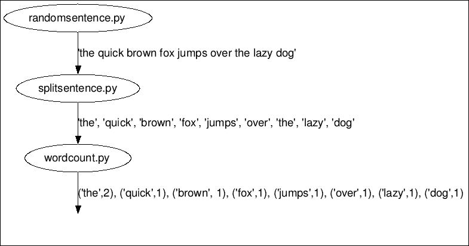

# 第三章. 介绍 Petrel

如第一章中所述，*熟悉 Storm*，Storm 是一个用于实时处理大量数据的平台。Storm 应用程序通常用 Java 编写，但 Storm 也支持其他语言，包括 Python。虽然跨语言的概念相似，但细节因语言而异。在本章中，我们将通过 Python 使用 Storm 获得我们的第一次动手经验。首先，你将了解一个名为 Petrel 的 Python 库，这是在 Python 中创建拓扑所必需的。接下来，我们将设置我们的 Python/Storm 开发环境。然后，我们将仔细研究一个用 Python 编写的实际运行的 Storm 拓扑。最后，我们将运行该拓扑，并学习一些简化拓扑开发和调试过程的关键技术。完成本章后，你将对开发基本的 Storm 拓扑有一个很好的高级理解。在本章中，我们将涵盖以下主题：

+   什么是 Petrel？

+   安装 Petrel

+   创建你的第一个拓扑

+   运行拓扑

+   使用 Petrel 的生产力技巧

# 什么是 Petrel？

本书中的所有 Python 拓扑都依赖于一个名为 Petrel 的开源 Python 库。如果你之前有使用 Storm 的经验，你可能还记得有一个名为`storm-starter`的 GitHub 项目，该项目包含了使用 Storm 和各种语言（你可以在[`github.com/apache/storm/tree/master/examples/storm-starter`](https://github.com/apache/storm/tree/master/examples/storm-starter)）的示例（你可以在这里找到`storm-starter`的最新版本）。`storm-starter`项目包含一个名为`storm.py`的模块，它允许你使用 Python 实现 Storm 拓扑。鉴于`storm.py`的可用性，是否真的有必要使用另一个库？虽然使用`storm.py`构建拓扑是可能的，但它缺少一些重要功能。为了弥补这些差距，开发者必须使用大多数 Python 开发者不熟悉的语言和工具。如果你已经熟悉这些工具，并且不介意在处理 Storm 时同时处理多个技术栈，你可能会对`storm.py`感到满意。但大多数新接触 Storm 的开发者发现`storm.py`的方法过于复杂，甚至令人难以承受。让我们更详细地讨论`storm.py`的弱点。

## 构建拓扑

为了运行一个拓扑，Storm 需要描述其内部的 spouts、bolts 和 streams。这个描述被编码在一个称为**Thrift**的格式中。`storm.py`模块不支持创建这种描述；开发者必须使用另一种编程语言（通常是 Java 或 Clojure）来创建它。

## 打包拓扑

拓扑以 Java `.jar`文件的形式提交给 Storm（类似于 Python `.egg`或`.tar.gz`文件）。除了拓扑描述外，Python 拓扑`.jar`文件还必须包含拓扑的 Python 代码。创建 JAR 文件通常涉及使用 Java 开发工具，如 Ant 或 Maven。

## 记录事件和错误

如果拓扑包含日志消息以允许跟踪通过它的数据，则调试和监控拓扑会更加容易。如果在 Python 拓扑中出现问题并且代码崩溃，看到错误是什么以及它发生在哪里是无价的。`storm.py`模块在这些方面没有提供帮助。如果组件崩溃，它将简单地退出而不捕获任何信息。根据我的经验，这是使用`storm.py`最令人沮丧的方面。

## 管理第三方依赖项

实际的 Python 应用程序通常使用第三方库。如果集群需要运行多个拓扑，每个拓扑可能具有不同的，甚至冲突的这些库版本。Python 虚拟环境是管理这些的绝佳工具。然而，`storm.py`无法帮助您在 Python 虚拟环境中创建、激活或安装第三方库。Petrel 解决了 Storm 内置 Python 支持的这些所有限制，提供了一个更简单、更流畅的开发体验。Petrel 的关键特性包括以下内容：

+   Python API 用于构建拓扑

+   打包拓扑以提交给 Storm

+   记录事件和错误

+   在工作节点上，使用`setup.sh`设置拓扑特定的 Python 运行时环境

在本章中，我们将讨论前三点。我们将看到第四点的示例，在第四章 *示例拓扑 – Twitter*。

# 安装 Petrel

让我们设置我们的 Python 开发环境。我们假设您已经遵循了第一章 *熟悉 Storm*中的说明来安装 Storm 0.9.3：

1.  首先，我们需要安装`virtualenv`，这是一个用于管理 Python 库的工具。在 Ubuntu 上，只需运行此命令：

    ```py
    sudo apt-get install python-virtualenv
    ```

1.  接下来，我们创建一个 Python 虚拟环境。这提供了一种在不要求对机器具有 root 访问权限且不干扰系统 Python 包的情况下安装 Python 库的方法：

    ```py
    virtualenv petrel
    ```

    您将看到以下类似输出：

    ```py
    New python executable in petrel/bin/python
    Installing distribute.............................................................................................................................................................................................done
    ```

1.  接下来，运行此命令以激活虚拟环境。您的 shell 提示符将更改以包含`virtualenv`名称，表示虚拟环境已激活：

    ```py
    source petrel/bin/activate
    (petrel)barry@Dell660s:~$
    ```

    ### 注意

    您需要再次运行此命令——每次打开新终端时。

1.  最后，安装 Petrel：

    ```py
    easy_install petrel==0.9.3.0.3
    ```

    ### 注意

    Petrel 版本号的前三位必须与您使用的 Storm 版本相匹配。如果您使用的是没有相应 Petrel 发布版本的 Storm 版本，您可以从源代码安装 Petrel。有关说明，请参阅 [`github.com/AirSage/Petrel#installing-petrel-from-source`](https://github.com/AirSage/Petrel#installing-petrel-from-source)。

### 小贴士

**下载示例代码**

您可以从您在 [`www.packtpub.com`](http://www.packtpub.com) 的账户中下载您购买的所有 Packt 书籍的示例代码文件。如果您在其他地方购买了这本书，您可以访问 [`www.packtpub.com/support`](http://www.packtpub.com/support) 并注册以将文件直接通过电子邮件发送给您

# 创建你的第一个拓扑

现在，我们将创建一个 Storm 拓扑，该拓扑将句子分解成单词，然后计算每个单词的出现次数。在 Storm 中实现此拓扑需要以下组件：

+   句子喷嘴 (`randomsentence.py`): 拓扑总是从喷嘴开始；这是数据进入 Storm 的方式。句子喷嘴将发出无限流量的句子。

+   分词 bolt (`splitsentence.py`): 这个 bolt 接收句子并将它们分解成单词。

+   单词计数 bolt (`wordcount.py`): 这个 bolt 接收单词并计算它们的出现次数。对于每个处理的单词，输出单词及其出现次数。

下图显示了数据如何在拓扑中流动：



单词计数拓扑

现在我们已经看到了基本的数据流，让我们实现拓扑并看看它是如何工作的。

## 句子喷嘴

在本节中，我们实现了一个生成随机句子的喷嘴。将以下代码输入一个名为 `randomsentence.py` 的文件中：

```py
import time
import random

from petrel import storm
from petrel.emitter import Spout

class RandomSentenceSpout(Spout):
    def __init__(self):
        super(RandomSentenceSpout, self).__init__(script=__file__)

    @classmethod
    def declareOutputFields(cls):
        return ['sentence']

    sentences = [
        "the cow jumped over the moon",
        "an apple a day keeps the doctor away",
    ]

    def nextTuple(self):
        time.sleep(0.25)
        sentence = self.sentences[
            random.randint(0, len(self.sentences) - 1)]
        storm.emit([sentence])

def run():
    RandomSentenceSpout().run()
```

喷嘴继承自 Petrel 的 `Spout` 类。

Petrel 要求每个喷嘴和 bolt 类实现 `__init__()` 并将其文件名传递给 `(script=__file__)` 基类。`script` 参数告诉 Petrel 在启动组件实例时运行哪个 Python 脚本。

`declareOutputFields()` 函数告诉 Storm 这个喷嘴发出的元组的结构。每个元组由一个名为 `sentence` 的单个字段组成。

Storm 每次准备好从喷嘴获取更多数据时都会调用 `nextTuple()`。在现实世界的喷嘴中，您可能正在从外部数据源读取，例如 Kafka 或 Twitter。这个喷嘴只是一个示例，因此它生成自己的数据。它只是从两个句子中选择一个进行随机选择。

你可能已经注意到，在每次调用 `nextTuple()` 时，喷嘴会暂停 0.25 秒。为什么是这样呢？这从技术上讲并不是必要的，但它会减慢速度，使得在本地模式下运行拓扑时输出更容易阅读。

`run()`函数的作用是什么？它是 Petrel 所需的一点点*胶水*代码。当 spout 或 bolt 脚本被加载到 Storm 中时，Petrel 调用`run()`函数来创建组件并开始处理消息。如果你的 spout 或 bolt 需要执行额外的初始化，这是一个很好的地方来做。

## Splitter bolt

本节提供了 splitter bolt，它从 spout 消耗句子并将它们拆分为单词。将以下代码输入名为`splitsentence.py`的文件中：

```py
from petrel import storm
from petrel.emitter import BasicBolt

class SplitSentenceBolt(BasicBolt):
    def __init__(self):
        super(SplitSentenceBolt, self).__init__(script=__file__)

    def declareOutputFields(self):
        return ['word']

    def process(self, tup):
        words = tup.values[0].split("")
        for word in words:
          storm.emit([word])

def run():
    SplitSentenceBolt().run()
```

`SplitSentenceBolt`从`BasicBolt` Petrel 类继承。这个类用于大多数简单的 bolt。你可能还记得，Storm 有一个确保每条消息都被处理的功能，“重放”未处理完成的先前元组。`BasicBolt`简化了与这个功能的工作。它是通过在处理每个元组时自动向 Storm 确认来实现的。更灵活的`Bolt`类允许程序员直接确认元组，但这超出了本书的范围。

分割句子 bolt 有一个类似于 spout 的 run 函数。

`process()`函数从 spout 接收句子并将它们拆分为单词。每个单词作为一个单独的元组发出。

## 单词计数 bolt

本节实现了单词计数 bolt，它从 spout 消耗单词并计数。将以下代码输入`wordcount.py`文件中：

```py
from collections import defaultdict

from petrel import storm
from petrel.emitter import BasicBolt

class WordCountBolt(BasicBolt):
    def __init__(self):
        super(WordCountBolt, self).__init__(script=__file__)
        self._count = defaultdict(int)

    @classmethod
    def declareOutputFields(cls):
        return ['word', 'count']

    def process(self, tup):
        word = tup.values[0]
        self._count[word] += 1
        storm.emit([word, self._count[word]])

def run():
    WordCountBolt().run()
```

单词计数 bolt 有一个新的特点；与句子 bolt 不同，它需要从一条元组存储到另一条元组的信息——单词计数。`__init__()`函数设置一个`_count`字段来处理这一点。

单词计数 bolt 使用 Python 的方便的`defaultdict`类，它通过在访问不存在的键时自动提供`0`条目来简化计数。

### 定义拓扑

前几节提供了单词计数拓扑的 spout 和 bolts。现在，我们需要告诉 Storm 组件如何组合形成一个拓扑。在 Petrel 中，这是通过一个`create.py`脚本完成的。此脚本提供以下信息：

+   构成拓扑的 spouts 和 bolts

+   对于每个 bolt，它的输入数据来自哪里

+   元组如何在 bolt 的实例之间分区

这里是`create.py`脚本：

```py
from randomsentence import RandomSentenceSpout
from splitsentence import SplitSentenceBolt
from wordcount import WordCountBolt

def create(builder):
    builder.setSpout("spout", RandomSentenceSpout(), 1)
    builder.setBolt(
        "split", SplitSentenceBolt(), 1).shuffleGrouping("spout")
    builder.setBolt(
        "count", WordCountBolt(), 1).fieldsGrouping(
        "split", ["word"])
```

重要的是单词计数 bolt 使用 Storm 的`fieldsGrouping`行为（如第二章中*Stream grouping*部分所述），*Stream grouping*。这个设置允许你在数据流的一个或多个字段上对元组进行分组。对于单词计数拓扑，`fieldsGrouping`确保所有单词实例都将由同一个 Storm 工作进程计数。

当拓扑在集群上部署时，可能会运行许多单独的单词计数 bolt 实例。如果我们没有在`"word"`字段上配置`fieldsGrouping`，那么在处理句子“the cow jumped over the moon”时，我们可能会得到以下结果：

```py
Word count instance 1: { "the": 1, "cow": 1, "jumped": 1 }
Word count instance 2: { "over": 1, "the": 1, "moon": 1 }
```

有两个 `"the"` 的条目，因此计数是错误的！我们想要的是这样的东西：

```py
Word count instance 1: { "the": 2, "cow": 1, "jumped": 1 }
Word count instance 2: { "over": 1, "moon": 1 }
```

# 运行拓扑

只需再提供一些细节，我们就可以运行拓扑了：

1.  创建一个 `topology.yaml` 文件。这是 Storm 的一个配置文件。这个文件的完整解释超出了本书的范围，但你可以在[`github.com/apache/storm/blob/master/conf/defaults.yaml`](https://github.com/apache/storm/blob/master/conf/defaults.yaml)查看所有可用的选项：

    ```py
    nimbus.host: "localhost"
    topology.workers: 1
    ```

1.  创建一个空的 `manifest.txt` 文件。你可以使用编辑器来完成这个任务，或者简单地运行 `touch manifest.txt`。这是一个 Petrel 特定的文件，它告诉 Petrel 应该包含在提交给 Storm 的 `.jar` 文件中的附加文件（如果有的话）。在第四章中，我们将看到一个真正使用此文件的例子。

1.  在运行拓扑之前，让我们回顾一下我们创建的文件列表。确保你已经正确创建了这些文件：

    +   `randomsentence.py`

    +   `splitsentence.py`

    +   `wordcount.py`

    +   `create.py`

    +   `topology.yaml`

    +   `manifest.txt`

1.  使用以下命令运行拓扑：

    ```py
    petrel submit --config topology.yaml --logdir `pwd`
    ```

    恭喜！你已经创建并运行了你的第一个拓扑！

    Petrel 运行 `create.py` 脚本来发现拓扑的结构，然后使用这些信息加上 `manifest.txt` 文件来构建 `topology.jar` 文件并将其提交给 Storm。接下来，Storm 解包 `topology.jar` 文件并准备工作者。使用 Petrel，这需要创建一个 Python 虚拟环境并从互联网上安装 Petrel。大约 30 秒后，拓扑将在 Storm 中启动并运行。

    你将看到一个无尽的输出流，其中穿插着类似于以下的消息：

    ```py
    25057 [Thread-20] INFO  backtype.storm.daemon.task - Emitting: split default ["the"]
    25058 [Thread-20] INFO  backtype.storm.daemon.task - Emitting: split default ["moon"]
    25059 [Thread-22] INFO  backtype.storm.daemon.task - Emitting: count default ["cow",3]
    25059 [Thread-9-count] INFO  backtype.storm.daemon.executor - Processing received message source: split:3, stream: default, id: {}, ["over"]
    25059 [Thread-9-count] INFO  backtype.storm.daemon.executor - Processing received message source: split:3, stream: default, id: {}, ["the"]
    25059 [Thread-9-count] INFO  backtype.storm.daemon.executor - Processing received message source: split:3, stream: default, id: {}, ["moon"]
    25060 [Thread-22] INFO  backtype.storm.daemon.task - Emitting: count default ["jumped",3]
    25060 [Thread-22] INFO  backtype.storm.daemon.task - Emitting: count default ["over",3]
    25060 [Thread-22] INFO  backtype.storm.daemon.task - Emitting: count default ["the",9]
    25060 [Thread-22] INFO  backtype.storm.daemon.task - Emitting: count default ["moon",3]
    ```

1.  当你看得足够多了，按 *Ctrl* + *C* 来终止 Storm。有时，它不会干净地退出。如果它没有，通常以下步骤可以清理：再按几次 *Ctrl* + *C*，然后按 *Ctrl* + *Z* 来暂停 Storm。

1.  输入 `ps` 来获取 `processesLook` 的列表，查找 Java 进程并获取其进程 `idType "kill -9 processid"`，将 `processid` 替换为 Java 进程的 ID。

# 故障排除

如果拓扑没有正确运行，请检查当前目录中创建的日志文件。错误通常是由于使用了没有在 PyPI 网站上对应 Petrel 版本的 Storm 版本([`pypi.python.org/pypi/petrel`](https://pypi.python.org/pypi/petrel))。在撰写本书时，支持两个 Storm 版本：

+   0.9.3

+   0.9.4

如果你使用的是不受支持的 Storm 版本，你可能会看到类似于以下错误之一：

```py
 File "/home/barry/.virtualenvs/petrel2/lib/python2.7/site-packages/petrel-0.9.3.0.3-py2.7.egg/petrel/cmdline.py", line 19, in get_storm_version
 return m.group(2)
AttributeError: 'NoneType' object has no attribute 'group'

IOError: [Errno 2] No such file or directory: '/home/barry/.virtualenvs/petrel2/lib/python2.7/site-packages/petrel-0.9.3.0.3-py2.7.egg/petrel/generated/storm-petrel-0.10.0-SNAPSHOT.jar'
```

# 使用 Petrel 的生产力技巧

在本章中，我们覆盖了很多内容。虽然我们并不了解 Storm 的每一个细节，但我们已经看到了如何构建一个包含多个组件的拓扑，并在它们之间发送数据。

拓扑的 Python 代码相当简短——总共只有大约 75 行。这做了一个很好的示例，但实际上，它可能还是有点短。当你开始编写自己的拓扑时，事情可能不会第一次就完美工作。新代码通常会有错误，有时甚至可能崩溃。为了使拓扑正确工作，你需要了解拓扑中发生的事情，尤其是在有问题的时候。当你努力解决问题时，你会一遍又一遍地运行相同的拓扑，而拓扑的 30 秒启动时间可能会感觉像永恒。

## 提高启动性能

让我们先谈谈启动性能。默认情况下，当 Petrel 拓扑启动时，它会创建一个新的 Python `virtualenv`并在其中安装 Petrel 和其他依赖项。虽然这种行为对于在集群上部署拓扑非常有用，但在开发过程中，你可能需要多次启动拓扑，这会非常低效。为了跳过`virtualenv`创建步骤，只需将`submit`命令更改为让 Petrel 重用现有的 Python 虚拟环境：

```py
petrel submit --config topology.yaml --venv self
```

这将启动时间从 30 秒缩短到大约 10 秒。

## 启用和使用日志记录

与许多语言一样，Python 有一个日志框架，它提供了一种捕获运行中的应用程序内部发生情况信息的方法。本节描述了如何使用 Storm 进行日志记录：

1.  在单词计数拓扑所在的同一目录中创建一个新文件，命名为`logconfig.ini`：

    ```py
    [loggers]
    keys=root,storm
    [handlers]
    keys=hand01
    [formatters]
    keys=form01
    [logger_root]
    level=INFO
    handlers=hand01
    [logger_storm]
    qualname=storm
    level=DEBUG
    handlers=hand01
    propagate=0
    [handler_hand01]
    class=FileHandler
    level=DEBUG
    formatter=form01
    args=(os.getenv('PETREL_LOG_PATH') or 'petrel.log', 'a')
    [formatter_form01]
    format=[%(asctime)s][%(name)s][%(levelname)s]%(message)s
    datefmt=
    class=logging.Formatter
    ```

    ### 注意

    你刚才看到的是一个简单的日志配置，用于演示目的。有关 Python 日志记录的更多信息，请参阅[`www.python.org/`](https://www.python.org/)的日志模块文档。

1.  将`wordcount.py`更新为记录其输入和输出。新添加的行已突出显示：

    ```py
    import logging
    from collections import defaultdict

    from petrel import storm
    from petrel.emitter import BasicBolt

    log = logging.getLogger('wordcount')

    class WordCountBolt(BasicBolt):
        def __init__(self):
            super(WordCountBolt, self).__init__(script=__file__)
            self._count = defaultdict(int)

        @classmethod
        def declareOutputFields(cls):
            return ['word', 'count']

        def process(self, tup):
     log.debug('WordCountBolt.process() called with: %s',
     tup)
     word = tup.values[0]
     self._count[word] += 1
     log.debug('WordCountBolt.process() emitting: %s',
     [word, self._count[word]])
           storm.emit([word, self._count[word]])

    def run():
        WordCountBolt().run()
    ```

1.  现在启动更新后的拓扑：

    ```py
    petrel submit --config topology.yaml --venv self --logdir `pwd`
    ```

当拓扑运行时，单词计数组件的日志文件将被写入当前目录，记录正在发生的事情。文件名会随着每次运行而变化，但可能会像`petrel22011_wordcount.log`这样的格式：

```py
WordCountBolt.process() called with: <Tuple component='split' id='5891744987683180633' stream='default' task=3 values=['moon']>
WordCountBolt.process() emitting: ['moon', 2]
WordCountBolt.process() called with: <Tuple component='split' id='-8615076722768870443' stream='default' task=3 values=['the']>
WordCountBolt.process() emitting: ['the', 7]
```

## 自动记录致命错误

如果一个 spout 或 bolt 由于运行时错误而崩溃，你需要知道发生了什么才能修复它。为了帮助解决这个问题，Petrel 会自动将致命的运行时错误写入日志：

1.  在单词计数 bolt 的`process()`函数的开始处添加一行，使其崩溃：

    ```py
     def process(self, tup):
     raise ValueError('abc')
     log.debug('WordCountBolt.process() called with: %s', tup)
     word = tup.values[0]
     self._count[word] += 1
     log.debug('WordCountBolt.process() emitting: %s',
     [word, self._count[word]])
     storm.emit([word, self._count[word]])
    ```

1.  再次运行拓扑并检查单词计数日志文件。它将包含失败的回溯信息：

    ```py
    [2015-02-08 22:28:42,383][storm][INFO]Caught exception
    [2015-02-08 22:28:42,383][storm][ERROR]Sent failure message ("E_BOLTFAILED__wordcount__Dell660s__pid__21794__port__-1__taskindex__-1__ValueError") to Storm
    [2015-02-08 22:28:47,385][storm][ERROR]Caught exception in BasicBolt.run
    Traceback (most recent call last):
     File "/home/barry/dev/Petrel/petrel/petrel/storm.py", line 381, in run
     self.process(tup)
     File "/tmp/b46e3137-1956-4abf-80c8-acaa7d3626d1/supervisor/stormdist/test+topology-1-1423452516/resources/wordcount.py", line 19, in process
     raise ValueError('abc')
    ValueError: abc
    [2015-02-08 22:28:47,386][storm][ERROR]The error occurred while processing this tuple: ['an']
    Worker wordcount exiting normally.
    ```

# 摘要

在本章中，你学习了 Petrel 如何使纯 Python 开发 Storm 拓扑成为可能。我们创建并运行了一个简单的拓扑，并学习了它是如何工作的。你还学习了如何使用 Petrel 的`--venv self`选项和 Python 日志记录来简化你的开发和调试过程。

在下一章中，我们将看到一些更复杂的拓扑，包括从真实世界数据源（Twitter）读取而不是随机生成数据的 spout。
