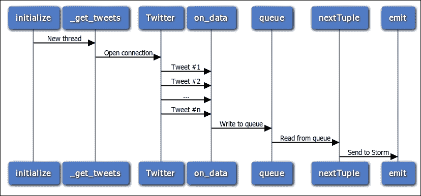
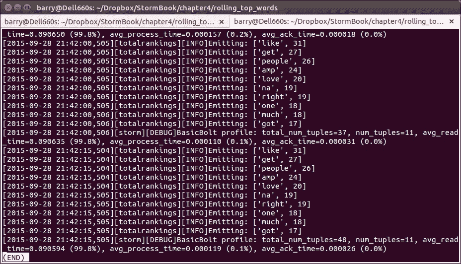

# 第四章。示例拓扑 – Twitter

本章基于第三章（*Introducing Petrel*）的内容。在本章中，我们将构建一个拓扑，演示许多新功能和技巧。特别是，我们将看到如何：

+   实现从 Twitter 读取的 spout

+   基于第三方 Python 库构建拓扑组件

+   在滚动时间段内计算统计数据和排名

+   从`topology.yaml`读取自定义配置设置

+   使用“tick tuples”按计划执行逻辑

# Twitter 分析

大多数人都听说过 Twitter，但如果您还没有，可以查看维基百科是如何描述 Twitter 的：

> *"一个在线社交网络服务，允许用户发送和阅读称为“推文”的 140 个字符的短消息。"*

2013 年，Twitter 上的用户每天发布 4 亿条消息。Twitter 提供了一个 API，允许开发者实时访问推文流。在这些推文中，消息默认是公开的。消息量、API 的可用性和推文的公开性使得 Twitter 成为了解当前事件、感兴趣的话题、公众情绪等的有价值的信息来源。

Storm 最初是在 BackType 开发的，用于处理推文，Twitter 分析仍然是 Storm 的一个流行用例。您可以在 Storm 网站上看到几个示例，网址为[`storm.apache.org/documentation/Powered-By.html`](https://storm.apache.org/documentation/Powered-By.html)。

本章中的拓扑演示了如何从 Twitter 的实时流 API 中读取，计算最流行单词的排名。这是 Storm 网站上“滚动最热单词”示例的 Python 版本（[`github.com/apache/storm/blob/master/examples/storm-starter/src/jvm/storm/starter/RollingTopWords.java`](https://github.com/apache/storm/blob/master/examples/storm-starter/src/jvm/storm/starter/RollingTopWords.java)），并包括以下组件：

+   Twitter 流输出组件（`twitterstream.py`）：此组件从 Twitter 样本流中读取推文。

+   分词 bolt（`splitsentence.py`）：此组件接收推文并将它们拆分为单词。这是第三章中介绍的 Petrel 的分词 bolt 的改进版本。

+   滚动词计数 bolt（`rollingcount.py`）：此组件接收单词并计算其出现次数。它与第三章中介绍的 Petrel 的词计数 bolt 类似，但实现了滚动计数（这意味着 bolt 会定期丢弃旧数据，因此词计数只考虑最近的消息）。

+   中间排名 bolt（`intermediaterankings.py`）：此组件消费词计数，并定期输出出现频率最高的*n*个单词。

+   总排名 bolt（`totalrankings.py`）：此组件与中间排名 bolt 类似。它将中间排名合并，生成一组总体排名。

# Twitter 的流式 API

Twitter 的公共 API 功能强大且灵活。它具有许多用于发布和消费推文的功能。我们的应用程序需要实时接收和处理推文。Twitter 的流式 API 旨在解决这个问题。在计算机科学中，*流*是一系列随时间提供的数据元素（在这种情况下，推文）的序列。

流式 API 的详细解释可以在[`dev.twitter.com/streaming/overview`](https://dev.twitter.com/streaming/overview)找到。要使用它，应用程序首先需要与 Twitter 建立一个连接。该连接将无限期保持开启状态以接收推文。

流式 API 提供了几种方式来选择你的应用程序接收哪些推文。我们的拓扑使用所谓的样本流，它由 Twitter 任意选择的一小部分所有推文组成。样本流旨在用于演示和测试。生产应用程序通常使用其他流类型之一。有关可用流的更多信息，请参阅[`dev.twitter.com/streaming/public`](https://dev.twitter.com/streaming/public)。

## 创建 Twitter 应用程序以使用流式 API

在我们能够使用 Twitter 的流式 API 之前，Twitter 要求我们创建一个应用。这听起来很复杂，但实际上设置起来非常简单；基本上，我们只需在网站上填写一个表格：

1.  如果你没有 Twitter 账户，请在[`twitter.com/`](https://twitter.com/)创建一个。

1.  一旦你有了账户，登录并前往[`apps.twitter.com/`](https://apps.twitter.com/)。点击**创建新应用**。填写创建应用程序的表格。将**回调 URL**字段留空。默认访问级别为只读，这意味着此应用程序只能读取推文；它不能发布或进行其他更改。对于这个例子，只读访问是合适的。最后，点击**创建你的 Twitter 应用程序**。你将被重定向到你的应用页面。

1.  点击**密钥和访问令牌**选项卡，然后点击**创建我的访问令牌**。Twitter 将生成一个由两部分组成的访问令牌：**访问令牌**和**访问令牌密钥**。在连接到 Twitter 时，你的应用程序将使用此令牌以及**消费者密钥**和**消费者密钥密钥**。

    以下截图显示了生成访问令牌后的**密钥和访问令牌**选项卡：

    

## 拓扑配置文件

现在我们已经设置了一个具有 API 访问权限的 Twitter 账户，我们准备创建拓扑。首先，创建`topology.yaml`。我们在第三章中首次看到了基本的`topology.yaml`文件，*介绍 Petrel*。在这里，`topology.yaml`也将包含 Twitter 的连接参数。输入以下文本，用你在[`apps.twitter.com/`](https://apps.twitter.com/)获取的四个`oauth`值替换：

```py
nimbus.host: "localhost"
topology.workers: 1

oauth.consumer_key: "blahblahblah"
oauth.consumer_secret: "blahblahblah"
oauth.access_token: "blahblahblah"
oauth.access_token_secret: "blahblahblah"
```

## Twitter 流源

现在，让我们看看 Twitter 喷嘴。在`twitterstream.py`中输入以下代码：

```py
import json
import Queue
import threading

from petrel import storm
from petrel.emitter import Spout

from tweepy.streaming import StreamListener
from tweepy import OAuthHandler, Stream

class QueueListener(StreamListener):
    def __init__(self, queue):
        self.queue = queue

    def on_data(self, data):
        tweet = json.loads(data)
        if 'text' in tweet:
            self.queue.put(tweet['text'])
        return True

class TwitterStreamSpout(Spout):
    def __init__(self):
        super(TwitterStreamSpout, self).__init__(script=__file__)
        self.queue = Queue.Queue(1000)

    def initialize(self, conf, context):
        self.conf = conf
        thread = threading.Thread(target=self._get_tweets)
        thread.daemon = True
        thread.start()

    @classmethod
    def declareOutputFields(cls):
        return ['sentence']

    def _get_tweets(self):
        auth = OAuthHandler(
            self.conf['oauth.consumer_key'],
            self.conf['oauth.consumer_secret'])
        auth.set_access_token(
            self.conf['oauth.access_token'],
            self.conf['oauth.access_token_secret'])
        stream = Stream(auth, QueueListener(self.queue))
        stream.sample(languages=['en'])

    def nextTuple(self):
        tweet = self.queue.get()
        storm.emit([tweet])
        self.queue.task_done()

def run():
    TwitterStreamSpout().run()
```

喷嘴是如何与 Twitter 通信的？Twitter API 对 API 客户端提出了一系列要求：

+   连接必须使用安全套接字层（SSL）进行加密

+   API 客户端必须使用 OAuth 进行身份验证，OAuth 是一种流行的身份验证协议，用于与安全的 Web 服务交互

+   由于它涉及长期连接，流式 API 涉及的内容不仅仅是简单的 HTTP 请求

幸运的是，有一个名为**Tweepy**的库（[`www.tweepy.org/`](http://www.tweepy.org/））实现了这些要求，并提供了一个简单易用的 Python API。Tweepy 提供了一个`Stream`类来连接到流式 API。它在`_get_tweets()`中使用。

创建 Tweepy 流需要之前列出的四个 Twitter 连接参数。我们可以在我们的喷嘴中直接将这些参数硬编码，但这样如果连接参数发生变化，我们就必须更改代码。相反，我们将这些信息放在`topology.yaml`配置文件中。我们的喷嘴在`initialize()`函数中读取这些设置。Storm 在启动此组件的任务时调用此函数，并传递有关环境和配置的信息。在这里，`initialize()`函数捕获`self.conf`中的拓扑配置。这个字典包括`oauth`值。

以下序列图显示了喷嘴如何与 Twitter 通信，接收推文并将它们发出。你可能已经注意到喷嘴创建了一个后台线程。这个线程从 Tweepy 接收推文，并通过 Python 队列将它们传递给主喷嘴线程。



为什么喷嘴使用线程？通常，线程用于支持并发处理。这里并非如此。相反，Tweepy 的行为与 Petrel 喷嘴 API 之间存在不匹配。

当从 Twitter 流中读取时，Tweepy 会阻塞执行，为收到的每条推文调用应用程序提供的处理函数

在 Petrel 中，喷嘴上的`nextTuple()`函数必须在每次返回元组后从函数中返回。

在后台线程中运行 Tweepy 并将其写入队列，为这些冲突的要求提供了一个简单而优雅的解决方案。

## 分割器 bolt

这里的分割器 bolt 的结构与第三章中的类似，*介绍 Petrel*。这个版本有两个改进，使其更有用和更真实。

### 小贴士

忽略那些在“常用词”列表中过于常见，在“常用词”列表中不有趣或无用的单词。这包括像“the”这样的英语单词，以及像“http”、“https”和“rt”这样的在推文中频繁出现的类似词。

在分割推文为单词时，省略标点符号。

一个名为 **Natural Language Toolkit**（**NLTK**）的 Python 库使得实现这两者变得容易。NLTK 有许多其他令人着迷、强大的语言处理功能，但这些超出了本书的范围。

在 `splitsentence.py` 中输入以下代码：

```py
import nltk.corpus

from petrel import storm
from petrel.emitter import BasicBolt

class SplitSentenceBolt(BasicBolt):
    def __init__(self):
        super(SplitSentenceBolt, self).__init__(script=__file__)
        self.stop = set(nltk.corpus.stopwords.words('english'))
        self.stop.update(['http', 'https', 'rt'])

    def declareOutputFields(self):
        return ['word']

    def process(self, tup):
        for word in self._get_words(tup.values[0]):
            storm.emit([word])

    def _get_words(self, sentence):
        for w in nltk.word_tokenize(sentence):
            w = w.lower()
            if w.isalpha() and w not in self.stop:
                yield w

def run():
    SplitSentenceBolt().run()
```

## 滚动词频 bolt

滚动词频 bolt 与第三章中介绍的 Petrel 的词频 bolt 类似，*介绍 Petrel*。早期章节中的 bolt 简单地无限期地累积词频。这不利于分析 Twitter 上的热门话题，因为热门话题可能在一瞬间发生变化。相反，我们希望计数反映最新的信息。为此，滚动词频 bolt 将数据存储在基于时间的桶中。然后，它定期丢弃超过 5 分钟年龄的桶。因此，此 bolt 的词频只考虑最后 5 分钟的数据。

在 `rollingcount.py` 中输入以下代码：

```py
from collections import defaultdict

from petrel import storm
from petrel.emitter import BasicBolt

class SlotBasedCounter(object):
    def __init__(self, numSlots):
        self.numSlots = numSlots
        self.objToCounts = defaultdict(lambda: [0] * numSlots)

    def incrementCount(self, obj, slot):
        self.objToCounts[obj][slot] += 1

    def getCount(self, obj, slot):
        return self.objToCounts[obj][slot]

    def getCounts(self):
        return dict((k, sum(v)) for k, v in self.objToCounts.iteritems())

    def wipeSlot(self, slot):
        for obj in self.objToCounts.iterkeys():
            self.objToCounts[obj][slot] = 0

    def shouldBeRemovedFromCounter(self, obj):
        return sum(self.objToCounts[obj]) == 0

    def wipeZeros(self):
        objToBeRemoved = set()
        for obj in self.objToCounts.iterkeys():
            if sum(self.objToCounts[obj]) == 0:
                objToBeRemoved.add(obj)
        for obj in objToBeRemoved:
            del self.objToCounts[obj]

class SlidingWindowCounter(object):
    def __init__(self, windowLengthInSlots):
        self.windowLengthInSlots = windowLengthInSlots
        self.objCounter = /
            SlotBasedCounter(
                self.windowLengthInSlots)
        self.headSlot = 0
        self.tailSlot = self.slotAfter(self.headSlot)

    def incrementCount(self, obj):
        self.objCounter.incrementCount(obj, self.headSlot)

    def getCountsThenAdvanceWindow(self):
        counts = self.objCounter.getCounts()
        self.objCounter.wipeZeros()
        self.objCounter.wipeSlot(self.tailSlot)
        self.headSlot = self.tailSlot
        self.tailSlot = self.slotAfter(self.tailSlot)
        return counts

    def slotAfter(self, slot):
        return (slot + 1) % self.windowLengthInSlots

class RollingCountBolt(BasicBolt):
    numWindowChunks = 5
    emitFrequencyInSeconds = 60
    windowLengthInSeconds = numWindowChunks * \
        emitFrequencyInSeconds

    def __init__(self):
        super(RollingCountBolt, self).__init__(script=__file__)
        self.counter = SlidingWindowCounter(
            self.windowLengthInSeconds /
                self.emitFrequencyInSeconds

    @classmethod
    def declareOutputFields(cls):
        return ['word', 'count']

    def process(self, tup):
        if tup.is_tick_tuple():
            self.emitCurrentWindowCounts()
        else:
            self.counter.incrementCount(tup.values[0])

    def emitCurrentWindowCounts(self):
        counts = self.counter.getCountsThenAdvanceWindow()
        for k, v in counts.iteritems():
            storm.emit([k, v])

    def getComponentConfiguration(self):
        return {"topology.tick.tuple.freq.secs":
            self.emitFrequencyInSeconds}

def run():
    RollingCountBolt().run()
```

`SlotBasedCounter` 存储每个单词的 `numSlots`（五个）计数值。每个槽存储 `emitFrequencyInSeconds`（60）秒的数据。超过 5 分钟的计数值将被丢弃。

bolt 如何知道 60 秒已经过去？Storm 通过提供一个名为 **tick tuples** 的功能来简化这一点。当您需要根据计划在 bolt 中执行某些逻辑时，此功能非常有用。要使用此功能，请执行以下步骤：

+   在 `getComponentConfiguration()` 中，返回一个包含 `topology.tick.tuple.freq.secs` 键的字典。该值是期望的 tick 之间的秒数。

+   在 `process()` 中，检查元组是否为普通元组或 tick 元组。当接收到 tick 元组时，bolt 应该运行其计划中的处理。

## 中间排名 bolt

中间排名 bolt 维护一个按出现次数排序的 `maxSize`（10）项的字典，并且每 `emitFrequencyInSeconds`（15）秒发出这些项。在生产中，拓扑将运行许多此 bolt 的实例，每个实例维护整体单词集合的 *子集* 中的顶级单词。拥有许多相同组件的实例允许拓扑处理大量推文，并且即使不同单词的数量相当大，也能轻松地保持所有计数在内存中。

在 `intermediaterankings.py` 中输入以下代码：

```py
from petrel import storm
from petrel.emitter import BasicBolt

def tup_sort_key(tup):
    return tup.values[1]

class IntermediateRankingsBolt(BasicBolt):
    emitFrequencyInSeconds = 15
    maxSize = 10

    def __init__(self):
        super(IntermediateRankingsBolt, self).__init__(script=__file__)
        self.rankedItems = {}

    def declareOutputFields(self):
        return ['word', 'count']

    def process(self, tup):
        if tup.is_tick_tuple():
            for t in self.rankedItems.itervalues():
                storm.emit(t.values)
        else:
            self.rankedItems[tup.values[0]] = tup
            if len(self.rankedItems) > self.maxSize:
                for t in sorted(
                        self.rankedItems.itervalues(), key=tup_sort_key):
                    del self.rankedItems[t.values[0]]
                    break

    def getComponentConfiguration(self):
        return {"topology.tick.tuple.freq.secs":
            self.emitFrequencyInSeconds}

def run():
    IntermediateRankingsBolt().run()
```

## 总排名 bolt

总排名 bolt 与中间排名 bolt 非常相似。拓扑中只有一个此 bolt 的实例。它接收来自该 bolt 每个实例的顶级单词，选择整体上的 `maxSize`（10）项。

在 `totalrankings.py` 中输入以下代码：

```py
import logging

from petrel import storm
from petrel.emitter import BasicBolt

log = logging.getLogger('totalrankings')

def tup_sort_key(tup):
    return tup.values[1]

class TotalRankingsBolt(BasicBolt):
    emitFrequencyInSeconds = 15
    maxSize = 10

    def __init__(self):
        super(TotalRankingsBolt, self).__init__(script=__file__)
        self.rankedItems = {}

    def declareOutputFields(self):
        return ['word', 'count']

    def process(self, tup):
        if tup.is_tick_tuple():
            for t in sorted(
                    self.rankedItems.itervalues(),
                    key=tup_sort_key,
                    reverse=True):
                log.info('Emitting: %s', repr(t.values))
                storm.emit(t.values)
        else:
            self.rankedItems[tup.values[0]] = tup
            if len(self.rankedItems) > self.maxSize:
                for t in sorted(
                        self.rankedItems.itervalues(),
                        key=tup_sort_key):
                    del self.rankedItems[t.values[0]]
                    break
            zero_keys = set(
                k for k, v in self.rankedItems.iteritems()
                if v.values[1] == 0)
            for k in zero_keys:
                del self.rankedItems[k]

    def getComponentConfiguration(self):
        return {"topology.tick.tuple.freq.secs": self.emitFrequencyInSeconds}

def run():
    TotalRankingsBolt().run()
```

## 定义拓扑

这里是定义拓扑结构的 `create.py` 脚本：

```py
from twitterstream import TwitterStreamSpout
from splitsentence import SplitSentenceBolt
from rollingcount import RollingCountBolt
from intermediaterankings import IntermediateRankingsBolt
from totalrankings import TotalRankingsBolt

def create(builder):
    spoutId = "spout"
    splitterId = "splitter"
    counterId = "counter"
    intermediateRankerId = "intermediateRanker"
    totalRankerId = "finalRanker"
    builder.setSpout(spoutId, TwitterStreamSpout(), 1)
    builder.setBolt(
        splitterId, SplitSentenceBolt(), 1).shuffleGrouping("spout")
    builder.setBolt(
        counterId, RollingCountBolt(), 4).fieldsGrouping(
            splitterId, ["word"])
    builder.setBolt(
        intermediateRankerId,
        IntermediateRankingsBolt(), 4).fieldsGrouping(
            counterId, ["word"])
    builder.setBolt(
        totalRankerId, TotalRankingsBolt()).globalGrouping(
            intermediateRankerId)
```

这个拓扑的结构与第三章中“介绍 Petrel”的单词计数拓扑相似。第三章。`TotalRankingsBolt`有一个新的细节。如前所述，这个螺栓只有一个实例，它使用`globalGrouping()`，因此所有来自`IntermediateRankingsBolt`的元组都发送给它。

你可能想知道为什么拓扑需要中间排名和总排名螺栓。为了让我们知道整体上的顶级单词，需要有一个单一的螺栓实例（总排名）能够看到整个推文流。但在高数据速率下，单个螺栓不可能跟上流量。中间排名的螺栓实例“屏蔽”了总排名螺栓的流量，计算其推文流切片中的顶级单词。这允许最终的排名螺栓计算整体中最常见的单词，同时只消耗整体单词计数的一小部分。优雅！

# 运行拓扑

在我们运行拓扑之前，还有一些小问题需要解决：

1.  将第三章中的第二个示例中的`logconfig.ini`文件复制到这个拓扑的目录中。

1.  创建一个名为`setup.sh`的文件。Petrel 将在启动时将此脚本与拓扑打包并运行。此脚本安装拓扑使用的第三方 Python 库。文件看起来像这样：

    ```py
    pip install -U pip
    pip install nltk==3.0.1 oauthlib==0.7.2 tweepy==3.2.0
    ```

1.  创建一个名为`manifest.txt`的文件，包含以下两行：

    ```py
    logconfig.ini
    setup.sh
    ```

1.  在运行拓扑之前，让我们回顾一下我们创建的文件列表。确保你已经正确创建了这些文件：

    +   `topology.yaml`

    +   `twitterstream.py`

    +   `splitsentence.py`

    +   `rollingcount.py`

    +   `intermediaterankings.py`

    +   `totalrankings.py`

    +   `manifest.txt`

    +   `setup.sh`

1.  使用以下命令运行拓扑：

    ```py
    petrel submit --config topology.yaml --logdir `pwd`
    ```

一旦拓扑开始运行，在`topology`目录中打开另一个终端。输入以下命令以查看总排名螺栓的`log`文件，按时间顺序从旧到新排序：

```py
ls -ltr petrel*totalrankings.log
```

如果这是你第一次运行拓扑，将只列出一个日志文件。每次运行都会创建一个新的文件。如果有多个文件列出，请选择最新的一个。输入以下命令以监控日志文件的内容（在您的系统上，确切的文件名可能不同）：

```py
tail -f petrel24748_totalrankings.log
```

大约每 15 秒，你会看到按流行度降序排列的前 10 个单词的日志消息，如下所示：



# 摘要

在本章中，我们使用多种新技术和库开发了一个复杂的拓扑。阅读这个示例后，你应该准备好开始将 Petrel 和 Storm 应用于解决实际问题。

在下一章中，我们将更详细地研究一些在操作集群时非常有用的 Storm 内置功能，例如日志记录和监控。
