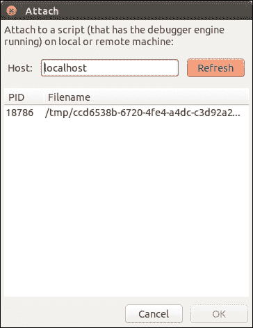
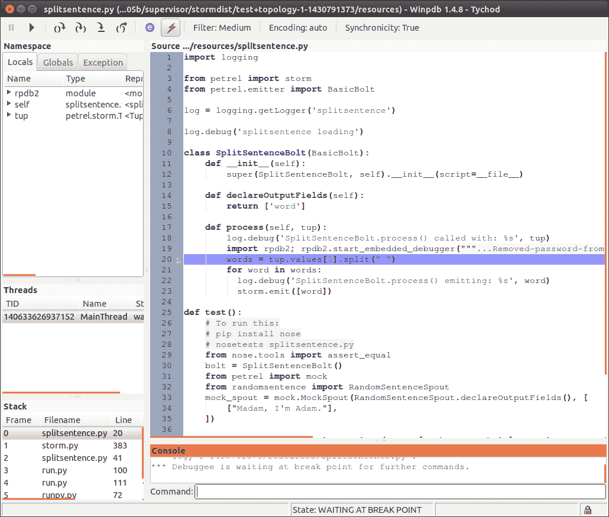
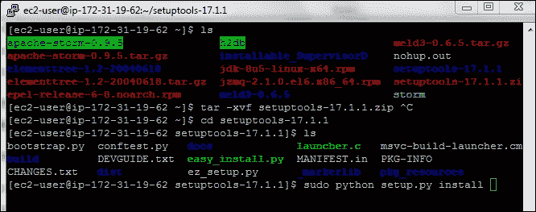
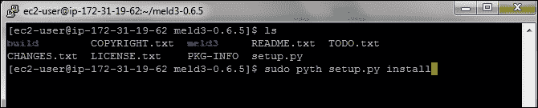
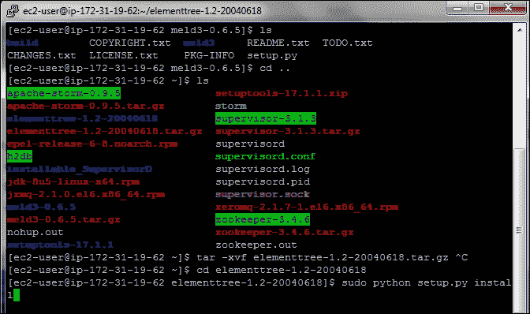
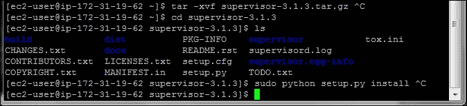
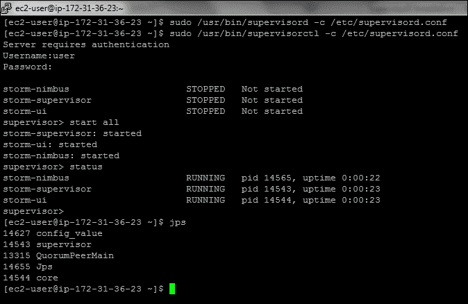
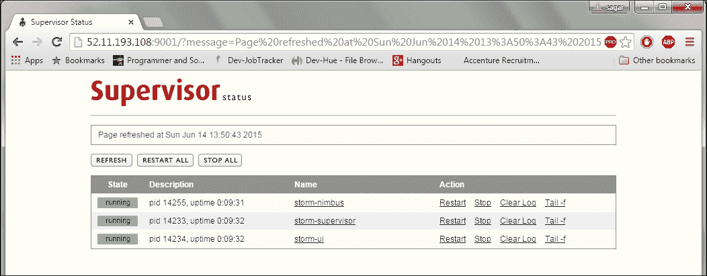

# 第六章。Petrel 实践

在前面的章节中，我们看到了 Storm 拓扑的工作示例，既有简单的也有复杂的。然而，在这样做的时候，我们跳过了一些你在开发自己的拓扑时可能需要的工具和技术：

+   Storm 是一个运行代码的绝佳环境，但将代码部署到 Storm（即使在本地机器上）也会增加复杂性和额外的时间。我们将看到如何在 Storm 之外测试你的 spouts 和 bolts。

+   当组件在 Storm 中运行时，它们无法从控制台读取，这阻止了使用 pdb，即标准的 Python 调试器。本章演示了 Winpdb，这是一个适合调试 Storm 内部组件的交互式调试工具。

+   Storm 让你能够轻松利用多台服务器的强大功能，但你的代码的性能仍然很重要。在本章中，我们将看到一些衡量我们拓扑组件性能的方法。

# 测试 bolt

Storm 使得部署和运行 Python 拓扑变得容易，但在 Storm 中开发和测试它们具有挑战性，无论是在独立运行的 Storm 还是完整的 Storm 部署中：

+   Storm 代表你启动程序——不仅包括你的 Python 代码，还包括辅助的 Java 进程

+   它控制 Python 组件的标准输入和输出通道

+   Python 程序必须定期响应心跳消息，否则将被 Storm 关闭

这使得使用典型的工具和技术来调试 Storm 拓扑变得困难，这些工具和技术通常用于其他 Python 代码，例如从命令行运行并使用 pdb 进行调试的常见技术。

Petrel 的模拟模块帮助我们完成这项工作。它提供了一个简单的、独立的 Python 容器，用于测试简单的拓扑并验证预期的结果是否返回。

在 Petrel 术语中，一个**简单**的拓扑是指只输出到默认流且没有分支或循环的拓扑。`run_simple_topology()`假设列表中的第一个组件是一个 spout，将每个组件的输出传递给序列中的下一个组件。

## 示例 - 测试 SplitSentenceBolt

让我们来看一个例子。这里是第三章中第一个例子，即*介绍 Petrel*的`splitsentence.py`文件，添加了单元测试：

```py
from nose.tools import assert_equal

from petrel import mock, storm
from petrel.emitter import BasicBolt

from randomsentence import RandomSentenceSpout

class SplitSentenceBolt(BasicBolt):
    def __init__(self):
        super(SplitSentenceBolt, self).__init__(script=__file__)

    def declareOutputFields(self):
        return ['word']

    def process(self, tup):
        words = tup.values[0].split(" ")
        for word in words:
          storm.emit([word])

def test():
    bolt = SplitSentenceBolt()
    mock_spout = mock.MockSpout(
        RandomSentenceSpout.declareOutputFields(),
        [["Madam, I'm Adam."]])

    result = mock.run_simple_topology(
        None, [mock_spout, bolt], result_type=mock.LIST)
        assert_equal([['Madam,'], ["I'm"], ['Adam.']], result[bolt])

def run():
    SplitSentenceBolt().run()
```

要运行测试，请输入以下命令：

```py
pip install nosetests
```

1.  首先，通过运行以下命令安装 Python 的`nosetests`库：

    ```py
    pip install nosetests
    ```

1.  接下来，运行以下行：

    ```py
    nosetests -v splitsentence.py
    ```

如果一切顺利，你会看到以下输出：

```py
splitsentence.test ... ok

----------------------------------------------------------------------
Ran 1 test in 0.001s

OK
```

Nose 是一个非常强大的工具，具有许多功能。我们在这里不会详细讨论它，但你可以在[`nose.readthedocs.org/en/latest/`](https://nose.readthedocs.org/en/latest/)找到文档。

## 示例 - 使用 WordCountBolt 测试 SplitSentenceBolt

以下示例展示了如何测试一系列相关组件。在以下代码中，我们看到`wordcount.py`的新版本，它测试了`SplitSentenceBolt`和`WordCountBolt`之间的交互：

```py
from collections import defaultdict

from nose.tools import assert_equal

from petrel import mock, storm
from petrel.emitter import BasicBolt

from randomsentence import RandomSentenceSpout
from splitsentence import SplitSentenceBolt

class WordCountBolt(BasicBolt):
    def __init__(self):
        super(WordCountBolt, self).__init__(script=__file__)
        self._count = defaultdict(int)

    @classmethod
    def declareOutputFields(cls):
        return ['word', 'count']

    def process(self, tup):
        word = tup.values[0]
        self._count[word] += 1
        storm.emit([word, self._count[word]])

def test():
    ss_bolt = SplitSentenceBolt()
    wc_bolt = WordCountBolt()

    mock_spout = mock.MockSpout(
        RandomSentenceSpout.declareOutputFields(),
        [["the bart the"]])

     result = mock.run_simple_topology(
       None,
       [mock_spout, ss_bolt, wc_bolt],
       result_type=mock.LIST)
       assert_equal([['the', 1], ['bart', 1], ['the', 2]], result[wc_bolt])

def run():
    WordCountBolt().run()
```

测试非常直接；我们只是实例化两个组件，并在调用`mock.run_simple_topology()`时按正确的顺序包含它们。

### 注意

两个示例测试在调用`run_simple_topology()`时都指定了`result_type=mock.LIST`。这个参数选项告诉 Petrel 在返回输出元组时使用哪种格式。选项包括：

`STORM_TUPLE`

`LIST`

`TUPLE`

`NAMEDTUPLE`

通常，对于输出字段数量较少的组件，`LIST`是一个不错的选择，而对于字段数量较多的组件（即允许测试通过字段名而不是数字索引来访问结果字段），`NAMEDTUPLE`则更易读。如果测试需要检查结果的其他属性，例如，较少使用的流属性，则`STORM_TUPLE`很有用。

# 调试

到目前为止，我们使用日志消息和自动化测试来调试拓扑。这些技术非常强大，但有时可能需要在 Storm 环境中直接进行调试。例如，问题可能：

+   依赖于以特定用户身份运行

+   仅在有真实数据时发生

+   仅当组件有多个并行运行的实例时发生

本节介绍了一个在 Storm 内部进行调试的工具。

Winpdb 是一个基于 GUI 的 Python 调试器，支持嵌入式调试。如果你不熟悉“嵌入式调试”这个术语，请注意：它仅仅意味着 Winpdb 可以附加到以某种方式启动的程序，而不一定是来自 WinDbg 或你的命令行。因此，它非常适合调试在 Storm 中运行的 Petrel 组件。

# 安装 Winpdb

激活你的 Petrel 虚拟环境，然后使用`pip`来安装它：

```py
source <virtualenv directory>/bin/activate
pip install winpdb
```

## 添加 Winpdb 断点

在`splitsentence.py`文件中，在`run()`函数的开始处添加以下内容：

```py
import rpdb2
rpdb2.start_embedded_debugger('password')
```

`'password'`的值可以是任何东西；这仅仅是你在下一步附加到`splitsentence.py`时将使用的密码。

当此行代码执行时，脚本将冻结默认的 5 分钟，等待调试器附加。

## 启动和附加调试器

现在运行拓扑：

```py
petrel submit --config topology.yaml
```

一旦你看到来自 spout 的日志消息，你就会知道拓扑已经启动并运行，因此你可以连接到调试器。

通过运行`winpdb`简单地启动`Winpdb`。

有关如何使用 Winpdb 进行嵌入式调试的更多详细信息，请参阅[`winpdb.org/docs/embedded-debugging/`](http://winpdb.org/docs/embedded-debugging/)文档。

当窗口出现时，从菜单中选择**文件** | **附加**。将出现一个密码对话框。在这里，输入传递给`start_embedded_debugger()`的相同密码，然后点击**确定**按钮，如图所示：


接下来，选择要附加到的进程，然后点击**确定**，如图所示：



现在，您将看到主 Winpdb 窗口，其中断点下的行被突出显示。如果您使用过其他调试器，Winpdb 应该很容易使用。如果您需要使用 Winpdb 的帮助，以下教程对您非常有用：

[`code.google.com/p/winpdb/wiki/DebuggingTutorial`](https://code.google.com/p/winpdb/wiki/DebuggingTutorial)。



# 分析您的拓扑性能

性能可能是任何应用的担忧。这对于 Storm 拓扑同样适用，也许更为重要。

当您试图通过拓扑推送大量数据时，原始性能当然是一个担忧——更快的组件意味着可以处理更多的数据。但了解单个组件的元组处理性能也同样重要。这些信息可以以两种方式使用。

第一点是了解哪些组件较慢，因为这告诉您在尝试使代码更快时应该关注的地方。一旦您知道哪个组件（或多个组件）较慢，您可以使用 Python cProfile 模块（[`pymotw.com/2/profile/`](http://pymotw.com/2/profile/））和行分析器（[https://github.com/rkern/line_profiler](https://github.com/rkern/line_profiler)）等工具来了解代码花费大部分时间的地方。

即使经过分析，一些组件仍然会比其他组件更快。在这种情况下，了解组件之间的相对性能可以帮助您配置拓扑以获得最佳性能。

第二点有些微妙，让我们看看一个例子。在以下代码中，我们看到了单词计数拓扑中两个 Storm 组件的日志摘录。这些日志消息是由 Petrel 自动生成的。第一个是分句螺栓，第二个是单词计数螺栓：

```py
[2015-05-07 22:51:44,772][storm][DEBUG]BasicBolt profile: total_num_tuples=79, num_tuples=79, avg_read_time=0.002431 (19.1%), avg_process_time=0.010279 (80.7%), avg_ack_time=0.000019 (0.2%)
[2015-05-07 22:51:45,776][storm][DEBUG]BasicBolt profile: total_num_tuples=175, num_tuples=96, avg_read_time=0.000048 (0.5%), avg_process_time=0.010374 (99.3%), avg_ack_time=0.000025 (0.2%)
[2015-05-07 22:51:46,784][storm][DEBUG]BasicBolt profile: total_num_tuples=271, num_tuples=96, avg_read_time=0.000043 (0.4%), avg_process_time=0.010417 (99.3%), avg_ack_time=0.000026 (0.2%)
[2015-05-07 22:51:47,791][storm][DEBUG]BasicBolt profile: total_num_tuples=368, num_tuples=97, avg_read_time=0.000041 (0.4%), avg_process_time=0.010317 (99.4%), avg_ack_time=0.000021 (0.2%)
```

## 分句螺栓日志

以下为分句螺栓日志：

```py
[2015-05-07 22:51:44,918][storm][DEBUG]BasicBolt profile: total_num_tuples=591, num_tuples=591, avg_read_time=0.001623 (95.8%), avg_process_time=0.000052 (3.1%), avg_ack_time=0.000019 (1.1%)
[2015-05-07 22:51:45,924][storm][DEBUG]BasicBolt profile: total_num_tuples=1215, num_tuples=624, avg_read_time=0.001523 (94.7%), avg_process_time=0.000060 (3.7%), avg_ack_time=0.000025 (1.5%)
[2015-05-07 22:51:46,930][storm][DEBUG]BasicBolt profile: total_num_tuples=1829, num_tuples=614, avg_read_time=0.001559 (95.4%), avg_process_time=0.000055 (3.3%), avg_ack_time=0.000021 (1.3%)
[2015-05-07 22:51:47,938][storm][DEBUG]BasicBolt profile: total_num_tuples=2451, num_tuples=622, avg_read_time=0.001547 (95.7%), avg_process_time=0.000049 (3.0%), avg_ack_time=0.000020 (1.3%)
```

## 单词计数螺栓日志

这些日志表明，分句螺栓在处理和确认每个元组时花费了 0.010338 秒（0.010317 + 0.000021），而单词计数螺栓每个元组花费了 0.000069 秒（0.000049 + 0.000020）。分句螺栓较慢，这表明您可能需要比单词计数螺栓更多的分句螺栓实例。

### 注意

为什么在先前的计算中没有考虑读取时间？读取时间包括从 Storm 读取元组所花费的 CPU 时间，但也包括等待（即睡眠）元组到达所花费的时间。如果上游组件提供数据较慢，我们不希望将这段时间计入我们的组件。因此，为了简单起见，我们省略了读取时间。

当然，每条元组的性能只是其中一部分。您还必须考虑要处理的元组数量。在前面的 4 秒日志中，分割句子螺栓接收了 97 个元组（句子），而单词计数螺栓接收了 622 个元组（单词）。现在我们将这些数字应用到每条元组的处理时间上：

```py
0.010338 seconds/tuple * 97 tuples = 1.002786 seconds (Split sentence)
0.000069 seconds/tuple * 622 tuples = 0.042918 seconds (Word count)
```

分割句子螺栓使用的总时间要大得多（大约大 23 倍），在配置拓扑的并行性时，我们应该考虑到这一点。例如，我们可能将 `topology.yaml` 配置如下：

```py
petrel.parallelism.splitsentence: 24
petrel.parallelism.wordcount: 1
```

通过以这种方式配置拓扑，我们帮助确保在高流量率时，有足够的分割句子螺栓以避免成为瓶颈，使单词计数螺栓始终保持忙碌状态。

### 注意

前一节中的日志使用了故意修改以运行得更慢的分割句子螺栓版本，以便使示例更清晰。

# 摘要

在本章中，您学到了一些技能，这些技能将帮助您在构建自己的拓扑时更加高效。当您开发 spouts 或 bolts 时，您可以在将它们组装成完整的拓扑并在 Storm 上部署之前单独测试它们。如果您遇到仅在 Storm 运行时发生的棘手问题，您可以使用 Winpdb 以及（或代替）日志消息。当您的代码运行时，您可以了解哪些组件花费了大部分时间，因此您可以专注于提高这些领域的性能。有了这些技能，您现在可以出去构建自己的拓扑了。祝您好运！

# 附录 A. 使用 supervisord 管理 Storm

本附录为您概述以下主题：

+   在集群上管理 Storm

+   介绍 supervisord

+   supervisord 的组件

+   supervisord 安装和配置

# 在集群上管理 Storm

有许多工具可用于创建多个虚拟机，安装预定义的软件，甚至管理该软件的状态。

## 介绍 supervisord

supervisord 是一个进程控制系统。它是一个客户端-服务器系统，允许其用户在类 Unix 操作系统上监控和控制多个进程。有关详细信息，请访问 [`supervisord.org/`](http://supervisord.org/)。

## supervisord 组件

监督器的服务器部分被称为 supervisord。它负责在其自己的调用时启动子程序，响应用户的命令，重启崩溃或退出的子进程，记录其子进程的 `stdout` 和 `stderr` 输出，并生成和处理与子进程生命周期中的点相对应的“事件”。服务器进程使用配置文件。这通常位于 `/etc/supervisord.conf`。此配置文件是一个 Windows-INI 风格的 `config` 文件。通过适当的文件系统权限保持此文件的安全非常重要，因为它可能包含解密的用户名和密码：

+   **supervisorctl**：supervisor 的命令行客户端部分被称为 supervisorctl。它提供了一个类似于 shell 的界面，用于提供 supervisord 的功能。从 supervisorctl，用户可以连接到不同的 supervisord 进程。他们可以获取由 supervisord 控制的子进程的状态，停止和启动子进程，以及获取 supervisord 的运行进程列表。命令行客户端通过 Unix 域套接字或互联网（TCP）套接字与服务器通信。服务器可以要求客户端用户在允许他们使用命令之前提供身份验证凭据。客户端进程通常使用与服务器相同的配置文件，但任何包含`[supervisorctl]`部分的配置文件都将有效。

+   **Web 服务器**：如果你针对互联网套接字启动 supervisord，可以通过浏览器访问一个（稀疏的）Web 用户界面，其功能与 supervisorctl 相当。访问服务器 URL（例如，`http://localhost:9001/`）以通过 Web 界面查看和控制进程状态，在激活配置文件的`[inet_http_server]`部分后。

+   **XML-RPC 接口**：提供 Web UI 的相同 HTTP 服务器还提供了一个 XML-RPC 接口，可以用来查询和控制监督程序及其运行的程序。请参阅*XML-RPC API 文档*。

+   **机器**：假设我们有两个 IP 地址为`172-31-19-62`和`172.31.36.23`的 EC2 机器。我们将在两台机器上安装 supervisord，然后配置以决定每个机器上运行的 Storm 服务。

+   **Storm 和 Zookeeper 设置**：让我们在机器`172.31.36.23`上运行 Zookeeper、Nimbus、supervisor 和 UI，只在`172-31-19-62`上运行 supervisor。

+   **Zookeeper** **版本**：`zookeeper-3.4.6.tar.gz`。

+   **Storm** **版本**：`apache-storm-0.9.5.tar.gz`。

这里是 Zookeeper 服务器设置和配置的过程：

1.  下载 Zookeeper 的最新版本并解压：

    ```py
    tar –xvf zookeeper-3.4.6.tar.gz
    ```

1.  在`conf`目录中配置`zoo.cfg`以在集群模式下启动 Zookeeper。

1.  Zookeeper 配置：

    ```py
    server.1=172.31.36.23:2888:3888
    tickTime=2000
    initLimit=10
    syncLimit=5
    # the directory where the snapshot is stored.
    dataDir=/home/ec2-user/zookeeper-3.4.6/tmp/zookeeper
    clientPort=2181
    ```

1.  确保在`dataDir`中指定的目录已创建，并且用户对该目录有读写权限。

1.  然后，进入 Zookeeper 的`bin`目录，使用以下命令启动`zookeeper`服务器：

    ```py
    [ec2-user@ip-172-31-36-23 bin~]$ zkServer.sh start
    ```

Storm 服务器设置和配置：

1.  从 Apache Storm 网站下载 Storm 的最新版本并解压：

    ```py
    tar –xvf apache-storm-0.9.5.tar.gz
    ```

1.  这里是 Storm Nimbus 机器以及从属机（仅添加/更改配置）的配置：

    ```py
    storm.zookeeper.servers: - "172.31.36.23"

    nimbus.host: "172.31.36.23"

    nimbus.childopts: "-Xmx1024m -Djava.net.preferIPv4Stack=true"

    ui.childopts: "-Xmx768m -Djava.net.preferIPv4Stack=true"

    supervisor.childopts: "-Djava.net.preferIPv4Stack=true"

    worker.childopts: "-Xmx768m -Djava.net.preferIPv4Stack=true"

    storm.local.dir: "/home/ec2-user/apache-storm-0.9.5/local"

    supervisor.slots.ports:
     - 6700
     - 6701
     - 6702
     - 6703
    ```

### Supervisord 安装

可以通过以下两种方式安装 supervisord：

1.  在有互联网访问的系统上安装：

    下载设置工具并使用`easy_install`方法。

1.  在没有互联网访问的系统上安装：

    下载所有依赖项，复制到每台机器上，然后安装它。

我们将遵循第二种安装方法，即不需要互联网访问的方法。我们将下载所有依赖项和 supervisord，并将其复制到服务器上。

Supervisord `[supervisor-3.1.3.tar.gz]` 需要安装以下依赖项：

+   Python 2.7 或更高版本

+   从 [`pypi.python.org/pypi/setuptools`](http://pypi.python.org/pypi/setuptools) 下载 `setuptools`（最新版）

+   从 [`effbot.org/downloads#elementtree`](http://effbot.org/downloads#elementtree) 下载 `elementtree`（最新版）。`elementtree-1.2-20040618.tar.gz`

+   `meld3-0.6.5.tar.gz`

让我们在两台机器上安装 supervisord 和必要的依赖项，分别是 `172.31.36.23` 和 `172-31-19-62`。

以下为安装依赖项的步骤：

1.  `setuptools`:

    +   使用以下命令解压 `.zip` 文件：

        ```py
        [ec2-user@ip-172-31-19-62 ~]$ tar -xvf setuptools-17.1.1.zip
        ```

    +   进入 `setuptools-17.1.1` 目录并使用 `sudo` 运行安装命令：

        ```py
        [ec2-user@ip-172-31-19-62 setuptools-17.1.1]$ sudo python setup.py install
        ```

        

        ```py
        storm.zookeeper.servers: - "172.31.36.23"

        nimbus.host: "172.31.36.23"

        nimbus.childopts: "-Xmx1024m -Djava.net.preferIPv4Stack=true"

        ui.childopts: "-Xmx768m -Djava.net.preferIPv4Stack=true"

        supervisor.childopts: "-Djava.net.preferIPv4Stack=true"

        worker.childopts: "-Xmx768m -Djava.net.preferIPv4Stack=true"

        storm.local.dir: "/home/ec2-user/apache-storm-0.9.5/local"

        supervisor.slots.ports:
         - 6700
         - 6701
         - 6702
         - 6703
        ```

1.  `meld3`:

    +   使用以下命令提取 `.ts.gz` 文件：

        ```py
        [ec2-user@ip-172-31-19-62 ~]$ tar -xvf meld3-0.6.5.tar.gz
        ```

    +   进入 `meld3.-0.6.5` 目录并运行此命令：

        ```py
        [ec2-user@ip-172-31-19-62 meld3-0.6.5]$ sudo pyth setup.py install
        ```

    

1.  `elementtree`:

    +   提取 `.ts.gz` 文件：

        ```py
        [ec2-user@ip-172-31-19-62 ~]$ tar -xvf elementtree-1.2-20040618.tar.gz
        ```

    +   进入 `elementtree-1.2-20040618` 并运行以下命令：

        ```py
        [ec2-user@ip-172-31-19-62 elementtree-1.2-20040618]$ sudo python setup.py install
        ```

    

以下为 supervisord 安装步骤：

+   使用此命令提取 `supervisor-3.1.3`：

    ```py
    [ec2-user@ip-172-31-19-62 ~]$ tar -xvf supervisor-3.1.3.tar.gz
    ```

+   进入 `supervisor-3.1.3` 目录并运行以下命令：

    ```py
    [ec2-user@ip-172-31-19-62 supervisor-3.1.3]$ sudo python setup.py install
    ```

    

### 注意

在另一台机器上也需要进行类似的 supervisord 配置，即 `172.31.36.23`。

#### supervisord.conf 的配置

让我们在 `172.31.36.23` 机器上配置服务，并假设 supervisord 的安装已如前所述完成。一旦安装了 supervisor，您可以使用 `supervisorctl` 在 `172-31-19-62` 机器上构建 `supervisord.conf` 文件以启动 `supervisord` 和 `supervisorctl` 命令：

+   创建 `supervisor.conf` 文件。将其放入 `/etc` 目录。

+   我们可以使用以下命令来获取示例 `supervisord.conf`：

    ```py
    [ec2-user@ip-172-31-36-23 ~]$ echo_supervisord_conf
    ```

查看一下 `supervisord.conf` 文件：

```py
[unix_http_server]
file = /home/ec2-user/supervisor.sock
chmod = 0777

[inet_http_server]         ; inet (TCP) server disabled by default
port=172.31.36.23:9001        ; (ip_address:port specifier, *:port for all iface)
username=user              ; (default is no username (open server))
password=123               ; (default is no password (open server))

[rpcinterface:supervisor]
supervisor.rpcinterface_factory = supervisor.rpcinterface:make_main_rpcinterface

[supervisord]
logfile_backups=10           ; (num of main logfile rotation backups;default 10)
logfile=/home/ec2-user/supervisord.log ; (main log file;default $CWD/supervisord.log)
logfile_maxbytes=50MB        ; (max main logfile bytes b4 rotation;default 50MB)
pidfile=/home/ec2-user/supervisord.pid ; (supervisord pidfile;default supervisord.pid)
nodaemon=false               ; (start in foreground if true;default false)
minfds=1024                  ; (min. avail startup file descriptors;default 1024)

[supervisorctl]
;serverurl = unix:///home/ec2-user/supervisor.sock
serverurl=http://172.31.36.23:9001 ; use an http:// url to specify an inet socket
;username=chris              ; should be same as http_username if set
;password=123                ; should be same as http_password if set

[program:storm-nimbus]
command=/home/ec2-user/apache-storm-0.9.5/bin/storm nimbus
user=ec2-user
autostart=false
autorestart=false
startsecs=10
startretries=999
log_stdout=true
log_stderr=true
stdout_logfile=/home/ec2-user/storm/logs/nimbus.out
logfile_maxbytes=20MB
logfile_backups=10

[program:storm-ui]
command=/home/ec2-user/apache-storm-0.9.5/bin/storm ui
user=ec2-user
autostart=false
autorestart=false
startsecs=10
startretries=999
log_stdout=true
log_stderr=true
stdout_logfile=/home/ec2-user/storm/logs/ui.out
logfile_maxbytes=20MB
logfile_backups=10

[program:storm-supervisor]
command=/home/ec2-user/apache-storm-0.9.5/bin/storm supervisor
user=ec2-user
autostart=false
autorestart=false
startsecs=10
startretries=999
log_stdout=true
log_stderr=true
stdout_logfile=/home/ec2-user/storm/logs/supervisor.out
logfile_maxbytes=20MB
logfile_backups=10
```

首先启动监督服务器：

```py
[ec2-user@ip-172-31-36-23 ~] sudo /usr/bin/supervisord -c /etc/supervisord.conf
```

然后，使用 `supervisorctl` 启动所有进程：

```py
[ec2-user@ip-172-31-36-23 ~] sudo /usr/bin/supervisorctl -c /etc/supervisord.conf status
storm-nimbus                     STOPPED   Not started
storm-supervisor                 STOPPED   Not started
storm-ui                         STOPPED   Not started
[ec2-user@ip-172-31-36-23 ~]$ sudo /usr/bin/supervisorctl -c /etc/supervisord.conf start all
storm-supervisor: started
storm-ui: started
storm-nimbus: started
[ec2-user@ip-172-31-36-23 ~]$ jps
14452 Jps
13315 QuorumPeerMain
14255 nimbus
14233 supervisor
14234 core
[ec2-user@ip-172-31-36-23 ~]$
```



我们可以在浏览器中查看 supervisord 网页界面并控制进程。`52.11.193.108` 是 `172-31-36-23` 机器的公网 IP 地址（`http://52.11.193.108:9001`）：



#### 172-31-19-62 上的 supervisord.conf 配置

在配置文件中仅保留以下服务：

```py
[unix_http_server]
[rpcinterface:supervisor]
[supervisord]
[supervisorctl]
[program:storm-supervisor]
```

之后，您可以使用 `supervisorctl` 在 `172-31-19-62` 机器上启动监督服务器和所有进程。

# 摘要

在本章中，我们了解了如何在多台机器上运行的分布式 Storm 进程可以通过 supervisord 进程进行管理。supervisord 提供了许多选项，例如`autostart=true`。如果我们为任何 Storm 进程设置此选项，它也会提高整个系统的可靠性并管理 Nimbus 的故障。
