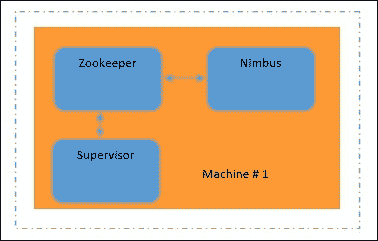
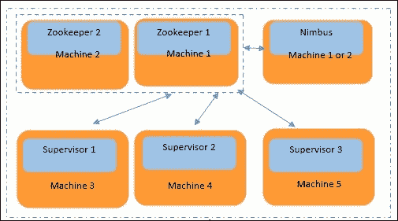

# 第一章：熟悉 Storm

在本章中，您将熟悉以下主题：

+   Storm 概述

+   “风暴”之前的时代和风暴的关键特性

+   风暴集群模式

+   Storm 安装

+   启动各种守护程序

+   玩转 Storm 配置

在整个本章课程中，您将了解为什么 Storm 在行业中引起轰动，以及为什么它在当今的场景中很重要。这是什么实时计算？我们还将解释 Storm 的不同类型的集群模式，安装和配置方法。

# Storm 概述

Storm 是一个分布式，容错和高度可扩展的平台，可实时处理流数据。它于 2014 年 9 月成为 Apache 顶级项目，并且自 2013 年 9 月以来一直是 Apache 孵化器项目。

实时处理大规模数据已成为企业的需求。Apache Storm 提供了在分布式计算选项中以实时方式处理数据（也称为元组或流）的能力。向 Storm 集群添加更多机器使 Storm 具有可伸缩性。然后，随风暴而来的第三个最重要的事情是容错性。如果风暴程序（也称为拓扑）配备了可靠的喷口，它可以重新处理由于机器故障而丢失的失败元组，并且还具有容错性。它基于 XOR 魔术，将在第二章 *风暴解剖*中进行解释。

Storm 最初是由 Nathan Marz 及其 BackType 团队创建的。该项目在被 Twitter 收购后成为开源项目。有趣的是，Storm 被称为实时 Hadoop。

Storm 非常适合许多实时用例。这里解释了一些有趣的用例：

+   **ETL 管道**：ETL 代表**提取**，**转换**和**加载**。这是 Storm 的一个非常常见的用例。数据可以从任何来源提取或读取。这里的数据可以是复杂的 XML，JDBC 结果集行，或者只是一些键值记录。数据（在 Storm 中也称为元组）可以在飞行中用更多信息进行丰富，转换为所需的存储格式，并存储在 NoSQL/RDBMS 数据存储中。所有这些都可以以实时方式通过简单的风暴程序以非常高的吞吐量实现。使用 Storm ETL 管道，您可以以高速将数据摄入到大数据仓库中。

+   **趋势话题分析**：Twitter 使用这样的用例来了解给定时间范围内或当前的趋势话题。有许多用例，实时查找热门趋势是必需的。Storm 可以很好地适应这样的用例。您还可以借助任何数据库执行值的运行聚合。

+   **监管检查引擎**：实时事件数据可以通过特定于业务的监管算法，以实时方式进行合规性检查。银行在实时进行交易数据检查时使用这些。

风暴可以理想地适应任何需要以快速可靠的方式处理数据的用例，每秒处理超过 10,000 条消息，一旦数据到达。实际上，10,000+是一个很小的数字。Twitter 能够在大型集群上每秒处理数百万条推文。这取决于 Storm 拓扑结构的编写情况，调优情况以及集群大小。

Storm 程序（也称为拓扑）旨在全天候运行，并且除非有人明确停止它们，否则不会停止。

Storm 使用 Clojure 和 Java 编写。Clojure 是一种 Lisp，运行在 JVM 上的函数式编程语言，最适合并发和并行编程。Storm 利用了成熟的 Java 库，该库在过去 10 年中构建。所有这些都可以在`storm`/`lib`文件夹中找到。

## 风暴时代之前

在 Storm 变得流行之前，实时或准实时处理问题是使用中间代理和消息队列解决的。监听器或工作进程使用 Python 或 Java 语言运行。对于并行处理，代码依赖于编程语言本身提供的线程模型。许多时候，旧的工作方式并没有很好地利用 CPU 和内存。在某些情况下，还使用了大型机，但随着时间的推移，它们也变得过时了。分布式计算并不那么容易。在这种旧的工作方式中，要么有许多中间输出或跳跃。没有办法自动执行故障重放。Storm 很好地解决了所有这些痛点。它是目前可用的最好的实时计算框架之一。

## Storm 的关键特性

以下是 Storm 的关键特性；它们解决了前面提到的问题：

+   **编程简单**：学习 Storm 框架很容易。您可以使用自己选择的编程语言编写代码，也可以使用该编程语言的现有库。没有妥协。

+   **Storm 已经支持大多数编程语言**：但即使某些语言不受支持，也可以通过使用 Storm **数据规范语言** (**DSL**)中定义的 JSON 协议提供代码和配置来实现。

+   **水平扩展性或分布式计算是可能的**：通过向 Storm 集群添加更多机器，可以增加计算而无需停止运行的程序，也称为拓扑。

+   **容错性**：Storm 管理工作进程和机器级别的故障。跟踪每个进程的心跳以管理不同类型的故障，例如一台机器上的任务故障或整个机器的故障。

+   **消息处理保证**：Storm 进程可以在消息（元组）上执行自动和显式的 ACK。如果未收到 ACK，Storm 可以重发消息。

+   **免费、开源，以及大量的开源社区支持**：作为 Apache 项目，Storm 具有免费分发和修改权，无需担心法律方面的问题。Storm 受到开源社区的高度关注，并吸引了大量优秀的开发人员为其贡献代码。

## Storm 集群模式

根据需求，Storm 集群可以设置为四种不同的类型。如果您想要设置一个大型集群，可以选择分布式安装。如果您想学习 Storm，那么选择单机安装。如果您想连接到现有的 Storm 集群，则使用客户端模式。最后，如果您想在 IDE 上进行开发，只需解压`storm` TAR 并指向`storm`库的所有依赖项。在最初的学习阶段，单机器 Storm 安装实际上是您需要的。

### 开发者模式

开发人员可以从分发站点下载 Storm，在`$HOME`的某个位置解压缩，并简单地以本地模式提交 Storm 拓扑。一旦拓扑在本地成功测试，就可以提交以在集群上运行。

### 单机器 Storm 集群

这种类型最适合学生和中等规模的计算。在这里，包括**Zookeeper**，**Nimbus**和**Supervisor**在内的所有内容都在一台机器上运行。`Storm/bin`用于运行所有命令。也不需要额外的 Storm 客户端。您可以在同一台机器上完成所有操作。这种情况在下图中有很好的演示：



### 多机器 Storm 集群

当您有大规模计算需求时，需要选择此选项。这是一个水平扩展选项。下图详细解释了这种情况。在这个图中，我们有五台物理机器，为了增加系统的容错性，我们在两台机器上运行 Zookeeper。如图所示，**Machine 1**和**Machine 2**是一组 Zookeeper 机器；它们中的一个在任何时候都是领导者，当它死掉时，另一个就成为领导者。**Nimbus**是一个轻量级进程，所以它可以在机器 1 或 2 上运行。我们还有**Machine 3**、**Machine 4**和**Machine 5**专门用于执行实际处理。这三台机器（3、4 和 5）中的每一台都需要运行一个监督守护进程。机器 3、4 和 5 应该知道 Nimbus/Zookeeper 守护进程运行的位置，并且该条目应该存在于它们的`storm.yaml`中。



因此，每台物理机器（3、4 和 5）运行一个监督守护进程，并且每台机器的`storm.yaml`指向 Nimbus 运行的机器的 IP 地址（可以是 1 或 2）。所有监督守护进程机器都必须将 Zookeeper 的 IP 地址（1 和 2）添加到`storm.yaml`中。Storm UI 守护进程应该在 Nimbus 机器上运行（可以是 1 或 2）。

### Storm 客户端

只有当您有多台机器的 Storm 集群时才需要 Storm 客户端。要启动客户端，解压 Storm 分发包，并将 Nimbus IP 地址添加到`storm.yaml`文件中。Storm 客户端可用于从命令行选项提交 Storm 拓扑和检查正在运行的拓扑的状态。Storm 版本早于 0.9 的版本应该将`yaml`文件放在`$STORM_HOME/.storm/storm.yaml`中（新版本不需要）。

### 注意

`jps`命令是一个非常有用的 Unix 命令，用于查看 Zookeeper、Nimbus 和 Supervisor 的 Java 进程 ID。`kill -9 <pid>`选项可以停止正在运行的进程。`jps`命令只有在`PATH`环境变量中设置了`JAVA_HOME`时才能工作。

## Storm 安装的先决条件

安装 Java 和 Python 很容易。让我们假设我们的 Linux 机器已经准备好了 Java 和 Python：

+   一个 Linux 机器（Storm 版本 0.9 及更高版本也可以在 Windows 机器上运行）

+   Java 6 (`set export PATH=$PATH:$JAVA_HOME/bin`)

+   Python 2.6（用于运行 Storm 守护进程和管理命令）

我们将在 storm 配置文件（即`storm.yaml`）中进行许多更改，实际上该文件位于`$STORM_HOME/config`下。首先，我们启动 Zookeeper 进程，它在 Nimbus 和 Supervisors 之间进行协调。然后，我们启动 Nimbus 主守护进程，它在 Storm 集群中分发代码。接下来，Supervisor 守护进程监听由 Nimbus 分配给其所在节点的工作，并根据需要启动和停止工作进程。

ZeroMQ/JZMQ 和 Netty 是允许两台机器或两个 JVM 之间发送和接收进程数据（元组）的 JVM 间通信库。JZMQ 是 ZeroMQ 的 Java 绑定。最新版本的 Storm（0.9+）现在已经转移到 Netty。如果您下载的是旧版本的 Storm，则需要安装 ZeroMQ 和 JZMQ。在本书中，我们只考虑最新版本的 Storm，因此您实际上不需要 ZeroMQ/JZMQ。

### Zookeeper installation

Zookeeper 是 Storm 集群的协调器。Nimbus 和工作节点之间的交互是通过 Zookeeper 完成的。Zookeeper 的安装在官方网站[`zookeeper.apache.org/doc/trunk/zookeeperStarted.html#sc_InstallingSingleMode`](http://zookeeper.apache.org/doc/trunk/zookeeperStarted.html#sc_InstallingSingleMode)上有很好的解释。

可以从以下位置下载设置：

[`archive.apache.org/dist/zookeeper/zookeeper-3.3.5/zookeeper-3.3.5.tar.gz`](https://archive.apache.org/dist/zookeeper/zookeeper-3.3.5/zookeeper-3.3.5.tar.gz)。下载后，编辑`zoo.cfg`文件。

以下是使用的 Zookeeper 命令：

+   启动`zookeeper`进程：

```scala
../zookeeper/bin/./zkServer.sh start
```

+   检查`zookeeper`服务的运行状态：

```scala
../zookeeper/bin/./zkServer.sh status
```

+   停止`zookeeper`服务：

```scala
../zookeeper/bin/./zkServer.sh stop
```

或者，使用`jps`查找`<pid>`，然后使用`kill -9 <pid>`来终止进程。

# Storm 安装

Storm 可以通过以下两种方式安装：

1.  使用 Git 从此位置获取 Storm 版本：

+   [`github.com/nathanmarz/storm.git`](https://github.com/nathanmarz/storm.git)

1.  直接从以下链接下载：[`storm.apache.org/downloads.html`](https://storm.apache.org/downloads.html)

可以使用`conf`文件夹中的`storm.yaml`进行 Storm 配置。

以下是单机 Storm 集群安装的配置。

端口`＃2181`是 Zookeeper 的默认端口。要添加多个`zookeeper`，请保持条目之间的分隔：

```scala
storm.zookeeper.servers:
 - "localhost"

# you must change 2181 to another value if zookeeper running on another port.
storm.zookeeper.port: 2181
# In single machine mode nimbus run locally so we are keeping it localhost.
# In distributed mode change localhost to machine name where nimbus daemon is running.
nimbus.host: "localhost"
# Here storm will generate logs of workers, nimbus and supervisor.
storm.local.dir: "/var/stormtmp"
java.library.path: "/usr/local/lib"
# Allocating 4 ports for workers. More numbers can also be added.
supervisor.slots.ports:
 - 6700
 - 6701
 - 6702
 - 6703
# Memory is allocated to each worker. In below case we are allocating 768 mb per worker.worker.childopts: "-Xmx768m"
# Memory to nimbus daemon- Here we are giving 512 mb to nimbus.
nimbus.childopts: "-Xmx512m"
# Memory to supervisor daemon- Here we are giving 256 mb to supervisor.
```

### 注意

注意`supervisor.childopts: "-Xmx256m"`。在此设置中，我们保留了四个 supervisor 端口，这意味着最多可以在此机器上运行四个 worker 进程。

`storm.local.dir`：如果启动 Nimbus 和 Supervisor 时出现问题，应清理此目录位置。在 Windows 机器上的本地 IDE 上运行拓扑的情况下，应清理`C:\Users\<User-Name>\AppData\Local\Temp`。

## 启用本地（仅 Netty）依赖项

Netty 使得 JVM 之间的通信变得非常简单。

### Netty 配置

您实际上不需要安装任何额外的内容来使用 Netty。这是因为它是一个纯 Java-based 通信库。所有新版本的 Storm 都支持 Netty。

将以下行添加到您的`storm.yaml`文件中。配置和调整值以最适合您的用例：

```scala
storm.messaging.transport: "backtype.storm.messaging.netty.Context"
storm.messaging.netty.server_worker_threads: 1
storm.messaging.netty.client_worker_threads: 1
storm.messaging.netty.buffer_size: 5242880
storm.messaging.netty.max_retries: 100
storm.messaging.netty.max_wait_ms: 1000
storm.messaging.netty.min_wait_ms: 100
```

### 启动守护程序

Storm 守护程序是在将程序提交到集群之前需要预先运行的进程。当您在本地 IDE 上运行拓扑程序时，这些守护程序会在预定义端口上自动启动，但在集群上，它们必须始终运行：

1.  启动主守护程序`nimbus`。转到 Storm 安装的`bin`目录并执行以下命令（假设`zookeeper`正在运行）：

```scala
 ./storm nimbus
 Alternatively, to run in the background, use the same command with nohup, like this:
 Run in background
 nohup ./storm nimbus &
```

1.  现在我们必须启动`supervisor`守护程序。转到 Storm 安装的`bin`目录并执行此命令：

```scala
 ./storm supervisor
```

要在后台运行，请使用以下命令：

```scala
 nohup ./storm  supervisor &
```

### 注意

如果 Nimbus 或 Supervisors 重新启动，则运行中的拓扑不受影响，因为两者都是无状态的。

1.  让我们启动`storm` UI。 Storm UI 是一个可选进程。它帮助我们查看运行拓扑的 Storm 统计信息。您可以看到为特定拓扑分配了多少执行器和工作进程。运行 storm UI 所需的命令如下：

```scala
 ./storm ui
```

另外，要在后台运行，请使用以下命令与`nohup`一起使用：

```scala
 nohup ./storm ui &
```

要访问 Storm UI，请访问`http://localhost:8080`。

1.  我们现在将启动`storm logviewer`。 Storm UI 是另一个可选的进程，用于从浏览器查看日志。您还可以使用`$STORM_HOME/logs`文件夹中的命令行选项查看`storm`日志。要启动 logviewer，请使用此命令：

```scala
 ./storm logviewer
```

要在后台运行，请使用以下命令与`nohup`一起使用：

```scala
 nohup ./storm logviewer &
```

### 注意

要访问 Storm 的日志，请访问`http://localhost:8000log viewer`守护程序应在每台机器上运行。另一种访问`<machine name>`的 worker 端口`6700`日志的方法在这里给出：

```scala
<Machine name>:8000/log?file=worker-6700.log
```

1.  DRPC 守护程序：DRPC 是另一个可选服务。**DRPC**代表**分布式远程过程调用**。如果您想通过 DRPC 客户端从外部提供参数给 storm 拓扑，您将需要 DRPC 守护程序。请注意，参数只能提供一次，DRPC 客户端可能会长时间等待，直到 storm 拓扑进行处理并返回。DRPC 不是项目中常用的选项，首先它对客户端是阻塞的，其次您一次只能提供一个参数。DRPC 不受 Python 和 Petrel 支持。

总结一下，启动进程的步骤如下：

1.  首先是所有 Zookeeper 守护程序。

1.  Nimbus 守护程序。

1.  一个或多个机器上的 Supervisor 守护程序。

1.  UI 守护程序，Nimbus 正在运行的地方（可选）。

1.  Logviewer 守护程序（可选）。

1.  提交拓扑。

您可以随时重新启动`nimbus`守护程序，而不会对现有进程或拓扑产生影响。您可以重新启动监督程序守护程序，并随时向 Storm 集群添加更多监督程序机器。

要向 Storm 集群提交`jar`，请转到 Storm 安装的`bin`目录并执行以下命令：

```scala
./storm jar <path-to-topology-jar> <class-with-the-main> <arg1> … <argN>
```

## 玩弄可选配置

启动集群需要之前的所有设置，但还有许多其他可选设置可以根据拓扑的要求进行调整。前缀可以帮助找到配置的性质。默认的`yaml`配置的完整列表可在[`github.com/apache/storm/blob/master/conf/defaults.yaml`](https://github.com/apache/storm/blob/master/conf/defaults.yaml)上找到。

配置可以通过前缀的起始方式进行识别。例如，所有 UI 配置都以`ui*`开头。

| 配置的性质 | 要查找的前缀 |
| --- | --- |
| 一般 | `storm.*` |
| Nimbus | `nimbus.*` |
| UI | `ui.*` |
| 日志查看器 | `logviewer.*` |
| DRPC | `drpc.*` |
| Supervisor | `supervisor.*` |
| 拓扑 | `topology.*` |

除默认值以外，所有这些可选配置都可以添加到`STORM_HOME/conf/storm.yaml`中。所有以`topology.*`开头的设置可以从拓扑或`storm.yaml`中以编程方式设置。所有其他设置只能从`storm.yaml`文件中设置。例如，以下表格显示了玩弄这些参数的三种不同方式。然而，这三种方式都是做同样的事情：

| /conf/storm.yaml | 拓扑构建器 | 自定义 yaml |
| --- | --- | --- |
| 更改`storm.yaml`（影响集群的所有拓扑） | 在编写代码时更改拓扑构建器（仅影响当前拓扑） | 作为命令行选项提供`topology.yaml`（仅影响当前拓扑） |
| `topology.workers: 1` | `conf.setNumberOfWorker(1);`这是通过 Python 代码提供的 | 创建`topology.yaml`，其中包含类似于`storm.yaml`的条目，并在运行拓扑时提供 Python：`petrel submit --config topology.yaml` |

在`storm.yaml`中进行任何配置更改都会影响所有正在运行的拓扑，但在代码中使用`conf.setXXX`选项时，不同的拓扑可以覆盖该选项，以适应它们各自的最佳选择。

# 摘要

第一章的结论就要来了。本章概述了 Storm 出现之前应用程序是如何开发的。随着我们阅读本章并接近结论，我们还获得了实时计算的简要知识以及 Storm 作为编程框架如何变得如此受欢迎。本章教会了你执行 Storm 配置。它还为你提供了有关 Storm 的守护程序、Storm 集群及其设置的详细信息。在下一章中，我们将探索 Storm 解剖的细节。
