# 第二章：风暴解剖

本章详细介绍了风暴技术的内部结构和流程。本章将涵盖以下主题：

+   风暴流程

+   风暴拓扑特定术语

+   进程间通信

+   风暴中的容错

+   保证元组处理

+   风暴中的并行性-扩展分布式计算

随着我们在本章中的深入，您将详细了解 Storm 的流程及其作用。在本章中，将解释各种特定于 Storm 的术语。您将了解 Storm 如何实现不同类型故障的容错。我们将看到什么是消息处理的保证，最重要的是如何配置 Storm 中的并行性以实现快速可靠的处理。

# 风暴流程

我们将首先从 Nimbus 开始，实际上 Nimbus 是 Storm 中的入口守护程序。仅仅与 Hadoop 相比，Nimbus 实际上是 Storm 的作业跟踪器。Nimbus 的工作是将代码分发到集群的所有监督守护程序。因此，当拓扑代码被提交时，它实际上会到达集群中的所有物理机器。Nimbus 还监视监督守护程序的故障。如果监督守护程序继续失败，那么 Nimbus 会将这些工作重新分配给集群中不同物理机器的其他工作程序。当前版本的 Storm 只允许运行一个 Nimbus 守护程序实例。Nimbus 还负责将任务分配给监督节点。如果丢失 Nimbus，工作程序仍将继续计算。监督守护程序将在工作程序死亡时继续重新启动工作程序。没有 Nimbus，工作程序的任务将不会重新分配到集群中的另一台机器上的工作程序。

如果 Nimbus 死亡，没有替代的风暴流程会接管，也没有进程会尝试重新启动它。然而，不用担心，因为它可以随时重新启动。在生产环境中，当 Nimbus 死亡时也可以设置警报。在未来，我们可能会看到高可用的 Nimbus。

## 监督守护程序

监督守护程序管理各自机器的所有工作程序。由于在您的集群中每台机器上都有一个监督守护程序，因此风暴中的分布式计算是可能的。监督守护程序监听 Nimbus 分配给其运行的机器的工作，并将其分配给工作程序。由于任何运行时异常，工作程序随时可能会死亡，当没有来自死亡工作程序的心跳时，监督守护程序会重新启动它们。每个工作程序进程执行拓扑的一部分。与 Hadoop 生态系统类似，监督守护程序是风暴的任务跟踪器。它跟踪同一台机器上的工作程序的任务。可能的工作程序的最大数量取决于`storm.yaml`中定义的端口数量。

## 动物园管理员

除了自己的组件外，风暴还依赖于一个动物园管理员集群（一个或多个动物园管理员服务器）来在 Nimbus 和监督守护程序之间执行协调工作。除了用于协调目的，Nimbus 和监督守护程序还将它们所有的状态存储在动物园管理员中，并且动物园管理员将它们存储在其运行的本地磁盘上。拥有多个动物园管理员守护程序可以增加系统的可靠性，因为如果一个守护程序崩溃，另一个守护程序将成为领导者。

## 风暴 UI

风暴还配备了基于 Web 的用户界面。它应该在运行 Nimbus 的机器上启动。风暴 UI 提供了整个集群的报告，例如所有活动监督机器的总和，可用的工作程序总数，分配给每个拓扑的工作程序数量以及剩余的数量，以及拓扑级诊断，例如元组统计（发射了多少元组，spout 到 bolt 或 bolt 到 bolt 之间的 ACK）。风暴 UI 还显示了工作程序的总数，实际上是所有监督机器的所有可用工作程序的总和。

以下截图显示了风暴 UI 的示例屏幕：

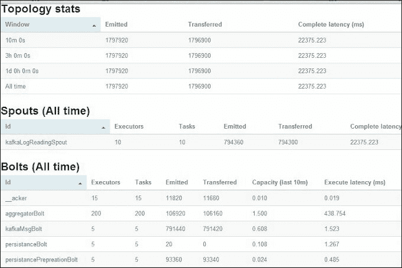

以下是风暴 UI 的解释：

+   **拓扑统计**：在**拓扑统计**下，您可以点击并查看最近 10 分钟、3 小时或所有时间的统计信息。

+   **喷口（所有时间）**：显示了为此喷口分配的执行者和任务数量，以及发射的元组和其他延迟统计信息的状态。

+   **螺栓（所有时间）**：显示了所有螺栓的列表，以及分配的执行者/任务。在进行性能调优时，保持**容量**列接近`1`。在前面的**aggregatorBolt**示例中，它是`1.500`，所以我们可以使用`300`而不是`200`个执行者/任务。**容量**列帮助我们决定正确的并行度。这个想法非常简单；如果**容量**列读数超过`1`，尝试以相同比例增加执行者和任务。如果执行者/任务的值很高，而**容量**列接近零，尝试减少执行者/任务的数量。您可以一直这样做，直到获得最佳配置。

# 风暴拓扑特定术语

拓扑是将编程工作逻辑上分成许多小规模处理单元的分离，称为喷口和螺栓，类似于 Hadoop 中的 MapReduce。拓扑可以用许多语言编写，包括 Java、Python 和更多支持的语言。在视觉描述中，拓扑显示为连接喷口和螺栓的图形。喷口和螺栓在集群中执行任务。Storm 有两种操作模式，称为本地模式和分布式模式：

+   在本地模式下，Storm 和工作者的所有进程都在您的代码开发环境中运行。这对于拓扑的测试和开发很有用。

+   在分布式模式下，Storm 作为一组机器的集群运行。当您将拓扑代码提交给 Nimbus 时，Nimbus 负责分发代码并根据您的配置分配工作者来运行您的拓扑。

在下图中，我们有紫色的螺栓；这些从它们上面的喷口接收元组或记录。元组支持拓扑代码所使用的编程语言中的大多数数据类型。它作为一个独立单元从喷口流向螺栓或从一个螺栓流向另一个螺栓。无限的元组流称为流。在一个元组中，您可以有许多键值对一起传递。

下图更详细地说明了流。喷口连接到元组的源并为拓扑生成连续的元组流。从喷口发出的键值对可以被螺栓使用相同的键接收。

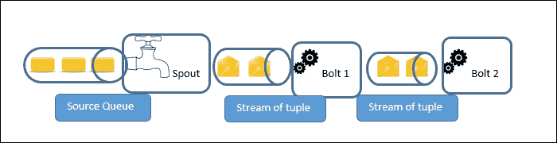

## 工作者进程、执行者和任务

Storm 区分以下三个主要实体，用于在 Storm 集群中实际运行拓扑：

+   工作者

+   执行者

+   任务

假设我们决定保留两个工作者，一个喷口执行者，三个**Bolt1**执行者和两个**Bolt2**执行者。假设执行者和任务数量的比例相同。喷口和螺栓的总执行者数为六。在六个执行者中，一些将在工作者 1 的范围内运行，一些将由工作者 2 控制；这个决定由监督者负责。这在下图中有解释。

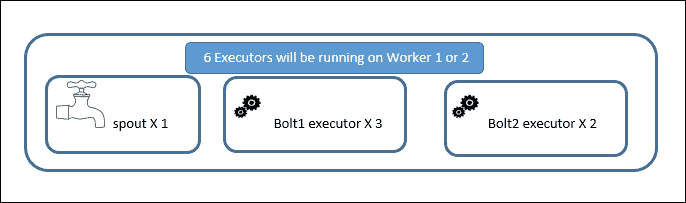

下图解释了在运行在一台机器上的监督者范围内工作者和执行者的位置：

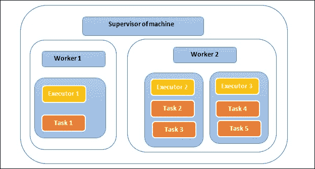

在构建拓扑代码时设置执行器和任务的数量。在上图中，我们有两个工作进程（1 和 2），由该机器的监督者运行和管理。假设**执行器 1**正在运行一个任务，因为执行器与任务的比例相同（例如，10 个执行器意味着 10 个任务，这使得比例为 1:1）。但是**执行器 2**正在顺序运行两个任务，因此任务与执行器的比例为 2:1（例如，10 个执行器意味着 20 个任务，这使得比例为 2:1）。拥有更多的任务并不意味着更高的处理速度，但对于更多的执行器来说是正确的，因为任务是顺序运行的。

## 工作进程

单个工作进程执行拓扑的一部分，并在自己的 JVM 上运行。工作进程在拓扑提交期间分配。工作进程与特定的拓扑相关联，并且可以为该拓扑的一个或多个 spout 或螺栓运行一个或多个执行器。运行中的拓扑由许多这样的工作进程组成，这些工作进程在 Storm 集群中的许多机器上运行。

## 执行器

执行器是在工作进程的 JVM 范围内运行的线程。执行器可以顺序运行一个或多个 spout 或螺栓的任务。

执行器始终在一个线程上运行其所有任务，这意味着任务在执行器上顺序运行。在拓扑启动后，可以使用`rebalance`命令更改执行器的数量而无需关闭。

```scala
storm rebalance <topology name> -n <number of workers> -e <spout>=<number of executors> -e <bolt1 name>=<number of executors> -e <bolt2 name>=<number of executors>
```

## 任务

任务执行数据处理，并在其父执行器的执行线程中运行。任务数量的默认值与执行器的数量相同。在构建拓扑时，我们也可以保留更多的任务数量。这有助于在未来增加执行器的数量，从而保持扩展的范围。最初，我们可以有 10 个执行器和 20 个任务，因此比例为 2:1。这意味着每个执行器有两个任务。未来的重新平衡操作可以使 20 个执行器和 20 个任务，这将使比例为 1:1。

## 进程间通信

以下图示了 Storm 提交者（客户端）、Nimbus thrift 服务器、Zookeeper、监督者、监督者的工作进程、执行器和任务之间的通信。每个工作进程都作为一个单独的 JVM 运行。

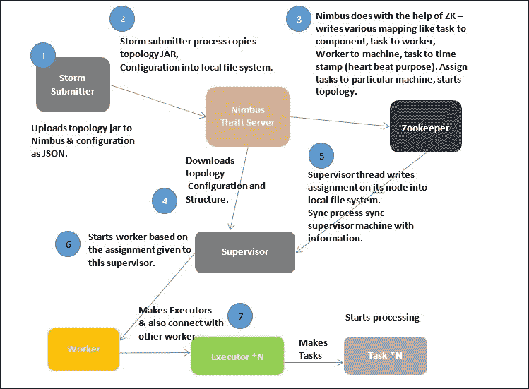

# Storm 集群的物理视图

下图解释了每个进程的物理位置。只能有一个 Nimbus。但是，有多个 Zookeeper 来支持故障转移，并且每台机器上都有一个监督者。

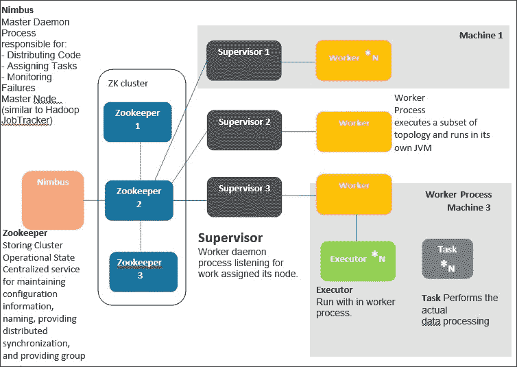

## 流分组

流分组控制元组在 spout 和螺栓之间或螺栓之间的流动。在 Storm 中，我们有四种类型的分组。Shuffle 和字段分组是最常用的：

+   **Shuffle 分组**：此分组中两个随机任务之间的元组流

+   **字段分组**：具有特定字段键的元组始终传递到下游螺栓的相同任务

+   **所有分组**：将相同的元组发送到下游螺栓的所有任务

+   **全局分组**：所有任务的元组都到达一个任务

下图解释了所有四种分组类型的图解说明：

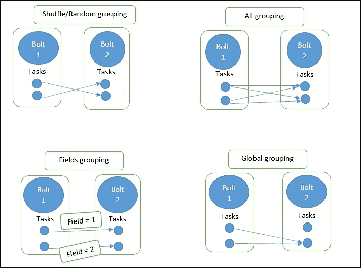

## Storm 中的容错

监督者运行同步线程，从 Zookeeper 获取分配信息（我应该运行拓扑的哪一部分）并写入本地磁盘。这个本地文件系统信息有助于保持工作进程的最新状态：

+   **情况 1**：这在大多数情况下都是理想的情况。当集群正常工作时，工作节点的心跳通过 Zookeeper 返回给监督者和 Nimbus。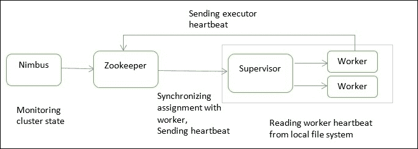

+   **案例 2**：如果监督员死亡，处理仍将继续，但任务将永远不会同步。Nimbus 将重新分配工作给另一台不同机器的监督员。这些工人将在运行，但不会接收任何新的元组。确保设置警报以重新启动监督员或使用可以重新启动监督员的 Unix 工具。

+   **案例 3**：如果 Nimbus 死亡，拓扑将继续正常运行。处理仍将继续，但拓扑生命周期操作和重新分配到另一台机器将不可能。

+   **案例 4**：如果工作人员死亡（因为心跳停止到达），监督员将尝试重新启动工作进程并继续处理。如果工作人员反复死亡，Nimbus 将重新分配工作给集群中的其他节点。

## Storm 中的元组处理保证

由于 Storm 已经配备了处理各种进程级故障的能力，另一个重要特性是处理工作人员死亡时发生的元组失败的能力。这只是为了给出按位 XOR 的概念：相同位的两组的 XOR 为 0。这被称为 XOR 魔术，它可以帮助我们知道元组传递到下一个螺栓是否成功。Storm 使用 64 位来跟踪元组。每个元组都有一个 64 位的元组 ID。此 64 位 ID 连同任务 ID 一起保存在 ACKer 中。

在下一个图中，解释了 ACKing 和重播案例：

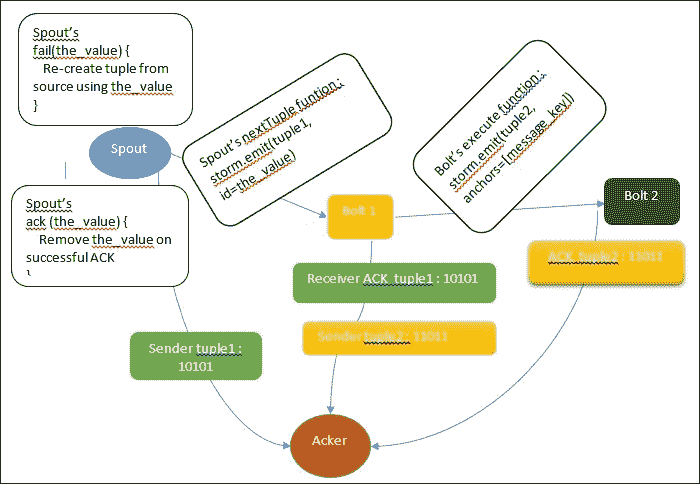

### ACKing 中的 XOR 魔术

在链接的元组树中的所有元组完成之前，喷口元组不会被完全处理。如果在配置的超时时间内未完成元组树（默认值为`topology.message.timeout.secs: 30`），则会重播喷口元组。

在前面的图中，第一个 acker 从喷口获得了`10101`（为了简单起见，我们保留了 5 位）的元组 1。一旦**Bolt 1**接收到相同的元组，它也会向 acker 发送 ACK。从两个来源，acker 都获得了`10101`。这意味着`10101` XOR `10101 = 0`。元组 1 已成功被**Bolt 1**接收。同样的过程在螺栓 1 和 2 之间重复。最后，**Bolt 2**向 acker 发送 ACK，元组树完成。这会创建一个信号来调用喷口的`success`函数。元组处理中的任何失败都可以触发喷口的`fail`函数调用，这表明需要将元组发送回进行再次处理。

Storm 的 acker 通过对发送者的元组和接收者的元组执行 XOR 来跟踪元组树的完成。每次发送元组时，它的值都会被 XOR 到 acker 维护的校验和中，每次确认元组时，它的值都会再次 XOR 到 acker 中。

如果所有元组都已成功确认，校验和将为零。Ackers 是系统级执行者。

在喷口中，我们可以选择两个发射函数。

+   `emit([tuple])`：这是一个简单的发射

+   `storm.emit([tuple], id=the_value)`：这将创建一个可靠的喷口，但只有在您可以使用`the_value`重新发射元组时才能实现

在喷口中，我们还有两个 ACK 函数：

+   `fail(the_value)`：当发生超时或元组失败时调用此函数

+   `ack(the_value)`：当拓扑的最后一个螺栓确认元组树时调用此函数

此 ID 字段应该是一个随机且唯一的值，以便从喷口的`fail`函数中重播。使用此 ID，我们可以从`fail`函数中重新发射它。如果成功，将调用`success`函数，并且可以从全局列表中删除成功的元组或从源中重新创建。

如果拓扑中有一个可靠的喷口，您将能够重新创建相同的元组。要创建可靠的喷口，请从喷口的下一个元组函数中发射一个唯一的消息 ID（`the_value`）以及元组：

```scala
storm.emit([tuple], id=the_value)
```

如果元组在配置的时间段内未被确认，或者编程代码由于某些错误条件而失败了元组，这两种情况都是重播的有效情况。

当调用`fail`函数时，代码可以使用相同的消息 ID 从喷口的源中读取，并且当调用`success`函数时，可以执行诸如从队列中删除消息之类的操作。

消息 ID 是一个特定于应用程序的键，可以帮助您重新创建一个元组并从喷口重新发出。消息 ID 的一个示例可以是队列消息 ID，或者是表的主键。如果发生超时或由于其他原因，元组被视为失败。

Storm 具有容错机制，可以保证所有仅从可靠喷口发出的元组至少处理一次。

一旦有了可靠的喷口，就可以让螺栓在输入和输出元组之间进行链接，从而创建一个元组树。一旦建立了元组树，确认者就知道了链接树中的任何故障，并且使用原始消息 ID 再次创建整个元组树。

在螺栓中，有两个函数：

+   `emit([tuple])`: 没有元组树链接。我们无法追踪使用了哪个原始消息 ID。

+   `storm.emit([tuple], anchors=[message_key])`: 有了链接，现在可以重放原始元组。

下图解释了元组 B 是如何从元组 A 生成的：

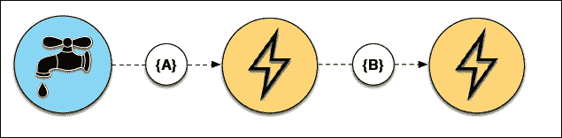

下图说明了执行**ACK**的螺栓：

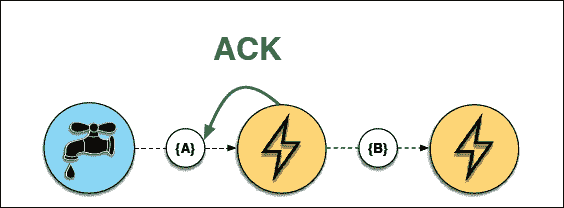

下图说明了故障情况，信号在故障时到达喷口：

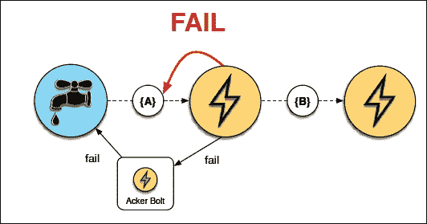

成功的**ACK**演示如下：

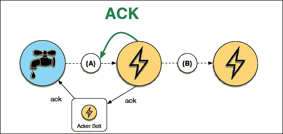

下图说明了没有螺栓的大元组树的情况，也没有失败：

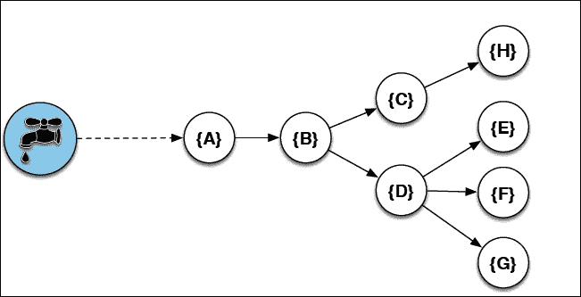

下图演示了元组树中的故障示例 - 在元组树的中间：

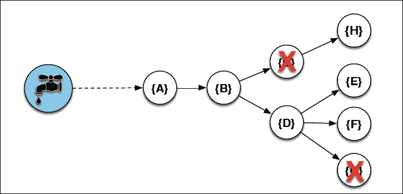

# Storm 中的并行性调优 - 扩展分布式计算

为了解释 Storm 的并行性，我们将配置三个参数：

+   工作人员的数量

+   执行者的数量

+   任务的数量

下图给出了一个拓扑结构的示例，其中只有一个喷口和一个螺栓。在这种情况下，我们将为喷口和螺栓级别的工作人员、执行者和任务设置不同的值，并看看在每种情况下并行性是如何工作的：

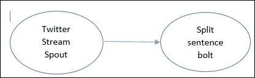

```scala
// assume we have two workers in total for topology.
topology.workers: 2
 // just one executor of spout.
builder.setSpout("spout-sentence", TwitterStreamSpout(),1)

// two executors of bolt.
builder.setBolt("bolt-split", SplitSentenceBolt(),2)
 // four tasks for bolts.
.setNumTasks(4)
.shuffleGrouping("spout-sentence");
```

对于这个配置，我们将有两个工作人员，它们将在单独的 JVM 中运行（工作人员 1 和工作人员 2）。

对于喷口，有一个执行者，任务的默认数量是一个，这使得比例为 1:1（每个执行者一个任务）。

对于螺栓，有两个执行者和四个任务，这使得 4/2 = 每个执行者两个任务。这两个执行者在工作人员 2 下运行，每个执行者有两个任务，而工作人员 1 的执行者只有一个任务。

这可以用下图很好地说明：

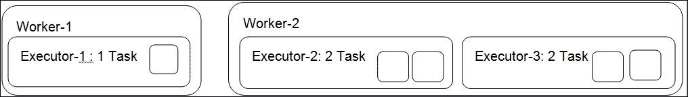

让我们将螺栓的配置更改为两个执行者和两个任务：

```scala
builder.setBolt("bolt-split", SplitSentenceBolt(),2)
 // 2 tasks for bolts.
.setNumTasks(2)
.shuffleGrouping("spout-sentence");
```

这在这里可以很好地说明：

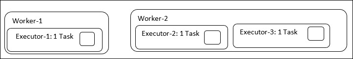

工作人员的数量再次是两个。由于螺栓有两个执行者和两个任务，这使得它成为 2/2，或者每个执行者一个任务。现在您可以看到，两个执行者都分别获得一个任务。在性能方面，两种情况完全相同，因为任务在执行者线程内顺序运行。更多的执行者意味着更高的并行性，更多的工作人员意味着更有效地使用 CPU 和 RAM 等资源。内存分配是在工作人员级别使用`worker`.`childopts`设置完成的。我们还应该监视特定工作人员进程所持有的最大内存量。这在决定工作人员的总数时起着重要作用。可以使用`ps -ef`选项来查看。始终保持任务和执行者的比例相同，并使用 Storm UI 的容量列推导出执行者数量的正确值。作为一个重要的注意事项，我们应该将较短的持续时间事务保留在螺栓中，并尝试通过将代码拆分为更多的螺栓或减少批处理大小元组来调整它。批处理大小是螺栓在单个元组传递中接收的记录数量。此外，不要因为较长的持续时间事务而阻塞喷口的`nextTuple`方法。

# 总结

随着本章接近尾声，您一定对 Nimbus、supervisor、UI 和 Zookeeper 进程有了一个简要的了解。本章还教会了您如何通过调整 Storm 中的并行性来玩弄工作人员、执行者和任务的数量。您熟悉了分布式计算的重要问题，即系统中可用的不同类型的容错机制来克服故障和故障。最重要的是，您学会了如何编写一个“可靠”的喷口，以实现消息处理和在螺栓中的链接的保证。

下一章将为您提供有关如何使用名为 Petrel 的 Python 库构建简单拓扑的信息。Petrel 解决了 Storm 内置 Python 支持的一些限制，提供了更简单、更流畅的开发。
