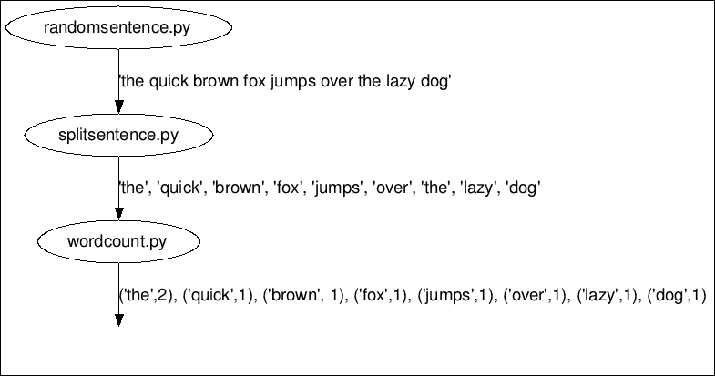

# 第三章：介绍 Petrel

如第一章中所讨论的，*熟悉 Storm*，Storm 是一个用于实时处理大量数据的平台。Storm 应用通常用 Java 编写，但 Storm 也支持其他语言，包括 Python。虽然各种语言的概念相似，但细节因语言而异。在本章中，我们将首次使用 Python 与 Storm 进行实际操作。首先，您将了解一个名为 Petrel 的 Python 库，这对于在 Python 中创建拓扑是必要的。接下来，我们将设置 Python/Storm 开发环境。然后，我们将仔细研究一个用 Python 编写的工作中的 Storm 拓扑。最后，我们将运行拓扑，您将学习一些关键技术，以便简化开发和调试拓扑的过程。完成本章后，您将对开发基本 Storm 拓扑有一个很好的高层理解。在本章中，我们将涵盖以下主题：

+   什么是 Petrel？

+   安装 Petrel

+   创建您的第一个拓扑

+   运行拓扑

+   使用 Petrel 的生产力技巧

# 什么是 Petrel？

本书中所有的 Python 拓扑都依赖于一个名为 Petrel 的开源 Python 库。如果您之前有 Storm 的经验，您可能会记得有一个名为`storm-starter`的 GitHub 项目，其中包括了使用各种语言与 Storm 的示例（您可以在[`github.com/apache/storm/tree/master/examples/storm-starter`](https://github.com/apache/storm/tree/master/examples/storm-starter)找到`storm-starter`的最新版本）。`storm-starter`项目包括一个名为`storm.py`的模块，它允许您在 Python 中实现 Storm 拓扑。鉴于`storm.py`的可用性，真的有必要使用另一个库吗？虽然使用`storm.py`构建拓扑是完全可能的，但它缺少一些重要的功能。为了解决这些差距，开发者必须使用对大多数 Python 开发者来说并不熟悉的语言和工具。如果您已经熟悉这些工具，并且在使用 Storm 时不介意同时使用多种技术栈，您可能会满意于`storm.py`。但大多数对 Storm 不熟悉的开发者发现`storm.py`的方法过于复杂，甚至令人不知所措。让我们更详细地讨论一下`storm.py`的弱点。

## 构建拓扑

为了运行一个拓扑，Storm 需要其中 spouts、bolts 和 streams 的描述。这个描述是用一种叫做**Thrift**的格式编码的。`storm.py`模块不支持创建这个描述；开发者必须使用另一种编程语言（通常是 Java 或 Clojure）来创建它。

## 打包拓扑

拓扑以 Java`.jar`文件的形式提交给 Storm（类似于 Python`.egg`或`.tar.gz`文件）。除了拓扑描述，Python 拓扑`.jar`还必须包括拓扑的 Python 代码。创建一个 JAR 文件通常涉及使用 Java 开发工具，如 Ant 或 Maven。

## 记录事件和错误

如果拓扑包括记录消息以跟踪流经其中的数据，那么调试和监视拓扑将更加容易。如果 Python 拓扑出现问题并且代码崩溃，查看错误和发生错误的位置是非常宝贵的。`storm.py`模块在这些方面提供不了任何帮助。如果一个组件崩溃，它会简单地退出而不捕获任何信息。根据我的经验，这是使用`storm.py`最令人沮丧的方面。

## 管理第三方依赖

现实世界的 Python 应用程序经常使用第三方库。如果一个集群需要运行多个拓扑，每个拓扑可能具有不同甚至冲突的这些库的版本。Python 虚拟环境是管理这一切的好工具。然而，`storm.py`不会帮助您在 Python 虚拟环境中创建、激活或安装第三方库。Petrel 解决了 Storm 内置 Python 支持的所有这些限制，提供了更简单、更流畅的开发体验。Petrel 的主要特点包括以下内容：

+   用于构建拓扑的 Python API

+   将拓扑打包以提交到 Storm

+   记录事件和错误

+   在工作节点上，使用`setup.sh`设置特定于拓扑的 Python 运行时环境

在本章中，我们将讨论前三点。我们将在第四章中看到第四点的示例，*示例拓扑 - Twitter*。

# 安装 Petrel

让我们设置我们的 Python 开发环境。我们在这里假设您已经按照第一章中的说明安装了 Storm 0.9.3：

1.  首先，我们需要安装`virtualenv`，这是一个管理 Python 库的工具。在 Ubuntu 上，只需运行此命令：

```scala
sudo apt-get install python-virtualenv
```

1.  接下来，我们创建一个 Python 虚拟环境。这提供了一种安装 Python 库的方式，而无需对机器进行根访问，也不会干扰系统的 Python 包：

```scala
virtualenv petrel
```

您将看到类似以下的输出：

```scala
New python executable in petrel/bin/python
Installing distribute.............................................................................................................................................................................................done
```

1.  接下来，运行此命令以激活虚拟环境。您的 shell 提示符将更改以包括`virtualenv`名称，表示虚拟环境处于活动状态：

```scala
source petrel/bin/activate
(petrel)barry@Dell660s:~$
```

### 注意

您需要再次运行此命令 - 每次打开新终端时。

1.  最后，安装 Petrel：

```scala
easy_install petrel==0.9.3.0.3
```

### 注意

Petrel 版本号的前三位数字必须与您使用的 Storm 版本号匹配。如果您使用的 Storm 版本没有相应的 Petrel 发布，您可以从源代码安装 Petrel。查看[`github.com/AirSage/Petrel#installing-petrel-from-source`](https://github.com/AirSage/Petrel#installing-petrel-from-source)获取说明。

### 提示

**下载示例代码**

您可以从您在[`www.packtpub.com`](http://www.packtpub.com)的帐户中下载您购买的所有 Packt 图书的示例代码文件。如果您在其他地方购买了这本书，您可以访问[`www.packtpub.com/support`](http://www.packtpub.com/support)并注册，以便将文件直接通过电子邮件发送给您

# 创建您的第一个拓扑

现在，我们将创建一个 Storm 拓扑，将句子分解为单词，然后计算每个单词的出现次数。在 Storm 中实现这个拓扑需要以下组件：

+   句子喷口（`randomsentence.py`）：拓扑始终以喷口开始；这就是数据进入 Storm 的方式。句子喷口将发出无限流的句子。

+   分割器螺栓（`splitsentence.py`）：接收句子并将其分割成单词。

+   单词计数螺栓（`wordcount.py`）：接收单词并计算出现次数。对于每个处理的单词，输出该单词以及出现次数。

以下图显示了数据如何通过拓扑流动：



单词计数拓扑

现在我们已经看到了基本的数据流动，让我们实现拓扑并看看它是如何工作的。

## 句子喷口

在本节中，我们实现了一个生成随机句子的喷口。在名为`randomsentence.py`的文件中输入此代码：

```scala
import time
import random

from petrel import storm
from petrel.emitter import Spout

class RandomSentenceSpout(Spout):
    def __init__(self):
        super(RandomSentenceSpout, self).__init__(script=__file__)

    @classmethod
    def declareOutputFields(cls):
        return ['sentence']

    sentences = [
        "the cow jumped over the moon",
        "an apple a day keeps the doctor away",
    ]

    def nextTuple(self):
        time.sleep(0.25)
        sentence = self.sentences[
            random.randint(0, len(self.sentences) - 1)]
        storm.emit([sentence])

def run():
    RandomSentenceSpout().run()
```

喷口继承自 Petrel 的`Spout`类。

Petrel 要求每个喷口和螺栓类都要实现`__init__()`并将其文件名传递给`(script=__file__)`基类。`script`参数告诉 Petrel 在启动组件实例时运行哪个 Python 脚本。

`declareOutputFields()`函数告诉 Storm 关于这个分流器发出的元组的结构。每个元组由一个名为`sentence`的单个字段组成。

Storm 每次准备从分流器获取更多数据时都会调用`nextTuple()`。在真实的分流器中，您可能会从外部数据源（如 Kafka 或 Twitter）读取数据。这个分流器只是一个例子，所以它生成自己的数据。它只是在两个句子之间随机选择一个。

您可能已经注意到，分流器在每次调用`nextTuple()`时都会休眠 0.25 秒。为什么会这样？这在技术上并不是必要的，但它会减慢速度，并且在本地模式下运行拓扑时，使输出更容易阅读。

`run()`函数的作用是什么？这是 Petrel 需要的一点*粘合*代码。当一个分流器或螺栓脚本被加载到 Storm 中时，Petrel 调用`run()`函数来创建组件并开始处理消息。如果您的分流器或螺栓需要进行额外的初始化，这是一个很好的地方。

## 分割器螺栓

本节提供了分割器螺栓，它从分流器中获取句子并将其分割成单词。将以下代码输入名为`splitsentence.py`的文件中：

```scala
from petrel import storm
from petrel.emitter import BasicBolt

class SplitSentenceBolt(BasicBolt):
    def __init__(self):
        super(SplitSentenceBolt, self).__init__(script=__file__)

    def declareOutputFields(self):
        return ['word']

    def process(self, tup):
        words = tup.values[0].split("")
        for word in words:
          storm.emit([word])

def run():
    SplitSentenceBolt().run()
```

`SplitSentenceBolt`继承自`BasicBolt` Petrel 类。这个类用于大多数简单的螺栓。您可能还记得 Storm 有一个特性，可以确保每条消息都被处理，如果它们没有被完全处理，就会“重放”之前的元组。`BasicBolt`简化了使用这个特性。它通过在每个元组被处理时自动向 Storm 确认来实现。更灵活的`Bolt`类允许程序员直接确认元组，但这超出了本书的范围。

分割句子螺栓具有运行函数，类似于分流器。

`process()`函数接收来自分流器的句子并将其分割成单词。每个单词都作为一个单独的元组发出。

## 单词计数螺栓

本节实现了单词计数螺栓，它从分流器中获取单词并对其进行计数。将以下代码输入名为`wordcount.py`的文件中：

```scala
from collections import defaultdict

from petrel import storm
from petrel.emitter import BasicBolt

class WordCountBolt(BasicBolt):
    def __init__(self):
        super(WordCountBolt, self).__init__(script=__file__)
        self._count = defaultdict(int)

    @classmethod
    def declareOutputFields(cls):
        return ['word', 'count']

    def process(self, tup):
        word = tup.values[0]
        self._count[word] += 1
        storm.emit([word, self._count[word]])

def run():
    WordCountBolt().run()
```

单词计数螺栓有一个新的变化；与句子螺栓不同，它需要存储从一个元组到下一个元组的信息——单词计数。`__init__()`函数设置了一个`_count`字段来处理这个问题。

单词计数螺栓使用 Python 方便的`defaultdict`类，它通过在访问不存在的键时自动提供`0`条目来简化计数。

### 定义拓扑

前面的章节提供了单词计数拓扑的分流器和螺栓。现在，我们需要告诉 Storm 如何将组件组合成拓扑。在 Petrel 中，可以通过`create.py`脚本来完成这个任务。该脚本提供以下信息：

+   组成拓扑的分流器和螺栓

+   每个螺栓的输入数据来自哪里

+   元组如何在螺栓的实例之间分区

以下是`create.py`脚本：

```scala
from randomsentence import RandomSentenceSpout
from splitsentence import SplitSentenceBolt
from wordcount import WordCountBolt

def create(builder):
    builder.setSpout("spout", RandomSentenceSpout(), 1)
    builder.setBolt(
        "split", SplitSentenceBolt(), 1).shuffleGrouping("spout")
    builder.setBolt(
        "count", WordCountBolt(), 1).fieldsGrouping(
        "split", ["word"])
```

单词计数螺栓必须使用 Storm 的`fieldsGrouping`行为（如第二章*Storm 解剖*中的*流分组*部分所述）。这个螺栓的设置可以让您在数据流中根据一个或多个字段对元组进行分组。对于单词计数拓扑，`fieldsGrouping`确保所有单词的实例都将由同一个 Storm 工作进程计数。

当拓扑部署在集群上时，单词计数螺栓可能会有很多个独立运行的实例。如果我们没有在`"word"`字段上配置`fieldsGrouping`，那么通过处理句子“the cow jumped over the moon”，我们可能会得到以下结果：

```scala
Word count instance 1: { "the": 1, "cow": 1, "jumped": 1 }
Word count instance 2: { "over": 1, "the": 1, "moon": 1 }
```

有两个`"the"`的条目，因此计数是错误的！我们希望得到这样的结果：

```scala
Word count instance 1: { "the": 2, "cow": 1, "jumped": 1 }
Word count instance 2: { "over": 1, "moon": 1 }
```

# 运行拓扑

只需再提供一些细节，我们就可以运行拓扑了：

1.  创建一个`topology.yaml`文件。这是 Storm 的配置文件。这本书的范围超出了对该文件的完整解释，但您可以在[`github.com/apache/storm/blob/master/conf/defaults.yaml`](https://github.com/apache/storm/blob/master/conf/defaults.yaml)上看到所有可用选项的完整集合：

```scala
nimbus.host: "localhost"
topology.workers: 1
```

1.  创建一个空的`manifest.txt`文件。您可以使用编辑器来做这个或者简单地运行`touch manifest.txt`。这是一个特定于 Petrel 的文件，告诉 Petrel 应该在提交给 Storm 的`.jar`文件中包含哪些附加文件（如果有的话）。在第四章中，*示例拓扑 - Twitter*我们将看到一个真正使用这个文件的示例。

1.  在运行拓扑之前，让我们回顾一下我们创建的文件列表。确保您已正确创建这些文件：

+   `randomsentence.py`

+   `splitsentence.py`

+   `wordcount.py`

+   `create.py`

+   `topology.yaml`

+   `manifest.txt`

1.  使用以下命令运行拓扑：

```scala
petrel submit --config topology.yaml --logdir `pwd`
```

恭喜！您已经创建并运行了您的第一个拓扑！

Petrel 运行`create.py`脚本来发现拓扑的结构，然后使用该信息加上`manifest.txt`文件来构建`topology.jar`文件并将其提交给 Storm。接下来，Storm 解压`topology.jar`文件并准备工作进程。使用 Petrel，这需要创建一个 Python 虚拟环境并从互联网安装 Petrel。大约 30 秒后，拓扑将在 Storm 中运行起来。

您将看到无休止的输出流，其中夹杂着类似以下的消息：

```scala
25057 [Thread-20] INFO  backtype.storm.daemon.task - Emitting: split default ["the"]
25058 [Thread-20] INFO  backtype.storm.daemon.task - Emitting: split default ["moon"]
25059 [Thread-22] INFO  backtype.storm.daemon.task - Emitting: count default ["cow",3]
25059 [Thread-9-count] INFO  backtype.storm.daemon.executor - Processing received message source: split:3, stream: default, id: {}, ["over"]
25059 [Thread-9-count] INFO  backtype.storm.daemon.executor - Processing received message source: split:3, stream: default, id: {}, ["the"]
25059 [Thread-9-count] INFO  backtype.storm.daemon.executor - Processing received message source: split:3, stream: default, id: {}, ["moon"]
25060 [Thread-22] INFO  backtype.storm.daemon.task - Emitting: count default ["jumped",3]
25060 [Thread-22] INFO  backtype.storm.daemon.task - Emitting: count default ["over",3]
25060 [Thread-22] INFO  backtype.storm.daemon.task - Emitting: count default ["the",9]
25060 [Thread-22] INFO  backtype.storm.daemon.task - Emitting: count default ["moon",3]
```

1.  当您看够了，请按*Ctrl* + *C* 杀死 Storm。有时它不会干净地退出。如果不行，通常以下步骤会清理问题：多按几次*Ctrl* + *C*，然后按*Ctrl* + *Z* 暂停 Storm。

1.  键入`ps`以获取`processes`列表，查找 Java 进程并获取其进程`idType "kill -9 processid"`，将`processid`替换为 Java 进程的 ID。

# 故障排除

如果拓扑不能正确运行，请查看在当前目录中创建的日志文件。错误通常是由于使用与 PyPI 网站上的 Petrel 对应版本的 Storm 版本不匹配（[`pypi.python.org/pypi/petrel`](https://pypi.python.org/pypi/petrel)）。在撰写本书时，有两个 Storm 版本得到支持：

+   0.9.3

+   0.9.4

如果您使用的是不受支持的 Storm 版本，可能会看到类似以下错误之一：

```scala
 File "/home/barry/.virtualenvs/petrel2/lib/python2.7/site-packages/petrel-0.9.3.0.3-py2.7.egg/petrel/cmdline.py", line 19, in get_storm_version
 return m.group(2)
AttributeError: 'NoneType' object has no attribute 'group'

IOError: [Errno 2] No such file or directory: '/home/barry/.virtualenvs/petrel2/lib/python2.7/site-packages/petrel-0.9.3.0.3-py2.7.egg/petrel/generated/storm-petrel-0.10.0-SNAPSHOT.jar'
```

# 使用 Petrel 的生产力技巧

在本章中，我们已经涵盖了很多内容。虽然我们不知道 Storm 的每一个细节，但我们已经看到了如何构建一个具有多个组件的拓扑，并在它们之间发送数据。

拓扑的 Python 代码非常简短——总共只有大约 75 行。这是一个很好的例子，但实际上，它只是稍微有点短。当您开始编写自己的拓扑时，事情可能不会一开始就完美。新代码通常会有错误，有时甚至会崩溃。要正确地使事情运行，您需要知道拓扑中发生了什么，特别是在出现问题时。当您努力解决问题时，您将一遍又一遍地运行相同的拓扑，而拓扑的 30 秒启动时间可能会显得很漫长。

## 改进启动性能

首先让我们解决启动性能问题。默认情况下，当 Petrel 拓扑启动时，它会创建一个新的 Python `virtualenv` 并在其中安装 Petrel 和其他依赖项。虽然这种行为在部署拓扑到集群上时非常有用，但在开发过程中，当您可能会多次启动拓扑时，这种行为非常低效。要跳过`virtualenv`创建步骤，只需将`submit`命令更改为 Petrel 重用现有的 Python 虚拟环境：

```scala
petrel submit --config topology.yaml --venv self
```

这将将启动时间从 30 秒减少到约 10 秒。

## 启用和使用日志记录

像许多语言一样，Python 有一个日志框架，提供了一种捕获运行应用程序内部发生的情况的方法。本节描述了如何在 Storm 中使用日志记录：

1.  在与单词计数拓扑相同的目录中，创建一个名为`logconfig.ini`的新文件：

```scala
[loggers]
keys=root,storm
[handlers]
keys=hand01
[formatters]
keys=form01
[logger_root]
level=INFO
handlers=hand01
[logger_storm]
qualname=storm
level=DEBUG
handlers=hand01
propagate=0
[handler_hand01]
class=FileHandler
level=DEBUG
formatter=form01
args=(os.getenv('PETREL_LOG_PATH') or 'petrel.log', 'a')
[formatter_form01]
format=[%(asctime)s][%(name)s][%(levelname)s]%(message)s
datefmt=
class=logging.Formatter
```

### 注意

您刚刚看到的是一个用于演示目的的简单日志配置。有关 Python 日志记录的更多信息，请参阅[`www.python.org/`](https://www.python.org/)上的日志模块文档。

1.  更新`wordcount.py`以记录其输入和输出。新增加的行已经标出：

```scala
import logging
from collections import defaultdict

from petrel import storm
from petrel.emitter import BasicBolt

log = logging.getLogger('wordcount')

class WordCountBolt(BasicBolt):
    def __init__(self):
        super(WordCountBolt, self).__init__(script=__file__)
        self._count = defaultdict(int)

    @classmethod
    def declareOutputFields(cls):
        return ['word', 'count']

    def process(self, tup):
 log.debug('WordCountBolt.process() called with: %s',
 tup)
 word = tup.values[0]
 self._count[word] += 1
 log.debug('WordCountBolt.process() emitting: %s',
 [word, self._count[word]])
       storm.emit([word, self._count[word]])

def run():
    WordCountBolt().run()
```

1.  现在启动更新后的拓扑：

```scala
petrel submit --config topology.yaml --venv self --logdir `pwd`
```

当拓扑运行时，单词计数组件的日志文件将被写入当前目录，捕获正在发生的事情。文件名因运行而异，但类似于`petrel22011_wordcount.log`：

```scala
WordCountBolt.process() called with: <Tuple component='split' id='5891744987683180633' stream='default' task=3 values=['moon']>
WordCountBolt.process() emitting: ['moon', 2]
WordCountBolt.process() called with: <Tuple component='split' id='-8615076722768870443' stream='default' task=3 values=['the']>
WordCountBolt.process() emitting: ['the', 7]
```

## 自动记录致命错误

如果一个喷口或螺栓因运行时错误而崩溃，您需要知道发生了什么才能修复它。为了帮助解决这个问题，Petrel 会自动将致命的运行时错误写入日志：

1.  在单词计数螺栓的`process()`函数开头添加一行，使其崩溃：

```scala
 def process(self, tup):
 raise ValueError('abc')
 log.debug('WordCountBolt.process() called with: %s', tup)
 word = tup.values[0]
 self._count[word] += 1
 log.debug('WordCountBolt.process() emitting: %s',
 [word, self._count[word]])
 storm.emit([word, self._count[word]])
```

1.  再次运行拓扑，并检查单词计数日志文件。它将包含失败的回溯：

```scala
[2015-02-08 22:28:42,383][storm][INFO]Caught exception
[2015-02-08 22:28:42,383][storm][ERROR]Sent failure message ("E_BOLTFAILED__wordcount__Dell660s__pid__21794__port__-1__taskindex__-1__ValueError") to Storm
[2015-02-08 22:28:47,385][storm][ERROR]Caught exception in BasicBolt.run
Traceback (most recent call last):
 File "/home/barry/dev/Petrel/petrel/petrel/storm.py", line 381, in run
 self.process(tup)
 File "/tmp/b46e3137-1956-4abf-80c8-acaa7d3626d1/supervisor/stormdist/test+topology-1-1423452516/resources/wordcount.py", line 19, in process
 raise ValueError('abc')
ValueError: abc
[2015-02-08 22:28:47,386][storm][ERROR]The error occurred while processing this tuple: ['an']
Worker wordcount exiting normally.
```

# 总结

在本章中，您学习了 Petrel 如何使得在纯 Python 中开发 Storm 拓扑成为可能。我们创建并运行了一个简单的拓扑，您也学会了它是如何工作的。您还学会了如何使用 Petrel 的`--venv self`选项和 Python 日志记录来简化您的开发和调试过程。

在下一章中，我们将看到一些更复杂的拓扑结构，包括一个从真实数据源（Twitter）读取而不是随机生成数据的喷口。
