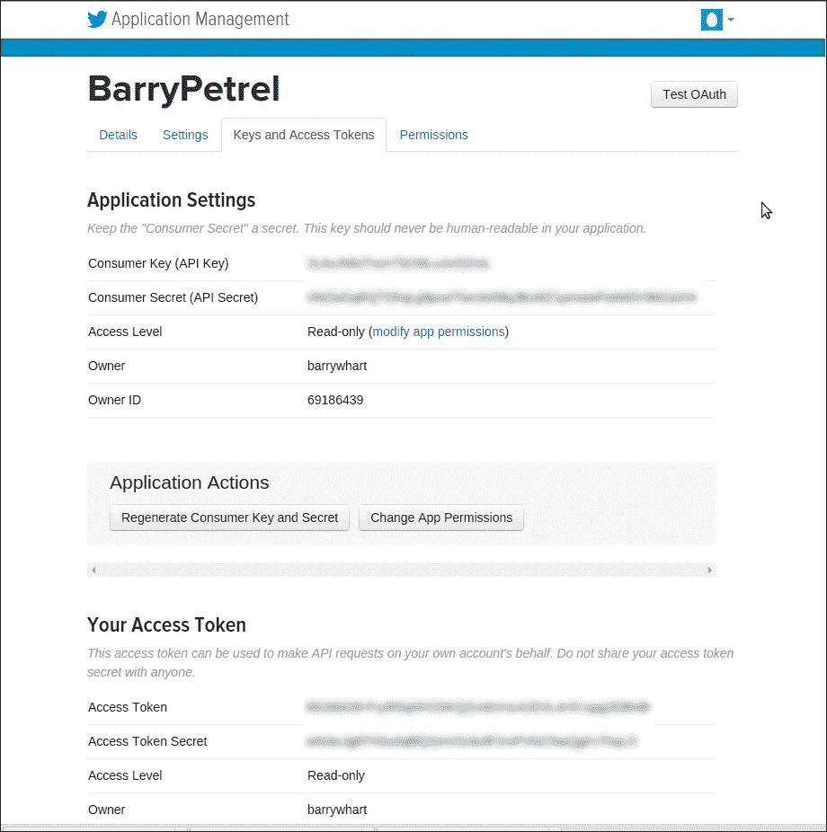
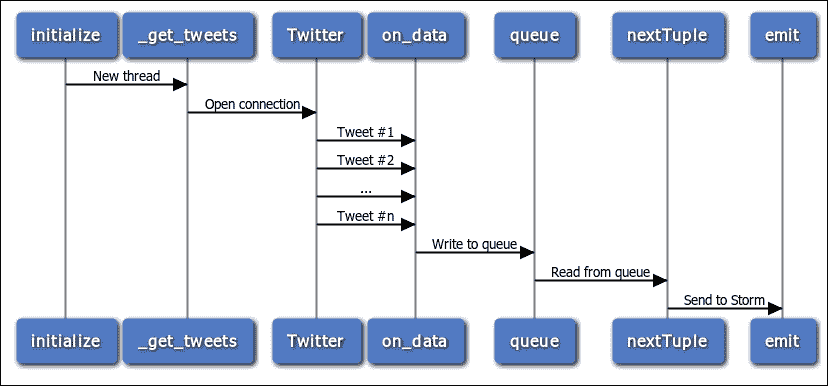
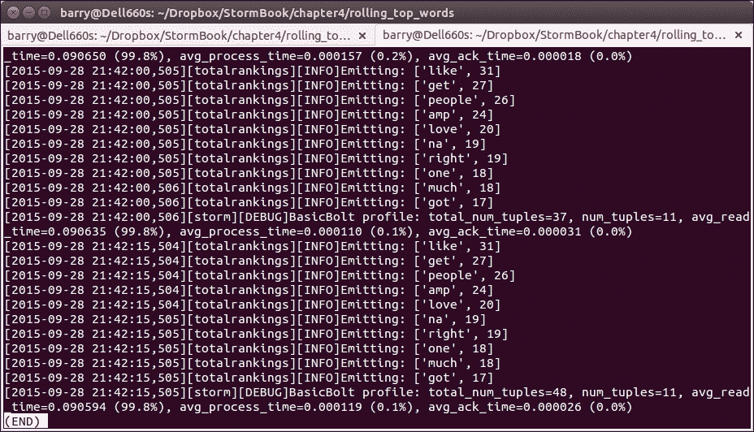

# 第四章：示例拓扑 - Twitter

本章建立在第三章 *介绍 Petrel*的材料基础上。在本章中，我们将构建一个演示许多新功能和技术的拓扑。特别是，我们将看到如何：

+   实现一个从 Twitter 读取的喷头

+   基于第三方 Python 库构建拓扑组件

+   计算滚动时间段内的统计数据和排名

+   从`topology.yaml`中读取自定义配置设置

+   使用“tick tuples”按计划执行逻辑

# Twitter 分析

你们大多数人都听说过 Twitter，但如果你没有，看看维基百科是如何描述 Twitter 的：

> *“一种在线社交网络服务，使用户能够发送和阅读称为“推文”的短 140 字符消息。”*

2013 年，用户在 Twitter 上每天发布了 4 亿条消息。Twitter 提供了一个 API，让开发人员实时访问推文流。在上面，消息默认是公开的。消息的数量、API 的可用性以及推文的公开性结合在一起，使 Twitter 成为对当前事件、感兴趣的话题、公众情绪等进行洞察的宝贵来源。

Storm 最初是在 BackType 开发的，用于处理推文，Twitter 分析仍然是 Storm 的一个受欢迎的用例。您可以在 Storm 网站上看到一些示例，网址为[`storm.apache.org/documentation/Powered-By.html`](https://storm.apache.org/documentation/Powered-By.html)。

本章的拓扑演示了如何从 Twitter 的实时流 API 中读取数据，计算最受欢迎的单词的排名。这是 Storm 网站上“滚动热门词”示例的 Python 版本（[`github.com/apache/storm/blob/master/examples/storm-starter/src/jvm/storm/starter/RollingTopWords.java`](https://github.com/apache/storm/blob/master/examples/storm-starter/src/jvm/storm/starter/RollingTopWords.java)），由以下组件组成：

+   Twitter 流喷头（`twitterstream.py`）：这从 Twitter 样本流中读取推文。

+   分割器螺栓（`splitsentence.py`）：这个接收推文并将它们分割成单词。这是第三章 *介绍 Petrel*中分割器螺栓的改进版本。

+   滚动词计数螺栓（`rollingcount.py`）：这接收单词并计算出现次数。它类似于第三章 *介绍 Petrel*中的单词计数螺栓，但实现了滚动计数（这意味着螺栓定期丢弃旧数据，因此单词计数仅考虑最近的消息）。

+   中间排名螺栓（`intermediaterankings.py`）：这消耗单词计数，并定期发出* n *最常见的单词。

+   总排名螺栓（`totalrankings.py`）：这类似于中间排名螺栓。它将中间排名组合起来，产生一个总体排名。

# Twitter 的流 API

Twitter 的公共 API 既强大又灵活。它有许多功能，用于发布和消费推文。我们的应用程序需要实时接收和处理推文。Twitter 的流 API 旨在解决这个问题。在计算机科学中，*流*是随时间提供的数据元素（在本例中是推文）的序列。

流 API 在[`dev.twitter.com/streaming/overview`](https://dev.twitter.com/streaming/overview)中有详细说明。要使用它，应用程序首先创建到 Twitter 的连接。连接保持打开状态以无限期接收推文。

流 API 提供了几种选择应用程序接收哪些 tweets 的方法。我们的拓扑使用所谓的示例流，它由 Twitter 任意选择的所有 tweets 的一个小子集。示例流用于演示和测试。生产应用程序通常使用其他流类型之一。有关可用流的更多信息，请参阅[`dev.twitter.com/streaming/public`](https://dev.twitter.com/streaming/public)。

## 创建 Twitter 应用程序以使用流 API

在我们可以使用 Twitter 的流 API 之前，Twitter 要求我们创建一个应用程序。这听起来很复杂，但是设置起来非常容易；基本上，我们只需要在网站上填写一个表格：

1.  如果您没有 Twitter 帐户，请在[`twitter.com/`](https://twitter.com/)上创建一个。

1.  一旦您拥有一个帐户，请登录并转到[`apps.twitter.com/`](https://apps.twitter.com/)。单击**创建新应用程序**。填写创建应用程序的表格。将**回调 URL**字段留空。默认访问级别是只读，这意味着此应用程序只能读取 tweets；它不能发布或进行其他更改。只读访问对于此示例来说是可以的。最后，单击**创建您的 Twitter 应用程序**。您将被重定向到您的应用程序页面。

1.  单击**密钥和访问令牌**选项卡，然后单击**创建我的访问令牌**。Twitter 将生成由两部分组成的访问令牌：**访问令牌**和**访问令牌密钥**。连接到 Twitter 时，您的应用程序将使用此令牌以及**消费者密钥**和**消费者密钥**。

生成访问令牌后，下面的屏幕截图显示了**密钥和访问令牌**选项卡：



## 拓扑配置文件

现在我们已经设置了具有 API 访问权限的 Twitter 帐户，我们准备创建拓扑。首先，创建`topology.yaml`。我们在第三章中首次看到了一个基本的`topology.yaml`文件，*介绍 Petrel*。在这里，`topology.yaml`还将保存 Twitter 的连接参数。输入以下文本，用您从[`apps.twitter.com/`](https://apps.twitter.com/)获取的四个`oauth`值替换：

```scala
nimbus.host: "localhost"
topology.workers: 1

oauth.consumer_key: "blahblahblah"
oauth.consumer_secret: "blahblahblah"
oauth.access_token: "blahblahblah"
oauth.access_token_secret: "blahblahblah"
```

## Twitter 流 spout

现在，让我们看看 Twitter spout。在`twitterstream.py`中输入以下代码：

```scala
import json
import Queue
import threading

from petrel import storm
from petrel.emitter import Spout

from tweepy.streaming import StreamListener
from tweepy import OAuthHandler, Stream

class QueueListener(StreamListener):
    def __init__(self, queue):
        self.queue = queue

    def on_data(self, data):
        tweet = json.loads(data)
        if 'text' in tweet:
            self.queue.put(tweet['text'])
        return True

class TwitterStreamSpout(Spout):
    def __init__(self):
        super(TwitterStreamSpout, self).__init__(script=__file__)
        self.queue = Queue.Queue(1000)

    def initialize(self, conf, context):
        self.conf = conf
        thread = threading.Thread(target=self._get_tweets)
        thread.daemon = True
        thread.start()

    @classmethod
    def declareOutputFields(cls):
        return ['sentence']

    def _get_tweets(self):
        auth = OAuthHandler(
            self.conf['oauth.consumer_key'],
            self.conf['oauth.consumer_secret'])
        auth.set_access_token(
            self.conf['oauth.access_token'],
            self.conf['oauth.access_token_secret'])
        stream = Stream(auth, QueueListener(self.queue))
        stream.sample(languages=['en'])

    def nextTuple(self):
        tweet = self.queue.get()
        storm.emit([tweet])
        self.queue.task_done()

def run():
    TwitterStreamSpout().run()
```

spout 如何与 Twitter 通信？Twitter API 对 API 客户端施加了一些要求：

+   连接必须使用安全套接字层（SSL）进行加密

+   API 客户端必须使用 OAuth 进行身份验证，这是一种用于与安全网络服务进行交互的流行身份验证协议

+   由于它涉及长时间的连接，流 API 涉及的不仅仅是一个简单的 HTTP 请求。

幸运的是，有一个名为**Tweepy**（[`www.tweepy.org/`](http://www.tweepy.org/)）的库，它以简单易用的 Python API 实现了这些要求。Tweepy 提供了一个`Stream`类来连接到流 API。它在`_get_tweets()`中使用。

创建 Tweepy 流需要前面列出的四个 Twitter 连接参数。我们可以直接在我们的 spout 中硬编码这些参数，但是如果连接参数发生更改，我们就必须更改代码。相反，我们将这些信息放在`topology.yaml`配置文件中。我们的 spout 在`initialize()`函数中读取这些设置。Storm 在此组件的任务启动时调用此函数，向其传递有关环境和配置的信息。在这里，`initialize()`函数捕获了`self.conf`中的拓扑配置。这个字典包括`oauth`值。

下面的序列图显示了 spout 如何与 Twitter 通信，接收 tweets 并发出它们。您可能已经注意到 spout 创建了一个后台线程。该线程从 Tweepy 接收 tweets，并使用 Python 队列将它们传递给主 spout 线程。



为什么 spout 使用线程？通常，线程用于支持并发处理。但这里并非如此。相反，Tweepy 的行为与 Petrel spout API 之间存在不匹配。

当从 Twitter 流中读取时，Tweepy 会阻止执行，并为接收到的每条推文调用一个由应用程序提供的事件处理程序函数。

在 Petrel 中，spout 上的`nextTuple()`函数必须在每个元组后从函数返回。

在后台线程中运行 Tweepy 并写入队列为这些冲突的要求提供了一个简单而优雅的解决方案。

## 分割器螺栓

这里的分割器螺栓在结构上类似于第三章中的一个，*介绍 Petrel*。这个版本有两个改进，使它更有用和更现实。

### 提示

忽略那些非常常见以至于在“热门单词”列表中不感兴趣或有用的单词。这包括英语单词，如“the”，以及在推文中频繁出现的类似单词的术语，如“http”，“https”和“rt”。

在将推文拆分为单词时省略标点符号。

一个名为**自然语言工具包**（**NLTK**）的 Python 库使得实现这两者变得容易。NLTK 还有许多其他引人入胜的、强大的语言处理功能，但这些超出了本书的范围。

在`splitsentence.py`中输入以下代码：

```scala
import nltk.corpus

from petrel import storm
from petrel.emitter import BasicBolt

class SplitSentenceBolt(BasicBolt):
    def __init__(self):
        super(SplitSentenceBolt, self).__init__(script=__file__)
        self.stop = set(nltk.corpus.stopwords.words('english'))
        self.stop.update(['http', 'https', 'rt'])

    def declareOutputFields(self):
        return ['word']

    def process(self, tup):
        for word in self._get_words(tup.values[0]):
            storm.emit([word])

    def _get_words(self, sentence):
        for w in nltk.word_tokenize(sentence):
            w = w.lower()
            if w.isalpha() and w not in self.stop:
                yield w

def run():
    SplitSentenceBolt().run()
```

## 滚动字数螺栓

滚动字数螺栓类似于第三章中的字数螺栓，*介绍 Petrel*。早期章节中的螺栓只是无限累积单词计数。这对于分析 Twitter 上的热门话题并不好，因为热门话题可能在下一刻就会改变。相反，我们希望计数反映最新信息。为此，滚动字数螺栓将数据存储在基于时间的存储桶中。然后，定期丢弃超过 5 分钟的存储桶。因此，此螺栓的字数仅考虑最近 5 分钟的数据。

在`rollingcount.py`中输入以下代码：

```scala
from collections import defaultdict

from petrel import storm
from petrel.emitter import BasicBolt

class SlotBasedCounter(object):
    def __init__(self, numSlots):
        self.numSlots = numSlots
        self.objToCounts = defaultdict(lambda: [0] * numSlots)

    def incrementCount(self, obj, slot):
        self.objToCounts[obj][slot] += 1

    def getCount(self, obj, slot):
        return self.objToCounts[obj][slot]

    def getCounts(self):
        return dict((k, sum(v)) for k, v in self.objToCounts.iteritems())

    def wipeSlot(self, slot):
        for obj in self.objToCounts.iterkeys():
            self.objToCounts[obj][slot] = 0

    def shouldBeRemovedFromCounter(self, obj):
        return sum(self.objToCounts[obj]) == 0

    def wipeZeros(self):
        objToBeRemoved = set()
        for obj in self.objToCounts.iterkeys():
            if sum(self.objToCounts[obj]) == 0:
                objToBeRemoved.add(obj)
        for obj in objToBeRemoved:
            del self.objToCounts[obj]

class SlidingWindowCounter(object):
    def __init__(self, windowLengthInSlots):
        self.windowLengthInSlots = windowLengthInSlots
        self.objCounter = /
            SlotBasedCounter(
                self.windowLengthInSlots)
        self.headSlot = 0
        self.tailSlot = self.slotAfter(self.headSlot)

    def incrementCount(self, obj):
        self.objCounter.incrementCount(obj, self.headSlot)

    def getCountsThenAdvanceWindow(self):
        counts = self.objCounter.getCounts()
        self.objCounter.wipeZeros()
        self.objCounter.wipeSlot(self.tailSlot)
        self.headSlot = self.tailSlot
        self.tailSlot = self.slotAfter(self.tailSlot)
        return counts

    def slotAfter(self, slot):
        return (slot + 1) % self.windowLengthInSlots

class RollingCountBolt(BasicBolt):
    numWindowChunks = 5
    emitFrequencyInSeconds = 60
    windowLengthInSeconds = numWindowChunks * \
        emitFrequencyInSeconds

    def __init__(self):
        super(RollingCountBolt, self).__init__(script=__file__)
        self.counter = SlidingWindowCounter(
            self.windowLengthInSeconds /
                self.emitFrequencyInSeconds

    @classmethod
    def declareOutputFields(cls):
        return ['word', 'count']

    def process(self, tup):
        if tup.is_tick_tuple():
            self.emitCurrentWindowCounts()
        else:
            self.counter.incrementCount(tup.values[0])

    def emitCurrentWindowCounts(self):
        counts = self.counter.getCountsThenAdvanceWindow()
        for k, v in counts.iteritems():
            storm.emit([k, v])

    def getComponentConfiguration(self):
        return {"topology.tick.tuple.freq.secs":
            self.emitFrequencyInSeconds}

def run():
    RollingCountBolt().run()
```

`SlotBasedCounter`为每个单词存储了一个`numSlots`（五）个计数值的列表。每个槽存储`emitFrequencyInSeconds`（60）秒的数据。超过 5 分钟的计数值将被丢弃。

螺栓如何知道已经过去了 60 秒？Storm 通过提供称为**tick tuples**的功能使这变得容易。当您需要按计划在螺栓中执行一些逻辑时，此功能非常有用。要使用此功能，请执行以下步骤：

+   在`getComponentConfiguration()`中，返回一个包含`topology.tick.tuple.freq.secs`键的字典。该值是期望的 tick 之间的秒数。

+   在`process()`中，检查元组是正常元组还是 tick 元组。当接收到 tick 元组时，螺栓应运行其计划的处理。

## 中间排名螺栓

中间排名螺栓维护一个由发生计数排名的前`maxSize`（10）个项目组成的字典，并且每隔`emitFrequencyInSeconds`（15）秒发出这些项目。在生产中，拓扑将运行许多此类螺栓的实例，每个实例维护整体单词的*子集*的顶部单词。拥有同一组件的多个实例允许拓扑处理大量推文，并且即使不同单词的数量相当大，也可以轻松地将所有计数保存在内存中。

在`intermediaterankings.py`中输入此代码：

```scala
from petrel import storm
from petrel.emitter import BasicBolt

def tup_sort_key(tup):
    return tup.values[1]

class IntermediateRankingsBolt(BasicBolt):
    emitFrequencyInSeconds = 15
    maxSize = 10

    def __init__(self):
        super(IntermediateRankingsBolt, self).__init__(script=__file__)
        self.rankedItems = {}

    def declareOutputFields(self):
        return ['word', 'count']

    def process(self, tup):
        if tup.is_tick_tuple():
            for t in self.rankedItems.itervalues():
                storm.emit(t.values)
        else:
            self.rankedItems[tup.values[0]] = tup
            if len(self.rankedItems) > self.maxSize:
                for t in sorted(
                        self.rankedItems.itervalues(), key=tup_sort_key):
                    del self.rankedItems[t.values[0]]
                    break

    def getComponentConfiguration(self):
        return {"topology.tick.tuple.freq.secs":
            self.emitFrequencyInSeconds}

def run():
    IntermediateRankingsBolt().run()
```

## 总排名螺栓

总排名螺栓与中间排名螺栓非常相似。拓扑中只有一个此类螺栓的实例。它接收来自该螺栓每个实例的顶部单词，并选择整体的前`maxSize`（10）个项目。

在`totalrankings.py`中输入以下代码：

```scala
import logging

from petrel import storm
from petrel.emitter import BasicBolt

log = logging.getLogger('totalrankings')

def tup_sort_key(tup):
    return tup.values[1]

class TotalRankingsBolt(BasicBolt):
    emitFrequencyInSeconds = 15
    maxSize = 10

    def __init__(self):
        super(TotalRankingsBolt, self).__init__(script=__file__)
        self.rankedItems = {}

    def declareOutputFields(self):
        return ['word', 'count']

    def process(self, tup):
        if tup.is_tick_tuple():
            for t in sorted(
                    self.rankedItems.itervalues(),
                    key=tup_sort_key,
                    reverse=True):
                log.info('Emitting: %s', repr(t.values))
                storm.emit(t.values)
        else:
            self.rankedItems[tup.values[0]] = tup
            if len(self.rankedItems) > self.maxSize:
                for t in sorted(
                        self.rankedItems.itervalues(),
                        key=tup_sort_key):
                    del self.rankedItems[t.values[0]]
                    break
            zero_keys = set(
                k for k, v in self.rankedItems.iteritems()
                if v.values[1] == 0)
            for k in zero_keys:
                del self.rankedItems[k]

    def getComponentConfiguration(self):
        return {"topology.tick.tuple.freq.secs": self.emitFrequencyInSeconds}

def run():
    TotalRankingsBolt().run()
```

## 定义拓扑

这是定义拓扑结构的`create.py`脚本：

```scala
from twitterstream import TwitterStreamSpout
from splitsentence import SplitSentenceBolt
from rollingcount import RollingCountBolt
from intermediaterankings import IntermediateRankingsBolt
from totalrankings import TotalRankingsBolt

def create(builder):
    spoutId = "spout"
    splitterId = "splitter"
    counterId = "counter"
    intermediateRankerId = "intermediateRanker"
    totalRankerId = "finalRanker"
    builder.setSpout(spoutId, TwitterStreamSpout(), 1)
    builder.setBolt(
        splitterId, SplitSentenceBolt(), 1).shuffleGrouping("spout")
    builder.setBolt(
        counterId, RollingCountBolt(), 4).fieldsGrouping(
            splitterId, ["word"])
    builder.setBolt(
        intermediateRankerId,
        IntermediateRankingsBolt(), 4).fieldsGrouping(
            counterId, ["word"])
    builder.setBolt(
        totalRankerId, TotalRankingsBolt()).globalGrouping(
            intermediateRankerId)
```

这个拓扑的结构类似于第三章中的单词计数拓扑，*Introducing Petrel*。`TotalRankingsBolt`有一个新的变化。如前所述，这个螺栓只有一个实例，并且它使用`globalGrouping()`，所以所有来自`IntermediateRankingsBolt`的元组都会被发送到它。

你可能想知道为什么拓扑需要中间排名和总排名的螺栓。为了让我们知道最常见的单词，需要有一个单一的螺栓实例（总排名），可以跨越整个推文流。但是在高数据速率下，一个单一的螺栓不可能跟得上流量。中间排名螺栓实例“保护”总排名螺栓免受这种流量的影响，计算其推文流片段的热门词汇。这使得最终排名螺栓能够计算整体最常见的单词，同时只消耗整体单词计数的一小部分。优雅！

# 运行拓扑

在运行拓扑之前，我们还有一些小事情要处理：

1.  从第三章中的第二个例子中复制`logconfig.ini`文件，*Introducing Petrel*，到这个拓扑的目录中。

1.  创建一个名为`setup.sh`的文件。Petrel 将把这个脚本与拓扑打包并在启动时运行。这个脚本安装了拓扑使用的第三方 Python 库。文件看起来像这样：

```scala
pip install -U pip
pip install nltk==3.0.1 oauthlib==0.7.2 tweepy==3.2.0
```

1.  创建一个名为`manifest.txt`的文件，包含以下两行：

```scala
logconfig.ini
setup.sh
```

1.  在运行拓扑之前，让我们回顾一下我们创建的文件列表。确保你已经正确创建了这些文件：

+   `topology.yaml`

+   `twitterstream.py`

+   `splitsentence.py`

+   `rollingcount.py`

+   `intermediaterankings.py`

+   `totalrankings.py`

+   `manifest.txt`

+   `setup.sh`

1.  使用以下命令运行拓扑：

```scala
petrel submit --config topology.yaml --logdir `pwd`
```

一旦拓扑开始运行，打开`topology`目录中的另一个终端。输入以下命令以查看总排名螺栓的`log`文件，按从最旧到最新的顺序排序：

```scala
ls -ltr petrel*totalrankings.log
```

如果这是你第一次运行拓扑，那么只会列出一个日志文件。每次运行都会创建一个新文件。如果列出了几个文件，请选择最近的一个。输入此命令以监视日志文件的内容（在你的系统上确切的文件名将不同）：

```scala
tail -f petrel24748_totalrankings.log
```

大约每 15 秒，你会看到按热门程度降序排列的前 10 个单词的日志消息，就像这样：



# 摘要

在本章中，我们使用了许多新技术和库来开发一个复杂的拓扑。阅读完这个例子后，你应该准备好开始应用 Petrel 和 Storm 来解决实际问题。

在即将到来的章节中，我们将更仔细地研究一些 Storm 的内置功能，这些功能在操作集群时非常有用，比如日志记录和监控。
