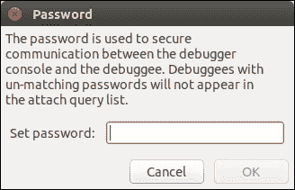
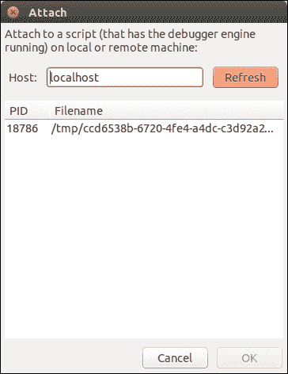
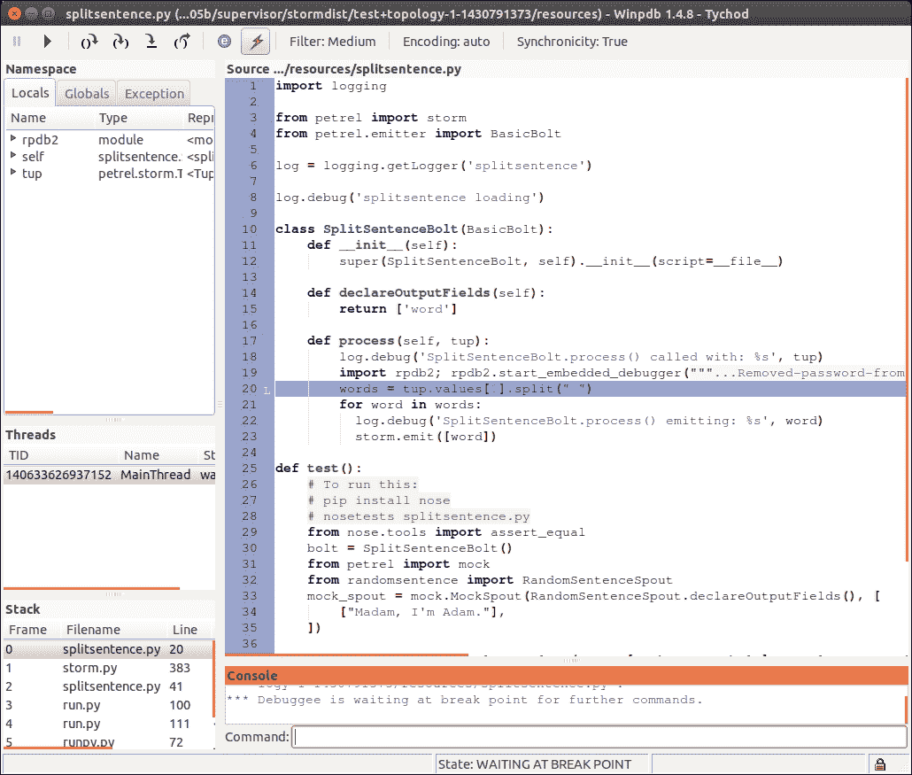
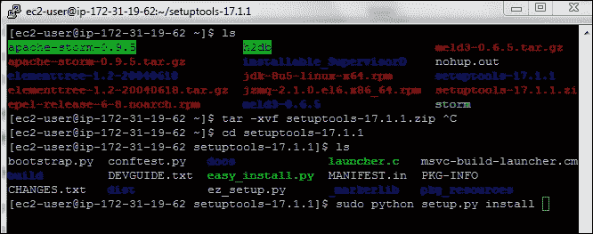
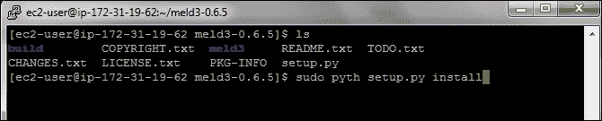
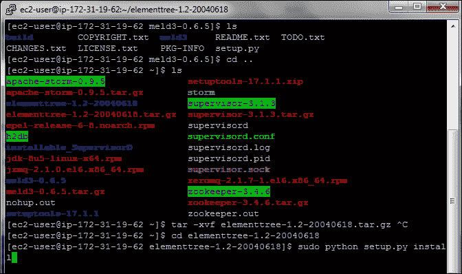
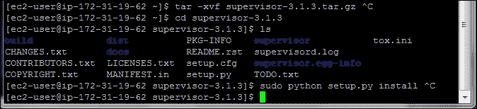
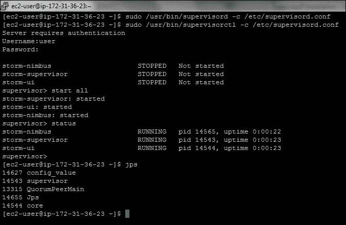
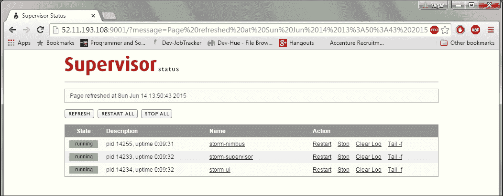

# 第六章：Petrel 实践

在之前的章节中，我们看到了 Storm 拓扑的工作示例，既简单又复杂。然而，在这样做的过程中，我们跳过了您在开发自己的拓扑时需要的一些工具和技术：

+   Storm 是一个很好的运行代码的环境，但是部署到 Storm（即使在本地机器上）会增加复杂性并需要额外的时间。我们将看到如何在 Storm 之外测试您的 spouts 和 bolts。

+   当组件在 Storm 中运行时，它们无法从控制台读取，这阻止了使用 pdb，标准 Python 调试器。本章演示了 Winpdb，这是一个适用于在 Storm 中调试组件的交互式调试工具。

+   Storm 让您轻松利用许多服务器的功能，但您的代码性能仍然很重要。在本章中，我们将看到一些测量拓扑组件性能的方法。

# 测试一个 bolt

Storm 使得部署和运行 Python 拓扑变得容易，但在 Storm 中开发和测试它们是具有挑战性的，无论是在独立的 Storm 中运行还是在完整的 Storm 部署中运行：

+   Storm 代表您启动程序 - 不仅是您的 Python 代码，还有辅助的 Java 进程

+   它控制 Python 组件的标准输入和输出通道

+   Python 程序必须定期响应心跳消息，否则将被 Storm 关闭

这使得使用通常用于其他 Python 代码片段的典型工具和技术来调试 Storm 拓扑变得困难，例如通过命令行运行并使用 pdb 进行调试的常见技术。

Petrel 的模拟模块帮助我们做到这一点。它提供了一个简单的、独立的 Python 容器，用于测试简单的拓扑，并验证返回了预期的结果。

在 Petrel 术语中，**简单**拓扑是只输出到默认流并且没有分支或循环的拓扑。`run_simple_topology()`假设列表中的第一个组件是 spout，将每个组件的输出传递给序列中的下一个组件。

## 示例 - 测试 SplitSentenceBolt

让我们看一个例子。这是第三章中第一个示例中的`splitsentence.py`文件，*介绍 Petrel*中添加了一个单元测试：

```scala
from nose.tools import assert_equal

from petrel import mock, storm
from petrel.emitter import BasicBolt

from randomsentence import RandomSentenceSpout

class SplitSentenceBolt(BasicBolt):
    def __init__(self):
        super(SplitSentenceBolt, self).__init__(script=__file__)

    def declareOutputFields(self):
        return ['word']

    def process(self, tup):
        words = tup.values[0].split(" ")
        for word in words:
          storm.emit([word])

def test():
    bolt = SplitSentenceBolt()
    mock_spout = mock.MockSpout(
        RandomSentenceSpout.declareOutputFields(),
        [["Madam, I'm Adam."]])

    result = mock.run_simple_topology(
        None, [mock_spout, bolt], result_type=mock.LIST)
        assert_equal([['Madam,'], ["I'm"], ['Adam.']], result[bolt])

def run():
    SplitSentenceBolt().run()
```

要运行测试，请输入以下命令：

```scala
pip install nosetests
```

1.  首先，通过运行以下命令安装 Python `nosetests`库：

```scala
pip install nosetests
```

1.  接下来，运行这行：

```scala
nosetests -v splitsentence.py
```

如果一切顺利，您将看到以下输出：

```scala
splitsentence.test ... ok

----------------------------------------------------------------------
Ran 1 test in 0.001s

OK
```

Nose 是一个非常强大的工具，具有许多功能。我们不会在这里详细介绍它，但您可以在[`nose.readthedocs.org/en/latest/`](https://nose.readthedocs.org/en/latest/)找到文档。

## 示例 - 测试 SplitSentenceBolt 与 WordCountBolt

下一个示例展示了如何测试一系列相关组件。在下面的代码中，我们看到了一个新版本的`wordcount.py`，它测试了`SplitSentenceBolt`和`WordCountBolt`之间的交互：

```scala
from collections import defaultdict

from nose.tools import assert_equal

from petrel import mock, storm
from petrel.emitter import BasicBolt

from randomsentence import RandomSentenceSpout
from splitsentence import SplitSentenceBolt

class WordCountBolt(BasicBolt):
    def __init__(self):
        super(WordCountBolt, self).__init__(script=__file__)
        self._count = defaultdict(int)

    @classmethod
    def declareOutputFields(cls):
        return ['word', 'count']

    def process(self, tup):
        word = tup.values[0]
        self._count[word] += 1
        storm.emit([word, self._count[word]])

def test():
    ss_bolt = SplitSentenceBolt()
    wc_bolt = WordCountBolt()

    mock_spout = mock.MockSpout(
        RandomSentenceSpout.declareOutputFields(),
        [["the bart the"]])

     result = mock.run_simple_topology(
       None,
       [mock_spout, ss_bolt, wc_bolt],
       result_type=mock.LIST)
       assert_equal([['the', 1], ['bart', 1], ['the', 2]], result[wc_bolt])

def run():
    WordCountBolt().run()
```

测试非常简单；我们只需实例化两个组件，并在调用`mock.run_simple_topology()`时以正确的顺序包含它们。

### 注意

两个示例测试在调用`run_simple_topology()`时都指定了`result_type=mock.LIST`。此参数选项告诉 Petrel 在返回输出元组时使用哪种格式。选项包括：

`STORM_TUPLE`

`LIST`

`TUPLE`

`NAMEDTUPLE`

通常，`LIST`是组件具有少量输出字段的良好选择，而`NAMEDTUPLE`对于较多字段更可读（即允许测试通过字段名称而不是数字索引访问结果字段）。如果测试需要检查结果的其他属性，例如较少使用的流属性，则`STORM_TUPLE`是有用的。

# 调试

到目前为止，我们使用日志消息和自动化测试来调试拓扑。这些技术非常强大，但有时可能需要直接在 Storm 环境中进行调试。例如，问题可能是：

+   依赖于作为特定用户运行

+   仅在有真实数据时发生

+   仅当有许多组件实例并行运行时才会发生。

本节介绍了 Storm 内部调试工具。

Winpdb 是一个便携式的基于 GUI 的 Python 调试器，支持嵌入式调试。如果您不熟悉术语“嵌入式调试”，请注意：这意味着 Winpdb 可以附加到以其他方式启动的程序，而不一定是从 WinDbg 或命令 shell 启动的。因此，它非常适合调试在 Storm 中运行的 Petrel 组件。

# 安装 Winpdb

激活您的 Petrel 虚拟环境，然后使用`pip`进行安装：

```scala
source <virtualenv directory>/bin/activate
pip install winpdb
```

## 添加 Winpdb 断点

在`splitsentence.py`文件中，在`run()`函数的开头添加以下内容：

```scala
import rpdb2
rpdb2.start_embedded_debugger('password')
```

`'password'`的值可以是任何值；这只是您在下一步中将用于附加到`splitsentence.py`的密码。

当此行代码执行时，脚本将冻结默认等待 5 分钟，等待调试器附加。

## 启动和附加调试器

现在运行拓扑：

```scala
petrel submit --config topology.yaml
```

一旦您看到来自分流器的日志消息，您将知道拓扑已经启动运行，因此可以连接调试器。

通过运行`winpdb`来启动`Winpdb`。

有关如何在嵌入式调试中使用 Winpdb 的更多详细信息，请参阅[`winpdb.org/docs/embedded-debugging/`](http://winpdb.org/docs/embedded-debugging/)中的文档。

当窗口出现时，从菜单中选择**文件** | **附加**。将出现密码对话框。在这里，输入与`start_embedded_debugger()`传递的相同密码，然后单击**OK**按钮，如此屏幕截图所示：



接下来，选择要附加的进程，然后单击**OK**，如下面的屏幕截图所示：



现在您将看到主 Winpdb 窗口，断点下面的行会被突出显示。如果您使用过其他调试器，Winpdb 应该很容易使用。如果您需要帮助使用 Winpdb，以下教程对您非常有帮助：

[`code.google.com/p/winpdb/wiki/DebuggingTutorial`](https://code.google.com/p/winpdb/wiki/DebuggingTutorial)。



# 对拓扑性能进行分析

性能可能是任何应用程序的问题。这对 Storm 拓扑同样适用，甚至更多。

当您尝试通过拓扑推送大量数据时，原始性能当然是一个问题——更快的组件意味着可以处理更多数据。但了解各个组件的元组处理性能也很重要。这些信息可以用两种方式。

首先要知道哪些组件速度较慢，因为这可以告诉您在尝试加快代码速度时要关注的地方。一旦知道哪个组件（或哪些组件）速度慢，就可以使用诸如 Python cProfile 模块（[`pymotw.com/2/profile/`](http://pymotw.com/2/profile/)）和行分析器（[`github.com/rkern/line_profiler`](https://github.com/rkern/line_profiler)）等工具来了解代码大部分时间花在哪里。

即使进行了分析，某些组件仍然比其他组件快。在这种情况下，了解组件之间的相对性能可以帮助您配置拓扑以获得最佳性能。

第二点有些微妙，让我们看一个例子。在以下代码中，我们看到了来自单词计数拓扑的两个 Storm 组件的日志摘录。这些日志消息是 Petrel 自动生成的。第一个是分割句子的分流器，第二个是单词计数的分流器：

```scala
[2015-05-07 22:51:44,772][storm][DEBUG]BasicBolt profile: total_num_tuples=79, num_tuples=79, avg_read_time=0.002431 (19.1%), avg_process_time=0.010279 (80.7%), avg_ack_time=0.000019 (0.2%)
[2015-05-07 22:51:45,776][storm][DEBUG]BasicBolt profile: total_num_tuples=175, num_tuples=96, avg_read_time=0.000048 (0.5%), avg_process_time=0.010374 (99.3%), avg_ack_time=0.000025 (0.2%)
[2015-05-07 22:51:46,784][storm][DEBUG]BasicBolt profile: total_num_tuples=271, num_tuples=96, avg_read_time=0.000043 (0.4%), avg_process_time=0.010417 (99.3%), avg_ack_time=0.000026 (0.2%)
[2015-05-07 22:51:47,791][storm][DEBUG]BasicBolt profile: total_num_tuples=368, num_tuples=97, avg_read_time=0.000041 (0.4%), avg_process_time=0.010317 (99.4%), avg_ack_time=0.000021 (0.2%)
```

## 分割句子的日志

以下是分割句子的日志：

```scala
[2015-05-07 22:51:44,918][storm][DEBUG]BasicBolt profile: total_num_tuples=591, num_tuples=591, avg_read_time=0.001623 (95.8%), avg_process_time=0.000052 (3.1%), avg_ack_time=0.000019 (1.1%)
[2015-05-07 22:51:45,924][storm][DEBUG]BasicBolt profile: total_num_tuples=1215, num_tuples=624, avg_read_time=0.001523 (94.7%), avg_process_time=0.000060 (3.7%), avg_ack_time=0.000025 (1.5%)
[2015-05-07 22:51:46,930][storm][DEBUG]BasicBolt profile: total_num_tuples=1829, num_tuples=614, avg_read_time=0.001559 (95.4%), avg_process_time=0.000055 (3.3%), avg_ack_time=0.000021 (1.3%)
[2015-05-07 22:51:47,938][storm][DEBUG]BasicBolt profile: total_num_tuples=2451, num_tuples=622, avg_read_time=0.001547 (95.7%), avg_process_time=0.000049 (3.0%), avg_ack_time=0.000020 (1.3%)
```

## 单词计数的日志

这些日志表明，分割句子 bolt 花费 0.010338 秒处理和确认每个元组（0.010317 + 0.000021），而单词计数 bolt 每个元组花费 0.000069 秒（0.000049 + 0.000020）。分割句子 bolt 较慢，这表明您可能需要更多的分割句子 bolt 实例而不是单词计数 bolt。

### 注意

为什么在前面的计算中没有考虑读取时间？读取时间包括从 Storm 读取元组所花费的 CPU 时间，但它还包括等待时间（即睡眠），等待元组到达的时间。如果上游组件提供数据缓慢，我们不希望将那段时间计入我们的组件。因此，为简单起见，我们在计算中省略了读取时间。

当然，每个元组的性能只是问题的一部分。您还必须考虑要处理的元组的数量。在前面的日志所涵盖的 4 秒内，分割句子 bolt 接收了 97 个元组（句子），而单词计数 bolt 接收了 622 个元组（单词）。现在我们将这些数字应用到每个元组的处理时间中：

```scala
0.010338 seconds/tuple * 97 tuples = 1.002786 seconds (Split sentence)
0.000069 seconds/tuple * 622 tuples = 0.042918 seconds (Word count)
```

分割句子 bolt 使用的总时间要大得多（大约是 23 倍），在配置拓扑的并行性时，我们应该考虑到这一点。例如，我们可以将`topology.yaml`配置如下：

```scala
petrel.parallelism.splitsentence: 24
petrel.parallelism.wordcount: 1
```

通过以这种方式配置拓扑，我们帮助确保在高流量率下，有足够的分割句子的 bolt 来避免成为瓶颈，使单词计数的 bolt 始终保持繁忙状态。

### 注意

前一节的日志使用了一个特意修改过的分割句子的版本，以便运行得更慢，使示例更清晰。

# 总结

在本章中，您学会了一些技能，这些技能将帮助您更有效地构建自己的拓扑。在开发 spouts 或 bolts 时，您可以在将它们组装成完整的拓扑并部署到 Storm 之前对它们进行单独测试。如果在 Storm 中运行时遇到棘手的问题，您可以使用 Winpdb，除了（或者替代）日志消息。当您的代码工作时，您可以了解哪些组件占用了大部分时间，这样您就可以专注于改进这些领域的性能。有了这些技能，您现在可以出去构建自己的拓扑了。祝你好运！

# 附录 A. 使用 supervisord 管理 Storm

本附录为您概述以下主题：

+   在集群上进行 Storm 管理

+   介绍 supervisord

+   supervisord 的组件

+   supervisord 的安装和配置

# 在集群上进行 Storm 管理

有许多可用的工具可以创建多个虚拟机，安装预定义的软件，甚至管理该软件的状态。

## 介绍 supervisord

Supervisord 是一个进程控制系统。它是一个客户端-服务器系统，允许用户在类 Unix 操作系统上监视和控制多个进程。详情请访问[`supervisord.org/`](http://supervisord.org/)。

## supervisord 组件

supervisor 的服务器部分被称为 supervisord。它负责在自己被调用时启动子程序，响应来自客户端的命令，重新启动崩溃或退出的子进程，记录其子进程的 stdout 和 stderr 输出，并生成和处理与子进程生命周期中的事件相对应的“事件”。服务器进程使用一个配置文件。这通常位于`/etc/supervisord.conf`。这个配置文件是一个 Windows-INI 风格的`config`文件。通过适当的文件系统权限保护这个文件是很重要的，因为它可能包含解密后的用户名和密码：

+   **supervisorctl**：supervisor 的命令行客户端部分称为 supervisorctl。它为 supervisord 提供了类似 shell 的界面。从 supervisorctl，用户可以连接到不同的 supervisord 进程。他们可以获取由其控制的子进程的状态，停止和启动 supervisord 的子进程，并获取运行中进程的列表。命令行客户端通过 Unix 域套接字或 Internet（TCP）套接字与服务器通信。服务器可以断言客户端的用户在允许他们使用命令之前应该提供身份验证凭据。客户端进程通常使用与服务器相同的配置文件，但任何具有`[supervisorctl]`部分的配置文件都可以工作。

+   **Web 服务器**：如果您针对 Internet 套接字启动 supervisord，则可以通过浏览器访问（稀疏）具有与 supervisorctl 功能相当的 Web 用户界面。激活配置文件的`[inet_http_server]`部分后，访问服务器 URL（例如`http://localhost:9001/`）以通过 Web 界面查看和控制进程状态。

+   **XML-RPC 接口**：提供 Web UI 的 HTTP 服务器还提供了一个 XML-RPC 接口，可用于查询和控制 supervisor 和其运行的程序。参见*XML-RPC API 文档*。

+   **机器**：假设我们有两台 IP 地址为`172-31-19-62`和`172.31.36.23`的 EC2 机器。我们将在两台机器上安装 supervisord，然后配置以决定每台机器上将运行哪些 Storm 服务。

+   **Storm 和 Zookeeper 设置**：让我们在`172.31.36.23`机器上运行 Zookeeper、Nimbus、supervisor 和 UI，而在`172-31-19-62`上只运行 supervisor。

+   **Zookeeper** **版本**：`zookeeper-3.4.6.tar.gz`。

+   **Storm** **版本**：`apache-storm-0.9.5.tar.gz`。

以下是 Zookeeper 服务器设置和配置的过程：

1.  下载 Zookeeper 的最新版本并解压缩：

```scala
tar –xvf zookeeper-3.4.6.tar.gz
```

1.  在`conf`目录中配置`zoo.cfg`以在集群模式下启动 Zookeeper。

1.  Zookeeper 配置：

```scala
server.1=172.31.36.23:2888:3888
tickTime=2000
initLimit=10
syncLimit=5
# the directory where the snapshot is stored.
dataDir=/home/ec2-user/zookeeper-3.4.6/tmp/zookeeper
clientPort=2181
```

1.  确保在`dataDir`中指定的目录已创建，并且用户对其具有读写权限。

1.  然后，转到 Zookeeper `bin`目录并使用以下命令启动`zookeeper`服务器：

```scala
[ec2-user@ip-172-31-36-23 bin~]$ zkServer.sh start
```

Storm 服务器设置和配置：

1.  从 Apache Storm 网站下载 Storm 的最新版本并解压缩：

```scala
tar –xvf apache-storm-0.9.5.tar.gz
```

1.  以下是 Storm Nimbus 机器以及从机的配置（仅添加/更改的配置）：

```scala
storm.zookeeper.servers: - "172.31.36.23"

nimbus.host: "172.31.36.23"

nimbus.childopts: "-Xmx1024m -Djava.net.preferIPv4Stack=true"

ui.childopts: "-Xmx768m -Djava.net.preferIPv4Stack=true"

supervisor.childopts: "-Djava.net.preferIPv4Stack=true"

worker.childopts: "-Xmx768m -Djava.net.preferIPv4Stack=true"

storm.local.dir: "/home/ec2-user/apache-storm-0.9.5/local"

supervisor.slots.ports:
 - 6700
 - 6701
 - 6702
 - 6703
```

### Supervisord 安装

可以通过以下两种方式安装 supervisord：

1.  在具有 Internet 访问权限的系统上安装：

下载 Setup 工具并使用`easy_install`方法。

1.  在没有 Internet 访问权限的系统上安装：

下载所有依赖项，复制到每台机器，然后安装。

我们将遵循第二种安装方法，即不需要 Internet 访问的方法。我们将下载所有依赖项和 supervisord，并将其复制到服务器上。

Supervisord `[supervisor-3.1.3.tar.gz]`需要安装以下依赖项：

+   Python 2.7 或更高版本

+   从[`pypi.python.org/pypi/setuptools`](http://pypi.python.org/pypi/setuptools)下载`setuptools`（最新版本）

+   从[`effbot.org/downloads#elementtree`](http://effbot.org/downloads#elementtree)下载`elementtree`（最新版本）。`elementtree-1.2-20040618.tar.gz`

+   `meld3-0.6.5.tar.gz`

让我们在`172.31.36.23`和`172-31-19-62`两台机器上安装 supervisord 和必要的依赖项。

以下是安装依赖项的步骤：

1.  `setuptools`：

+   使用以下命令解压缩`.zip`文件：

```scala
[ec2-user@ip-172-31-19-62 ~]$ tar -xvf setuptools-17.1.1.zip
```

+   转到`setuptools-17.1.1`目录并使用`sudo`运行安装命令：

```scala
[ec2-user@ip-172-31-19-62 setuptools-17.1.1]$ sudo python setup.py install
```



```scala
storm.zookeeper.servers: - "172.31.36.23"

nimbus.host: "172.31.36.23"

nimbus.childopts: "-Xmx1024m -Djava.net.preferIPv4Stack=true"

ui.childopts: "-Xmx768m -Djava.net.preferIPv4Stack=true"

supervisor.childopts: "-Djava.net.preferIPv4Stack=true"

worker.childopts: "-Xmx768m -Djava.net.preferIPv4Stack=true"

storm.local.dir: "/home/ec2-user/apache-storm-0.9.5/local"

supervisor.slots.ports:
 - 6700
 - 6701
 - 6702
 - 6703
```

1.  `meld3`：

+   使用以下命令解压缩`.ts.gz`文件：

```scala
[ec2-user@ip-172-31-19-62 ~]$ tar -xvf meld3-0.6.5.tar.gz
```

+   转到`meld3.-0.6.5`目录并运行以下命令：

```scala
[ec2-user@ip-172-31-19-62 meld3-0.6.5]$ sudo pyth setup.py install
```



1.  `elementtree`：

+   解压缩`.ts.gz`文件：

```scala
[ec2-user@ip-172-31-19-62 ~]$ tar -xvf elementtree-1.2-20040618.tar.gz
```

+   转到`elementtree-1.2-20040618`并运行以下命令：

```scala
[ec2-user@ip-172-31-19-62 elementtree-1.2-20040618]$ sudo python setup.py install
```



以下是 supervisord 安装：

+   使用以下命令提取`supervisor-3.1.3`：

```scala
[ec2-user@ip-172-31-19-62 ~]$ tar -xvf supervisor-3.1.3.tar.gz
```

+   转到`supervisor-3.1.3`目录并运行以下命令：

```scala
[ec2-user@ip-172-31-19-62 supervisor-3.1.3]$ sudo python setup.py install
```



### 注意

另一台机器上需要类似的 supervisord 设置，即`172.31.36.23`。

#### 在`172-31-19-62`上的 supervisord.conf 配置

让我们在`172.31.36.23`机器上配置服务，并假设 supervisord 安装已按先前说明完成。安装 supervisor 后，您可以构建`supervisord.conf`文件以启动`supervisord`和`supervisorctl`命令：

+   制作`supervisor.conf`文件。将其放入`/etc`目录中。

+   我们可以使用以下命令获取样本`supervisord.conf`：

```scala
[ec2-user@ip-172-31-36-23 ~]$ echo_supervisord_conf
```

查看`supervisord.conf`文件：

```scala
[unix_http_server]
file = /home/ec2-user/supervisor.sock
chmod = 0777

[inet_http_server]         ; inet (TCP) server disabled by default
port=172.31.36.23:9001        ; (ip_address:port specifier, *:port for all iface)
username=user              ; (default is no username (open server))
password=123               ; (default is no password (open server))

[rpcinterface:supervisor]
supervisor.rpcinterface_factory = supervisor.rpcinterface:make_main_rpcinterface

[supervisord]
logfile_backups=10           ; (num of main logfile rotation backups;default 10)
logfile=/home/ec2-user/supervisord.log ; (main log file;default $CWD/supervisord.log)
logfile_maxbytes=50MB        ; (max main logfile bytes b4 rotation;default 50MB)
pidfile=/home/ec2-user/supervisord.pid ; (supervisord pidfile;default supervisord.pid)
nodaemon=false               ; (start in foreground if true;default false)
minfds=1024                  ; (min. avail startup file descriptors;default 1024)

[supervisorctl]
;serverurl = unix:///home/ec2-user/supervisor.sock
serverurl=http://172.31.36.23:9001 ; use an http:// url to specify an inet socket
;username=chris              ; should be same as http_username if set
;password=123                ; should be same as http_password if set

[program:storm-nimbus]
command=/home/ec2-user/apache-storm-0.9.5/bin/storm nimbus
user=ec2-user
autostart=false
autorestart=false
startsecs=10
startretries=999
log_stdout=true
log_stderr=true
stdout_logfile=/home/ec2-user/storm/logs/nimbus.out
logfile_maxbytes=20MB
logfile_backups=10

[program:storm-ui]
command=/home/ec2-user/apache-storm-0.9.5/bin/storm ui
user=ec2-user
autostart=false
autorestart=false
startsecs=10
startretries=999
log_stdout=true
log_stderr=true
stdout_logfile=/home/ec2-user/storm/logs/ui.out
logfile_maxbytes=20MB
logfile_backups=10

[program:storm-supervisor]
command=/home/ec2-user/apache-storm-0.9.5/bin/storm supervisor
user=ec2-user
autostart=false
autorestart=false
startsecs=10
startretries=999
log_stdout=true
log_stderr=true
stdout_logfile=/home/ec2-user/storm/logs/supervisor.out
logfile_maxbytes=20MB
logfile_backups=10
```

首先启动监督服务器：

```scala
[ec2-user@ip-172-31-36-23 ~] sudo /usr/bin/supervisord -c /etc/supervisord.conf
```

然后，使用`supervisorctl`启动所有进程：

```scala
[ec2-user@ip-172-31-36-23 ~] sudo /usr/bin/supervisorctl -c /etc/supervisord.conf status
storm-nimbus                     STOPPED   Not started
storm-supervisor                 STOPPED   Not started
storm-ui                         STOPPED   Not started
[ec2-user@ip-172-31-36-23 ~]$ sudo /usr/bin/supervisorctl -c /etc/supervisord.conf start all
storm-supervisor: started
storm-ui: started
storm-nimbus: started
[ec2-user@ip-172-31-36-23 ~]$ jps
14452 Jps
13315 QuorumPeerMain
14255 nimbus
14233 supervisor
14234 core
[ec2-user@ip-172-31-36-23 ~]$
```



我们可以在浏览器上查看 supervisord web UI 并控制进程。`52.11.193.108`是`172-31-36-23`机器的公共 IP 地址（`http://52.11.193.108:9001`）：



#### 在 172-31-19-62 上的 supervisord.conf 配置

在配置文件中只保留以下服务：

```scala
[unix_http_server]
[rpcinterface:supervisor]
[supervisord]
[supervisorctl]
[program:storm-supervisor]
```

之后，您可以在`172-31-19-62`机器上使用`supervisorctl`启动监督服务器和所有进程。

# 总结

在本章中，我们看到了如何使用 supervisord 进程管理分布式 Storm 进程在多台机器上运行。supervisord 中有许多选项，例如`autostart=true`。如果我们为任何 Storm 进程设置此选项，还可以增加整个系统的可靠性并管理 Nimbus 的故障。
