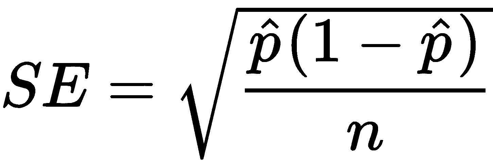
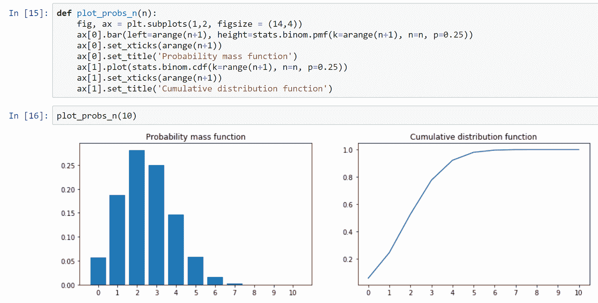
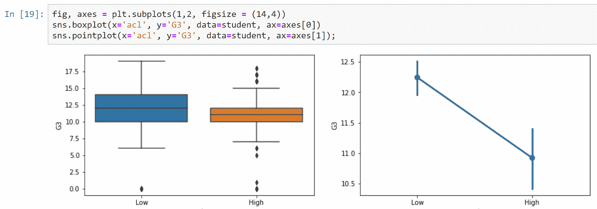
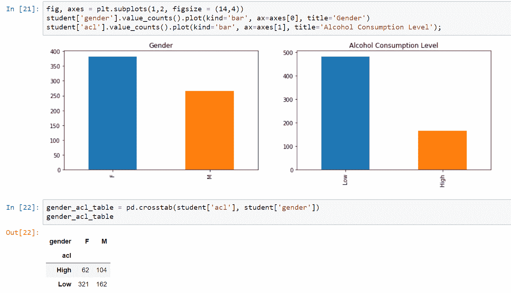
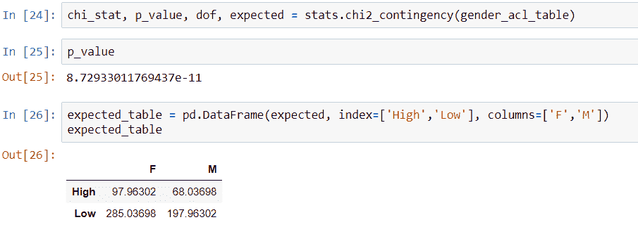
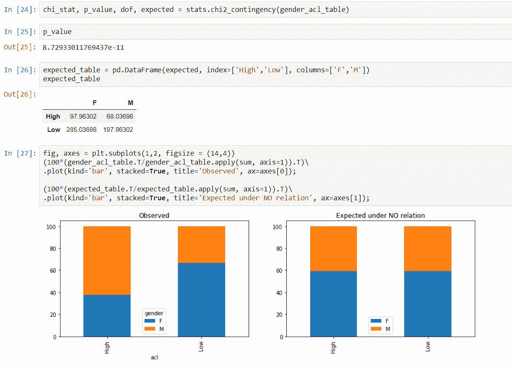

# 五、Python 统计计算

在这一章中，我们将简单介绍一下 Python 的**科学库** ( **SciPy** )，这是 Python 的科学工具箱。我们将获得统计子包的简要概述，并使用它来执行许多统计计算，包括概率、概率分布和置信区间的计算。我们还将在真实数据集上执行假设检验，我们将能够陈述超出我们所拥有的样本的结论。

在本章中，我们将涵盖以下主题:

*   我的天啊
*   统计数字
*   可能性
*   假设检验
*   执行统计测试

# SciPy 简介

SciPy 是一个用 Python 做科学计算的工具。这是一个基于 Python 的生态系统，是一个面向数学、科学和工程的开源软件。它包含各种专用于科学计算中常见问题的工具箱。因此，如果你在任何科学或工程领域工作，你很可能会在 SciPy 的子包中找到进行科学计算所需的工具。以下是 SciPy 的子包:

*   `scipy.io`:这个包提供了一个处理文件输入输出的工具
*   `scipy.special`:这个包提供了一个处理特殊功能的工具
*   `scipy.linalg`:这个包提供了一个处理线性代数运算的工具
*   `scipy.fftpack`:这个包提供了处理快速傅立叶变换的工具
*   `scipy.stats`:这个包提供了一个处理统计和随机数的工具
*   `scipy.interpolate`:这个包提供了一个处理插值的工具
*   `scipy.integrate`:这个包提供了一个处理数值积分的工具
*   `scipy.signal`:这个包提供了一个处理信号处理的工具
*   `scipy.ndimage`:这个包提供了一个处理图像处理的工具

# 统计信息子包

我们可以通过导入名为`stats`的模块来加载或使用统计子包。它是一个包含大量概率分布的子包，以及一个不断增长的统计函数库。这是使用 Python 进行数据分析或数据科学的绝佳工具，因为统计是数据科学的核心。随着本章的深入，我们还将学习如何使用 Python 执行一些常见的统计计算，我们将使用这个统计子包来理解包含葡萄牙学生饮酒信息的数据集。

我们将使用来自 SciPy 的`stats`子包，按照以下顺序执行一些常见的统计计算:

1.  介绍数据集
2.  计算置信区间
3.  执行概率计算

现在我们来看看 Jupyter 笔记本，讨论一下这个项目，是关于学生饮酒的。在这个项目中，我们将使用包含两所公立学校特定学生信息的数据集。这是一个真实的数据集，是为了研究年轻人的饮酒情况及其对学习成绩的影响而收集的。数据集是从学校报告和学生回答的问卷两个来源构建的。

这个数据集有 30 多个变量，它将帮助你提高分析技能。在下面的截图中，我们拥有这个数据集中的所有变量:

*   `school`:这个变量代表学生的学校(二进制:加布里埃尔·佩雷拉`'GP'`或穆辛霍·达·西尔维拉`'MS'`
*   `sex`:这个变量代表学生的性别(二进制:`'F'`为女性或者`'M'`为男性)
*   `age`:这个变量代表学生的年龄(数字:从`15`到`22`
*   `address`:该变量代表学生的家庭住址类型(二进制:`'U'`为城市或`'R'`为农村)
*   `famsize`:该变量表示家庭规模(二进制:`'LE3'`小于或等于`3`或`'GT3'`大于`3`
*   `Pstatus`:该变量代表父母的同居状态(二进制:`'T'`为同居或`'A'`为分居)
*   `Medu`:此变量代表母亲的教育程度(数值:`0`为无，`1`为初等教育(4 <sup>第</sup>年级)`2` —5 <sup>第</sup>至 9 <sup>第</sup>年级，`3`—中等教育或`4`—高等教育)
*   `Fedu`:这个变量代表父亲的学历(数值:`0`为无，`1`为初等教育(4 <sup>第</sup>年级)`2` —5 <sup>第</sup>至 9 <sup>第</sup>年级，`3`为中等教育，或`4`为高等教育)
*   `Mjob`:母亲的工作(名义上:`'teacher'`、`'health'`照顾相关、民事`'services'`(例如，行政或警察)`'at_home'`或`'other'`)
*   `Fjob`:这个变量代表父亲的工作(名义上:`'teacher'`、`'health'`照顾相关、民事`'services'`(例如，行政或警察)`'at_home'`或`'other'`)
*   `reason`:这个变量代表选择这个学校的原因(名义上:接近`'home'`、学校`'reputation'`、`'course'`偏好，或者`'other'`)
*   `guardian`:此变量代表学生的监护人(名义:`'mother'`、`'father'`或`'other'`)
*   `traveltime`:该变量代表从家到学校的旅行时间(数值:1 < 15 分钟，2 和 15 到 30 分钟，3 表示 30 分钟到 1 小时，或 4— > 1 小时)
*   `studytime`:该变量代表每周学习时间(数值:`1` — < 2 小时、`2` —2 至 5 小时、`3` —5 至 10 小时或`4` — > 10 小时)
*   `failures`:这个变量代表过去类失败的次数(数值:如果 1 < =n < 3，否则为 4)
*   `schoolsup`:这个变量代表额外的教育支持(二进制:是或否)
*   `famsup`:此变量代表家庭教育支持(二进制:是或否)
*   `paid`:此变量代表课程科目内的额外付费课程(`Math`或`Portuguese`)(二进制:是或否)
*   `activities`:这个变量代表课外活动(二元:是或否)
*   `nursery`:这个变量代表上过幼儿园(二进制:是或否)
*   `higher`:这个变量代表想接受高等教育(二进制:是或否)
*   `internet`:这个变量代表家里的互联网接入(二进制:是或否)
*   `romantic`:这个变量代表一段浪漫关系(二元:是或否)
*   `famrel`:这个变量代表家庭关系的一个质量(数值:从`1`—非常差到 5—优秀)
*   `freetime`:这个变量代表放学后的空闲时间(数值:从`1`—很低到`5`—很高)
*   `goout`:这个变量代表和朋友出去(数字:从`1`—很低到`5`—很高)
*   `Dalc`:该变量代表工作日饮酒量(数值:从`1`—非常低到`5`—非常高)
*   `Walc`:这个变量代表周末饮酒量(数值:从`1`—非常低到`5`—非常高)
*   `health`:该变量代表当前健康状况(数值:从`1`—非常差到`5`—非常好)
*   `absences`:该变量代表学校缺勤次数(数值:从 0 到 93)

这些等级与课程主题相关，如下所示:

*   `G1`:该等级代表第一期等级(数值:0-20)
*   `G2`:该等级代表第二期等级(数值:0-20)
*   `G3`:该等级代表期末等级(数值:0-20，输出目标)

但是，在本节中，我们对以下三个变量感兴趣:

*   `acl`:我们将从存储酒精消费水平值的数据中创建这个变量
*   `G3`:这个变量是为了存储课程科目的最终成绩而创建的
*   `gender`:这个变量是为了存储学生的性别而创建的

因此，让我们加载数据集，如下图所示:


我们将首先创建酒精消费水平变量，其中我们将创建一个名为`alcohol_index`的中间变量，它只是学生在工作日和周末饮酒量的加权平均值，如以下代码块所示:

```py
student.rename(columns={'sex':'gender'}, inplace=True)
student['alcohol_index'] = (5*student['Dalc'] + 2*student['Walc'])/7
# Alcohol consumption level
student['acl'] = student['alcohol_index'] < = 2
student['acl'] = student['acl'].map({True: 'Low', False: 'High'})
```

然后我们将使用这个`alcohol_index`变量将学生分成小组。如果酒精指数小于等于 2，我们将这个群体称为低酒精消费群体，如果他们的酒精指数大于 2，我们将这个群体称为高酒精消费群体。

# 置信区间

我们将从计算置信区间开始。我们要计算置信区间的第一个变量是最终成绩和我们感兴趣的统计数据，它们是平均值。现在我们来看看这个数据集中的`sample_size`。我们有`649`个观测值，由于样本量大于 30，可以用中心极限定理计算置信区间，如下图截图所示:


统计理论告诉我们，我们可以使用正态分布计算变量平均值的置信区间。为了得到置信区间，我们只需要以下三个数字:

*   我们感兴趣的变量的样本平均值
*   公式的标准误差；标准和样本标准偏差除以样本大小的平方根
*   置信度

既然我们已经知道如何计算样本平均值，让我们在下面的截图中查看它。我们可以看到期末成绩的变量为`G3`，其输出为`11.906009244992296`:


在下面的截图中，我们可以看到这个公式的应用，我们也将计算标准误差。现在我们有了我们需要的前两个数字。为了计算置信区间，我们将使用`stats`子包中的`norm`对象。`norm`对象有一个`interval()`方法，它接收三个输入，它们是我们需要的三个数字:


第一个是我们想要的区间的置信水平`0.95`。它通常是人们使用的号码，但如果有必要，我们可以使用另一个号码。`loc`参数是变量的`sample_mean`，而`scale`参数是我们刚刚计算的`std_error`。我们可以看到最终成绩平均值的 95%置信区间为`11.65745768566587`至`12.154560804318722`。既然我们知道了如何计算平均值、标准误差和范数的置信区间，我们就来看一个例子，看看如何计算比例的置信区间。

我们将使用我们刚刚创建的变量，即酒精消费水平，并查看酒精消费水平高的学生比例的置信区间。计算非常相似；我们需要以下三个数字:

*   样本比例
*   样品标准偏差
*   可信度

在这种情况下，对于该比例，标准误差由以下公式给出:



在上式中，`p-hat`为样品比例。现在，我们来看看酒精消费量高的学生的样本比例。就在`0.255778`附近，如下图截图所示:


我们将调用`high_prop`变量，在下面一行中，我们可以使用公式计算标准误差和置信区间:

```py
high_prop = student['acl'].value_counts(normalize=True)['High']
std_error_prop = sqrt(high_prop*(1-high_prop)/sample_size)
```

但这一次，我们将计算出学生在高酒精消费人群中所占比例的 98%置信区间:


号码从`0.21593666225148048`到`0.29561957811831929`。因此，0.25 似乎是一个很好的猜测，即饮酒量高的学生在人口中所占的比例。

我们必须记住，这些是样本中的计算，我们使用推断统计来说明一些关于人口的情况。

# 概率的计算

现在，让我们假设人口中的数字是 0.25，让我们用这个数字来做一些概率计算。

`stats`包里有几十种概率分布，我们可以用它们来做模拟，计算随机变量，做概率计算。现在让我们看一个例子，回答几个问题。

假设找到一个酒量高的学生的概率是`0.25`，如果我们有一个 10 人的班级，找到 5 个酒量高的学生的概率是多少？

我们知道我们可以使用**二项分布**来计算这个概率。同样在`stats`包中，我们有`binom`对象，它有一个叫做**概率质量函数**或者`pmf`的方法，我们提供`pmf`对于二项式分布所需要的参数。我们感兴趣的是在 10 名学生中找到 5 名饮酒量高的学生的概率，以及`0.25`人口的概率。我们现在将进行计算，并在下面的截图中看到概率:


我们看到这个事件的概率是`0.058399200439453194`。当然，我们可以同时计算许多概率。在下面的截图中，我们看到在 *x* 轴上找到具体学生人数的概率是多少，条的高度是在 10 人的班级中找到这个饮酒量高的学生人数的概率。我们还可以看到，最有可能的数字是在一个 10 人的班级中的两到三个学生之间找到的。另一方面，很难找到一个班级都是酒精消费水平高的学生。我们还可以看到概率质量函数图旁边的累积分布函数图:



因此，我们可以找到累积分布函数，并且我们可以使用来自`binom`分布的`cdf()`方法来计算累积分布函数。

# 假设检验

在这一部分，我们将进行假设检验来回答这个问题:“饮酒会影响学习成绩吗？”。

我们将涵盖以下主题:

*   零假设检验框架
*   对总体方差的相等性进行测试
*   对人口平均数的相等性进行 t 检验

我们将使用这些结果来回答我们提出的问题。我们将使用 Jupyter 笔记本，并对以下步骤进行简要回顾，当我们使用假设检验来回答问题时，通常会遵循这些步骤:

1.  我们将建立两个相互竞争的假设；一个被称为**无效假设**，另一个被称为**替代假设**。决定这些假设的是我们想要回答的问题类型。
2.  我们将预先设置一个显著性水平，称为**α**。研究人员或数据分析师选择的最常见的阿尔法值是 5%或 0.05，但其他流行的选择是 0.01 或 0.1，相当于 10%。
3.  我们将计算 p 值中的检验统计量，然后将这个 p 值与α值进行比较。
4.  然后，我们将转向对零假设做出决定的地方。基于我们对 p 值和显著性水平的比较，我们决定是拒绝还是接受零假设。
5.  最后，我们需要陈述一个关于这些结果对原问题意味着什么的总体结论。

# 执行统计测试

在执行统计测试之前，让我们看看一些统计函数，我们可以使用下面列出的`scipy`包来执行测试:

*   `kurtosistest(a[, axis, nan_policy])`:这个包是用来测试数据集是否有正常峰度的
*   `normaltest(a[, axis, nan_policy])`:此包用于测试样本是否不同于正态分布
*   `skewtest(a[, axis, nan_policy])`:这个包是用来测试偏斜是否不同于正态分布
*   `pearsonr(x, y)`:该软件包用于计算皮尔逊相关系数和 p 值，以测试非相关性
*   `ttest_1samp(a, popmean[, axis, nan_policy])`:此包用于计算一组分数平均值的 t 检验
*   `ttest_1samp(a, popmean[, axis, nan_policy])`:此包用于计算一组分数平均值的 t 检验
*   `ttest_ind(a, b[, axis, equal_var, nan_policy])`:该包用于计算两个独立样本得分均值的 t 检验
*   `ttest_ind_from_stats(mean1, std1, nobs1, ...)`:该包用于对来自描述性统计的两个独立样本的平均值进行 t 检验
*   `ttest_rel(a, b[, axis, nan_policy])`:此包用于计算两个分数相关样本`a`和`b`的 t 检验
*   `kstest(rvs, cdf[, args, N, alternative, mode])`:该包用于执行科尔莫戈罗夫-斯米尔诺夫拟合优度测试。
*   `chisquare(f_obs[, f_exp, ddof, axis])`:此包用于计算单向卡方检验。
*   `ansari(x, y)`:该包用于执行等比例参数的安萨里-布拉德利试验
*   `bartlett(*args)`:该包用于进行等方差的巴特利特检验
*   `levene(*args, **kwds)`:该包用于对等方差进行 Levene 测试
*   `shapiro(x[, a, reta])`:这个包是用来进行夏皮罗-维尔克正态性检验的
*   `anderson(x[, dist])`:这个包用于对来自特定分布的数据进行安德森-达林测试
*   `anderson_ksamp(samples[, midrank])`:该包用于对 k 样本进行安德森-达林测试

这些是我们可以执行的一些最流行的统计测试，如果我们查看`scipy.stats`子包的文档([https://docs.scipy.org](https://docs.scipy.org/doc/scipy/reference/tutorial/stats.html)，我们会发现我们可以做更多的专门测试。

我们将使用这些测试中的一个来回答以下问题:两组学生的总体方差相等吗？。记住我们有两组学生:一组是酒精消费水平低的群体，另一组是酒精消费水平高的群体。由于这是一个关于方差的问题，我们将使用**巴特利特的**检验，其零假设指出总体中的方差相等:


在前面的截图中，我们看到了示例中的差异。它们看起来彼此很接近，但是让我们执行一个正式的测试来得出一些关于总体差异的结论。正如我们在截图中看到的，我们有一个向量，一个低组学生成绩的对象，一个高组学生成绩的向量，还有巴特利特函数。我们唯一要传递给这些函数的是我们刚刚计算的两个向量。现在让我们看看这个测试的结果。

我们对`pvalue`特别感兴趣。我们看到`pvalue`是`0.2937162318117544`，大于我们之前看到的显著性水平:5%，即 0.05。所以，根据这个检验，我们不能拒绝等方差的零假设。所以，我们可以假设这两组分数来自具有相同方差的总体。

在下一个测试中，我们将尝试回答以下问题:饮酒会影响学习成绩吗？。当我们看到数据或样本数据的可视化时，我们会发现两组的分数或平均分数之间有非常明显的差异。在下面的截图中，我们可以看到，酒精消费量低的群体平均比酒精消费量高的群体成绩更高:



让我们建立两个假设。对于这个问题，我们的零假设将是，对于两个组，最终成绩的人口平均值是相等的，而替代假设将是最终成绩的人口平均值实际上是不同的。在执行任何测试之前，请记住所有测试都有一定的假设，下面是我们将用来回答这个问题的测试的三个假设。在这种情况下，您可以验证这三个假设是否得到满足，包括第三个假设，即方差实际相等，我们刚刚通过之前的测试证明了这一点。

为了进行这个 t 检验，我们可以使用`stats`包中的`ttest_ind`功能。我们传递包含每组分数的两个向量，我们给出一个额外的参数，说我们实际上有相等的方差。当我们执行这个测试时，我们得到统计数据和 *p* 值。在下面的截图中我们可以看到`pvalue`很低；是`4.6036088303692686e-06`乘以 10 到-6，这是一个极低的数字:


总之，这是支持替代假说的非常有力的证据，该假说认为，当我们比较这两组人时，年级中的人口意味着实际上是不同的。所以这就是我们的总体结论:两个被分析组的成绩在统计学上有显著差异。由于高饮酒组的平均值小于另一组的平均值，结果表明饮酒对学生的学习成绩有负面影响。

现在我们用假设检验来回答以下问题:*男性青少年饮酒量是否大于女性青少年*？。让我们来看看以下主题:

*   对应急表进行卡方检验
*   两个分类变量之间关系的可视化

那么，我们来看看下面截图中的 Jupyter Notebook 来回答这个问题:男性青少年比女性青少年饮酒多吗？，同时参考以下截图:



在前面的截图中，我们看到我们的女性比男性多，我们有更多的学生饮酒量低。执行或计算所谓的**列联表**或**交叉列表**表的方法有很多。我们将使用`pandas`中的`crosstab`函数，我们将传递两个系列，我们得到的是每个类别的计数。当考虑这两个分类变量时，我们还有四种可能的分类。所以这个群体中有大量饮酒的`62`女性和`104`男性。我们还统计了低饮酒女性和男性的人数。让我们看看下面的截图，把这些数字形象化；我们可以看到比例，也可以看到绝对计数:


在前面的截图中，我们可以看到，低消费群体中女性比例的可视化远远大于男性比例，另一方面，对于高消费群体，男性比例要大得多。所以看起来这两个变量之间是有关系的，我们在样本中肯定是有关系的。我们想回答的关于人口的问题是:*我们能说这种关系适用于人口*吗？为了回答这个问题，我们必须进行假设检验，如下图所示:



在前面的截图中，我们看到我们在这种情况下将使用的函数来自`stats`包，叫做`chi2_contingency `。我们将传递之前生成的应急表。这个函数会还给我们很多对象，比如`chi-square statistic`、`p_value`、自由度，也叫`dof`，以及一个空假设下的期望值表。在这种情况下，零假设是人口中这两个变量之间没有关系。现在让我们运行这个测试，看看下面截图中显示的输出:



我们来看看前面截图中的`p_value`对象。我们可以看到很低:`8.7293301176943706e-11`乘以 10 到-11。这实际上是支持替代假设的很好的证据。在这种情况下，替代假设指出这两个变量之间实际上存在关系。这里另一个有趣的对象是`expected`。这给了我们预期的频率，我们已经观察到，如果零假设是真的。我们必须记住，这个测试的零假设是两个变量之间没有关系。因此，我们可以在[32]中想象如果人群中没有关系，我们的数据会是什么样子，并进行比较。因此，这作为额外的证据向我们展示了男性青少年饮酒习惯和女性青少年饮酒习惯之间的区别。我们可以看到男性青少年喝得更多。

# 摘要

在本章中，我们首先介绍了 SciPy。然后，我们简要概述了可供我们使用的各种子包。我们学习了如何使用`scipy.stats`包进行独立性卡方检验。我们使用这个包来执行其他计算，例如置信区间、概率计算和其他类型的统计测试。

在下一章中，我们将介绍预测性分析模型、机器学习、`scikit-learn`库等等。敬请关注！