# 第二章：*第一章*

# Python 数据科学栈

## 学习目标

我们将通过理解 Python 在数据操作和可视化中的强大能力，开启我们的学习之旅，进行有用的分析。

到本章结束时，你将能够：

+   使用 Python 数据科学栈的所有组件

+   使用 pandas DataFrame 操作数据

+   使用 pandas 和 Matplotlib 创建简单的图表

在本章中，我们将学习如何使用 NumPy、Pandas、Matplotlib、IPython、Jupyter notebook。稍后我们将探讨`virtualenv`、`pyenv`的部署方式，紧接着我们将使用 Matplotlib 和 Seaborn 库绘制基本的可视化图表。

## 引言

Python 数据科学栈是一个非正式的名称，用来描述一组协同工作的库，用于解决数据科学问题。关于哪些库应当列入此名单，并没有统一的标准；通常这取决于数据科学家和待解决的问题。我们将介绍最常用的库，并解释如何使用它们。

在本章中，我们将学习如何使用 Python 数据科学栈来操作表格数据。Python 数据科学栈是处理大规模数据集的第一步，尽管这些库本身通常不用于大数据处理。这里使用的思想和方法将对我们后续处理大数据集时非常有帮助。

## Python 库和包

Python 之所以是一门强大的编程语言，其中一个重要原因就是它所附带的库和包。**Python 包索引**（**PyPI**）中有超过 130,000 个包，且这个数字还在增长！让我们一起来探索一些数据科学栈中的库和包。

数据科学栈的组件如下：

+   **NumPy**：一个数值计算库

+   **pandas**：一个数据操作和分析库

+   **SciPy 库**：建立在 NumPy 基础上的一组数学算法

+   **Matplotlib**：一个绘图和图表库

+   **IPython**：一个交互式 Python shell

+   **Jupyter notebook**：用于交互式计算的 Web 文档应用

这些库的组合构成了一个强大的工具集，用于处理数据操作和分析。我们将逐一介绍每个库，探索它们的功能，并展示它们是如何协同工作的。让我们从解释器开始。

### IPython：一个强大的交互式 shell

IPython shell（[`ipython.org/`](https://ipython.org/)）是一个交互式 Python 命令解释器，支持多种语言。它允许我们快速测试想法，而不需要创建文件并运行它们。大多数 Python 安装包中都会包含一个命令解释器，通常被称为**shell**，你可以在其中逐行执行命令。尽管很方便，但标准的 Python shell 使用起来有些繁琐。IPython 提供了更多的功能：

+   会话之间的输入历史记录功能，确保你在重启 shell 后，之前输入的命令可以被重新使用。

+   使用*Tab*自动补全命令和变量，你可以输入 Python 命令、函数或变量的首字母，IPython 会自动补全它。

+   魔法命令扩展了 shell 的功能。魔法函数可以增强 IPython 的功能，例如添加一个模块，可以在模块在磁盘上被修改后重新加载，而不需要重启 IPython。

+   语法高亮。

### 练习 1：使用 IPython 命令与 Python Shell 交互

启动 Python shell 很简单。让我们按照以下步骤与 IPython shell 互动：

1.  要启动 Python shell，请在控制台中输入`ipython`命令：

    ```py
    > ipython
    In [1]:
    ```

    IPython shell 现在已准备好，等待进一步的命令。首先，让我们做一个简单的练习，解决一个排序问题，使用一种基本的排序方法，称为**直接插入法**。

1.  在 IPython shell 中，复制并粘贴以下代码：

    ```py
    import numpy as np
    vec = np.random.randint(0, 100, size=5)
    print(vec)
    ```

    现在，随机生成的数字的输出将类似于以下内容：

    ```py
    [23, 66, 12, 54, 98, 3]
    ```

1.  使用以下逻辑按升序打印`vec`数组的元素：

    ```py
    for j in np.arange(1, vec.size):
        v = vec[j]
        i = j
        while i > 0 and vec[i-1] > v:
            vec[i] = vec[i-1]
            i = i - 1
        vec[i] = v
    ```

    使用`print(vec)`命令在控制台打印输出：

    ```py
    [3, 12, 23, 54, 66, 98]
    ```

1.  现在修改代码。将参数从创建一个包含 5 个元素的数组更改为创建一个包含 20 个元素的数组，使用*上*箭头编辑粘贴的代码。修改相关部分后，使用*下*箭头移动到代码的末尾并按*Enter*键执行。

注意左侧的数字，表示指令编号。这个数字会一直增加。我们将值赋给一个变量并对该变量执行操作，得到交互式结果。我们将在接下来的章节中使用 IPython。

### Jupyter Notebook

Jupyter notebook ([`jupyter.org/`](https://jupyter.org/)) 最初作为 IPython 的一部分，但在版本 4 中被分离并扩展，现在作为一个独立的项目存在。Notebook 概念基于扩展交互式 shell 模型，创建可以运行代码、显示文档并展示结果（如图表和图像）的文档。

Jupyter 是一个 Web 应用程序，因此它直接在 Web 浏览器中运行，无需安装单独的软件，且可以在互联网上使用。Jupyter 可以使用 IPython 作为运行 Python 的内核，但它支持超过 40 个由开发者社区贡献的内核。

#### 注意

在 Jupyter 的术语中，内核是执行代码单元中的代码的计算引擎。例如，IPython 内核执行 notebook 中的 Python 代码。也有其他语言的内核，如 R 和 Julia。

它已经成为一个事实上的平台，从初学者到高级用户，从小型到大型企业，甚至是学术界，都可以用它来执行与数据科学相关的操作。在过去的几年里，它的受欢迎程度大幅度提高。一个 Jupyter notebook 包含你在其上运行的代码的输入和输出。它支持文本、图像、数学公式等，是一个开发代码和交流结果的绝佳平台。由于它的 Web 格式，notebook 可以通过互联网共享。它还支持 Markdown 标记语言，并将 Markdown 文本渲染为富文本，支持格式化及其他特性。

正如我们之前所见，每个 notebook 都有一个内核。这个内核是执行单元格中代码的解释器。一个 notebook 的基本单位叫做**单元格**。单元格是一个容器，可以容纳代码或文本。我们有两种主要类型的单元格：

+   **代码单元格**

+   **Markdown 单元格**

代码单元格接受要在内核中执行的代码，并在其下方显示输出。Markdown 单元格接受 Markdown，当单元格执行时，会将文本解析为格式化文本。

让我们运行以下练习，获得在 Jupyter notebook 中的实际操作经验。

一个 notebook 的基本组件是单元格，单元格根据选择的模式可以接受代码或文本。

让我们启动一个 notebook，演示如何使用单元格，单元格有两种状态：

+   编辑模式

+   运行模式

在编辑模式下，单元格的内容可以编辑，而在运行模式下，单元格准备好执行，可以由内核执行或被解析为格式化文本。

你可以通过使用**插入**菜单选项或使用键盘快捷键*Ctrl* + *B*来添加新单元格。单元格可以通过菜单或快捷键*Y*（代码单元格）和*M*（Markdown 单元格）在 Markdown 模式和代码模式之间转换。

要执行一个单元格，点击**运行**选项或使用*Ctrl* + *Enter*快捷键。

### 练习 2：开始使用 Jupyter Notebook

让我们执行以下步骤，演示如何开始在 Jupyter notebook 中执行简单的程序。

第一次使用 Jupyter notebook 可能会有些困惑，但让我们尝试探索它的界面和功能。这个练习的参考 notebook 可以在 GitHub 上找到。

现在，启动一个 Jupyter notebook 服务器并按照以下步骤进行操作：

1.  要启动 Jupyter notebook 服务器，在控制台运行以下命令：

    ```py
    > jupyter notebook
    ```

1.  成功运行或安装 Jupyter 后，打开浏览器窗口并访问[`localhost:8888`](http://localhost:8888)来访问 notebook。

1.  你应该能看到一个类似于以下截图的 notebook：图 1.1：Jupyter notebook

    ###### 图 1.1：Jupyter notebook

1.  接下来，在右上角点击**新建**，从列表中选择**Python 3**。

1.  一个新的 notebook 应该会出现。首先出现的输入单元格是 **代码** 单元格。默认单元格类型是 **代码**。你可以通过 **单元格** 菜单下的 **单元格类型** 选项来更改它：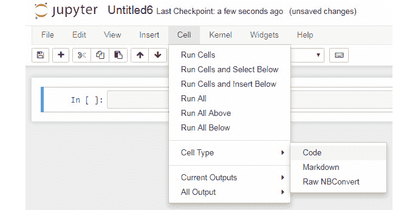

    ###### 图 1.2：Jupyter 单元格菜单中的选项

1.  现在，在新生成的 **代码** 单元格中，在第一个单元格中添加以下算术函数：

    ```py
    In []: x = 2
           print(x*2)
    Out []: 4
    ```

1.  现在，添加一个返回两个数字算术平均值的函数，然后执行该单元格：

    ```py
    In []: def mean(a,b):
           return (a+b)/2
    ```

1.  现在，使用 `mean` 函数，并用两个值 10 和 20 调用该函数。执行此单元格。会发生什么？函数被调用，答案会被打印出来：

    ```py
    In []: mean(10,20)
    Out[]: 15.0
    ```

1.  我们需要记录这个函数。现在，创建一个新的 Markdown 单元格，并编辑单元格中的文本，记录该函数的功能：

    ###### 图 1.3：Jupyter 中的 Markdown

1.  然后，插入一个来自网络的图片。其目的是 notebook 作为一个文档，应该记录分析的所有部分，因此有时我们需要从其他来源插入一个图表或图形来解释某个观点。

1.  现在，最后在同一个 Markdown 单元格中插入 **LaTex** 数学表达式：


###### 图 1.4：Jupyter Markdown 中的 LaTex 表达式

正如我们将在本书其余部分看到的，notebook 是我们分析过程的基石。我们刚才遵循的步骤展示了不同类型单元格的使用及我们记录分析过程的不同方式。

### IPython 或 Jupyter？

IPython 和 Jupyter 在分析工作流中都有其作用。通常，IPython shell 用于快速交互和更为数据密集的工作，如调试脚本或运行异步任务。而 Jupyter notebook 则非常适合用来展示结果，并通过代码、文本和图形生成可视化叙事。我们将展示的大多数示例都可以在这两者中执行，除了图形部分。

IPython 能显示图形，但通常图形的加入在 notebook 中更为自然。在本书中，我们通常使用 Jupyter notebook，但这些指令同样适用于 IPython notebook。

### 活动 1：IPython 和 Jupyter

让我们展示在 IPython 和 Jupyter 中常见的 Python 开发。我们将导入 NumPy，定义一个函数，并迭代结果：

1.  打开 `python_script_student.py` 文件，在文本编辑器中复制其内容，粘贴到 IPython 的 notebook 中，并执行操作。

1.  将 Python 脚本中的代码复制并粘贴到 Jupyter notebook 中。

1.  现在，更新 `x` 和 `c` 常量的值。然后，修改函数的定义。

    #### 注意

    该活动的解决方案可以在第 200 页找到。

现在我们已经知道如何在 notebook 中处理函数并动态更改函数定义。当我们在探索和发现某段代码或分析的正确方法时，这非常有帮助。Notebook 支持的迭代方法在原型设计中非常高效，并且比写代码到脚本中再执行、检查结果并重新修改脚本要更快。

### NumPy

NumPy ([`www.numpy.org`](http://www.numpy.org)) 是一个来自 Python 科学计算社区的包。NumPy 非常适合操作多维数组，并对这些数组应用线性代数函数。它还具备与 C、C++ 和 Fortran 代码集成的工具，进一步提高了性能。许多使用 NumPy 作为数值引擎的 Python 包，包括 pandas 和 scikit-learn，都是 SciPy 生态系统的一部分，专门用于数学、科学和工程领域。

要导入这个包，请打开之前活动中使用的 Jupyter notebook，并输入以下命令：

```py
import numpy as np
```

基本的 NumPy 对象是 `ndarray`，它是一个同质的多维数组，通常由数字组成，但也可以存储通用数据。NumPy 还包含多个用于数组操作、线性代数、矩阵运算、统计学和其他领域的函数。NumPy 的一个亮点是在科学计算中，矩阵和线性代数操作非常常见。NumPy 的另一个优势是它可以与 C++ 和 FORTRAN 代码集成。NumPy 也被其他 Python 库广泛使用，如 pandas。

### SciPy

**SciPy** ([`www.scipy.org`](https://www.scipy.org)) 是一个数学、科学和工程学的库生态系统。NumPy、SciPy、scikit-learn 等都是这个生态系统的一部分。它也是一个库的名称，包含了许多科学领域的核心功能。

### Matplotlib

**Matplotlib** ([`matplotlib.org`](https://matplotlib.org)) 是一个用于 Python 的二维图形绘制库。它能够生成多种硬拷贝格式的图形，供互动使用。它可以使用原生 Python 数据类型、NumPy 数组和 pandas DataFrame 作为数据源。Matplotlib 支持多个后端——支持互动或文件格式输出的部分。这使得 Matplotlib 可以跨平台运行。这种灵活性还允许 Matplotlib 扩展工具包，用于生成其他类型的图形，例如地理图和 3D 图形。

Matplotlib 的交互式界面灵感来自 MATLAB 的绘图界面。可以通过 `matplotlib.pyplot` 模块访问。文件输出可以直接写入磁盘。Matplotlib 可以在脚本、IPython 或 Jupyter 环境中使用，也可以在 Web 服务器和其他平台中使用。Matplotlib 有时被认为是低级的，因为生成包含更多细节的图表需要多行代码。在本书中，我们将介绍一个常用于分析中的绘图工具——**Seaborn** 库，它是我们之前提到的扩展之一。

要导入交互式界面，请在 Jupyter notebook 中使用以下命令：

```py
import matplotlib.pyplot as plt
```

要访问绘图功能，我们将在下一章中更详细地展示如何使用 Matplotlib。

### Pandas

**Pandas** ([`pandas.pydata.org`](https://pandas.pydata.org)) 是一个广泛用于数据科学社区的数据操作和分析库。Pandas 旨在处理类似 SQL 表格和 Excel 文件的表格型或标签型数据。

我们将更详细地探讨 pandas 提供的各种操作。现在，了解两个基本的 pandas 数据结构非常重要：**series**，一种一维数据结构；以及数据科学的工作马——二维数据结构 **DataFrame**，它支持索引。

DataFrame 和 series 中的数据可以是有序的或无序的，既可以是同质的，也可以是异质的。pandas 的其他优秀功能包括轻松添加或删除行和列，以及 SQL 用户更熟悉的操作，如 GroupBy、连接、子集提取和索引列。Pandas 在处理时间序列数据方面也非常强大，具有易用且灵活的日期时间索引和选择功能。

让我们使用以下命令在之前的 Jupyter notebook 中导入 pandas：

```py
import pandas as pd
```

## 使用 Pandas

我们将演示如何使用 pandas 进行数据操作。这个方法被作为其他数据操作工具（如 Spark）的标准，因此学习如何使用 pandas 操作数据是很有帮助的。在大数据管道中，常常将部分数据或数据样本转换为 pandas DataFrame，以应用更复杂的转换、可视化数据，或使用更精细的机器学习模型（例如 `scikit-learn` 库）。Pandas 在内存中进行单机操作时也非常快速。尽管数据大小与 pandas DataFrame 之间存在内存开销，但它仍然可以快速操作大量数据。

我们将学习如何应用基本操作：

+   将数据读取到 DataFrame 中

+   选择和过滤

+   将函数应用于数据

+   GroupBy 和聚合

+   可视化来自 DataFrame 的数据

让我们从将数据读取到 pandas DataFrame 开始。

### 读取数据

Pandas 支持多种数据格式和数据导入方式。我们从更常见的方式开始，读取一个 CSV 文件。Pandas 有一个名为 `read_csv` 的函数，可以用来读取 CSV 文件，无论是本地文件还是来自 URL 的文件。我们将从美国环保局（EPA）的 Socrata 开放数据计划中读取一些数据，这些数据列出了 EPA 收集的放射性物质含量。

### 练习 3：使用 Pandas 读取数据

一个分析师如何在没有数据的情况下开始数据分析？我们需要学习如何将数据从互联网源导入到我们的笔记本中，才能开始分析。让我们展示如何使用 pandas 从互联网源读取 CSV 数据，以便我们进行分析：

1.  导入 pandas 库。

    ```py
    import pandas as pd
    ```

1.  读取**汽车里程数据集**，可通过以下 URL 获取：[`github.com/TrainingByPackt/Big-Data-Analysis-with-Python/blob/master/Lesson01/imports-85.data`](https://github.com/TrainingByPackt/Big-Data-Analysis-with-Python/blob/master/Lesson01/imports-85.data)。将其转换为 CSV 格式。

1.  使用列名为数据命名，通过 `read_csv` 函数中的 `names` 参数。

    ```py
    Sample code : df = pd.read_csv("/path/to/imports-85.csv", names = columns)
    ```

1.  使用 pandas 的 `read_csv` 函数并通过调用 DataFrame 的 `head` 方法显示前几行：

    ```py
    import pandas as pd
    df = pd.read_csv("imports-85.csv")
    df.head()
    ```

    输出如下：

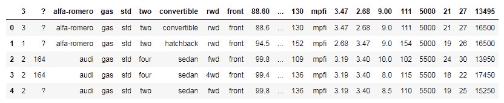

###### 图 1.5：汽车里程数据集的条目

Pandas 可以读取更多格式：

+   JSON

+   Excel

+   HTML

+   HDF5

+   Parquet（使用 PyArrow）

+   SQL 数据库

+   Google Big Query

尝试从 pandas 中读取其他格式，如 Excel 表格。

### 数据处理

数据处理是指对数据进行任何选择、转换或聚合操作。数据处理可以出于多种原因进行：

+   选择一个数据子集进行分析

+   清洗数据集，移除无效、错误或缺失的值

+   将数据分组为有意义的集合并应用聚合函数

Pandas 的设计旨在让分析师以高效的方式进行这些转换。

### **选择与过滤**

Pandas DataFrame 可以像 Python 列表一样进行切片。例如，要选择 DataFrame 的前 10 行子集，可以使用 `[0:10]` 语法。在以下截图中，我们看到选择 `[1:3]` 区间，NumPy 表示法选择了行 `1` 和 `2`。

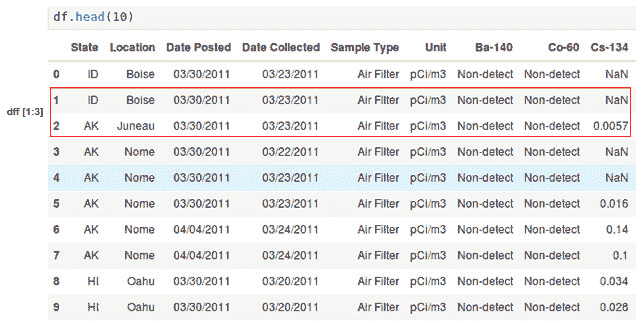

###### 图 1.6：Pandas DataFrame 中的选择

在接下来的章节中，我们将深入探讨选择与过滤操作。

### **使用切片选择行**

在进行数据分析时，我们通常希望查看数据在特定条件下的不同表现，例如比较几列数据、选择仅有几列帮助阅读数据，或进行绘图。我们可能想查看特定值，例如当一列具有特定值时，其他数据的表现如何。

在使用切片选择之后，我们可以使用其他方法，例如 `head` 方法，从数据框的开头只选择几行。但如何选择数据框中的某些列呢？

要选择一列，只需使用列名。我们将使用 notebook。使用以下命令选择数据框中的 `cylinders` 列：

```py
df['State']
```

输出如下：


###### 图 1.7：显示状态的数据显示框

另一种选择方式是通过列中的特定值进行筛选。例如，假设我们想选择所有`State`列中值为`MN`的行。我们该如何做呢？尝试使用 Python 的相等运算符和数据框选择操作：

```py
df[df.State == "MN"]
```

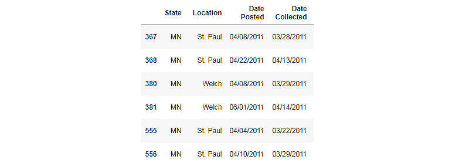

###### 图 1.8：显示 MN 状态的数据显示框

可以同时应用多个筛选器。当组合多个筛选器时，可以使用 `OR`、`NOT` 和 `AND` 逻辑运算符。例如，要选择所有 `State` 等于 `AK` 且 `Location` 为 `Nome` 的行，请使用 `&` 运算符：

```py
df[(df.State == "AK") & (df.Location == "Nome")]
```

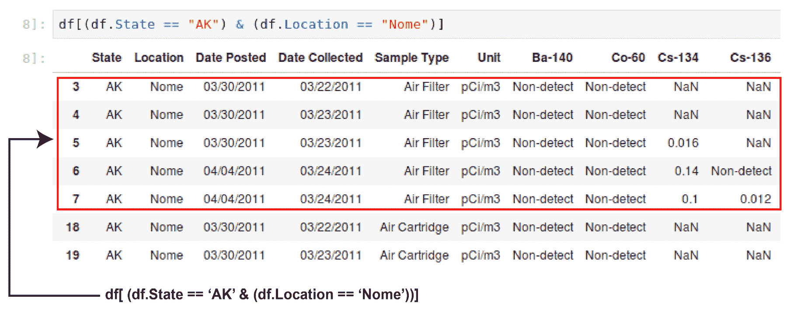

###### 图 1.9：显示状态为 AK 和位置为 Nome 的数据框

另一个强大的方法是 `.loc`。该方法有两个参数，一个是行选择，另一个是列选择，能够实现精细的选择。此时一个重要的注意事项是，根据所应用的操作，返回的类型可以是数据框或系列。当只选择一列时，`.loc` 方法返回一个系列。这是预期的，因为每个数据框列本身就是一个系列。当需要选择多个列时，也需要特别注意。为此，可以使用两个括号而不是一个，选择你想要的多个列。

### 练习 4：数据选择和 .loc 方法

正如我们之前看到的，选择数据、分离变量并查看感兴趣的列和行是分析过程的基础。假设我们想分析`I-131`在`明尼苏达州`的辐射：

1.  在 Jupyter notebook 中使用以下命令导入 NumPy 和 pandas 库：

    ```py
    import numpy as np
    import pandas as pd
    ```

1.  从 EPA 获取 RadNet 数据集，该数据集可以从 Socrata 项目的[`github.com/TrainingByPackt/Big-Data-Analysis-with-Python/blob/master/Lesson01/RadNet_Laboratory_Analysis.csv`](https://github.com/TrainingByPackt/Big-Data-Analysis-with-Python/blob/master/Lesson01/RadNet_Laboratory_Analysis.csv)下载：

    ```py
    url = "https://opendata.socrata.com/api/views/cf4r-dfwe/rows.csv?accessType=DOWNLOAD"
    df = pd.read_csv(url)
    ```

1.  首先，使用 `['<列名>']` 符号选择一列。选择 `State` 列：

    ```py
    df['State'].head()
    ```

    输出如下：

    

    ###### 图 1.10：状态列中的数据

1.  现在，使用 `MN` 列名筛选所选列中的值：

    ```py
    df[df.State == "MN"]
    ```

    输出如下：

    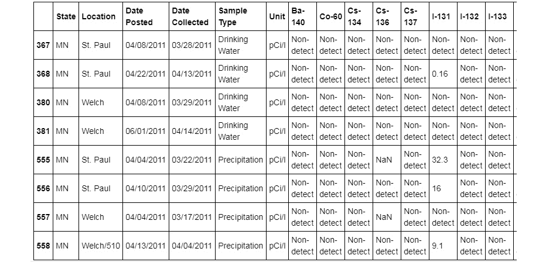

    ###### 图 1.11：显示包含 MN 状态的数据显示框

1.  根据条件选择多个列。为过滤添加`Sample Type`列：

    ```py
    df[(df.State == 'CA') & (df['Sample Type'] == 'Drinking Water')]
    ```

    输出如下：

    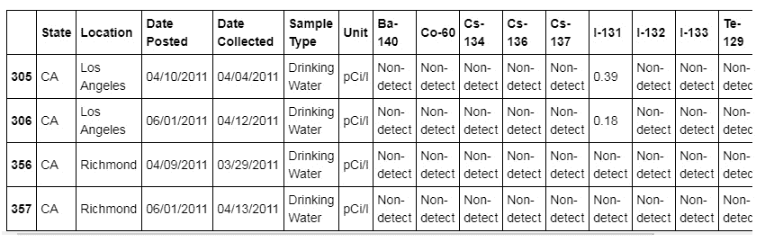

    ###### 图 1.12：具有加利福尼亚州和样本类型为饮用水的 DataFrame

1.  接下来，选择`MN`州和同位素`I-131`：

    ```py
    df[(df.State == "MN") ]["I-131"]
    ```

    输出如下：

    

    ###### 图 1.13：显示具有明尼苏达州和同位素 I-131 的 DataFrame 数据

    明尼苏达州（ID 为`555`）的辐射值最高。

1.  我们可以更轻松地使用`.loc`方法，通过州进行过滤，并在同一`.loc`调用中选择一列：

    ```py
    df_rad.loc[df_rad.State == "MN", "I-131"]
    df[['I-132']].head()
    ```

    输出如下：


###### 图 1.14：包含 I-132 的 DataFrame

在这个练习中，我们学习了如何使用 NumPy 切片表示法或`.loc`方法来过滤和选择值，无论是在列还是行上。这可以帮助我们在分析数据时，仅检查和操作数据的一个子集，而不必一次性处理整个数据集。

#### 注意

`.loc`筛选的结果是一个`.loc`对象。因为 DataFrame 可以被理解为一个二维的系列组合，选择一列将返回一个系列。为了使选择仍然返回一个 DataFrame，请使用双括号：

`df[['I-132']].head()`

### **对列应用函数**

数据永远不会是干净的。在数据集可以被分析之前，总是需要做一些清理工作。数据清理中最常见的任务之一是对列应用一个函数，将值更改为更合适的值。在我们的示例数据集中，当没有测量浓度时，会插入`non-detect`值。由于这一列是数字型的，分析它可能会变得复杂。我们可以对该列应用转换，将`non-detect`更改为`numpy.NaN`，这使得操作数值更为简单，之后可以填充其他值，比如均值等。

要对多个列应用函数，请使用`applymap`方法，其逻辑与`apply`方法相同。例如，另一个常见的操作是去除字符串中的空格。我们可以使用`apply`和`applymap`函数来修复数据。我们还可以将函数应用于行而不是列，使用 axis 参数（`0`表示行，`1`表示列）。

### 活动 2：处理数据问题

在开始分析之前，我们需要检查数据问题，当我们发现问题时（这非常常见！），我们必须通过转换 DataFrame 来纠正问题。例如，可以通过对某一列或整个 DataFrame 应用函数来解决问题。通常，DataFrame 中的一些数字在读取时未能正确转换为浮点数。我们可以通过应用函数来修复这个问题：

1.  导入`pandas`和`numpy`库。

1.  从美国环保局读取 RadNet 数据集。

1.  创建一个包含 RadNet 数据集中放射性核素的数字列的列表。

1.  对单列使用`apply`方法，配合 lambda 函数比较`Non-detect`字符串。

1.  将某一列中的文本值替换为`NaN`，使用`np.nan`。

1.  使用相同的 lambda 比较方法，并在多个列上同时使用`applymap`方法，使用第一步中创建的列表。

1.  创建一个包含所有非数字列的列表。

1.  删除这些列中的空格。

1.  使用选择和过滤方法，验证字符串列的列名中是否还存在空格。

    #### 注意

    该活动的解决方案可以在第 200 页找到。

列名中的空格可能是多余的，且会使选择和过滤变得更加复杂。修正数字类型对于需要使用数据计算统计值时非常有帮助。如果某个数字列中的值不合法，例如一个数字列中有字符串，统计操作将无法执行。例如，在数据输入过程中，操作员手动输入信息时可能会出错，或者存储文件从一种格式转换为另一种格式时，导致列中留下了不正确的值。

## 数据类型转换

数据清理中的另一个常见操作是确保数据类型正确。这有助于检测无效值并应用正确的操作。pandas 中主要存储的类型如下：

+   `float`（`float64`、`float32`）

+   `integer`（`int64`、`int32`）

+   `datetime`（`datetime64[ns, tz]`）

+   `timedelta`（`timedelta[ns]`）

+   `bool`

+   `object`

+   `category`

数据类型可以通过 pandas 进行设置、读取或推断。通常，如果 pandas 无法检测到列的数据类型，它会假设该列是存储为字符串的对象类型。

为了将数据转换为正确的数据类型，我们可以使用转换函数，如`to_datetime`、`to_numeric`或`astype`。类别类型，即只能选择有限选项的列，会被编码为`category`类型。

### 练习 5：探索数据类型

使用 pandas 的`astype`函数将我们示例数据框中的数据类型转换为正确的类型。我们将使用来自[`opendata.socrata.com/`](https://opendata.socrata.com/)的示例数据集：

1.  按照此处所示导入所需的库：

    ```py
    import numpy as np
    import pandas as pd
    import matplotlib.pyplot as plt
    import seaborn as sns
    ```

1.  按如下方式读取数据集中的数据：

    ```py
    url = "https://opendata.socrata.com/api/views/cf4r-dfwe/rows.csv?accessType=DOWNLOAD"
    df = pd.read_csv(url)
    ```

1.  使用`dtypes`函数检查 DataFrame 的当前数据类型：

    ```py
    df.dtypes
    ```

1.  使用`to_datetime`方法将日期从字符串格式转换为`datetime`格式：

    ```py
    df['Date Posted'] = pd.to_datetime(df['Date Posted'])
    df['Date Collected'] = pd.to_datetime(df['Date Collected'])
    columns = df.columns
    id_cols = ['State', 'Location', "Date Posted", 'Date Collected', 'Sample Type', 'Unit']
    columns = list(set(columns) - set(id_cols))
    columns
    ```

    输出结果如下：

    ```py
    ['Co-60',
     'Cs-136',
     'I-131',
     'Te-129',
     'Ba-140',
     'Cs-137',
     'Cs-134',
     'I-133',
     'I-132',
     'Te-132',
     'Te-129m']
    ```

1.  使用 Lambda 函数：

    ```py
    df['Cs-134'] = df['Cs-134'].apply(lambda x: np.nan if x == "Non-detect" else x)
    df.loc[:, columns] = df.loc[:, columns].applymap(lambda x: np.nan if x == 'Non-detect' else x)
    df.loc[:, columns] = df.loc[:, columns].applymap(lambda x: np.nan if x == 'ND' else x)
    ```

1.  使用`to_numeric`方法对前一个活动中创建的数字列列表应用，转换列为正确的数字类型：

    ```py
    for col in columns:
        df[col] = pd.to_numeric(df[col])
    ```

1.  再次检查列的数据类型。数字列应该是`float64`类型，日期列应该是`datetime64[ns]`类型：

    ```py
    df.dypes
    ```

1.  使用`astype`方法将非数字列转换为`category`类型：

    ```py
    df['State'] = df['State'].astype('category')
    df['Location'] = df['Location'].astype('category')
    df['Unit'] = df['Unit'].astype('category')
    df['Sample Type'] = df['Sample Type'].astype('category')
    ```

1.  最后一次使用`dtype`函数检查数据类型：

    ```py
    df.dtypes
    ```

    输出结果如下：

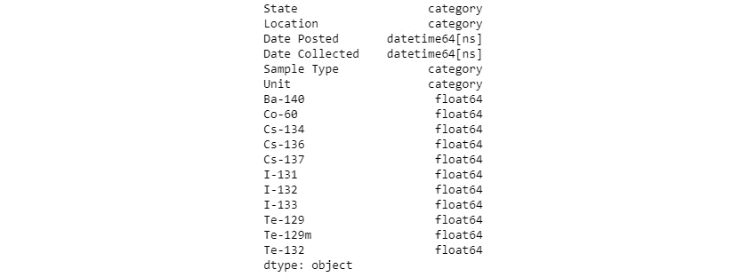

###### 图 1.15：DataFrame 及其类型

现在我们的数据集看起来不错，所有值都已正确转换为正确的数据类型。但数据修正只是其中的一部分。作为分析师，我们希望从不同的角度理解数据。例如，我们可能想知道哪个州的污染最严重，或者哪种放射性核素在各城市中最不常见。我们可能会问数据集中有效测量的数量。所有这些问题都有一个共同点，那就是涉及对数据进行分组并聚合多个值的转换。使用 pandas，我们可以通过 `GroupBy` 来实现这一点。让我们看看如何按键进行分组并聚合数据。

## 聚合与分组

在获得数据集后，分析师可能需要回答一些问题。例如，我们知道每个城市的放射性核素浓度，但分析师可能会被要求回答：平均而言，哪个州的放射性核素浓度最高？

为了回答提出的问题，我们需要以某种方式对数据进行分组，并对其进行聚合计算。但在进入数据分组之前，我们需要准备数据集，以便能够以高效的方式进行操作。在 pandas 的 DataFrame 中获得正确的数据类型可以极大地提高性能，并有助于执行数据一致性检查—它确保数值数据确实是数值数据，并允许我们执行所需的操作来获得答案。

`GroupBy` 允许我们从更一般的角度查看特征，通过给定 `GroupBy` 键和聚合操作来排列数据。在 pandas 中，这个操作是通过 `GroupBy` 方法完成的，操作的列可以是例如 State。请注意 `GroupBy` 方法后的聚合操作。以下是一些可以应用的操作示例：

+   `mean`

+   `median`

+   `std` (**标准差**)

+   `mad` (**均值绝对偏差**)

+   `sum`

+   `count`

+   `abs`

    #### 注

    一些统计量，例如 **均值** 和 **标准差**，只有在数值数据的情况下才有意义。

应用 `GroupBy` 后，可以选择特定的列并对其应用聚合操作，或者可以对所有剩余的列使用相同的聚合函数进行聚合。像 SQL 一样，`GroupBy` 可以同时应用于多列，并且可以对选定的列应用多个聚合操作，每列一个操作。

Pandas 中的 `GroupBy` 命令有一些选项，例如 `as_index`，可以覆盖将分组键的列转换为索引并将其保留为普通列的标准。当在 `GroupBy` 操作后将创建新索引时，这很有帮助，例如。

聚合操作可以在多个列上同时进行，并且使用 `agg` 方法可以同时应用不同的统计方法，通过传递一个字典，字典的键是列名，值是统计操作的列表。

### 练习 6：聚合和分组数据

记住，我们需要回答哪个州的放射性核素浓度平均值最高。由于每个州有多个城市，我们需要将一个州内所有城市的值合并并计算平均值。这是 `GroupBy` 的一个应用：按分组计算一个变量的平均值。我们可以使用 `GroupBy` 来回答这个问题：

1.  导入所需的库：

    ```py
    import numpy as np
    import pandas as pd
    import matplotlib.pyplot as plt
    import seaborn as sns
    ```

1.  从 [`opendata.socrata.com/`](https://opendata.socrata.com/) 加载数据集：

    ```py
    df = pd.read_csv('RadNet_Laboratory_Analysis.csv')
    ```

1.  使用 `State` 列对 DataFrame 进行分组。

    ```py
    df.groupby('State')
    ```

1.  选择放射性核素 `Cs-134` 并计算每组的平均值：

    ```py
    df.groupby('State')['Cs-134'].head()
    ```

1.  对所有列执行相同的操作，按州分组并直接应用 `mean` 函数：

    ```py
    df.groupby('State').mean().head()
    ```

1.  现在，根据多个列进行分组，使用一个包含多个分组列的列表。

1.  使用 `agg` 方法对每一列执行多个聚合操作。使用 `State` 和 `Location` 列：

    ```py
    df.groupby(['State', 'Location']).agg({'Cs-134':['mean', 'std'], 'Te-129':['min', 'max']})
    ```

### NumPy 与 Pandas

NumPy 函数可以直接应用于 DataFrame，也可以通过 `apply` 和 `applymap` 方法应用。其他 NumPy 函数，如 `np.where`，也可以与 DataFrame 一起使用。

## 从 Pandas 导出数据

在 pandas 中创建了中间数据集或最终数据集之后，我们可以将 DataFrame 中的值导出到其他格式。最常用的格式是 CSV，执行此操作的命令是`df.to_csv('filename.csv')`。其他格式，如 Parquet 和 JSON，也受到支持。

#### 注意

Parquet 格式特别有趣，它是我们将在本书后面讨论的一个大数据格式之一。

### 练习 7：导出不同格式的数据

完成分析后，我们可能想保存我们的转换数据集并包含所有的修正，这样如果我们想分享这个数据集或重新进行分析，就不必再次转换数据集。我们还可以将分析作为更大数据管道的一部分，甚至将准备好的数据用作机器学习算法的输入。我们可以通过将 DataFrame 导出到正确格式的文件来实现数据导出：

1.  导入所有必要的库并使用以下命令从数据集中读取数据：

    ```py
    import numpy as np
    import pandas as pd
    url = "https://opendata.socrata.com/api/views/cf4r-dfwe/rows.csv?accessType=DOWNLOAD"
    df = pd.read_csv(url)
    ```

    对 RadNet 数据中的数据类型（日期、数值、类别）重新进行所有调整。类型应与 *练习 6：聚合和分组数据* 中的相同。

1.  选择数值型列和类别型列，为每个列创建一个列表：

    ```py
    columns = df.columns
    id_cols = ['State', 'Location', "Date Posted", 'Date Collected', 'Sample Type', 'Unit']
    columns = list(set(columns) - set(id_cols))
    columns
    ```

    输出如下：

    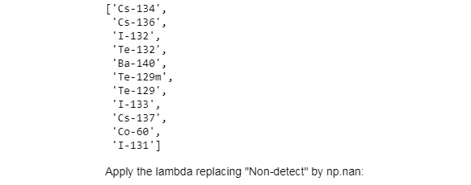

    ###### 图 1.16：列列表

1.  应用替换 `Non-detect` 为 `np.nan` 的 lambda 函数：

    ```py
    df['Cs-134'] = df['Cs-134'].apply(lambda x: np.nan if x == "Non-detect" else x)
    df.loc[:, columns] = df.loc[:, columns].applymap(lambda x: np.nan if x == 'Non-detect' else x)
    df.loc[:, columns] = df.loc[:, columns].applymap(lambda x: np.nan if x == 'ND' else x)
    ```

1.  删除类别列中的空格：

    ```py
    df.loc[:, ['State', 'Location', 'Sample Type', 'Unit']] = df.loc[:, ['State', 'Location', 'Sample Type', 'Unit']].applymap(lambda x: x.strip())
    ```

1.  将日期列转换为 `datetime` 格式：

    ```py
    df['Date Posted'] = pd.to_datetime(df['Date Posted'])
    df['Date Collected'] = pd.to_datetime(df['Date Collected'])
    ```

1.  使用 `to_numeric` 方法将所有数值型列转换为正确的数值格式：

    ```py
    for col in columns:
        df[col] = pd.to_numeric(df[col])
    ```

1.  将所有类别变量转换为`category`类型：

    ```py
    df['State'] = df['State'].astype('category')
    df['Location'] = df['Location'].astype('category')
    df['Unit'] = df['Unit'].astype('category')
    df['Sample Type'] = df['Sample Type'].astype('category')
    ```

1.  使用`to_csv`函数将我们转换后的 DataFrame 导出为 CSV 格式，确保包含正确的值和列。通过`index=False`排除索引，使用分号作为分隔符`sep=";"`，并将数据编码为 UTF-8 格式`encoding="utf-8"`：

    ```py
    df.to_csv('radiation_clean.csv', index=False, sep=';', encoding='utf-8')
    ```

1.  使用`to_parquet`方法将相同的 DataFrame 导出为 Parquet 列式和二进制格式：

    ```py
    df.to_parquet('radiation_clean.prq', index=False)
    ```

    #### 注意

    转换 datetime 为字符串时要小心！

## 使用 Pandas 进行可视化

Pandas 可以被看作是一个数据的瑞士军刀，而数据科学家在分析数据时总是需要的一项技能就是可视化数据。我们将在后续详细介绍可应用于分析的各种图表类型。现在的目标是展示如何直接从 pandas 创建**快速且简单**的图表。

`plot`函数可以直接从 DataFrame 选择调用，实现快速可视化。通过使用 Matplotlib 并将数据从 DataFrame 传递到绘图函数，可以创建散点图。现在我们了解了工具，接下来让我们专注于 pandas 的数据处理接口。这个接口非常强大，其他一些项目（如 Spark）也复制了它。我们将在下一章更详细地解释图表的组成部分和方法。

你将在下一章看到如何创建对统计分析有用的图表。在这里，重点是了解如何从 pandas 创建图表以进行快速可视化。

### 活动 3：使用 Pandas 绘制数据

为了完成我们的活动，让我们重新做一遍之前的所有步骤，并用结果绘制图表，就像在初步分析中所做的那样：

1.  使用我们之前处理过的 RadNet DataFrame。

1.  修复所有的数据类型问题，正如我们之前所看到的。

1.  创建一个按`Location`过滤的图表，选择`San Bernardino`城市，并选择一个放射性核素，*x*-轴为日期，*y*-轴为放射性核素`I-131`：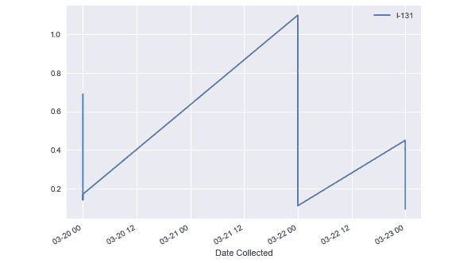

    ###### 图 1.17：带 I-131 的地点图表

1.  创建一个散点图，显示两个相关放射性核素`I-131`和`I-132`的浓度：

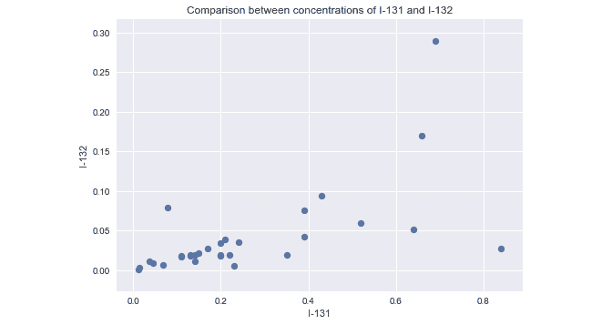

###### 图 1.18：I-131 和 I-132 的图表

#### 注意

本活动的解决方案可以在 203 页找到。

我们在这里稍微有些超前了，因此不必担心图表的细节，或者如何设置标题、标签等。这里的关键是理解我们可以直接从 DataFrame 绘制图表进行快速分析和可视化。

## 摘要

我们已经了解了数据分析和数据科学中最常用的 Python 库，它们组成了 Python 数据科学栈。我们学习了如何获取数据、选择数据、过滤数据并进行聚合。我们还学习了如何导出分析结果并生成一些快速图表。

这些步骤几乎适用于任何数据分析。这里展示的思路和操作可以应用于大数据的数据处理。Spark DataFrame 的创建考虑了 pandas 接口，许多操作在 pandas 和 Spark 中以非常相似的方式执行，这大大简化了分析过程。掌握 pandas 的另一个巨大优势是，Spark 可以将其 DataFrame 转换为 pandas DataFrame，然后再转换回来，使分析师能够使用最适合任务的工具。

在进入大数据之前，我们需要了解如何更好地可视化分析结果。如果我们使用正确的图表来可视化数据，我们对数据及其行为的理解可以大大增强。通过绘制数据，我们能够做出推断，并观察到异常和模式。

在下一章，我们将学习如何为每种数据和分析选择合适的图表，并如何使用 Matplotlib 和 Seaborn 绘制它。
