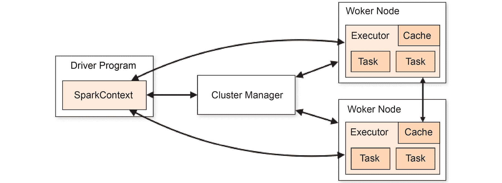

# 第四章：*第三章*

# 使用大数据框架

## 学习目标

到本章结束时，你将能够：

+   解释 HDFS 和 YARN Hadoop 组件

+   执行 HDFS 文件操作

+   比较 pandas DataFrame 和 Spark DataFrame

+   使用 Spark 从本地文件系统和 HDFS 中读取文件

+   使用 Spark 以 Parquet 格式写入文件

+   编写分区文件以便快速分析

+   使用 Spark 操作非结构化数据

在本章中，我们将探讨大数据工具，如 Hadoop 和 Spark。

## 介绍

在前几章中，我们看到如何使用 pandas 和 Matplotlib 进行数据操作与可视化，以及 Python 数据科学栈中的其他工具。到目前为止，我们使用的数据集相对较小，且结构相对简单。现实中的数据集可能比单台机器的内存容量要大几个数量级，处理这些数据集所需的时间也可能很长，常用的软件工具可能无法胜任。这就是通常定义的大数据：一种无法装入内存，或者无法在合理的时间内通过常规软件方法进行处理或分析的数据量。对某些人来说是大数据的东西，对于其他人来说可能不是大数据，这一定义可能因提问对象的不同而有所变化。

大数据还与 3V（后扩展为 4V）相关联：

+   **容量**：顾名思义，大数据通常与非常大的数据量相关联。什么是“大”取决于上下文：对于一个系统，千兆字节就可以算作大数据，而对于另一个系统，则可能需要达到 PB 级数据。

+   **多样性**：通常，大数据与不同的数据格式和类型相关联，如文本、视频和音频。数据可以是结构化的，如关系表，或是非结构化的，如文本和视频。

+   **速度**：数据生成和存储的速度比其他系统更快，并且生产速度更加连续。流数据可以通过像电信运营商、在线商店甚至 Twitter 这样的平台生成。

+   **真实性**：这一点是后来加入的，旨在说明在任何分析工作中，了解正在使用的数据及其含义非常重要。我们需要检查数据是否与我们预期的相符，转换过程是否改变了数据，数据是否反映了所收集的内容。

但让大数据具有吸引力的一个方面是分析组件：大数据平台旨在支持对这些庞大数据集进行分析和信息提取。这一章从这里开始：我们将学习如何使用两个最常见、最灵活的大数据框架——Hadoop 和 Spark——来操作、存储和分析大数据集。

## Hadoop

Apache Hadoop 是一个为大规模数据的并行存储和计算而创建的软件组件集合。它在最初的设计理念是使用普通计算机进行分布式处理，具备高容错性和分布式计算能力。随着 Hadoop 的成功，越来越多的高端计算机开始被用于 Hadoop 集群，尽管普通硬件仍然是常见的使用案例。

并行存储是指使用多个通过网络互联的节点，以并行方式存储和检索数据的任何系统。

Hadoop 由以下组件组成：

+   **Hadoop Common**：基础的 Hadoop 通用项目

+   **Hadoop YARN**：资源和作业管理器

+   **Hadoop MapReduce**：一个大规模并行处理引擎

+   **Hadoop 分布式文件系统**（**HDFS**）：顾名思义，HDFS 是一个可以分布在多台计算机上的文件系统，通过使用本地磁盘，创建一个大规模的存储池：


###### 图 3.1：HDFS 架构

另一个重要组件是**YARN**（**Yet Another Resource Negotiator**），是 Hadoop 的资源管理器和作业调度器。它负责管理提交到 Hadoop 集群的作业，根据所需和可用资源分配内存和 CPU。

Hadoop 普及了一种并行计算模型，叫做 MapReduce，这是 Google 最初开发的一种分布式计算范式。在 Hadoop 中直接运行使用 MapReduce 的程序是可能的。但自从 Hadoop 诞生以来，已经开发出了其他并行计算范式和框架（如 Spark），因此 MapReduce 在数据分析中并不常用。在深入了解 Spark 之前，让我们先看看如何在 HDFS 上操作文件。

### 使用 HDFS 操作数据

HDFS 是一个分布式文件系统，其一个重要特点是：它被设计用来运行在成千上万台并非专门为此设计的计算机上——也就是所谓的**商品硬件**。它不需要特殊的网络设备或特殊硬盘，可以运行在普通硬件上。HDFS 的另一个理念是容错性：硬件总会发生故障，因此 HDFS 通过高度容错的方式绕过故障，而不是试图避免它。它假定在大规模环境下会发生故障，因此 HDFS 实现了故障检测机制，以实现快速和自动恢复。它也具有可移植性，能在不同平台上运行，并且可以容纳单个文件，数据容量达到 TB 级。

从用户的角度来看，HDFS 的一个大优点是它支持传统的层次化文件结构组织（文件夹和文件的树形结构），因此用户可以在每一层创建文件夹和文件，简化了使用和操作。文件和文件夹可以移动、删除和重命名，因此用户无需了解数据复制或**NameNode**/**DataNode**架构即可使用 HDFS；它看起来与 Linux 文件系统类似。在演示如何访问文件之前，我们需要先解释一下访问 Hadoop 数据所使用的地址。例如，访问 HDFS 中文件的 URI 格式如下：

```py
hdfs://hadoopnamenode.domainname/path/to/file
```

其中，`namenode.domainname`是 Hadoop 中配置的地址。Hadoop 用户指南（[`exitcondition.com/install-hadoop-windows/`](https://exitcondition.com/install-hadoop-windows/)）详细介绍了如何访问 Hadoop 系统的不同部分。让我们通过几个例子更好地理解这一切是如何工作的。

### 练习 16：在 HDFS 中操作文件

假设一个分析师刚刚收到了一个要分析的大型数据集，并且它存储在 HDFS 系统中。这个分析师如何列出、复制、重命名和移动这些文件？假设分析师收到了一个名为`new_data.csv`的原始数据文件：

1.  如果您使用的是 Linux 系统，请在终端中使用以下命令，或者如果使用 Windows 系统，请在命令提示符下执行此命令，以开始检查当前的目录和文件：

    ```py
    hdfs dfs -ls /
    ```

1.  我们在本地磁盘上有一个名为`new_data.csv`的文件，我们希望将其复制到 HDFS 数据文件夹中：

    ```py
    hdfs dfs -put C:/Users/admin/Desktop/Lesson03/new_data.csv /
    ```

1.  注意，命令的最后部分是 HDFS 中的路径。现在，使用`mkdir`命令在 HDFS 中创建一个文件夹：

    ```py
    hdfs dfs -mkdir /data
    ```

1.  然后将文件移动到 HDFS 中的数据文件夹：

    ```py
    hdfs dfs -mv /data_file.csv /data
    ```

1.  更改 CSV 文件的名称：

    ```py
    hdfs dfs -mv /data/new_data.csv /data/other_data.csv
    ```

1.  使用以下命令检查文件是否存在于当前路径：

    ```py
    hadoop fs -ls /data
    ```

    输出结果如下：

    ```py
    other_data.csv
    ```

    #### 注意

    HDFS 部分之后的命令与 Linux Shell 中的命令相同。

了解如何在 HDFS 中操作文件和目录是大数据分析的重要部分，但通常，直接操作仅限于数据摄取时进行。要分析数据，HDFS 通常不会直接使用，像 Spark 这样的工具更为强大。让我们按顺序看看如何使用 Spark。

## Spark

**Spark**（[`spark.apache.org`](https://spark.apache.org)）是一个用于大规模数据处理的统一分析引擎。Spark 最初是由加利福尼亚大学伯克利分校于 2009 年发起的项目，并于 2013 年移交给 Apache 软件基金会。

Spark 的设计旨在解决使用 Hadoop 架构进行分析时的一些问题，如数据流、SQL 操作存储在 HDFS 上的文件和机器学习。它可以将数据分布到集群中的所有计算节点，以减少每个计算步骤的延迟。Spark 的另一个特点是它的灵活性：它有适用于 Java、Scala、SQL、R 和 Python 的接口，以及适用于不同问题的库，例如用于机器学习的 MLlib、用于图计算的 GraphX 和用于流式工作负载的 Spark Streaming。

Spark 使用工作节点抽象，具有一个接收用户输入以启动并行执行的驱动进程，以及在集群节点上执行任务的工作进程。它具有内置的集群管理工具，并支持其他工具，如 Hadoop YARN、Apache Mesos（甚至 Kubernetes），可以集成到不同的环境和资源分配场景中。

Spark 也可以非常快速，因为它首先尝试将数据分布到所有节点，并将其保留在内存中，而不是仅仅依赖磁盘上的数据。它可以处理比所有可用内存总和还大的数据集，通过在内存和磁盘之间切换数据，但这个过程会比将整个数据集完全适配到所有节点的内存中时慢。



###### 图 3.2：Spark 工作机制

其他显著优势是，Spark 具有适用于多种本地和分布式存储系统的接口，如 HDFS、Amazon S3、Cassandra 等；可以通过 JDBC 或 ODBC 连接器连接到 RDBMS，如 PostgreSQL 和 MySQL；还可以使用**Hive Metastore**直接对 HDFS 文件运行 SQL。CSV、Parquet 和 ORC 等文件格式也可以被 Spark 直接读取。

这种灵活性在处理大数据源时非常有帮助，因为大数据源可能具有不同的格式。

Spark 可以作为交互式 Shell 使用，支持 Scala、Python 和 R，也可以作为作业提交平台使用，使用` spark-submit`命令将作业分发到 Spark 集群。submit 方法用于将作业调度到 Spark 集群，该作业是通过脚本编码的。Spark 的 Python 接口被称为 PySpark，可以直接从终端访问，使用默认的 Python 版本；也可以通过 IPython shell 或在 Jupyter 笔记本内访问。

### Spark SQL 和 Pandas DataFrames

**RDD**（弹性分布式数据集）是 Spark 用来处理数据的基础抽象。从 Spark 2.0 版本开始，推荐使用的 API 是 DataFrame API。DataFrame API 是在 RDD API 之上构建的，尽管仍然可以访问 RDD API。

使用 RDD 被认为是低级的，所有操作都可以在 DataFrame API 中实现，但学习一些关于 RDD API 的内容也无妨。

SQL 模块使用户能够使用 SQL 查询在 Spark 中查询数据，类似于常见的关系型数据库。DataFrame API 是 SQL 模块的一部分，处理结构化数据。这个数据接口有助于创建额外的优化，使用相同的执行引擎，无论使用什么 API 或语言来表达这些计算。

DataFrame API 类似于 **Pandas DataFrame**。在 Spark 中，DataFrame 是一个分布式的数据集合，按列组织，每一列都有一个名称。随着 Spark 2.0 的发布，DataFrame 成为更通用的 Dataset API 的一部分，但由于该 API 仅适用于 Java 和 Scala 语言，我们将只讨论 DataFrame API（在文档中称为 **Untyped Dataset Operations**）。

Spark DataFrame 的接口类似于 pandas 接口，但也有一些重要的区别：

+   第一个区别是 Spark DataFrame 是 **不可变的**：创建后无法修改。

+   第二个区别是 Spark 有两种不同的操作：**转换**和**行动**。

    **转换** 是应用于 DataFrame 元素的操作，并且是排队待执行的，数据尚未被提取。

    只有在调用 **行动** 时，数据才会被提取，并且所有排队的转换操作都会执行。这叫做延迟计算。

### 练习 17：在 Spark 中执行 DataFrame 操作

让我们开始使用 Spark 执行输入/输出和简单的聚合操作。正如我们之前所说，Spark 的接口灵感来自 pandas 接口。在 *第二章*，*使用 Matplotlib 和 Seaborn 的统计可视化* 中学到的内容可以应用到这里，从而加速执行更复杂的分析，包括聚合、统计、计算和对聚合数据的可视化。我们希望读取一个 CSV 文件，就像我们之前做的那样，对其进行一些分析：

1.  首先，在 Jupyter notebook 中使用以下命令创建一个 Spark 会话：

    ```py
    from pyspark.sql import SparkSession
    >>> spark = SparkSession \
        .builder \
        .appName(“Python Spark Session”) \
        .getOrCreate()
    ```

1.  现在，让我们使用以下命令从 `mydata.csv` 文件中读取数据：

    ```py
    df = spark.read.csv(‘/data/mydata.csv’, header=True)
    ```

1.  如前所述，Spark 的计算是延迟的，因此如果我们想显示 DataFrame 中的值，我们需要调用行动，如这里所示：

    ```py
    df.show()
    +------+----+-------+
    |  name| age| height|
    +------+----+-------+
    |  Jonh|  22|   1.80|
    |Hughes|  34|   1.96|
    |  Mary|  27|   1.56|
    +------+----+-------+
    ```

    #### 注意

    这在 pandas 中不是必需的：直接打印 DataFrame 就能显示内容。

### 练习 18：使用 Spark 访问数据

在读取 DataFrame 并显示其内容后，我们希望开始操作数据，以便进行分析。我们可以使用相同的 NumPy 选择语法来访问数据，提供列名作为 `Column`：

1.  让我们选择上一练习中导入的 DataFrame 中的某一列：

    ```py
    df[‘age’].Column[‘age’]
    ```

    这与我们在 pandas 中看到的有所不同。选择 Spark DataFrame 中列的值的方法是 `select`。那么，让我们看看当我们使用这个方法时会发生什么。

1.  再次使用相同的 DataFrame，使用 `select` 方法选择名称列：

    ```py
    df.select(df[‘name’])DataFrame[age: string]
    ```

1.  现在，它从 `Column` 变成了 `DataFrame`。因此，我们可以使用 DataFrame 的方法。使用 `show` 方法显示 `select` 方法对 `age` 列的结果：

    ```py
    df.select(df[‘age’]).show()
    +---+
    |age|
    +---+
    | 22|
    | 34|
    | 27|
    +---+
    ```

1.  让我们选择多个列。我们可以使用列的名称来做到这一点：

    ```py
    df.select(df[‘age’], df[‘height’]).show()
    +---+------+
    |age|height|
    +---+------+
    | 22|  1.80|
    | 34|  1.96|
    | 27|  1.56|
    +---+------+
    ```

这对于其他列是可扩展的，通过名称选择，语法相同。我们将在下一章中讨论更复杂的操作，例如 **带有 GroupBy 的聚合**。

### 练习 19：从本地文件系统和 HDFS 读取数据

如前所述，要从本地磁盘读取文件，只需将路径提供给 Spark。我们还可以读取位于不同存储系统中的其他文件格式。Spark 可以读取以下格式的文件：

+   CSV

+   JSON

+   ORC

+   Parquet

+   文本

并且可以从以下存储系统中读取：

+   JDBC

+   ODBC

+   Hive

+   S3

+   HDFS

基于 URL 方案，作为练习，我们来读取来自不同位置和格式的数据：

1.  在 Jupyter Notebook 中导入必要的库：

    ```py
    from pyspark.sql import SparkSession
    spark = SparkSession \
        .builder \
        .appName(“Python Spark Session”) \
        .getOrCreate()
    ```

1.  假设我们需要从一个 JSON 文件中获取一些数据，这对于从网络 API 收集的数据很常见。要直接从 HDFS 读取文件，请使用以下 URL：

    ```py
    df = spark.read.json(‘hdfs://hadoopnamenode/data/myjsonfile.json’)
    ```

    请注意，使用这种 URL 时，我们必须提供 HDFS 端点的完整地址。我们也可以只使用简化路径，前提是 Spark 已经配置了正确的选项。

1.  现在，使用以下命令将数据读取到 Spark 对象中：

    ```py
    df = spark.read.json(‘hdfs://data/myjsonfile.json’)
    ```

1.  因此，我们在 `read` 方法中选择格式，并在访问 URL 中选择存储系统。对于 JDBC 连接也使用相同的方法，但通常我们需要提供用户名和密码来连接。让我们看看如何连接到 PostgreSQL 数据库：

    ```py
    url = “jdbc:postgresql://posgreserver:5432/mydatabase”
    properties = {“user”: “my_postgre_user”,  password: “mypassword”, “driver”: “org.postgresql.Driver”}
    df = spark.read.jdbc(url, table = “mytable”, properties = properties)
    ```

### 练习 20：将数据写回 HDFS 和 PostgreSQL

正如我们在使用 pandas 时看到的那样，执行一些操作和转换后，假设我们想将结果写回本地文件系统。当我们完成分析并希望与其他团队共享结果时，或者我们希望使用其他工具展示数据和结果时，这非常有用：

1.  我们可以直接在 HDFS 上使用 `write` 方法从 DataFrame 写入：

    ```py
    df.write.csv(‘results.csv’, header=True)
    ```

1.  对于关系型数据库，使用与这里演示的相同 URL 和属性字典：

    ```py
    df = spark.write.jdbc(url, table = “mytable”, properties = properties)
    ```

    这使得 Spark 在处理大型数据集并将其组合进行分析时具有极大的灵活性。

    #### 注意

    Spark 可以作为一个中间工具来转换数据，包括聚合或修复数据问题，并以不同的格式保存供其他应用使用。

## 写入 Parquet 文件

Parquet 数据格式（[`parquet.apache.org/`](https://parquet.apache.org/)）是一种二进制的列式存储格式，可以被不同的工具使用，包括 Hadoop 和 Spark。它被构建以支持压缩，从而实现更高的性能和存储利用率。它的列式设计有助于在性能上进行数据选择，因为只会检索所需列的数据，而不是在不需要的行中查找并丢弃值，从而减少了大数据场景下的检索时间，在这些场景中数据是分布式并存储在磁盘上。Parquet 文件也可以通过外部应用程序读取和写入，使用 C++ 库，甚至可以直接从 pandas 中操作。

Parquet 库目前正在与 **Arrow 项目**（[`arrow.apache.org/`](https://arrow.apache.org/)）一起开发。

在 Spark 中考虑更复杂的查询时，将数据存储为 Parquet 格式可以提高性能，特别是当查询需要搜索大规模数据集时。压缩有助于减少在 Spark 执行操作时需要传输的数据量，从而降低网络 I/O。它还支持模式和嵌套模式，类似于 JSON，Spark 可以直接从文件中读取模式。

Spark 中的 Parquet 写入器有几个选项，例如模式（追加、覆盖、忽略或错误，默认为错误）和压缩，选择压缩算法的参数。可用的算法如下：

+   `gzip`

+   `lzo`

+   `brottli`

+   `lz4`

+   快速压缩

+   未压缩

默认算法是 **snappy**。

### 练习 21：写入 Parquet 文件

假设我们收到大量的 CSV 文件，需要对其进行一些分析，并且还需要减小数据体积。我们可以使用 Spark 和 Parquet 来实现。在开始分析之前，让我们将 CSV 文件转换为 Parquet 格式：

1.  首先，从 HDFS 读取 CSV 文件：

    ```py
    df = spark.read.csv(‘hdfs:/data/very_large_file.csv’, header=True)
    ```

1.  将 DataFrame 中的 CSV 文件以 Parquet 格式写回到 HDFS：

    ```py
    df.write.parquet(‘hdfs:/data/data_file’, compression=”snappy”)
    ```

1.  现在将 Parquet 文件读取到一个新的 DataFrame 中：

    ```py
    df_pq = spark.read.parquet(“hdfs:/data/data_file”)
    ```

    #### 注意

    `write.parquet` 方法会创建一个名为 `data_file` 的文件夹，并生成一个长文件名的文件，例如 `part-00000-1932c1b2-e776-48c8-9c96-2875bf76769b-c000.snappy.parquet`。

### 使用 Parquet 和分区提高分析性能

Parquet 支持并且也能提高查询性能的一个重要概念是分区。分区的想法是将数据拆分成可以更快速访问的部分。分区键是一个列，其值用于拆分数据集。分区在数据中存在有意义的划分时非常有用，这些划分可以单独处理。例如，如果你的数据是基于时间间隔的，则分区列可以是年份值。这样，当查询使用基于年份的筛选值时，只会读取与请求年份匹配的分区中的数据，而不是整个数据集。

分区也可以是嵌套的，并通过 Parquet 中的目录结构表示。所以，假设我们还想按月份列进行分区，那么 Parquet 数据集的文件夹结构将类似于以下形式：

```py
hdfs -fs ls /data/data_file
year=2015
year=2016
year=2017
hdfs -fs ls /data/data_file/year=2017
month=01
month=02
month=03
month=04
month=05
```

当对分区进行过滤时，分区可以提高性能，因为只会读取所选分区中的数据，从而提高性能。要保存分区文件，应该使用 `partitionBy` 选项，可以在 `parquet` 命令中使用，或者将前一个命令与写入操作链式调用：

```py
df.write.parquet(“hdfs:/data/data_file_partitioned”, partitionBy=[“year”, “month”])
```

另一种方法是：

```py
df.write.partittionBy([“year”, “month”]).format(“parquet”).save(“hdfs:/data/data_file_partitioned”)
```

后者格式可以与前面的操作一起使用。读取分区数据时，Spark 可以根据目录结构推断分区结构。

如果正确使用分区，分析人员可以显著提高查询性能。但如果没有正确选择分区列，分区反而可能会影响性能。例如，如果数据集中只有一年的数据，按年份分区就没有任何好处。如果某列有太多不同的值，按该列进行分区也可能会产生问题，导致创建过多的分区，无法提升速度，甚至可能降低性能。

### 练习 22：创建分区数据集

在我们的初步分析中，我们发现数据中包含日期列，其中一个表示年份，一个表示月份，另一个表示日期。我们将对这些数据进行汇总，以获取每年、每月和每天的最小值、平均值和最大值。让我们从数据库中创建一个保存为 Parquet 格式的分区数据集：

1.  定义一个 PostgreSQL 连接：

    ```py
    url = “jdbc:postgresql://posgreserver:5432/timestamped_db”
    properties = {“user”: “my_postgre_user”,  password: “mypassword”, “driver”: “org.postgresql.Driver”}
    ```

1.  使用 JDBC 连接器从 PostgreSQL 读取数据到 DataFrame：

    ```py
    df = spark.read.jdbc(url, table = “sales”, properties = properties)
    ```

1.  接下来，我们将把这些数据转换为分区 Parquet 格式：

    ```py
    df.write.parquet(“hdfs:/data/data_file_partitioned”, partitionBy=[“year”, “month”, “day”], compression=”snappy”)
    ```

使用 Spark 作为不同数据源的中介，并考虑其数据处理和转换能力，使其成为结合和分析数据的优秀工具。

## 处理非结构化数据

非结构化数据通常指没有固定格式的数据。例如，CSV 文件是结构化的，而 JSON 文件也可以被认为是结构化的，尽管它不是表格形式。另一方面，计算机日志没有固定结构，不同的程序和守护进程会输出没有共同模式的消息。图像也是另一种非结构化数据的例子，类似于自由文本。

我们可以利用 Spark 在读取数据时的灵活性，解析非结构化格式并将所需信息提取到更结构化的格式中，便于分析。这一步通常称为 **预处理** 或 **数据清洗**。

### 练习 23：解析文本并清洗数据

在本练习中，我们将读取一个文本文件，将其拆分成行，并从给定的字符串中移除 `the` 和 `a` 这两个词：

1.  使用`text`方法将文本文件`shake.txt`（[`raw.githubusercontent.com/TrainingByPackt/Big-Data-Analysis-with-Python/master/Lesson03/data/shake.txt`](https://raw.githubusercontent.com/TrainingByPackt/Big-Data-Analysis-with-Python/master/Lesson03/data/shake.txt)）读入 Spark 对象：

    ```py
    from operator import add
    rdd_df = spark.read.text(“/shake.txt”).rdd
    ```

1.  使用以下命令从文本中提取行：

    ```py
    lines = rdd_df.map(lambda line: line[0])
    ```

1.  这将把文件中的每一行拆分为列表中的一个条目。要检查结果，可以使用`collect`方法，它会将所有数据收集到驱动程序进程中：

    ```py
    lines.collect()
    ```

1.  现在，让我们使用`count`方法计算行数：

    ```py
    lines.count()
    ```

    #### 注意

    使用`collect`方法时要小心！如果收集的 DataFrame 或 RDD 的大小超过了本地驱动程序的内存，Spark 将抛出错误。

1.  现在，让我们首先将每一行拆分为单词，通过周围的空格进行分割，并合并所有元素，移除大写字母的单词：

    ```py
    splits = lines.flatMap(lambda x: x.split(‘ ‘))
    lower_splits = splits.map(lambda x: x.lower().strip())
    ```

1.  让我们还移除字符串中的`the`和`a`，以及像‘`.`’，‘`,`’这样的标点符号：

    ```py
    prep = [‘the’, ‘a’, ‘,’, ‘.’]
    ```

1.  使用以下命令从我们的标记列表中移除停用词：

    ```py
    tokens = lower_splits.filter(lambda x: x and x not in prep)
    ```

    我们现在可以处理我们的标记列表并统计唯一的单词。其思想是生成一个元组列表，其中第一个元素是标记，第二个元素是该标记的计数。

1.  让我们将我们的标记映射到列表中：

    ```py
    token_list = tokens.map(lambda x: [x, 1])
    ```

1.  使用`reduceByKey`操作，它会对每个列表应用此操作：

    ```py
    count = token_list.reduceByKey(add).sortBy(lambda x: x[1], ascending=False)
    count.collect()
    ```

    输出如下：


###### 图 3.3：解析文本并清理

#### 注意

记住，`collect()`会将所有数据收集到驱动节点！使用`top`和`htop`等工具检查是否有足够的内存。

### 活动 8：从文本中移除停用词

在本活动中，我们将读取一个文本文件，将其拆分为行，并从文本中移除`停用词`：

1.  读取在练习 8 中使用的文本文件`shake.txt`。

1.  从文本中提取行并创建一个包含每行的列表。

1.  将每一行拆分为单词，按空格进行分割，并移除大写字母的单词。

1.  从我们的标记列表中移除停用词：‘of’，‘a’，‘and’，‘to’。

1.  处理标记列表并统计唯一单词，生成由标记及其计数组成的元组列表。

1.  使用`reduceByKey`操作将我们的标记映射到列表中。

    输出如下：


###### 图 3.4：从文本中移除停用词

#### 注意

本活动的解决方案可以在第 213 页找到。

我们得到一个元组列表，每个元组包含一个标记和该单词在文本中出现的次数。请注意，在最终对计数进行`collect`操作（一个动作）之前，作为转换的操作并没有立即执行：我们需要通过`count`这个动作操作来启动 Spark 执行所有步骤。

其他类型的非结构化数据可以使用前面的示例进行解析，并可以直接操作，如前面的活动所示，或者稍后转换为 DataFrame。

## 总结

在回顾了大数据的定义之后，我们学习了一些专为存储和处理大数据量而设计的工具。Hadoop 是一个完整的生态系统，包括 HDFS 等工具和框架，旨在在大量廉价计算节点上以分布式方式存储数据，以及资源和作业管理器 YARN。我们看到了如何使用 HDFS fs 命令直接操作 HDFS 上的数据。

我们还学习了关于 Spark 的知识，这是一个非常强大和灵活的并行处理框架，与 Hadoop 集成良好。Spark 拥有不同的 API，如 SQL、GraphX 和 Streaming。我们学习了 Spark 如何使用 DataFrame API 表示数据，以及其计算方式类似于 pandas 的方法。我们还看到了如何使用 Parquet 文件格式高效存储数据，并在分析数据时通过分区来提高性能。最后，我们学习了如何处理诸如文本之类的非结构化数据文件。

在下一章中，我们将深入探讨如何使用更高级的技术和 Spark 进行有意义的统计分析，并学习如何在 Spark 中使用 Jupyter 笔记本。
