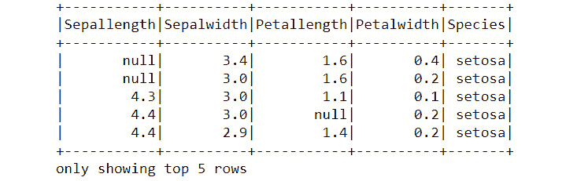

# 第五章：*第四章*

# 深入了解 Spark

## 学习目标

到本章结束时，你将能够：

+   实现基本的 Spark DataFrame API。

+   从不同数据源读取数据并创建 Spark DataFrame。

+   使用不同的 Spark DataFrame 选项来操作和处理数据。

+   使用不同的图表可视化 Spark DataFrame 中的数据。

在本章中，我们将使用 Spark 作为大数据集的分析工具。

## 介绍

上一章介绍了 Spark，这是一个最受欢迎的分布式数据处理平台，用于处理大数据。

在本章中，我们将学习如何使用 Python API——**PySpark**来操作 Spark 和 Spark DataFrame。它使我们能够处理 PB 级数据，同时也在实时环境中实现**机器学习**（**ML**）算法。本章将重点介绍使用 Spark DataFrame 在 PySpark 中的数据处理部分。

#### 注意

在本章中，我们会频繁使用“DataFrame”这个术语。这里指的明确是 Spark 的 DataFrame，除非特别说明。请不要将其与 pandas 的 DataFrame 混淆。

Spark DataFrame 是分布式的数据集合，以命名列的形式组织。它们的灵感来自 R 和 Python 的 DataFrame，并在后台有复杂的优化，使得它们快速、优化且可扩展。

DataFrame API 作为**Project Tungsten**的一部分开发，旨在提高 Spark 的性能和可扩展性。它首次在 Spark 1.3 中引入。

Spark DataFrame 比其前身 RDD 更容易使用和操作。它们像 RDD 一样是*不可变的*，并且支持延迟加载，这意味着除非调用动作，否则对 DataFrame 不会执行任何变换。DataFrame 的执行计划由 Spark 本身准备，因此更加优化，使得在 DataFrame 上的操作比在 RDD 上的操作更快。

## 入门 Spark DataFrame

要开始使用 Spark DataFrame，我们首先需要创建一个名为 SparkContext 的对象。SparkContext 配置了内部服务并促进了来自 Spark 执行环境的命令执行。

#### 注意

我们将使用 Spark 版本 2.1.1，运行在 Python 3.7.1 环境中。Spark 和 Python 安装在一台 MacBook Pro 上，操作系统是 macOS Mojave 10.14.3，配备 2.7 GHz Intel Core i5 处理器和 8 GB 1867 MHz DDR3 RAM。

以下代码片段用于创建`SparkContext`：

```py
from pyspark import SparkContext
sc = SparkContext()
```

#### 注意

如果你在 PySpark shell 中工作，应该跳过这一步，因为该 shell 在启动时会自动创建`sc（SparkContext）`变量。不过，在创建 PySpark 脚本或使用 Jupyter Notebook 时，务必创建`sc`变量，否则代码会抛出错误。

在开始使用 DataFrame 之前，我们还需要创建一个`SQLContext`。Spark 中的`SQLContext`是一个类，提供了类似 SQL 的功能。我们可以使用`SparkContext`来创建`SQLContext`：

```py
from pyspark.sql import SQLContext
sqlc = SQLContext(sc)
```

在 Spark 中创建 DataFrame 有三种不同的方法：

+   我们可以以编程方式指定 DataFrame 的模式并手动输入数据。然而，由于 Spark 通常用于处理大数据，除了为小型测试/示例案例创建数据外，这种方法几乎没有其他用途。

+   创建 DataFrame 的另一种方法是从现有的 Spark RDD 对象中创建。这是有用的，因为在 DataFrame 上工作比直接在 RDD 上工作要容易得多。

+   我们还可以直接从数据源读取数据以创建 Spark DataFrame。Spark 支持多种外部数据源，包括 CSV、JSON、Parquet、关系型数据库表和 Hive 表。

### 练习 24：指定 DataFrame 的模式

在本练习中，我们将通过手动指定模式并输入数据来创建一个小的示例 DataFrame。尽管这种方法在实际场景中的应用较少，但它是开始学习 Spark DataFrames 的一个不错的起点：

1.  导入必要的文件：

    ```py
    from pyspark import SparkContext
    sc = SparkContext()
    from pyspark.sql import SQLContext
    sqlc = SQLContext(sc)
    ```

1.  从 PySpark 模块导入 SQL 工具并指定示例 DataFrame 的模式：

    ```py
    from pyspark.sql import *
    na_schema = Row("Name","Age")
    ```

1.  根据指定模式创建 DataFrame 的行：

    ```py
    row1 = na_schema("Ankit", 23)
    row2 = na_schema("Tyler", 26)
    row3 = na_schema("Preity", 36)
    ```

1.  将行合并在一起创建 DataFrame：

    ```py
    na_list = [row1, row2, row3]
    df_na = sqlc.createDataFrame(na_list)
    type(df_na)
    ```

1.  现在，使用以下命令显示 DataFrame：

    ```py
    df_na.show()
    ```

    输出结果如下：

    

###### 图 4.1：示例 PySpark DataFrame

### 练习 25：从现有 RDD 创建 DataFrame

在本练习中，我们将从现有的 Spark RDD 对象创建一个小的示例 DataFrame：

1.  创建一个 RDD 对象，我们将把它转换成 DataFrame：

    ```py
    data = [("Ankit",23),("Tyler",26),("Preity",36)]
    data_rdd = sc.parallelize(data)
    type(data_rdd)
    ```

1.  将 RDD 对象转换为 DataFrame：

    ```py
    data_sd = sqlc.createDataFrame(data_rdd)
    ```

1.  现在，使用以下命令显示 DataFrame：

    ```py
    data_sd.show()
    ```

    

###### 图 4.2：从 RDD 对象转换的 DataFrame

### 练习 25：使用 CSV 文件创建 DataFrame

可以使用多种不同的数据源来创建 DataFrame。在本练习中，我们将使用开源的 Iris 数据集，该数据集可以在 scikit-learn 库的 datasets 中找到。Iris 数据集是一个多变量数据集，包含 150 条记录，每个品种的 Iris 花（Iris Setosa、Iris Virginica 和 Iris Versicolor）有 50 条记录。

该数据集包含每个 Iris 品种的五个属性，即 `花瓣长度`、`花瓣宽度`、`萼片长度`、`萼片宽度` 和 `品种`。我们已将此数据集存储在一个外部 CSV 文件中，我们将其读入 Spark：

1.  从 Databricks 网站下载并安装 PySpark CSV 阅读器包：

    ```py
    pyspark –packages com.databricks:spark-csv_2.10:1.4.0
    ```

1.  将数据从 CSV 文件读取到 Spark DataFrame 中：

    ```py
    df = sqlc.read.format('com.databricks.spark.csv').options(header='true', inferschema='true').load('iris.csv')
    type(df)
    ```

1.  现在，使用以下命令显示 DataFrame：

    ```py
    df.show(4)
    ```

    

###### 图 4.3：Iris DataFrame，前四行

#### 给讲师的备注

激励学生探索其他数据源，如制表符分隔文件、Parquet 文件和关系型数据库等。

## 从 Spark DataFrame 写入输出

Spark 使我们能够将存储在 Spark DataFrame 中的数据写入本地 pandas DataFrame，或写入 CSV 等外部结构化文件格式。然而，在将 Spark DataFrame 转换为本地 pandas DataFrame 之前，请确保数据能够适应本地驱动程序内存。

在接下来的练习中，我们将探索如何将 Spark DataFrame 转换为 pandas DataFrame。

### 练习 27: 将 Spark DataFrame 转换为 Pandas DataFrame

在本练习中，我们将使用前一个练习中预创建的 Iris 数据集的 Spark DataFrame，并将其转换为本地 pandas DataFrame。然后我们将把这个 DataFrame 存储到 CSV 文件中。执行以下步骤：

1.  使用以下命令将 Spark DataFrame 转换为 pandas DataFrame：

    ```py
    import pandas as pd
    df.toPandas()
    ```

1.  现在使用以下命令将 pandas DataFrame 写入 CSV 文件：

    ```py
    df.toPandas().to_csv('iris.csv')
    ```

    #### 注意

    将 Spark DataFrame 的内容写入 CSV 文件需要使用 `spark-csv` 包的一行代码：

    `df.write.csv('iris.csv')`

## 探索 Spark DataFrame

Spark DataFrame 相比传统的 RDDs 的一个主要优势是数据的易用性和探索性。数据以更结构化的表格格式存储在 DataFrame 中，因此更容易理解。我们可以计算基本统计信息，如行数和列数，查看模式，并计算摘要统计信息，如均值和标准差。

### 练习 28: 显示基本的 DataFrame 统计信息

在本练习中，我们将展示数据前几行的基本 DataFrame 统计信息，以及所有数值 DataFrame 列和单个 DataFrame 列的摘要统计信息：

1.  查看 DataFrame 的模式。模式会以树形结构显示在控制台上：

    ```py
    df.printSchema()
    ```

    

    ###### 图 4.4: Iris DataFrame 模式

1.  现在，使用以下命令打印 Spark DataFrame 的列名：

    ```py
    df.schema.names
    ```

    

    ###### 图 4.5: Iris 列名

1.  要获取 Spark DataFrame 中行数和列数，请使用以下命令：

    ```py
    ## Counting the number of rows in DataFrame
    df.count()#134
    ## Counting the number of columns in DataFrame
    len(df.columns)#5
    ```

1.  让我们获取数据的前 *n* 行。我们可以使用 `head()` 方法来实现。然而，我们使用 `show()` 方法，因为它可以以更好的格式显示数据：

    ```py
    df.show(4)
    ```

    输出如下：

    

    ###### 图 4.6: Iris DataFrame，前四行

1.  现在，计算所有数值列的摘要统计信息，如均值和标准差：

    ```py
    df.describe().show()
    ```

    输出如下：

    

    ###### 图 4.7: Iris DataFrame，摘要统计

1.  要计算 Spark DataFrame 中某一数值列的摘要统计信息，请使用以下命令：

    ```py
    df.describe('Sepalwidth').show()
    ```

    输出如下：

    

###### 图 4.8: Iris DataFrame，Sepalwidth 列的摘要统计

### 活动 9：Spark DataFrames 入门

在本活动中，我们将利用前几部分学习的概念，使用三种方法创建一个 Spark DataFrame。我们还将计算 DataFrame 的统计信息，最后将相同的数据写入 CSV 文件。你可以随意使用任何开源数据集来完成这个活动：

1.  通过手动指定模式创建一个示例 DataFrame。

1.  从现有的 RDD 创建一个示例 DataFrame。

1.  通过从 CSV 文件中读取数据创建一个示例 DataFrame。

1.  打印第 3 步中读取的示例 DataFrame 的前七行。

1.  打印第 3 步中读取的示例 DataFrame 的模式。

1.  打印示例 DataFrame 中的行数和列数。

1.  打印 DataFrame 的摘要统计信息以及任何两个单独的数值列。

1.  使用练习中提到的两种方法将示例 DataFrame 的前 7 行写入 CSV 文件。

    #### 注意

    本活动的解决方案可以在第 215 页找到。

## 使用 Spark DataFrame 进行数据操作

数据操作是任何数据分析的前提。为了从数据中提取有意义的洞察，我们首先需要理解、处理和调整数据。但随着数据量的增加，这一步变得尤为困难。由于数据的规模，即使是简单的操作，如过滤和排序，也会变成复杂的编码问题。Spark DataFrame 使得在大数据上进行数据操作变得轻而易举。

在 Spark DataFrame 中进行数据操作与在常规 pandas DataFrame 中的操作非常相似。大多数 Spark DataFrame 的数据操作都可以通过简单直观的单行代码完成。我们将使用在之前练习中创建的包含鸢尾花数据集的 Spark DataFrame 来进行这些数据操作练习。

### 练习 29：选择并重命名 DataFrame 中的列

在本练习中，我们将首先使用 `withColumnRenamed` 方法重命名列，然后使用 `select` 方法选择并打印模式。

执行以下步骤：

1.  使用 `withColumnRenamed()` 方法重命名 Spark DataFrame 的列：

    ```py
    df = df.withColumnRenamed('Sepal.Width','Sepalwidth')
    ```

    #### 注意

    Spark 无法识别包含点号（`.`）的列名。确保使用此方法重命名它们。

1.  使用 `select` 方法从 Spark DataFrame 中选择单个列或多个列：

    ```py
    df.select('Sepalwidth','Sepallength').show(4)
    ```

    

###### 图 4.9：鸢尾花 DataFrame，Sepalwidth 和 Sepallength 列

### 练习 30：向 DataFrame 中添加和移除列

在本练习中，我们将使用 `withColumn` 方法在数据集中添加新列，之后使用 `drop` 函数将其移除。现在，让我们执行以下步骤：

1.  使用 `withColumn` 方法在 Spark DataFrame 中添加一个新列：

    ```py
    df = df.withColumn('Half_sepal_width', df['Sepalwidth']/2.0)
    ```

1.  使用以下命令显示包含新添加列的数据集：

    ```py
    df.show(4)
    ```

    

    ###### 图 4.10：引入新列 Half_sepal_width

1.  现在，要在 Spark 数据框中移除一列，请使用这里说明的 `drop` 方法：

    ```py
    df = df.drop('Half_sepal_width')
    ```

1.  让我们展示数据集以验证列是否已被移除：

    ```py
    df.show(4)
    ```

    

###### 图 4.11：移除 Half_sepal_width 列后的鸢尾花数据框

### 练习 31：在数据框中显示和计数不同的值

要显示数据框中的不同值，我们使用 `distinct().show()` 方法。同样，要计数不同的值，我们将使用 `distinct().count()` 方法。执行以下步骤以打印不同的值及其总数：

1.  使用 `distinct` 方法，结合 `select` 方法，从 Spark 数据框中选择任何列的不同值：

    ```py
    df.select('Species').distinct().show()
    ```

    

    ###### 图 4.12：鸢尾花数据框，物种列

1.  要计算 Spark 数据框中任何列的不同值，请使用 `count` 方法，并结合 `distinct` 方法：

    ```py
    df.select('Species').distinct().count()
    ```

### 练习 32：移除重复行和过滤数据框中的行

在这个练习中，我们将学习如何从数据集中移除重复的行，并随后在同一列上执行过滤操作。

执行这些步骤：

1.  使用 `dropDuplicates()` 方法从数据框中移除重复值：

    ```py
    df.select('Species').dropDuplicates().show()
    ```

    

    ###### 图 4.13：移除重复列后的鸢尾花数据框，物种列

1.  使用一个或多个条件从数据框中过滤行。这些多个条件可以通过布尔运算符如 `&`（与）或 `|`（或）传递给数据框，类似于我们对 pandas 数据框的操作：

    ```py
    # Filtering using a single condition
    df.filter(df.Species == 'setosa').show(4)
    ```

    

    ###### 图 4.14：使用单一条件过滤后的鸢尾花数据框

1.  现在，要使用多个条件过滤列，请使用以下命令：

    ```py
    df.filter((df.Sepallength > 5) & (df.Species == 'setosa')).show(4)
    ```

    

###### 图 4.15：使用多个条件过滤后的鸢尾花数据框

### 练习 33：对数据框中的行进行排序

在这个练习中，我们将探索如何按升序和降序对数据框中的行进行排序。让我们执行以下步骤：

1.  使用一个或多个条件按升序或降序排序数据框中的行：

    ```py
    df.orderBy(df.Sepallength).show(5)
    ```

    

    ###### 图 4.16：过滤后的鸢尾花数据框

1.  要按降序排序行，请使用以下命令：

    ```py
    df.orderBy(df.Sepallength.desc()).show(5)
    ```

    

###### 图 4.17：按降序排序后的鸢尾花数据框

### 练习 34：在数据框中聚合值

我们可以通过一个或多个变量对 DataFrame 中的值进行分组，并计算汇总指标，如 `mean`、`sum`、`count` 等等。在这个练习中，我们将计算鸢尾花数据集中每个花卉物种的平均花萼宽度。我们还将计算每个物种的行数：

1.  使用以下命令计算每个物种的平均花萼宽度：

    ```py
    df.groupby('Species').agg({'Sepalwidth' : 'mean'}).show()
    ```

    

    ###### 图 4.18：鸢尾花 DataFrame，计算平均花萼宽度

1.  现在，让我们使用以下命令计算每个物种的行数：

    ```py
    df.groupby('Species').count().show()
    ```

    

###### 图 4.19：鸢尾花 DataFrame，计算每个物种的行数

#### 注意

```py
.agg function; however, the method we used is more popular.
```

### 活动 10：使用 Spark DataFrame 进行数据操作

在本活动中，我们将使用之前部分中学到的概念，操作使用鸢尾花数据集创建的 Spark DataFrame。我们将执行基本的数据操作步骤，测试我们在 Spark DataFrame 中处理数据的能力。你可以自由使用任何开源数据集进行此活动。确保所用数据集包含数值变量和类别变量：

1.  重命名 DataFrame 中的五列。如果 DataFrame 中有更多列，则重命名所有列。

1.  从 DataFrame 中选择两列数值型列和一列类别型列。

1.  计算类别变量中不同类别的数量。

1.  在 DataFrame 中创建两个新列，分别通过将两列数值型列相加和相乘得到。

1.  删除两个原始数值列。

1.  按照类别列对数据进行排序。

1.  计算每个类别变量中每个不同类别的求和列的平均值。

1.  过滤出花萼宽度大于步骤 7 中计算出的所有平均值的行。

1.  对结果 DataFrame 进行去重，确保它只包含唯一记录。

    #### 注意

    本活动的解决方案可以在第 219 页找到。

## Spark 中的图表

有效可视化数据的能力至关重要。数据的可视化帮助用户更好地理解数据，并发现文本形式中可能忽略的趋势。在 Python 中，有许多类型的图表，每种图表都有其特定的使用场景。

我们将探索一些图表，包括条形图、密度图、箱线图和线性图，用于 Spark DataFrame，使用流行的 Python 绘图包 Matplotlib 和 Seaborn。需要注意的是，Spark 处理的是大数据。因此，在绘制图表之前，请确保数据大小足够合理（即能容纳在计算机的内存中）。这可以通过过滤、汇总或抽样数据来实现。

我们使用的是鸢尾花数据集，它较小，因此我们不需要进行任何预处理步骤来减少数据大小。

#### 教师说明

用户应在开发环境中预先安装并加载 Matplotlib 和 Seaborn 包，然后再开始本节的练习。如果您不熟悉如何安装和加载这些包，请访问 Matplotlib 和 Seaborn 的官方网站。

### 练习 35：创建条形图

在本练习中，我们将尝试通过条形图绘制每种物种的记录数量。我们需要首先聚合数据并计算每种物种的记录数。然后，我们可以将聚合后的数据转换为常规的 pandas DataFrame，并使用 Matplotlib 和 Seaborn 包创建我们需要的任何类型的图表：

1.  首先，计算每种花卉物种的行数，并将结果转换为 pandas DataFrame：

    ```py
    data = df.groupby('Species').count().toPandas()
    ```

1.  现在，从结果的 pandas DataFrame 创建一个条形图：

    ```py
    import seaborn as sns
    import matplotlib.pyplot as plt
    sns.barplot( x = data['Species'], y = data['count'])
    plt.xlabel('Species')
    plt.ylabel('count')
    plt.title('Number of rows per species')
    ```

    绘制的图形如下：

    

###### 图 4.20：计算每个花卉物种的行数后，Iris DataFrame 的条形图

### 练习 36：创建线性模型图

在本练习中，我们将绘制两个不同变量的数据点，并在其上拟合一条直线。这类似于在两个变量上拟合一个线性模型，并有助于识别这两个变量之间的相关性：

1.  从 pandas DataFrame 创建一个`data`对象：

    ```py
    data = df.toPandas()
    sns.lmplot(x = "Sepallength", y = "Sepalwidth", data = data)
    ```

1.  使用以下命令绘制 DataFrame：

    ```py
    plt.show()
    ```

    

###### 图 4.21：Iris DataFrame 的线性模型图

### 练习 37：创建 KDE 图和箱线图

在本练习中，我们将创建一个**核密度估计**（**KDE**）图，并接着绘制一个**箱线图**。请按照以下步骤操作：

1.  首先，绘制一个 KDE 图，展示变量的分布情况。确保它能帮助我们了解变量的偏斜度和峰度：

    ```py
    import seaborn as sns
    data = df.toPandas()
    sns.kdeplot(data.Sepalwidth, shade = True)
    plt.show()
    ```

    

    ###### 图 4.22：Iris DataFrame 的 KDE 图

1.  现在，使用以下命令绘制 Iris 数据集的箱线图：

    ```py
    sns.boxplot(x = "Sepallength", y = "Sepalwidth", data = data)
    plt.show()
    ```

    

###### 图 4.23：Iris DataFrame 的箱线图

箱线图是查看数据分布并定位异常值的好方法。它们通过 1st 四分位数、中位数、3rd 四分位数和四分位间距（25%到 75%的百分位数）来表示数据分布。

### 活动 11：Spark 中的图表

在此活动中，我们将使用 Python 的绘图库，通过不同类型的图表来可视化探索数据。我们使用的是 Kaggle 上的`mtcars`数据集（[`www.kaggle.com/ruiromanini/mtcars`](https://www.kaggle.com/ruiromanini/mtcars)）：

1.  在 Jupyter Notebook 中导入所有必需的包和库。

1.  从`mtcars`数据集将数据读取到 Spark 对象中。

1.  使用直方图可视化数据集中任意连续数值变量的离散频率分布：

    ###### 图 4.24：Iris 数据框的直方图

1.  使用饼图可视化数据集中各类别的百分比份额：

    ###### 图 4.25：Iris 数据框的饼图

1.  使用箱型图绘制连续变量在类别变量各类别下的分布：

    ###### 图 4.26：Iris 数据框的箱型图

1.  使用线性图表可视化连续数值变量的值：

    ###### 图 4.27：Iris 数据框的线性图表

1.  在同一条线性图表中绘制多个连续数值变量的值：


###### 图 4.28：Iris 数据框中绘制多个连续数值变量的线性图表

#### 注意

本活动的解决方案可以在第 224 页找到。

## 小结

在本章中，我们介绍了 Spark 数据框的基本概念，并探讨了它们为何优于 RDD。我们探索了创建 Spark 数据框的不同方法，并将 Spark 数据框的内容写入常规的 pandas 数据框和输出文件。

我们在 PySpark 中尝试了实际的数据探索，通过计算 Spark 数据框的基本统计和指标。我们在 Spark 数据框中操作数据，执行数据处理操作，如过滤、选择和聚合。我们还尝试通过绘制数据生成有意义的可视化图表。

此外，我们通过实践操作和活动巩固了对各种概念的理解。

在下一章中，我们将探讨如何处理缺失值以及如何计算 PySpark 中变量之间的相关性。
