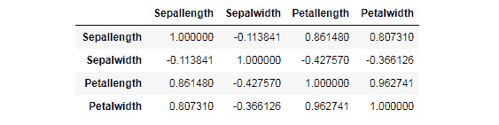

# 第六章：*第五章*

# 处理缺失值和相关性分析

## 学习目标

到本章结束时，你将能够：

+   使用 PySpark 检测和处理数据中的缺失值

+   描述变量之间的相关性

+   计算 PySpark 中两个或多个变量之间的相关性

+   使用 PySpark 创建相关矩阵

在本章中，我们将使用 Iris 数据集处理缺失数据并找到数据值之间的相关性。

## 介绍

在上一章中，我们学习了 Spark DataFrame 的基本概念，并了解了如何利用它们进行大数据分析。

在本章中，我们将进一步学习如何处理数据中的缺失值和进行相关性分析，这些概念将帮助我们为机器学习和探索性数据分析准备数据。

我们将简要介绍这些概念，以便为读者提供一些背景，但我们将重点介绍如何在 Spark DataFrame 中实现它们。我们将使用上一章中使用的相同 Iris 数据集进行本章的练习。但由于 Iris 数据集没有缺失值，我们随机从原始数据集中删除了`Sepallength`列中的两个条目和`Petallength`列中的一个条目。因此，现在我们有了一个包含缺失值的数据集，我们将学习如何使用 PySpark 处理这些缺失值。

我们还将通过计算相关系数和相关矩阵来查看 Iris 数据集中变量之间的相关性。

## 设置 Jupyter Notebook

开始练习之前，需要执行以下步骤：

1.  在 Jupyter Notebook 中导入所有必要的模块和包：

    ```py
    import findspark
    findspark.init()
    import pyspark
    import random
    ```

1.  现在，使用以下命令设置`SparkContext`：

    ```py
    from pyspark import SparkContext
    sc = SparkContext()
    ```

1.  同样，使用以下命令在 Jupyter Notebook 中设置`SQLContext`：

    ```py
    from pyspark.sql import SQLContext
    sqlc = SQLContext(sc)
    ```

    #### 注意

    在执行下一个命令之前，确保已经从 Databricks 网站（[`databricks.com/`](https://databricks.com/)）安装并准备好 PySpark CSV 读取器包。如果没有，请使用以下命令下载：

    `pyspark –packages com.databricks:spark-csv_2.10:1.4.0`

1.  将 Iris 数据集从 CSV 文件读取到 Spark DataFrame 中：

    ```py
    df = sqlc.read.format('com.databricks.spark.csv').options(header = 'true', inferschema = 'true').load('/Users/iris.csv')
    ```

    上述命令的输出如下：

    ```py
    df.show(5)
    ```

    

###### 图 5.1：Iris DataFrame

## 缺失值

没有分配值的数据项称为**缺失值**。在实际应用中，数据中遇到缺失值是很常见的。缺失值可能由多种原因造成，例如系统/响应者无响应、数据损坏或部分删除。

某些字段比其他字段更容易包含缺失值。例如，来自调查的收入数据可能包含缺失值，因为人们不愿透露自己的收入。

然而，这仍然是困扰数据分析领域的主要问题之一。根据缺失数据的比例，缺失值可能会成为数据准备和探索性分析中的重大挑战。因此，在开始数据分析之前，计算缺失数据的百分比是非常重要的。

在接下来的练习中，我们将学习如何检测并计算 PySpark DataFrame 中缺失值的数量。

### 练习 38：统计 DataFrame 中的缺失值

在这个练习中，我们将学习如何统计 PySpark DataFrame 列中的缺失值：

1.  使用以下命令检查 Spark DataFrame 是否存在缺失值：

    ```py
    from pyspark.sql.functions import isnan, when, count, col
    df.select([count(when(isnan(c) | col(c).isNull(),
                    c)).alias(c) for c in df.columns]).show()
    ```

1.  现在，我们将统计加载到 PySpark DataFrame `df` 对象中的鸢尾花数据集 `Sepallength` 列中的缺失值：

    ```py
    df.filter(col('Sepallength').isNull()).count()
    ```

    输出结果如下：

    ```py
    2
    ```

### 练习 39：统计 DataFrame 所有列中的缺失值

在这个练习中，我们将统计 PySpark DataFrame 所有列中的缺失值：

1.  首先，导入所有必需的模块，如下所示：

    ```py
    from pyspark.sql.functions import isnan, when, count, col
    ```

1.  现在，使用以下命令显示数据：

    ```py
    df.select([count(when(isnan(i) | col(i).isNull(), i)).alias(i) for i in df.columns]).show()
    ```

    输出结果如下：

    

    ###### 图 5.2：鸢尾花 DataFrame，统计缺失值

    输出结果显示，`Seapllength` 列中有 `2` 个缺失值，而 `Petallength` 列中有 `1` 个缺失值，出现在 PySpark DataFrame 中。

1.  一种简单的方法是使用 `describe()` 函数，它提供每一列非缺失值的数量，并给出一些其他汇总统计数据。我们在笔记本中执行以下命令：

    ```py
    df.describe().show(1)
    ```

    

###### 图 5.3：鸢尾花 DataFrame，使用不同方法统计缺失值

如我们所见，`Sepallength` 列中有 `148` 个非缺失值，表示有 `2` 个缺失值，而 `Petallength` 列中有 `149` 个非缺失值，表示有 `1` 个缺失值。

在接下来的部分，我们将探讨如何从 DataFrame 中查找缺失值。

### 从 DataFrame 中获取缺失值记录

我们还可以使用以下代码过滤掉 PySpark DataFrame 中包含缺失值记录的行：

```py
df.where(col('Sepallength').isNull()).show()
```


###### 图 5.4：鸢尾花 DataFrame，获取缺失值

`show` 函数显示 PySpark DataFrame 中的前 20 条记录。由于 `Sepallength` 列只有两条缺失值记录，所以我们这里只看到两条。

## 处理 Spark DataFrame 中的缺失值

处理缺失值是数据科学中一个复杂的领域。根据缺失数据的类型和具体业务场景，存在多种技术用于处理缺失值。

这些方法包括从基于简单逻辑的方法到先进的统计方法，如回归和 KNN。然而，无论采用何种方法来处理缺失值，最终我们都会对缺失值数据执行以下两种操作之一：

+   从数据中删除包含缺失值的记录

+   用某个常数值填充缺失的条目

在本节中，我们将探索如何使用 PySpark DataFrame 执行这两个操作。

### 练习 40：从 DataFrame 中删除包含缺失值的记录

在本练习中，我们将删除包含缺失值条目的 PySpark DataFrame 记录。请执行以下步骤：

1.  要从特定列中删除缺失值，可以使用以下命令：

    ```py
    df.select('Sepallength').dropna().count()
    ```

    上述代码将返回 `148` 作为输出，因为包含缺失值条目的两条 `Sepallength` 列记录已经从 PySpark DataFrame 中删除。

1.  要删除 PySpark DataFrame 中包含任何列的缺失值条目的所有记录，请使用以下命令：

    ```py
    df.dropna().count()
    ```

DataFrame 中有 `3` 条记录缺失了值，正如我们在 *练习 2：计算所有 DataFrame 列中缺失的值* 中看到的那样——其中有两条记录在 `Sepallength` 列中缺失值，另外一条记录在 `Petallength` 列中缺失值。

上述代码删除了所有三条记录，从而在 PySpark DataFrame 中返回了 147 条完整的记录。

### 练习 41：用常数填充 DataFrame 列中的缺失值

在本练习中，我们将把 PySpark DataFrame 列的缺失值条目替换为常数数值。

我们的 DataFrame 中有两个列包含缺失值——`Sepallength` 和 `Petallength`：

1.  现在，让我们将这两列中的缺失值条目都替换为常数数值 `1`：

    ```py
    y = df.select('Sepallength','Petallength').fillna(1)
    ```

1.  现在，让我们统计刚刚创建的新 DataFrame `y` 中的缺失值。这个新 DataFrame 应该没有缺失值：

    ```py
    y.select([count(when(isnan(i) | col(i).isNull(), i)).alias(i) for i in y.columns]).show()
    ```

    输出结果如下：

    

    ###### 图 5.5：Iris DataFrame，查找缺失值

    有时，我们希望用单一的常数值替换 DataFrame 中所有的缺失值。

1.  使用以下命令将 PySpark DataFrame 中所有缺失的值替换为常数数值 1：

    ```py
    z = df.fillna(1)
    ```

1.  现在，让我们统计刚刚创建的新 DataFrame `z` 中的缺失值。这个新 DataFrame 应该没有缺失值：

    ```py
    z.select([count(when(isnan(k) | col(k).isNull(), k)).alias(k) for k in z.columns]).show()
    ```

    输出结果如下：

    

###### 图 5.6：Iris DataFrame，打印缺失值

## 相关性

相关性是衡量两个数值变量之间关联程度的统计量。它给我们一个关于两个变量彼此关系密切程度的概念。例如，年龄和收入是非常相关的变量。观察发现，在一定的阈值范围内，平均收入会随着年龄的增长而增加。因此，我们可以假设年龄和收入之间是正相关的。

#### 注意

然而，相关性并不建立**因果关系**。因果关系意味着一个变量正在引起另一个变量的变化。

用来计算这种关联的最常见指标是**皮尔逊积矩相关系数**，通常称为**皮尔逊相关系数**或简写为**相关系数**。它以其发明者*卡尔·皮尔逊*的名字命名。

皮尔逊相关系数通过将两个变量的协方差除以它们标准差的乘积来计算。相关值介于*-1*和*+1*之间，接近*1*或*-1*的值表示强关联，接近*0*的值表示弱关联。系数的符号（`+`，`-`）告诉我们关联是正相关（两个变量一起增加/减少）还是负相关（反之亦然）。

#### 注意

相关性仅捕捉变量之间的线性关联。因此，如果关联是非线性的，相关系数将无法捕捉到它。两个不相关的变量将具有较低或零的相关系数，但零/低相关值的变量不一定是完全不相关的。

相关性在统计分析中具有重要意义，因为它帮助解释数据，有时还突出变量之间的预测关系。在这一部分，我们将学习如何计算变量之间的相关性，并在 PySpark 中计算相关矩阵。

### 练习 42：计算相关性

在这个练习中，我们将计算两个数值变量之间的皮尔逊相关系数以及我们 PySpark DataFrame 中所有数值列的相关矩阵。相关矩阵帮助我们可视化所有数值列之间的相关性：

1.  按照以下步骤计算两个变量之间的相关性：

    ```py
    df.corr('Sepallength', 'Sepalwidth')
    ```

    前面的代码输出了这两个变量之间的皮尔逊相关系数`-0.1122503554120474`。

1.  如下所示，导入相关模块：

    ```py
    from pyspark.mllib.stat import Statistics
    import pandas as pd
    ```

1.  使用以下命令删除数据中的任何缺失值：

    ```py
    z = df.fillna(1)
    ```

1.  在计算相关矩阵之前，使用以下命令去除任何非数值列：

    ```py
    a = z.drop('Species')
    ```

1.  现在，让我们使用以下命令计算相关矩阵：

    ```py
    features = a.rdd.map(lambda row: row[0:])
    correlation_matrix = Statistics.corr(features, method="pearson")
    ```

1.  要将矩阵转换为 pandas DataFrame 以便于可视化，执行以下命令：

    ```py
    correlation_df = pd.DataFrame(correlation_matrix)
    ```

1.  使用原始 PySpark DataFrame 中列的名称重命名 pandas DataFrame 的索引：

    ```py
    correlation_df.index, correlation_df.columns = a.columns, a.columns
    ```

1.  现在，使用以下命令可视化 pandas DataFrame：

    ```py
    correlation_df
    ```

    

###### 图 5.7：鸢尾花数据框，计算相关性

### 活动 12：缺失值处理和使用 PySpark 数据框的相关性分析

在本活动中，我们将检测和处理鸢尾花数据集中的缺失值。我们还将计算相关矩阵，并通过将变量绘制在一起并在图表上拟合一条线性线来验证显示强相关性的变量：

1.  在 Jupyter 笔记本中执行导入包和库的初始程序。

1.  设置`SparkContext`和`SQLContext`。

1.  从 CSV 文件读取数据到 Spark 对象中：

    ###### 图 5.8：鸢尾花数据框，读取数据

1.  用`Sepallength`列的列均值填充缺失值。

1.  计算数据集的相关矩阵。确保导入所需的模块。

1.  从 PySpark 数据框中移除`String`列，并计算 Spark 数据框中的相关矩阵。

1.  将相关矩阵转换为 pandas 数据框：

    ###### 图 5.9：鸢尾花数据框，将相关矩阵转换为 pandas 数据框

1.  加载所需的模块并绘制数据，绘制显示强正相关的变量对，并在其上拟合一条线性线。

    这是`x = "Sepallength", y = "Petalwidth"`的图表：

    

###### 图 5.10：鸢尾花数据框，绘制图表，x = "Sepallength"，y = "Petalwidth"

这是`x = "Sepallength", y = "Petalwidth"`的图表：


###### 图 5.11：鸢尾花数据框，绘制图表，x = "Sepallength"，y = "Petalwidth"

这是`x = "Petallength", y = "Petalwidth"`的图表：


###### 图 5.12：鸢尾花数据框，绘制图表，x = "Petallength"，y = "Petalwidth"

#### 注意

或者，你可以使用任何数据集进行此活动。

此活动的解决方案可以在第 229 页找到。

## 总结

本章中，我们学习了如何在 PySpark 数据框中检测和处理缺失值。我们研究了如何进行相关性分析，并量化皮尔逊相关系数的指标。随后，我们计算了不同数值变量对的皮尔逊相关系数，并学习了如何计算 PySpark 数据框中所有变量的相关矩阵。

在下一章中，我们将学习什么是问题定义，并理解如何进行 KPI 生成。我们还将使用数据聚合和数据合并操作（在前面的章节中学习过）并使用图表分析数据。
