# 第七章：*第六章*

# 探索性数据分析

## 学习目标

本章结束时，您将能够：

+   使用 Jupyter 笔记本实现可重复性概念

+   以可重复的方式进行数据收集

+   实施适当的代码实践和标准，以保持分析的可重复性

+   通过使用 IPython 脚本避免工作重复

本章将学习什么是问题定义，以及如何使用 KPI 分析技术来实现数据的连贯和全面分析。

## 介绍

数据科学项目中最重要的阶段之一，也是最初的一步，是理解和定义商业问题。然而，这不能仅仅是对现有问题的简单重复陈述或书面报告。为了详细调查商业问题并定义其范围，我们可以使用现有的商业指标来解释与之相关的模式，或者量化并分析历史数据并生成新指标。这些识别出的指标就是**关键绩效指标**（**KPIs**），用于衡量当前的问题，并向业务利益相关者传达问题的影响。

本章的重点是理解和定义商业问题，识别与之相关的关键指标，并通过 pandas 及类似库使用这些已识别和生成的 KPI 进行描述性分析。本章还涵盖了如何通过结构化的方法和方法论规划数据科学项目，并最终展示如何使用图形和可视化技术呈现问题。

## 定义商业问题

数据科学中的商业问题是企业在*长期*或*短期*内面临的挑战，这些问题可能会阻碍商业目标的实现，成为增长和可持续性的制约因素，而这些问题本可以通过高效的数据驱动决策系统来避免。一些典型的数据科学商业问题包括预测下周消费品需求、优化**第三方物流**（**3PL**）的物流操作、以及识别保险索赔中的欺诈交易。

数据科学和机器学习并不是可以通过将数据输入到预构建算法中来解决这些商业问题的神奇技术。它们在方法和设计方面复杂，需要创建端到端的分析项目。

当企业需要此类解决方案时，如果没有明确理解最终目标，可能会陷入形成需求差距的境地。构建这一强大基础的第一步是定量定义商业问题，然后根据需求进行范围界定和解决方案实施。

以下是一些常见数据科学应用场景的例子，它们能直观地展示当前行业面临的典型商业问题，这些问题通过数据科学和分析得以解决：

+   不准确的需求/收入/销售预测

+   低效的客户转化、流失和保持

+   借贷行业和保险中的欺诈和定价

+   无效的客户和供应商/分销商评分

+   无效的交叉销售/追加销售推荐系统

+   不可预测的机器故障和维护

+   通过文本数据进行客户情感/情绪分析

+   未自动化的重复任务，这些任务需要非结构化数据分析

正如我们所知，近年来，行业在技术和创新的推动下发生了巨大的变化。随着技术不断发展，成功的企业能够适应这些变化，从而产生高度发展和复杂的商业挑战和问题。在如此动态的环境中理解新的业务问题并不是一个简单的过程。尽管每个案例的业务问题和应对方法可能会变化，但这种方法在很大程度上是可以概括的。

以下要点是定义和解决业务问题的广泛步骤，接下来的部分将详细描述每个步骤：

1.  问题识别

1.  需求收集

1.  数据管道和工作流

1.  确定可衡量的指标

1.  文档和展示

    #### 注意

    目标变量，或研究变量，在数据集中用作分析业务问题的属性/变量/列，也被称为**因变量**（**DV**），所有其他被考虑用于分析的属性被称为**自变量**（**IVs**）。

### 问题识别

让我们从一个例子开始：一家在其共同基金领域拥有强大客户获取能力的**资产管理公司**（**AMC**），即能够针对正确的客户并将其引入，正在寻求通过基于数据科学的解决方案提高客户保持率，以改善其高端客户的平均客户收入和钱包份额。

在这里，业务问题是如何从现有客户那里增加收入并提高他们的钱包份额。

问题陈述是“*我们如何通过客户保持分析提高平均客户收入并增加高端客户的钱包份额？*” 总结问题的陈述将是定义业务问题的第一步。

### 需求收集

一旦问题被识别，与你的客户进行逐条讨论，客户可以是**主题专家**（**SME**）或在该问题领域有深厚知识的人。

力求从客户的角度理解问题，并从不同的角度询问问题，理解需求，并总结如何从现有的历史数据中定义问题。

有时，你会发现客户自己并不能很好地理解问题。在这种情况下，你应该与客户合作，制定出一个双方都能接受的问题定义。

### 数据管道和工作流

在你详细理解了问题后，接下来的阶段是定义并商定用于衡量问题的可量化指标，即与客户达成一致，确定用于进一步分析的指标。长期来看，这将为你节省很多麻烦。

这些指标可以与现有的业务绩效追踪系统相关，或者可以从历史数据中导出新的指标。

当你研究跟踪问题的指标时，识别和量化问题的数据可能来自多个数据源、数据库、遗留系统、实时数据等。参与此工作的数据科学家需要与客户的数据管理团队密切合作，提取并收集所需数据，并将其推送到分析工具中进行进一步分析。因此，必须有一个强大的数据获取管道。获取的数据进一步分析，以识别其重要属性及其随时间变化的情况，从而生成 KPI。这是客户参与的关键阶段，与他们团队的密切合作有助于使工作更加顺利。

### 确定可衡量的指标

一旦通过数据管道收集了所需的数据，我们就可以开发描述性模型来分析历史数据，并生成业务问题的洞察。**描述性模型/分析**主要是通过时间趋势分析、数据分布密度分析等方法，了解*过去发生了什么*。为此，必须研究历史数据中的多个属性，以洞察哪些数据属性与当前问题相关。

如前述案例中所解释的例子，某资产管理公司（AMC）正在寻找解决客户留存问题的方案。我们将研究如何生成 KPI，以便理解留存问题。

为此，需要挖掘历史数据，分析以前投资的客户交易模式，并从中导出 KPI。数据科学家必须根据 KPI 在解释问题变动性方面的相关性和效率来开发这些 KPI，或者在此案例中，即客户留存。

### 文档编制与展示

最后的步骤是记录已识别的关键绩效指标（KPI）、它们的重要趋势，以及它们如何在长期内影响业务。在前述的客户留存案例中，所有这些指标——**关系长度**、**平均交易频率**、**流失率**——都可以作为 KPI，并用于定量解释问题。

如果我们观察到流失率的趋势，并假设在过去几个月中呈上升趋势，如果我们用图表表示这一点，客户就可以轻松理解，建立预测流失分析来识别即将流失的客户，以及采取更强有力的留存措施的重要性。

需要向客户展示是否有可能建立一个客户留存系统，为此需要完成 KPIs 的文档化和图形表示。在前面的案例中，已识别的 KPIs 及其变化模式需要进行文档化并呈现给客户。

## 将业务问题转化为可衡量的指标和探索性数据分析（EDA）

如果有一个具体的业务问题出现，我们需要确定定义该业务问题的关键绩效指标（KPIs），并研究与之相关的数据。在生成与问题相关的 KPIs 之后，下一步将是通过**探索性数据分析**（**EDA**）方法，分析趋势并量化问题。

探索 KPIs 的方法如下：

+   数据收集

+   数据生成分析

+   KPI 可视化

+   特征重要性

### 数据收集

分析问题所需的数据是定义业务问题的一部分。然而，从数据中选择的特征会根据业务问题的不同而有所变化。以下是几个例子：

+   如果是推荐引擎或客户流失分析，我们需要查看历史购买和**了解你的客户**（**KYC**）数据等其他数据。

+   如果与需求预测相关，我们需要查看每日销售数据。

需要得出结论，所需的数据会根据问题的不同而变化。

### 数据生成分析

从可用的数据源中，下一步是识别与已定义问题相关的度量指标。除了数据预处理（有关数据处理的详细信息，请参阅*第一章*，*Python 数据科学栈*），有时我们需要对数据进行处理，以生成这些度量指标，或者它们可以直接从给定数据中获得。

例如，假设我们正在进行监督分析，如**预测性维护问题**（使用预测分析来预测在设备或机器故障之前的服务状态问题），其中使用的是传感器或计算机生成的日志数据。尽管日志数据是非结构化的，我们仍然可以识别哪些日志文件解释了机器故障，哪些没有。非结构化数据没有列或行。例如，它可能是 XML 格式或类似格式。计算机生成的日志数据就是一个例子。这样的数据需要转换为列和行，或使其结构化，或者对其进行标签化，即通过将数据转换为行和列来为数据提供列名。

另一个例子是识别客户流失并预测未来可能流失的客户，我们拥有与每次购买相关的交易数据及其特征。在这种情况下，我们需要处理数据并转化当前数据，以识别哪些客户已流失，哪些客户没有，从所有与购买相关的数据中进行筛选。

为了更好地解释这一点，在原始数据中，可能会有每个客户的多个购买记录，包括购买日期、购买数量、价格等。所有与某个客户相关的购买记录需要合并为一行，不论该客户是否已经流失（流失指的是停止使用产品或服务的客户，也称为客户流失），并且包含所有相关信息。

在这里，我们将为客户生成一个 KPI：**流失**或**未流失**属性，其他所有客户也同样如此。定义业务问题的目标变量是已识别的变量。目标变量也称为**响应变量**或**因变量**。在本章的*练习 XX*中，通过**流失**属性进行捕捉和定义。

### KPI 可视化

为了理解 KPI 的趋势和模式，我们需要通过交互式可视化技术来表示它们。我们可以使用不同的方法，如箱线图、时间趋势图、密度图、散点图、饼图和热图。在本章的*练习 XX*中，我们将进一步学习如何*生成目标变量的特征重要性并进行 EDA*。

### 特征重要性

一旦确定了目标变量，就需要研究数据中其他属性及其在解释目标变量的变异性方面的重要性。为此，我们使用关联、方差和相关方法来建立其他变量与目标变量之间的关系（**解释性**或**独立**变量）。

根据研究中变量的类型，可以使用多种特征重要性方法和算法，如皮尔逊相关、卡方检验、基于基尼变量重要性、决策树和 Boruta 等算法。

#### 注意

**目标变量**或**研究变量**，即用于作为数据集中研究业务问题的属性/变量/列，也被称为**因变量**（**DV**），而所有其他被考虑用于分析的属性则称为**自变量**（**IVs**）。

在接下来的练习中，我们将涵盖数据收集和分析——数据**（通过合并或结合多个数据源生成的分析数据集）**的生成与 KPI 可视化，随后我们将介绍特征重要性是什么。

### 练习 43：从给定数据中识别目标变量及与业务问题相关的 KPI

让我们以银行领域中的**订阅问题**为例。我们将使用来自葡萄牙某银行机构的直接营销活动的数据，其中客户在活动后要么开设定期存款（参考：[`www.canstar.com.au/term-deposits/what-is-a-term-deposit/`](https://www.canstar.com.au/term-deposits/what-is-a-term-deposit/)），要么不开设。每个组织对订阅问题的定义都不同。在大多数情况下，愿意订阅某项服务（在这里是定期存款）的客户具有更高的转化潜力（即，从潜在客户到实际客户的转化）。因此，在这个问题中，订阅指标，也就是历史数据的结果，被视为目标变量或 KPI。

我们将使用描述性分析来探索数据趋势。我们将首先识别并定义目标变量（此处为订阅与未订阅）及相关的 KPI：

1.  从以下在线资源下载 bank.csv 数据：

    +   [`archive.ics.uci.edu/ml/datasets/Bank+Marketing`](https://archive.ics.uci.edu/ml/datasets/Bank+Marketing)

    +   [`archive.ics.uci.edu/ml/machine-learning-databases/00222/`](https://archive.ics.uci.edu/ml/machine-learning-databases/00222/)

1.  为练习创建一个文件夹（`packt_exercises`），并将下载的数据保存在其中。

1.  启动 Jupyter notebook 并按示例导入所有所需的库。然后，使用`os.chdir()`函数设置工作目录：

    ```py
    import numpy as np
    import pandas as pd
    import seaborn as sns
    import time
    import re
    import os
    import matplotlib.pyplot as plt
    sns.set(style="ticks")
    os.chdir("/Users/svk/Desktop/packt_exercises")
    ```

1.  使用以下代码读取 CSV 并探索数据集：

    ```py
    df = pd.read_csv('bank.csv', sep=';')
    df.head(5)
    print(df.shape)
    df.head(5)
    df.info()
    df.describe()
    ```

1.  执行前述命令后，你将看到类似以下的输出：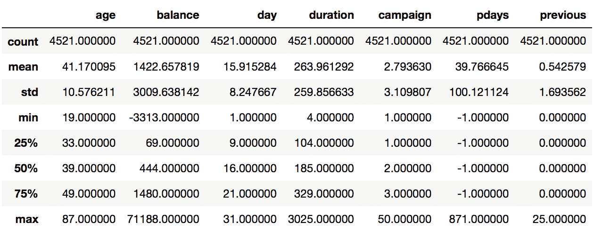

    ###### 图 6.1: 银行数据框

    在研究目标变量（订阅与未订阅——`y`）时，重要的是要查看其分布情况。此数据集中的目标变量类型是分类的，或者说是多类的。在这种情况下，它是二元的（是/否）。

    当分布偏向某一类别时，问题被称为*变量不平衡*。我们可以通过条形图研究目标变量的比例。这可以让我们了解每个类别的数量（在此案例中，了解“no”和“yes”各自的数量）。其中，no 的比例远高于 yes，这就解释了数据中的不平衡。

1.  让我们执行以下命令，以绘制给定数据的条形图：

    ```py
    count_number_susbc = df["y"].value_counts()
    sns.barplot(count_number_susbc.index, count_number_susbc.values)
    df['y'].value_counts()
    ```

    输出结果如下：

    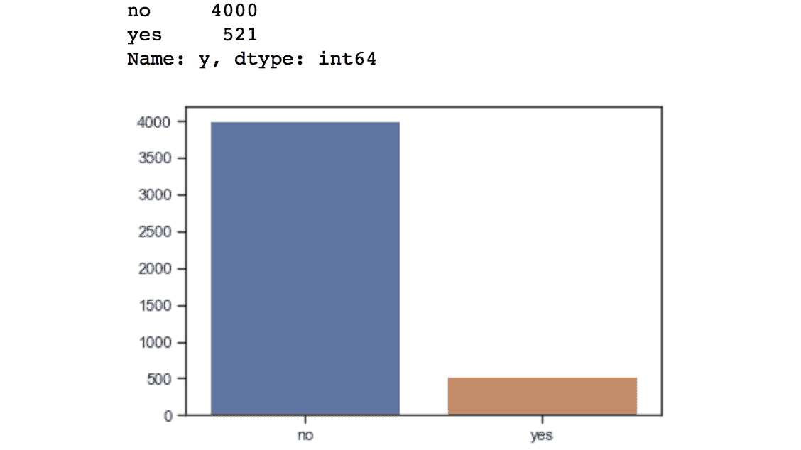

    ###### 图 6.2: 条形图

1.  现在，我们将查看每个变量并观察它们的分布趋势。下面的直方图是数据集中'`age'`列（属性）的示例。直方图/密度图是探索数值型/浮动变量的好方法，类似于条形图。它们也可以用于分类数据变量。在这里，我们将使用直方图展示两个数值型变量（`age` 和 `balance`）的示例，并用条形图展示两个分类变量（`education` 和 `month`）：

    ```py
    # histogram for age (using matplotlib)
    plt.hist(df['age'], color = 'grey', edgecolor = 'black',
             bins = int(180/5))
    # histogram for age (using seaborn)
    sns.distplot(df['age'], hist=True, kde=False, 
                 bins=int(180/5), color = 'blue',
                 hist_kws={'edgecolor':'black'})
    ```

    直方图如下所示：

    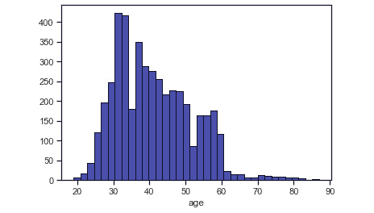

    ###### 图 6.3：年龄的直方图

1.  要绘制数据集中`balance`属性的直方图，请使用以下命令：

    ```py
    # histogram for balance (using matplotlib)
    plt.hist(df['balance'], color = 'grey', edgecolor = 'black',
             bins = int(180/5))
    # histogram for balance (using seaborn)
    sns.distplot(df['balance'], hist=True, kde=False, 
                 bins=int(180/5), color = 'blue',
                 hist_kws={'edgecolor':'black'})
    ```

    平衡的直方图如下所示：

    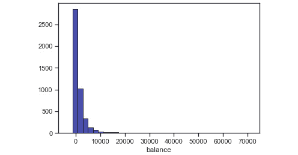

    ###### 图 6.4：平衡的直方图

1.  现在，使用以下代码，绘制数据集中`education`属性的条形图：

    ```py
    # barplot for the variable 'education'
    count_number_susbc = df["education"].value_counts()
    sns.barplot(count_number_susbc.index, count_number_susbc.values)
    df['education'].value_counts()
    ```

    `education`属性的条形图如下所示：

    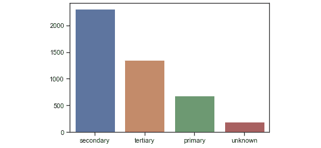

    ###### 图 6.5：教育的条形图

1.  使用以下命令绘制数据集的`month`属性的条形图：

    ```py
    # barplot for the variable 'month'
    count_number_susbc = df["month"].value_counts()
    sns.barplot(count_number_susbc.index, count_number_susbc.values)
    df['education'].value_counts()
    ```

    绘制的图形如下所示：

    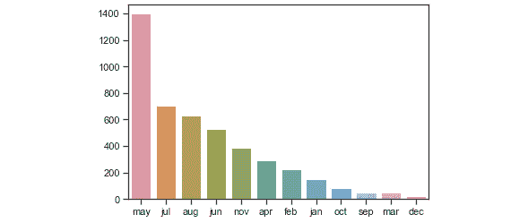

    ###### 图 6.6：月度的条形图

1.  下一个任务是为目标变量的每个类别生成分布并比较分布。绘制目标变量的`age`属性的直方图（`yes`/`no`）：

    ```py
    # generate separate list for each subscription type for age
    x1 = list(df[df['y'] == 'yes']['age'])
    x2 = list(df[df['y'] == 'no']['age'])
    # assign colors for each subscription type 
    colors = ['#E69F00', '#56B4E9']
    names = ['yes', 'no']
    # plot the histogram
    plt.hist([x1, x2], bins = int(180/15), density=True,
             color = colors, label=names)
    # plot formatting
    plt.legend()
    plt.xlabel('IV')
    plt.ylabel('prob distr (IV) for yes and no')
    plt.title('Histogram for Yes and No Events w.r.t. IV')
    ```

    目标变量的`month`属性条形图如下所示：

    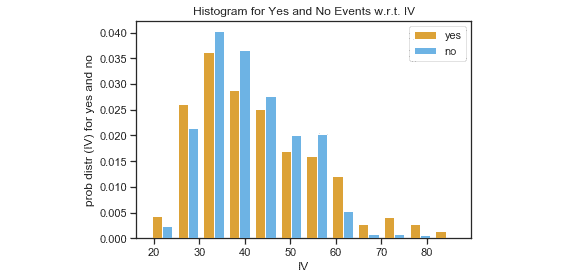

    ###### 图 6.7：目标变量的月份属性条形图

1.  现在，使用以下命令，绘制按月分组的目标变量的条形图：

    ```py
    df.groupby(["month", "y"]).size().unstack().plot(kind='bar', stacked=True, figsize=(20,10))
    ```

    绘制的图形如下所示：

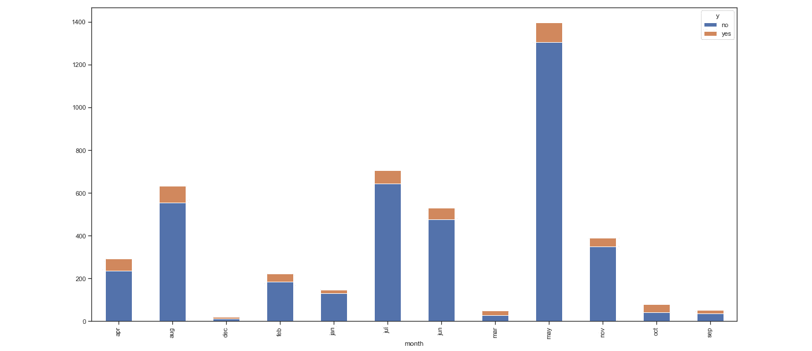

###### 图 6.8：按月分组的直方图

在本练习中，我们研究了建立 KPI 和目标变量—**数据收集**和**分析数据（通过合并或结合多个数据源生成的数据集，用于分析）生成**。KPI 和目标变量已经确定—**KPI 可视化**。现在，在下一个练习中，我们将识别哪些变量在解释目标变量的方差方面是重要的—**特征重要性**。

### 练习 44：生成目标变量的特征重要性并进行 EDA

在前面的练习中，我们研究了属性的趋势，识别它们的分布，以及如何使用各种图表和可视化方法来进行这些分析。在处理建模问题之前，无论是预测问题还是分类问题（例如，从先前的营销活动数据中，如何预测未来最有可能转化的客户），我们必须对数据进行预处理，并选择那些对订阅活动输出模型有影响的重要特征。为此，我们需要查看属性与结果（目标变量）之间的关联，即每个变量解释目标变量的变异性程度。

变量之间的关联可以通过多种方法绘制；然而，在选择方法/算法时，我们必须考虑数据类型。例如，如果我们研究的是数值型变量（有序的整数、浮动数值等），我们可以使用相关分析；如果我们研究的是具有多个类别的分类变量，则可以使用卡方方法。然而，也有许多算法可以同时处理这两者，并提供可衡量的结果来比较变量的重要性。

在本练习中，我们将研究如何使用各种方法来识别特征的重要性：

1.  下载`bank.csv`文件，并使用以下命令读取数据：

    ```py
    import numpy as np
    import pandas as pd
    import seaborn as sns
    import time
    import re
    import os
    import matplotlib.pyplot as plt
    sns.set(style="ticks")
    # set the working directory # in the example, the folder 
    # 'packt_exercises' is in the desktop
    os.chdir("/Users/svk/Desktop/packt_exercises")
    # read the downloaded input data (marketing data)
    df = pd.read_csv('bank.csv', sep=';')
    ```

1.  使用以下命令开发相关矩阵，以识别变量之间的相关性：

    ```py
    df['y'].replace(['yes','no'],[1,0],inplace=True)
    df['default'].replace(['yes','no'],[1,0],inplace=True)
    df['housing'].replace(['yes','no'],[1,0],inplace=True)
    df['loan'].replace(['yes','no'],[1,0],inplace=True)
    corr_df = df.corr()
    sns.heatmap(corr_df, xticklabels=corr_df.columns.values, yticklabels=corr_df.columns.values, annot = True, annot_kws={'size':12})
    heat_map=plt.gcf(); heat_map.set_size_inches(10,5)
    plt.xticks(fontsize=10); plt.yticks(fontsize=10); plt.show()
    ```

    绘制的相关矩阵热图如下：

    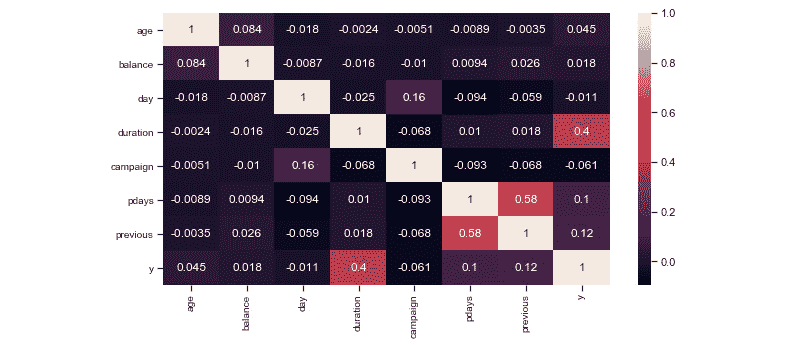

    ###### 图 6.9：相关矩阵

    #### 注意

    `-1` 到 `+1`，其中接近 `0` 的值表示无关系，-1 表示一种变量增加时，另一变量减少（反向关系），+1 表示一种变量增加时，另一变量也增加（正向关系）。

    独立变量之间的高相关性（即所有除目标变量之外的变量）可能会导致变量之间的多重共线性，这可能影响预测模型的准确性。

    #### 注意

    如果尚未安装 Boruta，请使用以下命令确保安装：

    `pip install boruta --upgrade`

1.  基于 Boruta（一个随机森林包装算法）构建特征重要性输出：

    ```py
    # import DecisionTreeClassifier from sklearn and 
    # BorutaPy from boruta
    import numpy as np
    from sklearn.ensemble import RandomForestClassifier
    from boruta import BorutaPy
    # transform all categorical data types to integers (hot-encoding)
    for col_name in df.columns:
        if(df[col_name].dtype == 'object'):
            df[col_name]= df[col_name].astype('category')
            df[col_name] = df[col_name].cat.codes
    # generate separate dataframes for IVs and DV (target variable)
    X = df.drop(['y'], axis=1).values
    Y = df['y'].values
    # build RandomForestClassifier, Boruta models and
    # related parameter
    rfc = RandomForestClassifier(n_estimators=200, n_jobs=4, class_weight='balanced', max_depth=6)
    boruta_selector = BorutaPy(rfc, n_estimators='auto', verbose=2)
    n_train = len(X)
    # fit Boruta algorithm
    boruta_selector.fit(X, Y)
    ```

    输出结果如下：

    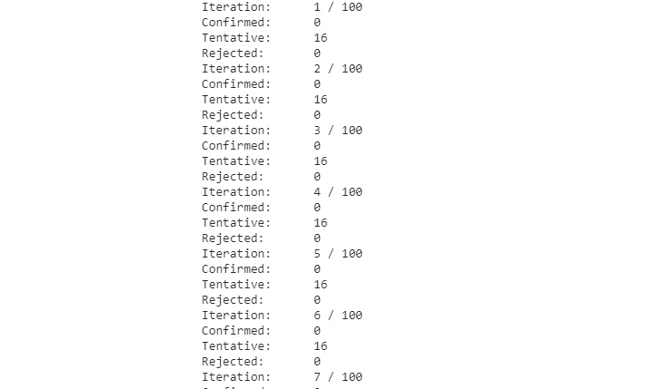

    ###### 图 6.10：拟合 Boruta 算法

1.  按照以下方式检查特征的排名：

    ```py
    feature_df = pd.DataFrame(df.drop(['y'], axis=1).columns.tolist(), columns=['features'])
    feature_df['rank']=boruta_selector.ranking_
    feature_df = feature_df.sort_values('rank', ascending=True).reset_index(drop=True)
    sns.barplot(x='rank',y='features',data=feature_df)
    feature_df
    ```

    输出结果如下：

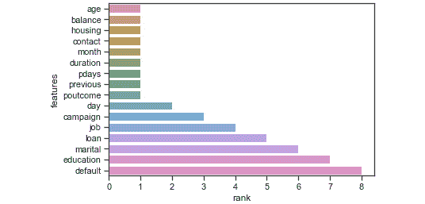

###### 图 6.11：Boruta 输出

## 数据科学项目生命周期的结构化方法

开始数据科学项目时，需要有一个稳健的方法来规划项目，考虑到潜在的扩展性、维护性和团队结构。我们已经学习了如何定义一个业务问题并通过可量化的参数加以量化，接下来的阶段是项目计划，涵盖了解决方案的开发到部署一个可用的商业应用程序。

本主题结合了业界一些最佳实践，以结构化方式提供数据科学项目生命周期管理的示例。这种方法是一个理想化的阶段顺序；然而，在实际应用中，顺序可以根据所需解决方案的类型而变化。

通常，一个数据科学项目单个模型的部署需要大约三个月的时间，但这可能增加到六个月，甚至长达一年。定义从数据到部署的过程是缩短部署时间的关键。

### 数据科学项目生命周期阶段

数据科学项目生命周期的各个阶段如下：

1.  理解和定义业务问题

1.  数据访问与发现

1.  数据工程与预处理

1.  建模开发与评估

### 阶段 1：理解并定义业务问题

每个数据科学项目都始于了解业务领域和框定业务问题。在大多数组织中，高级分析和数据科学技术的应用还是一个新兴学科，参与其中的大多数数据科学家对业务领域的理解有限。

为了理解业务问题和领域，需要识别关键利益相关者和**主题专家**（**SMEs**）。然后，主题专家和数据科学家相互合作，提出初步假设，并确定开发解决方案所需的数据源。这是理解数据科学项目的第一阶段。

一旦我们有了结构清晰的业务问题，并确定了所需的数据和数据源，就可以开始数据发现的下一阶段。第一阶段对建立强大的基础来确定范围和解决方案方法至关重要。

### 阶段 2：数据访问与发现

这一阶段包括识别数据源，并构建数据管道和数据工作流以获取数据。解决方案的性质和依赖的数据在结构、速度和体积方面可能因问题而异。

在这个阶段，重要的是要确定如何从数据源获取数据。获取数据的方式可以通过直接连接器（使用 Python 中的数据库访问库）、使用提供数据访问的 API、直接从网络来源抓取数据，或者甚至是初步原型开发所提供的 CSV 格式的数据转储。一旦建立了强大的数据管道和数据获取工作流，数据科学家就可以开始探索数据，准备分析数据**（通过合并或组合多个数据源以生成一个分析用的数据集）。**

### 阶段 3：数据工程与预处理

数据预处理是指将原始数据转化为机器学习算法可以使用的形式。实际上，这是将数据处理成适合进一步分析的结构，或者将数据转化为可以输入到建模过程中的形式。通常，所需的分析数据可能存储在多个表格、数据库，甚至是外部数据源中。

数据科学家需要从这些数据源中识别出所需的属性，并将现有的数据表合并，以获取分析模型所需的数据。这是一个繁琐且耗时的阶段，数据科学家通常会在开发周期中花费大量时间。

数据预处理包括处理异常值、缺失值填充、特征缩放、将数据映射到高斯（或正态）分布、编码类别数据、离散化等活动。

为了开发强大的机器学习模型，数据必须高效地进行预处理。

#### 注意

Python 有一些库用于数据预处理。scikit-learn 有许多高效的内置方法用于数据预处理。scikit-learn 的文档可以在[`scikit-learn.org/stable/modules/preprocessing.html`](https://scikit-learn.org/stable/modules/preprocessing.html)找到。

让我们通过以下活动，了解如何使用其中一种预处理技术（例如高斯归一化）来进行数据工程和预处理。

### 活动 13：对给定数据的数值特征进行高斯分布映射

在将数据输入算法之前，需要进行各种预处理技术来准备数据。

#### 注意

访问此网站，了解各种预处理方法：[`scikit-learn.org/stable/modules/preprocessing.html`](https://scikit-learn.org/stable/modules/preprocessing.html)。

在本次练习中，我们将进行数据归一化，这对线性回归、逻辑回归等许多参数化模型非常重要：

1.  使用`bank.csv`文件，并将所有所需的包和库导入到 Jupyter 笔记本中。

1.  现在，确定 DataFrame 中的数值数据。根据数据类型（如类别、数值（浮动或整数）、日期等）对数据进行分类。让我们对数值数据进行归一化处理。

1.  进行正态性检验，识别出具有非正态分布的特征。

1.  绘制特征的概率密度图，以直观分析特征的分布。

1.  准备功率转换模型，并根据`box-cox`或`yeo-johnson`方法对识别出的特征进行转换，将它们转换为正态分布。

1.  对新数据（评估数据）应用相同的生成参数进行转换，应用到训练数据中识别出的特征。

    #### 注意

    在转换完成后，前面的图中显示了多个变量的密度图。图中的特征分布更接近高斯分布。

    本活动的解决方案可以在第 236 页找到。

一旦转换完成，我们再次分析特征的正态性，以查看其效果。你会发现，经过转换后，一些特征的原假设未被拒绝（即分布仍然不是高斯分布），并且几乎所有特征的`p`值都较高（参考本活动的第 2 点）。一旦生成了转换后的数据，我们将其与数值数据绑定。

### 第 4 阶段：模型开发

一旦我们获得了清理和预处理过的数据，就可以将其输入到机器学习算法中进行探索性分析或预测分析，或用于其他应用。尽管问题的处理方法可以设计出来，比如分类、关联或回归问题，但需要为数据确定的特定算法也必须被识别出来。例如，如果是分类问题，它可能是决策树、支持向量机，或者是一个具有多层的神经网络。

在建模过程中，数据需要分为测试数据和训练数据。模型在训练数据上进行开发，并在测试数据上评估其性能（准确性/误差）。在选择算法后，需要通过数据科学家调整与之相关的参数，以开发一个稳健的模型。

## 总结

在本章中，我们学习了如何通过一个明确结构化的方法，从数据科学的角度定义业务问题。我们首先理解了如何处理业务问题，如何从利益相关者和业务专家处收集需求，以及如何通过开发初步假设来定义业务问题。

一旦业务问题通过数据管道和工作流定义完成，我们就开始了解如何对收集到的数据进行分析，以生成 KPI 并进行描述性分析，通过各种可视化技术识别历史数据中的关键趋势和模式。

我们还了解了数据科学项目生命周期的结构，从定义业务问题到各种预处理技术和模型开发。在下一章中，我们将学习如何在 Jupyter notebook 上实现高可复现性的概念，以及它在开发中的重要性。
