# 第八章：*第七章*

# 大数据分析中的可重复性

## 学习目标

本章结束时，您将能够：

+   使用 Jupyter 笔记本实现可重复性的概念

+   以可重复的方式进行数据收集

+   实施适当的编码实践和标准，以保持分析的可重复性

+   避免 IPython 脚本的重复工作

本章中，我们将探讨可重复性在大数据分析中的重要作用。

## 介绍

在上一章中，我们通过非常结构化的方法学习了如何从数据科学的角度定义商业问题，其中包括如何识别和理解业务需求，解决方案的方法以及如何构建数据管道并进行分析。

本章将讨论计算工作和研究实践的可重复性，这也是今天业界和学术界面临的主要挑战，尤其是在数据科学工作中，其中大部分数据、完整的数据集和相关的工作流程无法完全访问。

今天，大多数研究和技术论文的结尾都会提到样本数据的使用方法、简要描述采用的研究方法以及解决方案的理论思路。这些作品大多缺乏详细的计算过程和逐步方法。这对读者来说，几乎没有提供足够的知识来重复进行相同的工作。这就是可重复编码的基本目标——代码的可复现性至关重要。

在笔记本的整体发展中，已出现包括文本元素来详细注释的功能，这有助于改进复制过程。正因如此，Jupyter 作为一种笔记本在数据科学和研究界日益受到关注。

Jupyter 的开发旨在成为开源软件，采用开放标准和服务，支持多种编程语言的交互式计算，包括 Python、Spark 和 R。

## 使用 Jupyter 笔记本进行可重复性分析

让我们首先学习什么是**计算可重复性**。如果提供了开发解决方案所用的原始源代码，并且构建相关软件所用的数据能够产生相同的结果，那么研究、解决方案、原型甚至一个简单的算法都可以被称为可重复的。然而，今天科学界在重现同行以前开发的工作方面遇到了一些挑战，主要是由于缺乏文档和理解过程工作流的困难。

缺乏文档的影响可以在各个层面上看到，从理解方法到代码层面。Jupyter 是一种非常适合改善这一过程的工具，有助于更好的可重现性，以及开发代码的重用。这不仅包括理解每一行或代码片段的作用，还包括理解和可视化数据。

#### 注意

Jon Claerbout，被认为是可重现计算研究的奠基人，早在 1990 年代初期，他要求学生们开发可以一键重新生成的研究工作和结果。他认为，完成的工作是需要时间和精力的，应当保持原样，以便后续的工作能够在不遇到困难的情况下重用之前的工作。从宏观角度看，一个经济体的增长在很大程度上由创新的数量决定。早期工作或研究的可重现性促进了整体创新的增长。

现在让我们看看如何使用 Jupyter 笔记本维护有效的计算可重现性。

以下是通过 Jupyter 笔记本在 Python 中实现可重现性的一些广泛方法：

+   提供商业问题的详细介绍

+   记录方法和工作流程

+   解释数据管道

+   解释依赖关系

+   使用源代码版本控制

+   模块化过程

在接下来的章节中，让我们简要地探索并讨论前面提到的主题。

### 商业问题介绍

使用 Jupyter 笔记本的一个关键优势是，它将文本内容与代码结合，形成一个工作流程。

我们必须从一个对已识别的商业问题的良好介绍开始，并将其总结文档化在 Jupyter 笔记本中，以提供问题的要点。它必须包含一个问题陈述，从数据科学的角度描述已识别的商业问题，最后得出为什么我们需要进行此分析或过程目标是什么。

### 记录方法和工作流程

在数据科学中，计算工作可能会有很多反复，如例如进行的探索、使用的算法类型以及调整的参数。

一旦方法的变化已最终确定，就需要对这些变化进行文档记录，以避免工作重复。记录方法和工作流程有助于建立流程。在开发过程中，给代码添加注释是必须的，这应当是一个持续的实践，而不是等到结束或结果出来后再添加注释。到过程结束时，你可能已经忘记了细节，这可能导致对所需努力的错误估算。维护 Jupyter 笔记本并进行良好的文档记录有以下几个优点：

+   跟踪开发工作

+   具有自解释性的代码，并为每个过程添加注释

+   更好地理解代码工作流程以及每一步的结果

+   通过使特定任务的先前代码片段容易找到，避免反复工作

+   通过理解代码的重复使用来避免重复工作

+   知识转移的便利性

### 解释数据管道

用于识别和量化问题的数据可以来自多个数据源、数据库、遗留系统、实时数据源等。参与此过程的数据科学家将与客户的数据管理团队密切合作，提取和收集所需数据，并将其导入分析工具以进行进一步分析，并创建强大的数据管道来获取这些数据。

详细记录数据来源非常重要（在上一章中已讨论），以维护一个数据字典，解释所考虑的变量、为什么要考虑这些变量、我们拥有的数据类型（结构化或非结构化），以及我们所拥有的数据类型；即，我们是否拥有时间序列数据、多变量数据，或是需要从原始数据源（如图像、文本、语音等）进行预处理和生成的数据。

### 解释依赖关系

依赖关系是工具中可用的包和库。例如，你可以使用 OpenCV（[`docs.opencv.org/3.0-beta/doc/py_tutorials/py_tutorials.html`](https://docs.opencv.org/3.0-beta/doc/py_tutorials/py_tutorials.html)），这是一个用于图像相关建模的 Python 库，或者你可以使用像 TensorFlow 这样的 API 进行深度学习建模。另一个例子是：如果你在 Python 中使用 Matplotlib（[`matplotlib.org/`](https://matplotlib.org/)）进行可视化，Matplotlib 可以成为依赖关系的一部分。另一方面，依赖关系还可以包括分析所需的硬件和软件规格。你可以通过使用像 Conda 环境这样的工具，从一开始就显式地管理你的依赖关系，列出所有相关的依赖项（包括它们的包/库版本），这些在之前关于 pandas、NumPy 等依赖关系的章节中已经覆盖。

### 使用源代码版本控制

版本控制是任何涉及代码的计算活动中非常重要的方面。在开发代码时，错误或缺陷是难以避免的。如果有以前版本的代码可用，我们就可以明确定位到缺陷何时被发现、何时解决，以及解决的过程和付出的努力。版本控制使得这一切成为可能。有时，由于可扩展性、性能或其他原因，你可能需要回退到旧版本。通过使用源代码版本控制工具，你可以随时轻松访问以前版本的代码。

### 过程模块化

避免重复代码是管理重复任务、维护代码和调试的有效做法。为了高效地实现这一目标，你必须对过程进行模块化。

让我们详细理解这一点。假设你执行了一组数据处理过程，在这些过程中，你开发了代码来完成任务。现在，假设你需要在后续部分再次使用相同的代码；你需要再次添加、复制或运行相同的步骤，这就变成了重复的任务。输入数据和变量名称可能会发生变化。为了处理这个问题，你可以将之前的步骤编写成一个函数，应用于数据集或变量，并将所有这些函数保存为一个独立的模块。你可以称它为函数文件（例如，`functions.py`，一个 Python 文件）。

在接下来的部分中，我们将更详细地讨论这一点，特别是在以可重现的方式收集和构建高效的数据管道方面。

## 以可重现的方式收集数据

一旦问题被定义，分析任务的第一步是收集数据。数据可以从多个来源提取：数据库、遗留系统、实时数据、外部数据等。数据来源及其如何输入模型需要被记录下来。

让我们理解如何在 Jupyter 笔记本中使用 markdown 和代码块功能。可以通过 Markdown 单元向 Jupyter 笔记本中添加文本。与任何文本编辑器一样，这些文本可以修改为粗体或斜体。要将单元类型更改为 Markdown，可以使用**Cell**菜单。接下来，我们将探讨如何在 Jupyter 中使用 Markdown 和代码单元中的各种功能。

### Markdown 和代码单元中的功能

+   **Jupyter 中的 Markdown**：要在**Jupyter**中选择 Markdown 选项，请点击下拉菜单中的**Widgets**和**Markdown**：

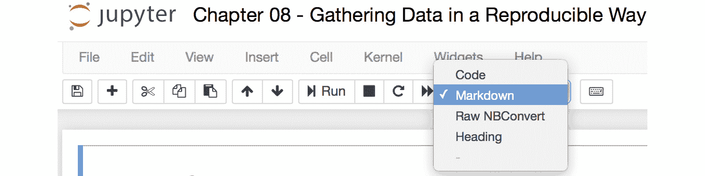

###### 图 7.1：Jupyter 笔记本中的 Markdown 选项

+   `<h1>` 和 `<h2>` 标签：

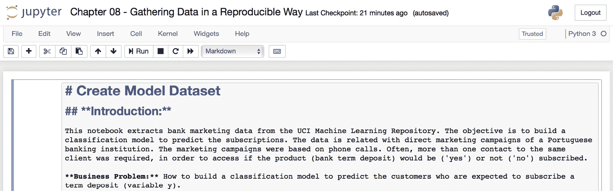

###### 图 7.2：Jupyter 笔记本中的标题级别

+   **Jupyter 中的文本**：要添加文本，保持其原样，我们不需要为其添加任何标签：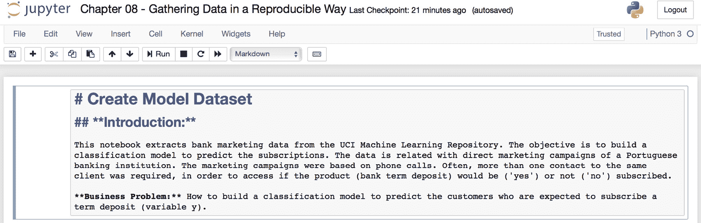

###### 图 7.3：在 Jupyter 笔记本中使用普通文本

+   `**`) 在文本的开始和结束处，例如，**粗体**：


###### 图 7.4：在 Jupyter 笔记本中使用粗体文本

+   `*`) 在文本的开始和结束处：

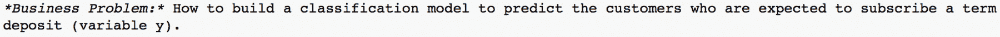

###### 图 7.5：在 Jupyter 笔记本中使用斜体文本

+   **Jupyter 中的代码**：要让文本以代码形式出现，从下拉菜单中选择**Code**选项：


###### 图 7.6：Jupyter 笔记本中的代码

### 在 Markdown 中解释业务问题

简要介绍业务问题，以便理解项目的目标。业务问题定义是对问题陈述的总结，并包括如何通过数据科学算法解决问题的方法：

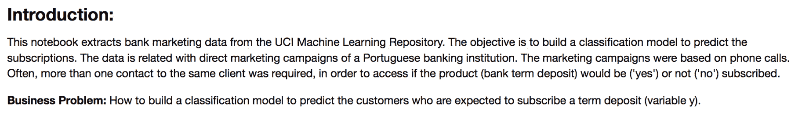

###### 图 7.7：问题定义的片段

### 提供数据源的详细介绍

需要正确记录数据源，以了解数据许可的可重复性及进一步工作的要求。数据源添加的示例如下：

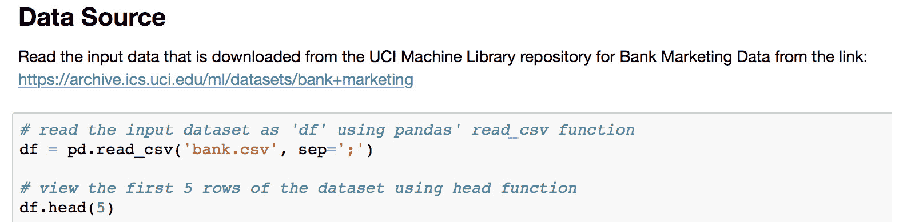

###### 图 7.8：Jupyter notebook 中的数据源

### 在 Markdown 中解释数据属性

需要维护一个数据字典，以便理解属性层面上的数据。这可以包括定义属性及其数据类型：

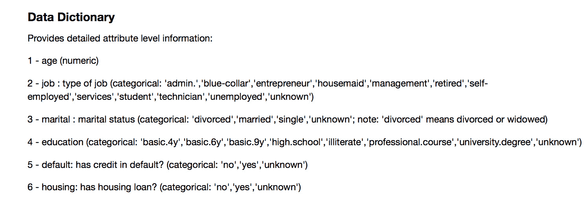

###### 图 7.9：Markdown 中的详细属性

为了在属性层面理解数据，我们可以使用诸如`info`和`describe`之类的函数；然而，`pandas_profiling`是一个提供大量描述性信息的库，通过一个函数，我们可以提取以下信息：

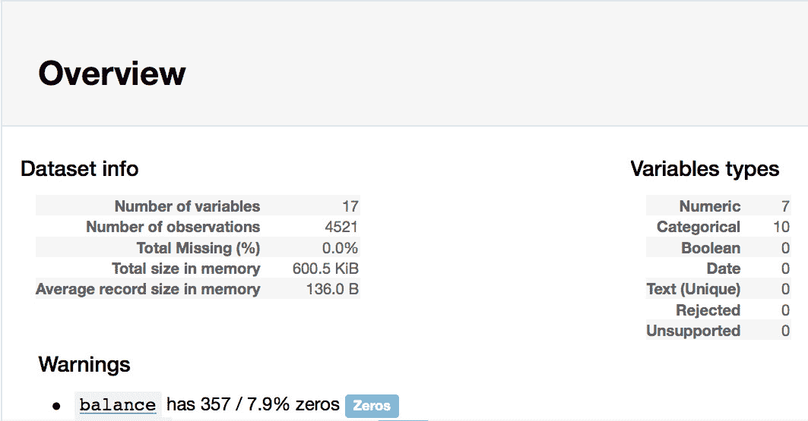

###### 图 7.10：数据概况报告

在 DataFrame 层面，即针对整体数据，这包括所有被考虑的列和行：

+   变量数量

+   观察数量

+   总缺失值 (%)

+   内存中的总大小

+   内存中的平均记录大小

+   相关矩阵

+   示例数据

在属性层面，即针对特定列，规格如下：

+   唯一计数

+   唯一值 (%)

+   缺失值 (%)

+   缺失值 (n)

+   无限值 (%)

+   无限值 (n)

+   分布的直方图

+   极值

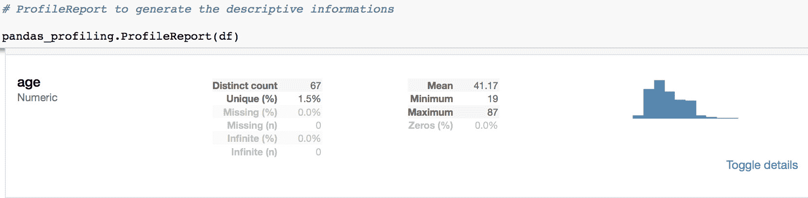

###### 图 7.11：属性层面的数据概况报告

### 练习 45：执行数据可重复性

本练习的目的是学习如何开发具有高可重复性的数据理解代码。我们将使用来自此链接的 UCI 银行和营销数据集：[`raw.githubusercontent.com/TrainingByPackt/Big-Data-Analysis-with-Python/master/Lesson07/Dataset/bank/bank.csv`](https://raw.githubusercontent.com/TrainingByPackt/Big-Data-Analysis-with-Python/master/Lesson07/Dataset/bank/bank.csv)。

让我们执行以下步骤以实现数据的可重复性：

1.  在 notebook 中添加标题并提到业务问题，使用标记法：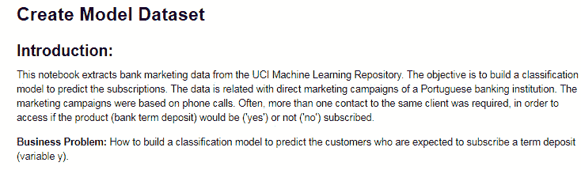

    ###### 图 7.12：介绍和业务问题

1.  将所需的库导入到 Jupyter notebook 中：

    ```py
    import numpy as np
    import pandas as pd
    import time
    import re
    import os
    import pandas_profiling
    ```

1.  现在设置工作目录，如以下命令所示：

    ```py
    os.chdir("/Users/svk/Desktop/packt_exercises")
    ```

1.  使用 pandas 的`read_csv`函数导入并读取输入数据集为`df`：

    ```py
    df = pd.read_csv('bank.csv', sep=';')
    ```

1.  现在使用`head`函数查看数据集的前五行：

    ```py
    df.head(5)
    ```

    输出如下：

    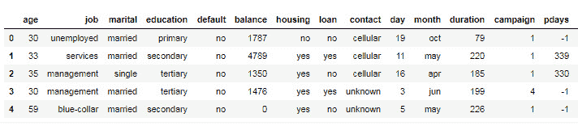

    ###### 图 7.13：CSV 文件中的数据

1.  在 Jupyter notebook 中添加**数据字典**和**数据理解**部分：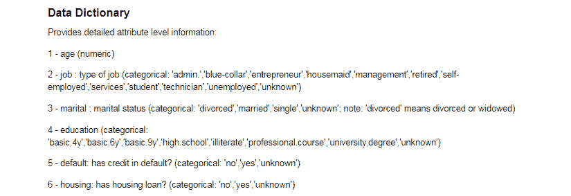

    ###### 图 7.14：数据字典

    **数据理解**部分如下：

    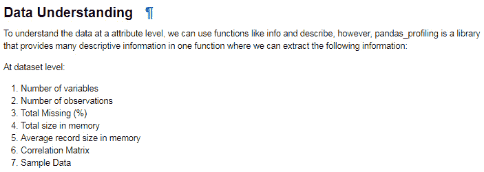

    ###### 图 7.15：数据理解

1.  要理解数据规范，可以使用 pandas profiling 生成描述性信息：

    ```py
    pandas_profiling.ProfileReport(df)
    ```

    输出如下：

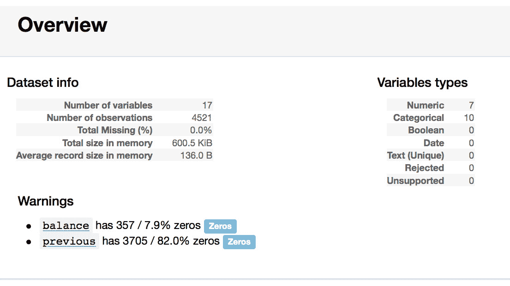

###### 图 7.16：与数据相关的规范摘要

#### 教学人员备注：

本练习展示了如何创建 Jupyter notebook，并包括如何为银行营销问题开发一个可重复的 Jupyter notebook。必须包括对商业问题、数据、数据类型、数据来源等的良好介绍。

## 代码实践和标准

编写符合一套实践和标准的代码对代码的可重复性非常重要，就像在逐步描述中解释流程一样重要。

这适用于任何你可能使用的编码工具，不仅仅是 Jupyter。某些编码实践和标准应严格遵守，接下来将讨论其中的一些内容。

### 环境文档

在安装过程中，你应该保留一段代码，用于安装必要的软件包和库。以下实践有助于代码的可重复性：

+   包括所使用的库/软件包的版本。

+   下载所使用的库/软件包的原始版本，并在新环境中调用软件包进行安装。

+   通过在脚本中有效实施，自动安装依赖项。

### 编写带注释的可读代码

代码注释是一个重要的方面。除了 Jupyter 上的 markdown 选项外，我们还必须为每个代码片段添加注释。有时我们对代码进行的修改可能不会立即使用，但稍后的步骤可能需要。比如，我们可以创建一个对象，虽然下一步不需要，但稍后会用到。如果没有注释，可能会让新用户难以理解代码的流程。注释这些细节非常重要。

当我们使用特定的方法时，必须提供使用该方法的理由。例如，假设在进行数据正态分布转换时，你可以使用 `box-cox` 或 `yeo-johnson`。如果数据中有负值，你可能更倾向于使用 `yeo-johnson`，因为它能够处理负值。此时需要进行如下注释：

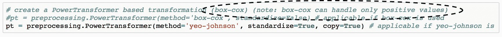

###### 图 7.17：带理由的注释

我们还应遵循良好的命名实践来命名我们创建的对象。例如，您可以将原始数据命名为`raw_data`，模型数据、预处理数据、分析数据等也可以使用相同的命名方式。当创建像模型和方法这样的对象时，也可以采用类似的命名方式，例如，我们可以将幂变换命名为`pt`。

### 有效的工作流分割

在开发代码时，您需要设计一系列步骤以实现最终结果。每个步骤都可以是一个过程的一部分。例如，读取数据、理解数据、进行各种转换或构建模型。每个步骤都需要清晰地分开，原因有多个；首先是为了提高代码的可读性，便于理解每个阶段是如何进行的，其次是为了明确每个阶段是如何生成结果的。

例如，在这里，我们正在查看两组活动。一组是生成循环以识别需要归一化的列，另一组是使用前一阶段的输出生成不需要归一化的列：

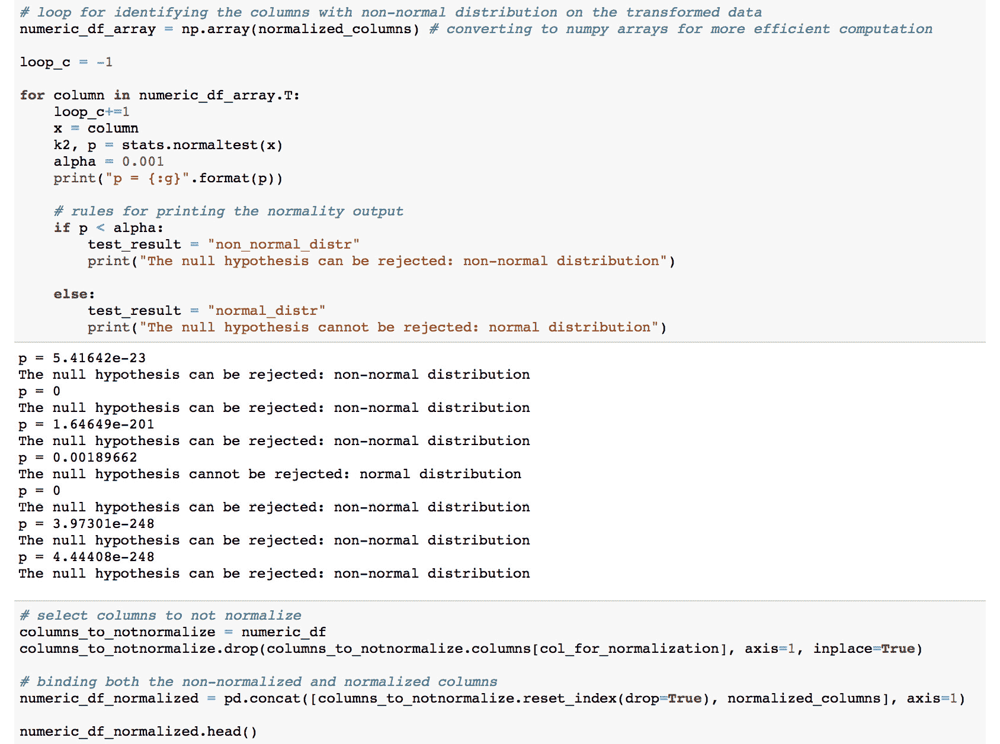

###### 图 7.18：有效的工作流分割

### 工作流文档

当产品和解决方案被开发时，它们通常是在沙箱环境中开发、监控、部署和测试的。为了确保在新环境中顺利部署，我们必须为技术和非技术用户提供足够的支持文档。工作流文档包括需求和设计文档、产品文档、方法论文档、安装指南、软件用户手册、硬件和软件要求、故障排除管理以及测试文档。这些通常是产品或解决方案开发中所必需的。我们不能仅仅把一堆代码交给客户或用户，让他们自行运行。工作流文档在客户或用户环境中的部署和集成阶段非常重要，尤其是在确保代码可重复性方面。

从高层次来看，数据科学项目文档可以分为两个部分：

+   产品文档

+   方法论文档

产品文档提供了关于如何在 UI/UX 中使用每项功能及其应用的信息。产品文档可以进一步细分为：

+   安装指南

+   软件设计与用户手册

+   测试文档

+   故障排除管理

方法论文档提供了关于所使用的算法、方法、解决方案方式等信息。

### 练习 46：高可重复性的缺失值预处理

本练习的目的是学习如何开发具有高可重复性的代码，处理缺失值预处理问题。我们将使用来自这个链接的 UCI 银行和营销数据集：[`raw.githubusercontent.com/TrainingByPackt/Big-Data-Analysis-with-Python/master/Lesson07/Dataset/bank/bank.csv`](https://raw.githubusercontent.com/TrainingByPackt/Big-Data-Analysis-with-Python/master/Lesson07/Dataset/bank/bank.csv)。

执行以下步骤以查找缺失值预处理的可重复性：

1.  在 Jupyter notebook 中导入所需的库和包，如下所示：

    ```py
    import numpy as np
    import pandas as pd
    import collections
    import random
    ```

1.  设置您选择的工作目录，如下所示：

    ```py
    os.chdir("/Users/svk/Desktop/packt_exercises")
    ```

1.  从`back.csv`导入数据集到 Spark 对象中，使用`read_csv`函数，如下所示：

    ```py
    df = pd.read_csv('bank.csv', sep=';')
    ```

1.  现在，使用 head 函数查看数据集的前五行：

    ```py
    df.head(5)
    ```

    输出结果如下：

    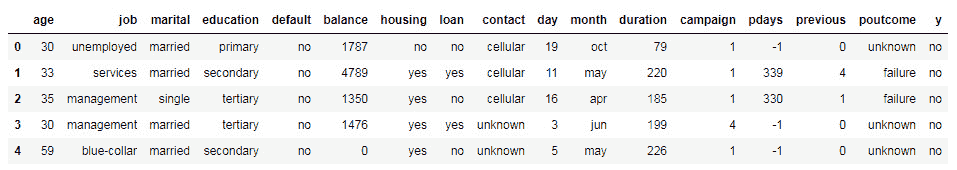

    ###### 图 7.19：银行数据集

    由于数据集没有缺失值，我们需要人为地添加一些缺失值。

1.  首先，设置循环参数，如下所示：

    ```py
    replaced = collections.defaultdict(set)
    ix = [(row, col) for row in range(df.shape[0]) for col in range(df.shape[1])]
    random.shuffle(ix)
    to_replace = int(round(.1*len(ix)))
    ```

1.  创建一个`for`循环来生成缺失值：

    ```py
    for row, col in ix:
        if len(replaced[row]) < df.shape[1] - 1:
            df.iloc[row, col] = np.nan
            to_replace -= 1
            replaced[row].add(col)
            if to_replace == 0:
                break
    ```

1.  使用以下命令，通过查看每一列的缺失值，识别数据中的缺失值：

    ```py
    print(df.isna().sum())
    ```

    输出结果如下：

    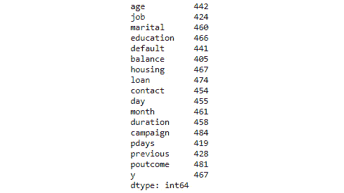

    ###### 图 7.20：查找缺失值

1.  定义**四分位数范围**（**IQRs**）并将其应用于数据集，以识别离群值：

    ```py
    num = df._get_numeric_data()
    Q1 = num.quantile(0.25)
    Q3 = num.quantile(0.75)
    IQR = Q3 - Q1
    print(num < (Q1 - 1.5 * IQR))
    print(num > (Q3 + 1.5 * IQR))
    ```

    输出结果如下：

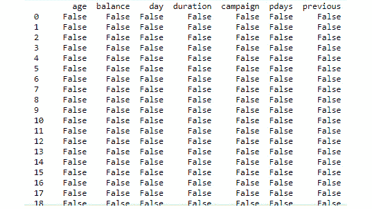

###### 图 7.21：识别离群值

## 避免重复

我们都知道，代码的重复或冗余并不是一个好的编程习惯。它会导致调试困难，并且代码长度增加。相同代码的不同版本会在某些时候带来理解上的困难，尤其是在确定哪个版本是正确时。对于调试来说，某个位置的改动需要在代码中各处体现。为了避免不良编程习惯，编写和维护高质量的代码，让我们在接下来的章节中学习一些最佳实践。

### 使用函数和循环来优化代码

一个函数封装了一个任务，该任务需要一组步骤，将一个或多个输入转换为一个或多个输出，而循环用于对相同代码块的不同样本或子集数据执行重复任务。函数可以为单个变量、多个变量、DataFrame，或者多个参数输入集编写。

例如，假设你只需要对 DataFrame 或矩阵中的数值变量进行某种转换。可以为单个变量编写函数，并将其应用于所有数值列，或者可以为整个 DataFrame 编写函数，该函数会识别数值变量集并将其应用于生成输出。一旦编写了一个函数，它可以应用于接下来代码中的任何类似应用。这将减少重复工作。

编写函数时需要考虑以下挑战：

+   **内部参数变化**：任务之间的输入参数可能会发生变化，这是一个常见的挑战。为了处理这个问题，你可以在定义函数输入时，提到函数输入中的动态变量或对象。

+   **未来任务计算过程中的变化**：编写一个包含内部函数的函数，如果需要捕获任何变化，将不需要进行太多修改。这样，为新任务编写函数将变得容易。

+   **避免在函数中使用循环**：如果需要在数据的多个子集上按行进行处理，可以直接在每个循环中应用函数。这样，函数就不会受到对相同数据的重复代码块的限制。

+   **处理数据类型变化**：函数中的返回对象对于不同的任务可能是不同的。根据任务的不同，返回对象可以根据需要转换为其他数据类或数据类型。然而，输入数据类或数据类型可能会因任务的不同而变化。为了解决这个问题，你需要清楚地提供注释，以帮助理解函数的输入。

+   **编写优化函数**：数组在执行诸如循环或函数等重复任务时非常高效。在 Python 中，使用 NumPy 数组可以对大多数算术操作生成非常高效的数据处理。

### 开发用于代码/算法重用的库/包

包包或库封装了一组模块。它们在代码可复现性和生成的模块方面非常可靠。每天，全球的开发者和研究人员都会生成成千上万个包/库。你可以参考 Python 项目打包指南中的包开发说明来开发一个新的包（[`packaging.python.org/tutorials/packaging-projects/`](https://packaging.python.org/tutorials/packaging-projects/)）。本教程将为你提供如何上传并公开分发包以及内部使用的相关信息。

### 活动 14：进行数据归一化

本次活动的目的是应用在之前练习中学到的各种预处理技术，并使用预处理后的数据开发模型。

现在，让我们执行以下步骤：

1.  导入所需的库并从`bank.csv`文件读取数据。

1.  导入数据集并将 CSV 文件读取到 Spark 对象中。

    检查数据的正态性——下一步是确定数据的正态性。

1.  将数据按数值和类别进行分段，并对数值数据进行分布转换。

1.  创建一个 `for` 循环，循环遍历每一列，以进行正态性测试，检测数据的正态分布。

1.  创建一个幂变换器。幂变换器将把非正态分布的数据转换为正态分布。所开发的模型将用于转换之前识别的非正态列。

1.  将创建的幂变换器模型应用于非正态数据。

1.  要开发一个模型，首先将数据拆分为训练集和测试集以进行交叉验证，训练模型，然后在测试数据上进行预测以进行交叉验证。最后，生成一个交叉验证的混淆矩阵。

    #### 注意事项

    本活动的解决方案可以在第 240 页找到。

## 总结

在本章中，我们从数据科学的角度学习了如何通过结构化的标准和实践来保持代码的可重复性，以避免在使用 Jupyter Notebook 时重复劳动。

我们首先了解了什么是可重复性，以及它如何影响研究和数据科学工作。我们探讨了可以提高代码可重复性的领域，特别是如何在数据可重复性方面保持有效的编码标准。随后，我们研究了重要的编码标准和实践，以通过有效的代码管理来避免重复劳动，方法是通过工作流分段、为所有关键任务开发函数，以及如何从可重用性角度推广编码，创建库和包。

在下一章，我们将学习如何使用目前为止学到的所有功能来生成完整的分析报告。我们还将学习如何使用各种 PySpark 功能进行 SQL 操作，并且如何开发各种可视化图表。
