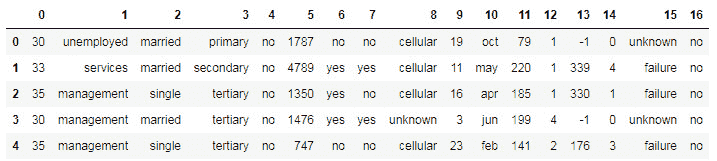

# 第九章：*第八章*

# 创建完整的分析报告

## 学习目标

本章结束时，您将能够：

+   从不同源读取 Spark 数据

+   对 Spark DataFrame 执行 SQL 操作

+   以一致的方式生成统计度量

+   使用 Plotly 生成图表

+   汇总包含所有先前步骤和数据的分析报告

在本章中，我们将使用 Spark 读取数据、聚合数据并提取统计度量。我们还将使用 Pandas 从聚合数据生成图表，并形成分析报告。

## 介绍

如果您已经在数据行业工作了一段时间，您会理解与不同数据源打交道、分析它们并以可消费的业务报告呈现它们的挑战。在使用 Python 上的 Spark 时，您可能需要从各种数据源读取数据，如平面文件、REST API 中的 JSON 格式等。

在现实世界中，获取正确格式的数据始终是一个挑战，需要进行多个 SQL 操作来收集数据。因此，任何数据科学家都必须知道如何处理不同的文件格式和数据源，进行基本的 SQL 操作，并将其以可消费的格式呈现。

本章提供了读取不同类型数据、对其进行 SQL 操作、进行描述性统计分析并生成完整分析报告的常用方法。我们将从理解如何将不同类型的数据读取到 PySpark 中开始，然后对其生成各种分析和图表。

## 从不同数据源读取 Spark 数据

Spark 的一个优势是能够从各种数据源读取数据。然而，这种能力并不一致，并且随着每个 Spark 版本的更新而变化。本章的这一部分将解释如何从 CSV 和 JSON 文件中读取数据。

### 练习 47：使用 PySpark 对象从 CSV 文件读取数据

要读取 CSV 数据，您必须编写`spark.read.csv("带有.csv 的文件名")`函数。这里，我们读取的是前面章节中使用的银行数据。

#### 注意

这里使用了`sep`函数。

我们必须确保根据源数据的分隔方式使用正确的`sep`函数。

现在，让我们执行以下步骤从`bank.csv`文件读取数据：

1.  首先，让我们将所需的包导入到 Jupyter 笔记本中：

    ```py
    import os
    import pandas as pd
    import numpy as np
    import collections
    from sklearn.base import TransformerMixin
    import random
    import pandas_profiling
    ```

1.  接下来，导入所有必需的库，如下所示：

    ```py
    import seaborn as sns
    import time
    import re
    import os
    import matplotlib.pyplot as plt
    ```

现在，使用`tick`主题，这将使我们的数据集更加可视化，并提供更高的对比度：

```py
sns.set(style="ticks")
```

1.  现在，使用以下命令更改工作目录：

    ```py
    os.chdir("/Users/svk/Desktop/packt_exercises")
    ```

1.  让我们导入构建 Spark 会话所需的库：

    ```py
    from pyspark.sql import SparkSession
    spark = SparkSession.builder.appName('ml-bank').getOrCreate()
    ```

1.  现在，让我们在创建`df_csv` Spark 对象后，通过以下命令读取 CSV 数据：

    ```py
    df_csv = spark.read.csv('bank.csv', sep=';', header = True, inferSchema = True)
    ```

1.  使用以下命令打印模式：

    ```py
    df_csv.printSchema()
    ```

    输出结果如下：

    

###### 图 8.1：银行模式

### 使用 PySpark 对象读取 JSON 数据

要读取 JSON 数据，必须在设置 SQL 上下文后使用`read.json("带有.json 的文件名")`函数：


###### 图 8.2：在 PySpark 中读取 JSON 文件

## Spark DataFrame 上的 SQL 操作

Spark 中的 DataFrame 是一个分布式的行列集合。它与关系型数据库中的表或 Excel 工作表相同。Spark 的 RDD/DataFrame 能够高效处理大量数据，并且可以处理 PB 级别的数据，无论是结构化数据还是非结构化数据。

Spark 通过将 DataFrame 组织成列来优化数据查询，这有助于 Spark 理解数据的模式。最常用的一些 SQL 操作包括对数据进行子集化、合并数据、过滤、选择特定列、删除列、删除所有空值以及添加新列等。

### 练习 48：在 PySpark 中读取数据并进行 SQL 操作

对于数据的总结统计，我们可以使用` spark_df.describe().show()`函数，它将提供 DataFrame 中所有列的`count`、`mean`、`standard deviation`、`max`和`min`等信息。

例如，在我们所考虑的数据集——银行营销数据集([`raw.githubusercontent.com/TrainingByPackt/Big-Data-Analysis-with-Python/master/Lesson08/bank.csv`](https://raw.githubusercontent.com/TrainingByPackt/Big-Data-Analysis-with-Python/master/Lesson08/bank.csv))——中，可以通过以下方式获得总结统计数据：

1.  创建一个新的 Jupyter 笔记本后，导入所有必要的包，如下所示：

    ```py
    import os
    import pandas as pd
    import numpy as np
    ```

1.  现在，使用以下命令更改工作目录：

    ```py
    os.chdir("/Users/svk/Desktop/packt_exercises")
    ```

1.  导入所有需要的库以构建 Spark 会话：

    ```py
    from pyspark.sql import SparkSession
    spark = SparkSession.builder.appName('ml-bank').getOrCreate()
    ```

1.  使用 Spark 对象创建并读取 CSV 文件中的数据，如下所示：

    ```py
    spark_df = spark.read.csv('bank.csv', sep=';', header = True, inferSchema = True)
    ```

1.  现在，让我们使用以下命令打印 Spark 对象的前五行：

    ```py
    spark_df.head(5)
    ```

    输出结果如下：

    

    ###### 图 8.3：银行数据的前五行（非结构化）

1.  前面的输出是非结构化的。让我们首先识别数据类型，以便获取结构化数据。使用以下命令打印每列的数据类型：

    ```py
    spark_df.printSchema()
    ```

    输出结果如下：

    

    ###### 图 8.4：银行数据类型（结构化）

1.  现在，让我们计算行和列的总数，并查看数据的概况：

    ```py
    spark_df.count()
    ```

    输出结果如下：

    ```py
    4521
    len(spark_df.columns), spark_df.columns
    ```

    输出结果如下：

    

    ###### 图 8.5：行和列名称的总数

1.  使用以下命令打印 DataFrame 的总结统计：

    ```py
    spark_df.describe().show()
    ```

    输出结果如下：

    

    ###### 图 8.6：数值列的总结统计

    要从 DataFrame 中选择多个列，可以使用 `spark_df.select('col1', 'col2', 'col3')` 函数。例如，使用以下命令从 `balance` 和 `y` 列中选择前五行：

    ```py
    spark_df.select('balance','y').show(5)
    ```

    输出如下：

    

    ###### 图 8.7：余额和 y 列的数据

1.  为了识别两个变量之间在频率层次上的关系，可以使用 `crosstab`。要得出两个列之间的交叉表，可以使用 `spark_df.crosstab('col1', 'col2')` 函数。交叉表是针对两个分类变量进行的，而不是数字变量：

    ```py
    spark_df.crosstab('y', 'marital').show()
    ```

    

    ###### 图 8.8：分类列的配对频率

1.  现在，让我们向数据集添加一列新列：

    ```py
    # sample sets
    sample1 = spark_df.sample(False, 0.2, 42)
    sample2 = spark_df.sample(False, 0.2, 43)
    # train set
    train = spark_df.sample(False, 0.8, 44)
    train.withColumn('balance_new', train.balance /2.0).select('balance','balance_new').show(5)
    ```

    输出如下：

    

    ###### 图 8.9：新添加列的数据

1.  使用以下命令删除新创建的列：

    ```py
    train.drop('balance_new)
    ```

### 练习 49：创建和合并两个 DataFrame

在本练习中，我们将提取并使用银行营销数据（[`archive.ics.uci.edu/ml/datasets/bank+marketing`](https://archive.ics.uci.edu/ml/datasets/bank+marketing)）来自 UCI 机器学习库。目标是使用 PySpark 对 Spark DataFrame 执行合并操作。

数据与葡萄牙银行机构的直接营销活动相关。营销活动主要通过电话进行。通常，需要对同一客户进行多次联系，以判断该产品（**银行定期存款**）是否会被（**是**）或不会被（**否**）订阅。

现在，让我们从当前的银行营销数据创建两个 DataFrame，并基于主键将它们合并：

1.  首先，在 Jupyter notebook 中导入所需的头文件：

    ```py
    import os
    import pandas as pd
    import numpy as np
    import pyspark
    ```

1.  现在，使用以下命令更改工作目录：

    ```py
    os.chdir("/Users/svk/Desktop/packt_exercises")
    ```

1.  导入构建 Spark 会话所需的所有库：

    ```py
    from pyspark.sql import SparkSession
    spark = SparkSession.builder.appName('ml-bank').getOrCreate()
    ```

1.  使用以下命令将数据从 CSV 文件读取到 Spark 对象：

    ```py
    spark_df = spark.read.csv('bank.csv', sep=';', header = True, inferSchema = True)
    ```

1.  打印 Spark 对象的前五行：

    ```py
    spark_df.head(5)
    ```

    输出如下：

    

    ###### 图 8.10：前五行的银行数据（非结构化）

1.  现在，为了使用主键（ID）合并两个 DataFrame，首先需要将其拆分成两个 DataFrame。

1.  首先，添加一个包含 `ID` 列的新 DataFrame：

    ```py
    from pyspark.sql.functions import monotonically_increasing_id
    train_with_id = spark_df.withColumn("ID", monotonically_increasing_id())
    ```

1.  然后，创建另一个列 `ID2`：

    ```py
    train_with_id = train_with_id.withColumn('ID2', train_with_id.ID)
    ```

1.  使用以下命令拆分 DataFrame：

    ```py
    train_with_id1 = train_with_id.drop('balance', "ID2")
    train_with_id2 = train_with_id.select('balance', "ID2")
    ```

1.  现在，修改 `train_with_id2` 的 ID 列名：

    ```py
    train_with_id2 = train_with_id2.withColumnRenamed("ID2", "ID")
    ```

1.  使用以下命令合并 `train_with_id1` 和 `train_with_id2`：

    ```py
    train_merged = train_with_id1.join(train_with_id2, on=['ID'], how='left_outer')
    ```

### 练习 50：子集化 DataFrame

在本次练习中，我们将从 UCI 机器学习库提取并使用银行营销数据（[`archive.ics.uci.edu/ml/datasets/bank+marketing`](https://archive.ics.uci.edu/ml/datasets/bank+marketing)）。目标是使用 PySpark 对 Spark 数据框进行过滤/子集操作。

让我们从银行营销数据中提取出余额大于`0`的子集：

1.  首先，在 Jupyter 笔记本中导入所需的头文件：

    ```py
    import os
    import pandas as pd
    import numpy as np
    import pyspark
    ```

1.  现在，使用以下命令更改工作目录：

    ```py
    os.chdir("/Users/svk/Desktop/packt_exercises")
    ```

1.  导入构建 Spark 会话所需的所有库：

    ```py
    from pyspark.sql import SparkSession
    spark = SparkSession.builder.appName('ml-bank').getOrCreate()
    ```

1.  现在，使用以下命令将 CSV 数据作为 Spark 对象读取：

    ```py
    spark_df = spark.read.csv('bank.csv', sep=';', header = True, inferSchema = True)
    ```

1.  让我们运行 SQL 查询以子集化并过滤数据框：

    ```py
    train_subsetted = spark_df.filter(spark_df.balance > 0.0)
    pd.DataFrame(train_subsetted.head(5))
    ```

    输出如下：

    

###### 图 8.11：过滤后的数据框

## 生成统计度量

Python 是一种通用语言，具有统计模块。很多统计分析（如描述性分析，包括识别数值变量的数据分布，生成相关矩阵，识别类别变量的各个层次频率及其众数等）可以在 Python 中完成。以下是一个相关性示例：


###### 图 8.12：分段数值数据与相关矩阵输出

识别数据分布并对其进行标准化对参数模型（如`yeo-johnson`方法）进行数据标准化非常重要：


###### 图 8.13：识别数据分布——正态性检验

然后使用`yeo-johnson`或`box-cox`方法对识别出的变量进行标准化。

生成特征的重要性在数据科学项目中非常重要，尤其是在使用预测技术时。这大致属于统计分析范畴，因为各种统计技术用于识别重要的变量。这里使用的一种方法是`Boruta`，它是一个围绕`RandomForest`算法的变量重要性分析方法。为此，我们将使用`BorutaPy`包：


###### 图 8.14：特征重要性

### 活动 15：使用 Plotly 生成可视化

在本次活动中，我们将从 UCI 机器学习库提取并使用银行营销数据。目标是使用 Python 中的 Plotly 生成可视化图表。

#### 注意

Plotly 的 Python 绘图库可以生成互动式、出版质量的图表。

执行以下步骤以使用 Plotly 生成可视化图表：

1.  将所需的库和包导入到 Jupyter 笔记本中。

1.  导入用于 Plotly 的数据可视化所需的库：

    ```py
    import plotly.graph_objs as go
    from plotly.plotly import iplot
    import plotly as py
    ```

1.  从`bank.csv`文件中读取数据到 Spark 数据框。

1.  检查您系统上运行的 Plotly 版本。确保您正在运行更新版本。使用`pip install plotly --upgrade`命令，然后运行以下代码：

    ```py
    from plotly import __version__
    from plotly.offline import download_plotlyjs, init_notebook_mode, plot, iplot
    print(__version__) # requires version >= 1.9.0
    ```

    输出如下：

    ```py
    3.7.1
    ```

1.  现在导入所需的库以使用 Plotly 绘制图表：

    ```py
    import plotly.plotly as py
    import plotly.graph_objs as go
    from plotly.plotly import iplot
    init_notebook_mode(connected=True)
    ```

1.  在以下命令中设置 Plotly 凭据，如此处所示：

    ```py
    plotly.tools.set_credentials_file(username='Your_Username', api_key='Your_API_Key')
    ```

    #### 注意

    要为 Plotly 生成 API 密钥，请注册帐户并转到[`plot.ly/settings#/`](https://plot.ly/settings#/)。单击**API Keys**选项，然后单击**Regenerate Key**选项。

1.  现在，使用 Plotly 绘制以下每个图形：

    条形图：

    

###### 图 8.15: 银行数据的条形图

散点图：


###### 图 8.16: 银行数据的散点图

箱线图：


###### 图 8.17: 银行数据的箱线图

#### 注意

此活动的解决方案可在第 248 页找到。

## 总结

在本章中，我们学习了如何将数据从各种来源导入 Spark 环境作为 Spark DataFrame。此外，我们还学习了如何对该 DataFrame 执行各种 SQL 操作，以及如何生成各种统计措施，如相关性分析，数据分布识别，构建特征重要性模型等。我们还研究了如何使用 Plotly 离线生成有效的图表，您可以生成各种图表以开发分析报告。

本书希望为您提供一次关于大数据的激动人心的旅程。我们从 Python 开始，涵盖了 Python 数据科学堆栈的几个库：NumPy 和 Pandas，我们还看到如何使用 Jupyter 笔记本。然后，我们学习了如何创建信息化的数据可视化图表，介绍了良好图表的一些指导原则，并使用 Matplotlib 和 Seaborn 生成图形。接着，我们开始使用大数据工具 - Hadoop 和 Spark，从而理解了基本原理和操作。

我们已经看到如何在 Spark 中使用 DataFrame 来操作数据，并且已经掌握了利用诸如相关性和维度缩减等概念来更好地理解我们的数据。本书还涵盖了可复现性，以便在需要时能够支持和更好地复制分析，我们以最终报告结束了我们的旅程。希望本书涵盖的主题和实际示例能帮助您在数据旅程的各个领域中取得成功。
