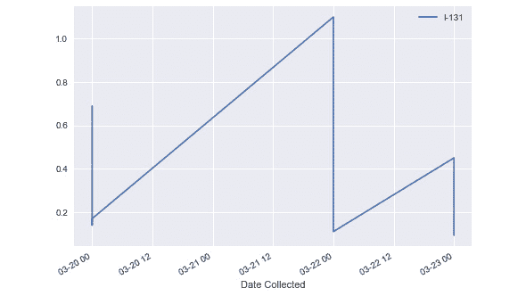

# 第十章：*附录*

## 关于

本节内容旨在帮助学生完成书中的活动。它包括学生必须执行的详细步骤，以实现活动目标。

## 第一章：Python 数据科学工具栈

### 活动 1：IPython 和 Jupyter

1.  在文本编辑器中打开`python_script_student.py`文件，将内容复制到 IPython 中的笔记本，并执行操作。

1.  将 Python 脚本中的代码复制并粘贴到 Jupyter 笔记本中：

    ```py
    import numpy as np
    def square_plus(x, c):
        return np.power(x, 2) + c
    ```

1.  现在，更新`x`和`c`变量的值。然后，修改函数的定义：

    ```py
    x = 10
    c = 100
    result = square_plus(x, c)
    print(result)
    ```

    输出如下：

    ```py
    200
    ```

### 活动 2：处理数据问题

1.  导入 pandas 和 NumPy 库：

    ```py
    import pandas as pd
    import numpy as np
    ```

1.  从美国环境保护局获取 RadNet 数据集，数据可通过 Socrata 项目下载：

    ```py
    url = "https://opendata.socrata.com/api/views/cf4r-dfwe/rows.csv?accessType=DOWNLOAD"
    df = pd.read_csv(url)
    ```

1.  创建一个包含 RadNet 数据集中放射性同位素的数值列的列表：

    ```py
    columns = df.columns
    id_cols = ['State', 'Location', "Date Posted", 'Date Collected', 'Sample Type', 'Unit']
    columns = list(set(columns) - set(id_cols))
    columns
    ```

1.  对一列使用`apply`方法，并使用一个`lambda`函数比较`Non-detect`字符串：

    ```py
    df['Cs-134'] = df['Cs-134'].apply(lambda x: np.nan if x == "Non-detect" else x)
    df.head()
    ```

    输出如下：

    

    ###### 图 1.19：应用 lambda 函数后的 DataFrame

1.  将一列中的文本值替换为`NaN`，使用`np.nan`：

    ```py
    df.loc[:, columns] = df.loc[:, columns].applymap(lambda x: np.nan if x == 'Non-detect' else x)
    df.loc[:, columns] = df.loc[:, columns].applymap(lambda x: np.nan if x == 'ND' else x)
    ```

1.  使用相同的 lambda 比较，并对多个列同时使用`applymap`方法，使用在第一步中创建的列表：

    ```py
    df.loc[:, ['State', 'Location', 'Sample Type', 'Unit']] = df.loc[:, ['State', 'Location', 'Sample Type', 'Unit']].applymap(lambda x: x.strip())
    ```

1.  创建一个包含所有非数值列的列表：

    ```py
    df.dtypes
    ```

    输出如下：

    

    ###### 图 1.20：列及其类型列表

1.  使用`to_numeric`函数将 DataFrame 对象转换为浮动数值：

    ```py
    df['Date Posted'] = pd.to_datetime(df['Date Posted'])
    df['Date Collected'] = pd.to_datetime(df['Date Collected'])
    for col in columns:
        df[col] = pd.to_numeric(df[col])
    df.dtypes
    ```

    输出如下：

    

    ###### 图 1.21：列及其类型列表

1.  使用选择和过滤方法，确保字符串列的名称没有任何空格：

    ```py
    df['Date Posted'] = pd.to_datetime(df['Date Posted'])
    df['Date Collected'] = pd.to_datetime(df['Date Collected'])
    for col in columns:
        df[col] = pd.to_numeric(df[col])
    df.dtypes
    ```

    输出如下：


###### 图 1.22：应用选择和过滤方法后的 DataFrame

### 活动 3：使用 Pandas 绘制数据

1.  使用我们正在处理的 RadNet DataFrame。

1.  修复所有数据类型问题，正如我们之前看到的那样。

1.  创建一个图表，对`Location`进行筛选，选择`San Bernardino`市，并且选择一个放射性同位素，*x*轴设置为`date`，*y*轴为放射性同位素`I-131`：

    ```py
    df.loc[df.Location == 'San Bernardino'].plot(x='Date Collected', y='I-131')
    ```

    输出如下：

    

    ###### 图 1.23：收集日期与 I-131 的关系图

1.  创建一个散点图，显示两个相关放射性同位素`I-131`和`I-132`的浓度：

    ```py
    fig, ax = plt.subplots()
    ax.scatter(x=df['I-131'], y=df['I-132'])
    _ = ax.set(
        xlabel='I-131',
        ylabel='I-132',
        title='Comparison between concentrations of I-131 and I-132'
    )
    ```

    输出如下：


###### 图 1.24：I-131 和 I-132 浓度图

## 第二章：使用 Matplotlib 和 Seaborn 进行统计可视化

### 活动 4：使用面向对象 API 和 Pandas DataFrame 绘制线形图

1.  在 Jupyter notebook 中导入所需的库，并从 Auto-MPG 数据集仓库读取数据集：

    ```py
    %matplotlib inline
    import matplotlib as mpl
    import matplotlib.pyplot as plt import numpy as np
    import pandas as pd
    url = "https://archive.ics.uci.edu/ml/machine-learning-databases/auto-mpg/auto-mpg.data"
    df = pd.read_csv(url)
    ```

1.  提供列名以简化数据集，如下所示：

    ```py
    column_names = ['mpg', 'cylinders', 'displacement', 'horsepower', 'weight', 'acceleration', 'year', 'origin', 'name']
    ```

1.  现在读取包含列名的新数据集并显示：

    ```py
    df = pd.read_csv(url, names= column_names, delim_whitespace=True)
    df.head()
    ```

    图形如下：

    

    ###### 图 2.29：auto-mpg 数据框

1.  使用以下命令将 `horsepower` 和 `year` 数据类型转换为浮动和整数：

    ```py
    df.loc[df.horsepower == '?', 'horsepower'] = np.nan
    df['horsepower'] = pd.to_numeric(df['horsepower'])
    df['full_date'] = pd.to_datetime(df.year, format='%y')
    df['year'] = df['full_date'].dt.year
    ```

1.  让我们显示数据类型：

    ```py
    df.dtypes
    ```

    输出结果如下：

    

    ###### 图 2.30：数据类型

1.  现在使用以下命令绘制每年平均的 `horsepower`：

    ```py
    df.groupby('year')['horsepower'].mean().plot()
    ```

    输出结果如下：


###### 图 2.31：折线图

### 活动 5：使用散点图理解变量之间的关系

1.  在 Jupyter notebook 中导入所需的库，并从 Auto-MPG 数据集仓库读取数据集：

    ```py
    %matplotlib inline
    import pandas as pd
    import numpy as np
    import matplotlib as mpl
    import matplotlib.pyplot as plt
    import seaborn as sns
    url = "https://archive.ics.uci.edu/ml/machine-learning-databases/auto-mpg/auto-mpg.data"
    df = pd.read_csv(url)
    ```

1.  提供列名以简化数据集，如下所示：

    ```py
    column_names = ['mpg', 'cylinders', 'displacement', 'horsepower', 'weight', 'acceleration', 'year', 'origin', 'name']
    ```

1.  现在读取包含列名的新数据集并显示：

    ```py
    df = pd.read_csv(url, names= column_names, delim_whitespace=True)
    df.head()
    ```

    图形如下：

    

    ###### 图 2.32：Auto-mpg 数据框

1.  现在使用 `scatter` 方法绘制散点图：

    ```py
    fig, ax = plt.subplots()
    ax.scatter(x = df['horsepower'], y=df['weight'])
    ```

    输出结果如下：


###### 图 2.33：使用 scatter 方法的散点图

### 活动 6：将图形导出为磁盘文件

1.  在 Jupyter notebook 中导入所需的库，并从 Auto-MPG 数据集仓库读取数据集：

    ```py
    %matplotlib inline
    import pandas as pd
    import numpy as np
    import matplotlib as mpl
    import matplotlib.pyplot as plt
    import seaborn as sns
    url = "https://archive.ics.uci.edu/ml/machine-learning-databases/auto-mpg/auto-mpg.data"
    df = pd.read_csv(url)
    ```

1.  提供列名以简化数据集，如下所示：

    ```py
    column_names = ['mpg', 'cylinders', 'displacement', 'horsepower', 'weight', 'acceleration', 'year', 'origin', 'name']
    ```

1.  现在读取包含列名的新数据集并显示：

    ```py
    df = pd.read_csv(url, names= column_names, delim_whitespace=True)
    ```

1.  使用以下命令创建条形图：

    ```py
    fig, ax = plt.subplots()
    df.weight.plot(kind='hist', ax=ax)
    ```

    输出结果如下：

    

    ###### 图 2.34：条形图

1.  使用 `savefig` 函数将其导出为 PNG 文件：

    ```py
    fig.savefig('weight_hist.png')
    ```

### 活动 7：完整的图表设计

1.  在 Jupyter notebook 中导入所需的库，并从 Auto-MPG 数据集仓库读取数据集：

    ```py
    %matplotlib inline
    import pandas as pd
    import numpy as np
    import matplotlib as mpl
    import matplotlib.pyplot as plt
    import seaborn as sns
    url = "https://archive.ics.uci.edu/ml/machine-learning-databases/auto-mpg/auto-mpg.data"
    df = pd.read_csv(url)
    ```

1.  提供列名以简化数据集，如下所示：

    ```py
    column_names = ['mpg', 'cylinders', 'displacement', 'horsepower', 'weight', 'acceleration', 'year', 'origin', 'name']
    ```

1.  现在读取包含列名的新数据集并显示：

    ```py
    df = pd.read_csv(url, names= column_names, delim_whitespace=True)
    ```

1.  对 `year` 和 `cylinders` 进行分组，并取消将它们用作索引的选项：

    ```py
    df_g = df.groupby(['year', 'cylinders'], as_index=False)
    ```

1.  计算每加仑英里数的平均值，并按分组设置 `year` 为索引：

    ```py
    df_g = df_g.mpg.mean()
    ```

1.  将 `year` 设置为数据框的索引：

    ```py
    df_g = df_g.set_index(df_g.year)
    ```

1.  使用面向对象的 API 创建图形和坐标轴：

    ```py
    import matplotlib.pyplot as plt
    fig, axes = plt.subplots()
    ```

1.  按 `cylinders` 对 `df_g` 数据集进行分组，并使用创建的大小为 (`10`, `8`) 的坐标轴绘制每加仑英里数变量：

    ```py
    df = df.convert_objects(convert_numeric=True)
    df_g = df.groupby(['year', 'cylinders'], as_index=False).horsepower.mean()
    df_g = df_g.set_index(df_g.year)
    ```

1.  设置 **标题**、**x** 轴标签和 **y** 轴标签：

    ```py
    fig, axes = plt.subplots()
    df_g.groupby('cylinders').horsepower.plot(axes=axes, figsize=(12,10))
    _ = axes.set(
        title="Average car power per year",
        xlabel="Year",
        ylabel="Power (horsepower)"

    )
    ```

    输出结果如下：

    

    ###### 图 2.35：每年平均汽车功率的折线图（无图例）

1.  包括图例，如下所示：

    ```py
    axes.legend(title='Cylinders', fancybox=True)
    ```

    

    ###### 图 2.36：每年平均汽车功率的折线图（有图例）

1.  将图像保存为 PNG 文件：

    ```py
    fig.savefig('mpg_cylinder_year.png')
    ```

## 第三章：与大数据框架协作

### 活动 8：解析文本

1.  使用 `text` 方法将文本文件读入 Spark 对象：

    ```py
    rdd_df = spark.read.text("/localdata/myfile.txt").rdd
    ```

    为了解析我们正在读取的文件，我们将使用 lambda 函数和 Spark 操作，例如 `map`、`flatMap` 和 `reduceByKey`。`flatmap` 将一个函数应用到 RDD 的所有元素，扁平化结果并返回转换后的 RDD。`reduceByKey` 会根据给定的键合并值，进行值的合并。借助这些函数，我们可以统计文本中的行数和单词数。

1.  使用以下命令从文本中提取 `lines`：

    ```py
    lines = rdd_df.map(lambda line: line[0])
    ```

1.  这将把文件中的每一行拆分成列表中的一个条目。要检查结果，可以使用 `collect` 方法，它会将所有数据收集回驱动程序进程：

    ```py
    lines.collect()
    ```

1.  现在，让我们使用 `count` 方法统计行数：

    ```py
    lines.count()
    ```

    #### 注意

    使用 `collect` 方法时要小心！如果被收集的 DataFrame 或 RDD 大于本地驱动程序的内存，Spark 会抛出错误。

1.  现在，让我们首先将每一行按空格分割成单词，并将所有元素合并，去除大写字母的单词：

    ```py
    splits = lines.flatMap(lambda x: x.split(' '))
    lower_splits = splits.map(lambda x: x.lower())
    ```

1.  我们还要移除 *停用词*。我们本可以使用 **NLTK** 提供的更一致的停用词列表，但现在我们将自定义一个：

    ```py
    stop_words = ['of', 'a', 'and', 'to']
    ```

1.  使用以下命令从我们的 token 列表中移除停用词：

    ```py
    tokens = lower_splits.filter(lambda x: x and x not in stop_words)
    ```

    现在我们可以处理我们的 token 列表并统计唯一单词的数量。这个思路是生成一个元组列表，第一个元素是 `token`，第二个元素是该特定 token 的 `count`。

1.  首先，让我们将我们的 token 映射到一个列表：

    ```py
    token_list = tokens.map(lambda x: [x, 1])
    ```

1.  使用 `reduceByKey` 操作，它将对每个列表应用该操作：

    ```py
    count = token_list.reduceByKey(add).sortBy(lambda x: x[1], ascending=False)
    count.collect()
    ```

记住，将所有数据收集回驱动节点！始终使用如 `top` 和 `htop` 等工具检查是否有足够的内存。

## 第四章：深入探索 Spark

### 活动 9：Spark DataFrame 入门

如果你正在使用 Google Collab 运行 Jupyter notebook，请添加以下几行代码以确保你已经设置好环境：

```py
!apt-get install openjdk-8-jdk-headless -qq > /dev/null
!wget -q http://www-us.apache.org/dist/spark/spark-2.4.0/spark-2.4.0-bin-hadoop2.7.tgz
!tar xf spark-2.4.0-bin-hadoop2.7.tgz
!pip install -q findspark
import os
os.environ["JAVA_HOME"] = "/usr/lib/jvm/java-8-openjdk-amd64"
os.environ["SPARK_HOME"] = "/content/spark-2.4.2-bin-hadoop2.7"
```

如果未安装 findspark，请使用以下命令进行安装：

```py
pip install -q findspark
```

1.  通过手动指定模式来创建一个示例 DataFrame，并导入 findspark 模块以连接 Jupyter 和 Spark：

    ```py
    import findspark
    findspark.init()
    import pyspark
    import os
    ```

1.  使用以下命令创建 `SparkContext` 和 `SQLContext`：

    ```py
    sc = pyspark.SparkContext()
    from pyspark.sql import SQLContext
    sqlc = SQLContext(sc)
    from pyspark.sql import *
    na_schema = Row("Name","Subject","Marks")
    row1 = na_schema("Ankit", "Science",95)
    row2 = na_schema("Ankit", "Maths", 86)
    row3 = na_schema("Preity", "Maths", 92)
    na_list = [row1, row2, row3]
    df_na = sqlc.createDataFrame(na_list)
    type(df_na)
    ```

    输出如下：

    ```py
    pyspark.sql.dataframe.DataFrame
    ```

1.  使用以下命令检查 DataFrame：

    ```py
    df_na.show()
    ```

    输出如下：

    

    ###### 图 4.29：示例 DataFrame

1.  从现有的 RDD 创建一个示例 DataFrame。首先按如下方式创建 RDD：

    ```py
    data = [("Ankit","Science",95),("Preity","Maths",86),("Ankit","Maths",86)]
    data_rdd = sc.parallelize(data)
    type(data_rdd)
    ```

    输出如下：

    ```py
    pyspark.rdd.RDD
    ```

1.  使用以下命令将 RDD 转换为 DataFrame：

    ```py
    data_df = sqlc.createDataFrame(data_rdd)
    data_df.show()
    ```

    输出如下：

    

    ###### 图 4.30：从 RDD 转换到 DataFrame

1.  通过读取 CSV 文件中的数据来创建一个示例 DataFrame：

    ```py
    df = sqlc.read.format('com.databricks.spark.csv').options(header='true', inferschema='true').load('mtcars.csv')
    type(df)
    ```

    输出如下：

    ```py
    pyspark.sql.dataframe.DataFrame
    ```

1.  打印 DataFrame 的前七行：

    ```py
    df.show(7)
    ```

    输出如下：

    

    ###### 图 4.31：DataFrame 的前七行

1.  打印 DataFrame 的模式：

    ```py
    df.printSchema()
    ```

1.  输出如下：

    ###### 图 4.32：DataFrame 的架构

1.  打印 DataFrame 中的列数和行数：

    ```py
    print('number of rows:'+ str(df.count()))
    print('number of columns:'+ str(len(df.columns)))
    ```

    输出如下：

    ```py
    number of rows:32
    number of columns:11
    ```

1.  打印 DataFrame 和任意两列的汇总统计：

    ```py
    df.describe().show()
    ```

    输出如下：

    

    ###### 图 4.33：DataFrame 的汇总统计

    打印任意两列的汇总：

    ```py
    df.describe(['mpg','cyl']).show()
    ```

    输出如下：

    

    ###### 图 4.34：mpg 和 cyl 列的汇总统计

1.  将样本 DataFrame 的首几行写入 CSV 文件：

    ```py
    df_p = df.toPandas()
    df_p.head(7).to_csv("mtcars_head.csv")
    ```

### 活动 10：使用 Spark DataFrame 进行数据操作

1.  按照下面所示安装相关包：

    ```py
    !apt-get install openjdk-8-jdk-headless -qq > /dev/null
    !wget -q http://www-us.apache.org/dist/spark/spark-2.4.0/spark-2.4.0-bin-hadoop2.7.tgz
    !tar xf spark-2.4.0-bin-hadoop2.7.tgz
    !pip install -q findspark
    import os
    os.environ["JAVA_HOME"] = "/usr/lib/jvm/java-8-openjdk-amd64"
    os.environ["SPARK_HOME"] = "/content/spark-2.4.0-bin-hadoop2.7"
    ```

1.  然后，导入`findspark`模块，使用以下命令将 Jupyter 与 Spark 连接：

    ```py
    import findspark
    findspark.init()
    import pyspark
    import os
    ```

1.  现在，创建`SparkContext`和`SQLContext`，如下面所示：

    ```py
    sc = pyspark.SparkContext()
    from pyspark.sql import SQLContext
    sqlc = SQLContext(sc)
    ```

1.  按照下面所示在 Spark 中创建 DataFrame：

    ```py
    df = sqlc.read.format('com.databricks.spark.csv').options(header='true', inferschema='true').load('mtcars.csv')
    df.show(4)
    ```

    输出如下：

    

    ###### 图 4.35：Spark 中的 DataFrame

1.  使用以下命令重命名 DataFrame 中的任意五列：

    ```py
    data = df
    new_names = ['mpg_new', 'cyl_new', 'disp_new', 'hp_new', 'drat_new']
    for i,z in zip(data.columns[0:5],new_names):
        data = data.withColumnRenamed(str(i),str(z))

    data.columns
    ```

    输出如下：

    

    ###### 图 4.36：DataFrame 的列

1.  从 DataFrame 中选择任意两列数值型数据和一列类别型数据：

    ```py
    data = df.select(['cyl','mpg','hp'])
    data.show(5)
    ```

    输出如下：

    

    ###### 图 4.37：DataFrame 中的两列数值型和一列类别型数据

1.  统计类别型变量中不同类别的数量：

    ```py
    data.select('cyl').distinct().count() #3
    ```

1.  通过对两列数值型数据求和和相乘，创建 DataFrame 中的两个新列：

    ```py
    data = data.withColumn('colsum',(df['mpg'] + df['hp']))
    data = data.withColumn('colproduct',(df['mpg'] * df['hp']))
    data.show(5)
    ```

    输出如下：

    

    ###### 图 4.38：DataFrame 中的新列

1.  删除原始数值型的两列：

    ```py
    data = data.drop('mpg','hp')
    data.show(5)
    ```

    

    ###### 图 4.39：删除列后的 DataFrame 中的新列

1.  按类别列对数据进行排序：

    ```py
    data = data.orderBy(data.cyl)
    data.show(5)
    ```

    输出如下：

    

    ###### 图 4.40：按类别列排序的数据

1.  计算`categorical`变量中每个不同类别的求和列的`mean`：

    ```py
    data.groupby('cyl').agg({'colsum':'mean'}).show()
    ```

    输出如下：

    

    ###### 图 4.41：求和列的均值

1.  过滤出所有大于前一步骤中计算出的`mean`的行：

    ```py
    data.count()#15
    cyl_avg = data.groupby('cyl').agg({'colsum':'mean'})
    avg = cyl_avg.agg({'avg(colsum)':'mean'}).toPandas().iloc[0,0]
    data = data.filter(data.colsum > avg)
    data.count()
    data.show(5)
    ```

    输出如下：

    

    ###### 图 4.42：所有求和列均值的平均值

1.  对结果 DataFrame 进行去重，以确保它包含所有唯一记录：

    ```py
    data = data.dropDuplicates()
    data.count()
    ```

    输出结果是`15`。

### 活动 11：Spark 中的图形

1.  在 Jupyter Notebook 中导入所需的 Python 库：

    ```py
    import pandas as pd
    import os
    import matplotlib.pyplot as plt
    import seaborn as sns
    %matplotlib inline
    ```

1.  使用以下命令读取并显示 CSV 文件中的数据：

    ```py
    df = pd.read_csv('mtcars.csv')
    df.head()
    ```

    输出如下：

    

    ###### 图 4.43：Auto-mpg DataFrame

1.  使用直方图可视化数据集中任何连续数值变量的离散频率分布：

    ```py
    plt.hist(df['mpg'], bins=20)
    plt.ylabel('Frequency')
    plt.xlabel('Values')
    plt.title('Frequency distribution of mpg')
    plt.show()
    ```

    输出如下：

    

    ###### 图 4.44：离散频率分布直方图

1.  使用饼图可视化数据集中各类别的百分比份额：

    ```py
    ## Calculate count of records for each gear
    data = pd.DataFrame([[3,4,5],df['gear'].value_counts().tolist()]).T
    data.columns = ['gear','gear_counts']
    ## Visualising percentage contribution of each gear in data using pie chart
    plt.pie(data.gear_counts, labels=data.gear, startangle=90, autopct='%.1f%%')
    plt.title('Percentage contribution of each gear')
    plt.show()
    ```

    输出如下：

    

    ###### 图 4.45：使用饼图显示类别的百分比份额

1.  使用箱线图绘制连续变量在分类变量各类别下的分布：

    ```py
    sns.boxplot(x = 'gear', y = 'disp', data = df)
    plt.show()
    ```

    输出如下：

    

    ###### 图 4.46: 使用箱线图绘制连续变量的分布

1.  使用折线图可视化连续数值变量的值：

    ```py
    data = df[['hp']]
    data.plot(linestyle='-')
    plt.title('Line Chart for hp')
    plt.ylabel('Values')
    plt.xlabel('Row number')
    plt.show()
    ```

    输出如下：

    

    ###### 图 4.47: 使用折线图绘制连续数值变量

1.  在同一折线图上绘制多个连续数值变量的值：

    ```py
    data = df[['hp','disp', 'mpg']]
    data.plot(linestyle='-')
    plt.title('Line Chart for hp, disp & mpg')
    plt.ylabel('Values')
    plt.xlabel('Row number')
    plt.show()
    ```

    输出如下：


###### 图 4.48: 多个连续数值变量

## 第五章: Spark 中的缺失值处理和相关性分析

### 活动 12: 缺失值处理和使用 PySpark DataFrame 进行相关性分析

1.  在 Jupyter notebook 中导入所需的库和模块，如下所示：

    ```py
    import findspark
    findspark.init()
    import pyspark
    import random
    ```

1.  在 Jupyter notebook 中使用以下命令设置 `SparkContext`：

    ```py
    sc = pyspark.SparkContext(appName = "chapter5")
    ```

1.  同样，在 notebook 中设置 `SQLContext`：

    ```py
    from pyspark.sql import SQLContext
    sqlc = SQLContext(sc)
    ```

1.  现在，使用以下命令将 CSV 数据读取到 Spark 对象中：

    ```py
    df = sqlc.read.format('com.databricks.spark.csv').options(header = 'true', inferschema = 'true').load('iris.csv')
    df.show(5)
    ```

    输出如下：

    

    ###### 图 5.14: Iris 数据框，将 CSV 数据读取到 Spark 对象中

1.  用列的均值填充 `Sepallength` 列中的缺失值。

1.  首先，使用以下命令计算 `Sepallength` 列的均值：

    ```py
    from pyspark.sql.functions import mean
    avg_sl = df.select(mean('Sepallength')).toPandas()['avg(Sepallength)']
    ```

1.  现在，用列的均值填补 `Sepallength` 列中的缺失值，如下所示：

    ```py
    y = df
    y = y.na.fill(float(avg_sl),['Sepallength'])
    y.describe().show(1)
    ```

    输出如下：

    

    ###### 图 5.15: Iris 数据框

1.  计算数据集的相关矩阵。确保导入所需的模块，如下所示：

    ```py
    from pyspark.mllib.stat import Statistics
    import pandas as pd
    ```

1.  现在，在计算相关性之前，先填充 DataFrame 中的缺失值：

    ```py
    z = y.fillna(1)
    ```

1.  接下来，从 PySpark DataFrame 中删除 `String` 类型的列，如下所示：

    ```py
    a = z.drop('Species') 
    features = a.rdd.map(lambda row: row[0:])
    ```

1.  现在，在 Spark 中计算相关矩阵：

    ```py
    correlation_matrix = Statistics.corr(features, method="pearson")
    ```

1.  接下来，使用以下命令将相关矩阵转换为 pandas DataFrame：

    ```py
    correlation_df = pd.DataFrame(correlation_matrix)
    correlation_df.index, correlation_df.columns = a.columns, a.columns
    correlation_df
    ```

    输出如下：

    

    ###### 图 5.16: 将相关矩阵转换为 pandas DataFrame

1.  绘制显示强正相关的变量对，并在其上拟合一条线性回归线。

1.  首先，将数据从 Spark DataFrame 加载到 pandas DataFrame：

    ```py
    import pandas as pd
    dat = y.toPandas()
    type(dat)
    ```

    输出如下：

    ```py
    pandas.core.frame.DataFrame
    ```

1.  接下来，使用以下命令加载所需的模块并绘制数据：

    ```py
    import matplotlib.pyplot as plt
    import seaborn as sns
    %matplotlib inline
    sns.lmplot(x = "Sepallength", y = "Petallength", data = dat)
    plt.show()
    ```

    输出如下：

    

    ###### 图 5.17: Seaborn 绘图，x = "Sepallength"，y = "Petallength"

1.  绘制图形，使得 `x` 等于 `Sepallength`，`y` 等于 `Petalwidth`：

    ```py
    import seaborn as sns
    sns.lmplot(x = "Sepallength", y = "Petalwidth", data = dat)
    plt.show()
    ```

    输出如下：

    

    ###### 图 5.18: Seaborn 图，x = "Sepallength"，y = "Petalwidth"

1.  绘制图表，使得`x`等于`Petalwidth`，`y`等于`Petalwidth`：

    ```py
    sns.lmplot(x = "Petallength", y = "Petalwidth", data = dat)
    plt.show()
    ```

    输出如下：


###### 图 5.19: Seaborn 图，x = "Petallength"，y = "Petalwidth"

## 第六章：业务流程定义与探索性数据分析

### 活动 13：根据给定数据对数值特征进行高斯分布映射

1.  下载`bank.csv`。现在，使用以下命令读取其中的数据：

    ```py
    import numpy as np
    import pandas as pd
    import seaborn as sns
    import time
    import re
    import os
    import matplotlib.pyplot as plt
    sns.set(style="ticks")
    # import libraries required for preprocessing
    import sklearn as sk
    from scipy import stats
    from sklearn import preprocessing
    # set the working directory to the following
    os.chdir("/Users/svk/Desktop/packt_exercises")
    # read the downloaded input data (marketing data)
    df = pd.read_csv('bank.csv', sep=';')
    ```

1.  从数据框中识别数值数据。数据可以根据其类型进行分类，例如类别型、数值型（浮动、整数）、日期等。我们在这里识别数值数据，因为我们只能对数值数据进行归一化：

    ```py
    numeric_df = df._get_numeric_data()
    numeric_df.head()
    ```

    输出如下：

    

    ###### 图 6.12: 数据框

1.  进行正态性测试，并识别具有非正态分布的特征：

    ```py
    numeric_df_array = np.array(numeric_df) # converting to numpy arrays for more efficient computation
    loop_c = -1
    col_for_normalization = list()
    for column in numeric_df_array.T:
        loop_c+=1
        x = column
        k2, p = stats.normaltest(x) 
        alpha = 0.001
        print("p = {:g}".format(p))

        # rules for printing the normality output
        if p < alpha:
            test_result = "non_normal_distr"
            col_for_normalization.append((loop_c)) # applicable if yeo-johnson is used

            #if min(x) > 0: # applicable if box-cox is used
                #col_for_normalization.append((loop_c)) # applicable if box-cox is used
            print("The null hypothesis can be rejected: non-normal distribution")

        else:
            test_result = "normal_distr"
            print("The null hypothesis cannot be rejected: normal distribution")
    ```

    输出如下：

    

    ###### 图 6.13: 正态性测试并识别特征

    #### 注意

    此处进行的正态性测试基于 D'Agostino 和 Pearson 的测试（[`docs.scipy.org/doc/scipy/reference/generated/scipy.stats.normaltest.html`](https://docs.scipy.org/doc/scipy/reference/generated/scipy.stats.normaltest.html)），该测试结合了偏度和峰度来识别特征的分布与高斯分布的接近程度。在此测试中，如果 p 值小于设定的 alpha 值，则拒绝零假设，表明该特征不具有正态分布。我们通过循环函数查看每一列，并识别每个特征的分布。

1.  绘制特征的概率密度图，以便直观地分析其分布：

    ```py
    columns_to_normalize = numeric_df[numeric_df.columns[col_for_normalization]]
    names_col = list(columns_to_normalize)
    # density plots of the features to check the normality
    columns_to_normalize.plot.kde(bw_method=3)
    ```

    检查正态性的特征密度图如下所示：

    

    ###### 图 6.14: 特征图

    #### 注意

    多个变量的密度图在前面的图表中展示。图表中各特征的分布具有较高的正峰度，这不是正态分布。

1.  准备幂变换模型，并对已识别的特征进行变换，以便根据`box-cox`或`yeo-johnson`方法将其转换为正态分布：

    ```py
    pt = preprocessing.PowerTransformer(method='yeo-johnson', standardize=True, copy=True)
    normalized_columns = pt.fit_transform(columns_to_normalize)
    normalized_columns = pd.DataFrame(normalized_columns, columns=names_col)
    ```

    在之前的命令中，我们准备了幂变换模型，并将其应用于所选特征的数据。

1.  在变换之后，再次绘制特征的概率密度图，以直观地分析特征的分布：

    ```py
    normalized_columns.plot.kde(bw_method=3)
    ```

    输出如下：


###### 图 6.15: 特征图

## 第七章：大数据分析中的可重复性

### 活动 14：测试数据属性（列）的正态性，并对非正态分布的属性进行高斯归一化

1.  在 Jupyter 笔记本中导入所需的库和包：

    ```py
    import numpy as np
    import pandas as pd
    import seaborn as sns
    import time
    import re
    import os
    import matplotlib.pyplot as plt
    sns.set(style="ticks")
    ```

1.  现在，导入预处理所需的库：

    ```py
    import sklearn as sk
    from scipy import stats
    from sklearn import preprocessing
    ```

1.  使用以下命令设置工作目录：

    ```py
    os.chdir("/Users/svk/Desktop/packt_exercises")
    ```

1.  现在，将数据集导入到 Spark 对象中：

    ```py
    df = pd.read_csv('bank.csv', sep=';')
    ```

1.  识别数据中的目标变量：

    ```py
    DV = 'y'
    df[DV]= df[DV].astype('category')
    df[DV] = df[DV].cat.codes
    ```

1.  使用以下命令生成训练和测试数据：

    ```py
    msk = np.random.rand(len(df)) < 0.8
    train = df[msk]
    test = df[~msk]
    ```

1.  创建`Y`和`X`数据，如下所示：

    ```py
    # selecting the target variable (dependent variable) as y
    y_train = train[DV]
    ```

1.  使用`drop`命令删除`DV`或`y`：

    ```py
    train = train.drop(columns=[DV])
    train.head()
    ```

    输出如下：

    

    ###### 图 7.22：银行数据集

1.  对数据进行数值和分类分割，并对数值数据执行分布变换：

    ```py
    numeric_df = train._get_numeric_data()
    ```

    对数据进行预处理：

1.  现在，创建一个`loop`，使用以下命令识别具有非正态分布的列（将数据转换为 NumPy 数组，以提高计算效率）：

    ```py
    numeric_df_array = np.array(numeric_df)
    loop_c = -1
    col_for_normalization = list()
    for column in numeric_df_array.T:
        loop_c+=1
        x = column
        k2, p = stats.normaltest(x) 
        alpha = 0.001
        print("p = {:g}".format(p))

        # rules for printing the normality output
        if p < alpha:
            test_result = "non_normal_distr"
            col_for_normalization.append((loop_c)) # applicable if yeo-johnson is used

            #if min(x) > 0: # applicable if box-cox is used
                #col_for_normalization.append((loop_c)) # applicable if box-cox is used
            print("The null hypothesis can be rejected: non-normal distribution")

        else:
            test_result = "normal_distr"
            print("The null hypothesis cannot be rejected: normal distribution")
    ```

    输出如下：

    

    ###### 图 7.23：识别具有非线性分布的列

1.  创建基于`PowerTransformer`的变换（`box-cox`）：

    ```py
    pt = preprocessing.PowerTransformer(method='yeo-johnson', standardize=True, copy=True)
    ```

    #### 注意

    `box-cox`仅能处理正值。

1.  对数据应用幂变换模型。选择需要标准化的列：

    ```py
    columns_to_normalize = numeric_df[numeric_df.columns[col_for_normalization]]
    names_col = list(columns_to_normalize)
    ```

1.  创建密度图以检查正态性：

    ```py
    columns_to_normalize.plot.kde(bw_method=3)
    ```

    输出如下：

    

    ###### 图 7.24：密度图检查正态性

1.  现在，使用以下命令将列转换为正态分布：

    ```py
    normalized_columns = pt.fit_transform(columns_to_normalize)
    normalized_columns = pd.DataFrame(normalized_columns, columns=names_col)
    ```

1.  再次创建密度图，以检查正态性：

    ```py
    normalized_columns.plot.kde(bw_method=3)
    ```

    输出如下：

    

    ###### 图 7.25：另一个密度图以检查正态性

1.  使用`loop`在转换后的数据上识别具有非正态分布的列：

    ```py
    numeric_df_array = np.array(normalized_columns) 
    loop_c = -1
    for column in numeric_df_array.T:
        loop_c+=1
        x = column
        k2, p = stats.normaltest(x) 
        alpha = 0.001
        print("p = {:g}".format(p))

        # rules for printing the normality output
        if p < alpha:
            test_result = "non_normal_distr"
            print("The null hypothesis can be rejected: non-normal distribution")

        else:
            test_result = "normal_distr"
            print("The null hypothesis cannot be rejected: normal distribution")
    ```

    输出如下：

    

    ###### 图 7.26：幂变换模型应用于数据

1.  绑定标准化和非标准化列。选择不进行标准化的列：

    ```py
    columns_to_notnormalize = numeric_df
    columns_to_notnormalize.drop(columns_to_notnormalize.columns[col_for_normalization], axis=1, inplace=True)
    ```

1.  使用以下命令绑定非标准化列和标准化列：

    ```py
    numeric_df_normalized = pd.concat([columns_to_notnormalize.reset_index(drop=True), normalized_columns], axis=1)
    numeric_df_normalized
    ```


###### 图 7.27：非标准化和标准化列

## 第八章：创建完整的分析报告

### 活动 15：使用 Plotly 生成可视化

1.  将所有必需的库和包导入到 Jupyter 笔记本中。确保将数据从`bank.csv`读取到 Spark DataFrame 中。

1.  导入 Plotly 库，如下所示：

    ```py
    import plotly.graph_objs as go
    from plotly.plotly import iplot
    import plotly as py
    ```

1.  现在，为了在 Plotly 中进行可视化，我们需要启动一个离线会话。使用以下命令（要求版本>= 1.9.0）：

    ```py
    from plotly import __version__
    from plotly.offline import download_plotlyjs, init_notebook_mode, plot, iplot
    print(__version__)
    ```

1.  现在，Plotly 已启动离线模式。使用以下命令启动 Plotly 笔记本：

    ```py
    import plotly.plotly as py
    import plotly.graph_objs as go
    init_notebook_mode(connected=True)
    ```

    启动 Plotly 笔记本后，我们可以使用 Plotly 生成多种类型的图表，如条形图、箱型图或散点图，并将整个输出转换为一个用户界面或一个支持 Python Flask 框架的应用程序。

1.  现在，使用 Plotly 绘制每个图表：

    柱状图：

    ```py
    df = pd.read_csv('bank.csv', sep=';')
    data = [go.Bar(x=df.y,
                y=df.balance)]
    py.iplot(data)
    ```

    柱状图如下所示：

    

###### 图 8.18：柱状图

散点图：

```py
py.iplot([go.Histogram2dContour(x=df.balance, y=df.age, contours=dict(coloring='heatmap')),
       go.Scatter(x=df.balance, y=df.age, mode='markers', marker=dict(color='red', size=8, opacity=0.3))], show_link=False)
```

散点图如下所示：


###### 图 8.19：散点图

箱形图：

```py
plot1 = go.Box(
    y=df.age,
    name = 'age of the customers',
    marker = dict(
        color = 'rgb(12, 12, 140)',
    )
)
py.iplot([plot1])
```

箱形图如下所示：


###### 图 8.20：箱形图
