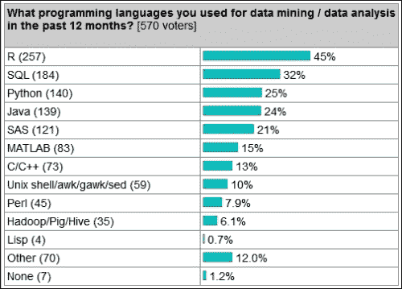
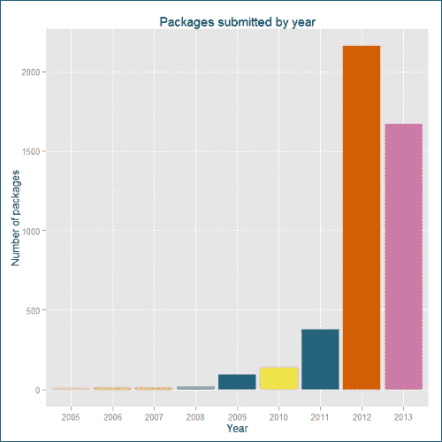
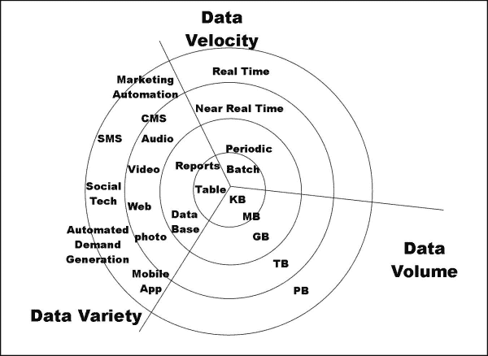

# 前言

企业每天获取的数据量呈指数增长。现在可以将这些海量信息存储在像 Hadoop 这样的低成本平台上。  

这些组织目前面临的难题是如何处理这些数据，以及如何从中提取关键见解。因此，R 就成为了关键工具。R 是一个非常强大的工具，它使得在数据上运行高级统计模型变得轻而易举，将得到的模型转换为多彩的图表和可视化，并且执行更多与数据科学相关的功能。  

然而，R 的一个主要缺点是它的可扩展性较差。核心的 R 引擎只能处理有限数量的数据。由于 Hadoop 在大数据处理方面非常流行，将 R 与 Hadoop 结合以实现可扩展性成为下一步的合理选择。  

本书专门讲解 R 和 Hadoop 以及如何利用 Hadoop 平台使 R 的数据分析操作具备可扩展性。  

本书将面向广泛的受众，包括数据科学家、统计学家、数据架构师和工程师，帮助他们使用 R 和 Hadoop 处理和分析大量信息。  

使用 R 与 Hadoop 结合，将提供一个弹性的 数据分析平台，能够根据待分析数据集的大小进行扩展。经验丰富的程序员可以在 R 中编写 Map/Reduce 模块，并通过 Hadoop 的并行处理 Map/Reduce 机制运行这些模块，从而识别数据集中的模式。  

# 介绍 R  

R 是一个开源软件包，用于对数据进行统计分析。R 是一种编程语言，数据科学家、统计学家和其他需要进行数据统计分析并通过回归、聚类、分类、文本分析等机制从数据中提取关键信息的人群都会使用。R 在 **GNU**（**通用公共许可证**）下注册。它由新西兰奥克兰大学的 Ross Ihaka 和 Robert Gentleman 开发，目前由 R 开发核心团队管理。它可以被视为 S 语言的另一种实现，S 是由 Johan Chambers 在贝尔实验室开发的。尽管存在一些重要的差异，但用 S 编写的大多数代码可以通过 R 解释器引擎无缝运行。  

R 提供了多种统计、机器学习（线性与非线性建模、经典统计检验、时间序列分析、分类、聚类）和图形技术，并且具有高度的扩展性。R 拥有多种内建及扩展功能，适用于统计、机器学习和可视化任务，包括：  

+   数据提取  

+   数据清洗  

+   数据加载  

+   数据转换  

+   统计分析  

+   预测建模  

+   数据可视化  

这是目前市场上最流行的开源统计分析包之一。它跨平台，拥有非常广泛的社区支持，以及一个庞大且不断壮大的用户社区，每天都在新增包。随着包列表的增长，R 现在可以连接到其他数据存储，如 MySQL、SQLite、MongoDB 和 Hadoop 进行数据存储活动。

# 了解 R 的特性

让我们来看一下 R 的不同有用功能：

+   有效的编程语言

+   关系型数据库支持

+   数据分析

+   数据可视化

+   通过丰富的 R 包库进行扩展

# 研究 R 语言的流行度

KD 提供的图表显示，R 是进行数据分析和挖掘的最流行语言：



以下图表提供了从 2005 年到 2013 年，R 用户发布的 R 包的总数。这就是我们探索 R 用户的方式。2012 年的增长呈指数级，2013 年似乎也有望超过这一增长。

R 允许通过各种统计和机器学习操作执行数据分析，具体如下：

+   回归

+   分类

+   聚类

+   推荐

+   文本挖掘



# 介绍大数据

大数据需要处理大量且复杂的数据集，这些数据集可以是结构化的、半结构化的或非结构化的，并且通常无法完全加载到内存中进行处理。它们必须就地处理，这意味着计算必须在数据所在的地方进行。当我们与开发人员交谈时，这些实际构建大数据系统和应用程序的人，我们对他们所说的 3V 有了更清晰的了解。他们通常会提到大数据的 3V 模型，即速度（velocity）、体量（volume）和多样性（variety）。

速度指的是应用分析所需的低延迟、实时速度。一个典型的例子是对来自社交网络网站或多个不同数据源的连续数据流进行分析。

体量指的是数据集的大小。根据生成或接收数据的应用程序类型，数据大小可能为 KB、MB、GB、TB 或 PB。

多样性指的是数据可能存在的各种类型，例如文本、音频、视频和图片。

大数据通常包括具有不同大小的数据集。这些系统在规定的时间内处理如此大量数据几乎是不可能的。大数据的体量是一个不断变化的目标，截至 2012 年，单一数据集的大小范围从几十个 TB 到多个 PB 不等。面对这一看似不可逾越的挑战，完全新的平台被称为大数据平台。



# 获取关于持有大数据的著名组织的信息

一些持有大数据的著名组织如下：

+   Facebook：它拥有 40 PB 的数据，每天捕获 100 TB 的数据

+   Yahoo！：它拥有 60 PB 的数据

+   Twitter：它每天捕获 8 TB 数据

+   eBay：它有 40 PB 的数据，每天捕获 50 TB 数据

被视为大数据的数据量因公司而异。虽然一个公司的大数据对于另一个公司来说可能是小数据，但有些共同点：无法完全装入内存或磁盘，数据流入迅速，需要处理，并且可以从分布式软件栈中受益。对于一些公司来说，10 TB 的数据会被视为大数据，而对其他公司来说，1 PB 的数据才是大数据。所以，只有你能确定数据是否真的是大数据。可以说，它通常会从低 TB 范围开始。

另一个值得问的问题是，既然你没有捕捉和保留足够的数据，你认为自己现在没有大数据问题吗？在某些情况下，企业会字面上丢弃数据，因为没有经济高效的方式来存储和处理它。通过像 Hadoop 这样的平台，可以开始捕获和存储所有这些数据。

# 介绍 Hadoop

Apache Hadoop 是一个开源的 Java 框架，用于在大规模的商品硬件集群上处理和查询大量数据。Hadoop 是一个顶级的 Apache 项目，由 Yahoo！和 Doug Cutting 发起并领导。它依赖来自世界各地的活跃社区贡献者的支持，才能取得成功。

在 Yahoo！的大力技术投资下，Apache Hadoop 已经成为企业级云计算技术。它正逐渐成为大数据处理的行业事实框架。

Hadoop 改变了大规模计算的经济学和动态。其影响可以归结为四个显著特点。Hadoop 实现了可扩展、具有成本效益、灵活且容错的解决方案。

# 探索 Hadoop 功能

Apache Hadoop 具有两个主要特点：

+   HDFS（Hadoop 分布式文件系统）

+   MapReduce

## 学习 Hadoop 组件

Hadoop 包括一个生态系统，其中包含在核心 HDFS 和 MapReduce 层之上构建的其他产品，用于支持平台上的各种操作。以下是一些流行的 Hadoop 组件：

+   **Mahout**：这是一个广泛的机器学习算法库。

+   **Pig**：Pig 是一种高级语言（如 PERL），用于分析大数据集，具有自己的语言语法来表达数据分析程序，并配备了评估这些程序的基础设施。

+   **Hive**：Hive 是一个为 Hadoop 设计的数据仓库系统，它简化了数据汇总、临时查询和对存储在 HDFS 中的大数据集的分析。它有自己的类似 SQL 的查询语言，称为 **Hive 查询语言**（**HQL**），用于向 Hadoop 发出查询命令。

+   **HBase**：**HBase**（**Hadoop 数据库**）是一个分布式、面向列的数据库。HBase 使用 HDFS 作为底层存储。它支持使用 MapReduce 进行批处理计算和原子查询（随机读取）。

+   **Sqoop**：Apache Sqoop 是一个工具，旨在高效地在 Hadoop 与结构化关系型数据库之间传输大规模数据。**Sqoop**是（**SQ**）L 到 Had(**oop**）的缩写。

+   **ZooKeeper**：ZooKeeper 是一个集中式服务，用于维护配置信息、命名、提供分布式同步和组服务，这些对于各种分布式系统非常有用。

+   **Ambari**：一个基于 Web 的工具，用于配置、管理和监控 Apache Hadoop 集群，支持 Hadoop HDFS、Hadoop MapReduce、Hive、HCatalog、HBase、ZooKeeper、Oozie、Pig 和 Sqoop。

## 理解为何要将 R 与 Hadoop 结合使用

我还想说，有时数据存储在 HDFS 中（以各种格式）。由于许多数据分析师在 R 中非常高效，因此使用 R 处理通过 Hadoop 相关工具存储的数据是非常自然的。

如前所述，R 的优势在于其能够通过丰富的包库进行数据分析，但在处理非常大的数据集时则显得力不从心。而 Hadoop 的优势则在于能够存储和处理 TB 甚至 PB 范围内的海量数据。如此庞大的数据集无法完全放入内存，因为每台机器的 RAM 无法容纳如此大的数据集。解决方法是对有限的数据块进行分析，也称为采样，或者将 R 的分析能力与 Hadoop 的存储和处理能力结合，最终得到理想的解决方案。这样的解决方案还可以通过云平台（如 Amazon EMR）实现。

# 本书内容介绍

第一章，*准备使用 R 与 Hadoop*，介绍了 R 与 Hadoop 的基本信息以及安装过程。

第二章，*编写 Hadoop MapReduce 程序*，涵盖了 Hadoop MapReduce 的基础知识以及使用 Hadoop 执行 MapReduce 的方法。

第三章，*R 与 Hadoop 的集成*，展示了通过各种数据处理过程部署和运行 RHadoop 和 RHIPE 的示例 MapReduce 程序。

第四章，*使用 Hadoop Streaming 与 R*，展示了如何在 R 中使用 Hadoop Streaming。

第五章，*使用 R 与 Hadoop 学习数据分析*，通过展示实际的数据分析问题来介绍数据分析项目的生命周期。

第六章，*通过机器学习理解大数据分析*，介绍了如何使用机器学习技术通过 RHadoop 进行大数据分析。

第七章，*从各种数据库导入和导出数据*，介绍了如何与流行的关系数据库接口，以便使用 R 进行数据的导入和导出操作。

附录，*参考文献*，描述了所有章节内容相关的额外资源链接。

# 本书所需内容

由于我们将使用 R 和 Hadoop 进行大数据分析，您应具备基本的 R 和 Hadoop 知识，并了解如何进行实际操作。此外，您需要安装并配置好 R 和 Hadoop。如果您已经拥有较大规模的数据和可以通过数据驱动技术（如 R 和 Hadoop 函数）解决的问题，那将是非常有帮助的。

# 本书的目标读者

本书非常适合那些希望利用 Hadoop 进行大数据分析的 R 开发者。他们希望掌握 R 与 Hadoop 的所有集成技巧，学习如何编写 Hadoop MapReduce，以及如何在 R 中开发和运行 Hadoop MapReduce 的教程。本书也适用于那些了解 Hadoop 并希望利用 R 包在大数据上构建智能应用程序的人。如果读者有基本的 R 知识将更有帮助。

# 约定

本书中有多种文本样式，用来区分不同类型的信息。以下是这些样式的一些示例及其含义的解释。

文本中的代码词、数据库表名、文件夹名、文件名、文件扩展名、路径名、虚拟网址、用户输入和 Twitter 用户名等会以如下形式显示："准备`Map()`输入。"

代码块的格式如下：

```py
<property>
<name>mapred.job.tracker</name>
<value>localhost:54311</value>
<description>The host and port that the MapReduce job tracker runs
at. If "local", then jobs are run in-process as a single map
and reduce task.
</description>
</property>
```

任何命令行输入或输出均按如下格式书写：

```py
// Setting the environment variables for running Java and Hadoop commands
export HADOOP_HOME=/usr/local/hadoop
export JAVA_HOME=/usr/lib/jvm/java-6-sun

```

**新术语**和**重要词汇**以粗体显示。您在屏幕上看到的单词，例如菜单或对话框中的单词，会以这种形式出现在文本中："打开**密码**选项卡。"

### 注意

警告或重要注意事项会以框体的形式显示。

### 提示

提示和技巧会像这样展示。

# 读者反馈

我们始终欢迎读者的反馈。让我们知道您对这本书的看法——您喜欢的内容或者可能不喜欢的地方。读者的反馈对我们非常重要，它能帮助我们开发出您能从中获得最大价值的书籍。

若要向我们发送一般性反馈，请通过电子邮件 `<feedback@packtpub.com>` 与我们联系，并在邮件主题中提到书名。

如果您擅长某个主题，并且有兴趣编写或贡献一本书，请参阅我们在[www.packtpub.com/authors](http://www.packtpub.com/authors)上的作者指南。

# 客户支持

现在，您已经成为一本 Packt 书籍的骄傲拥有者，我们提供了多种帮助您最大化购买价值的资源。

## 下载示例代码

您可以从您的帐户下载所有 Packt 书籍的示例代码文件，网址为[`www.packtpub.com`](http://www.packtpub.com)。如果您在其他地方购买了本书，可以访问[`www.packtpub.com/support`](http://www.packtpub.com/support)，注册后我们将直接通过电子邮件发送文件给您。

## 勘误

虽然我们已尽一切努力确保内容的准确性，但错误确实会发生。如果您在我们的书籍中发现错误——可能是文本或代码中的错误——我们将不胜感激地请您向我们报告。通过这样做，您可以帮助其他读者避免沮丧，并帮助我们改进本书的后续版本。如果您发现任何勘误，请访问[`www.packtpub.com/submit-errata`](http://www.packtpub.com/submit-errata)，选择您的书籍，点击**勘误提交表格**链接，并输入您的勘误细节。一旦确认您的勘误，您的提交将被接受，并将勘误上传到我们的网站上，或添加到任何现有勘误列表中，添加到该书籍的勘误部分。可以通过访问[`www.packtpub.com/support`](http://www.packtpub.com/support)来查看任何现有的勘误。

## 海盗行为

互联网上侵犯版权材料的盗版问题是所有媒体都在不断面对的问题。在 Packt，我们非常重视我们版权和许可的保护。如果您在任何形式的互联网上发现我们作品的非法副本，请立即向我们提供位置地址或网站名称，以便我们采取措施。

请通过`<copyright@packtpub.com>`联系我们，并附上涉嫌侵权材料的链接。

我们感谢您帮助我们保护作者和为您提供有价值的内容的能力。

## 问题

如果您在阅读本书的过程中遇到任何问题，可以通过`<questions@packtpub.com>`与我们联系，我们将尽力解决。
