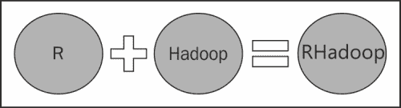
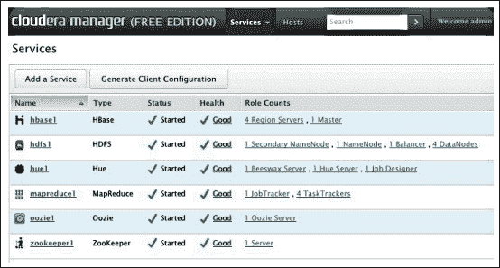
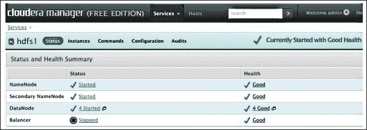
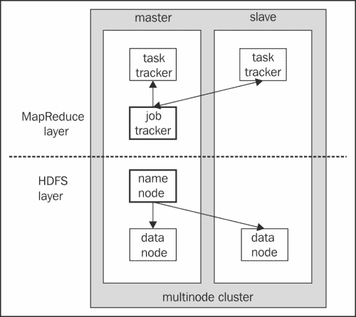

# 第一章：开始使用 R 和 Hadoop

第一章已经包含了 R 和 Hadoop 基础的多个主题，如下所示：

+   R 安装、功能和数据建模

+   Hadoop 安装、功能和组件

在前言中，我们向你介绍了 R 和 Hadoop。本章将重点帮助你开始使用这两项技术。到目前为止，R 主要用于统计分析，但由于功能和包的不断增加，它在多个领域变得流行，例如机器学习、可视化和数据操作。R 不会将所有数据（大数据）加载到机器内存中，因此，可以选择 Hadoop 来加载数据作为大数据。并非所有算法都能在 Hadoop 上运行，而且这些算法通常不是 R 算法。尽管如此，使用 R 进行分析时，仍然存在与大数据相关的若干问题。为了分析数据集，R 会将其加载到内存中，而如果数据集很大，通常会因“无法分配大小为 x 的向量”等异常而失败。因此，为了处理大数据集，结合 R 与 Hadoop 集群的计算能力，可以大大增强 R 的处理能力。Hadoop 是一个非常流行的框架，提供了并行处理能力。因此，我们可以在 Hadoop 集群上使用 R 算法或分析处理来完成工作。



如果我们考虑将 R 和 Hadoop 结合使用，R 将负责数据分析操作，包括数据加载、探索、分析和可视化等初步功能，而 Hadoop 将负责并行数据存储及处理分布式数据的计算能力。

在可负担得起的大数据技术出现之前，分析通常是在单台计算机上的有限数据集上运行的。当应用到大数据集时，高级机器学习算法非常有效，而这仅能在数据可以通过分布式数据存储系统进行存储和处理的大型集群中实现。在接下来的章节中，我们将介绍如何在不同操作系统上安装 R 和 Hadoop，以及将 R 和 Hadoop 链接的可能方式。

# 安装 R

你可以访问 R 官方网站下载合适的版本。

这里提供了三种不同操作系统的步骤。我们已考虑了 Windows、Linux 和 Mac OS 来安装 R。下载最新版本的 R，因为它将包含所有最新的修补程序和解决过去 bug 的版本。

对于 Windows，按照以下步骤进行操作：

1.  访问 [www.r-project.org](http://www.r-project.org)。

1.  点击 **CRAN** 部分，选择 **CRAN 镜像**，然后选择你的 Windows 操作系统（坚持使用 Linux；Hadoop 几乎总是在 Linux 环境中使用）。

1.  从镜像站点下载最新的 R 版本。

1.  执行下载的 `.exe` 文件以安装 R。

对于 Linux-Ubuntu，按照以下步骤进行操作：

1.  访问 [www.r-project.org](http://www.r-project.org)。

1.  点击**CRAN**部分，选择**CRAN 镜像**，然后选择你的操作系统。

1.  在 `/etc/apt/sources.list` 文件中添加 CRAN `<mirror>` 条目。

1.  使用 `sudo apt-get update` 命令从仓库下载并更新包列表。

1.  使用 `sudo apt-get install r-base` 命令安装 R 系统。

对于 Linux-RHEL/CentOS，请按照以下步骤操作：

1.  访问 [www.r-project.org](http://www.r-project.org)。

1.  点击**CRAN**，选择**CRAN 镜像**，然后选择 Red Hat 操作系统。

1.  下载 `R-*core-*.rpm` 文件。

1.  使用 `rpm -ivh R-*core-*.rpm` 命令安装 `.rpm` 包。

1.  使用 `sudo yum install R` 命令安装 R 系统。

对于 Mac，请按照以下步骤操作：

1.  访问 [www.r-project.org](http://www.r-project.org)。

1.  点击**CRAN**，选择**CRAN 镜像**，然后选择你的操作系统。

1.  下载以下文件：`pkg`、`gfortran-*.dmg` 和 `tcltk-*.dmg`。

1.  安装 `R-*.pkg` 文件。

1.  然后，安装 `gfortran-*.dmg` 和 `tcltk-*.dmg` 文件。

在安装基础 R 包后，建议安装 RStudio，这是一个功能强大且直观的**集成开发环境**（**IDE**）用于 R 语言。

### 提示

我们可以使用 Revolution Analytics 提供的 R 发行版作为现代数据分析工具，进行统计计算和预测分析，该工具提供免费版和付费版。还支持 Hadoop 集成，可进行大数据分析。

# 安装 RStudio

要安装 RStudio，请执行以下步骤：

1.  访问 [`www.rstudio.com/ide/download/desktop`](http://www.rstudio.com/ide/download/desktop)。

1.  下载适用于你的操作系统的最新版本 RStudio。

1.  执行安装程序文件并安装 RStudio。

RStudio 组织和用户社区已经开发了许多用于图形和可视化的 R 包，如 `ggplot2`、`plyr`、`Shiny`、`Rpubs` 和 `devtools`。

# 理解 R 语言的特性

目前有超过 3,000 个 R 包，并且这个数量每天都在增长。试图在任何一本书中解释所有这些包将超出其范围。本书只关注 R 的关键特性以及最常用和最受欢迎的包。

## 使用 R 包

R 包是 R 功能的自包含单元，可以作为函数调用。一个很好的类比是 Java 中的 `.jar` 文件。R 包库庞大，涵盖了各种操作，从统计运算、机器学习到丰富的图形可视化和绘图。每个包将包含一个或多个 R 函数。R 包是一个可重用的实体，可以被他人共享和使用。R 用户可以安装包含所需功能的包并开始调用包中的函数。一个全面的包列表可以在 [`cran.r-project.org/`](http://cran.r-project.org/) 中找到，称为**综合 R 档案网络**（**CRAN**）。

## 执行数据操作

R 可以进行广泛的操作。统计操作，如均值、最小值、最大值、概率、分布和回归。机器学习操作，如线性回归、逻辑回归、分类和聚类。通用数据处理操作如下：

+   **数据清理**：此选项用于清理大量数据集。

+   **数据探索**：此选项用于探索数据集的所有可能值。

+   **数据分析**：此选项用于对数据进行描述性和预测性分析数据可视化，即分析输出编程的可视化。

为了构建一个有效的分析应用程序，有时我们需要使用在线 **应用程序编程接口**（**API**）来挖掘数据，通过便捷的服务进行分析，并通过第三方服务进行可视化。此外，要自动化数据分析过程，编程将是最有用的功能。

R 拥有自己的编程语言来处理数据。此外，可用的包可以帮助将 R 与其他编程功能集成。R 支持面向对象编程概念。它还能够与其他编程语言（如 Java、PHP、C 和 C++）进行集成。有多个包作为中间层编程功能，帮助进行数据分析，这些包类似于 `sqldf`、`httr`、`RMongo`、`RgoogleMaps`、`RGoogleAnalytics` 和 `google-prediction-api-r-client`。

## 增强社区支持

随着 R 用户数量的增加，相关的 R 小组也在不断增多。因此，R 学习者或开发者可以轻松地与其他人连接，并借助多个 R 小组或社区解决他们的疑惑。

以下是一些可以找到有用的流行资源：

+   **R 邮件列表**：这是 R 项目所有者创建的官方 R 小组。

+   **R 博客**：R 拥有无数的博客作者，他们在多个 R 应用领域进行写作。最受欢迎的博客网站之一是 [`www.r-bloggers.com/`](http://www.r-bloggers.com/)，所有的博客作者都会在该网站贡献自己的博客。

+   **Stack Overflow**：这是一个很棒的技术知识分享平台，程序员可以在这里发布技术问题，热心的程序员会提供解决方案。欲了解更多信息，请访问 [`stats.stackexchange.com/`](http://stats.stackexchange.com/)。

+   **小组**：在 LinkedIn 和 Meetup 上还存在许多其他小组，全球的专业人士会聚集在一起讨论他们的问题和创新想法。

+   **书籍**：关于 R 的书籍也有很多。其中一些受欢迎的书籍包括 *《R 实战》*，作者 *Rob Kabacoff*，*Manning 出版社*；*《R 速查手册》*，作者 *Joseph Adler*，*O'Reilly Media*；*《R 与数据挖掘》*，作者 *Yanchang Zhao*，*Academic Press*；以及 *《R 图形 cookbook》*，作者 *Hrishi Mittal*，*Packt Publishing*。

## 在 R 中进行数据建模

数据建模是一种机器学习技术，用于从历史数据集中识别隐藏的模式，这些模式将有助于在相同数据上进行未来值预测。这些技术高度关注过去用户的行为并学习他们的偏好。许多流行的组织已经采纳了这些数据建模技术，以根据客户的过去交易来了解他们的行为。这些技术将分析数据并预测客户在寻找什么。Amazon、Google、Facebook、eBay、LinkedIn、Twitter 等众多组织正在使用数据挖掘来改变定义应用程序。

最常见的数据挖掘技术如下：

+   **回归**：在统计学中，回归是一种经典技术，用于通过拟合变量值的状态线来识别两个或多个变量之间的标量关系。这种关系将帮助预测未来事件中变量的值。例如，任何变量 y 可以被建模为另一个变量 x 的线性函数，公式为*y = mx+c*。其中，x 是预测变量，y 是响应变量，m 是直线的斜率，c 是截距。产品或服务的销售预测以及股票价格预测可以通过这种回归方法实现。R 通过`lm`方法提供了这一回归功能，默认情况下，该方法已存在于 R 中。

+   **分类**：这是一种机器学习技术，用于标记提供的训练示例集的观察结果。通过这种方法，我们可以将观察结果分类为一个或多个标签。销售可能性、在线欺诈检测和癌症分类（医学科学）是分类问题的常见应用。Google Mail 使用此技术将电子邮件分类为垃圾邮件或非垃圾邮件。在 R 中，`glm`、`glmnet`、`ksvm`、`svm`和`randomForest`方法可以用于分类功能。

+   **聚类**：这种技术的核心是将相似的项目从给定的集合中组织成组。用户细分和图像压缩是聚类技术的最常见应用。市场细分、社交网络分析、计算机集群组织以及天文数据分析都是聚类的应用。Google 新闻利用这些技术将相似的新闻项分组到同一类别中。在 R 中，可以通过`knn`、`kmeans`、`dist`、`pvclust`和`Mclust`方法实现聚类。

+   **推荐**：推荐算法用于推荐系统，而这些系统是当今最容易识别的机器学习技术。Web 内容推荐可能包括类似的网站、博客、视频或相关内容。此外，在线物品的推荐对于交叉销售和追加销售也非常有帮助。我们都见过在线购物门户，尝试根据用户的过去行为推荐书籍、手机或任何可以在网上销售的商品。Amazon 是一个知名的电子商务门户，通过推荐系统生成了 29% 的销售额。推荐系统可以通过 `Recommender()` 和 R 中的 `recommenderlab` 包来实现。

# 安装 Hadoop

现在，我们假设你已经了解了 R，它是什么，如何安装，主要特点是什么，以及为什么你可能想要使用它。接下来，我们需要了解 R 的局限性（这也是介绍 Hadoop 的一个更好的方式）。在处理数据之前，R 需要将数据加载到 **随机存取存储器** (**RAM**) 中。因此，数据需要小于可用的机器内存。对于大于机器内存的数据，我们将其视为大数据（仅在我们的情况下，因为大数据有很多其他定义）。

为了避免大数据问题，我们需要扩展硬件配置；然而，这只是一个临时解决方案。要解决这个问题，我们需要一个能够存储数据并在大型计算机集群上执行并行计算的 Hadoop 集群。Hadoop 是最流行的解决方案。Hadoop 是一个开源的 Java 框架，是由 Apache 软件基金会处理的顶级项目。Hadoop 的灵感来自 Google 文件系统和 MapReduce，主要设计用于通过分布式处理操作大数据。

Hadoop 主要支持 Linux 操作系统。在 Windows 上运行 Hadoop，我们需要使用 VMware 在 Windows 操作系统中托管 Ubuntu。有许多使用和安装 Hadoop 的方法，但在这里我们将考虑最适合 R 的方式。在结合 R 和 Hadoop 之前，我们先来了解一下 Hadoop 是什么。

### 提示

机器学习包含所有数据建模技术，可以通过这个网页链接 [`en.wikipedia.org/wiki/Machine_learning`](http://en.wikipedia.org/wiki/Machine_learning) 进行探索。

由 Michael Noll 撰写的 Hadoop 安装结构博客可以在 [`www.michael-noll.com/tutorials/running-hadoop-on-ubuntu-linux-single-node-cluster/`](http://www.michael-noll.com/tutorials/running-hadoop-on-ubuntu-linux-single-node-cluster/) 上找到。

## 理解不同的 Hadoop 模式

Hadoop 有三种不同的模式：

+   **独立模式**：在此模式下，您无需启动任何 Hadoop 守护进程。只需调用 `~/Hadoop-directory/bin/hadoop`，它将作为单一 Java 进程执行 Hadoop 操作。此模式推荐用于测试。它是默认模式，您无需配置任何其他内容。所有守护进程，如 NameNode、DataNode、JobTracker 和 TaskTracker 都在一个 Java 进程中运行。

+   **伪模式**：在此模式下，您为所有节点配置 Hadoop。为每个 Hadoop 组件或守护进程（如单主机上的迷你集群）启动单独的 **Java 虚拟机**（**JVM**）。

+   **完全分布式模式**：在此模式下，Hadoop 会分布到多台机器上。为 Hadoop 组件配置专用主机。因此，每个守护进程都有独立的 JVM 进程。

## 理解 Hadoop 安装步骤

Hadoop 可以通过多种方式安装；我们将考虑与 R 集成更好的方式。我们将选择 Ubuntu 操作系统，因为它易于安装和访问。

1.  在 Linux 上安装 Hadoop，Ubuntu 版本（单节点和多节点集群）。

1.  在 Ubuntu 上安装 Cloudera Hadoop。

### 在 Linux 上安装 Hadoop，Ubuntu 版本（单节点集群）

要在 Ubuntu 操作系统上以伪模式安装 Hadoop，我们需要满足以下先决条件：

+   Sun Java 6

+   专用 Hadoop 系统用户

+   配置 SSH

+   禁用 IPv6

### 提示

提供的 Hadoop 安装将支持 Hadoop MRv1。

按照以下步骤安装 Hadoop：

1.  从 Apache 软件基金会下载最新的 Hadoop 源代码。这里我们考虑的是 Apache Hadoop 1.0.3，而最新版本是 1.1.x。

    ```py
    // Locate to Hadoop installation directory
    $ cd /usr/local

    // Extract the tar file of Hadoop distribution
    $ sudo tar xzf hadoop-1.0.3.tar.gz

    // To move Hadoop resources to hadoop folder 
    $ sudo mv hadoop-1.0.3 hadoop

    // Make user-hduser from group-hadoop as owner of hadoop directory
    $ sudo chown -R hduser:hadoop hadoop

    ```

1.  将 `$JAVA_HOME` 和 `$HADOOP_HOME` 变量添加到 Hadoop 系统用户的 `.bashrc` 文件中，更新后的 `.bashrc` 文件如下所示：

    ```py
    // Setting the environment variables for running Java and Hadoop commands
    export HADOOP_HOME=/usr/local/hadoop
    export JAVA_HOME=/usr/lib/jvm/java-6-sun

    // alias for Hadoop commands
    unalias fs &> /dev/null
    alias fs="hadoop fs"
    unalias hls &> /dev/null
    aliashls="fs -ls"

    // Defining the function for compressing the MapReduce job output by lzop command
    lzohead () {
    hadoopfs -cat $1 | lzop -dc | head -1000 | less
    }

    // Adding Hadoop_HoME variable to PATH 
    export PATH=$PATH:$HADOOP_HOME/bin

    ```

1.  使用 `conf/*-site.xml` 格式更新 Hadoop 配置文件。

最终，三个文件将如下所示：

+   `conf/core-site.xml`：

    ```py
    <property>
    <name>hadoop.tmp.dir</name>
    <value>/app/hadoop/tmp</value>
    <description>A base for other temporary directories.</description>
    </property>
    <property>
    <name>fs.default.name</name>
    <value>hdfs://localhost:54310</value>
    <description>The name of the default filesystem. A URI whose
    scheme and authority determine the FileSystem implementation. The
    uri's scheme determines the config property (fs.SCHEME.impl) naming
    theFileSystem implementation class. The uri's authority is used to
    determine the host, port, etc. for a filesystem.</description>
    </property>
    ```

+   `conf/mapred-site.xml`：

    ```py
    <property>
    <name>mapred.job.tracker</name>
    <value>localhost:54311</value>
    <description>The host and port that the MapReduce job tracker runs
    at. If "local", then jobs are run in-process as a single map
    and reduce task.
    </description>
    </property>
    ```

+   `conf/hdfs-site.xml`：

    ```py
    <property>
    <name>dfs.replication</name>
    <value>1</value>
    <description>Default block replication.
      The actual number of replications can be specified when the file is created.
      The default is used if replication is not specified in create time.
    </description>
    ```

编辑完这些配置文件后，我们需要在 Hadoop 集群或节点之间设置分布式文件系统。

+   通过以下命令格式化 **Hadoop 分布式文件系统**（**HDFS**）：

    ```py
    hduser@ubuntu:~$ /usr/local/hadoop/bin/hadoopnamenode -format

    ```

+   使用以下命令行启动您的单节点集群：

    ```py
    hduser@ubuntu:~$ /usr/local/hadoop/bin/start-all.sh

    ```

### 提示

**下载示例代码**

您可以从您的账户在 [`www.packtpub.com`](http://www.packtpub.com) 下载所有您购买的 Packt 图书的示例代码文件。如果您在其他地方购买了此书，您可以访问 [`www.packtpub.com/support`](http://www.packtpub.com/support) 并注册，将文件直接通过电子邮件发送给您。

### 在 Linux 上安装 Hadoop，Ubuntu 版本（多节点集群）

我们已经学习了如何在单节点集群上安装 Hadoop。现在我们将看到如何在多节点集群上安装 Hadoop（完全分布式模式）。

为此，我们需要多个节点配置一个单节点 Hadoop 集群。要在多节点上安装 Hadoop，我们需要按照上一节中描述的方式先配置好单节点 Hadoop 集群。

在安装完单节点 Hadoop 集群后，我们需要执行以下步骤：

1.  在网络配置阶段，我们将使用两个节点来设置完整的分布式 Hadoop 模式。为了彼此通信，这些节点需要在软件和硬件配置上处于同一网络中。

1.  在这两个节点中，一个将被视为主节点，另一个将被视为从节点。因此，为了执行 Hadoop 操作，主节点需要连接到从节点。我们将在主机上输入 `192.168.0.1`，在从机上输入 `192.168.0.2`。

1.  更新两个节点中的`/etc/hosts`目录。它将显示为 `192.168.0.1 master` 和 `192.168.0.2 slave`。

    ### 提示

    你可以像我们在单节点集群设置中做的那样进行**安全外壳**（**SSH**）设置。欲了解更多详情，请访问 [`www.michael-noll.com`](http://www.michael-noll.com)。

1.  更新 `conf/*-site.xml`：我们必须在所有节点中更改这些配置文件。

    +   `conf/core-site.xml` 和 `conf/mapred-site.xml`：在单节点设置中，我们已经更新了这些文件。所以现在我们只需要将值标签中的 `localhost` 替换为 `master`。

    +   `conf/hdfs-site.xml`：在单节点设置中，我们将 `dfs.replication` 的值设置为 `1`。现在我们需要将其更新为 `2`。

1.  在格式化 HDFS 阶段，在我们启动多节点集群之前，我们需要使用以下命令格式化 HDFS（从主节点执行）：

    ```py
    bin/hadoop namenode -format

    ```

现在，我们已经完成了安装多节点 Hadoop 集群的所有步骤。要启动 Hadoop 集群，我们需要遵循以下步骤：

1.  启动 HDFS 守护进程：

    ```py
    hduser@master:/usr/local/hadoop$ bin/start-dfs.sh

    ```

1.  启动 MapReduce 守护进程：

    ```py
    hduser@master:/usr/local/hadoop$ bin/start-mapred.sh

    ```

1.  或者，我们可以通过一个命令启动所有守护进程：

    ```py
    hduser@master:/usr/local/hadoop$ bin/start-all.sh

    ```

1.  要停止所有这些守护进程，执行：

    ```py
    hduser@master:/usr/local/hadoop$ bin/stop-all.sh

    ```

这些安装步骤是受启发于 Michael Noll 的博客（[`www.michael-noll.com`](http://www.michael-noll.com)）的，他是位于欧洲瑞士的研究员和软件工程师。他在 VeriSign 担任 Apache Hadoop 堆栈的大规模计算基础设施技术负责人。

现在，Hadoop 集群已经在你的机器上设置完成。要在单节点或多节点上安装相同的 Hadoop 集群并扩展 Hadoop 组件，可以尝试使用 Cloudera 工具。

### 在 Ubuntu 上安装 Cloudera Hadoop

**Cloudera Hadoop** (**CDH**) 是 Cloudera 的开源发行版，旨在面向企业级部署 Hadoop 技术。Cloudera 也是 Apache 软件基金会的赞助商。CDH 提供两个版本：CDH3 和 CDH4\. 要安装其中之一，您必须使用带有 10.04 LTS 或 12.04 LTS 的 Ubuntu（此外，您还可以尝试 CentOS、Debian 和 Red Hat 系统）。如果您在多台计算机的集群上安装 Hadoop，Cloudera 管理器将使安装过程变得更加容易，它提供基于 GUI 的 Hadoop 和其组件的安装。强烈建议在大型集群中使用该工具。

我们需要满足以下先决条件：

+   配置 SSH

+   操作系统应符合以下标准：

    +   Ubuntu 10.04 LTS 或 12.04 LTS（64 位）

    +   Red Hat Enterprise Linux 5 或 6

    +   CentOS 5 或 6

    +   Oracle Enterprise Linux 5

    +   SUSE Linux Enterprise Server 11（SP1 或 Lasso）

    +   Debian 6.0

安装步骤如下：

1.  下载并运行 Cloudera 管理器安装程序：要初始化 Cloudera 管理器安装过程，首先需要从 Cloudera 网站的下载区下载 `cloudera-manager-installer.bin` 文件。下载后，将其存储在集群中，以便所有节点都可以访问此文件。允许用户执行 `cloudera-manager-installer.bin` 文件。运行以下命令开始执行。

    ```py
    $ sudo ./cloudera-manager-installer.bin

    ```

1.  阅读 Cloudera 管理器 **Readme** 文件，然后点击 **下一步**。

1.  启动 Cloudera 管理器管理员控制台：Cloudera 管理器管理员控制台允许您使用 Cloudera 管理器在集群上安装、管理和监控 Hadoop。接受 Cloudera 服务提供商的许可后，您需要通过在地址栏中输入 `http://localhost:7180` 来转到本地网页浏览器。您还可以使用以下任何浏览器：

    +   Firefox 11 或更高版本

    +   Google Chrome

    +   Internet Explorer

    +   Safari

1.  使用 `admin` 作为用户名和密码登录 Cloudera 管理器控制台。以后可以根据需要更改密码。

1.  使用 Cloudera 管理器通过浏览器进行自动化的 CDH3 安装和配置：此步骤将从 Cloudera 向您的计算机安装大部分所需的 Cloudera Hadoop 包。步骤如下：

    1.  安装并验证您的 Cloudera 管理器许可证密钥文件（如果您选择了完整版本的软件）。

    1.  为 CDH 集群安装指定主机名或 IP 地址范围。

    1.  使用 SSH 连接到每个主机。

    1.  安装 **Java 开发工具包** (**JDK**)（如果尚未安装），Cloudera 管理器代理，以及 CDH3 或 CDH4 在每个集群主机上。

    1.  在每个节点上配置 Hadoop 并启动 Hadoop 服务。

1.  运行向导并使用 Cloudera 管理器后，您应该尽快更改默认管理员密码。更改管理员密码，请按照以下步骤操作：

    1.  点击带有齿轮标志的图标，显示管理页面。

    1.  打开 **密码** 标签。

    1.  输入新密码两次，然后单击**Update**。

1.  测试 Cloudera Hadoop 的安装：您可以通过登录 Cloudera 管理器管理控制台并单击**Services**选项卡来检查您集群上的 Cloudera 管理器安装。您应该看到类似下面这样的屏幕截图：

    Cloudera 管理器管理控制台

1.  您还可以单击每个服务以查看更详细的信息。例如，如果您单击**hdfs1**链接，您可能会看到类似下面这样的屏幕截图：

    Cloudera 管理器管理控制台——HDFS 服务

    ### 提示

    要避免这些安装步骤，请使用预配置的 Amazon Elastic MapReduce 和 MapReduce 实例。

    如果你想在 Windows 上使用 Hadoop，请尝试由 Hortonworks 提供的 HDP 工具。这是完全开源的、企业级的 Hadoop 发行版。你可以在[`hortonworks.com/download/`](http://hortonworks.com/download/)下载 HDP 工具。

# 理解 Hadoop 的特性

Hadoop 专为两个核心概念而设计：HDFS 和 MapReduce。两者都与分布式计算相关。MapReduce 被认为是 Hadoop 的核心，它执行分布式数据上的并行处理。

让我们看看 Hadoop 的特性的更多细节：

+   HDFS

+   MapReduce

## 理解 HDFS

HDFS 是 Hadoop 自带的机架感知文件系统，是 Hadoop 的基于 UNIX 的数据存储层。HDFS 源自于 Google 文件系统的概念。Hadoop 的一个重要特性是数据和计算的分区跨多个（数千个）主机，并在靠近其数据的地方并行执行应用程序计算。在 HDFS 上，数据文件被复制为集群中的块序列。通过简单添加商品服务器，Hadoop 集群可以扩展计算能力、存储能力和 I/O 带宽。HDFS 可以通过多种不同的方式从应用程序访问。本地，HDFS 为应用程序提供了一个 Java API。

Yahoo!的 Hadoop 集群覆盖 40,000 台服务器，存储 40PB 的应用程序数据，其中最大的 Hadoop 集群为 4,000 台服务器。此外，全球还有 100 多个组织使用 Hadoop。

### 理解 HDFS 的特性

现在让我们来看看 HDFS 的特性：

+   容错

+   使用商品硬件运行

+   能够处理大型数据集

+   主从范式

+   只有一次文件访问权限

## 理解 MapReduce

MapReduce 是一种用于处理分布在大型集群上的大型数据集的编程模型。MapReduce 是 Hadoop 的核心。其编程范式允许在配置有 Hadoop 集群的数千台服务器上执行大规模数据处理。这源自于 Google MapReduce。

Hadoop MapReduce 是一个软件框架，便于编写应用程序，能够在大型集群（数千个节点）的商品硬件上以可靠、容错的方式并行处理大量数据（多 TB 数据集）。该 MapReduce 范式分为两个阶段，Map 和 Reduce，主要处理数据的键值对。Map 和 Reduce 任务在集群中顺序执行；Map 阶段的输出成为 Reduce 阶段的输入。以下是这些阶段的解释：

+   **Map 阶段**：数据集一旦被划分，就会分配给任务跟踪器以执行 Map 阶段。数据操作将应用于数据，并将映射的键值对作为 Map 阶段的输出。

+   **Reduce 阶段**：然后，主节点收集所有子问题的答案，并以某种方式将它们组合成最终输出；即最初试图解决的问题的答案。

并行计算的五个常见步骤如下：

1.  准备`Map()`输入：这将逐行读取输入数据，并为每行发出键值对，或者我们可以根据需求显式地进行更改。

    +   映射输入：list（k1，v1）

1.  运行用户提供的`Map()`代码

    +   Map 输出：list（k2，v2）

1.  将 Map 输出数据混排到 Reduce 处理器中。同时，将相似的键混排（将其分组），并输入到同一个 reducer 中。

1.  运行用户提供的`Reduce()`代码：该阶段将运行开发人员设计的自定义 reducer 代码，在混排的数据上运行并发出键值对。

    +   减少输入：（k2, list(v2)）

    +   减少输出：（k3, v3）

1.  产生最终输出：最终，主节点收集所有 reducer 输出，并将其组合后写入文本文件。

    ### 提示

    有关 Google 文件系统的参考链接可以在[`research.google.com/archive/gfs.html`](http://research.google.com/archive/gfs.html)找到，Google MapReduce 的链接可以在[`research.google.com/archive/mapreduce.html`](http://research.google.com/archive/mapreduce.html)找到。

# 学习 HDFS 和 MapReduce 架构

由于 HDFS 和 MapReduce 被认为是 Hadoop 框架的两个主要特性，我们将重点关注这两者。因此，首先让我们从 HDFS 开始。

## 理解 HDFS 架构

HDFS 可以呈现为主/从架构。HDFS 的主节点被称为 NameNode，而从节点为 DataNode。NameNode 是一个服务器，管理文件系统的命名空间，并控制客户端对文件的访问（打开、关闭、重命名等）。它将输入数据分割成块，并公告哪个数据块将存储在哪个 DataNode 中。DataNode 是一个从节点，存储分区数据集的副本，并根据请求提供数据。它还执行数据块的创建和删除操作。

HDFS 的内部机制将文件分为一个或多个数据块，这些数据块存储在一组数据节点中。在正常情况下，复制因子为三时，HDFS 策略是将第一份副本放在本地节点上，第二份副本放在同一机架上的不同节点上，第三份副本放入不同机架的不同节点上。由于 HDFS 旨在支持大文件，HDFS 的块大小定义为 64 MB。如果需要，可以增加块大小。

### 了解 HDFS 组件

HDFS 通过主从架构进行管理，包含以下组件：

+   **NameNode**：这是 HDFS 系统的主节点。它维护目录、文件，并管理存储在 DataNode 上的数据块。

+   **DataNode**：这些是部署在每台机器上的从节点，提供实际的存储。它们负责为客户端提供读写数据请求的服务。

+   **Secondary NameNode**：负责执行定期的检查点。因此，如果 NameNode 发生故障，可以使用由 Secondary NameNode 检查点存储的快照图像进行替换。

## 了解 MapReduce 架构

MapReduce 也实现了主从架构。经典的 MapReduce 包含作业提交、作业初始化、任务分配、任务执行、进度和状态更新以及作业完成相关活动，这些活动主要由 JobTracker 节点管理，并由 TaskTracker 执行。客户端应用程序向 JobTracker 提交作业。然后，输入数据在集群中分配。JobTracker 计算需要处理的 map 和 reduce 的数量，命令 TaskTracker 开始执行作业。现在，TaskTracker 将资源复制到本地机器并启动 JVM 来执行 map 和 reduce 程序。与此同时，TaskTracker 定期向 JobTracker 发送更新，这可以看作是心跳信号，帮助更新 JobID、作业状态和资源使用情况。

### 了解 MapReduce 组件

MapReduce 通过主从架构进行管理，包含以下组件：

+   **JobTracker**：这是 MapReduce 系统的主节点，管理集群中的作业和资源（TaskTracker）。JobTracker 尝试将每个 map 任务调度到与正在处理数据的 TaskTracker 尽可能接近的位置，而 TaskTracker 又运行在与底层数据块相同的 DataNode 上。

+   **TaskTracker**：这些是部署在每台机器上的从节点，负责按照 JobTracker 的指示运行 map 和 reduce 任务。

## 通过图示理解 HDFS 和 MapReduce 架构

在此图中，包含了 HDFS 和 MapReduce 的主从组件，其中 NameNode 和 DataNode 来自 HDFS，而 JobTracker 和 TaskTracker 来自 MapReduce 范式。

这两种由主从候选者组成的范式各自有其特定的职责，用于处理 MapReduce 和 HDFS 操作。在下图中，图像分为两个部分：前一部分是 MapReduce 层，后一部分是 HDFS 层。



HDFS 和 MapReduce 架构

Hadoop 是一个顶级的 Apache 项目，是一个非常复杂的 Java 框架。为避免技术复杂性，Hadoop 社区开发了多个 Java 框架，这些框架为 Hadoop 的功能增添了额外的价值。它们被视为 Hadoop 的子项目。在这里，我们将讨论几个可以视为 HDFS 或 MapReduce 抽象的 Hadoop 组件。

# 理解 Hadoop 子项目

**Mahout** 是一个流行的数据挖掘库。它采用最流行的数据挖掘可扩展机器学习算法，执行聚类、分类、回归和统计建模，以准备智能应用程序。同时，它是一个可扩展的机器学习库。

Apache Mahout 是在商业友好的 Apache 软件许可下分发的。Apache Mahout 的目标是建立一个充满活力、响应迅速且多样化的社区，促进不仅是项目本身的讨论，还包括潜在的使用案例。

以下是一些使用 Mahout 的公司：

+   **Amazon**：这是一个购物门户网站，提供个性化推荐服务。

+   **AOL**：这是一个购物门户网站，用于购物推荐。

+   **Drupal**：这是一个 PHP 内容管理系统，使用 Mahout 提供开源基于内容的推荐服务。

+   **iOffer**：这是一个购物门户网站，使用 Mahout 的频繁模式集挖掘和协同过滤技术向用户推荐商品。

+   **LucidWorks Big Data**：这是一家流行的分析公司，使用 Mahout 进行聚类、重复文档检测、短语提取和分类。

+   **Radoop**：提供一个拖拽式界面，用于大数据分析，包括 Mahout 聚类和分类算法。

+   **Twitter**：这是一个社交网络网站，使用 Mahout 的 **潜在狄利克雷分配**（**LDA**）实现进行用户兴趣建模，并在 GitHub 上维护 Mahout 的一个分支。

+   **Yahoo!**：这是全球最受欢迎的网页服务提供商，使用 Mahout 的频繁模式集挖掘技术用于 Yahoo! Mail。

    ### 提示

    Hadoop 生态系统的参考链接可以在 [`www.revelytix.com/?q=content/hadoop-ecosystem`](http://www.revelytix.com/?q=content/hadoop-ecosystem) 找到。

**Apache HBase** 是一个分布式大数据存储系统，适用于 Hadoop。它允许对大数据进行随机、实时的读写访问。该系统采用了受 Google BigTable 启发创新的列式数据存储模型。

以下是使用 HBase 的公司：

+   **Yahoo!**：这是全球知名的网页服务提供商，用于近重复文档检测。

+   **Twitter**：这是一个用于版本控制存储和检索的社交网络网站。

+   **Mahalo**：这是一个用于相似内容推荐的知识共享服务。

+   **NING**：这是一个用于实时分析和报告的社交网络服务提供商。

+   **StumbleUpon**：这是一个通用个性化推荐系统，实时数据存储和数据分析平台。

+   **Veoh**：这是一个在线多媒体内容共享平台，用于用户档案系统。

    ### 提示

    对于 Google 大数据，结构化数据的分布式存储系统，请参考链接 [`research.google.com/archive/bigtable.html`](http://research.google.com/archive/bigtable.html)。

**Hive** 是一个基于 Hadoop 的数据仓库框架，由 Facebook 开发。它允许用户使用类似 SQL 的语言（如 HiveQL）进行查询，这些查询会高度抽象为 Hadoop MapReduce。这使得没有 MapReduce 经验的 SQL 程序员也能使用该数据仓库，并使其更容易与商业智能和可视化工具进行集成，以便进行实时查询处理。

**Pig** 是一个基于 Hadoop 的开源平台，用于通过其自己的类似 SQL 的语言 Pig Latin 来分析大规模数据集。它为海量复杂的数据并行计算提供了简单的操作和编程接口。这也更容易开发，更优化且更具扩展性。Apache Pig 是由 Yahoo! 开发的。目前，Yahoo! 和 Twitter 是主要的 Pig 用户。

对于开发者而言，直接使用 Java API 可能既繁琐又容易出错，而且还限制了 Java 程序员在 Hadoop 编程中灵活性的发挥。因此，Hadoop 提供了两种解决方案，使得数据集管理和数据集分析的 Hadoop 编程变得更容易——这些解决方案是 Pig 和 Hive，这两者经常让人混淆。

**Apache Sqoop** 提供了一种 Hadoop 数据处理平台，可以快速以一种全新的方式将大量数据从关系型数据库、数据仓库和其他非关系型数据库传输到 Hadoop。Apache Sqoop 是一个用于将数据从关系型数据库导入 Hadoop HDFS，或将数据从 HDFS 导出到关系型数据库的互通数据工具。

它与大多数现代关系型数据库一起工作，如 MySQL、PostgreSQL、Oracle、Microsoft SQL Server 和 IBM DB2，以及企业数据仓库。Sqoop 扩展 API 提供了一种为数据库系统创建新连接器的方法。此外，Sqoop 源代码还提供了一些流行的数据库连接器。为了执行此操作，Sqoop 首先将数据转换为 Hadoop MapReduce，并通过一些数据库模式创建和转换的逻辑来进行处理。

**Apache Zookeeper** 也是一个 Hadoop 子项目，用于管理 Hadoop、Hive、Pig、HBase、Solr 和其他项目。Zookeeper 是一个开源的分布式应用程序协调服务，设计基于 Fast Paxos 算法的同步、配置和命名服务，如分布式应用程序的维护。在编程中，Zookeeper 的设计采用非常简单的数据模型风格，类似于系统目录树结构。

Zookeeper 分为两部分：服务器和客户端。对于 Zookeeper 服务器集群，只有一个服务器充当领导者，接受并协调所有权限。其余的服务器是主服务器的只读副本。如果领导者服务器宕机，任何其他服务器都可以开始处理所有请求。Zookeeper 客户端连接到 Zookeeper 服务中的服务器。客户端发送请求，接收响应，访问观察事件，并通过与服务器的 TCP 连接发送心跳。

对于分布式应用程序的高性能协调服务，Zookeeper 是一个集中式服务，用于维护配置信息、命名以及提供分布式同步和组服务。所有这些服务以某种形式被分布式应用程序使用。每次实现时，都需要大量的工作来修复不可避免的 bug 和竞态条件。这些服务在应用程序部署时导致管理复杂性。

Apache Solr 是一个开源企业级搜索平台，来自 Apache 许可项目。Apache Solr 具有高度可扩展性，支持分布式搜索和索引复制引擎。这使得构建具有强大文本搜索、分面搜索、实时索引、动态聚类、数据库集成和丰富文档处理的 Web 应用程序成为可能。

Apache Solr 用 Java 编写，作为独立服务器运行，通过类似 REST 的 HTTP/XML 和 JSON API 提供搜索结果。因此，这个 Solr 服务器可以很容易地与用其他编程语言编写的应用程序集成。由于这些特点，这个搜索服务器被 Netflix、AOL、CNET 和 Zappos 等公司使用。

**Ambari** 是非常特定于 Hortonworks 的。Apache Ambari 是一个基于 Web 的工具，支持 Apache Hadoop 集群的供应、管理和监控。Ambari 处理大部分 Hadoop 组件，包括 HDFS、MapReduce、Hive、Pig、HBase、Zookeeper、Sqoop 和 HCatlog，作为集中管理。

此外，Ambari 能够基于 Kerberos 身份验证协议在 Hadoop 集群上安装安全性。同时，它还为用户提供基于角色的用户身份验证、授权和审计功能，帮助用户管理集成的 LDAP 和 Active Directory。

# 总结

在本章中，我们学习了什么是 R、Hadoop 及其特点，并了解了如何安装它们，然后才能使用 R 和 Hadoop 进行数据集分析。在下一章中，我们将学习什么是 MapReduce，以及如何使用 Apache Hadoop 开发 MapReduce 程序。
