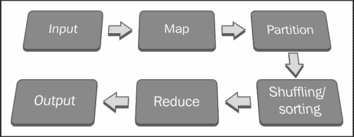
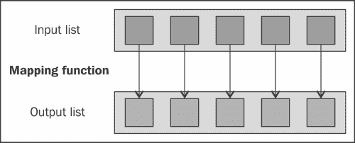
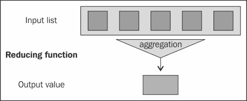
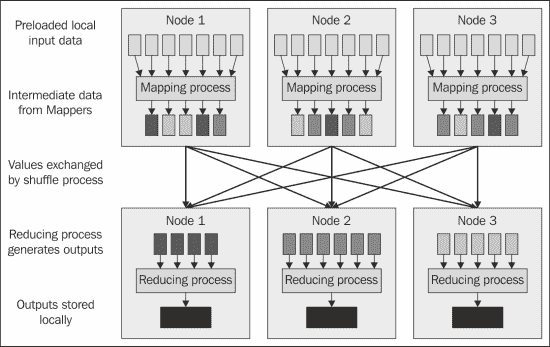
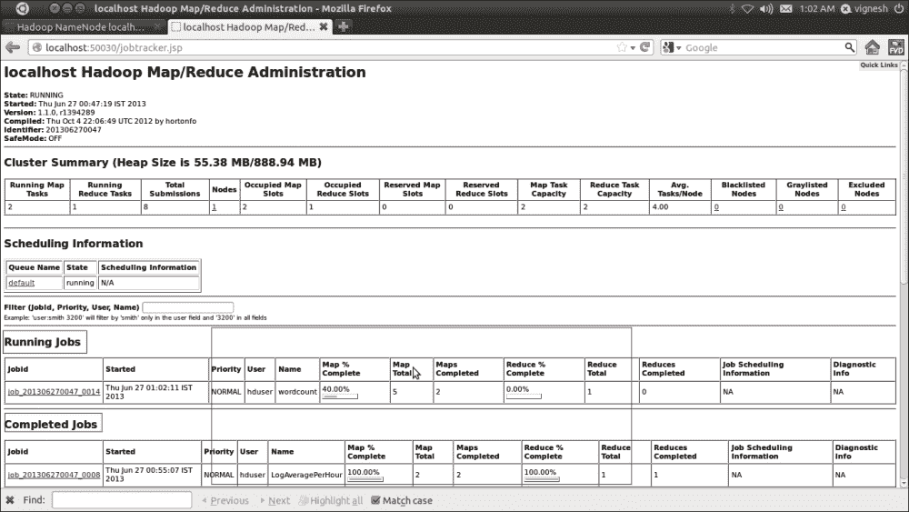
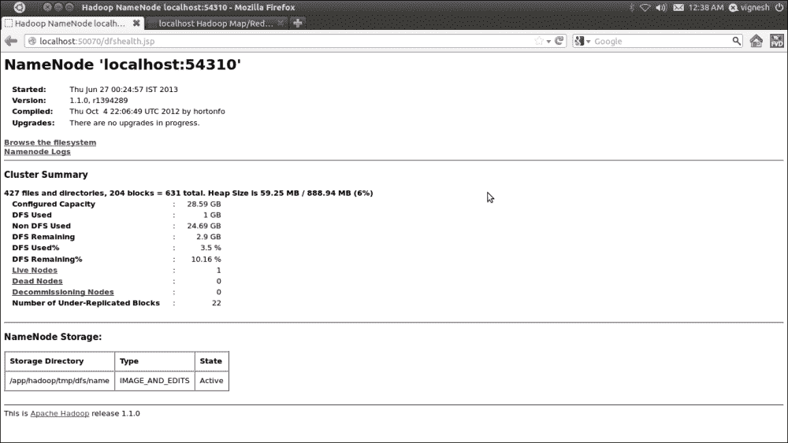

# 第二章：编写 Hadoop MapReduce 程序

在上一章中，我们学习了如何设置 R 和 Hadoop 开发环境。由于我们有兴趣执行大数据分析，因此我们需要学习 Hadoop 以便使用 Hadoop MapReduce 执行操作。在本章中，我们将讨论什么是 MapReduce，为什么它是必要的，如何通过 Apache Hadoop 开发 MapReduce 程序，以及更多内容。

在本章中，我们将涵盖：

+   理解 MapReduce 的基本概念

+   介绍 Hadoop MapReduce

+   理解 Hadoop MapReduce 基础

+   编写一个 Hadoop MapReduce 示例

+   理解多种可能的 MapReduce 定义，以解决业务问题

+   学习在 R 中编写 Hadoop MapReduce 的不同方式

# 理解 MapReduce 基础

如果没有集群或使用**消息传递接口**（**MPI**），理解 MapReduce 基础可能是一个长期的解决方案。然而，更现实的使用场景是当数据无法存储在一块磁盘上，但可以存储在**分布式文件系统**（**DFS**）中，或者已经存储在 Hadoop 相关软件上。

此外，MapReduce 是一种分布式编程模型，但它并不是唯一一种支持分布式的编程模型。描述其他编程模型可能会有所启发，例如 MPI 和**批量同步并行**（**BSP**）。使用 R 等工具和若干机器学习技术处理大数据需要高配置的机器，但这并不是永久解决方案。因此，分布式处理是处理这些数据的关键。这种分布式计算可以通过 MapReduce 编程模型来实现。

MapReduce 是解决大数据问题的答案。从逻辑上讲，要处理数据，我们需要并行处理，这意味着需要大规模计算；这种处理方式可以通过将计算机集群进行聚集或提高单机配置来实现。使用计算机集群是处理大规模数据的理想方式。

在我们深入讨论并行处理中的 MapReduce 之前，我们将讨论 Google MapReduce 研究以及*Jeffrey Dean*和*Sanjay Ghemawat*在 2004 年撰写的白皮书。它们将 MapReduce 介绍为一种简化的大规模集群数据处理软件。MapReduce 实现运行在由普通硬件组成的大型集群上。这种数据处理平台使得程序员可以更容易地执行各种操作。系统负责处理输入数据、将数据分配到计算机网络中、并行处理这些数据，最后将输出结果合并成一个文件，供之后聚合。这对于成本控制非常有帮助，而且也是一种节省时间的系统，适用于在集群上处理大型数据集。此外，它能高效地利用计算机资源来处理大量数据进行分析。Google 已获得 MapReduce 的专利。

对于 MapReduce，程序员只需要将应用程序设计/迁移为两个阶段：Map 和 Reduce。他们只需要设计 Map 函数，用于处理键值对并生成一组中间的键值对，然后设计 Reduce 函数，用于合并所有的中间键。Map 和 Reduce 函数共同维护 MapReduce 的工作流。Reduce 函数将在 Map 输出可用后开始执行代码。

它们的执行顺序如下所示：



MapReduce 假设 Map 是独立的，并且会并行执行它们。MapReduce 算法的关键是，如果每个 Map 和 Reduce 都与网络中其他正在进行的 Map 和 Reduce 独立，那么操作将在不同的键和数据列表上并行运行。

分布式文件系统将数据的多个副本分布到不同的机器上。这提供了可靠性和容错能力。如果一台机器上的文件副本崩溃，另一台复制的数据源将提供相同的数据。

MapReduce 守护进程的主节点将负责 MapReduce 作业的所有职责，如作业的执行、Mappers、Reducers、Combiners 和 Partitioners 的调度、监控个别作业任务的成功与失败，最后完成批处理作业。

Apache Hadoop 通过在存储在 Hadoop 分布式文件系统上的数据附近运行 Hadoop MapReduce 作业，以并行方式处理分布式数据。

使用 MapReduce 的公司包括：

+   **Amazon**：这是一个在线电子商务和云服务提供商，专注于大数据分析

+   **eBay**：这是一个电子商务门户网站，用于根据描述查找商品

+   **Google**：这是一个网页搜索引擎，用于查找与特定主题相关的页面

+   **LinkedIn**：这是一个专业的社交网站，用于大数据存储和生成个性化推荐

+   **Trovit**：这是一个垂直搜索引擎，用于查找与给定描述匹配的工作

+   **Twitter**：这是一个社交网站，用于查找消息

除了这些，还有许多其他品牌正在使用 Hadoop 进行大数据分析。

# 引入 Hadoop MapReduce

基本上，MapReduce 模型可以用多种语言实现，但除了这些，Hadoop MapReduce 是一个流行的 Java 框架，便于编写应用程序。它以可靠和容错的方式在大型集群（成千上万的节点）上的商品硬件上并行处理大量数据（多 TB 数据集）。这个 MapReduce 范式分为两个阶段：Map 和 Reduce，主要处理数据的键值对。Map 和 Reduce 任务在集群中顺序运行，Map 阶段的输出成为 Reduce 阶段的输入。

MapReduce 中的所有数据输入元素都无法更新。如果映射任务的输入 `(key, value)` 对发生更改，将不会反映在输入文件中。Mapper 输出将通过管道传输到适当的 Reducer，并按键属性分组作为输入。这个顺序的数据处理将通过 Hadoop MapReduce 算法和 Hadoop 集群以并行方式执行。

MapReduce 程序将以列表格式呈现的输入数据集转换为同样以列表格式呈现的输出数据。这一逻辑列表转换过程通常在 Map 阶段和 Reduce 阶段重复两次。我们还可以通过固定 Mapper 和 Reducer 的数量来处理这些重复。在接下来的部分中，将根据旧的 MapReduce API 描述 MapReduce 概念。

## 列出 Hadoop MapReduce 实体

以下是负责在大数据上执行分析的 Hadoop 组件：

+   **Client**：这是用来初始化任务的。

+   **JobTracker**：这是用来监控任务的。

+   **TaskTracker**：这是执行任务的。

+   **HDFS**：这是用来存储输入和输出数据的。

## 理解 Hadoop MapReduce 场景

Hadoop MapReduce 数据处理的四个主要阶段如下：

+   将数据加载到 HDFS 中

+   执行 Map 阶段

+   洗牌和排序

+   执行 Reduce 阶段

### 将数据加载到 HDFS 中

输入数据集需要上传到 Hadoop 目录，以便 MapReduce 节点可以使用它。然后，**Hadoop 分布式文件系统**（**HDFS**）将把输入数据集分割成数据块，并将它们存储到集群中的 DataNodes，同时确保为容错设置复制因子。所有的数据块将由 TaskTracker 以并行方式处理 Map 和 Reduce 任务。

此外，还有一些替代方法可以通过 Hadoop 组件将数据集获取到 HDFS 中：

+   **Sqoop**：这是一个开源工具，旨在高效地在 Apache Hadoop 和结构化关系型数据库之间传输大量数据。假设你的应用已经配置了 MySQL 数据库，并且你想用相同的数据进行数据分析，建议使用 Sqoop 将数据集导入到 HDFS。此外，数据分析过程完成后，输出可以导出到 MySQL 数据库中。

+   **Flume**：这是一个分布式、可靠且可用的服务，用于高效地收集、汇总和传输大量日志数据到 HDFS。Flume 能够从大多数源读取数据，例如日志文件、系统日志和 Unix 进程的标准输出。

使用前面的数据收集和移动框架，可以让 MapReduce 应用程序的数据传输过程变得非常简单，便于数据分析。

### 执行 Map 阶段

执行客户端应用程序启动 Hadoop MapReduce 进程。然后 Map 阶段复制作业资源（未解压的类文件）并将其存储到 HDFS，并请求 JobTracker 执行作业。JobTracker 初始化作业，检索输入，拆分信息，并为每个作业创建一个 Map 任务。

JobTracker 将调用 TaskTracker 运行分配的输入数据子集的 Map 任务。Map 任务将此输入拆分数据作为输入 `(key, value)` 对提供给 Mapper 方法，然后生成中间 `(key, value)` 对。对于每个输入 `(key, value)` 对至少会有一个输出。



映射输入列表的各个元素

生成的 (key, value) 对列表是这样生成的，即键属性将被多次重复使用。因此，对于在 MapReduce 中聚合值的 Reducer，它的键属性将被重新使用。就格式而言，Mapper 输出格式的值和 Reducer 输入的值必须相同。

在完成此 Map 操作后，TaskTracker 将在其缓冲存储和本地磁盘空间中保留结果（如果输出数据大小超过阈值）。

例如，假设我们有一个将输入文本转换为小写的 `Map` 函数。这将把输入字符串列表转换为小写字符串列表。

### 提示

**键和值**：在 MapReduce 中，每个值都有其被视为键的标识符。由 Mapper 接收的键值对依赖于作业配置文件中指定的输入数据类型。

### 分组和排序

要优化 MapReduce 程序，这个中间阶段非常重要。

一旦 Mapper 阶段的 Map 输出可用，此中间阶段将自动调用。在 Map 阶段完成后，所有发出的中间 (key, value) 对将由 Mapper 侧的分区器进行分区，只要分区器存在。分区器的输出将根据 Mapper 侧的键属性进行排序。排序操作的输出存储在 Mapper 节点 TaskTracker 上可用的缓冲内存中。

Combiner 通常就是 Reducer 本身。因此，通过压缩，它不是 **Gzip** 或类似的压缩，而是 Map 输出数据的 Reducer 节点。由 Combiner 返回的数据然后被分组并发送到减少节点。为了加速 Mapper 输出到 TaskTracker 的 Reducer 插槽的数据传输，需要使用 `Combiner` 函数压缩该输出。默认情况下，Mapper 输出将存储到缓冲内存中，如果输出大小大于阈值，则会存储到本地磁盘。这些输出数据可通过 **超文本传输协议** (**HTTP**) 访问。

### 减少阶段的执行

一旦 Mapper 输出可用，Reducer 节点上的 TaskTracker 将检索可用的分区 Map 输出数据，这些数据将被分组并合并成一个大文件，然后分配给一个包含 `Reducer` 方法的进程。最后，在数据提供给 `Reducer` 方法之前，会对其进行排序。

`Reducer` 方法接收来自输入 `(key, list (value))` 的输入值列表，并根据自定义逻辑对它们进行聚合，生成输出 `(key, value)` 对。



将输入值减少为一个聚合值作为输出

Reduce 阶段的 `Reducer` 方法的输出将根据 MapReduce 作业配置类指定的格式直接写入 HDFS。

## 理解 MapReduce 的局限性

让我们看看 Hadoop MapReduce 的一些局限性：

+   MapReduce 框架对于非简单的转换逻辑（例如实时流处理、图处理和消息传递）来说，众所周知很难使用。

+   在分布式、未索引的数据上进行数据查询比在使用已索引数据创建的数据库中要低效。然而，如果为数据生成了索引，在数据删除或添加时需要维护该索引。

+   我们无法将 Reduce 任务并行化到 Map 任务上以减少整体处理时间，因为 Reduce 任务只有在 Map 任务的输出可用时才能开始。（Reducer 的输入完全依赖于 Mapper 的输出。）此外，我们无法控制 Map 和 Reduce 任务执行的顺序。但有时，根据应用逻辑，我们可以在 Map 任务完成后，数据收集开始时，配置一个 Reduce 任务的慢启动。

+   长时间运行的 Reduce 任务无法完成，原因是资源利用率低，可能是因为 Reduce 任务花费太多时间导致失败，或者没有其他 Reduce 插槽可供重新调度（这可以通过 YARN 来解决）。

## 理解 Hadoop 解决问题的能力

由于本书面向分析师，因此提供一些分析示例可能是相关的；例如，如果读者遇到与之前描述的类似问题，Hadoop 可能会有所帮助。Hadoop 不是解决所有大数据问题的万能方案；它只是当需要将大量数据分割成小块并分布到服务器上进行并行处理时，使用的一种不错的技术。这可以节省时间和在大数据集上执行分析的成本。

如果我们能够为问题设计 Map 和 Reduce 阶段，那么就可以使用 MapReduce 来解决它。通常，Hadoop 提供计算能力来处理不适合机器内存的数据。（R 用户在处理大数据时，通常会遇到以下错误消息：无法分配大小为 2.5 GB 的向量。）

## 理解 Hadoop 编程中使用的不同 Java 概念

有一些经典的 Java 概念，使得 Hadoop 更具互动性。它们如下：

+   **远程过程调用**：这是一种进程间通信方式，允许计算机程序在另一个地址空间（通常是在共享网络上的另一台计算机）执行子程序或过程，而不需要程序员明确编写远程交互的详细代码。也就是说，程序员编写的代码基本相同，无论子程序是本地执行的还是远程执行的。

+   **序列化/反序列化**：通过序列化，**Java 虚拟机**（**JVM**）可以将对象的状态写入某个流中，这样我们就可以基本上读取所有成员并将其状态写入流、磁盘等。默认机制采用二进制格式，因此它比文本格式更加紧凑。通过这种方式，计算机可以通过网络发送数据。反序列化则相反，用于接收网络中的数据对象。

+   **Java 泛型**：这使得类型或方法能够在不同类型的对象上操作，同时提供编译时类型安全，使得 Java 成为一种完全静态类型的语言。

+   **Java 集合**：该框架是一组用于处理各种类型数据集合的类和接口，能够使用单一的 Java 对象进行操作。

+   **Java 并发**：该设计用于支持并发编程，所有执行都发生在线程的上下文中。它主要用于将计算过程作为一组线程实现，在单个操作系统进程中执行。

+   **普通旧 Java 对象**（**POJO**）：这些实际上是普通的 JavaBeans。POJO 被临时用来设置和获取数据对象的值。

# 理解 Hadoop MapReduce 基本原理

为了正确理解 Hadoop MapReduce 的基本原理，我们将：

+   理解 MapReduce 对象

+   学习如何决定 MapReduce 中的 Map 数量

+   学习如何决定 MapReduce 中的 Reduce 数量

+   理解 MapReduce 数据流

+   更深入地了解 Hadoop MapReduce 的术语

## 理解 MapReduce 对象

正如我们所知，Hadoop 中的 MapReduce 操作主要由三个对象执行：Mapper、Reducer 和 Driver。

+   **Mapper**：这是为 MapReduce 的 Map 阶段设计的，它通过携带输入文件并将其拆分成若干块来启动 MapReduce 操作。对于每一块，它会生成一个键值对作为输出值。

+   **Reducer**：这是为 MapReduce 作业的 Reduce 阶段设计的；它接受来自 Mapper 输出的按键分组的数据，通过聚合逻辑进行处理，并输出该组数据的 `(key, value)` 键值对。

+   **驱动程序**：这是驱动 MapReduce 过程的主文件。它在从客户端应用程序获取请求和参数后启动 MapReduce 任务的执行。驱动程序负责构建作业的配置并将其提交到 Hadoop 集群。驱动程序代码包含接受命令行参数的`main()`方法。此程序将接受 Hadoop MapReduce 作业的输入和输出目录。驱动程序是定义作业配置细节的主要文件，如作业名称、作业输入格式、作业输出格式以及 Mapper、Combiner、Partitioner 和 Reducer 类。通过调用驱动程序类的`main()`函数来初始化 MapReduce。

并非每个问题都可以用单个 Map 和单个 Reduce 程序解决，但更少的问题无法用单个 Map 和单个 Reduce 任务解决。有时，还需要设计具有多个 Map 和 Reduce 任务的 MapReduce 作业。当需要在单个作业中执行数据操作（如数据提取、数据清洗和数据合并）时，可以设计这种类型的作业。通过为单个作业编写多个 Mapper 和 Reducer 任务，可以解决许多问题。在多个 Map 和 Reduce 任务的情况下，将依次调用 Map1 后跟 Reduce1，Map2 后跟 Reduce2 等 MapReduce 步骤。

当我们需要编写具有多个 Map 和 Reduce 任务的 MapReduce 作业时，我们必须编写多个 MapReduce 应用程序驱动程序来依次运行它们。

在提交 MapReduce 作业时，我们可以提供一定数量的 Map 任务，根据 Mapper 输入和 Hadoop 集群容量创建一定数量的 Reducers。同时，注意设置 Mappers 和 Reducers 的数量并非强制要求。

## 决定 MapReduce 中的 Maps 数量

Map 数量通常由输入数据的大小和由 HDFS 文件/数据划分计算的数据块大小定义。因此，如果我们有一个 5 TB 的 HDFS 数据文件和 128 MB 的块大小，文件中将有 40,960 个 Map。但有时，由于推测执行，创建的 Mapper 数量将超过此计数。当输入是文件时，这是真实的，尽管它完全取决于`InputFormat`类。

在 Hadoop MapReduce 处理中，当分配的 Mapper 或 Reducer 需要较长时间完成时，作业结果会有延迟。如果要避免这种情况，在 Hadoop 中的推测执行可以在不同节点上运行同一 Map 或 Reduce 任务的多个副本，并可以使用首次完成节点的结果。通过 Hadoop API 的`setNumMapTasks(int)`方法，我们可以了解 Mapper 的数量。

## 决定 MapReduce 中 Reducers 的数量

Reducer 的数量是根据 Mapper 的输入创建的。然而，如果你在 MapReduce 中硬编码 Reducer 的数量，集群中有多少节点也无关紧要。它将按照配置中指定的方式执行。

此外，我们可以在运行时通过命令行 `-D mapred.reduce.tasks` 设置 Reducer 的数量，并指定需要的数量。程序上也可以通过 `conf.setNumReduceTasks(int)` 设置。

## 理解 MapReduce 数据流

现在我们已经了解了构成基本 MapReduce 作业所需的组件，我们将从更高层次区分每个部分如何协同工作。从下面的图示中，我们将理解 Hadoop 集群中多个节点的 MapReduce 数据流：



MapReduce 数据流

Hadoop MapReduce 可用的两种 API 是：新版本（Hadoop 1.x 和 2.x）和旧版本 Hadoop（0.20）。YARN 是下一代 Hadoop MapReduce，是为 Hadoop 资源管理发布的新 Apache Hadoop 子项目。

Hadoop 数据处理包括多个任务，帮助从输入数据集中获得最终输出。这些任务如下：

1.  在 HDFS 中预加载数据。

1.  通过调用 Driver 来运行 MapReduce。

1.  由 Mappers 读取输入数据，这会导致数据的拆分，执行 Mapper 自定义逻辑，并生成中间的键值对。

1.  执行 Combiner 和 shuffle 阶段，以优化整体 Hadoop MapReduce 过程。

1.  对中间键值对进行排序，并将其提供给 Reduce 阶段。然后执行 Reduce 阶段。Reducers 根据 Reducer 逻辑聚合这些分区的键值对。

1.  最终的输出数据存储在 HDFS 中。

在这里，可以为以下几种数据操作定义 Map 和 Reduce 任务：

+   数据提取

+   数据加载

+   数据分割

+   数据清洗

+   数据转化

+   数据集成

我们将在本章的下一部分更详细地探讨 MapReduce 任务。

## 更详细地了解 Hadoop MapReduce 术语

在本节中，我们将进一步了解 Hadoop MapReduce 数据流，并介绍多个 MapReduce 术语及其 Java 类细节。在前面一节的 MapReduce 数据流图中，多个节点通过网络连接进行分布式处理，基于 Hadoop 设置。Map 和 Reduce 阶段的随之属性在获取最终输出时起着重要作用。

Map 阶段的属性如下：

+   `InputFiles` 术语指的是已经创建/提取并存储在 HDFS 中，供业务分析使用的输入原始数据集。这些输入文件非常大，并且有多种类型。

+   `InputFormat` 是一个 Java 类，用于通过获取每行的偏移量和内容来处理输入文件。它定义了如何拆分和读取输入数据文件。我们可以设置多个输入类型，例如 `TextInputFormat`、`KeyValueInputFormat` 和 `SequenceFileInputFormat`，这些输入格式与 Map 和 Reduce 阶段相关。

+   `InputSplits` 类用于设置数据分割的大小。

+   `RecordReader` 是一个 Java 类，提供多个方法，通过迭代数据分割来检索键和值。它还包括其他方法，用于获取当前进度的状态。

+   为 Map 阶段创建 `Mapper` 实例。`Mapper` 类接受输入的 `(key, value)` 对（由 RecordReader 生成），并通过在 `Map()` 方法中执行用户定义的代码生成一个中间的 `(key, value)` 对。`Map()` 方法主要接受两个输入参数：key 和 value；其余的参数是 `OutputCollector` 和 `Reporter`。它们将提供中间的键值对，以供作业的 Reduce 阶段使用。`Reporter` 会定期向 JobTracker 提供当前作业的状态。JobTracker 会在作业结束时汇总这些状态，供后续检索。

Reduce 阶段的属性如下：

+   在完成 Map 阶段后，生成的中间 `(key, value)` 对会根据 `hash` 函数中的键属性相似性进行分区。因此，每个 Map 任务可能会将 `(key, value)` 对发射到不同的分区；对于相同的键，所有值总是一起被 Reducer 处理，而不管它们来自哪个 Mapper。这个分区和洗牌操作将在 Map 阶段完成后由 MapReduce 作业自动执行，无需单独调用。此外，我们可以根据 MapReduce 作业的要求显式覆盖它们的逻辑代码。

+   在完成分区和洗牌操作并在初始化 Reduce 任务之前，Hadoop MapReduce 作业会根据键属性值对中间 `(key, value)` 对进行排序。

+   为 Reduce 阶段创建 `Reduce` 实例。它是一个用户提供的代码段，用于执行 Reduce 任务。`Reducer` 类的 `Reduce()` 方法主要接受两个参数，以及 `OutputCollector` 和 `Reporter`，与 `Map()` 函数相同。它们是 `OutputCollector` 和 `Reporter` 对象。Map 和 Reduce 中的 `OutputCollector` 功能相同，但在 Reduce 阶段，`OutputCollector` 将输出提供给下一个 Map 阶段（在多个 Map 和 Reduce 作业组合的情况下），或者根据需求将其报告为作业的最终输出。此外，`Reporter` 会定期向 JobTracker 报告当前任务的状态。

+   最后，在`OutputFormat`中，生成的输出（键，值）对被提供给`OutputCollector`参数，然后写入`OutputFiles`，该过程由`OutputFormat`控制。它控制`OutputFiles`格式的设置，格式的选择由 MapReduce Driver 定义。格式将从`TextOutputFormat`、`SequenceFileOutputFileFormat`或`NullOutputFormat`中选择。

+   `RecordWriter`是`OutputFormat`使用的工厂，用于以适当的格式写入输出数据。

+   输出文件是`RecordWriter`在 MapReduce 作业完成后写入 HDFS 的输出数据。

为了高效地运行此 MapReduce 作业，我们需要了解一些 Hadoop Shell 命令以执行管理任务。请参考下表：

| Shell 命令 | 用法和代码示例 |
| --- | --- |

|

```py
cat

```

| 将源路径复制到`stdout`：

```py
Hadoop fs -cat URI [URI …]

```

|

|

```py
chmod

```

| 更改文件的权限：

```py
Hadoop fs -chmod [-R] <MODE[,MODE]... &#124; OCTALMODE> URI [URI …]

```

|

|

```py
copyFromLocal

```

| 将文件从本地存储复制到 HDFS：

```py
Hadoop fs –copyFromLocal<localsrc> URI

```

|

|

```py
copyToLocal

```

| 将文件从 HDFS 复制到本地存储：

```py
Hadoop fs -copyToLocal [-ignorecrc] [-crc] URI <localdst>

```

|

|

```py
cp

```

| 将文件从源路径复制到目标路径（HDFS）：

```py
Hadoop fs -cp URI [URI …] <dest>

```

|

|

```py
du

```

| 显示文件的总长度：

```py
Hadoop fs -du URI [URI …]

```

|

|

```py
dus

```

| 显示文件长度的汇总信息：

```py
Hadoop fs -dus<args>

```

|

|

```py
get

```

| 将文件复制到本地文件系统：

```py
Hadoop fs -get [-ignorecrc] [-crc] <src><localdst>

```

|

|

```py
ls

```

| 在 HDFS 中列出当前目录的所有文件：

```py
Hadoop fs –ls<args>

```

|

|

```py
mkdir

```

| 在 HDFS 中创建目录：

```py
Hadoop fs –mkdir<paths>

```

|

|

```py
lv

```

| 将文件从源路径移动到目标路径：

```py
Hadoop fs -mv URI [URI …] <dest>

```

|

|

```py
rmr

```

| 从当前目录中删除文件：

```py
Hadoop fs -rmr URI [URI …]

```

|

|

```py
setrep

```

| 更改文件的副本因子：

```py
Hadoop fs -setrep [-R] <path>

```

|

|

```py
tail

```

| 将文件的最后一个千字节显示到`stdout`：

```py
Hadoop fs -tail [-f] URI

```

|

# 编写一个 Hadoop MapReduce 示例

现在，我们将通过学习一个非常常见且简单的单词计数示例来继续深入了解 MapReduce。此示例的目标是计算每个单词在提供的文档中出现的次数。这些文档可以视为 MapReduce 的输入文件。

在此示例中，我们已经有了一组文本文件——我们想要识别文件中所有唯一单词的出现频率。我们将通过设计 Hadoop MapReduce 阶段来实现这一点。

在本节中，我们将更多地了解使用 Hadoop MapReduce 的旧 API 进行编程。在这里，我们假设读者已经按照第一章中的说明设置好了 Hadoop 环境，*准备使用 R 和 Hadoop*。另外，请记住，我们在此不会使用 R 来计数单词；这里只使用 Hadoop。 

基本上，Hadoop MapReduce 有三个主要对象：Mapper、Reducer 和 Driver。它们可以通过三个 Java 类进行开发；分别是`Map`类、`Reduce`类和`Driver`类，其中`Map`类表示 Map 阶段，`Reducer`类表示 Reduce 阶段，`Driver`类表示包含`main()`方法以初始化 Hadoop MapReduce 程序的类。

在前一节的 Hadoop MapReduce 基础中，我们已经讨论了什么是 Mapper、Reducer 和 Driver。现在，我们将学习如何在 Java 中定义它们并进行编程。在接下来的章节中，我们将学习如何将 R 和 Hadoop 结合使用做更多的事情。

### 提示

有许多语言和框架用于构建 MapReduce，但每种语言或框架都有其独特的优势。有多个因素可以通过修改来提高 MapReduce 的延迟。请参考 Cloudera 的文章 *10 MapReduce Tips* [`blog.cloudera.com/blog/2009/05/10-mapreduce-tips/`](http://blog.cloudera.com/blog/2009/05/10-mapreduce-tips/)。

为了简化 MapReduce 开发，使用**Eclipse**并配置**Maven**，该工具支持旧版 MapReduce API。

## 了解运行 MapReduce 作业的步骤

让我们来看一下运行 MapReduce 作业的步骤：

1.  在准备 Java 类的初始步骤中，我们需要您根据我们的业务问题定义开发一个 Hadoop MapReduce 程序。在这个示例中，我们考虑了一个词频统计问题。因此，我们开发了三个用于 MapReduce 程序的 Java 类，它们分别是 `Map.java`、`Reduce.java` 和 `WordCount.java`，用于计算提供的文本文件中单词的频率。

    +   `Map.java`：这是用于词频统计 Mapper 的 Map 类。

        ```py
        // Defining package of the class
        package com.PACKT.chapter1;

        // Importing java libraries 
        import java.io.*;
        importjava.util.*;
        import org.apache.hadoop.io.*;
        import org.apache.hadoop.mapred.*;

        // Defining the Map class
        public class Map extends MapReduceBase implements
                 Mapper<LongWritable, 
                        Text, 
                        Text, 
                        IntWritable>{

        //Defining the map method – for processing the data with // problem specific logic
        public void map(LongWritable key,
                        Text value,
                        OutputCollector<Text,
                        IntWritable> output,
                        Reporter reporter) 
                        throws IOException {

        // For breaking the string to tokens and convert them to lowercase
        StringTokenizer st = new StringTokenizer(value.toString().toLowerCase());

        // For every string tokens
        while(st.hasMoreTokens()) {

        // Emitting the (key,value) pair with value 1.
        output.collect(new Text(st.nextToken()), 
                       new IntWritable(1));
                }

            }

        }
        ```

    +   `Reduce.java`：这是用于词频统计 Reducer 的 Reduce 类。

        ```py
        // Defining package of the class
        package com.PACKT.chapter1;

        // Importing java libraries
        import java.io.*;
        importjava.util.*;
        import org.apache.hadoop.io.*;
        importorg.apache.hadoop.mapred.*;

        // Defining the Reduce class 
        public class Reduce extends MapReduceBase implements
                  Reducer<Text,
                          IntWritable,
                          Text,
                          IntWritable> {

        // Defining the reduce method for aggregating the //generated output of Map phase
        public void reduce(Text key,
                           Iterator<IntWritable> values,
                           OutputCollector<Text,IntWritable>
                           output, 
                           Reporter reporter) throws IOException {

        // Setting initial counter value as 0
        int count = 0;

        // For every element with similar key attribute, increment its counter value by adding 1.
        while(values.hasNext()) {
        count += values.next().get();
                }

        // Emitting the (key,value) pair
        output.collect(key, new IntWritable(count));
            }
        }
        ```

    +   `WordCount.java`：这是 Hadoop MapReduce Driver 主文件中的 Driver 任务。

        ```py
        //Defining package of the class
        package com.PACKT.chapter1;

        // Importing java libraries
        import java.io.*;
        importorg.apache.hadoop.fs.*;
        import org.apache.hadoop.io.*;
        importorg.apache.hadoop.mapred.*;
        importorg.apache.hadoop.util.*;
        importorg.apache.hadoop.conf.*;

        //Defining wordcount class for job configuration 
          // information
        public class WordCount extends Configured implements Tool{

        publicint run(String[] args) throws IOException{
        JobConfconf = new JobConf(WordCount.class);
        conf.setJobName("wordcount");

        //For defining the output key format
        conf.setOutputKeyClass(Text.class);

        //For defining the output value format
        conf.setOutputValueClass(IntWritable.class);

        // For defining the Mapper class implementation
        conf.setMapperClass(Map.class);

        // For defining the Reducer class implementation
        conf.setReducerClass(Reduce.class);

        // For defining the type of input format 
        conf.setInputFormat(TextInputFormat.class);

        // For defining the type of output format
        conf.setOutputFormat(TextOutputFormat.class);

        // For defining the command line argument sequence for // input dataset path
        FileInputFormat.setInputPaths(conf, new Path(args[0]));

        // For defining the command line argument sequence for // output dataset path
        FileOutputFormat.setOutputPath(conf, new Path(args[1]));

        // For submitting the configuration object
        JobClient.runJob(conf);

        return 0;
            }

        // Defining the main() method to start the execution of // the MapReduce program
        public static void main(String[] args) throws Exception {
          intexitCode = ToolRunner.run(new WordCount(), args);
          System.exit(exitCode); } }
        ```

1.  编译 Java 类。

    ```py
    // create a folder for storing the compiled classes
    hduser@ubuntu:~/Desktop/PacktPub$ mkdir classes

    // compile the java class files with classpath
    hduser@ubuntu:~/Desktop/PacktPub$ javac -classpath /usr/local/hadoop/hadoop-core-1.1.0.jar:/usr/local/hadoop/lib/commons-cli-1.2.jar -d classes *.java

    ```

1.  从编译后的类创建一个`.jar`文件。

    ```py
    hduser@ubuntu:~/Desktop/PacktPub$ cd classes/

    // create jar of developed java classes
    hduser@ubuntu:~/Desktop/PacktPub/classes$ jar -cvf wordcount.jar com

    ```

1.  启动 Hadoop 守护进程。

    ```py
    // Go to Hadoop home Directory
    hduser@ubuntu:~$ cd $HADOOP_HOME

    // Start Hadoop Cluster
    hduser@ubuntu:/usr/local/hadoop$ bin/start-all.sh

    ```

1.  检查所有正在运行的守护进程。

    ```py
    // Ensure all daemons are running properly 
    hduser@ubuntu:/usr/local/hadoop$ jps

    ```

1.  创建 HDFS 目录 `/wordcount/input/`。

    ```py
    // Create Hadoop directory for storing the input dataset
    hduser@ubuntu:/usr/local/hadoop$ bin/Hadoop fs -mkdir /wordcount/input

    ```

1.  提取用于词频统计示例的输入数据集。由于我们需要有文本文件来供词频统计示例处理，因此我们将通过将 Hadoop 发行版中提供的文本文件（`CHANGES.txt`、`LICENSE.txt`、`NOTICE.txt` 和 `README.txt`）复制到 Hadoop 目录来使用它们。我们也可以在这个 MapReduce 算法中使用来自互联网的其他文本数据集，而不是使用现成的文本文件。我们也可以从互联网上提取数据进行处理，但在这里我们使用的是现成的输入文件。

1.  将所有文本文件复制到 HDFS。

    ```py
    // To copying the text files from machine's local
     // directory in to Hadoop directory

    hduser@ubuntu:/usr/local/hadoop$ bin/hadoopfs -copyFromLocal $HADOOP_HOME/*.txt /wordcount/input/

    ```

1.  使用以下命令运行 Hadoop MapReduce 作业：

    ```py
    // Command for running the Hadoop job by specifying jar, main class, input directory and output directory.

    hduser@ubuntu:/usr/local/hadoop$ bin/hadoop jar wordcount.jar com.PACKT.chapter1.WordCount /wordcount/input/ /wordcount/output/

    ```

1.  这就是最终输出的样子。

    ```py
    // To read the generated output from HDFS directory

    hduser@ubuntu:/usr/local/hadoop$ bin/hadoopfs -cat /wordcount/output/part-00000

    ```

    ### 提示

    在 MapReduce 阶段，您需要监控作业和节点。使用以下方法在网页浏览器中监控 MapReduce 作业：

    +   localhost:50070：NameNode Web 界面（用于 HDFS）

    +   `localhost:50030`：JobTracker Web 界面（用于 MapReduce 层）

    +   `localhost:50060`：TaskTracker Web 界面（用于 MapReduce 层）

### 学习如何监控和调试 Hadoop MapReduce 作业

在本节中，我们将学习如何在没有命令的情况下监控和调试 Hadoop MapReduce 作业。

这是使用 Hadoop MapReduce 管理 UI 的最简单方式之一。我们可以通过浏览器访问 `http://localhost:50030`（JobTracker 守护进程的 web UI）。这将显示 Hadoop MapReduce 作业的日志信息，界面如下所示：



Map/Reduce 管理

在这里，我们可以查看正在运行的作业的信息和状态，作业的 Map 和 Reduce 任务状态，以及过去已完成的作业和失败的作业（包含失败的 Map 和 Reduce 任务）。此外，我们还可以通过点击失败作业中失败的 Map 或 Reduce 任务的超链接来调试 MapReduce 作业。这样会在作业运行时，在标准输出上显示错误信息。

### 浏览 HDFS 数据

在这一部分中，我们将看到如何在不运行任何 **Bash** 命令的情况下浏览 HDFS 目录。NameNode 守护进程的 web UI 提供了这样的功能。我们只需要在浏览器中访问 `http://localhost:50070` 即可。



NameNode 管理

这个 UI 使我们能够获取集群摘要（内存状态）、NameNode 日志以及集群中活跃和死节点的信息。此外，它还允许我们浏览为 Hadoop MapReduce 作业存储输入和输出数据的 Hadoop 目录。

## 理解几种可能的 MapReduce 定义，以解决商业问题

到目前为止，我们已经了解了什么是 MapReduce 以及如何编写 MapReduce 代码。接下来，我们将查看一些常见的 MapReduce 问题定义，这些问题定义通常用于商业分析。任何了解 MapReduce 和 Hadoop 的读者，都会通过修改用于单词计数的 MapReduce 示例，轻松编写代码并解决这些问题定义。主要的变化将在数据解析和数据操作逻辑上。主要的工作将集中在数据收集、数据清理和数据存储上。

+   **服务器 web 日志处理**：通过这个 MapReduce 定义，我们可以进行 web 日志分析。web 服务器的日志提供了关于 web 请求的信息，比如请求的页面 URL、日期、时间和协议。从这些信息中，我们可以从 web 服务器日志中识别出我们网站的高峰负载时段，并根据网站的流量调整 web 服务器的配置。因此，识别出夜间没有流量的时间段将帮助我们通过缩减服务器规模来节省费用。此外，还有许多商业案例可以通过这种 web 日志服务器分析来解决。

+   **网站分析与网站统计**：网站统计能够提供关于访客元数据的更详细信息，例如来源、广告活动、访客类型、访客位置、搜索关键词、请求的页面 URL、浏览器以及在页面上花费的总时间。Google Analytics 是其中一个流行且免费的服务提供商，通过分析所有这些信息，我们可以了解访客在网站上的行为。通过描述性分析，我们可以基于访客对页面的依赖性，识别网站页面或其他网页属性的重要性。对于电子商务网站，我们可以根据访客的访问总数、页面浏览量以及在页面上花费的时间来识别热门产品。此外，还可以在网站数据上实施预测分析，以预测业务趋势。

+   **搜索引擎**：假设我们有大量的文档，并希望在这些文档中搜索特定的关键词，使用 Hadoop MapReduce 的倒排索引将帮助我们找到关键词，从而为大数据构建一个搜索引擎。

+   **股市分析**：假设我们收集了长期的股市数据（大数据），现在希望识别其中的模式并预测下一时间段的走势。这需要对所有历史数据集进行训练。然后，我们可以使用多个机器学习库与 Hadoop MapReduce 计算股市在特定时间段内的变化频率。

此外，还有许多可以应用 MapReduce 的场景，帮助降低企业成本。

# 学习在 R 中编写 Hadoop MapReduce 的不同方法

我们知道，Hadoop 大数据处理与 MapReduce 对于统计学家、网站分析师和产品经理来说非常重要，尤其是对于那些曾经使用 R 工具进行分析的人，因为将分析迁移到 MapReduce 和 Hadoop 上需要额外的编程知识。同时，我们也知道 R 是一个持续增长受欢迎的工具；有许多开发中的包/库可以与 R 集成。因此，要开发一个结合 R 的日志和 Hadoop 的计算能力的 MapReduce 算法或程序，我们需要 R 和 Hadoop 之间的中间件。RHadoop、RHIPE 和 Hadoop streaming 是帮助在 R 中开发和执行 Hadoop MapReduce 的中间件。在最后一部分中，我们将介绍 RHadoop、RHIPE，并介绍 Hadoop streaming，从后面的章节开始，我们将仅使用这些包来开发 MapReduce。

## 学习 RHadoop

RHadoop 是一个出色的开源软件框架，用于通过 R 函数在 Hadoop 平台上执行数据分析。RHadoop 由**Revolution Analytics**开发，是基于开源 R 项目进行统计计算的领先商业软件和服务提供商。RHadoop 项目有三个不同的 R 包：`rhdfs`、`rmr`和`rhbase`。所有这些包都在 Cloudera 的 Hadoop 发行版 CDH3、CDH4 和 R 2.15.0 上实现和测试。此外，这些包还与 Revolution Analytics 的 R 版本 4.3、5.0 和 6.0 发行版进行了测试。

这三个不同的 R 包是基于 Hadoop 的两个主要特性 HDFS 和 MapReduce 设计的：

+   `rhdfs`：这是一个为 R 提供所有 Hadoop HDFS 访问的 R 包。所有分布式文件都可以通过 R 函数进行管理。

+   `rmr`：这是一个为 R 提供 Hadoop MapReduce 接口的 R 包。借助这个包，Mapper 和 Reducer 可以轻松开发。

+   `rhbase`：这是一个用于通过 R 处理 HBase 分布式数据库数据的 R 包。

## 学习 RHIPE

**R 和 Hadoop 集成编程环境**（**RHIPE**）是一个自由和开源的项目。RHIPE 广泛用于通过**D&R**分析执行大数据分析。D&R 分析用于将庞大的数据划分、在分布式网络上并行处理以生成中间输出，最后将所有这些中间输出重新组合成一个集合。RHIPE 旨在通过 R 在 Hadoop 平台上进行复杂大数据的 D&R 分析。RHIPE 由*Saptarshi Joy Guha*（Mozilla 公司数据分析师）及其团队开发，作为她在普渡大学统计系的博士论文的一部分。

## 学习 Hadoop streaming

Hadoop streaming 是 Hadoop 发行版中提供的一个工具。该工具允许你使用任何可执行文件或脚本作为 Mapper 和/或 Reducer 创建并运行 MapReduce 作业。它支持 R、Python、Ruby、Bash、Perl 等语言。我们将使用 R 语言和 bash 脚本。

另外，还有一个名为`HadoopStreaming`的 R 包，它是为在 Hadoop 集群上通过 R 脚本执行数据分析而开发的，这是一个 R 与 Hadoop streaming 的接口。此外，它还允许在没有 Hadoop 的情况下运行 MapReduce 任务。该包由*David Rosenberg*（SenseNetworks 的首席科学家）开发，他在机器学习和统计建模方面具有专业知识。

# 总结

在本章中，我们已经了解了 Hadoop MapReduce 是什么，以及如何开发和运行它。在下一章中，我们将学习如何安装 RHIPE 和 RHadoop，并通过示例开发 MapReduce 及其可用的功能库。
