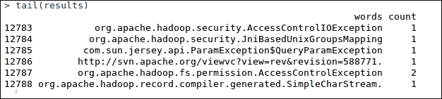

# 第三章. R 与 Hadoop 的集成

从前两章我们获取了关于如何安装 R 与 Hadoop 工具的基本信息。同时，我们也了解了 Hadoop 的关键特性以及为什么它们与 R 集成，用于解决大数据业务问题。因此，借助 R 与 Hadoop 的集成，我们可以将数据分析提升到大数据分析的层面。这两个中间件仍在不断改进，以便彼此兼容使用。

在第二章，*编写 Hadoop MapReduce 程序*中，我们学习了如何在 Hadoop 中编写 MapReduce 程序。在本章中，我们将学习如何在 R 中开发在 Hadoop 集群上运行的 MapReduce 程序。本章将提供关于 R 和 Hadoop 以及 RHIPE 和 RHadoop 的开发教程。安装 R 和 Hadoop 后，我们将看到如何通过简单步骤将 R 与 Hadoop 进行集成。

在我们开始安装之前，先来看看 R 与 Hadoop 集成在组织中的优势。由于统计学家和数据分析师常常使用 R 工具进行数据探索和数据分析，Hadoop 集成为处理大规模数据提供了极大的便利。同样，使用 Hadoop 工具（如系统）来组织数据仓库的数据工程师，可以通过与 R 工具的集成，执行逻辑分析操作，从而获得可操作的有价值的洞见。

因此，这些基于数据的工具和技术的集成可以构建一个强大且可扩展的系统，具备两者的特性。


将 R 与 Hadoop 连接的三种方式如下：

+   RHIPE

+   RHadoop

+   Hadoop 流式处理

在本章中，我们将学习使用 RHIPE 和 RHadoop 进行集成与分析。Hadoop 流式处理将在第四章，*使用 Hadoop 流式处理与 R*中讲解。

# 介绍 RHIPE

**RHIPE**代表**R 和 Hadoop 集成编程环境**。正如在[`www.datadr.org/`](http://www.datadr.org/)上所提到的，它在希腊语中意为“瞬间”，是 R 与 Hadoop 的结合体。它最初由*Saptarshi Guha*为其在普渡大学统计系的博士论文于 2012 年开发。现在由普渡大学统计系团队及其他活跃的 Google 讨论组进行维护。

RHIPE 包使用**分割与重组合**技术对大数据进行数据分析。在此技术中，数据被划分为子集，针对这些子集执行特定的 R 分析操作，最后将输出结果合并。RHIPE 主要旨在实现以下两个目标：

+   让你能够对大数据和小数据进行深入分析。

+   允许用户使用较低级语言在 R 中执行分析操作。RHIPE 设计有多个函数，可帮助在简单的 R 控制台中执行 **Hadoop 分布式文件系统**（**HDFS**）以及 MapReduce 操作。

RHIPE 是与 HDFS 和 MapReduce 操作相比较的较低级接口。使用最新支持的 RHIPE 版本 0.73.1，文件名为 `Rhipe_0.73.1-2.tar.gz`。

## 安装 RHIPE

由于 RHIPE 是 R 和 Hadoop 的连接器，我们需要按照以下顺序在我们的机器或集群中安装 Hadoop 和 R：

1.  安装 Hadoop。

1.  安装 R。

1.  安装协议缓冲区。

1.  设置环境变量。

1.  安装 rJava。

1.  安装 RHIPE。

让我们开始安装。

### 安装 Hadoop

由于我们在这里要将 R 和 Hadoop 与 RHIPE 包库集成，因此需要在我们的机器上安装 Hadoop。这将是一个单节点或多节点安装，具体取决于要分析的数据大小。

由于我们已经学会了如何在 Ubuntu 上安装 Hadoop，我们在此不再重复该过程。如果您尚未安装，请参阅 第一章，*准备使用 R 和 Hadoop*，以获取指导。

### 安装 R

如果我们使用多节点 Hadoop 架构，则有多个 TaskTracker 节点用于执行 MapReduce 作业。因此，我们需要在所有这些 TaskTracker 节点上安装 R。这些 TaskTracker 节点将根据键值对的考虑，使用开发的映射和减少逻辑启动数据子集的过程。

### 安装协议缓冲区

协议缓冲区只需将数据序列化，使其平台无关、中立和健壮（主要用于结构化数据）。Google 使用相同的协议进行数据交换。RHIPE 依赖于协议缓冲区 2.4.1 以进行网络上的数据序列化。

可以使用以下命令安装：

```py
## For downloading the protocol buffer 2.4.1
wget http://protobuf.googlecode.com/files/protobuf-2.4.1.tar.gz

## To extracting the protocol buffer
tar -xzf protobuf-2.4.1.tar.gz

## To get in to the extracted protocol buffer directory
cd protobuf-2.4.1

## For making install the protocol buffer
./configure # --prefix=...
make
make install

```

### 环境变量

为了使 RHIPE 能够正确编译和工作，最好确保以下环境变量设置正确：

为了配置 Hadoop 库，我们需要将两个变量 `PKG_CONFIG_PATH` 和 `LD_LIBRARY_PATH` 设置到 `hduser`（Hadoop 用户）的 `~./bashrc` 文件中，以便在用户登录系统时自动设置。

这里，`PKG_CONFIG_PATH` 是一个环境变量，保存了系统中安装库的 `pkg-config` 脚本路径，而 `LD_LIBRARY_PATH` 是一个环境变量，保存了本地共享库的路径。

```py
export PKG_CONFIG_PATH = /usr/local/lib
export LD_LIBRARY_PATH = /usr/local/lib

```

您还可以从 R 控制台设置所有这些变量，如下所示：

```py
Sys.setenv(HADOOP_HOME="/usr/local/hadoop/")
Sys.setenv(HADOOP_BIN="/usr/local/hadoop/bin")
Sys.setenv(HADOOP_CONF_DIR="/usr/local/hadoop/conf")

```

其中 `HADOOP_HOME` 用于指定 Hadoop 目录的位置，`HADOOP_BIN` 用于指定 Hadoop 二进制文件的位置，`HADOOP_CONF_DIR` 用于指定 Hadoop 配置文件的位置。

设置变量是临时的，并且在特定的 R 会话期间有效。如果我们希望在每次 R 会话初始化时自动初始化这些变量，使其永久有效，我们需要将这些变量设置到 `/etc/R/Renviron` 文件中，就像在特定用户配置文件的 `.bashrc` 中设置环境变量一样。

### rJava 包安装

由于 RHIPE 是一个 Java 包，它充当 R 和 Hadoop 之间的 Java 桥梁。RHIPE 将输入数据序列化为 Java 类型，这些数据需要在集群上序列化。它需要一个低级的 Java 接口，而这一接口由 rJava 提供。因此，我们将安装 rJava 以启用 RHIPE 的功能。

```py
## For installing the rJava Package will be used for calling java libraries from R.
install.packages("rJava")

```

### 安装 RHIPE

现在，是时候从 RHIPE 的软件库安装 RHIPE 包了。

```py
## Downloading RHIPE package from RHIPE repository
Wget http://ml.stat.purdue.edu/rhipebin/Rhipe_0.73.1-2.tar.gz

## Installing the RHIPE package in R via CMD command
R CMD INSTALL Rhipe_0.73.1.tar.gz

```

现在，我们已准备好一个 RHIPE 系统，可以使用 R 和 Hadoop 执行数据分析。

## 理解 RHIPE 的架构

让我们理解 RHIPE 库包的工作原理，RHIPE 被开发出来用于将 R 和 Hadoop 集成，以进行高效的大数据分析。


RHIPE 的组件

有许多 Hadoop 组件将用于与 R 和 Hadoop 的数据分析操作。

RHIPE 的组件如下：

+   **RClient**：RClient 是一个 R 应用程序，它调用 **JobTracker** 来执行作业，并指示多个 MapReduce 作业资源，如 Mapper、Reducer、输入格式、输出格式、输入文件、输出文件以及其他能处理 MapReduce 作业的参数。

+   **JobTracker**：JobTracker 是 Hadoop MapReduce 操作的主节点，负责初始化并监控 Hadoop 集群上的 MapReduce 作业。

+   **TaskTracker**：TaskTracker 是 Hadoop 集群中的一个从节点，负责根据 JobTracker 的指令执行 MapReduce 作业，获取输入数据块，并在其上运行 R 特定的 `Mapper` 和 `Reducer`。最终，输出将被写入 HDFS 目录。

+   **HDFS**：HDFS 是一个分布式文件系统，部署在 Hadoop 集群上，包含多个数据节点。它为各种数据操作提供数据服务。

## 理解 RHIPE 示例

在本节中，我们将创建两个 RHIPE MapReduce 示例。这两个示例通过 RHIPE 包中的基本 Hadoop MapReduce 作业功能来定义。

### RHIPE 示例程序（仅 Map 阶段）

MapReduce 问题定义：这个 MapReduce 示例程序的目标是通过在 Hadoop 环境中使用 `min` 和 `max` 函数对数值数据进行测试，以验证 RHIPE 的安装。由于这是一个示例程序，我们只包含了 Map 阶段，并将其输出存储在 HDFS 目录中。

要开始使用 RHIPE 开发，我们需要通过加载库并调用 `rhinit()` 方法来初始化 RHIPE 子系统。

```py
## Loading the RHIPE library
library(Rhipe)

## initializing the RHIPE subsystem, which is used for everything. RHIPE will not work if rhinit is not called.
rhinit()

```

输入：我们插入一个数值，而不是使用文件作为输入。

Map 阶段：该 MapReduce 程序的 Map 阶段将调用 10 次不同的迭代，在每次迭代中，根据迭代次数生成 1 到 10 之间的随机数。之后，将计算这些生成的数值的最大值和最小值。

```py
## Defining the Map phase

Map(function(k,v){

## for generating the random deviates
 X  runif(v)

## for emitting the key-value pairs with key – k and
## value – min and max of generated random deviates.
 rhcollect(k, c(Min=min(x),Max=max(x))
}

```

输出：最终，Map 阶段的输出将作为此 MapReduce 作业的输出，并将存储到 HDFS 中的`/app/hadoop/RHIPE/`路径下。

通过 RHIPE 包的`rhwatch()`方法定义 MapReduce 作业：

```py
## Create and running a MapReduce job by following
job = rhwatch(map=map,input=10,reduce=0,
output="/app/Hadoop/RHIPE/test",jobname='test')

```

从 HDFS 读取 MapReduce 输出：

```py
## Read the results of job from HDFS
result <- rhread(job)

```

要以更可读的表格格式显示结果，请使用以下代码：

```py
## Displaying the result
outputdata  <- do.call('rbind', lapply(result, "[", 2))

```

输出：

![RHIPE 示例程序（仅 Map）### 单词计数 MapReduce 问题定义：此 RHIPE MapReduce 程序的目的是识别提供的输入文本文件中所有单词的频率。还请注意，这与我们在第二章中看到的 MapReduce 问题相同，*编写 Hadoop MapReduce 程序*。```py## Loading the RHIPE Librarylibrary(Rhipe)```输入：我们将使用随 Hadoop 分发包提供的`CHANGES.txt`文件，并将其与此 MapReduce 算法一起使用。通过以下命令，我们将其复制到 HDFS：```pyrhput("/usr/local/hadoop/CHANGES.txt","/RHIPE/input/")```Map 阶段：Map 阶段包含读取文件中所有单词并将其赋值为`1`的代码。```py## Defining the Map functionw_map<-expression({ words_vector<-unlist(strsplit(unlist(map.values)," ")) lapply(words_vector,function(i) rhcollect(i,1))})```Reduce 阶段：通过这个 reduce 任务，我们可以计算输入文本文件中单词的总频率。```py## For reference, RHIPE provides a canned versionReduce = rhoptions()$templates$scalarsummer## Defining the Reduce functionw_reduce<-expression(pre={total=0},reduce={total<-sum(total,unlist(reduce.values))},post={rhcollect(reduce.key,total)})```定义 MapReduce 作业对象：在定义了单词计数的 mapper 和 reducer 后，我们需要设计`driver`方法，依次调用`Mapper`和`Reducer`来执行此 MapReduce 作业。```py## defining and executing a MapReduce job objectJob1 <- rhwatch(map=w_map,reduce=w_reduce, ,input="/RHIPE/input/",output="/RHIPE/output/", jobname="word_count")```读取 MapReduce 输出：```py## for reading the job output data from HDFSOutput_data <- rhread(Job1)results <- data.frame(words=unlist(lapply(Output_data,"[",1)), count =unlist(lapply(Output_data,"[[",2)))```MapReduce 作业的输出将存储到`output_data`，我们将把这个输出转换为 R 支持的数据框格式。数据框输出将存储到`results`变量中。为了以数据框格式显示 MapReduce 输出，格式如下：`head (results)`的输出：![单词计数`tail (results)`的输出：

## 理解 RHIPE 函数参考

RHIPE 特别设计为提供 Hadoop 的低级接口。因此，拥有 RHIPE 包的 R 用户可以轻松地对存储在 HDFS 上的大数据集执行 Hadoop 数据操作，就像在 R 中调用`print()`函数一样。

现在我们将看到 RHIPE 库中所有方法的所有可能功能用法。所有这些方法都分为三类：初始化、HDFS 和 MapReduce 操作。

### 初始化

我们使用以下命令进行初始化：

+   `rhinit`：用于初始化 Rhipe 子系统。

    `rhinit(TRUE,TRUE)`

### HDFS

我们使用以下命令进行 HDFS 操作：

+   `rhls`：用于从 HDFS 检索所有目录。

    其语法为`rhls(path)`

    `rhls("/")`

    输出：

    

+   `hdfs.getwd`：用于获取当前工作 HDFS 目录。其语法为 `hdfs.getwd()`。

+   `hdfs.setwd`：用于设置当前工作 HDFS 目录。其语法为 `hdfs.setwd("/RHIPE")`

+   `rhput`：用于将文件从本地目录复制到 HDFS。其语法为 `rhput(src,dest)` 和 `rhput("/usr/local/hadoop/NOTICE.txt","/RHIPE/")`。

+   `rhcp`：用于将文件从一个 HDFS 位置复制到另一个 HDFS 位置。其语法为 `rhcp('/RHIPE/1/change.txt','/RHIPE/2/change.txt')`。

+   `rhdel`：用于从 HDFS 删除目录/文件。其语法为 `rhdel("/RHIPE/1")`。

+   `rhget`：用于将 HDFS 文件复制到本地目录。其语法为 `rhget("/RHIPE/1/part-r-00000", "/usr/local/")`。

+   `rwrite`：用于将 R 数据写入 HDFS。其语法为 `rhwrite(list(1,2,3),"/tmp/x")`。

### MapReduce

我们使用以下命令进行 MapReduce 操作：

+   `rhwatch`：用于准备、提交并监控 MapReduce 作业。

    ```py
    # Syntax:
    rhwatch(map, reduce, combiner, input, output, mapred,partitioner,mapred, jobname)

    ## to prepare and submit MapReduce job:

    z=rhwatch(map=map,reduce=0,input=5000,output="/tmp/sort",mapred=mapred,read=FALSE)

    results <- rhread(z)

    ```

+   `rhex`：用于从 Hadoop 集群上执行 MapReduce 作业。

    ```py
    ## Submit the job
    rhex(job)

    ```

+   `rhjoin`：用于检查 MapReduce 作业是否已完成。其语法为 `rhjoin(job)`。

+   `rhkill`：用于终止正在运行的 MapReduce 作业。其语法为 `rhkill(job)`。

+   `rhoptions`：用于获取或设置 RHIPE 配置选项。其语法为 `rhoptions()`。

+   `rhstatus`：用于获取 RHIPE MapReduce 作业的状态。其语法为 `rhstatus(job)`。

    ```py
    rhstatus(job, mon.sec = 5, autokill = TRUE,showErrors = TRUE, verbose = FALSE, handler = NULL)

    ```

# 介绍 RHadoop

RHadoop 是一个包含三个 R 包的集合，用于在 R 环境中提供大数据操作。它由 Revolution Analytics 开发，Revolution Analytics 是基于 R 的商业软件的领先提供商。RHadoop 提供三个主要的 R 包：`rhdfs`、`rmr` 和 `rhbase`。每个包提供不同的 Hadoop 功能。

+   `rhdfs` 是一个 R 接口，提供从 R 控制台访问 HDFS 的功能。由于 Hadoop MapReduce 程序将输出写入 HDFS，因此通过调用 `rhdfs` 方法，可以轻松访问它们。R 程序员可以轻松地对分布式数据文件执行读写操作。基本上，`rhdfs` 包通过后台调用 HDFS API 来操作存储在 HDFS 上的数据源。

+   `rmr` 是一个 R 接口，用于在 R 环境内提供 Hadoop MapReduce 功能。因此，R 程序员只需要将应用逻辑分为 map 和 reduce 阶段，并使用 `rmr` 方法提交。之后，`rmr` 会调用 Hadoop streaming MapReduce API，输入参数包括输入目录、输出目录、mapper、reducer 等，来在 Hadoop 集群上执行 R MapReduce 作业。

+   `rhbase` 是一个 R 接口，用于通过 Thrift 服务器操作存储在分布式网络上的 Hadoop HBase 数据源。`rhbase` 包设计了多个方法，用于初始化、读写和表操作。

在这里，运行 Hadoop MapReduce 操作并不一定需要安装所有三个 RHadoop 包。如果我们将输入数据源存储在 HBase 数据源中，我们需要安装 `rhbase`；否则，我们需要 `rhdfs` 和 `rmr` 包。由于 Hadoop 主要因其两个主要特性——Hadoop MapReduce 和 HDFS——而广受欢迎，这两个特性将在 R 控制台中通过 RHadoop 的 `rhdfs` 和 `rmr` 包得到应用。这些包足以在 R 中运行 Hadoop MapReduce。基本上，`rhdfs` 提供 HDFS 数据操作，而 `rmr` 提供 MapReduce 执行操作。

RHadoop 还包括另一个名为 `quick check` 的包，用于调试由 `rmr` 包定义的 MapReduce 作业。

在接下来的部分，我们将看到它们的架构关系以及安装步骤。

## 理解 RHadoop 架构

由于 Hadoop 因 HDFS 和 MapReduce 而非常受欢迎，Revolution Analytics 开发了单独的 R 包，即 `rhdfs`、`rmr` 和 `rhbase`。RHadoop 的架构如以下图所示：


RHadoop 生态系统

## 安装 RHadoop

本节将介绍三个 RHadoop 包的安装技巧以及它们的前提条件。

+   **R 和 Hadoop 安装**：由于我们将使用 R 和 Hadoop 集成的环境，因此需要在计算机上安装 Hadoop 和 R。如果尚未安装，请参阅 第一章，*准备使用 R 和 Hadoop*。如我们所知，如果数据量过大，需要通过增加节点数来扩展集群。基于此，为了在系统上安装 RHadoop，我们需要根据数据的大小安装单节点或多节点 Hadoop。

    RHadoop 已经在 Cloudera、Hortonworks 和 MapR 提供的多个 Hadoop 发行版上进行了测试。

+   **安装 R 包**：我们需要安装多个 R 包，它们帮助 R 与 Hadoop 连接。包的列表如下：

    +   rJava

    +   RJSONIO

    +   itertools

    +   digest

    +   Rcpp

    +   httr

    +   functional

    +   devtools

    +   plyr

    +   reshape2

    我们可以通过在 R 控制台中执行以下 R 命令来安装它们：

    ```py
    install.packages( c('rJava','RJSONIO', 'itertools', 'digest','Rcpp','httr','functional','devtools', 'plyr','reshape2'))

    ```

+   **设置环境变量**：我们可以通过 R 控制台使用以下代码来设置环境变量：

    ```py
    ## Setting HADOOP_CMD
    Sys.setenv(HADOOP_CMD="/usr/local/hadoop/bin/hadoop")

    ## Setting up HADOOP_STREAMING
    Sys.setenv(HADOOP_STREAMING="/usr/local/hadoop/contrib/streaming/hadoop-streaming-1.0.3.jar")

    ```

    或者，我们也可以通过命令行设置 R 控制台，如下所示：

    ```py
    export HADOOP_CMD=/usr/local/Hadoop
    export HADOOP_STREAMING=/usr/lib/hadoop-0.20-mapreduce/contrib/streaming/hadoop-streaming-2.0.0-mr1-cdh4.1.1.jar

    ```

+   安装 RHadoop [`rhdfs`，`rmr`，`rhbase`]

    1.  从 Revolution Analytics 的 GitHub 仓库下载 RHadoop 软件包：[`github.com/RevolutionAnalytics/RHadoop`](https://github.com/RevolutionAnalytics/RHadoop)。

        +   `rmr`：[`rmr-2.2.2.tar.gz`]

        +   `rhdfs`：[`rhdfs-1.6.0.tar.gz`]

        +   `rhbase`：[`rhbase-1.2.0.tar.gz`]

    1.  安装软件包。

        +   对于 rmr，我们使用：

            ```py
            R CMD INSTALL rmr-2.2.2.tar.gz

            ```

        +   对于 `rhdfs`，我们使用：

            ```py
            R CMD INSTALL rmr-2.2.2.tar.gz

            ```

        +   对于 `rhbase`，我们使用：

            ```py
            R CMD INSTALL rhbase-1.2.0.tar.gz

            ```

        ### 提示

        要安装 rhbase，我们需要在 Hadoop 集群上安装 HBase 和 Zookeeper。

### 理解 RHadoop 示例

一旦完成 RHadoop 的安装，我们可以通过运行 RHadoop 示例程序中的`rmr2`和`rhdfs`库来测试设置，如下所示：

```py
## loading the libraries
library(rhdfs')
library('rmr2')

## initializing the RHadoop
hdfs.init()

# defining the input data
small.ints = to.dfs(1:10)

## Defining the MapReduce job
mapreduce(
# defining input parameters as small.ints hdfs object, map parameter as function to calculate the min and max for generated random deviates.
  input = small.ints, 
  map = function(k, v)
  {
lapply(seq_along(v), function(r){

  x <- runif(v[[r]])
    keyval(r,c(max(x),min(x))) 
  })}) 

```

运行这些代码行后，按下*Ctrl* + *Enter*将执行此 MapReduce 程序。如果成功，最后一行将如下面的截图所示：


那一行字符表示 MapReduce 作业的输出位置。

要读取已执行 MapReduce 作业的结果，复制最后一行提供的输出位置，并将其传递给`rhdfs`的`from.dfs()`函数。


其中，前一输出的第一列表示最大值，第二列表示最小值。

#### 单词计数

MapReduce 问题定义：这个 RHadoop MapReduce 程序定义了识别提供的输入文本文件中所有单词频率的任务。

同样，请注意，这是我们在第二章 *编写 Hadoop MapReduce 程序*中学习的相同 MapReduce 问题。

```py
wordcount = function(input, output = NULL, pattern = " "){

```

Map 阶段：这个`map`函数将逐行读取文本文件并按空格拆分。这个 Map 阶段将给所有被映射器捕获的单词分配`1`作为值。

```py
wc.map = function(., lines) {
 keyval(
 unlist(
 strsplit(
 x = lines,
 split = pattern)),
 1)}

```

Reduce 阶段：Reduce 阶段将通过对具有相同键的单词进行求和操作来计算所有单词的总频率。

```py
wc.reduce = function(word, counts ) {
 keyval(word, sum(counts))}

```

定义 MapReduce 作业：在定义完单词计数的映射器和归约器之后，我们需要创建`driver`方法来启动 MapReduce 的执行。

```py
# To execute the defined Mapper and Reducer functions
# by specifying the input, output, map, reduce and input.format as parameters.

# Syntax:
# mapreduce(input, output, input.format, map,reduce,
# combine)

mapreduce(input = input ,
 output = output,
 input.format = "text",
 map = wc.map,
 reduce = wc.reduce,
 combine = T)}

```

执行 MapReduce 作业：我们将通过传递输入数据位置作为`wordcount`函数的参数来执行 RHadoop MapReduce 作业。

```py
wordcount('/RHadoop/1/')

```

探索`wordcount`输出：

```py
from.dfs("/tmp/RtmpRMIXzb/file2bda5e10e25f")

```

### 理解 RHadoop 函数参考

RHadoop 有三个不同的包，分别用于 HDFS、MapReduce 和 HBase 操作，以便对数据执行操作。

在这里，我们将看到如何使用`rmr`和`rhdfs`包中的函数：

#### hdfs 包

分类函数如下：

+   初始化

    +   `hdfs.init`：用于初始化`rhdfs`包。其语法为`hdfs.init()`。

    +   `hdfs.defaults`：用于检索和设置`rhdfs`的默认值。其语法为`hdfs.defaults()`。

    要检索`hdfs`配置的默认值，请参考以下截图：

    

+   文件操作

    +   `hdfs.put`：用于将文件从本地文件系统复制到 HDFS 文件系统。

        ```py
        hdfs.put('/usr/local/hadoop/README.txt','/RHadoop/1/')

        ```

    +   `hdfs.copy`：用于将文件从 HDFS 目录复制到本地文件系统。

        ```py
        hdfs.put('/RHadoop/1/','/RHadoop/2/')

        ```

    +   `hdfs.move`：用于将文件从一个 HDFS 目录移动到另一个 HDFS 目录。

        ```py
        hdfs.move('/RHadoop/1/README.txt','/RHadoop/2/')

        ```

    +   `hdfs.rename`：用于重命名存储在 HDFS 中的文件（从 R 中进行操作）。

        ```py
        hdfs.rename('/RHadoop/README.txt','/RHadoop/README1.txt')

        ```

    +   `hdfs.delete`：用于从 R 中删除 HDFS 文件或目录。

        ```py
        hdfs.delete("/RHadoop")

        ```

    +   `hdfs.rm`：用于从 R 中删除 HDFS 文件或目录。

        ```py
        hdfs.rm("/RHadoop")

        ```

    +   `hdfs.chmod`：用于更改某些文件的权限。

        ```py
        hdfs.chmod('/RHadoop', permissions= '777')

        ```

+   文件读/写：

    +   `hdfs.file`：用于初始化文件，以便进行读/写操作。

        ```py
        f = hdfs.file("/RHadoop/2/README.txt","r",buffersize=104857600)

        ```

    +   `hdfs.write`：用于通过流写入存储在 HDFS 中的文件。

        ```py
        f = hdfs.file("/RHadoop/2/README.txt","r",buffersize=104857600)
        hdfs.write(object,con,hsync=FALSE)

        ```

    +   `hdfs.close`：用于在文件操作完成后关闭流。它会关闭流并且不允许进一步的文件操作。

        ```py
        hdfs.close(f)

        ```

    +   `hdfs.read`：用于从 HDFS 目录中的二进制文件中读取。这将使用流来反序列化数据。

        f = hdfs.file("/RHadoop/2/README.txt","r",buffersize=104857600)

        m = hdfs.read(f)

        c = rawToChar(m)

        print(c)

+   目录操作：

    +   `hdfs.dircreate` 或 `hdfs.mkdir`：这两个函数用于在 HDFS 文件系统上创建目录。

        ```py
        hdfs.mkdir("/RHadoop/2/")

        ```

    +   `hdfs.rm` 或 `hdfs.rmr` 或 `hdfs.delete` - 用于从 HDFS 删除目录或文件。

        ```py
        hdfs.rm("/RHadoop/2/")

        ```

+   工具：

    +   `hdfs.ls`：用于列出 HDFS 中的目录。

        ```py
        Hdfs.ls('/')

        ```

        

    +   `hdfs.file.info`：用于获取存储在 HDFS 中的文件的元信息。

        ```py
        hdfs.file.info("/RHadoop")

        ```

    

#### rmr 包

这些函数的类别如下：

+   对于数据存储和检索：

    +   `to.dfs`：用于从文件系统中写入或写出 R 对象。

        small.ints = to.dfs(1:10)

    +   `from.dfs`：用于读取以二进制加密格式存储在 HDFS 文件系统中的 R 对象。

        from.dfs('/tmp/RtmpRMIXzb/file2bda3fa07850')

+   对于 MapReduce：

    +   `mapreduce`：用于定义和执行 MapReduce 任务。

        mapreduce(input, output, map, reduce, combine, input.fromat, output.format, verbose)

    +   `keyval`：用于创建和提取键值对。

        keyval(key, val)

# 总结

由于 RHadoop 被认为是成熟的，我们将在后续章节中进行数据分析时考虑它。在第五章，《*学习 R 和 Hadoop 的数据分析*》和第六章，《*理解机器学习的大数据分析*》中，我们将深入探讨一些大数据分析技术，并看到如何使用 RHadoop 解决现实世界中的问题。到目前为止，我们已经学习了如何使用 RHIPE 和 RHadoop 编写 MapReduce 程序。在下一章中，我们将看到如何使用 Hadoop 流式工具和 Hadoop 流式 R 包编写 Hadoop MapReduce 程序。
